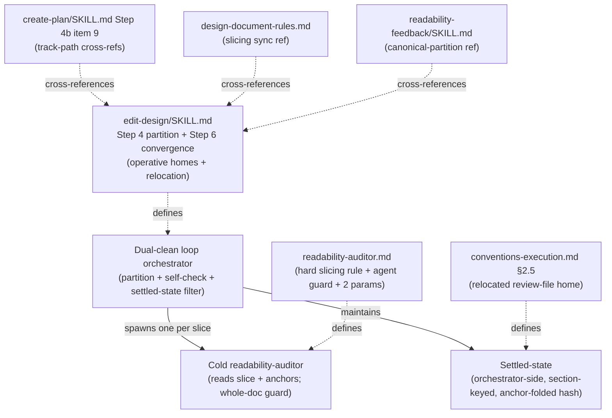

<!-- workflow-sha: 1065c173addca97b35fda8af611eb1e656e3ada2 -->
# Harden readability-auditor slicing and convergence

## Design Document
[design.md](design.md)

## Component Map

The change touches one control-flow protocol — the dual-clean review-iteration
loop — and the files that describe it. The orchestrator and the cold auditor are
the runtime components; the six files are where the rules live.

- **edit-design/SKILL.md** — the operative home: Step 4 carries the partition
  algorithm and the relocated params home; Step 6 carries the canonical
  convergence-mechanism statement and the relocated resume glob.
- **readability-auditor.md** — the agent: "range-sliced" becomes a hard
  requirement plus the whole-doc guard, fed by two new params (`slice_count`,
  `total_lines`).
- **conventions-execution.md §2.5** — generalizes the third-scope review-file
  home to cover the Phase-1 authoring loop (the relocation target).
- **create-plan / design-document-rules / readability-feedback** — consumers
  that cross-reference the canonical homes above; no rule is duplicated.

## Checklist
- [ ] Track 1: Harden readability-auditor slicing and convergence
  > Make the design-path auditor fan-out a deterministic orchestrator
  > obligation with an agent-side collapse guard, give the dual-clean loop
  > orchestrator-side section-keyed settled-state so it stops re-flagging
  > settled prose while the auditor stays fully cold, and relocate the
  > Phase-1 authoring-loop files from `plan/` to `_workflow/reviews/`. All
  > edits route through §1.7 full staging.
  > **Scope:** ~6 files covering edit-design Step 4/6, readability-auditor.md, conventions-execution §2.5, create-plan Step 4b item 9, design-document-rules.md, readability-feedback.md
