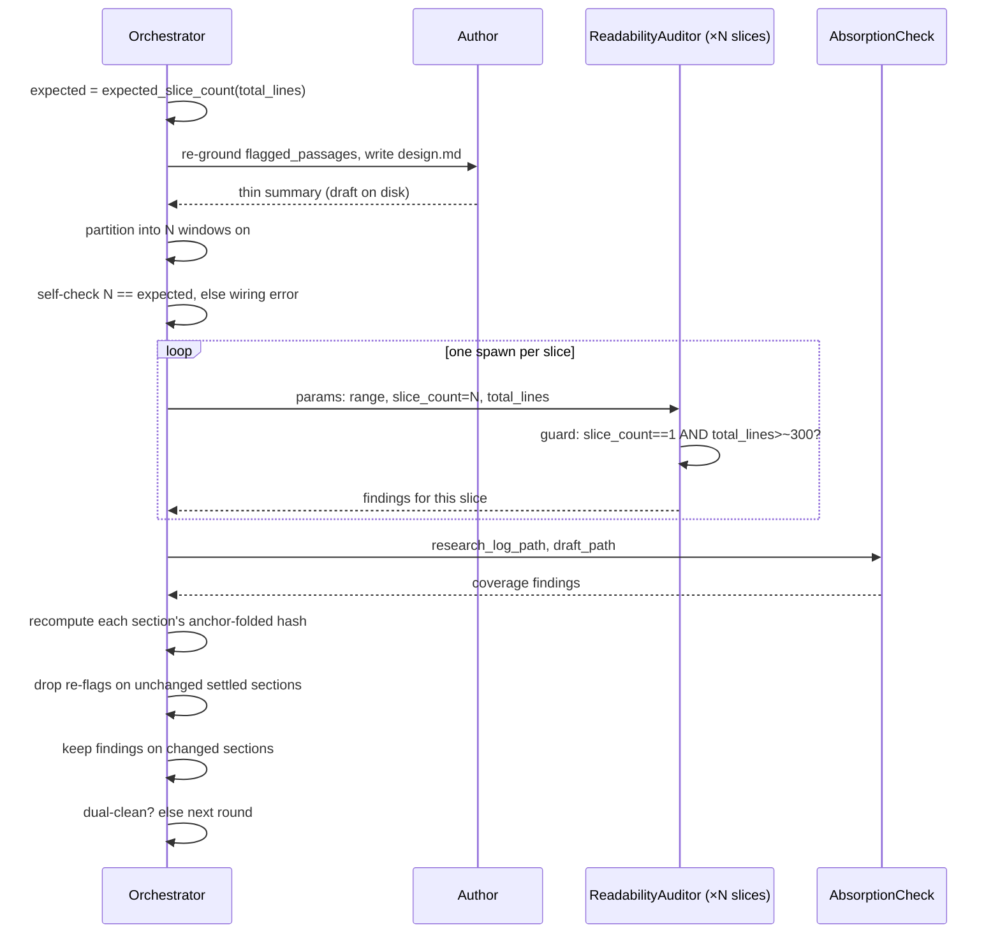

<!-- workflow-sha: 1065c173addca97b35fda8af611eb1e656e3ada2 -->
# Track 1: Harden readability-auditor slicing and convergence

## Purpose / Big Picture
<!-- AUTHOR: one-line BLUF (user-visible behavior gained), then the intro paragraph. -->

**The readability-auditor fan-out stops under-catching on long design docs and stops oscillating across rounds, so the dual-clean review loop converges instead of re-flagging prose it already settled.**

The in-loop `readability-auditor` is the cold sub-agent that reads a slice of `design.md` (or a track file) with no prior context and reports every passage a mid-level developer cannot follow. On the design path it has two defects. First, its fan-out is unenforced: the orchestrator is told the auditor "is range-sliced" but is handed no partition rule, no slice count, and no floor — so it can run a single whole-doc spawn over a 700-line `design.md` and read each passage too shallowly to catch real findings. Second, the auditor is a stateless cold spawn every round, so the dual-clean loop (which iterates until both the readability auditor and the absorption check report a clean round) re-runs already-settled prose past a fresh reader each round and oscillates instead of converging. The originating issue (YTDB-1158) measured the oscillation: finding counts ran 13 → 8 → 3 → 8 across rounds, and one slice swung from 0 findings to 5 on byte-identical prose.

This track hardens three things, all as workflow-prose edits routed through §1.7 full staging (the edits land under `_workflow/staged-workflow/.claude/...` and a Phase 4 promotion commit copies them live). It makes the design-path slice partition a **deterministic orchestrator obligation** with an agent-side guard against the collapse-to-one-slice case (Concern A); it adds **orchestrator-side section-keyed settled-state** that drops re-flags on unchanged settled sections while the auditor stays fully cold (Concern B); and it **relocates** every Phase-1 authoring-loop params and review file from `_workflow/plan/` into `_workflow/reviews/`, so `plan/` holds only `track-N.md` artifacts (Concern C). All three touch the same handful of workflow files, so they ship as one reviewable diff.

<!-- Reserved for Move 2 — ADDED/MODIFIED/REMOVED triad. Empty until Move 2 lands. -->

## Progress
- [x] Review + decomposition
- [ ] Step implementation
- [ ] Track-level code review
- [ ] Track completion
- [x] 2026-06-25T16:11Z [ctx=info] Review + decomposition complete

## Surprises & Discoveries
<!-- Continuous-log. Empty at Phase 1. -->

## Decision Log
<!-- The track-canonical live decision carrier (D7-workflow). Phase 1 seeds the
full inline Decision Records this track owns, seeded from the frozen design.md
D-records. AUTHOR: fill each four-bullet body from the cited design section. -->

#### D1: Deterministic design-path slice partition is a prose orchestrator obligation
<!-- AUTHOR: Alternatives considered / Rationale / Risks-Caveats / Implemented-in.
     Seed from design.md §"Deterministic design-path slice partition" and
     §"Verifiable spawn count without a script". The partition: ~200-line windows
     on ##/# Part boundaries, cap ~6, one auditor per window, whole-doc floor
     above ~300 lines; expected-slice-count self-check, no helper script. -->
The design-path auditor fan-out becomes a mandatory deterministic prose rule, ported from the existing `/readability-feedback` partition: split `design.md` into ~200-line windows aligned on `##` / `# Part` heading boundaries, cap at ~6 windows, spawn exactly one auditor per window, and never emit a single whole-doc slice for a doc over ~300 lines. The orchestrator computes the expected slice count from values it already holds (total line count, the ~200-line window, the ~6 cap), spawns exactly that many auditors, and self-checks `slices_spawned == expected_slice_count`. On a mismatch it surfaces a **wiring error** — it stops and reports the bad slice count rather than proceeding with the wrong fan-out.

- **Alternatives considered**: A helper script that emits the slice ranges. A script would be truly deterministic, would give free spawn-count verifiability, and would share one rule definition between `/readability-feedback` and the in-loop path. Rejected for lightness — the user chose the prose obligation over new script-plus-test machinery, and the prose rule already matches the track path's existing style ("one spawn per `track-N.md`").
- **Rationale**: This is the exact partition that produced the 5-slice fan-out the issue cites as the run that caught the misses, so it is proven on this document shape. Stating it as a prose obligation (not a knob or a script) keeps the rule where the orchestrator acts and adds no machinery. The issue's point-3 asks for a "verifiable spawn count" and explicitly accepts a stated orchestrator obligation as an alternative to a check, so the deterministic compute-then-self-check satisfies the requirement at the obligation level.
- **Risks/Caveats**: A stated obligation can be violated silently if the orchestrator collapses the fan-out — the self-check is the orchestrator's own assertion and is not visible to the auditor. That gap is closed by the agent-side guard (D2), which detects the collapse from inside the auditor. The self-check and the guard enforce the floor independently; this is a deliberate redundant double-check, not a redundancy bug. The two layers are not coextensive: the agent-side guard fires only on the *total* collapse (`slice_count == 1 AND total_lines > ~300`), so the orchestrator self-check is the sole catcher of a *partial* collapse (e.g. 2 slices where the partition demands 5). The redundancy is full for the total-collapse case and self-check-only for a partial-count mismatch — Step 4 states this so a reader does not over-trust the guard as covering every fan-out error. The whole-doc floor is a property of the 200-line window (any doc over ~250 lines yields ≥2 windows), restated as a hard invariant so a reader cannot misread the rule as permitting a single slice.
- **Implemented in**: this track (edit-design Step 4 operative home)
- **Full design**: design.md §"Deterministic design-path slice partition"

#### D2: File distribution and the agent-side whole-doc guard
<!-- AUTHOR: seed from design.md §"The agent-side whole-doc guard". Operative
     algorithm in edit-design Step 4; readability-auditor.md gains the hard
     requirement + the guard (slice_count == 1 AND total_lines > ~300) made
     computable by two new params (slice_count, total_lines); create-plan,
     design-document-rules, readability-feedback cross-reference. -->
The rule is distributed across files rather than centralized. The operative partition algorithm (D1) lives in `edit-design` Step 4 § auditor, because the orchestrator reads Step 4 when spawning and never reads the agent's `.md` file. `readability-auditor.md` turns "Range-sliced fan-out" from a description into a hard requirement and adds a guard: the auditor flags a wiring error when its params say `slice_count == 1 AND total_lines > ~300`. The orchestrator's partition is the primary enforcement; the agent guard is the secondary detector. Because the cold auditor's read-scope (S1) bars it from learning the document's total length, the orchestrator passes `slice_count` and `total_lines` as two new params fields so the guard is computable. The other three files cross-reference the shared principle: `create-plan` Step 4b item 9 (per-file unit on the track path), `design-document-rules.md` (which documents the design cold-read mechanics but carries no slicing statement today, so it gains a one-line cross-reference to the canonical slicing home in its `### Cold-read sub-agent prompt` section), and `/readability-feedback` (so the standalone tool and the in-loop path cannot drift on window size or cap). The `/readability-feedback` cross-reference couples the partition **value only** — window size, boundary set, and cap — because that tool fans out `general-purpose` sub-agents with a self-contained inline prompt, not the `readability-auditor` agent; it therefore adopts neither the agent-side whole-doc guard nor the new `slice_count` / `total_lines` params (its sub-agents take no params file).

- **Alternatives considered**: (1) A single canonical home inside `readability-auditor.md` — rejected because the orchestrator never reads the agent file, so the operative algorithm cannot live there alone. (2) Duplicating the full rule verbatim in each file — rejected for drift risk.
- **Rationale**: The partition algorithm must live where the orchestrator acts (Step 4), and the guard must live where it runs (inside the agent). The guard recovers most of the issue's point-3 "detectable, not silent" goal that a check script would have provided. Cross-references prevent drift across the sibling files without duplicating the rule. The two params are constant across a round's fan-out — slicing metadata, not conclusions about the prose — so passing them cannot nudge any auditor toward a finding and does not violate the cold-read guarantee.
- **Risks/Caveats**: A legitimate single-slice short doc (under the ~300-line floor) is not a collapse, because all three actors agree on the one-slice outcome:
    - the partition emits one slice;
    - the self-check expects one;
    - the guard does not fire, because `total_lines` is below the floor.

  The floor condition therefore lives in two places — the orchestrator's partition produces ≥2 slices above it, and the guard re-checks it from inside the auditor. Each enforces the floor independently; this is a deliberate redundant double-check, not a redundancy bug.
- **Implemented in**: this track
- **Full design**: design.md §"The agent-side whole-doc guard"

#### D3: Cross-round settled-state lives entirely orchestrator-side
<!-- AUTHOR: seed from design.md §"Section-keyed settled-state". The auditor is
     never handed the settled-state; it reads its slice plus anchors fully cold.
     Rejected: exclusion-list-in-spawn (primes the reader, busts the cache). -->
The auditor's cross-round state lives entirely with the orchestrator. The auditor is never handed the settled-state and never told which sections are settled; it reads its slice plus the standing anchors fully cold every spawn. The orchestrator holds the settled-state, decides which sections to re-spawn, and filters the returned findings.

- **Alternatives considered**: An exclusion-list-in-spawn (alternative B2 in the issue) — pass a `do_not_reflag` list into each later-round spawn. Rejected on two grounds: it primes the reader ("these passages are blessed"), the exact conclusion-priming the issue warns against; and a per-round-varying params list invalidates the shared-prompt cache the fan-out relies on.
- **Rationale**: Putting zero state on the agent resolves the issue's stated "tension to resolve" by construction. With nothing carried into the spawn, there is no conclusion-priming, so the cold-read guarantee — the auditor's whole value — is strictly intact.
- **Risks/Caveats**: The orchestrator must do the filtering work it would otherwise have offloaded to the agent (recompute hashes, drop re-flags). That is deliberate: the work belongs on the side that can hold it without compromising the cold read. No agent-side risk follows, because the agent's contract is unchanged in kind.
- **Implemented in**: this track
- **Full design**: design.md §"Section-keyed settled-state"

#### D4: Section-keyed settled-state with an anchor-folded content hash
<!-- AUTHOR: seed from design.md §"Section-keyed settled-state" and §"The
     anchor-folded content hash". Keyed per ##/# Part section, not line ranges;
     hash folds in the standing anchors the auditor reads (Overview + Core
     Concepts when present), tolerating an absent Core Concepts. -->
The settled-state is tracked per `##` / `# Part` section, keyed on section identity plus a content hash — never on line ranges. A section is **settled** when it returned clean (no open finding). Each round the orchestrator does one of two things per section: a section that is settled **and** unchanged (hash matches last round) has all its findings dropped, and its slice may be skipped entirely as a cost optimization; a section that is changed (hash differs, or never settled) is re-audited fresh, its findings kept, then its settled-state re-evaluated. The hash folds in not just the section's own text but the standing anchors that exist — on `target=design`, `## Overview` plus `## Core Concepts` when present — because the auditor reads those anchors and resolves cross-references like "defined in Core Concepts" against them, so an anchor edit changes what the cold auditor sees and must re-open every dependent section.

- **Alternatives considered**: The literal passage-level do-not-re-flag list from the issue comment — rejected because a clean slice (round 7's 0 findings) leaves no quotes to carry forward, so a passage list cannot suppress the clean→dirty oscillation that is the dominant variance source. The section hash can suppress it, because it carries the "this section was clean and is unchanged" verdict a quote list cannot.
- **Rationale**: Section identity survives the re-partitioning that D1 introduces — a section is the same section whether it lands in slice 2 this round or slice 3 next round — so line-keyed memory, which goes stale as the doc grows and slices regroup, is the wrong key. The anchor-folding closes the subtle hole where an Overview rewrite would otherwise leave a section marked "settled, unchanged" and wrongly suppress findings the anchor edit just introduced.
- **Risks/Caveats**: Folding the anchors in means an Overview rewrite re-audits the whole document. That is intentional, not over-conservative — the cold auditor's reading of every section can shift when the anchor it resolves against changes. An absent `## Core Concepts` is normal on short single-Part designs (it is seeded only conditionally, when the doc has Parts or introduces ≥3 new domain terms), so the hash folds in only the anchors that exist; a missing Core Concepts is not an error and does not force a re-audit by itself.
- **Implemented in**: this track
- **Full design**: design.md §"The anchor-folded content hash"

#### D5: The convergence fix covers both the design and track paths
<!-- AUTHOR: seed from design.md §"Both paths get the convergence fix". Canonical
     statement in edit-design Step 6; create-plan Step 4b item 9 cross-references
     it with the track-path params (settled-key per track file; anchors = plan
     Component Map + each track's Purpose). -->
The track path runs the identical defect: `create-plan` Step 4b item 9 calls its loop "the track-path analog of the `edit-design phase1-creation` loop, parameterized to `target=tracks`," and spawns the same `readability-auditor` agent — one cold spawn per `track-N.md` each round, same dual-clean structure, same `iteration_budget`. So the convergence fix (D3/D4) applies to both paths. The mechanism is identical; only two parameters differ — the settled-state key (per `##` / `# Part` section on the design path; per `track-N.md` file on the track path) and the standing-anchor set (`## Overview` + `## Core Concepts` for `target=design`; the plan Component Map + each track's `## Purpose / Big Picture` for `target=tracks`). The canonical convergence mechanism is stated once in `edit-design` Step 6, parameterized by the settled-key and anchor set; `create-plan` Step 4b item 9 cross-references it with the track-path values. Item 9 **already** carries the per-file deterministic slicing rule (one `readability-auditor` spawn per `plan/track-N.md`, whole-file `range`) and the track-path standing anchors (the plan Component Map and each track's `## Purpose / Big Picture`), so this edit adds only the *convergence-mechanism* cross-reference (the settled-state + anchor-folded hash item 9 lacks today); it preserves the existing per-file partition verbatim and must not re-author or contradict it. The slicing *unit* differs by design — per-window on the design path, per-file on the track path — so the reference reads "same convergence mechanism, parameterized; the slicing unit stays per-file as already stated here," never "apply the same partition."

- **Alternatives considered**: (1) Fixing only the design path — rejected, it leaves the track-path loop chasing the same variance (arguably worse there, since each round re-runs N track files past a fresh reader). (2) Restating the full mechanism in both `edit-design` and `create-plan` — rejected for drift risk.
- **Rationale**: The track path is the same agent and the same round structure, so it carries the identical defect; a single canonical statement referenced by both paths prevents the two loops from drifting. (Only the readability auditor needs the fix — the absorption half does not oscillate, because coverage-matching is near-deterministic.) Stating the mechanism once and cross-referencing is symmetric with the D2 home for slicing and consistent with `create-plan` Step 4b already deferring to `edit-design`'s loop contracts.
- **Risks/Caveats**: On the track path the standing anchors must be byte-stable for the loop's duration, or the hash would churn. They are: `create-plan` Step 4b items 1–8 settle the plan Component Map and the track skeletons *before* item 9's dual-clean loop runs. The cross-reference states this explicitly so a `lite` / `minimal` reader does not assume the Component Map is still in flux during the loop. A Component Map edit re-opens every track's settled-state, the same way an Overview edit does on the design path.
- **Implemented in**: this track
- **Full design**: design.md §"Both paths get the convergence fix"

#### D6: All Phase-1 authoring-loop files move to `_workflow/reviews/`
<!-- AUTHOR: seed from design.md §"File relocation to `_workflow/reviews/`".
     Every per-spawn params file and review output moves out of plan/ into the
     plan-scoped reviews/; conventions-execution §2.5 generalizes the third-scope
     home; the design-path resume round-count glob follows. plan/ then holds only
     track-N.md. Track-path resume glob is out of scope (pre-existing gap). -->
Every authoring-loop per-spawn params file (author, readability-auditor, absorption / fidelity, comprehension) and every authoring-loop review output file moves out of `_workflow/plan/` into the plan-scoped `_workflow/reviews/`. "Authoring loop" spans both creation kinds — design/track authoring at Phase 1 (`phase1-creation`) and design-final authoring at Phase 4 (`phase4-creation`) — because the spawn set names a phase-4-only spawn (the fidelity check) alongside the absorption check; the one design-path comprehension `output_path` literal in `edit-design` Step 4 is the `phase4-creation` design-final cold-read output, and it follows the move with the rest. The design-path resume round-count glob (the `edit-design` Step 6 mechanism that recovers which round a resumed loop was on by counting per-round params files on disk) follows the files to the new home. `conventions-execution.md` §2.5 generalizes its "Third-scope review-file home" from "the Phase-0→1 gate's files" to plan-scoped authoring-loop review scaffolding — the Phase-0→1 research-log gate it names today, plus Phase-1 design/track authoring and Phase-4 design-final authoring — so the home covers the authoring loop. After the move, `plan/` holds only `track-N.md` artifacts, and the new per-slice params (D1) and settled-state scaffolding (D4) inherit this home.

- **Alternatives considered**: (1) Moving only the literal "auditor and comprehension" files named in the Concern-C comment — rejected, because the author and absorption / fidelity params files also pollute `plan/` and the design-path resume glob reads all of them, so a partial move leaves the author and absorption params files in `plan/` and forces the resume glob to read two directories. (2) Adding a track-path resume round-count glob as part of this change — rejected as out of scope; the track-path resume gap is pre-existing and orthogonal to the file-location concern, and this change does not worsen it.
- **Rationale**: The primary value on both paths is decluttering `plan/`. The plan-scoped `_workflow/reviews/` is chosen over the track-anchored `plan/track-N/reviews/` because the design path runs in Step 4a *before any `plan/track-N/` directory exists*, and the author and comprehension spawns operate on the whole plan, not a single track — so a track-anchored home cannot host them uniformly. §2.5 already defines exactly that directory for the Phase-0→1 gate's files, so generalizing it is the smallest change that fits. The secondary "resume glob reads one location" benefit applies only to the design path, whose Step 6 loop has the glob; relocating the files moves what the glob reads.
- **Risks/Caveats**: The track-path Step-4b loop has no mid-loop resume glob today (a pre-existing gap), so the move's track-path value is solely `plan/` de-pollution, not glob simplification — but the move is forward-compatible: if a track-path resume glob is ever added, it reads `_workflow/reviews/` consistently with the design path. Execution-phase review files (Phase 2/3, `track-review`) keep their existing track-anchored home — the move touches the design/track authoring loop only (Phase-1 creation and Phase-4 design-final creation), not the per-track execution reviews. The agent files need no change, because they read whatever params path the spawn prompt names (path-agnostic on file location).

  Two `plan/`-rooted references in `create-plan` Step 4b item 9 are **not** review scaffolding and stay put: the author `output_path` and the absorption-check `draft_path` both address the `track-N.md` artifacts the loop writes (they point at the `plan/` directory where the track files land and are read back), not a review file. Only item 9's per-spawn params-file home relocates. Moving the two artifact-addressing paths would write the authored track files into `reviews/`, so the relocation instruction names the params-file home explicitly rather than "item 9 paths" wholesale.
- **Implemented in**: this track
- **Full design**: design.md §"File relocation to `_workflow/reviews/`"

#### D7: Tier is `full`; §1.7 routing is full staging, not the §1.7(k) prose-rule opt-out
<!-- AUTHOR: seed from design.md §"Meta: tier and §1.7 routing" / research-log D7.
     Tier full (Concern B is a real mechanism design); §1.7 routing is full
     staging, not the §1.7(k) prose-rule opt-out, because the core edits are an
     executable orchestration loop (criterion 2). -->
The tier is `full` and §1.7 routing is full staging, not the §1.7(k) prose-rule opt-out. Concern B is a genuine mechanism design (section-keyed settled-state, the anchor-hash subtlety, the populate / drop rules) that warrants a `design.md`, so the tier is `full`. The §1.7 routing is full staging — every edit lands under `_workflow/staged-workflow/.claude/...` and a Phase 4 promotion commit copies it live — rather than editing the live files in place.

- **Alternatives considered**: The §1.7(k) prose-rule opt-out (edit the live files directly, gaining self-application of the fixes). Rejected because the edited orchestration loops are executable procedure, not judgment-layer prose, so they fail §1.7(k) criterion 2; and live-editing would let the branch's own later phases (Phase 4 design-final authoring, Phase 3C re-reads) run the half-modified loop, destabilizing the branch's own planning.
- **Rationale**: The staging trade-off keeps the live workflow at develop-state throughout this branch's lifetime (I6), so no running phase ever reads a half-modified loop.
- **Risks/Caveats**: The branch cannot dogfood its own fixes during its own authoring — its design and track authoring exhibit the old unenforced-slicing and oscillation behavior. This is the accepted standard staging trade-off, not a regression in this change.
- **Implemented in**: this track — a routing constraint over every step (all edits staged; see `## Invariants & Constraints` I6 and `## Plan of Work`)
- **Full design**: design.md §"Meta: tier and §1.7 routing"

#### D8: Drop calibrated holds — settled = returned-clean only; tail is iteration_budget + S5
<!-- AUTHOR: seed from design.md §"Convergence backstop: the iteration budget and
     S5". A section is settled only when it returned clean; the never-clean tail
     is bounded by iteration_budget and exits via the existing S5 path. No hold
     mechanism. Rejected alternative: per-finding calibrated holds. -->
A section is **settled** only when it returned clean; there is no accept-as-held path. The settled-state filter (D3/D4) still kills the dominant clean→dirty oscillation, since a section that returned clean and is unchanged has its re-flags dropped. The never-clean tail is a section the cold auditor never returns clean on, because its prose is irreducibly dense but acceptable — floor vocabulary the audience already knows, glossed once in the doc's footers. Such a section never becomes settled, so it re-audits every round. The loop is bounded anyway, by two limits in sequence: `iteration_budget` (default 3) caps the rounds; and on budget exhaustion with only should-fix findings open, the loop exits through the existing S5 user-is-the-gate path (apply the cheap unambiguous fixes, surface the residual for the user to accept or push back on).

- **Alternatives considered**: A per-finding calibrated-hold mechanism — accept a dense-but-followable should-fix, record its verbatim quote and a reason, and mark the section settled so the loop reaches dual-clean before the budget. Rejected: the early self-termination and per-finding accept trail it buys are outweighed by three costs:
  1. a hold concept the reader must track;
  2. a user-veto backstop that exists only because S4 leaves the prose axis with no second catcher;
  3. a verbatim-quote ritual applied to findings that are often cold-spawn variance, not real defects.

  The budget cap plus S5 already terminate the loop.
- **Rationale**: Convergence (termination) is already guaranteed by the settled-state filter (kills the oscillation on clean sections) plus the `iteration_budget` cap and the S5 escalation that handles budget exhaustion. Holds were a droppable early-exit-and-audit-trail layer, not a convergence requirement; S5 already owns the accept-the-residual decision the holds duplicated. Dropping them matches the lightness call already made in D1 (prose over a helper script).
- **Risks/Caveats**: A decision-shaped finding is never a prose-density case — it re-opens the S3 freeze-order gate, which requires a contested decision to survive challenge before the comprehension gate runs. Only prose-density should-fix findings ride the budget-plus-S5 tail. Without holds the loop may run its full budget on an acceptable-density doc rather than self-terminating early; that is the accepted cost of removing the hold layer.
- **Implemented in**: this track
- **Full design**: design.md §"Convergence backstop: the iteration budget and S5"

## Outcomes & Retrospective
<!-- Continuous-log. Empty at Phase 1. -->
- [x] Technical: PASS at iteration 2 (2 findings, 2 accepted — T1/T2 suggestions, both applied as track-file precision edits; gate VERIFIED)
- [x] Risk: PASS at iteration 2 (4 findings, 4 accepted — R1/R2 should-fix + R3/R4 suggestions, all applied; gate VERIFIED)
- [x] Adversarial: PASS at iteration 2 (5 findings — A2/A3 should-fix applied, A4/A5 suggestions recorded [invariants INFEASIBLE-to-violate, anchor-hash assumption holds], A1 scope-bundle challenge REJECTED [survival YES — single-track bundling is correct]; gate VERIFIED). Model degraded Fable 5 → opus (Fable unavailable in env; D14 documented degradation, decision not reopened).

## Context and Orientation
<!-- AUTHOR: codebase state at track start — the six in-scope files and their
     roles, the live dual-clean loop, non-obvious terminology, and the concrete
     deliverables. Place an optional track-level Mermaid diagram here if 3+
     internal components with non-trivial interactions. -->

The change lives entirely in the Phase-1 authoring loop — the dual-clean review loop that runs while a design or a set of tracks is being written. One round of that loop runs five steps (traced in the sequence diagram below):

1. The orchestrator spawns the **author** to draft `design.md` (or the track files).
2. It fans out the **readability-auditor** spawns — cold sub-agents that each read a slice and report passages a mid-level developer cannot follow.
3. It runs one **absorption check**, which verifies the draft covers the research log.
4. It collects the findings from both reviewers.
5. It decides whether the round is dual-clean (both reviewers report clean) or another round is needed.

The loop terminates at dual-clean or at `iteration_budget` (default 3). Two terms recur: a **slice** is the line range one auditor spawn reads; a **standing anchor** is a section (the Overview, Core Concepts, or on the track path the plan Component Map) the auditor always reads in addition to its slice so it can resolve cross-references.

Six workflow files carry the loop today and are in scope:

- **`edit-design/SKILL.md`** — the design-path home. Step 4 spawns the per-round auditor (today: "is range-sliced," with no partition rule); Step 6 states the convergence claim and holds the resume round-count glob.
- **`agents/readability-auditor.md`** — the cold auditor's own contract. Today "Range-sliced fan-out" is a description, not a requirement, and the agent has no whole-doc guard.
- **`workflow/conventions-execution.md`** — §2.5 defines the third-scope review-file home, scoped today to "the Phase-0→1 gate's files."
- **`skills/create-plan/SKILL.md`** — the track-path home. Step 4b item 9 runs the track-path analog of the design-path loop, spawning the same auditor agent per track file.
- **`workflow/design-document-rules.md`** — the documented home of the design cold-read mechanics (cold-read scope, the cold-read sub-agent prompt, Core-Concepts seeding). It carries no slicing statement today, so this change adds a one-line cross-reference to the canonical slicing home (`edit-design` Step 4) under its `### Cold-read sub-agent prompt` section.
- **`skills/readability-feedback/SKILL.md`** — the standalone tool whose Procedure step 2 already carries the proven ~200-line partition rule this change ports.

The diagram below shows one round of the design-path loop with this track's two orchestrator-side filters wired in — the expected-slice-count self-check before the fan-out (D1) and the settled-state filter after it (D3/D4). The track path runs the same shape with two parameters swapped (D5).

The concrete deliverables are prose edits to the six files (no scripts, no new agents). Because this is a workflow-prose change, there is no Java symbol surface and no unit tests; correctness is established by the Phase C workflow reviewers and by spec inspection.

## Plan of Work
<!-- AUTHOR: prose sequence of edits and additions across the six files, ordering
     constraints (the operative homes before the cross-references), the §1.7
     full-staging routing (edits land under _workflow/staged-workflow/.claude/...),
     and invariants to preserve (I6, S1, S4). -->

**Staging routing (I6).** This is a workflow-modifying branch, so every edit lands under `_workflow/staged-workflow/.claude/...`, mirroring the live `.claude/**` tree; the live files stay at develop-state until a single Phase 4 promotion commit copies the staged tree live. The branch's own Phase 1 authoring and all later phases therefore run the **live, unmodified** loop — the branch cannot dogfood its own fixes during its own planning (the accepted §1.7 staging trade-off, D7).

The edits are ordered operative-homes-first, so each cross-reference points at a statement that already exists:

1. **Write the operative partition algorithm in `edit-design` Step 4** (D1) — the ~200-line / `##`-`# Part` / cap-~6 / one-spawn-per-window rule, the whole-doc floor, the expected-slice-count self-check, and the new `slice_count` / `total_lines` params on the spawn. Keep the cache warm-up framing separate from the slicing decision. The warm-up is the fixed delay between the first auditor spawn and the rest: the first spawn populates a shared prompt-cache prefix the later spawns reuse, so spacing them out makes all but the first cheap. It only sequences the N>1 spawns and never reduces N to 1. So "disable the warm-up" means "pay N cold prefixes," never "run one whole-doc spawn."
2. **Write the canonical convergence mechanism in `edit-design` Step 6** (D4/D5/D8) — section-keyed settled-state, the anchor-folded content hash, the settled = returned-clean rule, the drop-on-unchanged / re-audit-on-changed filter, and the never-clean-tail exit through `iteration_budget` + S5. Parameterize it by the settled-key and anchor set so the track path can cross-reference it. This **reconciles** the live Step 6 closing paragraph (today: "the loop moves monotonically toward dual-clean … the budget plus escalation is the backstop for a pathological case, not the expected path") rather than appending beside it: restate it so monotonic convergence holds on the settled sections while the never-clean dense-but-acceptable tail bounded by `iteration_budget` + S5 reads as a **designed** terminal exit (D8), not a pathology. The two adjacent claims must not contradict — flag this reconciliation as an explicit in-scope edit so the Phase C `writing-style` / `instruction-completeness` reviewers check it.
3. **Harden `readability-auditor.md`** (D2/D3) — turn "Range-sliced fan-out" into a hard requirement, add the whole-doc guard keyed on `slice_count == 1 AND total_lines > ~300`, and add the cold-read note that the settled-state is orchestrator-side (the agent receives none). The two new params (`slice_count`, `total_lines`) and the guard condition land in the agent's `## Inputs (read from the params file first)` block — which today enumerates only `target` / `target_path` / `range` — not only in the descriptive "Range-sliced fan-out" prose. Editing the prose alone would leave the orchestrator passing two params the agent contract never reads and the guard with no documented inputs (the secondary detector silently dead), so `## Inputs` is a named touched section (see the `## Interfaces and Dependencies` row).
4. **Relocate the authoring-loop files** (D6) — point at `_workflow/reviews/`: the `edit-design` Step 4 per-spawn params-file home, the one `edit-design` Step 4 comprehension `output_path` literal (the `phase4-creation` design-final cold-read output, which moves with the rest per D6), the Step 6 resume round-count glob, and **only the per-spawn params-file home** in `create-plan` Step 4b item 9. Leave item 9's author `output_path` and absorption-check `draft_path` on their `plan/`-directory value — they address the `track-N.md` artifacts, not review files (D6 Risks/Caveats). Generalize `conventions-execution.md` §2.5's third-scope home to plan-scoped authoring-loop review scaffolding (the Phase-0→1 gate's files it names today, plus Phase-1 design/track authoring and Phase-4 design-final authoring).
5. **Add the cross-references** (D2/D5), now that the operative homes exist: `create-plan` Step 4b item 9 — which already states the per-file slicing rule and the track-path anchors — gains the **convergence-mechanism** cross-reference only (settled-state keyed per `track-N.md`, anchors = Component Map + each track's `## Purpose`); preserve its existing per-file partition rule verbatim and frame the reference as "same convergence mechanism, parameterized; the slicing unit stays per-file as already stated here," never "apply the same partition." `design-document-rules.md` gains a one-line cross-reference to the canonical slicing home (`edit-design` Step 4) in its `### Cold-read sub-agent prompt` section, so the cold-read-mechanics documentation points at the slicing rule rather than restating it (it carries no slicing statement today). `/readability-feedback` cross-references the canonical partition statement for **window/boundary/cap value only** so the standalone tool and the in-loop path cannot drift on window size or cap — it keeps its own `general-purpose` inline-prompt fan-out and adopts neither the whole-doc floor, the agent guard, nor the new params.

Across every edit, three invariants hold: the auditor still reads no research log and receives no settled-state (S1); the prose AI-tell axis still has exactly one owner per surface — the auditor (S4); and no running phase ever reads a half-modified workflow, which the staging routing guarantees (I6).

**Phase A decomposition (sequencing).** The five edit groups above are one coherent control-flow-protocol change and ship as a single `high` step (see `## Concrete Steps`): the change is logically continuous (it hardens one loop), the groups overlap files heavily (groups 1/2/4 all touch `edit-design`; groups 4/5 both touch `create-plan` item 9), and a HIGH change stays one step under the high-isolation rule (no file cap). The operative-homes-first ordering (groups 1→2→3→4 before the group-5 cross-references) is the intra-step edit order within that one commit, not a step boundary.

## Concrete Steps
<!-- One coherent control-flow-protocol change → one high step (high-isolation: a
     HIGH change stays one step, no file cap, so its step-level review sees the
     whole diff). A single-step high track widens its Phase B step-level review to
     the full track-pass selection, so Phase C skips the redundant re-review
     (track-code-review.md §Single-Step Track). -->

1. Harden the dual-clean readability-auditor loop across all six in-scope files (staged under `_workflow/staged-workflow/.claude/...`, applied operative-homes-first per `## Plan of Work`): `edit-design` Step 4 — deterministic partition + expected-slice-count self-check + `slice_count`/`total_lines` params (D1/D2); `edit-design` Step 6 — canonical convergence mechanism (section-keyed settled-state, anchor-folded hash, settled = returned-clean, drop/re-audit filter, never-clean-tail exit via `iteration_budget` + S5), reconciling the live monotonic-convergence paragraph (D4/D5/D8); `readability-auditor.md` — "Range-sliced fan-out" → hard requirement, whole-doc guard, the two new params + guard condition in the `## Inputs` block, orchestrator-side-settled-state cold-read note (D2/D3); `conventions-execution.md` §2.5 — generalize the third-scope home to plan-scoped authoring-loop review scaffolding (D6); the file relocation — `edit-design` Step 4 params + `phase4-creation` comprehension `output_path` + Step 6 resume round-count glob → `_workflow/reviews/`, and only the per-spawn params-file home in `create-plan` item 9 (D6); then the cross-references — `create-plan` item 9 convergence cross-ref preserving the existing per-file slicing rule (D5), `design-document-rules.md` one-line slicing cross-ref (D2), `readability-feedback` window/cap-value cross-ref (D2) — risk: high (workflow machinery: edits the dual-clean review-iteration control-flow protocol on the design and track paths)  [ ]

## Episodes
<!-- Continuous-log. Empty at Phase 1; Phase B appends per-step blocks. -->

## Validation and Acceptance
<!-- AUTHOR: track-level behavioral acceptance criteria (what holds after the
     fix is promoted live). -->

After the staged edits are promoted live (Phase 4), the following hold. They are behavioral acceptance criteria for a prose-machinery change, so each is established by spec inspection and the Phase C workflow reviewers, not by a unit test.

- **Slicing is deterministic and verifiable.** `edit-design` Step 4 states the ~200-line / `##`-`# Part` / cap-~6 partition, the whole-doc floor, and the expected-slice-count self-check; an orchestrator reading Step 4 has an exact slice count to produce and a self-check to assert against — there is no longer a way to read the spawn instruction as permitting one whole-doc slice over a ~300-line doc.
- **The collapse is detectable, not silent.** `readability-auditor.md` carries the hard requirement plus the guard, and the spawn params carry `slice_count` / `total_lines`, so a collapse-to-one-slice fires a wiring error from inside the auditor even if the orchestrator's self-check is bypassed.
- **The loop converges.** The convergence mechanism is stated canonically in `edit-design` Step 6 and cross-referenced from `create-plan` Step 4b item 9; a settled, unchanged section has its re-flags dropped, so the clean→dirty oscillation the issue measured (13 → 8 → 3 → 8) cannot recur on byte-identical prose, and the never-clean tail exits through `iteration_budget` + S5.
- **The cold-read guarantee is intact.** The auditor receives no settled-state and reads no research log; `readability-auditor.md` says so explicitly, and the spawn params carry only slicing metadata (`slice_count`, `total_lines`, `range`) that is constant across the fan-out.
- **`plan/` is decluttered.** After the relocation, `_workflow/plan/` holds only `track-N.md` artifacts; every authoring-loop params and review file lives under `_workflow/reviews/`, and `conventions-execution.md` §2.5 names that home for the whole Phase-1 authoring loop.
- **No drift across the sibling files.** `create-plan` Step 4b item 9, `design-document-rules.md`, and `/readability-feedback` reference the canonical slicing and convergence statements rather than restating them, so window size, cap, and the convergence rule have one source of truth.

<!-- Reserved for Move 3 — EARS or Gherkin acceptance lines. Empty until Move 3. -->

## Idempotence and Recovery
<!-- Phase A placeholder. -->

## Artifacts and Notes
<!-- Continuous-log (rare). Often empty. -->

## Interfaces and Dependencies
<!-- AUTHOR: in-scope / out-of-scope file boundaries (the six staged .claude
     files in scope; the live .claude files and a track-path resume glob out of
     scope), inter-track dependencies (none — single track), and the relevant
     workflow-file section anchors each edit touches. -->

**In scope** — six staged workflow files, all edited under `_workflow/staged-workflow/.claude/...` (the live tree stays at develop-state until Phase 4):

| File | Section(s) touched | What changes |
|---|---|---|
| `.claude/skills/edit-design/SKILL.md` | Step 4 (§ auditor spawn); Step 6 (convergence claim + resume glob) | Operative partition algorithm + self-check + `slice_count` / `total_lines` params + params/`output_path` → `_workflow/reviews/` (D1/D2/D6); canonical convergence mechanism + resume glob → `_workflow/reviews/` (D4/D5/D6/D8) |
| `.claude/agents/readability-auditor.md` | "Range-sliced fan-out"; `## Inputs (read from the params file first)`; cold-read guarantee | Description → hard requirement + whole-doc guard (D2); the `slice_count` / `total_lines` params and the guard condition added to the `## Inputs` block so the new params are not inert (D2); cold-read note that settled-state is orchestrator-side (D3) |
| `.claude/workflow/conventions-execution.md` | §2.5 Third-scope review-file home | Generalize the home to "Phase-1 plan-scoped review scaffolding" (D6) |
| `.claude/skills/create-plan/SKILL.md` | Step 4b item 9 | Add the convergence-mechanism cross-reference (track-path params); the per-file slicing rule and track-path anchors already exist there and are preserved verbatim (D2/D5); relocate **only** the per-spawn params-file home → `_workflow/reviews/`, leaving the author `output_path` and absorption `draft_path` on `plan/` (D6) |
| `.claude/workflow/design-document-rules.md` | `### Cold-read sub-agent prompt` | Add a one-line cross-reference to the canonical slicing home (`edit-design` Step 4); no slicing statement exists there today (D2) |
| `.claude/skills/readability-feedback/SKILL.md` | Procedure step 2 (the source partition rule) | Cross-reference the canonical partition statement so tool and in-loop path cannot drift (D2) |

**Out of scope:** the live (unstaged) `.claude/**` files (read-only references during this branch); adding a track-path resume round-count glob (a pre-existing gap, orthogonal to D6 — this change is forward-compatible if one is added later but does not add it).

**Inter-track dependencies:** none. The whole change is one track and one reviewable diff (maximize-bundle sizing: pack every unit that fits into the fewest tracks rather than splitting, so the change pays one review cycle, not several).

## Invariants & Constraints
<!-- AUTHOR: testable invariants and constraints, each backed by how it is
     verified (Phase C workflow reviewers / spec inspection, since this is a
     prose-machinery change with no unit tests). Seed I6 (staging), S1 (auditor
     reads no log), S4 (one prose owner per surface), the whole-doc floor, and
     the deterministic-partition / verifiable-count obligations. -->
This is a prose-machinery change with no unit tests, so each invariant is verified by spec inspection and by the Phase C workflow reviewers.

- **I6 — a running phase never reads a half-modified workflow.** All edits land under `_workflow/staged-workflow/.claude/...`; the live tree is untouched until the single Phase 4 promotion commit. Verified by inspection that no edit lands in the live `.claude/**` before promotion (the §1.7(f) divergence check).
- **S1 — the auditor reads no research log and receives no settled-state.** The cold-read scope stays the auditor's slice, the standing anchors, and `house-style.md`; the new params carry only slicing metadata (`slice_count`, `total_lines`, `range`), constant across the round's fan-out. Verified by inspection of `readability-auditor.md` and the Step 4 / item-9 spawn-params definitions.
- **S4 — the prose AI-tell axis has exactly one owner per surface.** The auditor remains the sole prose-axis owner; the de-warmed comprehension gate runs no prose AI-tell axis. Verified by the Phase C `writing-style` reviewer and by inspection that no second prose owner is introduced.
- **Whole-doc floor.** The partition never emits a single whole-doc slice for a doc over ~300 lines. Verified by inspection of the Step 4 partition rule (the 200-line window forces ≥2 slices above ~250) and the agent-side guard that re-checks the floor.
- **Deterministic-partition obligation.** Two orchestrator runs on the same document produce the same slice set (pure function of total line count, the ~200-line window, the ~6 cap). Verified by inspection that the Step 4 rule names only deterministic inputs.
- **Verifiable-count obligation.** The orchestrator computes the expected slice count and self-checks `slices_spawned == expected_slice_count`, surfacing a mismatch as a wiring error. Verified by inspection that the Step 4 self-check is stated and paired with the agent-side guard as the independent second detector.

## Base commit
b6900398902f1ebde5f55bd6026c666a8167226d
