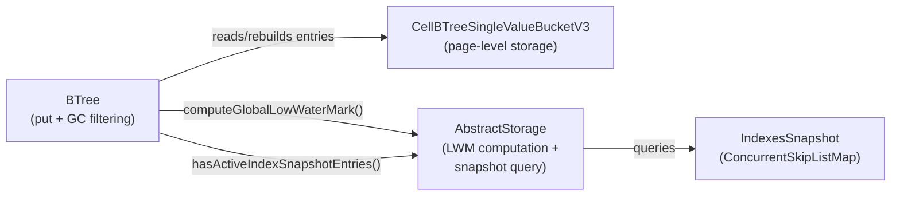

# Index BTree Tombstone GC During Leaf Bucket Overflow — Architecture Decision Record

## Summary

Tombstone entries (`TombstoneRID`) and snapshot markers (`SnapshotMarkerRID`)
accumulate indefinitely in index B-trees, leading to search slowdown and
wasted space. This change garbage-collects them during leaf bucket overflow
in `BTree.put()` — when entries are already being redistributed — reclaiming
space with minimal overhead and without a separate background GC sweep.

Tombstones below the global low-water mark (LWM) are removed. Snapshot
markers below LWM are demoted to plain `RecordId` entries (preserving the
live value) when no active snapshot entries exist for the same user-key
prefix. Both `BTreeSingleValueIndexEngine` and `BTreeMultiValueIndexEngine`
are covered since they share the same `BTree.java` implementation.

## Goals

- **Reclaim space**: Remove tombstones that are unreachable by any active
  transaction, preventing unbounded growth.
- **Avoid unnecessary splits**: If tombstone removal frees enough space, the
  insert succeeds without splitting, preserving tree depth and bucket count.
- **Minimal overhead**: Piggyback on the existing overflow entry
  redistribution — zero extra I/O for the scan.
- **Demote stale markers**: Convert `SnapshotMarkerRID` to plain `RecordId`
  when safe, simplifying future reads.

All goals were achieved as planned. No descoping occurred.

## Constraints

- **Performance**: GC runs on the write hot path. Mitigated by: (1) at most
  once per insert via `gcAttempted` flag, (2) LWM computed once per attempt,
  (3) plain `RecordId` entries skip key deserialization entirely.
- **Atomicity**: Tombstone removal is atomic with the insert — both happen
  within the same `AtomicOperation`.
- **WAL correctness**: No new WAL record types needed. Filtered entries
  simply don't appear in the rebuilt page.
- **Only leaf buckets**: Internal nodes store separator keys without values.
- **Only put() path**: `BTree.remove()` performs physical deletion only (no
  overflow). Tombstone insertion happens via `BTree.put()`.
- **HashMap locking** (discovered): `indexEngineNameMap` is a plain
  `HashMap` — all access must be guarded by `stateLock`. The new
  `hasActiveIndexSnapshotEntries()` call from `BTree` runs under the BTree
  component lock, not `stateLock`, so explicit `stateLock.readLock()` was
  added around the map lookup.

## Architecture Notes

### Component Map

- **BTree**: Modified — added `filterAndRebuildBucket()` and
  `demoteMarkerRawBytes()`. GC integrated into the `update()` while loop.
- **CellBTreeSingleValueBucketV3**: Unchanged. Existing `shrink()`,
  `addAll()`, `getRawEntry()`, `getKey()`, `getValue()`, `find()` methods
  are used as-is.
- **AbstractStorage**: Added `hasActiveIndexSnapshotEntries()`,
  `getIndexSnapshotByEngineName()`, `getNullIndexSnapshotByEngineName()`.
  Existing `computeGlobalLowWaterMark()` used as-is.
- **IndexesSnapshot**: Read-only during GC. Not modified by GC filtering.

### Decision Records

#### D1: GC during bucket overflow vs. separate background sweep

Implemented as planned. Overflow handling already iterates all entries;
filtering adds minimal overhead (one LWM computation + one snapshot query
per SnapshotMarkerRID). Tombstones in pages that never overflow again will
never be collected — acceptable since such pages are cold.

#### D2: Filter-rebuild-retry before splitting

Implemented as planned. The `filterAndRebuildBucket()` method collects
survivors, rebuilds via `shrink(0)` + `addAll()`, and returns the removed
count. Three cases are handled: all removed (trivial insert), some removed
(may or may not need split), none removed (normal split). When only
demotions occur (no tombstones removed), the bucket is still rebuilt to
persist the demoted entries.

#### D3: No snapshot check for TombstoneRID removal

Implemented as planned. Tombstones below LWM are removed unconditionally.
The `IndexesSnapshot` is cleaned separately via
`evictStaleIndexesSnapshotEntries()`, and tombstones below LWM are
unreachable by any active transaction.

#### D4: SnapshotMarkerRID demotion vs. removal

Implemented as planned. `demoteMarkerRawBytes()` rewrites the last 8 bytes
(collectionPosition) from `-(realPos + 1)` back to `realPos`. Demotion
only occurs when `hasActiveIndexSnapshotEntries()` returns false.

#### D5: LWM computation — once per GC attempt

Implemented as planned. `computeGlobalLowWaterMark()` is called once at the
start of `filterAndRebuildBucket()`. Using a stale (lower) LWM is
conservative — may skip eligible entries but never removes prematurely.

#### D6: Plain RecordId key deserialization skip (emerged during implementation)

For plain `RecordId` entries (not `TombstoneRID` or `SnapshotMarkerRID`),
key deserialization is skipped entirely — only the raw entry bytes are
collected. This was identified during Phase A review (suggestion T5) as a
performance optimization. Since `instanceof` on the deserialized value is
sufficient to determine that an entry is not a GC candidate, there is no
need to deserialize the key.

### Invariants

- **No ghost resurrection**: After tombstone removal, the index read path
  never returns a live entry for a deleted key. Guaranteed by the LWM
  threshold.
- **Tree size consistency**: `removedCount + survivors.size() == bucketSize`
  (partition invariant, enforced by assertion).
  `updateSize(-removedCount)` adjusts the entry point's tree size counter.
- **No unnecessary splits**: If tombstone removal frees enough space, no
  split occurs.
- **SnapshotMarkerRID demotion safety**: Demotion only when no active
  snapshot entries exist for the user-key prefix with `version >= LWM`.

### Integration Points

- **`BTree.update()` while loop**: Entry point for GC logic, before
  `splitBucket()`.
- **`AbstractStorage.computeGlobalLowWaterMark()`**: Existing method.
- **`AbstractStorage.hasActiveIndexSnapshotEntries()`**: New method.
- **`BTree.updateSize()`**: Existing method for tree size adjustment.

### Non-Goals

- Background sweep of cold pages.
- GC of non-tombstone stale versions.
- Page compaction or defragmentation after removal.
- IndexesSnapshot cleanup (handled separately).

## Key Discoveries

1. **`indexEngineNameMap` requires `stateLock`**: The map is a plain
   `HashMap`. The new `hasActiveIndexSnapshotEntries()` call originates from
   `BTree` under its component lock, not `stateLock`. Fixed by adding
   explicit `stateLock.readLock()` around the map lookup. This pattern must
   be followed by any future code that accesses `indexEngineNameMap` from
   outside `AbstractStorage`'s normal lock scope.

2. **GC triggers during initial insertion phase**: When filling a bucket
   with tombstones/markers, bucket overflows during insertion can trigger GC
   on already-inserted entries. This means the number of tombstones after a
   fill operation may be less than the number inserted. Test assertions must
   use relative thresholds (e.g., `isLessThan(before / 2)`) rather than
   exact counts to accommodate this behavior.

3. **Core module query API quirks**: `query()` takes SQL directly (no
   language prefix), `command()` returns void,
   `FrontendTransactionImpl.browseClass()` is unavailable — must use
   `tx.load(rid)` for cross-transaction record access.

4. **Uncoverable defensive paths**: The non-`CompositeKey` fallback in
   `filterAndRebuildBucket()` (3 lines) cannot be exercised through index
   engines because they always use versioned `CompositeKey`. This is a
   defensive guard, not dead code — it protects against hypothetical
   non-versioned BTree usage.
