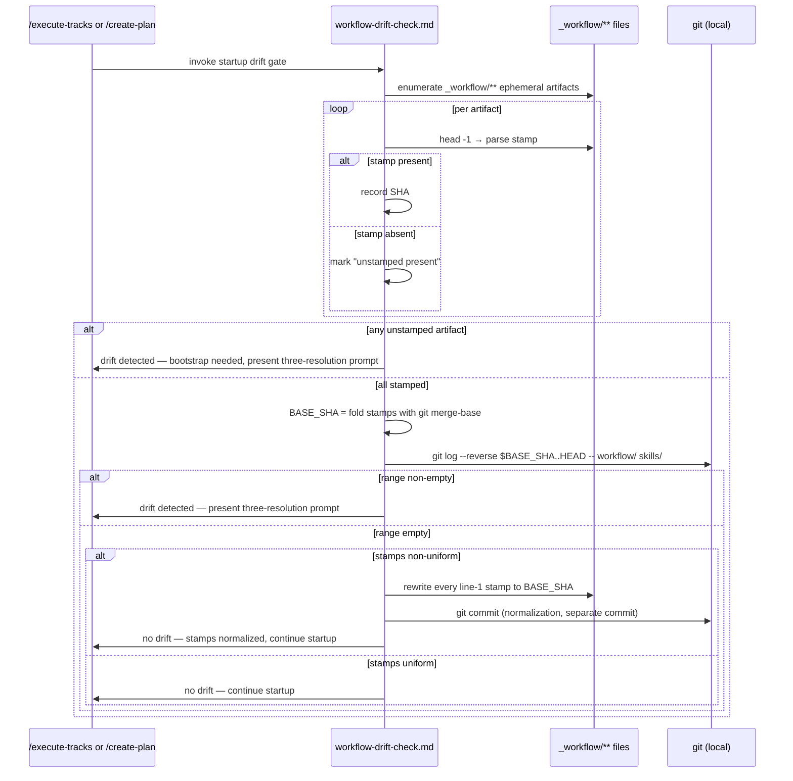
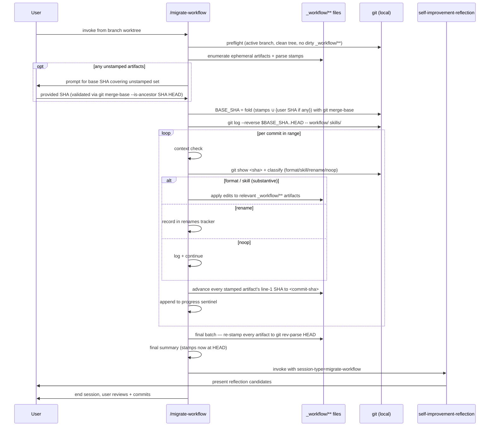
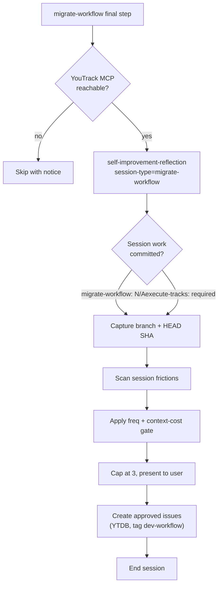

# In-Place Workflow Migration — Design

## Overview

The `/migrate-workflow` skill replays workflow-format commits from `develop` onto a feature branch's `docs/adr/<dir>/_workflow/**` artifacts whenever a workflow-format change has landed on `develop` after the branch was cut. Today the user runs the skill from a `develop` worktree against a separate branch worktree, and the skill computes its replay range as `merge-base(develop, branch)..develop`. The two-worktree dance and the fork-point heuristic are both fragile: the user picks the wrong worktree, the fork-point shifts under a rebase, and the post-migration branch state needs reconciling against develop manually.

This design replaces both. A small per-artifact stamp (`<!-- workflow-sha: <SHA> -->` on line 1 of every ephemeral `_workflow/**` artifact) records the workflow version the artifact was created against. The drift check and the migration both compute their replay range as `BASE_SHA..HEAD`, where `BASE_SHA` is the oldest stamp reachable from HEAD — derived by folding the set of stamps through `git merge-base` (which returns the common ancestor whether the stamps are linearly related or sit on diverged histories). The branch is a self-contained capsule: workflow commits enter the branch's view only when the user explicitly rebases or merges develop. Unstamped artifacts have no implicit fallback: their mere presence signals drift to the gate, and the migration prompts the user once per session for a base SHA covering every unstamped artifact in the active plan. The migration runs entirely inside the branch's own worktree, with no develop checkout and no `git fetch`.

The enabling primitive is the stamp itself: a 40-character SHA written at artifact-creation time, advanced in lockstep across all stamped artifacts after each successful per-commit replay during migration, and re-stamped in one batch to `HEAD`'s SHA at the end of the migration session. On a no-drift run with non-uniform stamps, the gate normalizes every stamp to the fold result and commits the change in a separate commit so the next gate's fold input is O(1). The drift check, the migration's range derivation, the migration's progress tracking, and the post-migration "we're synced to HEAD" claim all read from the same stamps. The self-improvement reflection step that runs at the end of every `/execute-tracks` session is generalized to cover migration sessions too, so the per-session frictions from migration feed the same `dev-workflow` YouTrack queue.

What else changes to fit: `create-plan` and `edit-design` gain stamping at every artifact-creation site; `workflow-drift-check.md` swaps its fork-point math for stamp-walking; `migrate-workflow/SKILL.md` drops its develop-worktree preflight and worktree-resolution step; `self-improvement-reflection.md` takes a session-type parameter that toggles the commit-clean check and the phase identifier.

The rest of this document covers: Core Concepts (the six new domain terms), Workflow (drift-check + migration sequences), Stamp range computation (the `git merge-base` fold algorithm), Per-commit replay and lockstep advance (with crash-recovery semantics), and Reflection parameterization.

## Core Concepts

Six new domain terms appear throughout this design. Each gets one paragraph below: name, plain-language definition, role in the architecture, and a pointer to the section that elaborates it.

**Workflow-SHA stamp.** A line-1 HTML comment on every ephemeral `_workflow/**` artifact: `<!-- workflow-sha: <40-char SHA> -->`. Records the latest commit touching `.claude/workflow/` or `.claude/skills/` reachable from `HEAD` at the time the artifact was created or last migrated. Computed at creation time via `git log -1 --format=%H HEAD -- .claude/workflow .claude/skills` (canonical rule in `conventions.md §1.6`; written verbatim into the templates by the `create-plan` and `edit-design` SKILLs in Track 2). Invisible in rendered Markdown; parseable with `head -1`. Replaces today's implicit "the artifact's effective workflow version is the branch's fork-point with develop." → §"Stamp range computation".

**Stamp range.** The commit range used by the drift check and the migration: `<BASE_SHA>..HEAD`, where `BASE_SHA` is the oldest stamp reachable from HEAD, computed by folding the set of stamps with `git merge-base` (pairwise common ancestor). The upper bound is HEAD because the branch is a self-contained capsule — workflow commits enter the branch's view only via explicit rebase or merge, no `git fetch origin develop` involved. When the active plan contains unstamped artifacts, the migration extends the fold input set by the user-provided bootstrap SHA (see next concept). The drift check itself never computes the range against unstamped state; it short-circuits to "drift detected" on unstamped-artifact presence alone. Replaces today's `git merge-base origin/develop HEAD..origin/develop`. → §"Stamp range computation".

**Unstamped-artifact bootstrap.** When the migration starts and one or more `_workflow/**` artifacts have no line-1 stamp, the skill halts before computing the range and asks the user once: *"These N artifacts are unstamped: [list]. Provide the workflow-SHA to treat as their base."* The provided SHA enters the fold as a single contributor covering every unstamped artifact in the session, validated via `git merge-base --is-ancestor "$SHA" HEAD`. No auto-computed reference (fork-point with develop, HEAD itself, or merge-base with develop) is a silent default — under rebase any auto-computed reference shifts forward and would silently mark legacy artifacts as already-current, skipping the migration. The user-supplied SHA captures intent the system cannot infer. → §"Stamp range computation" and §"Workflow → Migration replay loop".

**Lockstep stamp advance.** After each per-commit replay succeeds during migration, every stamped artifact in the active `_workflow/` directory has its line-1 stamp rewritten to the just-replayed commit's SHA, including artifacts the commit didn't edit. This is the crash-resume marker. After the per-commit loop exits successfully, a final step re-stamps every artifact to `git rev-parse HEAD` in one batch, even artifacts the loop already advanced; invariant I2 lands here. Replaces an implicit notion where the migration's "progress" was tracked only in a transient `.migration-progress` file. → §"Per-commit replay and lockstep advance".

**No-drift normalization.** When the drift gate determines no drift but the `STAMPED_SHAS` set contains more than one distinct SHA, the gate rewrites every artifact's line-1 stamp to `BASE_SHA` (the fold result) and creates a separate commit. The next gate run sees uniform stamps and a single-element fold input. → §"Workflow → Drift detection at session startup".

**Session-type parameter.** A new input to `self-improvement-reflection.md` distinguishing `execute-tracks` (existing behavior) from `migrate-workflow` (the new caller). Controls the commit-clean preflight, the `**Phase:**` value in the issue body, and the applicability sentence. Replaces today's hard-coded `/execute-tracks`-only scoping. → §"Reflection parameterization".

## Workflow

Two runtime flows change shape: drift detection at `/execute-tracks` startup, and the migration replay loop. A third flow — reflection at session end — gains a new caller. All three are shown below.

### Drift detection at session startup



**TL;DR.** Invoked from `/execute-tracks` turn 1 (between the Branch Divergence Check and the handoff scan) and `/create-plan` between Step 1 and Step 1a (Track 6); both callers run the same detection block. Drift detection walks every `_workflow/**` artifact in the active plan's `_workflow/` directory and reads each line-1 stamp. If any artifact is unstamped, the gate short-circuits to "drift detected" — no fold, no range computation, no silent default; the migration is where the user's intent for those artifacts gets captured. If every artifact is stamped, the gate folds the set pairwise through `git merge-base` to derive `BASE_SHA` and runs `git log $BASE_SHA..HEAD` against the workflow paths; non-empty output means drift. The branch is a self-contained capsule (D10), so the upper bound is HEAD and no `git fetch` runs. On no-drift with non-uniform stamps, the gate normalizes every artifact's stamp to `BASE_SHA` and commits the change in a separate commit (D11) so the next gate's fold input is O(1). The three-resolution prompt (Migrate now / Defer / Suppress) is unchanged in shape, but the "Migrate now" wording now points the user back at `/migrate-workflow` in the same worktree.

The stamp read is one `head -1 <path> | grep -oE 'workflow-sha: [0-9a-f]{40}'` per artifact. The walk is cheap; no network I/O is involved because the comparison is purely local.

#### Edge cases / Gotchas

- The gate scopes to the active plan's `_workflow/` directory — the one the caller (`/create-plan <dir>` or `/execute-tracks <dir>`) resolved at startup. A branch carrying multiple plan directories (uncommon; the convention is one plan dir per branch) walks only the active one. Drift in other plan directories surfaces only when the user invokes a session against them. Cross-directory folding is avoided because each plan directory is migrated independently, and folding across them would over-include older commits the active plan was always synced past (D13).
- An artifact whose first line is anything other than a stamp or an H1 is treated as unstamped; same drift-signal path as a legacy artifact (the gate short-circuits to "drift detected" and migration prompts for a base SHA).
- The detection is read-only on the drift path; the no-drift normalization path writes line-1 of stamped artifacts and creates one commit. The normalization step refuses to commit if the diff contains anything outside those line-1 stamp lines.
- Caller-specific skip behavior: the gate's skip-#1 ("Active plan's `_workflow/` doesn't exist") fires on brand-new `/create-plan` invocations before the SKILL creates the active plan's `_workflow/`. Step 1.5 must run before Step 1b (mkdir) so the skip sees the pre-creation state.
- Workflow-modifying branches register their own workflow commits as drift on the next gate run. Accepted dogfood — one migration per commit cluster touching `.claude/workflow/` or `.claude/skills/` (see §"Workflow → Migration replay loop" edge cases).

#### References

- D-records: D1 (per-artifact stamp), D5 (no backfill), D7 (HTML-comment format), D8 (ask, don't guess unstamped SHA), D9 (gate fires at /create-plan startup too), D10 (BASE_SHA..HEAD; branch as capsule), D11 (no-drift normalization + commit), D13 (active-plan scope)
- Invariants: I1 (line-1 stamp), I3 (merge-base fold range), I5 (post-normalization uniformity)

### Migration replay loop



**TL;DR.** Migration runs in the branch's own worktree, scoped to the active plan's `_workflow/` directory (D13; one plan at a time, matching today's skill contract). Preflight refuses if any tracked file under the active plan's `_workflow/**` has uncommitted changes or any untracked file lives there (D12; the progress sentinel is exempt). Before computing the range, the skill checks for unstamped artifacts in the active plan; if any exist, it asks the user once for a base SHA covering the unstamped set and validates the input is reachable from HEAD (no auto-computed default; see D8). The user-provided SHA enters the fold as a single contributor. The per-commit replay loop (classify, apply, advance stamps, log) is the same shape as today's Step 5, with an extra "advance stamps in lockstep" sub-step after each commit lands (the crash-resume marker) and a final post-loop batch that re-stamps every artifact in the active plan to `git rev-parse HEAD`; invariant I2 lands here, even when the last replayed commit's SHA differs from HEAD's SHA (D2 + D10). The develop-worktree machinery is gone; no `git fetch` runs. At the end, the migrate-workflow SKILL invokes the parameterized reflection step before the user reviews and commits.

The user reviews the diff after the loop exits and commits it through normal git workflow. The skill never commits the migration's content edits — that contract carries over from today. (The drift gate's no-drift normalization commit, when it fires, is a different surface and does commit its own change.)

#### Edge cases / Gotchas

- Mid-loop `/clear` or process kill: the next invocation re-reads stamps, finds the next pending commit, resumes. The transient progress sentinel is a backstop for in-flight crash detection only; the stamps are the durable progress marker.
- A commit that doesn't edit any branch artifact (e.g., a workflow-format change to a section the branch's plan doesn't carry) still advances every stamp — the artifact was "synced to" that workflow version even though the diff happened to be empty for it. The final HEAD batch then advances every stamp to HEAD's SHA, which may be ahead of the last replayed commit when develop has non-workflow commits past the last workflow tip.
- Renames in the workflow itself (e.g., `track-review.md` → `track-pre-flight.md`) are recorded in a per-session renames tracker and consulted by later commits whose diffs reference the renamed paths. The tracker is rebuilt fresh on every migration invocation.
- Workflow-modifying branches (this very plan's branch) accept dogfood semantics: the branch's own workflow commits show up in `BASE_SHA..HEAD` and trigger migration of the branch's in-progress workflow changes. One migration session per commit cluster touching `.claude/workflow/` or `.claude/skills/`. The user accepts the friction in exchange for the capsule guarantee.

#### References

- D-records: D2 (per-commit lockstep + final HEAD batch), D4 (end-session Migrate now), D8 (ask, don't guess unstamped SHA), D10 (BASE_SHA..HEAD; branch as capsule), D12 (preflight refuses on dirty `_workflow/**`), D13 (active-plan scope)
- Invariants: I2 (post-migration stamps equal HEAD), I3 (range derivation), I4 (mutations don't move stamps)

### Reflection at end of migration



**TL;DR.** The migrate-workflow SKILL invokes `self-improvement-reflection.md` as its final step, passing `session-type=migrate-workflow`. The reflection protocol's existing steps run unchanged except for three conditional clauses: the commit-clean preflight is skipped (migration intentionally leaves the worktree dirty), the `**Phase:**` value in the issue body is `migrate-workflow`, and the applicability sentence reads "every `/migrate-workflow` session" rather than "every `/execute-tracks` session." The Source line points at `HEAD` (pre-migration) since no post-migration commit exists at session end.

The frequency-and-context-cost gate, the 3-issue cap, the severity → priority mapping, the duplicate-filter against open `dev-workflow` issues, and the user-confirmation gate before issue creation all carry through without change.

#### Edge cases / Gotchas

- YouTrack MCP unreachable: same skip-with-notice path as today. The notice text gains "migrate-workflow session" in its phrasing.
- Zero candidate frictions: same "No improvements proposed" terminal state.
- Migration ended early (context warning during replay): reflection still fires — the friction that caused the early exit is exactly the kind of finding worth recording.

#### References

- D-records: D6 (parameterize, don't fork)
- See also: `self-improvement-reflection.md` §"When it runs" (after Track 5's update)

## Stamp range computation

**TL;DR.** Drift detection, migration range derivation, and the post-migration "synced to HEAD" claim all need the same lower bound to stay consistent across callers, so one bash block is shared verbatim where the inputs match. The block folds the set of line-1 stamps (across every ephemeral artifact in the active plan's `_workflow/` directory; D13) through `git merge-base` to find the oldest reachable ancestor in HEAD's commit graph; that ancestor becomes `BASE_SHA`. The upper bound is HEAD (D10): the branch is a self-contained capsule, so no `git fetch origin develop` runs and no comparison against `origin/develop` happens. Unstamped artifacts have no implicit fallback. At migration time the skill prompts the user once for a base SHA covering the unstamped set, and that SHA enters the fold as one additional contributor; the drift check itself never reaches the fold when any artifact is unstamped (it short-circuits to "drift detected" and routes to migration).

SHAs have no inherent ordering, so "lowest" or "min" is not the right primitive — `git merge-base` is. For linearly related SHAs it returns the older of the two; for SHAs on divergent histories it returns their common ancestor. Both behaviors are exactly what `BASE_SHA` needs: the range `BASE_SHA..HEAD` captures every workflow commit any stamp might be missing.

The derivation has two phases. **Phase 1 (shared):** walk artifacts in the active plan's `_workflow/`, classify as stamped or unstamped, parse stamps. `$PLAN_DIR` is the plan directory the caller resolved at startup — the argument to `/create-plan <dir>` / `/execute-tracks <dir>` or the today's-skill ladder for `/migrate-workflow` (zero match: halt; one match: use it; many matches: prompt).

```bash
PLAN_DIR="docs/adr/<resolved-dir-name>"
STAMPED_SHAS=""
UNSTAMPED_FILES=""
for f in $(ls "$PLAN_DIR/_workflow/implementation-plan.md" \
              "$PLAN_DIR/_workflow/design.md" \
              "$PLAN_DIR/_workflow/design-mechanics.md" \
              "$PLAN_DIR/_workflow/plan/"track-*.md 2>/dev/null); do
    SHA="$(head -1 "$f" | grep -oE '[0-9a-f]{40}' | head -1)"
    if [ -n "$SHA" ]; then
        STAMPED_SHAS="$STAMPED_SHAS $SHA"
    else
        UNSTAMPED_FILES="$UNSTAMPED_FILES $f"
    fi
done
```

**Phase 2 (caller-specific):**

- **Drift check** — `workflow-drift-check.md`: if `UNSTAMPED_FILES` is non-empty, signal drift unconditionally (no fold, no `git log`). Otherwise fold `STAMPED_SHAS` and run `git log $BASE_SHA..HEAD -- .claude/workflow .claude/skills`; non-empty output signals drift. When the range is empty and `STAMPED_SHAS` contains more than one distinct SHA, the gate rewrites every artifact's line-1 stamp to `BASE_SHA` and creates a separate normalization commit (D11).
- **Migration** — `migrate-workflow/SKILL.md`: if `UNSTAMPED_FILES` is non-empty, prompt the user once for a base SHA, validate it (`git rev-parse --verify $SHA^{commit}` and `git merge-base --is-ancestor $SHA HEAD`), then fold `STAMPED_SHAS` plus the validated user SHA. Run the same `git log` to produce the replay queue.

The fold itself:

```bash
BASE_SHA=""
for SHA in $STAMPED_SHAS $USER_SHA; do
    if [ -z "$BASE_SHA" ]; then
        BASE_SHA="$SHA"
    else
        # Fold pairwise through merge-base — yields the older ancestor
        # for linear stamps and the common ancestor for divergent ones.
        # Failure (no common ancestor) is treated as a fatal error;
        # the caller aborts and asks the user to investigate.
        BASE_SHA="$(git merge-base "$SHA" "$BASE_SHA" 2>/dev/null)" \
            || { echo "merge-base failed on $SHA vs $BASE_SHA"; exit 1; }
    fi
done

git log --reverse --format='%H %s' "$BASE_SHA..HEAD" -- .claude/workflow .claude/skills
```

`git merge-base` is the load-bearing primitive — it picks the older of two linearly related SHAs, returns the common ancestor of two divergent ones, and exits non-zero when no common ancestor exists at all (treated as fatal so the caller surfaces it). Folding the whole set pairwise lands on the single SHA that's ancestor of every input, which is exactly the "earliest workflow version any artifact was synced to" anchor the range needs.

**Why no silent auto-computed reference.** Any auto-computed reference for unstamped artifacts (`git merge-base origin/develop HEAD`, HEAD itself, fork-point with develop, or whatever else) fails the same way: it shifts forward whenever the user rebases the branch onto a newer develop. A legacy branch carrying unstamped artifacts, rebased onto a develop that has had workflow commits in the meantime, would have any auto-computed reference land at (or near) the new HEAD; a silent fallback would then declare the artifacts already-synced, skipping the migration entirely. The data loss is silent: artifacts stay at their unmigrated content while the drift gate reports "no drift." Asking the user once for an explicit SHA at migration time is the small ergonomic cost that buys correctness across rebase (D8).

### Edge cases / Gotchas

- An artifact whose stamp parses but whose SHA isn't reachable from HEAD (e.g., a stamp left from a workflow commit that was dropped during rebase): the SHA enters the fold; `git merge-base` reduces it against the other stamps to whatever common ancestor exists in HEAD's graph, and `git log $BASE_SHA..HEAD` returns commits reachable from HEAD that aren't on that ancestor. The unreachable stamp itself contributes only to the fold input, not to the range upper bound.
- The active plan's `_workflow/` directory exists but has zero artifacts: skipped silently (no fold contributor and no unstamped contributor). The drift check's existing "active plan's `_workflow/` doesn't exist" skip condition catches the brand-new-plan case before the loop runs.
- The enumeration lists the four stamped artifact types explicitly inside the active plan's `_workflow/`. Adding a new stamped artifact type means adding one line to each call site, small enough to inline rather than pulling out a helper. `design-mutations.md` is an append-only log and is deliberately excluded: its stamp would always equal `design.md`'s stamp (same creation moment, same lockstep advance, untouched by I4 mutations), so it contributes nothing to the fold input, and schema commits affecting the log are replay-immune by virtue of the log's append-only contract.
- The user-supplied bootstrap SHA fails validation (`git rev-parse --verify` rejects it, or `git merge-base --is-ancestor` says it's not reachable from HEAD): the migration re-prompts. Three rejected attempts in a row abort the session with a clear error and no edits applied.
- The user supplies a SHA that's valid but semantically wrong (an unrelated commit): no system check can catch this. The fold yields a `BASE_SHA` that's correct given the input; the per-commit replay loop's classify-and-apply contract then determines whether the resulting edits make sense, with halt-on-ambiguity as the safety net.

### References

- D-records: D1 (per-artifact stamp), D5 (no backfill), D7 (HTML-comment format), D8 (ask, don't guess unstamped SHA), D10 (BASE_SHA..HEAD; branch as capsule), D11 (no-drift normalization + commit), D13 (active-plan scope)
- Invariants: I3 (merge-base fold range), I5 (post-normalization uniformity)

## Per-commit replay and lockstep advance

**TL;DR.** Inside the migration's Step 4 per-commit loop (renamed from today's Step 5 under Tracks 4a/4b's renumbering), sub-step 4.5 *Advance stamps in lockstep* fires immediately after sub-step 4.4 (apply edits to branch artifacts) succeeds and before sub-step 4.6 (record commit in progress sentinel) runs. Every stamped artifact in the active plan's `_workflow/` has its line-1 stamp rewritten to the just-replayed commit's SHA, including artifacts the commit didn't touch. This is the crash-resume marker: the next invocation reads any stamp, finds the last successfully-replayed SHA, and resumes from the commit after that. After the per-commit loop exits successfully, sub-step 4.8 runs a final batch that re-stamps every artifact in the active plan to `git rev-parse HEAD`, even artifacts the loop already advanced to the same value (D2 + D13). Invariant I2 lands at the final batch, so HEAD-relative consistency holds even when the last replayed commit precedes HEAD.

The per-commit advance is a one-line `sed` (or `Edit` on the comment line) per artifact, run after the per-commit edits land:

```bash
for f in <list of stamped artifacts in the active _workflow/>; do
    # Replace existing line-1 stamp, or insert one if the artifact is legacy-unstamped.
    if head -1 "$f" | grep -qE '<!-- workflow-sha: [0-9a-f]{40} -->'; then
        sed -i "1s/.*/<!-- workflow-sha: <new-sha> -->/" "$f"
    else
        sed -i "1i\\<!-- workflow-sha: <new-sha> -->" "$f"
    fi
done
```

The final batch uses the same loop with `<new-sha>` resolved to `$(git rev-parse HEAD)`:

```bash
HEAD_SHA="$(git rev-parse HEAD)"
for f in <every stamped artifact in the active plan's _workflow/>; do
    if head -1 "$f" | grep -qE '<!-- workflow-sha: [0-9a-f]{40} -->'; then
        sed -i "1s/.*/<!-- workflow-sha: $HEAD_SHA -->/" "$f"
    else
        sed -i "1i\\<!-- workflow-sha: $HEAD_SHA -->" "$f"
    fi
done
```

A legacy-unstamped artifact gains a stamp on its first migration (in the per-commit phase). Subsequent migrations of the same branch overwrite the existing stamp.

The order matters: edits (4.4) → per-commit advance (4.5) → progress sentinel (4.6) → task flip (4.7) → ... → final HEAD batch (4.8). If the migration crashes between 4.4 and 4.5, the next invocation sees stamps still at commit X-1 and replays X over already-edited content; the user's `git diff` before resuming detects duplicate edits — this is the same crash-window contract today's `.migration-progress` provides, just with the stamp playing the durable-marker role. If the migration crashes between 4.5 and 4.6, stamps are at commit X but the progress sentinel is not, and the next invocation re-reads the stamp, finds the range short by one commit, and lands at 4.8 (the no-drift normalization path advances every stamp to HEAD's SHA). If the migration crashes between the per-commit loop and sub-step 4.8 itself, stamps point at the last replayed commit (still a valid resume point); the next invocation finds the range empty and lands at 4.8 directly.

### Edge cases / Gotchas

- An artifact that doesn't yet exist (a future track file the branch hasn't created): not enumerated, no advance, no problem. The advance is best-effort per-file.
- A commit that triggers sub-step 4.4's halt-on-ambiguity (`section-rename onto existing name`, `section-remove with user content`, `field-add with no safe default`): the loop pauses; stamps stay at the prior commit's SHA. When the user resolves the halt and the loop continues, sub-step 4.5 for the current commit fires.
- A commit recorded as `manual-review-needed` (user invoked "skip" from a halt): sub-step 4.5 still fires — the commit was "applied" in the sense that the user opted out, and leaving the stamp behind would cause the same commit to be re-presented on the next run.

### References

- D-records: D2 (per-commit lockstep + final HEAD batch), D10 (BASE_SHA..HEAD), D13 (active-plan scope)
- Invariants: I2 (post-migration stamps equal HEAD), I4 (mutations don't move stamps)

## Reflection parameterization — one knob, three conditional clauses

**TL;DR.** One `session-type` parameter on `self-improvement-reflection.md` lets the existing reflection protocol serve migration sessions; three sections branch on the value, everything else runs identically. The parameter takes values `execute-tracks` (today's behavior) or `migrate-workflow` (the new caller). The three branching sections are: §"When it runs" applicability sentence, Step 2 commit-clean preflight (skipped for `migrate-workflow` since migration leaves the worktree dirty by design), and the issue-body template's `**Phase:**` field. The freq/context-cost gate, the 3-issue cap, the duplicate filter, the user gate, and the YouTrack creation flow are untouched.

The parameterization is a minimal edit:

- Add an `## Inputs` block at the top of `self-improvement-reflection.md` listing `session-type: execute-tracks | migrate-workflow`.
- In §"When it runs", replace `/execute-tracks` with `the calling session` and add an applicability table mapping session-type to phase identifiers.
- In Step 2 (verify session work is committed), add a conditional: skip the check when `session-type=migrate-workflow` (migration intentionally leaves the worktree dirty for user review).
- In the issue body template's `**Phase:**` line, accept `migrate-workflow` as a valid value alongside the existing five phase identifiers.

The migrate-workflow SKILL's new final step (numbering follows Tracks 4a/4b's renumber-down: today's Step 6 final summary becomes Step 5, so Track 5's reflection step lands as Step 6):

```markdown
## Step 6 — Self-improvement reflection

Invoke the reflection protocol at `.claude/workflow/self-improvement-reflection.md`
with `session-type=migrate-workflow`. The protocol handles its own MCP-reachability
check and end-of-session contract; nothing else fires after it returns.
```

### Edge cases / Gotchas

- The duplicate filter (Step 6 of reflection) searches `project: YTDB tag: dev-workflow`. Migration-session frictions land in the same queue as `/execute-tracks` frictions; the triager treats them uniformly. No queue split needed.
- A reflection candidate that names a `migrate-workflow/SKILL.md` step explicitly is more likely to clear the frequency prong than a hypothetical `/execute-tracks` finding, because migration sessions are themselves rare — but the gate's "deterministic trigger fires on every matching session" path handles that case (one Bug that fires deterministically once still passes the prong).
- The session-end summary in `migrate-workflow/SKILL.md` Step 5 (final summary, post-Tracks-4a/4b renumber) runs BEFORE reflection in the new flow. Reflection's "End the session" terminal action is what truly ends the migration session.

### References

- D-records: D6 (parameterize, don't fork)
- See also: §"Workflow → Reflection at end of migration" for the runtime sequence.
