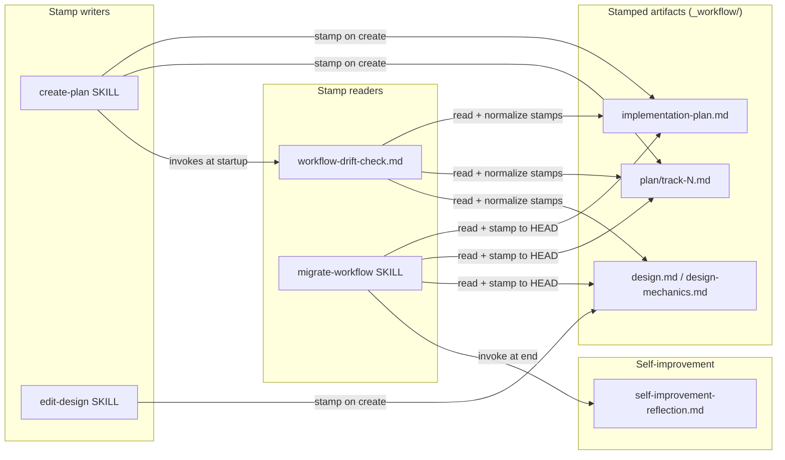

# In-Place Workflow Migration

## Design Document
[design.md](design.md)

## High-level plan

### Goals

Move `/migrate-workflow` from a develop-worktree-driven, two-worktree dance into a single in-branch operation. Replace the fork-point heuristic with per-artifact workflow-SHA stamps so the migration's "what range do I replay?" decision is data-driven and survives rebases. Add a self-improvement reflection step to the skill so the per-session frictions feed the same `dev-workflow` queue that `/execute-tracks` already populates.

The skill currently requires the user to switch to a `develop` worktree, run the migration against a separate branch worktree, and then rebase the migrated workflow files back into the branch's working topology. Each handoff between worktrees is a place to forget which worktree owned which file. The replacement runs entirely inside the branch's own worktree; the migration's input range is read from stamps on the artifacts it migrates, and the resulting edits land directly on the branch where they're needed.

### Constraints

- **Branch is a self-contained capsule.** Workflow commits enter the branch's view only via explicit rebase or merge. Drift detection and migration both range over `BASE_SHA..HEAD`, scoped to the active plan's `_workflow/` directory, never against `origin/develop`; no `git fetch` is part of the gate. See D10 (range bound) and D13 (per-plan scope).
- **Backward compatibility with legacy artifacts.** Branches alive today have no stamps. The drift check treats unstamped-artifact presence as drift unconditionally and routes to migration; the migration prompts the user once for a base SHA covering every unstamped artifact in the active plan, then proceeds. The first successful migration of a legacy branch writes stamps to all its artifacts as a side effect; no separate backfill script. There is no silent fallback to any auto-computed reference — see D8 for why.
- **No Phase 4 stamping.** `design-final.md` and `adr.md` survive merge into `develop` and never get re-migrated. Stamping them is dead weight; the parser explicitly scopes to `_workflow/**`.
- **Markdown-only change.** No Java, no scripts, no hooks beyond what already exists. Bash one-liners embedded in the relevant SKILL / workflow files do the SHA reads.
- **No silent fallback to grep for symbol audits.** This work is markdown-only — PSI doesn't apply. All edits are file-level; no symbol-level audits.
- **House style applies to every Markdown surface touched.** SKILL bodies, workflow rule files, and the artifact templates this work edits all live under §1.5's full Tier-A coverage. AI-tells, em-dash discipline, banned vocabulary, BLUF leads — all enforced as part of each track's commit.

### Architecture Notes

#### Component Map

- **`create-plan` SKILL** — emits the stamp on line 1 of `implementation-plan.md` and each `plan/track-N.md` it creates (Track 2). Invokes the drift gate at session start so re-invocation after the user rebases the branch onto a newer develop catches post-rebase drift before any research investment (Track 6). One-line bash helper computes the SHA: `git log -1 --format=%H HEAD -- .claude/workflow .claude/skills`.
- **`edit-design` SKILL** — emits the stamp on `design.md` (phase1-creation) and `design-mechanics.md` (length-trigger-crossing). Stamp updates only on migration replay, never on subsequent mutation kinds (`content-edit`, `section-add`, etc.). Touched in Track 2. `design-mutations.md` is deliberately excluded; see the Non-Goals section.
- **`workflow-drift-check.md`** — parser walks every `_workflow/**` artifact in the active plan's `_workflow/` directory (D13) and reads each line-1 stamp. Any unstamped artifact triggers drift unconditionally; the gate skips the fold and routes to migration. When every artifact is stamped, the fold runs and the gate compares `BASE_SHA..HEAD` against workflow paths (no `git fetch`). On no-drift with non-uniform stamps, normalizes every stamp to the fold result and creates a separate commit (D11). Resolutions wording updated for in-branch flow. Invoked from both `/execute-tracks` turn 1 (existing) and `/create-plan` between Step 1 and Step 1a (Track 6). Touched in Track 3.
- **`migrate-workflow` SKILL** — runs against the active plan's `_workflow/` directory (D13; one plan at a time, matching today's skill contract). Preflight refuses on develop-worktree requirement (drops) and on tracked-uncommitted or untracked files under the active plan's `_workflow/**` (D12; progress-sentinel carve-out kept). When unstamped artifacts exist, the skill prompts the user once for a base SHA covering the unstamped set, validates it, and folds it in with the stamped set. Range is `BASE_SHA..HEAD`. Per-commit replay loop unchanged in shape; after each successful replay, every stamp in the active plan advances to that commit's SHA in lockstep (crash-resume marker). A final post-loop step re-stamps every artifact in the active plan to `HEAD`'s SHA in one batch (D2). Touched in Track 4.
- **`self-improvement-reflection.md`** — gains a session-type parameter (`execute-tracks` or `migrate-workflow`) controlling the commit-clean check, phase value, and applicability text. Touched in Track 5. The migrate-workflow SKILL gains a final step that invokes it.

#### D1: Per-artifact SHA stamp, not single sentinel

- **Alternatives considered**: single `_workflow/.workflow-sha` sentinel file; mixed scheme (stamps + summary sentinel cache).
- **Rationale**: per-artifact stamps survive file copies between branches, let an isolated re-creation of one artifact carry its own provenance, and the user's framing was explicit ("each workflow artifact has a SHA"). A single sentinel loses resolution and depends on staying in sync with the artifacts it claims to summarize.
- **Risks/Caveats**: marginally more parsing work in the drift check and migration. Cost is one `head -1` per artifact — negligible.
- **Implemented in**: Track 1 (format), Track 2 (writers), Track 3 (drift-check reader), Track 4 (migration reader/writer).

#### D2: Lockstep per-commit advance + final stamp-to-HEAD batch

- **Alternatives considered**: advance only the stamps of artifacts a given commit edited; skip per-commit advance entirely (only stamp to HEAD at end).
- **Rationale**: per-commit lockstep advance preserves crash-resume (next session reads any stamp; if it equals HEAD the migration completed, otherwise replay resumes from where the stamps point). A final post-loop step then re-stamps every artifact to `HEAD`'s SHA in one batch — including artifacts every per-commit replay skipped. Final invariant: post-migration, every stamp equals `git rev-parse HEAD`. Per-artifact advancement creates an irregular tree of stamps; skipping the per-commit phase loses crash resumption.
- **Risks/Caveats**: an artifact untouched by any replayed commit still ends at HEAD's SHA. Correct semantics — the artifact is synced to the workflow state HEAD reflects, even when the replays didn't touch it. The HEAD-final stamp replaces the prior "last replayed commit's SHA" framing (see D10).
- **Implemented in**: Track 4.

#### D3: Ephemeral artifacts only, no Phase 4 stamping

- **Alternatives considered**: stamp `design-final.md` and `adr.md` for symmetry.
- **Rationale**: Phase 4 artifacts survive squash-merge into `develop`. They're git history at that point and no per-branch migration ever applies to them. Stamping them adds a writer site without a reader.
- **Risks/Caveats**: parser must explicitly scope to `_workflow/**`. One extra glob check.
- **Implemented in**: Tracks 2 and 3 (writers and reader).

#### D4: "Migrate now" ends session; user re-invokes `/migrate-workflow`

- **Alternatives considered**: run migration inline in the same session after the user picks Migrate now.
- **Rationale**: the migration skill has its own per-commit context-check loop and resume protocol. Mixing two long-running protocols in one session risks a mid-migration context warning triggering the wrong handoff. Ending the session keeps the boundary clean — matches today's contract; only the worktree changes.
- **Risks/Caveats**: one extra `/clear` for the user. Acceptable.
- **Implemented in**: Track 3.

#### D5: No legacy backfill — migration's user-prompt bootstraps stamps

- **Alternatives considered**: backfill script that walks `docs/adr/*/_workflow/` on every active branch and writes stamps en masse.
- **Rationale**: the migration's unstamped-artifact prompt (see D8) is already the bootstrap path. A separate backfill script would duplicate that prompt outside the migration loop, with the added coordination cost of remembering to run it on every active branch. The migration already runs whenever drift surfaces; bundling bootstrap into the migration keeps one path.
- **Risks/Caveats**: legacy branches with no pending drift still need to be migrated to acquire stamps. In practice every legacy branch hits drift the moment any workflow commit lands on `develop` after it was cut, so the bootstrap usually happens on the next `/execute-tracks` startup anyway. Branches that never re-engage with the workflow gate keep their unstamped state, which is fine — they're inert.
- **Implemented in**: Track 4 (migration's bootstrap prompt).

#### D6: Parameterize `self-improvement-reflection.md`, don't fork it

- **Alternatives considered**: new file `migrate-workflow-reflection.md` mirroring most of the protocol.
- **Rationale**: the reflection protocol is genuinely the same. The differences are small (commit-clean check, phase identifier, applicability sentence). Adding a session-type parameter keeps one source of truth; the alternative duplicates ~600 lines of stable protocol for the sake of three conditional clauses.
- **Risks/Caveats**: the parameter has to be plumbed through. Three call sites; the parameterization is one paragraph in the doc.
- **Implemented in**: Track 5.

#### D9: Drift gate fires at /create-plan startup, not only /execute-tracks

- **Alternatives considered**: gate only at /create-plan Step 4 (just-before-write); gate uniformly at every workflow-touching skill startup; rely on the user to re-invoke after rebasing.
- **Rationale**: between planning sessions the user rebases onto a newer develop to pick up critical workflow changes; after a rebase, HEAD's history contains imported workflow commits the artifacts haven't been migrated to. Without a gate at /create-plan startup, Session B would mutate `_workflow/**` atop the drifted shape. Gating /create-plan startup catches that case before research investment. Gating at Step 4 wastes prior session work; uniform gating across every skill is overkill — /edit-design runs only inside parent skills, so transitive coverage holds.
- **Risks/Caveats**: research-only /create-plan sessions on a branch with existing artifacts pay the one-`git log` gate cost even when no writes will follow. Acceptable.
- **Implemented in**: Track 6.

#### D8: Ask user for unstamped-artifact base SHA, don't silently auto-compute

- **Alternatives considered**: silently default unstamped artifacts to `HEAD`; silently default to `git merge-base origin/develop HEAD`; silently default to fork-point with develop; halt the migration with a generic error and refuse to proceed.
- **Rationale**: any auto-computed reference fails after rebase. A legacy branch's unstamped artifacts, rebased onto a develop that has had workflow commits in the meantime, would have any auto-computed reference land at (or near) the new HEAD — and the silent fallback would then declare the artifacts already-synced, skipping the migration. The data loss is silent: artifacts stay at their unmigrated content while the drift gate reports "no drift." A one-time prompt at migration time captures intent the system cannot infer.
- **Risks/Caveats**: one prompt per migration session on legacy branches (a small UX cost). Mitigated by presenting the prompt only when unstamped artifacts exist — fully-stamped branches never see it. The user has to supply a meaningful SHA; if they pick wrong, the per-commit replay loop's halt-on-ambiguity contract surfaces the mismatch.
- **Implemented in**: Track 3 (drift check signals drift on unstamped-artifact presence) and Track 4 (migration prompts and validates).

#### D7: HTML-comment stamp on line 1, before the H1

- **Alternatives considered**: YAML frontmatter; trailing-line footer; first-line H1 attribute.
- **Rationale**: `<!-- workflow-sha: <40-char SHA> -->` on line 1 is invisible in rendered Markdown, parseable with `head -1` + a grep, doesn't conflict with the existing convention of opening with `# <Feature Name>`, and gives the artifact a uniform top-of-file location no matter what the H1 says. Frontmatter would be a new convention to learn; trailing-line footer is fragile against append operations.
- **Risks/Caveats**: line 1 has to be the stamp, line 2 has to be the H1 — a writer that gets this wrong leaves a malformed file. Format check is a one-line regex; documented in Track 1.
- **Implemented in**: Track 1.

#### D10: Comparison range is BASE_SHA..HEAD; branch is a self-contained capsule

- **Alternatives considered**: `BASE_SHA..origin/develop` (the develop-relative comparison the existing /execute-tracks gate uses); a hybrid (compare against `origin/develop` when reachable, fall back to HEAD); compare against `git merge-base origin/develop HEAD`.
- **Rationale**: workflow commits enter the branch's view only when the user explicitly rebases (or merges develop). Until then, the branch's drift is purely a function of its own commit graph. Comparing against `origin/develop` would force a `git fetch` on every gate run and surface drift the user hasn't opted into; comparing against HEAD ties detection to the explicit rebase event. The hybrid options muddy the semantics for marginal benefit.
- **Risks/Caveats**: on a workflow-modifying branch (this very plan's branch), the user's own workflow commits register as drift, triggering migration of in-progress workflow changes. Accepted as dogfood — see Track 4's intro.
- **Implemented in**: Track 1 (range definition in conventions), Track 3 (drift check), Track 4 (migration), Track 6 (gate at /create-plan startup).

#### D11: On no-drift with non-uniform stamps, normalize to fold result + auto-commit

- **Alternatives considered**: leave stamps as-is on no-drift; normalize but don't auto-commit (let the user fold the stamp change into their next commit); always normalize regardless of stamp uniformity.
- **Rationale**: when the drift gate determines no drift but artifacts carry distinct stamps (typically because they were created or last migrated at different times), normalizing every stamp to the fold result collapses future-gate computation from N-way pairwise `git merge-base` to a single-value read. A separate auto-commit keeps the change auditable in git history. Leaving stamps as-is means every gate run pays the fold cost; deferring the commit risks the stamp change tangling with the user's next code commit.
- **Risks/Caveats**: an extra commit appears on the branch on a no-drift gate run with non-uniform stamps. One commit per such run; branches with already-uniform stamps see none. The auto-commit must verify that nothing outside the stamp lines changes in the diff before committing (refuses otherwise to avoid swallowing unrelated edits).
- **Implemented in**: Track 3.

#### D12: Migration preflight refuses on uncommitted or untracked `_workflow/**` state

- **Alternatives considered**: silently stash; warn and continue; pure clean-tree check across the whole repo (today's behavior, modulo progress-sentinel).
- **Rationale**: the migration mutates files under `_workflow/**` and commits them. Uncommitted edits or untracked files in that subtree would either get clobbered by the migration's writes or get pulled into the migration's commit boundaries unintentionally. Stashing is destructive (the user might not realize their stash got popped on top of migrated content); warn-and-continue normalizes around the failure mode rather than preventing it. The whole-repo clean check is too strict — unrelated edits under `core/` or `server/` have no bearing on the migration.
- **Risks/Caveats**: the progress-sentinel carve-out remains so the migration can manage its own transient file. Users with unfinished planning work under `_workflow/**` see a refusal until they commit, stash, or remove those files.
- **Implemented in**: Track 4.

#### D13: Drift detection and migration scope to the active plan directory, not the whole branch

- **Alternatives considered**: walk every `docs/adr/*/_workflow/` on the branch and fold their stamps together; restrict only the migration to one plan while keeping the drift check branch-wide.
- **Rationale**: each plan directory is migrated independently. Folding stamps across plans yields a `BASE_SHA` that's older than the active plan needs, inflating the replay range with commits the active plan was always synced past. The session itself is already plan-scoped — `/create-plan <dir>` and `/execute-tracks <dir>` operate on one plan — and today's `/migrate-workflow` already targets exactly one plan (prompts the user to pick when multiple plan directories exist on the branch; see SKILL.md Step 4). A branch-wide drift check would surface drift the migration that's supposed to resolve it cannot act on as a unit. Convention on this project is one plan dir per branch; the rare multi-plan-per-branch case sees drift in non-active plans only when the user invokes a session against them.
- **Risks/Caveats**: a user on a multi-plan branch who runs a session against plan A doesn't learn about drift in plan B until they invoke a session against plan B. Notification is delayed, not lost; data integrity holds.
- **Implemented in**: Tracks 3 (drift check), 4 (migration), 6 (gate at `/create-plan` startup). Track 1 defines the active-plan scope inline in `conventions.md` §1.6 so the drift check and the migration cite one source of truth.

### Invariants

- **I1**: Every `_workflow/**` artifact stamped by Track 2 carries `<!-- workflow-sha: <40-char SHA> -->` on line 1, with the H1 on line 2.
- **I2**: After a successful migration session, every stamped artifact in the active plan's `_workflow/` has its line-1 SHA equal to `git rev-parse HEAD`.
- **I3**: When every artifact in the active plan's `_workflow/` is stamped, the drift detection range is `BASE_SHA..HEAD`, where `BASE_SHA` is the oldest stamp reachable from HEAD — derived by folding the active plan's stamps pairwise through `git merge-base`. When any artifact in the active plan is unstamped, the drift check short-circuits to "drift detected" and the migration extends the fold input set by a user-supplied base SHA covering the unstamped set.
- **I4**: Mutations through `edit-design` (`content-edit`, `section-add`, etc.) never touch the stamp. Only artifact creation, migration replay, and no-drift normalization write it.
- **I5**: After a no-drift gate run with non-uniform stamps in the active plan, every stamped artifact in the active plan's `_workflow/` has its line-1 SHA equal to the fold result, and a separate commit captures the normalization.

### Integration Points

- **`/create-plan` Step 4 templates** — stamp written at the top of `implementation-plan.md` and each `plan/track-N.md` immediately before the H1.
- **`edit-design` skill `phase1-creation`** — stamp written at the top of `design.md`; same for `design-mechanics.md` when mechanics is created during `length-trigger-crossing`. `design-mutations.md` is deliberately excluded (see Non-Goals).
- **`workflow-drift-check.md` Detection section** — replaces `FORK=$(git merge-base origin/develop HEAD)` with stamp-walking logic scoped to the active plan's `_workflow/` directory (D13); range is `BASE_SHA..HEAD` (no `git fetch`); short-circuits to "drift detected" whenever any artifact in the active plan is unstamped. On no-drift with non-uniform stamps in the active plan, normalizes every artifact's stamp in the active plan to the fold result and creates a separate commit.
- **`migrate-workflow` SKILL preflight** — refuses to start if any tracked file under the active plan's `_workflow/**` has uncommitted changes (working tree or index), or if any untracked file lives there (D13 scope). Progress-sentinel carve-out kept.
- **`migrate-workflow` SKILL Step 2** — same stamp-walking logic for range computation, scoped to the active plan's `_workflow/` (D13); range is `BASE_SHA..HEAD`. New Step 2.0 prompts the user for a base SHA covering unstamped artifacts in the active plan (when any exist). Step 4's per-commit loop advances stamps in lockstep at sub-step 4.5 after each commit's replay; sub-step 4.8 re-stamps every artifact in the active plan to `HEAD`'s SHA in one batch after the loop exits. (Step numbers follow Track 4's renumber-down; today's Step 2 is removed.)
- **`migrate-workflow` SKILL final step** — invokes `self-improvement-reflection.md` with `session-type=migrate-workflow`.
- **`/create-plan` SKILL between Step 1 and Step 1a** — invokes `workflow-drift-check.md` after reading the workflow docs and before the handoff scan. Three resolutions translate symmetrically with `/execute-tracks`: Migrate now ends the session for in-branch `/migrate-workflow`; Defer continues knowing artifacts may be drifted; Suppress same continue path without the session-end reminder.

### Non-Goals

- Stamping Phase 4 final artifacts (`design-final.md`, `adr.md`).
- Stamping `design-mutations.md`. Append-only log; its stamp would always equal `design.md`'s (same creation moment, same lockstep advance, untouched by I4). Track 2 writers and Tracks 3/4 enumerations all skip this file; schema commits affecting the log are replay-immune by the log's append-only contract.
- Backfilling stamps onto existing in-flight branches via a script.
- Refactoring the per-commit classification rules (`format`/`skill`/`rename`/`noop`) — those stay as-is.
- Extending the migration to handle non-workflow commits.
- Adding a helper script under `.claude/scripts/` — the SHA read is a one-liner inlined where needed.
- Rewriting the renames-tracker mechanism — it stays in a transient `.migration-progress` block per session (or wherever it ends up landing in Track 4's simplified progress file).
- Modifying other phases of the workflow beyond what's strictly needed for the in-branch migration flow.

## Checklist

- [ ] Track 1: Stamp format and conventions
  > Define the per-artifact `<!-- workflow-sha: ... -->` stamp format and the one-liner that computes the SHA at creation time. Document the format and the unstamped-artifact protocol (drift check short-circuits; migration prompts) in `conventions.md` so every reader (drift check, migration, future writers) resolves to one source of truth. Foundational — Tracks 2/3/4 depend on the spelling this track lands.
  > **Scope:** ~2-3 steps covering stamp format definition in conventions.md, SHA computation rule at creation, and the unstamped-artifact protocol.

- [ ] Track 2: Stamp writers
  > Update `/create-plan` SKILL and `edit-design` SKILL to emit the stamp at every artifact-creation site. Four sites total: `implementation-plan.md`, `plan/track-N.md` (created in `/create-plan`); `design.md`, `design-mechanics.md` (created in `edit-design` under `phase1-creation` and `length-trigger-crossing` respectively). Direct mutations through `edit-design` leave the stamp untouched. `design-mutations.md` is deliberately excluded: append-only log, no replay, no stamp.
  > **Scope:** ~3 steps covering create-plan templates, edit-design phase1-creation, edit-design length-trigger; design-mutations.md exclusion documented but no writer change.
  > **Depends on:** Track 1

- [ ] Track 3: SHA-aware drift check
  > Rewrite the Detection section of `workflow-drift-check.md` to walk every `_workflow/**` artifact in the active plan's `_workflow/` directory (D13), classify each as stamped or unstamped, and apply the two-phase rule: any unstamped artifact short-circuits to "drift detected" with no fold; when every artifact in the active plan is stamped, fold the SHA set pairwise through `git merge-base` to derive `BASE_SHA` and run `git log $BASE_SHA..HEAD` against workflow paths. Drop the `git fetch origin develop` step — comparison is purely against HEAD (D10). Update the "Migrate now" resolution text to instruct an in-branch re-invocation of `/migrate-workflow`. On no-drift with non-uniform stamps, normalize every artifact's stamp in the active plan to the fold result and create a separate commit (D11). Skip conditions tighten to the active plan (skip-#1 reads `ls -d "$PLAN_DIR/_workflow/"`; skip-#2 reads only the active plan's `implementation-plan.md`); the Defer/Suppress flows stay structurally the same.
  > **Scope:** ~3-4 steps covering Detection rewrite (HEAD range + two-phase rule), no-drift normalization with auto-commit, Resolutions text update, Skip-conditions tightening.
  > **Depends on:** Track 1

- [ ] Track 4: In-branch migrate-workflow
  > Rewrite the migration skill to run inside the branch's own worktree, scoped to the active plan's `_workflow/` directory (D13; one plan at a time, same contract as today's skill): drop the develop-worktree preflight (Step 1); collapse Step 2 to "active branch + clean tree + pick the active plan dir via the existing zero/one/many ladder over `docs/adr/*/_workflow/`"; tighten the preflight to refuse on tracked-uncommitted or untracked files under the active plan's `_workflow/**` with the progress-sentinel carve-out (D12); add a Step 3.0 that prompts the user once for an unstamped-artifact base SHA when any unstamped artifacts exist in the active plan (D8); replace the Step 3 commit-range derivation with the stamp-walking logic the drift check uses (range `BASE_SHA..HEAD`, no fetch); update Step 5's per-commit replay so every stamp in the active plan advances to the just-replayed commit's SHA in lockstep (crash-resume marker); add a final post-loop step that re-stamps every artifact in the active plan to `HEAD`'s SHA in one batch (D2 + D10). Renames tracker stays. Final summary names the post-run state (`stamps now at <HEAD-SHA>`). Workflow-modifying branches (this very plan's branch) accept dogfood semantics — their own workflow commits register as drift and trigger migration of in-progress workflow changes; one migration session per commit cluster touching `.claude/workflow/` or `.claude/skills/`.
  > **Scope:** ~6-8 steps covering preflight tighten (uncommitted/untracked refusal), worktree-resolution drop, unstamped-artifact prompt, range-computation rewrite (HEAD), per-commit lockstep advance, final stamp-to-HEAD batch, progress file simplification, final summary.
  > **Depends on:** Track 1

- [ ] Track 5: Self-improvement reflection for migration
  > Parameterize `self-improvement-reflection.md` to accept a session-type input (`execute-tracks` or `migrate-workflow`) that controls the commit-clean check, the phase identifier in the issue body, the applicability sentence in §"When it runs", and the in-scope examples in §"What counts as a worth-recording issue". Then wire a final reflection step into the rewritten `migrate-workflow` SKILL that invokes it with `session-type=migrate-workflow`. Skip rules (YouTrack MCP unreachable, no work happened) carry through unchanged.
  > **Scope:** ~2-3 steps covering reflection parameterization, migrate-workflow final step, applicability text updates.
  > **Depends on:** Track 4

- [ ] Track 6: Drift gate at /create-plan startup
  > Add a session-start invocation of the SHA-aware drift gate (rewritten in Track 3) to the `/create-plan` SKILL, between Step 1 (read workflow docs) and Step 1a (handoff scan). Without this gate, a re-invocation after the user rebases the branch to pick up critical workflow changes from develop would silently mutate `_workflow/**` artifacts on top of the drifted shape: stamps still point at the pre-rebase workflow tip, but HEAD's history has advanced to include the newly-imported workflow commits. The gate's `BASE_SHA..HEAD` walk surfaces those imported commits (D10) and routes the user through migration first. Three resolutions stay symmetric with `/execute-tracks` (Migrate now / Defer / Suppress). `/edit-design` runs only inside parent skills, so transitive coverage holds; no separate wiring there.
  > **Scope:** ~2-3 steps covering `workflow-drift-check.md` intro generalization (name both callers), `/create-plan` SKILL new Step 1.5 invoking the gate, and the resolution prompt's Migrate-now wording referencing in-branch re-invocation.
  > **Depends on:** Track 3

## Plan Review
- [ ] Plan review (consistency + structural) — autonomous; runs as the first phase of `/execute-tracks`

**PAUSED 2026-05-22 at consistency-review-PASS pending structural-review run**
- Handoff: `_workflow/handoff-state0.md`

## Final Artifacts
- [ ] Phase 4: Final artifacts (`design-final.md`, `adr.md`)
