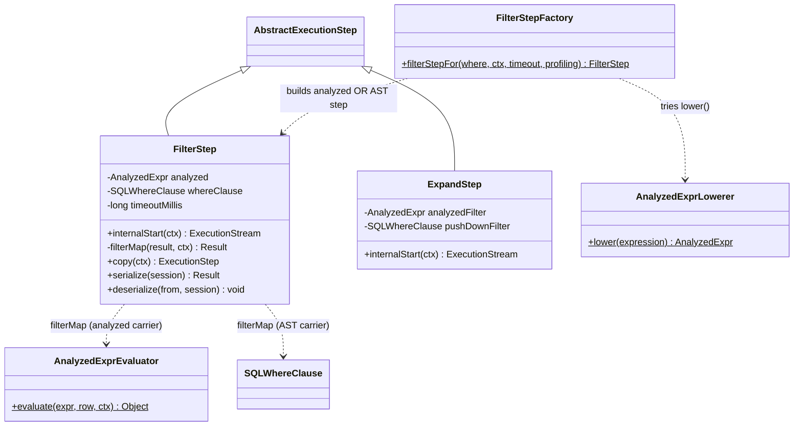
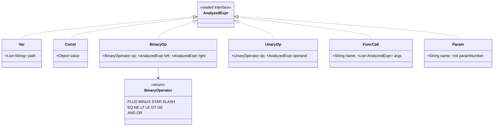
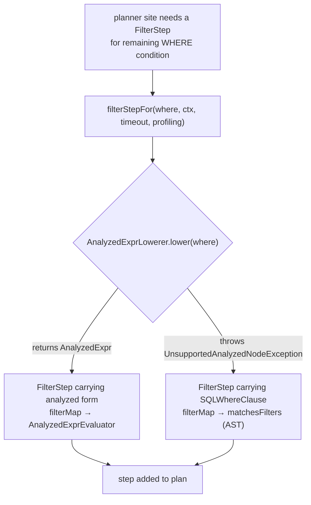
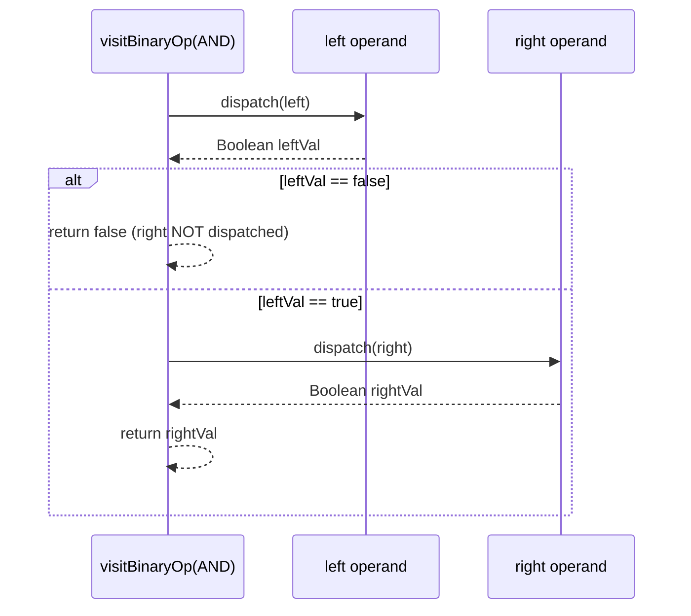
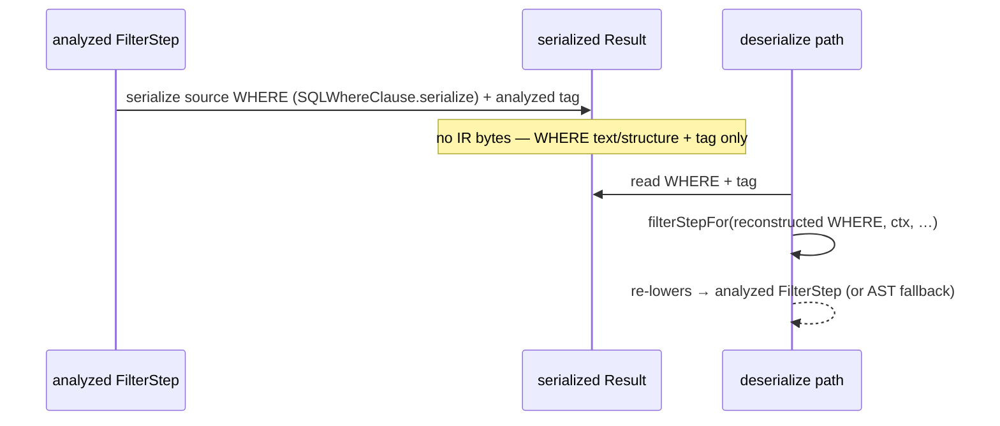

<!-- workflow-sha: 8b0a24709d3369f1c78740210f86acd9f51d404e -->
# Migrate FilterStep + ExpandStep to AnalyzedExpr — Design

## Overview

Today `FilterStep` and `ExpandStep` test each candidate record by walking the SQL parse tree
(the AST): both hold a `SQLWhereClause` and call `whereClause.matchesFilters(result, ctx)` per
row. This design makes them the first executor steps to filter over the immutable analyzed-expression
IR (`AnalyzedExpr`) instead. `AnalyzedExpr` is the data-only expression tree onto which the query
engine's separation-of-concerns umbrella (YTDB-901) is moving all evaluation. Evaluation runs through `AnalyzedExprEvaluator`
rather than the parse node's own `evaluate` method.

Most real WHERE clauses cannot be represented in the IR yet. The lowering subset covers
single-segment comparisons, arithmetic, `NOT`, method calls, and — added here — bind parameters and
boolean `AND`/`OR`. It does not yet cover `IN`, `BETWEEN`, `@rid`, subqueries, or multi-segment
paths; those stay un-lowerable and are the charter of later slices. So a clean cutover is impossible
in one slice. Two load-bearing shapes let the migration proceed despite that gap:

- **Planner-split fallback.** A new `filterStepFor(...)` factory tries to lower the WHERE to
  `AnalyzedExpr`. On success it builds a step that evaluates over the IR; on
  `UnsupportedAnalyzedNodeException` it builds the legacy AST-evaluating step. `FilterStep` stays one
  class holding *either* an `AnalyzedExpr` *or* a `SQLWhereClause` for evaluation — never both driving
  the filter.
- **New lowering and evaluator arms.** Two IR shapes this slice adds: a `Param` variant for bind
  parameters, and `AND`/`OR` as `BinaryOperator` constants that the evaluator short-circuits lazily.
  The evaluator also gains an in-place comparison fast path so the analyzed step is not slower than
  the AST step it replaces.

This design assumes familiarity with the YouTrackDB SQL execution pipeline (`ExecutionStep` chains,
the `Result` row abstraction) and with the S0 analyzed-IR substrate landed as commit `87cbfc0b6d`
(YTDB-915): the sealed `AnalyzedExpr` record set, its `dispatch`/`transformChildren` framework, and
the `AnalyzedExprLowerer` / `AnalyzedExprEvaluator` pair. The rest of the document covers: Core
Concepts (the vocabulary), Class Design (what the step classes and IR become), Workflow (the three
diagrams that carry the mechanisms), and Complex topics (the four risks a reviewer cannot verify from
the diagrams alone).

## Core Concepts

This design introduces five load-bearing ideas. Each is named and defined once here; the Parts that
follow use the term without re-defining it. Each entry pairs the concept with what it replaces so the
delta from today is visible.

**AnalyzedExpr.** The analyzed-expression IR — a sealed interface (`AnalyzedExpr`) permitting five
immutable record variants today (`Var`, `Const`, `BinaryOp`, `UnaryOp`, `FuncCall`) and a sixth
(`Param`) added here. It is a data-only expression tree: nodes carry no behavior, and a single static
`dispatch` `switch` routes each variant to a visitor. Evaluation reads the IR instead of the parse
tree. Replaces the executor's dependency on the mutable `SQLWhereClause` AST for evaluation.
→ Class Design §"The IR: sixth variant and two new operators".

**Lowering.** The one-way pass (`AnalyzedExprLowerer.lower`) that reads a WHERE's parse nodes and
builds the equivalent `AnalyzedExpr` tree, or throws `UnsupportedAnalyzedNodeException` on the first
node outside the covered subset. A successful `lower(...)` means the *whole* input was covered — there
is no partial tree. Replaces "the executor holds the parse tree directly". → Workflow §"Factory:
lower-or-fall-back".

**The analyzed evaluator.** `AnalyzedExprEvaluator` — the runtime that walks a lowered tree against a
`Result` row and returns the value it evaluates to. It re-implements the AST's comparison and
arithmetic semantics by delegating to the same shared engines (numeric promotion, the concrete
`SQLBinaryCompareOperator` classes), not by calling into the AST node. This slice adds a lazy
`AND`/`OR` arm and an in-place comparison fast path. Replaces `SQLBooleanExpression.evaluate(Result)`
for the migrated steps. → Class Design §"The analyzed evaluator's new arms".

**filterStepFor (the factory).** A new static factory that takes a WHERE expression plus the context,
timeout, and profiling flag, attempts lowering, and returns a `FilterStep` that carries the analyzed
form on success or the AST form on `UnsupportedAnalyzedNodeException`. It is the one place the
lower-or-fall-back decision is made, so the ~10 `new FilterStep` / `createWhereFrom` call sites in the
planners collapse to `filterStepFor(...)`. Replaces the direct `new FilterStep(whereClause, …)`
construction scattered across the planners. → Workflow §"Factory: lower-or-fall-back".

**The AST fallback path.** When a WHERE cannot lower, the step keeps its current behavior: it holds a
`SQLWhereClause` and evaluates through `matchesFilters(Result, ctx)`. This is not removed by this
slice — the un-lowerable majority of WHERE shapes need it, and later slices (S16/S17, filed as
YTDB-1183/1184) widen lowering until it can retire. Replaces nothing; it is today's behavior, kept as
the documented fallback. → Complex topics §"Two-path result equivalence".

## Class Design

### The step classes and the factory

The two migrated steps and the factory form the executor-facing surface of the change. `FilterStep`
stays one class but now holds one of two mutually-exclusive evaluation carriers; `ExpandStep`'s
push-down filter gets the same treatment; `filterStepFor` centralizes the lower-or-fall-back decision.

`FilterStep` holds exactly one non-null evaluation carrier. `filterMap` branches on which one is set:
the analyzed carrier routes to `AnalyzedExprEvaluator.evaluate(analyzed, result, ctx)` and casts the
`Boolean` result; the AST carrier routes to the existing `whereClause.matchesFilters(result, ctx)`.
The "never both drive the filter" invariant is scoped to evaluation — it does not forbid the step
retaining a serialize-only source form (Complex topics §"Serialization bridge"). `ExpandStep` mirrors
this on its optional `pushDownFilter`: the analyzed variant filters through the evaluator, the AST
variant through `matchesFilters`, and the coarser push-down levels that pre-screen candidate rows by
class, RID, and index before the generic per-row filter runs are untouched.

D3 chose this single-class split over three alternatives. Dual-carry (the step always holds the AST
even when it lowered) reduces coupling no further and carries dead state. An escape-hatch IR node wrapping an
un-lowered `SQLBooleanExpression` is the only option that literally removes the AST from `FilterStep`,
but it re-introduces the AST-inside-IR coupling YTDB-901 exists to remove. It also touches more code: a
sixth `AnalyzedExpr` variant carrying an opaque AST node forces *every* `AnalyzedExprVisitor` and
`AnalyzedExprTransform` implementer to grow an escape-hatch arm. The split instead confines the AST to
a step-local `SQLWhereClause` field touched only by `filterMap`'s branch. Widening lowering to cover
every WHERE shape is unrealistic for one slice. The LDBC SF1 benchmark suite
(the production-shaped query corpus this project measures against) shows why widening barely moves the
lowerable rate: the un-lowered clauses are blocked by their *operand shape*, not by a missing condition
type. They use operators lowering already supports, but on operands lowering cannot yet build —
multi-segment paths (`a.b.c`), subqueries, `@rid` — so adding more condition types (`IN`, `BETWEEN`)
leaves those same clauses blocked on the operand.

#### Edge cases / Gotchas

- A step must never be constructed with both carriers set for evaluation. The factory sets exactly
  one; a direct constructor call that sets both is a programming error the factory exists to prevent.
- `ExpandStep` has three constructor overloads today. The push-down-filter overloads gain the analyzed
  form; the no-filter overloads are unchanged.
- `copy(ctx)` on the analyzed carrier shares the immutable IR reference rather than deep-copying it —
  a `Const`/`Var`/`BinaryOp` tree is safe to share, unlike the mutable `SQLWhereClause.copy()`.

#### Decisions & invariants

- D3: fallback = planner-level split, single-class `FilterStep` holding either carrier for evaluation
  (`filterStepFor` factory).
- Invariant: exactly one evaluation carrier is non-null per step; `filterMap` branches on it.

### The IR: sixth variant and two new operators

The IR grows to represent the two shapes this slice must lower: bind parameters and boolean
connectives. Bind parameters become a new sealed variant; `AND`/`OR` become two more `BinaryOperator`
constants rather than a new node.

`Param` carries the bind parameter's *identity* — a nullable `name` (set for `:name`, null for
positional `?`) plus a `paramNumber` — never a resolved value. It mirrors the AST's
`SQLNamedParameter` / `SQLPositionalParameter`, which hold the same two fields. Resolution happens at
evaluate time, so a cached plan reused across executions with different bind values resolves each
execution's own values (Complex topics §"Bind-parameter lowering"). This is why `Param` is a record of
identity, not value: `AnalyzedExpr` is immutable, and the plan cache reuses live plans via
`copy(ctx)`, so the copy can share the `Param` reference and each execution re-resolves it. Adding the
variant is a deliberate compile-time break — the sealed `dispatch` `switch` and every
`AnalyzedExprVisitor` implementer must grow a `visitParam` arm before the code compiles.

`AND` and `OR` extend `BinaryOperator` rather than adding a boolean node, which keeps the IR
consistent with `NOT` already modeled as a `UnaryOperator` (an operator, not a `Not` node). Extending
the enum makes the exhaustive `switch (binaryOp.op())` in `visitBinaryOp` fail to compile until the
new arm is added — the operator-level analog of the sealed-variant break. This is D4; the rejected
dedicated n-ary boolean node is in the footer.

#### Edge cases / Gotchas

- `Param`'s `name` is null for positional `?` parameters and non-null for `:name` parameters — the
  same shape the AST subclasses use to distinguish the two.
- No `UnaryOperator.MINUS` exists or is added: the grammar folds unary minus into a numeric literal at
  parse time, so lowering never produces a unary-minus node.
- The n-ary `SQLAndBlock`/`SQLOrBlock` fold to *nested* binary `AND`/`OR`, so the IR has no n-ary
  boolean node; a later optimizer slice that prefers n-ary would re-introduce one (flagged for
  S4/S12).

#### Decisions & invariants

- D1: fold bind-parameter lowering into this slice — new `Param` variant, one lowering arm, one
  evaluator arm.
- D4: `AND`/`OR` as `BinaryOperator` constants, left-fold n-ary blocks, lazy short-circuit.
- Invariant: `Param` carries identity (`name`, `paramNumber`), never a resolved value.

### The analyzed evaluator's new arms

`AnalyzedExprEvaluator` gains three evaluation behaviors this slice needs but S0 shipped without: a
`Param` resolution arm, a lazy `AND`/`OR` arm, and an in-place comparison fast path. It keeps its two
S0 seams unchanged:

- Arithmetic runs through the shared numeric engine.
- Comparison runs through freshly reconstructed `SQLBinaryCompareOperator` instances, deriving the
  collation (the string-comparison ordering rule attached to a property) the same way the `Result`
  path — the AST evaluator that walks a materialized `Result` row — derives it. See §"Collation
  parity" for how that derivation is copied.

The `Param` arm resolves through the bind parameter's own `getValue(ctx.getInputParameters())` — the
raw lookup (name-first, then positional-number fallback) that the AST's `SQLBaseExpression.execute`
uses. It applies no coercion. The AST's scalar-comparison path applies none either: the AST's only
coercion of a bound value lives in `bindFromInputParams`, the method that re-parses a resolved
parameter into a parse-tree node (`toParsedTree(params.get(key))`). That method fires only when a
resolved parameter must itself be re-parsed as a sub-expression — never for a value used directly as
a comparison operand. A direct scalar comparison supplies its bind param as a plain operand, so it
never triggers `bindFromInputParams` and there is no coercion for the `Param` arm to replicate. See §"Bind-parameter lowering" for the parity test that pins this. This raw-value parity
is D2.

The `AND`/`OR` arm evaluates lazily: dispatch the left operand, cast to `Boolean`, and for `AND` return
`false` without dispatching the right when left is `false` (mirror for `OR`). Lazy evaluation is a hard
correctness requirement, not an optimization — eager evaluation of a later operand can throw where the
AST's `SQLAndBlock`/`SQLOrBlock` loop short-circuits past it. The in-place fast path reuses the AST's
`EntityImpl.isPropertyEqualTo` / `comparePropertyTo` primitives, guarded so it only runs where it is
provably parity-equivalent (Complex topics §"In-place comparison fast path").

#### Edge cases / Gotchas

- An `AND`/`OR` operand that is not a `Boolean` is a lowering-contract violation and raises
  `ClassCastException`, not a truthiness coercion — matching how the `NOT` arm already casts.
- The in-place fast path returns `FALLBACK` (an `InPlaceResult` value) on any collation or coercion
  risk; the evaluator then takes the slow comparison path, so the fast path never changes a result.
- `Param` resolution reads `ctx.getInputParameters()`; the evaluator already holds `ctx`, so no new
  plumbing is needed.

#### Decisions & invariants

- D1: the `Param` evaluator arm resolves at eval time.
- D2: the `Param` arm uses the raw `getValue` lookup, not `bindFromInputParams`; no coercion.
- D4: the `AND`/`OR` arm short-circuits lazily (hard correctness requirement).

## Workflow

### Factory: lower-or-fall-back

The factory is the single decision point that replaces every scattered `new FilterStep` construction.
It tries to lower the WHERE; a thrown `UnsupportedAnalyzedNodeException` is the expected signal that
the WHERE is outside the subset, caught and turned into the AST-carrying step.

Every `FilterStep` construction site routes through `filterStepFor`. The sites are:

- in `SelectExecutionPlanner`: `handleWhere`, `handleClassAsTargetWithIndexedFunction` (×4),
  `executionStepFromIndexes`, `createParallelIndexFetch`, and `tryPushDownFilterIntoExpand`;
- in `DeleteEdgeExecutionPlanner`: `handleWhere`.

The existing `createWhereFrom` seam — which today just wraps a `SQLBooleanExpression`
in a fresh `SQLWhereClause` — is the natural place the factory reads the WHERE from. `ExpandStep`'s
push-down filter (constructed in `handleExpand` and `tryPushDownFilterIntoExpand`) takes the same
lower-or-fall-back path for its filter carrier.

Catching `UnsupportedAnalyzedNodeException` as control flow is intentional: the lowerer's contract is
throw-on-first-unsupported-node with no partial tree, so the throw is the *only* signal that the WHERE
is un-lowerable, and the factory is the one place that turns it into the fallback choice. It is never
swallowed silently anywhere else.

#### Edge cases / Gotchas

- A WHERE that lowers partially cannot happen: `lower` either returns a complete tree or throws.
- The true fallback *rate* in production is not observable from the planner — `FilterStep` filters the
  index *residual* (`IndexSearchDescriptor.getRemainingCondition()`), not the source WHERE, so a
  runtime probe is needed to measure it (noted for the plan, not this slice's acceptance).

#### Decisions & invariants

- D3: `filterStepFor` factory centralizes lower-or-fall-back; the ~10 construction sites collapse to
  it.
- Invariant: a caught `UnsupportedAnalyzedNodeException` is the sole fallback trigger; never swallowed
  elsewhere.

### Lazy AND/OR short-circuit

The evaluator's `AND`/`OR` arm must reproduce the AST's short-circuit exactly, because a WHERE like
`a IS NOT NULL AND a.foo > 3` relies on the left operand gating the right. The AST's
`SQLAndBlock.evaluate` loop stops at the first `false` sub-block; the analyzed arm must stop at the
first `false` operand without dispatching the rest.

Worked trace of why laziness is correctness, not speed. Take `p IS DEFINED AND p / 0 > 1` where `p` is
absent (this shape is illustrative; the real trigger is any right operand that throws on the rows the
left operand excludes). Under eager evaluation the arm dispatches both operands first: the right
operand divides by zero and raises before the `AND` combines them, so the row errors. Under lazy
evaluation the left operand is `false`, the arm returns `false` immediately, and the right operand is
never dispatched — matching the AST, which never reaches the second sub-block. Left-fold preserves
order: `[a, b, c]` lowers to `BinaryOp(AND, BinaryOp(AND, a, b), c)`, evaluated `a` then `b` then `c`,
the same order `SQLAndBlock` iterates its list.

#### Edge cases / Gotchas

- A parsed 1-element `AND`/`OR` block lowers to its single element (no wrapper), so a vacuous node
  rarely forms at all.
- The reachable empty-block case (a non-null empty `subBlocks` list) lowers to `Const(true)` for
  `AND` and `Const(false)` for `OR` — the identity of each fold, matching the AST loop's
  fall-through return.
- The AST's null-`subBlocks` guard (`SQLOrBlock.evaluate:53` returns `true`) is unreachable from
  parsed input — the parser initializes `subBlocks = new ArrayList<>()` — so lowering does not model
  it.

#### Decisions & invariants

- D4: `AND`/`OR` left-fold + lazy short-circuit; reachable empty-block rule; null-guard unreachable.
- Invariant: a `false` `AND` operand (or `true` `OR` operand) returns without dispatching the
  remaining operand.

### Serialization bridge round-trip

The YTDB-916 acceptance requires `FilterStep.serialize` / `deserialize` to round-trip through the
analyzed form. The bridge does this without adding an IR wire format: the analyzed step serializes the
*source WHERE* it lowered from plus a tag recording it carried the analyzed form; `deserialize`
reconstructs the WHERE and re-runs `filterStepFor`, which re-lowers to the analyzed step (or the
fallback).

The reason for the bridge over a real IR wire format is that the execution-plan serialize/deserialize
round-trip is dead production code:

- `InternalExecutionPlan.serialize`/`deserialize` default-throw `UnsupportedOperationException`;
- an IDE find-usages search (PSI) finds zero production callers;
- EXPLAIN uses `toResult`/`prettyPrint`, not serialize;
- the plan cache reuses *live* objects via `copy(ctx)`, never a serialized form.

Building a clean IR wire format invests in a path nothing consumes. The bridge reuses
`SQLWhereClause.serialize` (which is already structured and param-by-reference) and the D3 factory, so
it adds almost no code and keeps the round-trip test green through the transition. This is D5. The
rejected alternative removes serialize from only `FilterStep` and `ExpandStep` now (amending the
YTDB-916 acceptance) while the other sibling steps keep their dead serialize; it also makes any plan
holding a `FilterStep` un-round-trippable. The consistent fix is instead the repo-wide removal, deferred
to a separate cleanup slice (YTDB-1185, filed), after which the bridge is deleted with the rest of the
machinery.

#### Edge cases / Gotchas

- The retained source form is display/serialize-scoped only — `prettyPrint` (EXPLAIN) and serialize
  read it; evaluation runs off the `AnalyzedExpr`. This does not violate D3's "never both drive the
  filter" invariant, which is scoped to the evaluation carrier.
- The plan should prefer a lean `String` source form (`whereClause.toString()`, already what
  `prettyPrint` reads) over retaining a live `SQLWhereClause` AST node, re-parsing that string on
  deserialize. Structured `SQLWhereClause.serialize` retention is the fallback, used only when a text
  round-trip loses fidelity the test needs.
- Re-lowering on deserialize relies on lowering being deterministic — it is a pure structural
  recursion, so it holds.

#### Decisions & invariants

- D5: minimal source-WHERE bridge (serialize source WHERE + tag, re-lower on deserialize); no IR wire
  format; repo-wide removal deferred to YTDB-1185.
- Invariant: the retained source form is never a second evaluation path.

# Complex topics

The four topics below are the parts a reviewer cannot verify from the class and workflow diagrams
alone:

- the **parity risk** that makes the two-path design dangerous;
- the **fast-path port** that keeps the migrated step off the per-record deserialize regression;
- the **collation fact** that makes the migration behavior-preserving for these steps;
- the **bind-param resolution** detail behind D2.

## Two-path result equivalence

**TL;DR.** `filterStepFor` routes the *same* predicate to either the analyzed evaluator or the AST
`matchesFilters` depending on whether it lowered. The analyzed evaluator is a genuine
re-implementation, not a shared call into the AST, so any drift produces silently different row sets
for logically identical WHEREs — no throw, just a wrong filter outcome. A differential parity harness
is the mitigation and a named plan obligation.

This is the load-bearing risk of the slice. When a WHERE lowers, the row is filtered by
`AnalyzedExprEvaluator`, which reconstructs comparison operators (`new SQLEqualsOperator(-1)` and
friends) and re-derives the collate independently in `evaluateComparison` / `collateFor`. When the
same WHERE does *not* lower, the row is filtered by `SQLBooleanExpression.evaluate`. The two share no
call at the comparison level — the evaluator mirrors the AST's sequence rather than delegating to it.
A divergence therefore surfaces silently: the query returns a different set of rows for a predicate
that means the same thing, with no crash to flag it, and no unit test on one path alone catches it.

The mitigation is a **differential parity harness**, which the plan must carry as a named test
invariant beyond the per-decision unit tests: run a corpus of lowerable WHEREs — single-segment
comparisons, arithmetic, `NOT`, method calls, bind parameters, and `AND`/`OR` combinations — through
*both* the analyzed `FilterStep` and the AST `FilterStep` over the same rows, and assert identical
result sets.
The corpus must include a `ci`-collated comparison, so the analyzed evaluator's collate derivation is
compared directly against the AST's on the case that most easily diverges.

### Edge cases / Gotchas

- The harness compares the two step implementations, not the evaluator against the lowerer, so it
  exercises the full `filterMap` branch each path takes.
- Beyond parity, the factory must cover both the `createWhereFrom` sites and the two direct-`SQLWhereClause`
  sites (`info.whereClause` at ~1992, `outerWhere` at ~3470 in `SelectExecutionPlanner`) plus
  `DeleteEdgeExecutionPlanner` — a missed site silently keeps the old AST construction.

### Decisions & invariants

- D3: the planner-split fallback creates the two-path risk; the parity harness is its named
  mitigation.
- Invariant: for any predicate both paths can evaluate, the analyzed and AST `FilterStep` return
  identical row sets.

## In-place comparison fast path

**TL;DR.** The AST `FilterStep` avoids deserializing a property for a `property <op> constant`
comparison via `SQLBinaryCondition.tryInPlaceComparison`. The analyzed evaluator must port the same
fast path, or the migrated step deserializes where the AST step did not — a per-record hot-path
regression that fails the LDBC JMH neutrality gate.

The AST fast path (added by YTDB-628, commit `a8d7204611`) compares an RHS constant against the
entity's *serialized* bytes through `EntityImpl.isPropertyEqualTo` (for `=` / `!=`) or
`comparePropertyTo` (for `< <= > >=`), skipping the deserialize step entirely. Both signal a decline
on any collation or coercion risk (`FALLBACK`, a value of the `InPlaceResult` enum, or an empty
`OptionalInt`), so the fast path is parity-equivalent by construction — it only answers when the
answer is certain.

The analyzed evaluator's comparison arm reuses those same `EntityImpl` primitives, guarded on three
conditions that must all hold:

1. The left operand is a single base identifier (a `Var`).
2. The right operand is an *early-calculated constant* — a value the RHS resolves to before the
   comparison runs and without reading the record, which the AST's `isEarlyCalculated` accepts for a
   literal or a resolved bind parameter.
3. The row is an `EntityImpl`.

On any guard miss or a
`FALLBACK` return, the evaluator takes its normal slow comparison path (evaluate both operands, apply
collate, delegate to the reconstructed operator). Because the fast path takes effect only when it is
provably safe and otherwise defers to the slow path, it changes performance, never a result.

### Edge cases / Gotchas

- The fast path applies to comparison operators only; arithmetic and boolean arms do not use it.
- A `Param` RHS resolves to a value before the comparison, so a resolved bind param is exactly the
  "early-calculated constant" the guard wants — the fast path composes with D1.
- Collation is the trap: the fast path must fall back on any non-default collation, since the in-place
  comparison works on raw bytes that the collate transform would otherwise change.

### Decisions & invariants

- Obligation 1a (from YTDB-916): port the AST in-place comparison fast path into the analyzed
  comparison arm.
- Invariant: the fast path returns `FALLBACK` and defers to the slow path on any collation/coercion
  risk, so it never changes a result.

## Collation parity

**TL;DR.** Migrating `FilterStep`/`ExpandStep` to the analyzed evaluator preserves their current
collation behavior, because both the steps' current entry (`matchesFilters(Result) → evaluate(Result)`)
and the analyzed evaluator apply collation. This slice adds a `ci`-collated regression test to lock
that parity; it is not a behavior change. The observable case-insensitive shift the YTDB-916 comment
warns of belongs to the `Identifiable`-path callers (SecurityEngine, deferred to S7), not here.

The AST has two evaluation overloads that differ in collation: `evaluate(Result, ctx)` applies the
collate transform, and `evaluate(Identifiable, ctx)` deliberately skips it. If a caller migrated from
the `Identifiable` overload to the always-collating analyzed evaluator, a `ci`-collated `name = 'Foo'`
would start matching `'foo'` — an observable behavior change. PSI find-usages confirms this slice's
steps do not touch the `Identifiable` overload: `FilterStep.filterMap` and `ExpandStep`'s push-down
filter both enter through `matchesFilters(Result) → evaluate(Result)`, the collation-applying
overload; and none of the 16 `evaluate(Identifiable)` / `matchesFilters(Identifiable)` call sites is
in `FilterStep`, `ExpandStep`, `SelectExecutionPlanner`, or `DeleteEdgeExecutionPlanner`. The analyzed
evaluator's `evaluateComparison` applies the same collate the `Result` path does (fetch left-then-right
collate, transform both when non-null), so the migration is collation-neutral for these steps.

### Edge cases / Gotchas

- The `Identifiable`-path callers that *would* see the shift — SecurityEngine (S7/YTDB-922),
  `DeltaBuilder`, and the MATCH path — are out of this slice's scope; migrating them is where the
  collation-convergence behavior change actually lands.
- The `ci`-collated regression test is here to catch a *future* accidental drift, not because this
  slice changes collation behavior.

### Decisions & invariants

- Obligation 2 (from YTDB-916): confirm collation convergence is intended per migrated caller;
  resolved for this slice as a no-op preserved by a regression test.
- Invariant: the migrated steps' collation behavior is unchanged; the analyzed evaluator applies the
  same collate as `evaluate(Result)`.

## Bind-parameter lowering

**TL;DR.** This slice folds bind-parameter (`?` / `:name`) lowering in rather than inheriting S0's
throw, because production WHEREs are overwhelmingly parameterized — a subset that throws on bind params
runs the AST fallback on nearly every real query, leaving the analyzed path near-dead in production.
The `Param` variant resolves the RHS bind param by the same raw `getValue` lookup the AST uses; a
parity test guards that it does not drift onto the coercion path.

A research-time survey of the LDBC SF1 query set (the production-shaped corpus this project benchmarks
against) puts the magnitude at:

- ~37 of 64 WHERE clauses touch a bind parameter.
- 4 of the 9 top-level `FilterStep` WHEREs are bind-param-blocked alone.
- Folding bind params in moves the lowerable top-level fraction from ~1/9 to ~5/9.

These are survey estimates, not code-derivable facts; the
decision rests on production WHEREs being overwhelmingly parameterized, which the survey fractions
corroborate rather than prove. Even at a lower true fraction, bind params are the
highest-payoff-per-effort lowering item, and the cost is
contained — S0 already built the `AnalyzedAstAccess.inputParam` read-seam, resolution is
`getValue(ctx.getInputParameters())`, and the evaluator already holds `ctx`.

The parity fact (D2): `SQLBaseExpression.execute` resolves a comparison-RHS bind param through
`inputParam.getValue(params)`, which returns the raw bound value (`SQLNamedParameter.getValue` tries
the name key first, then the positional number). The AST's coercion of a bound value — re-parsing it
into a parse-tree node via `toParsedTree` — lives only in `bindFromInputParams`, a distinct
sub-expression path a scalar comparison never takes. So the `Param` evaluator arm resolves by the same
raw lookup with no coercion to replicate. Because this is
load-bearing, the D1 parity test asserts the `Param` arm resolves through `getValue`, not
`bindFromInputParams`, so a future refactor that reroutes RHS resolution through the coercion path is
caught by a red test.

### Edge cases / Gotchas

- Folding bind params expands YTDB-916 beyond its written scope (which inherited S0's deferral); noted
  on the issue.
- Lowering bind params does not remove the fallback — multi-segment paths, `@rid`, context vars,
  subqueries, and `MATCHES` stay un-lowerable.
- A named parameter's number fallback (`params.get(paramNumber)` when the name key is absent) must be
  mirrored exactly, pinned by the parity test.

### Decisions & invariants

- D1: fold bind-parameter lowering into this slice.
- D2: the `Param` arm resolves the RHS bind param by the raw `getValue` lookup; no coercion; parity
  test asserts `getValue`, not `bindFromInputParams`.
