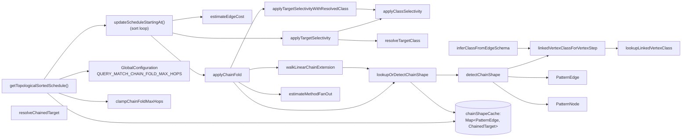

# MATCH Edge-Method Chain Cost Aggregation — Architecture Decision Record

YouTrack issue: [YTDB-643](https://youtrack.jetbrains.com/issue/YTDB-643)

## Summary

The MATCH execution planner now folds the downstream vertex's `WHERE`
selectivity (and, optionally, the selectivity / fan-out of subsequent
linear hops) into the first edge's cost during the sort phase of
`MatchExecutionPlanner.updateScheduleStartingAt`. The pattern graph,
parser, runtime `MatchStep` pipeline, and public API are unchanged.

Before this change, branches written with the edge-method pattern
`.outE('X').inV(){where: …}` (and its `inE→outV` / `bothE→bothV`
variants) sorted as if they had no filter, because the first edge's
target is a synthetic intermediate edge alias (no `WHERE`, no class)
and the second edge's method is not a recognised direction. Branches
with very different selectivities sorted as ties, and the broad branch
(inserted first) won via TimSort's stable-sort tiebreaker. After the
change, the planner schedules the more selective branch first,
matching the behaviour already in place for the equivalent
single-step pattern `.out('X'){where: …}`.

The fold is enabled by default (`QUERY_MATCH_CHAIN_FOLD_MAX_HOPS = 10`),
clamped to `[0, 1000]`. Operators can downgrade to legacy single-hop
behaviour with `= 1` or disable the fold entirely with `= 0`.

## Goals

- Close the cost-model gap between `.out('X'){where: p}` and
  `.outE('X').inV(){where: p}` so the MATCH planner schedules
  competing branches by their full chain selectivity, not by the
  single-hop leading edge.
- Preserve runtime semantics — the result set of any MATCH query is
  identical before and after the fold; only `EXPLAIN` ordering
  changes.
- Keep the change strictly additive: the pattern graph, parser, and
  `MatchStep` pipeline are untouched; the fold can be disabled at
  runtime via `QUERY_MATCH_CHAIN_FOLD_MAX_HOPS = 0` for emergency
  rollback without a code change.
- Cover the three direction variants (`outE→inV`, `inE→outV`,
  `bothE→bothV`) and stay correct under user-named intermediate
  aliases with their own `WHERE` (independence multiplication).
- Extended during execution: the fold scales past the immediate
  downstream vertex into multi-hop linear chains, bounded by a
  knob and structural termination so it cannot pathologically
  inflate plan-construction time.

## Constraints

- **Pattern graph, runtime, parser, and public APIs unchanged** —
  this remains a planner-only fix. `Pattern.addExpression`,
  `PatternEdge`, `PatternNode`, `SQLMatchPathItem`, and the
  `MatchStep` pipeline all stay as they were.
- **Independence multiplication only** — when the intermediate edge
  alias has its own `WHERE`, the chain fold multiplies the downstream
  selectivity on top. Same heuristic as
  `estimateCompoundAndSelectivity`; correlated edge/vertex predicates
  slightly under-estimate the true cost (acceptable; documented).
- **Fallback on unknown cost** — if the first edge's
  `estimateEdgeCost` returns `Double.MAX_VALUE`, the sort-loop's
  finite-cost gate skips both the existing
  `applyTargetSelectivity` call and the chain fold, preserving the
  stable-sort tiebreaker for unestimated edges. The class-forced
  overload also short-circuits a `MAX_VALUE` input through every
  null/missing-class path as defense-in-depth (pinned by unit tests).
- **Spotless compliance** and **coverage gate** (85% line / 70%
  branch on changed lines) enforced by CI.

## Architecture Notes

### Component Map

- **`MatchExecutionPlanner`** owns every node above except
  `GlobalConfiguration` (api module) and `PatternEdge` /
  `PatternNode` (read-only structural classes).
- **Sort-loop entry point.** `updateScheduleStartingAt` runs the
  per-edge cost computation. It calls the existing
  `applyTargetSelectivity` on the immediate `neighbor.alias` (so
  user-named intermediate edge aliases with their own `WHERE` keep
  contributing), then calls the new `applyChainFold` when the knob
  is `>= 1`, then `applyDepthMultiplier`. The chain fold is gated
  inside the existing finite-cost branch so the visited-neighbor
  zero-cost path and the `MAX_VALUE` short-circuit are unaffected.
- **`applyTargetSelectivityWithResolvedClass`** is the class-forced
  sibling of the existing `applyTargetSelectivity`. It exists because
  the chain helper has already computed the class via chain-aware
  precedence; re-inferring with the outer edge's direction would pick
  the wrong endpoint for `inE→outV`. The shared body lives in
  `applyClassSelectivity`, called by both overloads.
- **`resolveChainedTarget`** is the public-facing chain detector
  (`@Nullable`-returning, not `Optional`-returning). It composes
  `detectChainShape` (pure structural rule, cacheable) with the
  dynamic visited-edge check.
- **`applyChainFold`** is the unified entry point for the fold.
  Composes single-hop fold with the multi-hop walk.
- **`walkLinearChainExtension`** iteratively extends past the first
  hop while `currentVertex.out.size() == 1`, the structural rule
  holds, no back-edge is taken, and `remainingHops > 0`. Uses a
  walk-local `chainEdges` set on top of the DFS-level `visitedEdges`
  so the caller's state is never mutated.
- **`linkedVertexClassForVertexStep` / `lookupLinkedVertexClass`**
  are the single source of truth for "edge class → linked vertex
  class on a given side." Both the chain fold's class inference and
  the standalone `inV` / `outV` branch of `inferClassFromEdgeSchema`
  go through them, so the two paths cannot drift.
- **`chainShapeCache`** memoises the structural-detection result
  per first-edge identity, allocated once per plan in
  `getTopologicalSortedSchedule` and threaded through every
  `updateScheduleStartingAt` call.

### Decision Records

#### D1: Chain-cost aggregation at sort time, not pattern collapsing

- **Alternatives considered:** (a) collapse `outE('X').inV()` into
  one `PatternEdge` during `Pattern.addExpression`; (b) teach the
  runtime a "combined hop" primitive that collapses at execution
  time; (c) aggregate cost at sort time (chosen).
- **Rationale:** Collapsing breaks user-named intermediate edge
  aliases (referenced from `RETURN`, `ORDER BY`, `$matched`) and
  forces a composite edge-filter representation through the parser,
  planner, and runtime. The runtime `MatchStep` pipeline already
  executes the pattern correctly — the bug is in cost ordering, not
  execution. Sort-time aggregation is confined to the planner sort
  loop, composes cleanly with the existing multiplicative
  selectivity model, and is strictly additive: removing the
  call-site gate recovers the pre-fix behaviour.
- **Outcome:** Implemented in `applyChainFold` inside
  `MatchExecutionPlanner.updateScheduleStartingAt`'s sort loop. No
  parser, pattern, or runtime change.
- **Risks:** Relies on the two `PatternEdge`s being consecutive in
  DFS order and on the recursive DFS pass into the intermediate
  alias seeing only one candidate edge (so its `MAX_VALUE` cost is
  irrelevant). Both are properties of the existing pattern-graph
  topology; documented in `design-final.md`.

#### D2: Structural chain detection rule

- **Alternatives considered:** (a) prefix-check the auto-generated
  intermediate alias name; (b) add a parser flag on `PatternNode`
  marking edge-record aliases; (c) pure structural check (chosen).
- **Rationale:** The structural signature is unambiguous —
  TinkerPop vertex steps (`inV` / `outV` / `bothV`) only follow an
  edge step. Avoids coupling to the parser's naming convention or
  adding new state to the pattern graph. The `neighbor.in.size() == 1`
  + identity guard rejects the fragment-join case (a user reusing
  `{as: e}` across two MATCH fragments) before it can fold the
  filter against the wrong alias.
- **Outcome:** Implemented in `detectChainShape` with five clauses
  (item null-check; first-method whitelist `outE` / `inE` / `bothE`;
  `neighbor.out.size() == 1` not visited; `neighbor.in.size() == 1`
  identity-equal to `edge`; second-method whitelist `inV` / `outV` /
  `bothV`). `resolveChainedTarget` adds the dynamic visited-edge
  check on top.
- **Risks:** New edge-traversal methods that should also be
  chain-aware (e.g. a hypothetical `outE().filter(…).inV()`) would
  require widening the whitelist. The rule lives in one helper, so
  future-proofing is localised.

#### D3: Independence multiplication with intermediate filters

- **Alternatives considered:** (a) skip the fold when the
  intermediate alias has its own `WHERE` / class (avoid
  double-counting); (b) multiply the intermediate filter by the
  downstream vertex selectivity (chosen).
- **Rationale:** `applyTargetSelectivity` already multiplies base
  cost by the intermediate's filter when present. The fold adds a
  second multiplicative factor for the downstream vertex's filter.
  This is the correct algebraic extension under the independence
  assumption already used by `estimateCompoundAndSelectivity` — not
  double-counting.
- **Outcome:** The sort loop calls the existing
  `applyTargetSelectivity` (intermediate alias) **and** the chain
  fold (downstream alias) sequentially. Multiplication commutes;
  call order does not matter; each call short-circuits to `baseCost`
  when its alias has no filter / class / row estimate. The
  pre-existing test `testEdgeAliasSchedulingOrder` (which uses an
  intermediate alias with its own `WHERE`) continued to pass without
  modification, proving the intermediate filter's contribution is
  preserved.
- **Risks:** Independence is a heuristic; correlated predicates
  under-estimate true cost. Same approximation already accepted
  elsewhere; documented.

#### D4: Class-forced overload, not a mutable parameter

- **Alternatives considered:** (a) add a new parameter to the
  existing `applyTargetSelectivity` to carry a pre-resolved class;
  (b) introduce a sibling overload (chosen).
- **Rationale:** The existing 8-arg overload's `isOutbound` flag is
  consumed only by `resolveTargetClass`, which the chain-aware path
  bypasses. Adding a parameter would either be dead at the
  chain-aware site or force callers to thread a meaningless flag.
  An overload keeps each signature minimal: the 8-arg form does
  class resolution, the 6-arg form does not.
- **Outcome:** `applyTargetSelectivityWithResolvedClass` (6-arg).
  The shared body (`applyClassSelectivity`) is private and accepts
  a non-null class; null-guards are the callers' responsibility.
  The 8-arg form's existing call site at the sort loop produces
  byte-identical results post-refactor.

#### D5: `@Nullable` return type instead of `Optional<ChainedTarget>`

- **Alternatives considered:** (a) return `Optional<ChainedTarget>`
  (originally proposed in the implementation plan); (b) return
  `@Nullable ChainedTarget` (chosen during execution).
- **Rationale:** The surrounding planner style uses `@Nullable`
  consistently — `resolveTargetClass`, `inferClassFromEdgeSchema`,
  `linkedVertexClassForVertexStep`, `lookupLinkedVertexClass` all
  return nullable references. Routing the new helper through
  `Optional` would have been the single dissenter, and would have
  forced an `.isPresent()` / `.get()` pair in the hot sort loop
  with no semantic gain. JetBrains `@Nullable` annotation gives the
  same null-safety hint to IntelliJ and the Errorprone-equivalent
  static analysis already in CI.
- **Outcome:** `@Nullable static ChainedTarget resolveChainedTarget(...)`.

#### D6: Multi-hop linear extension with knob and structural cache

- **Alternatives considered:** (a) keep the fold strictly
  single-hop; (b) propagate selectivity across all reachable hops
  with full pattern traversal; (c) iterative linear extension with
  a structural cache and a depth knob (chosen).
- **Rationale:** Single-hop closes the most common gap but leaves
  multi-step chains (e.g. `person.outE('Wrote').inV().outE('HasTag')
  .inV(){where: name = 'targetTag'}`) sorting as ties when the
  selectivity hides past the first hop. Full propagation requires
  reasoning about branch points and cycles — the same complexity
  that motivated the planner's per-edge cost model in the first
  place. Linear extension is the sweet spot: it walks only as long
  as the chain stays a single linear sequence and terminates at
  branch points, visited edges, or the depth knob. The structural
  rule that makes single-hop safe applies at every step of the
  walk; correctness follows directly from D2.
- **Outcome:** `applyChainFold` composes
  `lookupOrDetectChainShape` (the cached structural detection) with
  `walkLinearChainExtension`. The walk uses a two-set visited check
  (DFS-level `visitedEdges` plus a walk-local `chainEdges`) to
  avoid mutating DFS state. `QUERY_MATCH_CHAIN_FOLD_MAX_HOPS`
  (default 10, clamped to `[0, 1000]`) bounds the walk; values `<=
  1` short-circuit to single-hop semantics; `0` disables the fold
  entirely as the rollback safety valve.
- **Risks:** Pathological knob values (`Integer.MAX_VALUE`,
  negatives) could overflow the walk's bookkeeping arithmetic.
  Mitigated by `clampChainFoldMaxHops`, which silently floors
  negatives to 0 and emits a one-shot WARN per unique
  out-of-range value above the ceiling. Pinned by an integration
  test that runs the fold under `Integer.MAX_VALUE`,
  `Integer.MIN_VALUE`, and a large in-range value.

#### D7: Per-plan structural cache with negative-result memoisation

- **Alternatives considered:** (a) recompute the structural answer
  on every sort-loop iteration; (b) `Map.computeIfAbsent` keyed by
  `PatternEdge`; (c) explicit `containsKey` / `put` keyed by
  `PatternEdge` (chosen).
- **Rationale:** The structural answer for any
  given `PatternEdge` is stable for the lifetime of one plan —
  it depends only on the pattern graph plus per-plan
  `aliasClasses` / `session`. Recomputation is wasted work on the
  hot path. `computeIfAbsent` cannot represent a cached
  known-not-chain answer (`null` value) because it would re-run the
  detector each time. Explicit `containsKey` disambiguates "cache
  miss" from "cached negative."
- **Outcome:** `chainShapeCache: Map<PatternEdge, ChainedTarget>`
  allocated in `getTopologicalSortedSchedule`, threaded through
  `updateScheduleStartingAt` and the multi-hop walk. The dynamic
  visited-edge check stays outside the cache so a chain whose
  vertex-step has been scheduled correctly skips the fold.

#### D8: Single source of truth for vertex-step class inference

- **Alternatives considered:** (a) duplicate the edge-class →
  linked-vertex-class lookup in the chain fold and in
  `inferClassFromEdgeSchema`; (b) extract a shared helper (chosen).
- **Rationale:** Two callers resolving the same mapping
  ("for an `inV` step against edge class `X`, the linked vertex
  class is `X.in`'s linked class") must not drift. A future
  variant (e.g. a new vertex-step name) should require editing
  exactly one site.
- **Outcome:** `linkedVertexClassForVertexStep` (public,
  `@Nullable`-returning) handles vertex-step-name → property-name
  mapping; `lookupLinkedVertexClass` (private) handles the schema
  walk. Both the chain fold's precedence-2 fallback and
  `inferClassFromEdgeSchema`'s `inV` / `outV` branch route through
  them. `lookupLinkedVertexClass`'s contract was tightened to
  accept `@Nullable DatabaseSessionEmbedded` directly (was
  `CommandContext` plus pre-existing call sites that pulled the
  session out manually); pre-existing callers were updated to the
  new contract.

### Invariants & Contracts

- For every branch from a source node, the scheduler computes the
  same chain cost whether the branch uses `.out('X'){where: p}` or
  `.outE('X').inV(){where: p}`, given identical data — modulo the
  D3 independence-multiplication caveat for correlated predicates.
- A branch that produces strictly fewer intermediate rows than
  another at runtime is never scheduled after that other branch,
  given known selectivity estimates. Pinned by the
  selective-before-broad ordering assertions in the chain-cost
  regression tests.
- Runtime result set for any tested MATCH query is identical
  before and after the fix. Pinned by the `assertEquals(expected,
  result.size())` assertions on the Cartesian-product size in
  every chain-cost regression test.
- The chain fold is a no-op when the downstream vertex has no
  filter, no explicit class, and no `estimatedRootEntries` entry
  — `applyTargetSelectivityWithResolvedClass` short-circuits to
  `baseCost` through every null/missing-class branch. Pinned
  through the unit suite's short-circuit-table tests, including
  `MAX_VALUE` preservation through the null-class and
  no-filter / no-estimate paths.
- The chain fold is fully disabled when
  `QUERY_MATCH_CHAIN_FOLD_MAX_HOPS = 0` — the sort-loop call site's
  `chainFoldMaxHops >= 1` gate skips `applyChainFold` entirely.
  This is the production rollback path.

### Integration Points

- `MatchExecutionPlanner.getTopologicalSortedSchedule` reads
  `GlobalConfiguration.QUERY_MATCH_CHAIN_FOLD_MAX_HOPS` once,
  clamps via `clampChainFoldMaxHops`, allocates the structural
  cache, and threads both into `updateScheduleStartingAt`.
- `updateScheduleStartingAt` calls `applyChainFold` inside the
  finite-cost branch immediately after the existing
  `applyTargetSelectivity` call and before
  `applyDepthMultiplier`.
- `applyTargetSelectivityWithResolvedClass` is the new public-ish
  entry point used by the chain fold; the existing
  `applyTargetSelectivity` continues to handle single-hop edges.
  Both delegate to the private `applyClassSelectivity`.
- `linkedVertexClassForVertexStep` (with
  `lookupLinkedVertexClass` underneath) is shared between the
  chain fold's class inference and the standalone vertex-step
  branch of `inferClassFromEdgeSchema`.
- `EXPLAIN` output ordering is the observable contract used by
  the integration regression suite (`MatchEdgeMethodChainCostTest`,
  `MatchEdgeMethodInferenceAndAbortTest`).

### Non-Goals

- Collapsing the pattern graph or merging `PatternEdge`s.
- Changing the runtime execution order independently of the
  schedule.
- Teaching `parseDirection` about `inV` / `outV` / `bothV`.
- Per-edge `WHERE` selectivity propagation across pattern branch
  points or back-edges. The walk terminates structurally at the
  first branch / back-edge / visited edge.
- Joint distributions for correlated predicates. The fold uses the
  independence assumption already used elsewhere in the planner.

## Key Discoveries

- **`@Nullable` is the planner's idiom, not `Optional`.** The
  initial helper signature drafted in the implementation plan
  used `Optional<ChainedTarget>`. Aligning with the surrounding
  planner code (`resolveTargetClass`,
  `inferClassFromEdgeSchema`, `linkedVertexClassForVertexStep`)
  produced a cleaner sort-loop call site and avoided allocating
  an `Optional` wrapper on the hot path.

- **`isPresent()` / `.get()` on Optional in a tight loop is worth
  caching.** When the helper still returned `Optional`, an early
  reviewer flagged the repeated `chain.isPresent() && chain.get().…`
  pattern in the sort loop; extracting `var target = chain.get();`
  removed the duplication. The `@Nullable` migration that followed
  obviated the issue entirely — `target != null` is the natural
  shape.

- **Errorprone's `InvalidParam` matcher flags
  `{@code paramName}` in Javadoc that resembles a parameter name.**
  When the new overload's Javadoc mentioned `{@code resolveTargetClass}`,
  the build failed because Errorprone considered the token similar
  to the `preResolvedTargetClass` parameter. Switching to
  `{@link #resolveTargetClass}` disambiguates parameter references
  from method references and silences the false positive — a useful
  Javadoc pattern to remember in this codebase.

- **The fragment-join negative case is already blocked by
  `neighbor.in.size() == 1`, but the identity guard
  (`neighbor.in.iterator().next() == edge`) is worth keeping.**
  The size-1 guard rejects the common case of a user reusing
  `{as: e}` across two MATCH fragments. The identity guard is
  defense-in-depth against a future pattern-construction
  refactoring that produces an intermediate with a single
  incoming edge that is not `edge` itself. Both clauses are
  cheap; together they pin the rejection at the structural level.

- **The `MAX_VALUE` short-circuit gate is structurally unreachable
  through the chain-fold integration**, because the chain rule
  restricts the first hop to `outE` / `inE` / `bothE`, all of which
  `parseDirection` resolves to a non-null `Direction`, so
  `estimateEdgeCost` always returns a finite value. The
  invariant is still pinned by unit tests on the
  `applyTargetSelectivityWithResolvedClass` short-circuit paths
  — defense-in-depth against a future regression that bypasses
  the gate (e.g. by hoisting the fold outside the
  `if (cost < Double.MAX_VALUE)` branch).

- **`String.equalsIgnoreCase` is faster than `toLowerCase` +
  `equals` on the sort-loop hot path.** The chain-detection rule is
  invoked on every candidate edge, including the very common
  single-step methods (`.out` / `.in` / `.both`).
  `equalsIgnoreCase` short-circuits on length mismatch, so the
  whitelist check rejects single-step methods without a
  `toLowerCase` allocation. Only on a positive match does the
  code take the lower-cased canonical form for downstream
  inference.

- **Stable-sort tiebreaker is the operative semantics for
  unestimated chains.** When the first-edge cost is `MAX_VALUE`
  (e.g. an edge class without `in` / `out` linked-property
  metadata), the sort-loop's `cost < MAX_VALUE` gate skips both
  the existing `applyTargetSelectivity` call and the chain fold.
  TimSort then preserves insertion order. Tests of this branch
  must therefore assert insertion-order ordering, not
  selective-before-broad.

- **Negative-result caching is a real hot-path win.**
  `lookupOrDetectChainShape` memoises both positive and negative
  results because the very common case is "edge is not the start
  of a chain." `Map.computeIfAbsent` cannot represent a cached
  `null` value (it re-runs the function), so the cache uses
  explicit `containsKey` / `put`.

- **Operator-error knob configurations need explicit clamping
  with a one-shot WARN.** The multi-hop walk's bookkeeping
  arithmetic (`2 * remainingHops + 2` allocation hint) goes
  negative under `Integer.MAX_VALUE`. Silent clamping would leave
  operators debugging a fold depth that did not match their
  configuration; the `getAndSet`-guarded WARN per unique
  out-of-range value gives a clear signal without spamming logs
  on a server churning through plans.

- **Centralising the edge-schema → linked-vertex-class lookup is
  load-bearing for correctness.** Two paths now resolve `inV` /
  `outV` against an edge schema: the chain fold's precedence-2
  fallback and `inferClassFromEdgeSchema`'s `inV` / `outV` branch.
  Without a shared helper, a future addition (e.g. supporting a
  hypothetical new vertex-step name) would have to update two
  sites in lock step. Routing both through
  `linkedVertexClassForVertexStep` reduces the lock-step risk to
  one site.

- **Existing ordering tests must be re-verified, not just the new
  ones.** When the cost-fold landed, the pre-existing
  `testEdgeAliasSchedulingOrder` assertion (`workEdge` before
  `tag`) under
  `.outE('SOWorkAt'){as: workEdge, where: workFrom = 2015}.inV()`
  could in principle have flipped. It did not — the intermediate
  alias `workEdge`'s filter is still applied by the preserved
  `applyTargetSelectivity` call, and the fold's call on the
  downstream alias `company` short-circuits because `company`
  has no `class:`, no `WHERE`, no `estimatedRootEntries` entry.
  A grep sweep over `core/src/test` for `{selectiveTag}`,
  `{broadTag}`, `executionPlanAsString`, and `.outE.inV` /
  `.inE.outV` patterns is the right pre-merge verification step
  for this kind of cost-model change.
