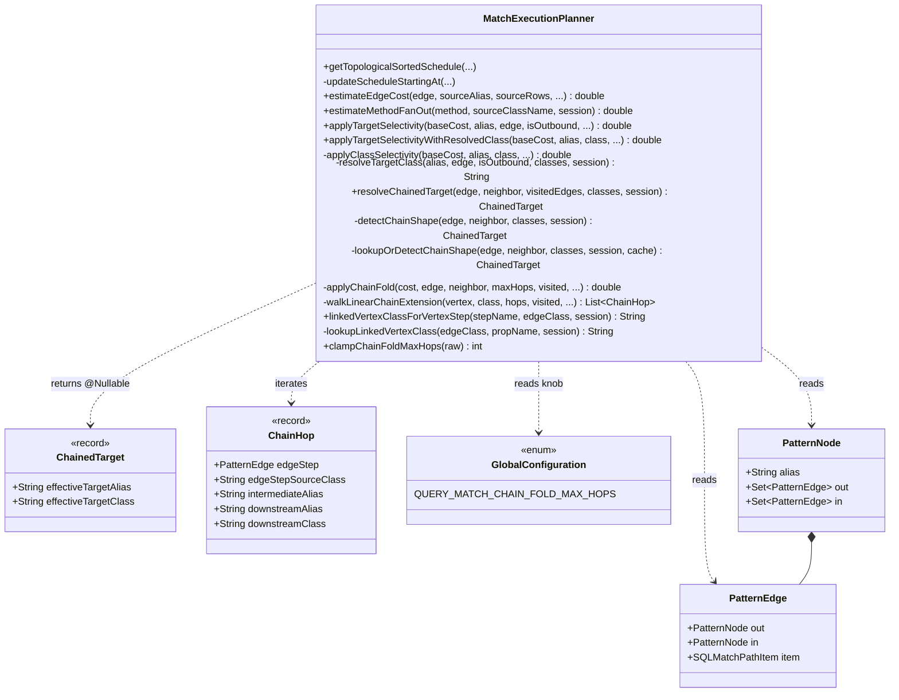
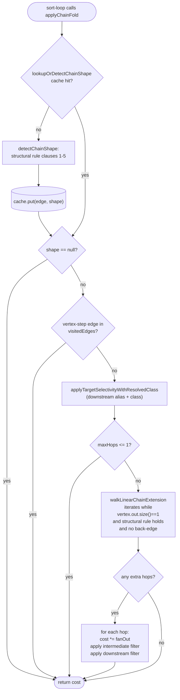
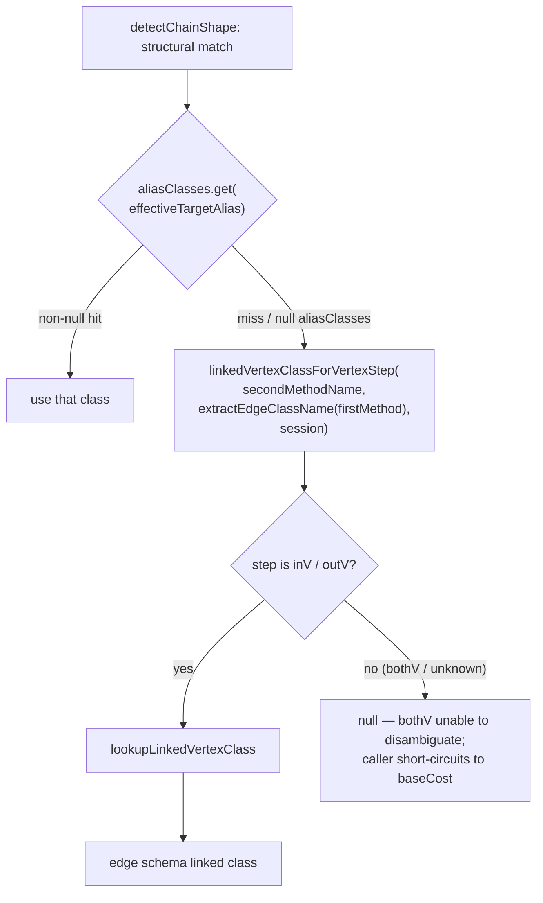

# MATCH Edge-Method Chain Cost Aggregation — Final Design

## Overview

The MATCH execution planner now folds the **downstream vertex's** `WHERE`
selectivity (and, when enabled, the selectivity / fan-out of subsequent
linear hops) into the **first edge's** cost during the sort phase of
`updateScheduleStartingAt`. This closes the cost-model gap between the
single-step pattern `.out('X'){where: …}` and the edge-method pattern
`.outE('X').inV(){where: …}` (and its `inE→outV` / `bothE→bothV`
variants), so branches whose true selectivity is hidden behind an
intermediate synthetic edge alias are no longer scheduled as if they had
no filter.

The implementation went through two layers:

1. **Single-hop fold** — recognise the structural pattern
   `outE/inE/bothE → inV/outV/bothV` and apply the downstream vertex's
   filter via a class-forced overload of `applyTargetSelectivity`. The
   pattern graph, parser, and runtime stay untouched.
2. **Multi-hop linear extension** — the same recognition, applied
   iteratively past the first hop. From the downstream vertex, walk
   forward as long as the pattern remains a single linear `(edge step,
   vertex step)` sequence with no branch points or back-edges, and fold
   each hop's edge fan-out + intermediate filter + downstream vertex
   filter into the running cost. Bounded by
   `QUERY_MATCH_CHAIN_FOLD_MAX_HOPS` (default 10, hard-capped at 1000)
   plus a per-plan structural cache. Set the knob to 1 to restrict the
   fold to single-hop behaviour, or 0 to disable it entirely (rollback
   safety valve).

The fold lives entirely inside the planner sort loop. No
`Pattern.addExpression` change, no `MatchStep` change, no
`SQLMatchPathItem` change, no public API change.

## Class Design



- **`MatchExecutionPlanner`** gained two records (`ChainedTarget`,
  `ChainHop`), a class-forced
  `applyTargetSelectivityWithResolvedClass` sibling to the existing
  `applyTargetSelectivity`, a private shared helper
  `applyClassSelectivity` that both overloads delegate to, and the
  chain-detection / multi-hop family
  (`resolveChainedTarget`, `detectChainShape`,
  `lookupOrDetectChainShape`, `applyChainFold`,
  `walkLinearChainExtension`). `linkedVertexClassForVertexStep` and
  `lookupLinkedVertexClass` are shared with the pre-existing
  `inferClassFromEdgeSchema` so the chain fold and `addAliases`
  resolve `inV` / `outV` against the same edge schema in lock step.
- **`ChainedTarget`** is the value returned by chain detection: the
  downstream vertex alias plus the inferred class (nullable). The
  helper returns `@Nullable ChainedTarget` directly rather than an
  `Optional`, matching the surrounding `@Nullable` style in the
  planner (`resolveTargetClass`, `inferClassFromEdgeSchema`).
- **`ChainHop`** describes one extra `(edge step, vertex step)`
  sub-chain past the first hop. The edge's source class is carried so
  the multi-hop walk can compute fan-out without re-deriving it from
  schema.
- **`PatternNode` / `PatternEdge`** are unchanged. The chain helpers
  read the existing `out`, `in`, `item`, `alias` fields only.
- **`GlobalConfiguration.QUERY_MATCH_CHAIN_FOLD_MAX_HOPS`** is a new
  enum value (default `10`, hard-capped at `MAX_CHAIN_FOLD_HOPS = 1000`
  inside the planner). It is read once per plan in
  `getTopologicalSortedSchedule` and threaded through
  `updateScheduleStartingAt` along with the per-plan structural cache.

## Workflow

### Sort-loop cost computation

```mermaid
sequenceDiagram
    participant USA as updateScheduleStartingAt
    participant EEC as estimateEdgeCost
    participant ATS as applyTargetSelectivity
    participant ACF as applyChainFold
    participant LDC as lookupOrDetectChainShape
    participant ATSR as applyTargetSelectivityWithResolvedClass
    participant WLC as walkLinearChainExtension
    participant ADM as applyDepthMultiplier

    USA->>EEC: estimate(edge1, sourceAlias, sourceRows)
    EEC-->>USA: baseCost
    alt baseCost is finite
        USA->>ATS: apply(baseCost, neighbor.alias, edge1, isOutbound, ...)
        Note over ATS: existing call — applies the intermediate<br/>alias's WHERE (rare; typically a no-op)
        ATS-->>USA: cost
        alt chainFoldMaxHops >= 1
            USA->>ACF: apply(cost, edge1, neighbor, maxHops, visitedEdges, ...)
            ACF->>LDC: lookup-or-detect(edge1, neighbor, ...)
            LDC-->>ACF: ChainedTarget or null
            alt chain detected and not visited
                ACF->>ATSR: apply(cost, downstreamAlias, downstreamClass, ...)
                ATSR-->>ACF: cost (after first-hop fold)
                alt maxHops > 1
                    ACF->>WLC: walk(downstreamVertex, downstreamClass, maxHops-1, ...)
                    WLC-->>ACF: List<ChainHop>
                    loop for each extra hop
                        ACF->>ACF: cost *= estimateMethodFanOut(...)
                        ACF->>ATSR: apply(cost, intermediateAlias, edgeClass, ...)
                        ATSR-->>ACF: cost
                        ACF->>ATSR: apply(cost, downstreamAlias, downstreamClass, ...)
                        ATSR-->>ACF: cost
                    end
                end
            end
            ACF-->>USA: cost (or unchanged when no chain)
        end
        USA->>ADM: apply(cost, edge1)
        ADM-->>USA: final cost
    else baseCost == Double.MAX_VALUE
        Note over USA: no fold runs; stable-sort tiebreaker preserves insertion order
    end
```

The diagram covers the cost-estimation pass that runs once per
candidate edge inside the sort loop. The visited-neighbor branch
(`cost = 0.0`, taken when `visitedNodes.contains(neighbor)`) is
omitted because the chain fold is intentionally outside that branch
— a back-reference to an already-visited vertex is a join step with
no traversal cost to fold.

### Chain detection & multi-hop walk



The structural-detection result for any given `PatternEdge` is stable
across the lifetime of one plan (it depends only on the pattern graph
plus per-plan `aliasClasses` / `session`), so
`lookupOrDetectChainShape` memoises it in `chainShapeCache`. Negative
answers (`null`) are cached too — a `containsKey` check disambiguates
"unknown" from "known-not-chain". The dynamic visited-edge check is
deliberately kept outside the cache so that a chain whose vertex-step
is already scheduled correctly skips the fold.

## Chain Detection Rule

`detectChainShape` returns non-null iff **all** of the following hold.
All method-name lookups go through `SQLMethodCall.getMethodNameString()`,
matching the accessor used by `parseDirection`'s call sites elsewhere
in the planner.

- **Pre-check:** `edge.item != null` and `edge.item.getMethod() != null`.
- **First method whitelist:** name (case-insensitive) is `outE`, `inE`,
  or `bothE`. The check uses `String.equalsIgnoreCase` against each
  literal so that the very common `.out` / `.in` / `.both` single-step
  methods short-circuit on length mismatch without a `toLowerCase`
  allocation — this is the sort-loop's hot path.
- **Branch guard:** `neighbor.out.size() == 1` and `neighbor.in.size() == 1`.
- **Identity guard:** `neighbor.in.iterator().next() == edge`. Defends
  against a future refactoring of pattern construction that produces an
  intermediate with a single incoming edge that is not `edge` itself.
  Today, the size-1 guard already rejects the common fragment-join case
  (a user reusing `{as: e}` across two MATCH fragments makes
  `neighbor.in.size() >= 2`).
- **Second method whitelist:** the unique outgoing edge from the
  intermediate has `item != null`, `item.getMethod() != null`, and the
  method name (case-insensitive) is `inV`, `outV`, or `bothV`.

`resolveChainedTarget` adds one more dynamic check on top of
`detectChainShape`'s structural answer:

- The single outgoing edge from the intermediate is **not** in
  `visitedEdges` — i.e. the chain's vertex-step has not already been
  scheduled.

Reverse traversals (where `neighbor = edge.out`) are rejected naturally
by the branch guard: the reverse neighbor has no `inV/outV/bothV`
continuation.

### Class inference precedence



| Vertex step | Edge LINK property used | Result for `bothV` |
|-------------|-------------------------|--------------------|
| `inV()`     | edge class's `in`       | n/a                |
| `outV()`    | edge class's `out`      | n/a                |
| `bothV()`   | none                    | `null` — fold short-circuits unless the alias has an explicit `class:` |

Precedence-1 (`aliasClasses`) is the path normally taken because
`addAliases` pre-populates the map for `inV` / `outV` aliases via
`inferClassFromEdgeSchema` during plan construction, and is the only
path that supplies a non-null class for `bothV`. Precedence-2 is the
defensive fallback used when `aliasClasses` lacks an entry — for
example a while-expression alias skipped by `addAliases`'s
`whileAliases` filter. Both paths converge on
`linkedVertexClassForVertexStep`, which the standalone `inV` / `outV`
branch of `inferClassFromEdgeSchema` also calls; centralising this
mapping keeps the chain fold and standalone vertex-step inference in
lock step.

## Independence Multiplication Across Filters

The fold composes selectivities multiplicatively under the
independence assumption already used by
`estimateCompoundAndSelectivity`. For a chain of `K` linear hops:

```
cost = sourceRows × fanOut(edge_1)                          [estimateEdgeCost]
                  × selectivity(intermediateFilter_1)        [existing applyTargetSelectivity]
                  × selectivity(downstreamFilter_1)          [first-hop fold via WithResolvedClass]
                  × ∏(k=2..K) [fanOut(edge_k)
                              × selectivity(intermediateFilter_k)
                              × selectivity(downstreamFilter_k)]
                  × depthMultiplier(edge_1)                  [applyDepthMultiplier]
```

Each factor short-circuits to 1 (i.e. leaves the running cost
unchanged) when its alias has no filter, no estimate, and no inferable
class. So a chain whose intermediate edge alias is auto-generated and
whose downstream vertex is plain `as: x` collapses to the pre-fix
baseline, while a chain with a `WHERE` anywhere along the way
contributes that selectivity to scheduling.

Concretely, the `applyTargetSelectivity` / `applyClassSelectivity`
short-circuit table (each branch returns `baseCost` unchanged):

- `preResolvedTargetClass == null`
- `schema == null` or class not in schema
- `classCount <= 0`
- filter present but the heuristic returns `< 0` AND no
  `estimatedRootEntries` entry
- no filter AND no `estimatedRootEntries` entry

Multiplication commutes, so call order does not matter — the existing
`applyTargetSelectivity` call on the intermediate alias and the chain
fold's calls compose into the same product regardless of which comes
first. This is what makes the change strictly additive: removing the
chain-fold call site recovers the pre-fix cost exactly.

### Correlated predicates caveat

Independence is a heuristic. When edge and vertex predicates are
correlated (e.g. high-weight friendship edges tend to reach
high-reputation people), the product under-estimates the true cost.
The same approximation is already accepted elsewhere in the planner
and the benefit on typical queries (correct ordering of branches with
filters at different depths) dwarfs the approximation error.

## Multi-Hop Walk: Termination & Knob

`walkLinearChainExtension` extends the chain past its first hop with
strict structural termination — it **never** explores branch points
or back-edges. The walk terminates as soon as **any** of these holds:

- `currentVertex.out.size() != 1` (terminal vertex or branch point)
- the next edge step is in the DFS-level `visitedEdges`
- the next edge step is in this walk's local `chainEdges`
- `detectChainShape` returns null for the next sub-chain
- the next vertex-step edge is in `visitedEdges` or `chainEdges`
- `remainingHops` reaches zero

The two-set visited check (`initialVisitedEdges` from the DFS plus a
walk-local `chainEdges`) avoids mutating the caller's DFS state and
prevents both back-edges into already-scheduled territory and pattern
loops that wrap onto themselves. The fast-path `currentVertex.out.size() != 1`
test sits before `chainEdges` is allocated, so the very common case of
a terminal downstream vertex pays no allocation cost.

`QUERY_MATCH_CHAIN_FOLD_MAX_HOPS` is read once per plan via
`clampChainFoldMaxHops`, which:

- silently clamps negatives to `0` (project convention; see
  `getHashJoinThreshold`),
- clamps values above `MAX_CHAIN_FOLD_HOPS = 1000` to that ceiling and
  emits a one-shot WARN per **unique** out-of-range value via an
  `AtomicInteger` `getAndSet` pair (so a server racing on a misconfigured
  knob logs once, not per-plan).

Two layers gate the fold:

- The sort-loop call site skips `applyChainFold` entirely when
  `chainFoldMaxHops < 1` — full rollback to pre-YTDB-643 behaviour with
  zero allocations and zero method calls past the gate.
- Inside `applyChainFold`, the `maxHops <= 1` short-circuit returns after
  the first-hop fold without entering the multi-hop walk — restricts
  the fold to legacy single-hop behaviour while keeping the cache and
  call infrastructure live.

Both gates are intentional defense-in-depth: the inner gate alone
yields single-hop legacy semantics for `maxHops == 1`, while the outer
gate is the only one that disables the fold completely.

## Per-Plan Structural Cache

`chainShapeCache: Map<PatternEdge, ChainedTarget>` is allocated once
in `getTopologicalSortedSchedule` and threaded through every
`updateScheduleStartingAt` call for that plan, including recursive
sub-passes and the multi-hop walk. The cache stores only the
structural answer from `detectChainShape` (which does **not**
incorporate the dynamic visited-edge check); callers that need the
visited check apply it on top of the cached value.

`computeIfAbsent` is intentionally not used because we want to
memoise negative answers (`null`) too — a known-not-chain edge is a
useful cache hit on the sort-loop's hot path. `containsKey` /
`get` / `put` disambiguates a missing entry from a cached negative.
The map is per-plan (not per-server) so a query-time schema change
between plans cannot serve a stale answer.

## Why Aggregation at Sort Time, Not Pattern Collapsing

Collapsing `outE('X').inV()` into a single `PatternEdge` during
`Pattern.addExpression` was rejected because:

- The user can name the intermediate edge alias (`{as: e}`) and
  reference it from `RETURN`, `ORDER BY`, or `$matched.e`. Collapsing
  erases the alias from the pattern graph and breaks those references.
- The user can attach edge-level filters (`{where: weight > 5}`) to
  the intermediate alias. Collapsing would have to either drop them
  (incorrect results) or invent a composite edge-filter representation
  in `SQLMatchPathItem`, which cascades into the parser, planner, and
  runtime.
- The runtime `MatchStep` pipeline already handles the edge-method
  pattern correctly. The bug was a cost-ordering bug, not an execution
  bug.

Aggregation at sort time is strictly additive: remove the call-site
gate (`chainFoldMaxHops >= 1`) and the planner falls back to today's
behaviour. The knob's `0` value is the production rollback path.

## Handling the Recursive DFS Pass on the Intermediate Alias

`updateScheduleStartingAt` recurses into the intermediate edge-alias
node after scheduling the first edge. At that point the node has
exactly one unvisited outgoing edge — the `inV()` / `outV()` /
`bothV()` hop — and `estimateEdgeCost` returns `Double.MAX_VALUE`
because `parseDirection` does not recognise vertex-step methods.
The sort then contains a single candidate, so `MAX_VALUE` is
irrelevant; the edge is scheduled and DFS recurses into the final
vertex.

`parseDirection` is intentionally **not** taught about
`inV` / `outV` / `bothV`: (a) it would not affect scheduling on the
recursive pass (only one candidate), (b) a per-vertex "hop fan-out"
model does not match the edge-class schema lookups that feed the
estimator. The chain fold and the recursive DFS pass coexist: the
fold runs at the source-vertex pass (where ordering matters) and the
recursive pass runs unchanged (where ordering does not).

## Empty-Downstream-WHERE Behaviour

When the downstream vertex has no `WHERE`, no explicit `class:`, and
no entry in `estimatedRootEntries`, the class-forced overload falls
through every short-circuit and returns `baseCost` unchanged. This
matches the non-chain fallback exactly — we have no information to
refine the cost. The chain fold neither inflates nor deflates cost in
that case; it is a no-op. Only branches with a `WHERE` on the
downstream vertex (or a class with a known indexable histogram) see
the scheduling change.

## Relation to `IndexOrderedPlanner`

`IndexOrderedPlanner` was extracted as a sibling planner that handles
index-ordered execution for single-source MATCH queries. It does not
participate in edge cost sorting — its concern is deciding whether an
index-ordered pipeline can replace the general MATCH executor. The
chain-cost fold lives entirely inside `MatchExecutionPlanner`'s sort
loop and does not touch the `IndexOrderedPlanner` boundary.

## EXPLAIN-Based Test Contract

Regression tests assert scheduling order by searching for alias
markers (`{selectiveTag}` vs. `{broadTag}`) in the `EXPLAIN` plan
string. The same contract is used by
`testSelectivityInferredFromEdgeSchemaWithoutExplicitClass` and
`testVertexClassInferenceEnablesIndexIntersection`. A small regex
helper (`aliasStepPosition`) accepts both `{alias}` and
`{alias,index=…}` so a future format addition does not silently break
ordering assertions. Each test also asserts result-set correctness
(against the expected Cartesian product size) so a regression cannot
silently alter MATCH semantics.

The integration suite `MatchEdgeMethodChainCostTest` covers eleven
scenarios, including:

- pure `outE.inV` / `inE.outV` / `bothE.bothV` chains;
- mixed-style branches (`.out('X')` vs `.outE('X').inV()`);
- intermediate edge alias + downstream vertex filter combining
  multiplicatively;
- fragment-join negative case (rule rejects on `e.in.size() > 1`);
- visited-neighbor zero-cost path (fold is skipped, join semantics
  preserved);
- multi-hop chain ordering (selectivity hidden two hops in);
- knob `= 1` downgrades to legacy single-hop behaviour;
- multi-hop intermediate edge alias filter folding through the
  walk;
- pathological knob values (`Integer.MAX_VALUE` clamps,
  `Integer.MIN_VALUE` clamps to 0, large in-range value).

The unit suite `MatchExecutionPlannerMutationTest` adds focused
coverage of `resolveChainedTarget` rejection cases, the
class-inference precedence matrix, and the
`applyTargetSelectivityWithResolvedClass` short-circuit table —
including `MAX_VALUE` preservation through the null-class and
no-filter / no-estimate paths so a sort-loop regression that bypassed
the gate cannot silently upgrade an unestimated cost into a finite
value.
