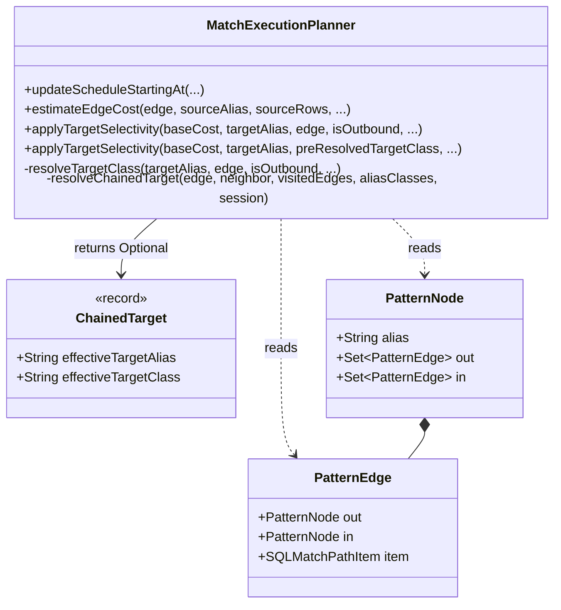
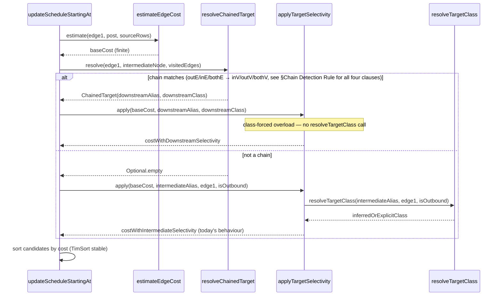

# MATCH Edge-Method Chain Cost Aggregation — Design

## Overview

The solution keeps the pattern graph intact and introduces a single pure
helper, `resolveChainedTarget`, that recognises the two-edge signature
`outE/inE/bothE → inV/outV/bothV` during the planner's edge-cost sort
loop. When a chain is detected, the planner asks `applyTargetSelectivity`
to use the **downstream vertex's** alias and class for the selectivity
factor instead of the synthetic intermediate edge alias. This folds the
user's `WHERE` on the final vertex into the first hop's cost — which is
the hop that actually gets ordered against other candidate branches.

The change is localised to the planner's sort phase. No runtime,
pattern-construction, parser, or public-API surface is touched.

## Class Design



- **`MatchExecutionPlanner`** gains two new private members: the
  `ChainedTarget` record and the `resolveChainedTarget` helper. The
  existing `applyTargetSelectivity` gets an overload that accepts a
  pre-resolved target class so the chain-aware caller can short-circuit
  the `resolveTargetClass` lookup (which is single-edge aware).
  Because `isOutbound` in the original overload is used **only** by
  `resolveTargetClass`, the class-forced overload does not take an
  `isOutbound` parameter at all — simpler signature, no dead argument.
- **`ChainedTarget`** is a read-only record returned by the helper.
  Carries just what the class-forced overload needs: the downstream
  vertex's alias and its inferred class (nullable — `bothE→bothV`
  chains and missing edge-class names produce `null`, and the overload
  falls through to cardinality-ratio selectivity).
- **`PatternNode` / `PatternEdge`** are unchanged. The helper only reads
  the pre-existing `out`, `in`, and `item` fields.

## Workflow



The sequence shows only the chain-aware branch of the cost computation;
the `applyDepthMultiplier` call afterwards, `MAX_VALUE` short-circuit,
and the "already visited neighbor = 0.0" branch are unchanged.

The existing `applyTargetSelectivity` still participates: the chain
aware call uses it with a **different alias/class pair**, reusing its
`estimateFilterSelectivity` / cardinality-ratio logic to compute the
downstream-vertex selectivity. That keeps histogram-based estimation,
`@class` handling, and compound-`AND`/`OR` support for free.

## Chain Detection Rule

The helper receives `neighbor` — the direction-dependent target already
computed by the sort loop at MatchExecutionPlanner.java:2113
(`entry.getValue() ? edge.in : edge.out`). For reverse traversal the
structural rule naturally rejects because the reverse neighbor has no
`inV/outV/bothV` continuation; no extra gating is required at the call
site.

The helper returns non-empty iff **all** of the following hold. All
method-name lookups go through `SQLMethodCall#getMethodNameString()`
(the same accessor `parseDirection` uses at call sites
MatchExecutionPlanner.java:2303 and :2359 — `@Nullable`-safe and avoids
the verbose `getMethodName().getStringValue()` pattern).

- **Pre-check:** `edge.item != null` and `edge.item.getMethod() != null`.
  Other callers null-guard at `estimateEdgeCost` (:2297-2300) and
  `resolveTargetClass` (:2523-2524). The helper must do the same to
  avoid NPE on synthesised patterns.
- The first edge's method name (lower-cased) is `oute`, `ine`, or
  `bothe`.
- `neighbor.out` contains exactly one edge, and that edge is not in
  `visitedEdges`.
- `neighbor.in` contains exactly one edge, and that edge is `edge`
  itself — i.e. no other branch or `MATCH` fragment references this
  alias. This guards against the case where a user names the
  intermediate alias (`{as: e}`) and joins it from a second pattern
  fragment. Folding there would apply the downstream vertex's filter
  to the wrong alias.
- The second edge's method name is `inv`, `outv`, or `bothv`.

Direction mapping for class inference:

| First edge  | Second edge | Effective direction | Edge-class link used |
|-------------|-------------|---------------------|----------------------|
| `outE('X')` | `inV()`     | outbound            | `X.in`  → target vertex class |
| `inE('X')`  | `outV()`    | inbound             | `X.out` → target vertex class |
| `bothE('X')`| `bothV()`   | bidirectional       | none (class = `null`)        |

When the edge class name is absent (`.outE()` without argument), the
class is undefined in the schema, or the chain is `bothE→bothV`, class
inference returns `null`. The class-forced overload detects `null` and
returns `baseCost` unchanged (no selectivity applied). That is harmless:
the non-chain path already behaves the same way when a class cannot be
resolved. Real benefit for `bothE→bothV` therefore only materialises
when the downstream alias carries an explicit `class:` constraint that
feeds `aliasClasses` directly — verified in Track 3 test 4.

The rule deliberately accepts the case where the intermediate node has
its own `{where: …}` on a **user-named** alias (still subject to the
in-set == 1 guard above) — the first edge's normal
`applyTargetSelectivity` call already applies those filters, and the
chain fold adds the downstream vertex's selectivity on top under the
independence assumption (D3 in the implementation plan).

## Relation to `IndexOrderedPlanner`

`IndexOrderedPlanner` was extracted from `MatchExecutionPlanner` in
commit `d66a4d70f8` as a sibling module that handles index-ordered
execution for single-source MATCH queries. It does **not** participate
in edge cost sorting — its concern is deciding whether an index-ordered
pipeline can replace the general MATCH executor. The chain-cost fold
changes only the sort loop inside `MatchExecutionPlanner`; the
`IndexOrderedPlanner` boundary and decision are untouched.

## Why aggregation at sort time, not pattern collapsing

The obvious alternative — collapsing `outE('X').inV()` into a single
`PatternEdge` during `Pattern.addExpression` — is rejected because:

- The user can name the intermediate edge alias (`{as: e}`) and
  reference it from `RETURN`, `ORDER BY`, or `$matched.e`. Collapsing
  erases the alias from the pattern graph, breaking those references.
- The user can attach edge-level filters (`{where: weight > 5}`) to the
  intermediate alias. Collapsing must either drop them (incorrect
  results) or invent a composite edge-filter representation in
  `SQLMatchPathItem`, which cascades into the parser, planner, and
  runtime.
- The runtime `MatchStep` pipeline handles the edge-method pattern
  correctly today; the problem is cost ordering, not execution.

Aggregation at sort time is strictly additive: remove the call site
change and the planner falls back to today's behaviour.

## Handling the recursive DFS pass on the intermediate alias

`updateScheduleStartingAt` recurses into the intermediate edge-alias
node after scheduling edge 1. At that point, the node has exactly one
unvisited outgoing edge — the `inV()` hop — and
`estimateEdgeCost(inV())` returns `Double.MAX_VALUE` because
`parseDirection("inv")` is not recognised. The sort contains a single
candidate, so `MAX_VALUE` cost is irrelevant; the edge is scheduled and
DFS recurses into the final vertex node. We do **not** teach
`parseDirection` about `inV`/`outV`/`bothV`: (a) it would not affect
scheduling (only one candidate), (b) a per-vertex "hop fan-out" model
does not match the edge-class schema lookups that feed today's
estimator.

## Independence Multiplication Across Filters

When the intermediate alias carries its own `WHERE` (user-named edge
with a filter), the planner multiplies both selectivities:

```
cost(edge1 in chain) = sourceRows × fanOut(edge1)
                     × selectivity(intermediateFilter)   [today]
                     × selectivity(downstreamVertexFilter)  [new]
```

Formally this is the independence-assumption product used elsewhere in
the planner (`estimateCompoundAndSelectivity`). Correlated edge/vertex
predicates (`.outE('X'){where: weight > 5}.inV(){where: score = 'HIGH'}`
when high-weight edges tend to go to high-score vertices) will
under-estimate the true cost, but the same approximation error is
already accepted elsewhere. The benefit — correct ordering of branches
on typical queries — dwarfs the approximation error.

### Empty-downstream-WHERE case

When the downstream vertex has no `WHERE` and no explicit class, the
class-forced overload falls through to `applyTargetSelectivity`'s
estimated-cardinality ratio branch (`targetEstimate / classCount`). For
a freshly traversed vertex alias `estimatedRootEntries` is typically
absent, so the overload returns `baseCost` unchanged. That matches the
non-chain fallback and is the right behaviour: we have no information
to refine the cost. The chain fold neither inflates nor deflates cost
in that case — it is a no-op. Only branches with a `WHERE` on the
downstream vertex (or an inferred indexable histogram) see the
scheduling change.

## Longer Chains

For `.outE('X').inV().out('Y'){where: q}`, the fix aggregates only the
`outE('X') → inV()` pair into the first hop's cost. The selectivity of
`q` is **not** propagated back across the `.inV().out('Y')` transition.
This mirrors today's behaviour for the direct-style equivalent
`.out('X').out('Y'){where: q}`, which also does not propagate `q`
across the two-hop boundary. The fix therefore closes the gap between
edge-method and direct-style for the single edge→vertex chain without
introducing new inconsistencies. Multi-hop propagation is out of scope
(see Non-Goals in the implementation plan).

## EXPLAIN-Based Test Contract

Tests assert scheduling order by searching for alias markers
(`{selectiveTag}` vs. `{broadTag}`) in the `EXPLAIN` plan string. This
is the same contract used by
`testSelectivityInferredFromEdgeSchemaWithoutExplicitClass`. The
assertion is stable because `EXPLAIN` prints steps in execution order,
which is exactly the schedule order produced by
`updateScheduleStartingAt`.

A secondary invariant — the result set is unchanged by the fix — is
enforced by comparing `session.query(q).toList()` sizes and contents
against the expected Cartesian product of posts × tags.
