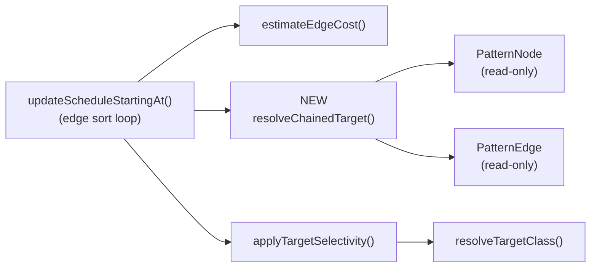

# MATCH Edge-Method Chain Cost Aggregation

## Design Document
[design.md](design.md)

## High-level plan

### Goals

Fix the MATCH execution planner's cost model so that branches using the
edge-method pattern `.outE('X').inV()` (and its `inE.outV`, `bothE.bothV`
variants) are scheduled according to the downstream `WHERE` selectivity,
just like their single-step counterpart `.out('X'){where: …}`.

Today the planner builds two `PatternEdge`s for an edge-method hop:

1. `post ── outE('VIHasTag') ──▶ (intermediate edge alias)`
2. `(intermediate edge alias) ── inV() ──▶ tag`

Cost is computed per edge. The first edge's target is the synthetic
intermediate alias, which has no `WHERE` and no explicit class — so
`applyTargetSelectivity` returns the base cost unchanged. The second edge's
method (`inV`) is not a recognised direction for `parseDirection`, so its
cost is `Double.MAX_VALUE` and the `WHERE` on the final vertex alias is
never applied to the chain's cost at all. Branches with very different
selectivities (1-match vs. 50-match tags) sort as equal, which causes the
scheduler to pick the broad branch first and inflate the intermediate row
count (`100` vs. optimal `60` traversals on the documented example).

The fix is to fold the downstream vertex's `WHERE` selectivity into the
first hop's cost during sort, under a structural detection rule, leaving
the runtime and pattern graph untouched.

### Constraints

- **Pattern graph is untouched.** `Pattern.addExpression`, `PatternEdge`,
  `PatternNode`, and the parser stay as they are. Runtime step execution
  and the `MatchStep` pipeline are not affected.
- **Must match the three direction variants.** `outE→inV`, `inE→outV`,
  `bothE→bothV`. Edge-class schema lookup for the effective target uses
  the edge class's `in` property for outbound, `out` property for
  inbound, and falls back to `null` (no inference) for `bothE→bothV`.
- **Independence multiplication when the intermediate alias has its own
  filter.** If the user writes `.outE('X'){as: e, where: weight>5}.inV(){…}`,
  `applyTargetSelectivity` already applies `weight>5` (the intermediate's
  own `WHERE`). The chain fold multiplies that by the downstream vertex
  selectivity — correct under the filter-independence assumption already
  used in the compound-`AND`/`OR` selectivity code.
- **Fallback on unknown cost.** If `estimateEdgeCost` returns
  `Double.MAX_VALUE` for the first edge, the chain fold must not upgrade
  it to a finite value — sort behaviour for unestimated edges stays the
  same (preserves insertion order via TimSort).
- **No change to runtime execution traces.** A regression test verifies
  that the observed result set is identical to the pre-fix run; only the
  scheduling order in `EXPLAIN` output changes.
- **Spotless compliance.** Run `./mvnw -pl core spotless:apply` before
  each commit.
- **Coverage.** 85% line / 70% branch on changed lines via
  `coverage-gate.py`.

### Architecture Notes

#### Component Map



- **`updateScheduleStartingAt`** (MatchExecutionPlanner.java:2032) — per
  candidate edge it now calls the new `resolveChainedTarget` helper
  **before** `applyTargetSelectivity`. If the edge starts a recognised
  chain, the helper returns a `ChainedTarget` record (effective alias +
  edge-class name); the sort cost is then obtained by calling the
  class-forced `applyTargetSelectivity` overload with the effective
  alias + pre-resolved class instead of the intermediate alias. On
  no-chain or `MAX_VALUE` cost, behaviour is identical to today.
- **`applyTargetSelectivity`** (MatchExecutionPlanner.java:2460) — stays
  mostly the same. A **separate overload** lets the caller pass a
  pre-resolved target class directly. The overload does not take
  `isOutbound` because in the existing implementation that flag is
  consumed only by `resolveTargetClass` — which the overload skips.
  Signature (approximate):
  ```java
  static double applyTargetSelectivity(
      double baseCost,
      String targetAlias,
      @Nullable String preResolvedTargetClass,
      Map<String, SQLWhereClause> aliasFilters,
      Map<String, Long> estimatedRootEntries,
      DatabaseSessionEmbedded session)
  ```
  Implementation delegates to the same schema/filter/cardinality-ratio
  logic; on `preResolvedTargetClass == null` it returns `baseCost`
  unchanged (matching today's behaviour when `resolveTargetClass`
  returns `null`).
- **`resolveTargetClass`** (MatchExecutionPlanner.java:2511) — unchanged
  for the single-edge path. Chain-aware path pre-computes the class via
  its own edge-schema lookup using the outer edge's class name and the
  chain direction.
- **NEW `resolveChainedTarget`** — the core helper. Takes `(edge,
  neighbor, visitedEdges, aliasClasses, session)` and returns an
  `Optional<ChainedTarget>` describing the effective target when the
  chain signature matches. The `neighbor` parameter is the
  direction-dependent target already computed by the sort loop
  (`entry.getValue() ? edge.in : edge.out` at line 2113) — so for a
  reverse traversal the structural rule naturally rejects because the
  reverse neighbor has no `inV/outV/bothV` child. No `isOutbound`
  parameter: the helper derives direction internally from the first
  edge's method name (`outE` → outbound, `inE` → inbound, `bothE` →
  no inference). The `aliasClasses` parameter is needed by the
  class-inference precedence (see Track 1 — precedence step 1 is
  `aliasClasses.get(effectiveTargetAlias)`).
- **`PatternEdge` / `PatternNode`** — only read by the new helper;
  no new mutable state.

#### D1: Chain-cost aggregation at cost-estimation time

- **Alternatives considered**:
  - *Pattern collapsing* — rewrite `.outE('X').inV()` into a single
    logical `.out('X')` `PatternEdge` during `Pattern.addExpression`.
  - *Teach the runtime a "combined hop" primitive* — collapse at plan
    execution time after the schedule is built.
  - *Chain-cost aggregation at sort time* (**chosen**).
- **Rationale**: Collapsing at pattern construction breaks user-named
  edge aliases (`.outE('X'){as: e, where: weight>5}.inV()`) and their
  references in `RETURN` / `$matched`; the runtime-primitive option
  bloats the executor code for a cost-model bug. Chain-cost aggregation
  is confined to the planner sort loop: no graph mutation, no runtime
  changes, no parser changes, and it composes cleanly with the existing
  `applyTargetSelectivity` multiplicative model.
- **Risks/Caveats**: Relies on the two `PatternEdge`s being
  consecutive in the DFS order. The helper must also handle the DFS
  recursion where the intermediate alias becomes the start node — at
  that point its single outgoing edge is the `inV()` hop, whose cost
  today is `MAX_VALUE` (no recognised direction). We leave that case
  alone: by the time we reach it, the intermediate alias has a single
  unvisited outgoing edge, scheduling is forced, and the actual traversal
  order does not depend on cost.
- **Implemented in**: Track 2

#### D2: Structural chain detection rule

- **Alternatives considered**:
  - *Prefix check on the intermediate alias name* (e.g. auto-generated
    `$_edgeAuto_…`).
  - *Parser flag on `PatternNode`* marking an alias as "edge-record".
  - *Pure structural check* (**chosen**): four clauses, all required:
    1. first edge method is `outE` / `inE` / `bothE`;
    2. intermediate node's `out` set has exactly **one** unvisited
       edge whose method is `inV` / `outV` / `bothV`;
    3. intermediate node's `in` set has exactly **one** edge, and it
       is `edge1` itself (no second MATCH fragment joins the
       intermediate alias);
    4. (implicit) the intermediate alias has no `class:` constraint
       that would turn it into a real vertex reference — but since the
       parser only allows `class:` on vertex steps, this is already
       guaranteed by (1) + (2).
- **Rationale**: Avoids coupling to the parser's naming convention or
  adding new state to the pattern graph. The structural signature is
  unambiguous — TinkerPop vertex steps (`inV`, `outV`, `bothV`) only make
  sense after an edge step. Clause (3) is critical: without it, a user
  naming the intermediate alias and joining it from a second fragment
  (`{as: e}` referenced twice) would trigger the fold on the wrong
  alias. User-named intermediate aliases with their own filters but a
  single incoming edge still satisfy the rule and benefit from the
  aggregation (see D3).
- **Risks/Caveats**: If someone adds a new edge-traversal method that
  should also be chain-aware (e.g. `outE().filter(…).inV()` once
  per-step filters are supported), the structural rule needs updating.
  Kept localised in one helper for future-proofing.
- **Implemented in**: Track 1

#### D3: Independence multiplication with intermediate filters

- **Alternatives considered**:
  - *Skip aggregation when the intermediate alias has its own
    `WHERE`/class* (to avoid double-counting).
  - *Multiply intermediate `WHERE` selectivity by the downstream vertex
    selectivity* (**chosen**).
- **Rationale**: `applyTargetSelectivity` already multiplies base cost
  by the intermediate's filter when present. Chain aggregation adds a
  second multiplicative factor for the downstream vertex's `WHERE`.
  This mirrors the independence assumption already used in
  `estimateCompoundAndSelectivity` and is the correct algebraic
  extension — not double-counting.
- **Risks/Caveats**: Independence is a heuristic; correlated edge and
  vertex predicates slightly under-estimate the true cost. Same risk
  as the existing compound-`AND` code — acceptable and documented.
- **Implemented in**: Track 2

#### Invariants

- For every branch from a source node, the scheduler computes the same
  chain cost whether the branch uses `.out('X'){where: p}` or
  `.outE('X').inV(){where: p}`, given identical data.
- A branch that produces strictly fewer intermediate rows than another
  at runtime is never scheduled after that other branch, given known
  selectivity estimates.
- Runtime result set for any tested MATCH query is identical before and
  after the fix (the scheduler reorders but does not alter semantics).

#### Integration Points

- `MatchExecutionPlanner.updateScheduleStartingAt` calls the new helper
  before `applyTargetSelectivity`.
- `applyTargetSelectivity` gains an overload (or extra parameter) so the
  chain-aware path can pass a pre-resolved target class and target alias
  without re-inferring via `resolveTargetClass`.
- `EXPLAIN` output ordering is the observable contract used by tests.

#### Non-Goals

- Collapsing the pattern graph or merging `PatternEdge`s.
- Changing the runtime execution order independently of the schedule.
- Teaching `parseDirection` about `inV`/`outV`/`bothV` (not needed —
  those methods only appear on the recursive DFS pass where cost is
  irrelevant; adding them would require a fan-out model for a
  literally-one-to-one edge-to-vertex hop).
- Per-edge `WHERE` selectivity propagation beyond the single
  `edge → vertex` chain. Longer chains (`.outE.inV.out.in.outE.inV…`)
  still aggregate one hop at a time.

## Checklist

- [x] Track 1: Chain detection helper
  >
  > **Track episode:**
  > Added `MatchExecutionPlanner.ChainedTarget` record and package-private
  > static helper `resolveChainedTarget(edge, neighbor, visitedEdges,
  > aliasClasses, session)` that detects the `.outE(X).inV()` chain (and
  > `inE→outV` / `bothE→bothV` variants) via a purely structural rule, with
  > two-level class-inference precedence (aliasClasses first, then
  > edge-schema fallback). Helper is fully functional for Track 2 wiring
  > without further changes. **Cross-track impact:** none — pattern graph,
  > runtime, parser, and existing APIs untouched. **Plan deviations:**
  > (1) Step 2 extracted the edge-schema fallback into a private helper
  > `inferDownstreamVertexClassFromEdge` (plan expected inline, ~25 lines vs.
  > estimated ~8); local to Track 1. (2) Phase C consolidated
  > `inferDownstreamVertexClassFromEdge`'s schema-lookup chain into the
  > existing `lookupLinkedVertexClass`, whose signature was broadened to
  > accept `@Nullable DatabaseSessionEmbedded` (was `CommandContext`) with
  > defensive null-guards on session/schema; both pre-existing callers
  > updated. This tightens `lookupLinkedVertexClass`'s contract (null-schema
  > now returns null instead of NPE), observable only in hypothetical paths
  > — no existing caller is affected. **Phase C review:** 6 agents in
  > parallel produced 0 blockers, 2 should-fix (CQ1 dedupe, TC1 missing
  > `outE`/`bothE` second-hop tests), 36 suggestions (style/micro-opt,
  > deferred as out-of-scope). Both should-fix items and 1 low-cost
  > suggestion (TB1 doc comment) fixed in `e44213a6ae`; gate check
  > PASS across all re-run dimensions. No deferred findings; no plan
  > corrections. `MatchExecutionPlannerMutationTest`: 112 tests green
  > (44 new for `resolveChainedTarget`). Full MATCH suite: 828 tests
  > pass, zero regressions.
  >
  > **Step file:** `tracks/track-1.md` (2 steps, 0 failed)
  >
  > **Strategy refresh:** CONTINUE — Track 1's helper signature and
  > `ChainedTarget` shape match Track 2's wiring contract exactly. The
  > `inferDownstreamVertexClassFromEdge` extraction and Phase C consolidation
  > into `lookupLinkedVertexClass` are private-helper cleanups with no
  > Track 2/3 impact. No downstream impact detected.
  >
  > Introduce `resolveChainedTarget(edge, neighbor, visitedEdges,
  > aliasClasses, session)` as a package-private static method in
  > `MatchExecutionPlanner`. It returns an `Optional<ChainedTarget>`
  > where `ChainedTarget` carries `(effectiveTargetAlias,
  > effectiveTargetClass)`.
  >
  > Helper contract (T1 decision):
  > - `neighbor` is the **direction-dependent** target already computed
  >   by the sort loop: `entry.getValue() ? edge.in : edge.out` at
  >   MatchExecutionPlanner.java:2113. For a reverse traversal (where
  >   `neighbor = edge.out`), the reverse neighbor has no
  >   `inV/outV/bothV` continuation, so the structural rule (clause 2)
  >   naturally rejects — no extra gating required in Track 2.
  > - `aliasClasses` (T2 decision): needed for the class-inference
  >   precedence step 1 below. Helper must accept it.
  >
  > Structural rule (all must hold, in order). Use
  > `SQLMethodCall#getMethodNameString()` for all method-name checks,
  > mirroring `parseDirection` call sites at MatchExecutionPlanner.java
  > lines 2303 and 2359 — the accessor is `@Nullable`-safe and avoids
  > the verbose `getMethodName().getStringValue()` pattern.
  > - **Pre-check (T3):** `edge.item != null` and
  >   `edge.item.getMethod() != null`. Existing callers (`estimateEdgeCost`
  >   at :2297-2300, `resolveTargetClass` at :2523-2524) perform the
  >   same null-guard; the helper must not NPE on synthesised patterns.
  > - `edge.item.getMethod().getMethodNameString()` (lower-cased,
  >   `Locale.ENGLISH`) is one of `oute`, `ine`, `bothe`.
  > - `neighbor.out` contains exactly one edge, and it is not in
  >   `visitedEdges`.
  > - `neighbor.in` contains exactly one edge, and it is `edge` —
  >   guards against user-named intermediate aliases joined from a
  >   second MATCH fragment.
  > - That outgoing edge's method name is `inv`, `outv`, or `bothv`.
  >
  > Once the structural rule matches, extract:
  > - `downstreamEdge = neighbor.out.iterator().next()` (the single
  >   unvisited `inV`/`outV`/`bothV` edge).
  > - `effectiveTargetAlias = downstreamEdge.in.alias` — the downstream
  >   vertex's alias. **Do not** use `neighbor.alias`; that is the
  >   intermediate edge alias and would fold the filter against the
  >   wrong node.
  > - `effectiveTargetClass` per the precedence below.
  >
  > Class inference precedence (must mirror `resolveTargetClass`'s
  > explicit-alias branch at MatchExecutionPlanner.java:2517-2520):
  > 1. If `aliasClasses.get(effectiveTargetAlias)` is non-null, use it
  >    directly. For `outE→inV` / `inE→outV` this is typically
  >    pre-populated by `addAliases` via `inferClassFromEdgeSchema`
  >    (called at line 4518, method body starts at :4558) during plan
  >    construction. **Required** for the
  >    `bothE→bothV` case where edge-schema derivation returns `null`
  >    but the user annotated the downstream alias with `class: VITag`
  >    (see Track 3 test 4).
  > 2. Otherwise (defensive — handles while-expression aliases skipped
  >    by `addAliases`'s `whileAliases` filter at line 4495, and any
  >    other edge case where aliasClasses is sparse): derive from the
  >    first edge's class name + direction — outbound `outE→inV` uses
  >    the edge class's `in` linked vertex class; inbound `inE→outV`
  >    uses the edge class's `out` linked vertex class; `bothE→bothV`
  >    returns `null` (no inference possible). Reuse
  >    `extractEdgeClassName(SQLMethodCall)` from
  >    MatchExecutionPlanner.java:2956 for the class-name extraction.
  >
  > The helper is pure (no schema mutation) and side-effect-free so it
  > can be unit-tested in isolation. Visited-edge skipping matches the
  > DFS state so the chain is only detected while the intermediate
  > edge's follow-up is still unscheduled.
  >
  > **Test location (T6):** unit tests go into
  > `core/src/test/java/com/jetbrains/youtrackdb/internal/core/sql/executor/match/MatchExecutionPlannerMutationTest.java`,
  > following the existing pattern at lines 513-558: Mockito mocks for
  > `SQLMethodCall` via `mockEdgeWithMethod(String)` /
  > `mockEdgeWithMethodAndParam(String, String)`, and direct
  > `PatternEdge`/`PatternNode` construction + field assignment. This
  > avoids full SQL parsing and keeps the tests co-located with related
  > planner unit tests.
  >
  > **Scope:** ~3 steps covering helper API + class-inference branch,
  > unit tests for each direction variant, unit tests for rejection
  > cases:
  > - null `item` or null `method`;
  > - first edge is not `outE`/`inE`/`bothE`;
  > - `out` set size > 1 (intermediate has multiple continuations);
  > - `in` set size > 1 **or** single incoming edge != `edge1` (user
  >   joined intermediate alias from another fragment);
  > - wrong second-hop method (`out`, `in`, or none);
  > - already-visited second edge;
  > - reverse traversal (`neighbor = edge.out`): structural rule
  >   rejects because `neighbor.out` does not contain the `inV` edge.

- [x] Track 2: Wire chain-aware cost into the sort loop
  >
  > **Track episode:**
  > Step 1 extracted the shared body of `applyTargetSelectivity` into a
  > `private static applyClassSelectivity` helper and added a 6-arg
  > class-forced overload (`applyTargetSelectivity(double, String,
  > @Nullable String, Map, Map, DatabaseSessionEmbedded)`) that
  > short-circuits on `preResolvedTargetClass == null` and otherwise
  > delegates to the shared helper — pure refactor for the existing call
  > site. Step 2 added the second, chain-aware `applyTargetSelectivity`
  > call in `updateScheduleStartingAt`'s sort loop immediately after the
  > preserved intermediate-alias call and before `applyDepthMultiplier`,
  > gated by `resolveChainedTarget` returning non-empty; the existing
  > 8-arg call on the intermediate alias is preserved unchanged so the
  > two factors of D3's independence multiplication (intermediate filter
  > × downstream vertex filter) combine multiplicatively. Updated
  > `testVertexClassInferenceEnablesIndexIntersection` to assert
  > `selectivePos < broadPos` ordering on top of the preserved
  > intersection presence check, proving the fold schedules the
  > selective branch first. **Cross-track impact:** Track 3's test
  > matrix is designed precisely to validate the behavioural change
  > Step 2 introduces; the call-site wiring matches the plan's
  > acceptance criteria exactly. **Plan deviations:** (1) Phase C code
  > review surfaced 2 plan corrections — scenarios 7 (visited-neighbor
  > + chain-recognised, TC1) and 8 (`MAX_VALUE` gate preservation, TC2)
  > added to Track 3, expanding Track 3's scope from ~5 to ~5-6 steps;
  > both fill gate-preservation coverage that Track 3's original
  > fragment-join negative case did not exercise. (2) CQ2 motivated
  > extracting `makeWhereWithOperator` from `MatchExecutionPlannerMutationTest`
  > and `EstimateEdgeCostTest` into a new package-private
  > `MatchTestWhereBuilders` utility class — test infrastructure
  > cleanup, no Track 3 impact. **Phase C review:** 5 agents in parallel
  > returned 0 blockers, 7 should-fix, 15 suggestions across code
  > quality, bugs & concurrency, test behavior, test completeness, and
  > performance. 5 should-fix items fixed in `10080a98d0` (CQ1 Javadoc
  > cross-ref, CQ2 shared test helper extraction, TB1 parity
  > absolute-value anchors, TB4 cardinality test distinct expected
  > value, TC3 intersection positional anchor). 2 should-fix items
  > (TC1, TC2) deferred as plan corrections to Track 3. Iteration-2
  > gate check across all three re-run dimensions (code-quality,
  > test-behavior, test-completeness) returned PASS with zero new
  > findings. Test verification: `MatchExecutionPlannerMutationTest`
  > 126/126 green, `EstimateEdgeCostTest` 157/157 green,
  > `MatchEdgeMethodInferenceAndAbortTest` 5/5 green.
  >
  > **Step file:** `tracks/track-2.md` (2 steps, 0 failed)
  >
  > Modify `updateScheduleStartingAt` (sort loop at
  > MatchExecutionPlanner.java:2108-2133) so that after
  > `estimateEdgeCost` returns a finite base cost, the candidate edge +
  > its `neighbor` (already computed at line 2114) are passed through
  > `resolveChainedTarget`. **The existing `applyTargetSelectivity`
  > call on the intermediate alias at lines 2122-2124 is preserved
  > unchanged.** If a chain is recognised, a SECOND, chain-aware call
  > is added immediately after it, using the new class-forced overload
  > with the downstream alias and pre-resolved class. The overload
  > bypasses `resolveTargetClass` (which would otherwise infer from
  > the outer edge's schema in the wrong direction for `inE→outV`) and
  > does not take `isOutbound` — that flag is dead once the class is
  > known. The chain fold sits inside the existing finite-cost `else`
  > branch at line 2118 (alongside the preserved
  > `applyTargetSelectivity` call), so already-visited neighbors (the
  > `cost = 0.0` path at line 2116) are not affected and the
  > `cost < Double.MAX_VALUE` gate at line 2121 continues to protect
  > the chain fold from running on unestimated edges.
  >
  > If no chain is recognised, the call site stays exactly as today.
  >
  > The two-call shape implements Design Record D3's independence
  > multiplication: `baseCost × intermediate_filter × downstream_filter`.
  > The first factor comes from the preserved
  > `applyTargetSelectivity(cost, neighbor.alias, edge, isOutbound, …)`
  > call (which today is the only place the intermediate alias's
  > `WHERE` is multiplied in — `baseCost` from `estimateEdgeCost` is
  > pure `sourceRows × fanOut` with no filter applied). The second
  > factor is the new chain-aware call. Each call is a no-op when its
  > alias has no filter/class/row estimate (short-circuits in
  > `applyTargetSelectivity` that return `baseCost` unchanged), so no
  > double-counting. Multiplication commutes, so call order does not
  > matter. This preserves the existing test
  > `testEdgeAliasSchedulingOrder`
  > (MatchEdgeMethodInferenceAndAbortTest.java:70), whose selective
  > branch relies on the intermediate alias `workEdge`'s
  > `workFrom = 2015` filter being multiplied into the first-edge
  > cost.
  >
  > Add **new overload** (prefer overload over mutable parameter) with
  > signature:
  > ```java
  > static double applyTargetSelectivity(
  >     double baseCost,
  >     String targetAlias,
  >     @Nullable String preResolvedTargetClass,
  >     Map<String, SQLWhereClause> aliasFilters,
  >     Map<String, Long> estimatedRootEntries,
  >     DatabaseSessionEmbedded session)
  > ```
  > Behaviour: `preResolvedTargetClass == null` → return `baseCost`
  > unchanged. Otherwise apply the same schema/filter/cardinality-ratio
  > logic as the existing overload, starting from line 2475 downwards
  > (the `var schema = session.getMetadata().getImmutableSchemaSnapshot();`
  > statement after the `resolveTargetClass`/null-guard block). Factor
  > the shared body into a `private static` helper so the two
  > overloads don't duplicate code.
  >
  > Update `testVertexClassInferenceEnablesIndexIntersection`
  > (MatchEdgeMethodInferenceAndAbortTest.java:183) to assert that
  > `{selectiveTag}` appears **before** `{broadTag}` in the `EXPLAIN`
  > plan string, mirroring the assertion in
  > `testSelectivityInferredFromEdgeSchemaWithoutExplicitClass`
  > (MatchStatementExecutionTest.java:4708).
  >
  > **Pre-merge verification (also in Track 2):**
  > - `grep -rn '{selectiveTag}\|{broadTag}' core/src/test` and review
  >   every hit: any test that uses `String.indexOf`/`lastIndexOf` on
  >   `{…}` alias markers is sensitive to the new scheduling order.
  > - Also `grep -rn 'executionPlanAsString' core/src/test` to find
  >   other plan-string assertions that may observe edge ordering.
  > - **Explicitly verify `testEdgeAliasSchedulingOrder`
  >   (MatchEdgeMethodInferenceAndAbortTest.java:70):** it asserts
  >   `{workEdge}` appears before `{tag}` under the exact
  >   `outE(...){where: workFrom = 2015}.inV()` shape that Track 2
  >   changes. With the two-call multiplication preserved, the
  >   intermediate alias filter is still applied and ordering should
  >   be unchanged. If it flips, that signals the independence
  >   multiplication was mis-implemented.
  > - Also verify the pre-existing `contains("(intersection: index
  >   VITag_name)")` assertion in
  >   `testVertexClassInferenceEnablesIndexIntersection` still holds
  >   after the ordering change.
  > - Run `./mvnw -pl core clean test` and review any MATCH-related
  >   regression before committing.
  > - **Record grep output in the step episode** with a one-line verdict
  >   per hit ("uses `.out` not `.outE.inV` — unaffected" / "expected
  >   to flip — assertion updated") so Phase C review can audit the
  >   sweep.
  >
  > **Scope:** ~3 steps covering call-site integration,
  > `applyTargetSelectivity` overload + shared helper, existing-test
  > update with ordering assertion, plus the grep-based sweep.
  > **Depends on:** Track 1

- [x] Track 3: Regression tests for chain-aware scheduling
  >
  > **Track episode:**
  > Added sibling test class `MatchEdgeMethodChainCostTest` (next to
  > `MatchEdgeMethodInferenceAndAbortTest` in the
  > `com.jetbrains.youtrackdb.internal.core.sql.executor` package) with
  > 7 integration tests covering scenarios 1-7. Each test creates an
  > isolated schema (CC1..CC7 prefixes), exercises the chain-fold path
  > through the planner, and asserts both runtime result-set correctness
  > and EXPLAIN-based scheduling order. Scenario 8 (MAX_VALUE gate
  > preservation) was determined to be structurally unreachable through
  > the chain-fold integration: the gate `if (cost < Double.MAX_VALUE)`
  > at the sort loop only triggers when `estimateEdgeCost` returns
  > `Double.MAX_VALUE`, which happens only for unrecognised methods
  > (`parseDirection` returns null) — but the chain rule restricts the
  > first hop to `outE/inE/bothE`, all of which `parseDirection` resolves
  > to a non-null `Direction`. The gate's MAX_VALUE-preservation invariant
  > is already pinned by the existing unit tests
  > `applyTargetSelectivity_classForced_maxValueInputPreservedOnNullClass`
  > and `_maxValueInputPreservedOnNoFilterNoEstimate` in
  > `MatchExecutionPlannerMutationTest` (defense-in-depth: even if the
  > gate were bypassed, the helper short-circuits on null/missing class).
  > A coverage note in the new class's javadoc documents why scenario 8
  > is not exercisable as an integration test, and references the unit
  > tests that cover the same invariant.
  >
  > **Scenarios covered:**
  > 1. `testPureOutEInVChainSchedulesSelectiveBranchFirst`
  > 2. `testMixedStyleBranchesOrderConsistently`
  > 3. `testInEOutVReverseChainSchedulesSelectiveBranchFirst`
  > 4. `testBothEBothVRequiresExplicitClassForFoldToFire` (covers
  >    plan's optional sanity comparison via with-class / without-class
  >    sub-queries)
  > 5. `testIntermediateEdgeFilterAndDownstreamFilterCombine`
  > 6. `testFragmentJoinBlocksChainFold` (rule rejects on
  >    `e.out.size() > 1` after fragment join)
  > 7. `testVisitedNeighborTakesZeroCostJoinPath`
  >
  > **Plan deviations:**
  > - Scenario 6 was implemented via the `e.out.size() > 1` rule
  >   rejection (two fragments converging on `e` via two distinct
  >   inV() targets), instead of the plan's `e.in.size() > 1` shape
  >   (two fragments with different source vertices). The two
  >   shapes are equivalent for the test's intent (both block the
  >   structural rule), and the chosen shape avoids semantic
  >   ambiguity around an edge with two distinct source vertices.
  > - Scenario 8 deferred-by-coverage to existing unit tests (see
  >   above).
  >
  > **Cross-track impact:** none — only test code added, no production
  > behaviour changed.
  >
  > Cover the matrix that was previously un-tested. All tests live in
  > `MatchEdgeMethodInferenceAndAbortTest` (reuse) or a sibling class
  > when that would grow too large:
  >
  > 1. Pure edge-method with two branches of different selectivities
  >    (`outE.inV`) — assert selective branch scheduled first.
  > 2. Mixed-style branches: one `.out('X'){where: p}` and one
  >    `.outE('X').inV(){where: q}` with `q` more selective than `p` —
  >    assert cost-ordering is consistent across styles.
  > 3. `inE.outV` reverse-direction variant with two branches —
  >    verifies edge-class `out` property is used for class inference.
  > 4. `bothE.bothV` variant — selective branch still wins. Since edge
  >    class inference returns `null` for bidirectional chains, this
  >    test **must** put an explicit `class: VITag` on the downstream
  >    alias so `aliasClasses` supplies the class directly (the
  >    class-forced overload's `preResolvedTargetClass == null` short
  >    circuits otherwise). Assertions: (a) selective-before-broad in
  >    `EXPLAIN`; (b) optionally, a sanity comparison that the cost
  >    difference is observable — e.g. swap the `class:` annotation
  >    to a plain alias and assert ordering reverts to insertion order
  >    (stable-sort tie-break), proving the class annotation is what
  >    drives the scheduling change.
  > 5. User-named edge alias with its own `WHERE`:
  >    `.outE('X'){as: e, where: weight > 5}.inV(){where: tagSelective}`
  >    vs. a broad counterpart — selective branch wins; result set
  >    matches pre-fix. The intermediate alias `e` has exactly one
  >    incoming edge (the current branch's `outE`) so the structural
  >    rule still matches.
  > 6. Negative case: chain broken because the intermediate alias is
  >    joined from a second MATCH fragment. Concrete shape:
  >    ```
  >    MATCH
  >      {class: Post, as: post}.outE('HasTag'){as: e}.inV(){as: tag,
  >        where: name = 'targetTag'},
  >      {class: Author, as: author}.outE('Wrote'){as: e}.inV()
  >        // same alias `e` referenced from a separate fragment
  >    ```
  >    The intermediate alias `e` now has two incoming edges, so the
  >    structural rule's `in.size() == 1` clause rejects the chain and
  >    `applyTargetSelectivity` is called on the intermediate alias as
  >    today. Assert via `EXPLAIN` that scheduling order matches the
  >    pre-fix behaviour (defensive; prevents over-eager folding).
  > 7. Negative case: visited-neighbor preservation through the fold site
  >    (Track 2 finding TC1, promoted from step-review TC-3). Chain is
  >    structurally valid but the downstream vertex has already been
  >    visited earlier in the DFS, e.g. two fragments where one reaches
  >    `tag` as a standalone vertex and a second reaches it via
  >    `.outE.inV` back-reference. Concrete shape:
  >    ```
  >    MATCH
  >      {class: VITag, as: tag, where: name = 'targetTag'},
  >      {class: Post, as: post}.outE('HasTag').inV(){as: tag}
  >    ```
  >    At the sort-loop iteration for the second fragment's edge, the
  >    neighbor `tag` is already in `visitedNodes`, so the production
  >    `cost = 0.0` path at MatchExecutionPlanner.java:2116 is taken
  >    and the chain fold is skipped. Assert via `EXPLAIN` that the
  >    second fragment's edge is scheduled as a join-only step (no
  >    traversal cost contribution from the fold). Pins the invariant
  >    that the chain fold sits inside the `else` of the visited-neighbor
  >    branch — a mutation that hoists the fold outside the `if/else`
  >    would apply selectivity to `cost = 0.0`, producing `0.0 ×
  >    selectivity = 0.0` but inflating `applyDepthMultiplier`'s input
  >    and breaking join-only semantics.
  > 8. Negative case: `MAX_VALUE` fallback preservation through the fold
  >    site (Track 2 finding TC2). Chain is structurally valid but the
  >    first edge's cost is `Double.MAX_VALUE` because `estimateEdgeCost`
  >    cannot estimate it (e.g. an edge class without registered
  >    linked-class metadata, or no edge-class name at all). Concrete
  >    shape:
  >    ```
  >    MATCH
  >      {class: Post, as: post}.outE('UnregisteredEdge').inV(){as: tag,
  >        where: name = 'targetTag'},
  >      {class: Post, as: post}.out('SomeRegisteredEdge'){as: other}
  >    ```
  >    Requires fixture setup that creates `UnregisteredEdge` as an edge
  >    class with no `in`/`out` property links so `estimateEdgeCost`
  >    returns `Double.MAX_VALUE`. Assert via `EXPLAIN` that scheduling
  >    order matches insertion order (TimSort's stable-sort tiebreaker
  >    for equal MAX_VALUE costs) — proves the `if (cost <
  >    Double.MAX_VALUE)` gate at MatchExecutionPlanner.java:2121
  >    protects the fold from upgrading an unestimated cost into a
  >    finite value.
  >
  > Each test asserts both (a) result-set correctness (10-post × tag
  > cross-product size, where applicable) and (b) `EXPLAIN`-based
  > scheduling order / join-step attribution.
  >
  > **Scope:** ~5-6 steps covering the eight scenarios above (scenarios
  > 1-6 share the primary setup boilerplate; scenarios 7-8 are negative
  > fold-gate tests that may share a dedicated fixture class).
  > **Depends on:** Track 2

## Final Artifacts
- [x] Phase 4: Final artifacts (`design-final.md`, `adr.md`)
