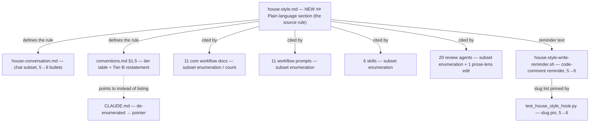

<!-- workflow-sha: f74ef47e943f3bf1900f1f5ab42740d63fe3e588 -->
# Plain-language house-style rule for mid-level-English readers

## High-level plan

**Change tier:** lite — matched categories: none

### Goals

Add one new rule, `## Plain language`, to `.claude/output-styles/house-style.md`, and make every prose surface the house style governs read clearly for a developer with mid-level English. Today the style assumes a mid-level *Java and database* reader (`house-style.md:6`, `:42`) — a technical-knowledge floor. It says nothing about English reading level. This change adds that second axis. The rule covers chat, documentation, and issue and PR text, so it joins the always-on AI-tell subset (a five→six flip) the same way `## Orientation` did in the merged #1142 flip.

The rule is plain-language guidance, not a graded target: prefer the common word, keep sentences short, drop idioms and ambiguous phrasal verbs, expand a non-floor acronym on first use, keep grammar simple. It governs general English only. It never simplifies technical content and never re-teaches the mid-level Java/database floor.

### Constraints

- This plan uses the §1.7 prose-rule self-application opt-out: it edits judgment-layer workflow prose live instead of staging.
- The branch is held to its own new rule. Every artifact this branch writes — the plan, the track files, the new section itself — must read in plain language. The `## Plain language` rule is self-applying from the moment it lands.
- Judgment guidance only. The change adds no new mechanical check: no new `dsc-ai-tell` regex, no sentence-length counter, no new test logic. It does flip the existing hook reminder and its existing pin test from five slugs to six — enumeration sync, not new enforcement (D2).
- The two "mid-level"s must stay distinct. Mid-level *Java/database* is the unchanged technical-knowledge floor; mid-level *English* is the new reading-level axis. The new section states this boundary so the two never collide.
- Stamp-advance at the end. Live edits to `.claude/workflow/**`, `.claude/skills/**`, and `.claude/agents/**` advance HEAD past the stamp base (`f74ef47e94`), so the drift gate fires on the branch's own authoring each later session. Suppress it per session and run `/migrate-workflow` once after the branch-final pathspec-touching commit. Edits to files outside that pathspec (`house-style.md`, `house-conversation.md`, `CLAUDE.md`, the hook, the test) do not advance the stamp base.
- §1.7(l) re-points the Phase-3A review trio onto the prose lenses through the opt-out marker above; no in-plan bootstrap note is needed (this is a post-#1142 opt-out branch).

### Architecture Notes

#### Component Map

- **`house-style.md`** (Track 1): gains the new `## Plain language` section after `## Orientation`, plus the line-20 count flip and a self-check item. The single source of the rule.
- **`house-conversation.md`, `conventions.md §1.5`** (Track 1): the canonical subset homes. House-conversation gains a sixth bullet; §1.5 gains the section in the Tier-B "Sections that apply" cell, the five→six count flip, and a Tier-B code-comment restatement paragraph parallel to the Orientation one.
- **11 core workflow docs, the hook, its test, `CLAUDE.md`** (Track 1): core-doc enumerations gain the sixth slug; the hook reminder and its pin test flip five→six; `CLAUDE.md` is de-enumerated to a pointer (D6).
- **11 prompts, 6 skills** (Track 2): the subset enumerations gain the sixth slug — 10 prompt preambles and 4 skill blockquotes. `design-review.md` gains the rule in the cold-read `### Prose AI-tell additions` block (a content edit); `ai-tells` gains a catalogue row and `readability-feedback` gains read-list / classification / grep edits.
- **20 review agents** (Track 3): 19 enumerations gain the sixth slug; `review-workflow-writing-style.md` gains a Plain-language enforcement check (a content edit).

#### D1: Plain-language target, not a graded band

- **Alternatives considered**: a CEFR B1–B2 anchor; a reading-grade band (Flesch-Kincaid 8–10); plain-language clarity moves with no number (chosen).
- **Rationale**: a band or grade implies measurement the project will not run. Plain-language moves are teachable and reviewable by eye, which fits judgment-only enforcement (D2).
- **Risks/Caveats**: "plain" is a judgment call with no threshold; the reviewer lens carries the load. Acceptable — the same is true of `## Voice and tone` and `## Orientation`.
- **Implemented in**: Track 1.

#### D2: Judgment guidance only; no new mechanical enforcement

- **Alternatives considered**: wire measurable triggers into `design-mechanical-checks.py` + new tests; add a `dsc-` rule for the new section; judgment-only (chosen).
- **Rationale**: a regex for plain language produces false positives (a short sentence can still be unclear; a long one can be clear) and a maintenance burden the em-dash counter already shows is touchy.
- **Risks/Caveats**: the flip must still sync the *existing* hook reminder enumeration and its *existing* pin test from five slugs to six. That is enumeration sync of pre-existing checks, not a new check, so D2's intent holds.
- **Implemented in**: Track 1 (hook + test sync), Tracks 2 and 3 (review-lens prose).

#### D3: Join the always-on subset (five→six) with natural reach and a Tier-B restatement

- **Alternatives considered**: confine the rule to chat + docs + issues and exclude code comments (needs a §1.5 Tier-B carve-out); join the subset with natural reach to chat + Markdown + `*.java`/`*.kt` comments (chosen).
- **Rationale**: the aim names conversation, which only the subset reaches; matching the Orientation precedent avoids a special-case carve-out. Plain rationale comments help every reader.
- **Risks/Caveats**: "same reach as Orientation" is not "no per-surface text". Orientation still carries a Tier-B restatement at `conventions.md:574-581` because its literal test does not transfer to a file-open reader. Plain language has the same gap, so §1.5 Tier-B gains a parallel paragraph: at comment scale the common-word, acronym, and no-idiom moves apply; the short-sentence / clause-nesting move does not.
- **Implemented in**: Track 1 (§1.5 + the section's own one-line carve), Track 3 (the hook reminder's carve note rides Track 1).

#### D4: Take the §1.7(k) prose-rule self-application opt-out

- **Alternatives considered**: full staging via the workflow-modifying marker; a hybrid that stages only the two execution-procedure files; the §1.7(k) opt-out (chosen).
- **Rationale**: both opt-out criteria hold. No `_workflow/**` schema moves. §1.7(k) criterion 2 (`conventions.md:1229-1237`) keys on what part of a file an edit touches: the subset enumeration in `step-implementation.md` and `implementer-rules.md` is prose, not a parsed control structure. The #1142 flip edited those same two files live under the same opt-out and shipped.
- **Risks/Caveats**: live edits advance the stamp base, so the drift gate fires on the branch's own authoring; Suppress per session and migrate once at the end.
- **Implemented in**: marker in `### Constraints`; all three tracks edit live.

#### D5: New `## Plain language` section after `## Orientation`, with a boundary clause

- **Alternatives considered**: fold the moves into `## Voice and tone` and `## Banned vocabulary`; a dedicated `## Plain language` section (chosen); name it "Mid-level English".
- **Rationale**: a dedicated section parallels `## Orientation` (structural clarity) as its lexical and syntactic complement, so neither duplicates the other. The name "Plain language" is itself plain and does not collide with the "mid-level Java/database" reader phrase.
- **Risks/Caveats**: move (a) (prefer the common word) overlaps `## Banned vocabulary`, so the section states the precedence: Banned vocabulary owns the closed AI-tell list; Plain language owns general-English word choice outside it and never re-bans a tier word.
- **Implemented in**: Track 1.

#### D6: De-enumerate `CLAUDE.md`, do not grow its count

- **Alternatives considered**: leave it at four (the current lag); grow it to six; de-enumerate it to a pointer (chosen).
- **Rationale**: `CLAUDE.md:104` lists the subset as a four-item parenthetical and already lags (it omits Orientation; #1142 never touched it). Re-enumerating to six re-arms the same drift. A pointer to the canonical list fixes the lag and removes `CLAUDE.md` from every future flip's blast radius — the single-source-of-truth discipline the rules already follow.
- **Risks/Caveats**: a reader loses the inline four-word example at `CLAUDE.md:104` and follows one pointer hop instead. Accepted (the gate challenged this and it survives).
- **Implemented in**: Track 1.

#### Invariants

- After all three tracks land, every site that names the AI-tell subset lists exactly the same six section slugs (`## Orientation`, `## Banned vocabulary`, `## Banned sentence patterns`, `## Banned analysis patterns`, `### Em-dash discipline`, `## Plain language`), and every numeric count of the subset reads "six". (Tested by `test_16_section_name_guard` after the `TIER_B_HEADINGS` update, and by the cross-file consistency review.)
- The new section governs general English only. No move in it bans, replaces, or re-teaches a technical term in the mid-level Java/database floor.

#### Non-Goals

- No graded reading-level target (no CEFR, no Flesch-Kincaid). (D1)
- No new mechanical / regex check for plain language. (D2)
- No change to any `_workflow/**` artifact schema, resume-state field, drift-gate format, or stamp format. (D4)
- No rewrite of existing prose to plain language across the repo; the rule binds new and edited prose going forward (the same way every other house-style rule binds).

## Checklist
- [x] Track 1: Author the rule and update the canonical homes, core docs, hook, and `CLAUDE.md`
  > Adds the `## Plain language` section to `house-style.md` (after `## Orientation`) with its boundary clause and a self-check item, then updates every canonical home and core-doc enumeration: the `house-conversation.md` chat subset, the `conventions.md §1.5` tier table plus its Tier-B code-comment restatement, the 11 core workflow docs, the hook reminder and its pin test (five→six), and the `CLAUDE.md` de-enumeration. This track defines the rule the other two propagate.
  >
  > **Track episode:**
  > Authored the `## Plain language` section and flipped the always-on AI-tell subset five→six across the canonical homes, the 11 core workflow docs, the write-reminder hook + its pin test, and `CLAUDE.md` (de-enumerated to a pointer, D6). The hook body fit the sixth slug plus the carve note at 491 chars under the hard 500-char cap, so D2's no-re-tune constraint held (SD1). The §1.5 Tier-B restatement gained a parallel plain-language paragraph naming which moves carry to comment scale.
  > Track-level review (5 workflow reviewers) was clean on three dimensions; consistency and instruction-completeness independently caught the one open SD5 item — the §1.5 rename-detection grep helper listed four of six Tier-B headings, so renaming `## Orientation` or `## Plain language` found zero pointer sites. `Review fix:` `7b8ad4f424` completed the helper to six, anchoring the two common-word names to their `##`/`§` heading-pointer form (bare matching produced ~109 false positives from `## Context and Orientation`; anchored yields 122 clean pointer-site lines, 0 false positives). Gate-check PASS at 1 iteration.
  > Cross-track: the same grep has a verbatim copy at `readability-feedback/SKILL.md:54`, already in Track 2's scope. A plan correction (`ea8f1152c8`) folds the grep-sync into Track 2. Track 3 unaffected.
  >
  > **Track file:** `plan/track-1.md` (3 steps, 0 failed)
  >
  > **Strategy refresh:** CONTINUE — Track 1's one cross-track effect (syncing the §1.5 grep copy at `readability-feedback/SKILL.md:54`) was already added to Track 2's scope by correction `ea8f1152c8`. No other track is affected.

- [ ] Track 2: Propagate the slug to the workflow prompts and skills
  > Adds the sixth section slug to the 11 `.claude/workflow/prompts/*.md` enumerations and the 6 `.claude/skills/*/SKILL.md` enumerations. `design-review.md` also gains the rule in the cold-read Human-reader list (a content edit, not just a slug add). `readability-feedback/SKILL.md:54` also carries a verbatim copy of the `conventions.md §1.5` rename-detection grep; sync it to the now-six-heading form Track 1 landed (a grep edit, not just a slug add — Track 1 Phase C correction).
  > **Scope:** ~17 files covering 11 workflow prompts and 6 skills.
  > **Depends on:** Track 1

- [ ] Track 3: Propagate the slug to the review agents
  > Adds the sixth section slug to the 19 `.claude/agents/*.md` enumerations, and adds a Plain-language enforcement check to `review-workflow-writing-style.md` (the workflow-markdown writing-style reviewer, which actively checks prose and so needs a real lens, not just a slug add).
  > **Scope:** ~20 files covering 20 review agents.
  > **Depends on:** Track 1

## Plan Review
- [x] Plan review (consistency + structural) — passed; consistency at iteration 2 (gate), structural at iteration 1 (0 findings)

**Auto-fixed (mechanical)**: CR1 — corrected Track 2's characterization of `ai-tells/SKILL.md`. It cites a `## Catalogue lookups` fingerprint→section catalogue (six sections, two outside the subset), not the five-slug preamble, so it has no enumeration to extend; the Phase-A question is now whether that catalogue should gain a `## Plain language` row.

**Escalated (design decisions)**: CR2 — `design-document-rules.md` was listed among Track 1's "12 core docs — subset enumeration/count", but its only house-style touchpoint is the `dsc-ai-tell` regex-rule row, which gains no pattern from `## Plain language` (judgment-only, D2). With nothing to flip there, the user chose to drop it: Track 1 now names **11 core workflow docs / ~16 files** (was 12 / ~17), updated at every count site, and `track-1.md` records why the file is excluded. Structural review found no issues.

## Final Artifacts
- [ ] Phase 4: Final artifacts (`adr.md`)
