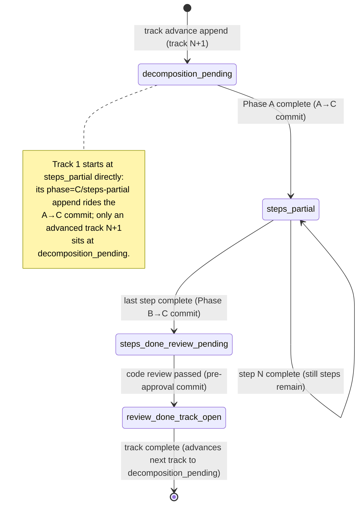
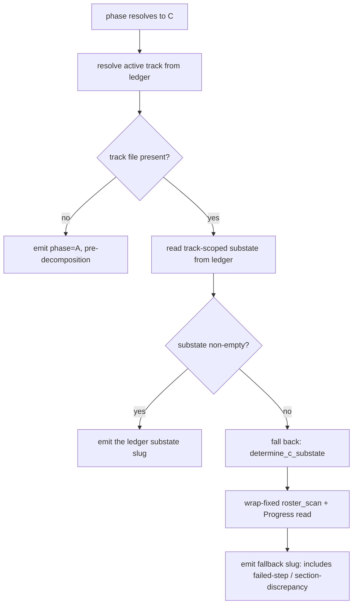

<!-- workflow-sha: 6b81c6b970b0c58300e4c053a5883c2482d3dd25 -->
# Mid-track resume: route the State-C sub-state from the phase ledger

## Overview

A mid-track resume mis-routes when a step description hard-wraps. The fix moves
the State-C sub-state decision off the fragile `## Concrete Steps` roster parse
and onto a new track-scoped `substate` key on the phase ledger, keeping a
wrap-fixed roster parse as the fallback.

This design is for the contributor who maintains
`.claude/scripts/workflow-startup-precheck.sh` and the resume-protocol docs
under `.claude/workflow/`. It assumes familiarity with the phase ledger (the
append-only event log the resume machinery already reads), the track-file
`## Progress` and `## Concrete Steps` sections, and the workflow's
phase/track/sub-state vocabulary. The change is bash and markdown workflow
machinery, not Java. The "Class design" analogue is therefore the script's
function structure and the ledger grammar. The "Workflow" analogue is the resume
state machine and the per-track `substate` lifecycle.

The bug (YTDB-1134) is a silent mis-route: when a step description hard-wraps,
the precheck's `roster_scan` miscounts that step, so a finished track resolves to
`steps-partial` instead of `steps-done-review-pending` and the resume re-enters
Phase B looking for a `[ ]` step that does not exist. `### Worked trace of the
bug` carries the full interleaving.

The fix removes the failure class rather than hardening one parser. The phase
ledger already owns the coarse resume signal (the top-level phase and the active
track); this design adds one `substate=<slug>` key so the ledger also owns the
within-track sub-state the resume routes on, and the precheck reads it without
touching the track-file roster. The roster parse stays as a fallback for the two
cases the ledger cannot cover: an in-flight plan created before this change, and
the non-ledger walk in `determine_state`. `determine_state` is the precheck's
top-level resume resolver; it prefers `determine_state_from_ledger`, and
otherwise walks the plan checkboxes, so it still runs when there is no ledger.
The fallback gets the issue's wrap-tolerant fix so it is correct when it runs.

The sections below cover the ledger grammar and reader, the resume state machine,
the dual-path resolution, the wrapped-roster fix, the test surface, and the
decision and invariant records.

## Core Concepts

This section glosses the entities the rest of the design leans on. Each is
specific to this workflow's machinery; a reader who knows them can skip ahead.

- **Phase ledger.** `<plan_dir>/_workflow/phase-ledger.md`, an append-only event
  log with one line per phase boundary. Each line carries a `[<ISO>]` timestamp,
  a `[ctx=<level>]` marker, and bare `key=value` tokens. The read contract is
  last-value-wins per key across the whole file: a reader scans every line and
  keeps the most recent value seen for each key, so a mid-flight change appends a
  new line rather than rewriting an old one. The ledger owns the top-level phase
  (the enum `{0, A, C, D, Done}`, with no `B`) and the active track.

- **State-C sub-state.** The phase enum has no `B`, so a track executing Phase B
  is recorded under phase `C`; phase `C` therefore spans both Phase B execution
  and Phase C review. When the top-level phase is `C` (a track is active), the
  resume needs a finer signal. Each question maps to one sub-state slug that
  `determine_c_substate` resolves:
    - has decomposition finished → `decomposition-pending`
    - are steps still running → `steps-partial`
    - is code review pending → `steps-done-review-pending`
    - is the track ready to close → `review-done-track-open`

  plus the fallback-only `failed-step` and `section-discrepancy`. The
  orchestrator's resume protocol (`workflow.md` step 5) routes on the slug.

- **The `## Concrete Steps` roster.** The track file's numbered step list, one
  entry per step in the shape `N. <description> — \`risk: <tag>\`  [<glyph>]`
  with an optional ` commit: <SHA>` tail. The `[<glyph>]` after the `risk:` token
  is the step's status checkbox. The roster is immutable after Phase A except for
  the status flip and the `commit:` annotation. A long description wraps onto
  indented continuation lines below the column-0 `N. ` line — this is the wrap
  that breaks `roster_scan`.

- **`roster_scan`.** The precheck function that walks the roster and sets the
  flags `determine_c_substate` branches on: `ROSTER_HAS_FAIL`, `ROSTER_HAS_TODO`,
  `ROSTER_STEP_COUNT`, and the per-step `ROSTER_PAIRS` list. It is the fragile
  parser the bug lives in.

- **Track-scoped read.** The ledger is last-value-wins across the whole file, so
  a sub-state read must be scoped to the active track. Track N's terminal
  sub-state would otherwise leak into track N+1's resume. The existing
  `ledger_tail_value` is global (it keeps the last value of a key across every
  line); this design adds a reader that keeps the last `substate` on a line whose
  `track=` equals the active track.

- **Committed-boundary cadence.** The ledger records only sub-states that survive
  a `git reset --hard HEAD` (the implementer's revert path). So every `substate`
  append must ride a commit that is already part of the protocol. The append
  cadence section gives the four boundaries and the commits they ride.

## Ledger grammar and the script function structure

**TL;DR.** The ledger grammar gains one bare-token key, `substate`, carrying one
of the four committed sub-state slugs. The precheck gains a track-scoped reader
(`ledger_tail_value_for_track`), a `--substate` append flag, and a one-line read
in `determine_state_from_ledger` that prefers the ledger value over the roster.
This is the "class design" analogue for a bash script: the data shape (the
grammar) plus the function structure.

Nothing about the phase enum, the append atomicity, or the existing keys changes.

### The `substate` key

`substate` is a bare metacharacter-free token, the same value class as `phase`,
`track`, `tier`, and `s17`. It joins the fixed key set
`{ phase, track, tier, categories, s17, paused }`, becoming the seventh key. Its
value is one of the four committed sub-state slugs:

| Slug | Meaning |
|---|---|
| `decomposition-pending` | Phase A not yet run for this track; the roster is still the placeholder. |
| `steps-partial` | Decomposition done, at least one step still `[ ]`. |
| `steps-done-review-pending` | Every step `[x]`/`[~]`, code review not yet passed. |
| `review-done-track-open` | Code review passed, track completion (and its plan checkbox) still pending. |

The two fallback-only slugs (`failed-step`, `section-discrepancy`) are never
appended to the ledger — they are working-tree signals the roster fallback
emits, covered in the dual-path section.

Because `substate` is a bare token, it rides the existing append validation
unchanged: `reject_bad_ledger_value` already rejects a newline in any field and
a space in any bare-token field with exit 3 and a stderr diagnostic. Adding
`substate` to the validated bare-token set is a one-line addition mirroring the
`phase`/`track` lines in `append_ledger`.

### The new track-scoped reader

The existing `ledger_tail_value <key>` is global: it keeps the last value of
`<key>` seen on any line. A `substate` read cannot use it, because the last
`substate` in the whole file may belong to a completed prior track. The design
adds `ledger_tail_value_for_track <key> <track>`: it scans every line, and on a
line whose `track=` token equals `<track>` it keeps that line's `<key>` value,
returning the last such value (or empty when no matching line carries the key).

The active track is the value `determine_state_from_ledger` already resolved
from the `track` key (defaulting to `1` for the single-track `minimal` tier).
So the new reader is called as
`ledger_tail_value_for_track substate <active-track>`.

One emit-order subtlety carries over from `ledger_tail_value`'s existing
contract: the reader anchors the key at a token boundary (line start or after a
space), takes the first ` track=` and ` substate=` token on the line, and stops.
The safety invariant is that `append_ledger` writes every bare read-key before
the one quoted `categories` field, so a decoy `substate=` inside a quoted
`categories="…"` span can never win. This design preserves that order: the
`substate` token is bare and is written in the same pre-`categories` block as
`phase` and `track`.

### Changes to existing functions

- **`append_ledger`** gains a pre-`categories` append line, shown below, and the
  arg parser gains a `--substate` case filling `LEDGER_SUBSTATE`. The validation
  call `reject_bad_ledger_value "substate" "$LEDGER_SUBSTATE" bare` joins the
  existing block.

  ```bash
  [ -n "$LEDGER_SUBSTATE" ] && line="$line substate=$LEDGER_SUBSTATE"
  ```

- **`determine_state_from_ledger`** already resolves phase `C` to a track file
  and calls `determine_c_substate`. The design inserts the ledger read before
  that call: read the track-scoped `substate`; when non-empty, emit it directly;
  when empty, fall through to `determine_c_substate` (the roster fallback). The
  empty case is the unambiguous pre-this-change-ledger signal (D3).

- **`determine_c_substate`** is unchanged in logic but is now the fallback path,
  reached only when the ledger read is empty. Its `roster_scan` call gets the
  wrap fix (the wrapped-roster section).

### Edge cases / Gotchas

- A single-step track skips code review, so no agent appends
  `review-done-track-open`. The track-completion append (which sets the next
  track's `decomposition-pending`, or crosses to `phase=D`) is the boundary that
  carries the single-step track past review. A resume between the steps-complete
  state and the track-completion commit reads the last appended `substate`
  (`steps-done-review-pending`), which routes correctly: the resume protocol for
  a single-step track checks whether review applies and proceeds to completion.

- A `[~]` skipped step counts toward all-steps-complete, the same as `[x]`. The
  append cadence keys on "every step `[x]`/`[~]`", so a track that finishes with
  one skipped step still appends `steps-done-review-pending`.

- An inline replan that adds steps to a review-pending track reverts the track to
  partial. The replan must append `substate=steps-partial` so the ledger no
  longer claims the track is review-pending; the new steps are now `[ ]`.

### Decisions & invariants

- D1: track-scoped `substate` ledger key.
- D3: explicit `decomposition-pending` on track advance; empty `substate` means
  pre-this-change ledger.

## Resume state machine and the per-track `substate` lifecycle

**TL;DR.** A track's `substate` advances `decomposition-pending` →
`steps-partial` → `steps-done-review-pending` → `review-done-track-open`, one
transition per phase boundary. Each append rides a commit that is already part
of the protocol, so the ledger records only sub-states that survive
`git reset --hard HEAD`. The Phase B→C boundary needs a new commit; the other
three ride existing ones.

This section describes how the ledger drives the resume and how a track's
`substate` advances through its lifecycle. The orchestrator appends a `substate`
at each within-track boundary; the precheck reads the latest track-scoped value
to route a fresh `/execute-tracks`.

### The sub-state lifecycle

A track starts at `decomposition-pending` and advances through three more
states as Phase A, Phase B, and Phase C complete. Each transition is a ledger
append riding the commit that already marks that boundary in the protocol.



Track 1 never sits at `decomposition-pending` on the ledger: it is `phase=A`
until its A→C append sets `phase=C` with `substate=steps-partial` in one commit.
Only an advanced track N+1 is appended at `phase=C` with
`substate=decomposition-pending` before its own Phase A runs.

The `steps-partial` self-loop is not a ledger append per step. Per-step `[x]`
flips stay in the track-file roster and ride each episode commit; the ledger
records only the milestone flips. The step pointer for a `steps-partial` resume
(which `[ ]` step to resume from) is resolved later by the agent reading the
track file as prose, not by the precheck — so the ledger need not record
per-step pointers.

### Why every append rides a committed boundary

The ledger must record only sub-states that survive the implementer's revert
path, `git reset --hard HEAD`. An append that does not ride a commit would be
reverted on the next crash recovery, leaving the ledger inconsistent with the
track file. So each `substate` append is staged and committed together with the
track-file change at a boundary that already commits in the protocol.

| Boundary | `substate` appended | Rides commit |
|---|---|---|
| Phase A decomposition complete | `steps-partial` | the A→C commit (`track-review.md` step 6) |
| All steps complete (Phase B→C) | `steps-done-review-pending` | a new Phase-B-complete commit (see below) |
| Code review passed (pre-approval) | `review-done-track-open` | the pre-approval code-review-complete commit (`track-code-review.md`) |
| Track complete → next track | `decomposition-pending` (for track N+1) | the track-completion commit (`track-code-review.md`) |

The Phase B→C boundary needs a new commit. Today `step-implementation.md`
§Phase B Completion marks `Step implementation [x]` in `## Progress` and ends
the session with no commit and no append. The roster reads all-`[x]` because the
per-step flips were committed in each episode, so today's roster-based resume
survives. Once the resume reads the ledger, the `steps-done-review-pending`
append needs its own committed boundary. This design adds a Phase-B-complete
Workflow-update commit there, staging the `Step implementation [x]` flip plus
the append. The commit is symmetric with the A→C boundary and incidentally fixes
a latent wart: today's `Step implementation [x]` flip is uncommitted at
session end.

### Why `failed-step` is not a ledger sub-state

A failed step's writes — the `[!]` roster flip, the FAILED episode, the retry
rows — are uncommitted in-session and reverted by the next
`git reset --hard HEAD`. So a `substate=failed-step` append has no committed
boundary to ride. The `failed-step` resume is reachable only via crash, and the
Phase B resume Detection (`step-implementation-recovery.md`) already reconciles
it from working-tree artifacts, reconstructing a missing `[!]` from the revert
body. On the ledger path, a session that crashed during a failure resumes as
`steps-partial`, and that same Detection finds the `[!]` and retry rows. So
`failed-step` stays a fallback-path / working-tree signal only.

### Edge cases / Gotchas

- A crash between a `substate` append and its commit reverts both the ledger and
  the track file atomically, because they are staged in one commit. So the ledger
  and the track file cannot diverge at a committed boundary; the resume reads the
  prior committed state.

- A re-run of an append over a corrupted or hand-edited tail records a fresh
  authoritative line below the bad one (last-value-wins) rather than rewriting it
  — the same recovery the A→C append already documents.

### Decisions & invariants

- D1: append cadence with committed boundaries; `failed-step` excluded.

## The dual-path sub-state resolution

**TL;DR.** The precheck prefers the ledger sub-state and falls back to the
wrap-fixed roster parse only when the track-scoped `substate` read is empty. An
empty read means exactly one thing — a pre-this-change ledger — because every
`phase=C` track on a current ledger carries an explicit `substate`. The fallback
still emits `failed-step` and `section-discrepancy`; the ledger path emits only
the four committed slugs.

The precheck resolves the State-C sub-state through two paths: the
ledger-authoritative primary and the roster+Progress fallback. The primary is
preferred; the fallback runs only when the primary read is empty. This section
gives the resolution flow and why both paths exist.

### Resolution flow



The primary path emits one of the four committed slugs directly from the ledger.
The fallback path runs the existing `determine_c_substate`, which reads the
wrap-fixed roster and the `## Progress` log and can additionally emit
`failed-step` (from a working-tree `[!]`) and `section-discrepancy` (from the
roster-vs-Progress cross-check).

### Why both paths exist

The fallback covers two cases the ledger cannot:

- An in-flight plan created before this change has no `substate` key on its
  ledger. Retiring the roster parse would break resume for any branch mid-flight
  at merge time and for pre-ledger in-flight `lite`/`full` plans.

- The non-ledger `determine_state` walk (a fresh checkout with no ledger, or the
  legacy plan-checkbox walk) still needs a sub-state source.

An empty track-scoped `substate` read on a `phase=C` track means exactly one
thing: a pre-this-change ledger. On a current-scheme ledger every `phase=C`
track carries an explicit `substate` — the A→C append sets `steps-partial`, the
track-advance append sets `decomposition-pending`, and the two Phase-C
milestones set the rest. So an empty read is the unambiguous trigger to fall
back. This is why the track-advance append sets `decomposition-pending`
explicitly (D3) rather than leaving it empty. An empty default would conflate two
distinct states: "genuinely not decomposed" and "the append was lost / old
ledger." That conflation would revive the silent-default failure mode — the same
mode the bug itself is an instance of.

### Why `section-discrepancy` leaves the routing path

`section-discrepancy` is a torn-write cross-check. It fires when the roster shows
a step flipped `[x]` but the `## Progress` log has no matching `Step N` entry —
an interrupted write between the two adjacent sub-steps that record a completed
step. It exists only because today's resume reads two track-file sources (the
roster and `## Progress`) that can disagree.

With the ledger as the single routing source, there is nothing to cross-check at
routing time. The ledger line commits atomically with the track-file change, so
a crashed boundary cannot leave them inconsistent. So `section-discrepancy` is
dropped from the ledger path. It stays alive in the fallback `determine_c_substate`,
where the roster and `## Progress` are still both read and can still disagree.

### Dual-path parity

The two paths must stay behaviorally aligned on the four shared sub-states: for a
track whose ledger carries `substate=<slug>` and whose roster/Progress imply the
same `<slug>`, both paths must resolve to the identical sub-state. A parity test
(the test surface section) pins this, so the two readers cannot silently diverge.

### Edge cases / Gotchas

- A track whose ledger carries a stale `substate` while the track file has moved
  on cannot happen at a committed boundary (the two are staged together). A
  hand-edited ledger that breaks this is out of contract; the loud-reject
  posture catches a malformed value, not a semantically stale one.

### Decisions & invariants

- D2: drop `section-discrepancy` from routing; keep it on the fallback.
- D3: explicit `decomposition-pending`; empty `substate` is the pre-change-ledger
  trigger.

## The wrapped-roster fallback fix

**TL;DR.** The fallback `roster_scan` must count a step whose `risk:` tail
wrapped onto a continuation line. The fix joins each roster entry with its
continuation lines before reading the status checkbox, so a wrapped step's `[x]`
is no longer invisible. This is a fallback-only correctness fix; on the ledger
path the roster is never read for routing.

The fallback `roster_scan` must count a step whose `risk:` tail wrapped onto a
continuation line, the fix YTDB-1134 asked for. Today the scan reads the status
checkbox only from the column-0 `N. ` line: it matches `[0-9]*". "` to find a
roster entry, then splits that same line at the last `risk:` to find the status
checkbox. When the description is long, the `— risk: <tag>  [<glyph>]` tail is
on an indented continuation line, and the column-0 line carries no `risk:`. The
current scan's `*"risk:"*) … *) continue` arm then skips the entry without
counting it.

### Worked trace of the bug

A two-step track, both steps `[x]`, code review pending. Step 2's description
wraps:

```
1. Short step description — `risk: low`  [x] commit: abc1234
2. A long step description that runs past the wrap column and continues onto
   the next line — `risk: medium`  [x] commit: def5678
```

The current `roster_scan` walk:

1. Line `1. Short … — \`risk: low\`  [x] …` — column-0 `N. ` match, has `risk:`,
   status `[x]`. Counted. `ROSTER_STEP_COUNT = 1`.
2. Line `2. A long step description … continues onto` — column-0 `N. ` match,
   but no `risk:` on this line, so the `*) continue` arm skips it. Not counted.
3. Line `   the next line — \`risk: medium\`  [x] …` — indented, not a column-0
   `N. ` line, so the `[0-9]*". "` guard's `*) continue` arm skips it.

Result: `ROSTER_STEP_COUNT = 1`, but only one step's status was read, and step 2
is invisible. `ROSTER_HAS_TODO` stays `0` (no `[ ]` seen), but the all-done
branches never fire because the scan never observed step 2's `[x]`. The
sub-state falls through to `steps-partial`, and the resume re-enters Phase B for
a step that is already done.

### The fix

`roster_scan` joins each roster entry with its continuation lines before reading
the status checkbox. When a column-0 `N. ` line carries no `risk:`, the scan
buffers it and appends following non-column-0 (indented or blank-prefixed)
continuation lines until it reaches the next column-0 `N. ` line, a `## `
heading, or EOF, then reads the `risk:` tail and status checkbox from the joined
text. A column-0 line that already carries its `risk:` tail (the common
unwrapped case) is read as-is, unchanged from today.

The join must stop at the next roster entry so two adjacent wrapped steps do not
merge. The terminators are: the next column-0 `[0-9]*". "` line, the next `## `
heading, and EOF. The fenced-code and blockquote guards stay as they are; a
continuation line inside neither is part of the entry.

This is a fallback-only fix. On the ledger path the roster is never read for
routing, so the wrap cannot mis-route there. But the fallback must be correct
when it runs, and the same wrap-tolerant fix satisfies the issue's literal
acceptance criteria (count a wrapped step, with a regression test) at no
additional cost.

### Edge cases / Gotchas

- A wrapped description whose continuation line itself contains a bracketed token
  in backticks (e.g. an inline `` `[ ]` `` in prose) does not confuse the status
  read: the status checkbox is still the first `[...]` after the last `risk:`
  token in the joined text, and the canonical roster grammar writes risk-note
  annotations parenthesized, never bracketed (the existing `roster_scan`
  assumption, preserved).

- A blank line between a step and its continuation: the join treats a blank line
  as a continuation only while still inside the entry (before the next column-0
  `N. ` line). A roster with a blank line separating distinct entries still
  terminates each entry at the next column-0 `N. ` line.

### Decisions & invariants

- D2: keep and fix `roster_scan` as the fallback.

## Test surface

**TL;DR.** Five test groups land in `test_workflow_startup_precheck.py`: the
ledger path (one per committed slug plus a track-scoping case), the empty-`substate`
fallback path, the dual-path parity test (the D2 mandate), the wrapped-roster
regression (the issue's acceptance criterion), and `--substate` append
validation. They reuse the existing `write_ledger` / `_substate` / `_track_doc`
helpers.

The change lands in `test_workflow_startup_precheck.py`, which already has a
`write_ledger` helper (writes a verbatim ledger and commits it) and `_substate` /
`_track_doc` helpers (compose a State-C plan and read the resolved `state`). The
new tests use these.

- **Ledger path.** For each of the four committed slugs, a fixture whose ledger
  tail carries `phase=C track=2 substate=<slug>` resolves `state.substate` to
  that slug, regardless of the roster shape (the roster is not read on this
  path). One case proves track-scoping: a ledger with track 1's terminal
  `substate` followed by track 2's `substate` resolves track 2's value, not
  track 1's.

- **Fallback path (empty `substate`).** A `phase=C` ledger with no `substate`
  key resolves through `determine_c_substate` and the wrap-fixed `roster_scan`,
  emitting the roster-derived slug — the pre-this-change-ledger behavior.

- **Dual-path parity (D2 mandate).** A fixture whose ledger carries
  `substate=<slug>` and whose roster/Progress imply the same `<slug>`: assert the
  ledger path and the ledger-stripped fallback path resolve to the identical
  sub-state, so the two readers cannot silently diverge.

- **Wrapped-roster regression (the issue's criterion).** A track whose step
  description wraps onto a continuation line carrying the `risk:` tail and `[x]`
  status: the wrap-fixed `roster_scan` counts the step and the fallback resolves
  `steps-done-review-pending`, where the current scan resolves `steps-partial`.

- **Append validation.** `--append-ledger --substate <bad>` with a space or
  newline in the value exits 3 with a stderr diagnostic, mirroring the existing
  bare-token rejection tests.

### Edge cases / Gotchas

- The dual-path parity test must strip the ledger `substate` for the fallback
  arm; if it ran the same fixture twice without stripping, both arms would read
  the ledger and the parity assertion would be vacuous.

### Decisions & invariants

- S1 (track-scoped read), S2 (empty-`substate` closure), S3 (dual-path parity),
  S5 (wrap-fixed fallback), S6 (loud-reject append) each name one of these tests
  as their backing assertion.

## Decision records

**TL;DR.** Three decisions shape the change: D1 sources the sub-state from a
track-scoped ledger key, D2 drops `section-discrepancy` from routing while
keeping a wrap-fixed roster as the fallback, and D3 makes the track-advance
append set `decomposition-pending` explicitly so an empty read is an unambiguous
pre-change-ledger signal.

- **D1:** Source the State-C sub-state from a track-scoped `substate` ledger key.
  The bug class is "the fine-grained resume signal lives in a fragile-to-parse
  place (the roster) when a durable one (the ledger) already records the coarse
  signal." One `substate=<slug>` key maps 1:1 to the slugs `workflow.md` step 5
  already routes on, leaves the phase enum untouched, and lets the precheck
  resolve the sub-state without reading the track file. The read is track-scoped
  because the ledger is last-value-wins across the whole file. Every append rides
  an already-committed boundary, so the ledger records only sub-states that
  survive `git reset --hard HEAD`. `failed-step` is not a ledger sub-state (its
  writes are uncommitted, working-tree-reconciled). Rejected: a real `phase=B`
  token plus flags (widens the phase enum `{0, A, C, D, Done}` and so touches
  every consumer that branches on it — `determine_state_from_ledger`, the drift
  check, and `workflow.md` step 5 — and still cannot express
  `failed-step`/`review-done-track-open` without an extra field); the issue's
  narrow `roster_scan`-only hardening (leaves the fragile-parse class as the
  routing source).

- **D2:** Drop `section-discrepancy` from routing; keep and fix `roster_scan` as
  the fallback. `section-discrepancy` is a torn-write cross-check that exists
  only because today's resume reads two track-file sources that can disagree.
  With the ledger as the single routing source there is nothing to cross-check,
  and the ledger line commits atomically with the track-file change. The
  non-ledger walk and pre-change ledgers still need a sub-state source, so
  `determine_c_substate` falls back to the roster+Progress read (which keeps
  `section-discrepancy`) when the ledger `substate` read is empty. The issue's
  wrap fix makes that fallback correct. The two paths must stay aligned on the
  four shared sub-states; a dual-path parity test enforces it. Rejected: fully
  retire `roster_scan` (breaks mid-flight and pre-ledger plans); keep
  `section-discrepancy` on the ledger path (no second source to disagree with, so
  dead code there).

- **D3:** Track-advance append sets `substate=decomposition-pending` explicitly.
  On a current-scheme ledger every `phase=C` track then carries an explicit
  `substate`, so "empty `substate` on a `phase=C` track" means exactly one thing
  — a pre-this-change ledger — the unambiguous trigger to fall back to
  `roster_scan`. This matches the script's loud/explicit posture: an absent value
  is an explicit decision point, never a silent default; the bug being fixed is
  itself a silent-default mis-route. Both wiring halves (the A→C
  `steps-partial` append in D1 and the advance `decomposition-pending` append
  here) must land together; a half-implementation leaves a `phase=C` track with
  no `substate` and silently triggers the fallback when it should not. Rejected:
  default an empty read to `decomposition-pending` (conflates "not decomposed"
  with "append lost / old ledger," reviving the silent-default failure mode).

### Edge cases / Gotchas

- D1 and D3 are a wiring pair: both append sites (the A→C `steps-partial` and the
  track-advance `decomposition-pending`) must land in the same change. A
  half-implementation leaves a `phase=C` track with no `substate`, which silently
  routes to the fallback when it should not.

### Decisions & invariants

- D1, D2, D3 are stated in full above; this is the section that owns them.
- S2 (the empty-`substate` closure) and S3 (dual-path parity) are the invariants
  D3 and D2 rest on.

## Invariants

**TL;DR.** Six invariants back the change: track-scoped reads (S1), the
empty-`substate` closure (S2), dual-path parity (S3), the committed-boundary
cadence (S4), wrap-fixed fallback correctness (S5), and loud-reject append
validation (S6). Each names its backing test.

- **S1: Track-scoped read.** The `substate` read keeps the last `substate` on a
  line whose `track=` equals the active track, never the global last value.
  Backed by the track-scoping ledger-path test (a ledger carrying both track 1's
  and track 2's terminal `substate`).

- **S2: Empty `substate` is pre-change-ledger.** On a current-scheme `phase=C`
  ledger every track carries an explicit `substate`; an empty read on a `phase=C`
  track triggers the roster fallback and nothing else. Backed by the closure
  argument in D3 (the A→C, track-advance, and two Phase-C appends cover every
  `phase=C` track) and the fallback-path test.

- **S3: Dual-path parity.** For a track whose ledger `substate` and whose
  roster/Progress imply the same slug, the ledger path and the ledger-stripped
  fallback path resolve to the identical sub-state. Backed by the dual-path
  parity test (D2 mandate).

- **S4: Committed-boundary cadence.** Every `substate` append rides a commit that
  is already part of the protocol, so the ledger records only sub-states that
  survive `git reset --hard HEAD`. Backed by the append-cadence table (each row
  names the riding commit) and, for the new Phase-B→C boundary, the added
  Phase-B-complete commit.

- **S5: Wrapped-roster fallback correctness.** The wrap-fixed `roster_scan`
  counts a step whose `risk:` tail wrapped onto a continuation line, so the
  fallback resolves the correct all-done sub-state. Backed by the wrapped-roster
  regression test.

- **S6: Loud-reject append validation.** A `substate` value with a space or
  newline is rejected on append with exit 3 and a stderr diagnostic, the same
  posture every bare-token field takes. Backed by the append-validation test.

### Edge cases / Gotchas

- S4 (committed-boundary cadence) has no direct unit test for the new
  Phase-B→C commit — the commit lands in `step-implementation.md` prose, not in
  the precheck. The invariant is verified by the append-cadence table review and
  the integration behavior the `steps-done-review-pending` ledger-path test
  exercises, not by a precheck assertion.

### Decisions & invariants

- S1 through S6 are stated in full above; this is the section that owns them.
- The decisions they derive from (D1, D2, D3) carry their full records in
  `## Decision records`.
