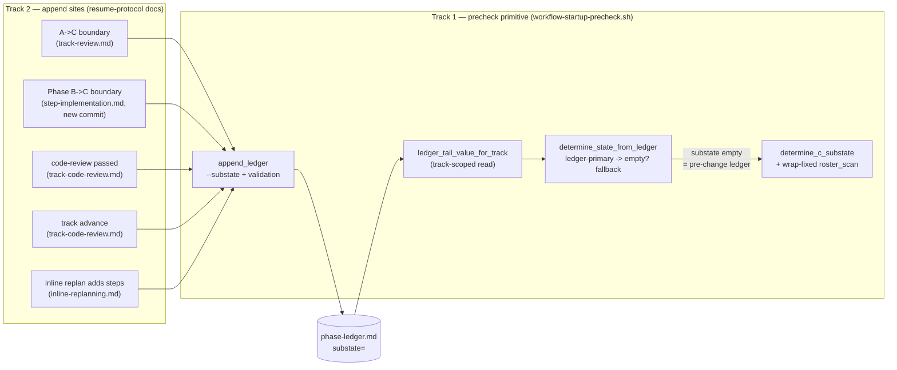

<!-- workflow-sha: 6b81c6b970b0c58300e4c053a5883c2482d3dd25 -->
# Mid-track resume: route the State-C sub-state from the phase ledger

## Design Document
[design.md](design.md)

## Component Map

The change touches one script and the resume-protocol docs that call it. The
phase ledger sits between them: Track 2's append sites write a `substate` key at
each within-track boundary, and Track 1's precheck reads that key to route a
resume. Track 1 is the read side and the fallback; Track 2 is the write side.

- **`workflow-startup-precheck.sh`** (Track 1) — gains the read side: the
  `--substate` append, a track-scoped ledger reader, the ledger-primary
  resolution, and the wrap-tolerant `roster_scan` fallback. Grammar docs and
  tests ship with it (per-function detail in Track 1's `## Plan of Work`).
- **Resume-protocol docs** (Track 2) — `track-review.md`,
  `step-implementation.md`, `track-code-review.md`, and `inline-replanning.md`
  gain the `--substate` appends at the four committed boundaries (plus the
  inline-replan revert), each riding a commit already in the protocol. The
  Phase B→C boundary needs a new commit; the other three ride existing ones.
- **`phase-ledger.md`** — the existing append-only event log gains one bare
  key, `substate`, the data contract both tracks share.

## Checklist
- [x] Track 1: Ledger `substate` primitive, dual-path resolution, wrap-fix, tests, grammar
  > Land the read side of the fix: the `substate` ledger key and its track-scoped
  > reader, the dual-path resolution in the precheck that prefers the ledger and
  > falls back to a wrap-fixed roster parse, and the full test surface. This track
  > also delivers the literal YTDB-1134 fix (the wrap-tolerant roster) and lands
  > the ledger primitive dormant — it is correct and mergeable with no append site
  > wired yet, because an empty `substate` read routes to the fallback.
  >
  > **Track episode:** Read-side `substate` primitive + YTDB-1134 wrap fix landed
  > dormant (12 tests); Phase C fixed 1 blocker (staged-suite repo-root anchor) +
  > 2 stale comments at iteration 1. — see `plan/track-1.md` `## Episodes`
  > § Track completion. (2 steps, 0 failed)
  >
  > **Track file:** `plan/track-1.md`

- [ ] Track 2: Wire the `substate` append sites across the resume protocol
  > Activate the primitive: add a `--substate` append at each of the four
  > committed within-track boundaries (and an inline-replan revert), so every
  > `phase=C` track records an explicit sub-state the Track 1 reader routes on.
  > The Phase B→C boundary gains a new Workflow-update commit to carry its append;
  > the other three ride commits already in the protocol.
  > **Scope:** ~4 files covering `track-review.md`, `step-implementation.md`,
  > `track-code-review.md`, and `inline-replanning.md`.
  > **Depends on:** Track 1
