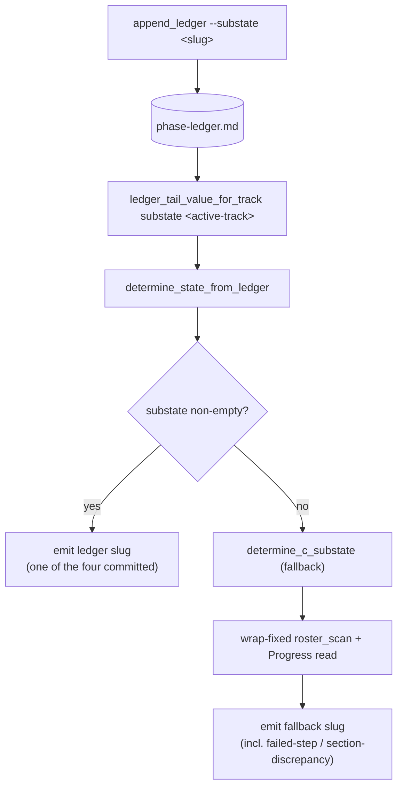

<!-- workflow-sha: 6b81c6b970b0c58300e4c053a5883c2482d3dd25 -->
# Track 1: Ledger `substate` primitive, dual-path resolution, wrap-fix, tests, grammar

## Purpose / Big Picture
A finished track resumes into code review instead of back into Phase B, because
the precheck reads the within-track sub-state from the phase ledger — with a
wrap-fixed roster parse kept as the fallback.

<!-- Reserved for Move 2 — ADDED/MODIFIED/REMOVED triad. Empty until Move 2 lands. -->

This track lands the read side of the fix: the `substate` ledger key, the
track-scoped reader that resolves it, the dual-path resolution that prefers the
ledger and falls back to a wrap-fixed roster parse, and the full test surface. It
also delivers the literal YTDB-1134 wrap fix. The primitive lands dormant — it is
correct and mergeable with no append site wired, because with no `substate` on the
ledger every read is empty and routes to the fallback (the pre-this-change
behavior, plus the wrap fix). Track 2 wires the append sites that activate it.

## Progress
- [x] Review + decomposition
- [ ] Step implementation
- [ ] Track-level code review
- [ ] Track completion

- [x] 2026-06-24T10:20Z [ctx=info] Review + decomposition complete

## Surprises & Discoveries
<!-- Continuous-log. Promoted by the orchestrator from per-step "What was
discovered" when the finding affects future steps or other tracks. Empty
at Phase 1. -->

- **Phase 4 reconciliation item (frozen design.md divergence).** The Phase A
  adversarial review found the same loose wrap-fix terminator shorthand
  (`[0-9]*". "` without the trailing `*`) in the frozen `design.md` in three
  places. The track file is the live decision carrier (D7) and now states the
  correct `[0-9]*". "*` form, so Step 1 implements the right glob; the frozen
  `design.md` is not edited during execution. Reconcile the shorthand in
  `design-final.md` at Phase 4.

## Decision Log
<!-- The track-canonical live decision carrier (D7). Phase 1 seeds the full
inline Decision Records this track owns (full four-bullet form below); the
section then continues as the execution-time continuous log. Seeded from the
frozen design.md D-records. One block per decision. -->

### D1 — source the State-C sub-state from a track-scoped `substate` ledger key (read side)

- **Problem.** The fine-grained resume signal lives in a fragile-to-parse place
  (the `## Concrete Steps` roster), when a durable one (the phase ledger) already
  records the coarse signal (the top-level phase and the active track). A long step
  description wraps onto continuation lines, the roster parser miscounts the step,
  and a finished track mis-routes back into Phase B.
- **Decision.** Add one `substate=<slug>` key to the phase ledger. Its value is one
  of the four committed sub-state slugs (`decomposition-pending`, `steps-partial`,
  `steps-done-review-pending`, `review-done-track-open`), which map 1:1 to the slugs
  `workflow.md` step 5 already routes on. The precheck reads it and resolves the
  sub-state without touching the track-file roster. The read is **track-scoped**:
  the ledger is last-value-wins across the whole file, so a global read would let a
  completed prior track's terminal sub-state leak into the next track's resume; the
  reader keeps the last `substate` on a line whose `track=` equals the active track.
- **Append cadence.** The committed-boundary appends that populate this key are
  Track 2's contract (its D1) — this read side only consumes the resulting key.
- **Rejected.** (a) A real `phase=B` token plus flags — widens the phase enum
  `{0, A, C, D, Done}` and so touches every consumer that branches on it
  (`determine_state_from_ledger`, the drift check, `workflow.md` step 5), and still
  cannot express `failed-step`/`review-done-track-open` without an extra field.
  (b) The issue's narrow `roster_scan`-only hardening — leaves the fragile-parse
  class as the routing source.
- **Implemented in:** this track (the read side: the key, the reader, the dual-path
  read). The append sites are Track 2.
- **Full design**: design.md §"Ledger grammar and the script function structure",
  §"The dual-path sub-state resolution".

### D2 — drop `section-discrepancy` from routing; keep and fix `roster_scan` as the fallback

- **Problem.** `section-discrepancy` is a torn-write cross-check: it fires when the
  roster shows a step flipped `[x]` but the `## Progress` log has no matching
  `Step N` entry — an interrupted write between the two adjacent sub-steps that
  record a completed step. It exists only because today's resume reads two track-file
  sources (the roster and `## Progress`) that can disagree.
- **Decision.** With the ledger as the single routing source there is nothing to
  cross-check at routing time: the ledger line commits atomically with the track-file
  change, so a crashed boundary cannot leave them inconsistent. Drop
  `section-discrepancy` from the ledger path. Keep `determine_c_substate` (which reads
  the roster + `## Progress` and still emits `section-discrepancy`) as the fallback,
  reached only when the ledger `substate` read is empty. Give that fallback the wrap
  fix so it is correct when it runs.
- **Why both paths exist.** The fallback covers two cases the ledger cannot: an
  in-flight plan created before this change (no `substate` key on its ledger), and the
  non-ledger `determine_state` walk (a fresh checkout with no ledger). The two paths
  must stay aligned on the four shared sub-states; a dual-path parity test enforces it.
- **Rejected.** (a) Fully retire `roster_scan` — breaks resume for any branch
  mid-flight at merge time and for pre-ledger in-flight `lite`/`full` plans.
  (b) Keep `section-discrepancy` on the ledger path — there is no second source to
  disagree with, so it is dead code there.
- **Implemented in:** this track.
- **Full design**: design.md §"The dual-path sub-state resolution",
  §"The wrapped-roster fallback fix".

## Outcomes & Retrospective
<!-- Continuous-log. Review iteration outcomes and the track-completion
summary at Phase C. -->

- [x] Technical: PASS at iteration 2 (4 findings, 4 accepted) — T1/T2 should-fix drove the terminator-glob and glossary-key-set fixes; T3/T4 suggestions strengthened test-helper attribution and the emit/precedence note.
- [x] Risk: PASS at iteration 2 (4 findings, 4 accepted) — R1 should-fix (wrap-join runs on the resume hot loop) is covered by the `high` tag on Step 1 plus the two-adjacent-wrapped-steps regression; R2 should-fix made the dual-path parity test non-vacuous; R3/R4 suggestions noted the `TESTS` registry and the empty-substate assumption (already in D2).
- [x] Adversarial: PASS at iteration 2 (3 findings, 3 accepted) — A1 confirmed the terminator bug (≡ T1); A2/A3 suggestions added the parity-non-vacuity wording and the S1 `categories`-decoy test. S2/S6, the emit-order safety invariant, and the ~4-file scope/sizing cut survived construction (INFEASIBLE to violate / independently mergeable while dormant).

## Context and Orientation

This is bash and markdown workflow machinery, not Java. The change touches the
resume precheck and its tests, plus two convention documents.

The phase ledger is `<plan_dir>/_workflow/phase-ledger.md`, an append-only event
log with one line per phase boundary. Each line carries a `[<ISO>]` timestamp, a
`[ctx=<level>]` marker, and bare `key=value` tokens. The read contract is
last-value-wins per key across the whole file: a reader keeps the most recent value
seen for each key. The ledger already owns the top-level phase (the enum
`{0, A, C, D, Done}`, with no `B`) and the active track.

The phase enum has no `B`, so a track executing Phase B is recorded under phase
`C`; phase `C` therefore spans both Phase B execution and Phase C review. When the
top-level phase is `C`, the resume needs a finer signal — the **State-C sub-state**.
Today `determine_c_substate` resolves it by reading the track file. `roster_scan`
walks the `## Concrete Steps` numbered step list and sets the flags it branches on
(`ROSTER_HAS_FAIL`, `ROSTER_HAS_TODO`, `ROSTER_STEP_COUNT`, the per-step
`ROSTER_PAIRS`). A separate `## Progress` read decides the all-done case. The four
routing slugs are `decomposition-pending`, `steps-partial`,
`steps-done-review-pending`, and `review-done-track-open`, plus the fallback-only
`failed-step` and `section-discrepancy`.

This track moves the State-C sub-state decision off the roster and onto a new
track-scoped `substate` key on the ledger, keeping a wrap-fixed `roster_scan` as the
fallback. After it lands, `determine_state_from_ledger` reads the ledger `substate`
first; when non-empty it emits that slug directly; when empty it falls through to the
existing `determine_c_substate`. The read is track-scoped because the ledger is
last-value-wins across the whole file, so a global read would return a completed
prior track's terminal sub-state.

Concrete deliverables: the `substate` key in the ledger grammar; the
`--substate` append flag and its validation; the `ledger_tail_value_for_track`
reader; the ledger-first read in `determine_state_from_ledger`; the wrap fix in
`roster_scan`; the grammar-comment update in the script header; the glossary
additions in `conventions.md` and `conventions-execution.md`; and five test groups.

This is a §1.7-staged workflow-modifying change. Every edit lands under
`_workflow/staged-workflow/.claude/...` and promotes to the live tree in Phase 4.

## Plan of Work

The edits land in `workflow-startup-precheck.sh`, its test file, and the two
convention documents. The script edits add the data shape (the grammar) and the
function structure (the reader and the dual-path read); the test edits pin the
behavior; the convention edits document the new key.

The grammar and append-flag edits:

1. **Validate `substate` on append.** In `append_ledger`'s validation block, add
   `reject_bad_ledger_value "substate" "$LEDGER_SUBSTATE" bare`, mirroring the
   existing `phase`/`track` lines. `substate` is a bare metacharacter-free token, so
   the existing rejection validates it unchanged (a newline in any field and a space in
   a bare-token field already exit 3 with a stderr diagnostic).
2. **Add the `--substate` arg case.** A new `--substate)` case fills
   `LEDGER_SUBSTATE`, declared with the other `LEDGER_*` accumulators (defaulting to
   the empty string so an unsupplied key is omitted from the line).
3. **Append the `substate` token in the pre-`categories` block.** Add the line
   `[ -n "$LEDGER_SUBSTATE" ] && line="$line substate=$LEDGER_SUBSTATE"` alongside the
   `phase`/`track` appends, before the quoted `categories` field. The ordering is
   load-bearing: the reader takes the first ` substate=` token on the line and stops,
   so a bare `substate` written before the one quoted field can never lose to a decoy
   `substate=` inside a quoted `categories="…"` span.

The reader and dual-path read:

4. **Add `ledger_tail_value_for_track <key> <track>`.** The existing
   `ledger_tail_value <key>` is global. The new reader scans every line, and on a line
   whose `track=` token equals `<track>` it keeps that line's `<key>` value, returning
   the last such value (or empty when no matching line carries the key). It anchors
   the key at a token boundary and reads `track=` and `substate=` from the
   pre-`categories` block, the same emit-order invariant `ledger_tail_value` relies on.
5. **Read the ledger `substate` first in `determine_state_from_ledger`.** In the
   `phase=C` arm, after resolving the active track (defaulting to `1` for the
   single-track `minimal` tier), call
   `ledger_tail_value_for_track substate <active-track>` before the
   `determine_c_substate` call. When the value is non-empty, emit it directly as the
   `substate` in `STATE_JSON`, reusing the same `jq -nc --arg s … '{phase:"C",
   substate:$s}'` construction the fallback arm already uses so escaping stays
   uniform across both paths. When empty, fall through to `determine_c_substate`. The
   empty case is the unambiguous signal of a ledger written before this change (D3,
   owned by Track 2). Because this read is ledger-only, a non-empty ledger `substate`
   resolves even when the track file is absent or unreadable — the ledger is
   authoritative for the within-track sub-state and the ledger path never touches the
   roster; only the empty-`substate` fallback depends on the track file.

The wrap fix:

6. **Join continuation lines in `roster_scan`.** Today the scan reads the status
   checkbox only from the column-0 `N. ` line; when a long description wraps, the
   `— risk: <tag>  [<glyph>]` tail is on an indented continuation line, the column-0
   line carries no `risk:`, and the `*) continue` arm skips the entry without counting
   it. The fix joins each wrapped entry before reading it:
   1. Buffer a column-0 `N. ` line that carries no `risk:`.
   2. Append the following non-column-0 continuation lines to the buffer.
   3. Stop the join at the next column-0 step line (matched by the `case` glob
      `[0-9]*". "*`, the same glob the existing column-0 guard in `roster_scan`
      uses), the next `## ` heading, or EOF — so two adjacent wrapped steps
      never merge.
   4. Read the `risk:` tail and the status checkbox from the joined text.

   A column-0 line that already carries its `risk:` tail (the common unwrapped case)
   is read as-is, unchanged. The existing fenced-code and blockquote guards stay as
   they are.

   The terminator is the `case` glob `[0-9]*". "*` — one digit, then any
   characters, the literal `. `, then any characters — so it matches a full
   next-step line such as `12. Twelfth step — risk: low  [ ]`. The trailing `*`
   is load-bearing: a `case` glob is anchored at both ends, so `[0-9]*". "`
   without the trailing `*` matches only a string ending exactly at `. ` and
   never fires on a real next-step line. This mirrors the existing column-0
   guard in live `roster_scan` (`[0-9]*". "*)`), the precedent this fix follows.

The documentation:

7. **Update the ledger-grammar comment** in the script header: add `substate` to the
   key set and to the validated bare-token list in the grammar block.
8. **`conventions.md` Phase-ledger glossary.** The glossary's Phase-ledger row
   names the key set in prose ("the resume phase, the active track, the change
   tier and its matched categories, the §1.7 staging mode, and pause events"),
   not as a literal brace set — the `{ phase, track, tier, categories, s17,
   paused }` brace set lives in the script-header grammar comment, which is item
   7's target, not this one. Extend the glossary prose to name `substate` as the
   within-track resume signal the precheck reads ledger-first.
9. **`conventions-execution.md §2.1`.** Note that the ledger `substate` now owns the
   within-track resume routing signal (the roster stays the fallback source).

The tests (item 10) are listed in `## Validation and Acceptance` below. The roster
of concrete steps is written at Phase A and listed under `## Concrete Steps`.

## Concrete Steps

1. Implement the `substate` ledger primitive and the `roster_scan` wrap fix in `workflow-startup-precheck.sh` — the `--substate` append flag with bare-token validation, the `substate` token emitted before the quoted `categories` field, `ledger_tail_value_for_track`, the ledger-first read in `determine_state_from_ledger`'s `phase=C` arm (reusing the `jq -nc --arg` STATE_JSON emit), the continuation-line join in `roster_scan` (terminator `[0-9]*". "*`), and the script-header grammar comment — plus all five test groups in `test_workflow_startup_precheck.py` (ledger path incl. track-scoping and the `categories` decoy; empty-substate fallback; dual-path parity via two `write_ledger` variants; wrapped-roster regression incl. two adjacent wrapped steps; `--substate` append validation), each new test registered in the `TESTS` list — risk: high (workflow machinery: edits the auto-resume state machine and the ledger-grammar schema, and runs at turn 1 of every session)  [ ]
2. Document the `substate` key — extend the `conventions.md` Phase-ledger glossary prose and add the within-track resume-signal note to `conventions-execution.md §2.1` — risk: low (prose-only workflow edit: documents the key, changes no parsed schema or control flow) — size: ~2 files; (a) no mergeable low/medium work fits — the rest of the track is the high script step, which high-coherence forbids absorbing prose-only doc edits into  *(parallel with Step 1)*  [ ]

## Episodes
<!-- Continuous-log. Phase B sub-step 7 appends one block per completed
step. Empty at Phase 1. -->

## Validation and Acceptance

All five test groups pass in `test_workflow_startup_precheck.py`; the wrapped-roster
regression (YTDB-1134's literal acceptance: count a wrapped step) passes; dual-path
parity holds. The tests reuse the existing `write_ledger` (writes and commits a
verbatim ledger) and `_substate` / `_track_doc` helpers (compose a State-C plan and
read the resolved `state`). Helper-per-group is load-bearing: the ledger-path and
dual-path groups MUST drive the ledger through `write_ledger` (writing a ledger that
carries — or, on the fallback arm, omits — the `substate` token), because `_substate`
alone composes the track file and drives the legacy non-ledger walk; a "ledger-path"
test built from `_substate` without a `write_ledger` ledger would never exercise the
new ledger-first read. New test functions must be added to the hand-maintained
`TESTS` registry in the file — the suite is not auto-collected, so an unregistered
`def test_*` silently never runs.

The five test groups:

- **Ledger path.** For each of the four committed slugs, a fixture whose ledger tail
  carries `phase=C track=2 substate=<slug>` resolves `state.substate` to that slug,
  regardless of the roster shape (the roster is not read on this path). One case proves
  track-scoping: a ledger carrying track 1's terminal `substate` followed by track 2's
  `substate` resolves track 2's value, not track 1's. One case pins the
  pre-`categories` read (S1): a ledger line whose quoted `categories="…"` field embeds
  a decoy ` track=<other>` and ` substate=<other>` span resolves the real bare
  `track=` / `substate=` tokens that precede the quoted field, never the decoy inside
  it.
- **Fallback path (empty `substate`).** A `phase=C` ledger with no `substate` key
  resolves through `determine_c_substate` and the wrap-fixed `roster_scan`, emitting the
  roster-derived slug — the pre-this-change behavior.
- **Dual-path parity (D2 mandate).** One track-file fixture run through two ledger
  variants written by `write_ledger`: a ledger-path variant carrying `substate=<slug>`
  and a fallback variant with no `substate` token, where the roster/Progress imply the
  same `<slug>`. Both resolve to the identical sub-state. Non-vacuity is a fixture
  property, not a code guarantee — `determine_c_substate` reads no ledger, so the
  fallback arm exercises the roster path only when its ledger omits `substate`. The
  "strip" is therefore building the fallback fixture's ledger without the token (no new
  harness helper needed); a fallback fixture that left `substate` on its ledger would
  make both arms read the ledger and the assertion vacuous.
- **Wrapped-roster regression (the issue's criterion).** A track whose step
  description wraps onto a continuation line carrying the `risk:` tail and `[x]` status:
  the wrap-fixed `roster_scan` counts the step and the fallback resolves
  `steps-done-review-pending`, where the current scan resolves `steps-partial`. A
  second case has **two adjacent wrapped steps** and asserts the join terminator
  (`[0-9]*". "*`) stops at the next column-0 step line so the two never merge and both
  are counted — this is the case the trailing `*` fixes and `[0-9]*". "` would fail.
- **`--substate` append validation.** `--append-ledger --substate <bad>` with a space
  or newline in the value exits 3 with a stderr diagnostic, mirroring the existing
  bare-token rejection tests.

<!-- Phase A placeholder for per-step EARS/Gherkin lines. -->

<!-- Reserved for Move 3 — EARS or Gherkin acceptance lines. Empty until Move 3 lands. -->

## Idempotence and Recovery
<!-- Phase A placeholder — names per-step idempotence and recovery paths. -->

## Artifacts and Notes
<!-- Continuous-log (rare). Cross-step artifact references. Often empty. -->

## Interfaces and Dependencies

**In-scope files:**

- `.claude/scripts/workflow-startup-precheck.sh` — the grammar, the `--substate`
  flag and its validation, `ledger_tail_value_for_track`, the ledger-first read in
  `determine_state_from_ledger`, the `roster_scan` wrap fix, the header grammar comment.
- `.claude/scripts/tests/test_workflow_startup_precheck.py` — the five test groups.
- `.claude/workflow/conventions.md` — the Phase-ledger glossary key set.
- `.claude/workflow/conventions-execution.md` — §2.1, the within-track resume signal note.

**Out-of-scope:** the append-site docs (Track 2); `workflow.md` step 5 routing, which
is unchanged because the four committed slugs are byte-identical to the slugs it
already routes on.

**Interfaces this track exposes to Track 2:** the `--substate <slug>` append flag on
`--append-ledger`, the `substate` ledger key, and the track-scoped read that consumes
them. Track 2's appends call this flag, so Track 2 cannot land before this track.

**Dependency direction:** Track 1 depends on nothing; Track 2 depends on Track 1.

**Sizing justification.** This track touches ~4 files, below the ~12 fill target, so
it is a deliberate merge candidate cut at the core→consumer dependency boundary. Track
1 is the independently-mergeable primitive that also delivers the literal YTDB-1134 wrap
fix. It is safe to land alone: with no append site wired, every `substate` read is
empty, so resolution always falls back to the wrap-fixed `roster_scan` — the
pre-this-change behavior plus the wrap fix. Folding Track 2 in would mix a tested
bash/python primitive with resume-protocol prose edits and forfeit landing and
validating the primitive before the wiring depends on it. Track 2's append-site docs
have no value until this read side exists, so the boundary is the natural seam.

## Invariants & Constraints
<!-- Plan-at-start, combined section (D9). Phase 1 writes both the per-track
testable constraints and the testable invariants. Each invariant becomes a
test assertion in the relevant step. -->

Testable invariants (each becomes a test assertion):

- **S1 (track-scoped read).** The `substate` read keeps the last `substate` on a line
  whose `track=` equals the active track, never the global last value — verified by the
  track-scoping ledger-path test.
- **S2 (read behavior on empty `substate`).** An empty `substate` read on a `phase=C`
  track triggers the roster fallback and nothing else — verified by the fallback-path test.
- **S3 (dual-path parity).** For a track whose ledger `substate` and whose
  roster/Progress imply the same slug, the ledger path and the ledger-stripped fallback
  path resolve to the identical sub-state — verified by the dual-path parity test.
- **S5 (wrap-fixed fallback correctness).** The wrap-fixed `roster_scan` counts a step
  whose `risk:` tail wrapped onto a continuation line, so the fallback resolves the
  correct all-done sub-state — verified by the wrapped-roster regression test.
- **S6 (loud-reject append validation).** A `substate` value with a space or newline is
  rejected on append with exit 3 and a stderr diagnostic — verified by the
  append-validation test.

Non-testable constraints (hold by construction, not by a unit assertion):

- The phase enum `{0, A, C, D, Done}` is unchanged; this track adds no phase token.
- The append atomicity (temp-file-plus-rename) and the existing six ledger keys are
  unchanged; `substate` is added as the seventh key, a bare token in the
  pre-`categories` block.
- This is a §1.7-staged workflow-modifying change: every edit lands under
  `_workflow/staged-workflow/.claude/...` and promotes in Phase 4. No edit touches the
  live `.claude/` tree during this track.
