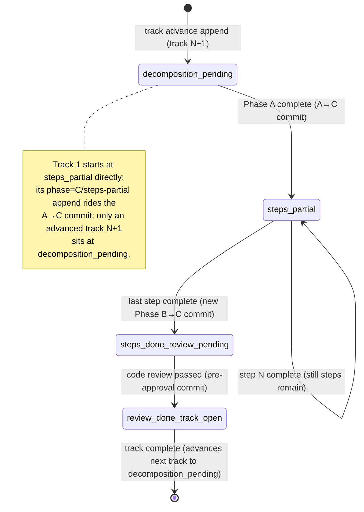

<!-- workflow-sha: 6b81c6b970b0c58300e4c053a5883c2482d3dd25 -->
# Track 2: Wire the `substate` append sites across the resume protocol

## Purpose / Big Picture
Every within-track boundary records its sub-state on the phase ledger, so the Track 1
ledger-primary read drives the resume instead of the roster (the `## Concrete Steps`
numbered step list a track parses to find which step a resume restarts from).

<!-- Reserved for Move 2 — ADDED/MODIFIED/REMOVED triad. Empty until Move 2 lands. -->

This track activates the primitive Track 1 landed dormant. It wires a `--substate`
append at each of the four committed within-track boundaries, plus an inline-replan
revert. The Phase B→C boundary gains a new Workflow-update commit to carry its append;
the other three ride commits already in the resume protocol. After this track lands,
every `phase=C` track on a current-scheme ledger carries an explicit `substate`, so the
Track 1 read resolves it directly and never falls back for a current plan.

## Progress
- [ ] Review + decomposition
- [ ] Step implementation
- [ ] Track-level code review
- [ ] Track completion

## Surprises & Discoveries
<!-- Continuous-log. Promoted by the orchestrator from per-step "What was
discovered" when the finding affects future steps or other tracks. Empty
at Phase 1. -->

## Decision Log
<!-- The track-canonical live decision carrier (D7). Phase 1 seeds the full
inline Decision Records this track owns (full four-bullet form below); the
section then continues as the execution-time continuous log. Seeded from the
frozen design.md D-records. One block per decision. -->

### D1 — the append cadence (append side)

- **Read side (Track 1).** Track 1 owns the read side of D1: the `substate` ledger key
  and the track-scoped reader that resolves it. This track owns the append side — the
  four committed boundaries and the commits they ride.
- **Decision.** A track's `substate` advances `decomposition-pending` →
  `steps-partial` → `steps-done-review-pending` → `review-done-track-open`, one
  transition per phase boundary. Each transition is a ledger append that rides the
  commit already marking that boundary, so the ledger records only sub-states that
  survive `git reset --hard HEAD`. Three boundaries ride existing commits; the Phase
  B→C boundary needs a new Workflow-update commit (today `step-implementation.md`
  §Phase B Completion marks `Step implementation [x]` and ends with no commit and no
  append). The new commit stages that flip plus the `steps-done-review-pending` append,
  symmetric with the A→C boundary, and incidentally commits the previously-uncommitted
  `Step implementation [x]` flip.
- **`failed-step` excluded.** A failed step's writes (the `[!]` roster flip, the FAILED
  episode, the retry rows) are uncommitted in-session and reverted by the next
  `git reset --hard HEAD`, so a `substate=failed-step` append has no committed boundary
  to ride. The Phase B resume Detection (`step-implementation-recovery.md`) already
  reconciles a crashed failure from working-tree artifacts; on the ledger path such a
  session resumes as `steps-partial` and that same Detection finds the `[!]` and retry
  rows. So `failed-step` stays a fallback-path / working-tree signal only.
- **Implemented in:** this track (the append sites).
- **Full design**: design.md §"Resume state machine and the per-track `substate` lifecycle".

### D3 — track-advance append sets `substate=decomposition-pending` explicitly

- **Problem.** When a `substate` read on a `phase=C` track is empty, the Track 1 read
  must know whether that means "genuinely not decomposed" or "the append was lost / old
  ledger." Conflating the two would revive the silent-default failure mode — the same
  mode the bug being fixed is an instance of.
- **Decision.** The track-advance append sets `substate=decomposition-pending`
  explicitly for the next track. On a current-scheme ledger every `phase=C` track then
  carries an explicit `substate`: the A→C append sets `steps-partial`, the two Phase-C
  milestones set the rest, and the track-advance append sets `decomposition-pending`.
  So an empty `substate` read on a `phase=C` track means exactly one thing — a
  pre-this-change ledger — the unambiguous trigger to fall back to `roster_scan`. This
  matches the script's loud/explicit posture: an absent value is an explicit decision
  point, never a silent default.
- **The D1+D3 wiring-pair constraint.** Both append sites — the A→C `steps-partial`
  append (D1) and the track-advance `decomposition-pending` append (D3) — MUST land
  together. A half-implementation leaves a `phase=C` track with no `substate`, which
  silently triggers the fallback when it should not. Both append sites are in this
  track, so the constraint is satisfied within Track 2.
- **Rejected.** Default an empty read to `decomposition-pending` — conflates "not
  decomposed" with "append lost / old ledger," reviving the silent-default failure mode.
- **Implemented in:** this track.
- **Full design**: design.md §"The dual-path sub-state resolution", §"Decision records".

## Outcomes & Retrospective
<!-- Continuous-log. Review iteration outcomes and the track-completion
summary at Phase C. -->

## Context and Orientation

This is markdown workflow machinery, not Java. The change is doc-only: it edits the
four resume-protocol documents that mark within-track boundaries, adding a `--substate`
ledger append at each.

At the start of this track, Track 1 has landed the read side: the `substate` ledger
key, the `--substate` append flag on `--append-ledger`, and the track-scoped reader
that `determine_state_from_ledger` calls before its `determine_c_substate` fallback.
The flag exists and validates its value, but nothing appends a `substate` yet, so every
read is empty and the resume falls back to the wrap-fixed roster parse — "wrap-fixed"
because Track 1 also repaired the roster parser, which previously miscounted a step
whose description wraps onto continuation lines. This track wires the appends that
make the ledger read authoritative.

A track's `substate` advances through four states as Phase A, Phase B, and Phase C
complete. (The top-level phase enum is `{0, A, C, D}` with no `B`: a track running
Phase B is recorded under `phase=C`, and the Phase-A→Phase-C transition is named
"A→C" with no B in the name. So "every `phase=C` track" and the "A→C" boundary both
describe a track at or past Phase A, including one still executing Phase B.)
Each transition is a ledger append riding the commit that already marks that
boundary in the protocol — the **committed-boundary cadence**: the ledger records only
sub-states that survive a `git reset --hard HEAD`, the implementer's revert path, so an
append must never ride an uncommitted change.

The `steps-partial` self-loop is not a ledger append per step. Per-step `[x]` flips
stay in the track-file roster and ride each episode commit; the ledger records only the
milestone flips. Which `[ ]` step a `steps-partial` resume restarts from is resolved
later by the agent reading the track file as prose, so the ledger need not record
per-step pointers.

Concrete deliverables: a `--substate` append at each of the four committed boundaries
across the four documents, a new Phase-B-complete Workflow-update commit to carry the
Phase B→C append, and an inline-replan revert append.

This is a §1.7-staged workflow-modifying change. Every edit lands under
`_workflow/staged-workflow/.claude/...` and promotes in Phase 4.

## Plan of Work

Add a `--substate` append at each of the four committed boundaries, plus an
inline-replan revert. Each append calls the `--substate` flag Track 1 introduced and
rides a commit already at that boundary (or, for Phase B→C, a new one).

| Boundary | `substate` appended | Rides commit | Site |
|---|---|---|---|
| Phase A decomposition complete | `steps-partial` | the A→C commit (already present) | `track-review.md` step 6 (`:596`) and its recovery path (`:1048`) |
| All steps complete (Phase B→C) | `steps-done-review-pending` | a NEW Phase-B-complete Workflow-update commit | `step-implementation.md` §Phase B Completion |
| Code review passed (pre-approval) | `review-done-track-open` | the pre-approval code-review-complete commit | `track-code-review.md` (~`:743`) |
| Track complete → next track | `decomposition-pending` (for track N+1) | the track-completion / track-advance commit | `track-code-review.md` (`:1409`/`:1411`) |

The boundaries in detail:

1. **A→C: `steps-partial`.** `track-review.md` step 6 already appends
   `--phase C --track <N>` and commits the decomposition with the ledger in one atomic
   Workflow-update commit. Add `--substate steps-partial` to that append (and to the
   recovery-path append at `:1048`). The append already rides a commit, so no new commit.
2. **Phase B→C: `steps-done-review-pending`.** Today `step-implementation.md` §Phase B
   Completion marks `Step implementation [x]` in `## Progress` and ends the session with
   no commit and no append; the per-step `[x]` flips were already committed in each
   episode, so today's roster-based resume survives. Once the resume reads the ledger,
   this boundary needs its own committed append. Add a new Phase-B-complete
   Workflow-update commit that stages the `Step implementation [x]` flip plus a
   `--append-ledger --substate steps-done-review-pending` append. The commit is symmetric
   with the A→C boundary and incidentally commits the previously-uncommitted
   `Step implementation [x]` flip.
3. **Code review passed: `review-done-track-open`.** `track-code-review.md` commits a
   pre-approval code-review-complete Workflow-update commit (around `:743`, the Progress
   entry recording the passed iteration). Add a `--substate review-done-track-open`
   append staged into that commit — NOT the post-approval track-completion commit, which
   carries the next boundary.
4. **Track complete: `decomposition-pending` for track N+1.** `track-code-review.md`
   step 5 (`:1401`) appends the completion boundary and commits it with the track-file
   episode. Today it appends `--track <N+1>` (next track remains) or `--phase D` (last
   track). Add `--substate decomposition-pending` to the `--track <N+1>` append, so an
   advanced track N+1 sits at `decomposition-pending` before its own Phase A runs. The
   last-track `--phase D` append carries no `substate` (phase `D` has no within-track
   sub-state).

Plus the inline-replan revert:

5. **Replan revert: `steps-partial`.** An inline replan that adds steps to a
   review-pending track reverts it to partial: the new steps are `[ ]`, so the ledger
   must no longer claim the track is review-pending. In `inline-replanning.md`, append
   `--substate steps-partial` on the replan's commit so the ledger sub-state matches the
   reopened roster. This is distinct from the existing `--phase 0` reset append (`:249`),
   which resets the plan-review gate; the `substate` revert keeps the within-track signal
   consistent when the replan reopens a closed track.

**Edge cases:**

- A single-step track skips code review, so no one appends `review-done-track-open`.
  The track-completion append (boundary 4) carries the single-step track past review: a
  resume between the steps-complete state and the track-completion commit reads the last
  appended `substate` (`steps-done-review-pending`), which routes correctly — the resume
  protocol for a single-step track checks whether review applies and proceeds to
  completion.
- A `[~]` skipped step counts toward all-steps-complete the same as `[x]`. The Phase
  B→C append (boundary 2) keys on "every step `[x]`/`[~]`", so a track that finishes with
  one skipped step still appends `steps-done-review-pending`.

The roster of concrete steps is written at Phase A and listed under `## Concrete Steps`.

## Concrete Steps
<!-- Phase A placeholder — decomposition writes a thin numbered roster here. -->

## Episodes
<!-- Continuous-log. Phase B sub-step 7 appends one block per completed
step. Empty at Phase 1. -->

## Validation and Acceptance

This track is doc-only, so its acceptance is verified by review of the append-cadence
edits against the contract, plus the Track 1 tests that exercise the slugs these
appends write:

- The append cadence holds at each boundary, matching the boundary→`substate` mapping
  in the `## Plan of Work` table above: each of the four committed boundaries appends
  the `substate` that row names, and no boundary appends a different one.
- The new Phase-B-complete commit is symmetric with the A→C commit: it stages the
  `Step implementation [x]` flip plus the `steps-done-review-pending` append into one
  Workflow-update commit, and the previously-uncommitted flip is now committed.
- The S2 closure invariant holds: every `phase=C` track on a current-scheme ledger
  carries an explicit `substate`. The A→C, Phase B→C, pre-approval, and track-advance
  appends cover every `phase=C` track, so the Track 1 ledger read never falls back for a
  current plan. (The Track 1 fallback-path and `steps-done-review-pending` ledger-path
  tests exercise the behaviors this cadence produces.)

<!-- Phase A placeholder for per-step EARS/Gherkin lines. -->

<!-- Reserved for Move 3 — EARS or Gherkin acceptance lines. Empty until Move 3 lands. -->

## Idempotence and Recovery
<!-- Phase A placeholder — names per-step idempotence and recovery paths. -->

## Artifacts and Notes
<!-- Continuous-log (rare). Cross-step artifact references. Often empty. -->

## Interfaces and Dependencies

**In-scope files:**

- `.claude/workflow/track-review.md` — the A→C append (step 6, `:596`; recovery path
  `:1048`).
- `.claude/workflow/step-implementation.md` — §Phase B Completion: the new
  Phase-B-complete Workflow-update commit and its `steps-done-review-pending` append.
- `.claude/workflow/track-code-review.md` — the pre-approval `review-done-track-open`
  append (~`:743`) and the track-advance `decomposition-pending` append (`:1409`).
- `.claude/workflow/inline-replanning.md` — the replan-revert `steps-partial` append.

**Out-of-scope:** the script, its tests, and the ledger grammar (Track 1);
`workflow.md` step 5 routing, unchanged because the slugs are byte-identical to those it
already routes on.

**Depends on:** Track 1. The `--substate` flag, the `substate` key, and the track-scoped
reader must exist first — these appends call a flag Track 1 introduces, so this track
cannot merge before Track 1.

**Sizing justification.** This track touches ~4 files, below the ~12 fill target, so it
is a deliberate merge candidate cut at the core→consumer dependency boundary. It is the
doc-only append-site wiring that depends on Track 1's `--substate` flag and cannot merge
before it (it calls a flag Track 1 introduces). Folding it into Track 1 would mix
resume-protocol prose with the tested primitive and forfeit Track 1's independent
landing and validation. The append-site docs have no behavior to validate until the read
side exists, so the dependency boundary is the natural seam.

## Invariants & Constraints
<!-- Plan-at-start, combined section (D9). Phase 1 writes both the per-track
testable constraints and the testable invariants. Each invariant becomes a
test assertion in the relevant step. -->

Invariants this track upholds (verified by the cadence edits and the Track 1 tests
they feed, since this track is doc-only):

- **S2 closure.** On a current-scheme ledger every `phase=C` track carries an explicit
  `substate`. The A→C, Phase B→C, pre-approval, and track-advance appends cover every
  `phase=C` track — verified by the closure argument above and Track 1's fallback-path
  test (which confirms an empty read routes to the fallback, the case S2 rules out for a
  current plan).
- **S4 (committed-boundary cadence).** Every `substate` append rides a commit that
  survives `git reset --hard HEAD`. S4 has no direct unit test — it lands in prose,
  verified by the append-cadence table review and, for the new Phase B→C boundary, by
  Track 1's `steps-done-review-pending` ledger-path test exercising the slug this commit
  writes.

Constraints (hold by construction):

- **The D1+D3 wiring pair lands together.** Both the A→C `steps-partial` append (D1) and
  the track-advance `decomposition-pending` append (D3) MUST land in this track; a
  half-implementation leaves a `phase=C` track with no `substate` and silently triggers
  the fallback when it should not. Both append sites are in this track.
- This is a §1.7-staged workflow-modifying change: every edit lands under
  `_workflow/staged-workflow/.claude/...` and promotes in Phase 4. No edit touches the
  live `.claude/` tree during this track.
