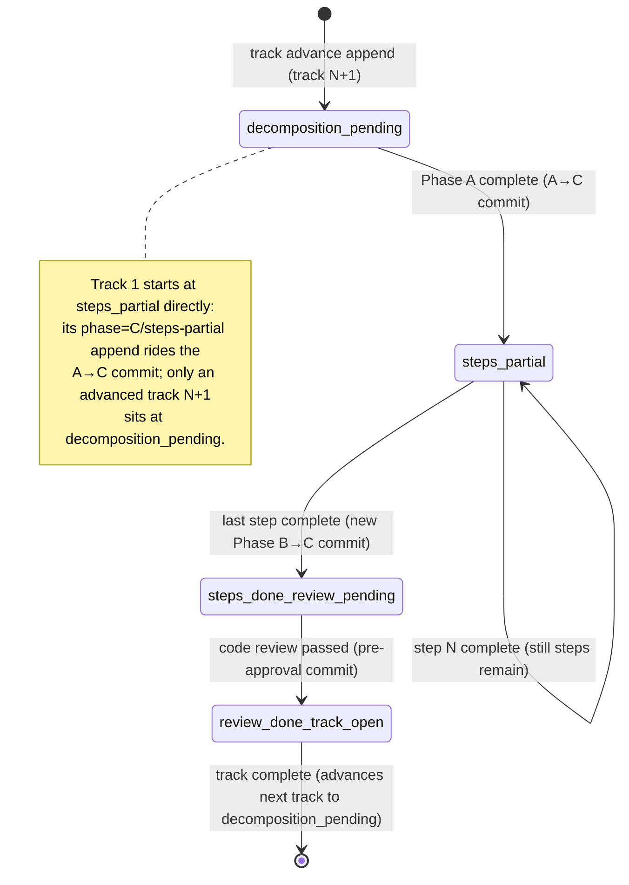

<!-- workflow-sha: 6b81c6b970b0c58300e4c053a5883c2482d3dd25 -->
# Track 2: Wire the `substate` append sites across the resume protocol

## Purpose / Big Picture
Every within-track boundary records its sub-state on the phase ledger, so the Track 1
ledger-primary read drives the resume instead of the roster (the `## Concrete Steps`
numbered step list a track parses to find which step a resume restarts from).

<!-- Reserved for Move 2 — ADDED/MODIFIED/REMOVED triad. Empty until Move 2 lands. -->

This track activates the primitive Track 1 landed dormant. It wires a `--substate`
append at each of the four committed within-track boundaries, plus an inline-replan
revert. The Phase B→C boundary gains a new Workflow-update commit to carry its append;
the other three ride commits already in the resume protocol. After this track lands,
every `phase=C` track on a current-scheme ledger carries an explicit `substate`, so the
Track 1 read resolves it directly and never falls back for a current plan.

## Progress
- [x] Review + decomposition
- [ ] Step implementation
- [ ] Track-level code review
- [ ] Track completion

- [x] 2026-06-24T15:53Z [ctx=info] Review + decomposition complete
- [x] 2026-06-24T16:23Z [ctx=safe] Step 1 complete (commit 8609dbd4b4)

## Surprises & Discoveries
<!-- Continuous-log. Promoted by the orchestrator from per-step "What was
discovered" when the finding affects future steps or other tracks. Empty
at Phase 1. -->

- **Phase 4 reconciliation — D1/D3 commit count (frozen `design.md`).** Phase A review
  (T1/R2/A1) found boundary 3 (`review-done-track-open`) has no existing committed home:
  `track-code-review.md` step 6 is commit-free, and the per-iteration `:743` commit fires
  before the gate-check verdict on every fix iteration. The user chose to add a new
  pre-approval step-6 commit (Option A), so **two** boundaries need a new commit, not the
  one D1 records ("three boundaries ride existing commits; only Phase B→C needs a new
  commit"). D1's core committed-boundary-cadence decision is unchanged. D1 is immutable
  during execution, so the track-file Plan of Work carries the corrected wiring and the
  frozen `design.md` D1/D3 commit-count text is reconciled in `design-final.md` at Phase
  4 (the same pattern as Track 1's WI3 diagram reconciliation).

- **Phase 4 reconciliation — boundary 5 dormancy (frozen `design.md`).** Phase A review
  (T2/R5) found the replan-revert `--substate steps-partial` append is dormant: the
  `--phase 0` reset resolves to State 0 before any `substate` read, so the append is
  forward-hygiene only and is never read on the replan resume itself. `design.md:186-188`
  prescribes the append without reconciling it against the `phase=0` reset. Reconcile the
  dormancy framing in `design-final.md` at Phase 4.

- **Phase 4 reconciliation — S2 closure wording (frozen `design.md`).** Phase A review
  (T3/A3) found the S2/D3 closure wording ("every `phase=C` track carries an explicit
  `substate`") reads as a stronger guarantee than the cadence delivers. The accurate
  guarantee is non-emptiness (the empty-read fallback is never taken); a single-step
  track terminates at `steps-done-review-pending` and routes correctly to completion.
  The track file states the accurate form; reconcile the `design.md` wording at Phase 4.

- **WI2 enum guard declined for this track (Track 1 carry-over).** Track 1 deferred a
  defensive enum-membership guard on `--substate` (it validates only bare-token-ness).
  Declined for Track 2 at the Pre-Flight gate as a Track-1-scope script hardening outside
  the doc-only append boundary. Track 2 is the sole writer of `substate` values, so the
  typo backstop is the `## Validation` slug-byte-identity check, not a runtime guard. A
  future Track-1-scope follow-up can add the enum guard if desired.

- **Phase 4 reconciliation — single-step-track terminal `substate` (track file + frozen
  `design.md`).** The Phase B step-level review (WI1) found the new `track-code-review.md`
  step-6 prose claimed unconditionally that a single-step track stays at
  `steps-done-review-pending`. That holds only for a `risk: high` single-step track; a
  `risk: medium`/`low` single-step track runs the full review loop, reaches step 6, and
  terminates at `review-done-track-open` (both slugs route correctly to completion). The
  staged `track-code-review.md` is now scoped correctly, but the same overbroad framing
  remains in this track's `## Plan of Work` boundary 3 and the `## Edge cases` bullet, and
  in the frozen `design.md`. Reconcile the wording in `design-final.md` at Phase 4. See
  Episodes §Step 1.

## Decision Log
<!-- The track-canonical live decision carrier (D7). Phase 1 seeds the full
inline Decision Records this track owns (full four-bullet form below); the
section then continues as the execution-time continuous log. Seeded from the
frozen design.md D-records. One block per decision. -->

### D1 — the append cadence (append side)

- **Read side (Track 1).** Track 1 owns the read side of D1: the `substate` ledger key
  and the track-scoped reader that resolves it. This track owns the append side — the
  four committed boundaries and the commits they ride.
- **Decision.** A track's `substate` advances `decomposition-pending` →
  `steps-partial` → `steps-done-review-pending` → `review-done-track-open`, one
  transition per phase boundary. Each transition is a ledger append that rides the
  commit already marking that boundary, so the ledger records only sub-states that
  survive `git reset --hard HEAD`. Three boundaries ride existing commits; the Phase
  B→C boundary needs a new Workflow-update commit (today `step-implementation.md`
  §Phase B Completion marks `Step implementation [x]` and ends with no commit and no
  append). The new commit stages that flip plus the `steps-done-review-pending` append,
  symmetric with the A→C boundary, and incidentally commits the previously-uncommitted
  `Step implementation [x]` flip.
- **`failed-step` excluded.** A failed step's writes (the `[!]` roster flip, the FAILED
  episode, the retry rows) are uncommitted in-session and reverted by the next
  `git reset --hard HEAD`, so a `substate=failed-step` append has no committed boundary
  to ride. The Phase B resume Detection (`step-implementation-recovery.md`) already
  reconciles a crashed failure from working-tree artifacts; on the ledger path such a
  session resumes as `steps-partial` and that same Detection finds the `[!]` and retry
  rows. So `failed-step` stays a fallback-path / working-tree signal only.
- **Implemented in:** this track (the append sites).
- **Full design**: design.md §"Resume state machine and the per-track `substate` lifecycle".

### D3 — track-advance append sets `substate=decomposition-pending` explicitly

- **Problem.** When a `substate` read on a `phase=C` track is empty, the Track 1 read
  must know whether that means "genuinely not decomposed" or "the append was lost / old
  ledger." Conflating the two would revive the silent-default failure mode — the same
  mode the bug being fixed is an instance of.
- **Decision.** The track-advance append sets `substate=decomposition-pending`
  explicitly for the next track. On a current-scheme ledger every `phase=C` track then
  carries an explicit `substate`: the A→C append sets `steps-partial`, the two Phase-C
  milestones set the rest, and the track-advance append sets `decomposition-pending`.
  So an empty `substate` read on a `phase=C` track means exactly one thing — a
  pre-this-change ledger — the unambiguous trigger to fall back to `roster_scan`. This
  matches the script's loud/explicit posture: an absent value is an explicit decision
  point, never a silent default.
- **The D1+D3 wiring-pair constraint.** Both append sites — the A→C `steps-partial`
  append (D1) and the track-advance `decomposition-pending` append (D3) — MUST land
  together. A half-implementation leaves a `phase=C` track with no `substate`, which
  silently triggers the fallback when it should not. Both append sites are in this
  track, so the constraint is satisfied within Track 2.
- **Rejected.** Default an empty read to `decomposition-pending` — conflates "not
  decomposed" with "append lost / old ledger," reviving the silent-default failure mode.
- **Implemented in:** this track.
- **Full design**: design.md §"The dual-path sub-state resolution", §"Decision records".

## Outcomes & Retrospective
<!-- Continuous-log. Review iteration outcomes and the track-completion
summary at Phase C. -->

- [x] Technical: PASS at iteration 2 (3 findings, 3 accepted) — T1/T2 should-fix drove the
  boundary-3 Option-A reframe (new pre-approval step-6 commit) and the boundary-5 dormancy
  reframe; T3 suggestion tightened the S2 closure wording to non-emptiness.
- [x] Risk: PASS at iteration 2 (5 findings, 5 accepted) — R1 should-fix added the D1+D3
  same-step decomposition constraint; R2/R3 should-fix drove boundary-3 Option A and the
  boundary-2 commit placement/guard; R4/R5 suggestions added the slug-byte-identity
  acceptance check and the boundary-5 framing clarification.
- [x] Adversarial: PASS at iteration 2 (5 findings, 4 accepted + 1 rejected) — A1 (≡ T1/R2)
  confirmed the boundary-3 fix; A2 should-fix added the `step-implementation-recovery.md`
  entry-5 enumeration addition; A3/A4 suggestions folded into the S2 tightening and the
  D1+D3 constraint; A5 (the core→consumer sizing-cut challenge) REJECTED — the sizing
  justification holds.

## Context and Orientation

This is markdown workflow machinery, not Java. The change is doc-only: it edits the
four resume-protocol documents that mark within-track boundaries, adding a `--substate`
ledger append at each.

At the start of this track, Track 1 has landed the read side: the `substate` ledger
key, the `--substate` append flag on `--append-ledger`, and the track-scoped reader
that `determine_state_from_ledger` calls before its `determine_c_substate` fallback.
The flag exists and validates its value, but nothing appends a `substate` yet, so every
read is empty and the resume falls back to the wrap-fixed roster parse — "wrap-fixed"
because Track 1 also repaired the roster parser, which previously miscounted a step
whose description wraps onto continuation lines. This track wires the appends that
make the ledger read authoritative.

A track's `substate` advances through four states as Phase A, Phase B, and Phase C
complete. (The top-level phase enum is `{0, A, C, D, Done}` with no `B`: a track running
Phase B is recorded under `phase=C`, and the Phase-A→Phase-C transition is named
"A→C" with no B in the name. So "every `phase=C` track" and the "A→C" boundary both
describe a track at or past Phase A, including one still executing Phase B.)
Each transition is a ledger append riding the commit that already marks that
boundary in the protocol — the **committed-boundary cadence**: the ledger records only
sub-states that survive a `git reset --hard HEAD`, the implementer's revert path, so an
append must never ride an uncommitted change.

The `steps-partial` self-loop is not a ledger append per step. Per-step `[x]` flips
stay in the track-file roster and ride each episode commit; the ledger records only the
milestone flips. Which `[ ]` step a `steps-partial` resume restarts from is resolved
later by the agent reading the track file as prose, so the ledger need not record
per-step pointers.

Concrete deliverables: a `--substate` append at each of the four committed boundaries
across the four documents, a new Phase-B-complete Workflow-update commit to carry the
Phase B→C append, and an inline-replan revert append.

This is a §1.7-staged workflow-modifying change. Every edit lands under
`_workflow/staged-workflow/.claude/...` and promotes in Phase 4.

## Plan of Work

Add a `--substate` append at each of the four committed boundaries, plus an
inline-replan revert. Each append calls the `--substate` flag Track 1 introduced and
rides a commit already at that boundary (or, for Phase B→C, a new one).

| Boundary | `substate` appended | Rides commit | Site |
|---|---|---|---|
| Phase A decomposition complete | `steps-partial` | the A→C commit (already present) | `track-review.md` step 6 (`:596`) and its recovery path (`:1048`) |
| All steps complete (Phase B→C) | `steps-done-review-pending` | a NEW Phase-B-complete Workflow-update commit | `step-implementation.md` §Phase B Completion |
| Code review passed (pre-approval) | `review-done-track-open` | a NEW pre-approval Workflow-update commit at step 6 (gated on all-reviews-pass) | `track-code-review.md` §Review loop step 6 (`:826`) |
| Track complete → next track | `decomposition-pending` (for track N+1) | the track-completion / track-advance commit | `track-code-review.md` (`:1409`/`:1411`) |

**Two boundaries need a new commit, not one (Phase A review correction).** D1 records
"three boundaries ride existing commits; the Phase B→C boundary needs a new
Workflow-update commit." Phase A review found this incidental count inaccurate: the
pre-approval boundary 3 has no committed home either (step 6 "when all reviews pass" is
commit-free, and the per-iteration `:743` commit fires before the gate-check verdict and
on every fix iteration, so it cannot mean "review passed"). Boundary 3 therefore also
needs a new commit. D1's core committed-boundary-cadence decision is unchanged — every
append still rides a commit that survives `git reset --hard HEAD`; only the
two-vs-one count differs. D1 is immutable during execution, so its wording (and the
matching `design.md` D1/D3 text) is a Phase-4 `design-final.md` reconciliation item; see
`## Surprises & Discoveries`.

The boundaries in detail:

1. **A→C: `steps-partial`.** `track-review.md` step 6 already appends
   `--phase C --track <N>` and commits the decomposition with the ledger in one atomic
   Workflow-update commit. Add `--substate steps-partial` to that append (and to the
   recovery-path append at `:1048`). The append already rides a commit, so no new commit.
2. **Phase B→C: `steps-done-review-pending`.** Today `step-implementation.md` §Phase B
   Completion marks `Step implementation [x]` in `## Progress` and ends the session with
   no commit and no append; the per-step `[x]` flips were already committed in each
   episode, so today's roster-based resume survives. Once the resume reads the ledger,
   this boundary needs its own committed append. Add a new Phase-B-complete
   Workflow-update commit that stages the `Step implementation [x]` flip plus a
   `--append-ledger --substate steps-done-review-pending` append. The commit is symmetric
   with the A→C boundary and incidentally commits the previously-uncommitted
   `Step implementation [x]` flip.

   **Placement and guard (Phase A review, R3).** Insert the commit in §Phase B Completion
   after step 1 (the `[x]` flip) and after step 3 (self-improvement reflection, which
   produces no commit and stages nothing), but strictly before step 4 (end the session) —
   a commit after end-session is unreachable, and reflection contributes nothing to
   stage. Stage explicit paths only — the track file (the `[x]` flip) and the phase
   ledger (the append) — never `git add -A`, symmetric with the A→C commit at
   `track-review.md:600-609`. Guard the commit + append to fire **only on the normal
   all-steps-`[x]`/`[~]` completion path**, not on a context-warning or two-failure
   early exit where steps remain `[ ]`: an early-exit track must stay `steps-partial`, so
   the append must not run when any roster step is still `[ ]`. (Reflection at step 3 is
   mandatory on every exit including early-exit, but the new commit is not.) Cite Track
   1's `steps-done-review-pending` ledger-path test as the verification that the slug
   this commit writes resolves correctly on resume.
3. **Code review passed: `review-done-track-open`.** This boundary has no existing
   committed home (Phase A review, T1/R2/A1). `track-code-review.md` §Review loop step 6
   ("when all reviews pass", `:826`) appends the `Track complete` Progress entry but
   carries **no commit**; the entry stays uncommitted until the post-approval
   track-completion commit (`:1423`, boundary 4). The only pre-approval commit is the
   per-iteration Progress commit at `:743`, which fires inside step 3's "if any in-scope
   findings need fixes" branch — *before* that iteration's gate-check runs and on *every*
   fix iteration — so it cannot mean "review passed" and is not the ride site. Add a
   **new pre-approval Workflow-update commit at step 6**, gated on all-reviews-pass,
   staging the `Track complete` Progress flip plus a
   `--append-ledger --substate review-done-track-open` append — symmetric with boundary
   2's new commit, and distinct from the post-approval track-completion commit (boundary
   4), which carries `decomposition-pending` for the next track. A single-step track
   skips the review loop, so it reaches no step 6 and gets no such commit; it stays at
   `steps-done-review-pending` and is carried past review by the track-completion append
   (boundary 4) — the graceful-degradation path the edge case below already documents.
   This second new commit is the source of the "two boundaries need a new commit"
   correction noted under the boundary table above (D1's incidental count, reconciled at
   Phase 4).
4. **Track complete: `decomposition-pending` for track N+1.** `track-code-review.md`
   step 5 (`:1401`) appends the completion boundary and commits it with the track-file
   episode. Today it appends `--track <N+1>` (next track remains) or `--phase D` (last
   track). Add `--substate decomposition-pending` to the `--track <N+1>` append, so an
   advanced track N+1 sits at `decomposition-pending` before its own Phase A runs. The
   last-track `--phase D` append carries no `substate` (phase `D` has no within-track
   sub-state).

Plus the inline-replan revert:

5. **Replan revert: `steps-partial`.** An inline replan that adds steps to a
   review-pending track reverts it to partial: the new steps are `[ ]`, so the ledger
   must no longer claim the track is review-pending. In `inline-replanning.md` §Process
   step 6, append `--substate steps-partial` **in addition to** the existing `--phase 0`
   reset (`:249`), on the same `Inline replan after Track <N>` commit (`:266`).

   **The `--phase 0` reset is the routing signal; the `--substate` append is
   forward-hygiene (Phase A review, T2/R5).** The replan resolves to State 0: `--phase 0`
   is last-value-wins, and `determine_state_from_ledger` handles `phase=0` in its
   `0 | A | D | Done` arm and returns `{phase:"0", substate:null}` *before* the `phase=C`
   arm that reads `substate`. So the `--substate steps-partial` written on the replan
   commit is **never read on the replan resume itself** — the next session enters State 0
   (Phase 2 re-review), and only when the reopened track re-runs Phase A does its A→C
   append (boundary 1) write the `steps-partial` the resume will actually read. Keep the
   `--substate` append anyway: it is cheap, survives `git reset --hard HEAD`, and keeps
   the track's last-value-wins `substate` from claiming `steps-done-review-pending` should
   any future change ever read `substate` while a replan leaves the phase at `C`. But do
   **not** describe it as the mechanism that reopens the track, and do **not** drop the
   `--phase 0` append — that reset is what routes the replan resume. The frozen
   `design.md:186-188` prescribes this append without reconciling it against the
   `phase=0` reset; that is a Phase-4 `design-final.md` reconciliation item (see
   `## Surprises & Discoveries`).

**Edge cases:**

- A single-step track skips code review, so no one appends `review-done-track-open`.
  The track-completion append (boundary 4) carries the single-step track past review: a
  resume between the steps-complete state and the track-completion commit reads the last
  appended `substate` (`steps-done-review-pending`), which routes correctly — the resume
  protocol for a single-step track checks whether review applies and proceeds to
  completion.
- A `[~]` skipped step counts toward all-steps-complete the same as `[x]`. The Phase
  B→C append (boundary 2) keys on "every step `[x]`/`[~]`", so a track that finishes with
  one skipped step still appends `steps-done-review-pending`.

The roster of concrete steps is written at Phase A and listed under `## Concrete Steps`.

## Concrete Steps

One coherent HIGH step. The change edits the resume-protocol docs that drive the
auto-resume state machine (the append cadence is the resume-routing signal), so it is one
isolated `high`-tagged step under the high-isolation rule — step-level dimensional review
sees the whole cadence at once. Keeping all five staged-doc edits in one commit also
satisfies the D1+D3 same-step constraint intrinsically: the A→C `steps-partial` append
and the track-advance `decomposition-pending` append land together, so no intermediate
commit can leave a `phase=C` track without a `substate`. All edits land under
`_workflow/staged-workflow/.claude/...` (§1.7 staging).

1. Wire the `substate` append cadence across the five staged resume-protocol files: (1) the A→C `steps-partial` append at `track-review.md` step 6 (`:596`) and its recovery path (`:1048`); (2) a NEW Phase-B-complete Workflow-update commit at `step-implementation.md` §Phase B Completion carrying the `steps-done-review-pending` append + the `Step implementation [x]` flip, placed after step 1/step 3 and before step 4, staging only the track file + ledger, guarded to the all-`[x]`/`[~]` completion path; (3) a NEW pre-approval step-6 Workflow-update commit at `track-code-review.md` (`:826`) carrying the `review-done-track-open` append + the `Track complete` Progress flip, gated on all-reviews-pass, plus the track-advance `decomposition-pending` append at `:1409`; (4) the replan-revert `steps-partial` append at `inline-replanning.md` (`:249`/`:266`) alongside (not replacing) the `--phase 0` reset; (5) the entry-5 enumeration addition at `step-implementation-recovery.md` listing the new Phase-B-complete commit. Each append writes a slug byte-identical to the four canonical slugs. — risk: high (workflow machinery — edits the auto-resume state-machine control-flow protocol)  [x]  commit: 8609dbd4b4

## Episodes
<!-- Continuous-log. Phase B sub-step 7 appends one block per completed
step. Empty at Phase 1. -->

### Step 1 — commit 8609dbd4b4, 2026-06-24T16:23Z [ctx=safe]

**What was done:** Wired the `--substate` append cadence across the five staged
resume-protocol docs, the single coherent HIGH step. Added `--substate
steps-partial` to the A→C append in `track-review.md` (step 6 and the recovery
path). Inserted a new Phase-B-complete Workflow-update commit in
`step-implementation.md` §Phase B Completion — guarded to the all-`[x]`/`[~]`
completion path, staging only the track file and ledger — carrying the `Step
implementation [x]` flip plus a `--substate steps-done-review-pending` append.
Inserted a new pre-approval step-6 Workflow-update commit in
`track-code-review.md`, gated on the all-reviews-pass path, carrying the `Track
complete` Progress flip plus a `--substate review-done-track-open` append, and
added `--substate decomposition-pending` to the track-advance `--track <N+1>`
append (the last-track `--phase D` append carries none). Added `--substate
steps-partial` to the `inline-replanning.md` replan-revert alongside the
`--phase 0` reset, framed as forward-hygiene. Added both new scaffolding commits
to the entry-5 enumeration in `step-implementation-recovery.md`. A step-level
dimensional review (consistency, context-budget, writing-style,
instruction-completeness — the full track-pass-equivalent selection under the
single-step-high override; baseline skipped on the workflow-only diff) returned
two findings, both fixed at iteration 2 in `Review fix:` commit `754f5df27c`:
WI1 (should-fix) and WS1 (suggestion).

**What was discovered:** The single-step-track terminal-`substate` claim was
overbroad. WI1 caught it in the new `track-code-review.md` step-6 block, now
scoped: a `risk: high` single-step track skips the review loop and stays at
`steps-done-review-pending`, while a `risk: medium`/`low` single-step track runs
the full review loop, reaches step 6, and terminates at `review-done-track-open`
(both slugs route correctly to completion). The same overbroad framing still
lives in the track file's `## Plan of Work` boundary 3 and the `## Edge cases`
bullet, and the frozen `design.md` carries it too. Those are tactical and design
context, not the promoted staged surface, so reconcile them in `design-final.md`
at Phase 4 — a fourth reconciliation item alongside D1/D3 commit count,
boundary-5 dormancy, and S2 closure wording. See `## Surprises & Discoveries`.

**What changed from the plan:** None for the wiring. The entry-5 enumeration in
`step-implementation-recovery.md` names both new scaffolding commits (the
Phase-B-complete commit and the Phase-C review-pass commit), one more than the
plan's literal "the new Phase-B-complete commit," to meet the stated A2 goal of
naming every scaffolding commit.

**Key files:** the five staged resume-protocol docs under
`_workflow/staged-workflow/.claude/workflow/` — `track-review.md`,
`step-implementation.md`, `track-code-review.md`, `inline-replanning.md`,
`step-implementation-recovery.md`.

**Critical context:** The pre-approval step-6 commit and the track-advance
append landed at line offsets later than the plan's `:826`/`:1409`, because the
step-6 insertion shifted the file; the content targets were unambiguous.

## Validation and Acceptance

This track is doc-only, so its acceptance is verified by review of the append-cadence
edits against the contract, plus the Track 1 tests that exercise the slugs these
appends write:

- The append cadence holds at each boundary, matching the boundary→`substate` mapping
  in the `## Plan of Work` table above: each of the four committed boundaries appends
  the `substate` that row names, and no boundary appends a different one.
- **Each appended slug is byte-identical to one of the four canonical slugs** —
  `decomposition-pending`, `steps-partial`, `steps-done-review-pending`,
  `review-done-track-open` (the set `design.md` enumerates and the script comments at its
  ledger-grammar block). `--substate` validates only bare-token-ness, not enum membership
  (Track 1's WI2, deferred and declined for this track), and Track 2 is the sole writer
  of `substate` values, so a typo has no runtime backstop — the append-cadence review is
  the only gate. Confirm each of the five append sites writes the slug its
  `## Plan of Work` row names, spelled exactly.
- The two new commits are symmetric with the A→C commit. The Phase-B-complete commit
  stages the `Step implementation [x]` flip plus the `steps-done-review-pending` append
  into one Workflow-update commit (and commits the previously-uncommitted flip). The new
  pre-approval step-6 commit stages the `Track complete` Progress flip plus the
  `review-done-track-open` append, gated on all-reviews-pass.
- The S2 closure invariant holds in its accurate form: every `phase=C` track on a
  current-scheme ledger carries a **non-empty** `substate`, so the Track 1 ledger read
  never takes the empty-read roster fallback for a current plan. The A→C, Phase B→C,
  pre-approval, and track-advance appends cover every `phase=C` track. The terminal value
  also matches lifecycle position for a multi-step track (the new step-6 commit appends
  `review-done-track-open` on review-pass); a single-step track skips the review loop and
  terminates at `steps-done-review-pending`, which routes correctly to track completion
  (the resume checks whether review applies). (The Track 1 fallback-path and
  `steps-done-review-pending` ledger-path tests exercise the behaviors this cadence
  produces.)

<!-- Phase A placeholder for per-step EARS/Gherkin lines. -->

<!-- Reserved for Move 3 — EARS or Gherkin acceptance lines. Empty until Move 3 lands. -->

## Idempotence and Recovery

Step 1 is markdown edits to the staged resume-protocol docs, so it is idempotent at the
implementation level: re-applying the same edits is a no-op, and the standard recovery is
the implementer's `git reset --hard HEAD` followed by re-running the step (no committed
state to unwind, since Phase A commits the roster and ledger boundary before Phase B
spawns the implementer). The append cadence the edits wire is itself idempotent at
runtime — the phase ledger is append-only and last-value-wins, so a re-fired boundary
append records a fresh authoritative line rather than corrupting the prior one — but that
is the behavior the docs describe, verified by Track 1's tests, not state this step's
own implementation mutates.

## Artifacts and Notes
<!-- Continuous-log (rare). Cross-step artifact references. Often empty. -->

## Interfaces and Dependencies

**In-scope files:**

- `.claude/workflow/track-review.md` — the A→C append (step 6, `:596`; recovery path
  `:1048`).
- `.claude/workflow/step-implementation.md` — §Phase B Completion: the new
  Phase-B-complete Workflow-update commit and its `steps-done-review-pending` append.
- `.claude/workflow/track-code-review.md` — the pre-approval `review-done-track-open`
  append on a NEW step-6 Workflow-update commit (`:826`) and the track-advance
  `decomposition-pending` append (`:1409`).
- `.claude/workflow/inline-replanning.md` — the replan-revert `steps-partial` append
  alongside the existing `--phase 0` reset (`:249`/`:266`).
- `.claude/workflow/step-implementation-recovery.md` — one-line addition to the
  §Resume-side commit-pattern reference entry 5 enumeration ("Other Workflow update
  commits"), listing the new Phase-B-complete commit alongside the already-listed Phase-A
  decomposition commit (Phase A review, A2). The entry-5 catch-all already covers the new
  commit functionally ("regardless of position"); the addition is documentation symmetry
  so the resume classifier's enumeration names every scaffolding commit.

**Out-of-scope:** the script, its tests, and the ledger grammar (Track 1);
`workflow.md` step 5 routing, unchanged because the slugs are byte-identical to those it
already routes on.

**Depends on:** Track 1. The `--substate` flag, the `substate` key, and the track-scoped
reader must exist first — these appends call a flag Track 1 introduces, so this track
cannot merge before Track 1.

**Sizing justification.** This track touches ~5 files (the four resume-protocol docs
plus a one-line enumeration addition to `step-implementation-recovery.md`), below the ~12
fill target, so it is a deliberate merge candidate cut at the core→consumer dependency
boundary. It is the
doc-only append-site wiring that depends on Track 1's `--substate` flag and cannot merge
before it (it calls a flag Track 1 introduces). Folding it into Track 1 would mix
resume-protocol prose with the tested primitive and forfeit Track 1's independent
landing and validation. The append-site docs have no behavior to validate until the read
side exists, so the dependency boundary is the natural seam.

## Invariants & Constraints
<!-- Plan-at-start, combined section (D9). Phase 1 writes both the per-track
testable constraints and the testable invariants. Each invariant becomes a
test assertion in the relevant step. -->

Invariants this track upholds (verified by the cadence edits and the Track 1 tests
they feed, since this track is doc-only):

- **S2 closure (accurate form).** On a current-scheme ledger every `phase=C` track
  carries a **non-empty** `substate`, so the Track 1 ledger read never takes the
  empty-read roster fallback for a current plan. The A→C, Phase B→C, pre-approval, and
  track-advance appends cover every `phase=C` track — verified by the closure argument in
  `## Validation and Acceptance` and Track 1's fallback-path test (which confirms an
  empty read routes to the fallback, the case S2 rules out for a current plan). S2
  guarantees non-emptiness, not that the terminal value always matches lifecycle position
  beyond what the cadence delivers: a single-step track terminates at
  `steps-done-review-pending` (no review loop, no step-6 commit) and routes correctly to
  completion.
- **S4 (committed-boundary cadence).** Every `substate` append rides a commit that
  survives `git reset --hard HEAD`. S4 has no direct unit test — it lands in prose,
  verified by the append-cadence table review and, for the two new commits (Phase B→C and
  the pre-approval step-6 commit), by Track 1's `steps-done-review-pending` ledger-path
  test exercising the slug the Phase-B→C commit writes.

Constraints (hold by construction):

- **The D1+D3 wiring pair lands in the same step.** Both the A→C `steps-partial` append
  (D1, `track-review.md`) and the track-advance `decomposition-pending` append (D3,
  `track-code-review.md`) MUST land in **one step** (or steps sharing one mergeable
  commit), not merely "in this track." This is doc-only with no failing test to catch a
  partial landing, and the natural per-file decomposition would split them; a split
  intermediate commit that wires a track's A→C append but not the track-advance append
  leaves the *next* track at `phase=C` with no `substate`, silently triggering the
  fallback — the exact failure mode this branch fixes. The decomposition in
  `## Concrete Steps` satisfies this by keeping the `track-review.md` and
  `track-code-review.md` append wiring in the same step.
- This is a §1.7-staged workflow-modifying change: every edit lands under
  `_workflow/staged-workflow/.claude/...` and promotes in Phase 4. No edit touches the
  live `.claude/` tree during this track.

## Base commit

386d0ce17db03c4a4e0a61850c2eb74ef61dc1d4
