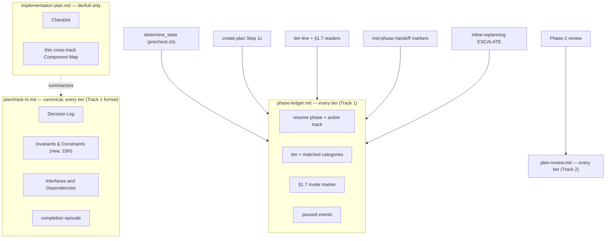

<!-- workflow-sha: 3e9c22298dfe68d2980646704850c781f8af88d5 -->
# Plan as a derived mirror of the tracks; the minimal tier drops the plan

## Design Document
[design.md](design.md)

## High-level plan

**Change tier:** full — matched categories: Workflow machinery, Architecture / cross-component coordination

### Goals

Make `implementation-plan.md` a derived summary of the track files instead of
a second owner of strategic content, and let the single-track `minimal` tier
drop the plan outright. Today every tier ships the plan — `minimal` ships a
shape-complete stub — only because the resume state machine, the drift gate,
and Phase-2 routing parse it. An append-only **phase ledger** under
`_workflow/` takes over the branch-level state those consumers read (resume
phase, the tier line and its matched categories, the §1.7 staging mode, pause
events). Once the ledger owns that state, the plan carries no fact a track does
not already own, and a one-track `minimal` change has nothing left to keep a
plan for. The track files become the single canonical home for detailed
content; the `lite`/`full` plan keeps only the cross-track view (the Checklist
plus a thin Component Map) the next session needs to pick up the next track and
assess impact.

This closes YTDB-1123 (the script-maintained phase-ledger; drop the `minimal`
stub) and YTDB-1125 (the `minimal` stub has no `### Constraints` home for the
§1.7 markers) under one model: branch-level facts live in the ledger, per-track
facts live in the track files, the cross-track summary lives in the plan.

### Constraints

This plan is workflow-modifying: it edits .claude/workflow/**, .claude/skills/**, or .claude/agents/**.

- **Staging is mandatory (§1.7(b)), not the §1.7(k) opt-out (D12).** Every
  `.claude/**` edit routes to `_workflow/staged-workflow/.claude/**`; live
  workflow stays at develop state for the whole branch (the I6 invariant). The
  branch moves the resume-state field (plan checkboxes → ledger, D3/D6) and adds
  a track-file section (D9); each independently fails §1.7(k) criterion 1, so
  the prose-rule opt-out does not apply. Implementer and reviewer steps use
  staged-read precedence; Phase 4 rebases onto develop before promotion.
- **This branch runs the develop workflow while shipping the new one.** Its own
  plan and track artifacts therefore follow today's format — a full aggregator
  plan that carries Architecture Notes and Decision Records, with the §1.7
  marker in this `### Constraints` section. The plan-as-mirror shape this change
  designs applies to changes planned after it merges.
- **Backward compatibility of the resume machinery.** The ledger replaces the
  checkbox parse without regressing resume for existing in-flight `lite`/`full`
  plans, which keep their Checklist. `determine_state` stays a two-level lookup:
  the ledger owns the top-level phase and active track, the track file's
  `## Progress` owns the within-track sub-state.
- **The drift gate keeps a stamped anchor.** Dropping the `minimal` plan must
  not weaken drift detection: `track-1.md` is always present and stamped, so the
  §1.6(h) stamp fold still has an anchor. The ledger itself is unstamped (D13).
- **No live test runs against the staged script.** The new
  `workflow-startup-precheck.sh` and its tests live under `staged-workflow/`;
  they are exercised from the staged path, not wired into the live machinery
  this branch runs under.

### Architecture Notes

#### Component Map

Three artifact homes plus one new sibling document. Each fact has exactly one
owner; the plan reads as a summary of the tracks, never a second copy.

- **`phase-ledger.md`** (new): append-only event log; one line per phase
  boundary carrying an ISO timestamp, a `[ctx=…]` marker, the phase, an optional
  active track, and optional field updates. Readers take the latest value of any
  key. The orchestrator writes it through a new
  `workflow-startup-precheck.sh --append-ledger` subcommand. Unstamped. **Track 1.**
- **`workflow-startup-precheck.sh`**: `determine_state` reads the ledger tail
  for the top-level phase and active track instead of parsing plan checkboxes;
  the new `--append-ledger` subcommand owns the atomic append. **Track 1.**
- **`plan/track-N.md`**: gains a combined `## Invariants & Constraints` section
  (the 15th); stays canonical for every per-track fact, now including the
  completion episode the `minimal` tier writes here directly. **Track 1** (template/format).
- **`implementation-plan.md`**: dropped in `minimal`; thinned in `lite`/`full`
  to the Checklist plus a thin cross-track Component Map. **Track 1** (format/templates).
- **`plan-review.md`** (new): holds the Phase-2 consistency/structural audit
  summary in every tier; the review *state* lives in the ledger, the review
  *fact and summary* live here. **Track 2.**
- **Branch-state and resume consumers** — Step 1c resume routing, the tier-line
  readers, the §1.7(c)/(l) marker readers, the mid-phase-handoff secondary
  markers, and the `minimal`→`lite`/`full` escalation — all read or write the
  ledger. Step 1c and the producer-side ledger seeding land in **Track 1**; the
  remaining readers, escalation, and handoff land in **Track 2.**

#### D1: Plan is a derived mirror of the tracks
- **Alternatives considered**: keep the plan canonical for Architecture Notes
  (status quo).
- **Rationale**: the status quo leaves two writers of the same fact and the
  drift the §1.6 stamp gate exists to catch. Track files are canonical for
  detailed content; the plan summarizes only next-track continuation and
  cross-track impact.
- **Risks/Caveats**: a thinner plan loses standalone readability; mitigated by
  the Checklist intro paragraphs and the thin Component Map.
- **Implemented in**: Track 1 (conventions §1.2, planning plan structure,
  create-plan templates).

#### D2: Minimal drops the plan; lite/full thin it
- **Alternatives considered**: all tiers keep a (one-track) summary plan;
  change `minimal` only and leave `lite`/`full` untouched.
- **Rationale**: a one-track plan mirrors a single track and its cross-track
  view is vacuous, so `minimal` drops `implementation-plan.md`; `lite`/`full`
  keep the thinned plan as the cross-track navigation layer.
- **Risks/Caveats**: a `minimal`→`lite`/`full` escalation must materialize the
  dropped plan (see D11).
- **Implemented in**: Track 1 (per-tier artifact set, create-plan templates);
  Track 2 (structural review drops the `minimal` pass; Phase-4 minimal PR-summary).

#### D3: Ledger is authoritative for resume state
- **Alternatives considered**: keep a tiny resume artifact the script parses
  (defers the ledger and limits how far `minimal` shrinks).
- **Rationale**: dropping the `minimal` plan removes the artifact
  `determine_state` parses today; resume state needs a non-plan home. The
  startup script derives State 0 / A / C / D / Done from the ledger.
- **Risks/Caveats**: a torn append must not corrupt state — handled by the
  atomic temp-file-plus-rename append and the existing interrupted-write
  reconciliation.
- **Implemented in**: Track 1 (precheck.sh `determine_state`, tests).

#### D4: Branch-level facts live in the ledger
- **Alternatives considered**: per-tier homes (tier line → ledger; §1.7 marker
  → plan `### Constraints` in `lite`/`full`, track `### Constraints` in
  `minimal` — the issues as filed).
- **Rationale**: "this branch stages" and "the change is tier X" are
  whole-change properties no single track owns in multi-track `lite`/`full`; the
  per-tier split scatters the marker across two locations. One fixed ledger
  location serves the implementer §1.7(c) gate, the §1.7(l) re-point, and the
  tier-line readers.
- **Risks/Caveats**: every existing reader must be re-pointed at the ledger; a
  missed reader silently reads a stale or absent fact.
- **Implemented in**: Track 1 (conventions §1.7 home); Track 2 (the readers).

#### D5: Old plan sections disposed per section
- **Alternatives considered**: keep `### Goals`, Architecture Notes, and the
  completion episode in the plan.
- **Rationale**: `### Goals` is read only by the structural bloat check and the
  aim lives in the research log + PR `## Motivation`; Architecture Notes
  Decision Records are track-canonical (D7 of the design), so the thinned plan
  keeps only a thin Component Map; the completion episode is canonical in the
  track file.
- **Risks/Caveats**: removing `## Plan Review` and `## Final Artifacts` from the
  thinned plan changes what `determine_state` and Phase-4 read — covered by D3
  and D7.
- **Implemented in**: Track 1 (conventions, planning); Track 2 (track-code-review
  completion episode → track file).

#### D6: Ledger is an append-only event log written by an orchestrator subcommand
- **Alternatives considered**: a current-state file rewritten each boundary
  (needs in-place atomic rewrite); the script infers boundaries autonomously
  (forces the script to reconstruct orchestrator actions).
- **Rationale**: one append per phase boundary, last-value-wins on read, handles
  a mid-flight tier change by appending a new value. The orchestrator calls
  `--append-ledger` at the same points it flips checkboxes today, so the append
  and format live in one tested place.
- **Risks/Caveats**: append granularity is per phase boundary, too coarse for
  per-step sub-state — which stays in the track file (see D3's two-level rule).
- **Implemented in**: Track 1 (precheck.sh `--append-ledger`, tests).

#### D7: Phase-2 audit summary moves to a new plan-review.md
- **Alternatives considered**: fold the audit into a ledger `review=passed`
  event (zero new artifact).
- **Rationale**: the audit summary is multi-line review prose (consistency +
  structural findings, auto-fixes, escalations), so embedding it in the
  append-only ledger tail would bloat the tail `determine_state` greps. Review
  *state* stays in the ledger; review *fact and summary* go to the document,
  which exists in every tier so `minimal` has a review-fact home without a plan.
- **Risks/Caveats**: a second review artifact to keep coherent; mitigated by it
  being a cold record rarely read during development.
- **Implemented in**: Track 2 (implementation-review, consistency/structural
  review prompts, create-final-design fold).

#### D8: Pause boundaries recorded as ledger events
- **Alternatives considered**: keep the two plan-anchored secondary `**PAUSED`
  markers where they are.
- **Rationale**: the Phase-2/State-0 and Phase-4 secondary markers sat beneath
  `## Plan Review` and `## Final Artifacts`, both removed. Routing them to a
  ledger `paused` event is uniform across tiers and strictly stronger — a ledger
  paused event is machine-read by `determine_state` on resume, not just a human
  cue. The handoff file itself is unchanged.
- **Risks/Caveats**: the recovery grep (`grep -rn '^\*\*PAUSED '`) must cover
  the ledger, or the ledger paused event must keep the greppable `**PAUSED`
  prefix.
- **Implemented in**: Track 2 (mid-phase-handoff).

#### D9: Combined `## Invariants & Constraints` track section (15th)
- **Alternatives considered**: a separate `## Constraints` section with
  invariants left in `## Validation and Acceptance`; fold both into
  `## Validation and Acceptance`.
- **Rationale**: testable technical/performance/compatibility constraints and
  the Architecture Notes invariants are the same shape ("X must hold, backed by
  a test"), so they share one home. A process-only, non-testable constraint goes
  to `## Context and Orientation` or the Decision Log. Integration Points move to
  the existing `## Interfaces and Dependencies`; Non-Goals move to the research
  log and PR `## Motivation` (and design.md in `full`).
- **Risks/Caveats**: additive — the rest of the 14-section template is unchanged.
- **Implemented in**: Track 1 (conventions-execution §2.1 template, planning
  track descriptions, create-plan track template).

#### D10: Step 1c routes resume on the ledger, not plan presence
- **Alternatives considered**: keep Step 1c routing on `design.md` /
  `implementation-plan.md` presence.
- **Rationale**: a plan-less `minimal` resume would hit the "neither file exists
  — fresh start" branch and re-run research, tier classification, and the gate.
  Step 1c reads the ledger (present + tier line readable) to route a `minimal`
  resume to its recorded state; the `plan/track-1.md` glob is the secondary
  signal. For `lite`/`full`, plan presence stays the signal.
- **Risks/Caveats**: the narrow window where Step 4's gate cleared but no ledger
  entry was written reads as a fresh start — correct, nothing durable was
  produced.
- **Implemented in**: Track 1 (create-plan Step 1c, ledger seeding).

#### D11: Minimal→lite/full escalation materializes the dropped plan and design
- **Alternatives considered**: route only "tier-line readers → ledger" and leave
  the writer side implicit.
- **Rationale**: `inline-replanning` is a tier-line writer, not only a reader: an
  ESCALATE upgrade rewrites the tier line and a `lite`→`full` upgrade writes a
  new design seed. Under D2 the `minimal` tier has no plan or design, so the
  upgrade carrier must write the upgraded tier as a ledger event and materialize
  `implementation-plan.md` (and `design.md` for `full`).
- **Risks/Caveats**: a downgrade is not automatic and a completed review is not
  re-run, matching today's mid-flight upgrade rule.
- **Implemented in**: Track 2 (inline-replanning).

#### D12: Branch is §1.7(b) staging-bound, not §1.7(k)-eligible
- **Alternatives considered**: take the §1.7(k) prose-rule self-application
  opt-out and edit workflow prose live.
- **Rationale**: §1.7(k) criterion 1 disqualifies any plan that moves a
  resume-state field or adds a track-file section. This branch does both (D3/D6
  move the resume-state field; D9 adds a section), each independently failing the
  criterion, so the branch stages under §1.7(b).
- **Risks/Caveats**: none — stating the mode stops the design and plan deriving
  under a live-edit assumption.
- **Implemented in**: this plan's `### Constraints` marker; both tracks stage
  every `.claude/**` edit.

#### D13: Ledger is unstamped (research-log precedent)
- **Alternatives considered**: stamp the ledger like the other `_workflow/**`
  artifacts.
- **Rationale**: an append-only log that no §1.6(h) walk enumerates and no phase
  re-derives is replay-immune, so a workflow-SHA stamp would be dead weight and
  would trip the drift gate's unstamped detection. The ledger joins the §1.6(f)
  exclusion list alongside `research-log.md`.
- **Risks/Caveats**: none; `track-1.md` remains the stamped drift anchor.
- **Implemented in**: Track 1 (conventions §1.6(f), precheck.sh drift fold).

#### Invariants
- The ledger tail is the single source of resume top-level phase state;
  within-track sub-state stays in the track file's `## Progress`.
- The plan holds no fact a track does not already own; every Checklist track
  resolves to a `plan/track-N.md`.
- Every per-track constraint and invariant has exactly one home in the track
  file's `## Invariants & Constraints`.
- An upgrade never leaves the destination tier missing a required artifact.
- The branch stages every live workflow edit; nothing edits `.claude/**` in place.

#### Non-Goals
- No change to the within-track sub-state walk (`## Progress` / `## Concrete
  Steps`) — only the top-level phase state moves to the ledger.
- No automatic tier downgrade and no re-run of a completed review on escalation.
- No change to the handoff file (`handoff-*.md`) itself — only its two
  plan-anchored secondary markers relocate.
- This branch's own artifacts are not converted to the plan-as-mirror shape;
  they stay current-format (D12).

## Checklist
- [ ] Track 1: The phase ledger, the new artifact model, and the authoring surface
  > Build the append-only phase ledger and its `--append-ledger` subcommand
  > in `workflow-startup-precheck.sh`, then define the model around it:
  > `determine_state` reading the ledger tail
  > (two-level resume), the convention and planning docs that specify the new
  > artifact set (per-tier set, the thinned `lite`/`full` plan, the 15th track
  > section, the §1.6(f) ledger exclusion, the §1.7 marker home), and the
  > `create-plan` SKILL that produces the new artifacts (drop the `minimal`
  > stub, thin `lite`/`full`, add `## Invariants & Constraints`, seed the
  > ledger, route Step 1c resume on the ledger). This track defines and produces
  > the new model; Track 2 rewires the runtime consumers onto it.
  > **Scope:** ~8 files covering `workflow-startup-precheck.sh` + its two test
  > files, `conventions.md`, `conventions-execution.md`, `planning.md`,
  > `workflow.md`, and `create-plan/SKILL.md`.

- [ ] Track 2: Rewire the runtime consumers onto the ledger
  > Re-point every consumer that reads branch-level facts or review state at the
  > new homes, and update the escalation, handoff, and episode paths. Moves the
  > Phase-2 audit summary into the new `plan-review.md` (review state stays in
  > the ledger), re-points the tier-line and §1.7(c)/(l) marker readers at the
  > ledger, records pause boundaries as ledger events, makes the
  > `minimal`→`lite`/`full` escalation materialize the dropped plan and design,
  > and moves the track completion episode into the track file. Depends on the
  > ledger format and conventions Track 1 defines.
  > **Scope:** ~13 files covering `implementation-review.md`, the
  > `consistency-review`/`structural-review`/`create-final-design`/`technical-review`/`risk-review`/`adversarial-review`
  > prompts, `step-implementation.md`, `implementer-rules.md`, `track-review.md`,
  > `inline-replanning.md`, `mid-phase-handoff.md`, and `track-code-review.md`.
  > **Depends on:** Track 1

## Plan Review
- [ ] Plan review (consistency + structural) — autonomous; runs as the first phase of `/execute-tracks`

## Final Artifacts
- [ ] Phase 4: Final artifacts (`design-final.md`, `adr.md`)
