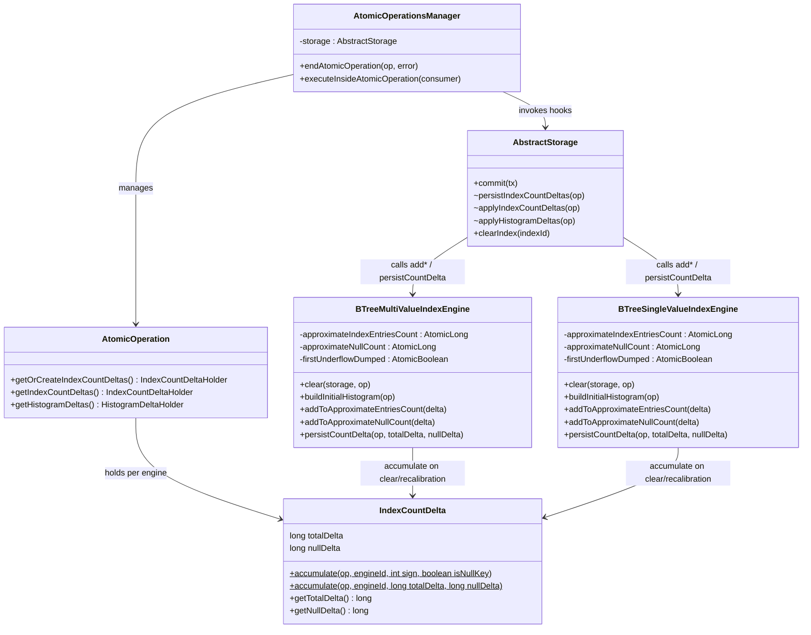
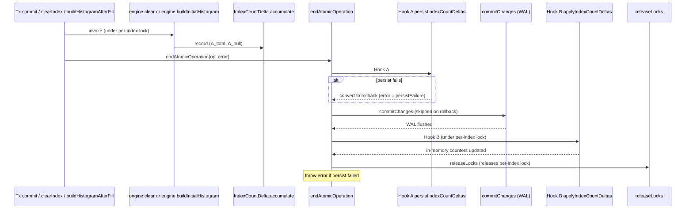

# Index counter divergence elimination — design

## Overview

Index entry counters (`approximateIndexEntriesCount`, `approximateNullCount`) on `BTreeMultiValueIndexEngine` and `BTreeSingleValueIndexEngine` diverge from their persisted counterparts on rollback. The trigger: `clear()` and `buildInitialHistogram()` write to both the WAL-tracked entry-point page and the in-memory `AtomicLong` inside the atomic op; rollback reverts only the persisted side. The next decrement underflows the assertion at `BTreeMultiValueIndexEngine.java:646`, which escapes `AbstractStorage.commit`'s `catch (RuntimeException)` and trips InError mode. That cascade produced 330 underflows + 2,643 poisoned commits + Gradle OOM in `Pre_Tests_Test_REST_2026.2.51599.log`.

The fix establishes three structural invariants. **Invariant 1**, *in-memory counter mutates only after WAL commit succeeds*: the four in-atomic-op writes in MV and SV engines move onto the existing `IndexCountDelta` accumulator (Tracks 3 and 4), so `persistCountDelta` (inside the atomic op) and `addToApproximate{Entries,Null}Count` (after `commitChanges`) are the only writers. **Invariant 2**, *AssertionError from any of the four engine mutators stays contained*: Track 1 broadens `AbstractStorage.commit`'s pre-`endTxCommit` catch at line 2319 to also catch `AssertionError`, and replaces the engine-level `assert updated >= 0` with clamp+error carrying engine `name`+`id` plus a one-shot stack-trace dump per engine. Under consolidation (Track 2), any residual throw is caught and logged inside Hook B in `endAtomicOperation`, never reaching the outer `catch (Error)` at `AbstractStorage.commit`. **Invariant 3**, *apply runs with the per-index lock held*: `persistIndexCountDeltas`, `applyIndexCountDeltas`, and `applyHistogramDeltas` move into `AtomicOperationsManager.endAtomicOperation` as the single lifecycle gate; the manual calls at `AbstractStorage.commit` lines 2318, 2333, 2345 are deleted (Track 2). Today's manual apply at line 2333 runs *after* `endAtomicOperation`'s inner-finally `releaseLocks` has released the per-index lock acquired by `lockIndexes` at line 2233, leaving a race window where the next TX reads stale in-memory state at the top of `clear()` or `buildInitialHistogram` (which the pure-delta encoding uses to compute its delta) and produces wrong arithmetic. Placing the apply hook inside `endAtomicOperation` before `releaseLocks` closes the window.

The fix composes with three existing primitives. `IndexCountDelta` already accumulates per-(engine, atomic-op) totals for the per-put / per-remove path; this branch adds a `(long, long)` overload for clear and recalibration. No idempotency flags are added: under the single-lifecycle-gate design each hook runs at most once per atomic op. `AtomicOperationsManager.endAtomicOperation` already owns the WAL atomic-op lifecycle (`commitChanges`, lock release, error-state propagation); the new hooks attach as Hook A (persist) before `commitChanges` and Hook B (apply plus histogram-apply parallel) after `commitChanges` but before the inner-finally `releaseLocks`. Hook A converts persist failures (`IOException | RuntimeException | AssertionError`) to rollback so the failure does not escape into the outer `catch (Error)` cascade.

This design assumes familiarity with the `IndexCountDelta` accumulator, the WAL atomic-op lifecycle (`startAtomicOperation` / `commitChanges` / `endAtomicOperation`), and the BTree entry-point page (`CellBTreeSingleValueEntryPointV3.APPROXIMATE_ENTRIES_COUNT`).

The document proceeds: Core Concepts establishes vocabulary; Class Design shows the touched types; Workflow covers the unified execution path through `endAtomicOperation`; the topic sections cover the pure-delta arithmetic, the lifecycle-gate design (with the lock-window correctness story), the cascade containment chain, and the self-healing alternative ruled out during research.

## Core Concepts

| Term | Meaning |
|---|---|
| **Dual-counter pattern** | A pair of counters tracking the same quantity: one persisted (WAL-tracked entry-point page), one in-memory (`AtomicLong`). The two are intended to advance in lockstep. |
| **`IndexCountDelta` accumulator** | Per-(engine, atomic-op) heap accumulator at `core/src/.../index/engine/IndexCountDelta.java` that records `totalDelta` and `nullDelta`. Today's per-put / per-remove path adds `±1` via the `sign + isNullKey` overload at line 60; the four clear/recalibration sites will use a new `(long, long)` overload. |
| **Pure-delta encoding** | The pattern this branch establishes: every in-atomic-op write to either counter routes through `IndexCountDelta.accumulate`. The persisted side moves at `persistCountDelta` (inside the atomic op) and the in-memory side moves at `addToApproximate{Entries,Null}Count` (Hook B, after `commitChanges`, before `releaseLocks`). |
| **Single lifecycle gate** | The pattern Track 2 establishes: `persistIndexCountDeltas` / `applyIndexCountDeltas` / `applyHistogramDeltas` live inside `AtomicOperationsManager.endAtomicOperation`, not at `AbstractStorage.commit`. Every counter sync (main commit + `clearIndex` API + `buildHistogramAfterFill`) advances through one place. The holder is consumed exactly once per atomic op, so no idempotency flags are needed. |
| **Lock-window invariant** | Apply runs with the per-index lock acquired at `lockIndexes` (AbstractStorage:2233) still held. Achieved by placing Hook B inside `endAtomicOperation`'s inner try, between `commitChanges` and the inner-finally `releaseLocks` call. Eliminates the read-stale-in-mem race in `clear()` and `buildInitialHistogram`. |
| **Cascade containment** | The three-part safety net at `AbstractStorage.commit`: broadened catch at line 2319 (also catches `AssertionError`); clamp+error replacing `assert updated >= 0`; one-shot stack-trace dump per engine on the first underflow. |

## Class Design



`IndexCountDelta` carries the totals; no idempotency flags. The two `accumulate` overloads coexist: `±1` for the put/remove hot path; `(long, long)` for clear and recalibration. The holder is allocated fresh per atomic op via `getOrCreateIndexCountDeltas`. `AtomicOperationsManager.endAtomicOperation` gains two callback points: Hook A invokes `storage.persistIndexCountDeltas(op)` before `commitChanges` with a conversion catch (`IOException | RuntimeException | AssertionError` → rollback); Hook B invokes `storage.applyIndexCountDeltas(op)` and `storage.applyHistogramDeltas(op)` after `commitChanges` but before the inner-finally `releaseLocks`, each in a log-and-swallow catch (`RuntimeException | AssertionError`). Visibility of those three methods rises from `private` to package-private. The two engine classes lose their direct-write paths in `clear` and `buildInitialHistogram`. The new field `firstUnderflowDumped` latches the per-engine one-shot stack-trace dump in `addToApproximate*Count`.

## Workflow

Three call paths (main commit, `clearIndex` API, `buildHistogramAfterFill`) all flow into the same `endAtomicOperation`, where Hook A and Hook B own counter sync. The diagram collapses the histogram-delta hook for readability; it fires symmetrically with Hook B.



On rollback (`error != null` at `endAtomicOperation` entry, OR Hook A's conversion fires), Hook B does not run. The page-level operations on the EP pages are reverted via WAL, and the holder is discarded along with the atomic op. Both sides stay consistent. The per-index lock is held throughout Hook B's execution because `releaseLocks` fires only in the inner-finally after Hook B returns.

## Pure-delta encoding for clear() and buildInitialHistogram()

**TL;DR.** Both sites read the in-memory counters under the engine's exclusive lock, encode the operation's effect as a negative-or-recalibrating delta on the atomic op's `IndexCountDelta` holder, and stop writing to either the persisted EP page or the in-memory `AtomicLong` directly. The persisted side advances at `persistCountDelta` (inside the atomic op); the in-memory side advances at `addToApproximate{Entries,Null}Count` (Hook B, after `commitChanges`, before `releaseLocks`). On rollback the holder is discarded with the atomic op; neither side mutates.

**Mechanism.** The MV engine's `clear()` body becomes:

```
currentTotal = approximateIndexEntriesCount.get();
currentNull  = approximateNullCount.get();
clearSVTree(op);                            // physical tree clear
// ... assertions + snapshot clearing ...
IndexCountDelta.accumulate(op, id, -currentTotal, -currentNull);
mgr.resetOnClear(op);                       // may throw IOException; rolls back
```

The current code's `setApproximateEntriesCount(op, 0)` calls on both trees and the two direct `AtomicLong.set` calls disappear. The SV engine mirrors this with one tree and the `IOException` wrap at the method boundary.

`buildInitialHistogram()` encodes its recalibration as a delta against current counters:

```
currentTotal = approximateIndexEntriesCount.get();
currentNull  = approximateNullCount.get();
targetTotal  = scannedNonNull + exactNullCount;
IndexCountDelta.accumulate(op, id, targetTotal - currentTotal, exactNullCount - currentNull);
```

The current code's `svTree.setApproximateEntriesCount(op, scannedNonNull)` + `nullTree.setApproximateEntriesCount(op, exactNullCount)` + the two `AtomicLong.set` calls disappear.

**Worked example** (MV engine, start `sv=995, null=5, total=1000`).

| Step | totalDelta | nullDelta | persisted_sv | persisted_null | in-mem total | in-mem null |
|---|---|---|---|---|---|---|
| start of TX | 0 | 0 | 995 | 5 | 1000 | 5 |
| `clear()` records Δ = (−1000, −5) | −1000 | −5 | 995 | 5 | 1000 | 5 |
| post-clear: +3 non-null, +2 null puts | −995 | −3 | 995 | 5 | 1000 | 5 |
| Hook A `persistIndexCountDeltas` (pre-`commitChanges`) | — | — | 3 | 2 | 1000 | 5 |
| `commitChanges` succeeds | — | — | 3 | 2 | 1000 | 5 |
| Hook B `applyIndexCountDeltas` (post-`commitChanges`, pre-`releaseLocks`) | — | — | 3 | 2 | 5 | 2 |
| `releaseLocks` releases per-index lock | — | — | 3 | 2 | 5 | 2 |

End state matches what the current code produces. On rollback at any step before Hook A completes, the atomic op is discarded along with the delta holder; neither side mutates; `(995, 5, 1000, 5)` stays consistent. Hook B never runs without Hook A and `commitChanges` both succeeding.

**Edge cases.** (1) The in-memory reads at the start of `clear()` must happen under the engine's exclusive lock. The lock is held by the enclosing commit (via `lockIndexes` at `AbstractStorage.java:2233`) on the commit-path clear, and by the per-engine lock inside `executeInsideAtomicOperation` on the `clearIndex` API path. Both stay held through Hook B because `releaseLocks` fires only in the inner-finally after Hook B returns. (2) The persisted entry-point page is transiently out of sync with the tree contents during a clear's atomic op (the tree is empty but the EP page still shows the pre-clear count until `persistCountDelta` runs). Safe today because `BTree.getApproximateEntriesCount` is read in production only from `load()` (grep confirms at MV:218/225 and SV:182), which never runs concurrently with a clear. The new `clear()` body carries a comment documenting this invariant. (3) The long-form `accumulate(long, long)` overload accepts arbitrarily large negative deltas; no sign precondition assertion. The four call sites are documented as clear/recalibration only.

### References
- D1: Pure-delta encoding over self-healing
- Invariant 1: in-memory mutates only after WAL commit

## endAtomicOperation lifecycle

**TL;DR.** The manager method already drives the commit chain — rollback marking, `commitChanges` WAL flush, `atomicOperationsTable` book-keeping, lock release. The change adds three hook points inside the same method: Hook A `persistIndexCountDeltas` before `commitChanges`; Hook B `applyIndexCountDeltas` plus `applyHistogramDeltas` after `commitChanges` but before the inner-finally `releaseLocks`. Hook B's placement before `releaseLocks` keeps the per-index lock acquired by `lockIndexes` (AbstractStorage:2233) held during apply, closing the lock-window race. Persist failures convert to rollback so they cannot escape into the outer `catch (Error)` cascade.

**Mechanism.** The annotated lifecycle:

```
endAtomicOperation(op, error):
  try {
    storage.moveToErrorStateIfNeeded(error);
    if (error != null) operation.rollbackInProgress();

    // Hook A: index-count persist (before WAL flush)
    if (error == null && !operation.isRollbackInProgress()) {
      var holder = operation.getIndexCountDeltas();
      if (holder != null) {
        try { storage.persistIndexCountDeltas(operation); }
        catch (IOException | RuntimeException | AssertionError persistFailure) {
          error = persistFailure;
          operation.rollbackInProgress();
        }
      }
      // (no histogram persist hook today — IndexHistogramManager writes lazily)
    }

    try {
      if (!operation.isRollbackInProgress()) {
        operation.commitChanges(commitTs, writeAheadLog);
      }
      if (error != null) atomicOperationsTable.rollbackOperation(commitTs);
      else { atomicOperationsTable.commitOperation(commitTs); ... }

      // Hook B: apply + histogram-apply (after WAL flush, BEFORE releaseLocks)
      if (error == null) {
        var indexHolder = operation.getIndexCountDeltas();
        if (indexHolder != null) {
          try { storage.applyIndexCountDeltas(operation); }
          catch (RuntimeException | AssertionError applyFailure) {
            LogManager.instance().warn(this, "...", applyFailure);
          }
        }
        var histogramHolder = operation.getHistogramDeltas();
        if (histogramHolder != null) {
          try { storage.applyHistogramDeltas(operation); }
          catch (RuntimeException | AssertionError applyFailure) {
            LogManager.instance().warn(this, "...", applyFailure);
          }
        }
      }
    } finally {
      releaseLocks(operation);                      // per-index lock released here
      operation.deactivate();
    }

    if (error != null) throw error;
  } finally {
    writeOperationsFreezer.endOperation();
  }
```

**Three correctness properties.**

*First, persist failure converts to rollback.* A throw from `persistIndexCountDeltas` would have escaped the prior manual call at `AbstractStorage.commit:2318` and been caught at line 2319. After the move, the throw fires from inside `endAtomicOperation`, which has no enclosing catch on the caller's side. The inner try/catch in Hook A converts the throw to `error = persistFailure; operation.rollbackInProgress()` so the subsequent `commitChanges` is skipped and `rollbackOperation` runs. The throw is re-raised at `if (error != null) throw error;` after the lock-release finally block. The catch covers `IOException | RuntimeException | AssertionError`, the third matching persisted-side `BTree.addToApproximateEntriesCount` underflows.

*Second, apply failure is logged and swallowed.* The cache-only contract holds (mirrors today's behavior at the deleted catches at `AbstractStorage.java:2334` and `:2346`). The broadened catch covers `RuntimeException | AssertionError`, matching Track 1's clamp+error rollout for the four in-mem mutators.

*Third, the per-index lock is held during apply.* `lockIndexes` at `AbstractStorage:2233` acquires each index's exclusive lock via `acquireExclusiveLockTillOperationComplete`, which adds the component to `operation.lockedComponents()` (`AtomicOperationsManager.java:312–313`). The inner-finally `releaseLocks` call at line 263 iterates `lockedComponents()` and unlocks each. Placing Hook B before that finally block means Hook B runs with all per-index locks still held — including the ones the next TX is blocked on. The race window the old design left open (manual apply at `AbstractStorage:2333` running after the lock release inside `endAtomicOperation`) is closed.

**Edge cases.** (1) `endTxCommit` at `AbstractStorage.java:4506` is a one-liner that delegates to `endAtomicOperation(operation, null)`. The main commit path passes `error = null` here; `persistIndexCountDeltas` fires in Hook A; `commitChanges` runs; Hook B fires before `releaseLocks`. (2) `rollback` at `AbstractStorage.java:3593` is also a one-liner delegating to `endAtomicOperation(operation, error)`. On this path `error != null` at entry, so `operation.rollbackInProgress()` is set immediately, Hook A skips its early-exit, `commitChanges` skips, and Hook B skips because the `error == null` gate fails. The atomic op rolls back cleanly. (3) `executeInsideAtomicOperation` paths (`clearIndex` API, `buildHistogramAfterFill`) pass through with `error = null` on success and run both hooks. Persist failures convert to rollback as described. (4) `calculateInsideAtomicOperation` (read-only callers) accumulates no delta; both hooks are no-ops via `if (holder == null) return;`.

### References
- D2: Single lifecycle gate over manual+hooks coordination
- D3: Histogram delta gets the same lifecycle gate
- Invariant 2: AssertionError stays contained
- Invariant 3: apply runs with the per-index lock held

## Cascade containment

**TL;DR.** One catch site in `AbstractStorage.commit` broadens to include `AssertionError` (line 2319, pre-`endTxCommit`); the engine-level `addToApproximate{Entries,Null}Count` mutators replace `assert updated >= 0` with clamp+error carrying engine `name`+`id` and a one-shot stack-trace dump per engine. The post-`endTxCommit` catches at lines 2334 and 2346 are deleted by Track 2 along with the manual calls they surrounded — Hook B's log-and-swallow catch takes their place. After Tracks 1 and 2, no `AssertionError` from these counters can reach the outer `catch (Error)` at `AbstractStorage.java:2388`; the failure mode observed in `Pre_Tests_Test_REST_2026.2.51599.log` (330 underflows → 2,643 poisoned commits → Gradle OOM) cannot recur.

**Mechanism.**

| Site | Current | After Tracks 1 + 2 |
|---|---|---|
| `AbstractStorage.java:2319` | `catch (IOException \| RuntimeException e)` | `catch (IOException \| RuntimeException \| AssertionError e)` |
| `AbstractStorage.java:2334` | `catch (RuntimeException e)` covering manual `applyIndexCountDeltas` | **deleted** by Track 2 along with the manual call |
| `AbstractStorage.java:2346` | `catch (RuntimeException e)` covering manual `applyHistogramDeltas` | **deleted** by Track 2 along with the manual call |
| `endAtomicOperation` Hook A | does not exist | `catch (IOException \| RuntimeException \| AssertionError)` → rollback |
| `endAtomicOperation` Hook B | does not exist | `catch (RuntimeException \| AssertionError)` → log + swallow |
| MV `addToApproximateEntriesCount` (line 636) | `assert updated >= 0` | clamp+error with engine `name`+`id` + one-shot dump |
| MV `addToApproximateNullCount` (line 644) | `assert updated >= 0` | clamp+error |
| SV `addToApproximateEntriesCount` (line 630) | `assert updated >= 0` | clamp+error |
| SV `addToApproximateNullCount` (line 640) | `assert updated >= 0` | clamp+error |

Clamp+error sketch:

```
public void addToApproximateNullCount(long delta) {
  long updated = approximateNullCount.addAndGet(delta);
  if (updated < 0) {
    if (firstUnderflowDumped.compareAndSet(false, true)) {
      LogManager.instance().error(this,
          "First in-memory approximateNullCount underflow on engine=%s id=%d"
              + " delta=%d updated=%d. Stack trace follows; subsequent"
              + " underflows on this engine will be compact-logged.",
          name, id, delta, updated,
          new Exception("approximateNullCount underflow stack"));
    } else {
      LogManager.instance().error(this,
          "In-memory approximateNullCount underflow on engine=%s id=%d"
              + " delta=%d updated=%d, clamping to 0.",
          name, id, delta, updated);
    }
    approximateNullCount.compareAndSet(updated, 0);
  }
}
```

The clamp uses `compareAndSet(updated, 0)` so a concurrent delta applied between `addAndGet` and the clamp is not silently overwritten. The one-shot dump latches per engine via `AtomicBoolean.compareAndSet(false, true)`; the field is shared between the two `addToApproximate*Count` methods on the same engine. The current `assert updated >= 0` text gives only `updated` and `delta`; the new messages add `name` and `id` so future occurrences are attributable to a specific engine.

**Edge cases.** (1) The pre-`endTxCommit` catch at 2319 now also covers persisted-side `AssertionError` from `BTree.addToApproximateEntriesCount`'s own assert at `BTree.java:1020` (raised inside `commitIndexes`). Routing that through rollback is the correct response; persisted-side underflow indicates a structural inconsistency, not a tolerable cache drift. (2) The `cleanupSnapshotIndex` catch at 2357 is left alone (no current code path in that method asserts). (3) After Track 1, Bug C ([YTDB-953]) downgrades from `AssertionError` to a single logged error per SV engine. The one-shot dump per engine bounds log volume. (4) Concurrent updates cannot produce transient underflows. PSI find-usages confirm `addToApproximate{Entries,Null}Count` has exactly one production caller (`AbstractStorage.applyIndexCountDeltas` at lines 2489–2490). Track 2's consolidation places that caller inside `endAtomicOperation` Hook B, which runs before the inner-finally `releaseLocks` at `AtomicOperationsManager.java:263`, so the per-index lock acquired by `lockIndexes` at `AbstractStorage:2233` is held during apply. Concurrent commits on the same engine serialize through that window; concurrent commits on different engines touch different `AtomicLong` counters. Every underflow at apply time signals a real divergence between persisted and in-memory state (Bug A, Bug C, or a future regression), justifying error-level visibility.

### References
- D5: Containment lands first
- D6: Bug C remains out of scope
- Invariant 3: apply runs with the per-index lock held

## Why pure-delta, not collection-style self-healing

**TL;DR.** `PaginatedCollectionV2` carries the same dual-counter shape with `approximateRecordsCount`, but its increment/decrement reads the persisted value first (`count = state.getApproximateRecordsCount(); approximateRecordsCount = count + 1;`), so post-rollback drift self-heals on the next mutation. Three reasons that pattern doesn't transfer to indexes: per-put EP-page I/O cost; recalibration semantics; MV split-tree double-read.

**Reason 1: per-put cost.** Today's index put cost is one in-heap `IndexCountDelta.accumulate(op, engineId, +1, isNullKey)`. Zero page I/O on the counter path; the EP page writes batch at `persistCountDelta` once per engine per tx. Self-healing forces per-mutation read+write of the EP page. For a bulk-import tx inserting 100K records the cost goes from roughly 2 page writes to ~300K (MV) or ~200K (SV).

**Reason 2: recalibration semantics.** `buildInitialHistogram` writes an absolute target value (the result of a full scan), not a `±1` delta. Under self-healing, the next post-recalibration put reads the previous persisted value, advances by 1, and overwrites the in-memory recalibration target. The recalibration effect is erased.

**Reason 3: MV split-tree.** MV engine total = sv + null, sourced from two separate EP pages. Self-healing increment for a null put would need to read both pages to recompute the total. Double the EP-page read traffic on every null put.

**What this branch borrows from the collection pattern.** The *posture*, not the *mechanism*. Collection tolerates short-lived drift via overwrite-from-persisted self-healing; index tolerates short-lived drift via Track 1's clamp+error and Track 4's recalibration. Two different mechanisms, same end posture: wrong values get corrected, no crash.

**Edge cases.** (1) An alternative considered during research, "snap to persisted at apply time" (re-read EP pages inside `applyIndexCountDeltas`), would add per-commit page reads but does not address the in-atomic-op write hazard at `clear()` and `buildInitialHistogram`. It only partly fixes the bug. Rejected. (2) `PaginatedCollectionV2.approximateRecordsCount` is deliberately not fixed in this branch; the self-heal mitigates the divergence to a query-optimizer-cost-estimation-only drift, and changing the pattern carries regression risk (D1 alternative 1 has its own hazards).

### References
- D1: Pure-delta encoding over self-healing
