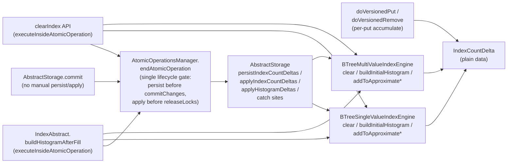

# Index entries-count tracking via unified delta

## Design Document
[design.md](design.md)

## High-level plan

### Goals

Eliminate the divergence trigger between the persisted and in-memory index entry counters in `BTreeMultiValueIndexEngine` and `BTreeSingleValueIndexEngine`. Today the counters violate the invariant *"in-memory counter mutates only after WAL commit succeeds"* at two sites — `clear()` and `buildInitialHistogram()`. On rollback the persisted side reverts via WAL but the in-memory side stays, and the next decrement underflows the assertion at `BTreeMultiValueIndexEngine.java:646`. That assertion escaped `AbstractStorage.commit`'s `catch (RuntimeException)` and produced the Hub cascade in `Pre_Tests_Test_REST_2026.2.51599.log` (330 underflows → 2,643 poisoned commits → Gradle JVM OOM).

The fix has two layers. First, **convert both sites to pure-delta encoding** so the in-memory write moves behind the existing `IndexCountDelta` machinery and is no longer reachable inside the atomic op. Second, **route persist and apply through `AtomicOperationsManager.endAtomicOperation` as the single lifecycle gate** — delete the manual calls at `AbstractStorage.commit` lines 2340 (`persistIndexCountDeltas`), 2365 (`applyIndexCountDeltas`), and 2381 (`applyHistogramDeltas`); attach persist before `commitChanges` (with persist-failure-to-rollback conversion) and apply after `commitChanges` but **before `releaseLocks`** so every counter sync (main commit + `clearIndex` API + `buildHistogramAfterFill`) advances through one place under the per-index lock. The lock-window correctness story makes this consolidation load-bearing: today's manual `applyIndexCountDeltas` at line 2365 runs *after* `endTxCommit → endAtomicOperation → releaseLocks` has released the per-index lock acquired by the `lockIndexes(indexOperations, atomicOperation)` call at `AbstractStorage.java:2255` (method declared at line 5768), leaving a ~40-line race window where the next TX reads stale in-memory state at the top of `clear()` or `buildInitialHistogram` (which the pure-delta encoding uses to compute its delta) and produces wrong arithmetic. A containment layer (broadened catches in `AbstractStorage.commit`; clamp+error in the engine counter mutators) lands first as defense-in-depth.

### Constraints

- **Coverage gate**: 85% line / 70% branch on changed code (CI enforced).
- **Hot path**: per-put/remove cost stays heap-only via `IndexCountDelta.accumulate(op, engineId, sign, isNullKey)`. The fix must not regress index put/remove to per-mutation EP-page I/O — see [design.md § "Why pure-delta, not collection-style self-healing"](design.md#why-pure-delta-not-collection-style-self-healing) for the alternative ruled out during research.
- **Recovery**: the new hooks must be no-ops during the recovery-time atomic ops at `AbstractStorage.java:766–860` so storage open is unaffected.
- **WAL invariant preserved**: the in-memory side cannot move without a successful WAL commit. This is the property the fix establishes; every change in the four tracks must respect it.
- **Lock-window invariant**: `applyIndexCountDeltas` and `applyHistogramDeltas` run with the per-index lock acquired at `lockIndexes` (AbstractStorage:2255) still held. Achieved by placing the apply hooks inside `endAtomicOperation` before `releaseLocks` returns the lock; the manual call at AbstractStorage:2365 (which runs after the lock release) is deleted.
- **Independent revertability**: each track lands one logical change so reverts are surgical.

### Implementer pacing (YTDB-971)

Every implementer prompt spawned from this plan (Phase B step implementers, Phase C track-level fix implementers) carries the YTDB-971 anti-pattern guidance verbatim. The pattern this prevents is background `./mvnw` paired with `tail -f`, no PID registration, no explicit kill before exit. Both Step 2 spawns on this branch hit it: each implementer emitted a Maven test tool_use, exhausted its message budget waiting on Monitor, exited without a `RESULT` block, and left an orphan Maven JVM plus the watcher consuming resources. Cumulative cost: ~56 minutes of orchestrator time across two spawns.

Required clauses in every implementer prompt:

- **Prefer foreground Maven** for single-class or focused reruns (`./mvnw -pl core test -Dtest=<TouchedTestClass>`). The runtime stays aware of implementer activity; `RESULT_MISSING` recovery is unnecessary.
- **Route longer builds through `steroid_execute_code`** when the build exceeds the foreground budget but fits within the MCP HTTP timeout. The IDE returns structured pass/fail without orchestrator polling.
- **Background mode is a last resort** (full coverage build, integration suite that exceeds the foreground budget). When unavoidable: register the background PID, emit periodic progress lines so the runtime stays aware, and explicitly `kill -TERM` the background task plus any watcher before emitting any exit message (RESULT, budget-exit, or otherwise).
- **Never pair a background `./mvnw` with `tail -f`** on the same shell. The pair is the orphan-pattern signature; the foreground and IDE-routed alternatives avoid it.

Applies to every implementer prompt for Tracks 2, 3, 4 of this branch and any Phase C fix-application implementer. Track 1's implementers ran before YTDB-971 was filed; the rule does not apply retroactively.

### Architecture Notes

#### Component Map

- **`IndexCountDelta` (holder)** — gains a long-form `accumulate(op, engineId, long totalDelta, long nullDelta)` overload for clear and recalibration. No idempotency flags: under the single-lifecycle-gate design the holder is consumed exactly once per atomic op, by `endAtomicOperation`.
- **`BTreeMultiValueIndexEngine` / `BTreeSingleValueIndexEngine`** — `clear()` and `buildInitialHistogram()` stop writing to in-memory `AtomicLong`s and the persisted EP pages directly; they record a delta on the atomic op. The engine-level `addToApproximate{Entries,Null}Count` mutators replace `assert updated >= 0` with clamp+error (one-shot stack-trace dump per engine, with engine `name`+`id` in the message).
- **`AtomicOperationsManager.endAtomicOperation`** — gains two hooks calling back into `AbstractStorage.persistIndexCountDeltas` (before `commitChanges`, with persist-failure-to-rollback conversion) and `applyIndexCountDeltas` (after `commitChanges`, before the inner-finally `releaseLocks` so the per-index lock is held during apply). A symmetric pair for `applyHistogramDeltas` lands too. Each hook runs at most once per atomic op (one invocation, no flags needed for idempotency).
- **`AbstractStorage.commit`** — the catch at line 2341 has been broadened by Track 1 to `catch (IOException | RuntimeException | AssertionError)` (defense-in-depth for `commitIndexes` failures including persisted-side BTree underflow). Manual invocations of `persistIndexCountDeltas` (line 2340), `applyIndexCountDeltas` (line 2365), and `applyHistogramDeltas` (line 2381) are deleted, along with the post-`endTxCommit` catches at lines 2366 and 2382 that surrounded them — the lifecycle hooks own those failure paths. The cleanupSnapshotIndex try/catch at lines 2394–2403 is untouched.

#### D1: Pure-delta encoding over collection-style self-healing

- **Alternatives considered**: (1) Collection-style overwrite-from-persisted (`approximateRecordsCount = state.getApproximateRecordsCount() + delta`); (2) pure-delta encoding via `IndexCountDelta` (chosen); (3) snap-to-persisted at apply time (re-read EP pages in `applyIndexCountDeltas`).
- **Rationale**: per-put cost — alternative (1) forces 2 EP-page reads + 1 write on every MV null put (split-tree); the existing `IndexCountDelta` keeps the hot path heap-only. Recalibration semantics — `buildInitialHistogram` writes an absolute target, not a delta; alternative (1) would erase that target on the next post-rollback put. Alternative (3) doesn't address the in-atomic-op write hazard at `clear()` / `buildInitialHistogram`, so it only partly fixes the bug.
- **Risks/Caveats**: the long-form `accumulate(long, long)` overload accepts arbitrarily-large negative deltas (no sign precondition), so a future caller using it for ordinary put/remove instead of the sign+isNullKey form bypasses the invariant. Mitigated by naming and Javadoc; the four call sites are clearly documented as clear/recalibration only.
- **Implemented in**: Tracks 3 and 4.
- **Full design**: [design.md § "Pure-delta encoding for clear() and buildInitialHistogram()"](design.md#pure-delta-encoding-for-clear-and-buildinitialhistogram).

#### D2: Single lifecycle gate over manual+hooks coordination

- **Alternatives considered**: (1) Manual invocations in `AbstractStorage.commit` coexist with lifecycle hooks; coordinate via two idempotency flags (`persistedToPage`, `appliedToMemory`) so neither runs twice; (2) Single lifecycle gate — delete manual invocations, route every counter sync through `endAtomicOperation` (chosen); (3) Snap-to-persisted at apply time (re-read EP pages inside `applyIndexCountDeltas`) without restructuring the lifecycle.
- **Rationale**: lock-window correctness. Today's manual `applyIndexCountDeltas` at AbstractStorage:2365 runs *after* `endTxCommit → endAtomicOperation → releaseLocks` releases the per-index lock acquired by `lockIndexes` at line 2255 (the inner-finally `releaseLocks` call at `AtomicOperationsManager.java:289`). The intervening lines between lock release and the manual apply are enough for a concurrent TX to read stale in-memory state at the top of `clear()` or `buildInitialHistogram` (which the pure-delta encoding uses to compute its delta) and produce wrong arithmetic — for the next TX's `clear` or recalibration, the delta is `target - currentInMem`, and `currentInMem` is the stale value. Placing the apply hook inside `endAtomicOperation` *before* `releaseLocks` closes the window. Alternative (1) preserves the bug because the manual apply still runs at line 2333 after the lock release; the flags only coordinate against double-application, not against the race. Alternative (3) adds per-commit EP-page reads without addressing the in-atomic-op write hazard at `clear()` and `buildInitialHistogram`, so it only partly fixes the bug.
- **Risks/Caveats**: every commit now routes counter persist through Hook A and apply through Hook B; blast radius for hook bugs widens beyond the standalone-atomic-op paths to the main commit. Mitigated by integration tests in Track 2 covering both the main-commit and `clearIndex` / `buildHistogramAfterFill` paths. The persist-failure-to-rollback conversion (Hook A's inner catch covering `IOException | RuntimeException | AssertionError`, plus the explicit `storage.moveToErrorStateIfNeeded(persistFailure)` call inside that catch, plus the typed re-raise after `releaseLocks`) is now load-bearing. Three failure vectors with distinct contracts:
  - **IOException**: today's manual persist at AbstractStorage:2340 routes through `finally → rollback → endAtomicOperation → moveToErrorStateIfNeeded` and lands `setInError` there. Hook A reproduces this via the explicit `moveToErrorStateIfNeeded(persistFailure)` call in the catch, because Hook A runs after `endAtomicOperation`'s entry-level `moveToErrorStateIfNeeded(error=null)` no-op. Without the explicit call, the storage would NOT enter error mode on persist IOException — a contract regression from today.
  - **AssertionError**: Track 1's `setInError` guard at `AbstractStorage.java:1769–1771` skips it. The storage stays out of error mode; rollback recovers. Hook A's `moveToErrorStateIfNeeded` routes through the same guard for free.
  - **RuntimeException**: `logAndPrepareForRethrow(RuntimeException)` does not call `setInError` (per `AbstractStorage.java:5803`). Today, the storage enters error mode only via the rollback-path `moveToErrorStateIfNeeded`. Hook A reproduces this via the explicit call.

  Error-subtype handling: Hook A's catch is bounded to `IOException | RuntimeException | AssertionError`. Other `Error` subclasses (`OutOfMemoryError`, `StackOverflowError`, `LinkageError`, `InternalError`) deliberately escape Hook A and propagate out of `endAtomicOperation`, landing at `AbstractStorage.commit`'s outer `catch (Error)` at line 2427 → `logAndPrepareForRethrow(Error)` → `setInError`. Genuine VM errors still poison the storage. Matches Track 1's wrapper-catch precedent (`AtomicOperationsManager.executeInsideAtomicOperation` etc.) where the same triple is caught and other `Error` subclasses escape.
- **Implemented in**: Track 2.
- **Full design**: [design.md § "endAtomicOperation lifecycle"](design.md#endatomicoperation-lifecycle).

#### D3: Histogram delta gets the same lifecycle gate

- **Alternatives considered**: (1) Wire only the index-count hooks; leave the manual `applyHistogramDeltas` at AbstractStorage:2345 in place; (2) move both `applyIndexCountDeltas` and `applyHistogramDeltas` into `endAtomicOperation` symmetrically (chosen).
- **Rationale**: `applyHistogramDeltas` carries the same cache-only contract and the same lock-window race as `applyIndexCountDeltas` (per D2). Asymmetric wiring (one apply moved into the lifecycle, the other still at line 2345 after `releaseLocks`) would leave the histogram delta exposed to the same stale-read race and become a confusing landmine for future readers. Persist-side: there is no manual `persistHistogramDeltas` today (histogram delta writes happen lazily under `IndexHistogramManager`), so the persist parallel is a no-op for now; the design retains symmetric naming so a future persist hook drops in cleanly.
- **Risks/Caveats**: histogram delta serialization is keyed differently from index-count delta (engineId is an `Integer` in `HistogramDeltaHolder`, not an `int` as in `IndexCountDeltaHolder`); each holder keeps its existing keying. No new serialization needed.

  Inherited nested-op vulnerability (not a Track 2 regression): `IndexHistogramManager.applyDelta` (called from Hook B's `applyHistogramDeltas`) conditionally invokes `flushSnapshotToPage`, which spawns a nested `executeInsideAtomicOperation` at `IndexHistogramManager.java:1975`. If the nested op's `commitChanges` throws `IOException`, the nested `endAtomicOperation` calls `moveToErrorStateIfNeeded(error) → setInError` — flipping the storage to permanent error state inside a "successful" outer commit. Today's manual `applyHistogramDeltas` at `AbstractStorage.java:2381` already has this vulnerability; Track 2 inherits it without widening exposure. Follow-up tracked separately.
- **Implemented in**: Track 2.

#### D5: Containment lands first, in one track

- **Alternatives considered**: (1) Land containment per-engine across multiple tracks; (2) one track for all four mutators + the pre-`endTxCommit` catch broadening at line 2319 (chosen).
- **Rationale**: containment is self-contained and unblocks every other track because it removes the cascade pressure that currently makes the bug visible. Splitting it across tracks would create artificial dependencies. The four mutators mirror each other; clamping one without the others would leave inconsistent posture across engines. The handler emits an **error** (not a warn) because PSI find-usages confirm `addToApproximate{Entries,Null}Count` has exactly one production caller (`AbstractStorage.applyIndexCountDeltas` at lines 2528–2529). Track 2's consolidation places that caller inside `endAtomicOperation` Hook B, which runs *before* the inner-finally `releaseLocks` (`AtomicOperationsManager.java:289`), so the per-index lock acquired by `lockIndexes` at AbstractStorage:2255 is still held during apply. Concurrent commits on the same engine serialize through that window; concurrent commits on different engines touch different `AtomicLong` counters. Every underflow at apply time signals a real divergence between persisted and in-memory state (Bug A, Bug C, or a future regression), warranting error-level visibility.
- **Risks/Caveats**: the broadened catch at AbstractStorage:2319 covers the pre-`endTxCommit` path; an `AssertionError` from `commitIndexes` (which can fire if `BTree.addToApproximateEntriesCount` underflows on the persisted side) now routes through rollback instead of escaping. This is the intended behavior — persisted-side underflow is a structural inconsistency and rollback is the correct response. The post-`endTxCommit` catches at 2366 and 2382 are deleted by Track 2 along with the manual calls they surrounded; Hook B's swallow-catch (`RuntimeException | AssertionError`) inside `endAtomicOperation` takes their place. Ordering: Track 1 only broadens line 2341 and rewrites the four mutators; Track 2 owns the deletion of lines 2364–2393.
- **Implemented in**: Track 1.

#### D6: Bug C (YTDB-953) explicitly out of scope

- **Alternatives considered**: (1) Fold Bug C's SV `load()` null-count scan into this branch; (2) leave for YTDB-953 (chosen).
- **Rationale**: Bug C is independent of the clear-rollback divergence. After Track 1 lands, Bug C's underflow downgrades from `AssertionError` to a single logged error per engine, so urgency drops. Combining the fixes would conflate the structural divergence story with a separate "load path needs to scan for nulls" change.
- **Risks/Caveats**: after Parts 1–4 land, Bug C is the only remaining trigger for in-memory null underflows in normal operation. The one-shot dump in Track 1 makes the next occurrence loud and pin-pointable; expect Bug C's signature to dominate the next Hub run's error lines.
- **Implemented in**: Tracked separately at [YTDB-953](https://youtrack.jetbrains.com/issue/YTDB-953).

### Invariants

- **Invariant 1**: `approximateIndexEntriesCount` and `approximateNullCount` on both engines mutate only after `commitChanges` returns successfully. No code path inside an atomic op may write to the `AtomicLong` directly. Enforced by Tracks 3, 4.
- **Invariant 2**: `AssertionError` from any of the four engine counter mutators stays contained — under consolidation it is logged-and-swallowed inside Hook B's catch in `endAtomicOperation`, never reaching the outer `catch (Error)` at `AbstractStorage.commit`. Enforced by Tracks 1 and 2.
- **Invariant 3**: `applyIndexCountDeltas` and `applyHistogramDeltas` run with the per-index lock acquired at `lockIndexes` (AbstractStorage:2255) still held. The lock is released by `endAtomicOperation`'s inner-finally `releaseLocks` (`AtomicOperationsManager.java:289`); placing the apply hooks inside the inner try, between `commitChanges` and `releaseLocks`, keeps the lock held during apply. Enforced by Track 2.

### Integration Points

- **`IndexCountDelta` long-form overload** — Track 3 adds `accumulate(op, engineId, long totalDelta, long nullDelta)`; called only from the four clear/recalibration sites.
- **`AtomicOperationsManager.endAtomicOperation`** — Track 2 adds two callback points that invoke `storage.persistIndexCountDeltas(op)` before `commitChanges` and `storage.applyIndexCountDeltas(op)` after `commitChanges` but before the inner-finally `releaseLocks`. The histogram apply parallels the index-count apply. Visibility of `persistIndexCountDeltas`, `applyIndexCountDeltas`, and `applyHistogramDeltas` on `AbstractStorage` rises from `private` to package-private.
- **`AbstractStorage.commit` manual invocations** — Track 2 deletes lines 2340 (`persistIndexCountDeltas`), 2365 (`applyIndexCountDeltas`), and 2381 (`applyHistogramDeltas`) along with the post-`endTxCommit` catches at lines 2366 and 2382. Track 1 has already broadened the surviving catch at line 2341.

### Non-Goals

- **Bug C (YTDB-953)** — SV `load()` unconditional null reset.
- **PaginatedCollectionV2 `approximateRecordsCount`** — structurally adjacent dual-counter, deliberately not fixed (research confirmed the overwrite-from-persisted pattern self-heals on next mutation).
- **YTDB-952 (DBSequence.callRetry)** and **XD-1272 (RemovedTransientEntity blob reattach)** — orthogonal defects observed in the same Hub log.
- **Migration of `IndexCountDelta` to per-put EP-page I/O** — explicitly rejected by D1.

## Checklist

- [x] Track 1: Containment fixes
  > Three-layer cascade containment. Layer 1: broaden two catch sites to include `AssertionError`. The pre-`endTxCommit` catch at `AbstractStorage.commit` line 2319 covers the main-commit path; the `catch (Exception e)` blocks in `AtomicOperationsManager.executeInsideAtomicOperation:148` and `calculateInsideAtomicOperation:129` cover the API path (`clearIndex`, `buildHistogramAfterFill`, and the 44 other src/main wrapper callsites). Layer 2: add a one-line `AssertionError` entry-point guard to `AbstractStorage.setInError(Throwable)` at line 1756. This closes the residual cascade vector left by Layer 1: any AssertionError fired in a top-level storage method's outer `catch (Error)` clause (`synch`, `count`, `freeze`, `release`, and ~30+ others) would otherwise call `setInError` and put the storage in a permanent error state. Layer 3: replace the `assert updated >= 0` underflow trap in the four engine-level mutators (`addToApproximate{Entries,Null}Count` × MV + SV) with clamp+error carrying engine identity, plus a one-shot stack-trace dump per engine. The post-`endTxCommit` catches at lines 2334 and 2346 are deleted by Track 2 along with the manual calls they wrap, so Track 1 leaves them alone. This is the smallest blast-radius change and lands first as defense-in-depth. After it, the cascade observed in the Hub log is contained even if the rest of the branch were to be reverted, and it cannot recur from any future assert added anywhere in the storage code path.
  >
  > **Track episode:**
  > Containment landed in 7 steps with 0 failures and 1 review-fix iteration. Three layers close the cascade observed in the Hub log. (1) The pre-`endTxCommit` catch at `AbstractStorage.commit:2319` and the four `AtomicOperationsManager` wrapper catches (statement lines 136/155/179/208) now accept `AssertionError`. (2) `setInError(Throwable)` carries a one-line `AssertionError` skip guard at the chokepoint with a three-reason rationale inline (`-ea` off in production; layers 1+2 catch at source; layer 3 prevents the in-memory underflow throw). (3) The four engine-mutator surfaces (`addToApproximate{Entries,Null}Count` × MV + SV) replace `assert updated >= 0` with `reportAndClampUnderflow`: first-underflow stack-trace dump per engine instance via a shared `AtomicBoolean firstUnderflowDumped` latch, clamp via `compareAndSet(observed, 0)` with no retry. Regression coverage spans engine-mutator tests (16-thread contention, latch independence, failed-CAS no-op), wrapper-level cascade tests, a storage-end-to-end containment test via `Long.MIN_VALUE + 1` reflective injection, and an `AtomicOperationBinaryTracking.commitChanges` bare-`Error` surface pinning the A1=accept-the-gap contract.
  >
  > Cross-track signals for Tracks 2–4: (a) `IndexCountDeltaHolder` keys on the internal engine id (low 27 bits of `IndexAbstract.getIndexId`); reflective test injection masks with `0x7FFFFFF`. (b) `reportAndClampUnderflow` is package-private on both engines (`final` classes under `internal/`); failed-CAS branch exercised through this surface. (c) `BTreeEngineTestFixtures.captureSevereOn` is the shared JUL-capture helper for engine-side ERROR-emission tests (widened to `public` by Step 6 for cross-package consumers). (d) SV null-counter asymmetry: `persistCountDelta` ignores `nullDelta`; `load()` recalibrates `approximateNullCount` via `countNulls(atomicOperation)`. Material input for Track 3's `clear()` pure-delta encoding on SV. (e) `logAndPrepareForRethrow` overload asymmetry: only the `Error` (line 5816) and `Throwable` (line 5838) overloads call `setInError`; the `RuntimeException` overload (line 5789) does not. (f) Track 2's deletion targets (manual `persistIndexCountDeltas` / `applyIndexCountDeltas` / `applyHistogramDeltas` plus their post-`endTxCommit` catches) carry stale citations in this plan file. Current line numbers for the two catches are 2366 / 2382.
  >
  > Phase C iteration 1 applied 9 dimensional findings (M1–M9) in commit `030ca27488`; all 7 gate-checks returned VERIFIED. Carry-forward items deferred to follow-up: stale `AbstractStorage` line citations across `track-1.md` + `implementation-plan.md` (~15 sites; Track 2 will reconcile when it touches the deletion targets), em-dash overruns in two `track-1.md` Episode paragraphs, fork-per-class comments in 5 storage tests, `track-1.md` workflow context-budget compression, `cleanupSnapshotIndex` catch broadening for symmetry, plus 6 new-test recommendations, 2 refactoring suggestions (shared `reportAndClampUnderflow` extraction, abstract base for MV/SV underflow tests), and 2 diagnostic-polish items.
  >
  > **Track file:** `plan/track-1.md` (7 steps, 0 failed)
  >
  > **Strategy refresh:** ADJUST — refreshed stale `AbstractStorage` + `AtomicOperationsManager` line citations across `track-2.md` and `implementation-plan.md` (~20 sites) to post-Track-1 values; appended a `### Clarifications` subsection under Track 2's `## Context and Orientation` capturing five cross-track signals from Track 1's episode (engine-mutator visibility, `IndexCountDeltaHolder` engine-id mask, `BTreeEngineTestFixtures.captureSevereOn` public widening, `logAndPrepareForRethrow` overload asymmetry, `RecordSerializationContext.executeOperations` wrapper-bypass injection point).

- [ ] Track 2: Consolidate persist + apply into `endAtomicOperation`
  > Move `persistIndexCountDeltas` / `applyIndexCountDeltas` / `applyHistogramDeltas` into `AtomicOperationsManager.endAtomicOperation` as the single lifecycle gate — persist before `commitChanges` (with persist-failure-to-rollback conversion covering `IOException | RuntimeException | AssertionError`), apply after `commitChanges` but before the inner-finally `releaseLocks` so the per-index lock is held during apply. Delete the manual calls at `AbstractStorage.commit` lines 2318, 2333, 2345 and their surrounding post-`endTxCommit` catches at 2334, 2346. After this track, every counter sync (main commit, `clearIndex` API, `buildHistogramAfterFill`) advances through one place under the per-index lock, closing the read-stale-in-mem race window that today's manual apply at line 2333 leaves open.
  > **Scope:** ~3-4 steps covering Hook A (persist + rollback-on-failure conversion), Hook B (apply + histogram-apply parallel + log-and-swallow), and integration tests covering both the main-commit and standalone-atomic-op paths under rollback.
  > **Depends on:** Track 1

- [ ] Track 3: `clear()` pure-delta encoding
  > Convert `BTreeMultiValueIndexEngine.clear()` and `BTreeSingleValueIndexEngine.clear()` to pure-delta encoding: read current counters under the engine's exclusive lock, accumulate `Δ = -current` on the atomic op via the new long-form `IndexCountDelta.accumulate` overload, and stop writing directly to the persisted EP pages and in-memory `AtomicLong`s. After this track, the clear-rollback divergence is structurally impossible on both the commit path and the `clearIndex` API path (the latter requires Track 2's hook wiring to be effective).
  > **Scope:** ~3-4 steps covering the long-form `IndexCountDelta.accumulate` overload, MV engine clear conversion, SV engine clear conversion, and clear-rollback regression tests covering both the commit and `clearIndex` API paths.
  > **Depends on:** Track 2

- [ ] Track 4: `buildInitialHistogram` pure-delta encoding
  > Convert `BTreeMultiValueIndexEngine.buildInitialHistogram()` and `BTreeSingleValueIndexEngine.buildInitialHistogram()` to pure-delta encoding: compute the recalibration as `Δ = target - current` and accumulate via the long-form `IndexCountDelta.accumulate` overload. After this track, the recalibration-rollback divergence is structurally impossible on the `buildHistogramAfterFill` path, which is the only production caller.
  > **Scope:** ~2-3 steps covering MV `buildInitialHistogram` conversion, SV `buildInitialHistogram` conversion, and a recalibration-rollback regression test.
  > **Depends on:** Track 2; soft dependency on Track 3 (both tracks add the long-form `IndexCountDelta.accumulate` overload; whichever lands first owns the addition)

## Plan Review
- [x] Plan review (consistency + structural) — passed at iteration 1

**Auto-fixed (mechanical)**:
- CR1 (should-fix) — `track-4.md` lines 56 and 91: SV `buildInitialHistogram` line 591 is `exactNullCount = countNulls(atomicOperation)`, not an `approxNull` read; both citations rewritten.
- CR2 (suggestion) — `track-3.md` line 56: obsolete-comment range `287–301` → `287–299` (lines 300–301 are executable `AtomicLong.set` statements, not comments).
- CR3 (suggestion) — `track-2.md` line 50: `releaseLocks` body range `275–293` → `275–295` (closing brace at 295).
- CR4 (suggestion) — `track-2.md` line 50 + `design.md` line 232 (via `edit-design`): `AtomicOperationsManager.java:312–313` → `:313` (line 312 is `lockExclusive()`; only line 313 is `addLockedComponent`).
- CR5 (suggestion) — `track-2.md` line 50: `BTree.java:1733` → `:1732` (method declaration line, aligning with the doc's declaration-line convention).
- CR6 (suggestion) — `implementation-plan.md` line 12: first-reference disambiguation of `lockIndexes` call site (`AbstractStorage.java:2233`) vs method declaration (`:5729`); downstream short-form citations retained.
- S2 (should-fix) — `track-2.md` lines 132 and 159: removed stale `isOpen()` accessor references that contradicted line 66's "no accessor needed" decision.
- S4 (suggestion) — `implementation-plan.md` D3 Risks/Caveats: rewrote "the holder must support both with their existing types" to name `HistogramDeltaHolder` and `IndexCountDeltaHolder` explicitly.

**Escalated (design decisions)**:
- S1 (suggestion) — Track 4 dependency annotation. User picked "Annotate soft dep": Track 4 line now reads `**Depends on:** Track 2; soft dependency on Track 3 (both tracks add the long-form IndexCountDelta.accumulate overload; whichever lands first owns the addition)`.
- S3 (suggestion) — D2 "Bug B" undefined reference. User picked "Gloss in-place": replaced "re-creating Bug B for a different trigger" with "re-creating a persist-failure-escape cascade for a different trigger".

## Final Artifacts
- [ ] Phase 4: Final artifacts (`design-final.md`, `adr.md`)
