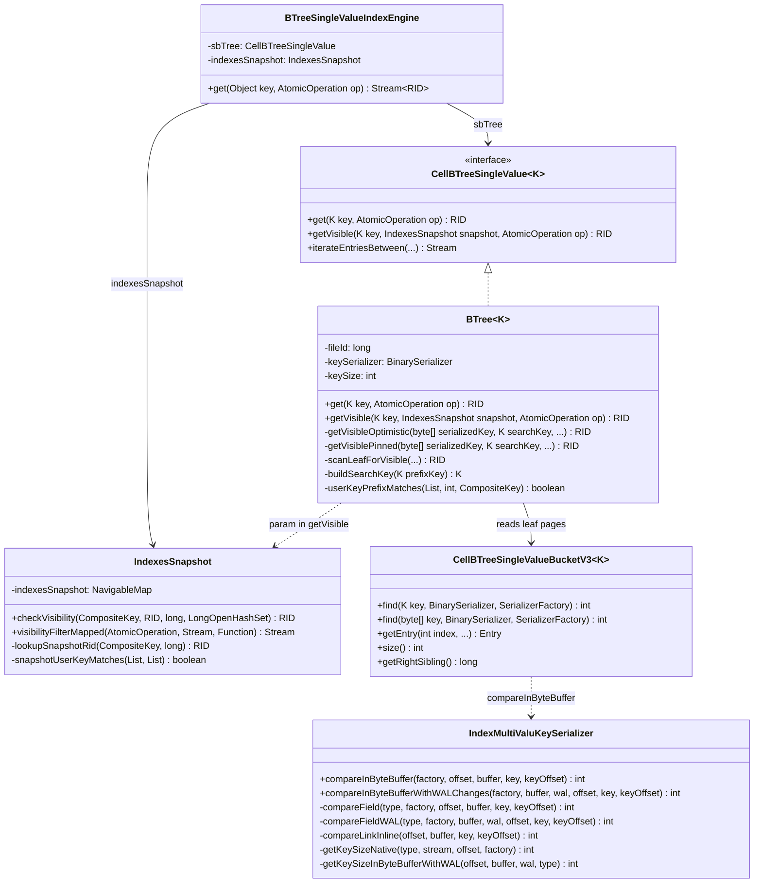
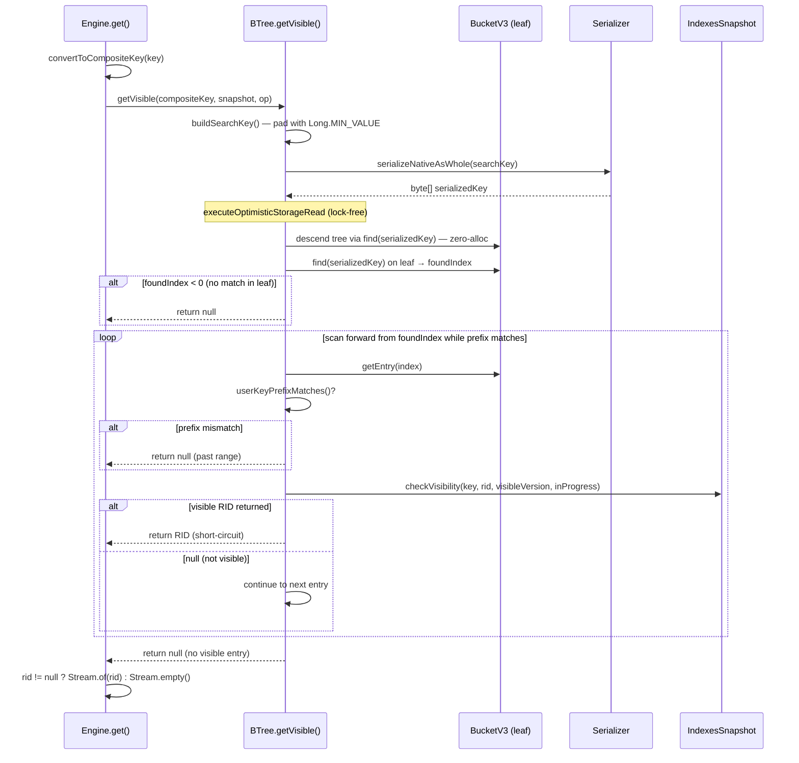
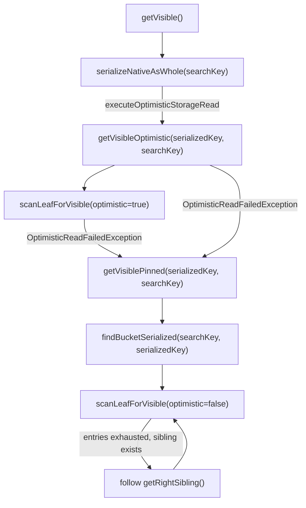

# Optimize BTreeSingleValueIndexEngine.get() — Final Design

## Overview

Replaced the `BTreeSingleValueIndexEngine.get(key)` stream pipeline
(`iterateEntriesBetween` + `visibilityFilter` + `map`) with a direct leaf-page
lookup via `BTree.getVisible()`. The optimization eliminates ~14 allocations per
call and removes shared-lock acquisition on the hot path, restoring the pre-SI
`get()` cost profile with lock-free optimistic reads.

Additionally, `IndexMultiValuKeySerializer` gained zero-deserialization
`compareInByteBuffer()` overrides, enabling `getVisible()` to use the
`find(byte[])` binary search path with field-by-field in-buffer comparison —
eliminating `CompositeKey` object allocation during every binary search step.

Key deviations from the original design:

- **Search key construction** (D3 adaptation): raw prefix key serialization
  fails because `IndexMultiValuKeySerializer` requires the full element count.
  Instead, `buildSearchKey()` pads with `Long.MIN_VALUE` as the version
  component, which eliminates the leftward scan entirely — `bucket.find()`
  returns the insertion point at the first matching entry directly.
- **Serialized binary search with zero-allocation comparison**: the initial
  implementation used `find(K key)` (object-based) because
  `IndexMultiValuKeySerializer` lacked a `compareInByteBuffer` override. Track 5
  added field-by-field zero-deserialization comparison, enabling `getVisible()` to
  use `find(byte[])` + `findBucketSerialized()`. This eliminates `CompositeKey`
  allocation on every binary search step (~7 steps per leaf page), while requiring
  one `serializeNativeAsWhole()` call per `getVisible()` invocation to produce the
  search key byte array. Profiling confirmed 98% reduction in deserialization
  allocations and 57% throughput improvement over the intermediate `find(K key)`
  approach.
- **Null key handling**: null keys use the same `getVisible()` path as non-null
  keys. `buildSearchKey()` only pads the version slot (always `LONG` type), so
  null user-key elements are unaffected. A partial-key guard in `getVisible()`
  rejects composite-index calls where the key has fewer user elements than
  expected (no "null key" concept for composite indexes).
- **Dead code removal**: `emitSnapshotVisibility()` was removed after
  `visibilityFilterMapped()` was refactored to delegate to `checkVisibility()`.
  `snapshotUserKeyMatches()` was extracted from `lookupSnapshotRid()` for clarity.

## Class Design

**BTree\<K\>** implements `getVisible()` with a two-path pattern: an optimistic
lock-free happy path (`getVisibleOptimistic`) and a pinned shared-lock fallback
(`getVisiblePinned`). Both receive a `byte[] serializedKey` for
`bucket.find(byte[], ...)` binary search and a `K searchKey` for
`scanLeafForVisible()`'s `userKeyPrefixMatches()` check. Helper methods
`buildSearchKey()` (pads user key with `Long.MIN_VALUE` version) and
`userKeyPrefixMatches()` (compares all elements except version) support the
scan logic.

**IndexMultiValuKeySerializer** provides zero-deserialization field-by-field
comparison via `compareInByteBuffer()` and `compareInByteBufferWithWALChanges()`.
The non-WAL path delegates to per-type serializer overrides for types where the
on-disk format matches (LONG, INTEGER, SHORT, STRING via UTF8Serializer, BINARY);
inlines comparison for FLOAT/DOUBLE (stored as int/long bits), BOOLEAN/BYTE, LINK
(compacted format), and DECIMAL (BigDecimal fallback). The WAL path inlines all
primitive reads via `walChanges` methods; falls back to deserialization for
STRING, LINK, BINARY, and DECIMAL.

**IndexesSnapshot** provides `checkVisibility()` as the single source of truth
for visibility decisions. Both `visibilityFilterMapped()` (stream path for range
scans) and `scanLeafForVisible()` (direct path for point lookups) delegate to
it. The `lookupSnapshotRid()` helper handles historical version lookup in the
snapshot index, with `snapshotUserKeyMatches()` guarding against cross-key
contamination from the non-atomic write order in `addSnapshotPair()`.

**BTreeSingleValueIndexEngine** simplifies `get()` to: convert key →
`sbTree.getVisible()` → `Stream.of(rid)` or `Stream.empty()`.

## Workflow

### Engine `get()` Flow

The flow eliminates: `SpliteratorForward`, `ArrayList` dataCache,
`ReferencePipeline`, `mapMulti` stage, `map` stage, lambda captures, shared-lock
acquisition, and the 2 enhanced `CompositeKey` allocations from
`enhanceFromKey`/`enhanceToKey`. The tree descent and leaf page read are
identical to the pre-SI `getOptimistic()` path. The `find(serializedKey)` call
uses `IndexMultiValuKeySerializer.compareInByteBuffer()` for field-by-field
in-buffer comparison without deserializing either side.

### Optimistic/Pinned Fallback

The optimistic path descends the tree and scans the leaf without acquiring locks.
If any page is evicted or modified concurrently (`OptimisticReadFailedException`),
the pinned path retries with a shared lock. The pinned path uses
`findBucketSerialized()` (with the pre-serialized key) and handles cross-page
entries via `getRightSibling()`, which the optimistic path cannot safely follow
(it throws `OptimisticReadFailedException` to trigger the fallback).

## Optimistic Read Scope for Leaf Scan

The pre-SI `getOptimistic()` reads a single entry and returns. The new
`getVisibleOptimistic()` scans multiple versioned entries within the leaf.

- **Single-page scan (common case):** All versions of a unique-index key fit on
  one leaf page. The optimistic scope covers tree descent + entire leaf scan,
  validated implicitly by successful return.
- **Cross-page scan (rare):** If the scan exhausts the leaf page without finding
  a visible entry, `scanLeafForVisible()` throws
  `OptimisticReadFailedException`, forcing fallback to the pinned path which
  follows `getRightSibling()` safely under shared lock.
- **IndexesSnapshot lookups** (`checkVisibility` → `lookupSnapshotRid` →
  `ConcurrentSkipListMap.lowerEntry()`) are pure in-memory operations outside
  the page scope — safe under either path.

## Visibility Logic — Single Source of Truth

`IndexesSnapshot.checkVisibility(CompositeKey key, RID rid, long visibleVersion,
LongOpenHashSet inProgressVersions)` returns `@Nullable RID`:

1. **In-progress check:** `inProgressVersions.contains(version)` →
   `TombstoneRID`/`SnapshotMarkerRID` delegates to `lookupSnapshotRid()`;
   plain `RecordId` returns null (pending insert, not yet visible).
2. **Committed check:** `version < visibleVersion` → `RecordId` returns as-is;
   `SnapshotMarkerRID` returns `rid.getIdentity()`; `TombstoneRID` returns null.
3. **Phantom check:** `version >= visibleVersion` with `RecordId` → null.
4. **Snapshot fallback:** `TombstoneRID`/`SnapshotMarkerRID` with
   `version >= visibleVersion` → `lookupSnapshotRid()`.

Both callers use it identically:
- `visibilityFilterMapped()`: calls per entry in `mapMulti`, emits non-null
  results via `downstream.accept()`
- `scanLeafForVisible()`: calls per entry in a plain loop, returns immediately
  on non-null (short-circuit)

## Search Key Construction

`buildSearchKey()` creates `CompositeKey(userKey..., Long.MIN_VALUE)` from the
user-facing prefix key. This approach replaced the original plan's raw prefix key
(D3 option 2) because `IndexMultiValuKeySerializer.serialize()` iterates up to
`types.length` elements — a shorter key causes `IndexOutOfBoundsException`.

`Long.MIN_VALUE` sorts before any real version number, so `bucket.find()` returns
the insertion point at or before the first versioned entry for the given user key.
This eliminates the leftward scan from the original design — the forward scan
starts at exactly the right position.

## Zero-Deserialization Binary Search

`IndexMultiValuKeySerializer.compareInByteBuffer()` compares two serialized
`CompositeKey` entries field-by-field directly in the page buffer and search key
byte array, without creating Java objects.

**Serialization layout** (both page buffer and search byte[]):
`[totalSize:4][keysCount:4]` then per field `[typeId:1][fieldData...]`.
Null fields have negative typeId `-(typeId+1)` and no field data.

**Per-field comparison strategy** — delegation where safe, inline where required:
- **Delegated** (on-disk format matches serializer with zero-alloc override):
  LONG/DATE/DATETIME → `LongSerializer`, INTEGER → `IntegerSerializer`,
  SHORT → `ShortSerializer`, STRING → `UTF8Serializer` (not `StringSerializer`),
  BINARY → `BinaryTypeSerializer`
- **Inlined** (format differs from factory serializers or needs special semantics):
  FLOAT → `Float.compare(intBitsToFloat(...))`, DOUBLE →
  `Double.compare(longBitsToDouble(...))`, BOOLEAN/BYTE → `Byte.compare`,
  LINK → inline clusterId + compacted position reconstruction,
  DECIMAL → BigDecimal deserialization fallback

**WAL-aware variant** (`compareInByteBufferWithWALChanges`): inlines all
primitive reads via `walChanges.getLongValue/getIntValue/getShortValue/
getByteValue`; falls back to deserialization for STRING, LINK, BINARY, DECIMAL
(rare path — WAL overlays are transient).

**Key design constraint:** delegation to per-type serializers must use direct
references (`UTF8Serializer.INSTANCE`, `BinaryTypeSerializer.INSTANCE`), NOT
`serializerFactory.getObjectSerializer()`. The factory returns different
serializers than what `IndexMultiValuKeySerializer` uses for serialization (e.g.,
factory → `StringSerializer` vs actual → `UTF8Serializer`, factory →
`LinkSerializer` vs actual → `CompactedLinkSerializer`). FLOAT/DOUBLE are stored
as raw int/long bits — delegating to `IntegerSerializer`/`LongSerializer` would
give wrong ordering for negative values.

## Null Key Handling

Null keys (`CompositeKey(null, version)`) are handled uniformly by
`getVisible()`. `buildSearchKey()` pads only the version slot (always `LONG`
type), so null user-key elements pass through preprocessing and serialization
unchanged. The `userKeyPrefixMatches()` check correctly matches null elements
via `DefaultComparator`.

For composite indexes (multi-field keys), a partial-key guard at the top of
`getVisible()` returns null immediately if the key has fewer user elements than
`keySize - 1`. This prevents `CompositeKey(null)` from being misinterpreted as
a valid single-null-field lookup in a multi-field index.
