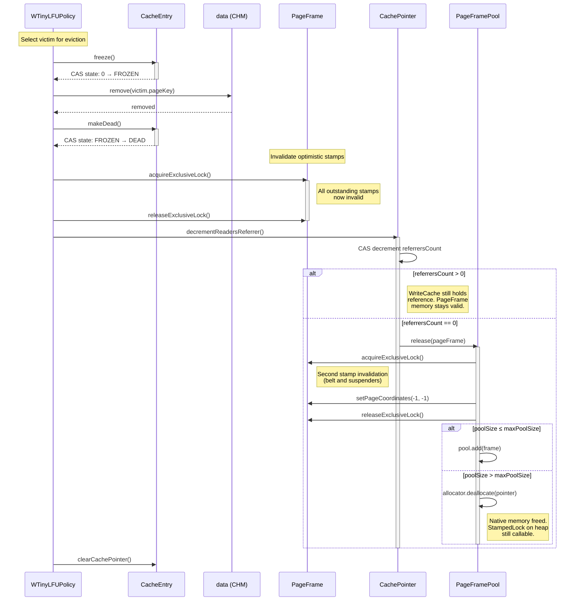
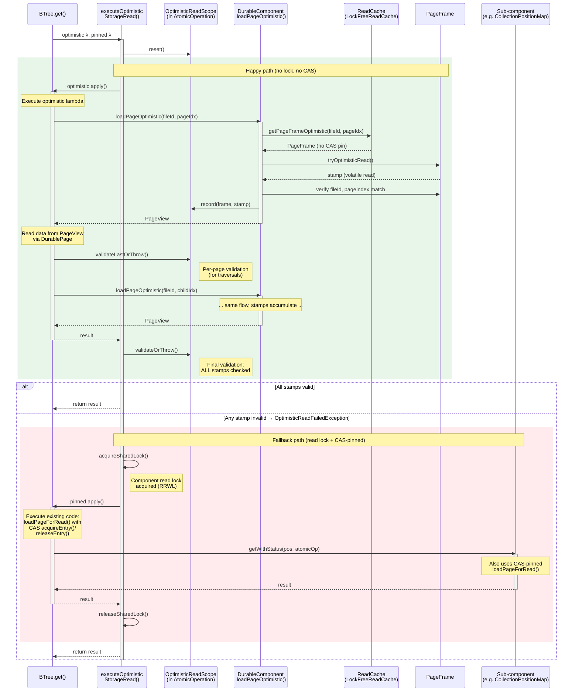

# Pinless Disk Cache Reads: Implementation Plan

## Problem Statement

Every DurableComponent read operation (B-tree lookups, collection reads, free-space map
queries, etc.) performs two **CAS (Compare-And-Swap) operations** per page access:

1. **Pin**: `CacheEntry.acquireEntry()` — CAS increment of the entry state field
2. **Unpin**: `CacheEntry.releaseEntry()` — CAS decrement of the entry state field

Additionally, `CachePointer` maintains a packed 64-bit readers/writers counter
(`readersWritersReferrer`) with its own CAS loop on every
`incrementReadersReferrer()` / `decrementReadersReferrer()` call.

For a B-tree lookup traversing 3–4 levels, this means **6–8 CAS operations** just for
page lifecycle management. Under contention (hot pages accessed by many threads), these
CAS loops spin, creating memory barrier overhead and cache-line bouncing. Since
DurableComponent read operations are the hottest path in the database, even small
per-page overheads compound into measurable throughput loss.

**Goal:** Eliminate CAS-based reference counting on the read path entirely, replacing it
with a StampedLock-based optimistic read protocol that uses only volatile reads (no CAS)
for page access validation.

## Design Principles

1. **No CAS on the read hot path** — optimistic reads use only volatile reads
   (`tryOptimisticRead()` and `validate()`), never CAS.
2. **No use-after-free** — PageFrame pooling guarantees native memory is always mapped.
   Speculative reads may hit stale data, but never unmapped memory.
3. **Graceful fallback** — if optimistic validation fails (page evicted, modified, or
   writer active), fall back to the existing CAS-pinned path. Never worse than today.
4. **General mechanism** — DurableComponent subclasses use a framework-provided
   `OptimisticReadScope` (stored in `AtomicOperation`) to track page stamps automatically.
   No manual stamp management per component, no ThreadLocal.
5. **Coexistence** — optimistic and pinned paths coexist. Write operations and
   cache-miss loads continue using the existing CAS-based pinning.
6. **AtomicOperation is always non-null** — all public DurableComponent read entry points
   receive `@Nonnull AtomicOperation`. The legacy null checks in `DurableComponent`
   (`loadPageForRead`, `releasePageFromRead`, `getFilledUpTo`, `openFile`, `isFileExists`)
   are dead code and will be removed as a prerequisite cleanup.

## Approach: PageFrame Pool + Optimistic Read + Multi-Page Validation

Inspired by **LeanStore** (TU Munich) optimistic latching and the zero-copy entity ADR.

### Core Idea

Replace `ByteBufferPool` with `PageFramePool` where each `PageFrame` wraps a `Pointer`
(direct memory) plus a `StampedLock`. Frames are pooled and never deallocated during
normal operation (protective memory allocation), so any Java reference to a PageFrame
always points to valid mapped memory.

For read operations, DurableComponents perform an optimistic cache lookup: get the
`PageFrame` reference from the cache entry without CAS-based pinning, take an optimistic
stamp via `StampedLock.tryOptimisticRead()`, read data from the page buffer, then
validate the stamp. Page eviction acquires the exclusive lock on the PageFrame, which
invalidates all outstanding stamps.

For multi-page operations (B-tree traversals, multi-chunk record reads), an
`OptimisticReadScope` accumulates all `(PageFrame, stamp)` pairs. Validation happens
both per-page during traversals (to catch stale pointers early and limit wasted work)
and at the end of the operation (to ensure the entire set of pages forms a consistent
snapshot).

### Key Invariants

1. **PageFrame pool never deallocates frames during normal operation.** Frames are
   recycled, not freed. Any speculative read from a stale PageFrame hits valid mapped
   memory. This is the safety guarantee against segfaults.

2. **Eviction acquires the exclusive lock on PageFrame** before decrementing the
   ReadCache's referrer. This bumps the StampedLock state, invalidating all outstanding
   optimistic stamps. Note: ReadCache and WriteCache share the same CachePointer and
   PageFrame. Eviction only drops the ReadCache's referrer — the WriteCache may still
   hold the frame. The PageFrame goes to the pool only when all referrers release
   (`referrersCount` → 0), at which point `PageFramePool.release()` acquires the
   exclusive lock again as a safety barrier.

3. **Reuse from pool acquires the exclusive lock on PageFrame** (when assigning the frame
   to a new page). This provides an additional invalidation barrier.

4. **PageFrame stores page coordinates** (`fileId`, `pageIndex`). After taking an
   optimistic stamp, readers verify coordinates match the expected page. This detects
   frame reuse for a different page between the cache lookup and the stamp acquisition.

5. **Optimistic readers never block eviction.** Since no CAS-based state increment
   happens, `CacheEntry.freeze()` succeeds immediately when no CAS-pinned readers exist.
   This improves eviction responsiveness compared to today.

6. **Write operations continue using exclusive locks.** The StampedLock's exclusive mode
   replaces the existing `ReentrantReadWriteLock` on `CachePointer`, providing both
   write exclusion and optimistic read stamp invalidation in a single mechanism.

## Architecture Overview

```
                        PageFramePool
                  ┌──────────────────────┐
                  │ ConcurrentLinkedQueue │
                  │   [PageFrame]         │── recycled on eviction
                  └──────────────────────┘
                            │
                            ▼ acquire / release
                  ┌──────────────────────┐
                  │     PageFrame         │
                  │  ┌────────────────┐   │
                  │  │ Pointer        │   │ ← direct memory (native address + ByteBuffer)
                  │  │ StampedLock    │   │ ← optimistic read / exclusive write
                  │  │ fileId         │   │ ← page identity for reuse detection
                  │  │ pageIndex      │   │
                  │  └────────────────┘   │
                  └──────────────────────┘
                       ▲            ▲
                       │            │
                CachePointer    DurableComponent
                (shared by       (optimistic read)
                 both caches)
                  ▲         ▲
                  │         │
          ┌─────────┐  ┌──────────┐
          │ReadCache │  │WriteCache│   ReadCache and WriteCache share
          │CacheEntry│  │(WOWCache)│   the SAME CachePointer/PageFrame
          └─────────┘  └──────────┘   for a given page. Referrer count
                                      tracks both. Frame goes to pool
                                      only when ALL referrers release.

OptimisticReadScope (stored in AtomicOperation):
  ┌───────────────────────────────┐
  │ PageFrame[] frames            │ ← accumulated page references
  │ long[]      stamps            │ ← stamps from tryOptimisticRead()
  │ int         count             │
  │                               │
  │ record(frame, stamp)          │ ← called by loadPageOptimistic()
  │ validateOrThrow()             │ ← called by executeOptimisticStorageRead()
  │ reset()                       │ ← called by executeOptimisticStorageRead()
  └───────────────────────────────┘

executeOptimisticStorageRead(atomicOperation, optimistic, pinned):
  1. scope = atomicOperation.getOptimisticReadScope()
  2. scope.reset()
  3. try:
       result = optimistic.apply()    ← may span multiple DurableComponents
       scope.validateOrThrow()
       return result
  4. catch OptimisticReadFailedException:
       acquireSharedLock()             ← component read lock (fallback)
       return pinned.apply()           ← existing CAS-pinned path
       releaseSharedLock()

Inside optimistic lambda — for each page:
  a. Look up CacheEntry in CHM (no CAS pin)
  b. Get PageFrame from CacheEntry → CachePointer
  c. stamp = pageFrame.tryOptimisticRead()
  d. Verify pageFrame.fileId == expected && pageFrame.pageIndex == expected
  e. scope.record(pageFrame, stamp)
  f. Read data from pageFrame.getBuffer() via DurablePage
  g. (traversals) scope.validateLastOrThrow() before following pointers

Pinned read path (fallback, unchanged):
  1. loadPageForRead() → CAS acquireEntry()
  2. Read data
  3. releasePageFromRead() → CAS releaseEntry()
```

### Shared CachePointer Lifecycle (ReadCache + WriteCache)

ReadCache and WriteCache **share the same `CachePointer`** (and thus the same
`PageFrame`) for a given page. When `WOWCache.load()` returns a `CachePointer` to
`LockFreeReadCache`, both caches hold referrer counts on the same object:

```
WOWCache.writeCachePages[page] ─────→ CachePointer (referrersCount=1, writers=1)
                                           │
LockFreeReadCache.doLoad()                 │
  → writeCache.load()                      │
  → pointer.incrementReadersReferrer()     │
  → referrersCount=2, readers=1, writers=1 │
  → new CacheEntryImpl(..., pointer, insideCache=true)
                                           │
LockFreeReadCache.releaseFromRead():       │
  → cacheEntry.releaseEntry()  // decrement entry use count only
  → if (insideCache): do NOT decrement pointer referrer!
  → referrersCount still = 2
```

**Key distinction based on `insideCache` flag:**

| `insideCache` | Created by | `releaseFromRead()` behavior | Pointer released by |
|---|---|---|---|
| `true` | `doLoad()` (normal path) | Only decrements entry state; does NOT touch pointer referrer | WTinyLFUPolicy eviction |
| `false` | `silentLoadForRead()` | Decrements pointer referrer immediately | `releaseFromRead()` itself |

For `insideCache = true` entries, the ReadCache's referrer on the CachePointer is
decremented **only during eviction** in `WTinyLFUPolicy`, not during normal
`releaseFromRead()`. This means the PageFrame stays referenced by the CachePointer
as long as at least one cache (ReadCache or WriteCache) holds it. The PageFrame is
returned to the pool only when `referrersCount` reaches 0 — i.e., both caches have
released their references.

### Eviction Flow (Updated)

```
1. WTinyLFUPolicy selects victim CacheEntry
2. victim.freeze() → CAS state: 0 → FROZEN
   (succeeds immediately — no optimistic readers to block)
3. data.remove(victim) → removes from ConcurrentHashMap
4. victim.makeDead() → CAS state: FROZEN → DEAD
5. *** NEW: pageFrame.acquireExclusiveLock() → invalidates all outstanding stamps ***
6. *** NEW: pageFrame.releaseExclusiveLock() ***
7. pointer.decrementReadersReferrer()
   → decrements referrersCount
   → if referrersCount > 0: WriteCache still holds reference, PageFrame stays valid
   → if referrersCount == 0: PageFramePool.release(pageFrame)
      (acquires exclusive lock again before pooling — belt and suspenders)
8. victim.clearCachePointer()

Any DurableComponent holding old stamp → validate() returns false → retry/fallback
```

**Why this is safe for optimistic readers:**
- Steps 5–6 invalidate all outstanding stamps before the ReadCache drops its reference.
- If WriteCache still holds the page (referrersCount > 0), the PageFrame memory stays
  valid. But the stamp is already invalidated, so optimistic readers will retry —
  they can no longer find the page in ReadCache's CHM anyway (removed in step 3).
- If referrersCount reaches 0, `PageFramePool.release()` acquires exclusive lock again
  before pooling, providing a second invalidation barrier for any edge-case reader.
- When WriteCache later modifies the page, the exclusive lock for the write naturally
  invalidates any remaining stamps (though none should exist after step 5).

### PageFrame Release in `CachePointer.decrementReferrer()`

The existing release path changes from `bufferPool.release(pointer)` to
`framePool.release(pageFrame)`:

```java
public void decrementReferrer() {
  final var rf = REFERRERS_COUNT_UPDATER.decrementAndGet(this);
  if (rf == 0 && pageFrame != null) {
    framePool.release(pageFrame); // Acquires exclusive lock, then returns to pool
  }
}
```

`PageFramePool.release()` acquires the exclusive lock on the PageFrame before pooling,
which invalidates any stamps held by readers who somehow still reference the frame.
The frame's native memory is either recycled in the pool or deallocated if the pool
is full (see Phase 0 `PageFramePool` design for deallocation safety).



### Optimistic Read Flow (Multi-Page B-tree Traversal Example)

```
BTree.get(key, atomicOperation):
  executeOptimisticStorageRead(atomicOperation,
    optimistic = () -> {
      // scope.reset() + scope.validateOrThrow() handled by executeOptimisticStorageRead()
      var scope = atomicOperation.getOptimisticReadScope()
      var pageIndex = ROOT_INDEX
      while true:
        pageView = loadPageOptimistic(atomicOperation, fileId, pageIndex)
        bucket = new CellBTreeSingleValueBucketV3(pageView)

        if bucket.isLeaf():
          return bucket.getValue(searchIndex, ...)

        childIndex = binarySearch(bucket, key)
        pageIndex = bucket.getChild(childIndex)

        // Per-page validation: catch stale pointers before following them
        scope.validateLastOrThrow()
    },
    pinned = () -> doGetPinned(key, atomicOperation)
  )
```



## Implementation Phases

---

### Phase 0: PageFrame Abstraction + PageFramePool

**Goal:** Introduce `PageFrame` wrapping `Pointer` + `StampedLock` + page coordinates.
Replace `ByteBufferPool` with `PageFramePool`.

**New class: `PageFrame`**

```java
/// A pooled page-sized direct memory frame with an associated StampedLock.
/// Frames are recycled (never deallocated during normal operation), guaranteeing
/// that any reference to a PageFrame always points to valid mapped memory.
public final class PageFrame {

  private final Pointer pointer;
  private final StampedLock stampedLock;

  // Page identity — set under exclusive lock when frame is assigned to a page.
  // Read under optimistic stamp to detect frame reuse.
  private long fileId;
  private int pageIndex;

  PageFrame(Pointer pointer) {
    this.pointer = pointer;
    this.stampedLock = new StampedLock();
    this.fileId = -1;
    this.pageIndex = -1;
  }

  // --- Optimistic Read API (no CAS) ---

  public long tryOptimisticRead() {
    return stampedLock.tryOptimisticRead();
  }

  public boolean validate(long stamp) {
    return stampedLock.validate(stamp);
  }

  // --- Exclusive Lock API (for writes and eviction) ---

  public long acquireExclusiveLock() {
    return stampedLock.writeLock();
  }

  public void releaseExclusiveLock(long stamp) {
    stampedLock.unlockWrite(stamp);
  }

  // --- Shared Lock API (for CAS-pinned reads that need blocking guarantees) ---

  public long acquireSharedLock() {
    return stampedLock.readLock();
  }

  public void releaseSharedLock(long stamp) {
    stampedLock.unlockRead(stamp);
  }

  // --- Page identity ---

  public void setPageCoordinates(long fileId, int pageIndex) {
    // Called under exclusive lock
    this.fileId = fileId;
    this.pageIndex = pageIndex;
  }

  public long getFileId() { return fileId; }
  public int getPageIndex() { return pageIndex; }

  // --- Memory access ---

  public ByteBuffer getBuffer() {
    return pointer.getNativeByteBuffer();
  }

  public Pointer getPointer() {
    return pointer;
  }

  public void clear() {
    pointer.clear();
  }
}
```

**New class: `PageFramePool`** (replaces `ByteBufferPool`)

```java
/// Pool of PageFrame objects. Frames are recycled, not deallocated.
/// Protective memory allocation: native memory stays mapped even when frames are pooled.
/// When pool capacity is exceeded, excess frames MAY be deallocated, but only after
/// acquiring the exclusive lock (invalidating stamps) — see safety note below.
public final class PageFramePool {

  private final ConcurrentLinkedQueue<PageFrame> pool;
  private final AtomicInteger poolSize;
  private final int maxPoolSize;
  private final int pageSize;
  private final DirectMemoryAllocator allocator;

  public PageFrame acquire(boolean clear) {
    PageFrame frame = pool.poll();
    if (frame != null) {
      poolSize.decrementAndGet();
      // Acquire+release exclusive lock to invalidate any stale stamps
      // and establish happens-before with previous users of this frame
      long stamp = frame.acquireExclusiveLock();
      if (clear) frame.clear();
      frame.releaseExclusiveLock(stamp);
      return frame;
    }
    // Allocate new frame
    Pointer ptr = allocator.allocate(pageSize, clear, Intention.ADD_NEW_PAGE);
    return new PageFrame(ptr);
  }

  public void release(PageFrame frame) {
    // Acquire+release exclusive lock BEFORE pooling — invalidates all outstanding stamps.
    // This is the critical safety barrier: any optimistic reader holding a stamp from
    // before this point will see validate() return false.
    long stamp = frame.acquireExclusiveLock();
    frame.setPageCoordinates(-1, -1); // Clear identity
    frame.releaseExclusiveLock(stamp);

    if (poolSize.incrementAndGet() > maxPoolSize) {
      poolSize.decrementAndGet();
      // Deallocate — exclusive lock above already invalidated all stamps.
      // StampedLock itself lives on the Java heap, so validate() is always
      // safe to call regardless of native memory state.
      allocator.deallocate(frame.getPointer());
    } else {
      pool.add(frame);
    }
  }
}
```

**Deallocate safety note:** When pool capacity is exceeded and a frame IS deallocated:
- The exclusive lock was acquired before deallocation → all stamps are invalidated.
- `validate(stamp)` is called BEFORE any read from the buffer → returns false → fallback.
- The StampedLock lives on the Java heap (in the PageFrame object), so `validate()` is
  always safe to call regardless of native memory state.
- **Critical ordering**: readers MUST call `validate()` before ANY read from the buffer
  after taking the stamp. The StampedLock's acquire fence ensures the stamp check is
  visible before any subsequent memory access.

**Migration from ByteBufferPool:**
- `ByteBufferPool` currently pools `Pointer` objects directly.
- Replace internal pool with `PageFramePool`.
- Keep `ByteBufferPool` as a thin facade delegating to `PageFramePool` during migration,
  or replace entirely.
- All callers of `acquireDirect()` receive a `PageFrame` instead of a `Pointer`.

**Files to create:**
- `core/.../internal/common/directmemory/PageFrame.java`
- `core/.../internal/common/directmemory/PageFramePool.java`

**Files to modify:**
- `ByteBufferPool.java` — delegate to `PageFramePool` or replace
- `Pointer.java` — no changes needed

**Files to update (callers of ByteBufferPool):**
- `CachePointer.java` — hold `PageFrame` instead of `Pointer` + `ByteBufferPool`
- `WOWCache.java` — page loading/creation
- `LockFreeReadCache.java` — page creation in `addNewPagePointerToTheCache()`
- `MemoryFile.java` — in-memory page creation

---

### Phase 1: CachePointer Refactoring — Delegate Lock to PageFrame

**Goal:** Remove `ReentrantReadWriteLock` and `version` field from `CachePointer`.
Delegate all locking to the underlying `PageFrame`. This unifies the locking mechanism
and enables optimistic reads.

**Changes to `CachePointer`:**

```java
public final class CachePointer {
  // REMOVED:
  // private final ReentrantReadWriteLock readWriteLock;
  // private long version;
  // private final Pointer pointer;
  // private final ByteBufferPool bufferPool;

  // NEW:
  private final PageFrame pageFrame;
  private final PageFramePool framePool;

  // Reference counting fields remain unchanged (needed for
  // CAS-pinned path and WritersListener coordination):
  // private volatile int referrersCount;
  // private volatile long readersWritersReferrer;

  public CachePointer(PageFrame pageFrame, PageFramePool framePool,
                       long fileId, int pageIndex) {
    this.pageFrame = pageFrame;
    this.framePool = framePool;
    this.fileId = fileId;
    this.pageIndex = pageIndex;
  }

  // Lock delegation — signature changes: returns/takes long stamp

  public long acquireExclusiveLock() {
    return pageFrame.acquireExclusiveLock();
  }

  public void releaseExclusiveLock(long stamp) {
    pageFrame.releaseExclusiveLock(stamp);
  }

  public long acquireSharedLock() {
    return pageFrame.acquireSharedLock();
  }

  public void releaseSharedLock(long stamp) {
    pageFrame.releaseSharedLock(stamp);
  }

  // NEW: Optimistic read delegation
  public long tryOptimisticRead() {
    return pageFrame.tryOptimisticRead();
  }

  public boolean validate(long stamp) {
    return pageFrame.validate(stamp);
  }

  // Buffer access:
  public ByteBuffer getBuffer() {
    return pageFrame.getBuffer();
  }

  public PageFrame getPageFrame() {
    return pageFrame;
  }

  // Reference counting — updated release path:
  public void decrementReferrer() {
    final var rf = REFERRERS_COUNT_UPDATER.decrementAndGet(this);
    if (rf == 0 && pageFrame != null) {
      framePool.release(pageFrame); // Returns to pool (exclusive lock invalidates stamps)
    }
  }

  // readersWritersReferrer, WritersListener — unchanged
}
```

**Signature change propagation:** `acquireExclusiveLock()` now returns `long` (stamp),
`releaseExclusiveLock(stamp)` takes a `long`. This propagates through the following
interfaces and classes:

- `CacheEntry.java` — interface signature change
- `CacheEntryImpl.java` — delegation update
- `DurablePage.java` — write operations that use exclusive lock
- `AtomicOperation.java` / `AtomicOperationBinaryTracking.java` — page lock forwarding
- `DiskStorage.java` — all `acquireSharedLock` / `releaseSharedLock` call sites
- `LockFreeReadCache.java` — `loadForWrite()` / `releaseFromWrite()`

**Eviction path update** (`WTinyLFUPolicy`):

Add exclusive lock acquisition before decrementing the referrer. Note that
`decrementReadersReferrer()` decrements the shared CachePointer's referrer count,
but does NOT necessarily release the PageFrame to pool — WriteCache may still hold
a reference. The exclusive lock here is specifically to invalidate optimistic stamps:

```java
// In eviction (purgeEden / onRemove):
final var cachePointer = victim.getCachePointer();
// NEW: invalidate optimistic stamps before dropping ReadCache's reference
long stamp = cachePointer.acquireExclusiveLock();
cachePointer.releaseExclusiveLock(stamp);
// Existing: decrement referrer count (frame goes to pool only if count → 0)
cachePointer.decrementReadersReferrer();
victim.clearCachePointer();
```

**WOWCache `version` → StampedLock stamp migration:**

The `CachePointer.version` field (incremented on every `acquireExclusiveLock()`) is
used exclusively by WOWCache for a **copy-then-verify** flush protocol:

1. **Copy phase** (3 call sites: lines 2900, 3354, 3504): acquire shared lock on
   CachePointer, read `version = pointer.getVersion()`, copy page buffer to a separate
   direct memory allocation, release shared lock. Store `(version, copy, pointer)` in
   `WritePageContainer`.

2. **Write phase**: write the copy to disk (no lock held).

3. **Remove phase** (`removeWrittenPagesFromCache()`, line 3092): acquire shared lock,
   check `version == pointer.getVersion()`. If versions match → page wasn't modified
   since copy → safe to remove from write cache. If versions differ → page was modified
   after copy → skip removal (will be flushed again in next cycle).

With PageFrame's StampedLock, the version field is replaced by the stamp:

```java
// Copy phase (under shared lock → stamp):
long stamp = pageFrame.acquireSharedLock();
try {
  copy.put(0, buffer, 0, buffer.capacity());
  fullLogLSN = pointer.getEndLSN();
} finally {
  pageFrame.releaseSharedLock(stamp);
}
// Store stamp instead of version:
chunk.add(new WritePageContainer(stamp, copy, directPointer, pointer));

// Remove phase:
if (pageFrame.validate(chunkPage.pageStamp)) {
  // Page not modified since copy → safe to remove from write cache
  writeCachePages.remove(pageKey);
  // ...
}
```

The stamp captures the StampedLock state at copy time. Any subsequent exclusive lock
acquisition (by a write operation modifying the page) invalidates the stamp. The
`validate()` check in the remove phase detects this — identical semantics to the
current version comparison, but without the separate counter field.

`WritePageContainer` changes: `long pageVersion` → `long pageStamp`.

**Reentrancy audit:** `StampedLock` is NOT reentrant. Must audit all code paths for
nested lock acquisition on the same `CachePointer`/`PageFrame`. The
`SharedResourceAbstract` StampedLock migration (completed earlier in the codebase) used
thread-owner tracking — determine if similar is needed here. Known nested-lock-risk
areas:
- `DiskStorage` methods that hold component-level shared lock while accessing page locks
- `AtomicOperationBinaryTracking` page caching that may reload pages
- B-tree split operations with parent + child locks

**Note:** This phase has a large blast radius due to lock signature changes. Should be a
standalone PR with comprehensive test coverage.

**Files to modify:**
- `CachePointer.java` — replace RRWL + Pointer with PageFrame delegation
- `CacheEntry.java` — interface signature change
- `CacheEntryImpl.java` — delegation
- `WTinyLFUPolicy.java` — eviction stamp invalidation
- `LockFreeReadCache.java` — load/release methods
- `WOWCache.java` — page loading/creation
- `DurablePage.java` — lock stamp threading
- `AtomicOperation.java` / `AtomicOperationBinaryTracking.java`
- `DiskStorage.java` — all lock call sites
- `MemoryFile.java`
- All `DurablePage` subclasses that call lock methods

---

### Phase 2: Optimistic Read Infrastructure

**Goal:** Add the optimistic (pinless) read path alongside the existing CAS-pinned path.
Introduce `OptimisticReadScope` for multi-page stamp tracking and validation.

#### 2a: `OptimisticReadScope` — Multi-Page Read Set

Since `AtomicOperation` is always non-null on every DurableComponent read path
(verified: all public entry points have `@Nonnull AtomicOperation`), the scope is
stored as a field on `AtomicOperation`. No ThreadLocal needed — the `AtomicOperation`
already flows through the entire call chain.

The scope is scoped at the level of a **storage operation** — the same boundary
currently defined by `executeStorageRead()` / `calculateStorageWrite()`.
A storage operation is a single structural logical unit that may call into multiple
DurableComponents. For example, `PaginatedCollectionV2.readRecord()` (the storage
operation) calls `collectionPositionMap.getWithStatus()` (a sub-component), then loads
collection pages. All page reads across these sub-component calls share the same
scope and are validated together at the end.

Sub-components like `CollectionPositionMapV2.getWithStatus()` do NOT have their own
`executeReadOperation` wrappers — they are plain methods called from within the outer
storage operation. In the new design, they simply call `loadPageOptimistic()`
directly, adding stamps to the scope owned by the outer `executeOptimisticStorageRead()` call.
**No nesting mechanism is needed.**

```java
/// Tracks all PageFrame stamps accumulated during a storage operation.
/// Stored as a field in AtomicOperation. Reset at the start of each
/// executeOptimisticStorageRead() call. Stamps accumulate across all loadPageOptimistic()
/// calls within the operation, including calls to sub-component methods.
public final class OptimisticReadScope {

  private PageFrame[] frames;
  private long[] stamps;
  private int count;

  public OptimisticReadScope() {
    frames = new PageFrame[8];  // Initial capacity — covers most B-tree depths
    stamps = new long[8];
  }

  /// Records a page read. Called by loadPageOptimistic().
  void record(PageFrame frame, long stamp) {
    if (count == frames.length) grow();
    frames[count] = frame;
    stamps[count] = stamp;
    count++;
  }

  /// Validates all accumulated stamps. Throws OptimisticReadFailedException
  /// if ANY page was evicted or modified since it was read.
  void validateOrThrow() {
    for (int i = 0; i < count; i++) {
      if (!frames[i].validate(stamps[i])) {
        throw OptimisticReadFailedException.INSTANCE;
      }
    }
  }

  /// Validates only the last recorded stamp. Useful for per-level
  /// validation in tree traversals to abort early and limit wasted work.
  void validateLastOrThrow() {
    if (count > 0 && !frames[count - 1].validate(stamps[count - 1])) {
      throw OptimisticReadFailedException.INSTANCE;
    }
  }

  void reset() {
    for (int i = 0; i < count; i++) frames[i] = null;
    count = 0;
  }

  private void grow() {
    int newLen = frames.length * 2;
    frames = Arrays.copyOf(frames, newLen);
    stamps = Arrays.copyOf(stamps, newLen);
  }
}
```

**AtomicOperation integration:**

```java
// In AtomicOperation interface:
OptimisticReadScope getOptimisticReadScope();

// In AtomicOperationBinaryTracking:
private final OptimisticReadScope optimisticReadScope = new OptimisticReadScope();

@Override
public OptimisticReadScope getOptimisticReadScope() {
  return optimisticReadScope;
}
```

#### 2b: `OptimisticReadFailedException`

```java
/// Thrown when an optimistic read cannot proceed: cache miss, writer active,
/// or page frame reused for a different page. Caught by `executeOptimisticStorageRead()` fallback.
/// Singleton instance to avoid allocation.
public final class OptimisticReadFailedException extends RuntimeException {
  public static final OptimisticReadFailedException INSTANCE =
      new OptimisticReadFailedException();

  private OptimisticReadFailedException() {
    super(null, null, true, false); // No stack trace
  }
}
```

#### 2c: Optimistic Lookup in `LockFreeReadCache`

Add a new method that performs a cache lookup without CAS-based pinning:

```java
/// Returns the PageFrame for the given page if it is in the cache.
/// Does NOT pin the entry (no CAS acquireEntry). Returns null on cache miss.
/// The caller must use tryOptimisticRead() + validate() for safety.
public PageFrame getPageFrameOptimistic(long fileId, long pageIndex) {
  var pageKey = new PageKey(extractFileId(fileId), pageIndex);
  CacheEntry entry = data.get(pageKey);

  if (entry == null || !entry.isAlive()) {
    return null; // Cache miss or entry being evicted
  }

  CachePointer pointer = entry.getCachePointer();
  if (pointer == null) {
    return null; // Entry cleared during eviction
  }

  return pointer.getPageFrame();
}
```

**Note:** This method is inherently racy — the entry could be evicted between the CHM
lookup and the PageFrame access. This is intentional: the StampedLock stamp (taken
after this call) detects the race. The PageFrame reference keeps the Java object alive,
and pooling guarantees the native memory stays mapped.

**Frequency counting:** The existing `afterRead()` method records access frequency for
the W-TinyLFU admission policy. For optimistic reads that succeed, we should still
record the access. Add a lightweight `recordAccess()` method that updates the frequency
sketch without the full event buffer overhead:

```java
/// Records a read access for frequency counting without pinning.
/// Called after successful optimistic validation to maintain admission policy accuracy.
public void recordOptimisticAccess(long fileId, long pageIndex) {
  var pageKey = new PageKey(extractFileId(fileId), pageIndex);
  CacheEntry entry = data.get(pageKey);
  if (entry != null) {
    afterRead(entry);
  }
}
```

#### 2d: `PageView` — Lightweight Page Handle for Optimistic Reads

```java
/// Lightweight handle for optimistic page reads. Unlike CacheEntry, this does
/// not hold a pin on the cache entry. Data access goes through the ByteBuffer
/// directly. Used by DurablePage when constructed for optimistic reads.
///
/// Not Closeable — no resource to release.
public record PageView(
    ByteBuffer buffer,
    PageFrame pageFrame,
    long stamp
) {
  public boolean validateStamp() {
    return pageFrame.validate(stamp);
  }
}
```

#### 2e: `DurablePage` Constructor for Optimistic Reads + Defensive Allocation Guards

Add a second constructor that takes a `PageView` instead of `CacheEntry`, and add
**bounds-checked allocation methods** to prevent OOM from garbage data during
speculative reads.

**The problem:** During optimistic reads, the PageFrame may have been reused for a
different page between stamp acquisition and validation. Code that reads a "size"
field from the buffer and allocates based on it could see garbage values
(e.g., `getSize()` returns 2 billion) and attempt `new int[2_000_000_000]` or
`new byte[2_000_000_000]` — causing OOM **before** `validate()` is ever called.

**Affected allocation sites (audit):**

| Location | Allocation | Size driver |
|---|---|---|
| `DurablePage.getBinaryValue()` | `new byte[valLen]` | `valLen` param from page read |
| `DurablePage.getIntArray()` | `new int[size]` | `size` param from page read |
| `CellBTreeSingleValueBucketV3.getPointers()` | `getIntArray(offset, size)` | `getSize()` from page offset |
| `CollectionPage.getRecordBinaryValue()` | `getBinaryValue(offset, size)` | record size from page |
| `CollectionPage.doDefragmentation()` | `new int[recordsCount * 2 + 1]` × 2 | `getRecordsCount()` from page |
| `CollectionPositionMapV2` result builders | `new long[size]` / `new CollectionPositionEntry[size]` | `bucket.getSize()` from page |
| `StringSerializer.deserializeFromByteBufferObject()` | `new byte[2 * len]` | `buffer.getInt()` |
| `Bucket.java` (RidBag) | `getIntArray(offset, size)` | `getSize()` from page |

**Solution:** Add a `speculativeRead` flag to `DurablePage`. When set, all
size-driven allocation methods validate that the requested size is within page
bounds (`0 ≤ size ≤ MAX_PAGE_SIZE_BYTES`). Any out-of-bounds size throws
`OptimisticReadFailedException`, caught by `executeOptimisticStorageRead()` fallback.

```java
public class DurablePage {
  private final WALChanges changes;
  private final CacheEntry cacheEntry;
  private final ByteBuffer buffer;
  private final boolean speculativeRead; // NEW

  // Existing: for pinned reads and writes
  public DurablePage(final CacheEntry cacheEntry) {
    // ... unchanged ...
    this.speculativeRead = false;
  }

  // NEW: for optimistic reads — no CacheEntry, no WAL changes overlay
  public DurablePage(final PageView pageView) {
    this.cacheEntry = null;
    this.changes = null;
    this.buffer = pageView.buffer();
    this.speculativeRead = true;
  }

  // --- Guarded allocation methods ---

  protected final byte[] getBinaryValue(final int pageOffset, final int valLen) {
    if (speculativeRead) {
      guardSize(valLen);
    }
    if (changes == null) {
      assert buffer != null;
      final var result = new byte[valLen];
      buffer.get(pageOffset, result);
      return result;
    }
    return changes.getBinaryValue(buffer, pageOffset, valLen);
  }

  protected final int[] getIntArray(final int pageOffset, int size) {
    if (speculativeRead) {
      guardSize(size * (long) IntegerSerializer.INT_SIZE);
    }
    // ... existing code ...
  }

  /// Validates that a size-driven allocation is within page bounds.
  /// During speculative reads, any value exceeding the page size is
  /// garbage from a reused frame — abort and let `executeOptimisticStorageRead()` fall back to the read-lock path.
  private void guardSize(long sizeInBytes) {
    if (sizeInBytes < 0 || sizeInBytes > MAX_PAGE_SIZE_BYTES) {
      throw OptimisticReadFailedException.INSTANCE;
    }
  }
}
```

**Serializer guards:** For `BinarySerializer` implementations used in B-tree reads
(e.g., `StringSerializer`, `UTF8Serializer`), the deserialization methods read length
fields from the buffer and allocate. These need similar guards when called from the
optimistic path. Two approaches:

1. **Preferred: check at the caller level.** `getObjectSizeInDirectMemory()` in
   `DurablePage` already computes the serialized size. Guard it:

   ```java
   protected final int getObjectSizeInDirectMemory(
       final BinarySerializer<?> binarySerializer,
       BinarySerializerFactory serializerFactory,
       final int offset) {
     // ... existing code ...
     int size = binarySerializer.getObjectSizeInByteBuffer(serializerFactory, offset, buffer);
     if (speculativeRead) {
       guardSize(size);
     }
     return size;
   }
   ```

   Since B-tree bucket methods call `getObjectSizeInDirectMemory()` before
   `getBinaryValue()`, this catches garbage sizes before any allocation.

2. **Alternative: pass a size bound into serializer deserialization.** Similar to the
   `BytesContainer.maxBound` approach from the zero-copy ADR. More invasive but
   catches sizes computed internally by the serializer.

**DurablePage subclass `getSize()` guards:** Bucket classes read their entry count
from the page (e.g., `getIntValue(SIZE_OFFSET)`). This drives loop bounds and array
allocations (`getPointers()`, result builders). Guard these too:

```java
// In CellBTreeSingleValueBucketV3:
public int getSize() {
  int size = getIntValue(SIZE_OFFSET);
  if (speculativeRead && (size < 0 || size > maxEntriesPerPage())) {
    throw OptimisticReadFailedException.INSTANCE;
  }
  return size;
}
```

Where `maxEntriesPerPage()` is a static bound computed from page size and minimum
entry size. For B-tree buckets: `(MAX_PAGE_SIZE_BYTES - HEADER_SIZE) / MIN_ENTRY_SIZE`.

**General principle:** Every allocation whose size comes from the page buffer must be
guarded when `speculativeRead == true`. The `guardSize()` method provides a
centralized check in `DurablePage`. Subclass-specific `getSize()` / `getRecordsCount()`
methods should add tighter bounds based on the page layout.

Since all `getIntValue()`, `getLongValue()`, etc. already have a fast path for
`changes == null` (direct buffer access), the optimistic path uses the exact same
data reading code paths. The `speculativeRead` flag only adds allocation guards —
it does not change the read logic.

#### 2f: `DurableComponent` Optimistic Read Helpers

Add helpers in the base class so subclasses don't manage stamps manually.
The `AtomicOperation` is always non-null (all public read entry points are `@Nonnull`),
so we retrieve the `OptimisticReadScope` directly from it:

```java
public abstract class DurableComponent extends SharedResourceAbstract {

  /// Loads a page for optimistic reading. Records the stamp in the
  /// AtomicOperation's OptimisticReadScope. Throws OptimisticReadFailedException
  /// on cache miss, writer conflict, or frame reuse.
  ///
  /// Called by both the owning component and sub-component methods within
  /// the same storage operation. All stamps accumulate in the shared scope.
  protected PageView loadPageOptimistic(
      AtomicOperation atomicOperation, long fileId, long pageIndex) {
    PageFrame frame = readCache.getPageFrameOptimistic(fileId, pageIndex);
    if (frame == null) {
      throw OptimisticReadFailedException.INSTANCE;
    }

    long stamp = frame.tryOptimisticRead();
    if (stamp == 0) {
      throw OptimisticReadFailedException.INSTANCE;
    }

    if (frame.getFileId() != fileId || frame.getPageIndex() != pageIndex) {
      throw OptimisticReadFailedException.INSTANCE;
    }

    atomicOperation.getOptimisticReadScope().record(frame, stamp);

    return new PageView(frame.getBuffer(), frame, stamp);
  }

  /// Demarcates a storage operation with single-attempt optimistic read
  /// + read-lock fallback. Replaces executeStorageRead().
  ///
  /// This is called ONLY at the storage operation boundary — the same level
  /// where executeStorageRead() / calculateStorageWrite() are
  /// called today. Sub-component methods (e.g., collectionPositionMap.get())
  /// do NOT wrap in their own executeOptimisticStorageRead(); they just call
  /// loadPageOptimistic() directly, adding stamps to the shared scope.
  ///
  /// Happy path: executes the optimistic lambda without any lock or CAS.
  /// If any stamp is invalid (or cache miss / writer conflict), immediately
  /// falls back to the component's read lock + existing CAS-pinned path.
  /// No retry loop — one optimistic attempt, then deterministic fallback.
  ///
  /// @param atomicOperation  The atomic operation context (never null)
  /// @param optimistic       The operation using loadPageOptimistic() internally
  /// @param pinned           Fallback using loadPageForRead() (existing CAS path)
  /// @return                 The operation result
  protected <T> T executeOptimisticStorageRead(
      AtomicOperation atomicOperation,
      TxFunction<T> optimistic,
      TxFunction<T> pinned) {
    var scope = atomicOperation.getOptimisticReadScope();
    scope.reset();
    try {
      T result = optimistic.apply();
      scope.validateOrThrow();
      return result;
    } catch (OptimisticReadFailedException e) {
      // Slow path: acquire component read lock, use existing CAS-pinned reads.
      // The read lock provides:
      //   1. Happens-before edge for heap fields (fileId, keySerializer, etc.)
      //   2. Exclusion with structural operations (delete/truncate)
      //   3. Guaranteed page stability (no eviction races under lock)
      acquireSharedLock();
      try {
        return pinned.apply();
      } finally {
        releaseSharedLock();
      }
    }
  }

  /// Void variant for operations that don't return a value.
  protected void executeOptimisticStorageRead(
      AtomicOperation atomicOperation,
      TxConsumer optimistic,
      TxConsumer pinned) {
    var scope = atomicOperation.getOptimisticReadScope();
    scope.reset();
    try {
      optimistic.accept();
      scope.validateOrThrow();
    } catch (OptimisticReadFailedException e) {
      acquireSharedLock();
      try {
        pinned.accept();
      } finally {
        releaseSharedLock();
      }
    }
  }
}
```

**Example — `PaginatedCollectionV2.readRecord()`:**

```
readRecord(collectionPosition, atomicOperation):
  executeOptimisticStorageRead(atomicOperation,              ← storage operation boundary
    optimistic = () -> {
      // scope.reset() already called by executeOptimisticStorageRead()

      // 1. Sub-component: collectionPositionMap.getWithStatus()
      //    This is a plain method — no executeOptimisticStorageRead() wrapper.
      //    Internally calls loadPageOptimistic() → stamps added to shared scope.
      var entry = collectionPositionMap.getWithStatusOptimistic(
          collectionPosition, atomicOperation);

      // 2. Load collection data page — stamps added to same scope
      var pageView = loadPageOptimistic(atomicOperation, fileId, pageIndex);
      var page = new CollectionPage(pageView);
      // ... read record data ...

      // Return result. executeOptimisticStorageRead() calls scope.validateOrThrow()
      // after this lambda returns — validates ALL stamps together:
      // position map pages + collection data pages.
    },
    pinned = () -> doReadRecord(collectionPosition, atomicOperation)
  )
```

**Sub-component method pattern:** Sub-components like `CollectionPositionMapV2`
provide optimistic variants of their read methods that use `loadPageOptimistic()`
instead of `loadPageForRead()`. These are plain methods, not wrapped in
`executeOptimisticStorageRead()`:

```java
// CollectionPositionMapV2 — optimistic variant (no wrapper, no scope management):
@Nullable
CollectionPositionMapBucket.PositionEntry getOptimistic(
    long collectionPosition, AtomicOperation atomicOperation) throws IOException {
  var pageIndex = collectionPosition / CollectionPositionMapBucket.MAX_ENTRIES + 1;
  var index = (int) (collectionPosition % CollectionPositionMapBucket.MAX_ENTRIES);

  var lastPage = getLastPageOptimistic(atomicOperation);
  if (pageIndex > lastPage) return null;

  // loadPageOptimistic adds stamp to the outer scope
  var pageView = loadPageOptimistic(atomicOperation, fileId, pageIndex);
  var bucket = new CollectionPositionMapBucket(pageView);
  return bucket.getEntry(index);
}
```

**Files to create:**
- `core/.../internal/core/storage/cache/OptimisticReadScope.java`
- `core/.../internal/core/storage/cache/OptimisticReadFailedException.java`
- `core/.../internal/core/storage/cache/PageView.java`

**Files to modify:**
- `AtomicOperation.java` — add `getOptimisticReadScope()` method
- `AtomicOperationBinaryTracking.java` — add `OptimisticReadScope` field + getter
- `LockFreeReadCache.java` — add `getPageFrameOptimistic()`, `recordOptimisticAccess()`
- `ReadCache.java` — interface additions
- `DurablePage.java` — add `PageView` constructor
- `DurableComponent.java` — add `loadPageOptimistic()`, `executeOptimisticStorageRead()`

---

### Phase 3: Migrate DurableComponent Read Operations

**Goal:** Migrate individual DurableComponent read methods to use the optimistic path.
Each component can be migrated independently, with its own tests and benchmarks.

The general migration pattern for each read method:

1. Extract the existing read logic into a private method (e.g., `doGetPinned()`)
2. Create an optimistic variant (e.g., `doGetOptimistic()`) that uses
   `loadPageOptimistic()` and `PageView` instead of `loadPageForRead()` and `CacheEntry`
3. Wire them together via `executeOptimisticStorageRead(doGetOptimistic, doGetPinned)`

**Important:** DurablePage subclasses (e.g., `CellBTreeSingleValueBucketV3`,
`CollectionPage`, `FreeSpaceMapPage`) need a second constructor that takes `PageView`.
Since the base `DurablePage(PageView)` constructor sets `changes = null`, all the
existing `getIntValue()`, `getLongValue()` etc. methods work unchanged.

#### 3a: B-tree Reads (Highest Impact)

B-tree operations are the hottest read path (index lookups on every query).

**`BTree.get()`** — single-key lookup, traverses 3–4 levels:

```java
// Current pattern (simplified):
public V get(K key, @Nonnull AtomicOperation atomicOperation) {
  var result = findBucket(key, atomicOperation);
  try (var entry = loadPageForRead(atomicOperation, fileId, result.pageIndex())) {
    var bucket = new CellBTreeSingleValueBucketV3<>(entry);
    return bucket.getValue(result.itemIndex(), keySerializer, factory);
  }
}

// Optimistic pattern:
public V get(K key, @Nonnull AtomicOperation atomicOperation) {
  return executeOptimisticStorageRead(
      atomicOperation,
      () -> {
        // Happy path: no lock, no CAS — only volatile reads
        var scope = atomicOperation.getOptimisticReadScope();
        var pageIndex = ROOT_INDEX;
        while (true) {
          var pageView = loadPageOptimistic(atomicOperation, fileId, pageIndex);
          var bucket = new CellBTreeSingleValueBucketV3<>(pageView);
          if (bucket.isLeaf()) {
            var idx = bucket.find(key, keySerializer, factory);
            V result = bucket.getValue(idx, keySerializer, factory);
            // Final validateOrThrow() called by executeOptimisticStorageRead() after return
            return result;
          }
          pageIndex = bucket.getChild(binarySearch(bucket, key));
          // Per-page validation: catch stale pointers before following them
          scope.validateLastOrThrow();
        }
      },
      () -> doGetExisting(key, atomicOperation) // existing code, under read lock
  );
}
```

**Key consideration for tree traversals:** If a page is evicted and reused between
reading the child pointer and loading the child, we follow a potentially-wrong pointer.
This is safe because:
- The child page's `PageFrame` has different coordinates → identity check fails →
  `OptimisticReadFailedException`
- OR the child page happens to have the right coordinates (extreme coincidence) →
  we read from the right page → stamp validation at the end catches any data staleness

Per-page validation after each level limits wasted work to one traversal step
on stale data:
```java
atomicOperation.getOptimisticReadScope().validateLastOrThrow();
```

**Methods to migrate:**
- `BTree.get()` — single-key lookup
- `BTree.findBucket()` / `findBucketForUpdate()` — tree traversal (read portion only)
- `BTree.firstItem()` / `lastItem()` — edge item retrieval
- `BTree.size()` — entry count
- `BTreeCursorV3` — iteration cursor (hot path for range scans)
- `SharedLinkBagBTree` — link bag reads

#### 3b: Collection Reads

**`PaginatedCollectionV2.readRecord()`** — record reads with multi-page chaining:

```java
// Optimistic variant:
private RawBuffer doReadRecordOptimistic(
    long collectionPosition, AtomicOperation atomicOperation) {
  // Resolve position to pageIndex + recordPosition
  var posMapView = loadPageOptimistic(atomicOperation, posMapFileId, posMapPageIndex);
  var posMap = new CollectionPositionMapV2Page(posMapView);
  long location = posMap.get(recordPosition);

  long pageIndex = getPageIndex(location);
  int recordPos = getRecordPosition(location);

  var pageView = loadPageOptimistic(atomicOperation, fileId, pageIndex);
  var page = new CollectionPage(pageView);
  var nextPointer = page.getNextPagePointer(recordPos);

  if (nextPointer >= 0) {
    // Multi-page record — fall back to pinned path
    throw OptimisticReadFailedException.INSTANCE;
  }

  // Single-page record — read optimistically
  var content = page.getRecordBinaryValue(recordPos, ...);
  // Result contains a byte[] copy, so it's safe even if stamp fails
  // Validation happens in executeOptimisticStorageRead() wrapper
  return new RawBuffer(content, ...);
}
```

**Multi-page records:** Always fall back to the CAS-pinned path. The overhead of
optimistic multi-page reads (tracking many stamps, high retry probability) is not
justified for the rare case of oversized records. Detecting a multi-page record
(checking `nextPagePointer`) is cheap — just one int read from the first page.

**Methods to migrate:**
- `PaginatedCollectionV2.readRecord()` (single-page records only)
- `CollectionPositionMapV2.get()` — position resolution

#### 3c: Free Space Map Reads

**`FreeSpaceMap.findFreePage()`** — two-level lookup:

```java
// Optimistic variant:
private int doFindFreePageOptimistic(
    int normalizedSize, AtomicOperation atomicOperation) {
  var firstLevelView = loadPageOptimistic(atomicOperation, fileId, 0);
  var firstLevel = new FreeSpaceMapPage(firstLevelView);
  int secondLevelIdx = firstLevel.findPage(normalizedSize);
  if (secondLevelIdx < 0) return -1;

  var secondLevelView = loadPageOptimistic(atomicOperation, fileId, secondLevelPageIndex);
  var secondLevel = new FreeSpaceMapPage(secondLevelView);
  return secondLevel.findPage(normalizedSize)
      + secondLevelIdx * FreeSpaceMapPage.CELLS_PER_PAGE;
}
```

**Methods to migrate:**
- `FreeSpaceMap.findFreePage()` — free space lookup

#### 3d: DurablePage Subclass Constructors

Each `DurablePage` subclass needs a `PageView`-accepting constructor. This is mechanical:

```java
// Example: CellBTreeSingleValueBucketV3
public class CellBTreeSingleValueBucketV3<K> extends DurablePage {

  // Existing:
  public CellBTreeSingleValueBucketV3(CacheEntry cacheEntry) {
    super(cacheEntry);
  }

  // NEW:
  public CellBTreeSingleValueBucketV3(PageView pageView) {
    super(pageView);
  }

  // All read methods (getLeft, getRight, getKey, getValue, etc.)
  // work unchanged — they use getIntValue(), getLongValue(), etc.
  // which already handle the changes==null fast path.
}
```

**Subclasses to update:**
- `CellBTreeSingleValueBucketV3` — B-tree node pages
- `CollectionPage` — record storage pages
- `CollectionPositionMapV2.PositionMapPage` — position map pages
- `FreeSpaceMapPage` — free space map pages
- `SharedLinkBagBTreeBucket` — link bag B-tree pages
- Any other `DurablePage` subclass used in read operations

---

### Phase 4: Handle AtomicOperation with Local WAL Changes

**Goal:** Ensure the optimistic path correctly falls back when the `AtomicOperation`
has locally-modified pages (WAL changes overlay).

Currently, `AtomicOperationBinaryTracking.loadPageForRead()` checks its local
`fileChanges` map. If the page has local modifications, it returns a
`CacheEntryChanges` wrapper with the WAL overlay. These pages cannot be read
optimistically (they need the WAL changes layer).

The `loadPageOptimistic()` helper in `DurableComponent` (Phase 2f) should check for
local changes and bail out:

```java
protected PageView loadPageOptimistic(
    AtomicOperation atomicOperation, long fileId, long pageIndex) {
  // Pages with WAL changes must use the pinned path
  if (atomicOperation.hasChangesForPage(fileId, pageIndex)) {
    throw OptimisticReadFailedException.INSTANCE;
  }
  // ... optimistic cache lookup (Phase 2f) ...
}
```

**Files to modify:**
- `AtomicOperation.java` — add `hasChangesForPage(long fileId, long pageIndex)` method
- `AtomicOperationBinaryTracking.java` — implement by checking `fileChanges` map
- `DurableComponent.java` — integrate check into `loadPageOptimistic()`

---

### Phase 5: Remove Component-Level Read Lock

**Goal:** Eliminate the `executeStorageRead()` / `readStorageUnderLock()` wrapper overhead
on read operations. Currently, every DurableComponent read goes through
`AtomicOperationsManager.executeStorageRead()` which performs 3 volatile reads
(1 `isExclusiveOwner()` + 1 `tryOptimisticRead()` + 1 `validate()`) plus lambda
creation/invocation overhead — even on the fully uncontended path.

With page-level optimistic reads (Phases 0–3) already providing data consistency,
the component-level StampedLock serves only two purposes:

1. **Heap field visibility** — ensuring readers see `fileId`, `keySerializer`, etc.
   set during `create()`/`load()`
2. **Structural operation exclusion** — preventing readers during `delete()`/`truncate()`

**Analysis: can both be handled without the read lock?**

#### Heap field visibility

All mutable fields read on the hot path are **set once during initialization** under
exclusive lock and never written again (except during `delete()`):

| Component | Fields | Set during | Volatile? |
|---|---|---|---|
| BTree | `fileId`, `nullBucketFileId`, `keySerializer`, `keyTypes`, `keySize` | create/load | No |
| PaginatedCollectionV2 | `fileId`, `recordConflictStrategy` | create/open | No |
| PaginatedCollectionV2 | `id`, `approximateRecordsCount` | configure, record ops | **Yes** |
| FreeSpaceMap | `fileId` | create/open | No |
| CollectionPositionMapV2 | `fileId` | create/open | No |
| SharedLinkBagBTree | `fileId` | create/load | **Yes** |

The non-volatile fields rely on the component StampedLock's happens-before edge
(from `tryOptimisticRead()` synchronizing with the writer's `unlockWrite()`).
To remove this dependency, **make them volatile:**

```java
// BTree.java:
private volatile long fileId;
private volatile long nullBucketFileId = -1;
private volatile int keySize;
private volatile BinarySerializer<K> keySerializer;
private volatile PropertyTypeInternal[] keyTypes;

// PaginatedCollectionV2.java:
private volatile long fileId;
private volatile RecordConflictStrategy recordConflictStrategy;

// FreeSpaceMap.java:
private volatile long fileId;

// CollectionPositionMapV2.java:
private volatile long fileId;
```

**Cost on x86-64:** Zero additional runtime cost. x86 TSO already guarantees store
visibility; `volatile` only prevents compiler reordering. The JIT emits no extra
fence instructions for volatile reads on x86.

#### Structural operation exclusion (delete/truncate)

The exclusive lock during `delete()` currently blocks new readers (they spin on
`readLock()`). Without the read lock, `delete()` and `get()` could overlap. However:

- `delete()` works through `AtomicOperation` — actual file deletion is deferred until
  commit. During `delete()`, pages are still in cache and loadable.
- After commit, schema metadata has been updated — no new reads target this component.
- Higher-level DDL locking (schema lock in `DatabaseSessionEmbedded`) prevents the race.
- **Keep the exclusive lock for structural operations** — it prevents concurrent
  structural operations (two deletes, delete + truncate, etc.). Just don't require
  readers to acquire the read lock.

#### Write-lock reentrancy

`executeStorageRead()` checks `isExclusiveOwner()` to avoid StampedLock deadlock
when a write operation internally calls a read method. Without the wrapper, write
operations that call read methods need to handle this differently.

Two options:
1. **Write operations call the optimistic read path directly** — the page-level
   StampedLock is separate from the component-level StampedLock, so no deadlock risk.
   The `executeOptimisticStorageRead()` helper doesn't touch the component lock.
2. **Check `isExclusiveOwner()` before `executeOptimisticStorageRead()`** — if true, skip the
   optimistic path and use the pinned path directly (since writes already have
   exclusive access).

Option 1 is simpler — `executeOptimisticStorageRead()` and `loadPageOptimistic()` don't
interact with the component StampedLock at all, so reentrancy is a non-issue.

#### Migration

For each DurableComponent subclass:
1. Make set-once mutable fields `volatile`
2. Remove `executeStorageRead()` / `readStorageUnderLock()` wrappers from read methods
3. Call `executeOptimisticStorageRead()` directly (Phase 3 already does this)
4. Keep `executeStorageWrite()` for write operations (exclusive lock unchanged)

**Example — BTree.get() before and after:**

```java
// BEFORE (current):
public RID get(K key, @Nonnull AtomicOperation atomicOperation) {
  return atomicOperationsManager.executeReadOperation(this, () ->
      doGet(key, atomicOperation)  // CAS-pinned reads
  );
}

// AFTER (Phase 3 + Phase 5):
public RID get(K key, @Nonnull AtomicOperation atomicOperation) {
  return executeOptimisticStorageRead(atomicOperation,
      () -> doGetOptimistic(key, atomicOperation),  // no lock, no CAS
      () -> doGet(key, atomicOperation)             // existing code, under read lock
  );
}
```

`executeOptimisticStorageRead()` replaces `executeStorageRead()` entirely. The happy path
has zero lock overhead. The fallback acquires the component read lock (via
`acquireSharedLock()` inside `executeOptimisticStorageRead()`) and uses the existing
CAS-pinned implementation.

**Savings per read operation (happy path):**
- Eliminates 3 volatile reads (isExclusiveOwner + tryOptimisticRead + validate
  on the component StampedLock)
- Eliminates lambda creation for the Callable wrapper
- Eliminates method call overhead of executeReadOperation dispatch
- Eliminates all per-page CAS operations (acquireEntry + releaseEntry)
- **Net cost on happy path:** volatile field reads + per-page tryOptimisticRead/validate

#### Replace `StampedLock` with `ReentrantReadWriteLock` in `SharedResourceAbstract`

The component-level `StampedLock` is replaced with `ReentrantReadWriteLock`:

- **Happy path (optimistic reads):** no lock acquired at all
- **Fallback path:** read lock acquired — allows concurrent fallback readers,
  excludes structural write operations
- **Structural operations:** write lock (exclusive) — unchanged from today
- Handles reentrancy natively (eliminates manual `exclusiveOwner` + `exclusiveHoldCount`)
- Write-to-read downgrade supported natively (a thread holding the write lock can
  acquire the read lock without deadlock)

```java
public abstract class SharedResourceAbstract {
  // BEFORE:
  // public final StampedLock stampedLock = new StampedLock();
  // private volatile Thread exclusiveOwner;
  // private int exclusiveHoldCount;

  // AFTER:
  private final ReentrantReadWriteLock rwLock = new ReentrantReadWriteLock();

  protected void acquireSharedLock() {
    rwLock.readLock().lock();
  }

  protected void releaseSharedLock() {
    rwLock.readLock().unlock();
  }

  protected void acquireExclusiveLock() {
    rwLock.writeLock().lock();
  }

  protected void releaseExclusiveLock() {
    rwLock.writeLock().unlock();
  }

  public boolean isExclusiveOwner() {
    return rwLock.isWriteLockedByCurrentThread();
  }

  // REMOVED: stampedLock field, manual exclusiveOwner/exclusiveHoldCount tracking
}
```

The shared lock methods are **kept** but only used on the fallback path (inside
`executeOptimisticStorageRead()` catch block). They are NOT called on the happy path.

Remove the direct `acquireSharedLock()` calls in `PaginatedCollectionV2` that are
no longer needed:
- Line 284 (`generateCollectionConfig()`) — reads volatile fields only
- Line 448 (`encryption()`) — returns `null` unconditionally
- Line 1839 (`getRecordStatus()`) — route through `executeOptimisticStorageRead()` instead

**Files to modify:**
- `SharedResourceAbstract.java` — replace `StampedLock` with `ReentrantReadWriteLock`,
  remove manual `exclusiveOwner`/`exclusiveHoldCount` tracking
- `BTree.java` — make fields volatile, remove executeReadOperation wrappers
- `PaginatedCollectionV2.java` — make fields volatile, remove wrappers,
  remove direct `acquireSharedLock()` calls
- `FreeSpaceMap.java` — make fileId volatile, remove wrappers
- `CollectionPositionMapV2.java` — make fileId volatile, remove wrappers
- `SharedLinkBagBTree.java` — remove wrappers (fileId already volatile)
- `AtomicOperationsManager.java` — remove `executeStorageRead()`, `readStorageUnderLock()`,
  remove `component.stampedLock` references

---

## Prerequisite: Remove Legacy Null Checks

Before starting Phase 0, remove the dead-code `atomicOperation == null` branches in
`DurableComponent`:

- `loadPageForRead()` (line 150) — remove null branch, add `assert atomicOperation != null`
- `releasePageFromRead()` (line 170) — same
- `getFilledUpTo()` (line 122) — same
- `openFile()` (line 185) — same
- `isFileExists()` (line 198) — same

All public entry points already have `@Nonnull AtomicOperation`. This cleanup simplifies
the subsequent phases and confirms no null-atomicOperation paths remain.

## Phase Summary and Dependencies

```
Prerequisite: Remove legacy atomicOperation == null branches in DurableComponent
  │
  ▼
Phase 0: PageFrame + PageFramePool
  │       (replaces ByteBufferPool, introduces StampedLock per page)
  │
  ▼
Phase 1: CachePointer delegates lock to PageFrame
  │       (RRWL → StampedLock, eviction invalidates stamps)
  │       *** Standalone PR — large blast radius ***
  │
  ▼
Phase 2: Optimistic Read infrastructure
  │       (OptimisticReadScope in AtomicOperation, PageView, DurableComponent helpers,
  │        defensive allocation guards)
  │
  ▼
Phase 3: Migrate DurableComponent operations (can be split into sub-PRs)
  │  3a: B-tree reads ← highest impact, do first
  │  3b: Collection reads (single-page only)
  │  3c: Free space map reads
  │  3d: DurablePage subclass constructors (done incrementally with 3a-3c)
  │
  ▼
Phase 4: Handle AtomicOperation with local WAL changes (hasChangesForPage check)
  │
  ▼
Phase 5: Remove component-level read lock from happy path
          (StampedLock → ReentrantReadWriteLock, make heap fields volatile,
           read lock only on fallback, eliminate executeStorageRead())
```

- **Prerequisite** is a small cleanup PR
- **Phase 0 + 1** are infrastructure — behavior-preserving refactoring
- **Phase 2** adds the framework — no behavior change until Phase 3 uses it
- **Phase 3a** (B-tree) delivers the largest measurable improvement
- **Phase 3b–3c** extend to other components incrementally
- **Phase 4** integrates with 2f to handle the WAL overlay edge case
- **Phase 5** eliminates the last synchronization overhead on the happy read path —
  single optimistic attempt with no lock, fallback to component read lock + CAS-pinned.
  `StampedLock` → `ReentrantReadWriteLock` (read lock only on fallback, write lock
  for structural ops)

## Checklist

- [x] Track 1: Remove legacy null checks in DurableComponent
  > Remove dead-code `atomicOperation == null` branches in DurableComponent read
  > methods. Add `@Nonnull` annotations to all `AtomicOperation` parameters across
  > public interfaces and implementation classes. Prerequisite cleanup before
  > introducing the optimistic read path.
  > **Scope:** ~1 step covering null-branch removal and @Nonnull propagation
  >
  > **Track episode:**
  > Removed 5 dead-code null branches in DurableComponent read methods, replaced
  > with assertions. Added @Nonnull annotations to AtomicOperation parameters across
  > 8 public interfaces and DurableComponent/implementation classes. Straightforward
  > cleanup with no surprises or cross-track impact.
  >
  > **Step file:** `tracks/track-1.md` (1 step, 0 failed)
  >
  > **Strategy refresh:** CONTINUE — no downstream impact detected.

- [x] Track 2: PageFrame abstraction + PageFramePool
  > Introduce `PageFrame` wrapping `Pointer` + `StampedLock` + page coordinates.
  > Replace `ByteBufferPool` with `PageFramePool`. Frames are pooled and never
  > deallocated during normal operation (protective memory allocation).
  > **Scope:** ~3-4 steps covering PageFrame class, PageFramePool, ByteBufferPool
  > migration, and caller updates (CachePointer, WOWCache, LockFreeReadCache,
  > MemoryFile)
  >
  > **Track episode:**
  > Introduced `PageFrame` (wrapping `Pointer` + `StampedLock` + page coordinates)
  > and `PageFramePool` (recycling frames with protective memory allocation).
  > Migrated all 3 production `CachePointer` creation sites (WOWCache,
  > LockFreeReadCache, MemoryFile) to use `PageFramePool.acquire()` →
  > `new CachePointer(pageFrame, pool, ...)`. Added `pageFramePool()` lazy accessor
  > on `ByteBufferPool` as the bridge. Key discoveries: (1) `PageFramePool.acquire()`
  > must reset buffer position to 0 to match `ByteBufferPool` behavior,
  > (2) `PageFramePool.clear()` needs an `allocatedFrames` tracking set to deallocate
  > leaked frames at shutdown, (3) `release()` needed reordering to avoid pool-size
  > accounting drift. The old `CachePointer(Pointer, ByteBufferPool)` constructor was
  > retained for ~15 test files — removal deferred to future cleanup. No cross-track
  > impact: Track 3 can proceed as planned since all production code now uses
  > PageFrame-backed CachePointers.
  >
  > **Step file:** `tracks/track-2.md` (3 steps, 0 failed)
  >
  > **Strategy refresh:** CONTINUE — no downstream impact detected.

- [x] Track 3: CachePointer refactoring — delegate lock to PageFrame
  > Remove `ReentrantReadWriteLock` and `version` field from `CachePointer`.
  > Delegate all locking to PageFrame's StampedLock. Update eviction path to
  > invalidate stamps. Migrate WOWCache copy-then-verify from version field to
  > StampedLock stamp. Large blast radius due to lock signature changes.
  > **Scope:** ~5-7 steps covering CachePointer rewrite, lock signature propagation
  > (CacheEntry, CacheEntryImpl, DurablePage, AtomicOperation, DiskStorage),
  > eviction path update, WOWCache version→stamp migration, reentrancy audit
  > **Depends on:** Track 2
  >
  > **Track episode:**
  > Replaced RRWL and version field in CachePointer with full delegation to
  > PageFrame's StampedLock. Changed CacheEntry interface: acquire methods return
  > long stamps, releaseSharedLock takes stamp parameter (exclusive stamp stored
  > internally — single-writer safe). Migrated WOWCache copy-then-verify from
  > version comparison to StampedLock.validate(stamp). Added stamp invalidation
  > cycle to all 3 eviction sites in WTinyLFUPolicy. Reentrancy audit of 17 lock
  > sites across 6 classes confirmed strict lock hierarchy with no nesting risk.
  > Added tryAcquireSharedLock/tryAcquireExclusiveLock to PageFrame (review-found
  > gap — 4 WOWCache call sites needed it). Legacy CachePointer(Pointer,
  > ByteBufferPool) constructor retained for test compatibility. No cross-track
  > impact — Track 4 can proceed as planned.
  >
  > **Step file:** `tracks/track-3.md` (5 steps, 0 failed)
  >
  > **Strategy refresh:** CONTINUE — no downstream impact detected.

- [x] Track 4: Optimistic read infrastructure
  > Add OptimisticReadScope, OptimisticReadFailedException, PageView, optimistic
  > lookup in LockFreeReadCache, DurablePage speculative-read constructor with
  > defensive allocation guards, and DurableComponent helpers
  > (loadPageOptimistic, executeOptimisticStorageRead).
  > **Scope:** ~5-6 steps covering OptimisticReadScope, PageView,
  > LockFreeReadCache optimistic lookup, DurablePage PageView constructor +
  > guardSize, DurableComponent helpers, AtomicOperation integration
  > **Depends on:** Track 3
  >
  > **Track episode:**
  > Built the complete optimistic read infrastructure: OptimisticReadScope
  > (growable PageFrame+stamp tracker), OptimisticReadFailedException (singleton,
  > no-stacktrace), PageView (record for speculative page access), optimistic CHM
  > lookup in LockFreeReadCache (no CAS), DurablePage speculative-read constructor
  > with guardSize/guardOffset defensive bounds checks, and DurableComponent helpers
  > (loadPageOptimistic, executeOptimisticStorageRead with automatic fallback to
  > shared-lock + CAS-pinned path). Integrated OptimisticReadScope into
  > AtomicOperationBinaryTracking for per-operation scope lifecycle. Key discoveries:
  > (1) CacheEntryImpl.dataPointer is not volatile — theoretical TOCTOU between
  > isAlive() and getCachePointer() during eviction, mitigated by stamp validation;
  > (2) post-validation recordOptimisticAccesses() has a benign TOCTOU that may bump
  > frequency for the wrong page — documented as harmless eviction heuristic skew.
  > Track-level code review added guardOffset bounds checks to all scalar getters
  > and fixed an integer overflow in guardOffset arithmetic. No cross-track impact.
  >
  > **Step file:** `tracks/track-4.md` (5 steps, 0 failed)
  >
  > **Strategy refresh:** CONTINUE — no downstream impact detected.

- [x] Track 5: Migrate DurableComponent read operations
  > Migrate B-tree reads (highest impact), collection reads (single-page),
  > free space map reads, and DurablePage subclass constructors to use the
  > optimistic path. Each component migrated independently.
  > **Scope:** ~5-7 steps covering B-tree get/findBucket/cursor, collection
  > readRecord + position map, free space map findFreePage, DurablePage
  > subclass constructors
  > **Depends on:** Track 4
  >
  > **Track episode:**
  > Migrated all five DurableComponent read operation families to the optimistic
  > read path: B-tree single-key lookup and size(), collection position map lookups,
  > single-page collection record reads, FreeSpaceMap segment tree traversal, and
  > SharedLinkBagBTree lookups. Added `hasChangesForPage()` guard to
  > `loadPageOptimistic()` so pages with local WAL changes skip to the pinned
  > path — this subsumes Track 6's planned scope. Each component follows the
  > `executeOptimisticStorageRead()` pattern with per-level stamp validation and
  > automatic fallback. Key discoveries: (1) speculative PageView data can produce
  > arbitrary RuntimeExceptions (AIOOBE, NPE) that bypass optimistic fallback —
  > fixed with catch wrappers and guard checks in collection reads; (2) early
  > returns before stamp validation in FreeSpaceMap could serve stale results —
  > fixed by reordering validation; (3) truncated/deleted files need explicit
  > `hasChangesForPage()` handling to prevent stale pre-truncation reads.
  > Multi-page records, tombstones (need history snapshot index lookup via pinned
  > pages), cursor/iterator operations, and `firstKey()`/`lastKey()` remain on the
  > pinned path as designed.
  >
  > **Step file:** `tracks/track-5.md` (5 steps, 0 failed)
  >
  > **Strategy refresh:** CONTINUE — no downstream impact detected. Track 5 delivered the optimistic read infrastructure Track 7 needs. Track 6 subsumed.

- [~] Track 6: Handle AtomicOperation with local WAL changes
  > Add hasChangesForPage check to loadPageOptimistic so pages with active
  > WAL changes in the current AtomicOperation fall back to the CAS-pinned path.
  > **Scope:** ~1-2 steps covering AtomicOperation interface addition and
  > DurableComponent integration
  > **Depends on:** Track 4
  >
  > **Skipped:** Fully subsumed by Track 5 Step 1, which implemented
  > `hasChangesForPage()` in `AtomicOperationBinaryTracking` with all four
  > cases (deleted files, truncated files, new files, existing files) and
  > integrated the guard into `loadPageOptimistic()`.

- [x] Track 7: Remove component-level read lock from happy path
  > Replace StampedLock with ReentrantReadWriteLock in SharedResourceAbstract.
  > Make set-once fields volatile. Remove executeStorageRead wrappers. Read lock
  > only on fallback path. Eliminate AtomicOperationsManager read dispatch.
  > **Scope:** ~4-6 steps covering SharedResourceAbstract RRWL migration,
  > volatile field annotations, wrapper removal per component,
  > AtomicOperationsManager cleanup
  > **Depends on:** Track 5 (Track 6 subsumed by Track 5)
  >
  > **Track episode:**
  > Replaced StampedLock with ReentrantReadWriteLock in SharedResourceAbstract,
  > eliminating manual exclusive-owner tracking. Removed all
  > `executeReadOperation`/`readUnderLock` wrappers from BTree (12),
  > PaginatedCollectionV2 (14), and SharedLinkBagBTree (9). Non-migrated read
  > methods now route through `executeOptimisticStorageRead` with pinned-only
  > lambdas; cursor fetch methods use `acquireSharedLock()` directly to avoid
  > state corruption on retry. Made set-once fields volatile across all
  > DurableComponent subclasses. Deleted `ExecuteReadOperationTest` (1243 lines)
  > as all tested methods were removed. Key discovery: cursor fetch methods
  > mutate spliterator state, requiring explicit shared lock instead of the
  > optimistic retry pattern.
  >
  > **Step file:** `tracks/track-7.md` (5 steps, 0 failed)

- [ ] Track 8: Fix pre-existing test failures from rebase conflict resolution
  > Fix 24 test failures introduced during the develop rebase (commit 990f16fbd3).
  > Two failure categories:
  > (1) **Histogram engine tests (13 failures):** IncrementalMaintenanceTest (4),
  > RebalanceTriggerTest (4), ThreeTierTransitionTest (1), BTreeEngineHistogramBuildTest (1),
  > IndexHistogramDurabilityTest (2), DatabaseImportTest (1). Root causes: rebalance
  > threshold/version assertions failing, background executor not triggering builds,
  > backup-restore histogram preservation broken — likely conflict resolution errors
  > in histogram keyStreamSupplier merge.
  > (2) **StorageBackupTest (11 failures):** All backup/restore operations fail with
  > "Cannot create database" during restore. Likely a conflict in storage creation
  > or backup metadata handling introduced during the rebase.
  > **Scope:** ~2-3 steps covering histogram engine test fixes, StorageBackupTest fixes,
  > and verification of the full core test suite passing

## Testing Strategy

### Current State

Existing integration tests (`LocalPaginatedCollectionV2TestIT`, `BTreeTestIT`,
`FreeSpaceMapTestIT`, `CollectionPositionMapV2Test`, `WOWCacheTestIT`) provide good
coverage of DurableComponent correctness, but have two gaps relevant to pinless reads:

1. **No eviction-pressure tests.** All tests run with `-Dyoutrackdb.storage.diskCache
   .bufferSize=4096` (4 GB). The cache never evicts, so the fallback path
   (`executeOptimisticStorageRead()` → read lock → CAS-pinned) is never exercised.

2. **No multi-threaded read/write tests for most components.** Only
   `BTreeLinkBagConcurrencySingleBasedLinkBagTestIT` tests concurrent access (5 adder
   + 5 deleter threads on SharedLinkBagBTree). BTree, PaginatedCollectionV2,
   FreeSpaceMap, and CollectionPositionMapV2 have no concurrent read+write tests.

### Small Disk Cache Eviction Tests

**Goal:** Exercise the optimistic read fallback path by running existing integration
tests under extreme cache pressure, where eviction is the norm rather than the
exception. This validates that:
- Stamp invalidation is detected correctly
- Fallback to read lock + CAS-pinned path produces correct results
- Defensive allocation guards (`guardSize()`) catch garbage sizes from reused frames
- No data corruption under high eviction rate

**Approach:** Create a new test profile or parameterized test configuration that runs
the existing integration test suites with a very small disk cache buffer size:

```
-Dyoutrackdb.storage.diskCache.bufferSize=4   # 4 MB — forces frequent eviction
```

At 4 MB with 8 KB pages, the cache holds ~512 pages. A B-tree with 100K+ entries
spans thousands of pages, guaranteeing heavy eviction during traversals.

**Tests to run under small cache:**

| Existing test class | Component | Why |
|---|---|---|
| `BTreeTestIT` | BTree | Multi-level traversals with keys up to 2M — many pages, heavy eviction |
| `LocalPaginatedCollectionV2TestIT` | PaginatedCollectionV2 | Record create/read/update/delete across many pages |
| `FreeSpaceMapTestIT` | FreeSpaceMap | Two-level segment tree lookups under eviction |
| `CollectionPositionMapV2Test` | CollectionPositionMapV2 | Position resolution across many bucket pages |

**Implementation options:**

1. **Maven profile** (`-P small-cache-tests`): Overrides `diskCache.bufferSize` in
   `<argLine>` for integration test execution. Runs the same test classes with the
   small buffer. Add to CI as a separate job.

2. **Parameterized base class**: Create `SmallCacheTestBase` that overrides
   `GlobalConfiguration.DISK_CACHE_SIZE` via `DbTestBase.withOverriddenConfig()` in
   `@Before`. Subclass existing test classes to inherit all test methods.

3. **Dedicated test classes**: New test classes that explicitly configure a tiny cache,
   run a focused subset of operations (bulk insert → full scan → random lookups), and
   assert correctness. Less maintenance but less coverage than option 1/2.

Option 1 is simplest and gives the widest coverage.

### Multi-Threaded Concurrent Read/Write Tests

**Goal:** Validate that concurrent writers and optimistic readers interact correctly:
- Writers acquire exclusive page locks → stamps invalidated → readers fall back
- Readers under fallback read lock coexist with other fallback readers
- Writers blocked by read lock until fallback readers complete
- No lost updates, no phantom reads, no data corruption
- Defensive allocation guards work under concurrent modification

**New test classes to create:**

#### 1. `BTreeConcurrentReadWriteTestIT`

Tests concurrent index lookups while writes (inserts, deletes, splits) are happening.

```java
// Schema:
// - N writer threads: continuously put/remove random keys
// - N reader threads: continuously get() random keys, verify non-null results
//   match expected values
// - Duration: configurable (default 60s)
// - Small cache size to force eviction + fallback

TestBuilder.build()
    .add(writerThreads, () -> () -> {
      // Insert/delete random keys in a tight loop
      try (var session = pool.acquire()) {
        var atomicOp = session.getAtomicOperation();
        btree.put(randomKey(), randomRID(), atomicOp);
      }
    })
    .add(readerThreads, () -> () -> {
      // Concurrent lookups — must not crash, must return consistent data
      try (var session = pool.acquire()) {
        var atomicOp = session.getAtomicOperation();
        var result = btree.get(existingKey(), atomicOp);
        // result may be null (deleted) but must not be corrupted
      }
    })
    .go();
```

**Key assertions:**
- No `OptimisticReadFailedException` escapes to the caller (always caught internally)
- No `IndexOutOfBoundsException` or `BufferUnderflowException` from garbage reads
- No OOM from unbounded allocations
- Read values are either null (deleted) or match the expected RID

#### 2. `PaginatedCollectionConcurrentReadWriteTestIT`

Tests concurrent record reads while records are being created/updated/deleted.

```java
// - Writer threads: create records, update records, delete records
// - Reader threads: readRecord() on known positions, verify data integrity
// - Small cache to force eviction
// - Verify: no corruption, fallback path works, multi-page records handled
```

**Key assertions:**
- `readRecord()` returns valid `RawBuffer` or throws `RecordNotFoundException`
- Returned byte content matches what was written (CRC or content comparison)
- No partial reads (data from two different versions mixed)

#### 3. `FreeSpaceMapConcurrentReadWriteTestIT`

Tests concurrent free space lookups while pages are being allocated/freed.

```java
// - Writer threads: updatePageFreeSpace() to simulate record inserts
// - Reader threads: findFreePage() to find pages with space
// - Small cache to force two-level tree eviction
```

**Key assertions:**
- `findFreePage()` returns valid page index or -1
- No negative page indices (except -1 for "not found")
- Returned pages actually have the requested free space (verify after pinned re-read)

#### 4. `CollectionPositionMapConcurrentReadWriteTestIT`

Tests concurrent position lookups while positions are being allocated/updated.

```java
// - Writer threads: allocate() new positions, update() existing ones
// - Reader threads: get() positions, verify returned page/offset are valid
```

#### 5. `SharedLinkBagBTreeConcurrentReadWriteTestIT`

Extend existing `BTreeLinkBagConcurrencySingleBasedLinkBagTestIT` with:
- Small cache size configuration
- Explicit optimistic read path verification
- Duration-based + assertion-based (not just "no exception")

### Combined: Small Cache + Concurrent Reads/Writes

The most important test scenario combines both dimensions: run the MT read/write
tests under a small disk cache. This exercises the worst case: optimistic reads
fail due to eviction AND concurrent writes invalidate stamps simultaneously.

```
-Dyoutrackdb.storage.diskCache.bufferSize=4  # 4 MB — extreme eviction pressure
-Dtest.concurrent.writerThreads=4
-Dtest.concurrent.readerThreads=8
-Dtest.concurrent.durationSeconds=120
```

### Test Placement in Phases

| Phase | Tests to add |
|---|---|
| Phase 2 (infrastructure) | Unit tests for `OptimisticReadScope`, `PageView`, `PageFrame`, `PageFramePool`. Unit test for `DurablePage.guardSize()` with `speculativeRead=true`. |
| Phase 3a (B-tree) | `BTreeConcurrentReadWriteTestIT` + small-cache variant. Run existing `BTreeTestIT` under small cache profile. |
| Phase 3b (collection) | `PaginatedCollectionConcurrentReadWriteTestIT` + small-cache variant. Run existing `LocalPaginatedCollectionV2TestIT` under small cache. |
| Phase 3c (free space map) | `FreeSpaceMapConcurrentReadWriteTestIT` + small-cache variant. Run existing `FreeSpaceMapTestIT` under small cache. |
| Phase 5 (remove read lock) | Re-run ALL above tests to verify RRWL fallback works identically to StampedLock fallback. |

### CI Integration

Add a new CI matrix entry or job:
- **Name**: `test-small-cache` or `test-eviction-pressure`
- **Configuration**: `diskCache.bufferSize=4` (4 MB)
- **Runs**: All integration tests (`-P ci-integration-tests`) + new MT tests
- **Purpose**: Continuous validation that the fallback path works under eviction pressure
- **Matrix**: Run on Linux x86 with JDK 21 (single configuration sufficient for
  concurrency testing)

## Scope Exclusions

- **Write operations**: continue using exclusive locks (no change).
- **Multi-page records** (record chains spanning multiple pages): always use CAS-pinned
  path. Optimistic multi-page reads have high retry probability for minimal gain.
- **WAL changes overlay**: pages with active `WALChanges` in the current
  `AtomicOperation` (transactional writes in progress) always use the CAS-pinned path.
  Optimistic reads only apply to pages without local modifications.
- **In-memory engine** (`EngineMemory`): pages are never evicted, so the stamp
  mechanism isn't needed. Can benefit from optimistic reads but has different trade-offs.
  Defer to a follow-up.
- **EntityImpl zero-copy**: The zero-copy entity ADR covers deferred deserialization
  from PageFrame. That builds on top of this infrastructure (Phase 0 + 1) but has its
  own distinct implementation path.

## Key Risks and Mitigations

| Risk | Impact | Mitigation |
|------|--------|------------|
| OOM from garbage size during speculative read | Allocating huge array from garbage "size" field before `validate()` is reached | `DurablePage.guardSize()` checks all size-driven allocations against `MAX_PAGE_SIZE_BYTES`. Subclass `getSize()`/`getRecordsCount()` add tighter structural bounds. `OptimisticReadFailedException` caught by `executeOptimisticStorageRead()` fallback. See Phase 2e audit table for all 15+ allocation sites. |
| PageFrame deallocation on pool overflow | Freed native memory accessed by optimistic reader | Exclusive lock acquired before dealloc → stamps invalidated → `validate()` fails before any buffer read. **Critical**: `validate()` MUST precede any buffer access after stamp acquisition. |
| StampedLock not reentrant | Deadlock in nested lock paths | Thorough audit of all code paths. Current codebase has no nested page locks on the read path (pages are accessed sequentially in try-with-resources). Write paths use exclusive locks which are separate from optimistic reads. |
| Stale pointer during tree traversal | Follow wrong child pointer → read wrong page | Page coordinates in PageFrame detect reuse. `validateLastOrThrow()` after each traversal level limits wasted work. Worst case: fallback to read lock. |
| Frequent fallback to read lock under high eviction/write pressure | All reads take read lock + CAS-pinned path | Single-attempt optimistic + immediate readLock fallback is deterministic. Under read lock, behavior is identical to today's code — never worse. Monitor optimistic success rate metric. |
| Frequency counting skew | Optimistic reads that fail don't record access → W-TinyLFU admission policy inaccurate | Record access after successful validation via `recordOptimisticAccess()`. Failed attempts are rare; small frequency undercount has negligible impact on admission decisions. |
| StampedLock signature change blast radius | Many files to modify in Phase 1 | Phase 0+1 as standalone PR with comprehensive tests. Mechanical change (return type / parameter type), low semantic risk. |
| DurablePage subclass constructors | Must add `PageView` constructor to every subclass used in reads | Mechanical change. Can be done incrementally per Phase 3 sub-task. Compiler errors guide completeness. |

## Performance Expectations

**Per-page savings (optimistic path):**
- **Eliminated**: 2 CAS operations (acquireEntry + releaseEntry) ≈ 20–50ns each under
  low contention, 100–500ns under high contention
- **Replaced with**: 2 volatile reads (tryOptimisticRead + validate) ≈ <5ns each
- **Net saving**: ~30–90ns per page under low contention, ~190–990ns under contention

**Per-operation savings (B-tree get, 3–4 levels):**
- Low contention: ~90–360ns saved
- High contention (hot index): ~570–3960ns saved

**Eviction improvement:**
- Optimistic readers never block eviction (no CAS-based pin to prevent freeze)
- Cache under memory pressure responds faster to eviction requests

**Fallback overhead:**
- Single optimistic attempt; on failure, immediate readLock acquisition + CAS-pinned path
- ReadLock acquisition: ~20–50ns uncontended
- Under read lock, behavior is identical to today's code — never worse than current
- With warm cache and low write contention, fallback rate should be <1%

**Expected throughput improvement:**
- For index-heavy workloads (many concurrent B-tree lookups): **5–15% throughput gain**
  from eliminated CAS contention
- For single-threaded workloads: **2–5% improvement** from reduced memory barrier overhead
- Improvement scales with thread count due to eliminated cache-line bouncing

## Files Changed (Complete Summary)

### Prerequisite: Remove Legacy Null Checks
- `DurableComponent.java` — remove `atomicOperation == null` branches, add assertions

### Phase 0: PageFrame + Pool
- **New**: `core/.../internal/common/directmemory/PageFrame.java`
- **New**: `core/.../internal/common/directmemory/PageFramePool.java`
- `ByteBufferPool.java` — delegate to or replace with `PageFramePool`

### Phase 1: CachePointer + Lock Migration
- `CachePointer.java` — replace RRWL + Pointer with PageFrame delegation
- `CacheEntry.java` — lock method signatures
- `CacheEntryImpl.java` — delegation
- `WTinyLFUPolicy.java` — exclusive lock on eviction
- `LockFreeReadCache.java` — load/release, page creation
- `WOWCache.java` — page loading/creation
- `DurablePage.java` — lock stamp threading
- `AtomicOperation.java` / `AtomicOperationBinaryTracking.java`
- `DiskStorage.java` — all lock call sites
- `MemoryFile.java` — in-memory page creation
- All `DurablePage` subclasses using lock methods

### Phase 2: Optimistic Read Infrastructure
- **New**: `core/.../internal/core/storage/cache/OptimisticReadScope.java`
- **New**: `core/.../internal/core/storage/cache/OptimisticReadFailedException.java`
- **New**: `core/.../internal/core/storage/cache/PageView.java`
- `AtomicOperation.java` — add `getOptimisticReadScope()` method
- `AtomicOperationBinaryTracking.java` — add `OptimisticReadScope` field + getter
- `LockFreeReadCache.java` — add `getPageFrameOptimistic()`, `recordOptimisticAccess()`
- `ReadCache.java` — interface additions
- `DurablePage.java` — add `PageView` constructor
- `DurableComponent.java` — add `loadPageOptimistic()`, `executeOptimisticStorageRead()`

### Phase 3: DurableComponent Migrations
- `BTree.java` — `get()`, `findBucket()`, `firstItem()`, `lastItem()`, `size()`
- `BTreeCursorV3.java` — iteration cursor
- `CellBTreeSingleValueBucketV3.java` — add `PageView` constructor
- `PaginatedCollectionV2.java` — `readRecord()` (single-page)
- `CollectionPage.java` — add `PageView` constructor
- `CollectionPositionMapV2.java` — `get()`
- `FreeSpaceMap.java` — `findFreePage()`
- `FreeSpaceMapPage.java` — add `PageView` constructor
- `SharedLinkBagBTree.java` — read operations
- Other `DurablePage` subclasses as needed

### Phase 4: WAL Changes Guard
- `AtomicOperation.java` — add `hasChangesForPage(long, long)` method
- `AtomicOperationBinaryTracking.java` — implement by checking `fileChanges` map
- `DurableComponent.java` — integrate check into `loadPageOptimistic()`

### Phase 5: Remove Component-Level Read Lock from Happy Path + Replace with RRWL
- `SharedResourceAbstract.java` — replace `StampedLock` with `ReentrantReadWriteLock`,
  remove manual `exclusiveOwner`/`exclusiveHoldCount` tracking
- `BTree.java` — make fields volatile, remove `executeReadOperation` wrappers
- `PaginatedCollectionV2.java` — make `fileId`, `recordConflictStrategy` volatile,
  remove wrappers, route direct `acquireSharedLock()` calls through `executeOptimisticStorageRead()`
- `FreeSpaceMap.java` — make `fileId` volatile, remove wrappers
- `CollectionPositionMapV2.java` — make `fileId` volatile, remove wrappers
- `SharedLinkBagBTree.java` — remove wrappers (`fileId` already volatile)
- `AtomicOperationsManager.java` — remove `executeStorageRead()`, `readStorageUnderLock()`,
  remove `component.stampedLock` references
