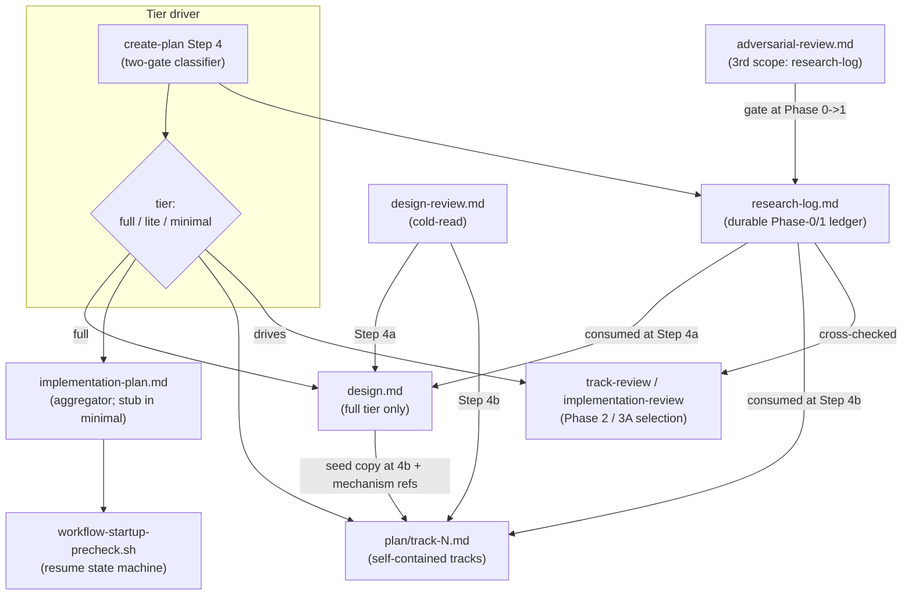
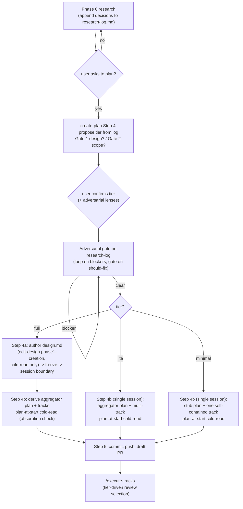

<!-- workflow-sha: e9377f7f133f5cd6ec3028936f28be2819e4ae96 -->
# Complexity-Adaptive Workflow Tiering — Design

## Overview

Today every `/create-plan` … `/execute-tracks` run carries the same ceremony:
a mandatory `design.md`, a strategic `implementation-plan.md`, per-track files,
an adversarial review on the design, two Phase-2 plan reviews, and the full
Phase-3A review panel. That weight is right for a transaction-durability rework
and pure overhead for a one-line YQL-function fix. The fixed cost falls hardest
on the small and mid-size changes that make up most of the work.

This design makes the workflow shed artifacts and review passes by change
complexity. A change is classified into one of three **tiers** — `full`, `lite`,
`minimal` — at the Phase 0 → Phase 1 boundary, and the tier decides which
artifacts are authored and which review passes run.

Two additions make the shedding safe. First, a **research log**: a single
durable Phase-0/1 decision ledger that every tier produces, so the load-bearing
decisions are captured and challenged once, up front, regardless of which later
artifacts survive. Second, a **two-gate classifier** that decomposes the tier
into orthogonal yes/no questions — does this change need a design document, and
is it one track or several — so a high-stakes but small change is expressible
where a flat three-way split would force a bad fit.

What restructures to fit: the adversarial review moves off `design.md` onto the
research log so the no-design tiers still get it; the cold-read review moves to
artifact write-time and gains an absorption-completeness criterion; the
implementation plan becomes a thin aggregator over self-contained track files
(YTDB-814/815/817: inline track decisions, per-track BLUF, the split into
per-track files); decision records become track-canonical in every tier, with
a frozen `design.md` seed keeping D-records and mechanism in `full`
(YTDB-1083's introduce-once applies within the seed); and the existing review
gates learn to key off the tier instead of step count. The `workflow-startup-precheck.sh` resume script is never touched:
every tier emits a shape-complete plan it can read. Resume routing gains a single
tier-aware branch in `create-plan` Step 1c, the only routing change.

The rest of this document is structured as: Core Concepts → Class Design →
Workflow → seven Parts (tier classification, the research log, the relocated
adversarial review, carriers and self-containment, write-time cold-read,
tier-driven review selection, and design-presence conditionals plus the Phase 4
audit trail).

## Core Concepts

This design introduces nine load-bearing ideas. Each is named here and used
without re-definition in the Parts that follow; each entry pairs the new concept
with what it replaces so the delta from today's workflow is visible at a glance.

**Change tier.** The workflow-ceremony level of a change: `full`, `lite`, or
`minimal`. It drives which artifacts are authored and which reviews run.
Replaces "every change runs the full ceremony." → Part 1 §"Tier classification
model".

**The two orthogonal gates.** The tier is computed from two independent yes/no
questions rather than a single ordinal scale. Gate 1 asks whether the change
needs a `design.md`; Gate 2 asks whether it is multi-track or single-track.
Replaces the user's first-draft flat "high / mid / low" scale. → Part 1
§"Tier classification model".

**Research log.** A durable Phase-0/1 decision ledger (`research-log.md`)
holding the initial request, a decision log, surprises, open questions, and a
baseline/re-validation anchor. Every tier produces it; it is consumed by the
later artifacts, not referenced by them. Replaces conversation context that
`/clear` destroyed. → Part 2 §"The research log".

**Aggregator plan.** `implementation-plan.md` is always a thin checklist that
aggregates self-contained track files; in the `minimal` tier it shrinks to a
shape-complete stub. Replaces the plan as a standalone strategic carrier.
→ Part 4 §"Carriers and self-containment".

**Track-canonical live decisions.** Every track carries the full live Decision
Record inline, in every tier, so a cold reader follows the whole argument
without leaving the file and the live decision evolves where execution
happens. In `full`, `design.md` is a frozen seed — provenance and mechanism,
never the live carrier. Replaces the tier-relative carrier split (and the
single universal duplication rule before it). → Part 4 §"Carriers and
self-containment".

**Relocated adversarial review.** The adversarial pass targets the research log,
not `design.md`, and runs once at the Phase 0 → 1 boundary as a gate. During
Phase-1 authoring the gate re-triggers per appended decision; once an artifact
is presented for user review, findings queue and batch through one gate run,
one mutation, and one cold-read (D15). Replaces
the design-only adversarial pass that left the no-design tiers uncovered.
→ Part 3 §"Relocated adversarial review".

**Write-time cold-read.** The comprehension review runs while the author still
holds context: on `design.md` in Step 4a and on the plan-at-start track sections
in Step 4b, with an absorption-completeness criterion at both. Replaces
cold-read that only ever saw `design.md`. → Part 5 §"Write-time cold-read and
absorption-completeness".

**Tier-driven review selection.** The tier — not step count — selects which
Phase 2 and Phase 3A passes run. Replaces the Phase-3A step-count complexity
notion as the change-level selector. → Part 6 §"Tier-driven review selection".

**Inline decision records.** Within each artifact a decision is introduced once
in full and referenced thereafter, never restated as a bare citation
(YTDB-1083 inside the `design.md` seed, YTDB-814 inside each track). The
seed→track copy crosses artifacts and is intentional, not a violation of
introduce-once. Replaces scattered out-of-file decision references. → Part 4
§"Carriers and self-containment".

## Class Design

The "classes" here are workflow artifacts and the scripts and prompts that read
and write them. The diagram shows what each tier produces, which component reads
each artifact, and where the relocated reviews attach.

The tier driver lives in `create-plan` Step 4: it reads the now-complete
research log, proposes a tier, and the user confirms it. The research log is the
one artifact every tier produces, which is why the relocated adversarial review
attaches there. `design.md` exists only in `full`. The plan is always present
and always shape-complete so the `workflow-startup-precheck.sh` resume script
keeps working untouched; in `minimal` it is a stub. The cold-read prompt is reused at two write-time spawn points; the
adversarial prompt gains a third scope targeting the log. The review-selection
logic in `track-review.md` and `implementation-review.md` keys off the tier.

## Workflow

The control flow below shows the Phase 0 → Phase 1 boundary where the tier is
decided and the per-tier branch that follows.

The tier is decided once, at the end of Phase 0, before any Phase 1 artifact
exists, so there is no chicken-and-egg between the tier and a track count that
planning has not yet produced. The adversarial gate runs on the log immediately
after tier confirmation. The `full` tier keeps the design-first session boundary
(Step 4a authors and freezes `design.md`, a fresh session derives the plan in
Step 4b). The `lite` and `minimal` tiers have no `design.md`, so they collapse
Phase 1 into a single Step-4b session. Every tier ends at the same Step 5 commit
and draft PR, and `/execute-tracks` reads the tier to select its review passes.

# Part 1 — Tier classification

How a change is sorted into `full`, `lite`, or `minimal`, when the decision is
made, who confirms it, and what happens when the estimate turns out wrong
mid-execution.

## Tier classification model

**TL;DR.** The tier is two orthogonal yes/no gates, not one ordinal scale.
Gate 1 asks whether the change needs a `design.md`; Gate 2 asks whether it spans
multiple tracks. The agent proposes the tier from the research log at the
Phase 0 → 1 boundary and the user confirms it. Gate 1's criteria reuse the
HIGH-risk category vocabulary already in `risk-tagging.md`, read at the change
level. A mid-flight balloon escalates the tier through the inline-replan path.

### The two gates and the tier map

D2 factors the tier into two independent questions so that "high-stakes but
small" is expressible — the case a flat `high`/`mid`/`low` scale could not name.

| Gate | Question | Answers |
|---|---|---|
| Gate 1 | Does the change need a `design.md`? | yes / no |
| Gate 2 | Does the change span multiple tracks? | multi / single |

The two gates collapse to three reachable tiers (a design-needing change is
treated as multi-track by construction, since a change worth a design document
is not a single-track stub):

| Tier | Gate 1 | Gate 2 | Artifacts | Phase-4 durable artifacts (D16) |
|---|---|---|---|---|
| `full` | design = yes | multi | `design.md` + aggregator plan + tracks | `design-final.md` + `adr.md` |
| `lite` | design = no | multi | aggregator plan + tracks, no design | `adr.md` |
| `minimal` | design = no | single | shape-complete stub plan + one self-contained track | PR-description verdict summary; no `docs/adr/` entry |

The tier names `full` / `lite` / `minimal` describe the workflow-ceremony level
and are deliberately distinct from two other complexity vocabularies already in
the workflow: the per-step `risk` tag (`low`/`medium`/`high`) and the Phase-3A
step-count axis in `track-review.md` (Simple/Moderate/Complex). D2 keeps all
three vocabularies non-colliding so no two of them can be confused at a glance.

### Gate 1 criteria and change-level aggregation

D4 sources Gate 1's "needs a design" test from the HIGH-risk category list
already maintained in `risk-tagging.md` — concurrency, crash-safety/durability,
public API, security, architecture/cross-component, performance hot path, and
workflow machinery — read at the **change** level rather than the per-step
level. The question is whether one of these categories is central to the
change, which shares one source of truth with the Phase-A per-step tagging that
the same list drives.

Change-level reading is not "contains one high-risk step." A mostly-mechanical
change with a single risky line does not become `full`. The aggregation rule:
Gate 1 is yes when a HIGH-risk category is **central to the change's purpose**,
not merely touched by one incidental edit. This is a judgment the agent makes
from the research log and the user ratifies; the gate records which categories
matched, because those same categories prime the relocated adversarial review.
The matched set is the **centrally-matched** categories only (D16): emphasis
lenses derive from them plus explicit user additions at tier confirmation, so
a Gate-1-no change runs its gate lens-free unless the user adds one — a
touched-but-not-central category does not generate a lens.

### Timing, proposal, and confirmation

D3 places the decision at the Phase 0 → 1 boundary (`create-plan` Step 4),
reading the now-rich research log. The agent proposes the tier and the matched
risk categories; the user confirms or overrides in either direction. This keeps
a human gate on the artifact-shedding decision without forcing the user to
declare a tier before the agent's scope assessment exists. The tier is decided
once, before any Phase 1 artifact is written, so it has a clean home and no
circular dependency on a not-yet-derived track count.

### Mid-flight tier upgrade

D12 handles the case where the estimate is wrong: a `minimal` single track
balloons during Phase A/B, or a `lite` change turns out to need a design. The
tier upgrade rides the existing inline-replan ESCALATE path rather than a new
mechanism. The honest framing is that the Phase 0 → 1 decision "decides at the
cleanest available point on the best estimate," not that it "resolves the
circularity"; Gate 2 remains an estimate until decomposition. An upgrade adds
the new tier's artifacts and runs its Phase-3A passes from the upgrade point
onward: a `lite` upgrade gains a `design.md` if Gate 1 also flips, and the
narrowed adversarial pass begins running on subsequent tracks. It does not reach
back to re-run a Phase-2 pass an earlier session already skipped. The
reviews-cannot-be-un-run asymmetry reads both ways: a downgrade cannot un-run a
completed review, and an upgrade cannot retroactively insert one the workflow has
already moved past, so a downgrade is likewise not automatic.

### Edge cases / Gotchas

- A `minimal` change that grows a second track mid-execution is a Gate-2 miss,
  not a Gate-1 miss: it becomes `lite`, and only gains a `design.md` if a
  HIGH-risk category also turns out central.
- Confirming the tier also confirms the matched risk categories, so the user
  changing the tier at confirmation time may shift the adversarial lenses; the
  user may add or drop a lens explicitly at that point.
- "Workflow machinery" is itself a HIGH-risk category, so a change to this very
  workflow is `full` and authors its own `design.md` — this branch included.

### References

- D-records: D2 (two-gate model and tier names), D3 (timing, proposal,
  confirmation), D4 (Gate 1 criteria and change-level aggregation), D12
  (mid-flight tier upgrade), D16 (per-tier Phase-4 durable artifacts — fold
  mechanics in Part 7; lens set = centrally-matched categories plus explicit
  user additions)
- Invariants: S1 (the `workflow-startup-precheck.sh` script is never edited;
  resume routing gains one tier-aware Step 1c branch, and the stub plan keeps
  every tier readable)

# Part 2 — The research log

The single durable decision ledger every tier produces, its structure, its
lifetime, and the strict rule on who may read it for what.

## The research log

**TL;DR.** D5 folds the YTDB-965 research log (the durable decision-ledger
proposal) into this branch as the one artifact
present in all three tiers. It anchors the initial user request and logs
decisions, surprises, and open questions across `/clear` and the Phase 0 → 1
boundary, plus a fifth baseline/re-validation section for workflow-modifying
branches. It is consumed by the later artifacts, never referenced by them, and
is removed at the Phase 4 cleanup. After a track absorbs a decision, the
track is authoritative; the log (and, in `full`, the `design.md` seed
record) is historical provenance.

### Structure and lifetime

The log carries five sections: `## Initial request` (the verbatim aim, written
once so a session boundary never re-asks it), `## Decision Log`, `## Surprises &
Discoveries`, `## Open Questions`, and `## Baseline and re-validation` (the
rebase-drift anchor that a workflow-modifying branch needs). The first is a
plan-at-start anchor; the middle three are append-only continuous logs with ISO
timestamps and a context-level tag; the fifth is filled when the branch modifies
the workflow itself.

D5 widens the log's lifetime beyond YTDB-965's Phase-0-only framing. In the
`full` tier, load-bearing decisions surfaced during Step 4a design authoring are
appended to the Decision Log and re-trigger the adversarial gate on the new
entry. The re-trigger is immediate during pre-presentation authoring; once the
design is presented for user review, decisions queue for the batch gate
instead (D15, Part 3). The log is thus the single Phase-0/1 decision ledger
rather than a Phase-0-only scratch pad. The "consumed, not referenced" story still holds — the
later artifacts read the log to seed themselves but never cross-link to it; only
the append window widens to cover Phase 1 design authoring.

### Read-scope discipline

S2 makes the log → carrier seed strictly one-way. The log may be read in exactly
two places: at Step 4a/4b artifact authoring (to seed the carriers) and by the
Phase-2 consistency review (as a cross-check). The write-time cold-reads'
absorption cross-check (Part 5) reads the log inside these same authoring
steps, so it is not a third read point. It is **not** a Step-4b seeding
input that the plan derives from at will — Step 4b seeds decision records from
the **carrier's** inline records, not from the log (in `full`, from the frozen
`design.md` seed's D-records; in `lite`/`minimal`, Step-4b authoring is itself
the log's read point). Once a track has absorbed a decision as an inline
record, the track is the authority and the log is historical; a design-side
seed record confers provenance, never authority (D7). This is what prevents a
dual source of truth once the same decision exists in the log, the seed, and
the track.

### Edge cases / Gotchas

- The log is removed in the Phase 4 cleanup commit with the rest of
  `_workflow/`, so any audit trail that must survive merge is folded into a
  durable carrier, not left in the log: `adr.md` in `full`/`lite`, the
  two-line PR-description verdict summary in `minimal` (Part 7, D16).
  `minimal`'s full trail otherwise survives only in the PR's commit history
  on GitHub.
- A decision appended during pre-presentation Step-4a authoring re-opens the
  adversarial gate on that entry only, not the whole log; the gate's
  loop-on-blockers semantics apply to the new entry. Once the design is
  presented for user review, decisions queue for the batch gate instead (D15,
  Part 3).
- Reading the log as a Step-4b seeding input is the failure S2 forbids: it would
  let an unabsorbed log decision pass every gate while the carrier silently
  fails self-containment.

### References

- D-records: D5 (research log as single Phase-0/1 ledger; fold YTDB-965; fifth
  section; widened lifetime), D15 (hold-window decisions queue for the batch
  gate instead of D5's immediate re-trigger — Part 3), D16 (audit-trail
  carrier per tier: `adr.md` fold in `full`/`lite`, PR-description summary
  in `minimal` — Part 7)
- Invariants: S2 (one-way log → carrier seed; track authoritative after
  absorption)

# Part 3 — Relocated adversarial review

Moving the adversarial pass off `design.md` and onto the research log so every
tier gets it, with domain priming and gate semantics, and the ordering rule that
keeps the design freeze intact.

## Relocated adversarial review

**TL;DR.** D6 moves the adversarial review's target from `design.md` to
`research-log.md` and runs it once at the Phase 0 → 1 boundary as a gate: loop on
blockers, gate on should-fix, no `skip`. It reuses `prompts/adversarial-review.md`
with a third scoped section and is domain-primed off the confirmed tier's matched
risk categories. `edit-design`'s `phase1-creation` drops its own Step 3.5
adversarial pass, so `design.md` then gets cold-read only — gated behind the
log-adversarial gate clearing so the design-first freeze order is preserved.
D14 model-triages every adversarial spawn by tier: Fable 5 in `full`,
Opus 4.x in `lite`/`minimal`, both pinned at xhigh effort. D15 batches
review-hold findings: queued during the user's review of a frozen-ready
artifact, validated in one gate run, applied in one mutation. D17 makes
every third-scope spawn persist a review file and return a thin manifest,
so gate iterations do not accumulate certificates in the orchestrator's
context.

### Why the log, and what it gains

The adversarial pass challenges decisions and hidden assumptions, which is
exactly what the research log captures explicitly: each Decision Log entry's
`Why` and `Alternatives rejected` map onto the challenge certificate's
`Chosen approach` / `Best rejected alternative` / `Counterargument trace`.
Attaching the pass to the log makes it universal across tiers — the log is the
only artifact present in all three — so `lite` and `minimal` gain adversarial
coverage they would otherwise lose entirely when `design.md` disappears. It also
shifts the challenge left: a flawed decision is caught before any design or track
derives from it.

### Reuse and the third scope

D6 reuses the existing `reviewer-adversarial` rather than adding a new reviewer.
`prompts/adversarial-review.md` already demonstrates retargeting — its
`## Design-scoped review (Phase 1)` section retargets the Phase-3A track
machinery onto `design.md`. A third section, `## Research-log-scoped review
(Phase 0→1)`, follows the same pattern: target the Decision Log, Surprises, and
Open Questions; raise DECISION challenges on the Decision Log and
ASSUMPTION/INVARIANT challenges on Surprises; treat scope/simplification
challenges as mostly not-applicable before decomposition; and map the outcome to
blocker-loops (re-decide in research), should-fix gates, and no `skip` (a would-be
`skip` is raised to a blocker). The code-grounding and the workflow-modifying
criteria block transfer unchanged.

D17 fixes the third scope's output mode to **file**: every third-scope spawn —
the Phase 0→1 gate and the D15 batch-gate runs alike — supplies an output
path; the reviewer persists the `conventions-execution.md` §2.5
manifest-plus-sections review file and returns only the thin manifest, and
the orchestrator partial-fetches `## Findings` from disk. (The
count-validation labels in that schema are `conventions-execution.md`'s
S4/S6, not this design's invariants.) The gate loops on blockers by design,
so an inline return would park every iteration's full certificate set in the
orchestrator's context for the rest of the session; the file return caps
that cost and makes a mid-gate `/clear` resumable from disk. The log's gate
records remain the verdict carrier the Phase-4 consumers read: the `adr.md`
fold in `full`/`lite`, the PR-description summary in `minimal` (Part 7,
D16). The review files die in the Phase 4 cleanup without feeding either.

Implementation notes for D17's wiring: §2.5 needs Phase-0→1 access on both
annotation axes — its TOC row, plus the section markers of the subsections
the third scope actually uses, extend their phases with `1` and their roles
with `planner` (an explicit read-instruction alone is non-viable under
`conventions.md` §1.8(e)/(f)). A third-scope location/lifecycle clause names
the review-file directory under `_workflow/` (the canonical track-anchored
home does not exist before Step 4b), commit-at-return applicability, and the
Phase-4 sweep. File naming follows `track-review.md`'s `<type>-iter<N>.md`
practice. Whether iteration≥2 runs use §2.5's verdict-producer manifest
variant or fold verdicts into the finding set is decided at implementation;
resolving to the variant extends that row on the same two axes.

### Domain priming

D6 primes the single research-log reviewer with the tier's matched risk
categories as emphasis lenses rather than spawning separate dimensional agents.
The lens set is the centrally-matched categories plus explicit user additions
at tier confirmation (D16); a Gate-1-no change therefore runs lens-free
unless the user adds one. Confirming the tier confirms the categories, which
generate the lenses
automatically — concurrency maps to a bugs-concurrency lens, crash-safety and
durability to a crash-safety lens, performance hot path to a performance lens,
security to a security lens, and workflow machinery to prose-scrutiny emphases
(rule coherence, instruction completeness, context budget) applied to the log's
decisions. The workflow-machinery emphasis names scrutiny stances the one
adversarial reviewer adopts, not the `review-workflow-*` agents: those are
`/code-review`-dispatched diff reviewers whose subject, a written `.claude/**`
diff, does not exist at the Phase 0 → 1 boundary. Public-API and architecture
categories add no dedicated lens because the adversarial and design passes
already cover them. Priming is
deliberately lighter than a full specialist review; specialist depth lands later
at Phase 3B/3C on real code. The user may add or drop a lens at tier
confirmation.

### Reviewer model triage

D14 keys the adversarial reviewer's model off the confirmed tier: `full`
spawns Fable 5, `lite`/`minimal` spawn Opus 4.x, and both branches pin an
explicit xhigh effort override — the effort a sub-agent spawn inherits is
undocumented and harness defaults drift, so it is never left to inheritance.
The rule covers every adversarial-reviewer spawn: this gate and the narrowed
Phase-3A track adversarial (Part 6); `minimal` drops the 3A pass, so its 3A
branch is moot. The technical and risk reviewers and the cold-read stay at the
session default: they are checkable-surface reviews whose value is coverage,
while the adversarial pass's value is maximum-depth challenge.

The tier encodes the stakes (Gate 1 = a HIGH-risk category central to the
change), so the highest-stakes ledgers get the strongest model and the cheap
tiers keep a frontier model at maximum effort, the same stakes→model
principle YTDB-1100 applies to `risk: high` implementer spawns. Stakes
dominate coverage in the allocation: a `lite`/`minimal` miss is, by Gate-1
construction, not centrally high-risk and still meets Phase 3B/3C and code
review downstream. The accepted price: Fable 5 costs roughly twice Opus 4.x
per token and xhigh inflates the output side, multiplied by the gate's
loop-on-blockers iterations; it is charged only to `full`-tier changes. The model
is decided by the tier at spawn time; a mid-flight tier upgrade does not
re-run earlier gate iterations, and post-upgrade spawns use the new tier's
model. If implementation finds no per-spawn surface, the model split lands via
the agent-frontmatter precedent and the effort half may degrade to the session
default — neither outcome reopens the decision.

### Freeze-order preservation

S3 keeps `edit-design`'s adversarial → cold-read → freeze order intact even
though the adversarial pass no longer lives inside `edit-design`. The design's
cold-read is gated behind the log-adversarial gate clearing: a `design.md` draft
cannot reach cold-read while a log-adversarial entry is open. So a load-bearing
decision surfaced during pre-presentation design authoring (Part 2) is appended
to the log, re-challenged, and cleared before the cold-read assesses
comprehension — the same ordering the in-`edit-design` Step 3.5 used to give.
Decisions surfaced after the design is presented for user review batch through
the same gate at review-iteration end (D15, below), which preserves the
ordering: the batch gate clears before the batch's cold-read runs.

### Review-iteration batching

D15 batches the user-review loop. When a frozen-ready Phase-1 artifact is
presented for review (`design.md` after the Step-4a review passes; the plan
and tracks at Step 4b's pre-persist confirmation), findings raised during the
review collect into a tagged queue (`[clarification]` = wording, no decision
content; `[decision]` = new or changed decision) and process as one batch when
the user declares the review done, never one by one. The window opens at the
presentation the user reviews from: a presentation with a PASS outcome, or the
user's acceptance of open risks on a presentation with residual findings.
D5's per-entry
immediate gate re-trigger governs only pre-presentation authoring; every
decision surfaced after the boundary joins the queue, user-raised or
agent-surfaced. A multi-session hold carries the queue in the mid-phase
handoff.

The batch runs in three steps. First, all `[decision]` items append to the
Decision Log together and one gate run validates them; each loop iteration
re-challenges every entry in the batch, since a fix to one entry can
invalidate a sibling's PASS. Second, the cleared decisions and the
`[clarification]` items apply in one mutation; a decision-shaped finding
surfaced inside the mutation exits to the log before any fix attempt, never
auto-fixed in place. Third, one cold-read covers all changes, with loop-back:
a decision-shaped cold-read finding re-enters the gate step, and the batch
cannot close — nor the artifact re-present — while a log entry is open. A
budget-exhausted mutation escalates to the user as a failure, not as a
re-presentation. S3 holds across the whole loop.

The queue is the default, not a hard gate: the user may ask for immediate
processing of a single blocking finding, which runs the single-decision route
at its full cost and ends with a note of what moved, in chat and in the
handoff's queue block when the hold spans sessions. The gains: the gate
challenges interacting findings together, one gate spawn plus one mutation
plus one cold-read amortize across the batch (dividing the D14 premium by
batch size), and the artifact never moves mid-review unless the user waives
it. The accepted trades: a held batch applies at cold context in the flush
session, which counts as the "same session" for Part 5's blocker loop, and a
batch of one degenerates to the single-finding route.

### Edge cases / Gotchas

- `phase4-creation` already has no adversarial pass, so Phase 4 is unaffected by
  the relocation.
- Running the adversarial pass on both the log and `design.md` was rejected as
  double cost: the log is the decision source, so a second pass on the design
  prose is redundant.
- For `lite`/`minimal`, the log-adversarial gate is the only adversarial coverage
  the change receives before code review; this is intended, since those tiers
  shed the design entirely.
- A gate re-trigger during Step 4a (a load-bearing decision appended while
  authoring the design) spawns with the already-confirmed tier — `full` by
  construction, since Step 4a only exists in `full`.

### References

- D-records: D6 (adversarial relocation to the log; reuse + third scope; domain
  priming; `edit-design` drops Step 3.5), D12 (mid-flight upgrade interaction:
  no re-run of earlier gate iterations; post-upgrade spawns use the new tier's
  model — Part 1), D14 (tier-keyed adversarial model
  triage: Fable 5 in `full`, Opus 4.x elsewhere, xhigh pinned on both;
  adversarial-spawns-only scope; degradation order), D15 (review-iteration
  batching: queue from frozen-ready presentation, one gate run with
  whole-batch re-challenge, one mutation, one cold-read with loop-back;
  escape hatch; D5 scoped to pre-presentation authoring), D16 (lens set =
  centrally-matched categories plus user additions — Part 1), D17
  (third-scope output mode = §2.5 review file with thin-manifest return and
  partial-fetch; both-axes access wiring; log gate records stay the verdict
  carrier)
- Invariants: S3 (design cold-read gated behind log-adversarial clearing —
  freeze order preserved across the batch loop-back)

# Part 4 — Carriers and self-containment

Where the live decision lives (the tracks, in every tier), what the frozen
`design.md` seed keeps in `full`, the always-present aggregator plan and its
`minimal`-tier stub, and how YTDB-1083's inline-record mechanism is reconciled
with the durable log.

## Carriers and self-containment

**TL;DR.** D7 makes the tracks the live decision carrier in every tier: each
track carries the full inline DR, and a cross-track propagation duty keeps
duplicated records one logical decision through replans. In `full`,
`design.md` is a frozen seed — it keeps its D-records (YTDB-1083
introduce-once) and mechanism for Step-4b derivation, review-phase navigation,
and on-demand reference, but never carries the live decision. D1 keeps the
plan an aggregator in every tier, shrunk to a shape-complete stub in
`minimal`. D11 adopts YTDB-1083's inline-record mechanism within the seed
while overriding its log-as-transient framing, and scopes the footer rename
and its mechanical check to `design.md`.

### The aggregator plan and the minimal stub

D1 keeps `implementation-plan.md` present in every tier so the resume state
machine, the drift gate, and Phase-2 routing all keep working unchanged — the
machinery reads the plan to derive every post-Phase-0 state. Two routes were
weighed: (a) keep a near-empty auto-generated aggregator plan, or (b) rewire the
state machine to derive state from track presence when the plan is absent. Route
(a) wins; route (b) would destabilize the resume engine. The plan is already a
thin checklist, so the stub is roughly ten lines.

The `minimal` stub is sharpened from "content-free" to "minimal but
shape-complete." S1 requires the stub to carry exactly what the machinery reads:
a `## Plan Review` heading, a glyph-valid `## Checklist` with one track entry,
and a `## Final Artifacts` heading. A required stub-template DR in the plan
specifies this shape. `create-plan` Step 1c also gains a tier-aware branch that
distinguishes "`lite`/`minimal` in progress, no `design.md` by design" from
"fresh start," so a no-design tier interrupted mid-planning does not route back
to Step 4a design authoring on resume. S1 names this boundary precisely: the
`workflow-startup-precheck.sh` script is never edited, and the lone
resume-routing change is the Step 1c branch — the bash state machine reads the
shape-complete plan unchanged in every tier.

One block flows up into the aggregator in every tier: the per-track completion
episode. At Phase C, after user approval, the orchestrator writes the
`**Track episode:**` block into the plan's `## Checklist` entry for the
completed track — the `minimal` stub included; it is the one content block the
stub accumulates. The track episode is distinct from per-step episodes, which
live in the track file's `## Episodes` section, and from decision records,
which are track-canonical (D7) and never aggregate upward.

### Track-canonical live decisions

D7 makes the track files the live decision carrier in every tier. A frozen
artifact cannot be canonical for something that evolves: tracks change through
Phase 3 (inline replan, scope-downs, decision-log appends) while `design.md`
freezes at Step 4a, and the implementer's frozen-design guard already names
the live DR authoritative during execution. So every track carries the full
inline DR, no out-of-file references, in every tier:

| Tier | Live decision carrier | Track DR shape | Frozen seed |
|---|---|---|---|
| `full` | the track files | full inline DR | `design.md` keeps D-records + mechanism |
| `lite` | the track files | full inline DR | — |
| `minimal` | the one track file | full inline DR | — |

In `full`, `design.md` survives as the frozen seed with three roles: the
source Step 4b derives the plan and tracks from, the review-phase navigation
surface (research-log ↔ `design.md` D-records ↔ track DRs), and the on-demand
`**Full design**` mechanism reference. The pointer semantics flip with it: a
`**Full design**` line in a track DR says "frozen mechanism and seed rationale
live here," never "the canonical decision lives here" — the decision is fully
in the track. The seed→track copy is one-directional by construction (the
seed is frozen and cannot drift toward the track), and the fidelity criterion
(Part 5) checks the copy at authoring time.

Phase-3 consumption follows the carrier: implementer and reviewer sub-agents
receive the slim plan plus the slim track with its full DRs inline;
`design.md` stays path-only, on-demand context. The flip buys coherence, not
context savings — full-tier track files grow by their duplicated DRs (~10-30
lines each), an accepted price bounded by the four-bullet DR discipline
retargeted to track DRs and by the slim-track rendering. The frozen-design
guard holds as written, with `plan's DRs` re-worded to `track's DRs`.

### Cross-track propagation

A decision duplicated across tracks stays one logical live record. When an
inline replan revises a decision whose full DR is duplicated in several track
files, the orchestrator updates the copy in every relevant not-yet-completed
track file in the same replan, and appends a supersession note — naming the
superseded DR — to the `## Decision Log` of any completed track that carried
it. The copy-shape rule is decision-state-based, not replan-event-based: any
post-seed copy of a decision that has ever been revised is written in the
inline-replan revision format (the seed decision stays in its
`**Original decision**` field), never as clean revised text, so every
post-seed copy carries the marker that routes it to the fidelity check's
provenance-only path (Part 5). Two reconciliations ride the Phase-3 ripple:
the replan rules' updatable-section lists gain `## Decision Log`, and the
completed-track pause gains a carve-out for the documentation-only
supersession-note append.

### YTDB-1083 reconciliation

D11 adopts YTDB-1083's mechanism — inline decision records per complex-topic
section, introduce-once-reference-thereafter, the per-section footer rename from
`References` to `Decisions & invariants`, and a "decision cited without rationale
or cross-reference" mechanical check — as the design-side analog of YTDB-814's
track-side inline DRs. Both express one principle: introduce a decision once
in full within each artifact and reference it thereafter, while the tracks
carry the live record (D7), seeded from the `design.md` seed in `full` and
directly from the log in `lite`/`minimal` (S2).

D11 overrides YTDB-1083's log-as-transient-bridge framing where it conflicts with
D5: the log is a durable Phase-0/1 ledger read during Step 4a/4b and removed at
Phase 4 cleanup, not a bridge folded into the design and deleted before freeze,
and not an artifact the plan never reads. YTDB-1083 acceptance #4 is rewritten
accordingly: Step 4b seeds from the frozen `design.md` seed's D-records in
`full` (in `lite`/`minimal`, Step-4b authoring is itself the log's read
point), and the durable log is a Phase-2 consistency cross-check, never a
Step-4b seeding input.

D11 splits YTDB-1083's two bundled mechanisms by artifact home. The
inline-record **content** adopts for tracks via the existing `## Decision Log`
slot, which is the canonical inline-record home in every tier (track files
have no `### References` footer). The footer rename and the `section_has_references`
mechanical check are scoped to `design.md` only. The tracks'
self-containment guarantee therefore comes from the cold-read absorption and
fidelity criteria (Part 5), not from the mechanical check.

### Edge cases / Gotchas

- A cross-track decision appears as a full record in each relevant track's
  `## Decision Log` in every tier; in `full` it additionally has its seed
  D-record in `design.md`. The propagation duty keeps the track copies one
  logical record through replans.
- The footer rename does not apply to track files, which have no `### References`
  footer; applying it there is the mistake the by-tier split avoids.
- The `minimal` stub plan is the one carrier that intentionally holds no decision
  content — its single track is canonical for the whole change.

### References

- D-records: D1 (aggregator plan + minimal stub; Route (a); track-episode
  aggregation), D7 (track-canonical live decisions in every tier; frozen-seed
  roles; cross-track propagation duty), D11 (YTDB-1083 reconciliation;
  introduce-once within the seed; acceptance #4 rewrite)
- Invariants: S1 (stub plan keeps the state machine readable), S2 (track
  authoritative after absorption)

# Part 5 — Write-time cold-read and absorption-completeness

Moving the comprehension review to artifact write-time, adding a second spawn
point in Step 4b, and the absorption-completeness criterion that makes
"carrier authoritative" enforceable.

## Write-time cold-read and absorption-completeness

**TL;DR.** D8 runs the cold-read at artifact write-time, while the author still
holds context: on `design.md` in Step 4a and on the plan-at-start track sections
in Step 4b. The Step-4b cold-read is a new spawn point that reuses the existing
cold-read sub-agent, not a new reviewer. Both cold-reads carry an
absorption-completeness criterion — every load-bearing research-log decision in a
track's scope must appear in the appropriate carrier — and, in `full`, a
fidelity criterion: the track copy must be substantively equivalent to its
`design.md` seed record at authoring time. Authoring-time misses rely on this
semantic check with no mechanical backstop, an accepted residual risk.

### The two write-time spawn points

D8 reactivates YTDB-832's write-time intent (the won't-fixed proposal to extend
cold-read to the plan-at-start sections), which the design-first split had made
moot when `design.md` became mandatory and its cold-read covered the load-bearing
argument. Removing `design.md` for `lite`/`minimal` re-activates that exact
motivation: the plan-at-start sections (track Purpose / Context / Plan of Work /
Interfaces and the root per-track BLUF/triad) need a comprehension audit.

The cold-read is a new spawn point in Step 4b that reuses the existing cold-read
sub-agent — write-time cold-read applied to a second artifact, not a second
reviewer. The structure is tier-dependent:

| Tier | Step 4a cold-read | Step 4b cold-read |
|---|---|---|
| `full` | `design.md` (in the 4a session) | plan/tracks (in the fresh 4b session) |
| `lite` | — (no design) | plan/tracks (single Phase-1 session) |
| `minimal` | — (no design) | stub plan + one track (single Phase-1 session) |

The DR specifies the Step-4b spawn point as after the track-file write and before
the Step 5 commit; the written plan and tracks are then presented for the user's
pre-persist confirmation, which is the presentation D15's review window opens at
(Part 3). The iterate-loop semantics mirror `edit-design`: a blocker re-opens
Step-4b derivation in the same session. For a held review batch, the flush
session counts as the same session for this loop (D15, Part 3).

### Absorption-completeness

D8 makes "carrier authoritative" (S2) enforceable by adding an
absorption-completeness criterion to both cold-reads rather than a standalone
mechanism. The cold-reader reviews the records in their plan-at-start state and
cross-checks both ways: every load-bearing research-log decision must appear as an
inline record in the appropriate carrier, and a log decision with no carrier home
is a finding.

The criterion narrows the trigger-set to a checkable surface rather than leaving
it to free judgment:

- **Load-bearing** = a research-log Decision Log entry whose `**Alternatives
  rejected:**` field names a real fork. The field's presence is the mechanical
  surface; the cold-reader still judges whether the named alternative is a real
  fork rather than a vacuous "none," and a genuine fork recorded under a
  different sub-field (a `**Scope note:**` or `**Reconciliation:**`) is still in
  scope, so field placement cannot game the trigger.
- **In-scope** = the decision constrains a file or interface the track touches,
  bound to the track's `## Interfaces and Dependencies`. On a workflow-modifying
  plan, "a file or interface the track touches" includes the workflow-prose files
  and `§`-anchors listed there, so the trigger binds to prose dependencies, not
  only Java symbols.
- **Per-carrier** is uniform for the live record: a full record in each
  relevant track's `## Decision Log`, in every tier. In `full`, the criterion
  additionally requires the decision's seed D-record in `design.md` and
  fidelity between the two (below).

The criterion applies at both write-time cold-reads: Step 4a checks log →
`design.md` D-records, Step 4b checks log → carrier inline records, so every
carrier that may read the log meets the same self-containment bar.

### Fidelity and the post-replan rule

Fidelity is an authoring-time bar, not a standing equality constraint. At the
Step-4b cold-read, each `full`-tier track DR must be substantively equivalent
to the `design.md` seed record it was copied from; a paraphrase that shifts
the meaning is a finding even though the presence check passes. After
authoring, the bar inverts in scope: post-replan divergence between a track
copy and the seed is legitimate — the track evolved and the frozen seed
cannot.

The check's domain keeps it safe to re-run: it iterates the `design.md` seed
records and verifies their track copies; a track DR with no seed counterpart
is a post-seed live decision, out of scope by construction. A track DR
carrying the inline-replan revision format, or named by a supersession note,
is compared provenance-only — its `**Original decision**` field, which stays
seed-pinned across repeated revisions, must semantically correspond to the
seed (summary-correspondence, not verbatim inclusion). Seed→track restoration
is an authoring-time-only fix; no reviewer or mechanical pass rewrites a
track DR from the seed after authoring.

### Residual risk

D8 accepts that authoring-time absorption and fidelity rely on the semantic
cold-read alone, with no mechanical backstop — the `section_has_references`
check is `design.md`-only (Part 4). A missed absorption at authoring has no
automated catch in any tier. The residual narrows to authoring time:
post-authoring divergence between duplicated track copies has a defined owner
and mechanism (the cross-track propagation duty, Part 4). This is accepted and
stated explicitly: it is consistent with the cheaper-tier-lighter-guarantee
philosophy, and the load-bearing/in-scope definitions above make the cold-read
checkable enough to carry the weight.

### Edge cases / Gotchas

- A research-log decision with an empty `Alternatives rejected` field is not
  load-bearing and does not trigger the absorption check, so a routine note does
  not force a carrier record.
- In `full`, a track DR that paraphrases its seed record into a different
  meaning passes the presence check but fails fidelity — substantive
  equivalence is the bar, not verbatim match. An optional `**Full design**`
  line in a track DR references the seed's mechanism; it never substitutes for
  the full inline record.
- The Step-4b cold-read blocker re-opens derivation in the same session; it does
  not defer to a later phase, because the author's context is the thing being
  spent. For a held review batch the flush session is that session — the
  cold-context flush is the trade D15 accepts (Part 3).

### References

- D-records: D8 (write-time cold-read at Step 4a + new Step 4b spawn;
  absorption-completeness + full-tier fidelity criteria; post-replan rule;
  residual risk), D15 (a held batch's flush session counts as the same
  session for the blocker loop — Part 3)
- Invariants: S2 (track authoritative — the absorption and fidelity checks
  enforce it at authoring; the propagation duty owns it after)

# Part 6 — Tier-driven review selection

How the tier, not step count, selects the Phase 2 and Phase 3A passes, which
passes each tier sheds, and how the tier reconciles with the existing per-step
risk tag and step-count axis.

## Tier-driven review selection

**TL;DR.** D9 makes the tier drive review selection at the change level, replacing
the Phase-3A step-count complexity notion as the selector. `minimal` drops the
Phase-2 structural review and the Phase-3A adversarial pass; `lite`/`full` keep
the Phase-3A adversarial pass but narrow it and skip it on the first track.
Phase 3B (`risk:high`-gated) and Phase 3C (triage-gated) run unchanged in every
tier. S4 keeps the per-step `risk` tag as the 3B/3C gate so the tier and the risk
tag never stack.

### Per-tier review matrix

D9 keys each Phase-2 and Phase-3A pass off the confirmed tier. Each pass either
runs as today, narrows, or drops:

| Pass | `full` | `lite` | `minimal` |
|---|---|---|---|
| Phase 2 consistency | full (design + plan + tracks) | plan + tracks | track-vs-code only |
| Phase 2 structural | runs | runs | dropped (stub has nothing to check) |
| Phase 3A technical | runs | runs | runs |
| Phase 3A risk | track-characteristic-gated | track-characteristic-gated | dropped |
| Phase 3A adversarial | runs, narrowed (track 1: episode challenge dropped) | runs, narrowed (track 1: episode challenge dropped) | dropped |
| Phase 3B dimensional | `risk:high` steps | `risk:high` steps | `risk:high` steps |
| Phase 3C track code review | triage-gated | triage-gated | triage-gated |

The live Phase-3A pre-execution panel is Technical plus Risk plus Adversarial,
selected today by a step-count complexity axis (Simple / Moderate / Complex).
D9's reconciliation replaces that step-count axis with the tier as the
change-level selector. Technical always runs. The Phase-3A Risk review stays
gated by track characteristics — critical paths, performance constraints, or
major architectural decisions — in `lite`/`full`, the same characteristics that
warrant it today; it is a distinct sub-agent from the per-step `risk` tag that
gates Phase 3B (see the reconciliation below). The `minimal` tier runs Technical only, the analog
of the live "Simple track → Technical only" floor that drops both Risk and
Adversarial.

The `minimal` tier drops the Phase-2 structural review because a stub plan has one
checklist entry, no decision records, and no ordering — there is nothing for a
structural pass to check — and its Phase-2 consistency lightens to track-vs-code
since the stub plan has no content to cross-check. The Phase-3A adversarial pass
is dropped for `minimal` because a single track is the whole change the log
already vetted, with no cross-track episodes (the realized outputs earlier
tracks hand to later ones) to challenge.

### The narrowed Phase-3A adversarial pass

For `lite`/`full`, D9 treats a track's inline decisions as already log-vetted, so
the Phase-3A adversarial pass focuses on track realization: scope and sizing,
cross-track-episode reality, and invariant-violation scenarios, rather than
re-challenging the decisions the log gate already cleared. Of those three, only
cross-track-episode reality needs a prior episode, so it is the one challenge
dropped on the first track. Scope/sizing and invariant-violation still run on
track 1, because the foundational track's sizing and invariants most constrain
everything downstream — the track whose realization is most worth challenging is
the one a whole-pass skip would have exempted. The pass's model follows the
D14 triage (Part 3): Fable 5 in `full`, Opus 4.x in `lite`, both pinned at
xhigh effort.

### Reconciliation with the existing complexity inputs

S4 prevents two complexity inputs from stacking. Before this change, Phase 3A
selected its panel by step count and Phase 3B/3C gated on the per-step `risk` tag.
D9's reconciliation: the `tier` replaces the step-count complexity notion at
Phase 3A as the change-level selector, and the per-step `risk` tag stays as the
3B/3C gate. The tier is the change-level driver; the risk tag is the per-step
driver; they address different scopes and never combine into a single inflated
signal. Phase 3B and 3C are unchanged because they review actual code and diff,
which the pre-code log adversarial does not duplicate.

### Edge cases / Gotchas

- Phase 4's design-final cold-read is absent for `lite`/`minimal` because there is
  no design to carry to a final artifact (Part 7).
- On track 1 of a multi-track `full`/`lite` plan, only the cross-track-episode
  challenge is dropped; the scope/sizing and invariant-violation challenges still
  run, since the foundational track most constrains the downstream ones.
- Removing the Phase-3A adversarial pass entirely was rejected: it would lose the
  track-realization challenges that multi-track `lite`/`full` plans still need.

### References

- D-records: D9 (tier drives review selection; `minimal` opt-outs; Phase-3A Risk
  track-characteristic-gated; narrowed Phase-3A adversarial pass; reconciliation
  replacing step-count at 3A), D14 (the narrowed adversarial pass's model
  follows the tier triage — Part 3)
- Invariants: S4 (per-step `risk` tag is the 3B/3C gate; tier is the change-level
  driver; the two never stack)

# Part 7 — Design-presence conditionals and the Phase 4 audit trail

The conditional branches the no-design tiers need in Phase 2 and Phase 4, where
design-bound findings re-route when no `design.md` exists, and how the
adversarial audit trail survives the `_workflow/` cleanup.

## Design-presence conditionals and the Phase 4 audit trail

**TL;DR.** D10 adds conditional branches keyed on whether `design.md` exists. The
no-design tiers skip the design half of the Phase-2 consistency review and the
structural duplication check; in `full`, the duplication check repurposes into
the seed↔track fidelity verification (Part 5) instead of firing backwards
against the now-mandated full track DRs. Design-destination bloat fixes
re-route to track sections in every tier, and findings that would defer to
`design-final.md` land as plan/track corrections where no design exists. A
Phase-4 step folds the research log's resolved adversarial verdicts into the
tier's durable carrier (D16): `adr.md` in `full`/`lite`, a two-line
PR-description verdict summary in `minimal`. The audit trail thus survives
the `_workflow/` cleanup that deletes the log.

### Phase-2 conditionals

D10 keys Phase 2 on design presence. When `design.md` is absent, the consistency
review skips its design half (it reads plan + tracks + code, not design + plan +
code), and the structural review skips the duplication check that compares a
long decision record against its matching `design.md` section. These are
conditional branches, not a rewrite — the same passes run with the design-reading
clauses guarded.

The design-frozen findings-routing rule also collapses for the no-design tiers.
With a `design.md` present, a Phase-2 or Phase-4 finding that touches frozen
seed text (a D-record or mechanism section in `design.md`) defers to Phase 4;
the live decision itself remains track-routed (D7). With no design, every
correction is plan-or-track-scoped, so the defer-to-Phase-4-design branch is
unreachable and all findings route to the plan or the tracks directly.

### Re-routing design-bound findings

D10 re-routes design-destination fixes in every tier, not only where no design
exists. All structural bloat fixes whose destination is `design.md` — the
decision-record, invariant, integration-point, and component-intent moves —
re-route to the matching track sections: routing live material into the
non-canonical frozen seed is wrong-direction under the carrier flip (D7) and
unmaintainable after the first replan, with post-freeze immutability the
secondary argument. A finding that would defer to `design-final.md` lands as a
plan/track correction in the no-design tiers. The full-tier duplication check
repurposes rather than fires backwards: a track DR matching a `design.md`
section is the mandated shape, not bloat, so the check becomes the seed↔track
fidelity verification with Part 5's domain, qualifier, and
authoring-time-only restoration rules. The duplicate-DR consistency concern is
covered by the absorption and fidelity criteria at authoring and by the
propagation duty after.

### The Phase 4 audit trail

D10 closes the gap that relocating the adversarial review to a `_workflow/` file
opens: D6 moved the adversarial pass off `design.md` onto the log, so the log's
gate records hold the durable adversarial evidence base — in all three tiers,
since the log-adversarial gate runs in every tier (D17's persisted review
files hold per-iteration detail and likewise die at cleanup). The Phase 4
cleanup deletes
the log in every tier, so every tier folds the log's resolved adversarial
verdicts into a durable carrier, scoped by D16. In `full` and `lite`, an
`adr.md`-authoring step writes the fold and `adr.md` survives the merge into
`develop`. In `minimal`, Phase 4 instead folds a two-line gate-verdict summary
into the PR description, which the squash-merge carries into `develop`'s
`git log`; the merge carries no `docs/adr/<dir>/` entry, and the full
certificate trail survives only in the PR's commit history on GitHub. Gate 2
is the boundary: a multi-track change earns post-merge archaeology, a
single-track `minimal` change documents itself the way any small PR does.
The verdicts never lived in `design.md` to begin with, so `design-final.md`
does not carry them. In `full`, `design-final.md` still carries the design
rationale and `adr.md` carries the adversarial verdict trail alongside the
architecture decisions; the two are complementary, not a substitute for the
fold.

Two boundary notes on the `minimal` shed. A `minimal` branch that is also
workflow-modifying still carries its §1.7(f) staged-mirror promotion — the
shed removes the fold, not the rest of Phase 4. And a `minimal`→`lite`
upgrade happens mid-flight (the ESCALATE path exists only in Phase 3),
always before Phase 4, so the fold applies per the tier in force when
Phase 4 runs.

### Staging for this workflow-modifying branch

D13 records that this branch is itself `full`-tier and workflow-modifying, so
`conventions.md` §1.7 staging applies: the live `.claude/**` files stay at the
`develop` state while staged edits accumulate under
`_workflow/staged-workflow/.claude/` until the Phase 4 promotion. This keeps the
running workflow stable while the branch rewrites it, and is the reason this
design is authored under the current live workflow rather than the rules it
proposes.

### Edge cases / Gotchas

- The relocated gate produces log verdicts in all three tiers and the cleanup
  deletes the log in all three, so every tier needs a durable verdict
  carrier: the `adr.md` fold in `full`/`lite`, the PR-description summary in
  `minimal` (D16). `design-final.md` carries `full`'s design rationale but
  not the adversarial verdict trail, which `adr.md` absorbs.
- A no-design tier that upgrades to `full` mid-flight (Part 1) gains a
  `design.md` and re-enters the design-present Phase-2 branches from the upgrade
  point onward; findings already routed as plan/track corrections are not
  retroactively moved.
- The staging rule is specific to workflow-modifying branches; a normal `full`
  change edits its target code directly and never populates
  `_workflow/staged-workflow/`.

### References

- D-records: D10 (design-presence conditionals; bloat-fix re-route in every
  tier; full-tier duplication-check repurpose; Phase-4 audit-trail fold),
  D13 (§1.7 staging for this branch), D16 (fold scoped to `full`/`lite`;
  `minimal` = two-line PR-description verdict summary; Gate 2 as the
  durable-ADR boundary)
- Invariants: S1 (the state machine the stub plan keeps readable is part of the
  workflow this branch stages)
