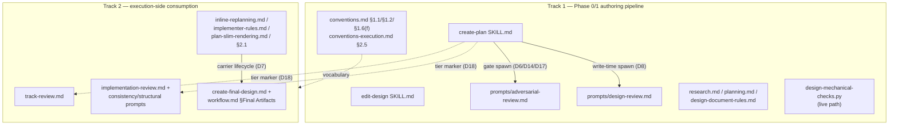

<!-- workflow-sha: e9377f7f133f5cd6ec3028936f28be2819e4ae96 -->
# Complexity-Adaptive Workflow Tiering

## Design Document
[design.md](design.md)

## High-level plan

### Goals

Make the workflow shed artifacts and review passes by change complexity, so a
one-line fix stops paying the ceremony a durability rework needs. Concretely:

- Classify every change into `full` / `lite` / `minimal` at the Phase 0 → 1
  boundary via two orthogonal gates (needs a design? spans multiple tracks?),
  agent-proposed and user-confirmed.
- Produce a durable Phase-0/1 research log in every tier and run the
  adversarial review on it as a gate, so load-bearing decisions are challenged
  once, up front, even in tiers that shed `design.md`.
- Make track files the live decision carrier in every tier: full inline
  Decision Records per track, an aggregator plan (shape-complete stub in
  `minimal`), and a frozen `design.md` seed in `full` only.
- Run the cold-read comprehension review at artifact write-time with an
  absorption-completeness criterion: Step 4a (design) and a new Step 4b spawn
  (plan-at-start track sections).
- Key Phase 2 and Phase 3A review selection off the tier instead of the
  step-count axis; Phase 3B/3C gating is unchanged.
- Fold the log's adversarial verdicts into a per-tier durable carrier at
  Phase 4: `adr.md` in `full`/`lite`, a two-line PR-description summary in
  `minimal`.

The change unifies YTDB-965 (research log), YTDB-814/815/817 (inline track
DRs, per-track BLUF, per-track files), YTDB-1083 (introduce-once), and the
revived YTDB-832 (write-time cold-read).

### Constraints

- This plan is workflow-modifying: it edits .claude/workflow/**, .claude/skills/**, or .claude/agents/**.
- §1.7 staging applies (D13): every edit to the three workflow prefixes lands
  under `_workflow/staged-workflow/.claude/...`; the live workflow stays at
  develop state until the Phase 4 promotion (invariant I6). This branch is
  itself `full`-tier under the design it implements.
- S1: `.claude/scripts/workflow-startup-precheck.sh` and its existing tests
  are never edited. The only resume-routing change in the whole plan is the
  tier-aware branch in `create-plan` Step 1c.
- `.claude/scripts/design-mechanical-checks.py` sits outside the §1.7
  stageable prefix set, so its D11 edit lands on the live path mid-branch.
  The edit must be backward-compatible: accept both the `### References` and
  `### Decisions & invariants` footer spellings, because live designs (this
  branch's frozen `design.md` included) keep the old footer.
- Every `_workflow/**` artifact this plan's execution creates carries the
  §1.6 line-1 workflow-sha stamp, except artifacts §1.6(f) excludes.
- House style (`conventions.md` §1.5) applies to every prose surface this
  plan touches.

### Architecture Notes

#### Component Map

- **create-plan SKILL.md** — the spine. Step 4 gains the two-gate classifier
  and tier confirmation, Phase 0 gains research-log creation, the adversarial
  gate and the Step 4b cold-read spawn are wired here, the plan/stub/track
  templates change shape, and Step 1c gains the tier-aware resume branch.
- **edit-design SKILL.md** — loses its Step 3.5 adversarial pass
  (`phase1-creation` becomes cold-read-only); the cold-read is gated behind
  the log-adversarial gate clearing (S3) and gains the absorption criterion.
- **prompts/adversarial-review.md** — gains the third scope
  (`## Research-log-scoped review (Phase 0→1)`) with gate semantics, lens
  priming, and file-mode output (D17).
- **prompts/design-review.md** — the cold-read prompt gains a second target
  (plan-at-start track sections) plus the absorption-completeness and
  full-tier fidelity criteria (D8).
- **research.md / planning.md / design-document-rules.md** — Phase 0 rewires
  to the log; Phase 1 rules describe the per-tier flow, aggregator plan, and
  inline track DRs; design rules adopt D11 (footer rename, introduce-once).
- **conventions files** — glossary terms, §1.2 layout, §1.6(f) exclusion for
  the log (D19), §2.5 annotation-axes extension for the gate's review files
  (D17); §2.1 lifecycle changes belong to Track 2.
- **Phase 2/3A review docs and prompts** (Track 2) — pass selection keys off
  the tier (D9); design-presence conditionals and the duplication-check
  repurpose land here (D10).
- **Execution carrier files** (Track 2) — replan propagation duty,
  implementer frozen-design guard rewording, slim-track rendering with inline
  DRs, §2.1 section lifecycle (D7).
- **Phase 4 files** (Track 2) — per-tier durable artifacts and the
  adversarial-verdict fold (D10/D16).

#### D1: Aggregator plan in every tier; shape-complete stub in `minimal`

- **Alternatives considered**: (b) rewire resume routing to derive state from
  track presence when the plan is absent; a content-free stub.
- **Rationale**: route (a) keeps the resume engine untouched (S1). The plan is
  already a thin checklist, so the `minimal` stub is ~10 lines yet
  shape-complete: `## Plan Review` heading, glyph-valid `## Checklist` with
  one track entry, `## Final Artifacts` heading, plus the D18 tier line. The
  per-track completion episode is the one content block the stub accumulates.
- **Risks/Caveats**: the stub template is the spec the state machine depends
  on; any future change to what the script reads must update the template.
- **Implemented in**: Track 1 (templates, Step 1c branch), Track 2 (Phase-2
  stub handling)
- **Full design**: design.md Part 4 §"The aggregator plan and the minimal stub"

#### D2: Two orthogonal gates instead of an ordinal scale

- **Alternatives considered**: flat `high`/`mid`/`low` ordinal tiers (the
  first draft).
- **Rationale**: factoring into "needs design?" × "multi-track?" makes
  high-stakes-but-small expressible; design = yes implies multi-track, so
  three tiers are reachable. Names `full`/`lite`/`minimal` avoid colliding
  with the per-step risk tag (`low`/`medium`/`high`) and the Phase-3A
  step-count axis (Simple/Moderate/Complex).
- **Risks/Caveats**: Gate 2 stays an estimate until decomposition; D12 covers
  the miss.
- **Implemented in**: Track 1
- **Full design**: design.md Part 1 §"The two gates and the tier map"

#### D3: Tier decided at the Phase 0 → 1 boundary, agent-proposed, user-confirmed

- **Alternatives considered**: user declares the tier up front; tier inferred
  after track decomposition exists.
- **Rationale**: the decision reads the now-rich research log, before any
  Phase 1 artifact exists, so there is no circular dependency on a
  not-yet-derived track count and the artifact-shedding choice keeps a human
  gate.
- **Risks/Caveats**: "decides at the cleanest available point on the best
  estimate" — mid-flight misses ride D12.
- **Implemented in**: Track 1
- **Full design**: design.md Part 1 §"Timing, proposal, and confirmation"

#### D4: Gate 1 criteria sourced from `risk-tagging.md`, read change-level

- **Alternatives considered**: a new standalone "needs design" rubric.
- **Rationale**: the HIGH-risk category list (concurrency, crash-safety,
  public API, security, architecture, perf hot path, workflow machinery)
  already exists and drives Phase-A tagging; one source of truth. Gate 1 is
  yes when a category is central to the change's purpose, not merely touched.
  The centrally-matched set is recorded because it primes the gate's lenses.
- **Risks/Caveats**: change-level centrality is a judgment call; the user
  ratifies it at confirmation.
- **Implemented in**: Track 1
- **Full design**: design.md Part 1 §"Gate 1 criteria and change-level aggregation"

#### D5: Research log as the single durable Phase-0/1 decision ledger

- **Alternatives considered**: conversation-context only (status quo, lost at
  `/clear`); a Phase-0-only scratch pad (YTDB-965's original framing).
- **Rationale**: five sections (Initial request, Decision Log, Surprises,
  Open Questions, Baseline/re-validation); produced in every tier; appends
  continue through Step 4a authoring, where pre-presentation entries
  re-trigger the gate immediately (post-presentation entries queue per D15).
  Consumed by later artifacts, never referenced by them.
- **Risks/Caveats**: removed at Phase 4 cleanup, so the audit trail must fold
  into a durable carrier (D16). Read scope is strictly bounded by S2.
- **Implemented in**: Track 1
- **Full design**: design.md Part 2 §"The research log"

#### D6: Adversarial review relocated onto the research log

- **Alternatives considered**: keep it on `design.md` (leaves `lite`/`minimal`
  uncovered); run it on both (double cost, rejected).
- **Rationale**: the log is the only artifact present in all tiers and is the
  decision source; the pass runs once at the Phase 0 → 1 boundary as a gate
  (loop on blockers, gate on should-fix, no `skip`). Reuses
  `prompts/adversarial-review.md` via a third scoped section; domain-primed by
  the matched risk categories. `edit-design` drops its Step 3.5.
- **Risks/Caveats**: for `lite`/`minimal` this is the only pre-code
  adversarial coverage — intended.
- **Implemented in**: Track 1
- **Full design**: design.md Part 3 §"Relocated adversarial review"

#### D7: Track-canonical live decisions; `design.md` as frozen seed in `full`

- **Alternatives considered**: tier-relative carrier split; a single universal
  duplication rule (both earlier drafts).
- **Rationale**: tracks evolve through Phase 3 while the design freezes at
  Step 4a, so a frozen artifact cannot carry the live decision. Every track
  carries the full inline DR in every tier; in `full` the seed keeps D-records
  and mechanism for derivation, navigation, and `**Full design**` references —
  provenance, never authority. Cross-track propagation keeps duplicated
  records one logical decision through replans.
- **Risks/Caveats**: full-tier track files grow ~10-30 lines per duplicated
  DR; bounded by the four-bullet discipline and slim-track rendering.
- **Implemented in**: Track 1 (templates, authoring rules), Track 2
  (propagation duty, implementer guard, slim rendering, §2.1 lifecycle)
- **Full design**: design.md Part 4 §"Track-canonical live decisions"

#### D8: Write-time cold-read with absorption-completeness and fidelity

- **Alternatives considered**: keep cold-read design-only (leaves no-design
  tiers without comprehension review); a standalone absorption checker.
- **Rationale**: the comprehension review runs while the author holds context:
  Step 4a on `design.md`, a new Step 4b spawn on the plan-at-start track
  sections (reusing the same cold-read sub-agent). Both check that every
  load-bearing log decision (Alternatives-rejected names a real fork) in a
  track's scope appears in the carrier; `full` adds seed↔track fidelity at
  authoring time only. Revived YTDB-832.
- **Risks/Caveats**: semantic check with no mechanical backstop — accepted
  residual risk; post-authoring divergence is owned by the propagation duty.
- **Implemented in**: Track 1
- **Full design**: design.md Part 5 §"Write-time cold-read and absorption-completeness"

#### D9: Tier-driven review selection

- **Alternatives considered**: keep the Phase-3A step-count axis; drop the
  Phase-3A adversarial pass entirely (rejected — loses track-realization
  challenges).
- **Rationale**: the tier replaces step count as the change-level selector.
  `minimal` drops Phase-2 structural and Phase-3A risk/adversarial; `lite`/
  `full` keep a narrowed 3A adversarial (track realization focus; the
  episode challenge drops on track 1 only). Phase 3B/3C run unchanged.
- **Risks/Caveats**: S4 must hold — the tier and the per-step risk tag never
  stack into one inflated signal.
- **Implemented in**: Track 2
- **Full design**: design.md Part 6 §"Tier-driven review selection"

#### D10: Design-presence conditionals and the Phase 4 audit trail

- **Alternatives considered**: rewriting the Phase-2 passes per tier (rejected
  — conditional guards suffice); leaving the adversarial trail in the log
  (deleted at cleanup, so it would vanish).
- **Rationale**: no-design tiers skip the consistency review's design half and
  the structural duplication check; design-destination bloat fixes re-route to
  track sections in every tier; the full-tier duplication check repurposes
  into the seed↔track fidelity verification. Phase 4 folds the log's resolved
  gate verdicts into the tier's durable carrier.
- **Risks/Caveats**: findings already routed before a mid-flight upgrade are
  not retroactively moved.
- **Implemented in**: Track 2
- **Full design**: design.md Part 7

#### D11: YTDB-1083 reconciliation — introduce-once, footer rename scoped to `design.md`

- **Alternatives considered**: applying the footer rename and mechanical check
  to track files too (rejected — track files have no `### References` footer).
- **Rationale**: inline-record content adopts for tracks via `## Decision
  Log`; the `References` → `Decisions & invariants` rename and the
  `section_has_references` check stay `design.md`-only. Overrides YTDB-1083's
  log-as-transient framing in favor of D5; acceptance #4 rewritten (Step 4b
  seeds from the seed's D-records in `full`, from the log in `lite`/`minimal`).
- **Risks/Caveats**: the mechanical-check script is live-path; the edit must
  tolerate both footer spellings (see Constraints).
- **Implemented in**: Track 1
- **Full design**: design.md Part 4 §"YTDB-1083 reconciliation"

#### D12: Mid-flight tier upgrade rides the inline-replan ESCALATE path

- **Alternatives considered**: a dedicated tier-upgrade mechanism; automatic
  downgrades.
- **Rationale**: an upgrade adds the new tier's artifacts and runs its
  Phase-3A passes from the upgrade point onward; it cannot retroactively
  insert a review the workflow has moved past, and downgrades are likewise
  not automatic (reviews cannot be un-run).
- **Risks/Caveats**: a `minimal` change growing a second track is a Gate-2
  miss and becomes `lite`; it gains a design only if Gate 1 also flips.
- **Implemented in**: Track 2
- **Full design**: design.md Part 1 §"Mid-flight tier upgrade"

#### D13: §1.7 staging for this workflow-modifying branch

- **Alternatives considered**: editing live workflow files directly (would
  destabilize the running workflow and trip the drift gate on its own
  authoring).
- **Rationale**: live `.claude/**` stays at develop state; staged edits
  accumulate under `_workflow/staged-workflow/.claude/` until the Phase 4
  promotion. This plan is authored under the current live workflow, not the
  rules it proposes.
- **Risks/Caveats**: files outside the three stageable prefixes (the
  mechanical-check script) need explicit backward-compatibility handling.
- **Implemented in**: both tracks (working practice; no file of its own)
- **Full design**: design.md Part 7 §"Staging for this workflow-modifying branch"

#### D14: Tier-keyed adversarial model triage

- **Alternatives considered**: one model for all spawns; leaving effort to
  inheritance (undocumented, drifts).
- **Rationale**: `full` spawns Fable 5, `lite`/`minimal` spawn Opus 4.x, both
  pinned at xhigh effort; covers every adversarial-reviewer spawn (the
  Phase 0→1 gate and the narrowed 3A pass). Stakes dominate coverage; the
  Fable premium is charged only to `full`-tier changes.
- **Risks/Caveats**: if no per-spawn surface exists, the split lands via agent
  frontmatter and the effort pin may degrade to session default — neither
  reopens the decision.
- **Implemented in**: Track 1 (gate spawn), Track 2 (3A spawn)
- **Full design**: design.md Part 3 §"Reviewer model triage"

#### D15: Review-iteration batching for review-hold findings

- **Alternatives considered**: per-finding immediate processing (one gate run,
  mutation, and cold-read per finding — D14 premium multiplied by finding
  count).
- **Rationale**: once a frozen-ready artifact is presented, findings queue
  (`[clarification]` / `[decision]`) and process as one batch: one gate run
  with whole-batch re-challenge, one mutation, one cold-read with loop-back.
  D5's immediate re-trigger governs pre-presentation authoring only. The
  queue survives multi-session holds via the mid-phase handoff.
- **Risks/Caveats**: a held batch flushes at cold context (accepted trade);
  the user may waive the queue for a single blocking finding.
- **Implemented in**: Track 1
- **Full design**: design.md Part 3 §"Review-iteration batching"

#### D16: Per-tier durable artifacts and the lens set

- **Alternatives considered**: `adr.md` in every tier (overkill for a
  single-track `minimal` change); lenses from all touched categories.
- **Rationale**: `full` keeps `design-final.md` + `adr.md`; `lite` keeps
  `adr.md`; `minimal` folds a two-line gate-verdict summary into the PR
  description and writes no `docs/adr/` entry — Gate 2 is the durable-ADR
  boundary. Lens set = centrally-matched categories plus explicit user
  additions at confirmation.
- **Risks/Caveats**: a workflow-modifying `minimal` branch still runs its
  §1.7(f) promotion — the shed removes the fold, not the rest of Phase 4.
- **Implemented in**: Track 1 (lens set), Track 2 (Phase-4 fold)
- **Full design**: design.md Part 7 §"The Phase 4 audit trail"

#### D17: Gate output as §2.5 review files with thin-manifest return

- **Alternatives considered**: inline certificate return (parks every
  iteration's full certificate set in the orchestrator's context for the
  session).
- **Rationale**: every third-scope spawn persists a `conventions-execution.md`
  §2.5 manifest-plus-sections review file and returns a thin manifest; the
  orchestrator partial-fetches `## Findings`. Caps gate-loop context cost and
  makes a mid-gate `/clear` resumable. Requires §2.5 annotation axes to gain
  `planner`/`1`; review files live under `_workflow/` and die at cleanup.
- **Risks/Caveats**: whether iteration≥2 runs use the verdict-producer
  manifest variant is decided at implementation.
- **Implemented in**: Track 1
- **Full design**: design.md Part 3 §"Reuse and the third scope"

#### D18: The confirmed tier persists as a line in `implementation-plan.md`

- **Alternatives considered**: the research log (S2 forbids Phase-3 reads and
  the log dies at cleanup); track files (the tier is change-level, and
  multi-track duplication invites drift); branch name or git notes (invisible
  to the artifact reviewers read).
- **Rationale**: review selection (D9) runs in fresh `/execute-tracks`
  sessions, so the tier and its matched categories must sit in the one
  artifact every tier loads at startup. The plan is always present and
  shape-complete (D1), and the stub can carry one line. Exact placement and
  format are fixed in Track 1's template work.
- **Risks/Caveats**: the Phase-2 consistency review should flag a plan with no
  tier line; the stub template must include it.
- **Implemented in**: Track 1 (template), Track 2 (readers)

#### D19: `research-log.md` joins the §1.6(f) exclusion list, unstamped

- **Alternatives considered**: stamping it and growing the §1.6(f)/(h)
  enumerations (the §1.6(h) walk is the byte-source the frozen script
  implements — growing the prose without the script breaks the conformance
  fixture and S1 forbids the script edit); stamping it writer-side only (a
  decorative stamp no walk reads invites confusion).
- **Rationale**: the log is an append-only ledger consumed at authoring and
  never re-read by phase machinery, so it is replay-immune by construction —
  the same exclusion rationale §1.6(f) already records for
  `design-mutations.md`. No script change, no conformance break, no migration
  coverage gap.
- **Risks/Caveats**: this branch's own log carries a (harmless) stamp written
  before this rule; the presence check only fires on enumerated types.
- **Implemented in**: Track 1

#### Invariants

- **S1 — resume machinery untouched.** `workflow-startup-precheck.sh` and its
  existing tests stay byte-identical to develop; every tier emits a plan the
  script reads unchanged. Testable: `git diff develop -- .claude/scripts/` shows
  only additive new files; the `minimal` stub template parses through the
  unchanged script (fixture test in Track 1).
- **S2 — one-way log → carrier seed.** The log is read only at Step 4a/4b
  authoring and by the Phase-2 consistency cross-check; after a track absorbs
  a decision, the track is authoritative. Enforced by the absorption criterion
  (D8) at authoring and the propagation duty (D7) after.
- **S3 — freeze order preserved.** A `design.md` draft cannot reach cold-read
  while a log-adversarial entry is open; holds across the D15 batch loop-back.
  Testable as a reachability check on the staged `edit-design`/`create-plan`
  flow: no documented path runs cold-read with an open gate entry.
- **S4 — complexity signals never stack.** The tier selects change-level
  passes (Phase 2/3A); the per-step risk tag gates 3B, triage gates 3C.
  No staged rule may combine them into one signal.
- **I6 — live workflow at develop until promotion.** `git diff <fork-point>
  HEAD -- .claude/workflow .claude/skills .claude/agents` stays empty for the
  branch lifetime; all edits live in the staged mirror.

#### Integration Points

- `create-plan` Step 4: classifier inserted at the Phase 0 exit, before any
  Phase-1 artifact; Step 1c gains the tier-aware resume branch.
- `edit-design` §Workflow: Step 3.5 removed for `phase1-creation`; the S3
  gate attaches to the cold-read step.
- `prompts/adversarial-review.md`: third scope follows the existing
  design-scope retargeting pattern; spawned with D14 model/effort params and a
  D17 output path.
- `conventions-execution.md` §2.5: TOC row and used-subsection markers extend
  with `planner`/`1` so the gate may read the review-file schema.
- `implementation-review.md` State 0: Phase-2 pass selection reads the D18
  tier line; design-presence guards key off `design.md` existence.
- `track-review.md` Phase A: panel selection reads the tier instead of the
  step count.
- `prompts/create-final-design.md` Phase 4: verdict fold inserted before the
  `_workflow/` cleanup; §1.7(f) promotion machinery unchanged.

#### Non-Goals

- No edits to `workflow-startup-precheck.sh` or its existing tests (S1).
- No changes to Phase 3B/3C gating: the per-step risk tag and the Phase-C
  triage stay exactly as they are (S4).
- No automatic tier downgrade, and no retroactive re-run of reviews skipped
  or completed before a mid-flight upgrade (D12).
- No new reviewer sub-agents: the existing adversarial reviewer and cold-read
  sub-agent are retargeted, not duplicated (D6/D8).
- No behavior change to the live workflow on this branch before the Phase 4
  promotion (D13/I6).
- No `.claude/agents/**` changes: the `review-workflow-*` diff reviewers are
  out of scope (the gate's workflow-machinery lens is a scrutiny stance of the
  one adversarial reviewer, not an agent dispatch).

## Checklist

- [ ] Track 1: Phase 0/1 authoring pipeline — tier classifier, research log, relocated adversarial gate, write-time cold-read, carrier templates
  > Rebuild the Phase 0/1 authoring pipeline around the tier. Phase 0 appends
  > to a durable research log; the Step 4 classifier proposes the tier the
  > user confirms; the adversarial review relocates onto the log as a gated
  > pass with model triage, finding batching, and file-mode output; the
  > cold-read moves to write time with absorption and fidelity criteria; the
  > Phase-1 templates gain the aggregator plan, the `minimal` stub, inline
  > track DRs, the tier line, and the tier-aware Step 1c resume branch.
  > **Scope:** ~13 files covering the create-plan and edit-design SKILLs,
  > Phase 0/1 rule docs, adversarial and cold-read prompts, conventions
  > vocabulary and §1.6(f)/§2.5, risk-tagging note, and the live
  > mechanical-check script

- [ ] Track 2: Execution-side tier consumption — carrier lifecycle, review selection, design-presence conditionals, Phase 4 audit trail
  > Teach the execution side to consume what Track 1 produces. Track files
  > become the live decision carrier through Phase 3 (replan propagation
  > duty, implementer guard rewording, slim rendering, §2.1 lifecycle);
  > Phase 2 and 3A review selection keys off the tier with design-presence
  > conditionals and the repurposed duplication check; Phase 4 folds the
  > log's adversarial verdicts into the per-tier durable carrier.
  > **Scope:** ~11 files covering the Phase 2/3A review docs and prompts,
  > inline-replanning, implementer-rules, plan-slim-rendering,
  > conventions-execution §2.1, workflow.md Final Artifacts, and
  > create-final-design
  > **Depends on:** Track 1

## Plan Review
- [ ] Plan review (consistency + structural) — autonomous; runs as the first phase of `/execute-tracks`

## Final Artifacts
- [ ] Phase 4: Final artifacts (`design-final.md`, `adr.md`)
