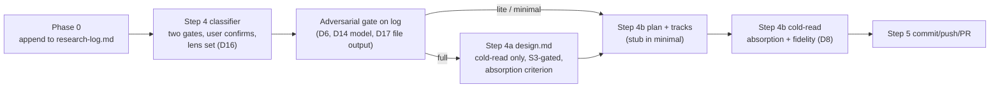

<!-- workflow-sha: e9377f7f133f5cd6ec3028936f28be2819e4ae96 -->
# Track 1: Phase 0/1 authoring pipeline — tier classifier, research log, relocated adversarial gate, write-time cold-read, carrier templates

## Purpose / Big Picture
After this track lands (staged), `/create-plan` classifies every change into
`full`/`lite`/`minimal` at the Phase 0 → 1 boundary and produces
tier-appropriate artifacts: a durable, adversarially-gated research log in
every tier, `design.md` only in `full`, and self-contained track files with
inline Decision Records.

<!-- Reserved for Move 2 — ADDED/MODIFIED/REMOVED triad. Empty until Move 2 lands. -->

Rebuild the Phase 0/1 authoring pipeline around the tier. Phase 0 appends to a
durable research log; the Step 4 classifier proposes the tier the user
confirms; the adversarial review relocates onto the log as a gated pass with
model triage, finding batching, and file-mode output; the cold-read moves to
write time with absorption and fidelity criteria; the Phase-1 templates gain
the aggregator plan, the `minimal` stub, inline track DRs, the tier line, and
the tier-aware Step 1c resume branch.

## Progress
- [ ] Review + decomposition
- [ ] Step implementation
- [ ] Track-level code review
- [ ] Track completion
- [x] 2026-06-11T06:17Z [ctx=info] Review + decomposition complete
- [x] 2026-06-11T08:26Z [ctx=safe] Step 1 complete (commit 5f1e63c92d)
- [x] 2026-06-11T08:51Z [ctx=info] Step 2 complete (commit 4ad4335c03)
- [x] 2026-06-11T09:10Z [ctx=info] Step 3 complete (commit bde2d550494)

## Surprises & Discoveries
<!-- Continuous-log. Promoted by the orchestrator from per-step "What was
discovered" when the finding affects future steps or other tracks. Empty
at Phase 1. -->

- 2026-06-11T08:26Z Step 1 resolved the CR6 open question: `workflow-reindex.py`
  is staged-aware and reindexes the staged mirror directly (`--write`/`--check`
  on staged paths), so steps 2-4 reindex their staged copies the same way. Two
  recurring traps: backtick-wrap cross-file `§X.Y` refs (else rule_8 fires) and
  keep section summaries ≤120 chars with no suffixless cross-file token (else
  rule_5c/rule_6 fire). See Episodes §Step 1.
- 2026-06-11T08:26Z Step 1 surfaced three §2.1 reconciliation items for Track 2:
  the stale "four sections" framing in `adversarial-review.md`'s `## Workflow
  Context`; the new §2.5 third-scope review-file home under `_workflow/reviews/`
  vs the canonical `plan/track-N/reviews/`; and the now-describes-real-work §2.1
  Decision-Log placeholder in `design-review.md`. Cross-track impact: Continue
  (all three sit inside Track 2's planned §2.1 scope). See Episodes §Step 1.
- 2026-06-11T08:51Z Step 2 found the D14 model/effort pin has only a partial
  harness surface: the Agent tool's `model` field carries the model half, but
  there is no per-spawn effort field and no reviewer agent file under
  `.claude/agents/`, so the xhigh-effort pin rides the session default (the
  caveat D14 accepts). Track 2's Phase-3A adversarial spawn (D14) hits the same
  surface and should use the same resolution. Cross-track impact: Continue. See
  Episodes §Step 2.
- 2026-06-11T08:51Z Step 2 flagged a `conventions.md` §1.2 *Plan file content*
  schematic lag — no D18 tier line, unconditional `## Design Document` link —
  against the operative create-plan templates and §1.2 matrix. Candidate for
  Phase C track-level review or a Track 2 conventions touch. See Episodes §Step 2.
- 2026-06-11T09:10Z Step 3 found a reindexer fence trap: `workflow-reindex.py`
  honors only ≤3-space-indented fences, so a deeper-indented substitution block is
  scanned as prose and rule_6 flags concrete `_workflow/<name>.md` path tokens
  inside it (Step 2's gate machinery hit this; fixed by switching to role-named
  placeholders). The durable fix lives in the live `workflow-reindex.py` (out of
  this branch's scope) — a reflection/follow-up candidate. Any future workflow-doc
  step writing indented fences with workflow paths should prefer placeholders. See
  Episodes §Step 3.

## Decision Log
<!-- Continuous-log. Execution-time decisions: inline-replan choices,
scope-downs, dependency reveals, gate-override reasons. -->

<!-- Reserved for Move 1 — per-track inlined Decision Records. -->

## Outcomes & Retrospective
<!-- Continuous-log. Review iteration outcomes and the track-completion
summary at Phase C. -->

- [x] Technical: PASS at iteration 2 (3 findings — T1/T2/T3, all suggestions, all applied as plan-prose sharpenings: scope-note on the adversarial-review.md edit, verbatim risk-tagging HIGH labels, three-walk-site stamp citation)
- [x] Risk: PASS at iteration 2 (4 findings — R1 should-fix applied as a §2.5-readability precondition; R2 applied; R3 already covered by the State-transition acceptance bullet; R4 rejected as D8's accepted semantic-check residual)
- [x] Adversarial: PASS at iteration 2 (7 findings — A1/A2/A4 should-fix applied [S3 log-state carrier, D19 glob-set rationale, S2-safe Step 1c]; A3 should-fix rejected on merits, gate-confirmed [the `planner` §2.5 axis add is necessary, not redundant — create-plan runs as `planner`]; A5/A6/A7 suggestions applied)

## Context and Orientation

Current state of each mechanism this track moves (live paths; all writes go
to the staged mirror per §1.7 except where marked live):

- **`create-plan/SKILL.md`** runs Step 4a/4b unconditionally with a mandatory
  `design.md`; Step 1c routes on bare `design.md`/`implementation-plan.md`
  presence; Phase 0 leaves findings in conversation context only. The plan,
  track, and design templates are inline fenced blocks carrying the §1.6
  stamp directive.
- **`edit-design/SKILL.md`** §Workflow runs Step 3.5 (adversarial sub-agent)
  for `phase1-creation` only, before the cold-read (template around line 398);
  the kind-conditionality is described in the §Workflow intro.
- **`prompts/adversarial-review.md`** carries two scopes today: the Phase-3A
  track scope and `## Design-scoped review (Phase 1)` (line ~41). The third
  scope follows the same retargeting pattern.
- **`prompts/design-review.md`** is the cold-read prompt, currently targeted
  at `design.md` only (Inputs / Comprehension questions / Verdict sections).
- **`research.md`** describes Phase 0 as conversation-context output; no
  durable ledger exists in the live rules.
- **`conventions.md`**: §1.1 glossary lacks the tier/log/aggregator terms;
  §1.2 layout does not list `research-log.md`; §1.6(f) enumerates exactly the
  four stamped artifact types (`implementation-plan.md`, `design.md`,
  `design-mechanics.md`, `plan/track-*.md`) that the frozen
  `workflow-startup-precheck.sh` hardcodes as a four-entry `ls` glob. That glob
  is not a single site: the same four-type enumeration recurs at all three
  script walks (drift ~391-394, migrate ~488-491, normalize ~689-692), so the
  protection D19 leans on is the §1.6(h) glob set shared across the three, not
  the Phase-1 walk alone — adding `research-log.md` to stamping would mean
  editing all three sites, which S1 forbids. The §1.6(h) walk is the
  byte-source the script implements, pinned by a conformance fixture under
  `.claude/scripts/tests/`.
- **`conventions-execution.md` §2.5** (review-file schema,
  manifest-plus-sections, count-validation labels S4/S6) is annotated for
  execution roles/phases only; the gate needs `planner`/`1` on the TOC row
  and the used subsections (D17).
- **`risk-tagging.md`** owns the HIGH-risk category list Gate 1 reuses at
  change level (D4).
- **`design-document-rules.md`** describes the phase1-creation review as
  adversarial-then-cold-read and carries the `### References` footer shape
  D11 renames.
- **`design-mechanical-checks.py`** (live path, outside the §1.7 stageable
  prefixes) implements `section_has_references`.
- **Precedent on this branch**: `_workflow/research-log.md` already exists
  with four of the five D5 sections (`## Baseline and re-validation` has not
  been added; D5 fills it on workflow-modifying branches) — the working
  prototype of the D5 artifact. Its line-1 stamp predates D19 and is harmless
  (no walk enumerates the file).

Deliverables: staged copies of eleven prose files under
`_workflow/staged-workflow/.claude/`, one backward-compatible live edit to
`design-mechanical-checks.py`, and an additive stub-plan fixture test under
`.claude/scripts/tests/` (live, inert — exercises the unchanged script).

## Plan of Work

Vocabulary lands first, then the artifact and gate machinery, then the
SKILL wiring that cites both. The approach in order:

1. **Conventions vocabulary (`conventions.md`).** §1.1 glossary entries for
   change tier, the two gates, research log, aggregator plan, and
   track-canonical live decisions; §1.2 layout adds `research-log.md` and a
   per-tier artifact matrix; §1.6(f) adds `research-log.md` to the
   "Explicitly NOT stamped" list with the append-only/replay-immune rationale
   (D19). §1.6(h) and the script are untouched (S1).
2. **Phase 0 rewiring (`research.md`).** Phase 0 writes the log's
   `## Initial request` at aim capture and appends Decision Log / Surprises /
   Open Questions entries with ISO timestamps and context tags as research
   proceeds; the fifth section (Baseline and re-validation) fills on
   workflow-modifying branches (D5).
3. **The third adversarial scope (`prompts/adversarial-review.md`).**
   `## Research-log-scoped review (Phase 0→1)` following the design-scope
   retargeting pattern: DECISION challenges on the Decision Log,
   ASSUMPTION/INVARIANT challenges on Surprises, scope challenges mostly
   not-applicable, blocker-loop / should-fix-gate / no-`skip` semantics
   (a would-be `skip` raises to blocker), lens priming from the matched
   categories, code-grounding and workflow-modifying criteria transferred
   unchanged (D6). The edit is purely additive — a new scope section. It does
   not touch the file-level `## Workflow Context` block the existing scopes
   share; that block's "four sections" framing is stale against §2.1's
   14-section track-file template, but reconciling it is Track 2's §2.1 work,
   not this scope's.
4. **§2.5 access wiring (`conventions-execution.md`).** The review-file
   schema's TOC row (and the subsections the third scope uses) gains phase `1`
   on its phases axis and `planner` on its roles axis. The phase-`1` add covers
   the Phase-0→1 gate writer (`reviewer-adversarial`, already in the roles list
   but absent from the phases axis, which today stops at `2,3A,3B,3C,4`); the
   `planner` add covers the create-plan main agent that reads the gate-output
   file back at Phase 1 (`/create-plan` runs as `planner`, a role distinct from
   the already-listed `orchestrator` and `reviewer-plan`). A third-scope
   location/lifecycle clause names the review-file home under `_workflow/` (e.g.
   the existing `reviews/` directory), `<type>-iter<N>.md` naming,
   commit-at-return applicability, and the Phase-4 sweep (D17). The clause lands inside §2.5
   as a new sub-clause, restating nothing from §2.1 beyond a cross-reference
   (§2.1 stays untouched by this track). The iteration≥2
   manifest-variant question is resolved here at implementation time.
5. **Classifier and gate wiring (`create-plan/SKILL.md`).** Phase 0 log
   creation (Step 1b/2/3); the Step 4 two-gate classifier reading the log,
   proposing tier + centrally-matched categories, user confirmation including
   lens add/drop (D2/D3/D4/D16); the gate spawn with D14 model/effort pin and
   D17 output path + thin-manifest return + `## Findings` partial-fetch;
   pre-presentation per-entry re-trigger vs post-presentation D15 queue; the
   per-tier Step 4a/4b routing (single Phase-1 session for `lite`/`minimal`);
   the Step 1c tier-aware resume branch — S1's lone routing change. Step 1c
   disambiguates on `implementation-plan.md` presence and its D18 tier line,
   never on a new log read (a Phase-0→1 tier read from the log would be a third
   decision-content read site and break S2). The plan stub is shape-complete
   from the moment Step 4 writes it (D1/D18), so the "`lite`/`minimal` in
   progress, no `design.md` by design" branch fires only when
   `implementation-plan.md` is present (tier line readable there) but
   `design.md` is absent. The narrow window where the gate cleared but no stub
   was written yet (a `/clear` between tier confirmation and the stub write)
   reads as "fresh start": Step 4's classifier re-runs and re-derives the tier
   from the now-populated log through its existing sanctioned authoring read —
   no extra read site, S2 intact.
6. **Templates (`create-plan/SKILL.md`, same file).** Aggregator-plan
   template gains the D18 tier line; the `minimal` stub template (shape-
   complete per D1: `## Plan Review` with its decision checkbox, glyph-valid
   `## Checklist` with one entry, `## Final Artifacts` with its decision
   checkbox, tier line); the track template's
   `## Decision Log` becomes the plan-at-start inline-DR home (full
   four-bullet records, no out-of-file references; the "Reserved for Move 1"
   placeholder retires).
7. **D15 batching (`create-plan/SKILL.md` + `mid-phase-handoff.md`).** The
   tagged queue (`[clarification]`/`[decision]`), the three-step batch (one
   gate run with whole-batch re-challenge → one mutation → one cold-read with
   loop-back), the escape hatch, and the handoff queue block for
   multi-session holds.
8. **Design-side changes (`edit-design/SKILL.md`,
   `design-document-rules.md`).** Step 3.5 removed from `phase1-creation`
   (cold-read only); the S3 gate — cold-read blocked while a log-adversarial
   entry is open, including the batch loop-back. After D6 relocates the
   adversarial pass onto the research log, the log itself is the cross-SKILL
   state carrier: `edit-design`'s Step 4a cold-read reads the log's
   `### Adversarial review of this log …` section and blocks while any entry is
   unresolved (a `NEEDS REVISION` heading with open blockers/should-fix). This
   is a verdict/status read at the already-sanctioned Step 4a authoring point,
   not a new decision-content read site, so S2 holds. The Step 4a cold-read
   also gains the absorption criterion (log → `design.md` D-records). Design
   rules adopt D11: footer rename to `Decisions & invariants`, introduce-once
   within the seed, acceptance #4 rewrite, mechanical-check scope note.
9. **Write-time cold-read (`prompts/design-review.md`).** Second target
   (plan-at-start track sections plus the root per-track BLUF/triad);
   absorption-completeness (load-bearing = `Alternatives rejected` naming a
   real fork, judged not gamed; in-scope = bound to the track's
   `## Interfaces and Dependencies`, including workflow-prose anchors on
   workflow-modifying plans); the full-tier fidelity criterion with the
   provenance-only path for revision-format DRs and the
   authoring-time-only restoration rule (D8).
10. **Phase-1 rules (`planning.md`).** Per-tier Phase-1 flow, the aggregator
    plan in every tier, inline track DRs as the carrier (D7 authoring side),
    and the Gate-1/risk-tagging cross-reference.
11. **Risk-tagging note (`risk-tagging.md`).** The HIGH category list is also
    Gate 1's source, read at change level — one shared source of truth (D4).
    Where steps 5 and 11 surface those categories, quote the live
    `risk-tagging.md` HIGH headings verbatim rather than paraphrasing them — D4
    paraphrases drift from the live labels (e.g. crash-safety vs durability,
    architecture vs load-bearing architecture).
12. **Live script + fixture.** `design-mechanical-checks.py` accepts both
    footer spellings and gains the decision-cited-without-rationale check
    (D11). Backward compatibility is two-sided and both sides are tested: the
    check accepts the legacy `### References` footer (whose entries are bare
    `D<N>` citations carrying no inline rationale, as this branch's frozen
    `design.md` shows) and the new `### Decisions & invariants` footer — the new
    check is scoped so the legacy References footer never trips it, and the
    acceptance exercises the new check against the frozen `design.md`, not only
    the footer-spelling half. A new stub-plan fixture under
    `.claude/scripts/tests/` proves the unchanged precheck script parses the
    `minimal` stub (S1's testable assertion). No existing test file is modified.

Ordering constraints: step 1 (vocabulary) precedes everything that cites it —
this protects staged-artifact consistency at authoring time, not runtime; this
`full`-tier branch's own gate runs against the live develop-state workflow per
I6, not the staged vocabulary. Steps 3-4 (gate prompt + §2.5 schema access)
precede or accompany step 5 (the SKILL that spawns against them); step 4's
phase-`1`/`planner` axis edit is a hard precondition — without it the Phase-1
gate writer and the create-plan reader cannot resolve §2.5 under the TOC filter,
so a step-5 spawn landing before step 4 would strand the schema read. Steps 6-9
are order-flexible among themselves; step 12 is independent. Invariants to
preserve throughout: S1 (no script/existing-test edits), S2 (decision-content
log reads stay exactly two; the Phase-4 verdict-only fold is sanctioned), S3
(freeze order), I6 (every `.claude/**` edit goes to the staged mirror).

## Concrete Steps

1. Stage the vocabulary + phase-rule + review-prompt prose every later step cites — conventions.md (§1.1 tier/gate/log/aggregator/track-decision glossary, §1.2 research-log + per-tier matrix, §1.6(f) log exclusion with the D19 glob-shared rationale), research.md (Phase 0 → durable log, D5), planning.md (per-tier Phase-1 flow + inline track DRs D7 + Gate-1 cross-ref), risk-tagging.md (HIGH list = Gate 1 change-level source D4, verbatim labels), prompts/adversarial-review.md (additive third research-log scope D6), prompts/design-review.md (write-time target + absorption/fidelity D8), conventions-execution.md §2.5 (add phase 1 + role planner; third-scope lifecycle sub-clause D17) — risk: medium (workflow machinery: bounded shared vocabulary + prompt prose) — size: ~7 files; (a) all remaining work is HIGH-isolated (steps 2-5) or the end-of-track tests-only fixture (step 6)  [x] commit: 5f1e63c92d
2. Stage create-plan/SKILL.md Phase-0→1 gate machinery — Phase 0 log creation; Step 4 two-gate classifier (tier + matched categories, user-confirmed lens add/drop D2/D3/D4/D16); gate spawn (D14 model/effort pin, D17 output path + thin manifest + Findings partial-fetch); per-tier Step 4a/4b routing; Step 1c resume branch on implementation-plan.md presence + D18 tier line (S2-safe, no new log read); templates (D18 tier line, shape-complete minimal stub D1, inline-DR track template) — risk: high (workflow machinery: tier classifier, per-tier dispatch, Step 1c auto-resume routing)  [x] commit: 4ad4335c03
3. Stage the D15 review-hold batching — create-plan/SKILL.md (tagged clarification/decision queue; three-step batch: one gate run with whole-batch re-challenge → one mutation → one cold-read loop-back; escape hatch; pre-presentation per-entry re-trigger boundary) plus mid-phase-handoff.md (handoff queue block for multi-session holds) — risk: high (workflow machinery: edits the load-bearing handoff/resume protocol and the gate's review-iteration dispatch)  [x] commit: bde2d550494
4. Stage the design-side changes — edit-design/SKILL.md (remove Step 3.5 from phase1-creation; add the S3 gate blocking the Step 4a cold-read while the log's "Adversarial review of this log" section has an unresolved entry, incl. the D15 loop-back; add the absorption criterion) plus design-document-rules.md (D11: footer rename to "Decisions & invariants", introduce-once, acceptance #4 rewrite, mechanical-check scope note) — risk: high (workflow machinery: adds the S3 freeze-order gate, a control-flow block)  [ ]
5. Edit the LIVE .claude/scripts/design-mechanical-checks.py (D11) — accept both "### References" and "### Decisions & invariants" footers and add the decision-cited-without-rationale check, scoped so the legacy bare-D<N> References footer never trips it; the frozen design.md keeps passing; no existing test modified (S1) — risk: high (workflow machinery: a script that runs automatically; behavioral Python change)  [ ]
6. Add a new LIVE fixture under .claude/scripts/tests/ — run workflow-startup-precheck.sh --mode full against a synthesized minimal stub plan dir, assert a readable state, and walk the post-review transitions (Plan Review flipped to done → State A/C; track plus Final Artifacts flipped → State D/Done), proving the unchanged precheck parses the D1 stub (S1's testable assertion) — risk: low (tests-only, new file) — size: ~1 file; (a) end-of-track tests-only unit validating the live precheck; all other work is HIGH-isolated  [ ]

## Episodes
<!-- Continuous-log. Phase B sub-step 7 appends one block per
completed step, identified by step number + commit SHA. Empty at
Phase 1; Phase A does not populate. -->

### Step 1 — commit 5f1e63c92d, 2026-06-11T08:26Z [ctx=safe]
**What was done:** Staged the seven Phase-0/1 prose files that later steps
cite, all routed to the plan's staged mirror so live `.claude/` stays
untouched and I6 holds. `conventions.md` gained five glossary terms (change
tier, the two tier gates, research log, aggregator plan, track-canonical live
decision), a per-tier artifact-set matrix in §1.2, and the `research-log.md`
entry on the §1.6(f) never-stamped list with the three-walk-site/S1 rationale
(D19). `research.md` rewired Phase 0 output to the durable five-section
research log with append cadence and one-way read discipline (D5).
`planning.md` gained a tier-classification section (two gates, tier map, Gate 1
sourced from `risk-tagging.md`, per-tier Phase-1 flow, inline-DR carrier) and
scoped its design-first language to `full` (D7). `risk-tagging.md` gained a
Gate-1-reuse note quoting the seven HIGH labels verbatim (D4).
`prompts/adversarial-review.md` gained the additive third scope (research-log
gate, gate semantics, domain priming, file-mode output) (D6).
`prompts/design-review.md` gained the second write-time target, track sections,
plus the absorption-completeness and full-tier fidelity criteria (D8).
`conventions-execution.md` §2.5 gained `planner`/phase-`1` access on the TOC
row and three subsections, resolved the iteration-≥2 runs to the
verdict-producer variant, and added the third-scope review-file-home clause
(D17).

**What was discovered:** The CR6 open question (whether `workflow-reindex.py`
runs against the staged mirror or TOCs are hand-written) resolves cleanly: the
reindex script is already staged-aware — it probes the staged `conventions.md`
for the enum bootstrap — and accepts staged paths via `--files`, so `--write`
then `--check` against the staged copies is the supported path. Authoring hit
two reindex traps, both fixed: bare non-backtick cross-file `§X.Y` refs trip
rule_8 as unresolved in-file refs (backtick-wrap them), and section-annotation
summaries cap at 120 chars (rule_5c) where a bare `design.md` token trips rule_6
as a suffixless cross-file ref. The three §1.6(h) walk sites the D19 rationale
cites sit at precheck-script lines ~391/~488/~689. Track 2's §2.1 work inherits
three reconciliation items this step left untouched by design: the file-level
`## Workflow Context` block in `adversarial-review.md` still frames track detail
as "split across four sections" (stale against the 14-section template); the new
§2.5 third-scope clause names a pre-Step-4b review-file home under
`_workflow/reviews/`, distinct from the canonical `plan/track-N/reviews/`, which
§2.1's lifecycle text must stay consistent with; and the §2.1 Decision-Log
placeholder in `design-review.md` now describes work this branch performs.

**What changed from the plan:** One in-scope consistency fix beyond the literal
step text. `planning.md` §Plan file structure carried a develop-baseline framing
("Track files do not exist during Phase 1") that contradicts both the D7/D1
inline-DR-at-Phase-1 carrier this step documents and the `conventions.md` §1.1
glossary truth that track files are created at Phase 1. Corrected to state track
files are created at Phase 1, with only the Concrete Steps roster deferred to
Phase 3. No future step is affected.

**Key files:**
- `…/staged-workflow/.claude/workflow/conventions.md` (new staged copy)
- `…/staged-workflow/.claude/workflow/research.md` (new staged copy)
- `…/staged-workflow/.claude/workflow/planning.md` (new staged copy)
- `…/staged-workflow/.claude/workflow/risk-tagging.md` (new staged copy)
- `…/staged-workflow/.claude/workflow/conventions-execution.md` (new staged copy)
- `…/staged-workflow/.claude/workflow/prompts/adversarial-review.md` (new staged copy)
- `…/staged-workflow/.claude/workflow/prompts/design-review.md` (new staged copy)

### Step 2 — commit 4ad4335c03, 2026-06-11T08:51Z [ctx=info]
**What was done:** Staged `create-plan/SKILL.md` (copy-then-edit from the live
baseline, so I6 holds) with the Phase-0→1 gate machinery. Phase 0 seeds the
durable research log at aim capture (unstamped per D19, idempotent on resume)
and appends decision/surprise/open-question entries as research proceeds. Step 4
gained the two-gate tier classifier (tier + centrally-matched HIGH-risk
categories from `risk-tagging.md`, user-confirmed with explicit lens add/drop),
the relocated adversarial gate on the log (D14 model/effort pin, D17 file-output
+ thin manifest + `## Findings` partial-fetch, `_workflow/reviews/` home, iter-1
fresh set vs iter-≥2 verdict-producer variant, loop-on-blocker /
gate-on-should-fix / no-`skip`), and per-tier Step 4a/4b routing (`full` → design
boundary; `lite`/`minimal` → single Step-4b session). Step 4a became cold-read-only
behind the S3 gate; a Step-4b write-time cold-read runs on the plan-at-start track
sections. Step 1c gained the tier-aware resume branch keyed on
`implementation-plan.md` presence plus the D18 tier line (S2-safe, no new log read).
Templates gained the D18 tier line, the shape-complete `minimal` stub (D1), the
inline-DR track Decision Log carrier (D7), and tier-keyed Step 5 commit cadence
with the `minimal` PR description as the D16 verdict carrier. The step-level
dimensional review (prompt-design, the only workflow reviewer matching the
`.claude/skills/*/SKILL.md` glob on a workflow-only diff) raised two findings,
both fixed in one Review fix: commit `4ad4335c03` — the reviewer spawns gained the
explicit Agent-tool recipe and a concrete D14 `model`-field surface (WP1,
should-fix); the Phase-0 log-create action lost its empty `bash` fence (WP2,
suggestion). Gate-check PASS at iteration 2.

**What was discovered:** The D14 model/effort pin has only a partial harness
surface. The Agent tool's `model` field carries the model half (`full` → fable,
`lite`/`minimal` → opus), but there is no per-spawn effort field, and no
adversarial or cold-read reviewer agent file exists under `.claude/agents/` (the
reviewers are prompt-file + `general-purpose` spawns), so the design's
"reviewer agent's frontmatter" fallback has no file to live on. The xhigh-effort
pin therefore rides the session default — the inheritance caveat D14 already
accepts. Track 2's Phase-3A adversarial spawn (D14, "Implemented in: Track 2")
hits the identical surface and should use the same resolution. Separately, the
`conventions.md` §1.2 *Plan file content* schematic (staged in Step 1) still
carries the develop-baseline shape: no D18 tier line and an unconditional
`## Design Document` link. The operative authoring source is this SKILL's
ready-to-paste templates plus the §1.2 *Per-tier artifact set* matrix Step 1
added, so this reads as a schematic-versus-operative-template lag, not a
contradiction. It is a candidate for the Phase C track-level review or a Track 2
conventions touch.

**Key files:**
- `…/staged-workflow/.claude/skills/create-plan/SKILL.md` (new staged copy)

### Step 3 — commit bde2d550494, 2026-06-11T09:10Z [ctx=info]
**What was done:** Staged the D15 review-hold batching across two files, both to
the staged mirror so I6 holds. `create-plan/SKILL.md` (already staged in Step 2)
gained a "Step 4 review-hold batching (D15)" section between the Step-4b templates
and Step 5, resolving the forward pointer Step 2 left: the queue-open boundary (D5
governs pre-presentation authoring only), the tagged `[clarification]`/`[decision]`
queue, the three-step batch (one whole-batch-re-challenge gate run → one mutation →
one cold-read with loop-back), the single-decision escape hatch, and the
multi-session-hold handoff. `mid-phase-handoff.md` is a fresh staged copy with a
"Review-hold queue block (D15)" section (phases=1) carrying the tagged queue across
a hold, plus a reindexed TOC row. The step-level prompt-design review raised WP1
(should-fix: the escape-hatch left the in-session queue mutation implicit, so the
review-done batch could re-process an escape-hatched finding) and WP2 (suggestion:
"single-decision route" vs "single-finding route" naming); the orchestrator added
RX1 (should-fix: the staged SKILL failed `reindex --check` at rc=1, a regression
from Step 2's fix commit, while the live baseline passes). All three landed in one
Review fix: commit `bde2d550494`; gate-check PASS at iteration 2, RX1 verified
independently at reindex rc=0.

**What was discovered:** The reindexer carries a latent fence trap. The
`workflow-reindex.py` fence regex honors only ≤3-space indents (the CommonMark
limit), so a 5-space-indented substitution block is scanned as live prose, and
rule_6 then flags any concrete `_workflow/<name>.md` path token inside it as a
suffixless cross-file ref. An angle-bracketed placeholder still trips it, so the
`.md` token has to go entirely. The fix names each input by role with a bare
trailing `_workflow/` directory token, matching how the live `edit-design` writes
`<abs path>` placeholders. The durable fix — teach the reindexer to skip indented
fences — lives in the live `workflow-reindex.py`, outside this branch's scope; until
then any workflow-doc step writing an indented fence with workflow paths should
prefer placeholders over concrete `_workflow/<name>.md` values.

**Key files:**
- `…/staged-workflow/.claude/skills/create-plan/SKILL.md` (modified)
- `…/staged-workflow/.claude/workflow/mid-phase-handoff.md` (new staged copy)

## Validation and Acceptance

Track-level acceptance:

- A dry-run read of the staged `create-plan/SKILL.md` walks each of the three
  tiers end-to-end with no dangling references: every section, file, and
  anchor a tier's path cites exists in the staged mirror or, where
  deliberately unchanged, in the live tree.
- The `minimal` stub template parses through the unchanged
  `workflow-startup-precheck.sh` (the new fixture exercises `--mode full`
  against a synthesized stub plan dir, asserts a readable state, and walks
  the post-review transitions: Plan Review flipped to `[x]` yields State A/C,
  track and Final Artifacts flipped yield State D/Done).
- The staged third scope is reachable from the staged SKILL wiring with the
  D14 model/effort parameters and the D17 output path supplied at the spawn
  site.
- Under the TOC filter, the staged §2.5 row resolves for the Phase-0→1 gate
  writer (`reviewer-adversarial` at phase `1`) and the create-plan gate-output
  reader (`planner` at phase `1`); a dry-run read of the staged `create-plan`
  Step 5 wiring reaches the §2.5 schema with that access in place (step 4
  precedes step 5).
- No documented path in the staged `edit-design`/`create-plan` flow reaches a
  design cold-read while a log-adversarial entry is open (S3), including the
  D15 batch loop-back.
- The live `design-mechanical-checks.py` passes against this branch's frozen
  `design.md` (old footer) and against a synthetic doc using the new footer,
  with the new decision-cited-without-rationale check active in both runs — the
  frozen `design.md`'s bare-`D<N>` References footer does not trip the new
  check.
- S2 read points: the staged docs name exactly two decision-content log read
  sites (Step 4a/4b authoring; Phase-2 consistency cross-check) and no staged
  text adds a third decision-read site. The Phase-4 fold's verdict-only read
  (Track 2) is the one sanctioned non-decision read.

<!-- Phase A placeholder for per-step EARS/Gherkin lines. -->

<!-- Reserved for Move 3 — EARS or Gherkin acceptance lines used
verbatim as test method names. Empty until Move 3 lands. -->

## Idempotence and Recovery
<!-- Phase A placeholder — names per-step idempotence and recovery
paths once steps are decomposed. -->

## Artifacts and Notes
<!-- Continuous-log (rare). Cross-step artifact references that don't
belong to one specific step. Per-step episode content lives in
`## Episodes` above. Often empty. -->

## Interfaces and Dependencies

**In-scope files** (writes route to
`docs/adr/plan-slimization/_workflow/staged-workflow/.claude/...` per §1.7,
except the two marked live):

1. `.claude/skills/create-plan/SKILL.md`
2. `.claude/skills/edit-design/SKILL.md`
3. `.claude/workflow/research.md`
4. `.claude/workflow/planning.md`
5. `.claude/workflow/design-document-rules.md`
6. `.claude/workflow/mid-phase-handoff.md`
7. `.claude/workflow/risk-tagging.md`
8. `.claude/workflow/conventions.md` (§1.1, §1.2, §1.6(f))
9. `.claude/workflow/conventions-execution.md` (§2.5 only — §2.1 belongs to Track 2)
10. `.claude/workflow/prompts/adversarial-review.md`
11. `.claude/workflow/prompts/design-review.md`
12. `.claude/scripts/design-mechanical-checks.py` (live; backward-compatible edit)
13. `.claude/scripts/tests/` stub-plan fixture (live; new file only)

**Out of scope**: `workflow-startup-precheck.sh` and every existing test
(S1); all Track 2 files (`track-review.md`, `implementation-review.md`,
`structural-review.md` doc + prompt, `prompts/consistency-review.md`,
`inline-replanning.md`, `implementer-rules.md`, `plan-slim-rendering.md`,
`workflow.md`, `prompts/create-final-design.md`, `conventions-execution.md`
§2.1); `.claude/agents/**`; the `execute-tracks` SKILL (State 0 routing is
tier-agnostic — pass selection lives inside `implementation-review.md`).

**Sizing justification (argumentation gate).** The load-bearing reason this
track is not folded into a neighbor is subject cohesion, not the file count:
`conventions-execution.md` straddles Tracks 1 and 2 deliberately — §2.5 is the
D17 gate-output schema consumed at the Phase 0→1 gate (this track's subject),
§2.1 is the Phase-3 track-file lifecycle (Track 2's subject). Folding both edits
into either track would split a subject to co-locate a file; the tracks are
adjacent and the section edits are disjoint. Thirteen in-scope files sits one
above the soft ~12 merge floor and well under the split ceiling, so the count
alone never forced a merge; the overlap is recorded here per `planning.md`
§Track descriptions.

**Dependencies.** Upstream: none. Downstream: Track 2 consumes the tier
vocabulary (glossary), the D18 tier-line shape, the log's gate-verdict
records (Phase-4 fold), and the inline-DR track shape (§2.1 lifecycle, slim
rendering, propagation duty).

**Signatures and contracts.** Gate spawn: Agent call with `model` per D14
(Fable 5 in `full`, Opus 4.x otherwise), explicit xhigh effort pin, and an
output-path argument per D17; returns a thin §2.5 manifest. Stamp idiom for
new stamped artifacts: `conventions.md` §1.6(b) paired test-and-fallback,
verbatim. The research log itself is created unstamped (D19).

## Base commit

2775833bc33bab3d8acc1f3dd34a219e8ebe5ea7
