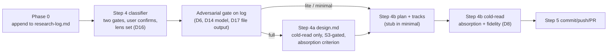

<!-- workflow-sha: e9377f7f133f5cd6ec3028936f28be2819e4ae96 -->
# Track 1: Phase 0/1 authoring pipeline — tier classifier, research log, relocated adversarial gate, write-time cold-read, carrier templates

## Purpose / Big Picture
After this track lands (staged), `/create-plan` classifies every change into
`full`/`lite`/`minimal` at the Phase 0 → 1 boundary and produces
tier-appropriate artifacts: a durable, adversarially-gated research log in
every tier, `design.md` only in `full`, and self-contained track files with
inline Decision Records.

<!-- Reserved for Move 2 — ADDED/MODIFIED/REMOVED triad. Empty until Move 2 lands. -->

Rebuild the Phase 0/1 authoring pipeline around the tier. Phase 0 appends to a
durable research log; the Step 4 classifier proposes the tier the user
confirms; the adversarial review relocates onto the log as a gated pass with
model triage, finding batching, and file-mode output; the cold-read moves to
write time with absorption and fidelity criteria; the Phase-1 templates gain
the aggregator plan, the `minimal` stub, inline track DRs, the tier line, and
the tier-aware Step 1c resume branch.

## Progress
- [ ] Review + decomposition
- [ ] Step implementation
- [ ] Track-level code review
- [ ] Track completion

## Surprises & Discoveries
<!-- Continuous-log. Promoted by the orchestrator from per-step "What was
discovered" when the finding affects future steps or other tracks. Empty
at Phase 1. -->

## Decision Log
<!-- Continuous-log. Execution-time decisions: inline-replan choices,
scope-downs, dependency reveals, gate-override reasons. -->

<!-- Reserved for Move 1 — per-track inlined Decision Records. -->

## Outcomes & Retrospective
<!-- Continuous-log. Review iteration outcomes and the track-completion
summary at Phase C. -->

## Context and Orientation

Current state of each mechanism this track moves (live paths; all writes go
to the staged mirror per §1.7 except where marked live):

- **`create-plan/SKILL.md`** runs Step 4a/4b unconditionally with a mandatory
  `design.md`; Step 1c routes on bare `design.md`/`implementation-plan.md`
  presence; Phase 0 leaves findings in conversation context only. The plan,
  track, and design templates are inline fenced blocks carrying the §1.6
  stamp directive.
- **`edit-design/SKILL.md`** §Workflow runs Step 3.5 (adversarial sub-agent)
  for `phase1-creation` only, before the cold-read (template around line 398);
  the kind-conditionality is described in the §Workflow intro.
- **`prompts/adversarial-review.md`** carries two scopes today: the Phase-3A
  track scope and `## Design-scoped review (Phase 1)` (line ~41). The third
  scope follows the same retargeting pattern.
- **`prompts/design-review.md`** is the cold-read prompt, currently targeted
  at `design.md` only (Inputs / Comprehension questions / Verdict sections).
- **`research.md`** describes Phase 0 as conversation-context output; no
  durable ledger exists in the live rules.
- **`conventions.md`**: §1.1 glossary lacks the tier/log/aggregator terms;
  §1.2 layout does not list `research-log.md`; §1.6(f) enumerates exactly the
  four stamped artifact types that the frozen
  `workflow-startup-precheck.sh` walk hardcodes (script lines ~391-394 — `ls`
  over `implementation-plan.md`, `design.md`, `design-mechanics.md`,
  `plan/track-*.md`). The §1.6(h) walk is the byte-source the script
  implements, pinned by a conformance fixture under `.claude/scripts/tests/`.
- **`conventions-execution.md` §2.5** (review-file schema,
  manifest-plus-sections, count-validation labels S4/S6) is annotated for
  execution roles/phases only; the gate needs `planner`/`1` on the TOC row
  and the used subsections (D17).
- **`risk-tagging.md`** owns the HIGH-risk category list Gate 1 reuses at
  change level (D4).
- **`design-document-rules.md`** describes the phase1-creation review as
  adversarial-then-cold-read and carries the `### References` footer shape
  D11 renames.
- **`design-mechanical-checks.py`** (live path, outside the §1.7 stageable
  prefixes) implements `section_has_references`.
- **Precedent on this branch**: `_workflow/research-log.md` already exists
  with the five-section shape — the working prototype of the D5 artifact. Its
  line-1 stamp predates D19 and is harmless (no walk enumerates the file).

Deliverables: staged copies of eleven prose files under
`_workflow/staged-workflow/.claude/`, one backward-compatible live edit to
`design-mechanical-checks.py`, and an additive stub-plan fixture test under
`.claude/scripts/tests/` (live, inert — exercises the unchanged script).

## Plan of Work

Vocabulary lands first, then the artifact and gate machinery, then the
SKILL wiring that cites both. The approach in order:

1. **Conventions vocabulary (`conventions.md`).** §1.1 glossary entries for
   change tier, the two gates, research log, aggregator plan, and
   track-canonical live decisions; §1.2 layout adds `research-log.md` and a
   per-tier artifact matrix; §1.6(f) adds `research-log.md` to the
   "Explicitly NOT stamped" list with the append-only/replay-immune rationale
   (D19). §1.6(h) and the script are untouched (S1).
2. **Phase 0 rewiring (`research.md`).** Phase 0 writes the log's
   `## Initial request` at aim capture and appends Decision Log / Surprises /
   Open Questions entries with ISO timestamps and context tags as research
   proceeds; the fifth section (Baseline and re-validation) fills on
   workflow-modifying branches (D5).
3. **The third adversarial scope (`prompts/adversarial-review.md`).**
   `## Research-log-scoped review (Phase 0→1)` following the design-scope
   retargeting pattern: DECISION challenges on the Decision Log,
   ASSUMPTION/INVARIANT challenges on Surprises, scope challenges mostly
   not-applicable, blocker-loop / should-fix-gate / no-`skip` semantics
   (a would-be `skip` raises to blocker), lens priming from the matched
   categories, code-grounding and workflow-modifying criteria transferred
   unchanged (D6).
4. **§2.5 access wiring (`conventions-execution.md`).** The review-file
   schema's TOC row and the subsections the third scope uses extend their
   phases with `1` and roles with `planner`; a third-scope location/lifecycle
   clause names the review-file home under `_workflow/` (e.g. the existing
   `reviews/` directory), `<type>-iter<N>.md` naming, commit-at-return
   applicability, and the Phase-4 sweep (D17). The iteration≥2
   manifest-variant question is resolved here at implementation time.
5. **Classifier and gate wiring (`create-plan/SKILL.md`).** Phase 0 log
   creation (Step 1b/2/3); the Step 4 two-gate classifier reading the log,
   proposing tier + centrally-matched categories, user confirmation including
   lens add/drop (D2/D3/D4/D16); the gate spawn with D14 model/effort pin and
   D17 output path + thin-manifest return + `## Findings` partial-fetch;
   pre-presentation per-entry re-trigger vs post-presentation D15 queue; the
   per-tier Step 4a/4b routing (single Phase-1 session for `lite`/`minimal`);
   the Step 1c tier-aware resume branch ("`lite`/`minimal` in progress, no
   `design.md` by design" vs "fresh start" — S1's lone routing change).
6. **Templates (`create-plan/SKILL.md`, same file).** Aggregator-plan
   template gains the D18 tier line; the `minimal` stub template (shape-
   complete per D1: `## Plan Review`, glyph-valid `## Checklist` with one
   entry, `## Final Artifacts`, tier line); the track template's
   `## Decision Log` becomes the plan-at-start inline-DR home (full
   four-bullet records, no out-of-file references; the "Reserved for Move 1"
   placeholder retires).
7. **D15 batching (`create-plan/SKILL.md` + `mid-phase-handoff.md`).** The
   tagged queue (`[clarification]`/`[decision]`), the three-step batch (one
   gate run with whole-batch re-challenge → one mutation → one cold-read with
   loop-back), the escape hatch, and the handoff queue block for
   multi-session holds.
8. **Design-side changes (`edit-design/SKILL.md`,
   `design-document-rules.md`).** Step 3.5 removed from `phase1-creation`
   (cold-read only); the S3 gate — cold-read blocked while a log-adversarial
   entry is open, including the batch loop-back; the Step 4a cold-read gains
   the absorption criterion (log → `design.md` D-records). Design rules adopt
   D11: footer rename to `Decisions & invariants`, introduce-once within the
   seed, acceptance #4 rewrite, mechanical-check scope note.
9. **Write-time cold-read (`prompts/design-review.md`).** Second target
   (plan-at-start track sections plus the root per-track BLUF/triad);
   absorption-completeness (load-bearing = `Alternatives rejected` naming a
   real fork, judged not gamed; in-scope = bound to the track's
   `## Interfaces and Dependencies`, including workflow-prose anchors on
   workflow-modifying plans); the full-tier fidelity criterion with the
   provenance-only path for revision-format DRs and the
   authoring-time-only restoration rule (D8).
10. **Phase-1 rules (`planning.md`).** Per-tier Phase-1 flow, the aggregator
    plan in every tier, inline track DRs as the carrier (D7 authoring side),
    and the Gate-1/risk-tagging cross-reference.
11. **Risk-tagging note (`risk-tagging.md`).** The HIGH category list is also
    Gate 1's source, read at change level — one shared source of truth (D4).
12. **Live script + fixture.** `design-mechanical-checks.py` accepts both
    footer spellings and gains the decision-cited-without-rationale check
    (D11), backward-compatible so the live frozen `design.md` keeps passing;
    a new stub-plan fixture under `.claude/scripts/tests/` proves the
    unchanged precheck script parses the `minimal` stub (S1's testable
    assertion). No existing test file is modified.

Ordering constraints: step 1 (vocabulary) precedes everything that cites it;
steps 3-4 (gate prompt + schema access) precede or accompany step 5 (the
SKILL that spawns against them); steps 6-9 are order-flexible among
themselves; step 12 is independent. Invariants to preserve throughout: S1 (no
script/existing-test edits), S2 (log read points stay exactly two), S3
(freeze order), I6 (every `.claude/**` edit goes to the staged mirror).

## Concrete Steps
<!-- Phase A placeholder — decomposition writes a thin numbered
roster here: one entry per step with description, `risk:` tag, an
optional `size:` clause, and a `[ ]` status checkbox. The `size:`
clause (`— size: ~N files; <reason>`) appears only on an under-filled
`low`/`medium` step (rule in `track-review.md` §Step Decomposition).
Per-step episodes do NOT live here; they live in `## Episodes` below.
The roster is immutable after Phase A except for the status checkbox
flip and the optional `commit:` annotation Phase B appends. -->

## Episodes
<!-- Continuous-log. Phase B sub-step 7 appends one block per
completed step, identified by step number + commit SHA. Empty at
Phase 1; Phase A does not populate. -->

## Validation and Acceptance

Track-level acceptance:

- A dry-run read of the staged `create-plan/SKILL.md` walks each of the three
  tiers end-to-end with no dangling references: every section, file, and
  anchor a tier's path cites exists in the staged mirror or, where
  deliberately unchanged, in the live tree.
- The `minimal` stub template parses through the unchanged
  `workflow-startup-precheck.sh` (the new fixture exercises `--mode full`
  against a synthesized stub plan dir and asserts a readable state).
- The staged third scope is reachable from the staged SKILL wiring with the
  D14 model/effort parameters and the D17 output path supplied at the spawn
  site.
- No documented path in the staged `edit-design`/`create-plan` flow reaches a
  design cold-read while a log-adversarial entry is open (S3), including the
  D15 batch loop-back.
- The live `design-mechanical-checks.py` passes against this branch's frozen
  `design.md` (old footer) and against a synthetic doc using the new footer.
- S2 read points: the staged docs name exactly two log read sites (Step 4a/4b
  authoring; Phase-2 consistency cross-check) and no staged text adds a third.

<!-- Phase A placeholder for per-step EARS/Gherkin lines. -->

<!-- Reserved for Move 3 — EARS or Gherkin acceptance lines used
verbatim as test method names. Empty until Move 3 lands. -->

## Idempotence and Recovery
<!-- Phase A placeholder — names per-step idempotence and recovery
paths once steps are decomposed. -->

## Artifacts and Notes
<!-- Continuous-log (rare). Cross-step artifact references that don't
belong to one specific step. Per-step episode content lives in
`## Episodes` above. Often empty. -->

## Interfaces and Dependencies

**In-scope files** (writes route to
`docs/adr/plan-slimization/_workflow/staged-workflow/.claude/...` per §1.7,
except the two marked live):

1. `.claude/skills/create-plan/SKILL.md`
2. `.claude/skills/edit-design/SKILL.md`
3. `.claude/workflow/research.md`
4. `.claude/workflow/planning.md`
5. `.claude/workflow/design-document-rules.md`
6. `.claude/workflow/mid-phase-handoff.md`
7. `.claude/workflow/risk-tagging.md`
8. `.claude/workflow/conventions.md` (§1.1, §1.2, §1.6(f))
9. `.claude/workflow/conventions-execution.md` (§2.5 only — §2.1 belongs to Track 2)
10. `.claude/workflow/prompts/adversarial-review.md`
11. `.claude/workflow/prompts/design-review.md`
12. `.claude/scripts/design-mechanical-checks.py` (live; backward-compatible edit)
13. `.claude/scripts/tests/` stub-plan fixture (live; new file only)

**Out of scope**: `workflow-startup-precheck.sh` and every existing test
(S1); all Track 2 files (`track-review.md`, `implementation-review.md`,
`structural-review.md` doc + prompt, `prompts/consistency-review.md`,
`inline-replanning.md`, `implementer-rules.md`, `plan-slim-rendering.md`,
`workflow.md`, `prompts/create-final-design.md`, `conventions-execution.md`
§2.1); `.claude/agents/**`; the `execute-tracks` SKILL (State 0 routing is
tier-agnostic — pass selection lives inside `implementation-review.md`).

**Sizing justification (argumentation gate).** Thirteen in-scope files —
above the merge floor, under the ceiling. `conventions-execution.md`
straddles Tracks 1 and 2 deliberately: §2.5 is the D17 gate-output schema
consumed at the Phase 0→1 gate (this track's subject), §2.1 is the Phase-3
track-file lifecycle (Track 2's subject). Folding both edits into either
track would split a subject to co-locate a file; the tracks are adjacent, the
section edits are disjoint, and the overlap is recorded here per
`planning.md` §Track descriptions.

**Dependencies.** Upstream: none. Downstream: Track 2 consumes the tier
vocabulary (glossary), the D18 tier-line shape, the log's gate-verdict
records (Phase-4 fold), and the inline-DR track shape (§2.1 lifecycle, slim
rendering, propagation duty).

**Signatures and contracts.** Gate spawn: Agent call with `model` per D14
(Fable 5 in `full`, Opus 4.x otherwise), explicit xhigh effort pin, and an
output-path argument per D17; returns a thin §2.5 manifest. Stamp idiom for
new stamped artifacts: `conventions.md` §1.6(b) paired test-and-fallback,
verbatim. The research log itself is created unstamped (D19).
