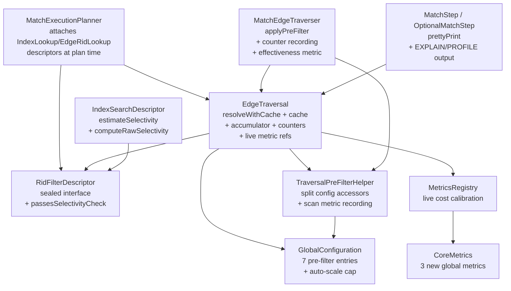

# Pre-filter Selectivity Fix — Architecture Decision Record

## Summary

The MATCH engine's adaptive pre-filter ratio check
(`ridSetSize / linkBagSize <= 0.8`) silently blocked all `IndexLookup`
pre-filters for typical workloads because it compared a global index hit
count against a per-vertex link bag size — a meaningless ratio for
index-based lookups. This fix splits the selectivity check by descriptor
type, adds a build amortization guard, raises the RidSet size cap with
heap-proportional auto-scaling, surfaces pre-filter decisions in
EXPLAIN/PROFILE output, and integrates live cost calibration via
`MetricsRegistry`.

## Goals

- **Primary**: Unblock `IndexLookup` pre-filters by splitting the
  selectivity check — up to 37x fewer record loads on narrow-range date
  queries (LDBC IC4, IC11a, IC11b, IC5).
- **Secondary**: Replace the hardcoded `maxRidSetSize` cap with
  heap-proportional auto-scaling (0.5% of max heap, clamped to [100K, 10M]).
- **Secondary**: Add EXPLAIN/PROFILE observability for pre-filter decisions.
- **Secondary**: Replace the hardcoded `loadToScanRatio = 100` with live
  cost calibration from `MetricsRegistry`.

All goals were achieved as planned. No goals were descoped.

## Constraints

- **Backward compatibility**: The old `QUERY_PREFILTER_MAX_SELECTIVITY_RATIO`
  config is deprecated but still honored as a fallback for the edge-lookup
  ratio. The index-lookup selectivity intentionally does NOT fall back to
  the old property (semantics differ fundamentally).
- **No planner changes**: All fixes are in the runtime path
  (`EdgeTraversal.resolveWithCache()`, `MatchEdgeTraverser.applyPreFilter()`,
  `TraversalPreFilterHelper`).
- **Thread safety**: `EdgeTraversal` is per-query (not shared). Mutable
  counters and accumulators are safe without synchronization.
  `MetricsRegistry` metrics are thread-safe by design.
- **Memory budget**: Auto-scaled cap at 10M entries worst-case uses ~5 MB
  per RidSet (Roaring64Bitmap). With 32 concurrent queries, worst case
  ~160 MB total — acceptable for large-heap deployments where the cap
  auto-scales that high.

**New constraint discovered**: `configuredLoadToScanRatio()` must guard
against `Infinity` input (via `Double.isFinite()`) — a positive Infinity
would pass the `value > 0` check and corrupt the amortization formula.

## Architecture Notes

### Component Map

- **`RidFilterDescriptor`**: Sealed interface with `passesSelectivityCheck()`
  dispatching to per-variant formulas. `EdgeRidLookup` keeps the overlap
  formula. `IndexLookup` uses class-level selectivity via
  `IndexSearchDescriptor.estimateSelectivity()`. `DirectRid` always passes.
  `Composite` passes if any child passes.
- **`EdgeTraversal`**: Central coordination point. Owns the RidSet cache,
  build amortization accumulator, live metric references, and observability
  counters. All transient fields are intentionally not copied by `copy()`.
- **`MatchEdgeTraverser`**: `applyPreFilter()` records counters and
  effectiveness metrics. Short-circuits the per-vertex recheck for
  `IndexLookup` via `instanceof`.
- **`TraversalPreFilterHelper`**: Static accessors for split config values.
  `resolveIndexToRidSet()` records scan timing and entry count metrics.
  `passesRatioCheck()` is retained for the SELECT engine (`ExpandStep`).
- **`GlobalConfiguration`**: 7 pre-filter entries including auto-scaled cap,
  deprecated old property, and sentinel-default load-to-scan ratio.
- **`MatchStep` / `OptionalMatchStep`**: `prettyPrint()` extended with
  descriptor info, selectivity display, and PROFILE stats.
- **`CoreMetrics`**: Three new global metrics
  (`PREFILTER_SCAN_NANOS`, `PREFILTER_SCAN_ENTRIES`,
  `PREFILTER_EFFECTIVENESS`) registered in `GLOBAL_METRICS`.
- **`IndexSearchDescriptor`**: `estimateSelectivity()` returns raw
  selectivity fraction. `computeRawSelectivity()` eliminates three-way
  code duplication.

### Decision Records

#### D1: Split selectivity check by descriptor type
- **Implemented as planned.** Each variant has its own formula via
  `passesSelectivityCheck()` on the sealed interface.
- `IndexLookup` uses `estimateSelectivity()` on `IndexSearchDescriptor`
  (changed from the planned `getClassCardinality()` — combines estimation
  into a single method).

#### D2: IndexLookup selectivity uses IndexStatistics.totalCount()
- **Implemented as planned.** `estimateSelectivity()` returns
  `computeRawSelectivity(stats, histogram, ctx)` which uses
  `indexStats.totalCount()` as the denominator. O(1), cached.

#### D3: Accumulate-and-trigger build amortization
- **Implemented as planned** with refinements: `indexLookupSelectivity`
  uses `NaN` sentinel (not `0.0`), and the selectivity check is inlined
  in `resolveWithCache()` to cache the value once and reuse for both the
  threshold check and the amortization formula — eliminating a redundant
  `estimateSelectivity()` call per vertex.

#### D4: Auto-scale cap proportional to heap size
- **Implemented as planned.** The formula
  `min(10M, max(100K, maxMemory / 200))` is implemented as a `defValue`
  expression in the enum constant, following the existing
  `ENVIRONMENT_LOCK_MANAGER_CONCURRENCY_LEVEL` precedent.

#### D5: Live cost calibration via MetricsRegistry
- **Modified during execution.** The planned throughput-based ratio
  (`scanRate / loadRate`) was replaced with a weighted load cost model:
  `estimatedLoadNanos / avgScanNanosPerEntry`, where `estimatedLoadNanos`
  is weighted by `CACHE_HIT_RATIO` between `COLD_LOAD_NANOS` (100,000 ns)
  and `WARM_LOAD_NANOS` (500 ns). The ratio is clamped to [5, 1000].
  **Reason**: The throughput-based ratio computes a workload mix ratio
  (how much scanning vs. loading the system is doing), not a cost ratio
  (how expensive loading is relative to scanning). The cost model correctly
  compares the per-operation costs.

#### D6: Detailed PROFILE/EXPLAIN diagnostics
- **Implemented as planned** with additions:
  - `PreFilterSkipReason` has 6 values (added `OVERLAP_RATIO_TOO_HIGH`)
  - PROFILE stats gated behind `profilingEnabled` (prevents false
    "NEVER APPLIED" for EXPLAIN-only queries)
  - IndexLookup selectivity displayed in EXPLAIN (lazy via `ctx`) and
    PROFILE (cached on `EdgeTraversal`)
  - Both `MatchStep` and `OptionalMatchStep` updated

#### D7: DRY refactoring of IndexSearchDescriptor (emerged during execution)
- **New decision.** Track 1 discovered three methods in
  `IndexSearchDescriptor` (`estimateHits`, `estimateSelectivity`,
  `estimateFromHistogram`) with identical selectivity computation logic.
  Extracted `computeRawSelectivity(IndexStatistics, EquiDepthHistogram,
  CommandContext)` as a private helper to eliminate the duplication.
  **Rationale**: Code review finding CQ1 — the duplication would cause
  divergence when the estimation logic is modified in the future.

#### D8: Per-query caching of live cost ratio (emerged during execution)
- **New decision.** Track 5 code review (PF1) identified that computing
  the live ratio per-vertex would acquire `ReentrantLock` inside
  `Meter.getRate()` on every vertex. Added `cachedLiveRatio` field on
  `EdgeTraversal` — computed once per query lifetime. Since metrics flush
  at ~1 Hz and EdgeTraversal is per-query (sub-second lifetime), one read
  is sufficient.

#### D9: IndexLookup selectivity rejection caching (emerged during execution)
- **New decision.** Track 1, Step 3 discovered that when
  `resolveWithCache()` rejects an IndexLookup descriptor due to selectivity,
  the result is safe to cache permanently (unlike EdgeRidLookup deferral)
  because IndexLookup selectivity is class-level and constant per query.
  This avoids redundant `estimateSelectivity()` calls on subsequent vertices.

### Invariants

- `EdgeRidLookup` ratio check behavior is unchanged from the original code
  (regression guard)
- `IndexLookup` pre-filter activates when selectivity < 0.95 AND
  accumulated neighbors exceed build threshold AND estimated size < cap
- The accumulate-and-trigger guard does NOT cache null for deferred builds
  (later vertices may push accumulated total over threshold)
- Auto-scaled cap equals explicit config when set; auto-calculation only
  when no explicit value is configured
- PROFILE output shows "NEVER APPLIED" with diagnostic info when the
  pre-filter is attached but never activates
- Metric references and counters are NOT copied by `copy()` — fresh
  EdgeTraversal instances start with clean state
- `passesRatioCheck()` is retained in `TraversalPreFilterHelper` for the
  SELECT engine (`ExpandStep`) — only MATCH engine callers switched to
  `passesSelectivityCheck()`

### Integration Points

- `IndexSearchDescriptor.estimateHits(ctx)` — reused for runtime
  selectivity via shared `computeRawSelectivity()`
- `Index.getStatistics(session).totalCount()` — class cardinality source
- `MetricsRegistry.globalMetric()` — recording and querying live metrics
- `MatchStep.prettyPrint()` — EXPLAIN/PROFILE output surface
- `CoreMetrics.CACHE_HIT_RATIO` — existing disk cache metric reused for
  load cost estimation
- `YouTrackDBEnginesManager.startup()` — cap value logged at engine startup

### Non-Goals

- Changing the planner's descriptor attachment logic (already correct)
- Per-vertex selectivity for IndexLookup (class-level is sufficient)
- Multi-column histograms for composite index selectivity
- Changing EdgeRidLookup behavior (only IndexLookup was broken)
- Migrating ExpandStep (SELECT engine) to `passesSelectivityCheck()` — it
  continues using the existing `passesRatioCheck()` path

## Key Discoveries

1. **`IndexSearchDescriptor` had duplicated selectivity logic**: Three
   methods (`estimateHits`, `estimateFromHistogram`, and the new
   `estimateSelectivity`) shared identical computation. The DRY refactoring
   into `computeRawSelectivity()` prevents future divergence. (Track 1)

2. **IndexLookup selectivity rejections can be cached permanently**:
   Unlike EdgeRidLookup (where the ratio depends on the per-vertex link bag
   size), IndexLookup selectivity is a class-level constant. Caching null
   for selectivity rejections saves redundant computation. (Track 1)

3. **`GlobalConfiguration.isChanged()` is permanently true after
   `setValue()`**: No reset mechanism existed. Added `resetToDefault()` for
   test infrastructure to prevent cross-test contamination when tests share
   the same JVM. (Track 1, Track 3)

4. **Mockito cannot mock sealed interfaces directly**: Must mock the
   permitted types (`EdgeRidLookup`, `IndexLookup`) instead of the sealed
   `RidFilterDescriptor` interface. (Track 1)

5. **Throughput-based ratio ≠ cost ratio**: The planned `scanRate / loadRate`
   formula computes how much of each operation the system is doing (a
   workload mix), not how expensive one is relative to the other. A
   cost-based model using per-operation nanoseconds (weighted by cache hit
   rate) gives the correct ratio for the amortization formula. (Track 5)

6. **IEEE 754 NaN behavior in `Math.max/min`**: `Math.max(NaN, x)` and
   `Math.min(NaN, x)` silently return `NaN` (per IEEE 754), which propagates
   through arithmetic and corrupts downstream results. The
   `computeLiveCostRatio` method guards `cacheHitPct` with an explicit
   `Double.isFinite()` check before passing it to `Math.max/min`.
   Similarly, `configuredLoadToScanRatio()` guards against positive Infinity
   which would pass a `value > 0` check. (Track 5)

7. **Per-vertex MetricsRegistry lookups on the hot path**: Calling
   `MetricsRegistry.globalMetric()` per vertex causes `ConcurrentHashMap`
   lookups and `ReentrantLock` acquisitions inside `Meter.getRate()`. Both
   metric references and the computed ratio are cached on `EdgeTraversal`:
   references lazily on first IndexLookup encounter, ratio once per query.
   (Track 5)

8. **PROFILE stats must be gated behind profilingEnabled**: Without the
   gate, EXPLAIN-only queries (which don't execute the plan) would show
   "NEVER APPLIED" with zero counters — a false diagnostic. (Track 4)
