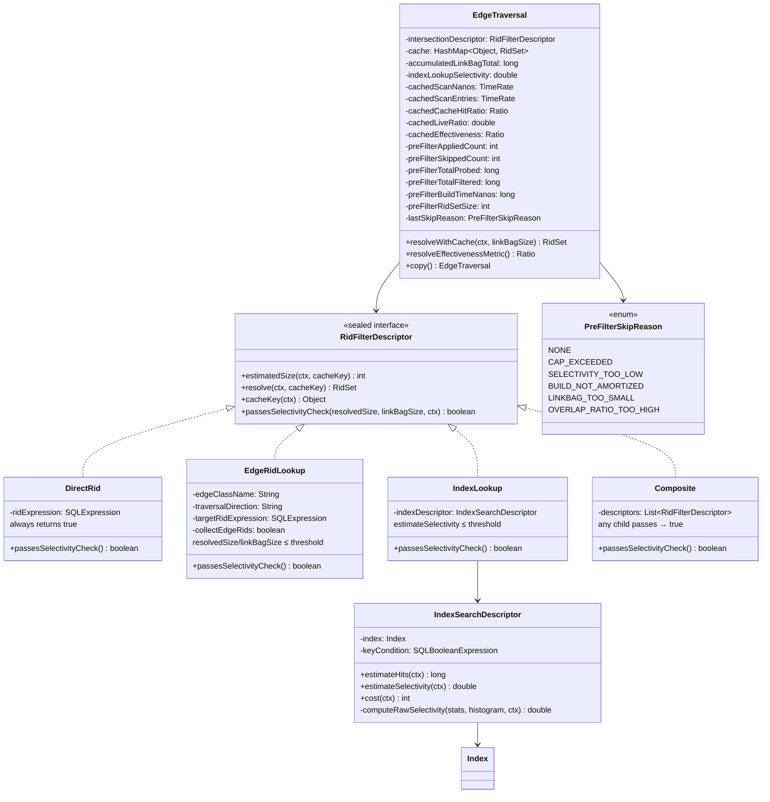
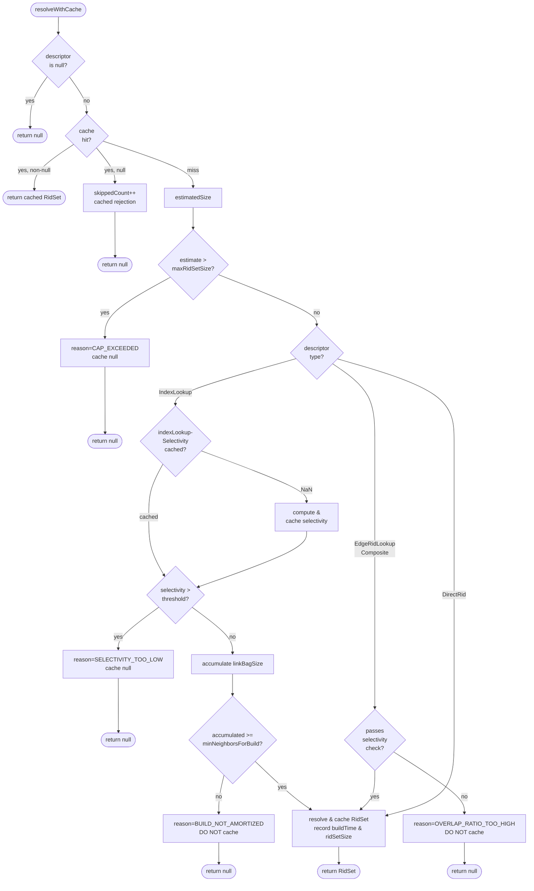
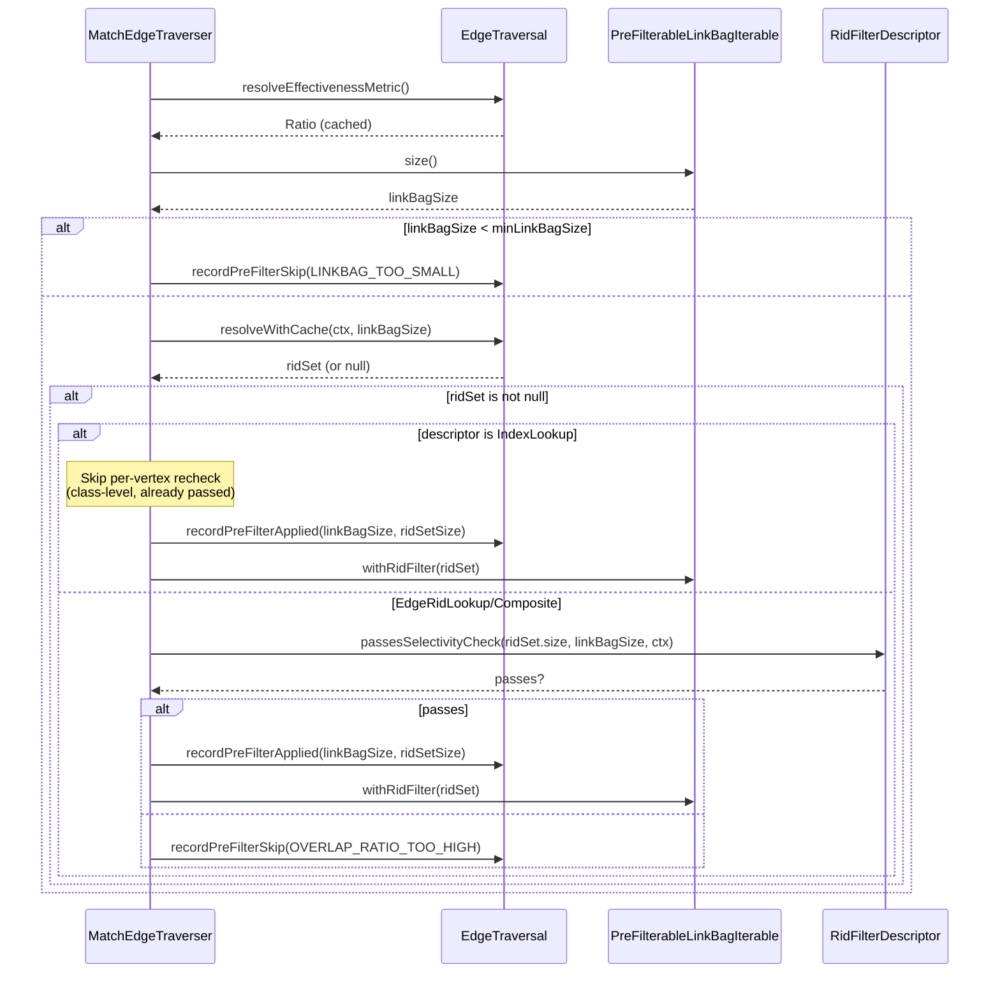
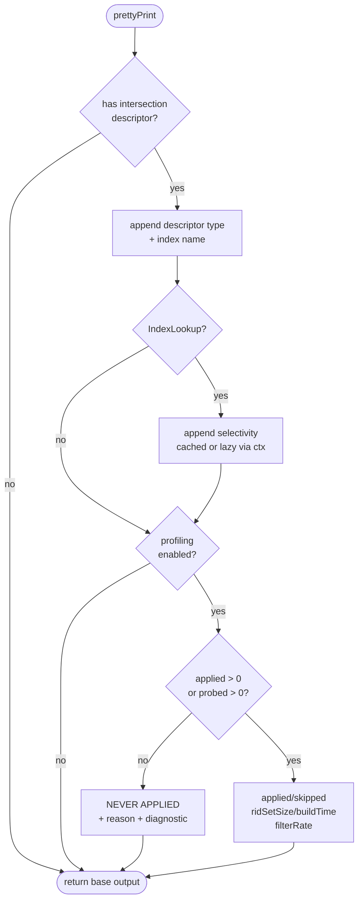

# Pre-filter Selectivity Fix — Final Design

## Overview

The MATCH engine's adaptive pre-filter uses a bitmap intersection strategy:
before loading records from a link bag, it resolves a `RidFilterDescriptor`
into a `RidSet` (Roaring64Bitmap) and skips entries not in the set. The
original runtime guard (`ridSetSize / linkBagSize <= 0.8`) was correct for
`EdgeRidLookup` (overlap-based) but blocked all `IndexLookup` pre-filters
because it compared a global index hit count against a per-vertex link bag
size — a meaningless ratio.

The fix splits the selectivity check into descriptor-specific implementations
on the `RidFilterDescriptor` sealed interface, adds a build amortization
guard to prevent wasted materialization, raises the `maxRidSetSize` cap with
heap-proportional auto-scaling, surfaces all decisions in EXPLAIN/PROFILE
output, and calibrates the build amortization formula with live metrics from
`MetricsRegistry`.

**High-level deviations from the original plan:**
- `getClassCardinality()` was replaced by `estimateSelectivity()` on
  `IndexSearchDescriptor`, combining estimation and selectivity into a single
  method rather than two.
- A DRY refactoring extracted `computeRawSelectivity()` to eliminate
  three-way duplication inside `IndexSearchDescriptor`.
- The live cost ratio uses a weighted load cost model (cold SSD vs. warm
  cache) instead of the originally planned throughput-based ratio
  (`scanRate / loadRate`), which would have computed a workload mix ratio
  rather than a genuine cost ratio.
- `PreFilterSkipReason` has 6 values instead of the planned 5 (added
  `OVERLAP_RATIO_TOO_HIGH`).

## Class Design



**`RidFilterDescriptor`** is a sealed interface with four variants. The
`passesSelectivityCheck(resolvedSize, linkBagSize, ctx)` method has dual-use
semantics: pre-materialization (estimate) and post-materialization (actual
size). Each variant implements its own formula:

- **`DirectRid`**: Always returns `true` — singleton filters are trivially cheap.
- **`EdgeRidLookup`**: Overlap ratio `resolvedSize / linkBagSize <=
  edgeLookupMaxRatio()` (default 0.8). Unchanged from the original formula.
  Evaluated per-vertex because the RidSet changes with each `$matched` value.
- **`IndexLookup`**: Class-level selectivity `estimateSelectivity() <=
  indexLookupMaxSelectivity()` (default 0.95). Ignores both `resolvedSize`
  and `linkBagSize` — the selectivity is a property of the index condition
  and class. Returns `true` (conservative) when statistics are unavailable.
- **`Composite`**: Passes if ANY child passes — the intersection output is
  bounded by the smallest child.

**`IndexSearchDescriptor`** gained two methods: `estimateSelectivity(ctx)`
returns the raw selectivity fraction `[0.0, 1.0]` or `-1.0` if unavailable,
and `computeRawSelectivity()` is a private helper that factors out the
common selectivity computation shared by `estimateHits`, `estimateSelectivity`,
and `estimateFromHistogram`.

**`EdgeTraversal`** gained three groups of fields, none of which are copied
by `copy()`:
1. **Accumulator fields** (`accumulatedLinkBagTotal` as `long`,
   `indexLookupSelectivity` as `double` with `NaN` sentinel) for the build
   amortization guard.
2. **Metric references** (`cachedScanNanos`, `cachedScanEntries`,
   `cachedCacheHitRatio`, `cachedLiveRatio`, `cachedEffectiveness`) lazily
   resolved from `MetricsRegistry` on first IndexLookup encounter.
3. **Observability counters** (7 fields) recording applied/skipped counts,
   probed/filtered totals, build time, RidSet size, and skip reason.

**`PreFilterSkipReason`** is a 6-value enum classifying why a pre-filter
was not applied at a specific decision point.

## Workflow

### resolveWithCache — decision flow



This flow replaces the original single `passesRatioCheck()` with a
descriptor-type dispatch. Key aspects:

1. **Cache-hit-null counting**: When a previously rejected descriptor is hit
   in the cache, `preFilterSkippedCount` is incremented to produce accurate
   PROFILE counts.
2. **IndexLookup selectivity caching**: The selectivity value is computed
   once (first vertex) and stored in `indexLookupSelectivity`. The inlined
   check avoids calling `passesSelectivityCheck()` to reuse the cached value
   for both the threshold check and the amortization formula.
3. **Deferred builds**: When the build amortization guard defers, null is
   returned WITHOUT caching — later vertices may push the accumulated total
   over the threshold.
4. **Permanent caching for rejections**: Both `CAP_EXCEEDED` and
   `SELECTIVITY_TOO_LOW` cache null permanently since these conditions cannot
   change within a query.

### applyPreFilter — post-materialization with counters



The post-materialization check in `applyPreFilter()` short-circuits the
per-vertex recheck for `IndexLookup` descriptors via `instanceof` — since
`resolveWithCache` already passed the class-level selectivity check, the
per-vertex recheck is redundant. For `EdgeRidLookup`, the actual
`ridSet.size()` may differ from the estimate used in `resolveWithCache`, so
the per-vertex check is retained.

The effectiveness metric (`PREFILTER_EFFECTIVENESS`) is resolved once from
the `EdgeTraversal`'s cached reference (not per-vertex from the
`MetricsRegistry`).

### EXPLAIN/PROFILE output rendering



PROFILE stats are gated behind `profilingEnabled` to avoid false
"NEVER APPLIED" diagnostics for EXPLAIN-only queries. Both `MatchStep` and
`OptionalMatchStep` call `appendIntersectionDescriptor()` and
`appendPreFilterStats()`.

## Accumulate-and-Trigger Build Amortization

The build amortization guard prevents materializing a large RidSet when the
total traversal is too small to justify the I/O cost. The core formula:

```
minNeighborsForBuild = estimatedSize / (loadToScanRatio * (1 - selectivity))
```

The `computeMinNeighborsForBuild(int, double, double)` static method on
`EdgeTraversal` handles all boundary conditions:
- `estimatedSize <= 0` → `0.0` (build immediately)
- `selectivity < 0` (unknown) → `0.0` (build immediately, conservative)
- `selectivity >= 1.0` → `Double.MAX_VALUE` (never build)
- Includes `assert loadToScanRatio > 0 && isFinite()` guard

The accumulator (`accumulatedLinkBagTotal`, typed `long` to prevent overflow
with large link bags like LDBC Forum.HAS_MEMBER at ~2M) tracks a running
sum of link bag sizes. On each vertex with an IndexLookup descriptor:

1. Cache selectivity on first call (NaN sentinel → computed value)
2. Accumulate `linkBagSize` into `accumulatedLinkBagTotal`
3. If `accumulatedLinkBagTotal >= ceil(minNeighborsForBuild)`, trigger build
4. If not, return null **without caching** (deferred build)

**Why NaN sentinel**: `Double.NaN` distinguishes "not yet computed" from
valid selectivity values including negative ones (which mean "unknown").
The original plan used `0.0`, but `NaN` is safer because
`Double.isNaN(NaN)` is a clean sentinel check.

## Live Cost Calibration

The build amortization formula uses a `loadToScanRatio` that adapts to
actual hardware and cache state. The implementation uses a weighted load
cost model rather than the originally planned throughput-based ratio
(`scanRate / loadRate`), because the latter computes a workload mix ratio,
not a cost ratio.

**Formula** (`computeLiveCostRatio` on `EdgeTraversal`):
1. `avgScanNanosPerEntry = PREFILTER_SCAN_NANOS.rate / PREFILTER_SCAN_ENTRIES.rate`
2. `estimatedLoadNanos = (1 - cacheHitFraction) * COLD_LOAD_NANOS + cacheHitFraction * WARM_LOAD_NANOS`
   - `COLD_LOAD_NANOS = 100,000` (SSD random read)
   - `WARM_LOAD_NANOS = 500` (page cache hit)
3. `ratio = estimatedLoadNanos / avgScanNanosPerEntry`, clamped to `[5, 1000]`

**Cold start fallback**: When either rate is ≤ 0 (no data yet), or the
result is NaN/Infinity, falls back to `DEFAULT_LOAD_TO_SCAN_RATIO = 100`.

**Per-query caching**: `cachedLiveRatio` stores the computed ratio once
per `EdgeTraversal` lifetime. Since metrics flush at ~1 Hz and
`EdgeTraversal` is per-query (sub-second lifetime), reading the rates once
avoids per-vertex `ReentrantLock` acquisitions inside `Meter.getRate()`.

**Metric references**: `cachedScanNanos`, `cachedScanEntries`, and
`cachedCacheHitRatio` are lazily resolved from `MetricsRegistry` on first
IndexLookup encounter, falling back to NOOP when the registry is unavailable.
Not copied by `copy()`.

**Config override**: `QUERY_PREFILTER_LOAD_TO_SCAN_RATIO` with sentinel
default `-1.0`. When explicitly set to a positive value, bypasses live
computation entirely. The accessor `configuredLoadToScanRatio()` uses a
simple `value > 0 && isFinite()` guard.

**Three metrics** defined in `CoreMetrics` and registered in `GLOBAL_METRICS`:
- `PREFILTER_SCAN_NANOS` (TimeRate) — cumulative nanoseconds spent in
  index scans per second (recorded in `resolveIndexToRidSet`)
- `PREFILTER_SCAN_ENTRIES` (TimeRate) — entries scanned per second
  (recorded in `resolveIndexToRidSet`)
- `PREFILTER_EFFECTIVENESS` (Ratio, coefficient 100.0) — filtered/probed
  effectiveness (recorded in `applyPreFilter`, guarded by `probed > 0`)

## Configuration and Backward Compatibility

Seven `GlobalConfiguration` entries govern pre-filter behavior:

| Entry | Type | Default | Notes |
|---|---|---|---|
| `QUERY_PREFILTER_MAX_RIDSET_SIZE` | Integer | auto-scaled | `min(10M, max(100K, maxMemory / 200))` |
| `QUERY_PREFILTER_MAX_SELECTIVITY_RATIO` | Double | 0.8 | **@Deprecated** — retained for fallback |
| `QUERY_PREFILTER_EDGE_LOOKUP_MAX_RATIO` | Double | 0.8 | Falls back to old property via `isChanged()` |
| `QUERY_PREFILTER_INDEX_LOOKUP_MAX_SELECTIVITY` | Double | 0.95 | No fallback (different semantics) |
| `QUERY_PREFILTER_MIN_LINKBAG_SIZE` | Integer | 50 | Unchanged |
| `QUERY_PREFILTER_LOAD_TO_SCAN_RATIO` | Double | -1.0 | Sentinel: -1 = auto-compute from live metrics |

**Auto-scale cap**: Implemented as a `defValue` expression in the enum
constant (following the existing `ENVIRONMENT_LOCK_MANAGER_CONCURRENCY_LEVEL`
precedent). Explicit `setValue()` overrides auto-scaling. Startup INFO log
in `YouTrackDBEnginesManager.startup()` shows the effective cap, source
(auto-scaled or explicit), and config key for override.

**Backward compatibility for edge-lookup ratio**: `edgeLookupMaxRatio()`
checks `isChanged()` on the new property — if not explicitly set, falls
back to the old `maxSelectivityRatio()` (same overlap-ratio semantics).

**No backward compatibility for index-lookup selectivity**:
`indexLookupMaxSelectivity()` reads the new property directly. The old
property's semantics (overlap ratio) are fundamentally different from
class-level selectivity, so fallback would be semantically incorrect.

## Copy Semantics

`EdgeTraversal.copy()` intentionally does NOT copy:
- Cache (`HashMap<Object, RidSet>`)
- Accumulator fields (`accumulatedLinkBagTotal`, `indexLookupSelectivity`)
- Metric references (`cachedScanNanos`, `cachedScanEntries`,
  `cachedCacheHitRatio`, `cachedLiveRatio`, `cachedEffectiveness`)
- Observability counters (all 7 fields + `lastSkipReason`)

Each `MatchStep.copy(ctx)` produces a fresh `EdgeTraversal` via `copy()`.
Constructor defaults and field initializers reset all transient state:
`long` → 0L, `double` → NaN (for selectivity/ratio), `int` → 0,
`PreFilterSkipReason` → `NONE`, references → `null`.
