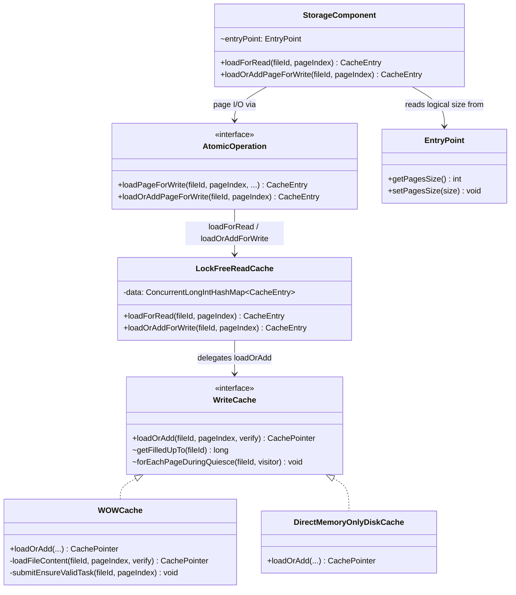
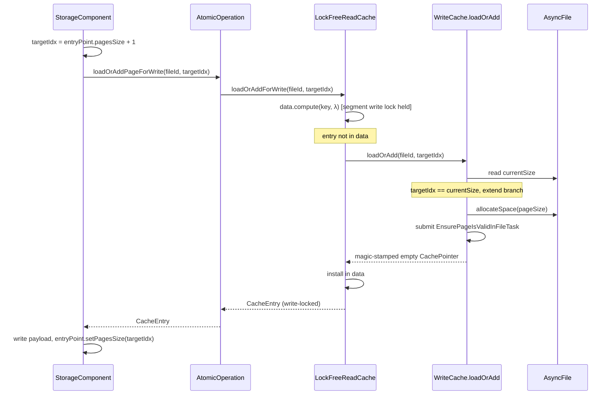
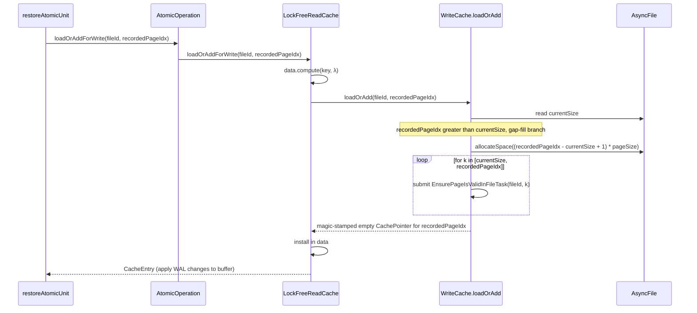
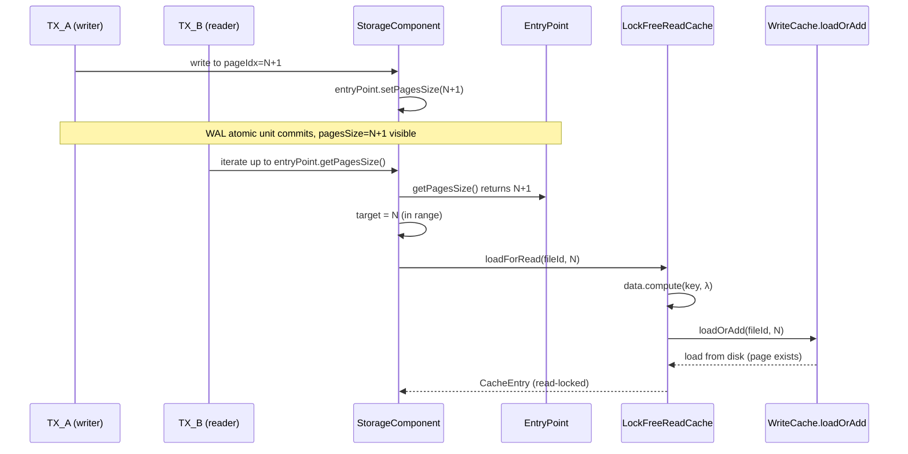

# Read-cache concurrency bug — Design

## Overview

YouTrackDB today exposes the page allocator as a separate cache API
(`WriteCache.allocateNewPage`) distinct from `WriteCache.load`, with
`WriteCache.getFilledUpTo` publicly readable. A cross-TX reader inside
its own `data.compute` lambda can learn about a freshly-allocated
pageIndex N via `getFilledUpTo` before the allocator's `putIfAbsent`
installs the in-memory CachePointer and before the disk-side magic stamp
lands. The reader then either reads zeros and fails the magic check
(`StorageException`) or installs its own entry first and crashes the
allocator (`IllegalStateException`). Either branch poisons the storage.

This design replaces the asymmetric cache surface with a single total
primitive: `WriteCache.loadOrAdd(fileId, pageIndex, verifyChecksums)`.
It loads from disk if the page exists, extends the file by one page if
it doesn't, and gap-fills on recovery. It always returns a usable
`CachePointer`.

The enabling primitive on the read side is a pre-existing structural
fact: every storage component already maintains a logical page count
(`entryPoint.pagesSize` / `fileSize`) on a metadata page, persisted via
existing WAL ops. Routing all cross-TX readers through that
committed-only logical surface eliminates the only path by which a
reader could learn about an in-flight pageIndex.

The change cascades into the storage components: `addPage` and its 19
external call sites are replaced by
`loadOrAddPageForWrite(fileId, pagesSize + 1)` (a 20th PSI hit on
`addPage` is the recursive call inside today's
`StorageComponent.loadOrAddPageForWrite` fallback, which the fix
rewires to delegate to the new cache primitive instead of `addPage`);
the reuse-or-extend probes disappear (the cache absorbs orphans
uniformly); the do/while reconciliation loops in `commitChanges`,
`restoreAtomicUnit`, and `restoreFromIncrementalBackup` collapse into
single calls; the `internalFilledUpTo` prediction wrapper goes away.

The rest of this document covers Class Design, Workflow, and four
dedicated sections on the cache primitive, the allocation discovery
surface, the concurrency model, and crash safety.

## Class Design



The diagram shows the post-fix shape. Three changes are non-obvious:

- `WriteCache.allocateNewPage`, `WriteCache.load`, and the
  `AtomicOperation.addPage` / `StorageComponent.addPage` methods are
  **deleted** — they appear in today's code but not on this diagram.
- `WriteCache.getFilledUpTo` is package-private (shown with `~`) — the
  only external caller is `DiskStorage.backupPagesWithChanges`, which
  reaches for the storage-quiesced iteration helper
  `forEachPageDuringQuiesce` instead.
- `LockFreeReadCache` no longer has an `allocateNewPage` method;
  `loadForRead` and `loadOrAddForWrite` differ only in the lock
  semantics they install on the returned `CacheEntry`.
- The `data` field on `LockFreeReadCache` is
  `ConcurrentLongIntHashMap<CacheEntry>` — a segmented open-addressing
  map keyed by the `(fileId, pageIndex)` long+int pair, with a
  `StampedLock` per segment. Earlier drafts showed it as
  `SegmentedMap<PageKey, ...>`; there is no `PageKey` class — the key
  is the long+int pair.

`EntryPoint` is the abstract shape every storage component already has:
each concrete component carries a metadata page on pageIndex 0 with a
`pagesSize` (or `fileSize`) field and dedicated WAL ops to persist
changes. The §"Allocation discovery surface" section enumerates the
concrete classes per component.

## Workflow

The new design has three runtime paths worth diagramming: the write-side
allocation happy path, the recovery gap-fill path, and the cross-TX read
path. Each runs the same `LockFreeReadCache.data.compute` lambda
delegating to `WriteCache.loadOrAdd`; they diverge only on what
`loadOrAdd` does internally.

### Write-side allocation happy path



The component computes its target pageIndex from local state — the
logical page count plus one. The cache does not return a "next free
pageIndex" anymore; the component states the target, and `loadOrAdd`
either loads (if the page is already on disk) or extends (if it isn't).
`entryPoint.setPagesSize` is the WAL-tracked logical bump that publishes
the new pageIndex to future cross-TX readers.

### Recovery gap-fill path



Replay calls `loadOrAddForWrite` for each WAL record's pageIndex. If the
recorded pageIndex is beyond the current file size, the gap-fill branch
extends the file to the target and submits ensure-valid tasks for the
intervening pages. The replay never sees a partial extension because
`AsyncFile.allocateSpace` is a single atomic `getAndAdd`. Today's
do/while loop in `restoreAtomicUnit` collapses to a single call.

### Cross-TX read path



`TX_B` learns about `N` only after `TX_A`'s WAL atomic unit has closed
— at which point `pagesSize = N+1` is the committed cross-TX state and
`TX_A`'s page-content modification has been recorded in WAL. The WAL
records themselves may still be in the in-memory log buffer at this
moment; the durability guarantee is the **write-ahead** invariant: any
subsequent flush of pageIndex `N` to disk happens only after `TX_A`'s
WAL records are durable. So when `TX_B` runs, the page at `N` is
either still in the in-memory cache holding `TX_A`'s content, or has
already been flushed to disk under WAL protection. Page changes are
visible to other transactions only after TX commit, so `TX_B` cannot
observe a partial state. `TX_B`'s `loadForRead` takes the load branch,
never the extend branches; the race vector — a reader observing an
in-flight pageIndex via `getFilledUpTo` — is not reachable from this
path.

## Cache primitive: loadOrAdd

**TL;DR.** The primitive replaces three asymmetric cache APIs (`load`,
`allocateNewPage`, public `getFilledUpTo`) with one total method. It
loads from disk, extends by one page, or gap-fills on recovery, and
always returns a usable `CachePointer`. The race goes away because
there is no longer a separate "publish in-flight pageIndex" code path
outside `data.compute`'s segment write lock.

The signature is:

```java
CachePointer loadOrAdd(long fileId, long pageIndex, boolean verifyChecksums);
```

The caller is `LockFreeReadCache`, from inside its `data.compute(fileId,
pageIndex, λ)` lambda, after the lambda has confirmed the entry is not
already in `data`. The segment write lock for the target key is held
for the duration of the call.

Inside `loadOrAdd`, the implementation reads `AsyncFile.size` once
atomically, then dispatches to one of three branches based on the
relationship of `pageIndex` to the current size in pages. There is
no separate "orphan re-stamp" branch: a magic-stamped disk-resident
orphan (scenario A in §"Crash safety") is absorbed by the Load
existing branch with no special-casing.

### Branch table

| Branch | Pre-condition | Side effect on `AsyncFile.size` | Side effect on disk | Returned `CachePointer` |
|---|---|---|---|---|
| Load existing | `pageIndex < currentSize` | none | none (read) | content from `loadFileContent` |
| One-page extend | `pageIndex == currentSize` | advances by one page | task submitted | magic-stamped empty buffer |
| Gap-fill | `pageIndex > currentSize` (recovery only) | advances to `pageIndex + 1` pages | task submitted per gap page | magic-stamped empty buffer for target |

The "task submitted" entries refer to `EnsurePageIsValidInFileTask`,
which idempotently writes the magic-stamped empty page to disk only if
the disk file's actual length is still at or below the target offset.
Magic-check failure on the load branch propagates to the caller as
`StorageException` — the new design does not change that error path.
A separate ticket (`ISSUE-ensurevalidpagetask-torn-write.md`) tracks
the related torn-write / OS-writeback durability gap that can produce
such a magic-check failure under crash; that gap pre-dates this fix.

### Why the runtime hot path takes only the extend-by-one branch

By the runtime invariant captured under §"Concurrency model" — every
production caller of the write path computes `pageIndex` as
`entryPoint.pagesSize + 1` — `pageIndex` is always exactly one beyond
`AsyncFile.size` when no concurrent allocator has raced ahead, and it
equals an existing page when this transaction is performing a normal
write to a previously-allocated index. The gap-fill branch never fires
under normal execution; it exists for WAL replay where a recorded
pageIndex may be many pages beyond the current file size on a
freshly-reopened storage.

The read path (`loadForRead`) shares the same `loadOrAdd` primitive but
its caller-imposed invariant guarantees `pageIndex < pagesSize <=
currentSize`, so the load branch is the only one reachable. If a buggy
caller violates this — passes a pageIndex beyond the logical surface —
the cache silently extends the file. This is harmless to crash safety
(an empty page leaks; the WAL has nothing recorded for it) and matches
the failure-mode shape of today's read path (which would return a
broken page). No `-ea` assertion is added because the failure mode is
not a corruption, just a leaked page.

### Edge cases / Gotchas

- **Concurrent allocators on different `(fileId, pageIndex)`** — the
  segment locks are independent across keys. Both branches' calls to
  `AsyncFile.allocateSpace(getAndAdd)` interleave atomically; the
  in-memory `size` is monotonic. The disk-side `EnsurePageIsValidInFileTask`
  for each page is independent.
- **`EnsurePageIsValidInFileTask` failure** — disk-full or I/O error
  surfaces asynchronously via WOWCache's existing background-error
  reporting. `loadOrAdd` itself returns an in-memory
  `CachePointer` regardless, and the failed disk write is observed at
  the next checkpoint or recovery.
- **`pageIndex == 0` for fresh file** — pageIndex 0 is normally the
  metadata / EntryPoint page. `loadOrAdd(fileId, 0)` extends from
  `currentSize=0` to `1`; the magic-stamped empty buffer is what every
  `EntryPoint.create()` then overwrites with its initial content.
- **`DirectMemoryOnlyDiskCache.loadOrAdd`** — the in-memory engine has
  no `AsyncFile` and no async stamp task. Its implementation reduces to
  a `ConcurrentHashMap` install of magic-stamped empty buffers under
  the same segment-lock-held lambda, with gap-fill collapsing to a loop
  over `put`-if-absent.

### References

- D-records: D1 (`loadOrAdd` as the sole cache primitive)
- Invariants: I2, I3 (extension under segment lock; total primitive)

## Allocation discovery surface

**TL;DR.** Cross-TX readers learn page existence from
`entryPoint.pagesSize` / `entryPoint.fileSize`, never from
`WriteCache.getFilledUpTo`. The migration removes the discovery channel
that exposes in-flight pageIndices and lets the cache absorb orphans
uniformly via `loadOrAdd`. Per-component reuse-or-extend probes
disappear, the no-pageIndex `addPage` API disappears, and the
`commitChanges` / `restoreAtomicUnit` reconciliation loops collapse.

### Logical-size surface per component

Every storage component carries a logical page count on its metadata
page, persisted via dedicated WAL operations. The set is fixed, was
already in place before this fix, and was already partially consumed by
the reuse-or-extend probe pattern.

| Component | Field | Getter | WAL op |
|---|---|---|---|
| `CellBTreeSingleValueEntryPointV3` | `pagesSize` | `getPagesSize()` | `BTreeSVEntryPointV3SetPagesSizeOp` |
| `CellBTreeSingleValueEntryPointV1` | `pagesSize` | `getPagesSize()` | analogous |
| `CellBTreeMultiValueV2EntryPoint` | `pagesSize` | `getPagesSize()` | `BTreeMVEntryPointV2SetPagesSizeOp` |
| `ridbagbtree.EntryPoint` | `pagesSize` | `getPagesSize()` | `RidbagEntryPointSetPagesSizeOp` |
| `collection.v2.MapEntryPoint` | `fileSize` | `getFileSize()` | `MapEntryPointSetFileSizeOp` |
| `versionmap.MapEntryPoint` | `fileSize` | `getFileSize()` | analogous |

Some components — `CollectionDirtyPageBitSet`, `FreeSpaceMap`,
`IndexHistogramManager` — are not yet confirmed in the table above.
Phase A confirms each component's logical-size accessor before the
read-side migration step touches it; if a component lacks a documented
field, the implementer escalates with a recommendation to add one
(plus the matching WAL op) under a separate decision record.

### Migration shape

The 16 production call sites of `StorageComponent.getFilledUpTo` split
into two groups:

- **Pure-sizing reads (9 sites)** — sizing, iteration, freshness
  checks. Migrate to the component's logical-size getter. No behavior
  change at the call site beyond replacing the read source. These land
  in Track 3.
- **Reuse-or-extend probes (7 sites)** — the
  `if pageSize < filledUpTo - 1` block at every allocation site. After
  the cache absorbs orphans uniformly via `loadOrAdd`, the probe is
  dead code: the "reuse" branch and the "extend" branch both collapse
  to a single `loadOrAddPageForWrite(fileId, pagesSize + 1)`. These
  land in Track 4 along with the broader `addPage` deletion.

The third group — components that need physical file size for a
legitimate quiesced reason — has exactly one member:
`DiskStorage.backupPagesWithChanges`. It stays on `getFilledUpTo`, but
the access modifier shifts in Track 5 from public to package-private,
and the call routes through a narrowly-scoped iteration helper that
states the storage-quiesced contract.

### Why `addPage` is deletable

`StorageComponent.addPage(fileId)` has a no-pageIndex signature: the
cache picks via `allocateSpace.getAndAdd` and the caller learns the
result. This is what forced two pieces of complexity:

- The `internalFilledUpTo` prediction wrapper in
  `AtomicOperationBinaryTracking`, which pre-allocates a synthetic
  pageIndex for the in-progress TX and rewrites it on commit if the
  prediction was wrong.
- The do/while reconciliation loop in `commitChanges`, which calls
  `readCache.allocateNewPage` repeatedly until the returned pageIndex
  matches the predicted one (and similarly in `restoreAtomicUnit` and
  `restoreFromIncrementalBackup` during recovery).

Once allocators state the target pageIndex up front — derived from the
component's `entryPoint.pagesSize + 1` — neither prediction nor
reconciliation has anything to do. The 19 external `addPage` call
sites all already know their target from local state (~9 fresh-file
sequential allocations at index 0 or 1; ~10 reuse-or-extend branches
that compute `pagesSize + 1`; Phase A confirms the exact split). The
20th PSI reference to `addPage` is the recursive call inside
`StorageComponent.loadOrAddPageForWrite` (today a `loadPageForWrite`-
then-`addPage` fallback) — Track 4 rewires that body to delegate to
the new cache primitive rather than calling `addPage`. Migration is
mechanical.

WAL is unaffected: page extension stays implicit (no `AddPage*`
record), and the `SetPagesSizeOp` / `SetFileSizeOp` records that
already track logical-size advances continue to do so.

### Edge cases / Gotchas

- **Components without a documented logical-size field** — three
  candidates exist; Phase A confirms or escalates per the migration
  shape rule above. Adding a new `EntryPoint.pagesSize` field plus WAL
  op is in-scope as a fallback but should be the exception.
- **`PaginatedCollectionV2.open:391` and `CollectionPositionMapV2.create:136`**
  — both are described in the call-site audit as "freshness check" /
  "sizing read at open time"; semantics are subtle (a freshness check
  may legitimately want physical file size to detect a truncation from
  a previous incarnation). Phase A confirms whether each migrates or
  stays on `getFilledUpTo`. The default is to migrate; staying is the
  exception with a recorded rationale.
- **Backup path** — `DiskStorage.backupPagesWithChanges` runs under
  storage quiesce, which holds back any concurrent cache writes. The
  storage-quiesced contract (no concurrent extension, no concurrent
  flush) is what makes the physical size read safe; the gated helper's
  javadoc states this explicitly so future callers don't reach for it
  outside quiesce.

### References

- D-records: D2 (logical surface as discovery), D3 (`addPage` deletion
  + reconciliation collapse), D4 (getFilledUpTo lockdown), D5 (rejected
  marker-bit alternative)
- Invariants: I1, I5

## Concurrency model

**TL;DR.** Page extension occurs only inside
`LockFreeReadCache.data.compute`'s segment write lock; per-component
locks (BTree mutex, position-map mutex, …) serialize concurrent
allocators that share a `fileId`. The combination forecloses both
within-key and cross-key races: two TXs cannot allocate the same
`(fileId, pageIndex)`, and two TXs allocating different pageIndices
under the same fileId interleave atomically via `AsyncFile.allocateSpace`.

### Lock layering

Three layers of synchronization apply during a `loadOrAdd` call. They
nest in this order, top to bottom:

1. **Per-component lock** (above the cache; e.g. `BTree`'s synchronize
   block, `PaginatedCollectionV2`'s mutex, `CollectionPositionMapV2`'s
   internal serialization). Held by every storage component before it
   reads `entryPoint.pagesSize` and computes `pagesSize + 1` as the
   target pageIndex. This is what guarantees two TXs operating on the
   same component-file never compute the same target. (**Phase A
   audit**: confirm the exact serialization mechanism per component —
   is it `synchronized(this)`, a per-instance `Lock` field,
   `componentLock`, or something else? The wording above is coarse;
   the implementer pins the concrete lock-field name per component
   before migrating that component's `addPage` call sites in Track 4.)
2. **Segment write lock on `LockFreeReadCache.data`** (held by
   `data.compute` for the duration of the lambda). Serializes
   concurrent attempts to install or update the same `(fileId,
   pageIndex)` cache entry.
3. **Within `WOWCache.loadOrAdd`**: `filesLock.readLock` (allowing
   concurrent file operations) plus `files.acquire(fileId)` (a
   per-file exclusion). The ordering matches today's
   `WOWCache.allocateNewPage`; `loadOrAdd` does not invert it.

`AsyncFile.size` itself is updated atomically via `getAndAdd` — there
is no separate lock around it. Multiple `loadOrAdd` calls on different
keys can advance the size in interleaved order; the resulting
in-memory size is monotonic.

### Why two TXs cannot race for the same `(fileId, pageIndex)`

Two TXs target the same pageIndex only if they read the same
`entryPoint.pagesSize` and both compute `pagesSize + 1`. The
per-component lock prevents that: only one TX at a time holds the lock
to compute its target. The TX that loses the race waits, then reads
the post-bump `pagesSize` and computes a different target.

Recovery is single-threaded, so concurrent allocators do not exist
during replay.

### Why concurrent readers cannot fabricate an in-flight pageIndex

A cross-TX reader's `loadForRead(fileId, K)` requires `K <
entryPoint.pagesSize`. `pagesSize` is only bumped after the WAL atomic
unit closes — at which point the corresponding page is materialized in
the cache and the disk-side stamp task has been submitted. The reader
cannot observe a `pagesSize` that names an in-flight page; the race
vector is not reachable.

### Edge cases / Gotchas

- **Cross-fileId concurrency** — no shared lock; each file's
  `AsyncFile.size` is independent and atomic. Cross-file allocations
  proceed in parallel without contention.
- **Flush worker concurrency** — the dirty-page flush worker runs in
  its own thread, takes the segment read lock plus the page's content
  lock to read the buffer, and writes to disk. Its interaction with
  `loadOrAdd` is the same as today's `load`: the flush worker reads a
  consistent snapshot of the page content; the `loadOrAdd` extension
  branches do not block on it.
- **`EnsurePageIsValidInFileTask` concurrency** — multiple tasks for
  the same fileId can be in flight simultaneously, each targeting a
  different pageIndex. Each task's `writeValidPageInFile` is
  idempotent and the underlying I/O is serialized by the OS file lock;
  no additional synchronization is needed at the task level.
- **`DirectMemoryOnlyDiskCache`** — has no `AsyncFile` and no
  per-file `files.acquire` lock; the segment lock alone is sufficient
  because all state is in-memory and consistent under
  `ConcurrentHashMap`'s contract.

### References

- D-records: D1 (cache primitive), D2 (discovery surface)
- Invariants: I2, I4

## Crash safety

**TL;DR.** The new design preserves crash safety against three
scenarios that today's allocator+task split must handle. Orphan disk
pages from an in-flight TX are absorbed by `loadOrAdd`'s load branch
(they are always magic-stamped under FIFO submission); WAL replay's
extend-and-gap-fill is handled by `loadOrAdd` directly. No new
vulnerability is introduced.

`EnsurePageIsValidInFileTask` runs on a single-threaded
`wowCacheFlushExecutor` (`YouTrackDBEnginesManager.java:231`), and
submissions for a given `fileId` are monotonic in pageIndex by
construction (each `loadOrAdd` extension targets `pagesSize + 1`,
serialized by the per-component lock). FIFO + monotonic submission
forecloses sparse-zero interior pages: if the disk file was extended
through pageIndex `K`, every pageIndex in `[old_size, K]` was stamped
in order before the extension to `K+1` could begin. A separate ticket
(`ISSUE-ensurevalidpagetask-torn-write.md`) tracks the orthogonal
torn-write / OS-writeback durability gap that pre-dates this fix.

### Scenario walk-through

The three crash scenarios apply to a TX that does an extension. They
follow today's vocabulary: in-memory file size advance via
`AsyncFile.allocateSpace`, asynchronous magic-stamping via
`EnsurePageIsValidInFileTask`, and on-reopen the in-memory size
re-initializes from the disk file's actual length.

#### A. TX in flight, never committed

WAL has no `AtomicUnitEndRecord` for the TX, so replay skips the unit.
`entryPoint.pagesSize` was never bumped (the `setPagesSize` op was
inside the unit). The disk file may or may not have been physically
extended — depends on whether the ensure-valid task ran before the
crash.

On reopen: `AsyncFile.size` re-initializes from disk length. Any
physical extension that survived is an orphan (disk has the page,
component doesn't count it).

Next TX: reads `entryPoint.pagesSize`, computes `pagesSize + 1`, calls
`loadOrAddPageForWrite`. Inside `loadOrAdd`:

- If the orphan exists on disk: it is magic-stamped (FIFO + monotonic
  submission guarantees that every disk-resident orphan completed its
  ensure-valid task before any later orphan's task could start). Load
  branch fires; the next TX overwrites the empty page with its
  content.
- If the file has no orphan at this index: extend branch fires.

In both sub-cases, the next TX gets a usable page at the target index;
the orphan (if any) is absorbed transparently. **Consistent.**

#### B. TX committed, ensure-valid task never ran

WAL has the full atomic unit including `setPagesSize` and the page-
content op (`UpdatePageRecord` / `PageOperation`). Disk file size on
reopen = pre-extension.

On replay: `restoreAtomicUnit` calls `loadOrAddForWrite(fileId, N)`.
Cache: `pageIndex == currentSize`, extend branch fires, advances size,
submits ensure-valid task, returns magic-stamped empty pointer.
Replay applies the WAL changes to the in-memory buffer. Async task
runs in background; idempotent stamp.

**Consistent.**

#### C. TX committed, ensure-valid task ran fully

Disk has the magic-stamped empty page from the task, plus (on
checkpoint flush) the TX's actual content. On replay: load branch
fires, magic check passes, replay applies WAL changes to the buffer.

**Consistent.**

### Role of `EnsurePageIsValidInFileTask` in the new design

The task was load-bearing for two reasons in the legacy design: ensuring
the disk file is long enough to read pageIndex N, and stamping the
magic so the magic-check leg of recovery passes. Both reasons remain
under the new design. The task's role narrows in **scope**, not in
**function**: it is no longer the primary mechanism for "publishing"
a new page (the segment-locked install of the in-memory `CachePointer`
is what publishes), but it is still the mechanism for making the page
durable post-eviction.

### Edge cases / Gotchas

- **Post-WAL-replay file truncation** — orphan disk pages from
  scenario A leak space until a vacuum / repack. Bounded today; a
  separate ticket tracks adding a post-replay alignment pass.
- **`DoubleWriteLog` interaction** — anti-tear protection for
  partially-written pages is orthogonal to allocation. Unchanged.
- **In-memory engine** — `DirectMemoryOnlyDiskCache` has no
  persistence, so crash safety is trivially preserved (no disk to
  diverge from).

### References

- D-records: D1 (`loadOrAdd` covers all three scenarios), D5 (the
  marker-bit alternative would have papered over scenario B without
  removing the discovery channel)
- Invariants: I3, I5
- Related: `ISSUE-ensurevalidpagetask-torn-write.md` (orthogonal
  torn-write / OS-writeback durability gap, out of scope here)
