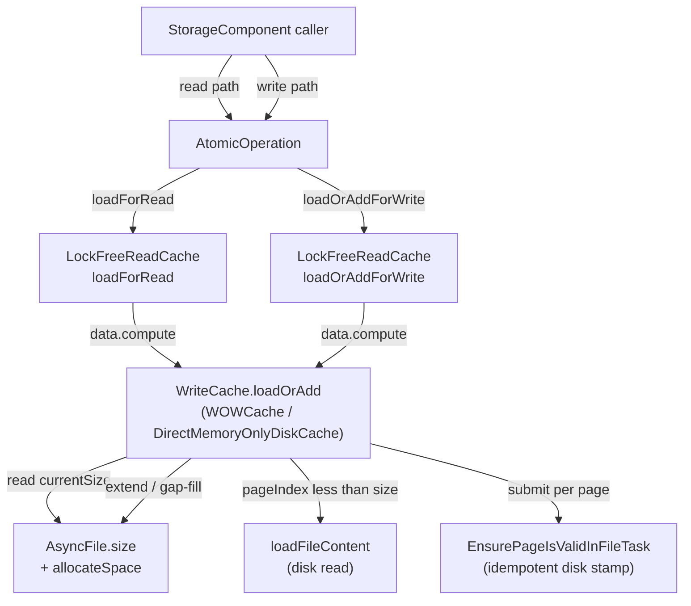

# Read-cache concurrency bug — Track Details

## Track 1: Cache primitive — `WriteCache.loadOrAdd`

> **What**:
> - Add `WriteCache.loadOrAdd(long fileId, long pageIndex, boolean
>   verifyChecksums) → CachePointer` to the `WriteCache` interface.
> - Implement in `WOWCache` (disk engine, `…/storage/cache/local/WOWCache.java`)
>   covering all three branches: load-existing-from-disk, one-page
>   extend, multi-page gap-fill (recovery-only).
> - Implement parallel `loadOrAdd` in `DirectMemoryOnlyDiskCache`
>   (in-memory engine, `…/storage/memory/DirectMemoryOnlyDiskCache.java`).
>   This single class implements **both** `ReadCache` and `WriteCache`,
>   so the new ReadCache wrappers (`loadForRead` / `loadOrAddForWrite`)
>   and the WriteCache primitive (`loadOrAdd`) live side-by-side in it;
>   update both API surfaces in lockstep.
> - Refactor `LockFreeReadCache.loadForRead` and
>   `LockFreeReadCache.loadOrAddForWrite` (in `…/storage/cache/chm/LockFreeReadCache.java`)
>   so both bottom out on a single
>   `data.compute(key, λ → cached or writeCache.loadOrAdd(...))` shape;
>   the wrappers differ only in `CacheEntry` lock semantics.
> - Rename `ReadCache.loadForWrite` to `ReadCache.loadOrAddForWrite`
>   (interface + both impls + all callers) — today's API uses
>   `loadForWrite`; the post-fix design names match the new
>   "load-or-extend" semantics.
> - Mark `LockFreeReadCache.allocateNewPage`, `WOWCache.allocateNewPage`,
>   `DirectMemoryOnlyDiskCache.allocateNewPage`, and
>   `WriteCache.allocateNewPage` as deprecated (deletion lands in
>   Track 4 once replay-loop callers migrate).
>
> **How**:
> - **Step ordering** (decomposition is provisional; Phase A finalizes
>   it):
>   1. Introduce `loadOrAdd` on the `WriteCache` interface alongside the
>      existing methods (no removals yet). Keep the verify-checksums
>      semantics aligned with today's `load`.
>   2. Implement `WOWCache.loadOrAdd` — read `AsyncFile.size` once, then
>      branch on `pageIndex` against `currentSize`:
>      a. `pageIndex < currentSize` → call existing `loadFileContent`
>         path; return the on-disk page. Magic-check failure
>         propagates to the caller as `StorageException` (today's
>         behavior, unchanged; see `ISSUE-ensurevalidpagetask-torn-write.md`
>         for the orthogonal durability gap).
>      b. `pageIndex == currentSize` → `AsyncFile.allocateSpace(pageSize)`,
>         submit `EnsurePageIsValidInFileTask(fileId, pageIndex)`,
>         return a magic-stamped empty `CachePointer`.
>      c. `pageIndex > currentSize` → batched
>         `AsyncFile.allocateSpace((pageIndex - currentSize + 1) * pageSize)`,
>         submit `EnsurePageIsValidInFileTask` for every gap page in
>         `[currentSize, pageIndex]`, return only the target's
>         `CachePointer`.
>   3. Implement `DirectMemoryOnlyDiskCache.loadOrAdd` — the in-memory
>      engine has no disk I/O, so the implementation reduces to "if the
>      page exists in the in-memory map, return it; else allocate a
>      magic-stamped empty buffer and install it." Gap-fill is trivial
>      (allocate empty buffers for the gap range).
>   4. Switch `LockFreeReadCache.loadForRead`'s `data.compute` lambda to
>      delegate to `writeCache.loadOrAdd`. By caller invariant (D2),
>      the extend branches never fire on this path; if they do, the
>      cache returns a magic-stamped empty page (harmless behavior in a
>      buggy read path — see D1 risk note).
>   5. Switch `LockFreeReadCache.loadOrAddForWrite`'s `data.compute`
>      lambda to delegate to `writeCache.loadOrAdd`. Both wrappers now
>      share the same delegation pattern; the only difference is
>      `CacheEntry` lock acquisition (read vs write).
>   6. Add javadoc to `WriteCache.loadOrAdd` documenting (a) callers
>      must hold the segment write lock, (b) the method is total and
>      never returns null, (c) the runtime invariant "callers know
>      their target pageIndex from `entryPoint.pagesSize + 1`" — gap-fill
>      is the recovery-only branch.
> - **Concurrency invariants to preserve**:
>   - `AsyncFile.allocateSpace` remains atomic (`getAndAdd`).
>   - Lock ordering inside `loadOrAdd` matches today's
>     `WOWCache.allocateNewPage`: segment write lock (held by caller) →
>     `filesLock.readLock` → `files.acquire(fileId)`. Verify in Phase A
>     no path inverts the order.
>   - `EnsurePageIsValidInFileTask` is idempotent
>     (`writeValidPageInFile` only writes if
>     `getUnderlyingFileSize() <= pagePosition`); resubmission in
>     recovery (gap-fill branch) is safe.
>
> **Constraints**:
> - **In-scope files**:
>   - `core/.../internal/core/storage/cache/WriteCache.java`
>   - `core/.../internal/core/storage/cache/ReadCache.java` (for the
>     `loadForWrite` → `loadOrAddForWrite` rename)
>   - `core/.../internal/core/storage/cache/chm/LockFreeReadCache.java`
>   - `core/.../internal/core/storage/cache/local/WOWCache.java`
>   - `core/.../internal/core/storage/memory/DirectMemoryOnlyDiskCache.java`
>     (note: this lives outside the `cache` package and implements both
>     `ReadCache` and `WriteCache`)
>   - Existing test classes only as needed for compilation; new tests
>     land in Track 2.
> - **Out of scope**: storage component classes (Track 3 + Track 4),
>   WAL classes, DoubleWriteLog, AsyncFile changes.
> - The deletion of `WriteCache.allocateNewPage` is deferred to Track 4
>   because `AbstractStorage.restoreAtomicUnit`,
>   `AtomicOperationBinaryTracking.commitChanges`, and
>   `DiskStorage.restoreFromIncrementalBackup` still call
>   `LockFreeReadCache.allocateNewPage` until those loops collapse.
>
> **Interactions**:
> - Enables Track 2 (the test track exercises this primitive).
> - Enables Track 4 (replay-loop callers can be migrated to
>   `loadOrAddForWrite`).
> - Enables Track 6 (the integration regression test relies on the
>   primitive being in place).
> - Independent of Track 3 (read-side discovery migration touches
>   storage components, not cache code).



- Both `LockFreeReadCache` wrappers reach `loadOrAdd` through the same
  `data.compute` shape; the only divergence is the `CacheEntry` lock the
  wrapper installs after returning.
- `loadOrAdd` reads `AsyncFile.size` once per call to decide its branch.
- The disk read and the extension paths are mutually exclusive within a
  single `loadOrAdd` invocation — no path executes both.

---

## Track 2: Cache test coverage (functional + MT)

> **What**:
> - Audit the existing test suite under
>   `core/src/test/java/com/jetbrains/youtrackdb/internal/core/storage/cache/**`.
>   Produce a coverage table by class/method.
> - Add functional unit tests for every branch of `WOWCache.loadOrAdd`:
>   load existing on disk, one-page extend, multi-page gap-fill,
>   `pageIndex == 0` for fresh file, very-high `pageIndex`,
>   file-deletion races, checksum verify on/off.
> - Add functional unit tests for `LockFreeReadCache.loadForRead` /
>   `loadOrAddForWrite`: cache hits, cache misses, eviction with dirty
>   and clean entries, pinned entries, write-back on eviction, two-tier
>   transitions.
> - Add functional unit tests for `DirectMemoryOnlyDiskCache.loadOrAdd`
>   (parallel branches in the in-memory engine).
> - Add MT stress tests:
>   1. Concurrent `loadOrAdd` for **different** `(fileId, pageIndex)` —
>      must not corrupt shared state; both threads observe consistent
>      `AsyncFile.size`.
>   2. Concurrent `loadOrAdd` for the **same** `(fileId, pageIndex)` —
>      segment lock serializes; one thread extends, the other observes
>      the result; both end up with the same `CachePointer`.
>   3. Reader at pageIndex `K-1` (existing) vs writer extending to `K` —
>      reader path is unaffected.
>   4. Eviction-vs-load: pin counts respected, dirty pages flushed
>      before eviction, no lost writes.
>   5. Flush worker concurrency: dirty page flushed while reader holds
>      read lock on the entry.
>   6. `EnsurePageIsValidInFileTask` idempotency: extend a page,
>      hold the executor so the task does not run, evict the cache
>      entry, then trigger a `loadOrAdd` for the same pageIndex on
>      the same JVM lifecycle and assert the load branch returns the
>      in-flight in-memory `CachePointer` (not a disk read of an
>      unstamped page); finally release the executor and assert the
>      task writes the magic stamp once.
> - Run `coverage-gate.py` against the cache classes; assert 85% line
>   and 70% branch thresholds for changed lines.
>
> **How**:
> - Step ordering (provisional):
>   1. Coverage audit — tabulate existing tests; identify gaps. Output:
>      a short list of test files to add and existing files to extend.
>   2. `loadOrAdd` branch tests (WOWCache + DirectMemoryOnlyDiskCache).
>   3. ReadCache wrapper tests (loadForRead, loadOrAddForWrite).
>   4. MT stress harness for `loadOrAdd` contention (scenarios 1-3).
>   5. MT stress harness for eviction / flush / ensure-valid races
>      (scenarios 4-6).
> - Test infrastructure:
>   - Use `ConcurrentTestHelper` from `test-commons` for MT scenarios.
>   - Use `CountDownLatch` / `CyclicBarrier` for deterministic
>     coordination. **Avoid** sleeps and timing-based assertions —
>     they make tests flaky in CI.
>   - For "page extended but stamp delayed" scenarios, gate the
>     `EnsurePageIsValidInFileTask` executor with a controllable
>     scheduler (or wrap the existing executor in a test-only seam) so
>     the test can hold the task until the reader has observed the
>     unstamped state.
> - Coverage gate invocation pattern:
>   ```bash
>   ./mvnw -pl core clean package -P coverage
>   python3 .github/scripts/coverage-gate.py \
>     --line-threshold 85 --branch-threshold 70 \
>     --compare-branch origin/develop \
>     --coverage-dir .coverage/reports
>   ```
> - **What this track verifies vs. defers to Track 6**:
>   - Track 2 verifies invariants **I2** (extension under segment lock),
>     **I3** (loadOrAdd is total), and **I4** (segment lock serializes
>     contending allocators) at the cache level.
>   - Track 2 cannot verify **I1** (entryPoint as the only discovery
>     surface) because that invariant lives above the cache layer.
>     Track 6 closes that gap.
>
> **Constraints**:
> - **In-scope files**: tests under
>   `core/src/test/java/com/jetbrains/youtrackdb/internal/core/storage/cache/**`.
> - **Out of scope**: integration tests on the full storage stack
>   (Track 6); integration tests against the SQL stack.
> - **No flaky tests**: every MT test must use deterministic
>   coordination primitives (latches, barriers) — never `Thread.sleep`
>   for correctness, and timing-based checks must have generous
>   bounds (e.g., 30 s per scenario) to absorb CI noise.
> - Use `ytdb.testcontainer.debug.container=true`-style debug knobs
>   only as opt-in diagnostics; never make a test depend on them.
>
> **Interactions**:
> - Depends on Track 1 (the primitive must exist).
> - Independent of Tracks 3, 4, 5; can run in parallel with them.
> - Provides a safety net for the consumer migration in Tracks 3-4 — if
>   a migration step accidentally breaks cache behavior, Track 2 tests
>   surface it immediately.
> - Verifies invariants I2, I3, I4 (cache-level); leaves I1 to Track 6.

---

## Track 3: Read-side discovery migration

> **What**:
> - Migrate the **pure-sizing** production callers of
>   `StorageComponent.getFilledUpTo` to use the owning component's
>   logical page count from its `EntryPoint` metadata page. The
>   reuse-or-extend probe sites stay until Track 4 deletes the probes
>   wholesale.
> - **Pure-sizing call sites in scope** (9 sites across 7
>   components):
>   - `BTree.doAssertFreePages:1389` → use the BTree's
>     `EntryPoint.getPagesSize()`.
>   - `IndexHistogramManager.readSnapshotFromPage:1833` → use the
>     component's logical page count (verify field name in Phase A).
>   - `FreeSpaceMap.updatePageFreeSpace:227` → ditto.
>   - `CollectionDirtyPageBitSet.{clear:141, nextSetBit:168,
>     ensureCapacity:194}` → ditto.
>   - `CollectionPositionMapV2.create:136` (freshness check) → confirm
>     in Phase A whether physical or logical is correct; if logical,
>     migrate to `mapEntryPoint.getFileSize()`. (See **Open audit**
>     below.)
>   - `PaginatedCollectionV2.open:391` → confirm in Phase A whether
>     this is a "physical truncation detected" check (stays on
>     physical) or a logical iteration sizing read (migrates).
>   - `PaginatedCollectionV2.initCollectionState:2256` → use the
>     component's `EntryPoint.getPagesSize()` (or equivalent — verify
>     in Phase A).
> - **Probe call sites NOT in scope here** (Track 4 deletes them with
>   the surrounding probe):
>   - `BTree.allocateNewPage:2156, :2161`
>   - `SharedLinkBagBTree.splitNonRootBucket:922, :927`
>   - `SharedLinkBagBTree.splitRootBucket:1050`
>   - `CollectionPositionMapV2.allocate:208`
>   - `PaginatedCollectionV2.allocateNewPage:2233`
> - **Stays on `getFilledUpTo`** (legitimate physical-size consumer):
>   - `DiskStorage.backupPagesWithChanges` (method @ :1387,
>     `getFilledUpTo` call @ :1404; storage-quiesced; gated in Track 5).
>
> **How**:
> - Step ordering (provisional):
>   1. BTree + IndexHistogramManager + FreeSpaceMap (3-4 sites).
>   2. CollectionDirtyPageBitSet (3 sites in one file).
>   3. CollectionPositionMapV2 + PaginatedCollectionV2 (Phase A
>      audits the open + create freshness checks first).
>   4. Sweep + verification — `grep`/PSI for any residual
>      `getFilledUpTo` call from a `StorageComponent` subclass.
> - Each migration is a 1:1 replacement of `getFilledUpTo(...)` with
>   the component's existing logical-size getter on the EntryPoint.
>   No new WAL ops or schema changes are required for components that
>   already track logical page count.
> - **Open audit**: components like `CollectionDirtyPageBitSet`,
>   `FreeSpaceMap`, and `IndexHistogramManager` may not have a
>   documented `EntryPoint.pagesSize` field (the handoff's table lists
>   six components, not all seven). Phase A confirms the logical-size
>   field per component and either:
>   - migrates to the existing field if one is present, or
>   - escalates with the recommendation to add a logical-size field +
>     WAL op (which would expand Track 3's scope and may need a separate
>     decision record).
>   The same audit applies to `PaginatedCollectionV2.open:391` and
>   `CollectionPositionMapV2.create:136`.
>
> **Constraints**:
> - **In-scope files**: the storage component classes named above and
>   their EntryPoint classes.
> - **Out of scope**: `WriteCache` / `LockFreeReadCache` (Track 1),
>   `addPage` deletion / probe deletion (Track 4),
>   `DiskStorage.backupPagesWithChanges` (Track 5).
> - Migrations must not change observable behavior beyond replacing
>   the read source. If logical-vs-physical semantics differ at a
>   site, that's a Phase A escalation point, not a unilateral fix.
> - WAL format and existing `SetPagesSizeOp` / `SetFileSizeOp` records
>   are unchanged.
>
> **Interactions**:
> - Independent of Tracks 1, 2 (no cache code is touched).
> - Enables Track 5 (after both Tracks 3 and 4 land, the only external
>   `getFilledUpTo` caller is `DiskStorage.backupPagesWithChanges`).
> - Verifies invariant **I1** (cross-TX readers learn page existence
>   only via the logical surface) at the source-code level, with
>   complete enforcement once Track 5 tightens the access modifier.

---

## Track 4: Write-side API collapse

> **What**:
> - Add `loadOrAddPageForWrite(long fileId, long pageIndex) → CacheEntry`
>   to the `AtomicOperation` interface and implement in
>   `AtomicOperationBinaryTracking`. Today the interface has
>   `addPage(long)` and `loadPageForWrite(...)` but no
>   `loadOrAddPageForWrite`.
> - Rewire `StorageComponent.loadOrAddPageForWrite(AtomicOperation,
>   fileId, pageIndex)` (which already exists at
>   `StorageComponent.java:149` as a `loadPageForWrite`-then-`addPage`
>   fallback with 2 prod callers in `IndexHistogramManager`) to
>   delegate to `atomicOperation.loadOrAddPageForWrite(fileId,
>   pageIndex)` instead of falling back to `addPage`.
> - Delete `StorageComponent.addPage` and `AtomicOperation.addPage`.
> - Migrate the 19 external `addPage` call sites to
>   `loadOrAddPageForWrite(fileId, knownIndex)`. (PSI shows 20 total
>   references on `StorageComponent.addPage`; one is the recursive call
>   from inside `StorageComponent.loadOrAddPageForWrite` itself, which
>   the rewire above removes.) Approximate split — Phase A confirms the
>   exact partition:
>   - ~9 sites inside `create()` / `init()` / `createEmptyStatsPage()` —
>     fresh-file sequential allocation at pageIndex 0 or 1.
>   - ~10 sites inside reuse-or-extend probes — `entryPoint.pagesSize + 1`
>     is the target.
> - Delete the reuse-or-extend probe blocks themselves at every site
>   (the cache absorbs orphans uniformly via Track 1's `loadOrAdd`):
>   `BTree.allocateNewPage`, `SharedLinkBagBTree.{splitNonRootBucket,
>   splitRootBucket}`, `CollectionPositionMapV2.allocate`,
>   `PaginatedCollectionV2.allocateNewPage`. Replace each
>   `if (pageSize < filledUpTo - 1) { reuse } else { extend }` block
>   with a single `loadOrAddPageForWrite(fileId, pagesSize + 1)` call.
> - Collapse the do/while reconciliation loops:
>   - `AtomicOperationBinaryTracking.commitChanges` — single
>     `loadOrAddForWrite` per allocated pageIndex.
>   - `AbstractStorage.restoreAtomicUnit` — `UpdatePageRecord` and
>     `PageOperation` branches each collapse to a single
>     `loadOrAddForWrite` call (gap-fill handled by `loadOrAdd`).
>   - `DiskStorage.restoreFromIncrementalBackup` — same shape.
> - Drop `AtomicOperationBinaryTracking.internalFilledUpTo` and the
>   pageIndex-prediction logic. `pageChangesMap` keys on the actual
>   pageIndex returned by `loadOrAddForWrite`.
> - After all migration steps land, delete
>   `LockFreeReadCache.allocateNewPage`, `WOWCache.allocateNewPage`,
>   `DirectMemoryOnlyDiskCache.allocateNewPage`, and
>   `WriteCache.allocateNewPage` from the interface — these are
>   reachable only through callers Track 4 just removed.
>
> **How**:
> - Step ordering (provisional):
>   1. `AtomicOperationBinaryTracking.commitChanges` collapse +
>      `internalFilledUpTo` removal. Includes all `pageChangesMap`
>      keying changes.
>   2. `AbstractStorage.restoreAtomicUnit` collapse —
>      `UpdatePageRecord` branch.
>   3. `AbstractStorage.restoreAtomicUnit` collapse —
>      `PageOperation` branch + `DiskStorage.restoreFromIncrementalBackup`.
>   4. BTree + SharedLinkBagBTree probe deletion + addPage migration
>      (~5 sites + 4 fresh-file).
>   5. CollectionPositionMapV2 + PaginatedCollectionV2 + remaining
>      components (FreeSpaceMap, IndexHistogramManager,
>      CollectionDirtyPageBitSet) — probe deletion + addPage migration
>      (~10 sites including init).
>   6. Delete `addPage` from `StorageComponent` and `AtomicOperation`.
>      Delete `allocateNewPage` from `WriteCache`, `LockFreeReadCache`,
>      and both concrete cache implementations.
> - Each per-component step replaces the probe block with:
>   ```java
>   var newPageIndex = entryPoint.getPagesSize() + 1;
>   var entry = atomicOperation.loadOrAddPageForWrite(fileId, newPageIndex);
>   entryPoint.setPagesSize(newPageIndex);
>   ```
>   The `entryPoint.setPagesSize` is the WAL-tracked logical bump
>   (existing `SetPagesSizeOp`).
> - For fresh-file sites (`create()` / `init()`), the target pageIndex
>   is known statically (0 or 1); migration is a direct replacement of
>   `addPage(...)` with `loadOrAddPageForWrite(fileId, 0)` (or 1).
> - **Replay-loop collapse**: today's loop runs
>   `readCache.allocateNewPage` repeatedly until the returned pageIndex
>   matches the WAL record's pageIndex. With `loadOrAdd` doing
>   gap-fill internally, the loop becomes a single
>   `loadOrAddForWrite(fileId, recordedPageIndex)` call — the cache
>   gap-fills if needed, returns the requested entry directly.
>
> **Constraints**:
> - **In-scope files**:
>   - `core/.../storage/impl/local/paginated/atomicoperations/AtomicOperationBinaryTracking.java`
>   - `core/.../storage/impl/local/paginated/atomicoperations/AtomicOperation.java` (interface)
>   - `core/.../storage/impl/local/AbstractStorage.java`
>     (`restoreAtomicUnit` and helpers — note: at the `local/` package
>     level, not under `local/paginated/`)
>   - `core/.../storage/disk/DiskStorage.java`
>     (`restoreFromIncrementalBackup` only)
>   - `core/.../storage/impl/local/paginated/base/StorageComponent.java`
>     (under `paginated/base/`, not directly under `paginated/`)
>   - `core/.../storage/cache/chm/LockFreeReadCache.java`,
>     `core/.../storage/cache/local/WOWCache.java`,
>     `core/.../storage/memory/DirectMemoryOnlyDiskCache.java` (final
>     `allocateNewPage` deletions; bodies were already redirected in
>     Track 1)
>   - `core/.../storage/cache/WriteCache.java` (interface
>     `allocateNewPage` deletion)
>   - All concrete component classes named in the call-site table.
> - **Out of scope**: cache classes (Track 1 already shipped them);
>   pure-sizing callers (Track 3); `getFilledUpTo` access (Track 5);
>   WAL classes; DoubleWriteLog.
> - WAL format unchanged — page extension stays implicit. The
>   `SetPagesSizeOp` / `SetFileSizeOp` records continue to carry the
>   logical-size bump; no `AddPage*` record is introduced.
> - **Crash safety**: each replay-loop collapse must preserve today's
>   semantics for the three scenarios documented in design.md
>   §"Crash safety" (TX in-flight, TX committed task-not-run, TX
>   committed task-ran-fully). The "task partially ran" case is
>   foreclosed by the FIFO + monotonic-submission executor model
>   (`wowCacheFlushExecutor` is single-threaded; per-component lock
>   serializes allocators); the orthogonal torn-write / writeback
>   durability gap is tracked separately as
>   `ISSUE-ensurevalidpagetask-torn-write.md`.
> - The deletion of `allocateNewPage` requires that no test code calls
>   it directly (Phase A audits this; refactor tests if needed).
>
> **Interactions**:
> - Depends on Track 1 (the cache primitive must exist before
>   migration starts).
> - Independent of Tracks 2, 3 (parallel — though Track 2 tests catch
>   regressions in real time).
> - Enables Track 5 (final getFilledUpTo lockdown) and Track 6
>   (regression test must run against the post-migration code path).

---

## Track 5: Tighten `getFilledUpTo` access

> **What**:
> - After Tracks 3 and 4 land, downgrade `WriteCache.getFilledUpTo`
>   from `public` to package-private (or otherwise restricted).
> - Introduce a narrowly-scoped iteration helper on `WriteCache` that
>   `DiskStorage.backupPagesWithChanges` uses for storage-quiesced
>   full-file iteration. Name and javadoc must make the
>   storage-quiesced contract explicit.
> - Add javadoc to `WriteCache` documenting that page-existence
>   discovery for cross-TX readers happens via
>   `entryPoint.pagesSize` / `entryPoint.fileSize`, not via
>   `getFilledUpTo`. Anyone who reaches for `getFilledUpTo` should
>   either (a) hold storage quiesce, or (b) revisit the design.
>
> **How**:
> - Step 1: introduce the gated iteration helper. Approximate shape:
>   `WriteCache.forEachPageDuringQuiesce(long fileId,
>   PageVisitor visitor)` — package-private; the visitor is called
>   under the existing backup ordering. This isolates the only
>   external need for physical file size from the general API surface.
> - Step 2: migrate `DiskStorage.backupPagesWithChanges:1404` to use
>   the new helper. Verify backup tests pass.
> - Step 3: change `WriteCache.getFilledUpTo` access to package-private.
>   Add javadoc per spec above. Build + tests green.
> - **Verification**: PSI find-usages on `WriteCache.getFilledUpTo`
>   should show no production callers outside the cache package after
>   this track. Test mocks (per the handoff's earlier audit) are
>   acceptable callers since they live in the same package context.
>
> **Constraints**:
> - **In-scope files**:
>   - `core/.../internal/core/storage/cache/WriteCache.java`
>   - `core/.../internal/core/storage/cache/local/WOWCache.java`
>   - `core/.../internal/core/storage/memory/DirectMemoryOnlyDiskCache.java`
>   - `core/.../internal/core/storage/disk/DiskStorage.java`
>     (the one consumer; method @ :1387, `getFilledUpTo` call @ :1404)
>   - Any cache test class still using the old public method.
> - **Out of scope**: any change that's not a strict access-tightening
>   or javadoc edit; Track 5 is a no-functional-change track.
>
> **Interactions**:
> - Depends on Track 3 (read-side discovery migration done).
> - Depends on Track 4 (write-side API collapse done — replay loops
>   no longer call `getFilledUpTo` via `internalFilledUpTo`).
> - Enables nothing downstream (this is the final cache-API hygiene
>   pass).
> - Verifies invariant **I1** is enforceable at compile time —
>   external code cannot regress to `getFilledUpTo`-based discovery.

---

## Track 6: Integration regression test

> **What**:
> - End-to-end concurrent-insert workload that reproduces the original
>   poison cascade on a fresh disk-mode storage with
>   `checksumMode=StoreAndThrow`.
> - Test scaffolding:
>   1. Open a fresh `YouTrackDB` instance with `EngineLocalPaginated`
>      and `checksumMode=StoreAndThrow`.
>   2. Create a class with an indexed string property (canonical
>      trigger uses `CollectionPositionMapV2`-backed cluster, where
>      pageIndex 1 is the first bucket page).
>   3. Run N parallel transactions (≥ 16; threads = available
>      processors × 2 to maximize contention) inserting into the
>      class via `executeInTx` / `autoExecuteInTx`.
>   4. Assert no `IllegalStateException("Page X:Y was allocated in
>      other thread")`, no `StorageException("Page Y is broken in
>      file …")`, no "Internal error happened in storage" cascade.
>   5. Reopen the storage and assert all committed records are
>      readable.
> - The test must **fail on develop** (against pre-fix code) and
>   **pass on the new code**. Commit message includes the verification
>   protocol.
>
> **How**:
> - Step ordering (provisional):
>   1. Write the test scaffolding. Verify the "fail on develop"
>      direction by running the test against the unmodified develop
>      branch (or by temporarily reverting Track 1 / Track 4 changes
>      in a scratch worktree).
>   2. Verify the "pass on new code" direction. Confirm reopen-and-read
>      semantics. Add to the integration suite (`ci-integration-tests`
>      profile).
> - Workload tuning: the canonical trigger from the handoff is "concurrent
>   inserts on a freshly-built class backed by CollectionPositionMapV2,
>   where multiple TXs race for `pageIndex == 1`". The threshold for
>   reliable reproduction on develop is empirical; aim for ≥ 90%
>   reproduction rate across 10 consecutive runs on a clean checkout
>   before declaring the test load-bearing.
> - The test extends an existing JUnit 4 base class in `core` (matching
>   the existing concurrency tests like
>   `FreezeAndDBRecordInsertAtomicityTest`); it runs under the standard
>   `./mvnw -pl core clean test` invocation and the
>   `ci-integration-tests` profile.
>
> **Constraints**:
> - **In-scope files**: a new test class under
>   `core/src/test/java/com/jetbrains/youtrackdb/internal/core/storage/...`
>   (exact location confirmed in Phase A based on existing concurrency
>   tests' placement).
> - **Out of scope**: SQL-level tests; cluster-level tests; tests
>   targeting other engines.
> - The test must use `ConcurrentTestHelper` patterns (or equivalent)
>   for deterministic thread coordination.
> - `checksumMode=StoreAndThrow` is mandatory — `Off` masks the
>   magic-check leg of the bug.
>
> **Interactions**:
> - Depends on Track 1 (the cache primitive must be in place).
> - Depends on Track 4 (the discovery-surface change must be in
>   place — verifying just Track 1's cache-level fix doesn't prove the
>   end-to-end race is gone, because the race vector lives in the
>   discovery surface, not just the cache install).
> - Independent of Track 5 (which is API hygiene only).
> - Verifies invariants **I1** and **I4** end-to-end and confirms the
>   bug-as-reported (the symptom that motivated this work) is resolved.
