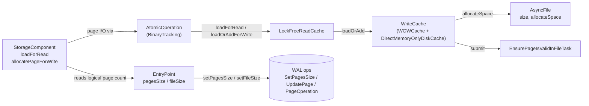

# Read-cache concurrency bug — eliminate the allocator/reader race

## Design Document
[design.md](design.md)

## High-level plan

### Goals

- Eliminate the `LockFreeReadCache.allocateNewPage` / `loadForRead` race that
  poisons disk-mode storage with `IllegalStateException("Page X:Y was
  allocated in other thread")` and `StorageException("Page Y is broken in
  file …")` under concurrent inserts on a freshly-built class.
- Restructure the cache and allocation surface so the race is
  **structurally impossible**, not papered over: remove the public
  discovery channel that lets cross-TX readers learn about an in-flight
  pageIndex.
- Preserve crash-safety guarantees and existing performance characteristics
  of the read/write cache.
- Leave WAL format, public API, and the `core` storage SPI unchanged.

### Constraints

- Edits stay inside `core`'s `internal/core/storage/cache/**` (disk-engine
  cache primitives — `chm/LockFreeReadCache`, `local/WOWCache`,
  `WriteCache` interface), `internal/core/storage/memory/DirectMemoryOnlyDiskCache.java`
  (in-memory engine parallel implementation), the storage components
  that own logical page counts (`paginated/base/StorageComponent` and
  subclasses, `storage/impl/local/AbstractStorage`,
  `storage/impl/local/paginated/atomicoperations/AtomicOperationBinaryTracking`,
  `storage/disk/DiskStorage`), `storage/ridbag/LinkCollectionsBTreeManagerShared.java`
  (Track 7 SLBB iteration accessor), and `storage/fs/AsyncFile.java`
  (Track 7 in-place semantics fix for the existing `shrink(size)`
  primitive). No public-API changes.
- WAL format and replay-record schema unchanged. Page allocation remains
  implicit (no new `AddPage*` record).
- `DoubleWriteLog` (anti-tear) and `EnsurePageIsValidInFileTask`
  (idempotent disk stamping) keep their existing roles.
- Tests must pass under both `checksumMode=Off` and
  `checksumMode=StoreAndThrow`.
- The in-memory engine (`DirectMemoryOnlyDiskCache`) gets a parallel
  `loadOrAdd` implementation; behavior must match the disk engine for the
  shared `WriteCache` interface.

### Architecture Notes

#### Component Map

- **`LockFreeReadCache`** — segment-locked entry table. Loses the
  `allocateNewPage` entry point; both `loadForRead` and
  `loadOrAddForWrite` now bottom out on a single `data.compute` lambda
  that calls `WriteCache.loadOrAdd`.
- **`WriteCache` (`WOWCache` + `DirectMemoryOnlyDiskCache`)** — gains a
  total `loadOrAdd(fileId, pageIndex, verifyChecksums)` primitive that
  loads, extends, or gap-fills (recovery only) as needed; gains a
  recovery-time `shrinkFile(fileId, targetBytes)` primitive (Track 7,
  D6). Loses `allocateNewPage`. `getFilledUpTo` is `@Deprecated(forRemoval=false)`
  + audit-gated (JLS §9.4 forbids access reduction on an interface abstract
  method; Track 5's named helpers carry the audit-grep contract).
- **`AsyncFile`** — unchanged; `allocateSpace` (in-memory `getAndAdd`)
  and `EnsurePageIsValidInFileTask` (idempotent disk stamping) keep their
  current roles.
- **`AtomicOperation` (`AtomicOperationBinaryTracking`)** — `addPage` is
  deleted; the `internalFilledUpTo` prediction wrapper and the
  `commitChanges` do/while reconciliation collapse to single `loadOrAdd`
  calls keyed by the actual pageIndex.
- **`StorageComponent`** — `addPage` is deleted; 19 external production
  call sites migrate to `allocatePageForWrite(fileId, knownIndex)` where
  `knownIndex` comes from `entryPoint.pagesSize + 1` or known fresh-file
  state. Reuse-or-extend probes (`if pageSize < filledUpTo - 1`) are
  removed. See design.md §"Allocation discovery surface".
- **`EntryPoint`** — per-component metadata page (`pagesSize` /
  `fileSize`) becomes the primary cross-TX discovery surface where a
  component has one; EP-less components and chicken-and-egg /
  recovery-rebuild sites route through Track 5's gated helpers (see
  D2 / D4 / design.md §"Allocation discovery surface"). Existing WAL
  ops (`SetPagesSizeOp`, `SetFileSizeOp`) are unchanged.

#### D1: `WriteCache.loadOrAdd` as the sole cache primitive

- **Alternatives considered**: keep `load` + `allocateNewPage` as separate
  methods; introduce `tryLoad` + `extend` factoring; add a marker-bit
  protocol on `PageKey` (the previous design iteration).
- **Rationale**: a total `loadOrAdd` collapses three cache APIs into
  one and removes the only call path that publishes an in-flight
  pageIndex outside `data.compute`'s segment write lock — the bug's
  attack surface. Orphan absorption becomes uniform; the read path
  still goes through the same primitive but never triggers the extend
  branches because higher-level invariants (D2) keep callers within
  the logical page count.
- **Risks/Caveats**: the read path could silently extend the file if
  the D2 invariant is violated. Guarded by per-component logical
  bookkeeping; we do not add `-ea` assertions because the failure mode
  (a wasted empty page) is harmless.
- **Implemented in**: Track 1 (step references added during execution).
- **Full design**: design.md §"Cache primitive: loadOrAdd"

#### D2: `entryPoint.pagesSize` / `fileSize` as the cross-TX discovery surface where one exists (revised after Track 3 Phase A audit)

- **Alternatives considered**: keep `WriteCache.getFilledUpTo` public
  (today's race vector); marker-bit + adopt-on-existing protocol at
  the cache layer (D5); add new EntryPoint + WAL op to every EP-less
  component (rejected — large scope expansion, on-disk format change,
  not rollback-safe via `git revert`).
- **Rationale**: where a component has an EntryPoint, cross-TX
  readers route through `entryPoint.pagesSize` / `fileSize`;
  otherwise, per-component lock + Track 1's `loadOrAdd` totality +
  Track 5's gated helpers cover the I1 race-vector. I1 is upheld by
  **removing public access** to `WriteCache.getFilledUpTo` (D4), not
  by universally routing through logical state — see `design.md`
  §"Allocation discovery surface" for the per-site breakdown.
- **Risks/Caveats**: D4's gated-helper surface is broader than
  originally planned (≥ 5 surviving consumers, not 1). The audit-grep
  target shifts from `WriteCache.getFilledUpTo` to the helper set.
- **Implemented in**: Track 4 (migrations + cleanups); Track 5 (gated
  helpers + access tightening).
- **Full design**: design.md §"Allocation discovery surface"

#### D3: Delete `addPage`; collapse do/while reconciliation

- **Alternatives considered**: keep `addPage` but add a pageIndex
  parameter; keep the `commitChanges` / `restoreAtomicUnit` /
  `restoreFromIncrementalBackup` reconciliation loops "for safety".
- **Rationale**: `addPage`'s no-pageIndex signature is what forced the
  prediction wrapper (`AtomicOperationBinaryTracking.internalFilledUpTo`)
  and the reconciliation loops. Once allocators state their target
  pageIndex (D2), prediction and reconciliation are dead code. All 19
  external `addPage` call sites already know their target from local
  state (the 20th PSI hit is the recursive call inside
  `StorageComponent.loadOrAddPageForWrite`'s existing fallback, which
  Track 4 rewires rather than migrates).
- **Risks/Caveats**: large mechanical change (~20 component sites,
  three replay loops). Integration risk is highest in
  `restoreAtomicUnit`; covered by the regression test in Track 6 plus
  existing recovery test suites.
- **Implemented in**: Track 4.
- **Full design**: design.md §"Allocation discovery surface"

#### D4: `getFilledUpTo` becomes non-public, accessed via gated rationale-bearing helpers (revised after Track 3 Phase A audit)

- **Alternatives considered**: keep public; `@Deprecated` but
  accessible; per-consumer marker-bit (D5); fold each surviving site
  into the gated package path with a free-form method instead of
  named helpers.
- **Rationale**: tighten `WriteCache.getFilledUpTo` to package-private
  (or otherwise non-public). Surviving external consumers (≥ 5: the
  backup quiesced reader plus the stay-on-physical sites enumerated
  in `design.md` §"Migration shape") route through narrowly-scoped
  helpers on `WriteCache` and/or `StorageComponent`, each carrying a
  rationale-bearing name and contract-stating javadoc. The audit-grep
  target for "who reads physical size?" becomes the helper set.
- **Risks/Caveats**: more helpers than originally planned, and the
  helper-set choice (single helper + enum vs 2-3 named helpers) is
  itself a small design decision deferred to Track 5 Phase A. Either
  shape upholds the audit-grep contract.
- **Implemented in**: Track 5.
- **Full design**: design.md §"Allocation discovery surface"

#### D5: Reject the marker-bit + adopt-on-existing fix

- **Alternatives considered**: this DR documents the rejected
  alternative. The previous design iteration introduced
  `freshlyAllocatedPages: Set<PageKey>` populated under the per-page
  exclusive lock, and switched `LockFreeReadCache.allocateNewPage` from
  `putIfAbsent` to `compute(adopt-on-existing)`. Drafts of that
  approach live under `_workflow/` and are deleted alongside this
  plan's creation.
- **Rationale**: the marker-bit fix treats the **symptom** (race
  window between allocator and reader) without removing the **cause**
  (a public discovery channel exposing in-flight pageIndices). The
  structural fix removes the discovery channel itself, simplifying the
  cache in the process. The marker-bit approach also leaves the
  asymmetric API surface (`load` / `allocateNewPage` / `getFilledUpTo`)
  intact — every future cache change has to remember the marker
  protocol.
- **Risks/Caveats**: larger blast radius (touches storage components,
  not just the cache). Mitigated by the per-track test discipline
  (Track 2 for cache; Track 6 for end-to-end). The "cache absorbs
  orphans uniformly" rationale holds **within-TX only**; cross-recovery
  orphans (partial flush + JVM crash) are handled by D6's recovery-time
  truncate pass for EP-equipped components, not by cache semantics.
- **Implemented in**: Tracks 1, 4 (the structural fix lands across
  both; the discovery-channel removal originally split across the
  retired Track 3 and Track 4 is now wholly inside Track 4).

#### D6: Recovery-time orphan truncation pass for EP-equipped components

- **Alternatives considered**: marker-bit + adopt-on-existing at the
  cache layer (rejected by D5; symptom-not-cause); `reuseOrphanPageForWrite`
  SPI allowing below-allocation-floor pageIndex (rejected — re-exposes the
  discovery channel D4 closes); accept-and-document-only (rejected —
  silent self-healing pre-fix becomes noisy manual-recovery post-fix);
  file-name iteration via `WriteCache.nameIdMap` (rejected at iter-1 —
  doubles the test surface vs. iterating component instances); lazy
  self-heal in AOBT's allocator path (rejected at iter-1 — pushes
  recovery cost into the steady-state allocator hot path and complicates
  AOBT's allocator-only contract).
- **Rationale**: Track 4's `addPage` deletion converts the previously-
  silent partial-flush-orphan path into a noisy `IllegalStateException`
  at the next allocator call on the four EP-equipped components. A new
  private `AbstractStorage.truncateOrphansAfterRecovery()` (invoked from
  `open()` and `DiskStorage.postProcessIncrementalRestore` after each
  entry-point's catalogue load) reads logical pages from each EP and
  calls a new `WriteCache.shrinkFile(fileId, targetBytes)` when physical
  exceeds logical. EP-only reads keep D2 and D4 intact. Placement
  correction at Phase A iter-1 moved the pass out of `recoverIfNeeded()`
  (which iterates empty catalogue lists at `:764`) to a post-catalogue-
  load site — see design.md §"Crash safety" for the wiring trace.
- **Risks/Caveats**: in-scope is the four EP-equipped components (BTree,
  SLBB, CPMV2, PCV2); EP-less components and IndexHistogramManager are
  out of scope per Non-Goals (the carve-out acknowledges the
  `checksumMode=StoreAndThrow` exposure). Track 7 also (a) fixes a
  latent `AsyncFile.shrink(size)` in-memory-size reset bug as a
  separable commit, (b) requires `WriteCache.shrinkFile` to purge LFRC
  entries for the truncated range before delegating to `AsyncFile.shrink`
  (mirrors `WOWCache.truncateFile`'s `removeCachedPages` ordering), (c)
  adds a `LinkCollectionsBTreeManagerShared.verifyAndTruncateAllOrphans`
  internal-iteration delegate, and (d) adds the missing
  `v3.BTree.getFileId()` accessor.
- **Implemented in**: Track 7.
- **Full design**: design.md §"Crash safety" → "Post-WAL-replay file truncation"

### Invariants

- **I1**: Cross-TX readers learn about page existence either through
  `entryPoint.pagesSize` / `entryPoint.fileSize` (where the component
  has an EntryPoint) or through Track 5's narrowly-scoped,
  rationale-bearing gated helpers under per-component lock.
  `WriteCache.getFilledUpTo` is not on the cross-TX discovery path.
- **I2**: All cache page-extension occurs inside
  `LockFreeReadCache.data.compute(fileId, pageIndex, λ)` — i.e., under
  the segment write lock for the target key.
- **I3**: `WriteCache.loadOrAdd` is total: it always returns a usable
  `CachePointer`. It never returns null.
- **I4**: Per-component locks (BTree mutex, position-map mutex, BTree
  splitter mutex) serialize concurrent allocators that share a `fileId`,
  so two concurrent `loadOrAdd` calls cannot target the same
  `(fileId, pageIndex)` from different transactions.
- **I5**: `entryPoint.pagesSize` / `fileSize` is bumped only inside the
  same WAL atomic unit that performed the corresponding `loadOrAdd`,
  via the existing `SetPagesSizeOp` / `SetFileSizeOp` WAL records.
- **I6**: After `AbstractStorage.open()` and
  `DiskStorage.postProcessIncrementalRestore` return, every EP-equipped
  component (BTree, SLBB, CollectionPositionMapV2, PaginatedCollectionV2)
  satisfies `entryPoint.logicalPages == AsyncFile.getFileSize() / pageSize`.
  Established by Track 7; maintained by I5.

### Integration Points

- `LockFreeReadCache.loadForRead` and `LockFreeReadCache.loadOrAddForWrite`
  delegate to `WriteCache.loadOrAdd` via `data.compute`. The two
  wrappers differ only in `CacheEntry` lock semantics.
- `StorageComponent.allocatePageForWrite(fileId, pageIndex)` is the
  canonical write-side helper for storage components after Track 5's
  rename (Track 4 introduced it as `loadOrAddPageForWrite`); `addPage`
  is deleted.
- `DirectMemoryOnlyDiskCache.loadOrAdd` is the in-memory engine's
  parallel implementation of the new primitive.
- `DiskStorage.backupPagesWithChanges` reads file-physical size during
  storage quiesce via the gated path introduced in Track 5.
- `AbstractStorage.open()` and `DiskStorage.postProcessIncrementalRestore`
  invoke Track 7's new `truncateOrphansAfterRecovery()` pass after
  the catalogue load — see design.md §"Crash safety" → "Post-WAL-replay
  file truncation" for the iteration + `shrinkFile` mechanics.

### Non-Goals

- Post-WAL-replay file truncation for **EP-less** components
  (`FreeSpaceMap`, `CollectionDirtyPageBitSet`). Their growth-loop
  allocators skip the orphan write (`for (i = filledUpTo; i <=
  target; i++)` is empty when `target < filledUpTo`) but DO read the
  orphan page on the next access via `loadPageForWrite`. Behaviour
  per checksum mode (PSI-audited at Track 7 Phase A iter-1):
  - `checksumMode=StoreAndThrow` (project CI default): the orphan's
    stale or zero checksum trips `StorageException("Page Y is broken
    in file")` at first read — loud, user-visible failure.
  - `checksumMode=Off`: the orphan is adopted as a legitimate page on
    next access; FSM/CDPB are bitmap-style structures, so historical
    bytes are overwritten without progressive corruption.
  Track 6 owns the CS1 regression coverage exercising FSM and CDPB
  partial-flush scenarios under both modes; Track 7 deliberately
  stays scoped to EP-equipped components where logical-recovery is a
  one-liner (`entryPoint.fileSize` / `pagesSize` read). Expanding
  Track 7 to FSM/CDPB would require deriving logical state from each
  component's parent PCV2 — complex per-component logic for a smaller
  exposure surface.
- Post-WAL-replay file truncation for `IndexHistogramManager`. IHM
  uses a page-1 discriminator (`op.filledUpTo > 1 ? load : allocate`)
  rather than an EP-fileSize check; the discriminator IS the physical
  extent, so a partial-flush orphan at page 1 mis-classifies a
  not-spilled HLL as spilled. Behaviour:
  - `checksumMode=StoreAndThrow`: HLL deserialise of orphan bytes
    fails the stale checksum → `StorageException` — loud failure.
  - `checksumMode=Off`: HLL state silently corrupted, but cardinality
    estimation is best-effort (not load-bearing data).
  Track 6 owns the HLL-spill crash-then-second-spill regression
  exercising both modes. Expanding Track 7 to IHM would require
  reading page-0's `hllSize` flag to derive logical state — IHM-
  specific recovery logic outside the EP-driven pass.
- Performance debt of the recovery probe — tracked in
  `ISSUE-recovery-log-perf-debt.md`.
- Truncate-cache purge ordering bug — tracked in
  `ISSUE-truncate-cache-purge-ordering.md`.
- Vestigial allocation flag cleanup — tracked in
  `ISSUE-vestigial-allocation-flag.md`.
- Public API renames or new `AddPage*` WAL record class.
- Track 4 Phase C unit-level test-hardening backlog — out-of-scope for
  this plan; tracked as Track 2-style follow-ups. Items: truncate-then-
  allocate same-TX scenario, `BTree.doAssertFreePages` pure-logical-
  sizing divergence test, `WOWCache.loadOrAddLoadBranch` `assert false`
  activation test, FSM `updatePageFreeSpace` growth-loop boundary
  cases, AOBT in-memory `loadOrAdd` non-null totality unit pin, BTree
  freelist branch dedicated test, `eagerlyInstalledInCache` flag commit-
  time skip unit pin, negative-pageIndex overflow boundary; defensive
  asserts at `SLBB.splitRootBucket` (leftPageIndex distinctness) and
  FSM/CDPB growth-loop invariants; F14 probe comment-prose imprecision
  (claims `IllegalStateException` but `-ea` fires `AssertionError`
  first) — items noted in Track 4 episode for future reference.

## Checklist

- [x] Track 1: Cache primitive — `WriteCache.loadOrAdd`
  > Rewrite the write-cache around a single total `loadOrAdd(fileId,
  > pageIndex, verifyChecksums)` primitive covering load /
  > one-page extend / multi-page gap-fill (recovery only), with
  > `DirectMemoryOnlyDiskCache` mirroring it. Both `LockFreeReadCache`
  > wrappers (`loadForRead` / `loadOrAddForWrite`) collapse to a
  > `data.compute` lambda that delegates to `loadOrAdd`. Legacy
  > `allocateNewPage` methods are deprecated here; final deletion lands
  > in Track 4 once replay-loop callers migrate.
  >
  > **Track episode:**
  > Built the structural fix: a single total `WriteCache.loadOrAdd`
  > primitive serving load / one-page extend / multi-page gap-fill
  > (recovery-only), with `DirectMemoryOnlyDiskCache.loadOrAdd` +
  > `MemoryFile.loadOrAddPage` as the in-memory parallel.
  > `LockFreeReadCache.loadForRead` and `loadOrAddForWrite` now both
  > bottom out on a `data.compute` lambda that delegates to `loadOrAdd`;
  > the wrappers diverge only in `CacheEntry` lock semantics.
  > `silentLoadForRead` migrated to a new non-extending `loadIfPresent`
  > probe so all production callers of the legacy `WriteCache.load` are
  > now retired. Legacy `allocateNewPage` / `load` are `@Deprecated`
  > with deletion deferred to Track 4 (once replay-loop callers
  > migrate). Three production-code surprises landed during the track:
  > (1) Step 2's review fix converted two extend / gap-fill
  > `allocatedIndex == pageIndex` checks into hard
  > `IllegalStateException` throws so I4 violations fail fast in
  > production builds; (2) Step 3 discovered the original
  > `ConcurrentSkipListMap.computeIfAbsent` dispatch in
  > `MemoryFile.loadOrAddPage` was unsafe under contention and replaced
  > it with the eager-construct + `putIfAbsent` +
  > `decrementReferrer`-on-loss pattern; (3) Phase C surfaced a real
  > production regression — `LockFreeReadCache.doLoad` was bleeding
  > `markAllocated` into the read path. Phase C iteration 1's fix
  > added a `forWrite` parameter to `doLoad` so only the write-load
  > path flags entries; the rewritten read-path test pins the new
  > contract and an empirical mutation (deleting `forWrite &&`) was
  > confirmed to reproduce the regression. Cross-track impact:
  > **Track 4** inherits four reconciliation TODO sites whose comments
  > now correctly distinguish disk-engine totality from in-memory
  > engine null-on-miss (the `IllegalStateException` in `doLoad`'s
  > lambda makes the Track 4 migration safer — any totality-contract
  > violation surfaces immediately instead of silently activating the
  > racy `addNewPagePointerToTheCache` fallback). **Track 2**
  > inherits ~10 deferred test-hardening items: `verifyChecksums=true`
  > parity on disk-engine load + gap-fill, in-memory `loadIfPresent`
  > UOE-throw test, gap-fill intermediate-page accessibility test,
  > framePool leak accounting, target-publish stress, fail-fast
  > `IllegalStateException` regression test (requires a
  > `setLoadOrAddReturnsNull` mock toggle), read-path markAllocated
  > boundary parity test, and a `WOWCache.loadOrAdd` MT
  > defense-in-depth test against I4 violations. **Track 5 / Track 6**
  > are unaffected. Known follow-up not yet on the plan: widening
  > `loadOrAdd`'s return value to `{CachePointer, freshlyAllocated}`
  > eliminates one `filesLock` cycle plus one `files.get` per
  > cache miss (~1-3% potential throughput on cold-cache benchmark
  > workloads under high concurrency) — captured in the Step 4 episode
  > and the Phase C performance reviewer's PF1.
  >
  > **Step file:** `tracks/track-1.md` (6 steps, 0 failed)
  >
  > **Strategy refresh:** CONTINUE — Track 1's ~10 deferred test-hardening
  > items (verifyChecksums parity, framePool leak accounting, target-publish
  > stress, truncate-vs-loadOrAdd race, fail-fast IllegalStateException
  > regression, read-path markAllocated boundary parity, in-memory
  > loadIfPresent UOE-throw, loadIfPresent MT/eviction, etc.) map cleanly
  > into Track 2's existing MT-stress + functional-branch scope; no
  > backlog amendment required. Tracks 3-6 unaffected.

- [x] Track 2: Cache test coverage (functional + MT)
  > Add functional unit tests covering every branch of
  > `WOWCache.loadOrAdd` and the `LockFreeReadCache` wrappers, plus MT
  > stress harnesses for contention, eviction, and
  > `EnsurePageIsValidInFileTask` idempotency. Run the cache-classes
  > coverage gate before closing the track.
  >
  > **Track episode:**
  > Built a comprehensive cache-layer test suite: functional branch
  > coverage on `WOWCache.loadOrAdd` and `DirectMemoryOnlyDiskCache.loadOrAdd`,
  > wrapper-level functional contracts on `LockFreeReadCache` (cache
  > hits/misses, eviction, pin retention, WTinyLFU two-tier transitions
  > via reflection helpers), and MT-stress harnesses covering
  > distinct-key contention, same-key serialisation, reader-vs-writer
  > extension, eviction-vs-load churn, flush-worker concurrency under
  > `StampedLock` fallback, `EnsurePageIsValidInFileTask` idempotency,
  > delete/truncate-vs-loadOrAdd races, and an I4 negative-defence on
  > the bare cache surface. `WOWCacheLoadIfPresentTest` gained MT
  > coverage and a corrupted-page checksum-verify test. Cache-layer
  > invariants **I2** (extension under segment lock), **I3**
  > (`loadOrAdd` is total), and **I4** (segment lock serialises
  > contending allocators) are now pinned; **I1** is deferred to
  > Track 6 (above the cache layer). Phase C track-level review
  > surfaced 30+ findings across 7 dimensions; iteration 1 applied 10
  > in-scope fixes in commit `30de936927`, the 4-agent gate-check
  > passed with 2 minor new findings (M1 — shallow exception
  > identifier mirroring a pre-existing sibling pattern; TC-N1 —
  > gap-fill byte-content compare misses a perf-only regression class)
  > acknowledged as low-value, and the review closed at iteration 1/3
  > with PASS. **Cross-track impact for Track 4** (write-side API
  > collapse): inherits the new `MockedWriteCache.loadOrAddCount` /
  > `storeBlockLatch` mock seams; the `@Category(SequentialTest.class)`
  > usage pattern for any future JVM-singleton-allocator-sensitive MT
  > test; the canonical `frameBytes = DISK_CACHE_PAGE_SIZE * 1024`
  > derivation (Iteration-1 implementer discovered + fixed a
  > pre-existing latent bug in the framePool leak accounting test
  > that divided by the test-local `PAGE_SIZE` constant rather than
  > the JVM-singleton framePool's page size); I4 sentinel
  > falsifiability for **both** extend (`"allocated pageIndex"`) and
  > gap-fill (`"allocated start index"`) branches; the wrapper-level
  > same-key `loadOrAddForWrite` segment-lock pin; and a one-line
  > backlog bullet (defensive `assert false` in
  > `WOWCache.loadOrAddLoadBranch`'s dead-code fallback, plan
  > correction commit `475d6469d3`). **Tracks 5 / 6 unaffected.**
  > **Deferred un-addressed should-fix** items from iter-1 synthesis
  > (test-hardening only, not correctness, CI-stable today):
  > race-window asymmetry in two `WOWCacheLoadIfPresentTest` MT
  > tests, `testFlushWorkerConcurrencyReaderObservesConsistentState`
  > lacks positive evidence of the readLock fallback path,
  > per-attempt thread pool re-creation + file-leak +
  > `cleanUp`-IOException-swallow in `WOWCacheLoadOrAddConcurrentTest` —
  > surfaced here for future-track awareness.
  >
  > **Step file:** `tracks/track-2.md` (6 steps, 0 failed)
  >
  > **Strategy refresh:** CONTINUE — Track 3 (read-side discovery migration)
  > operates on storage-component code, independent of the cache-layer changes
  > Tracks 1 and 2 delivered. No plan/backlog edits required for any remaining
  > track. The pre-existing "Open audit" item in the Track 3 backlog
  > (`CollectionDirtyPageBitSet` / `FreeSpaceMap` / `IndexHistogramManager`
  > logical-size getter; `PaginatedCollectionV2.open:391` and
  > `CollectionPositionMapV2.create:136` semantics) is resolved inside Phase A.

- [x] Track 4: Write-side API collapse + residual read-side migration
  > Delete the `addPage` API surface and migrate the 19 production
  > call sites to `loadOrAddPageForWrite(fileId, knownIndex)` on top
  > of Track 1's primitive. Collapse the `commitChanges` /
  > `restoreAtomicUnit` / `restoreFromIncrementalBackup` reconciliation
  > loops, drop the `internalFilledUpTo` prediction wrapper, delete
  > the per-component reuse-or-extend probes, and absorb the surviving
  > read-side work from the retired Track 3 (one BTree pure-sizing
  > migration plus rationale comments at the stay-on-physical sites —
  > see `tracks/track-4.md` for the per-site list).
  >
  > **Track episode:**
  > Collapsed the legacy write-side allocator surface around Track 1's
  > `loadOrAdd` primitive. All 19 production `addPage` call sites moved
  > to `op.loadOrAddPageForWrite(fileId, knownIndex)` across BTree,
  > SharedLinkBagBTree, CollectionPositionMapV2, PaginatedCollectionV2,
  > FreeSpaceMap, IndexHistogramManager, and CollectionDirtyPageBitSet.
  > The three replay/commit reconciliation loops (`AOBT.commitChanges`,
  > `AbstractStorage.restoreAtomicUnit` both branches,
  > `DiskStorage.restoreFromIncrementalBackup`) collapsed to single
  > `readCache.loadOrAddForWrite` calls. `internalFilledUpTo` inlined
  > into `filledUpTo`; `AtomicOperation.addPage`, `StorageComponent.addPage`,
  > and `WriteCache/ReadCache.allocateNewPage` (all three engine impls)
  > deleted. `BTree.doAssertFreePages` migrated to
  > `entryPoint.getPagesSize() + 1`. Six stay-on-physical sizing sites
  > gained rationale-bearing comments anchoring the helper contract
  > Track 5 will introduce. Test fixtures across 8 AOBT/cache test files
  > migrated; the cache-test `MockedWriteCache.allocateNewPage` stubs
  > deleted with the interface.
  >
  > **Allocator-only contract narrowing.** Step 2's review-fix
  > `48a83793cb` (Option D, design-decision escalation) narrowed
  > `AtomicOperation.loadOrAddPageForWrite` from total to allocator-only —
  > calling it with a non-new pageIndex now throws `IllegalStateException`
  > with site-distinguishing messages. The cache-layer `WriteCache.loadOrAdd`
  > remains total. The narrowing strengthened the design at the cost of an
  > incorrect rationale trace; Step 5 [!] failed when the full `-P coverage`
  > build NPE'd on fresh in-memory database creation because the in-memory
  > engine's `loadOrAddForWrite` is deliberately non-total and the
  > eager-install branch had been deleted. User picked Option A from the
  > split-decision and Step 5 was split into Step 5a (re-introduce
  > in-memory eager install + the `eagerlyInstalledInCache` commit-time-skip
  > flag + eager `readCache.addFile` on the in-memory engine) and Step 5b
  > (the originally-planned collapse, now safe). The `assert cacheEntry != null`
  > at the in-memory-reachable `commitChanges` site was promoted to an
  > unconditional `IllegalStateException` so future regressions surface
  > loudly in production builds; the three disk-only sibling sites kept
  > `assert` semantics — an asymmetric-safety pattern documented in the
  > AOBT inline comment block.
  >
  > **IHM HLL-spill cross-TX regression caught at iter-2 of Step 2.** The
  > original narrowing would have hard-crashed
  > `IHM.writeSnapshotToPage` / `flushSnapshotToPage` on the second spill
  > (those pre-existing callers relied on the old load-or-add fallback).
  > Resolution: caller-side discriminator
  > (`op.filledUpTo > 1 ? loadPageForWrite : loadOrAddPageForWrite`) at
  > both IHM sites, under the IHM exclusive lock acquired upstream.
  >
  > **Phase C track-level review.** Ran the 9-reviewer fan-out for 3
  > iterations against the cumulative track diff (~6.8K lines added, 67
  > files). Iter-1 applied 11 findings, iter-2 applied 4, iter-2
  > gate-check across 8 dimensions PASSed; iter-3 applied one user-surfaced
  > finding (IHM workflow-label cleanup in `010f07e217`). After iter-3
  > closed, a user-initiated Review-mode round at track completion landed
  > one comment-only cleanup commit (`881b8025d3`) stripping a historical
  > "do/while" reference from the four sibling `loadOrAddForWrite`
  > comment blocks (DiskStorage incremental-backup restore + AbstractStorage
  > UpdatePageRecord/PageOperation branches + AOBT.commitChanges) so
  > fresh readers no longer have to reason about removed code. Reviewer
  > fan-out plus per-step dim-review fan-outs produced six new strands
  > of work documented below.
  >
  > **Cross-track impact.**
  >
  > - **Track 7 (newly added by inline replan, commit `0a003588f7`).** The
  >   reviewer fan-out's CS1 finding identified that `addPage`'s deletion
  >   converts the previously-silent partial-flush-orphan path into a noisy
  >   `IllegalStateException` at the next allocator call on the four
  >   EP-equipped components (BTree, SLBB, CollectionPositionMapV2,
  >   PaginatedCollectionV2). User chose Option 3b (recovery-time truncate
  >   at storage open) on 2026-05-14. The inline replan added Decision
  >   Record D6, Invariant I6 (`logical == physical` after `open()` and
  >   `postProcessIncrementalRestore` return), a new
  >   `WriteCache.shrinkFile(fileId, targetBytes)` SPI wrapping
  >   `AsyncFile.shrink`, and the Track 7 step file with the
  >   per-EP-component `verifyAndTruncateOrphans` recipe wired into a
  >   new private `AbstractStorage.truncateOrphansAfterRecovery()`
  >   orchestrator called from `open()` after the catalogue load and
  >   from `DiskStorage.postProcessIncrementalRestore` after its
  >   catalogue load. EP-less components and `IndexHistogramManager`
  >   are deliberately out of scope per Non-Goals carve-outs.
  >
  > - **Track 5 scope expansion (plan correction commit `1e37a681eb`).**
  >   Renamed Track 4's `op.loadOrAddPageForWrite` → `allocatePageForWrite`.
  >   The rename touches the `AtomicOperation` SPI, the
  >   `AtomicOperationBinaryTracking` impl, the `StorageComponent` wrapper,
  >   19 production allocator call sites, and ~80 test references including
  >   class rename `LoadOrAddPageForWriteTest` → `AllocatePageForWriteTest`.
  >   Track 5 must use `mcp-steroid://ide/change-signature` so polymorphic
  >   dispatch through the SPI plus Javadoc `{@link}` references update
  >   atomically; raw `Edit` silently misses both. Track 5's existing
  >   helper-set work (D4 — tightening `WriteCache.getFilledUpTo` to
  >   non-public, gated `physicalSize`-shaped helpers) is unchanged.
  >   Critical: the helper-set must keep `WriteCache.getFilledUpTo(fileId)`
  >   callable from AOBT's `isNew` slow-path classification, and
  >   `AtomicOperation.filledUpTo(fileId)` callable from the new IHM
  >   HLL-spill discriminator — both reads happen inside the per-component
  >   exclusive lock.
  >
  > - **Track 6 deferrals absorbed via the inline replan's plan corrections.**
  >   CS1 multi-page partial-flush-orphan recovery test (now post-Track-7
  >   invariant assertion — pin both the truncate-needed and
  >   no-op-clean-shutdown branches across all four EP-equipped components);
  >   HLL-spill crash-then-second-spill regression for the IHM page-1
  >   discriminator (out of Track 7 scope because IHM uses page-1
  >   discrimination, not EP-fileSize sizing); `StorageBackupMTStateTest`
  >   `@Ignore` resurrection for the collapsed `restoreFromIncrementalBackup`
  >   loop; I4 per-component MT pins at BTree.create, SLBB.splitRootBucket,
  >   CPMV2.allocate, PCV2.allocateNewPage plus IHM
  >   flushSnapshot/writeSnapshot lock-contract pin and
  >   `inMemoryEagerInstallToleratesConcurrentOrphanReuse` contention-window
  >   strengthening.
  >
  > - **Track 2-style follow-ups absorbed from Step 5b's 13 deferred items.**
  >   Comment-block density / DRY across three sites,
  >   `WOWCache.loadOrAddLoadBranch` `assert false` activation under a
  >   `loadFileContent`-override seam (TY2/TX2), assert-message + comment +
  >   Javadoc overlap on WOWCache, sibling-test helper extraction. None
  >   blocker-grade; surfaced for a future cache-layer test-hardening pass.
  >
  > - **Non-Goals additions to the plan.** A larger "Track 4 Phase C
  >   unit-level test-hardening backlog" block now lives under Non-Goals
  >   (truncate-then-allocate same-TX scenario, `BTree.doAssertFreePages`
  >   pure-logical-sizing test, `WOWCache.loadOrAddLoadBranch` `assert false`
  >   activation, FSM `updatePageFreeSpace` growth-loop boundaries, AOBT
  >   in-memory `loadOrAdd` non-null totality, BTree freelist branch test,
  >   `eagerlyInstalledInCache` commit-time-skip unit pin, negative-pageIndex
  >   overflow boundary, defensive asserts at SLBB.splitRootBucket / FSM /
  >   CDPB, F14 probe comment imprecision around `IllegalStateException`
  >   vs `AssertionError` under `-ea`).
  >
  > - **Other backlog items recorded outside the plan** (so the plan stays
  >   lean): `ISSUE-recovery-log-perf-debt.md` (recovery probe perf debt),
  >   `ISSUE-truncate-cache-purge-ordering.md` (truncate-cache purge
  >   ordering), `ISSUE-vestigial-allocation-flag.md` (vestigial allocation
  >   flag cleanup).
  >
  > - **TX-6 advisory.** The structurally-unreachable `else if (truncate)`
  >   third arm of the inlined `AOBT.filledUpTo` is not load-bearing under
  >   current `truncateFile` semantics (which set `maxNewPageIndex = -1`
  >   before flagging `truncate=true`, so arm 2 catches first). Deferred
  >   suggestion: either delete the dead branch or refit `truncateFile`
  >   to make arm 3 reachable. Recorded in the Step 7 critical context.
  >
  > **What changed from the plan.** Step 5 [!] failure forced the 5a/5b
  > split (the only Phase B failure across the track). The allocator-only
  > contract narrowing in Step 2 (Option D, design-decision escalation)
  > was a strengthening — D3 wording remained accurate, but the actual
  > semantics now embed the stricter `IllegalStateException` contract.
  > Step 3 absorbed two Mockito-stub migrations originally listed for
  > Step 4 (natural-home rule). CS1 escalation added a brand-new Track 7
  > and Invariant I6 to the plan via inline replan; the user-selected
  > Option 3b was the only design decision that re-shaped the plan
  > beyond what Phase A anticipated.
  >
  > **Step file:** `tracks/track-4.md` (9 steps, 1 failed)
  >
  > **Strategy refresh:** CONTINUE — Track 4 episode discoveries
  > (CS1 → new Track 7 + DR D6 + Invariant I6, the `loadOrAddPageForWrite`
  > → `allocatePageForWrite` rename absorbed into Track 5, the Track 6
  > scope expansion for CS1 / HLL-spill / StorageBackupMTStateTest / I4
  > MT pins, the Track 2-style unit-test backlog under Non-Goals) all
  > landed on disk via prior inline-replan and plan-correction commits
  > (`8d4360731a`, `04d67da67c`, `f6b4c404d2`, `dbdd097fb9`). Tracks 5-7
  > are self-consistent with the post-Track-4 reality; no further plan
  > amendments required before Track 5 Phase A.

- [x] Track 5: Tighten `getFilledUpTo` access via gated helpers; rename `loadOrAddPageForWrite`
  > Make `WriteCache.getFilledUpTo` non-public and route the surviving
  > external consumers (≥ 5 — see `tracks/track-5.md` for the per-site set)
  > through narrowly-scoped helpers with rationale-bearing names.
  > Phase A picks the helper shape (one helper + intent enum vs 2-3
  > named helpers). Add javadoc to `WriteCache` and `StorageComponent`
  > documenting the discovery contract.
  >
  > **Track episode:**
  > Routed the cross-component physical-size discovery channel through a
  > named, audit-grep-able helper set per D4 and absorbed the Track 4
  > Phase C `loadOrAddPageForWrite` → `allocatePageForWrite` rename in
  > the same track. Two layers landed: Layer A's
  > `WriteCache.physicalSizeForBackupSnapshot(fileId)` covers the one
  > direct-`getFilledUpTo` caller (`DiskStorage.backupPagesWithChanges`,
  > a post-unfreeze snapshot read whose Javadoc now spells out the
  > not-quiesced semantics); Layer B's
  > `StorageComponent.physicalSize(op, fileId, PhysicalReadIntent)` +
  > 5-constant `PhysicalReadIntent` enum covers the 8 indirect callers
  > (`CPMV2:141`, `PCV2:{2271,396}`, `IHM:1843`, `FSM:237`,
  > `CDPB:{146,178,213}`). The Layer B helper routes through
  > `op.filledUpTo` so the AOBT `FileChanges` placeholder side-effect
  > is preserved on first touch. `WriteCache.getFilledUpTo` is
  > `@Deprecated(forRemoval=false)` with a Javadoc enumerating the
  > retained internal-caller set (LFRC.doLoad + AOBT.{allocatePageForWrite,
  > filledUpTo} + the two `WriteCache` implementer overrides); every
  > retained caller carries `@SuppressWarnings("deprecation")`. JLS §9.4
  > forbids a literal package-private downgrade on an interface abstract
  > method, so the audit-grep contract is enforced by `@Deprecated` +
  > Javadoc + helper-set naming rather than access modifier. The IDE
  > Rename renamed `loadOrAddPageForWrite` → `allocatePageForWrite`
  > atomically across the SPI interface, the
  > `AtomicOperationBinaryTracking` impl, the `StorageComponent` wrapper,
  > 21 production allocator call sites, the test class
  > `LoadOrAddPageForWriteTest` → `AllocatePageForWriteTest`, and ~80
  > test references; a follow-up `steroid_apply_patch` (35 hunks ×
  > 14 files) swept the prose / Javadoc-`{@code}` / string-literal
  > residue the Rename engine deliberately leaves untouched. The AOBT
  > method's Javadoc now leads with the cross-engine asymmetry headline
  > "allocator-only on disk; eager-install total on in-memory" and the
  > same headline is mirrored in the renamed test class header.
  >
  > **Phase C track-level review.** Iteration 1 spawned 7 dimensional
  > reviewers in parallel (CQ, BC, TB, TC, CS, TY, PF) against the
  > cumulative diff. After dedup and synthesis: 9 in-scope findings
  > (3 doc/quality + 2 test-mutation + 3 test-completeness + 1 minor-doc),
  > 7 deferred (5 style polish; 2 minor test-hardening that fold cleanly
  > into Track 2's MT-hardening backlog and Track 6's
  > `StorageBackupMTStateTest` resurrection bullet — no new plan
  > corrections required). Iter-1 implementer commit `fe31279c57`
  > applied 8 fixes: (CQ1) re-indented the new `StorageComponent` class
  > header Javadoc from `     *` to ` *`; (CQ2) deleted the orphaned
  > 2-arg `StorageComponent.getFilledUpTo` (PSI-verified zero callers —
  > only ref was a self-`{@link}` in the `physicalSize` Javadoc, also
  > removed) so the audit-grep surface has no unnamed bypass;
  > (CQ5) dropped a redundant `assert intent != null;` already covered
  > by `@Nonnull`; (TB1) added literal-expected-value asserts to all 7
  > Layer A parity tests so each helper is independently falsifiable;
  > (TB2) added `verifyNoInteractions(mockWriteCache)` +
  > `verifyNoMoreInteractions(op)` to `StorageComponentPhysicalSizeTest`
  > to catch the bypass route the Javadoc names; (TC1) post-truncate
  > corner test on both Layer A engines; (TC2) deleted-file behavior
  > documenting the cross-engine asymmetry (in-memory throws
  > `StorageException`, disk returns 0); (TC3) AOBT existing-entry arm
  > exercised through `physicalSize` with reflection-mutated
  > `maxNewPageIndex` and `isSameAs` placeholder-identity pin so a
  > future regression that re-creates the placeholder on the second
  > call would fail. TB4 verified clean (the `{@link WOWCacheLoadOrAddTest}`
  > cross-reference resolved — class exists). Gate-check fan-out across
  > CQ/TB/TC: PASS at iteration 1, zero new findings.
  >
  > **Cross-track impact.**
  >
  > - **Track 6 (Integration regression test).** TC2's in-memory
  >   deleted-file asymmetry test now documents a divergence that may
  >   matter to recovery / backup scenarios that exercise both engines.
  >   If any downstream test invokes
  >   `WriteCache.physicalSizeForBackupSnapshot` on a fileId that may
  >   have been deleted, the engine choice changes behavior. Worth
  >   flagging during Track 6 Phase A. The
  >   `StorageBackupTestWithLuceneIndex` commented-out `@Test`
  >   annotations at `:64`/`:117` remain relevant if Track 6 un-skips
  >   `StorageBackupMTStateTest` for the `restoreFromIncrementalBackup`
  >   Lucene-indexed parallel.
  > - **Track 6 (continued).** The pre-existing
  >   `LocalPaginatedCollectionV2TestIT` 9-error cascade rooted in
  >   `testAddManyRecords` (async flush vs `.fsm` file cleanup,
  >   reproduces on the base commit) still applies — Track 6's
  >   CS1 / I4 MT pin work should factor this flake into
  >   regression-detection design.
  > - **Track 7 (Recovery-time orphan truncation).** TC3's
  >   reflection-based pin on
  >   `AtomicOperationBinaryTracking.fileChanges` + `maxNewPageIndex`
  >   is a reusable pattern for any Track 7 test that needs to
  >   exercise AOBT in-TX state from a test home outside the
  >   `…paginated.atomicoperations` package. The cross-engine asymmetry
  >   headline is now load-bearing in both AOBT impl Javadoc and the
  >   renamed test class header — Track 7 readers entering the AOBT
  >   layer for the recovery-time `verifyAndTruncateOrphans` recipe
  >   see the disk-vs-memory split up front.
  > - **Deferred items not requiring plan corrections** (affected
  >   backlogs already absorb the categories): CQ4 (WriteCache Javadoc
  >   ~30% trim), CQ6 (Layer A delegator comment density), TB3
  >   (placeholder default-state shape), TC4 (Layer A read-lock
  >   contention pin → Track 2 MT-hardening backlog), TC5 (backup
  >   mid-iteration extension pin → Track 6 `StorageBackupMTStateTest`
  >   resurrection), TY3 (`physicalSize` lock-held assert — no cheap
  >   lock probe).
  >
  > **Step file:** `tracks/track-5.md` (6 steps, 0 failed; iter-2
  > step-6 review fix `066176414e`; Phase C iter-1 review fix
  > `fe31279c57`)
  >
  > **Strategy refresh:** CONTINUE — Track 5's helper-set (Layer A
  > `physicalSizeForBackupSnapshot`, Layer B `physicalSize` +
  > `PhysicalReadIntent`) and the `loadOrAddPageForWrite` →
  > `allocatePageForWrite` rename target the cache/API-hygiene plane;
  > Track 7's recovery path reads EP logical state directly and uses
  > `AsyncFile.getFileSize() / pageSize` for the physical compare, so
  > the two don't intersect. TC3's reflection pin on
  > `AOBT.fileChanges` / `maxNewPageIndex` plus the AOBT cross-engine
  > asymmetry headline are reusable Track 7 reading material. Plan-
  > checklist reorder applied this session (Track 7 ahead of Track 6)
  > to satisfy Track 6's `**Depends on:** Track 7`.

- [ ] Track 7: Recovery-time orphan-truncation pass
  > Add a recovery-time pass via a new private
  > `AbstractStorage.truncateOrphansAfterRecovery()` called from
  > `open()` after the catalogue load (`openCollections` /
  > `openIndexes` / `linkCollectionsBTreeManager::load` populate the
  > iteration targets) and from
  > `DiskStorage.postProcessIncrementalRestore` after its catalogue
  > load. The pass walks each EP-equipped storage component, reads
  > its entry-point logical page count, and truncates physical
  > orphans via a new `WriteCache.shrinkFile(fileId, targetBytes)`
  > primitive backed by `AsyncFile.shrink`.
  >
  > **Scope:** ~3-4 steps covering: (a) `WriteCache.shrinkFile` SPI
  > addition + `WOWCache` impl wrapping `AsyncFile.shrink` +
  > `DirectMemoryOnlyDiskCache` no-op impl + unit tests; (b)
  > per-EP-equipped-component `verifyAndTruncateOrphans(AtomicOperation,
  > WriteCache)` helper that loads its EP page (read-only), compares
  > logical to `AsyncFile.getFileSize() / pageSize`, and calls
  > `shrinkFile` when physical exceeds logical; (c)
  > `AbstractStorage.truncateOrphansAfterRecovery()` orchestrator +
  > `open()` wiring (after `:800`) + `DiskStorage.postProcessIncrementalRestore`
  > wiring (between `:1671` and `:1673`) + iteration over the four
  > component classes via the existing `collections` /
  > `indexEngines` / `linkCollectionsBTreeManager` fields; (d)
  > integration tests pinning the post-replay `physical == logical`
  > invariant for each EP-equipped component, including a positive
  > test (orphan present → truncated) and a negative test (clean
  > shutdown → no-op).
  > **Depends on:** Track 4

- [ ] Track 6: Integration regression test
  > End-to-end concurrent-insert workload that reproduces the original
  > poison cascade: open a fresh disk-mode storage with
  > `checksumMode=StoreAndThrow`, create a class with an indexed
  > string property, run N parallel transactions inserting into the
  > class via `executeInTx` / `autoExecuteInTx`. Assert no
  > `IllegalStateException`, no `StorageException("Page Y is broken")`,
  > no "Internal error happened in storage" cascade, and that all
  > committed records are readable on reopen.
  >
  > **Phase C deferrals absorbed (Track 4 review fan-out):**
  > - **Partial-flush-orphan recovery (CS1)** — drive the multi-page
  >   partial-flush-orphan path on each of the four EP-equipped
  >   components (`BTree`, `SLBB`, `CPMV2`, `PCV2`); restart the
  >   storage; assert that the Track 7 recovery-time truncate pass
  >   restored `physical == logical` and the next TX completes without
  >   `IllegalStateException`. Pin both the truncate-needed and
  >   no-op-clean-shutdown branches.
  > - **HLL-spill recovery** — crash-then-second-spill regression for
  >   the IHM HLL-page-1 discriminator (`op.filledUpTo > 1 ? load :
  >   allocate`). Out of Track 7 scope because IHM uses a page-1
  >   discriminator rather than EP-fileSize sizing.
  > - **StorageBackupMTStateTest `@Ignore` resurrection** — concurrent
  >   incremental-backup recovery test for the collapsed
  >   `restoreFromIncrementalBackup` loop.
  > - **I4 per-component MT pins** — IHM `flushSnapshotToPage` vs
  >   `writeSnapshotToPage` lock contract; two-TX contention on
  >   `op.allocatePageForWrite(fileId, sameKnownIndex)` at BTree.create,
  >   SLBB.splitRootBucket, CPMV2.allocate, PCV2.allocateNewPage;
  >   strengthen `inMemoryEagerInstallToleratesConcurrentOrphanReuse`
  >   contention window.
  >
  > **Scope:** ~5-7 steps covering: (a) original poison-cascade test
  > scaffolding + fail-on-develop / pass-on-fix verification;
  > (b) CS1 partial-flush-orphan scenario (post-Track-7 invariant
  > assertion); (c) HLL-spill recovery; (d) StorageBackupMTStateTest
  > resurrection; (e) I4 per-component MT pins across the four
  > allocator sites + in-memory contention strengthening.
  > **Depends on:** Track 1, Track 4, Track 7

## Plan Review
- [x] Plan review (consistency + structural) — passed 2026-05-17 at consistency iter 3 / structural iter 3 (post-inline-replan re-validation after commit `fc9b448e02` reset to `[ ]`)

**Auto-fixed (mechanical)**:
- **CR1** (blocker): rewrote design.md "Edge cases / Gotchas" → Post-WAL-replay-truncation bullet from pre-iter-1 `recoverIfNeeded()` wiring to the corrected `AbstractStorage.truncateOrphansAfterRecovery()` + two-entry-point wiring. (design.md mutation 6.)
- **CR2** (should-fix): file-path typo `storage/ridbag/ridbagbtree/LinkCollectionsBTreeManagerShared.java` → `storage/ridbag/LinkCollectionsBTreeManagerShared.java` at plan Constraints + track-7.md In-scope files.
- **CR3** (should-fix): `DiskStorage.postProcessIncrementalRestore` placement anchor in track-7.md changed from "around `:1676`" (closing brace, post-`flushAllData`) to "between `:1671` (after `openIndexes`) and `:1673` (before `flushAllData()`)".
- **CR4** (should-fix): `AsyncFileTest.testShrink` line anchor in track-7.md `:387` → `:376`.
- **CR5** (should-fix): track-7.md `indexEngines` iteration shape reworded to state the field type is `CellBTreeSingleValue<CompositeKey>` (interface) with `v3.BTree` as the sole production inheritor, making the cast necessary not optional.
- **CR6** (suggestion): IHM line drift in design.md at two sites — `readSnapshotFromPage:1833` → `:1819` with `discriminator at :1843` parenthetical. (design.md mutation 6.)
- **CR7** (should-fix, iter-2): Track 7 checklist entry intro (`implementation-plan.md:823-845`) rewritten from pre-iter-1 `recoverIfNeeded()` wiring to the corrected `truncateOrphansAfterRecovery()` + two-entry-point wiring (Phase A iter-1 fix not initially propagated here).
- **CR9** (should-fix, iter-3): Track 4 retrospective Cross-track-impact for Track 7 (`implementation-plan.md:605-609`) rewritten from pre-iter-1 wiring + I6 parenthetical to the corrected wiring + corrected I6 wording.
- **S1** (should-fix): D6 trimmed ~57% (84 lines → 36 lines) into the four-bullet shape D1-D4 use, plus added `**Full design**: design.md §"Crash safety" → "Post-WAL-replay file truncation"` link.
- **S2** (should-fix): Integration Points bullet 5 trimmed from ~7 lines to ~4 (two-line connection statement + design.md cross-reference).
- **S3** (should-fix): 5 stale `loadOrAddPageForWrite` → `allocatePageForWrite` plan-file references (Component Map mermaid, Component Map intent bullet, Integration Points, Track 6 description) + 8 design.md sites (Overview, Class Design diagram x2, Workflow sequence diagram, Allocation discovery surface x3, Recovery semantics). (design.md mutation 7.)
- **S4** (should-fix): stale "package-private" claim about `WriteCache.getFilledUpTo` corrected at 5 design.md sites + 2 plan-file sites (S6 in iter-2 covered plan-file lines 77 + 247). All sites now reference `@Deprecated(forRemoval=false)` + JLS §9.4 explanation + Track 5's named helpers as the audit-grep contract. (design.md mutations 7 + iter-2 inline.)
- **S5** (suggestion): I6 trimmed from ~8 lines to 5 lines (canonical rule + `Established by Track 7; maintained by I5.` trailer).
- **S6** (should-fix, iter-2): plan-file leftover stale claims at line 77 (Component Map → WriteCache bullet) and line 247 (Invariant I1) — both updated to reference `@Deprecated` + narrowly-scoped audit-gated helpers, not "package-private".
- **S7** (should-fix, iter-2): three stale `loadOrAddPageForWrite` → `allocatePageForWrite` (and `LoadOrAddPageForWriteTest` → `AllocatePageForWriteTest`) in `tracks/track-6.md` at lines 114, 132, 139.

**Escalated (design decisions)**: none.

**Deferred (suggestion-class — logged, not retried)**:
- **CR8**: track-7.md:189-190 risk-description for Step 5 says `flushAllData() has already run inside recoverIfNeeded() by the time the pass fires` — true for the `open()` entry point but inaccurate for `postProcessIncrementalRestore` (where the pass fires BEFORE the file's local `flushAllData`). Track 7 Phase A iter-2 / Phase B implementer should refine.
- **S8 + S9**: ambition-narrative sites that survived alongside the binding Track 5 retrospective — D2 Rationale (line 129 "removing public access"), D3 Rationale (line 150 referring to `StorageComponent.loadOrAddPageForWrite`'s fallback), D4 heading + Rationale (line 159, 165), Track 5 checklist intro (line 651 "Make `WriteCache.getFilledUpTo` non-public"). These read as historical-ambition prose paired with the authoritative implementation account in the Track 5 retrospective; rewording is style-preference, not contradiction-blocker.
- Two design.md formatting suggestions from Mutation 6's cold-read (parenthetical-anchor density at design.md:691-693; bold-period-bold-period style at design.md:484) — non-rule violations.

## Final Artifacts

- [ ] Phase 4: Final artifacts (`design-final.md`, `adr.md`)
