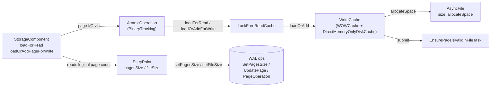

# Read-cache concurrency bug — eliminate the allocator/reader race

## Design Document
[design.md](design.md)

## High-level plan

### Goals

- Eliminate the `LockFreeReadCache.allocateNewPage` / `loadForRead` race that
  poisons disk-mode storage with `IllegalStateException("Page X:Y was
  allocated in other thread")` and `StorageException("Page Y is broken in
  file …")` under concurrent inserts on a freshly-built class.
- Restructure the cache and allocation surface so the race is
  **structurally impossible**, not papered over: remove the public
  discovery channel that lets cross-TX readers learn about an in-flight
  pageIndex.
- Preserve crash-safety guarantees and existing performance characteristics
  of the read/write cache.
- Leave WAL format, public API, and the `core` storage SPI unchanged.

### Constraints

- Edits stay inside `core`'s `internal/core/storage/cache/**` (disk-engine
  cache primitives — `chm/LockFreeReadCache`, `local/WOWCache`,
  `WriteCache` interface), `internal/core/storage/memory/DirectMemoryOnlyDiskCache.java`
  (in-memory engine parallel implementation), and the storage components
  that own logical page counts (`paginated/base/StorageComponent` and
  subclasses, `storage/impl/local/AbstractStorage`,
  `storage/impl/local/paginated/atomicoperations/AtomicOperationBinaryTracking`,
  `storage/disk/DiskStorage`). No public-API changes.
- WAL format and replay-record schema unchanged. Page allocation remains
  implicit (no new `AddPage*` record).
- `DoubleWriteLog` (anti-tear) and `EnsurePageIsValidInFileTask`
  (idempotent disk stamping) keep their existing roles.
- Tests must pass under both `checksumMode=Off` and
  `checksumMode=StoreAndThrow`.
- The in-memory engine (`DirectMemoryOnlyDiskCache`) gets a parallel
  `loadOrAdd` implementation; behavior must match the disk engine for the
  shared `WriteCache` interface.

### Architecture Notes

#### Component Map

- **`LockFreeReadCache`** — segment-locked entry table. Loses the
  `allocateNewPage` entry point; both `loadForRead` and
  `loadOrAddForWrite` now bottom out on a single `data.compute` lambda
  that calls `WriteCache.loadOrAdd`.
- **`WriteCache` (`WOWCache` + `DirectMemoryOnlyDiskCache`)** — gains a
  total `loadOrAdd(fileId, pageIndex, verifyChecksums)` primitive that
  loads, extends, or gap-fills (recovery only) as needed. Loses
  `allocateNewPage`. `getFilledUpTo` becomes package-private.
- **`AsyncFile`** — unchanged; `allocateSpace` (in-memory `getAndAdd`)
  and `EnsurePageIsValidInFileTask` (idempotent disk stamping) keep their
  current roles.
- **`AtomicOperation` (`AtomicOperationBinaryTracking`)** — `addPage` is
  deleted; the `internalFilledUpTo` prediction wrapper and the
  `commitChanges` do/while reconciliation collapse to single `loadOrAdd`
  calls keyed by the actual pageIndex.
- **`StorageComponent`** — `addPage` is deleted; 19 external production
  call sites migrate to `loadOrAddPageForWrite(fileId, knownIndex)` where
  `knownIndex` comes from `entryPoint.pagesSize + 1` or known fresh-file
  state. Reuse-or-extend probes (`if pageSize < filledUpTo - 1`) are
  removed. See design.md §"Allocation discovery surface".
- **`EntryPoint`** — per-component metadata page (`pagesSize` /
  `fileSize`) becomes the primary cross-TX discovery surface where a
  component has one; EP-less components and chicken-and-egg /
  recovery-rebuild sites route through Track 5's gated helpers (see
  D2 / D4 / design.md §"Allocation discovery surface"). Existing WAL
  ops (`SetPagesSizeOp`, `SetFileSizeOp`) are unchanged.

#### D1: `WriteCache.loadOrAdd` as the sole cache primitive

- **Alternatives considered**: keep `load` + `allocateNewPage` as separate
  methods; introduce `tryLoad` + `extend` factoring; add a marker-bit
  protocol on `PageKey` (the previous design iteration).
- **Rationale**: a total `loadOrAdd` collapses three cache APIs into
  one and removes the only call path that publishes an in-flight
  pageIndex outside `data.compute`'s segment write lock — the bug's
  attack surface. Orphan absorption becomes uniform; the read path
  still goes through the same primitive but never triggers the extend
  branches because higher-level invariants (D2) keep callers within
  the logical page count.
- **Risks/Caveats**: the read path could silently extend the file if
  the D2 invariant is violated. Guarded by per-component logical
  bookkeeping; we do not add `-ea` assertions because the failure mode
  (a wasted empty page) is harmless.
- **Implemented in**: Track 1 (step references added during execution).
- **Full design**: design.md §"Cache primitive: loadOrAdd"

#### D2: `entryPoint.pagesSize` / `fileSize` as the cross-TX discovery surface where one exists (revised after Track 3 Phase A audit)

- **Alternatives considered**: keep `WriteCache.getFilledUpTo` public
  (today's race vector); marker-bit + adopt-on-existing protocol at
  the cache layer (D5); add new EntryPoint + WAL op to every EP-less
  component (rejected — large scope expansion, on-disk format change,
  not rollback-safe via `git revert`).
- **Rationale**: where a component has an EntryPoint, cross-TX
  readers route through `entryPoint.pagesSize` / `fileSize`;
  otherwise, per-component lock + Track 1's `loadOrAdd` totality +
  Track 5's gated helpers cover the I1 race-vector. I1 is upheld by
  **removing public access** to `WriteCache.getFilledUpTo` (D4), not
  by universally routing through logical state — see `design.md`
  §"Allocation discovery surface" for the per-site breakdown.
- **Risks/Caveats**: D4's gated-helper surface is broader than
  originally planned (≥ 5 surviving consumers, not 1). The audit-grep
  target shifts from `WriteCache.getFilledUpTo` to the helper set.
- **Implemented in**: Track 4 (migrations + cleanups); Track 5 (gated
  helpers + access tightening).
- **Full design**: design.md §"Allocation discovery surface"

#### D3: Delete `addPage`; collapse do/while reconciliation

- **Alternatives considered**: keep `addPage` but add a pageIndex
  parameter; keep the `commitChanges` / `restoreAtomicUnit` /
  `restoreFromIncrementalBackup` reconciliation loops "for safety".
- **Rationale**: `addPage`'s no-pageIndex signature is what forced the
  prediction wrapper (`AtomicOperationBinaryTracking.internalFilledUpTo`)
  and the reconciliation loops. Once allocators state their target
  pageIndex (D2), prediction and reconciliation are dead code. All 19
  external `addPage` call sites already know their target from local
  state (the 20th PSI hit is the recursive call inside
  `StorageComponent.loadOrAddPageForWrite`'s existing fallback, which
  Track 4 rewires rather than migrates).
- **Risks/Caveats**: large mechanical change (~20 component sites,
  three replay loops). Integration risk is highest in
  `restoreAtomicUnit`; covered by the regression test in Track 6 plus
  existing recovery test suites.
- **Implemented in**: Track 4.
- **Full design**: design.md §"Allocation discovery surface"

#### D4: `getFilledUpTo` becomes non-public, accessed via gated rationale-bearing helpers (revised after Track 3 Phase A audit)

- **Alternatives considered**: keep public; `@Deprecated` but
  accessible; per-consumer marker-bit (D5); fold each surviving site
  into the gated package path with a free-form method instead of
  named helpers.
- **Rationale**: tighten `WriteCache.getFilledUpTo` to package-private
  (or otherwise non-public). Surviving external consumers (≥ 5: the
  backup quiesced reader plus the stay-on-physical sites enumerated
  in `design.md` §"Migration shape") route through narrowly-scoped
  helpers on `WriteCache` and/or `StorageComponent`, each carrying a
  rationale-bearing name and contract-stating javadoc. The audit-grep
  target for "who reads physical size?" becomes the helper set.
- **Risks/Caveats**: more helpers than originally planned, and the
  helper-set choice (single helper + enum vs 2-3 named helpers) is
  itself a small design decision deferred to Track 5 Phase A. Either
  shape upholds the audit-grep contract.
- **Implemented in**: Track 5.
- **Full design**: design.md §"Allocation discovery surface"

#### D5: Reject the marker-bit + adopt-on-existing fix

- **Alternatives considered**: this DR documents the rejected
  alternative. The previous design iteration introduced
  `freshlyAllocatedPages: Set<PageKey>` populated under the per-page
  exclusive lock, and switched `LockFreeReadCache.allocateNewPage` from
  `putIfAbsent` to `compute(adopt-on-existing)`. Drafts of that
  approach live under `_workflow/` and are deleted alongside this
  plan's creation.
- **Rationale**: the marker-bit fix treats the **symptom** (race
  window between allocator and reader) without removing the **cause**
  (a public discovery channel exposing in-flight pageIndices). The
  structural fix removes the discovery channel itself, simplifying the
  cache in the process. The marker-bit approach also leaves the
  asymmetric API surface (`load` / `allocateNewPage` / `getFilledUpTo`)
  intact — every future cache change has to remember the marker
  protocol.
- **Risks/Caveats**: larger blast radius (touches storage components,
  not just the cache). Mitigated by the per-track test discipline
  (Track 2 for cache; Track 6 for end-to-end). The "cache absorbs
  orphans uniformly" rationale holds **within-TX only**; cross-recovery
  orphans (partial flush + JVM crash) are handled by D6's recovery-time
  truncate pass for EP-equipped components, not by cache semantics.
- **Implemented in**: Tracks 1, 3, 4 (the structural fix lands across
  all three).

#### D6: Recovery-time orphan truncation pass for EP-equipped components

- **Alternatives considered**: marker-bit (already rejected by D5);
  `reuseOrphanPageForWrite` SPI allowing below-allocation-floor
  pageIndex (rejected — re-exposes the discovery channel D4 is
  tightening); accept the availability impact and document only in
  `adr.md` (rejected — silent self-healing pre-fix becomes noisy
  manual-recovery post-fix; operational regression).
- **Rationale**: Track 4's `addPage` deletion + AOBT allocator-only
  contract converts the previously-silent partial-flush-orphan path
  into a noisy `IllegalStateException` at the next allocator call.
  Without a recovery pass the storage component becomes unwriteable
  after a JVM-only crash until manual repair. A storage-open pass —
  for each in-scope component, load its EP page, compare logical
  pages to `AsyncFile.getFileSize() / pageSize`, call the new
  `WriteCache.shrinkFile(fileId, targetBytes)` when physical exceeds
  logical — restores the `logical == physical` invariant before any
  TX runs. The pass reads logical state from the EP only (no
  `getFilledUpTo` on the steady-state discovery path), so D2 and D4
  stay intact.
- **Risks/Caveats**: in-scope is the four EP-equipped components
  subject to CS1: `BTree`, `SharedLinkBagBTree`,
  `CollectionPositionMapV2`, `PaginatedCollectionV2`. EP-less
  components and `IndexHistogramManager` are deliberately out of
  scope — see Non-Goals for the carve-out rationale.
- **Implemented in**: Track 7.
- **No `**Full design**` section**: D6 carries its rationale and
  risks in the bullets above (precedent: D5 also has no
  `**Full design**` link).

### Invariants

- **I1**: Cross-TX readers learn about page existence either through
  `entryPoint.pagesSize` / `entryPoint.fileSize` (where the component
  has an EntryPoint) or through Track 5's package-private gated
  helpers under per-component lock. `WriteCache.getFilledUpTo` is not
  on the public discovery path.
- **I2**: All cache page-extension occurs inside
  `LockFreeReadCache.data.compute(fileId, pageIndex, λ)` — i.e., under
  the segment write lock for the target key.
- **I3**: `WriteCache.loadOrAdd` is total: it always returns a usable
  `CachePointer`. It never returns null.
- **I4**: Per-component locks (BTree mutex, position-map mutex, BTree
  splitter mutex) serialize concurrent allocators that share a `fileId`,
  so two concurrent `loadOrAdd` calls cannot target the same
  `(fileId, pageIndex)` from different transactions.
- **I5**: `entryPoint.pagesSize` / `fileSize` is bumped only inside the
  same WAL atomic unit that performed the corresponding `loadOrAdd`,
  via the existing `SetPagesSizeOp` / `SetFileSizeOp` WAL records.
- **I6**: After `AbstractStorage.recoverIfNeeded()` returns and before
  any TX runs, every EP-equipped storage component (BTree, SLBB,
  CollectionPositionMapV2, PaginatedCollectionV2) satisfies
  `entryPoint.fileSize == AsyncFile.getFileSize() / pageSize`.
  Established by Track 7's recovery-time pass; maintained by I5.

### Integration Points

- `LockFreeReadCache.loadForRead` and `LockFreeReadCache.loadOrAddForWrite`
  delegate to `WriteCache.loadOrAdd` via `data.compute`. The two
  wrappers differ only in `CacheEntry` lock semantics.
- `StorageComponent.loadOrAddPageForWrite(fileId, pageIndex)` is the
  canonical write-side helper for storage components after Track 4;
  `addPage` is deleted.
- `DirectMemoryOnlyDiskCache.loadOrAdd` is the in-memory engine's
  parallel implementation of the new primitive.
- `DiskStorage.backupPagesWithChanges` reads file-physical size during
  storage quiesce via the gated path introduced in Track 5.
- `AbstractStorage.recoverIfNeeded()` invokes the Track 7 recovery-
  time truncate pass between `restoreFromWAL()` and `flushAllData()`,
  iterating EP-equipped components. Per-component mechanics + field
  list: see `tracks/track-7.md`.

### Non-Goals

- Post-WAL-replay file truncation for **EP-less** components
  (`FreeSpaceMap`, `CollectionDirtyPageBitSet`) — their allocators
  derive target pageIndex from `getFilledUpTo`-anchored growth loops
  and naturally skip orphans, so no recovery-time pass is required.
  Track 7 lands the recovery-time truncate pass for the four
  **EP-equipped** components subject to CS1; this Non-Goal records
  the conscious EP-less carve-out.
- Post-WAL-replay file truncation for `IndexHistogramManager` — IHM
  uses a page-1 discriminator (`op.filledUpTo > 1 ? load : allocate`)
  rather than an EP-fileSize check, so the Track 7 EP-driven pass
  does not apply. The HLL-spill recovery scenario is covered by
  Track 6.
- Performance debt of the recovery probe — tracked in
  `ISSUE-recovery-log-perf-debt.md`.
- Truncate-cache purge ordering bug — tracked in
  `ISSUE-truncate-cache-purge-ordering.md`.
- Vestigial allocation flag cleanup — tracked in
  `ISSUE-vestigial-allocation-flag.md`.
- Public API renames or new `AddPage*` WAL record class.
- Track 4 Phase C unit-level test-hardening backlog — out-of-scope for
  this plan; tracked as Track 2-style follow-ups. Items: truncate-then-
  allocate same-TX scenario, `BTree.doAssertFreePages` pure-logical-
  sizing divergence test, `WOWCache.loadOrAddLoadBranch` `assert false`
  activation test, FSM `updatePageFreeSpace` growth-loop boundary
  cases, AOBT in-memory `loadOrAdd` non-null totality unit pin, BTree
  freelist branch dedicated test, `eagerlyInstalledInCache` flag commit-
  time skip unit pin, negative-pageIndex overflow boundary; defensive
  asserts at `SLBB.splitRootBucket` (leftPageIndex distinctness) and
  FSM/CDPB growth-loop invariants; F14 probe comment-prose imprecision
  (claims `IllegalStateException` but `-ea` fires `AssertionError`
  first) — items noted in Track 4 episode for future reference.

## Checklist

- [x] Track 1: Cache primitive — `WriteCache.loadOrAdd`
  > Rewrite the write-cache around a single total `loadOrAdd(fileId,
  > pageIndex, verifyChecksums)` primitive covering load /
  > one-page extend / multi-page gap-fill (recovery only), with
  > `DirectMemoryOnlyDiskCache` mirroring it. Both `LockFreeReadCache`
  > wrappers (`loadForRead` / `loadOrAddForWrite`) collapse to a
  > `data.compute` lambda that delegates to `loadOrAdd`. Legacy
  > `allocateNewPage` methods are deprecated here; final deletion lands
  > in Track 4 once replay-loop callers migrate.
  >
  > **Track episode:**
  > Built the structural fix: a single total `WriteCache.loadOrAdd`
  > primitive serving load / one-page extend / multi-page gap-fill
  > (recovery-only), with `DirectMemoryOnlyDiskCache.loadOrAdd` +
  > `MemoryFile.loadOrAddPage` as the in-memory parallel.
  > `LockFreeReadCache.loadForRead` and `loadOrAddForWrite` now both
  > bottom out on a `data.compute` lambda that delegates to `loadOrAdd`;
  > the wrappers diverge only in `CacheEntry` lock semantics.
  > `silentLoadForRead` migrated to a new non-extending `loadIfPresent`
  > probe so all production callers of the legacy `WriteCache.load` are
  > now retired. Legacy `allocateNewPage` / `load` are `@Deprecated`
  > with deletion deferred to Track 4 (once replay-loop callers
  > migrate). Three production-code surprises landed during the track:
  > (1) Step 2's review fix converted two extend / gap-fill
  > `allocatedIndex == pageIndex` checks into hard
  > `IllegalStateException` throws so I4 violations fail fast in
  > production builds; (2) Step 3 discovered the original
  > `ConcurrentSkipListMap.computeIfAbsent` dispatch in
  > `MemoryFile.loadOrAddPage` was unsafe under contention and replaced
  > it with the eager-construct + `putIfAbsent` +
  > `decrementReferrer`-on-loss pattern; (3) Phase C surfaced a real
  > production regression — `LockFreeReadCache.doLoad` was bleeding
  > `markAllocated` into the read path. Phase C iteration 1's fix
  > added a `forWrite` parameter to `doLoad` so only the write-load
  > path flags entries; the rewritten read-path test pins the new
  > contract and an empirical mutation (deleting `forWrite &&`) was
  > confirmed to reproduce the regression. Cross-track impact:
  > **Track 4** inherits four reconciliation TODO sites whose comments
  > now correctly distinguish disk-engine totality from in-memory
  > engine null-on-miss (the `IllegalStateException` in `doLoad`'s
  > lambda makes the Track 4 migration safer — any totality-contract
  > violation surfaces immediately instead of silently activating the
  > racy `addNewPagePointerToTheCache` fallback). **Track 2**
  > inherits ~10 deferred test-hardening items: `verifyChecksums=true`
  > parity on disk-engine load + gap-fill, in-memory `loadIfPresent`
  > UOE-throw test, gap-fill intermediate-page accessibility test,
  > framePool leak accounting, target-publish stress, fail-fast
  > `IllegalStateException` regression test (requires a
  > `setLoadOrAddReturnsNull` mock toggle), read-path markAllocated
  > boundary parity test, and a `WOWCache.loadOrAdd` MT
  > defense-in-depth test against I4 violations. **Track 5 / Track 6**
  > are unaffected. Known follow-up not yet on the plan: widening
  > `loadOrAdd`'s return value to `{CachePointer, freshlyAllocated}`
  > eliminates one `filesLock` cycle plus one `files.get` per
  > cache miss (~1-3% potential throughput on cold-cache benchmark
  > workloads under high concurrency) — captured in the Step 4 episode
  > and the Phase C performance reviewer's PF1.
  >
  > **Step file:** `tracks/track-1.md` (6 steps, 0 failed)
  >
  > **Strategy refresh:** CONTINUE — Track 1's ~10 deferred test-hardening
  > items (verifyChecksums parity, framePool leak accounting, target-publish
  > stress, truncate-vs-loadOrAdd race, fail-fast IllegalStateException
  > regression, read-path markAllocated boundary parity, in-memory
  > loadIfPresent UOE-throw, loadIfPresent MT/eviction, etc.) map cleanly
  > into Track 2's existing MT-stress + functional-branch scope; no
  > backlog amendment required. Tracks 3-6 unaffected.

- [x] Track 2: Cache test coverage (functional + MT)
  > Add functional unit tests covering every branch of
  > `WOWCache.loadOrAdd` and the `LockFreeReadCache` wrappers, plus MT
  > stress harnesses for contention, eviction, and
  > `EnsurePageIsValidInFileTask` idempotency. Run the cache-classes
  > coverage gate before closing the track.
  >
  > **Track episode:**
  > Built a comprehensive cache-layer test suite: functional branch
  > coverage on `WOWCache.loadOrAdd` and `DirectMemoryOnlyDiskCache.loadOrAdd`,
  > wrapper-level functional contracts on `LockFreeReadCache` (cache
  > hits/misses, eviction, pin retention, WTinyLFU two-tier transitions
  > via reflection helpers), and MT-stress harnesses covering
  > distinct-key contention, same-key serialisation, reader-vs-writer
  > extension, eviction-vs-load churn, flush-worker concurrency under
  > `StampedLock` fallback, `EnsurePageIsValidInFileTask` idempotency,
  > delete/truncate-vs-loadOrAdd races, and an I4 negative-defence on
  > the bare cache surface. `WOWCacheLoadIfPresentTest` gained MT
  > coverage and a corrupted-page checksum-verify test. Cache-layer
  > invariants **I2** (extension under segment lock), **I3**
  > (`loadOrAdd` is total), and **I4** (segment lock serialises
  > contending allocators) are now pinned; **I1** is deferred to
  > Track 6 (above the cache layer). Phase C track-level review
  > surfaced 30+ findings across 7 dimensions; iteration 1 applied 10
  > in-scope fixes in commit `30de936927`, the 4-agent gate-check
  > passed with 2 minor new findings (M1 — shallow exception
  > identifier mirroring a pre-existing sibling pattern; TC-N1 —
  > gap-fill byte-content compare misses a perf-only regression class)
  > acknowledged as low-value, and the review closed at iteration 1/3
  > with PASS. **Cross-track impact for Track 4** (write-side API
  > collapse): inherits the new `MockedWriteCache.loadOrAddCount` /
  > `storeBlockLatch` mock seams; the `@Category(SequentialTest.class)`
  > usage pattern for any future JVM-singleton-allocator-sensitive MT
  > test; the canonical `frameBytes = DISK_CACHE_PAGE_SIZE * 1024`
  > derivation (Iteration-1 implementer discovered + fixed a
  > pre-existing latent bug in the framePool leak accounting test
  > that divided by the test-local `PAGE_SIZE` constant rather than
  > the JVM-singleton framePool's page size); I4 sentinel
  > falsifiability for **both** extend (`"allocated pageIndex"`) and
  > gap-fill (`"allocated start index"`) branches; the wrapper-level
  > same-key `loadOrAddForWrite` segment-lock pin; and a one-line
  > backlog bullet (defensive `assert false` in
  > `WOWCache.loadOrAddLoadBranch`'s dead-code fallback, plan
  > correction commit `475d6469d3`). **Tracks 5 / 6 unaffected.**
  > **Deferred un-addressed should-fix** items from iter-1 synthesis
  > (test-hardening only, not correctness, CI-stable today):
  > race-window asymmetry in two `WOWCacheLoadIfPresentTest` MT
  > tests, `testFlushWorkerConcurrencyReaderObservesConsistentState`
  > lacks positive evidence of the readLock fallback path,
  > per-attempt thread pool re-creation + file-leak +
  > `cleanUp`-IOException-swallow in `WOWCacheLoadOrAddConcurrentTest` —
  > surfaced here for future-track awareness.
  >
  > **Step file:** `tracks/track-2.md` (6 steps, 0 failed)
  >
  > **Strategy refresh:** CONTINUE — Track 3 (read-side discovery migration)
  > operates on storage-component code, independent of the cache-layer changes
  > Tracks 1 and 2 delivered. No plan/backlog edits required for any remaining
  > track. The pre-existing "Open audit" item in the Track 3 backlog
  > (`CollectionDirtyPageBitSet` / `FreeSpaceMap` / `IndexHistogramManager`
  > logical-size getter; `PaginatedCollectionV2.open:391` and
  > `CollectionPositionMapV2.create:136` semantics) is resolved inside Phase A.

- [ ] Track 4: Write-side API collapse + residual read-side migration
  > Delete the `addPage` API surface and migrate the 19 production
  > call sites to `loadOrAddPageForWrite(fileId, knownIndex)` on top
  > of Track 1's primitive. Collapse the `commitChanges` /
  > `restoreAtomicUnit` / `restoreFromIncrementalBackup` reconciliation
  > loops, drop the `internalFilledUpTo` prediction wrapper, delete
  > the per-component reuse-or-extend probes, and absorb the surviving
  > read-side work from the retired Track 3 (one BTree pure-sizing
  > migration plus rationale comments at the stay-on-physical sites —
  > see `tracks/track-4.md` for the per-site list).
  > **Scope:** ~6-7 steps covering `AtomicOperationBinaryTracking`
  > cleanup, replay-loop collapse, per-component probe + `addPage`
  > migration in three batches, the BTree pure-sizing migration, and
  > rationale comments at the stay-on-physical sites.
  > **Depends on:** Track 1

- [ ] Track 5: Tighten `getFilledUpTo` access via gated helpers; rename `loadOrAddPageForWrite`
  > Make `WriteCache.getFilledUpTo` non-public and route the surviving
  > external consumers (≥ 5 — see `tracks/track-5.md` for the per-site set)
  > through narrowly-scoped helpers with rationale-bearing names.
  > Phase A picks the helper shape (one helper + intent enum vs 2-3
  > named helpers). Add javadoc to `WriteCache` and `StorageComponent`
  > documenting the discovery contract.
  >
  > **Also absorbs from Track 4 Phase C review:** rename
  > `AtomicOperation.loadOrAddPageForWrite` →
  > `allocatePageForWrite` (plus the `StorageComponent` wrapper,
  > the `AtomicOperationBinaryTracking` impl, 19 production allocator
  > call sites, and ~80 test references including the test class
  > `LoadOrAddPageForWriteTest` → `AllocatePageForWriteTest`). The
  > current name is misleading: Track 4's Step 2 narrowed the
  > AOBT-layer contract from "load or add" (total) to allocator-only
  > on the disk engine; the AOBT Javadoc itself admits *"Despite the
  > historical name, this method does NOT load existing pages on the
  > disk engine"*. The rename must use the IDE Rename refactoring
  > engine via `mcp-steroid://ide/change-signature` so polymorphic
  > dispatch through the `AtomicOperation` SPI + Javadoc `{@link}`
  > references update atomically (raw `Edit` silently misses these).
  >
  > **Scope:** ~4-5 steps covering: the helper-shape decision and
  > introduction; per-consumer migration to the helpers; the access
  > downgrade on `WriteCache.getFilledUpTo`; the `loadOrAddPageForWrite`
  > → `allocatePageForWrite` rename via the IDE refactoring engine;
  > the javadoc + PSI-find-usages verification pass.
  > **Depends on:** Track 4

- [ ] Track 6: Integration regression test
  > End-to-end concurrent-insert workload that reproduces the original
  > poison cascade: open a fresh disk-mode storage with
  > `checksumMode=StoreAndThrow`, create a class with an indexed
  > string property, run N parallel transactions inserting into the
  > class via `executeInTx` / `autoExecuteInTx`. Assert no
  > `IllegalStateException`, no `StorageException("Page Y is broken")`,
  > no "Internal error happened in storage" cascade, and that all
  > committed records are readable on reopen.
  >
  > **Phase C deferrals absorbed (Track 4 review fan-out):**
  > - **Partial-flush-orphan recovery (CS1)** — drive the multi-page
  >   partial-flush-orphan path on each of the four EP-equipped
  >   components (`BTree`, `SLBB`, `CPMV2`, `PCV2`); restart the
  >   storage; assert that the Track 7 recovery-time truncate pass
  >   restored `physical == logical` and the next TX completes without
  >   `IllegalStateException`. Pin both the truncate-needed and
  >   no-op-clean-shutdown branches.
  > - **HLL-spill recovery** — crash-then-second-spill regression for
  >   the IHM HLL-page-1 discriminator (`op.filledUpTo > 1 ? load :
  >   allocate`). Out of Track 7 scope because IHM uses a page-1
  >   discriminator rather than EP-fileSize sizing.
  > - **StorageBackupMTStateTest `@Ignore` resurrection** — concurrent
  >   incremental-backup recovery test for the collapsed
  >   `restoreFromIncrementalBackup` loop.
  > - **I4 per-component MT pins** — IHM `flushSnapshotToPage` vs
  >   `writeSnapshotToPage` lock contract; two-TX contention on
  >   `op.loadOrAddPageForWrite(fileId, sameKnownIndex)` at BTree.create,
  >   SLBB.splitRootBucket, CPMV2.allocate, PCV2.allocateNewPage;
  >   strengthen `inMemoryEagerInstallToleratesConcurrentOrphanReuse`
  >   contention window.
  >
  > **Scope:** ~5-7 steps covering: (a) original poison-cascade test
  > scaffolding + fail-on-develop / pass-on-fix verification;
  > (b) CS1 partial-flush-orphan scenario (post-Track-7 invariant
  > assertion); (c) HLL-spill recovery; (d) StorageBackupMTStateTest
  > resurrection; (e) I4 per-component MT pins across the four
  > allocator sites + in-memory contention strengthening.
  > **Depends on:** Track 1, Track 4, Track 7

- [ ] Track 7: Recovery-time orphan-truncation pass
  > Add a recovery-time pass to `AbstractStorage.recoverIfNeeded()`
  > (after `restoreFromWAL()`, before `flushAllData()`) that walks
  > each EP-equipped storage component, reads its entry-point logical
  > page count, and truncates physical orphans via a new
  > `WriteCache.shrinkFile(fileId, targetBytes)` primitive backed by
  > `AsyncFile.shrink`.
  >
  > **Scope:** ~3-4 steps covering: (a) `WriteCache.shrinkFile` SPI
  > addition + `WOWCache` impl wrapping `AsyncFile.shrink` +
  > `DirectMemoryOnlyDiskCache` no-op impl + unit tests; (b)
  > per-EP-equipped-component `verifyAndTruncateOrphans(AtomicOperation,
  > WriteCache)` helper that loads its EP page (read-only), compares
  > logical to `AsyncFile.getFileSize() / pageSize`, and calls
  > `shrinkFile` when physical exceeds logical; (c)
  > `AbstractStorage.recoverIfNeeded()` wiring + iteration over the
  > four component classes via the existing `collections` /
  > `indexEngines` / `linkCollectionsBTreeManager` fields; (d)
  > integration tests pinning the post-replay `physical == logical`
  > invariant for each EP-equipped component, including a positive
  > test (orphan present → truncated) and a negative test (clean
  > shutdown → no-op).
  > **Depends on:** Track 4

## Plan Review
- [ ] Plan review (consistency + structural) — autonomous; runs as the first phase of `/execute-tracks`

_Reset on 2026-05-14 by inline replan landing in response to the Track 4 Phase C CS1 escalation (user chose Option 3b — recovery-time truncate). Per inline-replanning.md step 6, the section is reset to `[ ]` so the next `/execute-tracks` session re-runs State 0 against the revised plan._

Revisions in this commit:
- New Decision Record D6 (recovery-time orphan truncation pass).
- D5 Risks/Caveats acknowledging the within-TX vs cross-recovery split.
- New Invariant I6 pinning the post-recovery `logical == physical` invariant.
- New Integration Points bullet for the recovery-time pass wiring.
- New Track 7 added.
- Track 6 CS1 scope reshaped + Depends-on updated to include Track 7.
- Non-Goals first item rewritten to scope out EP-less components; new bullet scopes out `IndexHistogramManager`.

_Previous PASS (preserved for traceability)_: prior consistency + structural reviews passed at iteration 3 of a post-replan re-validation (see git history before 2026-05-14). Earlier iteration-2 PASS at initial plan creation in commit `02cd718e0d`. Both audits are superseded by the next State 0 run.

## Final Artifacts

- [ ] Phase 4: Final artifacts (`design-final.md`, `adr.md`)
