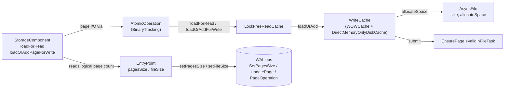

# Read-cache concurrency bug — eliminate the allocator/reader race

## Design Document
[design.md](design.md)

## High-level plan

### Goals

- Eliminate the `LockFreeReadCache.allocateNewPage` / `loadForRead` race that
  poisons disk-mode storage with `IllegalStateException("Page X:Y was
  allocated in other thread")` and `StorageException("Page Y is broken in
  file …")` under concurrent inserts on a freshly-built class.
- Restructure the cache and allocation surface so the race is
  **structurally impossible**, not papered over: remove the public
  discovery channel that lets cross-TX readers learn about an in-flight
  pageIndex.
- Preserve crash-safety guarantees and existing performance characteristics
  of the read/write cache.
- Leave WAL format, public API, and the `core` storage SPI unchanged.

### Constraints

- Edits stay inside `core`'s `internal/core/storage/cache/**` (disk-engine
  cache primitives — `chm/LockFreeReadCache`, `local/WOWCache`,
  `WriteCache` interface), `internal/core/storage/memory/DirectMemoryOnlyDiskCache.java`
  (in-memory engine parallel implementation), and the storage components
  that own logical page counts (`paginated/base/StorageComponent` and
  subclasses, `storage/impl/local/AbstractStorage`,
  `storage/impl/local/paginated/atomicoperations/AtomicOperationBinaryTracking`,
  `storage/disk/DiskStorage`). No public-API changes.
- WAL format and replay-record schema unchanged. Page allocation remains
  implicit (no new `AddPage*` record).
- `DoubleWriteLog` (anti-tear) and `EnsurePageIsValidInFileTask`
  (idempotent disk stamping) keep their existing roles.
- Tests must pass under both `checksumMode=Off` and
  `checksumMode=StoreAndThrow`.
- The in-memory engine (`DirectMemoryOnlyDiskCache`) gets a parallel
  `loadOrAdd` implementation; behavior must match the disk engine for the
  shared `WriteCache` interface.

### Architecture Notes

#### Component Map

- **`LockFreeReadCache`** — segment-locked entry table. Loses the
  `allocateNewPage` entry point; both `loadForRead` and
  `loadOrAddForWrite` now bottom out on a single `data.compute` lambda
  that calls `WriteCache.loadOrAdd`.
- **`WriteCache` (`WOWCache` + `DirectMemoryOnlyDiskCache`)** — gains a
  total `loadOrAdd(fileId, pageIndex, verifyChecksums)` primitive that
  loads, extends, or gap-fills (recovery only) as needed. Loses
  `allocateNewPage`. `getFilledUpTo` becomes package-private.
- **`AsyncFile`** — unchanged; `allocateSpace` (in-memory `getAndAdd`)
  and `EnsurePageIsValidInFileTask` (idempotent disk stamping) keep their
  current roles.
- **`AtomicOperation` (`AtomicOperationBinaryTracking`)** — `addPage` is
  deleted; the `internalFilledUpTo` prediction wrapper and the
  `commitChanges` do/while reconciliation collapse to single `loadOrAdd`
  calls keyed by the actual pageIndex.
- **`StorageComponent`** — `addPage` is deleted; 19 external production
  call sites migrate to `loadOrAddPageForWrite(fileId, knownIndex)` where
  `knownIndex` comes from `entryPoint.pagesSize + 1` or known fresh-file
  state. Reuse-or-extend probes (`if pageSize < filledUpTo - 1`) are
  removed. See design.md §"Allocation discovery surface".
- **`EntryPoint`** — per-component metadata page (`pagesSize` /
  `fileSize`) becomes the sole cross-TX discovery surface; existing WAL
  ops (`SetPagesSizeOp`, `SetFileSizeOp`) are unchanged.

#### D1: `WriteCache.loadOrAdd` as the sole cache primitive

- **Alternatives considered**: keep `load` + `allocateNewPage` as separate
  methods; introduce `tryLoad` + `extend` factoring; add a marker-bit
  protocol on `PageKey` (the previous design iteration).
- **Rationale**: a total `loadOrAdd` collapses three cache APIs into
  one and removes the only call path that publishes an in-flight
  pageIndex outside `data.compute`'s segment write lock — the bug's
  attack surface. Orphan absorption becomes uniform; the read path
  still goes through the same primitive but never triggers the extend
  branches because higher-level invariants (D2) keep callers within
  the logical page count.
- **Risks/Caveats**: the read path could silently extend the file if
  the D2 invariant is violated. Guarded by per-component logical
  bookkeeping; we do not add `-ea` assertions because the failure mode
  (a wasted empty page) is harmless.
- **Implemented in**: Track 1 (step references added during execution).
- **Full design**: design.md §"Cache primitive: loadOrAdd"

#### D2: `entryPoint.pagesSize` / `fileSize` as the sole cross-TX discovery surface

- **Alternatives considered**: keep `WriteCache.getFilledUpTo` public
  (today's race vector); introduce a marker-bit + adopt-on-existing
  protocol at the cache layer (the prior design iteration).
- **Rationale**: every storage component already maintains a logical
  page count on its `EntryPoint` metadata page, persisted via dedicated
  WAL ops (`SetPagesSizeOp` / `SetFileSizeOp`), advanced only on
  commit. Routing all cross-TX readers through it removes the discovery
  channel that lets a reader learn about an in-flight pageIndex; the
  race attack surface disappears.
- **Risks/Caveats**: 16 production call sites of
  `StorageComponent.getFilledUpTo` migrate to `entryPoint.pagesSize` /
  `fileSize` (9 pure-sizing in Track 3, 7 reuse-or-extend probes
  collapsed by Track 4). One survivor
  (`DiskStorage.backupPagesWithChanges`) is storage-quiesced and routes
  through a gated path (D4).
- **Implemented in**: Track 3.
- **Full design**: design.md §"Allocation discovery surface"

#### D3: Delete `addPage`; collapse do/while reconciliation

- **Alternatives considered**: keep `addPage` but add a pageIndex
  parameter; keep the `commitChanges` / `restoreAtomicUnit` /
  `restoreFromIncrementalBackup` reconciliation loops "for safety".
- **Rationale**: `addPage`'s no-pageIndex signature is what forced the
  prediction wrapper (`AtomicOperationBinaryTracking.internalFilledUpTo`)
  and the reconciliation loops. Once allocators state their target
  pageIndex (D2), prediction and reconciliation are dead code. All 19
  external `addPage` call sites already know their target from local
  state (the 20th PSI hit is the recursive call inside
  `StorageComponent.loadOrAddPageForWrite`'s existing fallback, which
  Track 4 rewires rather than migrates).
- **Risks/Caveats**: large mechanical change (~20 component sites,
  three replay loops). Integration risk is highest in
  `restoreAtomicUnit`; covered by the regression test in Track 6 plus
  existing recovery test suites.
- **Implemented in**: Track 4.
- **Full design**: design.md §"Allocation discovery surface"

#### D4: `getFilledUpTo` becomes WriteCache-internal

- **Alternatives considered**: keep public; `@Deprecated` but accessible.
- **Rationale**: after D2/D3 land, the only legitimate external consumer
  is `DiskStorage.backupPagesWithChanges`, and its access is
  storage-quiesced. Tightening the access modifier prevents
  reintroduction of the race vector by future callers; the backup site
  uses a narrowly-scoped iteration helper.
- **Risks/Caveats**: minor — backup path needs a small gated entry
  point on `WriteCache`.
- **Implemented in**: Track 5.

#### D5: Reject the marker-bit + adopt-on-existing fix

- **Alternatives considered**: this DR documents the rejected
  alternative. The previous design iteration introduced
  `freshlyAllocatedPages: Set<PageKey>` populated under the per-page
  exclusive lock, and switched `LockFreeReadCache.allocateNewPage` from
  `putIfAbsent` to `compute(adopt-on-existing)`. Drafts of that
  approach live under `_workflow/` and are deleted alongside this
  plan's creation.
- **Rationale**: the marker-bit fix treats the **symptom** (race
  window between allocator and reader) without removing the **cause**
  (a public discovery channel exposing in-flight pageIndices). The
  structural fix removes the discovery channel itself, simplifying the
  cache in the process. The marker-bit approach also leaves the
  asymmetric API surface (`load` / `allocateNewPage` / `getFilledUpTo`)
  intact — every future cache change has to remember the marker
  protocol.
- **Risks/Caveats**: larger blast radius (touches storage components,
  not just the cache). Mitigated by the per-track test discipline
  (Track 2 for cache; Track 6 for end-to-end).
- **Implemented in**: Tracks 1, 3, 4 (the structural fix lands across
  all three).

### Invariants

- **I1**: Cross-TX readers learn about page existence only through
  `entryPoint.pagesSize` / `entryPoint.fileSize`. `WriteCache.getFilledUpTo`
  is not on the public discovery path.
- **I2**: All cache page-extension occurs inside
  `LockFreeReadCache.data.compute(fileId, pageIndex, λ)` — i.e., under
  the segment write lock for the target key.
- **I3**: `WriteCache.loadOrAdd` is total: it always returns a usable
  `CachePointer`. It never returns null.
- **I4**: Per-component locks (BTree mutex, position-map mutex, BTree
  splitter mutex) serialize concurrent allocators that share a `fileId`,
  so two concurrent `loadOrAdd` calls cannot target the same
  `(fileId, pageIndex)` from different transactions.
- **I5**: `entryPoint.pagesSize` / `fileSize` is bumped only inside the
  same WAL atomic unit that performed the corresponding `loadOrAdd`,
  via the existing `SetPagesSizeOp` / `SetFileSizeOp` WAL records.

### Integration Points

- `LockFreeReadCache.loadForRead` and `LockFreeReadCache.loadOrAddForWrite`
  delegate to `WriteCache.loadOrAdd` via `data.compute`. The two
  wrappers differ only in `CacheEntry` lock semantics.
- `StorageComponent.loadOrAddPageForWrite(fileId, pageIndex)` is the
  canonical write-side helper for storage components after Track 4;
  `addPage` is deleted.
- `DirectMemoryOnlyDiskCache.loadOrAdd` is the in-memory engine's
  parallel implementation of the new primitive.
- `DiskStorage.backupPagesWithChanges` reads file-physical size during
  storage quiesce via the gated path introduced in Track 5.

### Non-Goals

- Post-WAL-replay file truncation to reclaim orphan disk pages — bounded
  leak, separate ticket.
- Performance debt of the recovery probe — tracked in
  `ISSUE-recovery-log-perf-debt.md`.
- Truncate-cache purge ordering bug — tracked in
  `ISSUE-truncate-cache-purge-ordering.md`.
- Vestigial allocation flag cleanup — tracked in
  `ISSUE-vestigial-allocation-flag.md`.
- Public API renames or new `AddPage*` WAL record class.

## Checklist

- [x] Track 1: Cache primitive — `WriteCache.loadOrAdd`
  > Rewrite the write-cache around a single total `loadOrAdd(fileId,
  > pageIndex, verifyChecksums)` primitive covering load /
  > one-page extend / multi-page gap-fill (recovery only), with
  > `DirectMemoryOnlyDiskCache` mirroring it. Both `LockFreeReadCache`
  > wrappers (`loadForRead` / `loadOrAddForWrite`) collapse to a
  > `data.compute` lambda that delegates to `loadOrAdd`. Legacy
  > `allocateNewPage` methods are deprecated here; final deletion lands
  > in Track 4 once replay-loop callers migrate.
  >
  > **Track episode:**
  > Built the structural fix: a single total `WriteCache.loadOrAdd`
  > primitive serving load / one-page extend / multi-page gap-fill
  > (recovery-only), with `DirectMemoryOnlyDiskCache.loadOrAdd` +
  > `MemoryFile.loadOrAddPage` as the in-memory parallel.
  > `LockFreeReadCache.loadForRead` and `loadOrAddForWrite` now both
  > bottom out on a `data.compute` lambda that delegates to `loadOrAdd`;
  > the wrappers diverge only in `CacheEntry` lock semantics.
  > `silentLoadForRead` migrated to a new non-extending `loadIfPresent`
  > probe so all production callers of the legacy `WriteCache.load` are
  > now retired. Legacy `allocateNewPage` / `load` are `@Deprecated`
  > with deletion deferred to Track 4 (once replay-loop callers
  > migrate). Three production-code surprises landed during the track:
  > (1) Step 2's review fix converted two extend / gap-fill
  > `allocatedIndex == pageIndex` checks into hard
  > `IllegalStateException` throws so I4 violations fail fast in
  > production builds; (2) Step 3 discovered the original
  > `ConcurrentSkipListMap.computeIfAbsent` dispatch in
  > `MemoryFile.loadOrAddPage` was unsafe under contention and replaced
  > it with the eager-construct + `putIfAbsent` +
  > `decrementReferrer`-on-loss pattern; (3) Phase C surfaced a real
  > production regression — `LockFreeReadCache.doLoad` was bleeding
  > `markAllocated` into the read path. Phase C iteration 1's fix
  > added a `forWrite` parameter to `doLoad` so only the write-load
  > path flags entries; the rewritten read-path test pins the new
  > contract and an empirical mutation (deleting `forWrite &&`) was
  > confirmed to reproduce the regression. Cross-track impact:
  > **Track 4** inherits four reconciliation TODO sites whose comments
  > now correctly distinguish disk-engine totality from in-memory
  > engine null-on-miss (the `IllegalStateException` in `doLoad`'s
  > lambda makes the Track 4 migration safer — any totality-contract
  > violation surfaces immediately instead of silently activating the
  > racy `addNewPagePointerToTheCache` fallback). **Track 2**
  > inherits ~10 deferred test-hardening items: `verifyChecksums=true`
  > parity on disk-engine load + gap-fill, in-memory `loadIfPresent`
  > UOE-throw test, gap-fill intermediate-page accessibility test,
  > framePool leak accounting, target-publish stress, fail-fast
  > `IllegalStateException` regression test (requires a
  > `setLoadOrAddReturnsNull` mock toggle), read-path markAllocated
  > boundary parity test, and a `WOWCache.loadOrAdd` MT
  > defense-in-depth test against I4 violations. **Track 5 / Track 6**
  > are unaffected. Known follow-up not yet on the plan: widening
  > `loadOrAdd`'s return value to `{CachePointer, freshlyAllocated}`
  > eliminates one `filesLock` cycle plus one `files.get` per
  > cache miss (~1-3% potential throughput on cold-cache benchmark
  > workloads under high concurrency) — captured in the Step 4 episode
  > and the Phase C performance reviewer's PF1.
  >
  > **Step file:** `tracks/track-1.md` (6 steps, 0 failed)
  >
  > **Strategy refresh:** CONTINUE — Track 1's ~10 deferred test-hardening
  > items (verifyChecksums parity, framePool leak accounting, target-publish
  > stress, truncate-vs-loadOrAdd race, fail-fast IllegalStateException
  > regression, read-path markAllocated boundary parity, in-memory
  > loadIfPresent UOE-throw, loadIfPresent MT/eviction, etc.) map cleanly
  > into Track 2's existing MT-stress + functional-branch scope; no
  > backlog amendment required. Tracks 3-6 unaffected.

- [ ] Track 2: Cache test coverage (functional + MT)
  > Add functional unit tests covering every branch of
  > `WOWCache.loadOrAdd` and the `LockFreeReadCache` wrappers, plus MT
  > stress harnesses for contention, eviction, and
  > `EnsurePageIsValidInFileTask` idempotency. Run the cache-classes
  > coverage gate before closing the track.
  > **Scope:** ~4-5 steps covering coverage audit, `loadOrAdd` branch
  > tests, ReadCache wrapper tests, contention stress, and
  > eviction/flush stress.
  > **Depends on:** Track 1

- [ ] Track 3: Read-side discovery migration
  > Migrate the pure-sizing production callers of
  > `StorageComponent.getFilledUpTo` (≈9 sites across BTree,
  > CollectionPositionMapV2, PaginatedCollectionV2, FreeSpaceMap,
  > IndexHistogramManager, CollectionDirtyPageBitSet) to read each
  > component's logical `entryPoint.pagesSize` / `fileSize`. The 7
  > reuse-or-extend probe sites and the lone storage-quiesced
  > `DiskStorage.backupPagesWithChanges` consumer stay until
  > Tracks 4 / 5.
  > **Scope:** ~4-5 steps covering BTree, CollectionPositionMapV2 +
  > PaginatedCollectionV2, FreeSpaceMap + IndexHistogramManager +
  > CollectionDirtyPageBitSet, and the residual sizing-iteration sites.

- [ ] Track 4: Write-side API collapse
  > Delete the `addPage` API surface (`StorageComponent.addPage` +
  > `AtomicOperation.addPage` + their 19 external production call
  > sites) and migrate to `loadOrAddPageForWrite(fileId, knownIndex)`
  > on top of Track 1's primitive. Collapse the `commitChanges` /
  > `restoreAtomicUnit` / `restoreFromIncrementalBackup` reconciliation
  > loops, drop the `internalFilledUpTo` prediction wrapper, and delete
  > the per-component reuse-or-extend probes. Final `allocateNewPage`
  > deletions on `WriteCache` / `LockFreeReadCache` /
  > `DirectMemoryOnlyDiskCache` land here, alongside the `addPage`
  > deletion.
  > **Scope:** ~5-6 steps covering AtomicOperationBinaryTracking
  > cleanup, replay-loop collapse (`restoreAtomicUnit` +
  > `restoreFromIncrementalBackup`), and per-component `addPage`
  > migration in three batches.
  > **Depends on:** Track 1

- [ ] Track 5: Tighten `getFilledUpTo` access
  > Make `WriteCache.getFilledUpTo` package-private. Introduce a
  > narrowly-scoped iteration helper for
  > `DiskStorage.backupPagesWithChanges` that names its
  > storage-quiesced contract. Add javadoc to `WriteCache` documenting
  > that page-existence discovery happens via
  > `entryPoint.pagesSize` / `fileSize`, not via this method.
  > **Scope:** ~2-3 steps covering the gated backup path, the access
  > downgrade, and the javadoc + verification pass.
  > **Depends on:** Track 3, Track 4

- [ ] Track 6: Integration regression test
  > End-to-end concurrent-insert workload that reproduces the original
  > poison cascade: open a fresh disk-mode storage with
  > `checksumMode=StoreAndThrow`, create a class with an indexed
  > string property, run N parallel transactions inserting into the
  > class via `executeInTx` / `autoExecuteInTx`. Assert no
  > `IllegalStateException`, no `StorageException("Page Y is broken")`,
  > no "Internal error happened in storage" cascade, and that all
  > committed records are readable on reopen.
  > **Scope:** ~2 steps covering the test scaffolding and a fail-on-develop
  > / pass-on-fix verification.
  > **Depends on:** Track 1, Track 4

## Plan Review
- [x] Plan review (consistency + structural) — passed at iteration 2

**Auto-fixed (mechanical)**: CR1 (corrected in-scope file paths for `LockFreeReadCache`, `WOWCache`, `DirectMemoryOnlyDiskCache`, `StorageComponent`, `AbstractStorage`); CR2 [blocker] (off-by-one fix: 17→16 `StorageComponent.getFilledUpTo` callers, 10→9 pure-sizing); CR3 (`StorageComponent.addPage` count clarified as 19 external + 1 internal; flagged `loadOrAddPageForWrite` already exists); CR4 (backlog Track 4 §What now lists adding `AtomicOperation.loadOrAddPageForWrite`); CR5 (backlog Track 1 §What surfaces the explicit `loadForWrite` → `loadOrAddForWrite` rename + adds `ReadCache.java` to in-scope files); CR6 (`DirectMemoryOnlyDiskCache` dual `ReadCache`/`WriteCache` role made explicit); CR7 (design.md `EnsureValidPageInFileTask` → `EnsurePageIsValidInFileTask`); CR8 (`backupPagesWithChanges` line annotation: method @ :1387, call @ :1404); CR9 (class diagram: `SegmentedMap<PageKey,CacheEntry>` → `ConcurrentLongIntHashMap~CacheEntry~`); CR10 (Phase A audit note for concrete lock-field names per component); CR11 [should-fix iter-2] (added `paginated/` segment to atomicoperations paths); CR12 [iter-2] (removed `SharedLinkBagBTree` from Track 3 — its 3 sites are probe sites in Track 4); S1 (cross-file `allocateNewPage`-deletion-timing contradiction reconciled — Track 1 deprecates, Track 4 deletes); S2–S5 (Track 1/2/3/4 plan-file intros trimmed to ≤3 sentences); S6 (`StorageComponent` Component-Map bullet trimmed to ≤5 lines, links to design §"Allocation discovery surface").

**Escalated (design decisions)**: none — all findings classified mechanical and auto-applied; S7 (suggestion to reshape D5 rejected-alternative DR) rejected with sound rationale.

**Audit-trail backfill note:** the consistency + structural reviews ran during plan creation (committed in `02cd718e0d` alongside `_workflow/reviews/consistency.md` and `_workflow/reviews/structural.md`) but the `## Plan Review` checklist entry was missing from the plan file. This entry was backfilled retroactively after the reviews' PASS verdicts were re-confirmed; no fresh autonomous Phase 2 work was needed.

## Final Artifacts

- [ ] Phase 4: Final artifacts (`design-final.md`, `adr.md`)
