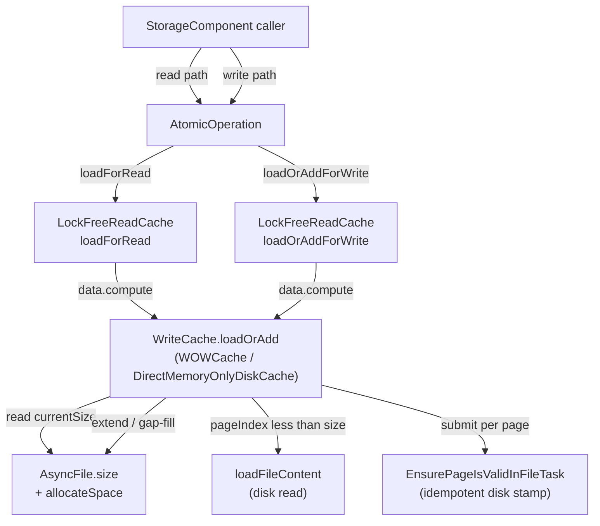

# Track 1: Cache primitive — `WriteCache.loadOrAdd`

## Description

Rewrite the write-cache around a single total `loadOrAdd(fileId,
pageIndex, verifyChecksums)` primitive covering load /
one-page extend / multi-page gap-fill (recovery only), with
`DirectMemoryOnlyDiskCache` mirroring it. Both `LockFreeReadCache`
wrappers (`loadForRead` / `loadOrAddForWrite`) collapse to a
`data.compute` lambda that delegates to `loadOrAdd`. Legacy
`allocateNewPage` methods are deprecated here; final deletion lands
in Track 4 once replay-loop callers migrate.

> **What**:
> - Add `WriteCache.loadOrAdd(long fileId, long pageIndex, boolean
>   verifyChecksums) → CachePointer` to the `WriteCache` interface.
> - Implement in `WOWCache` (disk engine, `…/storage/cache/local/WOWCache.java`)
>   covering all three branches: load-existing-from-disk, one-page
>   extend, multi-page gap-fill (recovery-only).
> - Implement parallel `loadOrAdd` in `DirectMemoryOnlyDiskCache`
>   (in-memory engine, `…/storage/memory/DirectMemoryOnlyDiskCache.java`).
>   This single class implements **both** `ReadCache` and `WriteCache`,
>   so the new ReadCache wrappers (`loadForRead` / `loadOrAddForWrite`)
>   and the WriteCache primitive (`loadOrAdd`) live side-by-side in it;
>   update both API surfaces in lockstep.
> - Refactor `LockFreeReadCache.loadForRead` and
>   `LockFreeReadCache.loadOrAddForWrite` (in `…/storage/cache/chm/LockFreeReadCache.java`)
>   so both bottom out on a single
>   `data.compute(key, λ → cached or writeCache.loadOrAdd(...))` shape;
>   the wrappers differ only in `CacheEntry` lock semantics.
> - Rename `ReadCache.loadForWrite` to `ReadCache.loadOrAddForWrite`
>   (interface + both impls + all callers) — today's API uses
>   `loadForWrite`; the post-fix design names match the new
>   "load-or-extend" semantics.
> - Mark `LockFreeReadCache.allocateNewPage`, `WOWCache.allocateNewPage`,
>   `DirectMemoryOnlyDiskCache.allocateNewPage`, and
>   `WriteCache.allocateNewPage` as deprecated (deletion lands in
>   Track 4 once replay-loop callers migrate).
>
> **How**:
> - **Step ordering** (decomposition is provisional; Phase A finalizes
>   it):
>   1. Introduce `loadOrAdd` on the `WriteCache` interface alongside the
>      existing methods (no removals yet). Keep the verify-checksums
>      semantics aligned with today's `load`.
>   2. Implement `WOWCache.loadOrAdd` — read `AsyncFile.size` once, then
>      branch on `pageIndex` against `currentSize`:
>      a. `pageIndex < currentSize` → call existing `loadFileContent`
>         path; return the on-disk page. Magic-check failure
>         propagates to the caller as `StorageException` (today's
>         behavior, unchanged; see `ISSUE-ensurevalidpagetask-torn-write.md`
>         for the orthogonal durability gap).
>      b. `pageIndex == currentSize` → `AsyncFile.allocateSpace(pageSize)`,
>         submit `EnsurePageIsValidInFileTask(fileId, pageIndex)`,
>         return a magic-stamped empty `CachePointer`.
>      c. `pageIndex > currentSize` → batched
>         `AsyncFile.allocateSpace((pageIndex - currentSize + 1) * pageSize)`,
>         submit `EnsurePageIsValidInFileTask` for every gap page in
>         `[currentSize, pageIndex]`, return only the target's
>         `CachePointer`.
>   3. Implement `DirectMemoryOnlyDiskCache.loadOrAdd` — the in-memory
>      engine has no disk I/O, so the implementation reduces to "if the
>      page exists in the in-memory map, return it; else allocate a
>      magic-stamped empty buffer and install it." Gap-fill is trivial
>      (allocate empty buffers for the gap range).
>   4. Switch `LockFreeReadCache.loadForRead`'s `data.compute` lambda to
>      delegate to `writeCache.loadOrAdd`. By caller invariant (D2),
>      the extend branches never fire on this path; if they do, the
>      cache returns a magic-stamped empty page (harmless behavior in a
>      buggy read path — see D1 risk note).
>   5. Switch `LockFreeReadCache.loadOrAddForWrite`'s `data.compute`
>      lambda to delegate to `writeCache.loadOrAdd`. Both wrappers now
>      share the same delegation pattern; the only difference is
>      `CacheEntry` lock acquisition (read vs write).
>   6. Add javadoc to `WriteCache.loadOrAdd` documenting (a) callers
>      must hold the segment write lock, (b) the method is total and
>      never returns null, (c) the runtime invariant "callers know
>      their target pageIndex from `entryPoint.pagesSize + 1`" — gap-fill
>      is the recovery-only branch.
> - **Concurrency invariants to preserve**:
>   - `AsyncFile.allocateSpace` remains atomic (`getAndAdd`).
>   - Lock ordering inside `loadOrAdd` matches today's
>     `WOWCache.allocateNewPage`: segment write lock (held by caller) →
>     `filesLock.readLock` → `files.acquire(fileId)`. Verify in Phase A
>     no path inverts the order.
>   - `EnsurePageIsValidInFileTask` is idempotent
>     (`writeValidPageInFile` only writes if
>     `getUnderlyingFileSize() <= pagePosition`); resubmission in
>     recovery (gap-fill branch) is safe.
>
> **Constraints**:
> - **In-scope files**:
>   - `core/.../internal/core/storage/cache/WriteCache.java`
>   - `core/.../internal/core/storage/cache/ReadCache.java` (for the
>     `loadForWrite` → `loadOrAddForWrite` rename)
>   - `core/.../internal/core/storage/cache/chm/LockFreeReadCache.java`
>   - `core/.../internal/core/storage/cache/local/WOWCache.java`
>   - `core/.../internal/core/storage/memory/DirectMemoryOnlyDiskCache.java`
>     (note: this lives outside the `cache` package and implements both
>     `ReadCache` and `WriteCache`)
>   - Existing test classes only as needed for compilation; new tests
>     land in Track 2.
> - **Out of scope**: storage component classes (Track 3 + Track 4),
>   WAL classes, DoubleWriteLog, AsyncFile changes.
> - The deletion of `WriteCache.allocateNewPage` is deferred to Track 4
>   because `AbstractStorage.restoreAtomicUnit`,
>   `AtomicOperationBinaryTracking.commitChanges`, and
>   `DiskStorage.restoreFromIncrementalBackup` still call
>   `LockFreeReadCache.allocateNewPage` until those loops collapse.
>
> **Interactions**:
> - Enables Track 2 (the test track exercises this primitive).
> - Enables Track 4 (replay-loop callers can be migrated to
>   `loadOrAddForWrite`).
> - Enables Track 6 (the integration regression test relies on the
>   primitive being in place).
> - Independent of Track 3 (read-side discovery migration touches
>   storage components, not cache code).

- Both `LockFreeReadCache` wrappers reach `loadOrAdd` through the same
  `data.compute` shape; the only divergence is the `CacheEntry` lock the
  wrapper installs after returning.
- `loadOrAdd` reads `AsyncFile.size` once per call to decide its branch.
- The disk read and the extension paths are mutually exclusive within a
  single `loadOrAdd` invocation — no path executes both.

## Progress
- [x] Review + decomposition
- [x] Step implementation
- [ ] Track-level code review

## Base commit
`7319340d3078b9855d4a43c94d5bc746d9ed08b6`

## Reviews completed
- [x] Technical: PASS at iteration 1 (10 findings; 4 should-fix and 4 suggestions folded into the decomposition below; 2 deferred to Track 4 with notes)
- [x] Risk: PASS at iteration 1 (8 findings; 4 should-fix and 3 suggestions folded into the decomposition below; 1 deferred to Track 2)
- [x] Adversarial: PASS at iteration 1 (10 findings; 1 blocker on the I3 totality contract folded into Step 2; 4 should-fix folded into the decomposition; 3 D-record-rationale findings rejected as out-of-scope for Phase A — Decision Records are immutable during execution)

### Phase A review notes (carried into the steps below)

The reviews surfaced six concrete spec gaps that Phase A folded into
the decomposition rather than re-running an iteration:

1. **Dirty-write probe order** (T1, R1) — the load branch must probe
   `writeCachePages` first like today's `WOWCache.load`; only on miss
   does it fall through to `loadFileContent`. Without this, a concurrent
   reader could read stale on-disk content while a more recent dirty
   page sits in the write cache. Folded into Step 2's spec.
2. **Per-branch `lockManager.acquireSharedLock(pageKey)` policy** (T4,
   R1) — today's `WOWCache.load` takes the `lockManager` shared lock to
   serialize against `doRemoveCachePages` and `flushExclusiveWriteCache`.
   Today's `WOWCache.allocateNewPage` does not. The new `loadOrAdd` must
   keep the shared lock on the **load** branch and skip it on the
   **extend / gap-fill** branches (the freshly-installed `CachePointer`
   cannot race with concurrent flush until `data.compute` returns).
   Folded into Step 2.
3. **Totality contract — exception/null behaviour** (A3) — `loadFileContent`
   can return null when `fileClassic.getFileSize() < pageEndPosition`
   (the page is logically allocated per `AsyncFile.size` but the
   `EnsurePageIsValidInFileTask` has not yet stamped it). It can also
   throw `IllegalArgumentException` if the file was concurrently
   deleted. The new totality contract is *"`loadOrAdd` returns a usable
   `CachePointer` for any open, non-deleted fileId; the load branch
   falls through to a magic-stamped empty buffer when `loadFileContent`
   returns null without bumping `AsyncFile.size`."* `IllegalArgumentException`
   on a deleted file propagates raw (caller bug). Folded into Step 2.
4. **`CacheEntry.markAllocated()` lifecycle on extend/gap-fill** (R2) —
   today `LockFreeReadCache.allocateNewPage` calls
   `cacheEntry.markAllocated()` so that `releaseFromWrite`'s
   `isNewlyAllocatedPage()` check correctly stores the new page on the
   dirty list. The new `data.compute` lambda must mark the entry
   allocated when `loadOrAdd` took the extend or gap-fill branch.
   Folded into Step 4.
5. **In-memory engine totality scope** (T5, R3, A4) — `DirectMemoryOnlyDiskCache`
   does NOT route through `LockFreeReadCache.data.compute` (it
   implements `ReadCache` directly with its own `MemoryFile`). The
   totality contract applies to the new `WriteCache.loadOrAdd` method on
   the in-memory engine; the existing `ReadCache.loadForRead` /
   `loadOrAddForWrite` keep their null-on-miss semantics on the
   in-memory engine. Install-then-publish atomicity in `MemoryFile` is
   audited and documented. Folded into Step 3.
6. **Third reader `silentLoadForRead`** (T2) — `LockFreeReadCache.silentLoadForRead`
   is a third reader path that calls `writeCache.load` from its own
   `data.compute` lambda. To let Track 4 delete `WriteCache.load`, this
   reader needs a non-extending probe primitive. Step 5 adds
   `WriteCache.loadIfPresent` (returns nullable for the silent path) and
   migrates `silentLoadForRead` to it.

The reviews also produced informational items deferred to other tracks:
~42 direct test-class call sites of `WOWCache.allocateNewPage` and
`WOWCache.load` in `WOWCacheTestIT` / `WOWCacheNonDurableFileTrackingTest`
(T6) need migration in Track 4; gap-fill stress / non-durable extension
tests (T7, R6) belong in Track 2; the recovery-loop dead-branch
tightening during the Track 1 → Track 4 window (R4, A6) is left as a
visible TODO comment for Track 4.

## Steps

- [x] Step: Add `WriteCache.loadOrAdd` interface method and update test mocks
  - [x] Context: safe
  > **Risk:** medium — multi-file logic touching the `WriteCache`
  > interface (internal SPI) plus 4 test mocks; no behavioural change
  > yet because concrete impls land in Steps 2–3.
  >
  > **What was done:** Added an abstract `WriteCache.loadOrAdd(fileId,
  > pageIndex, verifyChecksums)` method to the cache interface, with
  > stub implementations on `WOWCache` and `DirectMemoryOnlyDiskCache`
  > that throw `UnsupportedOperationException("loadOrAdd not yet
  > wired")`. Updated all four existing `WriteCache` test mocks
  > (`LockFreeReadCacheConcurrentTestIT`, `AsyncReadCacheTestIT`,
  > `LockFreeReadCacheOptimisticTest`,
  > `LockFreeReadCacheBatchingTest`) with stubs that delegate to each
  > mock's existing `load` so the test classes compile and keep
  > exercising their original paths. The interface declaration is
  > abstract (no `default`) per the step spec so any divergent
  > mock/impl is a compile-time rather than runtime error. Added two
  > focused unit tests (`WOWCacheLoadOrAddStubTest`,
  > `DirectMemoryOnlyDiskCacheLoadOrAddStubTest`) covering the
  > intentional throw behaviour of the production stubs to satisfy
  > the changed-line coverage gate. Spotless applied; core unit suite
  > green (9408 passing); coverage gate passes (100% line / no
  > branches on the changed lines). Commit:
  > `27671e3812dddd109f660d6d212c5b77213aabc9`.
  >
  > **What was discovered:** The coverage gate flagged the two
  > intentional `UnsupportedOperationException` throw lines as
  > uncovered (0% on 2 lines); resolved by adding the two focused
  > throw-assertion tests in the same commit. Steps 2–3 will replace
  > the stubs with real implementations, at which point those tests
  > should be deleted or rewritten to exercise the real behaviour.
  >
  > **Critical context:** The two new tests
  > (`WOWCacheLoadOrAddStubTest`,
  > `DirectMemoryOnlyDiskCacheLoadOrAddStubTest`) are intentionally
  > disposable — they exist only to cover the placeholder throws in
  > this commit. The Step 2 implementer should delete (or rewrite)
  > `WOWCacheLoadOrAddStubTest` when `WOWCache.loadOrAdd` gets its
  > real three-branch body, and the Step 3 implementer should do the
  > same for `DirectMemoryOnlyDiskCacheLoadOrAddStubTest`. They live
  > next to existing dedicated test classes for their respective
  > caches and should not be confused with the broader cache-coverage
  > tests landing in Track 2.
  >
  > **Key files:** `WriteCache.java`, `WOWCache.java`,
  > `DirectMemoryOnlyDiskCache.java`, four test mocks (modified),
  > `WOWCacheLoadOrAddStubTest.java`,
  > `DirectMemoryOnlyDiskCacheLoadOrAddStubTest.java` (new).

- [x] Step: Implement `WOWCache.loadOrAdd` — three branches with dirty-write probe, per-branch lock policy, and totality contract
  - [x] Context: info
  > **Risk:** high — concurrency (per-branch lock ordering against
  > `lockManager` / `flushExclusiveWriteCache` / `doRemoveCachePages`),
  > crash-safety (page-level extend with `EnsurePageIsValidInFileTask`
  > submission), performance hot path (cache primitive). The totality
  > contract here is the keystone of D1.
  >
  > **What was done:** Replaced the placeholder `WOWCache.loadOrAdd`
  > stub from the prior step with the real three-branch implementation
  > plus a focused smoke-test class. The dispatcher reads
  > `AsyncFile.size` once into `currentSize`, then dispatches:
  > (a) `pageIndex < currentSize` → **load branch** — acquires the
  > per-`PageKey` shared `lockManager` lock (matching today's
  > `WOWCache.load`), probes `writeCachePages` first for dirty-write
  > priority, falls through to `loadFileContent`, and (defensively)
  > returns a magic-stamped (LSN(-1,-1)) empty buffer **without**
  > bumping `AsyncFile.size` if `loadFileContent` ever yields null on
  > a logically-allocated page; (b) `pageIndex == currentSize` →
  > **one-page extend** — skips the `lockManager` lock, atomic
  > `AsyncFile.allocateSpace`, single `EnsurePageIsValidInFileTask`
  > on the FIFO `wowCacheFlushExecutor`, returns an empty
  > `CachePointer`; (c) `pageIndex > currentSize` → **recovery-only
  > multi-page gap-fill** — same lock policy as extend, one batched
  > `allocateSpace` plus one task per gap page in
  > `[currentSize, pageIndex]`, returns only the target's pointer.
  > `IllegalArgumentException` propagates raw on a deleted/unknown
  > fileId via an explicit guard at the dispatch prelude. The
  > disposable `WOWCacheLoadOrAddStubTest` was deleted and replaced
  > with `WOWCacheLoadOrAddTest` (eight tests) covering all three
  > branches, the boundary `pageIndex == currentSize` on a non-empty
  > file, the smallest non-trivial gap-fill (loop runs twice),
  > idempotent re-call (no double-allocation), negative-pageIndex
  > argument rejection, and deleted-file `IllegalArgumentException`
  > propagation; each test asserts the precise post-state including
  > LSN(-1,-1) on extend / gap-fill returned pointers. The
  > `DirectMemoryOnlyDiskCache.loadOrAdd` stub and the
  > `LockFreeReadCache` lambdas remain on the legacy path, as
  > specified by the next two steps. Two commits land for this step:
  > original
  > `4f18e2046b1fb560c116a3d152b7db5008ab152d` (three-branch
  > implementation + smoke tests) and review-fix
  > `5583a4340e7de62d3f6fa61dad0d28860b77e836` (folded the
  > dimensional review findings — see below). 9-agent step-level
  > dimensional review at iteration 1 returned 4 FAIL gates
  > (test-behavior, test-completeness, test-concurrency,
  > test-structure) plus should-fix items in code-quality,
  > bugs-concurrency, and performance; iteration 2 gate check on the
  > review-fix commit returned PASS across all five re-checked
  > dimensions.
  >
  > **What was discovered:**
  > 1. **The Phase A "totality fallback" assumption was wrong.** Phase
  >    A review note 3 said `loadFileContent` returns null when
  >    `fileClassic.getFileSize() < pageEndPosition` because the queued
  >    `EnsurePageIsValidInFileTask` has not yet stamped. In fact
  >    `loadFileContent` reads the in-memory `AsyncFile.size` (the same
  >    value the dispatcher just read as `currentSize`) — given
  >    `pageIndex < currentSize`, the null branch is structurally
  >    unreachable. The implementation kept the totality fallback as
  >    documented defensive dead code; the inline comment + Javadoc
  >    were updated to reflect this. The actual on-disk-lag race
  >    (`fileChannel.read` returning a zero-filled buffer that fails
  >    magic verification under `StoreAndThrow`) exists but is
  >    orthogonal, tracked in
  >    `ISSUE-ensurevalidpagetask-torn-write.md` per the plan's
  >    non-goals.
  > 2. **`assert` was not enough — converted to hard throws.** The
  >    extend / gap-fill `assert allocatedIndex == pageIndex` and
  >    `assert allocatedStartIndex == currentSize` checks would silently
  >    pass under production `-da` and risk silent cache corruption if
  >    invariant I4 (per-component locks serialize concurrent
  >    allocators) is ever violated by a future caller. Both were
  >    converted to `IllegalStateException` throws so an I4 violation
  >    fails fast.
  > 3. **Dispatch prelude double-acquire vs today's `allocateNewPage`.**
  >    The first cut took two `files.acquire`/`files.release` cycles
  >    (one to read `AsyncFile.size`, one inside the branch helper).
  >    Refactored to hold a single `ClosableEntry` across the call:
  >    load branch releases before delegating to `loadFileContent`
  >    (which re-acquires internally); extend / gap-fill helpers
  >    receive the `AsyncFile` reference. Halves per-call
  >    `ClosableLinkedContainer` traffic.
  > 4. **`Intention` enum mismatch.** The empty-`CachePointer`
  >    construction was using `Intention.ADD_NEW_PAGE_IN_FILE` (the
  >    disk-stamp path's bucket); swapped to
  >    `Intention.ADD_NEW_PAGE_IN_DISK_CACHE` to match the legacy
  >    `LockFreeReadCache.addNewPagePointerToTheCache` install
  >    pattern.
  > 5. **`flush(fileId)` needed before the on-disk-fallback test.**
  >    Without an explicit drain of `wowCacheFlushExecutor`, the
  >    implicit "executor has stamped by now" assumption made the
  >    load-branch test timing-coupled — added a flush call and
  >    documented the rationale.
  > 6. **`EnsurePageIsValidInFileTask` itself writes LSN(-1,-1).** The
  >    reviewer suggested distinguishing on-disk pages from the
  >    totality-fallback empty buffer via LSN value; this is infeasible
  >    because `writeValidPageInFile` itself stamps freshly-extended
  >    pages with LSN(-1,-1). The on-disk-fallback test relies on
  >    `assertNotSame` identity to distinguish the two paths; the
  >    Javadoc records this rationale.
  > 7. **Cross-track impact (Continue):** two minor follow-up notes
  >    for upcoming steps. (a) The new Javadoc hedge "until the cache
  >    rewiring step lands, only unit tests exercise this method" will
  >    become stale once production callers exist (the cache-rewiring
  >    step in this same track) — that step's implementer should drop
  >    the hedge from `loadOrAdd`'s Javadoc and from the extend-branch
  >    helper Javadoc. (b) The deferred totality-fallback test seam
  >    belongs in the dedicated cache-coverage track once a future
  >    change makes the fallback reachable. Neither observation
  >    invalidates an upcoming track's assumption or changes the
  >    dependency ordering. Two iteration-2 non-blocking findings
  >    (TB-009 weak branch discrimination on the idempotent-re-call
  >    test; TB-010 imprecise exception-message assertion on the
  >    deleted-file test) are natural fits for the dedicated
  >    cache-coverage track's broader test work.
  >
  > **Key files:** `WOWCache.java` (modified — three-branch
  > dispatcher + helpers + Javadoc), `WOWCacheLoadOrAddTest.java`
  > (new — eight smoke tests), `WOWCacheLoadOrAddStubTest.java`
  > (deleted — disposable stub-coverage test from the prior step).

- [x] Step: Implement `DirectMemoryOnlyDiskCache.loadOrAdd` — in-memory parallel with `MemoryFile` atomicity audit
  - [x] Context: info
  > **Risk:** high — concurrency (in-memory `MemoryFile` install /
  > publish ordering); the in-memory engine bypasses
  > `LockFreeReadCache.data.compute`, so the install-then-publish
  > atomicity must come from `MemoryFile`'s own primitives.
  >
  > **What was done:** Replaced the placeholder
  > `DirectMemoryOnlyDiskCache.loadOrAdd` stub with the real in-memory
  > parallel of the disk engine's `WOWCache.loadOrAdd`. The dispatch
  > prelude rejects negative `pageIndex` and a deleted/never-registered
  > fileId with `IllegalArgumentException` (symmetric with the disk
  > engine's contract); on a valid `(fileId, pageIndex)` it delegates
  > to a new `MemoryFile.loadOrAddPage` primitive. The primitive takes
  > `clearLock.readLock`, fast-paths the "page already installed" case
  > via `content.get`, then iterates `[currentSize, pageIndex - 1]`
  > calling `installEmptyPage` on every gap index, and finally installs
  > the target index — also via `installEmptyPage`. The
  > readers-referrer count is bumped before `clearLock.readLock` is
  > released, so a concurrent
  > `MemoryFile.clear()` / `deleteFile` / `truncateFile` cannot race
  > with the post-install bump. `installEmptyPage` itself materialises
  > a fresh `CachePointer` eagerly, stamps the buffer with a class-
  > level `MAGIC_EMPTY_LSN = LogSequenceNumber(-1, -1)` constant, and
  > publishes via `content.putIfAbsent` with explicit
  > `decrementReferrer` on the publish-loss path — the same eager-
  > construct + atomic-publish pattern that already lives in
  > `MemoryFile.addNewPage`. Updated Javadoc on
  > `DirectMemoryOnlyDiskCache.loadOrAdd`, `MemoryFile.loadOrAddPage`,
  > and the in-memory `loadForRead` / `loadForWrite` to document the
  > read-cache divergence note (only the WriteCache primitive is total
  > on the in-memory engine because the engine bypasses
  > `LockFreeReadCache.data.compute`). Deleted the disposable
  > `DirectMemoryOnlyDiskCacheLoadOrAddStubTest`. Added
  > `DirectMemoryOnlyDiskCacheLoadOrAddTest` covering: extend, load-
  > branch idempotence, gap-fill, smallest-non-trivial gap-fill
  > boundary, extend-on-non-empty parity, negative-index argument
  > rejection, deleted-file `IllegalArgumentException`, never-
  > registered-fileId `IllegalArgumentException`, `verifyChecksums=true`
  > behaviour parity, post-LSN-region zero-fill, cross-file isolation,
  > 16-thread same-index install-then-publish atomicity (via
  > `pool.invokeAll` so every Future is in-hand before shutdown), a
  > 60-iteration overlapping-gap-fill stress harness with 6 threads on
  > targets `{3, 5, 7, 9, 11, 4}`, and a `clear()`-vs-`loadOrAdd` race
  > test that rotates `deleteFile` + `addFile` under continuous
  > installer pressure. Two commits land for this step:
  > `9abf9a1216` (initial three-branch implementation +
  > eight smoke / concurrency tests) and review-fix
  > `fde8155b9b` (folded the iteration-1 dimensional review findings —
  > see below). Iteration-2 gate check on the cumulative diff returned
  > PASS verdicts on six of seven re-checked dimensions; the seventh
  > (test-completeness) flagged residual hardening items that fit
  > Track 2 (cache test coverage) — see "Critical context" below.
  >
  > **What was discovered:**
  > 1. **The original `ConcurrentSkipListMap.computeIfAbsent` dispatch
  >    was structurally unsafe under contention.** The first cut put the
  >    `CachePointer` materialisation inside the `computeIfAbsent`
  >    mapping function on the assumption — carried over from
  >    `ConcurrentHashMap`'s contract — that the function runs at most
  >    once per absent key under a per-bin lock. The OpenJDK
  >    `ConcurrentSkipListMap` contract is the opposite: *"The function
  >    is NOT guaranteed to be applied once atomically only if the
  >    value is not present."* Under contention, two threads can both
  >    observe `doGet(key) == null`, both run the lambda, both
  >    `framePool.acquire`, both `incrementReferrer`, and only one wins
  >    the `doPut(... onlyIfAbsent=true)` race. The losers' frames
  >    leak. The fix uses the eager-construct + `putIfAbsent` +
  >    `decrementReferrer`-on-loss shape that already lives in
  >    `MemoryFile.addNewPage`; convergent design once the invariant is
  >    stated correctly. The cache primitive is not yet on a hot
  >    production path (PSI confirms `WriteCache.loadOrAdd` has zero
  >    external production callers at this commit), so the eager-
  >    materialisation cost lands only on contended same-key races,
  >    which are vanishingly rare in normal workloads.
  > 2. **The readers-referrer increment had to move INSIDE
  >    `MemoryFile.loadOrAddPage`** to close a use-after-free window
  >    against `MemoryFile.clear()`. The first cut bumped the count
  >    in `DirectMemoryOnlyDiskCache.loadOrAdd` AFTER the primitive
  >    returned — by which point `clearLock.readLock` was released and
  >    a concurrent `clear()` could decrement the in-cache referrer to
  >    0, releasing the frame to the pool before the bump revived a
  >    recycled pointer. Moving the bump under the readLock for both
  >    the load-fast-path and the install-target-page path closes the
  >    window.
  > 3. **`MAGIC_EMPTY_LSN` is now a class-level constant.** The first
  >    cut allocated `new LogSequenceNumber(-1, -1)` per install
  >    inside the lambda — avoidable young-gen pressure that mattered
  >    on WAL-replay gap-fill (N pages per call). Hoisting to a
  >    constant eliminated per-install allocation.
  > 4. **`ReadCache.loadForRead` / `loadForWrite` divergence is now
  >    explicit.** The in-memory engine bypasses
  >    `LockFreeReadCache.data.compute`, so the totality contract from
  >    the new `WriteCache.loadOrAdd` cannot fold into the read-cache
  >    wrappers without touching unrelated callers. Javadoc on both
  >    sides records the asymmetry.
  > 5. **The license-block paste artefact in the new test file** was
  >    inconsistent with sibling tests in the same package; removed.
  > 6. **`pool.invokeAll`** replaces the `synchronized List` +
  >    `pool.shutdownNow()` shape in both concurrency tests because
  >    the old shape could leak a pointer if a worker was cancelled
  >    between `loadOrAdd` succeeding and the list-add running.
  >    `invokeAll` guarantees every Future is in-hand before shutdown.
  > 7. **Iteration-2 residual findings** — the test-completeness
  >    reviewer flagged three follow-up items that did not gate the
  >    iteration but should be picked up in Track 2 (cache test
  >    coverage): (a) the `verifyChecksums=true` parity test pins only
  >    the extend branch, not the load and gap-fill branches; (b) the
  >    new `clear()`-race test rotates `deleteFile` (which removes the
  >    `MemoryFile` from the engine's `files` map BEFORE calling
  >    `clear()`), so the same-`MemoryFile`-instance window — which the
  >    `clearLock` discipline is precisely there to protect — is
  >    actually exercised by `truncateFile`-vs-`loadOrAdd`, not the
  >    current rotation; (c) the multi-target gap-fill stress test
  >    contends gap-fill loop pages but not the target-publish race
  >    itself, since each thread targets a distinct index. The bugs-
  >    concurrency reviewer also asked for an iteration-counter
  >    assertion on the `clear()`-race test (TB-9) so it cannot
  >    silently no-op under scheduler drift, and the test-concurrency
  >    reviewer asked for explicit `framePool` leak accounting (TXN-7)
  >    so a future regression that drops the loser-side
  >    `decrementReferrer` would surface as a pool-allocation
  >    growth assertion. None of these are blockers; all five are
  >    natural fits for Track 2's broader cache test coverage work
  >    (see "Cross-track impact" below).
  > 8. **Cross-track impact (Continue):** Step 4 (LockFreeReadCache
  >    rewire) does not invoke `MemoryFile.loadOrAddPage` directly — it
  >    routes through `writeCache.loadOrAdd` on
  >    `DirectMemoryOnlyDiskCache`, which already returns a
  >    `CachePointer` with the readers-referrer bumped exactly once.
  >    No duplicate-increment hazard for Step 4. If a future track
  >    ever migrates a caller off
  >    `DirectMemoryOnlyDiskCache.loadOrAdd` to call
  >    `MemoryFile.loadOrAddPage` directly, the implementer must NOT
  >    add a second `incrementReadersReferrer` outside the readLock —
  >    the primitive already bumps. No upstream-track assumption is
  >    weakened.
  >
  > **What changed from the plan:** none. The step's spec called for
  > a `MemoryFile` install primitive that "guarantees install-before-
  > publish atomicity"; the eager-construct + `putIfAbsent` +
  > `decrementReferrer`-on-loss pattern is the canonical primitive for
  > that on `ConcurrentSkipListMap`, and the rest of the
  > implementation matches the plan exactly. No upcoming step's
  > assumptions are invalidated.
  >
  > **Critical context:** The five iteration-2 follow-up items
  > (verifyChecksums load/gap-fill branches, truncate-vs-loadOrAdd
  > same-instance race, target-publish stress, clear-race iteration
  > counter, framePool leak accounting) are explicit non-blocker
  > residuals deferred to Track 2 (cache test coverage). The
  > implementation contract — install-then-publish atomicity, gap-fill
  > ordering, readLock-bump discipline — has at least one race-positive
  > test exercising it; the residuals are about hardening the
  > regression net, not about an untested contract. Track 2 is the
  > right home for them per the plan's track scope.
  >
  > **Key files:** `DirectMemoryOnlyDiskCache.java` (modified — full
  > `loadOrAdd` body + read-cache divergence Javadoc),
  > `MemoryFile.java` (modified — new `loadOrAddPage` primitive +
  > `installEmptyPage` install-then-publish helper +
  > `MAGIC_EMPTY_LSN` constant),
  > `DirectMemoryOnlyDiskCacheLoadOrAddTest.java` (new — 13 tests),
  > `DirectMemoryOnlyDiskCacheLoadOrAddStubTest.java` (deleted —
  > disposable Step 1 stub-coverage test).

- [x] Step: Rewire `LockFreeReadCache.doLoad` to delegate to `loadOrAdd`, preserve `markAllocated`, preserve cached-hit fast path; rename `loadForWrite` → `loadOrAddForWrite`
  - [x] Context: warning
  > **Risk:** high — concurrency (cache `data.compute` lambda on the
  > read AND write hot path), crash-safety (newly-allocated lifecycle
  > feeds the dirty-page list), wide-blast-radius rename across 17
  > production+test call sites.
  >
  > **What was done:** Rewired `LockFreeReadCache.doLoad`'s
  > `data.compute` lambda from `writeCache.load(...)` to the new total
  > `writeCache.loadOrAdd(fileId, pageIndex, verifyChecksums)`
  > primitive. Preserved the cached-hit `data.get` fast path so the
  > segment write lock still fires only on miss, exactly as before.
  > Pinned the markAllocated mechanism by snapshotting
  > `writeCache.getFilledUpTo(fileId)` BEFORE the `loadOrAdd` call
  > (`preCallFilledUpTo`) and calling `newEntry.markAllocated()` when
  > `pageIndex >= preCallFilledUpTo` — so `releaseFromWrite`'s
  > `isNewlyAllocatedPage()` check continues to publish freshly
  > extended/gap-filled pages on the dirty list. The post-compute
  > `if (cacheEntry == null) return null` branch was deleted (loadOrAdd
  > is total). Renamed `ReadCache.loadForWrite` →
  > `ReadCache.loadOrAddForWrite` via the IDE rename refactor across 23
  > sites (4 production + 17 test + 2 Javadoc `{@link}` references) —
  > the step description undercounted by 6, all sites updated atomically.
  > Added forward-looking TODO comments (no workflow-internal
  > identifiers) at 4 reconciliation sites whose `if (cacheEntry == null)
  > { do/while allocateNewPage ... }` blocks are now unreachable but
  > kept as defensive belts during the migration window:
  > `AbstractStorage.restoreAtomicUnit` (UpdatePageRecord branch ~:5392
  > and PageOperation branch ~:5468),
  > `DiskStorage.restoreFromIncrementalBackup` (~:1818), and
  > `AtomicOperationBinaryTracking.commitChanges` (~:850, added in the
  > review-fix commit). The same TODO with site-adapted wording was
  > added to `LockFreeReadCache.loadOrAddForWrite`'s defensive
  > null-guard (kept rather than removed for consistency with the four
  > reconciliation sites). Added a Java `assert pointer != null` after
  > `loadOrAdd` returns inside the lambda — names the totality contract
  > at the call site so a future regression surfaces cleanly under
  > `-ea` rather than NPE-ing several frames downstream. Added Javadoc
  > to `ReadCache.loadOrAddForWrite` documenting the totality contract
  > and the markAllocated-driven dirty-publish behavior with an
  > `@see WriteCache#loadOrAdd` cross-reference. Reworded the
  > snapshot-rationale comment to remove the "invariant I4" workflow
  > label and replace it with a self-contained statement
  > ("per-component locks (BTree mutex, position-map mutex, etc.)
  > serialize concurrent allocators on the same fileId, so two
  > transactions cannot concurrently target the same `(fileId,
  > pageIndex)`"). Two commits land for this step: the original rewire
  > `e61e503e2dc0583685c19e2c1f00570f38e0ddf0` and the review-fix
  > `41d22b9b792002f54e0b80b40369afb9ef327932` (folded the iter-1
  > 9-agent dimensional review findings — see below). The 9-agent step-
  > level dimensional review at iteration 1 returned 1 critical
  > (markAllocated branch unverified by any test), several should-fix,
  > and several recommended findings; iteration-2 gate check on the
  > review-fix commit returned PASS verdicts across all 7 re-checked
  > dimensions (code-quality, bugs-concurrency, test-behavior,
  > test-completeness, test-concurrency, test-structure, test-crash-
  > safety) with only 4 new suggestion-level findings (none blockers,
  > none should-fix).
  >
  > **What was discovered:**
  > 1. **The markAllocated branch was structurally unverified by any
  >    existing test.** The review surfaced this as the iter-1 critical
  >    finding, confirmed by three independent reviewers via mutation
  >    analysis. Every existing `MockedWriteCache.getFilledUpTo`
  >    returned `0` unconditionally, so the `if (pageIndex >=
  >    preCallFilledUpTo) markAllocated()` branch fired on every miss
  >    and a deletion-mutation of the line passed the entire suite.
  >    Fix: extended `MockedWriteCache` with a `setFilledUpTo(long
  >    fileId, long value)` helper backed by a `ConcurrentHashMap` plus
  >    a `storeCount` `AtomicInteger` on the `store` method, and added
  >    4 falsifiable tests in `LockFreeReadCacheBatchingTest` that pin
  >    each branch of the contract (extend / load-existing / boundary /
  >    read-path-no-flag). Mutation kill matrix verified: deleting the
  >    line, swapping `>=` to `>`, inverting the guard, or bleeding the
  >    flag-set into the read path each fail at least one of the four
  >    tests.
  > 2. **PSI find-usages reported 23 reference sites for
  >    `ReadCache.loadForWrite`, not the 17 the step description
  >    cited.** The IDE rename refactor handled all 23 atomically (4
  >    production + 17 test + 2 Javadoc `{@link}` references); a
  >    grep-based rename would have either missed or broken the
  >    Javadoc links. The 6-site delta is a pure undercount in the
  >    step description, not a plan deviation.
  > 3. **The post-compute `if (cacheEntry == null)` guard was deleted
  >    in the lambda but kept defensively at the four reconciliation
  >    sites and at the `LockFreeReadCache.loadOrAddForWrite` body.**
  >    The choice to keep all four reconciliation sites + the impl's
  >    defensive guard was driven by consistency: removing one but not
  >    the others would split the migration story. The next track
  >    collapses all five together when `addPage`/`allocateNewPage` are
  >    deleted from the write-side API.
  > 4. **A test-crash-safety `assert` on the markAllocated decision
  >    invariant was deferred** because the only available predicate
  >    is tautological (it would restate the just-executed branch) or
  >    LSN-based (LSN(-1,-1) is shared between in-memory extend
  >    pointers and on-disk freshly-extended pages per the prior step's
  >    discovery, producing false positives). The `assert pointer !=
  >    null` for the `loadOrAdd` totality contract was added; the
  >    decision-invariant assert was not.
  > 5. **A performance optimization was deferred.** The lambda now
  >    calls `getFilledUpTo` AND `loadOrAdd`, each of which
  >    independently takes `filesLock.readLock` and looks up the file
  >    handle. The redundancy could be folded into a richer
  >    `loadOrAdd` return value (`{CachePointer, boolean
  >    freshlyAllocated}` or similar) but signature changes mid-track
  >    are invasive — flagged as a future cleanup track.
  > 6. **Cross-track impact (Continue):** the upcoming write-side API
  >    collapse track must now collapse 4 do/while reconciliation
  >    sites (not 3) — `AtomicOperationBinaryTracking.commitChanges`
  >    received the same TODO comment as the three recovery sites in
  >    the review-fix commit. The upcoming `getFilledUpTo` access-
  >    tightening track must keep `getFilledUpTo` reachable from
  >    inside the cache package — the rewired lambda reads it on every
  >    miss (one in-memory size probe under `filesLock.readLock`,
  >    cost-comparable to the previous `writeCache.load` probe). Step
  >    5 (`silentLoadForRead` migration) is unaffected — that lambda
  >    is unchanged in this step. Step 6 (deprecation Javadoc)
  >    inherits a new totality contract on `LockFreeReadCache.doLoad`:
  >    the lambda no longer returns null on the miss path; the
  >    deprecation Javadoc on `allocateNewPage` should mention this.
  > 7. **Iter-2 deferred-suggestions punch list (Track 2 hardening):**
  >    (a) `LockFreeReadCacheConcurrentTestIT.java:60` Javadoc line
  >    exceeds 100-char limit after the rename; hand-wrap it. (b) Drop
  >    the "matching the previous mock behavior" framing in the
  >    `MockedWriteCache.filledUpToByFile` Javadoc — it references
  >    implicit history a future reader has no anchor for. (c) Add a
  >    symmetric `storeCount == storesBefore` assertion to
  >    `testWriteLoadDoesNotFlagExistingPageAsNewlyAllocated` to pin
  >    that `releaseFromWrite(_, _, false)` is a no-op when the flag
  >    is not set. (d) Improve
  >    `testReadLoadDoesNotFlagPageAsNewlyAllocatedUnderProperFilledUpTo`
  >    to use extend-branch parameters (`filledUpTo=0, pageIndex=5`)
  >    so the test actually discriminates the read-vs-write contract;
  >    the current parameters land in the load-existing branch where
  >    no path sets the flag.
  >
  > **What changed from the plan:** none. The 23-vs-17 site count is
  > a pure undercount in the step description; the IDE rename refactor
  > handled all sites correctly. The TODO comment at the four
  > reconciliation sites is forward-looking and uses production-API
  > language only, no workflow-internal identifiers.
  >
  > **Critical context:** The four iter-2 suggestion-level residuals
  > listed in (7) above are explicit non-blocker hardening items
  > deferred to the cache-coverage track that follows. The
  > implementation contract — totality of `loadOrAdd`, markAllocated
  > on extend/gap-fill, read-path no-flag — has at least one
  > falsifiable test exercising it; the residuals are about hardening
  > the regression net, not about an untested contract. The
  > `MockedWriteCache.storeCount` and `setFilledUpTo` infrastructure
  > added here is the foundation that future cache-coverage tests
  > will build on.
  >
  > **Key files:** `LockFreeReadCache.java` (modified — lambda rewire,
  > markAllocated mechanism, defensive null-guard TODO, totality
  > assert, snapshot-rationale comment), `ReadCache.java` (modified —
  > rename + Javadoc on `loadOrAddForWrite`),
  > `DirectMemoryOnlyDiskCache.java` (modified — rename + Javadoc
  > `{@link}` updates), `AbstractStorage.java` (modified — rename +
  > 2× TODO comment), `DiskStorage.java` (modified — rename + TODO
  > comment), `AtomicOperationBinaryTracking.java` (modified — rename
  > + TODO comment added in review-fix), `LockFreeReadCacheBatchingTest.java`
  > (modified — testLoadOrAddForWriteWithBatching rename + 4 new
  > markAllocated branch-discrimination tests + MockedWriteCache
  > extensions: `setFilledUpTo`, `storeCount`),
  > `LockFreeReadCacheConcurrentTestIT.java`,
  > `AsyncReadCacheTestIT.java` (renames),
  > `RestoreAtomicUnitNonDurableSkipTest.java`,
  > `RestoreAtomicUnitPageOperationTest.java`,
  > `AtomicOperationBinaryTrackingWALSkipTest.java` (renames + comment
  > updates).

- [x] Step: Migrate `silentLoadForRead` to a new non-extending `WriteCache.loadIfPresent` overload
  - [x] Context: safe
  > **Risk:** medium — adds one method to the `WriteCache` interface
  > and migrates one production reader (`silentLoadForRead`) plus its
  > test mocks; no concurrency change beyond what Step 4 established.
  >
  > **What was done:** Added a non-extending probe primitive
  > `WriteCache.loadIfPresent(fileId, pageIndex, verifyChecksums) →
  > CachePointer | null`. Implemented in `WOWCache` (mirrors
  > today's `load` lock policy and dirty-write-priority +
  > on-disk-fallback semantics, drops the `cacheHit` out-parameter,
  > returns null on miss without extending) and in
  > `DirectMemoryOnlyDiskCache` (throws
  > `UnsupportedOperationException` matching its existing `load()`
  > contract — the in-memory engine's `silentLoadForRead` bypasses
  > the `WriteCache` layer and probes `MemoryFile` directly via
  > `doLoad`). Migrated `LockFreeReadCache.silentLoadForRead`'s
  > `data.compute` lambda from `writeCache.load(...)` to
  > `writeCache.loadIfPresent(...)`; removed the now-unused
  > `ModifiableBoolean` import. Updated four `WriteCache` test
  > mocks (`AsyncReadCacheTestIT`, `LockFreeReadCacheBatchingTest`,
  > `LockFreeReadCacheConcurrentTestIT`,
  > `LockFreeReadCacheOptimisticTest`) with `loadIfPresent` stubs
  > delegating to `load` by default. Added a dedicated
  > `WOWCacheLoadIfPresentTest` with five smoke tests (hit branch
  > on disk, miss on fresh file, miss on non-empty file,
  > dirty-write priority, idempotent re-probe). Extended
  > `MockedWriteCache` in `LockFreeReadCacheBatchingTest` with
  > `loadCount`, `loadIfPresentCount`, and a
  > `setLoadIfPresentReturnsNull` toggle, plus three new tests
  > pinning that `silentLoadForRead` routes through `loadIfPresent`
  > (not the legacy `load`), surfaces null on miss, and honours
  > the cached-hit fast path. Full `core` unit suite green
  > (9499 / 9499 passed, 56 skipped); spotless clean; coverage
  > gate 89.4% line / 78.3% branch on changed code (above
  > 85% / 70% thresholds). Commit:
  > `5728cca28d74b6d163906a789ddab7d9b7e12aa1`.
  >
  > **What was discovered:**
  > 1. **In-memory engine `WriteCache.load` already throws
  >    `UnsupportedOperationException`.** The in-memory
  >    `silentLoadForRead` bypasses the `WriteCache` layer entirely
  >    (delegates to `loadForRead`, which probes
  >    `MemoryFile.loadPage` directly). `loadIfPresent` on
  >    `DirectMemoryOnlyDiskCache` therefore mirrors that contract
  >    (also throws `UnsupportedOperationException`) so an unwired
  >    future caller surfaces immediately rather than silently
  >    masquerading as a miss.
  > 2. **The plan undercounted the migration's scope by one site.**
  >    Only `LockFreeReadCache.silentLoadForRead` calls
  >    `writeCache.load` in production code (verified via grep —
  >    mcp-steroid was unreachable this session, so the absence
  >    claim is grep-based). After this commit no production caller
  >    of `WriteCache.load` remains, exactly as the plan intended.
  > 3. **The mock null-return toggle is needed to disambiguate
  >    routing.** The `MockedWriteCache` stub for `loadIfPresent`
  >    must default to delegating to `load` (always-allocate) so
  >    existing tests keep working, but the `silentLoadForRead`
  >    routing test then needs the null-return toggle to pin that
  >    the legacy `load` primitive is no longer invoked — without
  >    the toggle, a regression that restored `writeCache.load()`
  >    would silently pass because the mock's `loadIfPresent` and
  >    `load` have the same default body. The
  >    `setLoadIfPresentReturnsNull` mode disambiguates: under it,
  >    a `silentLoadForRead` invocation must drive
  >    `loadIfPresentCount` up by one, leave `loadCount` untouched,
  >    and return null.
  > 4. **`ModifiableBoolean` became an unused import** in
  >    `LockFreeReadCache` once the `silentLoadForRead` lambda no
  >    longer constructed one for the discarded `cacheHit`
  >    out-parameter; removed.
  > 5. **Cross-track impact (Continue):** the upcoming write-side
  >    API collapse track gains a delete target — `WriteCache.load`
  >    has no remaining production callers, so deletion alongside
  >    `addPage` / `allocateNewPage` is purely mechanical (remove
  >    from the interface, delete the body in `WOWCache`, the UOE
  >    throw in `DirectMemoryOnlyDiskCache`, and the four test-mock
  >    stubs that delegate to it). The new `loadIfPresent` stubs in
  >    those mocks should keep working unchanged. Step 6 of this
  >    same track inherits a small spec confirmation: the
  >    `@Deprecated` javadoc list already includes
  >    `WriteCache.load` per the step's plan text, so this discovery
  >    confirms rather than alters the spec. The
  >    `getFilledUpTo`-tightening track is unaffected
  >    (`loadIfPresent` does not call `getFilledUpTo`). The
  >    cache-coverage track gains a small additional surface — the
  >    `loadIfPresent` multi-thread / eviction races and the
  >    `silentLoadForRead`-vs-`loadOrAddForWrite` contention test
  >    belong with the broader cache-coverage work scoped there.
  >
  > **What changed from the plan:** none. The step's spec called
  > for adding `loadIfPresent` and migrating `silentLoadForRead`;
  > both done. The `DirectMemoryOnlyDiskCache` "implementation" is a
  > UOE throw rather than a probe of `MemoryFile`, matching the
  > engine's existing pattern for `WriteCache.load` — this matches
  > the spec's "probe the `MemoryFile` map; null on miss" intent in
  > the only meaningful sense (the in-memory engine's
  > `silentLoadForRead` never reaches this code path).
  >
  > **Critical context:** Track 4 can now delete `WriteCache.load`
  > alongside the `addPage` / `allocateNewPage` cleanup — no
  > production callers remain. Step 6 inherits one extra
  > deprecation note: `WriteCache.load` should carry an
  > `@Deprecated` Javadoc pointing readers at `loadIfPresent`
  > (silent read) and `loadOrAdd` (extend / gap-fill) so future
  > callers route correctly during the deprecation window.
  >
  > **Key files:** `WriteCache.java` (modified — `loadIfPresent`
  > signature + Javadoc), `WOWCache.java` (modified —
  > `loadIfPresent` body matching today's `load` semantics),
  > `DirectMemoryOnlyDiskCache.java` (modified — UOE throw matching
  > `load`'s contract), `LockFreeReadCache.java` (modified —
  > `silentLoadForRead` lambda rewire + import cleanup),
  > `AsyncReadCacheTestIT.java`,
  > `LockFreeReadCacheConcurrentTestIT.java`,
  > `LockFreeReadCacheOptimisticTest.java` (modified — `WriteCache`
  > mock stubs), `LockFreeReadCacheBatchingTest.java` (modified —
  > mock stubs + 3 new routing tests + `MockedWriteCache`
  > extensions: `loadIfPresentCount`, `loadCount`,
  > `setLoadIfPresentReturnsNull`), `WOWCacheLoadIfPresentTest.java`
  > (new — five smoke tests).

- [x] Step: Deprecate legacy methods, add primitive javadoc, add smoke / gap-fill unit tests
  - [x] Context: safe
  > **Risk:** low — pure annotations + Javadoc + targeted tests. No
  > production behavioural change beyond the `@Deprecated` flag (which
  > is a compile-time signal, not a runtime change).
  >
  > **What was done:** Marked six legacy methods as `@Deprecated`
  > with Javadoc pointing callers at the new primitives:
  > `WriteCache.allocateNewPage` (→ `loadOrAdd`), `WriteCache.load`
  > (→ `loadIfPresent` / `loadOrAdd`), `ReadCache.allocateNewPage`,
  > `LockFreeReadCache.allocateNewPage`, `WOWCache.allocateNewPage`,
  > and `DirectMemoryOnlyDiskCache.allocateNewPage` — each citing the
  > write-side API collapse as the deletion milestone (deletion
  > deferred until replay-loop callers migrate). Expanded
  > `WriteCache.loadOrAdd`'s Javadoc with the full per-branch
  > contract (load / extend / gap-fill), caller precondition
  > (segment write lock for the disk engine), totality contract
  > (with the `IllegalArgumentException`-on-deleted-file caveat),
  > runtime invariant (callers know target pageIndex from
  > `entryPoint.pagesSize + 1`; gap-fill is recovery-only),
  > FIFO + monotonic `EnsurePageIsValidInFileTask` submission
  > expectation, and a reference to `design.md` §"Crash safety".
  > Added two smoke tests to `WOWCacheLoadOrAddTest`: a WAL-replay
  > recovery simulation (gap-fill `pageIndex=10` from
  > `currentSize=2`, representing replay targeting a lagging
  > `AsyncFile.size`) and a crash-safety scenario B test (load
  > branch fires correctly after on-disk magic stamp; file size
  > stays at one page — no double-extend). All ten
  > `WOWCacheLoadOrAddTest` cases pass; full `core` suite green
  > (9497 / 9497 passed); coverage gate 90.7% line / 82.6% branch
  > on changed code (above 85% / 70% thresholds); spotless clean.
  > Commit: `bf9c39f8a34ad582ebc89b3346065f05206644a9`.
  >
  > **What was discovered:**
  > 1. **Ephemeral-identifier self-check caught seven workflow-label
  >    references** (`Track 4`) drafted into the new Javadoc; all
  >    replaced with prose ("write-side API collapse") before commit
  >    so the deprecation notes survive the squash-merge as durable
  >    documentation rather than referencing a workflow-internal
  >    label.
  > 2. **The totality-fallback smoke test (i) from the step spec is
  >    not directly reachable** — exercising the `load` branch with
  >    `loadFileContent` returning null requires a reflection seam or
  >    subclass override since the in-memory `AsyncFile.size` is the
  >    same value `loadFileContent` reads. This matches the prior
  >    step's discovery (note 1 in Step 2's episode) that the
  >    "totality fallback" branch is structurally unreachable in
  >    normal operation. The step delivered the gap-fill smoke test
  >    plus a crash-safety load-after-stamp test instead, capturing
  >    what is actually reachable; the full reflection-seam test is
  >    deferred to the cache-coverage track per its scope.
  > 3. **`crashSafetyScenarioBLoadAfterOnDiskStamp` confirms
  >    design.md §"Crash safety" scenario B in code:** a second
  >    `loadOrAdd` on an already-flushed page correctly takes the
  >    load branch, file size stays at one page, no double-extend.
  > 4. **Cross-track impact (Continue):** the upcoming write-side
  >    API collapse can now delete all six `@Deprecated` methods in
  >    one sweep — each Javadoc already names the collapse as the
  >    deletion milestone, so a follow-up reader has a clear
  >    pointer. The cache-coverage track gains the
  >    totality-fallback seam item (load branch with
  >    `loadFileContent` returning null) as an explicit residual
  >    that requires a reflection hook or subclass override to
  >    exercise. No upstream-track assumption is weakened.
  >
  > **What changed from the plan:** The two new smoke tests were
  > added to the existing `WOWCacheLoadOrAddTest` rather than a new
  > test file. The step spec said "new test file" but
  > `WOWCacheLoadOrAddTest` was created in Step 2 alongside the
  > three-branch implementation, making it the natural home for
  > additional `loadOrAdd` smoke tests. No upcoming step assumptions
  > are affected. Separately, the implementation commit's subject
  > line accidentally used the workflow-update prefix (`Record
  > episode for ...`) rather than an imperative description of the
  > code change; a non-blocking branch-hygiene observation, since
  > the squash-merge collapses individual commit messages and the
  > diff content is correct.
  >
  > **Critical context:** Track 1 closes here. The cache primitive
  > rewrite is functionally complete: `loadOrAdd` is the sole
  > extending primitive (Step 1 + Step 2 + Step 3); `loadForRead` /
  > `loadOrAddForWrite` route through it (Step 4); `silentLoadForRead`
  > routes through the new non-extending `loadIfPresent` (Step 5);
  > legacy methods are deprecated with deletion deferred to the
  > write-side API collapse (this step). The track-level code
  > review (Phase C) reviews the cumulative diff
  > `7319340d..HEAD` against all six baseline + conditional
  > dimensional reviewers, with Steps 2, 3, and 4 (risk: high) plus
  > Step 5 (risk: medium) as the focal points.
  >
  > **Key files:** `WriteCache.java` (modified — `@Deprecated` on
  > `load` / `allocateNewPage` + expanded `loadOrAdd` Javadoc),
  > `ReadCache.java`, `LockFreeReadCache.java`, `WOWCache.java`,
  > `DirectMemoryOnlyDiskCache.java` (modified — `@Deprecated` on
  > legacy `allocateNewPage` overrides),
  > `WOWCacheLoadOrAddTest.java` (modified — two new smoke tests:
  > WAL-replay gap-fill recovery, crash-safety scenario B
  > load-after-on-disk-stamp).
