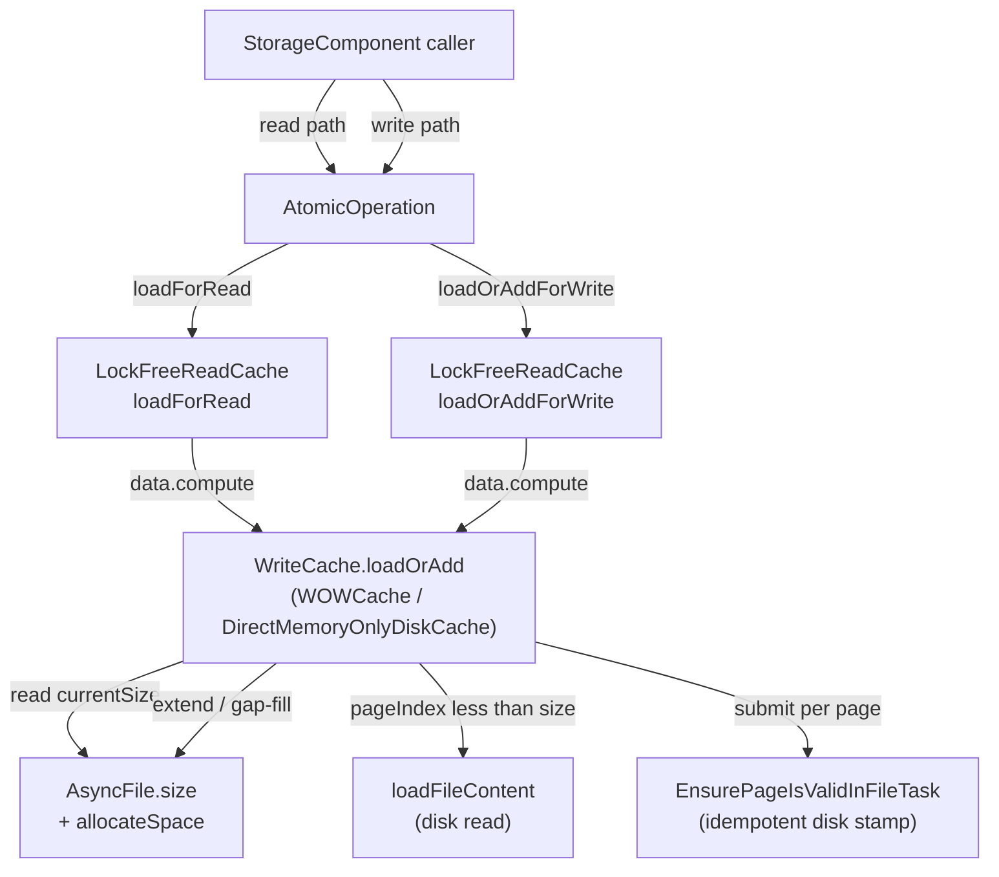

# Track 1: Cache primitive — `WriteCache.loadOrAdd`

## Description

Rewrite the write-cache around a single total `loadOrAdd(fileId,
pageIndex, verifyChecksums)` primitive covering load /
one-page extend / multi-page gap-fill (recovery only), with
`DirectMemoryOnlyDiskCache` mirroring it. Both `LockFreeReadCache`
wrappers (`loadForRead` / `loadOrAddForWrite`) collapse to a
`data.compute` lambda that delegates to `loadOrAdd`. Legacy
`allocateNewPage` methods are deprecated here; final deletion lands
in Track 4 once replay-loop callers migrate.

> **What**:
> - Add `WriteCache.loadOrAdd(long fileId, long pageIndex, boolean
>   verifyChecksums) → CachePointer` to the `WriteCache` interface.
> - Implement in `WOWCache` (disk engine, `…/storage/cache/local/WOWCache.java`)
>   covering all three branches: load-existing-from-disk, one-page
>   extend, multi-page gap-fill (recovery-only).
> - Implement parallel `loadOrAdd` in `DirectMemoryOnlyDiskCache`
>   (in-memory engine, `…/storage/memory/DirectMemoryOnlyDiskCache.java`).
>   This single class implements **both** `ReadCache` and `WriteCache`,
>   so the new ReadCache wrappers (`loadForRead` / `loadOrAddForWrite`)
>   and the WriteCache primitive (`loadOrAdd`) live side-by-side in it;
>   update both API surfaces in lockstep.
> - Refactor `LockFreeReadCache.loadForRead` and
>   `LockFreeReadCache.loadOrAddForWrite` (in `…/storage/cache/chm/LockFreeReadCache.java`)
>   so both bottom out on a single
>   `data.compute(key, λ → cached or writeCache.loadOrAdd(...))` shape;
>   the wrappers differ only in `CacheEntry` lock semantics.
> - Rename `ReadCache.loadForWrite` to `ReadCache.loadOrAddForWrite`
>   (interface + both impls + all callers) — today's API uses
>   `loadForWrite`; the post-fix design names match the new
>   "load-or-extend" semantics.
> - Mark `LockFreeReadCache.allocateNewPage`, `WOWCache.allocateNewPage`,
>   `DirectMemoryOnlyDiskCache.allocateNewPage`, and
>   `WriteCache.allocateNewPage` as deprecated (deletion lands in
>   Track 4 once replay-loop callers migrate).
>
> **How**:
> - **Step ordering** (decomposition is provisional; Phase A finalizes
>   it):
>   1. Introduce `loadOrAdd` on the `WriteCache` interface alongside the
>      existing methods (no removals yet). Keep the verify-checksums
>      semantics aligned with today's `load`.
>   2. Implement `WOWCache.loadOrAdd` — read `AsyncFile.size` once, then
>      branch on `pageIndex` against `currentSize`:
>      a. `pageIndex < currentSize` → call existing `loadFileContent`
>         path; return the on-disk page. Magic-check failure
>         propagates to the caller as `StorageException` (today's
>         behavior, unchanged; see `ISSUE-ensurevalidpagetask-torn-write.md`
>         for the orthogonal durability gap).
>      b. `pageIndex == currentSize` → `AsyncFile.allocateSpace(pageSize)`,
>         submit `EnsurePageIsValidInFileTask(fileId, pageIndex)`,
>         return a magic-stamped empty `CachePointer`.
>      c. `pageIndex > currentSize` → batched
>         `AsyncFile.allocateSpace((pageIndex - currentSize + 1) * pageSize)`,
>         submit `EnsurePageIsValidInFileTask` for every gap page in
>         `[currentSize, pageIndex]`, return only the target's
>         `CachePointer`.
>   3. Implement `DirectMemoryOnlyDiskCache.loadOrAdd` — the in-memory
>      engine has no disk I/O, so the implementation reduces to "if the
>      page exists in the in-memory map, return it; else allocate a
>      magic-stamped empty buffer and install it." Gap-fill is trivial
>      (allocate empty buffers for the gap range).
>   4. Switch `LockFreeReadCache.loadForRead`'s `data.compute` lambda to
>      delegate to `writeCache.loadOrAdd`. By caller invariant (D2),
>      the extend branches never fire on this path; if they do, the
>      cache returns a magic-stamped empty page (harmless behavior in a
>      buggy read path — see D1 risk note).
>   5. Switch `LockFreeReadCache.loadOrAddForWrite`'s `data.compute`
>      lambda to delegate to `writeCache.loadOrAdd`. Both wrappers now
>      share the same delegation pattern; the only difference is
>      `CacheEntry` lock acquisition (read vs write).
>   6. Add javadoc to `WriteCache.loadOrAdd` documenting (a) callers
>      must hold the segment write lock, (b) the method is total and
>      never returns null, (c) the runtime invariant "callers know
>      their target pageIndex from `entryPoint.pagesSize + 1`" — gap-fill
>      is the recovery-only branch.
> - **Concurrency invariants to preserve**:
>   - `AsyncFile.allocateSpace` remains atomic (`getAndAdd`).
>   - Lock ordering inside `loadOrAdd` matches today's
>     `WOWCache.allocateNewPage`: segment write lock (held by caller) →
>     `filesLock.readLock` → `files.acquire(fileId)`. Verify in Phase A
>     no path inverts the order.
>   - `EnsurePageIsValidInFileTask` is idempotent
>     (`writeValidPageInFile` only writes if
>     `getUnderlyingFileSize() <= pagePosition`); resubmission in
>     recovery (gap-fill branch) is safe.
>
> **Constraints**:
> - **In-scope files**:
>   - `core/.../internal/core/storage/cache/WriteCache.java`
>   - `core/.../internal/core/storage/cache/ReadCache.java` (for the
>     `loadForWrite` → `loadOrAddForWrite` rename)
>   - `core/.../internal/core/storage/cache/chm/LockFreeReadCache.java`
>   - `core/.../internal/core/storage/cache/local/WOWCache.java`
>   - `core/.../internal/core/storage/memory/DirectMemoryOnlyDiskCache.java`
>     (note: this lives outside the `cache` package and implements both
>     `ReadCache` and `WriteCache`)
>   - Existing test classes only as needed for compilation; new tests
>     land in Track 2.
> - **Out of scope**: storage component classes (Track 3 + Track 4),
>   WAL classes, DoubleWriteLog, AsyncFile changes.
> - The deletion of `WriteCache.allocateNewPage` is deferred to Track 4
>   because `AbstractStorage.restoreAtomicUnit`,
>   `AtomicOperationBinaryTracking.commitChanges`, and
>   `DiskStorage.restoreFromIncrementalBackup` still call
>   `LockFreeReadCache.allocateNewPage` until those loops collapse.
>
> **Interactions**:
> - Enables Track 2 (the test track exercises this primitive).
> - Enables Track 4 (replay-loop callers can be migrated to
>   `loadOrAddForWrite`).
> - Enables Track 6 (the integration regression test relies on the
>   primitive being in place).
> - Independent of Track 3 (read-side discovery migration touches
>   storage components, not cache code).

- Both `LockFreeReadCache` wrappers reach `loadOrAdd` through the same
  `data.compute` shape; the only divergence is the `CacheEntry` lock the
  wrapper installs after returning.
- `loadOrAdd` reads `AsyncFile.size` once per call to decide its branch.
- The disk read and the extension paths are mutually exclusive within a
  single `loadOrAdd` invocation — no path executes both.

## Progress
- [x] Review + decomposition
- [ ] Step implementation (1/6 complete)
- [ ] Track-level code review

## Base commit
`7319340d3078b9855d4a43c94d5bc746d9ed08b6`

## Reviews completed
- [x] Technical: PASS at iteration 1 (10 findings; 4 should-fix and 4 suggestions folded into the decomposition below; 2 deferred to Track 4 with notes)
- [x] Risk: PASS at iteration 1 (8 findings; 4 should-fix and 3 suggestions folded into the decomposition below; 1 deferred to Track 2)
- [x] Adversarial: PASS at iteration 1 (10 findings; 1 blocker on the I3 totality contract folded into Step 2; 4 should-fix folded into the decomposition; 3 D-record-rationale findings rejected as out-of-scope for Phase A — Decision Records are immutable during execution)

### Phase A review notes (carried into the steps below)

The reviews surfaced six concrete spec gaps that Phase A folded into
the decomposition rather than re-running an iteration:

1. **Dirty-write probe order** (T1, R1) — the load branch must probe
   `writeCachePages` first like today's `WOWCache.load`; only on miss
   does it fall through to `loadFileContent`. Without this, a concurrent
   reader could read stale on-disk content while a more recent dirty
   page sits in the write cache. Folded into Step 2's spec.
2. **Per-branch `lockManager.acquireSharedLock(pageKey)` policy** (T4,
   R1) — today's `WOWCache.load` takes the `lockManager` shared lock to
   serialize against `doRemoveCachePages` and `flushExclusiveWriteCache`.
   Today's `WOWCache.allocateNewPage` does not. The new `loadOrAdd` must
   keep the shared lock on the **load** branch and skip it on the
   **extend / gap-fill** branches (the freshly-installed `CachePointer`
   cannot race with concurrent flush until `data.compute` returns).
   Folded into Step 2.
3. **Totality contract — exception/null behaviour** (A3) — `loadFileContent`
   can return null when `fileClassic.getFileSize() < pageEndPosition`
   (the page is logically allocated per `AsyncFile.size` but the
   `EnsurePageIsValidInFileTask` has not yet stamped it). It can also
   throw `IllegalArgumentException` if the file was concurrently
   deleted. The new totality contract is *"`loadOrAdd` returns a usable
   `CachePointer` for any open, non-deleted fileId; the load branch
   falls through to a magic-stamped empty buffer when `loadFileContent`
   returns null without bumping `AsyncFile.size`."* `IllegalArgumentException`
   on a deleted file propagates raw (caller bug). Folded into Step 2.
4. **`CacheEntry.markAllocated()` lifecycle on extend/gap-fill** (R2) —
   today `LockFreeReadCache.allocateNewPage` calls
   `cacheEntry.markAllocated()` so that `releaseFromWrite`'s
   `isNewlyAllocatedPage()` check correctly stores the new page on the
   dirty list. The new `data.compute` lambda must mark the entry
   allocated when `loadOrAdd` took the extend or gap-fill branch.
   Folded into Step 4.
5. **In-memory engine totality scope** (T5, R3, A4) — `DirectMemoryOnlyDiskCache`
   does NOT route through `LockFreeReadCache.data.compute` (it
   implements `ReadCache` directly with its own `MemoryFile`). The
   totality contract applies to the new `WriteCache.loadOrAdd` method on
   the in-memory engine; the existing `ReadCache.loadForRead` /
   `loadOrAddForWrite` keep their null-on-miss semantics on the
   in-memory engine. Install-then-publish atomicity in `MemoryFile` is
   audited and documented. Folded into Step 3.
6. **Third reader `silentLoadForRead`** (T2) — `LockFreeReadCache.silentLoadForRead`
   is a third reader path that calls `writeCache.load` from its own
   `data.compute` lambda. To let Track 4 delete `WriteCache.load`, this
   reader needs a non-extending probe primitive. Step 5 adds
   `WriteCache.loadIfPresent` (returns nullable for the silent path) and
   migrates `silentLoadForRead` to it.

The reviews also produced informational items deferred to other tracks:
~42 direct test-class call sites of `WOWCache.allocateNewPage` and
`WOWCache.load` in `WOWCacheTestIT` / `WOWCacheNonDurableFileTrackingTest`
(T6) need migration in Track 4; gap-fill stress / non-durable extension
tests (T7, R6) belong in Track 2; the recovery-loop dead-branch
tightening during the Track 1 → Track 4 window (R4, A6) is left as a
visible TODO comment for Track 4.

## Steps

- [x] Step: Add `WriteCache.loadOrAdd` interface method and update test mocks
  - [x] Context: safe
  > **Risk:** medium — multi-file logic touching the `WriteCache`
  > interface (internal SPI) plus 4 test mocks; no behavioural change
  > yet because concrete impls land in Steps 2–3.
  >
  > **What was done:** Added an abstract `WriteCache.loadOrAdd(fileId,
  > pageIndex, verifyChecksums)` method to the cache interface, with
  > stub implementations on `WOWCache` and `DirectMemoryOnlyDiskCache`
  > that throw `UnsupportedOperationException("loadOrAdd not yet
  > wired")`. Updated all four existing `WriteCache` test mocks
  > (`LockFreeReadCacheConcurrentTestIT`, `AsyncReadCacheTestIT`,
  > `LockFreeReadCacheOptimisticTest`,
  > `LockFreeReadCacheBatchingTest`) with stubs that delegate to each
  > mock's existing `load` so the test classes compile and keep
  > exercising their original paths. The interface declaration is
  > abstract (no `default`) per the step spec so any divergent
  > mock/impl is a compile-time rather than runtime error. Added two
  > focused unit tests (`WOWCacheLoadOrAddStubTest`,
  > `DirectMemoryOnlyDiskCacheLoadOrAddStubTest`) covering the
  > intentional throw behaviour of the production stubs to satisfy
  > the changed-line coverage gate. Spotless applied; core unit suite
  > green (9408 passing); coverage gate passes (100% line / no
  > branches on the changed lines). Commit:
  > `27671e3812dddd109f660d6d212c5b77213aabc9`.
  >
  > **What was discovered:** The coverage gate flagged the two
  > intentional `UnsupportedOperationException` throw lines as
  > uncovered (0% on 2 lines); resolved by adding the two focused
  > throw-assertion tests in the same commit. Steps 2–3 will replace
  > the stubs with real implementations, at which point those tests
  > should be deleted or rewritten to exercise the real behaviour.
  >
  > **Critical context:** The two new tests
  > (`WOWCacheLoadOrAddStubTest`,
  > `DirectMemoryOnlyDiskCacheLoadOrAddStubTest`) are intentionally
  > disposable — they exist only to cover the placeholder throws in
  > this commit. The Step 2 implementer should delete (or rewrite)
  > `WOWCacheLoadOrAddStubTest` when `WOWCache.loadOrAdd` gets its
  > real three-branch body, and the Step 3 implementer should do the
  > same for `DirectMemoryOnlyDiskCacheLoadOrAddStubTest`. They live
  > next to existing dedicated test classes for their respective
  > caches and should not be confused with the broader cache-coverage
  > tests landing in Track 2.
  >
  > **Key files:** `WriteCache.java`, `WOWCache.java`,
  > `DirectMemoryOnlyDiskCache.java`, four test mocks (modified),
  > `WOWCacheLoadOrAddStubTest.java`,
  > `DirectMemoryOnlyDiskCacheLoadOrAddStubTest.java` (new).

- [ ] Step: Implement `WOWCache.loadOrAdd` — three branches with dirty-write probe, per-branch lock policy, and totality contract
  > **Risk:** high — concurrency (per-branch lock ordering against
  > `lockManager` / `flushExclusiveWriteCache` / `doRemoveCachePages`),
  > crash-safety (page-level extend with `EnsurePageIsValidInFileTask`
  > submission), performance hot path (cache primitive). The totality
  > contract here is the keystone of D1.
  >
  > **What:** Real implementation of `WOWCache.loadOrAdd`. Read
  > `AsyncFile.size` once into `currentSize`. Branch:
  > (a) `pageIndex < currentSize` → **load branch.** Acquire
  > `lockManager.acquireSharedLock(pageKey)` (matching today's
  > `WOWCache.load`); probe `writeCachePages.get(pageKey)` first and
  > return the dirty in-memory pointer if present (per the dirty-write
  > priority rule, review note 1). On miss call `loadFileContent`
  > exactly as today. **Totality fallback** (review note 3): if
  > `loadFileContent` returns null because `fileClassic.getFileSize()`
  > lags `AsyncFile.size`, return a magic-stamped empty `CachePointer`
  > **without** bumping `AsyncFile.size` (the page is already logically
  > allocated; only the disk-side stamp is missing). Magic-check
  > failure on the load path propagates as `StorageException`
  > (unchanged); see `ISSUE-ensurevalidpagetask-torn-write.md` for the
  > orthogonal durability gap.
  > (b) `pageIndex == currentSize` → **one-page extend.** Skip the
  > `lockManager` shared lock (review note 2). Call
  > `AsyncFile.allocateSpace(pageSize)`, submit
  > `EnsurePageIsValidInFileTask(fileId, pageIndex)` to the single-
  > threaded `wowCacheFlushExecutor`, return a magic-stamped empty
  > `CachePointer`.
  > (c) `pageIndex > currentSize` → **gap-fill (recovery only).** Skip
  > the `lockManager` shared lock. Batched
  > `AsyncFile.allocateSpace((pageIndex - currentSize + 1) * pageSize)`,
  > submit `EnsurePageIsValidInFileTask` per gap page in
  > `[currentSize, pageIndex]`, return only the target's
  > magic-stamped empty `CachePointer`.
  > **Exception contract:** `IllegalArgumentException` from
  > `loadFileContent` on a concurrently-deleted file propagates raw
  > (caller-bug surface); the totality contract holds for any open,
  > non-deleted fileId. **Non-durable files**: extend / gap-fill submit
  > `EnsurePageIsValidInFileTask` exactly as today's `allocateNewPage`
  > — no behavioural change, regression-test tracked in Track 2.
  > Replace the stub from Step 1; do **not** yet rewire the
  > `LockFreeReadCache` lambdas (Step 4).
  >
  > **Files:** `WOWCache.java`.

- [ ] Step: Implement `DirectMemoryOnlyDiskCache.loadOrAdd` — in-memory parallel with `MemoryFile` atomicity audit
  > **Risk:** high — concurrency (in-memory `MemoryFile` install /
  > publish ordering); the in-memory engine bypasses
  > `LockFreeReadCache.data.compute`, so the install-then-publish
  > atomicity must come from `MemoryFile`'s own primitives.
  >
  > **What:** Real implementation of `DirectMemoryOnlyDiskCache.loadOrAdd`.
  > In the in-memory engine the load / extend / gap-fill branches
  > collapse to "if the page exists in the per-`MemoryFile` map,
  > return it; else allocate a magic-stamped empty buffer and install
  > it." Use `MemoryFile`'s existing per-file map operation that
  > guarantees install-before-publish atomicity (audit
  > `DirectMemoryOnlyDiskCache.MemoryFile` and document the
  > installation primitive in the method javadoc). Multi-page gap-fill
  > installs empty buffers for every page in
  > `[currentSize, pageIndex]`. **Scope decision** (review note 5):
  > only `WriteCache.loadOrAdd` is total on this engine; the existing
  > `ReadCache.loadForRead` / `loadOrAddForWrite` keep their
  > `null`-on-miss semantics. The disk-engine vs in-memory-engine
  > divergence on the `ReadCache` API is documented in this method's
  > javadoc and in the in-memory `loadForRead` / `loadOrAddForWrite`
  > javadoc.
  > Replace the stub from Step 1; do **not** yet rewire the
  > `LockFreeReadCache` lambdas (Step 4).
  >
  > **Files:** `DirectMemoryOnlyDiskCache.java`.

- [ ] Step: Rewire `LockFreeReadCache.doLoad` to delegate to `loadOrAdd`, preserve `markAllocated`, preserve cached-hit fast path; rename `loadForWrite` → `loadOrAddForWrite`
  > **Risk:** high — concurrency (cache `data.compute` lambda on the
  > read AND write hot path), crash-safety (newly-allocated lifecycle
  > feeds the dirty-page list), wide-blast-radius rename across 17
  > production+test call sites.
  >
  > **What:** Inside `LockFreeReadCache.doLoad`, change the
  > `data.compute(fileId, pageIndex, λ)` lambda body to call
  > `writeCache.loadOrAdd(fileId, pageIndex, verifyChecksums)` instead
  > of `writeCache.load(...)`. **Preserve the existing `data.get`
  > shortcut for cached hits at line 249** (review note 8) — the
  > `data.compute` segment write lock fires only on miss, exactly as
  > today. **Newly-allocated lifecycle** (review note 4): when the
  > write-path lambda observes that `loadOrAdd` returned a fresh
  > extension/gap-fill `CachePointer` (i.e., `pageIndex >= currentSize`
  > inferred from the returned pointer's properties or by checking
  > `pageIndex >= writeCache.getFilledUpTo(fileId)` before the call —
  > pin the exact mechanism in implementation), call
  > `cacheEntry.markAllocated()` so that `releaseFromWrite`'s
  > `isNewlyAllocatedPage()` check correctly registers the page on the
  > dirty list. **Rename** `ReadCache.loadForWrite` →
  > `ReadCache.loadOrAddForWrite` across the interface, both impls
  > (`LockFreeReadCache`, `DirectMemoryOnlyDiskCache`), and all 17 call
  > sites (production: `AtomicOperationBinaryTracking.java:851`,
  > `DiskStorage.java:1818`, `AbstractStorage.java:5392, :5463`;
  > tests: 5 sites in `AtomicOperationBinaryTrackingWALSkipTest.java`,
  > 4 in `RestoreAtomicUnitPageOperationTest.java`, 4 in
  > `RestoreAtomicUnitNonDurableSkipTest.java`). Recovery loops
  > (`AbstractStorage.restoreAtomicUnit`,
  > `DiskStorage.restoreFromIncrementalBackup`) still wrap the result
  > in `if (cacheEntry == null) { do/while allocateNewPage ... }`;
  > because `loadOrAddForWrite` is now total, the `null` branch is
  > unreachable but harmless. **Add a `// TODO Track 4`** comment in
  > those two recovery sites pointing at the deferred collapse
  > (review note: R4 — keeps the dead branch visible to maintainers
  > during the Track 1 → Track 4 window).
  >
  > **Files:** `LockFreeReadCache.java`, `ReadCache.java`,
  > `DirectMemoryOnlyDiskCache.java`,
  > `AtomicOperationBinaryTracking.java`, `DiskStorage.java`,
  > `AbstractStorage.java`, plus the 13 test files listed above.

- [ ] Step: Migrate `silentLoadForRead` to a new non-extending `WriteCache.loadIfPresent` overload
  > **Risk:** medium — adds one method to the `WriteCache` interface
  > and migrates one production reader (`silentLoadForRead`) plus its
  > test mocks; no concurrency change beyond what Step 4 established.
  >
  > **What:** Add `WriteCache.loadIfPresent(long fileId, long pageIndex,
  > boolean verifyChecksums) → CachePointer | null` returning null when
  > the page does not exist on disk and is not in the dirty-write map.
  > Implement on `WOWCache` (probe `writeCachePages` first, then
  > `loadFileContent` — this is essentially today's `load` semantics
  > exposed under a different name) and on `DirectMemoryOnlyDiskCache`
  > (probe the `MemoryFile` map; null on miss). Update the four test
  > mocks. Migrate `LockFreeReadCache.silentLoadForRead`'s
  > `data.compute` lambda from `writeCache.load(...)` to
  > `writeCache.loadIfPresent(...)`. After this step, no production
  > caller of `WriteCache.load` remains — Track 4 deletes the legacy
  > method.
  >
  > **Files:** `WriteCache.java`, `WOWCache.java`,
  > `DirectMemoryOnlyDiskCache.java`, `LockFreeReadCache.java`, the
  > four test-mock files.

- [ ] Step: Deprecate legacy methods, add primitive javadoc, add smoke / gap-fill unit tests
  > **Risk:** low — pure annotations + Javadoc + targeted tests. No
  > production behavioural change beyond the `@Deprecated` flag (which
  > is a compile-time signal, not a runtime change).
  >
  > **What:** Mark `WriteCache.allocateNewPage`, `WriteCache.load`,
  > `ReadCache.allocateNewPage`, `LockFreeReadCache.allocateNewPage`,
  > `WOWCache.allocateNewPage`, `DirectMemoryOnlyDiskCache.allocateNewPage`
  > as `@Deprecated` with a Javadoc note pointing at `loadOrAdd` /
  > `loadIfPresent` (final deletion in Track 4). Expand
  > `WriteCache.loadOrAdd`'s javadoc per review note 9: caller-must-
  > hold-segment-write-lock-for-disk-engine-installs, totality contract
  > (with the IllegalArgumentException-on-deleted-file caveat),
  > runtime invariant (callers know target pageIndex from
  > `entryPoint.pagesSize + 1`), gap-fill is recovery-only, per-branch
  > `lockManager` policy, FIFO+monotonic submission expectation, link
  > to `design.md` §"Crash safety" scenarios. Add 2 smoke unit tests
  > that exercise `WOWCache.loadOrAdd`'s three branches against a real
  > `WOWCache` against a tmp-dir storage: (i) load branch with the
  > totality fallback (logical pages > physical pages), (ii) gap-fill
  > branch with `pageIndex >> currentSize` reachable only via
  > synthetic caller (since real recovery doesn't reach gap-fill until
  > Track 4 — review notes A6, R7). Comprehensive cache-coverage
  > tests, MT stress, eviction/flush races, non-durable extension all
  > land in Track 2.
  >
  > **Files:** `WriteCache.java`, `ReadCache.java`,
  > `LockFreeReadCache.java`, `WOWCache.java`,
  > `DirectMemoryOnlyDiskCache.java`, plus a new test file under
  > `core/src/test/java/.../storage/cache/local/` for the 2 smoke
  > tests.
