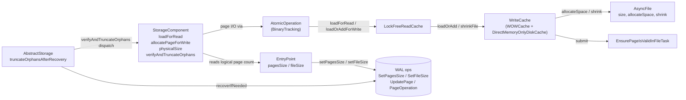

# Read-cache concurrency bug — Architecture Decision Record

## Summary

Eliminated the `LockFreeReadCache` allocator/reader race that poisoned
disk-mode storage with `IllegalStateException("Page X:Y was allocated
in other thread")` and `StorageException("Page Y is broken in
file …")` under concurrent inserts on freshly-built classes. The fix
is structural: the asymmetric cache surface
(`WriteCache.load` + `allocateNewPage` + public `getFilledUpTo`) is
replaced by a single total `WriteCache.loadOrAdd(fileId, pageIndex,
verifyChecksums)` primitive, and the public discovery channel that let
cross-transaction readers observe an in-flight pageIndex
(`getFilledUpTo`) becomes `@Deprecated(forRemoval=false)` and
audit-gated through named helpers. Cross-transaction readers now learn
page existence from `entryPoint.pagesSize` / `entryPoint.fileSize` on
EP-equipped components, and through `StorageComponent.physicalSize(op,
fileId, PhysicalReadIntent)` on EP-less and chicken-and-egg sites. A
recovery-time pass at `AbstractStorage.truncateOrphansAfterRecovery`
truncates partial-flush orphans on EP-equipped components so the
post-recovery layout satisfies `logical <= physical`.

The fix touches the disk-engine cache primitives, the in-memory
parallel engine, storage components, the `AtomicOperation` SPI, the
recovery orchestration in `AbstractStorage` and `DiskStorage`, and the
read-cache segment map. Public API, WAL format, and the storage SPI
for non-cache classes are unchanged.

## Goals

Achieved:

- **Eliminate the allocator/reader race** that poisons disk-mode
  storage with `IllegalStateException` / `StorageException` under
  concurrent inserts on a freshly-built class.
- **Restructure the cache and allocation surface so the race is
  structurally impossible**, not papered over: the only path that
  exposed in-flight pageIndices to cross-TX readers
  (`WriteCache.getFilledUpTo`) is no longer on the discovery path.
- **Preserve crash-safety guarantees and existing performance
  characteristics** of the read/write cache.
- **Leave WAL format, public API, and the `core` storage SPI
  unchanged.**

Adjusted during implementation:

- The "make `getFilledUpTo` package-private" goal was relaxed to
  `@Deprecated(forRemoval=false)` + audit-gated helper set + Javadoc
  enumerating retained internal callers. JLS §9.4 forbids a
  package-private downgrade on an interface abstract method. The
  audit-grep contract still holds — the helper-set names
  (`physicalSizeForBackupSnapshot`, `physicalSize`) are the audit
  anchors.
- The "single `AtomicOperation.loadOrAddPageForWrite` method"
  surface was renamed during implementation to `allocatePageForWrite`
  (the rename pivoted off the actual contract: allocator-only on disk;
  eager-install total on in-memory). The new name makes the
  cross-engine asymmetry visible at the call site.
- A new recovery-time orphan-truncation pass was added (D6) after
  Phase C of the `addPage` deletion uncovered that the previously-
  silent partial-flush-orphan path converts to a noisy
  `IllegalStateException` at the next allocator call under the new
  allocator-only contract.

## Constraints

Honored:

- Edits stay inside `core`'s disk-engine cache primitives
  (`chm/LockFreeReadCache`, `local/WOWCache`, the `WriteCache`
  interface, the in-memory `DirectMemoryOnlyDiskCache`), the storage
  components that own logical page counts (`StorageComponent` +
  subclasses, `AbstractStorage`, `AtomicOperationBinaryTracking`,
  `DiskStorage`), and a handful of expansion sites (`storage/fs/AsyncFile`,
  `storage/ridbag/LinkCollectionsBTreeManagerShared`,
  `internal/common/collection/ConcurrentLongIntHashMap`).
- WAL format and replay-record schema unchanged. Page allocation
  remains implicit (no new `AddPage*` record). Existing
  `SetPagesSizeOp` / `SetFileSizeOp` records continue to track
  logical-size advances.
- `DoubleWriteLog` (anti-tear) and `EnsurePageIsValidInFileTask`
  (idempotent disk stamping) keep their existing roles.
- Tests pass under both `checksumMode=Off` and
  `checksumMode=StoreAndThrow`.
- The in-memory engine (`DirectMemoryOnlyDiskCache`) gets a parallel
  `loadOrAdd` implementation; behavior matches the disk engine for
  the shared `WriteCache` interface.

Discovered during implementation:

- `AtomicOperation.allocatePageForWrite` is **engine-asymmetric**. The
  disk engine implements an allocator-only contract: calling with a
  pageIndex below the allocation floor throws `IllegalStateException`
  with a site-distinguishing message. The in-memory engine eagerly
  installs through `WriteCache.loadOrAdd` because rolled-back
  in-memory `addFile` leaves orphan registrations, and a subsequent
  TX legitimately sees a `filledUpTo` above the logical horizon. A
  `FileChanges.eagerlyInstalledInCache` flag gates the late
  `readCache.addFile` skip on commit. `AtomicOperationBinaryTracking`
  class-header Javadoc opens with the cross-engine asymmetry headline.
- `IndexHistogramManager.writeSnapshotToPage` /
  `flushSnapshotToPage` cannot use the allocator-only contract
  directly because both sites are reachable on an already-spilled HLL
  state. A page-1 spill discriminator at both sites
  (`op.filledUpTo(fileId) > 1 ? loadPageForWrite : allocatePageForWrite`)
  coexists with the new contract under the IHM exclusive lock.
- `AsyncFile.shrink(long size)` was latently broken — the body
  unconditionally `size.set(0)` regardless of the argument. All
  pre-existing callers passed `0`, so the bug never fired. The
  recovery-time orphan-truncation pass is the first non-zero caller;
  the body now honours the argument.

## Architecture Notes

### Component Map

- `LockFreeReadCache` lost the `allocateNewPage` entry point. Both
  `loadForRead` and `loadOrAddForWrite` now bottom out on a
  `data.compute` lambda that delegates to `WriteCache.loadOrAdd`. A
  new `LockFreeReadCache.shrinkFile(fileId, targetBytes, writeCache)`
  orchestrates recovery-time truncation in two phases (WriteCache
  shrink + LFRC range purge), mirroring the pre-existing `truncateFile`
  two-phase pattern.
- `WriteCache` (`WOWCache` + `DirectMemoryOnlyDiskCache`) gained a
  total `loadOrAdd(fileId, pageIndex, verifyChecksums)` primitive
  covering load / one-page extend / multi-page gap-fill (recovery
  only); a non-extending `loadIfPresent` probe; a recovery-time
  `shrinkFile(fileId, targetBytes)` primitive; and a Layer-A
  `physicalSizeForBackupSnapshot(fileId)` helper. `allocateNewPage` is
  deleted. `getFilledUpTo` is `@Deprecated(forRemoval=false)` with
  Javadoc enumerating the retained internal-caller set.
- `AsyncFile` is unchanged in interface; `shrink(long size)` now
  honours its argument (a latent bug — see Constraints above).
- `AtomicOperation` (`AtomicOperationBinaryTracking`) lost `addPage`.
  The `internalFilledUpTo` prediction wrapper inlines into
  `filledUpTo`. The `commitChanges` reconciliation loop collapses to a
  single `readCache.loadOrAddForWrite` call. `allocatePageForWrite` is
  the canonical write-side entry; the disk engine throws
  `IllegalStateException` if called below the allocation floor.
- `StorageComponent` lost `addPage`. The wrapper
  `allocatePageForWrite(fileId, knownIndex)` delegates to the new
  cache primitive (no `loadPageForWrite`-then-`addPage` fallback). A
  protected `physicalSize(op, fileId, PhysicalReadIntent)` Layer-B
  helper routes through `AtomicOperation.filledUpTo` so the
  in-TX `FileChanges` placeholder side-effect is preserved on first
  touch. A `public final verifyAndTruncateOrphans` template method
  with 3 abstract hooks plus an overridable `…Siblings` no-op hook
  drives per-component dispatch on BTree, SharedLinkBagBTree,
  CollectionPositionMapV2, and PaginatedCollectionV2.
- `PhysicalReadIntent` is a public nested enum on `StorageComponent`
  with 5 constants (`BOOTSTRAP_EMPTINESS_CHECK`, `RECOVERY_REBUILD`,
  `CRASH_PARTIAL_PAGE_PROBE`, `GROWTH_LOOP_BOUND`,
  `FULL_FILE_ITERATION`). Each constant carries Javadoc documenting
  the rationale.
- `AbstractStorage` gained the private `truncateOrphansAfterRecovery`
  orchestrator wired from `open()` after `recoverIfNeeded()` + the
  catalogue load, and from `DiskStorage.postProcessIncrementalRestore`
  after `flushAllData()`. Both entry points run post-flush to avoid
  the flush-after-truncate orphan-re-creation hazard.
- `EntryPoint` is the abstract shape carried by most storage
  components. Existing WAL ops are unchanged; the EntryPoint
  metadata page is the cross-TX discovery surface where one exists,
  and `setPagesSize` / `setFileSize` bumps publish the new
  pageIndex inside the same WAL atomic unit that performed the
  `loadOrAdd`.

### Decision Records

#### D1: `WriteCache.loadOrAdd` as the sole cache primitive

A total `loadOrAdd` collapses three cache APIs (load / extend / public
size read) into one and removes the only call path that publishes an
in-flight pageIndex outside `data.compute`'s segment write lock —
the bug's attack surface. Orphan absorption becomes uniform; the read
path goes through the same primitive but never triggers the extend
branches because higher-level invariants (D2) keep callers within the
logical page count. Two assertion-shape sentinels (`extend:
allocatedIndex == pageIndex`, `gap-fill: allocatedStartIndex ==
currentSize`) became hard `IllegalStateException` throws so I4
violations fail loudly in production.

**Alternatives rejected**: keep `load` + `allocateNewPage` as separate
methods (race vector remains); marker-bit + adopt-on-existing
(D5 — papers over the symptom without removing the discovery
channel); `tryLoad` + `extend` factoring (still two APIs).

#### D2: EntryPoint logical surface as the cross-TX discovery channel where one exists

Where a component has an EntryPoint metadata page, cross-TX readers
route through `entryPoint.pagesSize` / `entryPoint.fileSize`. Where
no EntryPoint exists (`FreeSpaceMap`, `CollectionDirtyPageBitSet`,
`IndexHistogramManager`), per-component lock + `loadOrAdd` totality
+ named audit-gated helpers cover the race vector. I1 holds via
**removing public access** to `WriteCache.getFilledUpTo` (D4), not by
universally routing through logical state.

**Alternatives rejected**: add new EntryPoint + WAL op to every
EP-less component (large scope expansion, on-disk format change, not
rollback-safe via `git revert`); marker-bit at the cache layer (D5).

#### D3: Delete `addPage`; collapse do/while reconciliation

The no-pageIndex `addPage` signature is what forced the
`internalFilledUpTo` prediction wrapper and the `commitChanges` /
`restoreAtomicUnit` / `restoreFromIncrementalBackup` reconciliation
loops. Once allocators state their target pageIndex up front
(`pagesSize + 1` derived under per-component lock), prediction and
reconciliation are dead code. All 19 external call sites migrated
mechanically; the 20th PSI hit was the recursive `addPage` call
inside the pre-fix `StorageComponent.allocatePageForWrite` fallback,
rewired to delegate to the new cache primitive.

**Alternatives rejected**: keep `addPage` but add a pageIndex
parameter (doesn't remove reconciliation); keep the reconciliation
loops "for safety" (they were always dead under the new contract).

#### D4: `getFilledUpTo` is `@Deprecated(forRemoval=false)` and audit-gated via named helpers

`WriteCache.getFilledUpTo` cannot be made literally package-private —
JLS §9.4 forces abstract interface methods to `public abstract`. The
audit-grep contract is enforced via the `@Deprecated` marker + Javadoc
enumerating the retained internal-caller set + the two helper-set
names (`WriteCache.physicalSizeForBackupSnapshot` for the Layer-A
backup-quiesced reader; `StorageComponent.physicalSize(op, fileId,
PhysicalReadIntent)` for Layer-B EP-less and chicken-and-egg sites).
Maven build sets `<showDeprecation>false</showDeprecation>` and
ErrorProne does not enable `-Xlint:deprecation` — the contract-stating
Javadoc carries the audit weight; the annotation is the opt-in lint
hook for callers who turn warnings on.

**Alternatives rejected**: keep public (today's race vector remains);
per-consumer marker-bit (D5).

#### D5: Reject the marker-bit + adopt-on-existing fix

A prior design iteration introduced `freshlyAllocatedPages:
Set<PageKey>` populated under the per-page exclusive lock and
switched `LockFreeReadCache.allocateNewPage` from `putIfAbsent` to
`compute(adopt-on-existing)`. That approach treats the **symptom**
(race window between allocator and reader) without removing the
**cause** (a public discovery channel exposing in-flight pageIndices).
The structural fix removes the discovery channel itself, simplifies
the cache, and produces a uniform "cache absorbs orphans" rule
(within-TX only; cross-recovery orphans are handled by D6's recovery-
time truncate pass).

The marker-bit also leaves the asymmetric API surface (`load` /
`allocateNewPage` / `getFilledUpTo`) intact — every future cache
change would have to remember the marker protocol.

#### D6: Recovery-time orphan truncation for EP-equipped components

`addPage`'s deletion converted the previously-silent partial-flush-
orphan path into a noisy `IllegalStateException` at the next
allocator call on EP-equipped components (BTree,
SharedLinkBagBTree, CollectionPositionMapV2, PaginatedCollectionV2).
A recovery-time `AbstractStorage.truncateOrphansAfterRecovery`
orchestrator, wired post-flush from `open()` (after `recoverIfNeeded`)
and `DiskStorage.postProcessIncrementalRestore` (after
`flushAllData`), reads each component's logical pages and dispatches
a layered shrink (WriteCache-side `shrinkFile` + LFRC range purge).
EP-only reads keep D2 and D4 intact.

**Alternatives rejected**: marker-bit + adopt-on-existing at the cache
layer (D5); `reuseOrphanPageForWrite` SPI (re-exposes the discovery
channel D4 closes); accept-and-document-only runbook (silent self-heal
becomes noisy manual recovery); lazy self-heal in the allocator path
(recovery cost in the steady-state hot path).

**In scope** is the four EP-equipped component classes. EP-less
components (`FreeSpaceMap`, `CollectionDirtyPageBitSet`) and
`IndexHistogramManager` are deliberately out of scope — their
growth-loops are `getFilledUpTo`-anchored or use a page-1
discriminator pattern; per-mode failure behaviour for those is
documented in design.md §"Crash safety" → "EP-less and IHM carve-out".

The implementation introduced side-effect helpers: a separable
`AsyncFile.shrink(size)` semantics fix, a new
`WriteCache.shrinkFile(fileId, targetBytes)` SPI,
`LockFreeReadCache.shrinkFile(fileId, targetBytes, writeCache)`,
`LinkCollectionsBTreeManagerShared.verifyAndTruncateAllOrphans` as the
SLBB iteration delegate, and
`ConcurrentLongIntHashMap.removeByFileId(long, int)` as the
range-scoped segment-map primitive.

### Invariants & Contracts

- **I1.** Cross-TX readers learn about page existence either through
  `entryPoint.pagesSize` / `entryPoint.fileSize` (where the component
  has an EntryPoint) or through narrowly-scoped, rationale-bearing
  gated helpers under per-component lock. `WriteCache.getFilledUpTo`
  is not on the cross-TX discovery path.
- **I2.** All cache page-extension occurs inside
  `LockFreeReadCache.data.compute(fileId, pageIndex, λ)` — i.e., under
  the segment write lock for the target key.
- **I3.** `WriteCache.loadOrAdd` is total: it always returns a usable
  `CachePointer`. It never returns null.
- **I4.** Per-component locks (BTree mutex, position-map mutex, BTree
  splitter mutex, IHM exclusive lock) serialize concurrent allocators
  that share a `fileId`, so two concurrent `loadOrAdd` calls cannot
  target the same `(fileId, pageIndex)` from different transactions.
- **I5.** `entryPoint.pagesSize` / `fileSize` is bumped only inside
  the same WAL atomic unit that performed the corresponding
  `loadOrAdd`, via the existing `SetPagesSizeOp` / `SetFileSizeOp`
  WAL records.
- **I6.** After `AbstractStorage.open()` and
  `DiskStorage.postProcessIncrementalRestore` return, every EP-equipped
  component (BTree, SharedLinkBagBTree, CollectionPositionMapV2,
  PaginatedCollectionV2) satisfies
  `entryPoint.logicalPages <= AsyncFile.getFileSize() / pageSize`.
  Established by the recovery-time orphan-truncation pass; maintained
  by I5. The inverse signature (`EP.pagesSize == 0 && fileSize >
  pageSize`, i.e., `logical < physical` with logical pinned to zero)
  is treated as a corruption signature WAL replay is designed to
  prevent; the pass logs a WARN and skips truncation rather than
  silently masking the divergence. YTDB-1039 scopes the disk-engine
  re-establishment to a WAL-replay (dirty) open; on a clean disk open
  no orphan can exist, so the pass is skipped and I6 holds vacuously.
  The invariant itself is unchanged: every EP-equipped component still
  satisfies `logical <= physical` after `open()` and
  `postProcessIncrementalRestore` return.

### Integration Points

- `LockFreeReadCache.loadForRead` and `loadOrAddForWrite` both
  delegate to `WriteCache.loadOrAdd` via `data.compute`. The two
  wrappers differ only in `CacheEntry` lock semantics.
- `StorageComponent.allocatePageForWrite(fileId, pageIndex)` is the
  canonical write-side helper for storage components; `addPage` is
  deleted.
- `DirectMemoryOnlyDiskCache.loadOrAdd` (via
  `MemoryFile.loadOrAddPage` with the eager-construct + `putIfAbsent`
  + `decrementReferrer`-on-loss pattern) is the in-memory engine's
  parallel implementation.
- `DiskStorage.backupPagesWithChanges` reads file-physical size during
  storage quiesce via `WriteCache.physicalSizeForBackupSnapshot`.
- `AbstractStorage.open()` and
  `DiskStorage.postProcessIncrementalRestore` invoke
  `truncateOrphansAfterRecovery` after WAL replay and flush drain
  (both entry points end up post-flush to avoid the flush-after-
  truncate hazard).
- `LinkCollectionsBTreeManagerShared.verifyAndTruncateAllOrphans` is
  the SLBB iteration delegate the orchestrator dispatches into.
- `IndexHistogramManager.{writeSnapshotToPage, flushSnapshotToPage}`
  call sites carry a page-1 spill discriminator
  (`op.filledUpTo(fileId) > 1 ? loadPageForWrite :
  allocatePageForWrite`) so the IHM allocator coexists with the
  allocator-only contract under the IHM exclusive lock.

### Non-Goals

- **Post-WAL-replay file truncation for EP-less components**
  (`FreeSpaceMap`, `CollectionDirtyPageBitSet`) and
  `IndexHistogramManager`. The recovery pass stays scoped to
  EP-equipped components where logical recovery is a one-liner EP
  read. The EP-less / IHM carve-out (per-checksum-mode failure
  shapes, why expanding the pass is complex) is documented in
  design-final.md §"Crash safety" → "Edge cases / Gotchas →
  EP-less and IHM carve-out: per-mode failure behaviour". Symptom-
  surface regression coverage for these three lives in the
  integration-test suite rather than the recovery pass.
- **Public API renames or new `AddPage*` WAL record class.** The
  fix is fully internal to the storage engine.
- **Filesystem-scanning recovery pass for orphan components** whose
  `addFile` WAL entry never committed. Orthogonal to per-component
  orphan truncation; tracked as future work (YouTrack issue
  YTDB-889).
- **Recovery probe perf debt**, **truncate-cache purge ordering**,
  **vestigial allocation-flag cleanup**, **cache-layer test
  hardening backlog** (~12 items: truncate-then-allocate same-TX
  scenario, FSM growth-loop boundaries, AOBT in-memory `loadOrAdd`
  non-null totality, BTree freelist branch dedicated test, negative-
  pageIndex overflow boundary, defensive asserts at
  `SLBB.splitRootBucket`, etc.). All tracked as separate follow-ups.

## Key Discoveries

### Cache primitive contract

- The original `ConcurrentSkipListMap.computeIfAbsent` dispatch in
  `DirectMemoryOnlyDiskCache.loadOrAdd` was structurally unsafe:
  `ConcurrentSkipListMap` does not guarantee the mapping function
  runs at most once. Under contention two threads each acquire a
  frame, one wins `putIfAbsent`, the loser leaks the frame. The
  eager-construct + `putIfAbsent` + `decrementReferrer`-on-loss
  pattern (already established in `MemoryFile.addNewPage`) closes
  that window.
- The reader's referrer-increment had to move inside
  `MemoryFile.loadOrAddPage` (under `clearLock.readLock`) to close a
  use-after-free window: bumping the count after the primitive
  returned let `MemoryFile.clear()` decrement the in-cache referrer
  to zero and release the frame to the pool before the post-call
  bump revived a recycled pointer.
- `EnsurePageIsValidInFileTask.writeValidPageInFile` stamps freshly-
  extended pages with LSN(-1,-1), so on-disk pages and the in-memory
  totality-fallback empty buffer are indistinguishable by LSN.
  Tests rely on `assertNotSame` identity to discriminate.
- The `WOWCache.loadOrAdd` extend / gap-fill `allocatedIndex ==
  pageIndex` checks became hard `IllegalStateException` throws (with
  site-distinguishing messages: "allocated pageIndex … does not
  match" / "allocated start index … does not match") so I4
  violations fail loudly under production `-da`. These sentinels are
  the falsifiability anchor for I4 regression tests.
- `markAllocated` lifecycle correctness in `LockFreeReadCache.doLoad`
  requires snapshotting `writeCache.getFilledUpTo(fileId)` **before**
  the `loadOrAdd` call, because `getFilledUpTo` returns the
  post-allocation value if read after.

### Discovery-surface tightening

- `WriteCache.getFilledUpTo` cannot be made package-private — JLS
  §9.4 forces abstract interface methods to `public abstract`, and
  callers live in 5+ packages. The audit-grep contract is enforced
  via `@Deprecated` + Javadoc + helper-set names rather than access
  modifier.
- `AtomicOperationBinaryTracking.filledUpTo` has a hidden side-effect:
  it registers a `FileChanges` placeholder on first call for a fileId
  in a TX. The `StorageComponent.physicalSize` Layer-B helper routes
  through `atomicOperation.filledUpTo` so the placeholder side-effect
  is preserved; bypassing AOBT changes in-TX semantics.
- `PaginatedCollectionV2` makes a direct SPI-typed call to the
  `AtomicOperation` allocator that bypasses the `StorageComponent`
  wrapper; raw textual `grep` on the wrapper name would silently miss
  it. IDE-routed refactor preflight is required for safe SPI-name
  sweeps.
- Maven build sets `<showDeprecation>false</showDeprecation>` and
  ErrorProne does not enable `-Xlint:deprecation`, so deprecation
  warnings on `WriteCache.getFilledUpTo` are silent by default. The
  `@Deprecated` annotation is the opt-in lint hook; the Javadoc
  carries the audit-grep weight.

### Cross-engine asymmetries

- `AtomicOperation.allocatePageForWrite` is **allocator-only on the
  disk engine** but **eager-install total on the in-memory engine**.
  Calling with a non-new pageIndex throws `IllegalStateException`
  on disk; on in-memory it eagerly installs through
  `WriteCache.loadOrAdd` because rolled-back in-memory `addFile`
  leaves orphan registrations and the next TX legitimately sees a
  `filledUpTo` above the logical horizon. A
  `FileChanges.eagerlyInstalledInCache` flag gates the late
  `readCache.addFile` skip on commit.
- In-memory `ReadCache.loadOrAddForWrite` returns null on miss
  (unlike the disk engine's total contract). At commit time
  `AOBT.commitChanges` replays through `loadOrAddForWrite`, which on
  in-memory returns null because the page was never installed in
  `MemoryFile` during the TX — so the in-memory engine **must**
  eagerly install at `allocatePageForWrite` time. The disk-only
  `restoreAtomicUnit` and `restoreFromIncrementalBackup` sites cannot
  be reached on in-memory (`MemoryWriteAheadLog` throws UOE), so
  the safety pattern is asymmetric: production `IllegalStateException`
  at `commitChanges` (in-memory reachable), `-ea` assert at the three
  disk-only sibling sites with site-distinguishing messages.
- A rolled-back `AOBT.addFile` on in-memory leaves an orphan
  `(fileName, fileId)` registration in `DirectMemoryOnlyDiskCache`:
  `isFileExists` returns true, `addFile` throws "file already exists"
  until `storage.delete()`. Visible-semantics leak (no persistent
  data, no WAL) — not a crash-safety hazard.

### Recovery-time orphan truncation

- `AsyncFile.shrink(long size)` was latently broken: the body
  unconditionally `size.set(0)` regardless of the argument. All
  existing callers passed `0`, so the bug never fired. The recovery-
  time pass is the first non-zero caller. The fix's no-op guard was
  placed inside the exclusive lock so the read of `this.size` is
  race-free against concurrent `shrink` / `allocateSpace`.
- The `writeCachePages` purge during `shrinkFile` is range-scoped,
  not bulk-by-fileId. A bulk variant does not write-back before
  removal and would silently discard dirty entries at `pageIndex <
  minPageIndex` left by `openCollections` / `openIndexes` atomic
  ops that ran before the recovery pass. A new
  `WOWCache.removeCachedPagesAtLeast` plus
  `ConcurrentLongIntHashMap.removeByFileId(long, int)` segment-map
  primitive preserves below-target dirty entries.
- `LockFreeReadCache.shrinkFile` computes `minPageIndex` from its own
  page-size field rather than `WriteCache.pageSize()`, because the
  in-tree `TrackingWriteCache` test mock returns 0 and would
  divide-by-zero. The two values are constructed from the same
  source.
- Argument-validity guards (negative / non-page-aligned / `int`-
  overflow target) must be lifted above the pre-flight no-op AND
  above the `WriteCache.shrinkFile` delegate in both `WOWCache` and
  `LockFreeReadCache`. Placing them after the pre-flight short-
  circuits on an overflow target against a small file; placing them
  inside `WOWCache.shrinkFile` lets a negative target leak to
  `DirectMemoryOnlyDiskCache.shrinkFile`.
- The orchestrator placement on
  `DiskStorage.postProcessIncrementalRestore` had to land **after**
  `flushAllData()`, not before. At the earlier site WAL replay has
  left dirty pages in `writeCachePages` and a truncate-then-flush
  ordering would silently re-create the orphan when `flushAllData`
  writes pages past `targetBytes`.
- `truncateOrphansAfterRecovery` is gated on whether `open()` replayed
  WAL, not run unconditionally. The general rule still holds for any
  engine where a clean close can leave a physical orphan: orphan
  creation can survive a crash → clean reopen → clean reclose
  sequence, so a subsequent open with `isDirty() == false` still needs
  the pass. The in-memory engine is the live example, because its
  rollback leaves eagerly-installed pages in place. YTDB-1039 refined
  this for the disk engine, where the proof of zero rollback footprint
  removes the orphan source on a clean open: a rolled-back disk
  transaction never enters `commitChanges` (the physical apply runs
  only inside `commitChanges`, and `endAtomicOperation` calls it only
  when no rollback is in progress), so it leaves no physical extend. A
  disk orphan therefore requires a crash that made an extend durable
  while losing the logical advance, and a crash always reopens with WAL
  replay. The disk gate keys on `wereDataRestoredAfterOpen` (set true
  only by `recoverIfNeeded`, which runs only on a dirty open), so a
  gracefully-closed database reopens in O(1) instead of paying a
  per-component entry-point read. The carve-out costs one bounded
  best-effort retry: a transient `shrinkFile` truncate failure on an
  otherwise readable component is no longer re-attempted on the next
  clean reopen. That loss is bounded-acceptable because the failure is
  loud (a WARN at the failed reopen) and any later crash re-arms the
  pass. `DiskStorage.postProcessIncrementalRestore` stays
  unconditional because it always replayed pages.
- The uniform `+1` arithmetic
  (`targetBytes = max(pageSize, (epLogicalCounter + 1) * pageSize)`)
  holds because in all four EP-equipped components the counter
  records the highest occupied pageIndex (EP page sits at pageIndex
  0). BTree / SLBB EPs `init()` `pagesSize = 1` (so `pagesSize == 0`
  is itself anomalous); CPMV2 / PCV2 EPs `init()` `fileSize = 0` (so
  a `fileSize_AsyncFile > pageSize` clause discriminates a healthy
  fresh CPMV2 / PCV2 from a real corruption).
- The orchestrator dispatches `.pcl` truncate **before** `.cpm`
  truncate per PCV2 entry (the PCV2 helper's siblings hook delegates
  to `.cpm`). Per-component invariants — not per-storage-atomic — are
  the contract: a `.cpm` failure leaves `.pcl` truncated; the next
  reopen reruns the pass and converges.
- `truncateOrphansAfterRecovery` runs after `openCollections` /
  `openIndexes`, so `PaginatedCollectionV2.open`'s FSM-rebuild
  branch can scan physical pages that include orphans not yet
  truncated. The FSM-rebuild scan is bounded by the state-page
  fileSize after the rebuild fix, closing the ordering hazard.
- `LogManager.warn(this, "format-%s", arg1, arg2)` silently picks a
  three-arg overload when `arg1` is a String, consuming it as a
  database-name parameter and dropping it from format substitution.
  The corruption-guard WARN sites pre-format the message via
  `String.format` eagerly.

### IndexHistogramManager + page-1 spill discriminator

- `IndexHistogramManager.flushSnapshotToPage` and `writeSnapshotToPage`
  are not naturally serialized: `flushSnapshotToPage` is reachable
  from `applyDelta` / `flushIfDirty` / `closeStatsFile` /
  `doRebalance`, while `writeSnapshotToPage` runs from
  `buildHistogram` / `createStatsFileWithCounters` /
  `flushIfDirty(AtomicOperation)`. The IHM exclusive lock covers both
  sites; without it the page-1 spill discriminator could race against
  another writer at the page-1 transition.
- `AtomicOperationsManager.executeInsideComponentOperation` rewraps
  `IOException` to unchecked `CommonStorageComponentException`. To
  preserve `IHM.flushIfDirty(AtomicOperation)`'s `catch(IOException)`
  dirty-mutation-counter restoration, the IHM site calls
  `acquireExclusiveLockTillOperationComplete` directly inside the
  existing atomic-op context. Reusable recipe for any call site that
  needs the lock without the IOException-wrapping wrapper.
- The page-1 spill discriminator at IHM
  (`op.filledUpTo(fileId) > 1 ? loadPageForWrite :
  allocatePageForWrite`) cannot use `loadIfPresent` — that bypasses
  `AtomicOperation.pageChangesMap` and would silently miss in-TX
  writes to page 1.
- IHM is deliberately excluded from the recovery-time orphan-
  truncation pass (EP-less). A fabricated orphan on `.ixs` therefore
  persists across reopen, making the post-recovery
  `filledUpTo(fileId) > 1` contract permanent on that file. If a
  future change adds an EP-like page to IHM, integration-test
  fabrication assumptions would break.

### MT testability

- The original IHM MT regression test (`flushIfDirty` vs
  `flushIfDirty(op)`) was short-circuited by a `compareAndSet` at
  `DIRTY_MUTATIONS` — only the CAS-winner entered the lock-acquiring
  body. The fix drives two concurrent `buildHistogram` calls with
  empty key streams + `totalCount = 0` so both workers hit the
  `nonNullCount < histogramMinSize` early-exit and contend
  `writeSnapshotToPage`'s lock with no CAS gate.
- Eight concurrent workers calling `LockFreeReadCache.loadOrAddForWrite`
  on the same key deadlock if every worker holds the entry's
  exclusive lock until the outer cleanup. The same-key MT regression
  coverage uses `loadForRead` (no exclusive acquire) and releases
  before `Future.get`.
- Bare `WOWCache.loadOrAdd` is intrinsically I4-sentinel-prone under
  same-key concurrent callers because all workers see `currentSize =
  0` simultaneously and race into the gap-fill branch. The
  `LockFreeReadCache.data.compute` segment lock is the production
  serialization point; tests intending to exercise legitimate
  concurrent allocation route through the wrapper.
- `LockFreeReadCache.deleteFile` / `truncateFile` cannot run
  concurrently with pinned entries (else `StorageException("Page X is
  used")`). Disk-engine clear-race scenarios call bare
  `wowCache.deleteFile` instead of the wrapper.
- `ConcurrentLongIntHashMap.get`'s `StampedLock` optimistic-read
  stamp is invalidated by any pending segment write, so a same-key
  reader concurrent with an in-flight `data.compute` falls back to
  a blocking `readLock` — there is no lock-free reader-while-writer-
  in-flight path despite the appearance.
- The `framePool` leak accounting test is flaky under parallel
  surefire because `PageFramePool` is JVM-singleton; the deterministic
  arithmetic identity only holds when the test class runs sequentially
  in its surefire fork.
- The freshly-created class schema layer allocates 8 default clusters,
  only one of which holds the workload. Raw-file fabrication tests
  must select the largest cluster `.pcl` by
  `physicalSizeForBackupSnapshot` rather than `findFirst()` — an
  empty cluster with fabricated orphans trips the recovery pass's
  corruption-guard skip-with-WARN branch.
- The I4 negative-defence race window
  (`fileClassic.getFileSize()` → `AsyncFile.allocateSpace`) is tight
  enough that an 8-thread single-shot race only sporadically
  surfaces the sentinel. The deterministic harness retries up to 50
  attempts with a fresh per-attempt fileId; empirically the sentinel
  fires inside 3-5 attempts.
- `DatabaseSessionEmbedded` does NOT implement the public
  `DatabaseSession` interface; helpers receiving an opened session
  from `YouTrackDBImpl.open` use the concrete `DatabaseSessionEmbedded`
  type. `YouTrackDBImpl` has no public `getStorage(name)` —
  integration tests go through `session.getStorage()` inside an open
  session before close.

### Other

- The smoke-test "gap-fill counter stays at zero" ceiling does not
  hold empirically. Gap-fill fires once or twice per heavy concurrent-
  insert workload due to benign cross-component snapshot-window races
  between `LockFreeReadCache.loadOrAddForWrite`'s `filledUpTo` read
  and `WOWCache.loadOrAdd`'s own size read. The production Javadoc
  on the test-only invocation counters says "should not scale with
  the workload" rather than "stays at 0".
- Surefire defaults pick up `*Test.java` only — `*IT.java` files are
  silently skipped under `./mvnw -pl core clean test`. Regression
  tests that need to run inside surefire must be named `*Test.java`.
- The corruption test in the cache layer switches
  `ChecksumMode.StoreAndThrow` AFTER the magic-stamped extend; both
  `StoreAndVerify` and `StoreAndThrow` write the same magic + CRC,
  so post-corruption verify fires on the broken CRC rather than on a
  mode mismatch. Any future change to `addMagicChecksumAndEncryption`
  that differentiates the two stamping paths would invalidate the
  mode-switching pattern.
- IntelliJ's `RenameProcessor` deliberately skips Javadoc `{@code}`
  and prose comments. The operational discipline for SPI-name sweeps
  is: (1) IDE Rename on every declaration site so symbol-bearing
  PSI refs and `{@link}` tags update atomically, (2) sweep the
  comment / Javadoc / string-literal residue with a single
  `steroid_apply_patch`. Non-override methods sharing the same name
  (e.g., a wrapper that calls the SPI but is not `@Override`) need
  a separate Rename pass.
- The SLBB on-disk extension is `.grb`
  (`LinkCollectionsBTreeManagerShared.FILE_EXTENSION` with prefix
  `global_collection_<clusterId>`), not `.bbt`. The MV-engine null
  sub-tree data file is `<index>$null.cbt`, not `.nbt` (which
  refers to a single-page null-bucket sibling that never grows past
  one page).
- `WOWCache.verifyMagicChecksumAndDecryptPage` runs only on read,
  not on the truncate path, so zero-byte orphan fabrication is
  accepted under `ChecksumMode.StoreAndThrow` — the recovery pass
  reads only EP pages, never orphan content. This is the structural
  property the `StoreAndThrow` matrix axis pins.
- `postProcessIncrementalRestore` is `private` on `DiskStorage`,
  making a Mockito spy of the wiring impractical. A source-text
  regression sentinel walking the brace-matched method body asserts
  `flushAllData()` precedes `truncateOrphansAfterRecovery` and
  complements rather than replaces the executable target-side-
  fabrication integration test.
- `AtomicOperationBinaryTracking` is package-private to
  `…paginated.atomicoperations`, so tests living in
  `…paginated.base` reach the class through `Class.forName` plus
  reflection on the private `fileChanges` field to verify the
  placeholder side-effect.
