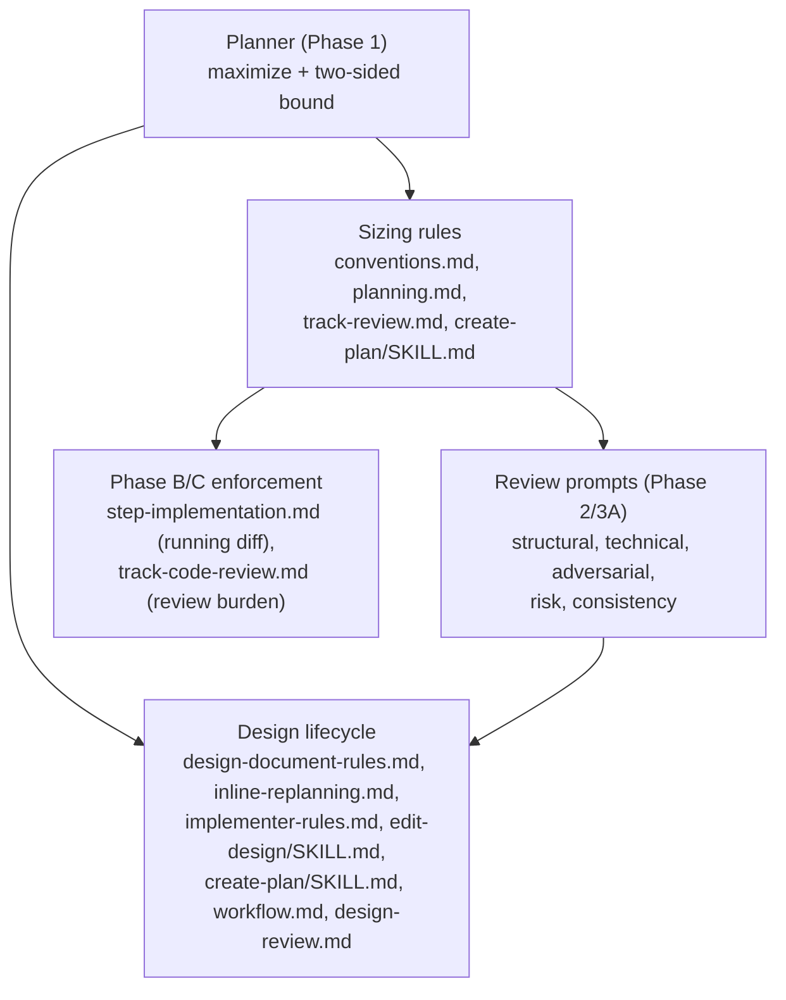

<!-- workflow-sha: 59c7dd338fc472a21ea2bd40876edb7ae96ee13b -->
# Two-sided track sizing, phase-aware enforcement, and design-first freeze

## Design Document
[design.md](design.md)

## High-level plan

### Goals

Replace the one-sided step ceiling that has never bound a track with a
two-sided footprint bound, and reframe a track as one PR in a stacked-diff
series so the planner *maximizes* delivered work per track instead of
fragmenting a feature into thin tracks that each pay the per-track review
tax. Bind each size metric to the phase where it is knowable — files
predict at plan time, lines measure during and after execution. Freeze
`design.md` after Phase 1 by removing the live mutation paths, and author it
first in its own reviewed session so the plan derives from a frozen seed.

The change addresses YTDB-1060 (Threads 1-4). It is its own first test case:
the plan is decomposed by the new maximize directive (applied by hand, since
the rules are not yet live) and the result is the first calibration data
point for the threshold open questions.

### Constraints

- This plan is workflow-modifying: it edits .claude/workflow/** or .claude/skills/**.
- **Bootstrap.** The rules this plan introduces are not live during its own
  authoring. The plan is written under the current design-last `create-plan`
  flow, and the maximize / floor / ceiling rules are applied by hand. The
  merged result is the first plan the live rules govern.
- **Staging.** Every target file is workflow machinery, so edits route to
  `_workflow/staged-workflow/.claude/...`; the live tree stays at develop's
  state through Phase B/C; one Phase 4 promotion commit copies staged over
  live. Promotion is additive-only — this plan has no whole-file deletions.
- **Develop moves under us.** The sizing files were rewritten by
  `step-size-recap` (YTDB-1062/1068) and `step-size-jsutification` (YTDB-1075)
  and may move further; the Phase 4 pre-promotion divergence check halts if
  the branch is behind, resolved by a rebase before promotion.
- **Threshold values are provisional** review-capacity estimates
  (~12 / ~20-25 / ~40 files; ~2,000 / ~4,000 lines), recalibrated via the
  Phase C overblown-recording rather than pinned now.

### Architecture Notes

#### Component Map

- **Sizing rules** — retire the "~5-7 steps" metric; add the stacked-diff
  track definition, the maximize directive, and the file-based floor +
  footprint ceiling. `conventions.md` glossary + §1.2; `planning.md`
  §Track descriptions; `track-review.md` §Step Decomposition;
  `create-plan/SKILL.md` Step 4.
- **Review prompts** — five prompts carry the retired metric and enforce it
  on reviewers; move each to the two-sided cap and add a sync-list anchor.
  `adversarial-review.md` also gains the design-scoped role/phase (Thread 4).
- **Phase B/C enforcement** — the running diff-stat early-warning in the
  Phase B step loop; the review-burden line check in Phase C code review.
- **Design lifecycle** — freeze `design.md` (remove the live mutation
  paths, route replan intent to Decision Records + track narrative) and
  reorder `create-plan` to author the design first, with the
  adversarial-then-cold-read ordering in the `edit-design` loop.

#### D1: A track is one PR in a stacked-diff series
- **Alternatives considered**: keep the "coherent stream, max ~5-7 steps"
  definition (status quo — mining 42 tracks shows it never bound anything,
  max was 5 steps); a bare footprint metric with no autonomy framing.
- **Rationale**: the stacked-diff framing gives both bounds operational
  meaning — a track builds on prior tracks, stands alone, is independently
  reviewable and mergeable, and carries as much of the feature as one
  reviewable diff holds. The routine changes (maximize); the concept is
  sharpened, not weakened.
- **Risks/Caveats**: "PR" is a conceptual frame, not a git-enforced unit;
  reviewers apply judgment on autonomy.
- **Implemented in**: Track 1
- **Full design**: design.md §"Track sizing"

#### D2: Maximize — bundle to the ceiling, relatedness-agnostic
- **Alternatives considered**: cut at the first logical seam (the status quo
  bias — would emit four thin tracks here); bundle only units sharing a
  dependency seam or subsystem (tighter, thematically coherent).
- **Rationale**: minimize the number of expensive track cycles subject to the
  ceiling and inter-track mergeability. Thematic coherence is not a
  reviewability constraint — two unrelated autonomous changes stay autonomous
  in one track and carry no interaction, so combined review costs no more.
- **Risks/Caveats**: raises average Phase C burden per track; the ceiling and
  the Phase B running-diff are the counterweights. A track's PR may span
  unrelated concerns and a mid-track blocker holds the bundle (per-step
  commits still land).
- **Implemented in**: Track 1
- **Full design**: design.md §"Track sizing"

#### D3: Two-sided soft bound, argumentation-gated, flag-only
- **Alternatives considered**: hard gate on the ceiling (fights maximize and
  the autonomous Phase 2; escalates on every large track); pure record-only
  (repeats "never bound anything"); step-based or same-area floor (dissolves
  under the files-vs-steps split); floor auto-merge (a track merge fails the
  `mechanical` test).
- **Rationale**: Phase 2's classifier is binary (`mechanical` |
  `design-decision`), so the gate keys on the *presence of argumentation*,
  not the count. A documented out-of-bounds track passes autonomously; an
  undocumented one escalates. Floor ≤~12 files; ceiling split-candidate
  >~20-25, overblown >~40; argumentation two-sided (under-target and
  over-ceiling).
- **Risks/Caveats**: thresholds are estimates (calibrated via Phase C
  overblown-recording); the merge a flagged floor implies is performed by the
  planner, never a tool.
- **Implemented in**: Track 1
- **Full design**: design.md §"Track sizing"

#### D4: Phase-aware enforcement — files predict, lines measure
- **Alternatives considered**: a single plan-time cap stated in lines —
  impossible, the code does not exist at plan time.
- **Rationale**: bind each metric to the phase where it is knowable. Phase
  1/A predicts with steps + in-scope files; Phase B reads a running
  `git diff base..HEAD --stat` early-warning; Phase C measures review burden
  (>~2,000 lines page the diff, >~4,000 record overblown; total +/-, exclude
  generated, keep test).
- **Risks/Caveats**: the Phase B early-warning is orchestrator judgment, not
  a hard stop; thresholds are estimates.
- **Implemented in**: Track 1
- **Full design**: design.md §"Phase-aware enforcement"

#### D5: Update all 12 sizing-rule occurrences and add a sync-list
- **Alternatives considered**: update only the 4 occurrences the issue listed
  (leaves five review prompts enforcing the retired metric on reviewers);
  leave the rule duplicated with no sync anchor (it drifts).
- **Rationale**: the `structural` (×3 spots), `technical`, `adversarial`,
  `risk`, and `consistency` prompts all carry "~5-7 steps"; unupdated, Phase
  2/3A reviewers would flag tracks by a retired metric and the structural
  finding template would contradict the new cap. A sync-list comment anchors
  the full set against future drift.
- **Risks/Caveats**: the sync-list is a convention, not mechanically enforced.
- **Implemented in**: Track 1
- **Full design**: design.md §"Sync surface and staging"

#### D6: Freeze design.md after Phase 1
- **Alternatives considered**: keep `design.md` mutable during execution (the
  status quo, which self-contradicts — `design-document-rules.md:128` lists
  inline replanning as a mutation trigger in its §Mutation discipline
  enumeration, while Rule 15 in §Rules states `design.md` is "never modified
  after planning").
- **Rationale**: the plan's Decision Records are already the de-facto source
  of truth during execution and no Phase 3 reviewer receives `design.md`.
  Route replan design intent into the Decision Records and the track
  narrative; Phase 4 stays the single reconciliation point. Removing the
  mutation drops the `edit-design` cold-read fan-out from the replan path.
- **Risks/Caveats**: a revised DR's `Full design:` link may point at a
  superseded section — handled procedurally (drop / re-target / caveat); the
  semantic-staleness lint is deferred to YTDB-1079.
- **Implemented in**: Track 1
- **Full design**: design.md §"Design freeze"

#### D7: Author design.md first, in its own reviewed session
- **Alternatives considered**: author the design last in one planning session
  (the status quo — the design back-fills decisions the plan already
  crystallized).
- **Rationale**: the plan should derive from a frozen, reviewed seed. The
  design is authored via `edit-design` in a dedicated session that ends when
  its review passes; `/create-plan` auto-resumes plan derivation when
  `design.md` exists and `implementation-plan.md` does not. The review runs
  adversarial first (does it hold against the real code), then cold-read (can
  a fresh reader build a model) — cold-read should not assess a design the
  adversarial pass may still change.
- **Risks/Caveats**: overlaps YTDB-975 — implemented here, 975 corrected on a
  separate branch (not built twice). Not live during this plan's own
  authoring.
- **Implemented in**: Track 1
- **Full design**: design.md §"Design-first authoring"

#### Non-Goals
- A semantic-staleness lint for `Full design:` links — deferred to YTDB-1079.
- Re-implementing the design-first reorder inside YTDB-975 — corrected on a
  separate branch after this lands.
- Pinning final threshold values — the current numbers are provisional and
  recalibrated via the Phase C overblown-recording.
- Hard-gate or mechanical enforcement of the ceiling — the bound is
  argumentation-gated only.

## Checklist
- [ ] Track 1: Two-sided sizing, phase-aware enforcement, design freeze, and design-first authoring
  > Land all four YTDB-1060 threads as one stacked-diff PR. The threads share
  > files heavily (the sizing files, the design-doc files, the review
  > prompts), and applying the maximize directive by hand puts the ~17-file
  > change under the soft ceiling with no autonomy break, so it is one track,
  > not four. Detailed description in plan/track-1.md.
  > **Scope:** ~17 files covering the sizing rules (conventions, planning, track-review, create-plan), the five review prompts, Phase B/C enforcement (step-implementation, track-code-review), and the design lifecycle (design-document-rules, inline-replanning, implementer-rules, edit-design, workflow, design-review)

## Plan Review
- [x] Plan review (consistency + structural) — passed at iteration 1

**Auto-fixed (mechanical)**: CR1 — replaced the false "four lines from Rule 15" proximity claim (in `implementation-plan.md` D6 Alternatives, `track-1.md` §Context and Orientation, and `design.md` §"Design freeze") with an accurate description: the mutation trigger sits in `design-document-rules.md` §Mutation discipline (`:128`) and Rule 15's freeze sits in §Rules (`:862`), ~734 lines apart. The self-contradiction the freeze closes is unchanged. `design.md` fix routed through `edit-design` (mutation 1, content-edit, PASS).

**Escalated (design decisions)**: none.

## Final Artifacts
- [ ] Phase 4: Final artifacts (`design-final.md`, `adr.md`)
