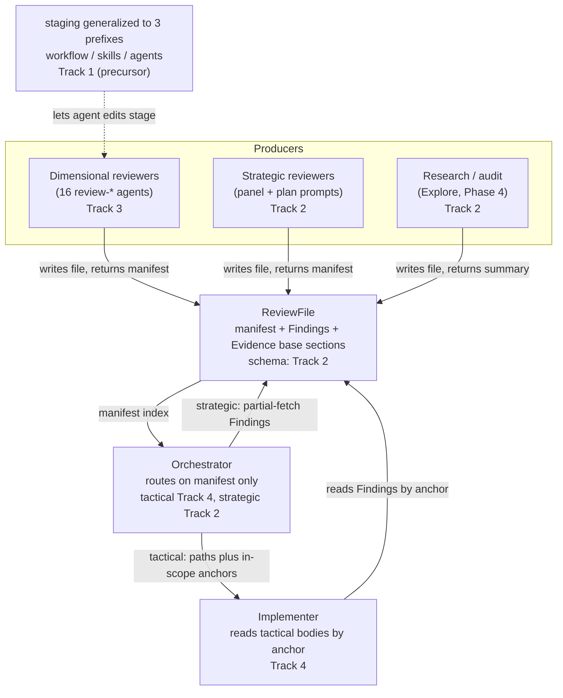

<!-- workflow-sha: eb984cba63bd557fb3c2b32156d85bf1a72e82b4 -->
# Persist bulk sub-agent outputs; route tactical findings to the implementer

## Design Document
[design.md](design.md)

## High-level plan

### Goals

Cut the orchestrator's resident context from review fan-outs so a body-heavy
review session stops crossing the 40% `warning` gate and triggering the
teardown that reloads the whole resident context as cache-create tokens
(estimated ~120-180K for a body-heavy session). The steady-state carry is
cheap; the restart it provokes is the cost this plan removes.

The mechanism: every bulk-producing review sub-agent writes its structured
output to a file at a spawn-supplied path and returns only a thin manifest.
Routing then splits by who consumes the finding bodies. **Tactical** code-fix
fan-outs (Phase B `risk:high` step review, Phase C track review, gate-checks)
keep every body off the orchestrator — it routes on manifest metadata and
hands in-scope anchors to the per-iteration implementer, which reads bodies,
fixes at the code level, and escalates only design calls. **Strategic**
reviews (Phase A panel, Phase 2 plan review, gate-verifications) keep the
orchestrator's partial-fetch, because the consumer is the planner, not an
implementer. **Research/audit** sub-agents write a file and return a summary
the orchestrator pulls on demand.

### Constraints

This plan is workflow-modifying: it edits .claude/workflow/** or .claude/skills/**.

- The marker sentence above is the **current develop-state two-prefix literal**,
  copied verbatim so the live implementer enforcement gate recognizes the plan
  from the first step. The marker is a boolean trigger (§1.7(c)/(e)); the staged
  path-prefix set lives in §1.7(a)/(d)/(e), which Track 1 extends to a third
  prefix. The plan also edits `.claude/agents/**` (Track 3); those edits stage
  only after Track 1 lands the three-prefix rule and the implementer reads it
  via §1.7(d) reads-precedence. See D7 for the marker-bootstrap mechanic.
- **No runtime dogfooding.** The branch runs develop-state machinery end to
  end; every workflow-machinery edit accumulates in the staged mirror and flips
  on together at the single Phase 4 promotion commit (D7). There is nothing
  half-flipped to corrupt a Phase C on the authoring branch, so the plan needs
  no mid-branch self-adoption of the new routing or schema.
- **Shared agents must not break standalone callers.** The `review-*` agents
  serve the workflow fan-out plus the standalone `/code-review` and
  `/fix-ci-failure` skills, which read findings inline. Output is conditional on
  a supplied path (D6); the no-path branch stays byte-for-byte today's inline
  format.
- House style applies to every Markdown surface and the PR/commit prose
  (`conventions.md §1.5`).

### Architecture Notes

#### Component Map

The plan touches three actors and one new artifact, over a branch-mechanics
layer that lets agent edits stage like every other workflow file.

- **Dimensional reviewers** (Track 3): the 16 `review-*` agents gain
  path-conditional file+manifest output, self-assign `<PREFIX><n>` IDs, and
  write a Phase-4 refutation trail to `## Evidence base`. The 4 pure-standalone
  agents carry an `exempt because…` annotation.
- **ReviewFile + strategic/research producers** (Track 2): the
  manifest-plus-sections schema, its canonical home in `conventions-execution.md`,
  the lifecycle (committed at reviewer-return, swept by Phase 4 cleanup), and the
  strategic + research producers that write files the orchestrator partial-fetches.
- **Orchestrator** (Track 4 tactical / Track 2 strategic): for tactical reviews
  it buckets on the manifest index and never ingests a body; for strategic it
  keeps its own partial-fetch read.
- **Implementer** (Track 4): the one actor that reads tactical bodies, addressed
  by anchor; reconciles cross-dimension framings at the code level.
- **§1.7 staging** (Track 1): generalized to a third prefix so agent-definition
  edits route to the staged mirror and promote with the rest.

#### D1: Router model for tactical reviews
- **Alternatives considered**: orchestrator partial-fetches tactical bodies from
  disk itself (the interim optimization); keep inline synthesis (status quo).
- **Rationale**: a disk partial-fetch still lands bodies in the long-lived
  orchestrator context and still crosses the warning gate, removing none of the
  restart-reload cost. Only routing the body-read to the short-lived implementer
  drops the footprint.
- **Risks/Caveats**: more cross-dimension reconciliation reasoning per `loc` in
  the implementer; accepted because that context is discarded after the fix.
- **Implemented in**: Track 4
- **Full design**: design.md §"Routing by consumer: tactical, strategic, research"

#### D2: Manifest-plus-sections file schema + thin return
- **Alternatives considered**: keep the inline return (status quo); a structured
  return without a file (no resume benefit).
- **Rationale**: the manifest header over anchored body sections is the enabling
  primitive; persisting it to disk is what makes a mid-review `/clear` resume
  from files instead of re-spawning the panel. The thin return echoes the
  manifest verbatim.
- **Risks/Caveats**: manifest parse-stability — mitigated by reusing the
  workflow-sha HTML-comment idiom.
- **Implemented in**: Track 2
- **Full design**: design.md §"The file schema: manifest, anchors, and validation"

#### D3: Anchored partial-fetch addressing + count validation
- **Alternatives considered**: line-offset addressing.
- **Rationale**: stable heading anchors (`^### BC1 `) survive format drift where
  line offsets break; an ID-anchored grep (`^### [A-Z]+[0-9]+ `) validates the
  manifest count before any body read, so validation reads heading lines only.
- **Risks/Caveats**: none material; line offsets stay an optional fast-path hint.
  A bare `^### ` count would over-count non-finding headings, so under
  `## Findings` the `### <ID> ` shape is reserved for finding anchors.
- **Implemented in**: Track 2
- **Full design**: design.md §"The file schema: manifest, anchors, and validation"

#### D4: Severity trust + upgrade-only `basis` backstop
- **Alternatives considered**: full trust dropping the OVERRIDE both ways (no
  under-severance backstop); tighten reviewer prompts only; pull the body on
  doubt (reintroduces body reads); a sev-only manifest (no drill signal).
- **Rationale**: a dropped downgrade is the cheaper direction (a nit routes
  in-scope, the implementer fixes it, nothing ships broken) while a missed
  upgrade ships a real bug, so a one-line `basis` per index entry is the minimum
  manifest signal that makes a one-directional upgrade check possible.
- **Risks/Caveats**: a finding whose `basis` and label both under-describe the
  impact is missed (same blind spot the body would also mislead on).
- **Implemented in**: Track 4
- **Full design**: design.md §"Severity: trust with an upgrade-only backstop"

#### D5: Per-dimension IDs are the sole addressing; `M<n>` removed
- **Alternatives considered**: keep the synthesis `M<n>` merge layer.
- **Rationale**: removing the merge step deletes the `M<n>`-to-dimension un-map
  and its audit-trail tracking; ID assignment moves to the reviewer, which
  self-assigns `<PREFIX><n>` and continues from the per-dimension high-water-mark
  the orchestrator already hands back at gate-check.
- **Risks/Caveats**: none material; `commit-conventions.md` already speaks
  per-dimension. The `id` prefix is load-bearing twice (dimension proxy for
  bucketing + Review-mode override match) and must never be renumbered.
- **Implemented in**: Track 3 (reviewer self-assign) + Track 4 (orchestrator removal)
- **Full design**: design.md §"Finding addressing without synthesis"

#### D6: Path-conditional agent output
- **Alternatives considered**: unconditional file output (breaks the standalone
  `/code-review` and `/fix-ci-failure`, which read inline); teach those skills to
  supply paths and read files (a scope balloon into two skills).
- **Rationale**: write file-plus-manifest only when handed an output path, so
  only the workflow caller switches behavior and a live agent-definition edit
  stays safe against the develop-state run. The workflow injects the path at the
  Phase C / Phase B dispatch sites, not `review-agent-selection.md`.
- **Risks/Caveats**: none material.
- **Implemented in**: Track 3
- **Full design**: design.md §"Path-conditional output and shared consumers"

#### D7: Staging generalized to three prefixes (`.claude/agents/` added)
- **Alternatives considered**: leave agents unstaged (agent edits land live
  mid-branch, I6 holds only partially); path-conditional output alone with no
  staging (keeps the run safe but loses I6 and the property that an agent-only
  develop commit registers as a workflow-format change for drift).
- **Rationale**: uniform treatment of all workflow machinery, activating at the
  Phase 4 promotion. **Marker bootstrap**: the plan carries the develop-state
  two-prefix marker verbatim so the live gate matches during Track 1; the marker
  is a boolean trigger, so Track 1's matcher change is made **prefix-agnostic**
  (match `This plan is workflow-modifying:` regardless of the trailing prefix
  list). That keeps both the live gate (Track 1) and the post-Track-1 staged gate
  (Track 3) matching the plan's marker, while §1.7(e) path-mapping (extended to
  `.claude/agents/`) is what routes agent edits to staging via reads-precedence.
- **Risks/Caveats**: the marker-sentence literal is matched by multiple consumers
  and is the highest-care edit; cross-branch drift churn (an agent-only develop
  commit now triggers a migration prompt for in-flight branches) is accepted as
  correct.
- **Implemented in**: Track 1 (precursor — lands first)
- **Full design**: design.md §"Staging generalized to three prefixes"

#### D8: Dimensional evidence trail in `## Evidence base`
- **Alternatives considered**: internal-only refutation (unverifiable); drop the
  guard.
- **Rationale**: writing the Phase-4 refutation reasoning to disk makes the
  false-positive guard verifiable after the fact, reuses YTDB-1069's roster
  rendering (survived claims one line, refuted claims in full), and is read only
  on a contested-finding drill-down, so it never enters a long-lived context.
- **Risks/Caveats**: ~1.4K net-new tokens per reviewer (~3% of review cost), with
  an `exempt because…` hatch where it does not pay.
- **Implemented in**: Track 3
- **Full design**: design.md §"The dimensional evidence trail"

#### D9: Pure-standalone review agents exempt
- **Alternatives considered**: subject the standalone agents to the rule.
- **Rationale**: `code-reviewer`, `pr-reviewer`, `test-quality-reviewer`, and
  `dr-audit` are invoked standalone with output consumed by the user in the same
  turn, never accumulated in an orchestrator session, so the restart-reload
  motivation does not apply; each carries an explicit `exempt because…` annotation.
- **Risks/Caveats**: none material.
- **Implemented in**: Track 3
- **Full design**: design.md §"Coverage and exemptions"

#### D10: Review files committed at reviewer-return
- **Alternatives considered**: write files without committing them at return.
- **Rationale**: committing (not merely writing) at return is the resume
  precondition — a crash before the commit would lose the files and force the
  re-spawn the design avoids. Files are plan-directory artifacts (never staged),
  live in `_workflow/plan/track-N/reviews/`, and are swept by the Phase 4 cleanup.
- **Risks/Caveats**: the `plan/track-N.md` file and the `plan/track-N/` directory
  coexist, so the `conventions-execution.md §2.1` lifecycle must not glob `plan/*`
  expecting files only (the `plan/track-N/reviews/` vs `plan/track-N-reviews/`
  shape — A10 — is revisited at Track 2 Phase A).
- **Implemented in**: Track 2
- **Full design**: design.md §"Lifecycle, persistence, and resume"

### Invariants

- **S1 (no-bodies):** the orchestrator never retains a tactical finding body in
  steady-state context; the one bounded exception is a single contested-finding
  block pulled transiently on drill-down and dropped before the next teardown.
  Verifiable post-hoc against the committed review files (the orchestrator's
  routing reads the manifest index, never `## Findings`).
- **S2 (id stability):** the per-reviewer `id` prefix is preserved end to end and
  never renumbered (it is the bucketing dimension proxy and the Review-mode
  override match key).
- **S3 (regression unmerged):** REGRESSION-flagged rows are excluded from
  `loc`-collapse and reach the implementer unmerged with `revert-or-repair`
  guidance.
- **S4 (count validation):** the manifest `findings` count must equal the
  ID-anchored grep count (`grep -cE '^### [A-Z]+[0-9]+ '`), else
  `CONTRACT_VIOLATION` and a whole-section fallback owned by the routing class.
  Mechanical-testable.
- **S5 (coverage):** every bulk-producing sub-agent class follows the
  file-plus-manifest rule or carries an explicit `exempt because…` annotation.
- **S6 (heading-only validation):** validation reads heading lines only, never a
  finding body. Mechanical-testable alongside S4.

### Non-Goals

- Teaching `/code-review` or `/fix-ci-failure` to supply paths and read files
  (out of this issue's scope — the no-path inline branch covers them).
- Changing `commit-conventions.md` (review files commit as an existing
  Workflow-update commit; the recipe already speaks per-dimension).
- Mid-branch runtime adoption of the new routing/schema (the feature flips at
  Phase 4 promotion; the branch runs develop-state machinery).
- Folding cross-plan drift or re-partitioning the staged-mirror layout beyond the
  third prefix.

## Checklist
- [x] Track 1: Generalize §1.7 staging to a third prefix (`.claude/agents/`)
  > Precursor. Extends the staging convention so agent-definition edits route to
  > the staged mirror, stay at develop-state on the live tree until Phase 4, and
  > promote with the rest. Highest-care edit: the workflow-modifying marker
  > matcher, made prefix-agnostic so the plan's two-prefix Constraints marker
  > matches both the live gate during this track and the staged gate after it
  > (D7). Lands first because every later track that edits `.claude/agents/`
  > depends on this rule self-applying via §1.7(d) reads-precedence.
  >
  > **Track episode:**
  > Generalized §1.7 staging and the §1.6 stamp/drift scheme to a third prefix
  > (`.claude/agents/`), with the §1.7(b) marker matcher made prefix-agnostic
  > (match the stable prefix `This plan is workflow-modifying:`) so the plan
  > keeps its develop-state two-prefix marker while the staged definition names
  > three prefixes (D7 bootstrap). The reindex staged-agent scope split routes a
  > staged agent into the rules-6/7-only validation gate so the now-live
  > staged-agents glob validates it like a live agent instead of over-firing
  > rules {2,4,8}. Downstream guarantee for Track 3: the three-prefix rule and
  > the reindex routing are in the staged mirror, so Track 3's agent edits stage
  > via §1.7(d) reads-precedence and validate correctly. Discovered that
  > `.claude/scripts/` is not stageable (§1.7(a)), so the precheck and reindex
  > scripts and their tests are edited live, which is safe because
  > `WORKFLOW_PATHSPECS` excludes `.claude/scripts/` (no drift). Phase C fixed a
  > deferred two-prefix residue in the migrate-workflow §4.1 delegation heuristic
  > and stale drift-narration in the precheck tests; no Decision Records changed.
  >
  > **Track file:** `plan/track-1.md` (5 steps, 0 failed)
  >
  > **Strategy refresh:** CONTINUE — Track 1's only Track-2-relevant discovery
  > (`.claude/scripts/` is not stageable, §1.7(a)) is already reflected in Track 2's
  > in-scope list, so its `.claude/scripts/tests/` count-validation test edits the
  > live tree. No downstream plan impact.

- [x] Track 2: Manifest-plus-sections schema, persistence/lifecycle, and the coverage invariant
  > Defines the contract every bulk producer writes: the manifest header over
  > anchored body sections, anchored partial-fetch addressing, the ID-anchored
  > count-validation grep, and its canonical home in a new
  > `conventions-execution.md` subsection. Adds the lifecycle (review files
  > written+committed at reviewer-return under `_workflow/plan/track-N/reviews/`,
  > swept by Phase 4 cleanup; the §2.1 glob caution, A10), states the coverage
  > invariant once, and lands the schema's strategic + research applications
  > (panel/plan-review prompts and Explore/Phase-4 audits write files the
  > orchestrator partial-fetches). Packs the strategic side with the contract to
  > clear the merge floor — a schema-only track (~9 files) would fold into a
  > neighbor.
  >
  > **Track episode:**
  > Built the shared review-file schema in `conventions-execution.md §2.5` — the
  > manifest header over `## Findings` / `## Evidence base` anchored bodies, the
  > `### <PREFIX><N>` namespace, the S4/S6 count-validation grep
  > `grep -cE '^### [A-Z]+[0-9]+ '`, the `CONTRACT_VIOLATION` whole-section fallback,
  > the mandatory `id`/`sev`/`anchor` vs downstream `loc`/`cert`/`basis` field split,
  > and the verdict-producer variant. Added the review-file lifecycle as `§2.1` prose
  > (committed-at-return under `plan/track-N/reviews/`, swept by the existing recursive
  > `git rm -r _workflow/` with no new glob) and stated the S5 coverage invariant as a
  > documented contract, not a mechanical gate this track. Taught the bulk producers
  > (Phase A panel, Phase 2 plan-review, the three gate-verifications, `research.md`,
  > `design-review.md`, and `edit-design §Step 4` gated on `phase4-creation`) to write
  > file+manifest when handed a path, then injected that path at the strategic dispatch
  > sites (`track-review.md §Inputs`, `implementation-review.md`) — the orchestrator-side
  > caller the producers' write branch had lacked. Step 4 (the dispatch injection) was
  > added by inline replan at DL7 once step 2 surfaced the missing caller; S1 (strategic
  > reviews keep the orchestrator's partial-fetch) is unchanged.
  >
  > Cross-track: Tracks 3 and 4 build on `§2.5`, now staged and reindex-clean. Phase C
  > reconciled the `reviewer-panel` phantom role toward the three concrete panel roles
  > (`reviewer-technical`/`reviewer-risk`/`reviewer-adversarial`) — Track 4 must reference
  > those, not reintroduce `reviewer-panel`. The per-fan-out-unique review-file naming
  > (`<type>-iter<N>.md`, and `<review_type>-gate-verification-iter<N>.md` after the Phase C
  > fix) is the convention Track 4's tactical dispatch sites should reuse. `.claude/scripts/`
  > is not stageable (`§1.7(a)`), so the S4/S6 test edits the live tree. Phase C passed at
  > iteration 1 (6 workflow dimensions, 9 findings → one `Review fix:`, gate PASS, 0 new).
  >
  > **Track file:** `plan/track-2.md` (4 steps, 0 failed)
  >
  > **Strategy refresh:** CONTINUE — Tracks 1 and 2 delivered Track 3's hard
  > dependencies (stageable `.claude/agents/`, the §2.5 review-file schema) as
  > planned; no Track 2 episode contradicts Track 3 and D5/D6/D8/D9 stay intact.
  > Carry the closed 15-value role enum and the three concrete panel roles
  > (`reviewer-technical`/`reviewer-risk`/`reviewer-adversarial`) into decomposition.

- [x] Track 3: Dimensional reviewers emit file+manifest with IDs and an evidence trail
  > The 16 `review-*` dimensional agents gain path-conditional file+manifest
  > output (inline when no path, byte-for-byte today's format), self-assign
  > `<PREFIX><n>` IDs writing one `### <PREFIX><n>` anchored body per finding, and
  > write their Phase-4 refutation reasoning to `## Evidence base`. The 4
  > pure-standalone agents (`code-reviewer`, `pr-reviewer`,
  > `test-quality-reviewer`, `dr-audit`) carry the `exempt because…` annotation.
  > A uniform edit pattern applied across the dimensional set.
  >
  > **Track episode:**
  > All 16 dimensional `review-*` agents now carry a path-conditional
  > `## Output routing` section: handed an output path they write the §2.5
  > file+manifest with `### <PREFIX><n>` anchors and return only the manifest; with
  > no path they return their existing inline format byte-for-byte, so `/code-review`
  > and `/fix-ci-failure` are untouched. The work split into two edit templates (DL1,
  > not the planned single uniform edit, because the two agent families start from
  > different inline formats): template A for the 10 code/test agents (a leading
  > guard before the inline Output Format) and template B for the 6 workflow agents
  > (the guard plus the inline `**<PREFIX><N>**` → `### <PREFIX><n>` migration on the
  > file branch). The 4 standalone agents got the one-line `exempt because…`
  > annotation (D9/S5). Three steps: canary `review-bugs-concurrency` (high),
  > template-A bulk + 4 standalone exemptions (medium), template-B migration (high).
  >
  > Key discovery — ORCH-1: the canary's `cert`→`#### C<n>` cross-link contradicts
  > the evidence-trail-exempt clause's empty `## Evidence base`; reconciled to
  > `cert: n/a` for the 2 exempt code/test dims (CQ, TS) and carried to step 3's 4
  > exempt workflow dims. The fixed evidence-base map for Track 4's routing: 10
  > cert-writing dims, 6 evidence-trail-exempt with `certs: 0`.
  >
  > Phase C passed at iteration 1: workflow-only diff (baseline skipped); 5
  > workflow-review agents fired (consistency, context-budget, prompt-design,
  > instruction-completeness, writing-style; hook-safety did not, since no
  > hooks/scripts/settings were touched). 0 blockers and 3 should-fix landed in one
  > `Review fix:` (`3b6fe0de9b`): WC1 corrected the §2.5 S4/S6 grep-scope clause in
  > the 6 exempt agents from the inverted "## Findings anchors only" to file-wide;
  > WS1/WS2 cleared em-dash-cap violations in the 10 cert-writers' evidence-base
  > bullet. Both gate-checks PASS, 0 regressions. 5 suggestions deferred
  > (WP1/WP2/WP3/WI1/WB1), none routed to other tracks. Resume reflowed the
  > multi-line-wrapped roster to single-line shape (the precheck substate scanner had
  > masked the all-done state as steps-partial; whitespace-only).
  >
  > Cross-track: Track 4's index-bucketing tactical-routing consumer must tolerate
  > `cert: n/a` / `certs: 0` from the 6 evidence-trail-exempt dimensions (it keys off
  > `cert` for contested-finding drill-down). DL2 (whether the §2.5 `## Evidence base`
  > survived-one-line / refuted-in-full body rendering belongs in §2.5 or stays
  > stated inline per agent) is a Phase 4 design-final reconciliation candidate.
  >
  > **Track file:** `plan/track-3.md` (3 steps, 0 failed)
  >
  > **Strategy refresh:** CONTINUE — Tracks 1-3 delivered Track 4's hard
  > dependencies (the §2.5 manifest schema with `basis`/`cert` fields from Track 2,
  > the 16 reviewers self-assigning IDs and writing manifests from Track 3) as
  > planned; no episode contradicts Track 4 and D1/D4/D5 stay intact. Carry into
  > decomposition: cite the three concrete panel roles
  > (`reviewer-technical`/`reviewer-risk`/`reviewer-adversarial`), never
  > `reviewer-panel`; tolerate `cert: n/a` / `certs: 0` from the 6 evidence-trail-
  > exempt dimensions (index-bucketing keys off `cert`); reuse the `<type>-iter<N>.md`
  > review-file naming at the tactical dispatch sites.

- [x] Track 4: Orchestrator tactical routing, severity backstop, and per-dimension addressing
  > Implements route-by-consumer for the tactical class: the orchestrator buckets
  > on the manifest index alone (`loc`-collapse, REGRESSION-excluded, in-scope
  > filter), spawns the implementer with file paths + in-scope anchors, and never
  > reads a tactical body (S1). Drops the synthesis `M<n>` minting and the
  > `M<n>`-to-dimension un-map (D5), hands each dimension's high-water-mark to the
  > reviewer at spawn, and adds the upgrade-only `basis` severity backstop (D4).
  > The implementer reconciles cross-dimension framings at the code level.
  >
  > **Track episode:**
  > Built the tactical-review router model: the orchestrator buckets a code-review
  > fan-out on the manifest index alone and never reads a finding body (S1). Step 1
  > (`41ad9ff4f6`) rewrote `finding-synthesis-recipe.md` to manifest-only routing —
  > dropped the five `M<n>` coupling sites, the un-map, and the contributing-dimensions
  > audit trail; replaced the two-way OVERRIDE with the upgrade-only `basis` backstop
  > (D4); injected the per-spawn output path and per-dimension high-water-mark at the
  > `step-implementation.md` / `track-code-review.md` reviewer-fan-out dispatch sites
  > (closing Track 3's open `<PREFIX>1` fallback); reconciled `review-iteration.md`.
  > Step 2 (`751e0342e1`) flipped `implementer-rules.md` to per-dimension anchors, the
  > four-outcome `level=track` RESULT enum kept intact (A2). Step 3 (`f763bfdc4b`)
  > reconciled residual synthesis language in the `dimensional-review-gate-check.md`
  > prompt.
  >
  > Phase C (5 workflow dimensions, baseline skipped on the workflow-only diff;
  > hook-safety did not fire): 12 findings, 0 blockers, one fix iteration, gate PASS.
  > The load-bearing find (WI1/WI2): the `CONTRACT_VIOLATION` whole-section fallback
  > was specified orchestrator-side at all three dispatch sites but had no Step 5
  > handoff slot and no implementer consumer clause, so S1's malformed-manifest branch
  > (a delivered Validation criterion, A1) dead-ended on the consumer; fixed with the
  > handoff slot, the consumer clause, a budget-unit rule, and the all-violated
  > degenerate case (`23880ea192`). WP1 reframed the `loc`-collapse proximity test off
  > an S1-contradicting method-body criterion onto exact `file:line`. WB1/WB2/WB3
  > (reindex schema) and WS1/WS2 (episode em-dashes, `49c467dbeb`) closed the rest.
  > `review-workflow-consistency` confirmed the step-3 deliberate leave-it call on
  > `code-review-protocol.md` rather than re-flagging it.
  >
  > Phase 4 hand-offs: the A2 reconciliation stands. `design-final.md` must square the
  > design body's two-outcome "`SUCCESS` or `DESIGN_DECISION_NEEDED`" narrative against
  > the four-outcome `level=track` RESULT enum, and the recipe's renamed `§Step 4` /
  > `§Gate-check routing` plus the new `§Step 5` whole-section-fallback slot are new
  > cross-reference targets. Two out-of-delta items reviewers surfaced for design-final
  > reconciliation: `review-iteration.md` carries a "30% warning threshold" line
  > (CLAUDE.md says 40%) and a `file:line`-vs-`loc` terminology split against the
  > recipe — both pre-existing in verbatim-copied portions, not this track's delta.
  >
  > **Track file:** `plan/track-4.md` (3 steps, 0 failed)

## Plan Review
- [x] Plan review (consistency + structural) — passed at iteration 1

Re-validation after the Phase B inline replan that appended Track 2 step 4
(strategic dispatch path-injection) and added `implementation-review.md` to
Track 2 scope, footprint ~19 → ~20 (see track-2 DL7). Both passes found the
revised plan already consistent.

**Auto-fixed (mechanical)**: none.

**Escalated (design decisions)**: none.

Consistency review verified the two step-4 dispatch sites exist in their claimed
current form: `implementation-review.md` is the Phase 2 consistency/structural
dispatch, and `track-review.md §Inputs` feeds the Phase A panel and the
review-gate-verification a shared input set carrying no output path. It confirmed
the replan's gap diagnosis (step 2's producer write-branch had no
orchestrator-side caller, and the whole-track acceptance asserted a partial-fetch
with no implementing step) and that no numbered Decision Record is invalidated.
Structural review confirmed Track 2's ~20-file footprint sits under the ~20-25
split ceiling with its merge-floor justification intact, the scope list is
proportionate to the file count, and the plan-file entry tells the same story as
track-2.md's Plan of Work, Concrete Steps (step 4), Decision Log (DL7), and
Interfaces. Both gate verifications were no-ops this round: zero findings and
zero applied fixes leave nothing to re-check or re-scan. The known frozen-design
lag (the S4 regex `[A-Z]{2,}` and the narrower "under `## Findings`" reservation
in design.md) is intended Phase-4 reconciliation in design-final.md and was not
re-flagged.

**Prior round (pre-replan, iteration 1)**: auto-fixed CR1 (Track 1 step 4
reword: the staged-agents glob already sits in `IN_SCOPE_GLOBS`, so the edit is
the inert comment plus the `discover_agent_citing_files` docstring) and CR2
(Track 4 step 2 reword: `review-iteration.md`'s prefix table is already
per-dimension, so the work reconciles its `### Gate-check synthesis routing`
reference rather than converting an `M<n>` format); escalated S1 (the Phase 4
cold-read and `step-implementation-recovery.md` coverage, absorbed into Track 2
scope) and S2 (Track 4 footprint `~14`→`~8` with the under-floor non-fold
justification added to the track file). No regression on any of the four this
round.

## Final Artifacts
- [ ] Phase 4: Final artifacts (`design-final.md`, `adr.md`)
