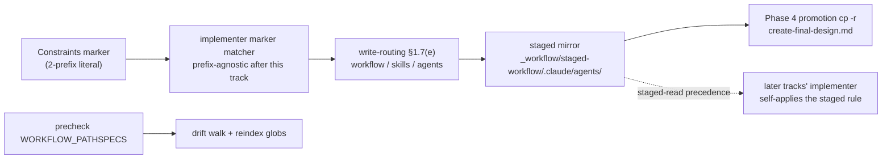

<!-- workflow-sha: eb984cba63bd557fb3c2b32156d85bf1a72e82b4 -->
# Track 1: Generalize §1.7 staging to a third prefix (`.claude/agents/`)

## Purpose / Big Picture
After this track, an edit to a `.claude/agents/**` file on a workflow-modifying
branch routes to the staged mirror, stays at develop-state on the live tree
until Phase 4, and promotes with the rest of the staged workflow machinery.

<!-- Reserved for Move 2 — ADDED/MODIFIED/REMOVED triad. Empty until Move 2 lands. -->

Precursor. Extends the §1.7 staging convention so agent-definition edits stage
like every other workflow file. Highest-care edit: the workflow-modifying
marker matcher, made prefix-agnostic so the plan's two-prefix Constraints
marker matches both the live gate during this track and the staged gate after
it (D7). Lands first because every later track that edits `.claude/agents/`
depends on this rule self-applying via §1.7(d) reads-precedence — Track 3's
agent edits cannot stage until this rule is in the staged mirror.

## Progress
- [x] Review + decomposition
- [x] Step implementation
- [ ] Track-level code review
- [ ] Track completion
- [x] 2026-06-07T12:20Z [ctx=info] Review + decomposition complete
- [x] 2026-06-07T12:40Z [ctx=safe] Step 1 complete (commit 607e1395)
- [x] 2026-06-07T12:57Z [ctx=safe] Step 2 complete (commit dcff63be); review WP1 (suggestion, no fix), §1.7(f) gap folded into step 5 (DL2)
- [x] 2026-06-07T13:15Z [ctx=info] Step 3 complete (commit f87ae2e6); hook-safety + prompt-design reviews 0 findings; .claude/scripts/ not stageable (Surprises)
- [x] 2026-06-07T13:39Z [ctx=info] Step 4 complete (commit 107e338466); hook-safety WH1 (should-fix) + WH2 (suggestion) fixed, gate-check PASS iter-2 (Review fix: 107e338466)
- [x] 2026-06-07T13:48Z [ctx=info] Step 5 complete (commit 291d5473); risk:medium, no step-level review; migrate-workflow line-482 heuristic flagged for Phase C (Surprises)
- [x] 2026-06-07T13:48Z [ctx=info] Step implementation complete (Phase B) — all 5 steps [x]
- [x] 2026-06-07T14:30Z [ctx=safe] Track-level code review iteration 1 complete (1/3 iterations)

## Surprises & Discoveries
<!-- Continuous-log. Promoted by the orchestrator from per-step "What was
discovered" when the finding affects future steps or other tracks. Empty
at Phase 1. -->

- **`.claude/scripts/` is not stageable (§1.7(a)).** The staged mirror covers only
  `.claude/workflow/`, `.claude/skills/`, `.claude/agents/`. Scripts and their
  tests are edited live, not staged. Safe on this branch because
  `WORKFLOW_PATHSPECS` excludes `.claude/scripts/`, so live script commits raise no
  drift. Affects **step 4** — `workflow-reindex.py` edit also lands live. See
  Episodes §Step 3.
- **migrate-workflow delegation heuristic left two-prefix (for Phase C).** The
  migrate-workflow §4 context-budget delegation trigger ("more than 5 files touched
  under `.claude/workflow/` or `.claude/skills/`", staged SKILL.md ~line 482) was
  left at two prefixes by step 5 — it sits outside the plan's migrate-workflow scope
  (pathspecs + classification rules) and is a tuning heuristic, not a §1.7
  routing/classification correctness gap. A large agent-only migration would not
  count toward the delegation threshold. Flagged for Phase C consistency-review to
  weigh against the track's uniform-generalization goal. See Episodes §Step 5.

## Decision Log
<!-- Continuous-log. Execution-time decisions: inline-replan choices,
scope-downs, dependency reveals, gate-override reasons. -->

<!-- Reserved for Move 1 — per-track inlined Decision Records. -->

**DL1 (Phase A, Technical review, 2026-06-07) — scope completed within D7, no
plan change.** The Technical review accepted six findings (0 blocker, 3
should-fix, 3 suggestion) that finish the §1.7 generalization's enumeration
without altering any plan Decision Record. They grow the in-scope footprint from
~16 to ~20 files; recorded here so the growth is auditable:

- **§1.6(b) stamp base (T3) is a D7 entailment, not a new decision.** D7's
  rationale already adopts "an agent-only develop commit registers as a
  workflow-format change for drift." For that to stay self-consistent, the stamp
  base (§1.6(b), copied verbatim in `conventions.md`, `create-plan/SKILL.md`,
  `edit-design/SKILL.md`) must move with the drift `WORKFLOW_PATHSPECS`.
  Otherwise an artifact created after an agent-only develop commit stamps to a
  pre-agent SHA and its drift range starts before that commit. Chose option (a),
  extend §1.6(b) to three prefixes, over option (b), soften the Validation claim.
- **Staged-read precedence caveats (T1).** Seven review/gate prompts enumerate
  the two-prefix pair in their §1.7(d) caveat; extended to three prefixes so a
  staged agent read (first arising at Track 3) resolves to the staged copy. This
  is staging plumbing, not the reviewer-side output work Tracks 2-4 own. The
  caveats land in Track 1 rather than Track 3, where they are first functionally
  needed, to keep the §1.7(d) read-precedence surface internally consistent
  across its definition (`conventions.md`) and all seven consumers within the one
  precursor track (A2). Deferring them would open a multi-track window where the
  definition names three prefixes and its consumers name two, which the
  consistency reviewer would flag mid-stack.
- **Reindex scope split (T2).** Step 4's load-bearing work is routing a staged
  agent into the rules-6/7-only applicability gate, not the comment edits: the
  dead glob auto-activates into `validate`'s eight-rule loop and would over-fire
  rules 1/2/3/4/5/8 on a staged agent. A validation-routing test covers it,
  distinct from the existing discovery-only test.
- **migrate-workflow classification (T4)** extended alongside its pathspecs so an
  agent-only commit classifies as a workflow-format change.
- **Wording fixes (T5, T6):** the marker match is prose-only, so step 6 carries
  no Python marker-matcher test; the Phase 4 `cp -r` is already prefix-agnostic,
  so step 5 extends the `git add` list and the divergence check instead.

The §1.8 TOC-protocol bootstrap line and `code-review/SKILL.md`'s triage table
were checked and ruled out of scope (read-protocol and already-lists-agents,
respectively). The adversarial review (A5) also noted that
`consistency-gate-verification.md` and `structural-gate-verification.md` lack the
§1.7(d) read-precedence caveat their review-prompt siblings carry; this is a
pre-existing develop-state asymmetry (those Phase-2 gate verifiers read
`_workflow/` plan artifacts, not staged `.claude/**` files), not a three-prefix
gap this track introduces, so it stays out of scope. Footprint ~20 sits at the
lower edge of the ~20-25 split band; kept one track because the work is a uniform
mechanical generalization plus two high-care cores, and ~10 of the files are
one-line edits.

**DL2 (Phase B, Step 2 review, 2026-06-07) — conventions.md §1.7(f) prose folded
into step 5, no new step.** Step 2's `review-workflow-prompt-design` pass surfaced
that conventions.md §1.7(f) prose (the pre-promotion divergence-check pathspec,
staged conventions.md ~line 992: "the live `.claude/workflow` and `.claude/skills`
paths") still names two prefixes. The track's §Interfaces scopes conventions.md to
§1.7(a)(b)(d)(e), omitting §1.7(f), and step 5's roster names the divergence check
in `create-final-design.md` — so no step was assigned the conventions.md §1.7(f)
prose. Left unaddressed, create-final-design.md's check would be three-prefix while
the conventions.md prose describing it stayed two-prefix (a doc/impl gap the
Phase C consistency reviewer would flag). Folded into step 5 rather than expanding
step 2 (whose plan scope is §1.7(a)(d)(e)) or opening a new step: the §1.7(f) prose
and the create-final-design.md divergence check are the same mechanism, so one
implementer edits both in lockstep. Footprint grows by one prose line; the ~20-25
band assessment is unchanged.

## Outcomes & Retrospective
<!-- Continuous-log. Review iteration outcomes and the track-completion
summary at Phase C. -->

- [x] Technical: PASS at iteration 2 (6 findings, 6 accepted). Findings completed
  the §1.7 generalization's enumeration within D7 (no plan change): §1.6(b) stamp
  base (T3, D7 entailment), 7 review/gate read-precedence caveats (T1), reindex
  staged-agent scope split (T2), migrate-workflow classification (T4), plus two
  wording fixes (T5 prose-only marker match, T6 cp-r already prefix-agnostic).
  Footprint ~16 → ~20 files; see DL1.
- [x] Risk: PASS at iteration 1 (1 finding, 1 accepted). Zero blockers. R1
  (suggestion) made the step-2/step-4 co-requisite and its cross-track guarantee
  (Track 3 waits for the reindex fix) explicit in the Ordering constraint. Risk
  validated that extending §1.6(b) is benign on this branch (the latest
  agent-touching develop commit predates the stamp base, so future stamps are
  unchanged) and that the script CI gate is `--check` correctness, not line
  coverage, so the prose-only marker matcher is not a coverage gap.
- [x] Adversarial: PASS at iteration 1 (5 findings, 0 blockers; A2/A4/A5 applied
  as clarifications, A1/A3 validated the design with no change). All four
  challenges survive: A1 confirmed the §1.6(b) extension is a genuine D7
  entailment (not over-reach), A3 confirmed prefix-agnostic matching is correct
  (editing the plan marker would deactivate the live develop-state gate for the
  authoring plan), I6 holds for the third prefix. A2 added the Track-1-over-Track-3
  rationale; A4 flagged the pre-commit gate refused-path set as a distinct I6
  enforcement site; A5 recorded the gate-verification caveat asymmetry as a
  checked out-of-scope pre-existing item.

## Context and Orientation

§1.7 today governs two stageable prefixes only: `.claude/workflow/**` and
`.claude/skills/**`. The convention's single source of truth is
`conventions.md §1.7`, with the prefix pair hardcoded across many consumers.
The job of this track is to add `.claude/agents/` as a third prefix everywhere
the pair appears, and to make the marker matcher prefix-agnostic so the
bootstrap holds (see Plan of Work).

Concrete state of the consumers at track start:

- **`conventions.md`** — §1.6(b) `WORKFLOW_SHA` stamp-base computation
  (`git log -1 ... -- .claude/workflow .claude/skills`, line 579) names the
  pair; §1.6(h) deliberately omits `staged-workflow/` from the stamp walk and
  explains the pair; §1.7(a) staged-subtree path layout names the two prefixes;
  §1.7(b) defines the canonical marker literal
  (`This plan is workflow-modifying: it edits .claude/workflow/** or .claude/skills/**.`);
  §1.7(d) reads-precedence and §1.7(e) write-routing both enumerate the pair.
  Each clause must extend to three prefixes.
- **`create-plan/SKILL.md` and `edit-design/SKILL.md`** — copy the §1.6(b)
  `WORKFLOW_SHA` stamp-base line verbatim (create-plan line 370; edit-design
  lines 220 and 286). The stamp base must move in lockstep with the drift
  pathspec so D7's "agent-only commit registers as a workflow-format change"
  property stays self-consistent (see Plan of Work step 3).
- **`implementer-rules.md`** — the path-mapping write-routing rule, the marker
  matcher that activates the gate, and the pre-commit gate that refuses live
  `.claude/workflow/**`/`.claude/skills/**` writes outside the Phase 4 promotion.
  The marker literal is matched in only two files (here and §1.7(b)); the
  review/gate prompts below detect the marker descriptively, not by literal
  prefix-list match, so they need no matcher edit.
- **Seven review/gate prompts** — `technical-review.md`, `risk-review.md`,
  `adversarial-review.md`, `consistency-review.md`, `structural-review.md`,
  `review-gate-verification.md`, `dimensional-review-gate-check.md` each carry a
  **staged-read precedence caveat** enumerating "`.claude/workflow/**` or
  `.claude/skills/**`" (one line each). A reviewer resolves a staged file read
  through §1.7(d); once agents are stageable, the caveat must name the third
  prefix or a staged agent read falls through to the live develop-state copy
  (the phantom-mismatch §1.7(d) prevents). `track-code-review.md` /
  `step-implementation.md` carry a prefix-agnostic delta glob
  (`staged-workflow/.claude/*`), not this caveat, so they need no edit.
- **`workflow-startup-precheck.sh`** — `WORKFLOW_PATHSPECS=".claude/workflow/ .claude/skills/"`
  (line 273) drives the drift walk; the comment at line 268 describes the
  two-prefix staged layout.
- **`workflow-reindex.py`** — already carries an **inert/dead** staged-agents
  glob (`docs/adr/*/_workflow/staged-workflow/.claude/agents/**/*.md`, line 155)
  documented as never-matching because agents are modified live today (lines
  144-155). It routes live agent files through the rules-6/7-only
  `discover_agent_citing_files` scope, never `IN_SCOPE_GLOBS`. `validate` runs
  all eight rules on every `parsed_files` member (~2274-2284) but only rules 6/7
  on `parsed_agent_files` (~2289-2293). Once agents are stageable, the dead glob
  goes live, so `discover_in_scope_files` returns a staged agent into
  `parsed_files` and the eight-rule loop over-fires rules 1/2/3/4/5/8 on it (no
  stamp, no TOC, no annotations, no in-file refs). A staged agent must be routed
  into the rules-6/7-only gate instead, validating like a live agent.
- **`create-final-design.md`** — the Phase 4 promotion `git add` path list (line
  368) and the §1.7(f) pre-promotion divergence-check `git log` pathspec (line
  361) name the pair. The `cp -r "$STAGED_DIR/.claude/." .claude/` (line 367)
  copies the whole subtree and is already prefix-agnostic.
- **`workflow-drift-check.md`** — the pathspec defensive comment naming the pair.
- **`workflow.md` §Final Artifacts** and **`step-implementation.md`** — staging
  references that name the pair.
- **`migrate-workflow/SKILL.md`** — the migration pathspecs (the Step 2
  `git show` walk and the rename-detect pathspec) and the `format`/`skill`/`rename`
  commit-classification rules, which decide whether a develop commit is a
  workflow-format change.
- **Script tests** — `test_workflow_startup_precheck.py`, `test_workflow_reindex.py`
  pin the two-prefix behavior and the staged-discovery assertions.

- **marker matcher** — boolean trigger; made prefix-agnostic so the bootstrap
  holds.
- **write-routing** — the prefix set that determines which writes stage; extended
  to three.
- **staged mirror** — gains a `.claude/agents/` subtree once routing accepts it.
- **drift walk / reindex globs** — recognize the third prefix so an agent-only
  develop commit registers as a workflow-format change and staged agents validate.

## Plan of Work

The approach is one mechanical generalization (two prefixes to three) applied
uniformly across the consumers above, plus two non-mechanical pieces that the
rest of the track and every later track depend on: the marker matcher and the
reindex staged-agent scope split.

1. **Marker matcher (highest-care, do first within the track).** Change the
   marker definition in `conventions.md §1.7(b)` to name the third prefix, and
   change the `implementer-rules.md` gate matcher to match on the stable prefix
   `This plan is workflow-modifying:` regardless of the trailing prefix list.
   This lets the plan keep the develop-state two-prefix Constraints marker
   verbatim: the live gate matches it during this track, and the staged
   prefix-agnostic gate matches it afterward (D7). Do not require the plan's
   Constraints marker to change; a prefix-agnostic matcher is the bootstrap. The
   marker literal lives in only two files (`conventions.md §1.7(b)` definition
   and the `implementer-rules.md` matcher). The review/gate prompts detect it
   descriptively, not by literal prefix-list match, so they need no matcher edit
   here — their separate read-precedence edit is in step 2.
2. **Write-routing and reads-precedence.** Extend §1.7(a) path layout, §1.7(d)
   reads-precedence, and §1.7(e) write-routing + copy-then-edit to include
   `.claude/agents/`. Extend the two distinct `implementer-rules.md` sites in
   lockstep: the path-mapping write-routing rule and the pre-commit gate's
   refused-path set. The refused-path set is the sole mechanical I6 enforcement
   for the third prefix on future branches and is a separate, easy-to-miss edit
   from the write-routing prose. Extend the staged-read
   precedence caveat in the seven review/gate prompts (`technical-review.md`,
   `risk-review.md`, `adversarial-review.md`, `consistency-review.md`,
   `structural-review.md`, `review-gate-verification.md`,
   `dimensional-review-gate-check.md`): each enumerates "`.claude/workflow/**` or
   `.claude/skills/**`" and must name the third prefix so a reviewer resolves a
   staged agent read through §1.7(d) rather than reading the live develop-state
   copy. This surfaces once a later track (Track 3) stages an agent; landing it
   here keeps the §1.7(d) generalization complete.
3. **Stamp walk, stamp base, and drift.** Extend §1.6(h)'s staged-prefix
   omission note and `workflow-startup-precheck.sh`'s `WORKFLOW_PATHSPECS` to the
   third prefix; update the `workflow-drift-check.md` pathspec comment. Extend
   §1.6(b)'s `WORKFLOW_SHA` stamp-base computation
   (`git log -1 ... -- .claude/workflow .claude/skills`) to the third prefix in
   `conventions.md` (line 579) and at the two verbatim copiers
   `create-plan/SKILL.md` (line 370) and `edit-design/SKILL.md` (lines 220, 286).
   D7's accepted property — an agent-only develop commit registers as a
   workflow-format change — requires the stamp base and the drift
   `WORKFLOW_PATHSPECS` to move in lockstep. A lagging base would stamp an
   artifact created after an agent-only develop commit to a pre-agent SHA, so the
   drift range `BASE_SHA..HEAD` would spuriously start before that commit (see
   Decision Log).
4. **Reindex (staged-agent scope split — non-mechanical).** The staged-agents
   glob already sits in `IN_SCOPE_GLOBS` (line 155), and `discover_in_scope_files`
   returns a staged agent the moment §1.7(e) routing stages one, so no
   glob-string edit is needed. That auto-activation is the hazard, not the finish
   line: `validate` runs all eight rules on every `parsed_files` member
   (~2274-2284), so a staged agent (no stamp, no TOC, no per-section annotations,
   no in-file refs) over-fires rules 1/2/3/4/5/8. Live agents avoid this via the
   separate `parsed_agent_files` scope that runs rules 6/7 only (~2289-2293). The
   reconciliation routes a staged agent into that same rules-6/7-only
   applicability gate, so it validates like a live agent. Then re-document the
   now-false inert-rationale comment (lines 144-154) and the
   `discover_agent_citing_files` docstring (lines 1095-1104), which assert agents
   are modified live with no staged copy.
5. **Promotion.** In `create-final-design.md`, extend the Phase 4 `git add` path
   list (line 368) and the pre-promotion divergence-check `git log` pathspec
   (line 361) to the third prefix; the `cp -r "$STAGED_DIR/.claude/." .claude/`
   (line 367) copies the whole subtree and is already prefix-agnostic, so it
   needs no change. Extend the `workflow.md §Final Artifacts` staging reference
   and `step-implementation.md`'s two staging enumerations (its write-routing
   scope and its reads-precedence scope, not a single reference), the
   `migrate-workflow/SKILL.md`
   migration pathspecs (Step 2 `git show` walk, rename-detect), and that skill's
   `format`/`skill`/`rename` commit-classification rules so an agent-only commit
   classifies as a workflow-format change consistent with step 3's drift
   recognition.
6. **Tests.** Update `test_workflow_startup_precheck.py` and
   `test_workflow_reindex.py` to cover the third prefix in `WORKFLOW_PATHSPECS`
   and a staged agent's validation routing: assert a staged agent emits only
   rule-6/7 findings (no rule-1/2/3/4/5/8 over-fire), distinct from the existing
   discovery-only test. The prefix-agnostic marker match lives in
   `implementer-rules.md` prose (an LLM instruction), not in an executable
   matcher, so there is no Python unit to test; the marker bootstrap is covered
   by the prose review of `implementer-rules.md` + §1.7(b), not a script-level
   marker-matcher test.

Ordering constraint: step 1 (marker matcher) governs whether this track's own
edits stage and whether later tracks self-apply the rule; complete it before the
mechanical prefix extensions so reviews see the bootstrap intact. Step 4's scope
split is the second high-care edit and is a hard co-requisite of step 2: step 2
flips §1.7(e) routing so an agent write can stage, and step 4 stops a staged
agent from over-firing rules 1/2/3/4/5/8 in `validate`. Both must land within
Track 1. Track 1 stages no agent itself (it edits no `.claude/agents/` file), so
no over-fire is reachable between the two steps within this track; the guarantee
that matters is cross-track. Track 3 is the first track to stage an agent and
must not begin until Track 1 has landed the reindex fix, so decomposition keeps
the reindex scope split and its step-6 validation-routing test inside Track 1
rather than deferring either. Invariant to preserve: I6 (live workflow stays at
develop-state until Phase 4) must hold for the third prefix exactly as for the
first two.

## Concrete Steps
<!-- D9: thin numbered roster; per-step episodes live in ## Episodes. Step 1 is
the marker-matcher bootstrap (do first); steps 1-4 are the two high-care cores
plus the two convention/scheme generalizations, each its own high-isolation step;
step 5 collects the bounded-behavioral consumers. conventions.md and
implementer-rules.md are edited across sequential steps (allowed for sequential
commits; no parallel steps in this track). -->

1. Make the workflow-modifying marker matcher prefix-agnostic — change the `conventions.md §1.7(b)` marker definition to name the third prefix and change the `implementer-rules.md` gate matcher to match the stable prefix `This plan is workflow-modifying:` regardless of the trailing prefix list (the D7 bootstrap; keep the plan's two-prefix `### Constraints` marker verbatim). No executable test: prose-only marker match, validated by prose review + `workflow-reindex.py --check`. — risk: high (workflow machinery: §1.7 staging-convention gate matcher — the load-bearing bootstrap every later track self-applies)  [x] commit: 607e13953587d6c4a1c20a67606e81dd7a759c26
2. Extend §1.7 write-routing and reads-precedence to `.claude/agents/` — `conventions.md §1.7(a)(d)(e)`; the two distinct `implementer-rules.md` sites (path-mapping write-routing rule and pre-commit gate refused-path set); and the seven review/gate prompts' §1.7(d) staged-read precedence caveats (`technical-review.md`, `risk-review.md`, `adversarial-review.md`, `consistency-review.md`, `structural-review.md`, `review-gate-verification.md`, `dimensional-review-gate-check.md`). Validated by `workflow-reindex.py --check` + prose review. — risk: high (workflow machinery: §1.7 staging convention)  [x] commit: dcff63be1e702676af92f11e6f99cd55a2a02a82
3. Extend the §1.6 stamp scheme and drift walk to `.claude/agents/` — §1.6(b) `WORKFLOW_SHA` stamp base in `conventions.md`, `create-plan/SKILL.md`, and `edit-design/SKILL.md` (lockstep with the drift pathspec per DL1); the §1.6(h) stamp-walk omission note; `workflow-startup-precheck.sh` `WORKFLOW_PATHSPECS` and the `workflow-drift-check.md` pathspec comment; add third-prefix coverage to `test_workflow_startup_precheck.py`. — risk: high (workflow machinery: §1.6 stamp scheme + auto-running precheck script)  [x] commit: f87ae2e6aed8b0b214d15c96f6b63f9204d445e1
4. Route a staged agent into the rules-6/7-only validation gate in `workflow-reindex.py` (not the eight-rule `parsed_files` loop) so a staged agent validates like a live agent; re-document the now-false inert-rationale comment and the `discover_agent_citing_files` docstring; add a staged-agent validation-routing test to `test_workflow_reindex.py` asserting only rule-6/7 findings (no rule-1/2/3/4/5/8 over-fire). Co-requisite of step 2 per the Ordering constraint. — risk: high (workflow machinery: auto-running reindex script — the track's second high-care edit)  [x] commit: 107e338466
5. Extend the remaining §1.7 consumers to the third prefix — the Phase 4 promotion `git add` path list and the pre-promotion divergence check in `create-final-design.md` (the `cp -r` is already prefix-agnostic); the `workflow.md §Final Artifacts` staging reference; `step-implementation.md`'s two staging enumerations; and `migrate-workflow/SKILL.md`'s migration pathspecs plus its `format`/`skill`/`rename` commit-classification rules. Validated by `workflow-reindex.py --check` + prose review. — risk: medium (workflow machinery, bounded behavioral: migration commit-classification dispatch + Phase 4 promotion git-add; remaining edits are prose references) — size: ~4 files; no mergeable low/medium work fits (rest of track is high)  [x] commit: 291d54735cead917fee0c176ea73680045faf350

## Episodes
<!-- Continuous-log. Phase B sub-step 7 appends one block per completed step. -->

### Step 1 — commit 607e13953587d6c4a1c20a67606e81dd7a759c26, 2026-06-07T12:40Z [ctx=safe]
**What was done:** Made the workflow-modifying marker matcher prefix-agnostic
(the D7 bootstrap). `conventions.md §1.7(b)` now names the three-prefix canonical
spelling (`.claude/workflow/**`, `.claude/skills/**`, or `.claude/agents/**`) and
documents that consumers match the stable prefix `This plan is
workflow-modifying:`, treating everything after the colon as descriptive.
`implementer-rules.md`'s gate matcher changed from quoting the full two-prefix
sentence to quoting only that stable prefix. The two §(b) summary annotations
(index-table row and section comment) dropped the now-misleading "verbatim" in
the same edit so the reindex index/section consistency check stays clean. The
plan's own `### Constraints` marker stays at the verbatim two-prefix spelling per
the bootstrap contract.

**What was discovered:** §1.7(b) carried a strict-literal-match contract ("the
literal match is case-sensitive and includes the terminal period") that
contradicts a prefix-agnostic matcher. Replacing it with the stable-prefix
contract was required for the section to stay self-consistent, not an optional
improvement. The same "verbatim marker sentence" wording appeared in both §(b)
summary annotations and went stale with the change; reindex rule 6/7 forces the
index-row cell and the section `summary=` attribute to agree, so both moved
together.

**Key files:**
- `docs/adr/reroute-tactical-reviews/_workflow/staged-workflow/.claude/workflow/conventions.md` (new staged copy)
- `docs/adr/reroute-tactical-reviews/_workflow/staged-workflow/.claude/workflow/implementer-rules.md` (new staged copy)

**Critical context:** First step to touch `.claude/workflow/**`, so the
`staged-workflow/` subtree was created here (copy-then-edit from the verbatim
live baseline). Steps 2–5 edit the same two files and must edit the existing
staged copies via §1.7(d) reads-precedence, never re-copy from live.

### Step 2 — commit dcff63be1e702676af92f11e6f99cd55a2a02a82, 2026-06-07T12:57Z [ctx=safe]
**What was done:** Extended the §1.7 staging convention from two prefixes to
three (added `.claude/agents/**`) across the step-2 sites in the staged mirror.
In conventions.md: §1.7(a) path layout, §1.7(d) reads-precedence (the implementer
read-side scope and the reviewer-restage caveat), and §1.7(e) write-routing
(target, copy-then-edit first-touch, promotion-additive deletion clause,
gate-enforcement reference). In implementer-rules.md: the two enforcement sites —
the Path-mapping write-routing rule and the pre-commit gate's refused-path set,
whose `git diff --cached --name-only -- .claude/workflow/ .claude/skills/` gained
`.claude/agents/`. The seven review/gate prompts each had their one-line §1.7(d)
caveat extended; all seven were first-touched and staged via copy-then-edit.
`workflow-reindex.py --check` passes (exit 0), full and scoped.

**What was discovered:** Three two-prefix enumerations outside the literal
(a)(d)(e) mandate were carried to three prefixes to keep §1.7 internally
consistent (the §1.7 preamble, the §1.7(g) I6-invariant scope, and the §1.7(b)
marker-presence policy prose); §1.6(b)/§1.6(h) and the reindex routing stayed at
two prefixes for steps 3/4. Step-level review (`review-workflow-prompt-design`)
returned one suggestion, WP1: the prompts' TOC-protocol bootstrap line still reads
two prefixes while their §1.7(d) caveat now reads three. The two mechanisms are
orthogonal (which staged copy to read vs how to read it) and the bootstrap line
is deliberately out of this track's scope (see §Interfaces out-of-scope), so WP1
takes no fix.

**What changed from the plan:** The review surfaced a consistency gap the plan
left unassigned. conventions.md §1.7(f) prose (the divergence-check pathspec,
staged conventions.md ~line 992) still names two prefixes, but step 5 extends the
matching executable check in `create-final-design.md` to three. The track scopes
conventions.md to §1.7(a)(b)(d)(e), omitting §1.7(f), so no step currently updates
that prose. Folded into **step 5**: its implementer also extends the conventions.md
§1.7(f) prose in lockstep with the `create-final-design.md` divergence-check edit.
See Decision Log DL2.

**Key files:**
- `…/staged-workflow/.claude/workflow/conventions.md` (modified staged copy)
- `…/staged-workflow/.claude/workflow/implementer-rules.md` (modified staged copy)
- `…/staged-workflow/.claude/workflow/prompts/{technical,risk,adversarial,consistency,structural}-review.md`, `review-gate-verification.md`, `dimensional-review-gate-check.md` (new staged copies)

**Critical context:** Steps 3–5 edit the existing staged conventions.md /
implementer-rules.md copies (authoritative per §1.7(d)), never re-copy from live.
The two-prefix residue is scoped, not missed: §1.6(b) (staged conventions.md:579,
:584) and §1.6(h) (:752) are step 3; the reindex staged-agent scope split is
step 4; the §1.7(b) backward-compat example (:835) stays two-prefix by design.

### Step 3 — commit f87ae2e6aed8b0b214d15c96f6b63f9204d445e1, 2026-06-07T13:15Z [ctx=info]
**What was done:** Extended the §1.6 stamp scheme and drift walk to
`.claude/agents/`. In the staged conventions.md: the §1.6(b) `WORKFLOW_SHA`
stamp-base `git log` command and its empty-string prose, and the §1.6(h)
stamp-walk omission note (all now name three prefixes). The three verbatim
§1.6(b) copier sites were extended in the staged create-plan/SKILL.md (one site,
line 370) and edit-design/SKILL.md (two sites, lines 220/286). The staged
workflow-drift-check.md pathspec text now names three prefixes. The live precheck
script gained `.claude/agents/` in `WORKFLOW_PATHSPECS` plus its brace-form
exclusion comment, with a new live drift test (`test_drift_phase2_agents_commit_detected`
+ `agents_commit` fixture) proving an agent-only commit in range is caught
(75/75 pass).

**What was discovered:** `.claude/scripts/` is not a stageable prefix — §1.7(a)
restricts staging to `.claude/workflow/`, `.claude/skills/`, `.claude/agents/`, so
the precheck script and its test are edited live, not staged; I6 governs only the
three stageable prefixes. The live edit is safe on this branch: `WORKFLOW_PATHSPECS`
excludes `.claude/scripts/`, so the live script/test commits raise no drift
(confirmed by re-running the precheck — drift still false, state unchanged). The
implementer proved the new test non-vacuous by reverting to two prefixes (test
fails) then restoring. Step-level review (`review-workflow-hook-safety` +
`review-workflow-prompt-design`) returned zero findings; hook-safety noted, out of
scope, that no test yet exercises a staged `.claude/agents/` subtree
drift-exclusion (only the `workflow` staged subtree is covered) — the path-prefix
mechanism is uniform across the three directories, so this is a coverage
observation, not a defect.

**What changed from the plan:** No plan change. The §Interfaces "In scope (live
paths; routed to the staged mirror during execution)" header reads as if every
in-scope file stages, but the `.claude/scripts/` entries (precheck, reindex,
tests) are edited live per §1.7(a). Affects **step 4**: `workflow-reindex.py` is
also under `.claude/scripts/`, so step 4's edit lands live, not staged.

**Key files:**
- `…/staged-workflow/.claude/workflow/conventions.md` (modified staged copy)
- `…/staged-workflow/.claude/workflow/workflow-drift-check.md` (new staged copy)
- `…/staged-workflow/.claude/skills/create-plan/SKILL.md`, `…/edit-design/SKILL.md` (new staged copies)
- `.claude/scripts/workflow-startup-precheck.sh`, `.claude/scripts/tests/test_workflow_startup_precheck.py` (modified, live)

**Critical context:** Step 4 edits the live `workflow-reindex.py` (not staged) per
§1.7(a); steps 4–5 edit the existing staged conventions.md copy directly
(authoritative per §1.7(d)), never re-copy from live.

### Step 4 — commit 107e338466, 2026-06-07T13:39Z [ctx=info]
**What was done:** Routed a staged agent into the rules-6/7-only validation gate
in the live `workflow-reindex.py`. Added an `_is_staged_agent` predicate; `validate`
now partitions the in-scope set so a staged agent (matched by the once-dead
staged-agents glob, made live-activating by step 2's §1.7(e)) is pulled out of the
eight-rule `parsed_files` loop into the rules-6/7-only scope live agents use, with
the staged path unioned into the bootstrap-presence set so rule 7 fires.
`compute_write_plan` got the same partition so a staged agent stays TOC-inert under
`--write`. Re-documented the now-false inert-glob rationale and the
`discover_agent_citing_files` docstring. Added three validation-routing tests to the
live `test_workflow_reindex.py` (over-fire guard, clean staged agent, `--write`
TOC-inertness), distinct from the existing discovery-only test. Suite 128/128 (was
125); live `--check` exits 0 on the current tree (no staged agents present).

**What was discovered:** The fix had to cover `compute_write_plan` as well as
`validate` — both iterate `parse_in_scope_files`, so without the same partition the
`--write` path would rebuild a TOC region into a staged agent, a real defect beyond
the validate-loop over-fire the step named. Rule 7's bootstrap-presence check walks
only the live `.claude/agents/` directory, so a staged agent's path had to be
unioned in for rule 7 to fire on it. Step-level review
(`review-workflow-hook-safety`) raised two findings, both fixed and gate-verified
PASS at iteration 2. WH1 (should-fix): the third routing test was vacuous — it
passed identically under the pre-fix eight-rule routing because its fixture had
nothing rules 1-5/8 would flag. Strengthened by adding an un-annotated `## Role`
heading (which rules 2/4 trip under the bug) and asserting the staged agent stays
clean, so the test now fails when the `_is_staged_agent` partition is removed
(mutation-verified). WH2 (suggestion): the over-fire rationale comments overstated
the set as rules 1/2/3/4/5/8; the real pre-fix over-fire on a staged agent is rules
2/4/8 (rule 1 is suppressed by the staged-mirror exemption, rules 3/5 are
structurally unreachable). Reworded the three staged-agent rationale sites; kept the
test's conservative full-set-empty assertion.

**What changed from the plan:** No plan change. The plan named the `validate`
eight-rule loop only; partitioning `compute_write_plan` too is a coherence
completion of the same routing decision. Step 4 satisfies its co-requisite role for
step 2 — the staged-agents glob is now live-activating and correctly routed, so the
first track to stage an agent (Track 3) gets correct reindex validation.

**Key files:**
- `.claude/scripts/workflow-reindex.py` (modified, live)
- `.claude/scripts/tests/test_workflow_reindex.py` (modified, live)

**Critical context:** No `.claude/scripts/` edits remain after this step; step 5
edits the staged conventions.md copy plus a new staged `migrate-workflow/SKILL.md`
and other staged-workflow references. The corrected over-fire set {2,4,8} framing is
now authoritative in the live `workflow-reindex.py` comments for any downstream
citation.

### Step 5 — commit 291d54735cead917fee0c176ea73680045faf350, 2026-06-07T13:48Z [ctx=info]
**What was done:** Extended the remaining §1.7 consumers to `.claude/agents/`, all
routed to the staged mirror. create-final-design.md: the Phase 4 promotion `git add`
list, the §1.7(f) pre-promotion divergence-check `git log` pathspec, and its ERROR
halt-message echo (the `cp -r` was left untouched, already prefix-agnostic).
conventions.md §1.7(f) prose moved to three prefixes in lockstep with that check
(DL2). workflow.md §Final Artifacts promotion-target paths,
step-implementation.md's staging enumerations, and migrate-workflow/SKILL.md (the
§4.2 replay walk, §4.3 rename-detect, and the `format`/`skill`/`rename`
classification predicates) all generalized. Validated by `workflow-reindex.py
--check` (exit 0) + prose review.

**What was discovered:** step-implementation.md carries three pair-naming staging
enumerations, not the two the plan named — the implementer-prompt-template
write-routing scope (~line 315) and reads-precedence scope (~line 322) are the
planned pair, but the dimensional-review prompt's §1.7(d) caveat (~line 585) is a
third describing the same read behavior. Extended all three so one file does not
name three prefixes in one place and two in another (the same internal-consistency
rationale A2/DL2 applied). migrate-workflow/SKILL.md line 482 carries a separate
two-prefix site — a context-budget delegation heuristic ("more than 5 files touched
under `.claude/workflow/` or `.claude/skills/`"). It is outside the plan's
migrate-workflow scope (pathspecs + classification rules) and is a tuning heuristic,
not a §1.7 routing/classification correctness gap, so it was left at two prefixes and
flagged for Phase C. See Surprises.

**What changed from the plan:** No plan change. Two within-scope clarifications:
extended all three step-implementation.md enumerations (the plan said "two") for
file-internal consistency, and applied the DL2 §1.7(f) prose fold-in at staged
conventions.md line 996 in lockstep with the divergence check. The
create-final-design.md ERROR echo was extended alongside the pathspec it explains so
the halt message stays truthful.

**Key files:**
- `…/staged-workflow/.claude/workflow/conventions.md` (modified staged copy)
- `…/staged-workflow/.claude/workflow/prompts/create-final-design.md` (new staged copy)
- `…/staged-workflow/.claude/workflow/workflow.md`, `…/step-implementation.md` (new staged copies)
- `…/staged-workflow/.claude/skills/migrate-workflow/SKILL.md` (new staged copy)

**Critical context:** Last step touching `.claude/**` in Track 1; the staged mirror
holds all step 1–5 edits. Adjacent two-prefix sites deliberately left out of scope:
migrate-workflow/SKILL.md line 482 (context-budget heuristic, flagged for Phase C)
and the §1.8 TOC-protocol bootstrap lines (read-protocol, out of track scope per
§Interfaces).

## Validation and Acceptance

- A workflow-modifying branch that edits a `.claude/agents/**` file routes the
  write to `_workflow/staged-workflow/.claude/agents/...`; the live agent file
  stays at develop-state until Phase 4 (I6 holds for the third prefix).
- The prefix-agnostic marker matcher accepts both the develop-state two-prefix
  marker and the three-prefix marker as workflow-modifying signals; the plan's
  unchanged two-prefix Constraints marker activates the gate before and after
  this track's edits.
- The drift walk, the §1.6(b) stamp base, and `workflow-reindex.py` recognize
  `.claude/agents/**` as a workflow-format path in lockstep: an agent-only commit
  registers as a workflow-format change for drift, a new artifact created after
  an agent-only commit stamps to a base that includes it, and a staged agent file
  validates through the staged discovery path with rules 6/7 only (no
  rule-1/2/3/4/5/8 over-fire).
- A reviewer or gate that opens a staged `.claude/agents/**` file resolves it to
  the staged copy via the third-prefix §1.7(d) read-precedence caveat, not the
  live develop-state copy.
- The Phase 4 promotion (`git add` path list + pre-promotion divergence check)
  and the `migrate-workflow` commit-classification rules cover the third prefix.

<!-- Phase A placeholder for per-step EARS/Gherkin lines. -->

<!-- Reserved for Move 3 — EARS or Gherkin acceptance lines used verbatim as test method names. -->

## Idempotence and Recovery
<!-- Phase A placeholder. -->

## Artifacts and Notes
<!-- Continuous-log (rare). Often empty. -->

## Interfaces and Dependencies

**In scope (live paths; routed to the staged mirror during execution):**
- `.claude/workflow/conventions.md` — §1.6(b) stamp-base computation, §1.6(h) stamp-walk omission note, §1.7(a)(b)(d)(e)
- `.claude/workflow/implementer-rules.md` — path-mapping gate, prefix-agnostic marker matcher, pre-commit gate refused-path set
- `.claude/workflow/prompts/technical-review.md`, `risk-review.md`, `adversarial-review.md`, `consistency-review.md`, `structural-review.md`, `review-gate-verification.md`, `dimensional-review-gate-check.md` — the §1.7(d) staged-read precedence caveat (one line each)
- `.claude/workflow/prompts/create-final-design.md` — Phase 4 `git add` path list + §1.7(f) pre-promotion divergence check (the `cp -r` is already prefix-agnostic)
- `.claude/workflow/workflow-drift-check.md` — pathspec comment
- `.claude/workflow/workflow.md` — §Final Artifacts staging reference
- `.claude/workflow/step-implementation.md` — staging reference
- `.claude/skills/migrate-workflow/SKILL.md` — migration pathspecs (Step 2 walk, rename-detect) + `format`/`skill`/`rename` commit-classification rules
- `.claude/skills/create-plan/SKILL.md`, `.claude/skills/edit-design/SKILL.md` — §1.6(b) `WORKFLOW_SHA` stamp-base copiers (one site in create-plan, two in edit-design)
- `.claude/scripts/workflow-startup-precheck.sh` — `WORKFLOW_PATHSPECS`, drift walk
- `.claude/scripts/workflow-reindex.py` — staged-agent rules-6/7-only scope split + inert-rationale comment/docstring
- `.claude/scripts/tests/test_workflow_startup_precheck.py`,
  `.claude/scripts/tests/test_workflow_reindex.py` — third-prefix pathspec + staged-agent validation-routing coverage

The review/gate-prompt edits are staging plumbing — which copy a reviewer reads
via §1.7(d) — not the reviewer-side output and schema changes Tracks 2-4 own;
this track changes no review behavior. Footprint is ~20 files, of which the
seven prompt caveats and the three §1.6(b) sites are one-line edits; the
high-care core is the marker matcher (step 1) and the reindex scope split
(step 4). The count sits at the lower edge of the ~20-25 split band and stays
one track per the uniform-generalization justification (see Decision Log).

**Out of scope:** the manifest schema, routing, reviewer-side agent output/schema
edits, and coverage annotations (Tracks 2-4). The §1.8 TOC-protocol bootstrap
line ("When you Read any file under `.claude/workflow/` or `.claude/skills/`…")
that appears in ~30 workflow/skill/agent files is a read-protocol concern, not
§1.7 staging, and is **not** in scope. `code-review/SKILL.md`'s
workflow-machinery review-selection triage already lists `.claude/agents/*.md`,
so it needs no change.

**Inter-track dependencies:** none upstream (precursor). Downstream — **Track 3**
depends on this track's three-prefix rule being in the staged mirror so its
`.claude/agents/**` edits stage via §1.7(d) reads-precedence; **Tracks 2 and 4**
edit only `.claude/workflow/**`, which stages under the existing two-prefix rule,
so they do not strictly require this track, but the plan orders this first per
the design's precursor directive.

**Marker-bootstrap contract (load-bearing):** the plan's `### Constraints` marker
is the develop-state two-prefix literal, verbatim. This track must keep every
marker matcher recognizing that literal (prefix-agnostic match), never require
the plan to carry a three-prefix marker. A matcher that exact-matches only the
three-prefix spelling would silently deactivate the gate for this very plan
after Track 1 commits.

## Base commit

9aa1dad2d3974f04adae4e208dc87aacc0d43020
