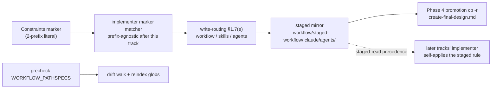

<!-- workflow-sha: eb984cba63bd557fb3c2b32156d85bf1a72e82b4 -->
# Track 1: Generalize §1.7 staging to a third prefix (`.claude/agents/`)

## Purpose / Big Picture
After this track, an edit to a `.claude/agents/**` file on a workflow-modifying
branch routes to the staged mirror, stays at develop-state on the live tree
until Phase 4, and promotes with the rest of the staged workflow machinery.

<!-- Reserved for Move 2 — ADDED/MODIFIED/REMOVED triad. Empty until Move 2 lands. -->

Precursor. Extends the §1.7 staging convention so agent-definition edits stage
like every other workflow file. Highest-care edit: the workflow-modifying
marker matcher, made prefix-agnostic so the plan's two-prefix Constraints
marker matches both the live gate during this track and the staged gate after
it (D7). Lands first because every later track that edits `.claude/agents/`
depends on this rule self-applying via §1.7(d) reads-precedence — Track 3's
agent edits cannot stage until this rule is in the staged mirror.

## Progress
- [ ] Review + decomposition
- [ ] Step implementation
- [ ] Track-level code review
- [ ] Track completion

## Surprises & Discoveries
<!-- Continuous-log. Promoted by the orchestrator from per-step "What was
discovered" when the finding affects future steps or other tracks. Empty
at Phase 1. -->

## Decision Log
<!-- Continuous-log. Execution-time decisions: inline-replan choices,
scope-downs, dependency reveals, gate-override reasons. -->

<!-- Reserved for Move 1 — per-track inlined Decision Records. -->

## Outcomes & Retrospective
<!-- Continuous-log. Review iteration outcomes and the track-completion
summary at Phase C. -->

## Context and Orientation

§1.7 today governs two stageable prefixes only: `.claude/workflow/**` and
`.claude/skills/**`. The convention's single source of truth is
`conventions.md §1.7`, with the prefix pair hardcoded across many consumers.
The job of this track is to add `.claude/agents/` as a third prefix everywhere
the pair appears, and to make the marker matcher prefix-agnostic so the
bootstrap holds (see Plan of Work).

Concrete state of the consumers at track start:

- **`conventions.md`** — §1.7(a) staged-subtree path layout names the two
  prefixes; §1.7(b) defines the canonical marker literal
  (`This plan is workflow-modifying: it edits .claude/workflow/** or .claude/skills/**.`);
  §1.7(d) reads-precedence and §1.7(e) write-routing both enumerate the pair;
  §1.6(h) deliberately omits `staged-workflow/` from the stamp walk and explains
  the pair. Each clause must extend to three prefixes.
- **`implementer-rules.md`** — the path-mapping write-routing rule, the marker
  matcher that activates the gate, and the pre-commit gate that refuses live
  `.claude/workflow/**`/`.claude/skills/**` writes outside the Phase 4 promotion.
- **`workflow-startup-precheck.sh`** — `WORKFLOW_PATHSPECS=".claude/workflow/ .claude/skills/"`
  (line 273) drives the drift walk; the comment at line 268 describes the
  two-prefix staged layout.
- **`workflow-reindex.py`** — already carries an **inert/dead** staged-agents
  glob (`docs/adr/*/_workflow/staged-workflow/.claude/agents/**/*.md`, line 155)
  documented as never-matching because agents are modified live today (lines
  144-155). It also routes live agent files through the rules-6/7-only
  `discover_agent_citing_files` scope, never `IN_SCOPE_GLOBS`. Once agents become
  stageable, that dead glob goes live and the citing-scope-vs-IN_SCOPE_GLOBS
  routing for staged agents must be reconciled (a staged agent should validate
  like any staged workflow file, not over-fire rules 2/3/4/5/8 unless intended).
- **`create-final-design.md`** — the Phase 4 promotion `cp -r` and the
  pre-promotion divergence sanity check on the live `.claude/workflow`/`.claude/skills`
  paths (§1.7(f)).
- **`workflow-drift-check.md`** — the pathspec defensive comment naming the pair.
- **`workflow.md` §Final Artifacts** and **`step-implementation.md`** — staging
  references that name the pair.
- **`migrate-workflow/SKILL.md`** — the migration pathspec.
- **Script tests** — `test_workflow_startup_precheck.py`, `test_workflow_reindex.py`
  pin the two-prefix behavior and the staged-discovery assertions.

- **marker matcher** — boolean trigger; made prefix-agnostic so the bootstrap
  holds.
- **write-routing** — the prefix set that determines which writes stage; extended
  to three.
- **staged mirror** — gains a `.claude/agents/` subtree once routing accepts it.
- **drift walk / reindex globs** — recognize the third prefix so an agent-only
  develop commit registers as a workflow-format change and staged agents validate.

## Plan of Work

The approach is one mechanical generalization (two prefixes → three) applied
uniformly across the consumers above, plus one non-mechanical decision — the
marker matcher — that the rest of the track and every later track depend on.

1. **Marker matcher (highest-care, do first within the track).** Change the
   marker definition in `conventions.md §1.7(b)` to name the third prefix, and
   change every consumer matcher (`implementer-rules.md` gate; any reviewer/gate
   prompt that detects the marker) to match on the stable prefix
   `This plan is workflow-modifying:` regardless of the trailing prefix list.
   This is what lets the plan keep the develop-state two-prefix Constraints
   marker verbatim: the live gate matches it during this track, and the staged
   prefix-agnostic gate matches it afterward (D7). Do not require the plan's
   Constraints marker to change — a prefix-agnostic matcher is the bootstrap.
2. **Write-routing and reads-precedence.** Extend §1.7(a) path layout, §1.7(d)
   reads-precedence, and §1.7(e) write-routing + copy-then-edit to include
   `.claude/agents/`. Extend the `implementer-rules.md` path-mapping rule and the
   pre-commit gate's refused-path set in lockstep.
3. **Stamp walk and drift.** Extend §1.6(h)'s staged-prefix omission note and
   `workflow-startup-precheck.sh`'s `WORKFLOW_PATHSPECS` to the third prefix;
   update the `workflow-drift-check.md` pathspec comment.
4. **Reindex.** Flip the dead staged-agents glob (line 155) to live in
   `workflow-reindex.py`: update the rationale comment (lines 144-155) and
   reconcile `discover_agent_citing_files` vs `IN_SCOPE_GLOBS` so a *staged* agent
   validates like a staged workflow file while *live* agents keep their
   rules-6/7-only citing scope.
5. **Promotion.** Extend the Phase 4 `cp -r` and the pre-promotion divergence
   check in `create-final-design.md` to the third prefix; extend the
   `workflow.md §Final Artifacts` and `step-implementation.md` staging references
   and the `migrate-workflow/SKILL.md` pathspec.
6. **Tests.** Update `test_workflow_startup_precheck.py` and
   `test_workflow_reindex.py` to cover the third prefix and the now-live staged
   agents glob; add a marker-matcher test that asserts the prefix-agnostic match
   accepts both the two-prefix and three-prefix marker literals.

Ordering constraint: step 1 (marker matcher) governs whether this track's own
edits stage and whether later tracks self-apply the rule; complete it before the
mechanical prefix extensions so reviews see the bootstrap intact. Invariant to
preserve: I6 (live workflow stays at develop-state until Phase 4) must hold for
the third prefix exactly as for the first two.

## Concrete Steps
<!-- Phase A placeholder — decomposition writes a thin numbered roster here. -->

## Episodes
<!-- Continuous-log. Phase B sub-step 7 appends one block per completed step. -->

## Validation and Acceptance

- A workflow-modifying branch that edits a `.claude/agents/**` file routes the
  write to `_workflow/staged-workflow/.claude/agents/...`; the live agent file
  stays at develop-state until Phase 4 (I6 holds for the third prefix).
- The prefix-agnostic marker matcher accepts both the develop-state two-prefix
  marker and the three-prefix marker as workflow-modifying signals; the plan's
  unchanged two-prefix Constraints marker activates the gate before and after
  this track's edits.
- The drift walk and `workflow-reindex.py` recognize `.claude/agents/**` as a
  workflow-format path: an agent-only commit registers as a workflow-format
  change, and a staged agent file validates through the staged discovery path.
- The Phase 4 promotion `cp -r` and pre-promotion divergence check cover the
  third prefix.

<!-- Phase A placeholder for per-step EARS/Gherkin lines. -->

<!-- Reserved for Move 3 — EARS or Gherkin acceptance lines used verbatim as test method names. -->

## Idempotence and Recovery
<!-- Phase A placeholder. -->

## Artifacts and Notes
<!-- Continuous-log (rare). Often empty. -->

## Interfaces and Dependencies

**In scope (live paths; routed to the staged mirror during execution):**
- `.claude/workflow/conventions.md` — §1.6(h), §1.7(a)(b)(d)(e)
- `.claude/workflow/implementer-rules.md` — path-mapping gate, marker matcher, pre-commit gate
- `.claude/workflow/workflow-drift-check.md` — pathspec comment
- `.claude/workflow/workflow.md` — §Final Artifacts staging reference
- `.claude/workflow/step-implementation.md` — staging reference
- `.claude/workflow/prompts/create-final-design.md` — Phase 4 promotion + pre-promotion check
- `.claude/skills/migrate-workflow/SKILL.md` — migration pathspec
- `.claude/scripts/workflow-startup-precheck.sh` — `WORKFLOW_PATHSPECS`, drift walk
- `.claude/scripts/workflow-reindex.py` — dead-glob activation + citing-scope reconciliation
- `.claude/scripts/tests/test_workflow_startup_precheck.py`,
  `.claude/scripts/tests/test_workflow_reindex.py` — third-prefix + matcher coverage

**Out of scope:** the manifest schema, routing, reviewer-side agent edits, and
coverage annotations (Tracks 2-4). This track only generalizes the staging
plumbing; it changes no review behavior.

**Inter-track dependencies:** none upstream (precursor). Downstream — **Track 3**
depends on this track's three-prefix rule being in the staged mirror so its
`.claude/agents/**` edits stage via §1.7(d) reads-precedence; **Tracks 2 and 4**
edit only `.claude/workflow/**`, which stages under the existing two-prefix rule,
so they do not strictly require this track, but the plan orders this first per
the design's precursor directive.

**Marker-bootstrap contract (load-bearing):** the plan's `### Constraints` marker
is the develop-state two-prefix literal, verbatim. This track must keep every
marker matcher recognizing that literal (prefix-agnostic match), never require
the plan to carry a three-prefix marker. A matcher that exact-matches only the
three-prefix spelling would silently deactivate the gate for this very plan
after Track 1 commits.
