# Rollback Log — Design Mechanics

> **Companion to `design.md`.** This file holds long-form
> derivations, file:line citations, edit-list subsections, and
> full state-machine tables. Sections here are referenced from
> `design.md` via `**Mechanics**: design-mechanics.md §<section>`
> footers in each section's References block. Cross-references
> go one direction: `design.md → design-mechanics.md`, never the
> reverse.
>
> **If you arrived here without first reading the relevant
> section in `design.md`**, you may be missing the TL;DR +
> concept framing that makes the mechanism prose sensible.
> Consider starting from `design.md` and following its mechanics
> link.
>
> Class Design diagrams and Workflow sequence diagrams that
> appear in this file are also rendered verbatim in `design.md`.
> When a diagram is updated, both copies must be updated to
> match. The narrative around each diagram in this file is the
> long-form prose; `design.md` carries condensed TL;DR-shaped
> companion text for each.
>
> **Reader Orientation, Overview, and Part-level structure are
> authoritative in `design.md`.** This file's structure
> intentionally mirrors the original (pre-rewrite) layout
> section-by-section so cross-references stay stable.

## Class Design

### Atomic operation layer

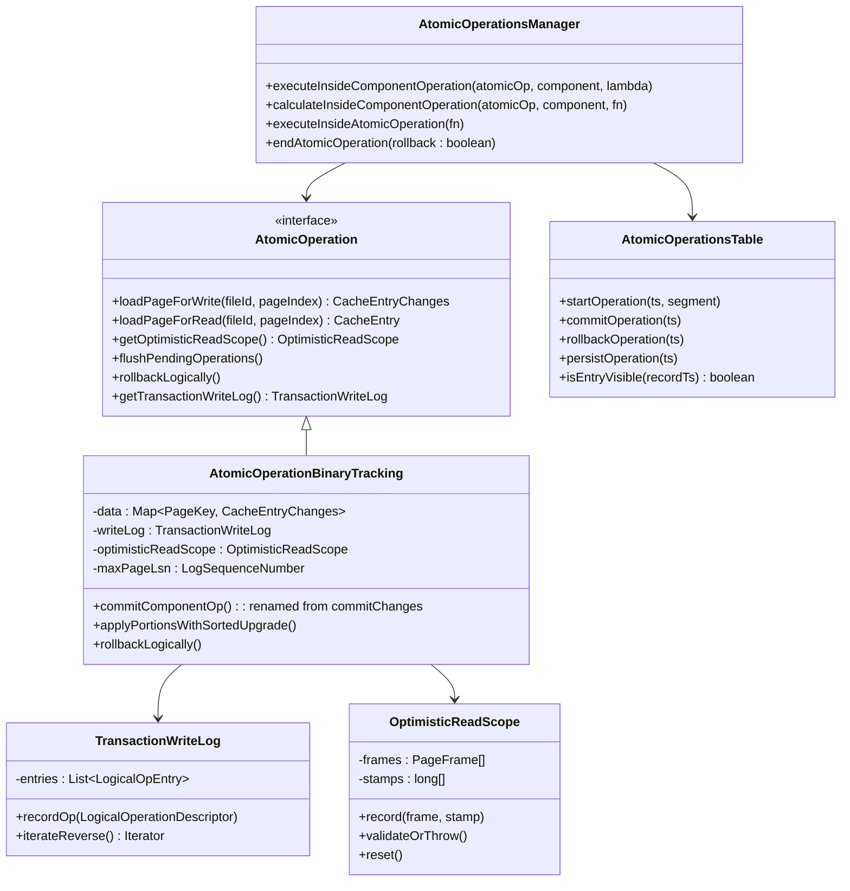

**What the diagram shows.** `AtomicOperation` gains two new
capabilities: `rollbackLogically()` (drives inverse-op replay) and
`TransactionWriteLog` (records every logical op the tx performs).
`OptimisticReadScope` is unchanged in shape but now its validation
happens at *write* commit time too. `maxPageLsn` is tracked to feed
the dual-gate durability protocol (S9).

`AtomicOperationsManager.executeInsideComponentOperation` is the
lynchpin: it owns the stamp-validation / sorted-latch / apply / log
protocol for every component op, including the new
`LogicalOperationDescriptor` emission for user-visible logical ops.

`AtomicOperationsTable` is unchanged. Its `isEntryVisible` predicate
now relies on S5 (rolled-back entries are physically removed before
state transitions to ROLLED_BACK) holding across both the in-tree
and the history B-Tree.

### WAL layer

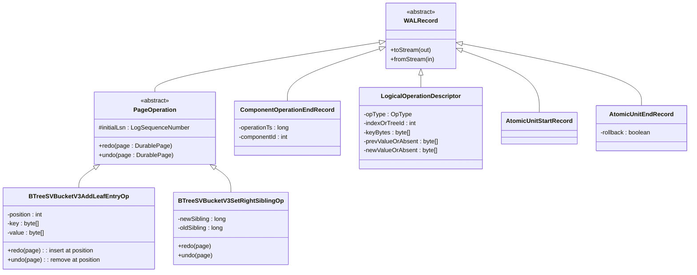

**What the diagram shows.** Every `PageOperation` subclass gets a
matched `undo(page)` paired with its existing `redo(page)`. Both are
**pure page-level logical transforms** — physiological: logical within
a page (insert/remove/replace via the same page-API abstractions
`redo` uses), physical across pages. Neither method reads or writes
`page.getLsn()`; LSN management lives at the portion-level applier.

`ComponentOperationEndRecord` marks structural component-op
boundaries. **It is emitted for every component op**, including pure
structural ops (leaf splits, parent inserts under L&Y).

`LogicalOperationDescriptor` is emitted **only** for user-visible
logical ops — index puts, removes, link-bag adds, record creates,
etc. It carries enough metadata for recovery to derive the inverse
operation. Pure structural ops (B-Tree splits, parent inserts under
L&Y) emit no descriptor — they're never logically inverted.

### Storage component layer

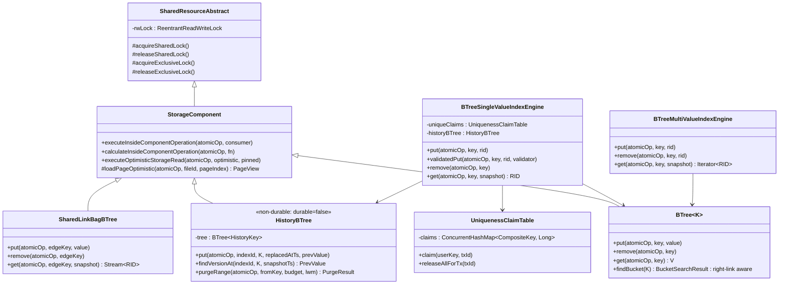

**What the diagram shows.** `StorageComponent` and
`SharedResourceAbstract` are unchanged in shape — the
`ReentrantReadWriteLock` stays per **D10**. The component lock's
*lifetime* changes: today held tx-long during any write, after the
cutover held only short-term during fallback re-execution.

`BTreeSingleValueIndexEngine` (UNIQUE indexes) gains two
collaborators: `UniquenessClaimTable` (for cross-tx write-skew
prevention) and `HistoryBTree` (for SI reads at older snapshots).

`BTreeMultiValueIndexEngine` (non-UNIQUE) keeps its single-value
backing tree but the composite key gains the `ts` dimension —
read path filters version chains, write path appends.

`HistoryBTree` is a new global tree per storage, **constructed with
`durable=false`**. Its key is `(indexId, userKey, replaced_at_ts)`. It
uses the L&Y `BTree` v3 class via one extra constructor variant that
forwards a durability flag to `StorageComponent`'s constructor; the
file is registered through `WriteCache.addFile(name, id,
nonDurable=true)` and is therefore exempt from WAL logging,
`dirtyPages` registration, fsync, and double-write log protection.
Pages still flow through W-TinyLFU normally — cold history pages can
spill to the on-disk file. On every storage open the tree is
recreated fresh (file truncated, new root written) regardless of
clean vs. crash exit (S13).

`SharedLinkBagBTree` keeps its current shape but its composite key
includes `ts`, same as non-UNIQUE indexes.

### Cache layer

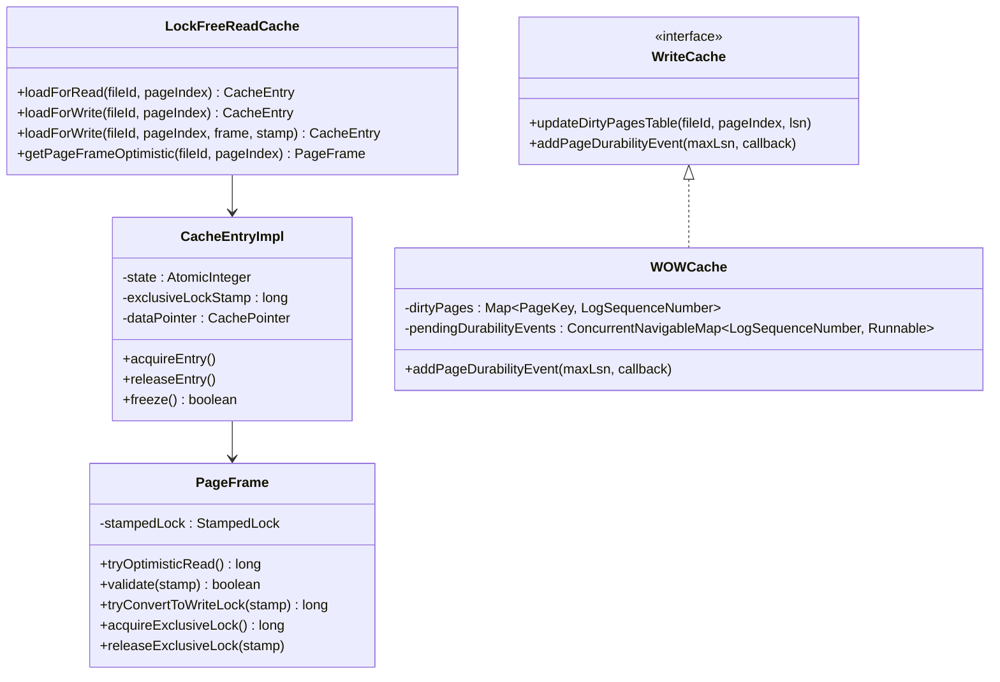

**What the diagram shows.** The cache structure and the W-TinyLFU
admission/eviction policy are unchanged. The cutover does **not**
modify `WTinyLFUPolicy` — page-stealing is achieved entirely by
shortening the pin lifecycle (the `state` counter on
`CacheEntryImpl`).

The new `LockFreeReadCache.loadForWrite(fileId, pageIndex,
writeCache, verifyChecksum, frame, stamp)` overload is the atomic
"validate + acquire write stamp" primitive. It composes the cache's
data-map lookup, frame-identity check, and
`PageFrame.tryConvertToWriteLock(stamp)` call into one call. **It
does NOT bump `state`** — caller must already hold the pin from a
prior pinned stamped write-tracking load.

`PageFrame.tryConvertToWriteLock(long stamp)` is a one-line
delegation to `StampedLock.tryConvertToWriteLock`.

`WriteCache.addPageDurabilityEvent(maxLsn, callback)` is the new
hook for the dual-gate final-state transition (**S9**). Maintains a
sorted map of pending events; fires events as `minDirtyLSN`
advances past their `maxLsn`.

## Workflow

### Happy-path component-op commit

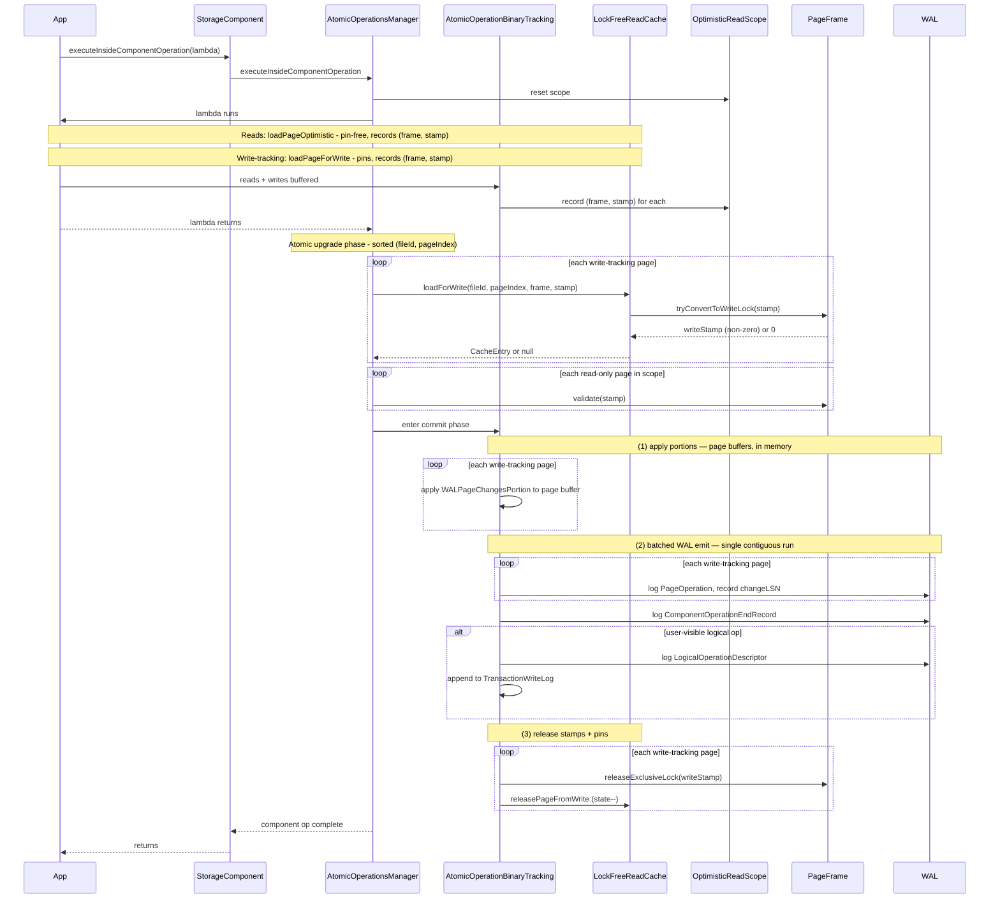

**Flow explanation.** Every component op runs its body in optimistic
mode — no component lock, no page latches. The body distinguishes
two kinds of page loads (see §"Three Load Variants"): **pure
optimistic reads** are pin-free and return a `PageFrame` directly;
**write-tracking loads** pin the `CacheEntry` (`state++`) and return
a `CacheEntryChanges` that buffers mutations into a per-page
`WALPageChangesPortion`. Both variants record their `(frame, stamp)`
pair into `OptimisticReadScope`.

At component-op-end, the commit protocol does **not** do a separate
"validate then acquire" pair. Instead, for each write-tracking page
in canonical `(fileId, pageIndex)` order, it calls a new cache-layer
`loadForWrite(fileId, pageIndex, frame, stamp)` that atomically
delegates to `PageFrame.tryConvertToWriteLock(stamp)`. If the stamp
is still valid, the call returns a non-zero write stamp and the
caller now holds the write lock on that page. If invalidated, it
returns null and the caller falls back. For read-only pages, a
plain `PageFrame.validate(stamp)` is sufficient.

Once every write-tracking page is upgraded and every read-only stamp
validates, the commit phase runs in three sequential, non-interleaved
sub-phases. **(1) Apply.** All buffered `WALPageChangesPortion`s are
applied to their pinned page buffers in memory under the just-acquired
write stamps. **(2) Batched WAL emit.** Every `PageOperation` record
is logged in one contiguous WAL run with `changeLSN` recorded per
page, followed by the `ComponentOperationEndRecord`, and (if this is
a user-visible logical op) the `LogicalOperationDescriptor` plus a
`TransactionWriteLog` append. Batching the emit (rather than
interleaving it with apply per page) matches today's
`AtomicOperationBinaryTracking.flushPendingOperations` shape at the
component-op boundary, and means a mid-commit failure cannot leave a
partial `PageOperation` prefix in the WAL without a terminating
end-record — the entire commit either succeeds with the full record
run or fails before any record is appended. **(3) Release.** Write
stamps are released, and `releasePageFromWrite` decrements each
page's `state`. When `state` reaches `0`, the W-TinyLFU eviction path
can retire the page — that's the page-stealing capability. The full
step-by-step ordering, including `flushSnapshotBuffers` (which sits
between the upgrade phase and the apply phase), is enumerated in
§"Snapshot-Index Merge at Component-Op-End".

The sorted `(fileId, pageIndex)` order across `tryConvertToWriteLock`
calls is the deadlock-avoidance discipline. **Cross-tree component
ops are not a special case** — the modified-pages set may include
pages from the index B-Tree, the history B-Tree, the link-bag, or
any combination, and they're all sorted into a single canonical
ordering.

### Fallback path: stamp invalidation

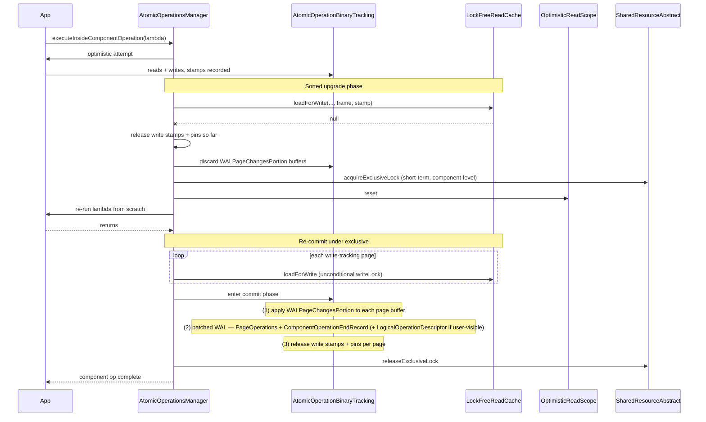

**Flow explanation.** The fallback triggers whenever any one of (a)
a `loadForWrite(...,frame,stamp)` returns null during the sorted
upgrade phase or (b) a read-only stamp's `validate` returns false.
Write stamps and pins acquired so far are released, the buffered
portion is discarded, and the component op retries under a
short-term component exclusive lock.

Under the component exclusive lock, no concurrent writer on this
component can race. The retry re-runs the body, takes the
**unconditional** `writeLock` on each modified page, then runs the
same three sub-phases as the happy path — apply portions to page
buffers, batched WAL emit (`PageOperation`s + `ComponentOperationEndRecord`,
plus `LogicalOperationDescriptor` if applicable), release stamps
and pins. The component exclusive lock is released at component-op-end
— never tx-long.

### Logical rollback at tx abort

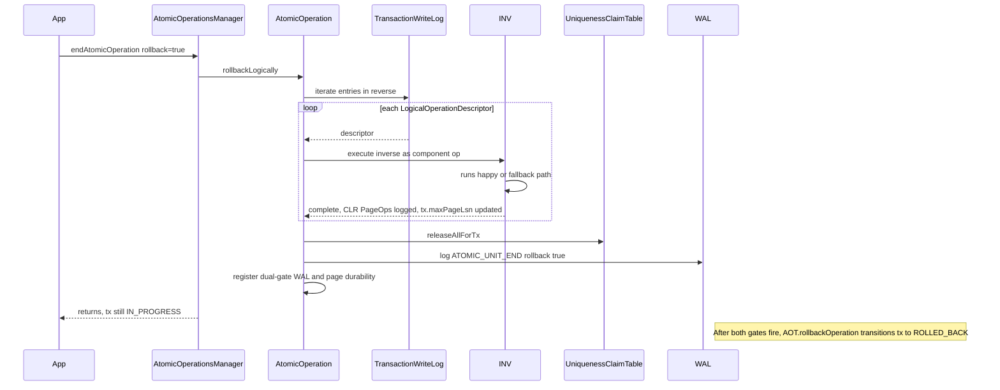

**Flow explanation.** Rollback walks `TransactionWriteLog` in
reverse, executing each logical op's inverse. Each inverse is
itself a regular component op — it produces normal `PageOperation`
records that act as CLRs.

For UNIQUE-index `INDEX_PUT`/`INDEX_REMOVE`, the inverse spans
in-tree + history-tree (see §"UNIQUE Index Read/Write Workflow").
For non-UNIQUE-index ops, the inverse is a single tree mutation
(remove the tx's tombstone or insert entry).

After all inverses run, the UNIQUE claim table releases all of the
tx's claims, `ATOMIC_UNIT_END rollback=true` is logged, and the
dual-gate durability registration is set up. By the time the state
transitions to ROLLED_BACK (after both gates fire), no in-tree or
in-history entries from this tx remain — satisfying invariant **S5**.

### Crash recovery

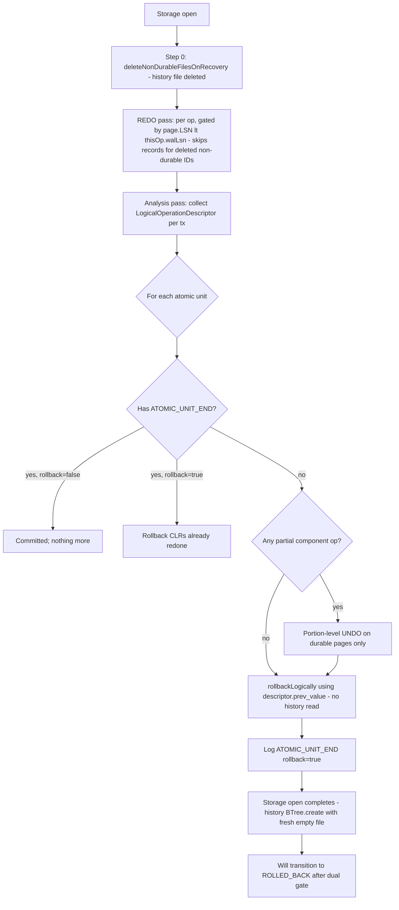

**Flow explanation.** Recovery is a five-part process. **Step 0**:
`WriteCache.deleteNonDurableFilesOnRecovery(readCache)` deletes every
non-durable file (notably the history tree) and returns the set of
internal IDs so REDO can skip any defensive references. **Step 1**:
REDO (replay `PageOperation.redo` forward, per-op LSN-gated). **Step
2**: analysis (collect `LogicalOperationDescriptor` records into
per-tx `TransactionWriteLog`). **Step 3**: portion UNDO for partial
component ops without `ComponentOperationEndRecord` (only durable
pages — the history file is gone). **Step 4**: per-atomic-unit
resolution. Committed units are done after REDO. Units with no
`ATOMIC_UNIT_END` enter logical rollback driven by the
reconstructed write log; each inverse uses
`LogicalOperationDescriptor.prev_value` directly to restore in-tree
— never reading from the (wiped) history tree. **Step 5**: storage
open completes; the history `BTree` is constructed via `create()`
on a fresh empty file (S13). The CLRs produced by recovery-time
logical rollback are durable PageOps on the in-tree, so a crash
during recovery-time rollback is handled by forward REDO on the
next restart (idempotent via per-op LSN gating); the second
recovery's Step 0 wipes the history tree again (no-op).

### UNIQUE index put workflow

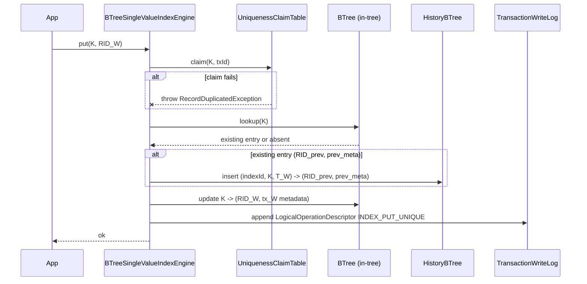

**Flow explanation.** A UNIQUE put first acquires the claim (Track
C). Then looks up the existing entry. If present, captures it to
the (non-durable) history tree at `(indexId, K, T_W)`. Then updates
the in-tree. All three steps are part of the same component op, so
they become atomic in memory at commit-upgrade time. The history
mutation produces no WAL records (D6); the in-tree mutation produces
durable PageOps; both pages go through the same validate-and-upgrade
protocol.

Before emitting the `LogicalOperationDescriptor`, the engine
`assert`s that the descriptor's `prev_value_with_metadata` matches
the in-tree value just read in the same component op (S14). This is
the single safety net for the "descriptor is the load-bearing source
of truth" property — without durable history, a wrong-prev-value
capture would silently corrupt rollback.

The `TransactionWriteLog` record carries the prev_value — including
metadata `(prev_RID, prev_writer_tx, prev_start_ts)` — so rollback's
inverse can fully restore the previous state, **without consulting
the history tree**. The descriptor logged in WAL carries the same
data, so recovery-time rollback works identically without ever
reading the (wiped) history tree.

For first-write-to-K-within-tx-W: the prev_value is the committed
state. For subsequent writes within tx_W to the same K: the
prev_value is tx_W's previous in-tree state (from the previous write
within this tx). The history-tree write only happens on the first
write — subsequent writes within tx_W just update in-tree. This is
correct because external readers at `T_R < T_W` always see the
history entry at `(K, T_W)` (which captures the committed pre-tx
state); tx_W's intermediate states are private to tx_W.

### UNIQUE index get workflow

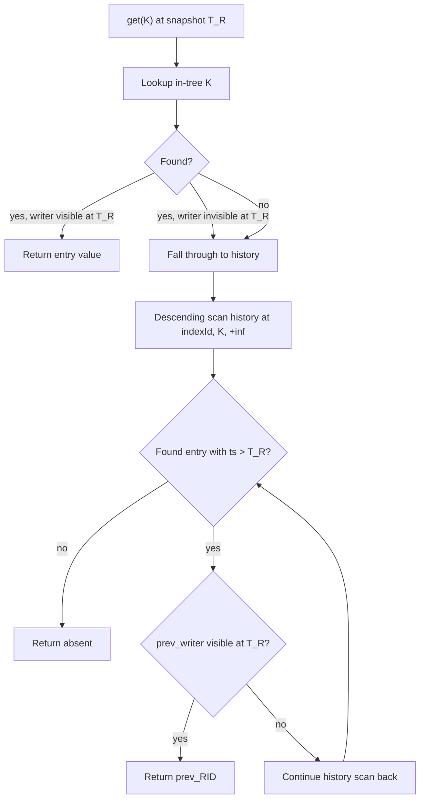

**Flow explanation.** Reader at snapshot T_R first probes in-tree.
If the in-tree entry's writer is visible at T_R, return its value.
Otherwise, fall through to a descending range scan in the history
tree at `(indexId, K, ts > T_R)` — find the **smallest** ts greater
than T_R; that history entry's value was what was visible at T_R.
Validate the prev_writer's visibility too (handle the "in-progress
at snapshot" case by walking further back). If no history entry
exists with `ts > T_R`, the key is absent at T_R.

## Multi-Version B-Tree Semantics (non-UNIQUE)

**What.** The non-UNIQUE B-Tree (used by `BTreeMultiValueIndexEngine`)
stores `(userKey, RID, ts) → tombstone_marker_or_empty` composite
entries. Each insert/delete appends a new entry at a distinct
composite key. Readers walk the version chain at `(K, RID, *)` in
descending-ts order and pick the highest visible entry; a visible
tombstone means "absent."

**Why.** Non-UNIQUE indexes already use composite keys including RID
today; adding `ts` to the composite key gives proper SI for index
reads at older snapshots. Per `(K, RID)` pair, the tree has at most
2 entries (insert + tombstone) before LWM-driven cleanup, so bloat is
bounded by record-mutation rate × LWM lag.

We considered three alternatives in the cost analysis (see **D7**):
- (a) Move non-UNIQUE to history-store-too: grows total bytes by
  ~22%, doubles tree-touches on SI reads. Rejected.
- (b) Delete-mark + dereference RID: makes index-only queries (COUNT,
  EXISTS) pay for a record load per candidate. Rejected.
- (c) Multi-version inline composite key (this design): cheapest in
  bytes, cheapest in reads, append-only writes match existing
  patterns.

**Gotchas.**

- **Version-chain length per (K, RID)**: bounded to 1-2 in steady
  state (insert + tombstone). Each entry is uniquely keyed.
- **Same-tx multiple writes to same `(K, RID)`** all land at the same
  composite key `(K, RID, T_W)` because the tx uses one ts —
  natural B-Tree overwrite semantics.
- **Tombstone semantics**: a tombstone is visible to readers with
  snapshot ≥ tombstone.ts whose visibility predicate doesn't exclude
  tombstone.ts from `inProgressTxs`. When a visible tombstone is
  found as the highest-ts visible entry for `(K, RID)`, the entry is
  treated as absent at that snapshot.
- **Reader sees no entry vs sees only invisible entries**: both treat
  `(K, RID)` as absent at the snapshot.

## L&Y B-Tree: Right-Link Descender

**What.** Both `BTree` v3 (the index B-Tree) and `SharedLinkBagBTree`
are converted to **Lehman-Yau** semantics. The defining structural
properties:

1. **Right-link**: every page has a pointer to its right sibling at
   the same level. `RIGHT_SIBLING_OFFSET` already exists in both
   bucket layouts.
2. **Doubly-linked siblings**: every page also has a `leftSibling`
   pointer. Already present.
3. **Multi-component-op splits**: a leaf split is one component op;
   inserting the new separator into the parent is a separate
   component op; cascading splits propagate as a chain of component
   ops.
4. **Right-link descender**: during root-to-leaf descent, if
   `searchKey > currentPage.maxKey()` and a right-sibling exists,
   the descender follows the right-link instead of returning. This
   handles the in-flight state where a leaf split has committed but
   the parent insertion has not.

**Why.** Multi-component-op splits make each component op smaller
(2-3 pages instead of 5+), narrowing latch surface and reducing
fallback rate at commit-upgrade time. The right-link descender
guarantees that any key present in the tree is reachable from root
via descend + right-link fall-through whenever the current page's
max-key is below the search key. This holds regardless of which
component ops are mid-cascade.

**Implicit high-key**: instead of an explicit high-key field
(PG-style), the descender uses **current-rightmost-entry** as the
implicit high-key. This is correct because:
- The splitter's max-key drops atomically with the right-sibling
  pointer write — both happen in the same component op (the leaf
  split).
- A reader observing the splitter mid-descent sees a consistent
  state: either pre-split (max-key was higher, no right-link) or
  post-split (max-key is lower, right-link populated).

**Why no merges.** PG's `nbtree` merge protocol (page deletion with
link-disconnection and 2-pass cleanup) is the most subtle part of
L&Y. Underfull pages stay underfull until subsequent inserts
re-fill them. For OLTP workloads where keys flow in, this is
acceptable. Adding merges later is a pure addition (D20).

**Gotchas.**

- **Page format unchanged.** No new fields, no migration. Sibling
  pointers and corresponding WAL ops already exist.
- **Cascade depth bounded by tree depth** — log_B(N) for B-Tree of
  size N. Each cascade level is one component op.
- **Recovery between cascade stages**: a crash after the leaf split
  but before the parent insertion leaves the tree in a stable L&Y
  state (right-link populated, parent unaware). Recovery does
  nothing for this; readers via right-link find all keys.
- **Stamp invalidation during cascade**: each component op
  independently validates stamps. If one fails, only that op's
  fallback runs — earlier successful ops are NOT undone.

## L&Y Cascading Split: Worked Example

Consider a 3-level tree with full leaf P4 under parent P1.
Tx_W issues `index.put(K=25, RID_W)` which lands in P4. P4 overflows.

**Op-1 (leaf split)**:
- Allocate P9. P4 keeps `[11, 18, 22]`; P9 takes `[25, 28, 30]`.
- Set siblings: `P4.rightSibling = P9`, `P9.leftSibling = P4`,
  `P9.rightSibling = P5`, `P5.leftSibling = P9`.
- Log PageOps + `ComponentOperationEndRecord(op-1)`.

**State after op-1**: leaves doubly-linked. P9 reachable only via
P4's right-link. Parent P1 unaware.

**Op-2 (parent insert)**:
- P1 currently has separators `[10, 30]`. Insert separator 25
  pointing at P9.
- P1 now `[10, 25, 30]` with children P3, P4, P9, P5.
- Log PageOp + `ComponentOperationEndRecord(op-2)`.

**State after op-2**: tree fully consistent. Right-link still works
but no longer required.

**If P1 was full (op-2 cascades)**:
- Op-2' splits P1 into P1' + P10. Sets internal-level right-link.
  P1' keeps lower separators, P10 takes upper.
- Op-3 inserts separator into root P0 pointing at P10.

**Crash scenarios** (all assume tx_W has not committed):

| Crash point | Recovery action |
|---|---|
| **C1: mid op-1** | Portion UNDO restores P4 to pre-split, deallocates P9, restores P5.leftSibling. Logical rollback finds nothing to undo (the put never logically completed). |
| **C2: between op-1 and op-2 start** | Tree in stable L&Y state. Logical rollback inverse: descend via right-link to P9, find K=25, remove. Splits remain. |
| **C3: mid op-2** | Portion UNDO restores P1 to pre-op-2 separators. Same as C2 thereafter. |
| **C4: between op-2' and op-3 (cascade case)** | Tree split cascadingly with internal right-link active. Logical rollback descends through right-link path. |
| **C5: mid op-3** | Portion UNDO restores root. Logical rollback as above. |

**No new recovery code paths beyond existing primitives** — every
scenario reduces to portion-level UNDO + search-based logical
rollback (using right-link descender).

## Logical Rollback Under Concurrency

**What.** When a tx aborts, `rollbackLogically()` walks
`TransactionWriteLog` in reverse and issues a logical inverse for
each entry. Each inverse is a regular component op — it performs
the same kinds of structural manipulations (traversal from root,
latching, splits/merges if needed) as any other write.

**Why search-based inverse is safe (D12).** Under SI + L&Y right-
link descender, the inverse's search-from-root is guaranteed to
locate the entry the tx wrote, regardless of which structural ops
have committed in between:

- L&Y right-link descender finds any present key via descend +
  right-link fall-through, regardless of in-flight split state.
- SI guarantees no other tx removed our entry: index entries and
  link-bag entries carry our tx.commitTs, making them uniquely
  addressable.
- Therefore at rollback time, our entry exists *somewhere* in the
  tree, and the inverse op's search will find it.

**Recovery-time logical rollback.** The per-tx
`TransactionWriteLog` is in-memory only; a crash loses it. Recovery
reconstructs the log from `LogicalOperationDescriptor` WAL records
during the analysis pass (**D19**, **S12**). For each in-flight tx
(no `ATOMIC_UNIT_END`), recovery's analysis collects its
descriptors in WAL order, builds a logical write log, and runs the
same `rollbackLogically()` procedure as runtime.

**Inverses use `LogicalOperationDescriptor.prev_value` as the single
source of truth** under D6's non-durable history. The recovery-time
inverse for `INDEX_PUT_UNIQUE` (replacement case) is one in-tree
mutation: `inTree[K] = descriptor.prev_value`. No history lookup,
no history removal. The history file has already been deleted by
`WriteCache.deleteNonDurableFilesOnRecovery` (Step 0 of recovery,
above). Runtime rollback may optionally also remove the in-memory
history entry for tidy memory reclamation; it is not required for
correctness.

If recovery itself crashes mid-rollback, the next recovery's Step 0
wipes the history file again (no-op since it was wiped before),
REDO replays the already-issued CLRs (idempotent via per-op LSN
gating), analysis re-collects the descriptors, and logical rollback
re-runs. Already-rolled-back inverses see in-tree already at
`prev_value` and re-issue an idempotent in-tree mutation
(redundant but harmless).

**Gotchas.**

- **`LogicalOperationDescriptor.prev_value` is load-bearing under
  D6**. Without it, recovery cannot derive the in-tree restoration
  for in-flight UNIQUE put/remove inverses (the history tree has
  been wiped by Step 0 of recovery). A bug capturing wrong
  `prev_value` at write time silently corrupts in-tree state at
  rollback. **S14 mitigation**: write-time `assert` that the
  descriptor's `prev_value_with_metadata` matches the in-tree value
  just read in the same component op. Track T1 round-trip property
  test exercises this end-to-end.
- **Pure structural ops emit no descriptor**. Leaf splits, parent
  inserts under L&Y are never logically inverted — they're handled
  by either portion UNDO (mid-op crash) or "remain in place" (stable
  L&Y state).
- **Rollback may encounter stamp invalidations.** An inverse
  component op may fall back to the short-term component exclusive
  lock — same machinery as any regular write.
- **CLRs-as-PageOperations on the durable in-tree side only.** The
  inverse component op writes a CLR PageOp to the in-tree (durable,
  WAL-logged). It does NOT emit a CLR for the history tree (the
  history tree is non-durable, no WAL). Crash-during-rollback
  recovery is trivial (forward REDO of in-tree CLRs).
- **Order of inverses matters for structural ops.** If our tx did
  put(K1), put(K2) in that order and they happened to land in the
  same leaf that split between them, rolling back must process K2's
  inverse before K1's. The write log preserves order; reverse
  iteration handles this correctly.

## Record CRUD: Position-Pointer Logical Rollback

**What.** Logical rollback for `RECORD_CREATE` / `RECORD_UPDATE` /
`RECORD_DELETE` uses **position pointers** in the descriptor, not
record content. The descriptor schema:

```
RECORD_CREATE: { rid }                                    (~16 B)
RECORD_DELETE: { rid, prev_position_entry }              (~36 B)
RECORD_UPDATE: { rid, prev_position_entry }              (~36 B)
```

where `prev_position_entry = (pageIndex, slotOffset, version, status)`
— the CPM entry that was current immediately before the operation.

**Why.** YouTrackDB's record store already implements MVCC by leaving
prior chunks physically on disk, gated by LWM. `PaginatedCollectionV2.
updateRecord` writes new chunks at fresh slots and redirects the CPM
pointer (`PaginatedCollectionV2.java:1396-1441`); old chunks remain
physical. `deleteRecord` only marks CPM as REMOVED — chunks are NOT
removed by user-level delete (`PaginatedCollectionV2.java:1295-1337`).
Both call `keepPreviousRecordVersion` which:

- Stashes the prior `PositionEntry` into the snapshot index keyed by
  `(id, collectionPosition, oldRecordVersion)` (line 1487).
- Registers a visibility key `(newRecordVersion, id, collectionPosition)`
  for LWM-driven snapshot eviction (line 1492).
- Sets the DPB bit on the prev page (line 1500) so GC eventually
  scans it.

Physical chunk reclamation only happens in `processDirtyPage` →
`CollectionPage.deleteRecord`, gated by snapshot-index lookup.
**Therefore `prev_position_entry` resolves to live chunks for any
in-flight tx.**

The descriptor stays at fixed ~36 bytes regardless of record size.
WAL volume per `RECORD_UPDATE` for an N-byte record:

- New-chunk PageOps: `ceil(N / 8095)` × `CollectionPageAppendRecordOp`
  (each carries its chunk content inline) — same as today's commit
  path, no change.
- Descriptor: ~36 B fixed.
- ComponentOperationEndRecord: small fixed overhead.

vs. an inline-prev-content alternative which would have **doubled**
WAL volume per update — large records (multi-chunk, >8 KB) would
produce descriptors of comparable size to the new-content PageOps.

**Binding constraint (D39).** Plan-level decision record D39 promotes
this position-pointer choice from one of D23's four alternatives to a
binding constraint, and explicitly forbids a `prev_content` payload
field on the `RECORD_DELETE` / `RECORD_UPDATE` descriptor schema. The
inverse component op (CPM-flip resurrection — see shapes below) is
required to be a CPM bucket bit-flip plus an
`approximateRecordsCount` adjustment, never a content-replay shape
that calls `findNewPageToWrite` or writes record-content chunks. The
chunks at `prev_position_entry` are guaranteed physical via the LWM
gate (runtime: snapshot-index visibility key; recovery: D32's
recovery-window `TsMinHolder`). Track A's descriptor design and
Track D's inverse implementation must reject any future schema
proposal that adds record-content payload to these op types — D39
captures the disk-space arithmetic (a rolled-back delete-heavy tx
would write ~1× the record-content volume in fresh chunks per
inverse) and rollback-storm scenarios that motivate the rejection.

**Inverse component op shape.** Three inverses, each a single component
op:

```
inverse RECORD_CREATE(rid):
  cpm.markRemoved(rid, deletionVersion = inverseOp.commitTs)
  set DPB bit on the new chunks' page
  decrementApproximateRecordsCount()

inverse RECORD_DELETE(rid, prev_position_entry):
  cpm.update(rid, prev_position_entry)         // flips REMOVED → WRITTEN
  incrementApproximateRecordsCount()

inverse RECORD_UPDATE(rid, prev_position_entry):
  cpm.update(rid, prev_position_entry)         // redirects to prev slot
  set DPB bit on the (now-stale) new chunks' page
```

Each inverse touches CPM bucket + (possibly) DPB page + (possibly)
state page (record-count) — typically 2-3 page mutations regardless
of record size.

**LWM-gated chunk survival**. The invariant chain:

```
For tx_W in-flight (runtime or recovery):
  tx_W ∈ inProgressTxs                  (concretely: an IN_PROGRESS
                                         entry in AtomicOperationsTable
                                         keyed by tx_W.unitId)
  tx_W.tsMin ≡ tx_W.unitId ≡ tx_W.commitTs
                                        (interpretation (α) — see
                                         "Per-tx vs per-thread tsMin"
                                         below)

LWM = computeGlobalLowWaterMark()
    = min(holder.tsMin)  over Set<TsMinHolder> tsMins
    or idGen.getLastId() if tsMins is empty

For prev chunks (snapshot entry stashed at write time):
  visibility_key.newRecordVersion = tx_W.commitTs
  evictable iff visibility_key.newRecordVersion < LWM
                                        (strict; evictStaleSnapshotEntries
                                         uses headMap-exclusive at the LWM
                                         key — AbstractStorage.java:6303-6304)

While tx_W is in-flight, tx_W.commitTs participates in the LWM-min set
via either the writing thread's TsMinHolder (runtime — that thread is
also typically a reader, so the snapshot floor of its open snapshot
≤ tx_W.commitTs) or via the synthetic recovery-window TsMinHolder
(recovery, per D32). Therefore LWM ≤ tx_W.commitTs. Therefore
visibility_key.newRecordVersion (= tx_W.commitTs) is NOT strictly less
than LWM, so prev chunks are NOT evictable. Therefore
descriptor.prev_position_entry resolves to live chunks at any
inverse-op execution point.
```

**Per-tx vs per-thread `tsMin`.** The codebase exposes a per-thread
`TsMinHolder.tsMin` representing the snapshot floor of an active
reader on that thread. The storage's `Set<TsMinHolder> tsMins` holds
these instances; `computeGlobalLowWaterMark` returns
`min(holder.tsMin)` over the set, falling back to `idGen.getLastId()`
when empty (`AbstractStorage.java:6657-6672`).

This design's invariant block uses `tsMin` to mean the **per-tx
writer-side** value, which under interpretation (α) equals the
writer's `unitId` and `commitTs`. The two `tsMin` instances are
related — both feed `computeGlobalLowWaterMark` and hold back the
same eviction predicate — but they are distinct concepts:
per-thread reader-side holders track snapshot floors, while D32's
recovery-window holder is a writer-side floor injected into the
same set so that a `unitId`-min participates in LWM computation
during the recovery window.

Recovery preserves the property via **D32**: WAL analysis identifies
in-flight txs (`ATOMIC_UNIT_START` with no matching `ATOMIC_UNIT_END`),
`AtomicOperationsTable` is built with
`tsOffset = min(min_in_flight_unitId, idGen.getLastId() + 1)`, each
in-flight tx is re-registered via `startOperation(unitId, segment)`,
and a synthetic per-storage `TsMinHolder` is installed with
`tsMin = min(in-flight unitId)`. Logical rollback for every in-flight
tx completes inside `recoverIfNeeded` before the storage transitions
to `STATUS.OPEN`, at which point the recovery-window holder is
removed and `AtomicOperationsTable` contains zero IN_PROGRESS
entries (S23). GC self-gates on `STATUS.OPEN` and observes no
in-flight state.

**Edge cases.**

- **Multi-update intra-tx (`A → B → C → D` chain, then rollback).**
  Each update's descriptor carries its own `prev_position_entry`.
  Reverse iteration walks `D → C → B → A`. The
  `keepPreviousRecordVersion` same-tx skip
  (`PaginatedCollectionV2.java:1472-1476`) means only the *first*
  write within tx_W stashes a snapshot entry — but the inverse chain
  doesn't depend on the snapshot index because every descriptor
  carries the predecessor's position directly.
- **Crash during a multi-update tx**. WAL replays each component op's
  PageOps via REDO (per-op LSN-gated) reaching the post-update-N
  state. Analysis collects all N descriptors. Logical rollback walks
  them in reverse using descriptor positions only.
- **GC racing rollback**. GC ops are themselves component ops
  respecting LWM. They cannot evict our slots while tx_W is active
  — both runtime and recovery paths preserve this.
- **Inverse encounters concurrent stamp invalidation**. The inverse
  component op uses the standard validate-and-upgrade-or-fallback
  protocol. Same machinery as any regular write.

**WAL volume bound and rollback waste.** A rolled-back tx that
performed N record ops leaves stale chunks bounded by
`O(N × record_size)`. The same bound applies symmetrically to a
*committed* version of the same workload (committed updates leave
the *old* chunks stale). **Rollback does not add a new worst case
beyond what committed updates already produce.** GC pressure is
workload-driven (total update volume × LWM lag), not
commit-vs-rollback-driven.

**Gotchas.**

- **The descriptor's `prev_position_entry` is load-bearing under
  D23.** A bug capturing wrong `prev_position_entry` at write time
  silently corrupts state at rollback. **S15 mitigation**: write-time
  `assert` that `descriptor.prev_position_entry == cpm.get(rid)` just
  read in the same component op. Cheap and catches the load-bearing
  capture-point bug.
- **Inverse `RECORD_DELETE` re-uses the original chunks.** Chunks at
  `prev_position_entry`'s slot are physically present (because
  user-level delete didn't remove them). The inverse just flips CPM
  REMOVED → WRITTEN; no chunk re-allocation.
- **`approximateRecordsCount` drift.** The inverse must
  increment/decrement to match the original op. Idempotence under
  crash mid-rollback is via the standard portion-level apply (the
  count update is one PageOp like any other).
- **Snapshot-index merge timing under in-place writes** is resolved
  by **D25**: relocate the existing `flushSnapshotBuffers` call from
  `AtomicOperationBinaryTracking.commitChanges` (today's tx-commit
  flush point) to the component-op-end commit phase, drain local
  buffers after flush. See section **Snapshot-Index Merge at
  Component-Op-End** below. Not load-bearing for D23's rollback
  because descriptors carry `prev_position_entry` directly without
  consulting the snapshot index.
- **Rolled-back tx's new chunks become stale.** They flow through
  the same DPB-bit + GC-sweep path as committed updates' old chunks.
  No new GC machinery needed.
- **Histogram delta application** is a separate question — see
  **D27** and the **Histograms: Volatile in Steady State** section
  below.

## UNIQUE-Index Claim Table

**What.** A per-UNIQUE-index `ConcurrentHashMap<CompositeKey, Long>`
that records `(userKey) → txId` for every in-flight tx's UNIQUE-
index put. On put, the engine calls `claim(userKey, currentTxId)`;
on tx end (commit or rollback), all of the tx's claims are released.

**Why.** Single-version in-tree + history store doesn't prevent
write-skew on uniqueness on its own: tx1 and tx2 could both put `K
→ rid1` and `K → rid2` respectively, with the first writer's value
displaced into history when the second commits — silent loss of
the "first commit wins" property. A scan-based check at put time
has a TOCTOU window under short-term locking. A hash-map-based
claim (one CAS per put) is race-free and cheaper per put.

**Gotchas.**

- **Memory growth with tx size.** A tx inserting 1M UNIQUE-indexed
  rows holds 1M claims = ~40 MB. Acceptable; stripe the table by
  `hash(userKey)` if hot contention on a single map becomes an
  issue.
- **Claim leakage on tx abandonment.** If a tx hangs or is forcibly
  terminated without running its rollback hook, its claims leak.
  Mitigated by tying claim release to every tx-end path.
- **Claim table is RAM-only.** Crash recovery doesn't reconstruct
  claims — the tree state (committed entries) is authoritative
  post-crash.
- **Scope is narrow.** Only UNIQUE indexes. NOT_UNIQUE /
  ALLOW_MULTIVALUE indexes use no claim table; link-bag uses no
  claim table; record writes use SI at the record level.

## Three Load Variants

Under the new commit protocol, the component-op body distinguishes
**three** page-load shapes, each with its own pin + stamp behaviour.
Per **D40**, all three are **uniformly available across warm cache
hits, cold disk loads, and memory storage** — no read path bypasses
the per-page `StampedLock`.

- **(1) Pin-free optimistic read.** Used by every subsystem read
  that routes through `StorageComponent.executeOptimisticStorageRead`
  (already the discipline for `BTree.get()` and
  `SharedLinkBagBTree.findCurrentEntry()`; the remaining subsystem
  readers are converted by Track R). Internally calls
  `readCache.getPageFrameOptimistic(fileId, pageIndex, writeCache,
  verifyChecksums)`. The cache implementation resolves the request
  one of three ways:

  1. **Warm cache hit (disk or memory storage).** Looks up the
     `CacheEntryImpl`, checks it is alive, and returns the underlying
     `PageFrame` **without** incrementing `CacheEntryImpl.state`.
     This is the steady-state happy path on disk storage with a
     populated working set, and the only path on memory storage
     (which has no eviction).

  2. **Cold disk miss (disk storage only).** Falls through to
     `LockFreeReadCache.doLoad`, which pins, loads from
     `WriteCache`, and installs a fresh `CacheEntryImpl`. The cache
     then immediately calls `releaseFromRead` to drop the pin and
     returns the `PageFrame`. Pin lifetime is bounded to the I/O
     wait + frame publication; after release, the frame is eligible
     for eviction just like any warm-cache frame. If
     eviction-and-recycle happens between drop-pin and the caller's
     `tryOptimisticRead`, the eviction's exclusive-lock cycle
     invalidates the outstanding stamp on the recycled frame and
     re-publishes the new `(fileId, pageIndex)` coordinates under
     that same lock — the caller's coordinate check
     (`frame.getFileId() == fileId && frame.getPageIndex() == pageIndex`)
     catches the recycled identity, and stamp validation catches
     concurrent writes. Net I/O cost is identical to today's
     pinned-fallback path: one disk load per cache miss either way.

  3. **Memory storage.** `DirectMemoryOnlyDiskCache.getPageFrameOptimistic`
     returns the frame directly from the per-file `MemoryFile`'s
     `ConcurrentSkipListMap`. Memory storage allocates a `PageFrame`
     once via `MemoryFile.addNewPage` (briefly pinning during
     allocation) and never recycles or evicts it — `clear()` only
     fires on file deletion. So the StampedLock's stamp invalidation
     is purely **writer-driven** on memory storage; readers cannot
     race with eviction (there is none) or with frame recycling
     (frame coordinates are stable for life). The optimistic
     protocol is strictly simpler than on disk and delivers the
     same throughput properties.

  In all three cases the caller takes
  `stamp = frame.tryOptimisticRead()`, records `(frame, stamp)` into
  `OptimisticReadScope`, and reads the page buffer directly. No
  pin is held by the caller post-return. If a concurrent writer
  acquires the frame's exclusive lock (or, on disk, an eviction
  cycle does) between `tryOptimisticRead` and the corresponding
  `validate` / `tryConvertToWriteLock`, the validate (or upgrade)
  fails, forcing a fallback to variant (3). Under **D40** that
  fallback fires only on **real concurrent invalidation** — never
  as a side effect of cache-miss or memory-storage asymmetry.

- **(2) Pinned, stamped write-tracking load.** Used by every
  component-op body that mutates pages — every caller of
  `AtomicOperation.loadPageForWrite`. Internally pins via
  `readCache.loadForRead`, which in this cache is **pin-only** —
  it bumps `CacheEntryImpl.state` (the pin) but does NOT acquire
  any `StampedLock` mode on the page (no shared lock, no exclusive
  lock — the caller decides). The wrapper accesses the underlying
  `PageFrame` via `cacheEntry.getCachePointer().getPageFrame()` and
  takes `stamp = frame.tryOptimisticRead()` on it, then records
  `(frame, stamp)` into `OptimisticReadScope`. Returns a
  `CacheEntryChanges` wrapping the pinned entry for the body to
  buffer mutations into a `WALPageChangesPortion`. The pin is held
  through commit (so the commit-time atomic validate-and-upgrade
  has a stable `PageFrame` identity to operate on); no `PageFrame`
  lock is taken during the body.

- **(3) Pinned + unconditional `writeLock` load.** Used by the
  fallback-path re-execution under the component exclusive lock.
  This is the existing `readCache.loadForWrite` today: `doLoad` to
  pin + `pointer.acquireExclusiveLock` to take the frame's
  `StampedLock.writeLock()` unconditionally (blocking) +
  `writeCache.updateDirtyPagesTable`. Preserved verbatim.

**Nuance: variant (2)'s pin is held by
`AtomicOperationBinaryTracking`, but the commit-time upgrade API
(`readCache.loadForWrite(..., frame, stamp)`) does NOT pin** — it
assumes the caller already holds the pin from variant (2).

**Why pin during the body, not at commit.** A natural-looking
alternative would have variant (2) be pin-free too (use
`getPageFrameOptimistic` like variant (1) does) and let the new
commit-time `loadForWrite(..., frame, stamp)` take the pin as part
of its validate-and-upgrade. We reject this for two reasons (also
captured as decision-record alternative D18 (d) in the plan):

1. **Asymmetry of the read primitive between happy and fallback
   paths.** The fallback re-runs the body under a short-term
   component exclusive lock and uses variant (3) — the existing
   `readCache.loadForWrite` (pin + unconditional `writeLock`). If
   the happy-path body used pinless reads for write-tracking pages,
   the body and the fallback would need **three** distinct cache
   read methods (pinless `getPageFrameOptimistic`, pin+writeLock
   `loadForWrite`, and a new pin+validate+upgrade overload). With
   variant (2) holding the pin in the body, only **two** are needed
   (`loadForRead` for the body, `loadForWrite` for the fallback) —
   the new commit-time overload does only validate-and-upgrade (S8
   `dirtyPages` registration plus `tryConvertToWriteLock`).

2. **Two responsibilities in one cache call.** Folding pinning into
   the commit-time overload would make a single API responsible for
   both pin acquisition and stamp validation. The two failure modes
   (pin denied vs. stamp invalidated) would have to be reported
   through one return path, and a partial success (pinned, then
   invalidated) would need its own cleanup. Keeping the pin in the
   body and the validate-and-upgrade in commit gives each cache
   entry point one job and one failure mode.

The cost we pay is that pages mutated by a component op stay pinned
from the first write-tracking load through component-op-end. This
is bounded by per-component-op page count (typically 1-3 pages — a
B-Tree split is 2-3 pages under L&Y, a record insert is 1-2). It is
**not** the tx-long pinning that the cutover removes; the
cutover's whole purpose is to compress the pin lifetime from
"transaction" to "component op," and variant (2)'s body-time pin
fits inside that already-shortened window.

## Component-Op Commit Upgrade Protocol

**Key primitive.** `PageFrame.tryConvertToWriteLock(long stamp)` is
a one-line delegation to `StampedLock.tryConvertToWriteLock`. Given
an optimistic stamp, it atomically:

- returns a non-zero **write stamp** if no writer has mutated the
  `StampedLock`'s version since the optimistic stamp was issued —
  the caller now holds the exclusive write lock; OR
- returns `0` if any writer intervened — the caller holds nothing.

This closes the race a naive "call `validate(stamp)` then
`acquireExclusiveLock()`" would have: after a self-acquired write
lock, `validate(priorOptimisticStamp)` always returns false (the
write acquisition bumped the version), so the two cannot be
composed safely (D18).

**Cache-layer wrapper.** The atomic-op layer does not call
`PageFrame.tryConvertToWriteLock` directly. The cache exposes:

```java
@Nullable CacheEntry loadForWrite(
    long fileId,
    long pageIndex,
    WriteCache writeCache,
    boolean verifyChecksum,
    PageFrame frame,
    long stamp);
```

Internals:

1. Look up `CacheEntry` by `(fileId, pageIndex)`. If absent → return
   `null` (page evicted; stamp guaranteed stale).
2. Check `entry.getCachePointer().getPageFrame() == frame`. If
   reassigned → return `null`.
3. Call `frame.tryConvertToWriteLock(stamp)`:
   - `0` → return `null`.
   - non-zero `writeStamp` → store on
     `CacheEntryImpl.exclusiveLockStamp`, call
     `writeCache.updateDirtyPagesTable(...)` (S8), return entry.
4. **Pin is not touched.** The caller's variant-(2) load already
   bumped `state`; this API's contract is "you hold the pin, I add
   the write stamp + dirtyPages entry."

**Why the cache owns this call.** Two reasons it must be inside the
cache package:

- **S8 `dirtyPages` registration.** The
  `WOWCache.dirtyPages` map is the truncation-safety gate. Today
  seeded by `writeCache.updateDirtyPagesTable` inside `loadForWrite`.
  Keeping the registration inside the cache's
  `loadForWrite(..., stamp)` closes the hole by construction.
- **Frame-identity check belongs in the cache.** Only the cache
  knows the current `(fileId, pageIndex) → CacheEntry → PageFrame`
  mapping.

**Commit sequence:**

```
1. Sort write-tracking pages by (fileId, pageIndex) ascending.
2. For each:
     entry = cache.loadForWrite(fileId, pageIndex, writeCache, verifyChecksum,
                                frame, readStamp)
     if entry == null:
         release write stamps + pins so far, FALLBACK.
3. For each read-only page:
     if !frame.validate(readStamp): FALLBACK.
4. Apply WALPageChangesPortion on each write-tracking page.
5. Log PageOperation records.
6. Log ComponentOperationEndRecord.
7. (For user-visible logical ops) Log LogicalOperationDescriptor;
   append to TransactionWriteLog; update tx.maxPageLsn.
8. For each write-tracking page: releaseExclusiveLock(writeStamp),
   then cache.releasePageFromWrite (state--).
```

After step 8, write-tracking pages whose `state` dropped to `0` are
immediately eligible for W-TinyLFU eviction. No policy change.

**Cross-tree atomicity (per component op).** Steps 1-3 sort and
validate **all** modified pages in canonical `(fileId, pageIndex)`
order, regardless of which file they belong to. A component op whose
body touched several files (a record CRUD touching
`.pcl`/`.cpm`/`.fsm`/`.dpb`, or a UNIQUE index put touching the
index `.cbt`/`.nbt` plus the history tree's `.cbt`/`.nbt`) sorts
pages from all touched files into one ordering. Atomicity across
files **within a single component op** is a free byproduct of the
protocol.

A user tx body typically produces **N sequential component ops at
the same nesting depth** (records-side CRUD + UNIQUE index put +
non-UNIQUE index put + linkbag adds + ...). Each component op has
its own sort and commit boundary. Cross-op atomicity across the tx
is provided by tx-level rollback via logical inverses
(`LogicalOperationDescriptor`, D4, D19), not by the sort. See
"Cross-Tree Atomicity for Record CRUD and Composite Saves" below
for the worked example and the per-engine file footprint.

**Gotchas.**

- **Pin-release sequencing.** Step 8 must come **after** steps 4-7.
  Reordering would expose a pinned-exclusive-locked page mid-apply,
  or allow a concurrent eviction to attempt `freeze` on a
  mid-apply entry.
- **Fallback release order.** On null return from step 2, release
  every write stamp acquired so far on prior pages, then release
  every pin held for this component op.
- **Read-only `validate` failure** in step 3 can fail even if step 2
  fully succeeded — a reader-observed page may have been mutated by
  a concurrent component op. Fallback is mandatory.

### Commit-Time Scope-Entry Classification (S16)

The bare reading of S3 and the Three Load Variants would have every
variant-(2) page upgraded at commit via `tryConvertToWriteLock`,
regardless of whether the body actually mutated the page. That is
correct but expensive on **shared metadata pages** — pages a body
loads via `loadPageForWrite` because *some* allocate path mutates
them, but most allocate paths only read them.

Concrete trap. `CollectionPositionMapV2.allocate` loads `.cpm`
page 0 (`MapEntryPoint`) for write on every call (today's code is
`loadPageForWrite(atomicOperation, fileId, 0, true)` at
`CollectionPositionMapV2.java:204`). The page is *mutated* only on
bucket-fill — roughly once per `MAX_ENTRIES` ≈ 378 allocates — via
`setFileSize(lastPage + 1)`. If commit upgraded page 0
unconditionally, every concurrent allocator would call
`tryConvertToWriteLock` on the same `PageFrame`, exactly one would
win, and the other N-1 would fall back. Throughput on insert-heavy
workloads collapses to the fallback (component exclusive-lock) rate,
which is **strictly worse** than today's full serialization.

Resolution. The commit pass classifies each scope entry by
**actual mutation**, not just by which load API populated it:

| Scope entry | Mutation buffer state | Commit action |
|---|---|---|
| Variant (2) write-tracking | `WALPageChangesPortion` is **non-empty** | `cache.loadForWrite(..., frame, stamp)` → `tryConvertToWriteLock` (full S3 upgrade) |
| Variant (2) write-tracking | `WALPageChangesPortion` is **empty** | `frame.validate(stamp)` (read-only path, no `writeLock`) |
| Variant (1) pin-free read | n/a | `frame.validate(stamp)` |

Effects:

- A body that loads `MapEntryPoint` for write but never mutates it
  in this allocate's body path takes the validate path at commit.
  Multiple concurrent allocators can reach commit on page 0 without
  contending for its `writeLock`.
- A bucket-fill allocate *does* mutate `MapEntryPoint`. Its scope
  entry has a non-empty mutation buffer, so it takes the upgrade
  path. Concurrent non-bucket-fill allocators that captured stamps
  on page 0 before the upgrade have their stamps invalidated and
  must fall back. The fallback rate is bounded by **bucket-fill
  rate ×  concurrent-allocator count**, not by raw allocate rate.
  In practice that is ~1/`MAX_ENTRIES` per allocate per concurrent
  allocator — orders of magnitude below 100%.
- The author of the allocate body does **not** need to predict its
  own mutation pattern at API call time. The body uses
  `loadPageForWrite` if it might mutate; the commit time check
  handles the "didn't actually mutate" case automatically.

Where this matters. Components with **shared metadata pages** that
gate allocation and are mutated only on rare events: `MapEntryPoint`
(this section), and any other counter/root pages that follow the
pattern formalized in **D26** (component file extension as one
atomic component op with a durable logical-end counter). The same
shape — "loaded for write because some path mutates, but most paths
do not" — also applies in places like the FSM's page-internal
segment-tree, where the per-level early-exit guard keeps `setByteValue`
out of `WALPageChangesPortion` for unchanged values. **However, the
FSM is structurally addressed differently under D28**: its hot path
is eliminated entirely (per-collection target-page cache + lazy
updates) and its durability shifts to "non-durable, rebuilt on crash"
mirroring D27's histograms. The "Approximate Non-Durable FSM (D28)"
section below covers the full design. Topic 1c (PCL approximate
count) has a different shape — that page is mutated on every record
create / delete with no in-page early-exit, so it remains an open
subtopic.

What S16 does NOT change. Validation semantics. If a concurrent
writer mutates the page between body's stamp and commit, the body's
stamp is invalid and validate fails — fallback is mandatory, exactly
as in S3. S16 only prevents the body from gratuitously contending
for a `writeLock` it doesn't need.

### Tree-level lock removal on the write hot-path (D36)

The validate-and-upgrade primitive replaces the role of the
tree-level `SharedResourceAbstract.acquireExclusiveLock()` that
`BTree.update` (the private helper backing both `put` and
`validatedPut`), `BTree.remove`, `SharedLinkBagBTree.put`, and
`SharedLinkBagBTree.remove` hold today. But the protocol can only
deliver concurrent throughput if those bodies actually run
concurrently — and they do not, today, because each one wraps its
lambda body in `acquireExclusiveLock()` / `releaseExclusiveLock()`
inside the `calculateInsideComponentOperation` call. Two writers on
the same tree serialize on the tree's `RWLock` for the entire body,
even though page-level latches at commit are sufficient for
correctness under D18.

D36 removes the inner acquire/release pairs from these four methods.
The fallback path's
`AtomicOperationsManager.executeInsideComponentOperation` acquires
the component exclusive lock externally only when validate-and-upgrade
fails, and only for the duration of the body re-run — never tx-long.
DDL methods (constructors, `create`, `load`, `delete`, `close`) keep
their inner locks; DDL is rare and its serialization is correct.

The change is correctness-neutral but performance-load-bearing:

- **Correctness-neutral**: `SharedResourceAbstract` is a
  `ReentrantReadWriteLock`, so the body's inner acquire is a
  re-entrant no-op when the orchestrator (under the new fallback
  discipline) already holds the lock. Removing the inner acquire
  doesn't change fallback-path semantics.
- **Performance-load-bearing**: on the happy path (no fallback), the
  body's inner acquire serializes all concurrent writers on the same
  tree — defeating the entire point of the optimistic protocol.
  Without D36, D18's validate-and-upgrade is correct but delivers
  zero parallelism on contended trees.

Writer-vs-writer correctness without the tree lock comes from two
sources: (1) page-frame stamps captured during the body's reads and
validated at commit (D18, S3), and (2) the L&Y descender's right-link
fall-through (D12) handling concurrent splits. Two writers W1, W2
inserting into the same leaf both pin the leaf's frame and capture
its stamp during their bodies; at commit, W1's
`tryConvertToWriteLock` succeeds and applies; W2's fails, W2 falls
back to the component exclusive lock for one re-run, reads W1's
committed state, re-commits. End state is identical to today's
sequential execution under the tree lock — but W1 and W2's bodies
*can* run concurrently when their touched-page sets do not overlap
(e.g., insertions into different leaves under different parents).

## Cross-Tree Atomicity for Record CRUD and Composite Saves

A single user `db.save(record)` typically touches the records store
and several index/linkbag subsystems. Each subsystem opens its own
`executeInsideComponentOperation` boundary, so one user save produces
**N sequential component ops at the same nesting depth** — not one
nested chain, and not one giant op spanning all subsystems. This
section walks through how the `(fileId, pageIndex)` sort composes
across them.

### Per-engine file footprint

| Engine | Files per instance | Notes |
|---|---|---|
| `PaginatedCollectionV2` (records) | `.pcl` (data + state page 0), `.cpm` (position map), `.fsm` (free-space map), `.dpb` (dirty-pages bitset) | One set per cluster. |
| `BTreeSingleValueIndexEngine` (UNIQUE) | `.cbt` (data tree) + `.nbt` (null-key tree) | One pair per index instance; the null-key tree handles the special `null` entry. |
| `BTreeMultiValueIndexEngine` (non-UNIQUE) | `.cbt` + `.nbt` (svTree) and `.cbt` + `.nbt` (nullTree) | Four files per index. A single put traverses one tree (svTree if key ≠ null, nullTree if key = null), so it touches at most that tree's two files. |
| `SharedLinkBagBTree` (linkbags) | `.grb` (one shared file per *collection*) | All edges in a collection live in the same `.grb`, keyed by `(ridBagId, targetCollection, targetPosition, ts)`. Not per-edge-class; not per-vertex. |
| `HistoryBTree` (Track H, planned) | `.cbt` + `.nbt` (one global pair per storage, **non-durable** per D6) | Wiped on every storage open per S13. |
| `IndexHistogramManager` (`.ixs`) | `.ixs` (one per index) | **Non-durable in steady state** per D27 — `.ixs` is written only at clean shutdown, wiped on crash, rebuilt by background scan. |

`fileId` is composed as `(storageId << 32) | internalFileId` and is
stable across opens (persisted to `name_id_map_v3.cm`). The sort key
is therefore globally consistent across concurrent writers in the
same JVM. See D18 risks/caveats for the full citation chain.

### Worked example: saving a vertex with one UNIQUE prop, one non-UNIQUE prop, one outgoing edge

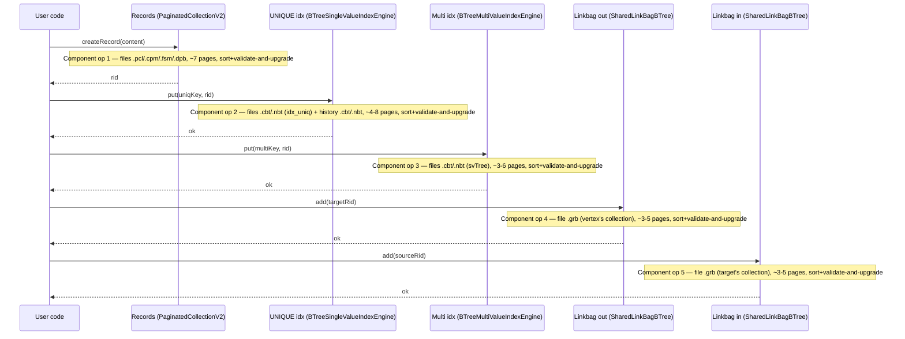

Total per save: **5 sequential component ops, ≈ 20-31 page upgrades**
spread across them. Each op runs its own sort over a small page set
(`O(n log n)` where n is the per-op page count, typically 3-10).
Component ops are entered and exited one at a time; no engine calls
another engine's public method while inside its own component op,
and no component op nests under another.

### Each component op is independent

`AtomicOperationBinaryTracking` is the per-component-op state holder
— its `Long2ObjectOpenHashMap<FileChanges>` page-tracking structure,
its `OptimisticReadScope`, and its commit-time sort all reset between
component ops. Concretely:

- `executeInsideComponentOperation(...)` enters a fresh AOBT instance
  for its body.
- The body accumulates page reads (recorded into
  `OptimisticReadScope`) and write-tracking entries (buffered into
  `CacheEntryChanges.changes` per page).
- At the end of the body, `commitChanges` sorts the AOBT's pages by
  `(fileId, pageIndex)`, runs validate-and-upgrade per S3 + S16,
  applies buffered `WALPageChangesPortion`s, and emits PageOp /
  `ComponentOperationEndRecord` / `LogicalOperationDescriptor`
  records.
- The AOBT then deactivates (`active = false`); the next call to
  `executeInsideComponentOperation` opens a brand-new AOBT.

Because the per-op AOBTs are disjoint, the per-op sorts are
independent. Two concurrent threads each running their own N-op
sequences can interleave at any granularity without forming a
deadlock cycle:

- **Optimistic happy path:** `tryConvertToWriteLock(stamp)` is
  non-blocking. Either it returns a non-zero write stamp atomically,
  or it returns `0` and the caller releases all stamps acquired so
  far and falls back. There is no path where a writer holds partial
  write stamps while waiting for another.
- **Fallback path:** the writer takes its component-level exclusive
  lock (per-engine-instance: per-`PaginatedCollectionV2`,
  per-`BTreeSingleValueIndexEngine`, per-`SharedLinkBagBTree`).
  Different engines use different locks, so cross-engine fallbacks
  do not contend. Same-engine fallbacks serialize as today.

### Cross-op atomicity is via logical inverses, not via the sort

The sort gives **per-component-op atomicity** (all pages of one op
flip atomically or the op falls back). It does **not** give
**cross-component-op atomicity** within a tx. If component op #3
fails after ops #1 and #2 committed their physical mutations, the
tx must logically roll back the effects of #1 and #2 — which is
exactly what `AtomicOperation.rollbackLogically` does (D4) using
the per-op `LogicalOperationDescriptor` records (D19, D23, S12).
The sort and the logical rollback are layered, not redundant.

### Memory-only side-channels are not in the sort

Two classes of state mutated during a component op live in tx-local
memory structures, not in `WALPageChangesPortion`s:

- **Snapshot/visibility entries.** `keepPreviousRecordVersion`
  (records-side, D23) and `preserveInSnapshot` (linkbag-side) write
  to `atomicOperation.putSnapshotEntry` /
  `putEdgeSnapshotEntry` — `TreeMap`s on the AOBT instance that
  flush at component-op-end via `flushSnapshotBuffers` (D25). They
  have their own concurrency story (the shared snapshot index's
  thread-safe map operations).
- **Histogram deltas.** `IndexHistogramManager.onPut` /
  `onRemove` accumulate deltas in a tx-local map; the post-commit
  `applyHistogramDeltas` updates an in-memory CHM. No `.ixs` page
  is touched during a session under D27.

The `(fileId, pageIndex)` sort covers only physical-page mutations
captured in `CacheEntryChanges.changes`. It does not — and should
not — cover memory-only state.

### Lock hierarchy across N component ops

| Layer | Lock | Mode | Held for | Citation |
|---|---|---|---|---|
| 1 | `AbstractStorage.stateLock` | read | the entire user-tx commit | `AbstractStorage.java:2084-2235` |
| 2 | Component-level `SharedResourceAbstract.rwLock` | write | one component op (under D18: fallback only) | `AtomicOperationsManager.java:284, 312` |
| 3 | `WOWCache.filesLock` | read | one `WOWCache.load` call (~µs) | `WOWCache.java:1216-1237` |
| 4 | `PartitionedLockManager<PageKey>` | exclusive | one page validate/upgrade (~µs) | `WOWCache.java:1222`, `LockFreeReadCache.java:265` |

Today's layer 2 is held across the entire body of every component
op. Under D18, it disappears from the happy path — the sort +
`tryConvertToWriteLock` replaces it. The fallback path re-acquires
it for one component op's worth of work and releases it before the
next op opens. Multi-collection commits sequence the collection-level
acquire in increasing collection-id order (`AbstractStorage.java:2037`),
so cross-component cycles cannot form.

### L&Y interaction (D12, D17): scope shrinks, sort is unchanged

Today's `BTree.put` triggering a cascading split (leaf → parent →
... → root) runs the entire cascade inside one component op via
recursive `splitNonRootBucket` calls (`BTree.java:1974-2058`). All
split-affected pages buffer into one AOBT and sort together.

Under D17/L&Y, splits decompose into multiple sequential component
ops. Each op handles one split level and emits its own
`ComponentOperationEndRecord`. The per-op page count shrinks (3-4
pages per split level instead of 8-15 for a deep cascade), and the
sort is correspondingly smaller per op.

The L&Y descender (S11) handles the **inter-op** visibility window
where a key has been moved to a right-sibling but the parent has not
yet been updated — readers fall through via the right-link until the
parent catches up. This visibility logic is independent of the sort.
The sort's correctness is unchanged by D17; the L&Y migration only
affects what set of pages each op's sort sees.

### Open follow-ups

- **Topic 2 (bulk-insert coalescing, deferred to a follow-up PR)**
  may grow per-op page count by 10×-100× if a bulk path coalesces
  many records into one component op. The `O(n log n)` sort cost
  stays trivial (n = thousands → microseconds), but the
  validate-and-upgrade fallback domain widens — one stamp
  invalidation cascades the entire batch. Topic 2's design should
  consider mid-batch checkpoint boundaries if profiling shows
  meaningful fallback rates.
- **No additional follow-ups** were surfaced by the Topic 5 audit;
  the per-op sort + per-op rollback layering is sufficient for all
  observed compositions (records + UNIQUE + non-UNIQUE + linkbags +
  history).

## Component File Extension Pattern (D26)

Multiple storage components grow their files on demand:
`PaginatedCollectionV2`'s record store, `CollectionPositionMapV2`,
`FreeSpaceMap`, B-Trees on splits, the non-durable `HistoryBTree`
pre-truncation. Under in-place writes, every extension follows one
shape so recovery and concurrency stay uniform.

The shape:

1. **Extension is one atomic component op.** `addPage(fileId)` +
   per-page init (`*BucketInitOp` or equivalent) + counter bump on
   the metadata page run inside one
   `executeInsideComponentOperation`. Either every step applies at
   recovery or none do.

2. **Logical end ≠ physical end.** The file's physical page count
   (`WriteCache.filledUpTo(fileId)`) is **not** a transactional
   quantity. After a crash where the cache flushed extended pages
   to disk before `ATOMIC_UNIT_END` reached durability for the
   owning tx, the file may have more pages on disk than the
   component's logical size. The component's logical end is the
   counter on its own metadata page (e.g., `MapEntryPoint.fileSize`
   for CPM); allocators must read the counter, never `filledUpTo`.

3. **Counter page is read-tracked in steady state.** The body uses
   `loadPageForWrite` because the rare extension path mutates the
   counter, but commit's **S16** classification falls through to
   validate when the body did not mutate. Steady-state allocates
   therefore do not contend for the counter page's `writeLock`.

4. **Orphan pages on crash mid-extend are tolerated.** Bounded by
   `1 page × concurrent extending component ops` (today: 1 page per
   extender). Future allocates `addPage` past them, leaving them as
   wasted disk space until any future defrag (none in scope). This
   is the single durability cost of trusting the file-size counter
   over `filledUpTo`.

Patterns by component type:

| Component shape | Logical-end source | Examples |
|---|---|---|
| Sequential allocator with explicit counter page | Durable counter on a known metadata page (typ. page 0) | CPM (`MapEntryPoint.fileSize`), and any future component with sequential RID/slot allocation |
| Tree-structured store | Tree topology — page is valid iff linked from another node | `BTree` v3, `SharedLinkBagBTree`, `HistoryBTree` |
| Parallel-to-data-file | Inherited from the data file's logical end | `FreeSpaceMap`, `DirtyPageBitset` |

Tree-structured stores do **not** need a counter — split component
ops establish validity by linking the new page from its parent /
sibling pointers. Parallel-to-data-file components grow lockstep
with the data file's extensions inside the same component op, so no
separate counter is needed.

Why not batch extension. PostgreSQL's `RelationExtendBufferedRel`
extends by `num_pages × (1 + waiterCount)`, capped at 64 (PG 16,
commit `00d1e02b`), to amortize per-relation extension-lock
contention. We considered the analogue ("extend by ~10% of current
file size, capped at 64") but rejected it for the initial cutover.
Once S16 is in place, page-0 contention is bounded by bucket-fill
rate (~1/`MAX_ENTRIES`), not by allocate rate. Batch extension would
reduce that bound by another factor of K but at the cost of more
WAL ops per batch, more orphan pages on crash, and complexity in
the "is the next bucket already pre-allocated?" decision. Deferred
as a profile-driven follow-up; D26 explicitly does not preclude it.

## Approximate Non-Durable FSM (D28)

The original Topic 1b framing assumed the FSM root (`.fsm` page 0)
would be a 100% fallback magnet under in-place writes plus
optimistic stamps. The audit overturned that premise (page 0 is
loaded for write but rarely mutated, thanks to the page-internal
segment-tree's early-exit guard). The follow-up study of
PostgreSQL's FSM (`storage/freespace/README`, `hio.c`, commits
`00d1e02b` / `31966b151e6`) showed a much bigger architectural
opportunity: PG's insert path *eliminates* the FSM hot path
entirely rather than merely deconflicting it. D28 adopts the same
four-layer pattern, adapted to YouTrackDB's component-op
discipline: per-collection target-page cache, lazy FSM updates,
non-durable FSM with crash rebuild (mirroring D27's histogram
treatment), and a per-FSM-page round-robin cursor that spreads
concurrent finds across leaves within the same second-level page.

### Layered design

The hot insert path now consults three resolution layers in
order, falling through only on miss, with a fourth layer
shaping the FSM-read step itself:

1. **Per-collection target-page cache (P2, S18).** A
   `volatile int targetPageIndex` field on
   `PaginatedCollectionV2`. Writers consult it first. On hit, the
   FSM is not touched at all.
2. **FSM read (P2 miss).** `findFreePage` walks the existing
   2-level FSM (page 0 + the relevant second-level page) under
   stamp-based optimistic reads. S16 routes the reads to the
   validate path. **Within the second-level page, layer 4 (P5,
   S20) — the round-robin cursor — biases the descent so
   concurrent FSM-readers fan out across leaves rather than all
   landing on the same leftmost-with-space slot.**
3. **Last-page probe + extension (FSM miss / empty during rebuild
   window).** Same shape as PG's `nblocks - 1` fallback.

The hot insert path now mutates two layers asymmetrically:

- **Target-page cache: every successful write** updates
  `targetPageIndex` to the just-written page index.
- **FSM (S19): never on success**, only on (i) failure-path
  correction, (ii) defrag/delete updates, (iii) post-extension
  publication.

`.fsm` durability inverts: no in-session WAL records / fsync /
`dirtyPages` registration, full snapshot at clean shutdown, wiped
+ rebuilt on crash open.

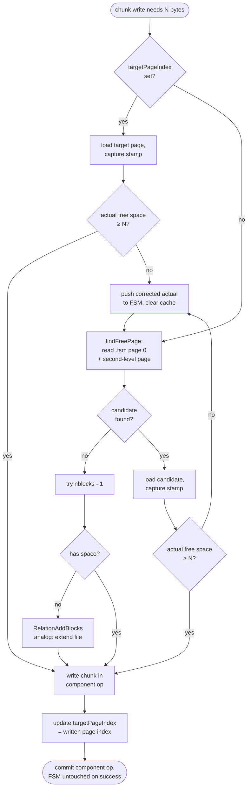

### Class shape

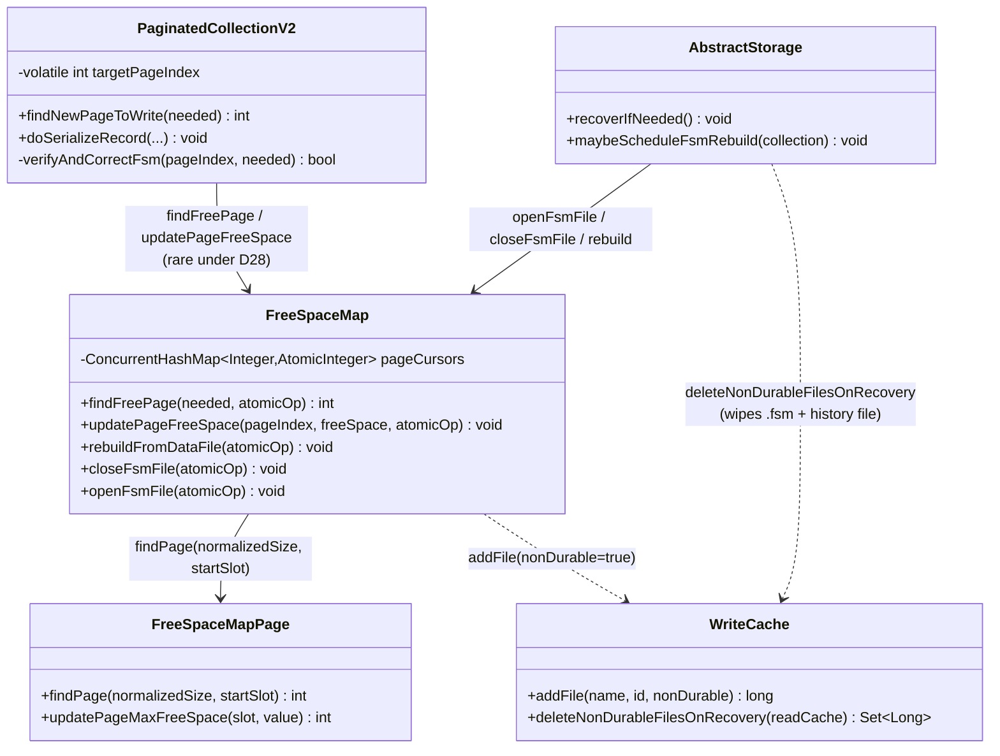

### Layer 1: per-collection target-page cache (S18)

`PaginatedCollectionV2` gains:

```java
private volatile int targetPageIndex = -1;
```

- `findNewPageToWrite(needed)` reads `targetPageIndex` first. If
  it's a valid index (≥ 0), the caller loads that page, captures
  a stamp, and runs the verify-then-correct check.
- On every successful chunk-write commit, the caller updates
  `targetPageIndex = writtenPageIndex` after the page lock is
  released.
- Concurrent writers may converge on the same target. The data
  page's own writeLock + S16 fallback handle the contention, the
  same way as for any hot data page.
- Torn reads: `int` is 32-bit, the JVM guarantees atomic loads /
  stores for `volatile int`, so there are no actual torn reads.
  Even if a stale value is seen (writer A's write-back not yet
  visible to writer B), the verify-then-correct branch catches a
  page that has insufficient space. This matches PG's
  `fp_next_slot` philosophy — accept hint inaccuracy because the
  page-level lock is the source of truth.

`targetPageIndex` is **not durable** — on storage open, it starts
as `-1` (no hint). The first write probes the FSM (or extension)
for a candidate, then re-establishes the cache.

### Layer 2: lazy FSM updates (S19)

The chunk-write path:

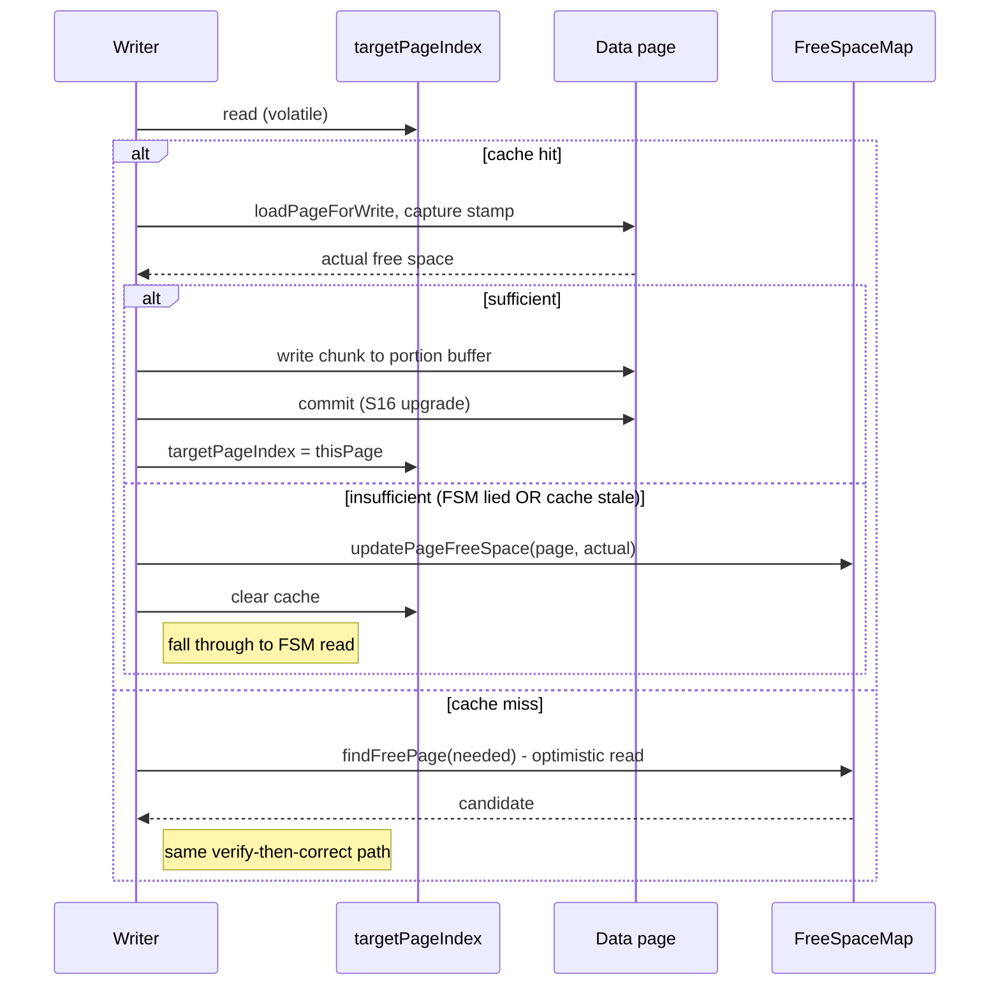

**What does NOT call `updatePageFreeSpace` anymore**: the
chunk-write success branch in `doSerializeRecord`
(`PaginatedCollectionV2.java:709` today). That call is deleted.

**What still calls `updatePageFreeSpace`**:

- **Failure-path correction** (new). When a candidate page is
  found insufficient, push the actual free space (lower than what
  FSM said) and retry `findFreePage`.
- **Defrag / delete paths** (unchanged from today's
  `PaginatedCollectionV2.java:1900-1912`). After
  `doDefragmentation`, push the new (higher) value so the FSM
  reflects newly-freed space.
- **Post-extension publication** (new, mirrors PG's
  `FreeSpaceMapVacuumRange` after `RelationAddBlocks`). After
  `addPage` extends the data file, walk the new pages and publish
  their initial free space values to the FSM.

The asymmetry — lazy on the "space decreases" side, eager on the
"space increases" side — keeps the FSM useful for finding free
space without paying the per-write contention cost. PG makes the
same trade-off via VACUUM (PG's eager-update path on the
"space increases" side).

### Layer 3: non-durable FSM with crash rebuild (S17)

`.fsm` is registered as a non-durable storage component:

```java
fileId = writeCache.addFile(fsmFileName, fileId, /* nonDurable */ true);
```

This is the same mechanism Track H uses for the history B-Tree.
During a session:

- FSM page mutations skip WAL emission, fsync, and `dirtyPages`
  registration.
- The page cache participates normally — cold FSM pages spill to
  disk under memory pressure.
- `closeFsmFile` (called from clean shutdown's flush path) writes
  a one-shot atomic-op snapshot of the entire in-memory FSM state
  to `.fsm`. WAL records are emitted only at this point.

On crash:

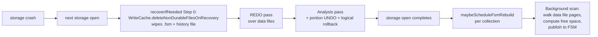

During the rebuild window:

- `findFreePage` returns "no candidate" (empty FSM).
- Writers fall through to `nblocks - 1` last-page probe, then
  extension. New pages are added; FSM is populated for them via
  the post-extension publication path.
- Reads of records / queries are unaffected — FSM is not in the
  read path for record fetches.

After rebuild publish:

- The in-memory FSM is fully populated.
- `findFreePage` returns useful candidates again.
- New chunk writes go to existing under-utilized pages instead of
  extending.

### Layer 4: per-FSM-page round-robin cursor (S20)

PG's `findFreePage` analog (`fsm_search`) starts its within-page
descent at the page-resident `fp_next_slot` cursor and updates it
to `slot + 1` after a successful find. This spreads concurrent
finds across leaves of the same FSM page so that two backends
arriving at the same FSM page receive different leaves (and
therefore target different data pages, removing data-page
contention from the equation entirely).

YouTrackDB adopts the same round-robin discipline but places the
cursor in heap memory rather than on the FSM page:

```java
class FreeSpaceMap {
  private final ConcurrentHashMap<Integer, AtomicInteger>
      pageCursors = new ConcurrentHashMap<>();
}
```

`FreeSpaceMapPage.findPage(normalizedSize)` gains a `startSlot`
parameter:

```java
public int findPage(int normalizedSize, int startSlot) {
  // Bias the segment-tree descent toward the lowest leaf at index
  // >= startSlot with sufficient capacity. If no such leaf exists
  // in [startSlot, CELLS_PER_PAGE), wrap around to [0, startSlot).
  // ...
}
```

`FreeSpaceMap.findFreePage`:

```java
int secondLevelPageIndex = ...; // from page-0 lookup
AtomicInteger cursor = pageCursors.computeIfAbsent(
    secondLevelPageIndex, k -> new AtomicInteger(0));
int startSlot = cursor.get();
int foundSlot = leafPage.findPage(normalizedSize, startSlot);
if (foundSlot >= 0) {
  cursor.lazySet((foundSlot + 1) % FreeSpaceMapPage.CELLS_PER_PAGE);
}
return foundSlot >= 0
    ? foundSlot + secondLevelPageIndex * CELLS_PER_PAGE
    : -1;
```

Three properties make this safe and cheap:

- **Torn reads / stale values are tolerated.** `lazySet` does not
  enforce full memory ordering. Two concurrent finds may read the
  same `startSlot` and end up on adjacent leaves, but the next
  cursor read picks up at least one writer's increment. Even a
  hypothetical impossible-under-Java-int torn read would be
  caught by the descent's clamp to `[0, CELLS_PER_PAGE)`.
- **The descent is a normal optimistic read.** `findPage` is
  invoked under `loadPageOptimistic` for the FSM page. Adding a
  `startSlot` parameter does not change the read posture, the
  stamp capture, or S16 classification.
- **No `WALPageChangesPortion` interaction.** Cursors live in
  heap; FSM pages are not mutated by P5. The page-format and the
  WAL story are entirely unaffected.

**Why we can use heap, but PG cannot.** PG is multi-process —
each backend is a separate OS process with its own heap. A
heap-resident cursor in PG would not be visible across backends,
defeating the point. PG places `fp_next_slot` on the FSM page
header so that the shared buffer pool gives all backends access
to the same value. Mutating the page byte under shared lock
requires PG's hint-bit infrastructure
(`BufferBeginSetHintBits` / `BufferFinishSetHintBits`).

YouTrackDB is single-process — all worker threads share one
JVM heap. A `ConcurrentHashMap<Integer, AtomicInteger>` is
visible to every thread that touches `FreeSpaceMap`, so we get
PG's cooperation property without any cross-process /
hint-bit mechanism. The simplicity comes from the process model,
not from the FSM's crash-wipe.

The crash-wipe (P1) does affect *one* small thing: under our
design the cursor doesn't need to survive any kind of restart,
not even clean shutdown. PG's page-resident cursor naturally
persists across clean shutdowns and gives each fresh backend a
"warm start" position; we lose that on every storage open and
start each cursor at 0. The lost-warm-start cost is negligible
because storage open is rare and the cursor re-establishes itself
within the first few finds for each second-level page.

### When P5 actually matters

Under the four-layer stack, P5's spreading benefit is invisible
in the common case (P2 cache hit, no FSM consultation). It
becomes visible when **multiple writers cache-miss
simultaneously** — for example:

- After a `targetPageIndex` reset triggered by a
  verify-then-correct rejection, several queued writers race to
  re-establish a target via `findFreePage`.
- During the rebuild window after a crash, every chunk write
  cache-misses; without P5 they all converge.
- After bulk extension publishes a tail of new pages with high
  free space; without P5 every find returns the same first new
  page.

In each scenario, without P5 the writers converge on one data
page and contend at the data-page `writeLock`, producing S16
fallback. With P5 they spread across leaves, and each writer
locks a distinct data page. The benefit is bounded by
`min(concurrent-finders, leaves-with-space-on-this-FSM-page)`,
which on a typical second-level FSM page is "all of them."

### Comparison with PostgreSQL

| Mechanism | PostgreSQL | YouTrackDB under D28 |
|---|---|---|
| Per-backend / per-collection insert hint | `smgr_targblock` (per backend, per relation, in relcache) | `targetPageIndex` (per collection, in `PaginatedCollectionV2`) |
| Hint update | every successful insert (`RelationSetTargetBlock`) | every successful chunk-write commit |
| Insert without consulting FSM | most steady-state inserts | most steady-state chunk writes (cache hit) |
| FSM update on success | never | never (S19) |
| FSM update on failure | `RecordAndGetPageWithFreeSpace` (combined push + new candidate) | `updatePageFreeSpace(actual)` then re-call `findFreePage` |
| FSM update on space-increases path | VACUUM | defrag / delete path, eager |
| FSM update after extension | `FreeSpaceMapVacuumRange` after `RelationAddBlocks` | post-extension publication after `addPage`, eager |
| FSM durability | non-WAL-logged hint, `MarkBufferDirtyHint` | non-durable storage component, no WAL/fsync/dirtyPages, snapshot at clean shutdown |
| Crash recovery | self-correcting bubble-up checks + `RBM_ZERO_ON_ERROR` + `fsm_does_block_exist` + 10K-restart valve | `.fsm` wiped before REDO, background rebuild on open |
| Within-page round-robin cursor | `fp_next_slot` on FSM page header, hint-bit writes under shared lock | `pageCursors` heap-resident `ConcurrentHashMap<Integer, AtomicInteger>`, `lazySet` updates |
| Cursor placement rationale | shared-page cursor required by multi-process model | heap-resident cursor sufficient under single-process model |
| Steady-state FSM accuracy | VACUUM | failure-path correction (over-report drift) + eager defrag/extension (under-report drift) |
| Tree depth / fanout | 3 levels, fanout ≈ 4096 | 2 levels, fanout 6117 |

The key adaptations:

- **No VACUUM analog needed for hot pages.** Failure-path
  correction converges automatically — every page that fills up
  triggers a correction the next time it's a candidate.
- **No "FSM points past EOF after WAL replay" handling.** The
  `.fsm` file is wiped on crash, so post-EOF entries can't exist.
- **No `RBM_ZERO_ON_ERROR` for FSM pages.** Mirrors history-tree
  treatment (the file is gone, not approximate).
- **Two levels are enough.** YouTrackDB's 6117 × 6117 = 37 M data
  pages cover any realistic collection. PG's three levels exist
  only because `4096³ > 2³²` and PG must address up to 2³²-1
  blocks per relation.
- **Heap-resident cursor instead of page-resident.** Process
  model dictates this — single-process means heap is shared by
  all readers; multi-process means it isn't. PG's hint-bit
  infrastructure becomes unnecessary in our setting.

### What is NOT changed

- **The page-internal segment tree** (`FreeSpaceMapPage`'s
  12-level binary tree over 6117 cells) is unchanged. The
  per-level early-exit guard at
  `FreeSpaceMapPage.java:232-236` stays — it's still the right
  optimization for the rare update path.
- **`findFreePage`'s root-then-leaf descent** is unchanged at the
  inter-page level. Only the **within-page** descent gains a
  `startSlot` parameter under P5 (S20).
- **The on-disk page format** is unchanged (1 byte per cell,
  segment tree with 6117 leaves) — P5's cursor lives in heap, not
  on the page.
- **The audit's contention analysis** for second-level pages
  remains valid: `(C-1)/N` fallback under uniform writes for
  collections with N second-level pages. Under D28, that
  contention only fires on the rare update paths
  (failure-correction, defrag, extension), so its absolute
  impact is negligible.

### Rebuild semantics and gotchas

- **Per-collection rebuild concurrency.** Each collection's
  rebuild is a single background task. Multiple collections may
  rebuild concurrently bounded by a shared thread budget (same
  shape as D27's index rebuild scheduling).
- **Rebuild ↔ concurrent writes.** During rebuild, writes that
  extend the data file publish to FSM via the post-extension
  path, the rebuild's scan publishes via the same path. Both
  use the existing `updatePageFreeSpace` mutex (page-frame
  StampedLock + S16 upgrade), so concurrent publishes serialize
  per second-level FSM page. The rebuild observes pages newly
  written during the scan; if it observes a partially-written
  page (writer in flight), the leaf cell ends up at whichever
  state the writer commits — the rebuild publishes a snapshot,
  the writer's `updatePageFreeSpace` overwrites it on commit if
  the value differs. Eventual consistency.
- **Cold collections and rebuild deferral.** A collection whose
  first read hits during rebuild gets "no FSM" — falls through
  to extension. If the rebuild has not started yet (scheduling
  budget), a synchronous "rebuild on first use" path is the
  fallback. The exact policy is a Track D / Track F detail.
- **Eager vs lazy rebuild.** The default per **D28** is "eager
  on storage open after crash" — start rebuild tasks for all
  collections immediately. Lazy "rebuild on first
  `findFreePage`" is a per-collection option for very large
  collections; not in initial scope.

### Risks and follow-ups

- **Failure-path correction must exist in code.** Track D's
  implementation must verify the chunk-write code already has a
  "candidate found insufficient" branch, OR add one. Without it,
  a stale FSM entry would direct writers to a too-full page,
  the writers would silently overflow or fail, and the FSM would
  never get corrected. **S19** makes this load-bearing.
- **Drift on cold workloads.** A collection with few writes and
  no extensions could see its FSM drift toward "everything full"
  if many writes filled pages without any failure-path
  corrections firing (e.g., writes that always succeed because
  pages have just enough space). This is unlikely in practice
  but a worst-case footgun. Mitigation: a periodic
  "FSM refresh" task can be added later if profiling shows it,
  but is not in initial scope.
- **Rebuild window after crash with hot insert workload.**
  During rebuild, all writers extend instead of reusing existing
  pages. Bloat is bounded by `concurrent_writers × rebuild_time`
  pages. For a 10-second rebuild at 100 writers, ~1000 extra
  pages. Acceptable; recovers as soon as rebuild publishes.
- **Mid-sized hot collections (10K-100K data pages, 2-17
  second-level pages) under high concurrency** still have the
  natural sharding limit on the rare failure-path corrections.
  Under D28's lazy-update model these corrections fire ~once
  per (page_size / chunk_size) successful writes — i.e., one in
  ~80 chunk writes for typical chunk sizes — so the second-level
  FSM page contention rate is reduced by the same factor.
  Track F's `fsm_failure_correction_rate` metric makes this
  observable.

## Approximate Records Count: Volatile in Steady State, Rebuilt After Crash (D29)

**What.** `PaginatedCollectionV2.approximateRecordsCount` is a
**session-volatile** in-memory `volatile long` field during normal
operation. The `.pcl` page 0 `APPROXIMATE_RECORDS_COUNT` slot is
durable across **clean shutdowns** (read at clean open, written at
clean close) but **wiped on crash**, with the counter reconstructed
by a background scan of the collection's `.cpm` file. No `.pcl`
page 0 writes happen mid-session for this slot; the `FILE_SIZE`
slot on the same page continues under the D26 pattern (rare-write
on extension).

The runtime model:

- **During tx body.** `createRecord` / `updateRecord` /
  `deleteRecord` are normal component ops; they emit
  `LogicalOperationDescriptor` and the usual PageOps for chunk
  pages, CPM, DPB, FSM (mod D23/D27/D28 changes). They do **not**
  load `.pcl` page 0 for write.
- **At commit (component-op-end).**
  `incrementApproximateRecordsCount` /
  `decrementApproximateRecordsCount` mutate only the volatile
  field. No `.pcl` page 0 PageOp; no contribution to
  `tx.maxPageLsn` from the counter.
- **At rollback.** Inverse component ops (D23) decrement /
  increment the volatile counter symmetrically with the forward
  path. No `.pcl` page 0 mutation.
- **At clean shutdown.** `closeCollection` writes the volatile
  counter to the page 0 slot in one atomic component op (the
  existing `setApproximateRecordsCount` setter and
  `PaginatedCollectionStateV2SetApproxRecordsCountOp` PageOp
  are retained — they fire only at close now).
- **At storage open.** `AbstractStorage.recoverIfNeeded` consults
  `checkIfStorageDirty()`:
  - **Clean prior shutdown** → `PaginatedCollectionV2.open` reads
    the page 0 slot into the volatile counter, sets
    `statsStatus = VALID`. The counter is immediately accurate.
  - **Crashed prior shutdown** → `statsStatus = REBUILDING`, the
    volatile counter is initialized to 0 (the slot's value is
    treated as stale), a per-collection background scan is
    scheduled via `maybeScheduleApproxCountRebuild`. Storage
    open completes immediately; consumers see the volatile
    counter at its current (initially 0, accumulating
    post-recovery) value.

### Rebuild source: `.cpm` scan

The CPM is the canonical live-record view: one slot per RID, with
status discriminating `WRITTEN` (live) from `REMOVED` (deleted,
awaiting GC) and other transient states. Counting `WRITTEN` slots
gives the **exact** live count at the moment each bucket page is
read.

Why CPM rather than summing `CollectionPage.ENTRIES_COUNT` across
`.pcl` data pages:

- **Compactness.** CPM slot entries are fixed-size and one per
  RID. Data pages carry variable-size records and additional
  metadata; the scan would read substantially more bytes.
- **Accuracy.** Under D23 / D25, `.pcl` data pages can hold prior
  chunk versions (kept for MVCC visibility, reclaimed by GC after
  LWM advances). Summing `ENTRIES_COUNT` across data pages would
  count those prior versions — inflating the sum.
- **Future-proof.** CPM remains the canonical RID directory under
  any future record-storage refactor; the scan stays valid.

The scan walks bucket pages of the `.cpm` file in order, summing
`WRITTEN` entries into a heap-local `long scan_count`. Per-bucket
reads use the standard optimistic-read primitive
(`executeOptimisticStorageRead`); on stamp invalidation, the
scan retries that bucket — giving per-bucket-consistent reads.

### Concurrent rebuild merge: drift-tolerant bulk-publish

The scan runs in the background while CRUDs continue. The merge
follows the same lossy-publish shape as **D27** for histograms:

```
volatile.approximateRecordsCount  -- updated by every CRUD during REBUILDING
scan_count                        -- accumulated by background scan, heap-local
publish:
  volatile.approximateRecordsCount =
      max(0, volatile.approximateRecordsCount + scan_count)
  statsStatus = VALID
```

**Drift formula.** Let `P` = pre-rebuild live count.
For each bucket b, let `C_before(b)` / `D_before(b)` = creates /
deletes that committed to b **before** the scan reached b, and
`C_after(b)` / `D_after(b)` = same after. Sum across all buckets:

```
scan_count       = P + C_before − D_before
delta_at_publish = (C_before + C_after) − (D_before + D_after)
post_publish     = scan_count + delta_at_publish
                 = P + 2·C_before + C_after − 2·D_before − D_after
true_value       = P + C_before + C_after − D_before − D_after
error            = C_before − D_before  (net pre-scan-reach CRUDs)
```

The error is bounded by the volume of CRUDs racing the scan
during the rebuild window. For typical workloads (rebuild on
seconds-to-minutes; CRUD rate thousands/sec) the error is small
relative to a million-record collection (≪ 1%, biased toward the
direction of net CRUD activity). The `max(0, ...)` clamp prevents
delete-heavy rebuild bursts from producing user-visible negative
counts. This drift is acceptable for the explicitly-approximate
counter contract; an exact alternative using per-bucket "scanned"
coordination via validate-and-upgrade is documented in **D29**'s
"alternatives" but not adopted (consumers needing exactness are
gated on `statsStatus`, not on the count value).

### `StatsStatus` and consumer protocol

`PaginatedCollectionV2` carries a
`volatile StatsStatus statsStatus` field with two values:
`VALID` and `REBUILDING`. The class-level adapter
`SchemaClass.getStatsStatus(session)` returns `REBUILDING` if any
underlying collection is `REBUILDING`, `VALID` only when all
are `VALID`. The session-level accessor
`DatabaseSessionEmbedded.getCollectionStatsStatus(collectionId)`
exposes the per-collection value.

| Consumer | Behavior while `REBUILDING` |
|---|---|
| `SQLDropClassStatement.executeDDL` (without `UNSAFE`) | Throw `CommandExecutionException`: "Cannot DROP CLASS while statistics are being rebuilt; pass UNSAFE to override or wait." |
| `SQLTruncateClassStatement.executeDDL` (without `UNSAFE`) | Same shape, "Cannot TRUNCATE CLASS while statistics are being rebuilt..." |
| `SelectExecutionPlanner.handleClassAsTargetWithIndex` / `handleClassAsTargetWithIndexRecursive` | Skip the empty-class per-subclass optimization (treat count as not-yet-knowable; planner falls back to its standard plan path) |
| `IndexAbstract.rebuild()` count-zero guard at line 988 | Unchanged — existing comment already documents "false-zero harmless because rebuild is idempotent" |
| `PaginatedCollectionV2.isGcTriggered` | Read volatile as-is; bounded transient drift may push GC trigger temporarily |
| `EdgeFanOutEstimator`, `MatchExecutionPlanner`, `SQLWhereClause` cardinality | Read volatile as-is; cardinality estimates are already approximate |
| Public API: `getApproximateCollectionCount`, `getApproximateCollectionElementsCount`, `approximateCountClass` | Return volatile as-is (the API name says "approximate") |
| Tools: `CheckIndexTool`, `DatabaseExport`, `BonsaiTreeRepair`, `GraphRepair`, `DatabaseRecordWalker` | Read volatile as-is (progress / informational) |
| `BalancedCollectionSelectionStrategy` | Read volatile as-is (load balancing tolerates transient imbalance) |

### Sequencing within recovery

```
AbstractStorage.recoverIfNeeded():
  if checkIfStorageDirty():
    // Crashed prior shutdown
    deleteNonDurableFilesOnRecovery()         // D6 + D27 + D28 file wipes
    REDO replay                               // forward WAL pass
                                              //   (also identifies
                                              //    in-flight unitIds)
    Portion-level UNDO                        // mid-component-op restore

    // D32: in-flight tx reconstruction
    inFlightUnitIds = analysis pass output
    construct AtomicOperationsTable(
        tsOffset = min(min(inFlightUnitIds),
                       idGen.getLastId() + 1))
    For each unitId in inFlightUnitIds:
      atomicOperationsTable.startOperation(unitId, segment)
    recoveryHolder = new TsMinHolder(
        tsMin = min(inFlightUnitIds))
    tsMins.add(recoveryHolder)

    // D32: logical rollback inside recoverIfNeeded
    For each tx_W in inFlightUnitIds:
      rollbackLogically(tx_W)                 // each inverse runs as its
                                              //   own atomic op via
                                              //   endAtomicOperation;
                                              //   IN_PROGRESS entry from
                                              //   above satisfies the CAS
    tsMins.remove(recoveryHolder)
    assert atomicOperationsTable has 0 IN_PROGRESS  // S23

    // Background rebuild scheduling (D27/D28/D29/D30)
    For each PaginatedCollectionV2 c:
      c.statsStatus = REBUILDING
      c.approximateRecordsCount = 0           // ignore page-0 slot
      maybeScheduleApproxCountRebuild(c)
    For each B-Tree index engine e:
      e.approximateIndexEntriesCount.set(0)
      maybeScheduleIndexCountRebuild(e)
    maybeScheduleHistogramWork()              // D27
    maybeScheduleFsmRebuild()                 // D28
  else:
    // Clean prior shutdown
    construct AtomicOperationsTable(
        tsOffset = idGen.getLastId() + 1)     // no in-flight txs
    For each PaginatedCollectionV2 c:
      c.approximateRecordsCount = readPage0Slot(c)
      c.statsStatus = VALID
    // (analogous for index counters per D30)
// after recoverIfNeeded returns:
//   remaining storage-open work runs, then STATUS.OPEN flips,
//   GC becomes eligible, background rebuilds proceed
```

The background rebuild task per collection:

```
maybeScheduleApproxCountRebuild(c):
  background:
    long scan_count = c.cpm.scanLiveSlotCount()
    c.publishRebuildResult(scan_count)
      // atomically:  approximateRecordsCount += scan_count
      //              approximateRecordsCount = max(0, approximateRecordsCount)
      //              statsStatus = VALID
```

### Crash scenarios

| Crash point | Outcome |
|---|---|
| Mid-session, before any clean close | Page 0 slot's persisted value is from initial create or prior clean close — stale. On open: `REBUILDING`, volatile = 0, scan kicks off. |
| Mid-`closeCollection` (during clean shutdown's slot write) | Storage marked dirty by `checkIfStorageDirty`. On next open: `REBUILDING`, volatile = 0, scan kicks off. |
| Mid-rebuild scan (during background CPM walk) | Volatile counter is wherever CRUDs put it; `scan_count` is heap-local and discarded. On next open: `REBUILDING` again, scan re-kicks off. |
| Mid-`publishRebuildResult` | Cannot crash here mid-step — the publish is a single atomic op on heap state with no durability. After crash: same as "mid-session". |

There is no "applied delta from aborted tx" window for the
counter — inverse component ops on rollback decrement / increment
the volatile counter symmetrically with the forward path, and any
rolled-back CRUD's volatile increment is reversed by its inverse.
The volatile counter is never updated by recovery's REDO pass —
it always starts from rebuild's bulk-publish (or from the page 0
slot on clean open).

### Why this design

Four alternatives were considered against (b) — the chosen design:

- **(a) A.1.0 — accept rebuild-window drift on every consumer.**
  Documents "DROP / TRUNCATE without UNSAFE may succeed on
  non-empty classes during rebuild." Real DDL safety hole.
  Rejected.
- **(c) A.1.s — synchronous rebuild on crash open.** Eliminates
  the rebuild window at the cost of unbounded storage-open time
  proportional to data volume. For a multi-TB database, open
  could block for hours. Rejected.
- **(d) A.1.x — DDL guards fall back to slow exact scan during
  REBUILDING.** No new public-API surface, but DDL pays an O(N)
  data-page scan during the rebuild window; doesn't compose
  cleanly with the SelectExecutionPlanner empty-class case.
  Rejected.
- **(e) Per-bucket "scanned" coordination via
  validate-and-upgrade.** Heap-resident per-bucket flag mutated
  under the bucket page's `tryConvertToWriteLock`; CRUDs check
  the flag at body time and fall back on stamp invalidation, fully
  conforming to S3. Zero drift but adds a per-CRUD code path
  during the rebuild window and requires a new heap structure on
  CPM. Considered, retained as a future option for any consumer
  that needs exactness; not adopted because all current consumers
  needing exact behavior are gated on `statsStatus`, not on the
  count value.

### Gotchas

- **Drift bias is upward in create-heavy workloads.**
  `error = C_before − D_before` tends positive when rebuild
  happens during steady inserts. The user-visible effect is
  "approximate count slightly larger than true" temporarily,
  converging as the workload mixes deletes. Well within the
  documented contract.
- **`closeCollection` is the only mid-session `.pcl` page 0 slot
  write for `APPROXIMATE_RECORDS_COUNT`.** Operationally rare;
  one atomic component op per collection per clean shutdown. WAL
  volume contribution from the counter drops to ~one record per
  collection per clean shutdown — drastically lower than today's
  per-CRUD frequency.
- **`statsStatus` is per-collection, not per-storage.** Different
  collections finish their rebuilds at different times
  (proportional to their CPM file size). DDL guards on a class
  with multiple underlying collections see the class-level
  adapter, which is `REBUILDING` if any single underlying
  collection is `REBUILDING`.
- **`FILE_SIZE` slot is unaffected.** Read-track in steady state
  via `loadPageForRead` on read sites; write-track via
  `loadPageForWrite` on the rare extension path. Page 0 still
  uses `loadPageForWrite` on extension; S16 keeps the
  steady-state no-mutation reads on the validate path.
- **Inverse component ops continue updating the volatile
  counter.** The D23 inverse for `RECORD_CREATE` decrements;
  for `RECORD_DELETE` increments; for `RECORD_UPDATE` no net
  change. Recovery's REDO pass does **not** touch the volatile
  counter — it always starts from rebuild's publish (or
  clean-open's slot read).
- **`PaginatedCollectionStateV2SetApproxRecordsCountOp` PageOp
  is retained.** Used only by `closeCollection` at clean
  shutdown — same record type, drastically lower frequency.
  No format change.
- **Crash during clean-close write** is handled by the existing
  dirty-flag mechanism. On next open, the storage is marked
  dirty, `statsStatus = REBUILDING`, scan kicks off — same as
  any other crash.
- **`getApproximateCollectionCount` semantics during the rebuild
  window** — the public API still returns a non-negative `long`.
  Users who care about the rebuild state can call
  `getCollectionStatsStatus(collectionId)`; users who don't see
  the volatile value as it accumulates from 0 toward the true
  count. No exception, no null return.

## Index Counters: Volatile in Steady State, Rebuilt via Leaf Scan (D30)

D30 is the index-engine analog of D29 (records counter): the
B-Tree-side `approximateIndexEntriesCount` (and, for
`BTreeMultiValueIndexEngine`, the parallel `approximateNullCount`)
becomes volatile in steady state and durable only at clean
shutdown. The design pattern mirrors D29 with two key differences:

1. **No `StatsStatus` flag for indexes** — the audit revealed all
   index-count consumers are advisory or self-correcting, so no
   rebuild-window gating is needed.
2. **Rebuild source is a leaf scan with visibility filtering**,
   not a `.cpm` scan — B-Tree leaves are the canonical structural
   source for "live entries."

### The hot-page problem the audit surfaced

The audit traced `BTree.addToApproximateEntriesCount`
(`BTree.java:970-982`) and found that on every commit
that changes visible entries, the entry-point page 0 of the
B-Tree is loaded for write to update the
`APPROXIMATE_ENTRIES_COUNT_OFFSET` slot. Under the new in-place-
write + optimistic-stamp model, this means:

- Every concurrent index writer's commit calls
  `tryConvertToWriteLock` on the entry-point page.
- All-but-one fall back, drop their work, retry under the
  short-term component exclusive lock.
- This is the same shape as the `.pcl` page 0 hot-page problem
  D29 fixed for record counts — and unlike `.pcl page 0`'s
  `FILE_SIZE` (which is mutated only on rare extension), the
  index counter slot is **always genuinely mutated** on every
  commit. **S16's empty-buffer-validate escape does not help**:
  the mutation buffer is never empty for this page; every
  commit produces a real `WALPageChangesPortion` entry for the
  slot write.

For multi-value indexes the contention is doubled — both the
`svTree` and the `nullTree` carry their own entry-point page,
and both are loaded for write on every commit that touches
either non-null or null entries.

### The fix: heap-resident in steady state, page snapshot at close, lazy rebuild on crash

```
B-Tree single-value engine:
  AtomicLong approximateIndexEntriesCount  (steady-state source of truth)
                                                |
  (every put/remove changing visible entries) — addAndGet(delta)
                                                |
  (clean shutdown via BTree.close) ----- one-shot: setApproximateEntriesCount
                                                |
                                                v
                          entry-point page 0 slot — durable only at clean shutdown

B-Tree multi-value engine:
  AtomicLong approximateIndexEntriesCount   (svTree counter)
  AtomicLong approximateNullCount           (nullTree counter)
                                                |
  (every put/remove)        — addAndGet on the appropriate field
                                                |
  (clean shutdown — engine close drives both    one-shot per tree
   svTree.close() and nullTree.close())              |
                                                    v
                         two entry-point page 0 slots — one per tree
```

On crash open:

```
recoverIfNeeded:
  if checkIfStorageDirty():
    for each B-Tree index engine:
      approximateIndexEntriesCount.set(0)
      approximateNullCount.set(0)        # multi-value only
      maybeScheduleIndexCountRebuild(engine)
```

The background rebuild task per engine:

```
maybeScheduleIndexCountRebuild(engine):
  background:
    long scan_count = engine.btree.scanLiveEntryCount()
    long null_scan_count = engine.nullBtree?.scanLiveEntryCount()  # multi-value only
    engine.publishRebuildResult(scan_count [, null_scan_count])
      // atomically:
      //   approximateIndexEntriesCount += scan_count
      //   approximateIndexEntriesCount = max(0, approximateIndexEntriesCount)
      //   (and analogous for approximateNullCount)
```

### Rebuild source: leaf scan with visibility filtering

`BTree.scanLiveEntryCount()` walks all leaves of the B-Tree in
key order. For each leaf, it opens a per-leaf optimistic-read
scope and counts entries.

For **UNIQUE indexes** under D6 (single-version-in-tree), every
in-tree entry is a live key. The scan devolves to
`Σ(bucket.size)` — fast and exact. No visibility filtering
needed.

For **non-UNIQUE indexes** under D7's composite key
`(K, RID, ts)`, leaves contain entries from multiple versions
of `(K, RID)` lifecycles plus tombstones. The scan walks
`(K, RID)` groups (entries with the same `(K, RID)` prefix
form a contiguous run within each leaf, sorted by `ts`):

```
scanLiveEntryCount (non-UNIQUE):
  count = 0
  for each (K, RID) group in leaf-traversal order:
    entries = group.entries sorted by ts descending
    most_recent = entries[0]
    if most_recent.is_tombstone:
      count += 0           # group has been deleted
    else:
      count += 1           # group has a live insert
    # skip pre-LWM obsolete entries — they're below LWM,
    # not visible to any reader, GC-eligible (Tier-1
    # split-time GC will reclaim them at next split).
  return count
```

The same per-`(K, RID)` group visibility logic that today's
`BTreeMultiValueIndexEngine.buildInitialHistogram` applies for
its exact-total recalibration. The implementation refactors the
filtering routine into a reusable static helper called from both
sites.

### Concurrent rebuild merge: drift-tolerant bulk-publish

Same shape as D29:

```
publishRebuildResult(long scanCount):
  while (true):
    long current = approximateIndexEntriesCount.get()
    long candidate = max(0, current + scanCount)
    if (approximateIndexEntriesCount.compareAndSet(current, candidate)):
      break
```

CRUDs that committed to a leaf before the scan reached that
leaf are double-counted by the bulk-publish. Bounded error,
biased upward in put-heavy workloads, can briefly produce
negative pre-clamp values in remove-heavy rebuild bursts. The
`max(0, ...)` clamp prevents user-visible negative counts.

### Why no `StatsStatus` for indexes

D29 maintains a per-collection `StatsStatus { VALID, REBUILDING }`
flag because two consumers genuinely need rebuild-window
gating: `SQLDropClassStatement` / `SQLTruncateClassStatement`
(DDL safety guards using class record count as a soft-fence with
`UNSAFE` escape) and `SelectExecutionPlanner.handleClassAsTargetWith
Index*` (empty-class per-subclass plan optimization that bypasses
subclass plans on `count == 0`).

The audit established that **no analog exists for index counts**:

- `IndexAbstract.getSize()` (public API) — explicitly named
  "approximate"; consumers tolerate drift.
- Query planner selectivity (`SelectExecutionPlanner`,
  `MatchExecutionPlanner`) — drift-tolerant; lower selectivity
  during the rebuild window leads the planner to prefer
  index-using plans, which still produce correct results
  because the underlying B-Tree leaves are intact.
- `MatchExecutionPlanner` and the planner's
  `SelectExecutionPlanner.handleClassAsTargetWithIndex` use
  **class record counts** (D29's domain), not index entry
  counts. There's no empty-index optimization.
- `IndexCountDelta` — already documented as drift-tolerant ±1
  in the plan.
- `IndexAbstract.rebuild()` guard — false-zero documented as
  harmless because rebuild is idempotent.
- `AbstractStorage.wireHistogramManagerOnLoad` (line 2611) —
  the histogram-manager bootstrap migration path that calls
  `getTotalCount`. Under D27 it fires only on fresh databases
  without a `.ixs` file, so `counter == 0` is the correct
  value at that callsite.

No DDL guard uses index counts as a soft-fence. The cleanest
implementation is therefore **no flag** — Track A's existing
`StatsStatus` enum stays scoped to per-collection use under
D29. If a future consumer needs gating, adding
`getIndexStatsStatus()` is a non-breaking additive extension.

### Crash scenarios

| Crash point | Outcome |
|---|---|
| Mid-session, before any clean close | Entry-point slot's persisted value is from initial create or prior clean close — stale. On open: heap counter = 0, scan kicks off in background. |
| Mid-`BTree.close` (during clean shutdown's slot write) | Storage marked dirty by `checkIfStorageDirty`. On next open: heap counter = 0, scan kicks off. |
| Mid-rebuild scan (during background leaf walk) | Heap counter is wherever CRUDs put it; `scan_count` is heap-local and discarded. On next open: rebuild re-kicks off. |
| Mid-`publishRebuildResult` | Cannot crash mid-CAS — single atomic op on heap state with no durability. After crash: same as "mid-session". |

There is no "applied delta from aborted tx" window — inverse
component ops on rollback decrement / increment the heap
counter symmetrically with the forward path.

### Gotchas

- **No `StatsStatus` for indexes** — see "Why no `StatsStatus`"
  above. If a future feature adds a DDL guard using index
  counts as a soft-fence, the gating must be added then;
  D30 does not preclude it.
- **`BTree.scanLiveEntryCount` reuses `buildInitialHistogram`'s
  filtering logic.** A single helper produces the live count
  for both the histogram bootstrap path and the rebuild path —
  same semantics, no risk of divergent counts between the two.
- **Multi-value engines emit two close-time snapshots.** The
  engine's `close()` method drives `svTree.close()` (writes
  `approximateIndexEntriesCount` to svTree's entry-point) and
  `nullTree.close()` (writes `approximateNullCount` to
  nullTree's entry-point) in sequence. Each is a normal
  atomic component op; ordering between them is irrelevant.
- **Drift bias is upward in put-heavy workloads** — same
  formula as D29 (`error = P_before − R_before`). Within the
  advisory contract.
- **Entry-point page 0 stays at its existing offset and
  width.** No on-disk format change. The
  `APPROXIMATE_ENTRIES_COUNT_OFFSET` slot is untouched in
  shape; only the *frequency* of writes changes (per-CRUD →
  one shot per clean shutdown).

## Linkbag `treeSize` Counter Dropped (D31)

D31 is structurally different from D30. The audit established
that `SharedLinkBagBTree`'s entry-point page 0 `treeSize` slot
has **no consumer** in production code — it's dead state being
maintained by every `updateSize()` call. The fix is **deletion**
rather than refactoring.

### What the audit found

Direct grep for `getTreeSize` across the codebase identified:

- **Production code**: a single call site at
  `SharedLinkBagBTree.java:1142`, **inside `updateSize()`
  itself** (the read-modify-write computing `prev + diff`).
  The reader is the writer.
- `SharedLinkBagBTree.load()` (line 74) opens the file but does
  not restore size from page 0. The B-tree never reads its own
  slot.
- **Test code only**: `BTreeMVEntryPointV2OpTest` and similar
  unit tests verify the `EntryPoint` page-format serialization,
  not the runtime semantics of the slot. These tests can be
  updated to drop the linkbag-side `treeSize` assertions.

The runtime size source is **`AbstractLinkBag.size`** — a
heap-resident field on the `LinkBag` wrapper, maintained by
every add/remove. It's read by 17 distinct production consumer
sites (wire-format serialization, embedded↔BTree conversion
thresholds, `GraphRepair` downgrade, query optimizer / hash
join capacity hints, public iteration-wrapper APIs, ArrayList
capacity hints, etc.) — none touch the B-tree slot.

The durability path is **wire-format serialization in the
enclosing record**:

```
Save:
  EntitySerializerDelta.writeLinkBag(bag):
    write bag.size()  // heap field
    [write per-edge data]

Load:
  EntitySerializerDelta.readLinkBag(buffer):
    int size = read()
    return new BTreeBasedLinkBag(session, pointer, size, counterMaxValue)
                                                    ^
                       passed to AbstractLinkBag(session, size, counterMaxValue)
                       which sets the heap field.
```

Records are the unit of storage; no code path loads a
`BTreeBasedLinkBag` independently of its enclosing record's
wire format. After a crash, the record's wire format provides
the size on the next read — the B-tree itself never needs to
"remember" its size.

### What gets deleted

```
SharedLinkBagBTree:
  - updateSize(long, AtomicOperation)  // method itself
  - call sites:
      put() at line 609
      removeEntryByKey() at line 669
      tombstone GC path at line 1203
      cross-tx tombstone insertion at line 1515

WAL records:
  - RidbagEntryPointSetTreeSizeOp.java
  - WALRecordTypes registration
  - PageOperationRegistry registration

Tests:
  - BTreeMVEntryPointV2OpTest assertions on linkbag-tree treeSize
    (asserting the slot value would be removed; the EntryPoint
    page-format test can still check the slot's existence and
    width if desired, just not its dynamic value).
```

What stays:

```
EntryPoint (page format):
  TREE_SIZE_OFFSET slot — left in place (cosmetic dead bytes;
  removing it would require touching EntryPoint.init() which
  serves the still-live `pagesSize` slot too. Optional cosmetic
  cleanup later).

EntryPoint.init():
  setTreeSize(0) on tree creation — left as-is. Fires once per
  tree creation; not a hot path.

EntryPoint.setTreeSize / getTreeSize accessor methods:
  Left in place as accessors for any future code that wants to
  add a counter back. Currently unused in production code.
```

### Why a separate D-record (D31) from D30

The change shape is fundamentally different:

- **D30** refactors a *live* counter (used by advisory consumers
  via `IndexAbstract.getSize()`) to a non-hot-path
  implementation. The counter is preserved; only its
  persistence model changes.
- **D31** removes *dead code*. The `treeSize` slot has no
  consumer. The fix is deletion.

Combining them in one D-record obscures both patterns; the
audit explicitly distinguished them. Reviewing them as
separate decisions is clearer for future readers.

### `HistoryBTree` follows the same principle (D6 clarification)

The history tree's counter has no consumer either — Track H's
read path scans by descending range; Track E's purge walks by
cursor; recovery wipes the file before REDO; S13 wipes any
persisted slot on every open. So Track H's `BTree`
constructor variant takes a `maintainCounter=false` flag that
disables `addToApproximateEntriesCount` (no-op) and skips
`BTree.close`'s counter snapshot. Same principle, applied at
the `BTree` v3 base-class level rather than as a deletion.

## BTree v3 `treeSize` Counter Dropped (D34)

D34 is the index-side analog of D31: the same audit shape applied to
the *index* B-Tree's entry-point page 0 finds a `treeSize` slot whose
maintenance is pure cost on the write path under in-place updates,
and whose few production consumers can be replaced with a structural
or heap-counter equivalent at zero functional cost.

### What the audit found

`BTree v3` (the index B-Tree backing both
`BTreeSingleValueIndexEngine` and
`BTreeMultiValueIndexEngine`) maintains an exact `treeSize` field on
its entry-point page 0, separately from the
`approximateIndexEntriesCount` slot that D30 covers. Every
`BTree.put` / `BTree.validatedPut` / `BTree.remove` calls
`BTree.updateSize(diff)`, which loads page 0 for write and stores
`prev + diff` — emitting a `BTreeSVEntryPointV3SetTreeSizeOp` WAL
record per CRUD. Under in-place writes + optimistic stamps, this is
the same fallback-magnet pattern the D29/D30 audits surfaced for
`.pcl` / `.cbt` page 0: every concurrent index commit calls
`tryConvertToWriteLock` on the entry-point page, all-but-one falls
back, and the contention floors at the per-tree commit rate.

The audit traced every production caller of `BTree.size()` (the only
public getter that reads `entryPoint.getTreeSize()`):

| Site | What it reads `size()` for | Replacement |
|---|---|---|
| `BTreeSingleValueIndexEngine.doClearTree` (lines 133, 155) | Loop termination ("tree is empty") + per-pass progress detection ("removed ≥1 entry") | `firstKey(atomicOperation) != null` for termination (O(1) under L&Y); per-pass counter incremented inside the iterate-and-remove `forEach` for progress detection |
| `BTreeSingleValueIndexEngine.load` (line 185) | Backward-compat fallback when `getApproximateEntriesCount() == 0` — comment: *"Upgrade path: APPROXIMATE_ENTRIES_COUNT was not present in prior format"* | Delete the fallback branch — the plan's no-on-disk-compat invariant means no source database lacks the slot |
| `BTreeMultiValueIndexEngine.load` (lines 221, 226) | Same backward-compat fallback for both `svCount` and `nullCount` | Delete both fallback branches |
| `BTreeSingleValueIndexEngine.clear` (line 230) | Diagnostic label inside an `assert firstKey() == null : "..."` failure message | Replace `treeSize=` label with `approximateCount=` (already present in same message) or drop entirely |
| `BTreeMultiValueIndexEngine.clear` (lines 274, 277) | Same diagnostic label for both svTree + nullTree postcondition asserts | Same replacement |

The public `IndexEngine.size(...)` API does **not** delegate to
`BTree.size()` — it reads the engine's heap
`approximateIndexEntriesCount.get()` directly
(`BTreeSingleValueIndexEngine.java:481`). So `IndexAbstract.getSize()`
consumers — query-planner selectivity, `MatchExecutionPlanner`,
`IndexCountDelta`, the histogram bootstrap path — are unaffected by
removing `BTree.size()`.

All other call sites are tests, exclusively under
`core/src/test/.../sbtree/singlevalue/v3/`. They are mechanically
updated to use `getApproximateEntriesCount()` (exact in test contexts
under D30 — no crashes / rebuilds occur during tests) or
`firstKey() != null`. The op-table tests
(`CellBTreeSingleValueEntryPointV3Test`,
`BTreeSVEntryPointV3AndNullBucketOpTest`) keep their slot/accessor
coverage — the page-format machinery is retained.

### What gets deleted

```
BTree.java:
  - updateSize(long, AtomicOperation)              // method itself
  - five call sites of updateSize(...) in put / remove paths
       (lines 762, 800, 827, 1016, 1465)
  - size(AtomicOperation)                          // production-facing getter

WAL records:
  - BTreeSVEntryPointV3SetTreeSizeOp.java          // op class
  - WALRecordTypes registry entry
  - PageOperationRegistry registry entry

Engine-side migrations:
  - BTreeSingleValueIndexEngine.doClearTree:       size()-loop → firstKey()/counter
  - BTreeSingleValueIndexEngine.load:              delete count==0 fallback
  - BTreeSingleValueIndexEngine.clear:             swap treeSize=/approximateCount=
  - BTreeMultiValueIndexEngine.load:               delete two count==0 fallbacks
  - BTreeMultiValueIndexEngine.clear:              swap diagnostic labels (×2)

Test migrations:
  - BTreeOptimisticReadTest, BTreeTombstoneGCTest,
    BTreeTombstoneGCStressTest, BTreeGetBenchmark,
    BTreeTestIT — replace size(...) with
    getApproximateEntriesCount(...) or firstKey()
```

What stays:

```
EntryPoint.TREE_SIZE_OFFSET slot — left in place (cosmetic dead
  bytes; removing would require touching EntryPoint.init() which
  also serves the still-live pagesSize slot).
EntryPoint.setTreeSize(long) / getTreeSize() accessor methods:
  retained — used by the op-table tests to verify page-format
  serialization. Production code does not call them after this
  deletion.
EntryPoint.init() — unchanged. Continues to write treeSize=0
  on tree creation. Fires once per tree, harmless.
BTree.getApproximateEntriesCount() — retained. Under D30 it
  becomes a heap-field read.
```

### `doClearTree` progress detection — the only non-trivial change

The current `doClearTree` uses `sbTree.size()` twice per pass: once
as the loop guard and once as the after-pass count, and computes
`removedInPass = sizeBeforePass - sizeAfterPass` to detect a "broken
cursor" case where a pass yields zero entries (the spliterator
terminated prematurely after page modifications, never converging).

Under D34, both reads of `size()` are replaced. The loop guard
becomes `firstKey(atomicOperation) != null` — a structural O(1)
descent that's correct regardless of in-flight tombstones / split
states under the L&Y descender (S11). Progress detection becomes a
local `int removedInPass = 0` counter inside the pass, incremented
inside the `forEach` lambda whenever `sbTree.remove(key) != null`.
The "removed 0 entries" hard check fires when the counter is zero
after the pass.

The new check is strictly more accurate than the old delta-based
check: the counter is incremented exactly when a `remove()` call
actually removed an entry, with no possibility of seeing a stale
page-0 count between passes (which under heavy concurrent commits
could in principle have shown a falsely-larger `sizeBeforePass` than
the post-pass number of remove-eligible entries). The error-message
shape is preserved (engine name + id + pass number + `firstKey()`
state before/after for diagnosis).

### Why a separate D-record (D34)

D34's pattern is symmetric to D31 (linkbag-side dead-counter
deletion):

| | D31 (`SharedLinkBagBTree.treeSize`) | D34 (`BTree v3.treeSize`) |
|---|---|---|
| Audit finding | Slot has **zero** production consumers — `EntryPoint.getTreeSize()` is called only inside `updateSize()` itself (the read in `prev + diff`); no external code reads it | Slot has **five** production consumers but every one has a clean replacement (structural emptiness check or heap-counter alias) |
| Action | Delete `updateSize()`, delete WAL op, leave dead slot | Delete `updateSize()`, delete `size()`, delete WAL op, migrate consumers, leave dead slot |
| Live counter coexisting on same page? | No. The linkbag-side `EntryPoint` has only `treeSize` (dead) and `pagesSize` (live) | Yes. The index-side `EntryPoint` has `treeSize` (dead under D34), `pagesSize` (live), `freeListHead` (effectively dormant under D20 + L&Y), `approximateEntriesCount` (live under D30) |
| Justification for separate D-record from D30 | Different shape: D30 refactors a live counter to non-hot-path; D31 deletes dead code | Same distinction: D30 refactors live; D34 deletes dead-after-replacement |

Combining D31 and D34 in one D-record would obscure the per-tree
audit evidence (different consumer maps, different file paths,
different test surfaces). Combining D30 and D34 would obscure the
"refactor vs. deletion" distinction. The three records together form
a coherent family: D30 keeps the live counter cheap, D31 + D34
delete the dead ones.

### Risks and follow-ups

- **Confidence in "consumers are easily replaceable":** the audit
  used PSI `ReferencesSearch` over the project scope to enumerate
  every caller of `BTree.size()`. Surface area is small (one B-Tree
  class, two index engines). All readers identified. A future
  feature that needs an exact tree-walking count can add an
  explicit helper method (or call `getApproximateEntriesCount()`,
  which is exact in steady state under D30).
- **Page-format slot is not removed.** Like D31, the cosmetic
  cleanup of the `TREE_SIZE_OFFSET` slot is deferred. Removing the
  slot would require coordinated edits to `EntryPoint.init()`, the
  `BTreeSVEntryPointV3InitOp` WAL record, and the offset constants
  on the page — out of scope for D34.
- **`BTree.size()` deletion vs alias retention** was considered.
  An alternative — keep `size()` as an inline alias for
  `getApproximateEntriesCount()` — was rejected because (i) two
  methods with identical semantics invite future drift in test
  code, and (ii) the test surgery is mechanical. If a future reader
  expects an exact structural count, they should call a tree-walking
  helper explicitly; an alias would silently mislead.
- **Recovery does not need the slot.** The
  `BTreeSVEntryPointV3SetTreeSizeOp` WAL record's REDO and
  portion-UNDO paths become unreachable for this op type after
  deletion. No additional recovery work needed (Track L's existing
  `CellBTreeMultiValue*` deletion has the same shape).

## B-Tree `pagesSize` Counter Dropped, Orphan Pages on Crash Tolerated (D35)

D35 closes the loop on D26's framing for tree-structured stores
("tree-structured stores do **not** need a counter") by deleting the
`pagesSize` slot that both `BTree v3` and `SharedLinkBagBTree`
currently maintain on entry-point page 0. With `treeSize` already
gone (D31, D34) and `freeListHead` dormant after Track L's no-merge
decision (D20), `pagesSize` was the last per-CRUD page-0 mutation on
the B-Tree write path. Deleting it eliminates the dominant
write-path hot-spot at the cost of permanent orphan-page leakage on
crash mid-split — a cost equivalent to D26's existing tolerance for
CPM mid-extend.

### What the audit established

`BTree.allocateNewPage` (BTree v3, called once per non-root split
and twice per root split) and the inline `addPage` + `setPagesSize`
blocks in `SharedLinkBagBTree.splitNonRootBucket` (lines 916-932)
and `SharedLinkBagBTree.splitRootBucket` (lines 1042-1071) all
share the same shape:

```
loadPageForWrite(ENTRY_POINT_INDEX) {       ← page 0 write-tracked every split
  freeListHead = entryPoint.getFreeListHead();
  if (freeListHead > -1) {                  // (A) recycle from free list
    rightBucketEntry = loadPageForWrite(freeListHead);
    entryPoint.setFreeListHead(bucket.getNextFreeListPage());
  } else {
    pageSize = entryPoint.getPagesSize();
    if (pageSize < filledUpTo - 1) {        // (B) reuse pre-allocated page
      pageSize++;
      rightBucketEntry = loadPageForWrite(pageSize);
      entryPoint.setPagesSize(pageSize);
    } else {                                 // (C) extend via addPage
      rightBucketEntry = addPage(fileId);
      entryPoint.setPagesSize(rightBucketEntry.getPageIndex());
    }
  }
}
```

Branch-by-branch reachability after Track L:

| Branch | When it fires | Status under Track L + D35 |
|---|---|---|
| **(A)** Free-list recycle | Pages added by merge code; `addToFreeList` only called from `mergeNoneLeafWithLeftSiblingAndRemoveItem` / `mergeNoneLeafWithRightSiblingAndRemoveItem` | Dormant. D20 deletes merges → free list never grows. The `getFreeListHead` read always returns -1 |
| **(B)** Pre-allocated reuse | Requires `filledUpTo` to exceed `pagesSize + 1`. The invariant `pagesSize == filledUpTo - 1` holds at every committed component-op boundary (`addPage` and `setPagesSize` happen in the same op). Branch fires only when a crash leaves `filledUpTo` durable but `setPagesSize` rolled back via UNDO | **Pure recovery-time orphan-page reclamation.** Not reachable in steady-state operation |
| **(C)** Extend the file | `pagesSize == filledUpTo - 1` — the steady-state path | Always fires in steady-state |

### Recovery has no special B-Tree orphan handling today

`AbstractStorage.recoverIfNeeded` body audit (1717 chars total):
zero references to `BTree`, `orphan`, `truncate`, `filledUpTo`,
`freeList`, `pagesSize`, or `compact`. Recovery does not scan files
for unreachable pages, does not truncate, does not rebuild any free
list. Orphans introduced by crashed mid-split component ops persist
on disk until a future split happens to cover them via branch (B).

Removing branch (B) makes orphan-page leakage permanent. Recovery
is unchanged; the file simply grows past the orphans on the next
allocation.

### Quantitative orphan-leakage bound

```
orphan_pages_per_crash  ≤  2  ×  concurrent_in_flight_splits_at_crash_time
                        across all trees in the storage
```

The factor of 2 reflects root splits allocating 2 pages each (root
splits are rare — `log_factor` of total splits — but the bound holds
worst-case).

Worked example for a stress workload:

- 16 cores × 10 trees actively writing ≈ 160 in-flight splits at
  crash time
- Worst case: 320 orphan pages × 8 KB = **2.5 MB per crash**
- Over 100 crashes lifetime: **~250 MB** total disk waste across
  the entire database

For typical OLTP workloads (handful of concurrent writers per tree,
few crashes per year): **KB to low MB per crash, low MB lifetime**.

D26's existing precedent for CPM `MapEntryPoint.fileSize`:
*"Orphan pages on crash mid-extend are tolerated. Bounded by 1 page
× concurrent extending component ops (today: 1 page per extender).
Future allocates `addPage` past them, leaving them as wasted disk
space until any future defrag (none in scope). This is the single
durability cost of trusting the file-size counter over `filledUpTo`."*

For B-Trees the bound is `≤ 2 pages × concurrent extending splits`
— same order of magnitude, same operational model. D35 is the
B-Tree implementation of D26's framing.

### What gets deleted

```
BTree.java:
  - allocateNewPage(AtomicOperation): collapsed to
      `return addPage(atomicOperation, fileId);`
  - assertFreePages(AtomicOperation): test-only debug helper, deleted
  - removePagesStoredInFreeList(...): companion helper, deleted
  - doAssertFreePages(...): companion helper, deleted

SharedLinkBagBTree.java:
  - splitNonRootBucket entry-point block (lines 916-932): replaced
      with `final var rightBucketEntry = addPage(atomicOperation, fileId);`
  - splitRootBucket entry-point block (lines 1042-1071): replaced
      with two consecutive `addPage` calls

WAL records:
  - BTreeSVEntryPointV3SetPagesSizeOp.java
  - RidbagEntryPointSetPagesSizeOp.java
  - WALRecordTypes registry entries
  - PageOperationRegistry registry entries

Test call sites updated (assertFreePages no longer exists):
  - BTreeTestIT.java:533, 591
  - BTreeReadMethodsTest.java:315, 336

Op-table tests adjusted (drop SetPagesSizeOp coverage; slot accessor
coverage retained since page format is unchanged):
  - CellBTreeSingleValueEntryPointV3Test
  - BTreeSVEntryPointV3AndNullBucketOpTest
  - RidbagEntryPointOpsTest
```

What stays:

```
EntryPoint.PAGES_SIZE_OFFSET slot — left in place (cosmetic dead
  bytes, like the treeSize slot under D31 / D34).
EntryPoint.setPagesSize(int) / getPagesSize() accessor methods:
  retained for op-table tests of the page-format serialization.
  Production code does not call them after this deletion.
EntryPoint.init() — unchanged. Continues to write pagesSize=1
  on tree creation. Fires once per tree, harmless.
EntryPoint.getFreeListHead() / setFreeListHead(int): retained
  for the same reason. The slot becomes dead state along with
  pagesSize since the no-merge decision (D20) prevents the
  free list from ever growing.
```

### Why a separate D-record

D35 sits in the same family as D31, D34, and D30 but has a distinct
correctness argument:

| | Argument shape |
|---|---|
| **D30** (`approximateIndexEntriesCount`) | Refactor a *live* counter to a non-hot-path implementation; consumers continue to read it via the engine's heap field |
| **D31** (linkbag `treeSize`) | Delete a *truly dead* counter; audit found zero production consumers |
| **D34** (BTree v3 `treeSize`) | Delete a counter whose few production consumers all have clean replacements (`firstKey() != null` / `getApproximateEntriesCount()`) |
| **D35** (`pagesSize` on both trees) | Delete a counter whose only "consumer" is recovery-time orphan reclamation, accepting permanent orphan-page leakage |

D35's risk profile is different — the only one of the four that
trades a feature (orphan reclamation) for a hot-path cost reduction.
Keeping it as a separate record preserves the audit evidence and
the explicit accept/reject decision on the trade-off.

### Risks and follow-ups

- **Permanent orphan-page leakage on crashes.** Bounded above as
  `2 × concurrent splits at crash time`. For typical workloads
  this is sub-MB per crash and sub-100-MB lifetime. If profiling
  ever shows this becoming operationally relevant, a defrag pass
  (none currently in scope) is the long-term reclaim mechanism.
- **`assertFreePages` tree-structural completeness invariant
  lost.** The L&Y descender's correctness is preserved by Track L
  step L5's jetCheck property tests, which provide stronger and
  more rigorous coverage than the deleted helper ever did (every
  key reachable, sibling-pointer chain consistent, no key
  duplication, empty-leaf descent correctness). The 4 test callers
  of `assertFreePages` are updated to no-ops or simple
  reachability checks; their key-level get/range assertions
  already cover the behaviour the helper's structural check was
  defending.
- **Linkbag `splitRootBucket` slight optimization preserved.**
  Today the link-bag root split batches its two allocations into
  a single `setPagesSize(pageSize)` write at the end of the block
  (line 1070). Under D35 the entire block collapses to two
  `addPage` calls; the batching is irrelevant because there are
  no `setPagesSize` writes left.
- **`freeListHead` slot becomes vestigial state.** The
  `addToFreeList` helper is unreachable after Track L (no merges).
  The `getFreeListHead` read in the deleted `allocateNewPage`
  goes away with the rest of the block; no other production code
  reads the slot. Like `pagesSize` and `treeSize`, the slot stays
  in the page format as cosmetic dead bytes (a coordinated removal
  of all three would be a future cleanup commit).
- **No interaction with the cache layer's `addPage` semantics.**
  `addPage` continues to extend `filledUpTo` atomically and return
  a unique fresh page index. The cache's free-list of stolen pages
  (a separate mechanism, internal to the cache layer) is unchanged.
  The B-Tree's deleted "free list" was an in-tree mechanism for
  reusing pages freed by merge — it had no relationship with the
  cache's eviction policy.

## Legacy On-Disk Version Variants Dropped (D38)

D38 closes the loop on the dead-code housekeeping family that
already includes Track L's `CellBTreeMultiValueV2*` deletion plus
D31 / D34 / D35 (dead-counter cleanups). The audit established that
several pre-cutover versioned packages and version-discriminator
branches are reachable in production code only as defensive rejects
or through legacy WAL replay — both already broken by the plan's
no-on-disk-compat invariant. Deleting them simplifies the codebase
without changing the post-cutover storage contract.

### What the audit found

Direct inspection of the version-variant surface across
`core/src/main/java/com/jetbrains/youtrackdb/internal/core/`:

- **`storage/index/sbtree/singlevalue/v1/`** (2 classes:
  `CellBTreeBucketSingleValueV1`, `CellBTreeSingleValueEntryPointV1`)
  — pure dead Java code; no production references.
- **`storage/index/sbtree/local/v1/`** (3 classes: `SBTreeBucketV1`,
  `SBTreeNullBucketV1`, `SBTreeValue`) — same status.
- **`storage/index/sbtree/local/v2/`** (~18 classes: `SBTreeBucketV2`,
  `SBTreeNullBucketV2`, plus 16 `*Op.java` WAL records) —
  registered in `PageOperationRegistry` (PO IDs 264–278) and
  `WALRecordTypes` (legacy IDs 121–126), but no production
  write-side call sites outside the package itself. All
  instantiations are inside the package's own `*Op.apply()`
  deserialization paths and page init methods. Reachable in
  production only through legacy WAL replay, which the plan's
  no-on-disk-compat invariant already breaks.
- **`BTreeSingleValueIndexEngine` constructor**
  (`core/.../index/engine/v1/BTreeSingleValueIndexEngine.java:57-72`)
  — accepts `version == 3 || version == 4`; both branches
  instantiate the same `BTree<>` v3 class. Behaviorally identical;
  V3 is dead code by construction.
- **`StorageCollectionFactory.createCollection`**
  (`core/.../storage/collection/v2/StorageCollectionFactory.java`,
  lines ~40-74) — rejects `binaryVersion` 0/1/2 with
  `IllegalStateException`; only 3 returns a valid collection. The
  reject ladder is kept for defensive code, but with no producer
  ever writing those values, it is uninhabitable code paths.
- **`IndexEngineData.version`**
  (`core/.../config/IndexEngineData.java:23, 137`) — sole
  consumers are `DefaultIndexFactory.createIndexEngine`
  (engine dispatch) and `CollectionBasedStorageConfiguration` (de)serializers
  (lines 505, 1485, 1564, 1642). No schema callbacks, no rebuilds,
  no migrations branch on it.
- **`StoragePaginatedCollectionConfiguration.binaryVersion`**
  (`core/.../config/StoragePaginatedCollectionConfiguration.java:41,
  89-91`) — same shape; sole consumer is
  `StorageCollectionFactory.createCollection`'s reject path.

`CollectionBasedStorageConfiguration` itself is **already on the
latest internal stack**: `private final BTree<String> btree`
imported from
`internal.core.storage.index.sbtree.singlevalue.v3.BTree` (line
34, line 133, instantiated at lines 160-162), and
`private final PaginatedCollection collection` instantiated at
lines 152-159 via `StorageCollectionFactory.createCollection()`
with `PaginatedCollection.getLatestBinaryVersion() == 3`. Track L's
L&Y conversion + D31 / D34 / D35 counter cleanups + D18 / D36
concurrency improvements all apply to the configuration's internal
B-Tree automatically — no separate migration of the configuration
class is required.

### What gets deleted

```
storage/index/sbtree/singlevalue/v1/  (entire package)
  CellBTreeBucketSingleValueV1.java
  CellBTreeSingleValueEntryPointV1.java

storage/index/sbtree/local/v1/  (entire package)
  SBTreeBucketV1.java
  SBTreeNullBucketV1.java
  SBTreeValue.java

storage/index/sbtree/local/v2/  (entire package, ~18 classes)
  SBTreeBucketV2.java
  SBTreeNullBucketV2.java
  + 16 *Op.java WAL record classes

WAL registries (registry entries only — receivers are deleted):
  PageOperationRegistry.java
    PO IDs 264–278 (lines 376-427)
  WALRecordTypes.java
    legacy IDs 121–126 (lines 328-350)

Engine version-dispatch:
  BTreeSingleValueIndexEngine.java (constructor, lines 57-72)
    if (version == 3 || version == 4) ... → if (version == 4) ...
  DefaultIndexFactory.createIndexEngine (lines 114-154)
    consolidate version-dispatch arms to V4-only

Collection-factory reject ladder:
  StorageCollectionFactory.createCollection (lines ~40-74)
    binaryVersion 0/1/2 reject branches collapsed into a single
    "binaryVersion != 3 → throw" guard
```

### What stays

```
IndexEngineData.version
  Field unchanged; persisted as 4 in all post-D38 writes.
  database.ocf binary layout unchanged.

StoragePaginatedCollectionConfiguration.binaryVersion
  Field unchanged; persisted as 3 in all post-D38 writes.
  database.ocf binary layout unchanged.

CollectionBasedStorageConfiguration
  No migration. Already on BTree v3 + PaginatedCollectionV2.

EntryPoint slots (TREE_SIZE_OFFSET, PAGES_SIZE_OFFSET,
freeListHead, etc.)
  Unchanged from D31 / D34 / D35 status — left as cosmetic dead
  bytes; future coordinated cleanup commit may drop them.

PaginatedCollection.getLatestBinaryVersion()
  Unchanged; returns 3.

BTreeIndexEngine.VERSION
  Unchanged; remains 4 (the single canonical version).

DefaultIndexFactory.getLastVersion(algorithm)
  Unchanged; returns BTreeIndexEngine.VERSION = 4 for the BTREE
  algorithm.
```

### Why a separate D-record

D38 sits in the same "dead-code housekeeping" family as Track L's
existing `CellBTreeMultiValueV2*` deletion and D31 / D34 / D35
(dead counters), but the change shape is distinct from each:

| | What it deletes | Why distinct |
|---|---|---|
| `CellBTreeMultiValueV2*` (existing in Track L) | An entire orphaned package replaced by single-value `BTree<CompositeKey>` | Replaced by a different mechanism in `BTreeMultiValueIndexEngine` |
| **D31** | A live counter slot with no consumer | Runtime size source is `AbstractLinkBag.size`, durability is wire-format |
| **D34** | A live counter slot whose few consumers all have clean replacements | Migrate to `firstKey() != null` / `getApproximateEntriesCount()` |
| **D35** | A live counter slot whose only "consumer" is recovery-time orphan reclamation | Trade orphan reclamation for hot-path cost reduction |
| **D38** | Pre-cutover version variants reachable only through dead branches or legacy WAL replay | The plan's no-on-disk-compat invariant has already invalidated their reachability |

D38's risk profile is different from the others — the only change
in the family that touches **version-discriminator code paths**
rather than counter slots or orphaned packages. Keeping it as a
separate record preserves the audit evidence and the explicit
accept/reject decision on the (deferred) on-disk-format
simplification.

### Risks and follow-ups

- **Pre-PR `database.ocf` files become unopenable.** Any blob
  written before this PR with `version == 3` for a single-value
  index hits `BTreeSingleValueIndexEngine`'s V4-only reject at
  storage open. Acceptable per the plan's no-production-users
  invariant; the failure mode is fail-fast with an explicit error
  message, not silent corruption.
- **Pre-PR WAL records under `local/v2/` PO IDs (264–278) become
  unreplayable.** Recovery on a database whose last WAL segment
  contains these records fails fast at the WAL deserializer.
  Acceptable per the same invariant; consistent with Track L's
  existing `CellBTreeMultiValueV2*` deletion.
- **Persisted version fields (`IndexEngineData.version`,
  `StoragePaginatedCollectionConfiguration.binaryVersion`) stay in
  `database.ocf`.** Future cleanup commit may drop them; out of
  scope for this PR. The marginal byte savings (4 bytes per index /
  cluster per config write) do not justify a binary-layout change
  here.
- **No interaction with Track D's cutover or any other track.**
  D38's edits are mechanical version-selector consolidations and
  package deletions; they touch no concurrency primitive, no
  durability protocol, no recovery path beyond what the plan's
  no-on-disk-compat invariant already accepts.

## Recovery: In-Flight Transaction Reconstruction (D32)

**What.** When `AbstractStorage.recoverIfNeeded` runs after a crashed
prior shutdown, the WAL contains a mix of completed
(`ATOMIC_UNIT_END` recorded) and in-flight (`ATOMIC_UNIT_START` with
no matching end) transactions. D32 prescribes how recovery
reconstructs the in-flight state in `AtomicOperationsTable`, holds
the LWM behind their `commitTs` during the rollback window, and runs
logical rollback for each before the storage transitions to
`STATUS.OPEN`.

The strategic context — alternatives, rationale, the three pre-D32
gaps that motivated this work — lives in D32. This section documents
the mechanism's runtime shape, the idempotence story under recovery
recrash, and the edge-case behavior.

### The mechanism in four steps

After Step 0 (non-durable file wipe), REDO, and portion-level UNDO
have run, recovery performs:

1. **Defer table construction.** `AbstractStorage` constructs
   `AtomicOperationsTable` only *after* WAL analysis has identified
   the set of in-flight `unitId`s. The constructor signature is
   unchanged; only the call site moves. `tsOffset` is computed as
   `min(min_in_flight_unitId, idGen.getLastId() + 1)` so the
   internal `CASObjectArray` window covers every in-flight `unitId`.

2. **Re-register in-flight txs.** For each `unitId` in the
   in-flight set, recovery calls
   `atomicOperationsTable.startOperation(unitId, segment)` where
   `segment` is the WAL segment identifier of that tx's
   `ATOMIC_UNIT_START` record. The entry transitions to IN_PROGRESS
   — the same state any runtime tx occupies between
   `startToApplyOperations` and `endAtomicOperation`.

3. **Install a recovery-window `TsMinHolder`.** A synthetic
   per-storage holder — not bound to any thread — is added to the
   storage's `tsMins` set with `tsMin = min(in-flight unitId)`.
   From this point forward `computeGlobalLowWaterMark` returns
   `min(in-flight unitId)` unmodified, matching the value every
   in-flight tx_W's `visibility_key.newRecordVersion` is keyed at;
   the strict-less eviction predicate (`recordTs < lwm`) then
   guarantees that prev chunks for every tx_W remain.

4. **Run logical rollback; remove the holder; assert S23.** For each
   in-flight tx, recovery invokes `rollbackLogically` which walks
   the reconstructed `TransactionWriteLog` in reverse and emits
   inverse component ops. Each inverse runs as its own atomic op
   via `endAtomicOperation`; the IN_PROGRESS entry created in
   step 2 satisfies the CAS in `commitOperation`. Once the last
   in-flight tx has transitioned to ROLLED_BACK, the synthetic
   holder is removed from `tsMins`. `AtomicOperationsTable` now
   contains zero IN_PROGRESS entries — the S23 post-condition.
   `recoverIfNeeded` returns; the remaining storage-open work
   runs and `STATUS.OPEN` flips. GC becomes eligible and observes
   no in-flight state.

### Idempotence under recovery recrash

Recovery itself can crash mid-rollback. The CLR `PageOperation`
records emitted by completed inverses are durable WAL records by
construction (they ride on the same WAL machinery as runtime
PageOps). On the next recovery:

- Step 0, REDO, and portion-level UNDO run normally. REDO replays
  the completed CLRs, advancing each affected page's LSN past the
  recovery-emitted PageOps. The post-REDO state reflects the
  partial rollback the crashed recovery completed.
- WAL analysis still classifies the original tx_W as in-flight
  (its original `ATOMIC_UNIT_START` is still in the WAL; the
  crashed recovery emitted CLRs but did not write a closing
  `ATOMIC_UNIT_END(rollback=true)` for the tx_W envelope itself).
  D32's reconstruction therefore re-registers tx_W and walks the
  `TransactionWriteLog` in reverse — but each individual inverse
  is naturally idempotent (writing the same `prev_value` /
  `prev_position_entry` twice produces the same end state). The
  reverse walk picks up from wherever the previous recovery left
  off without explicit replay-detection logic.
- The recovery-window `TsMinHolder` is re-installed with the same
  `tsMin = min(in-flight unitId)` value. The LWM holds back the
  same set of prev chunks.

End state after a clean second recovery matches what a single
uninterrupted recovery would have produced.

### Edge cases

- **Tx with `ATOMIC_UNIT_START` and no PageOps.** No durable
  effect, no `LogicalOperationDescriptor` in WAL, the
  reconstructed `TransactionWriteLog` is empty. `rollbackLogically`
  has nothing to invert; the envelope still goes through
  `endAtomicOperation` to transition the entry to ROLLED_BACK.

- **Tx mid-component-op (no `ComponentOperationEndRecord`).**
  Portion-level UNDO restores the affected pages physically. The
  reconstructed `TransactionWriteLog` does not contain a
  descriptor for the unfinished component op (descriptors land in
  WAL alongside the component-op-end). The remaining reverse walk
  handles only the *completed* component ops of the same tx.

- **Tx already rolled back pre-crash
  (`ATOMIC_UNIT_END(rollback=true)` in WAL).** WAL analysis sees
  the matched start+end and classifies the tx as completed. It
  does NOT appear in the in-flight set; no re-registration or
  rollback work is performed for it. REDO has already replayed
  the original tx's CLRs.

- **Tx committed pre-crash
  (`ATOMIC_UNIT_END(rollback=false)`).** Same as above, treated
  as completed. REDO replays the committed PageOps; the tx is
  durable.

- **Long pre-crash idle period.** tx_W's `unitId` was assigned
  long before crash. Recovery reconstructs its IN_PROGRESS entry
  at the original `unitId` value (deferred `tsOffset` covers this
  case). The recovery-window holder's
  `tsMin = min(in-flight unitId)` is potentially far below
  `idGen.getLastId()` post-recovery — that holds back LWM
  correctly, ensuring even very-old prev chunks remain reachable
  for the inverse op.

### Why this shape

GC's self-gating on `STATUS.OPEN` already provides a dormancy
window we can stretch. By running logical rollback inside
`recoverIfNeeded` — before `STATUS.OPEN` flips — D32 ensures GC
literally cannot observe in-flight state, regardless of any
future GC code path that might forget a guard flag. The cost is a
bounded increase in storage-open latency proportional to
in-flight-tx count × per-inverse cost; Track F's
`recovery_logical_rollback_duration_seconds` and
`recovery_in_flight_tx_count` metrics surface outliers.

The recovery-window `TsMinHolder` reuses existing
`tsMins`-and-`computeGlobalLowWaterMark` infrastructure without
any consumer-side changes. Alternative shapes considered (a steady-
state writer-LWM via `AtomicOperationsTable.getMinActiveOperationTs()`,
a per-collection ROLLING_BACK flag consulted by GC) are documented
in D32; both deferred as out-of-scope for the recovery-only
correctness chain.

## DPB: Volatile in Steady State, Conservatively Rebuilt After Crash (D33)

The **Dirty Page Bitset** (`CollectionDirtyPageBitSet`, `.dpb` file
extension) is a per-collection structure that records, for each
data-file page index, whether that page contains at least one stale
chunk needing GC. It is the discovery accelerator for
`PeriodicRecordsGc.processDirtyPage` — without it, GC would have to
scan every data page to find stale chunks. Today it is a durable
file: every `keepPreviousRecordVersion` call (every cross-tx UPDATE
and every DELETE) does `loadPageForWrite` on the relevant `.dpb`
page and emits a `DirtyPageBitSetPageSetBitOp` WAL record
(`CollectionDirtyPageBitSet.java:123`,
`PaginatedCollectionV2.java:1500`).

Each `.dpb` page is a flat 65,312-bit bitset over a contiguous
range of 65,312 data pages (`DirtyPageBitSetPage.java:12-24`,
`USABLE_BYTES = 8164`, `BITS_PER_PAGE = 65,312`). For a typical
OLTP workload — hot-tail allocation, working-set-localized
updates, time-windowed activity — the hot range fits in one
65,312-data-page window (≈500 MB of records at 8 KB pages). Under
the in-place-write model, every concurrent updater whose stale
chunk falls in that window targets the **same** DPB page, and
each commit's `tryConvertToWriteLock` on that page invalidates
every other concurrent updater's stamp. The result is the same
shape as `.pcl page 0` and `.cpm page 0` before D29/D26: a 100%
fallback magnet that throttles per-collection update throughput
to `1 / commit-latency` per hot DPB page — strictly worse than
today's `acquireExclusiveLock` floor.

D33 lifts DPB out of the per-CRUD page-mutation path entirely.

### Mechanism

1. **Heap-resident bitset is the steady-state source of truth.**
   `CollectionDirtyPageBitSet` carries an
   `AtomicLongArray`-backed bitset (sized at construction to the
   collection's `filledUpTo` page count, grown via
   `ensureCapacity` on demand). `set(int pageIndex, ...)`,
   `clear(int pageIndex, ...)`, and `nextSetBit(int searchFrom,
   ...)` operate on the heap bitset only — no `.dpb` page is
   touched during a session.
2. **`.dpb` registered non-durable.** `WriteCache.addFile(name,
   id, /* nonDurable */ true)` — same call shape used by Track H
   for the history B-Tree and by D28 for the FSM. Page mutations
   during a session emit no WAL records, no `dirtyPages` entries,
   and no `tx.maxPageLsn` contributions.
3. **Clean shutdown writes a snapshot.** `closeDirtyPageBitSet`
   walks the heap bitset and writes its contents to `.dpb` via
   the existing `DirtyPageBitSetPage.init` + `setBit` per-page
   machinery, sequenced into one atomic component op. The three
   `DirtyPageBitSetPage{Init,SetBit,ClearBit}Op` records (WAL
   IDs 215/216/217) remain in the codebase but are emitted only
   on close-path flushes — drastically lower frequency than
   per-CRUD.
4. **Crash open wipes `.dpb` and initializes "all bits set".**
   `WriteCache.deleteNonDurableFilesOnRecovery` deletes `.dpb`
   files alongside `.fsm` (D28) and the history-tree file (D6)
   before REDO begins. After REDO, each
   `CollectionDirtyPageBitSet.open` initializes its heap bitset
   to "all bits set" for `[0, filledUpTo)` — every existing data
   page is conservatively assumed to have stale chunks.
5. **GC converges the bitset.** No separate background rebuild
   task. `PeriodicRecordsGc.processDirtyPage` is the natural
   convergence consumer — its normal cycle reads each dirty
   page, inspects for stale chunks, reclaims any below LWM, and
   clears the DPB bit when no stale chunks remain. The first
   post-crash GC cycle walks every page once; subsequent cycles
   converge to normal cost.

```mermaid
sequenceDiagram
    participant Writer as Updater (updateRecord)
    participant Heap as Heap bitset (AtomicLongArray)
    participant GC as PeriodicRecordsGc
    participant DPB as .dpb file (on disk)

    Note over Heap,DPB: Steady state — DPB on disk is stale; heap is the source of truth
    Writer->>Heap: keepPreviousRecordVersion → bitset.set(oldPageIndex)
    Note right of Heap: O(1) atomic word OR — no WAL, no fsync, no tryConvertToWriteLock
    GC->>Heap: nextSetBit(searchFrom)
    GC->>GC: processDirtyPage(pageIndex) — reclaim eligible chunks
    GC->>Heap: bitset.clear(pageIndex) if no stale chunks remain

    Note over Heap,DPB: Clean shutdown
    Heap->>DPB: closeDirtyPageBitSet writes heap bitset to .dpb in one component op

    Note over Heap,DPB: Crash open
    DPB-->>DPB: WriteCache.deleteNonDurableFilesOnRecovery wipes .dpb
    Heap->>Heap: open() initializes heap bitset to "all bits set" for [0, filledUpTo)
    Note over GC: First post-crash GC cycle walks every page; clears bits for clean pages; converges over subsequent cycles
```

### Why GC alone, not a rebuild task

D27 (histograms), D29 (record count), and D30 (index entry
count) each use a separate background task that scans a structural
source (index leaves, CPM file, B-Tree leaves) to compute the
correct value, then bulk-publishes. DPB does not need that shape
because **GC IS already the consumer** that walks dirty pages and
clears their bits. The conservative "all bits set" initial state
just makes GC's first cycle do extra work — exactly the work GC
would have done if it scanned every page. There is no separate
"correct value" to compute; GC's normal logic produces the right
state by inspection.

### Why no `StatsStatus`-style flag

D29 introduced a per-collection `StatsStatus` (`VALID` /
`REBUILDING`) because two consumers — DDL safety guards
(`DROP CLASS` / `TRUNCATE CLASS` without `UNSAFE`) and the
SelectExecutionPlanner empty-class optimization — produce wrong
results when they read a not-yet-converged count. D30 documented
that **no** index-count consumer needs gating (all are advisory
or self-correcting); the `StatsStatus` flag was therefore
intentionally omitted for D30.

DPB has the same audit shape as D30: GC is the only consumer,
and GC tolerates the conservative "all bits set" state
gracefully — it just walks more pages than needed. No DDL guard,
no query planner optimization, no other caller reads DPB. So no
`DpbStatus` flag is maintained. (Adding one later as an additive
extension is non-breaking if a future consumer requires gating.)

### Concurrent convergence ↔ writes

During the convergence window, concurrent updates set bits via
heap-atomic bit-set; concurrent GC clears bits for
inspected-and-clean pages. Both operations are atomic on the
underlying `AtomicLongArray`; the race is benign:

- Updater sets bit at index P → page P becomes dirty.
- GC reads `nextSetBit(P)` → returns P.
- GC inspects page P, finds no stale chunks remaining (e.g., LWM
  has advanced past all of them).
- Concurrent updater sets bit P again (page P becomes dirty
  again — new stale chunk created).
- GC clears bit P (the one it observed).
- Next GC cycle reads `nextSetBit(P)` → returns P (the new
  setter's bit) → re-inspects.

No correctness issue; just a transient extra walk. The same race
can already happen today between durable-DPB writers and durable-
DPB-clearer GC; D33 does not introduce a new failure mode.

### Bit-set ↔ data-page apply ordering

Today, the DPB-bit-set runs inside the same component op as the
data-page write that creates the stale chunk; both are durable in
the same WAL portion. Under D33, the bit-set is heap-only — not
durable — while the data-page write remains durable. If the
storage crashes between the data-page write becoming durable and
clean shutdown, the heap bit is lost. **But that's exactly the
case the conservative "all dirty" rebuild covers**: at the next
crash open, the heap bitset is initialized to "all bits set", so
the lost bit is conservatively re-asserted. GC's first cycle
inspects the page, finds the stale chunk, and either reclaims it
(if LWM allows) or leaves the bit set for a future cycle. **No
correctness gap.**

### Memory footprint

Bitset = K bits for K data pages → K/8 bytes. Sample sizes:

| Collection size (data pages) | Bitset memory |
|---|---|
| 1 M pages (~8 GB) | 125 KB |
| 10 M pages (~80 GB) | 1.25 MB |
| 100 M pages (~800 GB) | 12.5 MB |
| 1 B pages (~8 TB) | 125 MB |

Same magnitude as comparable per-collection heap structures
(snapshot index, FSM cache, target-page hint cache).

### Crash scenarios

- **Crash mid-update, before clean shutdown.** Heap bit lost;
  durable data-page write may or may not have made it to disk.
  Crash rebuild's "all bits set" initial state covers all bit
  losses; GC's first cycle inspects the affected page and either
  reclaims (if LWM allows) or leaves the bit set for a future
  cycle.
- **Crash during `closeDirtyPageBitSet`.** Same as any other
  crash — `checkIfStorageDirty()` reports a crashed prior
  shutdown; `.dpb` is wiped (the partial write is discarded);
  heap initialized to "all bits set"; GC converges. The partial
  on-disk state is harmless because it is wiped before being
  read.
- **Crash mid-recovery (during D32's logical rollback).**
  Recovery's REDO + logical-rollback runs before
  `STATUS.OPEN` flips, so DPB-bit-set operations during
  recovery's CLR replay (or new updates after `STATUS.OPEN`)
  are heap-only. If recovery itself crashes, the next recovery
  re-wipes `.dpb` and re-initializes; same conservative shape.

### Gotchas

- **First post-crash GC cycle is more expensive than subsequent
  cycles.** Bounded by data-file size (one full walk of `[0,
  filledUpTo)`). For a 10 M-page collection, ~10 M page reads
  worst case. Track F's
  `dpb_post_crash_walk_in_progress_count` gauge surfaces this
  for operators; persistently set values may indicate "GC is
  stuck" workloads.
- **DELETE-side bit-set is also covered by the same path.**
  Deletes mark CPM as REMOVED but leave chunks physical for
  MVCC. The bit-set on the deleted record's chunk page goes
  through the same `keepPreviousRecordVersion`-equivalent path
  and becomes heap-only under D33.
- **`.dpb` page format unchanged.** `DirtyPageBitSetPage`
  layout is preserved (still 28 bytes header + 65,312 bits).
  Only the write discipline changes — close-time only, not
  per-CRUD. This means an `.dpb` snapshot written by a D33-aware
  storage is bit-compatible with the file format any future
  reader would expect.
- **Recovery never reads `.dpb`.** Recovery's REDO + portion-UNDO
  + D32's logical rollback operate on data, CPM, history, and
  index files; DPB is irrelevant during recovery and is wiped
  before REDO begins. Verified by audit (no recovery code path
  references `CollectionDirtyPageBitSet`).
- **Compatibility with D28 and Track H.** All three (history
  tree, FSM, DPB) share the same `nonDurable=true` registration
  and the same `deleteNonDurableFilesOnRecovery` recovery hook.
  The only difference is what re-population looks like: history
  tree is created fresh (S13 — no prior content is meaningful);
  FSM is rebuilt by a per-collection background scan task
  (D28's `maybeScheduleFsmRebuild`); DPB is initialized to "all
  bits set" and converged by GC (D33). Three patterns, one
  recovery hook.

## Snapshot-Index Merge at Component-Op-End

**What.** YouTrackDB's record store has an in-memory MVCC structure —
the **shared snapshot index** (`ConcurrentSkipListMap<SnapshotKey,
PositionEntry> sharedSnapshotIndex` on `AbstractStorage:373`, paired
with `sharedVisibilityIndex` for LWM-driven eviction at line 378).
Cross-tx SI readers consult it when CPM points at a version invisible
at their snapshot. Today, writers buffer entries into per-tx
`localSnapshotBuffer` (TreeMap) / `localVisibilityBuffer` (HashMap)
on `AtomicOperationBinaryTracking`, and `flushSnapshotBuffers` merges
them into shared **inside `commitChanges`, before page mutations apply
to cache** (`AtomicOperationBinaryTracking.java:805`).

Under the in-place-write cutover the merge boundary moves: the call
relocates from `commitChanges` (tx-commit) to the **component-op-end
commit phase** (within `executeInsideComponentOperation`'s
validate-and-upgrade-and-apply sequence). After the flush, the local
buffers are drained (`localSnapshotBuffer.clear()` /
`localVisibilityBuffer.clear()`) so subsequent component ops in the
same tx start fresh. Reader-side `snapshotSubMapDescending`'s
`MergingDescendingIterator` union logic over (shared, local) is
unchanged.

**Why.** D23's correctness chain depends on snapshot entries being
globally findable for any in-flight tx. The shared snapshot index
must reflect the same visibility boundary as the CPM page — readers
that fall through from CPM at slot B into the snapshot index for the
prior `(rid, oldVersion)` entry must find it as soon as the new CPM
pointer is visible. Without this alignment, there's a window between
component-op-end (CPM visible) and tx-commit (snapshot entry visible)
during which cross-tx SI readers return wrong / missing data — a
correctness break, not a performance issue.

**Ordering invariant.** Within each component-op commit phase, the
flush MUST run before page mutations apply. The same ordering today's
`commitChanges` enforces, just per-component-op. Concretely the
component-op-end commit sequence becomes:

```
1. Sort write-tracking pages by (fileId, pageIndex) ascending.
2. For each: cache.loadForWrite(..., frame, stamp); on null → fallback.
3. For each read-only page: frame.validate(stamp); on false → fallback.
4. flushSnapshotBuffers()           ← MOVED HERE from commitChanges
5. flushEdgeSnapshotBuffers()       ← same
6. localSnapshotBuffer.clear() / localVisibilityBuffer.clear()
7. Apply WALPageChangesPortion on each write-tracking page.
8. Log PageOperation records.
9. Log ComponentOperationEndRecord.
10. (Logical ops) Log LogicalOperationDescriptor; append to
    TransactionWriteLog; update tx.maxPageLsn.
11. Release write stamps; releasePageFromWrite per page (state--).
```

Steps 4-6 sit between the validate-and-upgrade pass and the
buffered-portion apply.

**GC interaction under stamp-based concurrency.** Today's GC ↔
`keepPreviousRecordVersion` serialization via the tx-long component
exclusive lock disappears under in-place writes. The flush-before-
apply ordering preserves correctness for every interleaving:

| GC observation of CPM | GC observation of snapshot index | Conclusion | Outcome |
|---|---|---|---|
| Pre-apply (slot A is current) | Pre-flush or post-flush | Slot A is current, skip | Correct |
| Post-apply (slot B is current) | Post-flush (entry present) | Slot A is stale + referenced, skip | Correct |
| Post-apply (slot B is current) | **Pre-flush — IMPOSSIBLE** | — | The flush precedes the apply within each component op's commit; this combination cannot be observed |

So GC remains correct without any tx-long lock — the flush-before-
apply ordering carries the invariant from the writer's commit phase
to GC's reader-side reasoning.

**Fallback-path idempotence.** A component op whose
validate-and-upgrade fails re-runs the body under the component
exclusive lock; `keepPreviousRecordVersion` is called twice. Both
calls produce the same `(snapshotKey, positionEntry)` key+value, so
`TreeMap.put` is naturally idempotent — the local buffer absorbs
re-runs without duplication.

**Aborted-tx residue.** Once flushed at a component-op-end, snapshot
entries remain in shared even if the tx subsequently aborts. They
are correct (D23's chunk-survival guarantees the slot still has live
data) and become evictable when LWM passes the tx's commit_ts. The
visibility-index eviction mechanism handles them like any other
entries — no special path.

**Recovery.** Unchanged from today. The shared snapshot index is
in-memory only; recovery starts with an empty shared index. Recovery-
time inverses for record CRUD use `descriptor.prev_position_entry`
directly per D23 — they never consult the snapshot index. Post-
recovery readers' snapshot timestamps post-date all pre-crash commits,
so they don't need pre-crash historical versions.

**Gotchas.**

- **Memory growth between component ops within a long tx.** Per-tx
  buffers used to grow until tx-commit; under D25 they grow only
  until the next component-op-end. Net memory pressure decreases.
- **Drainage must run on every successful component-op-end.** A
  missed drain leaks duplicate entries that would re-flush at the
  next component-op-end (idempotent — but wasteful).
- **No reordering with logical-rollback path.** On rollback,
  `flushSnapshotBuffers` is skipped (the existing `if (!rollback)`
  guard) and the local buffers are discarded by AtomicOperation
  teardown — same semantics as today.

## Page Stealing and Cache Eviction

**What.** Page stealing is achieved by shortening the
`CacheEntryImpl` pin lifecycle — not by changing the eviction
policy. Today a page is pinned (`state > 0`) from its first
write-tracking load until `commitChanges` runs at tx-end, because
`AtomicOperationBinaryTracking` retains `CacheEntryChanges` wrappers
in its `fileChanges` map until tx-end. The cutover moves the
`releasePageFromWrite()` call from tx-end to per-page at
component-op-end.

**Why the pin matters, not the policy.** `CacheEntryImpl.freeze()`
CAS's `state` from `0` to `FROZEN`; any non-zero `state` keeps the
entry resident. Moving `releasePageFromWrite` to component-op-end
releases the pin per page; W-TinyLFU then decides based on its own
heuristics whether to keep or evict, with no further coordination
needed.

**Why moving the pin release removes the tx-size ceiling.** Today, a
tx whose touched-page count exceeds the cache capacity deadlocks or
dies with cache-exhaustion. With pin lifetime scoped to component-
op length, the ceiling moves from "cache capacity" to "pages
touched by any single component op" — bounded for any sensible
operation (a B-Tree split is 2-3 pages under L&Y, a record insert
is 1-2).

**Gotchas.**

- **A dirty page may be re-read from disk before tx commits.**
  That's fine — the page's on-disk state is consistent (logged WAL
  records reflect exactly what's in the buffer at component-op-end).
- **Recovery must replay REDO on evicted pages.** Standard ARIES
  STEAL+NO-FORCE behaviour.
- **The pin release must be sequenced correctly.** It must happen
  after WAL-log-of-PageOperation-records, after apply-portion,
  after write-stamp release.
- **Double-write log (DWL) continues to serve its purpose.**
  Torn-page protection from DWL is orthogonal to steal vs. no-steal.
- **W-TinyLFU requires no change.**

## Portion-Level Idempotence

**What.** A **portion** is the set of `PageOperation` records for
one `(component op, page)` pair — the atomic unit of runtime apply,
recovery REDO convergence, and recovery UNDO. A portion is implicit
in the WAL: recovery reconstructs portions by scanning between
`ComponentOperationStart` and `ComponentOperationEndRecord` and
bucketing PageOps by their target `(fileId, pageIndex)`.

Key LSN terms per portion:

- `portion.initialLsn` — the page's LSN **before** this portion
  applied at runtime. Captured per PageOp in the existing
  `PageOperation#initialLsn` field; all PageOps in a portion share
  this value.
- `portion.endLsn` — the **highest** walLsn of any PageOp in the
  portion. Derived by recovery from the scan; not stored explicitly.

**How recovery uses portions.**

- **REDO** (per-op, unchanged from current code): each PageOp's
  `redo(page)` is invoked when `page.LSN < thisOp.walLsn`, after
  which the portion-level applier sets `page.LSN = thisOp.walLsn`.
  Per-op REDO converges on `portion.endLsn` because the last PageOp
  in a portion has the highest walLsn.
- **UNDO** (only for partial component ops): portion-level, per
  page, under the page's exclusive latch. If `page.LSN ≥
  portion.endLsn`, recovery invokes each PageOp's `undo(page)` in
  reverse order; after the last `undo`, the applier sets
  `page.LSN = portion.initialLsn`; release latch. If `page.LSN <
  portion.endLsn`, the portion never applied on this page — skip.

**Why this model.** YouTrackDB's physiological logging applies a
`WALPageChangesPortion` as a single binary diff per
(component op, page) and updates `page.LSN` once per portion (not
per PageOp). `initialLsn` cannot distinguish which specific PageOp
was applied — all PageOps in a portion share it. Portion-level
idempotence costs nothing at runtime and matches recovery's apply
granule to runtime's.

**Gotchas.**

- **`PageOperation.redo` and `undo` do not touch `page.LSN`.** They
  are pure page-level logical transforms.
- **Crash during recovery UNDO is safe (S10).** The page's exclusive
  latch is held from the first per-op `undo` invocation through the
  `page.setLsn(portion.initialLsn)` that closes the portion. Flushes
  are blocked for this window.
- **`initialLsn` is carried on every PageOp in a portion.** The
  portion's initial LSN must be readable at recovery time
  independently of which PageOps' records reach the WAL.
- **Inverse derivability per subclass.** Most physiological PageOps'
  inverse is derivable from existing payload. Ops whose inverse
  needs pre-image data extend the wire format.
- **Logical equivalence, not byte equality.** The inverse preserves
  the page's **observable content via its logical API** (entry set,
  slot order, logical counters). Internal byte-layout details may
  legitimately differ.
- **Portion-UNDO is scoped per page.** A partial component op
  touching N pages yields N independent portion-UNDOs.

## Cross-Tree Component Ops Under STEAL (mixed durable + non-durable)

**What.** A component op that spans the (durable) index B-Tree, the
(non-durable) history B-Tree, and possibly the (durable) link-bag is
the common case for UNIQUE put-with-replacement. The modified-pages
set at commit-upgrade time may include pages from multiple trees,
sorted into one canonical `(fileId, pageIndex)` order.

**Why it composes.** The validate-and-upgrade protocol operates at
page granularity, not tree granularity. There's nothing tree-aware
or durability-aware in the StampedLock primitives — the protocol
just iterates the modified-pages set, sorts it, and atomically
upgrades each page. Whether two pages live in the same tree or
different trees, in durable or non-durable files, is irrelevant for
locking.

**Durability splits at commit time.** The existing
`AtomicOperationBinaryTracking.commitChanges` flow precomputes
per-file durability flags (line 689-694) for consistency between the
WAL and apply phases:
- For durable files (in-tree, link-bag, etc.): emit `PageOperation`
  records and register `dirtyPages` entries.
- For non-durable files (history tree): apply portion to page buffer
  in cache; **skip WAL emission and skip `dirtyPages` registration**
  (per `WOWCache.updateDirtyPagesTable` line 884).

`ComponentOperationEndRecord` is logged when the component op
touched at least one durable file (S7-relaxed). For UNIQUE
put-with-replacement (which always touches the durable in-tree),
this is always true.

**Cross-tree partial flush** under STEAL: the durable in-tree page
may be flushed to disk while the non-durable history page hasn't
been (or vice versa). Resolution differs from a fully-durable design:

- **Durable in-tree side**: standard ARIES. REDO is per-page
  LSN-gated. `dirtyPages` retains WAL segments containing the
  in-tree's first-dirty LSN until the in-tree page is flushed.
- **Non-durable history side**: no WAL, no `dirtyPages`, no fsync.
  The history page's on-disk state may be torn, stale, or absent —
  irrelevant because Step 0 of recovery
  (`deleteNonDurableFilesOnRecovery`) deletes the history file
  before any reader can see it.

**Worked recovery scenario (cross-tree partial flush).** Consider
a UNIQUE-index put that spans:
- P9 (durable in-tree leaf): K → RID_W. WAL LSN L_7.
- H_n (non-durable history leaf): insert (K, T_W) → (RID_prev, ...).
  No WAL.
- `LogicalOperationDescriptor` carrying `prev_value =
  (RID_prev, prev_writer_tx_id, prev_start_ts)`. WAL LSN L_8.
- `ComponentOperationEndRecord`. WAL LSN L_9.
- ATOMIC_UNIT_END NOT logged (tx in-flight at crash).
- Background flusher wrote P9 but H_n status doesn't matter.

Recovery:
1. **Step 0**: `deleteNonDurableFilesOnRecovery` deletes the history
   file (regardless of whether H_n had been flushed).
2. **REDO** from `begin()`. P9 already at L_7 on disk → skip its
   PageOps. No WAL records target the history file (it's gone, and
   no records were ever emitted for it).
3. **Analysis** collects the `LogicalOperationDescriptor` for the
   put into tx_W's logical write log. The descriptor carries
   `prev_value`.
4. **Logical rollback** issues inverse: in-tree[K] = prev_value
   from descriptor. **No history operation.** CLR PageOps logged on
   P9 only.
5. **Step 5**: storage open completes; history `BTree` constructed
   via `create()` on a fresh empty file.

After recovery: in-tree restored to RID_prev, history empty. **The
critical property under non-durable history**: REDO of the durable
in-tree is sufficient to set the stage for inverse; the descriptor's
`prev_value` makes the prev-state recoverable independent of any
historical record being on disk.

**Gotchas.**

- **`LogicalOperationDescriptor.prev_value` must be captured
  correctly at write time** (S14). It's the only path back to the
  pre-tx state at recovery.
- **`dirtyPages` registration only fires for durable pages.** The
  new stamp-aware `loadForWrite` calls `writeCache.updateDirtyPagesTable`
  unconditionally; for non-durable files it short-circuits at
  `WOWCache.java:884`. This preserves WAL truncation safety.
- **Step 0 of recovery is mandatory and must run before any WAL
  replay.** This is the existing API contract of
  `WriteCache.deleteNonDurableFilesOnRecovery` and is wired by Track
  D into `AbstractStorage.recoverIfNeeded`.

## WAL Truncation and Crash-Recovery Safety Under STEAL

**What.** STEAL allows a dirty page to reach disk before its
transaction commits. Three invariants must hold:

1. Every record needed to re-derive a page's on-disk state is still
   in the persistent WAL when that page is flushed (WAL-before-data).
2. WAL segment truncation never deletes records that recovery would
   need to replay for any page whose on-disk state may precede them
   (truncation horizon ≤ minimum-dirty-page LSN).
3. Recovery starts from a WAL position such that every on-disk page
   state has its relevant records still available.

**Why it already works.** The existing `WOWCache` write path
enforces all three independent of eviction policy:

- **Invariant 1**: `WOWCache.flushPages` forces the WAL up to each
  flushed page's endLSN before issuing the disk write.
- **Invariant 2**: `WOWCache.dirtyPages` tracks the LSN of the first
  WAL record that dirtied each page. Segment truncation flushes all
  pages with LSN in the to-be-truncated range *before* deleting
  segments.
- **Invariant 3**: recovery starts from `writeAheadLog.begin()`,
  which always points at the oldest still-retained record.

**Why STEAL doesn't break any of these.** The pin-lifecycle change
only affects **when** a page becomes eligible for eviction, not
**how** the cache/WAL layers flush or truncate.

**A subtle STEAL-specific consequence.** After the cutover, recovery
may encounter on-disk pages whose LSN is **higher** than the
last-completed `ATOMIC_UNIT_END` — pages committed by a component
operation inside a transaction that then rolled back or never
reached commit. The crash-recovery flow handles this correctly via
REDO + logical rollback as shown in the cross-tree scenario above.

**Gotchas.**

- **`dirtyPages` registration must happen before in-place write.**
  Preserved by the new stamp-aware `loadForWrite` overload.
- **Re-dirtying during flush is detected** by
  `removeWrittenPagesFromCache`'s page-frame stamp validation.
- **No new invariants or changes to `WOWCache` flush/truncation are
  required** by the cutover. The pin-lifecycle change lives in
  `AtomicOperationBinaryTracking` / `LockFreeReadCache`, not in
  the write-cache/WAL layer.

## Final-State Transition: Dual-Gate on WAL + Page Durability (S9)

**What.** `persistOperation` and `rollbackOperation` are both
final-state transitions for the atomic-operations table. The
cutover replaces both with a unified pattern: the transition fires
only when **both** the tx's final `ATOMIC_UNIT_END` is WAL-durable
**and** the tx's last `PageOperation` is page-durable.

**Why.** Truncation safety depends on
`getSegmentEarliestNotPersistedOperation` holding WAL segments for
txs that may still need records from them. Under STEAL, a tx's
START segment can be truncated while its END is retained, producing
"orphan record" recovery scenarios. The dual gate eliminates the
orphan case by keeping the tx in the table-guard's view until fully
safe.

**Design.** Symmetric dual-gate callback for both commit and
rollback paths. Each tx in COMMITTED state has two preconditions:

- **Gate A (WAL durability)**: `flushedLSN ≥ tx.atomicUnitEndLsn`.
- **Gate B (page durability)**: `minDirtyLSN > tx.maxPageLsn`.

Both gates share a single counter; the final-state transition fires
when both have reported.

```java
void endAtomicOperation(AtomicOperation operation, Throwable error) {
    final boolean rollback = error != null;
    final long commitTs = operation.getCommitTs();
    final LogSequenceNumber endLsn = rollback
            ? operation.rollbackLogicallyAndCommit(writeAheadLog)
            : operation.commitChanges(commitTs, writeAheadLog);
    final LogSequenceNumber maxPageLsn = operation.getMaxPageLsn();

    atomicOperationsTable.commitOperation(commitTs);

    final Runnable finalize = () -> {
        if (rollback) atomicOperationsTable.rollbackOperation(commitTs);
        else          atomicOperationsTable.persistOperation(commitTs);
    };

    final AtomicInteger pending = new AtomicInteger(2);
    final Runnable gate = () -> { if (pending.decrementAndGet() == 0) finalize.run(); };

    writeAheadLog.addEventAt(endLsn, gate);
    writeCache.addPageDurabilityEvent(maxPageLsn, gate);
}
```

**`writeCache.addPageDurabilityEvent` shape.** New method on
`WriteCache`. Maintains a `ConcurrentNavigableMap<LogSequenceNumber,
Runnable>` of pending events. Fires events as `minDirtyLSN`
advances past their `maxLsn`.

**`tx.maxPageLsn` tracking.** `AtomicOperationBinaryTracking`
maintains a single `LogSequenceNumber maxPageLsn` field. Updated on
every `PageOperation` emission (regular and CLR). Non-durable file
mutations emit no `PageOperation` records and therefore do not
contribute to `tx.maxPageLsn` — which is correct, because gate B
guards WAL truncation safety, and non-durable pages cannot pin WAL
segments (they don't register in `dirtyPages`).

**Gotchas.**

- **Page-durability wait can be unbounded under adversarial
  workloads.** `StaleTransactionMonitor` already warns about
  blocked LWM-style advancement.
- **Logical rollback must be idempotent** for recovery safety.
- **The `gate` runs on background threads.**
- **Visibility is decoupled from truncation.** Other transactions
  see the effect of our rollback (or commit) as soon as the in-tree
  state and visibility predicates reflect it — the table transition
  to PERSISTED/ROLLED_BACK is purely about WAL truncation
  eligibility.

## Histograms: Volatile in Steady State, Rebuilt After Crash (D27)

**What.** Histograms are a **session-volatile, in-memory** structure
during normal operation. The `.ixs` file is durable across **clean
shutdowns** (loaded at clean open, written at clean close), but
**wiped on crash**, with the histogram reconstructed by a background
rebuild task. No `.ixs` writes happen mid-session.

The runtime model:

- **During tx body.** `onPut` / `onRemove` accumulate the per-tx
  delta in `HistogramDeltaHolder` on `AtomicOperation` (in-memory
  only). No `.ixs` reads or writes.
- **At commit (post-`endTxCommit`).** `applyHistogramDeltas` walks
  the per-engine deltas and updates the in-memory CHM cache via
  `cache.compute(engineId, mergeFn)`. No `.ixs` page is loaded or
  written, no threshold-triggered flush runs, and concurrent commits
  do not contend for any `.ixs` `writeLock` because they don't take
  one.
- **At rollback.** The in-memory delta is discarded as part of
  `AtomicOperation` teardown. `.ixs` is not touched. CHM is not
  modified. No phantom histogram contributions from aborted txs.
- **At clean shutdown.** `closeStatsFile` writes the full CHM
  snapshot to `.ixs` once, atomically (existing close-path flush via
  `HistogramStatsPageWriteSnapshotOp` and friends). The `.ixs` file
  becomes durable for the next clean open.
- **At storage open.** `AbstractStorage.recoverIfNeeded` consults
  the existing `checkIfStorageDirty()` mechanism:
  - **Clean prior shutdown** → `IndexHistogramManager.openStatsFile`
    reads the persisted snapshot from `.ixs` into the CHM directly.
    Histograms are immediately accurate.
  - **Crashed prior shutdown** → recovery truncates `.ixs` files
    (or equivalent: deletes + recreates them empty) **before**
    `openStatsFile` runs. `openStatsFile` finds an empty file and
    schedules a per-index background rebuild via the upgraded
    `maybeScheduleHistogramWork` helper. Storage open completes
    immediately — query plans use empty histograms (worst-case
    fallback heuristics) until the background scan publishes
    rebuilt frequencies + HLL registers into the CHM.

**Sequencing within `endAtomicOperation`.**

```
endAtomicOperation(rollback):
  // No tx-finalization component op for histograms.
  endLsn = log ATOMIC_UNIT_END
  registerDualGate(endLsn, tx.maxPageLsn, finalize)
  if not rollback:
    applyHistogramDeltas(atomicOp)  // post-commit, in-memory only
  // on rollback: histogramDelta is discarded by AtomicOperation teardown
```

`applyHistogramDeltas` runs **after** `ATOMIC_UNIT_END` (matching
today's actual code path at line 2208). It is purely an in-memory
update: no `.ixs` page is loaded, no PageOp is emitted, no contribution
to `tx.maxPageLsn`. The dual gate (S9) is unchanged but no longer
waits on histogram-page durability for any in-flight tx.

**Crash scenarios.**

| Crash point | Outcome |
|---|---|
| Pre-commit (during user-visible component ops, mid-tx body) | Delta lost (in-memory only). CHM unmodified. `.ixs` unchanged. |
| Mid-`applyHistogramDeltas` (post-`ATOMIC_UNIT_END` but before CHM `cache.compute` returns) | Some engines updated, some not. CHM may be partially updated. **Doesn't matter** — `.ixs` is wiped on the next open (crash detected), CHM is rebuilt from scratch. |
| Mid-`closeStatsFile` (during clean shutdown's `.ixs` snapshot write) | Storage marked dirty by `checkIfStorageDirty`. On next open, `.ixs` truncated, rebuild kicks off. |
| Anytime else | `.ixs` is either intact (clean shutdown later) or wiped (next crashed open). Either way, rebuild covers correctness. |

There is no "applied delta from aborted tx" window — `applyHistogramDeltas`
runs only on the commit path, and there is nothing to "rollback" because
the in-memory CHM is wiped at the next open after a crash.

**Concurrency: rebuild ↔ ongoing writes.**

Background rebuild scans the underlying index at a snapshot ts.
Concurrent `onPut` / `onRemove` operations continue to accumulate
deltas on their own `AtomicOperation`s; their commits update the CHM
via `cache.compute`. The merge order between bulk-published-rebuild
and incremental-deltas is by `cache.compute` arrival time:

- **Pre-publish race**: an incremental delta merges into the (still
  empty / partial) CHM first; the rebuild's bulk-publish uses
  `cache.compute(engineId, (oldSnapshot, _) -> rebuiltSnapshot.mergeOnTopOf(oldSnapshot))`,
  preserving the increment. The atomicity of `cache.compute`
  guarantees no lost update.
- **Post-publish race**: rebuild publishes first; incremental delta
  merges on top. Standard.

The rebuild publishes a "snapshot at scan-start ts"; deltas from
commits with `commit_ts < scan_start_ts` are already reflected in
the scanned data; deltas from `commit_ts >= scan_start_ts` are
applied via the normal post-commit path. No double-counting.

**Why this design.**

Three alternatives were considered against `(d)`:

- **(a) Synchronous per-tx `.ixs` flush** (D24's literal proposal).
  Every commit writes `.ixs` page 0; under in-place + optimistic
  stamps this becomes a 100% fallback magnet (much worse than CPM
  page 0). Rejected.
- **(b) Async post-commit flush with bounded approximation** (status
  quo today). Crash between user-tx commit and async flush leaves
  `.ixs` stale relative to durable index state — the audit-documented
  bug. Rejected.
- **(c) Always-volatile `.ixs`** — registered non-durable, wiped on
  every storage open, rebuilt every time (matches D6's history-tree
  pattern). Structurally simple but pays rebuild cost on every
  restart, including the common case of clean shutdown. Rejected
  for OLTP workloads where clean restart is the norm.
- **(d) `.ixs` durable across clean shutdowns; wiped + rebuilt only
  after crash** (this design). Preserves fast restart on clean
  shutdown; pays rebuild cost only on crash. Reuses existing
  `checkIfStorageDirty` mechanism. No mid-session `.ixs` writes →
  no hot-page contention.

**Gotchas.**

- **Sub-optimal query plans during crash-rebuild window.** Until
  the per-index background scan completes, query planners see
  empty histograms. Rebuild runs in parallel across indexes; Track F
  exposes per-index rebuild progress. For very large analytic
  databases the rebuild may take minutes; for OLTP it is typically
  short.
- **HLL is also rebuilt.** HyperLogLog cardinality registers are
  reconstructed from the same scan as bucket frequencies — no
  extra I/O.
- **`.ixs` no longer contributes WAL during a session.** The three
  WAL record types (`HistogramStatsPageWriteSnapshotOp`,
  `HistogramStatsPageWriteEmptyOp`, `HistogramStatsPageWriteHllToPage1Op`)
  are still emitted, but only during `closeStatsFile` at clean
  shutdown — drastically lower frequency than the previous
  threshold-triggered flush.
- **Crash during `applyHistogramDeltas` is harmless.** Even a
  partial CHM update is wiped on the next open after crash. There
  is no need for atomic-op containment around the in-memory CHM
  update.
- **`IndexHistogramDurabilityTest` revised intent.** The existing
  test asserts approximate post-crash counters (line 289: "totalCount
  can be >= 0 and <= 2300"). Under D27, the test is restructured to
  assert: (1) clean shutdown preserves exact histogram; (2) crash
  shutdown produces empty histogram immediately post-recovery, with
  rebuild scheduled; (3) after rebuild completion, histogram matches
  expected. The crash + rebuild path becomes the primary test
  scenario.
- **Recovery handles `.ixs` truncation explicitly.** The recovery
  hook that wipes the non-durable history file (D6,
  `WriteCache.deleteNonDurableFilesOnRecovery`) is the architectural
  precedent. For `.ixs`, we either (i) extend the same hook to
  truncate `.ixs` files when the storage was dirty, or (ii) keep
  `.ixs` durable and add a manual truncation step in
  `AbstractStorage.recoverIfNeeded` after the dirty-flag check.
  Option (ii) is simpler — `.ixs` stays a normal durable component
  for the cache layer; only the recovery-time truncation path
  changes. (i) would require extending the non-durable infrastructure
  to support clean-shutdown durability, which conflicts with D6's
  current "always-create-fresh on open" semantics.
- **Concurrent histogram rebuilds (`buildHistogram` on a separate
  background path)** continue to work — they are their own atomic op
  outside the tx flow. They take the same `.ixs` pages through the
  standard validate-and-upgrade protocol.
- **Tx-final does not emit a `LogicalOperationDescriptor`.** The S1
  exemption for "pure structural ops" covers it: structural splits,
  parent inserts under L&Y, and tx-final histogram applies all emit
  `ComponentOperationEndRecord` but no descriptor.

## Read-Path Optimistic Reads (S2 Realization)

**What.** Every subsystem page read goes through a single helper,
`StorageComponent.executeOptimisticStorageRead(atomicOp, optimistic,
pinned)`. The helper:

1. Resets `OptimisticReadScope`.
2. Runs the `optimistic` lambda; `loadPageOptimistic` records
   `(frame, stamp)` pairs.
3. Calls `scope.validateOrThrow()` on lambda return.
4. On `OptimisticReadFailedException`, acquires the component's
   shared lock short-term, resets the scope, and runs the `pinned`
   lambda under that lock.

**Why.** Invariant **S2** is load-bearing for the cutover: when a
component-op writer validates its recorded stamps at commit time
(**S3**) and acquires the page-exclusive latch, it must not see
concurrent readers holding the `PageFrame` shared-mode bit —
otherwise the exclusive acquisition blocks and the "short-term
latches only" property the cutover depends on is false.

`executeOptimisticStorageRead` plus `OptimisticReadFailedException`
is already the complete fallback mechanism. No additional runtime
assertion or compile-time guard is introduced (D14). Future drift —
a new storage-component author calling `acquireSharedLock` directly
— is caught by code review.

**Gotchas.**

- **Fallback must be short-term.** The `pinned` lambda runs
  synchronously and the component's shared lock is released on
  return.
- **Validation granularity.** `validateLastOrThrow()` is called
  mid-traversal on indirect pointer reads to catch stale pointers
  early.
- **Helper reentrancy.** If the current thread already holds the
  component's exclusive lock (Track D's fallback path), the helper
  skips shared-lock acquisition on the pinned path.
- **`loadPageOptimistic` vs. `loadPageForRead`.** The optimistic
  lambda must use `loadPageOptimistic`. Don't mix.
- **Cache/WAL-internal `acquireSharedLock` sites are unaffected.**
  Calls inside `CacheEntryImpl`, `CachePointer`, `WOWCache`, and
  the helper's own fallback path are legitimate fallback sites.

## History B-Tree Purge (non-durable)

**What.** `HistoryBTreePurge` is a periodic task that range-deletes
history B-Tree entries with `replaced_at_ts < LWM`. It mirrors
`PeriodicRecordsGc` for scheduling and the deadlock-prevention
`stateLock.readLock()` guard, but is markedly simpler than the
records-GC because the underlying tree is non-durable.

**Reuse from records GC** (D15):
- Shared `fuzzyCheckpointExecutor.scheduleWithFixedDelay`.
- `stateLock.readLock().tryLock()` outer guard against the 3-way
  deadlock with file-delete + flush.
- Per-component-op execution through
  `executeInsideAtomicOperation(op -> executeInsideComponentOperation(op, ...))`.
- Per-tree exception isolation.

**Diverge on**:
- **Discovery**: range scan over history-tree entries with
  `replaced_at_ts < lwm`. Natural fit for the history tree's
  ts-keyed structure.
- **WAL**: each purge component op modifies only history-tree pages
  (non-durable), so the entire op is "pure non-durable" — zero WAL
  records emitted (S7-relaxed). This eliminates WAL CLR concerns
  for the purge.
- **Cursor**: in-memory `(indexId_partition, lastPurgedKey)` for
  resumption between cycles. Not durable; on crash the cursor AND
  the entire history tree are lost (deletion + recreation as fresh
  empty tree). Resume after restart starts from a fresh empty tree,
  which is a no-op.
- **Budget**: explicit per-cycle leaf cap to bound cycle duration.

**Per-leaf execution**:
1. Load leaf via `loadPageOptimistic`.
2. Scan entries; collect those with `replaced_at_ts < lwm`.
3. If drop-set empty, skip (no work).
4. Otherwise, `executeInsideComponentOperation` with leaf exclusive
   latch; remove the eligible entries. Component op emits no WAL
   records (pure non-durable).
5. Advance cursor.

**Gotchas.**

- **CPU cost on very-large history trees** is bounded by per-cycle
  budget. Wall-clock sweep time grows with tree size.
- **Cursor invalidation under structural change** is handled by L&Y
  descender — resume is a root-to-leaf search that survives
  splits.
- **Crash-during-cycle is trivially safe** — the in-memory cursor is
  lost AND the entire history file is wiped by Step 0 of recovery.
  Next cycle starts on a fresh empty tree.
- **LWM-stuck scenarios** — a long-running tx pins LWM; cycles
  become no-ops. Backlog of purgeable entries sits in the tree;
  read cost grows proportionally, which is the motivating signal for
  fixing the stuck tx. Disk usage of the non-durable history file
  also grows; monitor via Track F metrics.

## Visibility Under Physical Cleanup

**What.** Readers use the current
`AtomicOperationsTable.isEntryVisible` predicate unchanged. The
predicate treats any entry whose ts is not in `inProgressTxs` as
visible (given ts ≤ snapshotTs). Correctness depends on the
invariant that **the durable in-tree never contains entries from
ROLLED_BACK transactions** — the new rollback path ensures this
(**S5**). For the **non-durable history** the invariant is weaker:
runtime rollback best-effort removes the in-memory history entry; on
crash, the history file is wiped wholesale, so all entries from
ROLLED_BACK txs are gone by definition. Either way, no reader of the
post-rollback state can observe a rolled-back tx's contribution.

**Why.** The alternative (adding a `rolledBackTxs` set to the
snapshot) would inflate snapshot memory and add a predicate check
that ripples into every read hot path. Physical cleanup during
rollback is cheaper in aggregate.

**Gotchas.**

- **Rollback must fully complete before state transition.** The
  state transition to ROLLED_BACK happens only after the last
  inverse op completes AND the dual-gate durability has fired (gate
  B's `tx.maxPageLsn` covers durable in-tree CLR PageOps; non-durable
  history mutations don't contribute and don't need to).
- **Crash during rollback is safe.** Step 0 of recovery wipes
  history. The in-tree inverses are themselves logged WAL ops:
  recovery replays the completed inverses (REDO, idempotent) and
  re-runs `rollbackLogically` for the still-unresolved remainder
  using descriptor's `prev_value`.
- **Concurrent readers during rollback see the tx as IN_PROGRESS.**
  The tx transitions to ROLLED_BACK only at the end. During
  rollback, readers whose snapshot includes the tx in
  `inProgressTxs` treat its entries as invisible.
- **Fresh-snapshot readers that start during a rollback** can have
  the rolling-back tx in their own `inProgressTxs` if the snapshot
  is taken before the state transition. In the rare case of a fresh
  snapshot exactly at the transition moment, the in-tree has already
  been physically cleaned, so there are no entries to see.

## Test Strategy: VMLens vs jetCheck

**What.** This change uses two complementary concurrency-testing
tools — VMLens (already wired in this project) and jetCheck (added
by Track L) — with an explicit division of labor between them. The
split is documented as **D22** in the plan.

**VMLens** (`vmlens-maven-plugin` 1.2.27, configured in
`core/pom.xml` to pick up `**/*MTTest.java`) exhaustively explores
thread schedules. Existing tests in the project that use it:
`CASObjectArrayMTTest`, `AtomicOperationsTableMTTest` — both small
VarHandle / StampedLock / ScalableRWLock primitives, 2-thread,
single-op-per-thread, `MAX_ITERATIONS = 100` to stay within
VMLens-internal limits on very large alternating-order searches.

**jetCheck** explores random op sequences with shrinking. It is the
right tool for **large state machines** where exhaustive interleaving
would explode but random sequences with shrinking flush out boundary
bugs.

**The new MT tests** introduced by this work:

| Test class | Track | What it covers |
|---|---|---|
| `LoadForWriteMTTest` | D | Atomic validate-and-upgrade in `LockFreeReadCache.loadForWrite(..., frame, stamp)` against `tryConvertToWriteLock` (D18, S3). Two-thread test: thread A holds an optimistic stamp; thread B races a concurrent acquire / read / upgrade on the same frame. Verifies success → A holds the write stamp + `dirtyPages` registered; failure → A holds nothing + frame state sane; new overload never pins. |
| `CacheEntryStatePinMTTest` | D | Steal-eligibility under the shortened pin lifecycle (D2, page stealing). Thread A pins, runs a mock component op, unpins; thread B is an eviction probe. Verifies the pin window is a strict bracket around the component-op apply — no "released-then-still-pinned" or "released-too-early" gaps. |
| `UniquenessClaimTableMTTest` | C | Concurrent `tryClaim`/`release` races on the same and different keys (D8, S4). Two concurrent `tryClaim(K)` must produce exactly one winner; `tryClaim → release` round-trip vs. concurrent second-tx `tryClaim(K)` must respect happens-before; release of one key must not interfere with claim of another. |

**The new jetCheck property tests** introduced by this work (already
documented in the per-track entries):

| Property test | Track | What it covers |
|---|---|---|
| `LehmanYauBTreePropertyTest` | L | Sibling-pointer consistency, sorted order across the right-link chain, no orphan pages, no key duplication; under random insert/get/range/split sequences. |
| `NonUniqueIndexSIPropertyTest` | V | MVCC visibility on `(K, RID, ts)` composite keys — random tx interleavings against an SI oracle. |
| `HistoryStoreSIPropertyTest` | H | UNIQUE-index put-with-replacement + read fall-through to history under random reader/writer interleavings, including kill-and-restart wipe-and-fresh-start. |
| `RollbackRoundTripPropertyTest` | T1 | Random tx body + forced rollback round-trip; checks byte-equivalent pre-tx state (S5, S14). |
| `CrashRecoveryPropertyTest` | T2 | Random op sequences + random crash points; checks invariants S6/S7/S8/S9/S10/S11/S12 hold post-recovery. |

**Why the split.** VMLens exhaustively explores thread schedules —
ideal for primitives where every interleaving matters and the state
space is small enough for the search to terminate usefully. It is
**not** suited to large state machines: the interleaving space of a
B-Tree descend-while-split or a multi-page commit explodes, and the
plugin hits internal limits well before it produces useful coverage.
jetCheck explores random op sequences with shrinking — ideal for
"does any sequence violate the invariant?" rather than "does any
thread schedule violate the invariant?" The two tools answer
different questions, and both questions need answers. **Coverage is
additive, not redundant.** No invariant relies exclusively on either
tool: the small primitives that VMLens covers also appear inside
larger jetCheck-covered scenarios, but VMLens establishes the
primitive's correctness under any schedule before the larger
state-machine test exercises it.

**Gotchas.**

- **Cap MT-test iteration counts at 100.** Existing project
  convention (`AtomicOperationsTableMTTest` documents this in a
  block comment) caps `MAX_ITERATIONS = 100` to avoid VMLens-internal
  bugs in very large interleaving searches. New MT tests follow the
  same cap.
- **MT tests must be 2-thread, single-op-per-thread.** Larger
  scenarios cause exponential blowup of the alternating-order
  exploration space. If a property genuinely needs 3+ threads, it
  belongs in jetCheck or a classic stress test, not VMLens.
- **Use the existing `AllInterleavingsBuilder` pattern.** Every new
  MT test instantiates the builder with a unique name, drains
  `hasNext()` in a `try`-with-resources block, and re-creates fresh
  state at the top of each interleaving — the
  `AtomicOperationsTableMTTest` shape is the reference.
- **Plug into VMLens via the existing surefire wiring, not a new
  execution.** The `vmlens-maven-plugin` `<test>` execution in
  `core/pom.xml` already filters by `**/*MTTest.java` and skips
  cleanly when no matches exist — adding a new test file is
  zero-config.
- **jetCheck random sequences must preserve seeds.** Property-test
  failures are reproducible only via the seed printed at failure;
  the failing seed gets pinned into the regression suite.

## Expected MT Scalability

This section is the **canonical, human-readable record of expected
MT scalability for every parallelism claim this design makes**. It
pairs each scenario with an architectural argument and a predicted
factor on a 16-core Hetzner CCX33. The same data lives in code as
`LoadTestExpectations` (per Track 0); the two must stay in sync.
Phase 4's same-node A/B comparison runs the load tests for each
scenario and produces a gap-analysis report flagging any scenario
where actual scalability diverges from expected by more than 2×
(per **D37** / **S25**).

The "expected factor" is the predicted speedup at 16 threads
relative to the same scenario at 1 thread on the same hardware.
Predictions are coarse (point estimates with implicit ±20%); the
2× tolerance absorbs reasonable error.

### Scenarios (organized by track)

#### Track A — `PageFrame.tryConvertToWriteLock` primitive (L1)

| Scenario | Expected factor | Architectural argument | Decision |
|---|---|---|---|
| `UpgradeAlone` (1 thread, baseline) | 1.0× | Cost of one upgrade primitive call. Defines the denominator for all other primitives. | D18 |
| `UpgradeOnSameFrame` (N threads, contended) | 1.0× | All-but-one fail; throughput plateaus at the rate of the winner. Forced serialization on the contended frame is the correct outcome. | D18 |
| `UpgradeOnDisjointFrames` (N threads, disjoint) | ~14-16× on 16 cores | Each thread holds a stamp on a distinct `PageFrame`; `tryConvertToWriteLock` calls don't interact. **Load-bearing — verifies D18 delivers parallelism on disjoint pages.** | D18 |

#### Track L — L&Y B-Tree concurrent put (L2)

| Scenario | Expected factor | Architectural argument | Decision |
|---|---|---|---|
| `BTreeConcurrentPut.SameLeaf` | 1.0× | Page-level latch on the contended leaf serializes commit. Correct outcome (no parallelism on a contended page). Must not regress vs. legacy's tree-lock baseline. | D18, D36 |
| `BTreeConcurrentPut.DisjointLeaves` | ~14-16× on 16 cores | Disjoint touched-page sets; D36 removes tree lock; D18 page-latches don't contend. **Load-bearing — D36's whole purpose.** | D18, D36 |
| `BTreeConcurrentPut.CascadingSplitDisjointSubtrees` | ~8-12× on 16 cores | Internal-level page latches at one or two levels add minor contention; root contention rare. | D17, D18, D36 |
| `LinkbagConcurrentAdd.OneCollection` | ~3-5× on 16 cores | Bulk-add to one vertex (D31 audit shape). Bounded by right-edge leaf-extension rate on a single linkbag's tree. | D31, D35, D18, D36 |
| `LinkbagConcurrentAdd.ManyCollections` | ~12-14× on 16 cores | Disjoint linkbag trees in different collections; minor inter-collection FSM contention. | D18, D28, D36 |

#### Track C — `UniquenessClaimTable` (L1)

| Scenario | Expected factor | Architectural argument | Decision |
|---|---|---|---|
| `ClaimColdKeys` (N writers, distinct keys) | ~14-16× on 16 cores | `ConcurrentHashMap` stripe count ≥ 16 by default; cold-key contention is per-stripe and rare under uniform key distribution. | D8 |
| `ClaimHotKey` (N writers, same key) | 1.0× | Forced serialization on the hot key; exactly one wins per CAS round. Correct outcome. | D8 |
| `ClaimBimodal` (80% cold, 20% hot) | ~10-13× on 16 cores | Cold-key throughput dominates; hot-key contention is bounded by the 20% rate. | D8 |

#### Track V — Non-UNIQUE multi-version (L2)

| Scenario | Expected factor | Architectural argument | Decision |
|---|---|---|---|
| `MultiValueConcurrentPut.DisjointKeys` | ~14-16× on 16 cores | Disjoint composite-key prefixes land in disjoint leaves; no version-chain contention. | D7, D18, D36 |
| `MultiValueConcurrentPut.HotPair` | ~3-5× on 16 cores | Shared K prefix concentrates writes in the same leaf-region; bounded by leaf-extension rate. | D7, D18 |
| `MultiValueConcurrentPut.SameKAndRid` | ~2-4× on 16 cores | Tightest contention — all writes land in the same composite-key prefix-cluster on the same leaf. | D7, D9 |

#### Track H — `HistoryBTree` hot-key UNIQUE replacement (L2)

| Scenario | Expected factor | Architectural argument | Decision |
|---|---|---|---|
| `UniqueReplacement.HotKey` (N writers, small hot-key set) | ~2-4× on 16 cores | History-tree appends concentrate at the right edge of the partition for the affected `indexId`; bounded by leaf-extension rate on the right edge. **The known worst case under D6.** | D6, D8, D18 |
| `UniqueReplacement.ColdKeys` | ~12-14× on 16 cores | Distinct keys spread history appends across many leaves; in-tree updates spread too; minor coordination overhead. | D6, D18, D36 |
| `UniqueReplacement.HistoryTreeReadFallthrough` (N readers + 1 writer) | Reads scale near-linearly with N | Descending range scans on history don't contend with the writer's right-edge appends unless the reader is reading the right-edge region. | D6, D10 |

#### Track D — DPB / FSM / CPM / `db.save` (L1, L2, L3)

| Scenario | Expected factor | Architectural argument | Decision |
|---|---|---|---|
| `DpbHotSlot` (N writers, same slot) | 1.0× (CAS), but O(100×) absolute throughput vs. legacy | Forced CAS contention on one `AtomicLongArray` word; correct outcome on a hot slot. Absolute throughput should be O(100×) faster than legacy's per-bit `loadPageForWrite` baseline. | D33 |
| `DpbDisjointSlots` (N writers, distinct slots) | ~14-16× on 16 cores | No CAS contention; pure heap mutation. | D33 |
| `FsmFindFreePage.WithCursor` (P5 enabled) | ~10-14× on 16 cores | P5 cursor spreads finders across leaves; data-page contention is small. | D28 P5 |
| `FsmFindFreePage.NoCursor` (control) | 1-2× on 16 cores | All finders converge on leftmost-with-space leaf; serialize on the resulting data-page commit. **The difference between this and `WithCursor` is the headline indicator that P5 is working.** | D28 P5 |
| `FsmTargetPageHitRate` (steady-state inserts) | Hit rate > 95% | P2 cache hit rate under insert-heavy workloads. The FSM is consulted only on cache miss. | D28 P2 |
| `CpmConcurrentAllocate.SteadyState` (no bucket-fill) | ~14-16× on 16 cores | Page 0 (`MapEntryPoint`) loaded for write but never mutated; S16 escape routes commit to validate path. **Load-bearing — verifies S16 prevents the 100% fallback trap.** | D26, S16 |
| `CpmConcurrentAllocate.BucketFillBoundary` | ~10-13× on 16 cores | Bucket-fill fallback rate ≈ 1/`MAX_ENTRIES` × concurrency; minor throughput hit. | D26, S16 |
| `CompositeSave.AllSubsystems` (`db.save(vertex)` × N writers) | ~8-12× on 16 cores | 5 sequential component ops; bounded by slowest individual op's scalability. Disjoint user-keys + disjoint vertex IDs ⇒ no UNIQUE hot-key, no linkbag hot-vertex. **Validates cross-tree atomicity at scale.** | D18, D26, D28, D36 |

#### Track T2 — Rebuild vs. CRUD (L3)

| Scenario | Expected factor | Architectural argument | Decision |
|---|---|---|---|
| `RebuildVsCrud.RecordsCount` | CRUDs within 10% of non-rebuild scalability | Rebuild scan competes for cache bandwidth but not write locks on the same pages. Volatile counter mutation is heap-only. | D29 |
| `RebuildVsCrud.IndexCounters` | CRUDs within 10% of non-rebuild scalability | Same shape — heap-resident `AtomicLong` mutation; rebuild scan reads leaves. | D30 |
| `RebuildVsCrud.Histograms` | CRUDs within 10% of non-rebuild scalability | Histogram delta merges into in-memory CHM; rebuild scans index leaves at a snapshot ts. | D27 |
| `RebuildVsCrud.FsmRebuild` | CRUDs succeed via extension fallback | During rebuild, `findFreePage` returns "no candidate"; writers fall through to last-page probe + extension. Bounded under-utilization, no failure. | D28 P3 |
| `RebuildVsCrud.DpbConvergence` | CRUDs within 10% of non-rebuild scalability | GC's first full cycle pays extra walk cost; CRUDs unaffected (heap bitset mutation is O(1) atomic). | D33 |

### Methodology

**Same-node A/B comparison** (per **D37**) eliminates cloud-instance
variance:
1. Provision one Hetzner CCX33 node.
2. Check out `develop` HEAD; build; run all scenarios; capture
   `legacy-results.json`.
3. Check out `rollback-log` HEAD; build on the **same node** (same
   thermal state, same disk, same cache); run all scenarios; capture
   `branch-results.json`.
4. Comparison report computes per-scenario:
   - Throughput delta (`branch / legacy − 1`), as percent
   - Scalability factor (`actual_throughput_at_16_threads /
     single_thread_throughput`)
   - Gap (`expected_factor − actual_factor`)
   - Fallback rate (for validate-and-upgrade scenarios)
   - Latency p50 / p95 / p99
5. Flag scenarios with `|gap| > 2 × expected_factor` as
   **bottleneck-detected** for human investigation before merge.

### Bottleneck-detection signal

A scenario where `actual ≪ expected` indicates a **silent
performance bug** — the architecture says "should scale linearly"
but the measurement says "scales 1×." This is the exact failure
mode the audits informing D27/D28/D29/D30/D33 surfaced for the
hot-page bugs. Phase 4's gap analysis catches them before merge.

A scenario where `actual ≫ expected` indicates the architectural
prediction was too conservative — investigate to refine the
expected factor (the design document is the source of truth, so
the right move is updating the prediction, not silently celebrating
the speedup).

### Why same-node A/B over committed-baseline constants

A baseline number captured once and committed as a constant in the
test source becomes untrustworthy quickly: different CCX33
instances have different background CPU load and thermal histories;
the test framework drifts (refactors change measurement methodology
in subtle ways); JVM and library updates shift baseline numbers
non-monotonically. Same-node A/B captures both runs under
identical conditions and **the comparison is what matters**, not
the absolute numbers. Hardware noise affects both runs equally and
cancels in the delta.

### What this section does NOT cover

- **Long-running effects** (fragmentation, GC pressure, cache
  warmup drift over hours). One-time tests run for minutes per
  scenario; characterization of long-running shape is YCSB's job
  per **D37**.
- **NUMA-heavy or smaller hardware shapes.** CCX33 is 16 dedicated
  vCPU AMD Epyc with uniform memory access. Predictions don't
  generalize to NUMA-heavy machines or 4-core hardware without
  re-measurement.
- **Per-PR regression detection.** CI does not hard-fail on the
  one-time load tests; YCSB benchmarks (post-merge, separate
  infrastructure) handle that.
