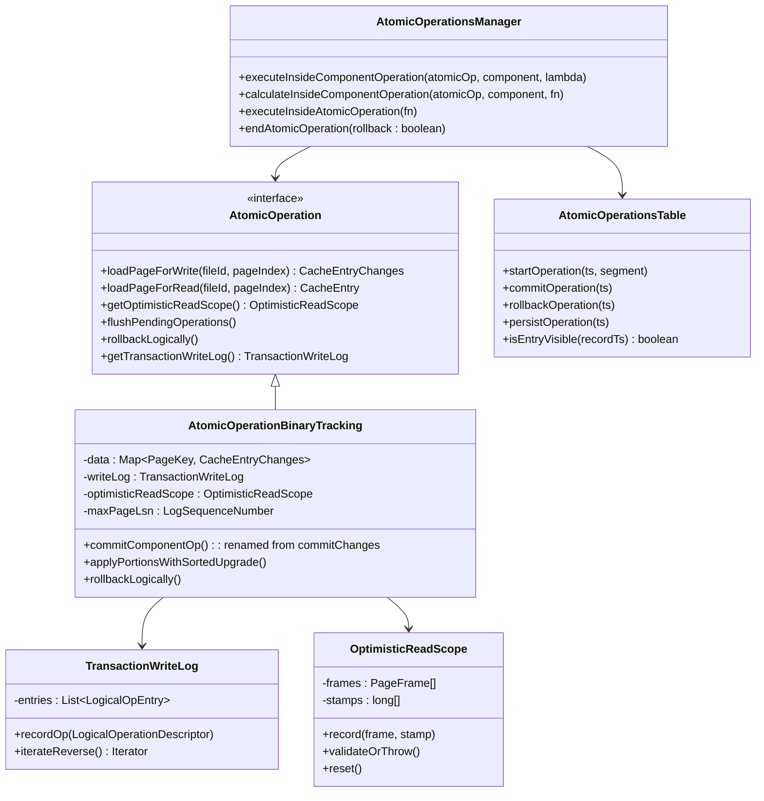
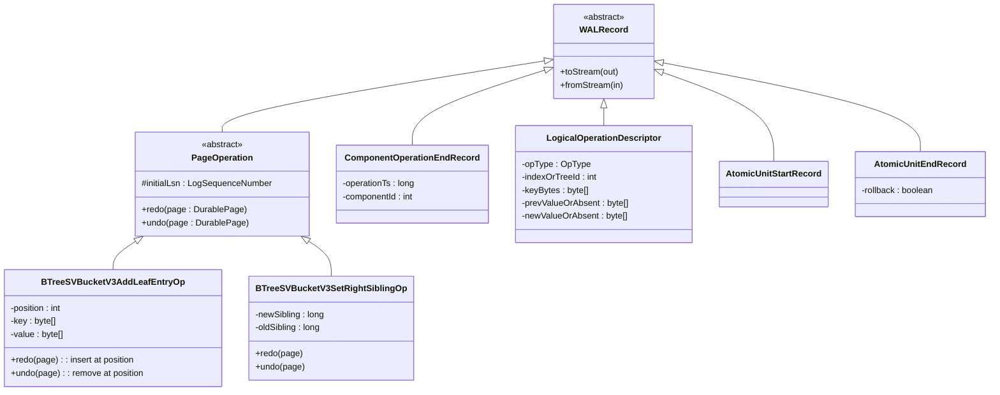
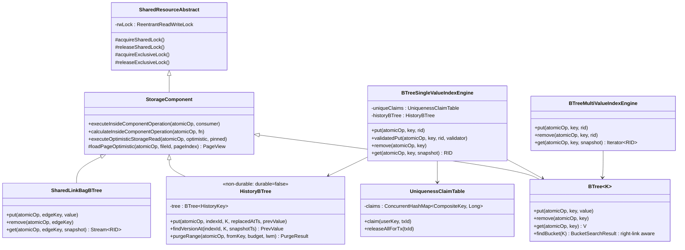
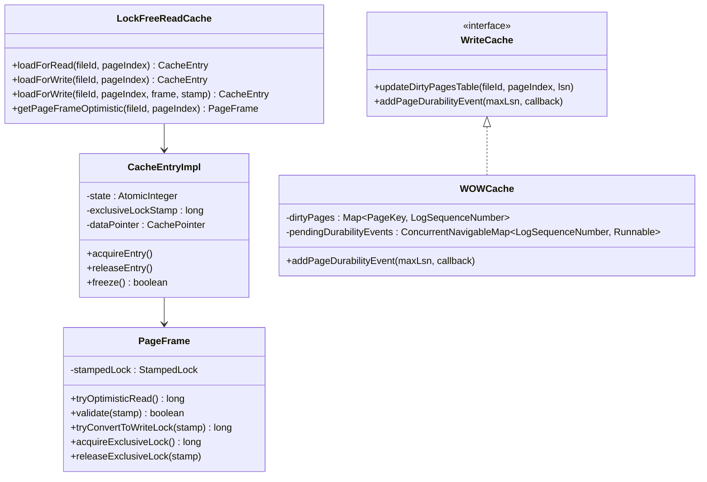
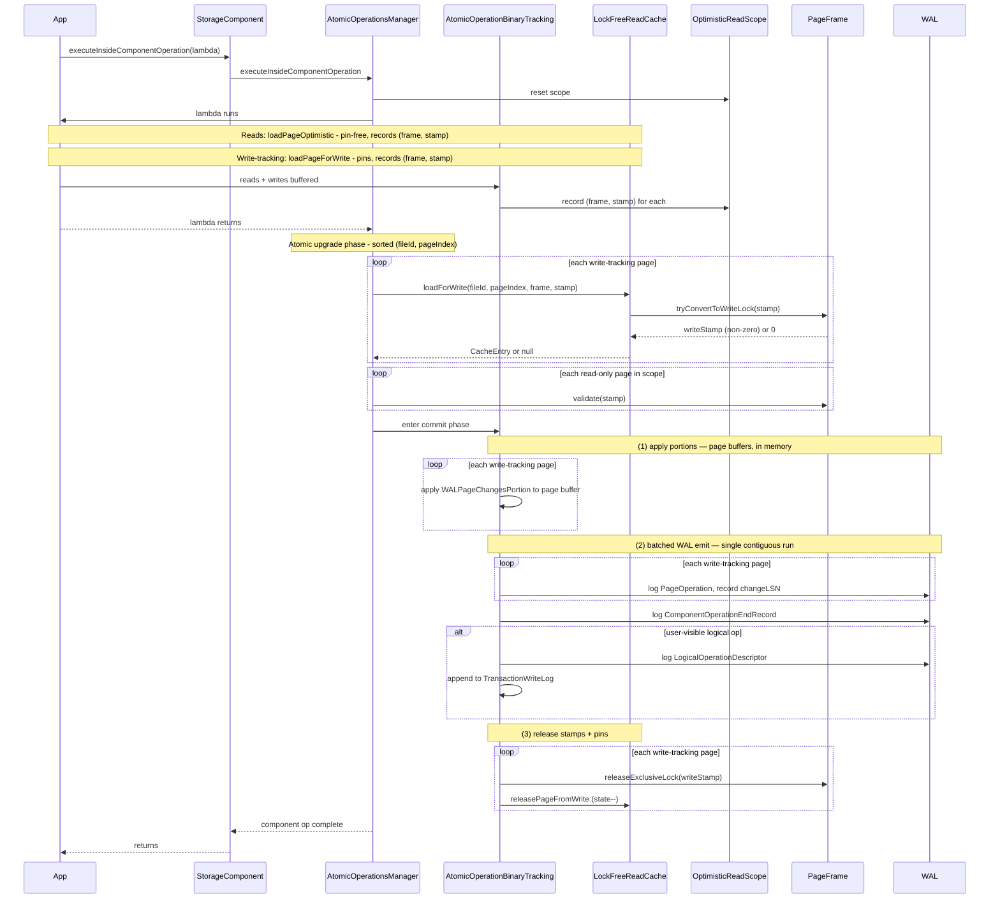
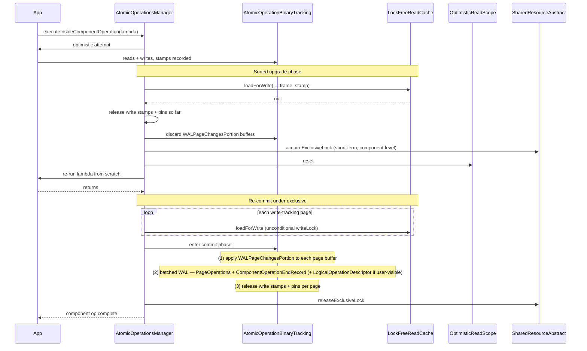
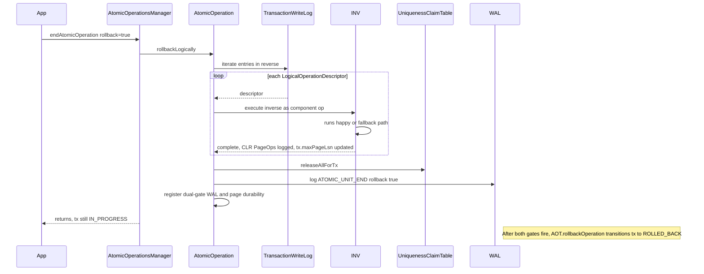
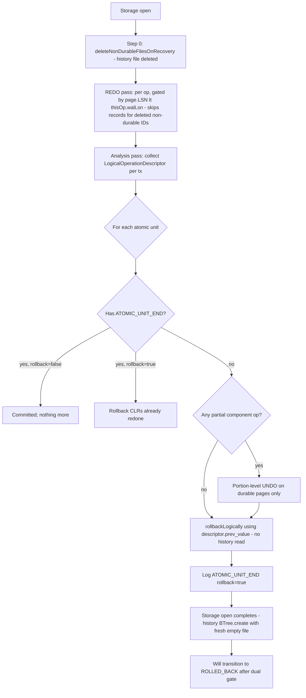
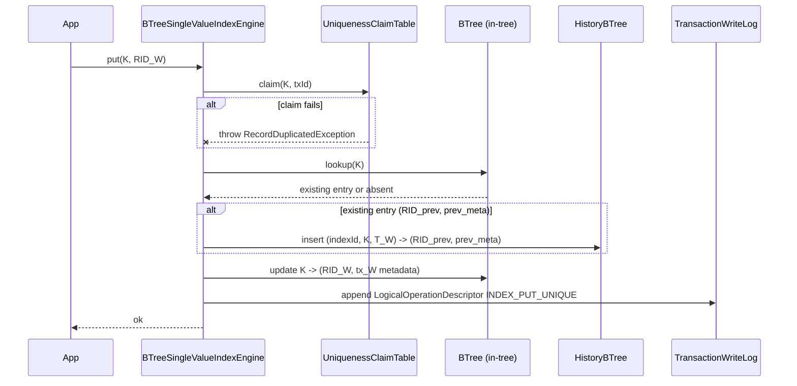
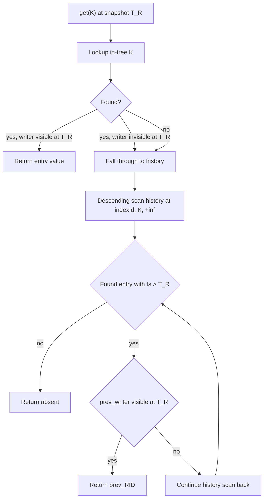

# Rollback Log — Design

## Overview

YouTrackDB's storage today **buffers all of a transaction's writes
in memory until tx commit**, then flushes them as one atomic batch.
This design replaces that with **in-place page updates scoped to a
single component operation** (an index put, a record write, a
link-bag insert). Pages are mutated, latched, logged, and unpinned
at component-op-end — long before tx commit.

**The enabling primitive** is a matched pair on every WAL
`PageOperation`: `redo(page)` for forward replay (already exists)
and `undo(page)` for backward replay (new). Component-op-level
atomicity is preserved by sorting page mutations into canonical
`(fileId, pageIndex)` order and acquiring write stamps in that
order; at tx-end, rollback is no longer a buffer discard but a
sequence of **inverse component ops** whose own `PageOperation`
records become the CLRs.

**Two subsystems are restructured to fit:**

- **B-Trees** (the index B-Tree and the link-bag B-Tree) move to
  **Lehman-Yau semantics**: readers fall through right-links when a
  split has moved keys to a sibling, splits decompose into multiple
  sequential component ops, and tree-level write locks disappear
  from the write hot path.
- **UNIQUE indexes** keep a single-version in-tree but stash
  replaced versions into a **non-durable global `HistoryBTree`**.
  Older snapshots fall through to history; the history tree is
  wiped on every storage open. The `LogicalOperationDescriptor`'s
  `prev_value` field — durable in WAL — is the **single source of
  truth** for rollback, never the history tree.

**Beyond the core model, the design also drops or volatilizes
several pieces of metadata** that audits found to be hot-page
contention sinks under in-place writes (Part 5). Records counts,
index counters, the dirty-page bitset, and histograms all become
**volatile in steady state, rebuilt or accepted-as-drift on crash**.
The free-space map gets a four-layer redesign that mostly removes
it from the write hot path.

**Companion file.** Long-form derivations, file:line citations, and
exhaustive worked examples live in `design-mechanics.md`. Section
names match between the two files; each section's References footer
below carries the explicit cross-link.

The rest of this document is structured as: Core Concepts (a
vocabulary primer for the seven Parts) → Class Design → Workflow →
seven Parts that each tell one arc of the story.

---

## Core Concepts

This design introduces seven load-bearing ideas. Each is named and
used without re-definition in the Parts that follow; if a Part
later references one of these concepts, the relevant definition is
here. Each entry pairs the new concept with what it replaces, so
the delta from the buffer-until-commit baseline is visible at a
glance.

**Component op.** The unit of page-level atomicity in the new
model: a single index put, record write, or link-bag insert. A tx
issues many component ops; each one's page mutations commit
in-place at component-op-end, **long before tx commit**. Replaces
the old "buffer all of a tx's pages until commit, then flush
atomically" model. → Part 2 § "Component-Op Commit Upgrade
Protocol".

**`PageOperation` matched pair (`redo` + `undo`).** Every WAL
`PageOperation` subclass now carries both `redo(page)` (forward
replay — already existed) and `undo(page)` (backward replay —
new). The `undo` half is the primitive that makes per-page
rollback possible without a separate undo log. Replaces "redo
only; rollback was buffer discard." → Class Design § "Atomic
operation layer"; Part 3 § "Logical Rollback Under Concurrency".

**Logical rollback.** At tx abort or in-flight reconstruction
during recovery, the engine walks the per-tx
`LogicalOperationDescriptor` log in reverse and issues an
**inverse component op** for each entry. Inverse ops emit their
own `PageOperation` records, which become the CLRs. Replaces
"discard the in-memory page buffer" — there is no buffer under
in-place writes. → Part 3 § "Logical Rollback Under Concurrency";
Part 4 § "Recovery: In-Flight Transaction Reconstruction".

**Optimistic reads with stamp validation.** Readers do not acquire
a component-level shared lock. Every page read records a
`(frame, stamp)` pair in an `OptimisticReadScope`; at the end of
the read or at commit-time, the stamps validate together. On
invalidation, the read falls back to a short-term shared-lock
pinned re-read. Three load variants exist (pin-free, pinned
write-tracking, pinned-with-`writeLock` fallback) covering warm
hits, cold disk loads, and memory storage uniformly. Replaces
"acquire component shared lock during reads." → Part 1 § "Three
Load Variants"; Part 1 § "Read-Path Optimistic Reads".

**UNIQUE-index history tree, with the WAL descriptor as truth.**
UNIQUE indexes keep one in-tree value; replaced versions stash
into a non-durable global `HistoryBTree`. Older snapshots that
miss in-tree fall through to history; the history tree is wiped
on every storage open and plays no recovery role. The **single
source of truth for rollback** is the
`LogicalOperationDescriptor.prev_value` field, which is durable
in WAL — never the history tree. Replaces "tx-level MVCC via
buffered tx state." → Part 6 § "History B-Tree Purge"; Part 3
(descriptor-driven inverses).

**Dual-gate durability transition.** Every tx state transition
from a protected state to a final state must wait for **both**
WAL durability (`flushedLSN ≥ tx.atomicUnitEndLsn`) **and** page
durability (`minDirtyLSN > tx.maxPageLsn`). The single-gate
(WAL-only) was sufficient when pages were buffered until commit;
in-place writes can produce pre-commit dirty pages whose loss
would violate atomicity, so a second gate becomes load-bearing.
→ Part 3 § "Final-State Transition: Dual-Gate on WAL + Page
Durability".

**Volatile statistics pattern.** Eight pieces of metadata that
audits identified as hot-page contention sinks under in-place
writes — histograms, records counts, per-index counters, the
free-space map, the dirty-page bitset, and three legacy counters
— are restructured to be **non-durable in steady state**: heap-
resident, snapshot to disk only at clean shutdown, wiped + rebuilt
or accepted-as-drift on crash. Three sub-patterns: volatile +
crash rebuild, drop the counter, full architectural redesign.
Replaces "every counter durable in WAL or in a page-0 slot."
→ Part 5 § "Volatile Statistics".

---

## Class Design

### Atomic operation layer

**TL;DR.** `AtomicOperation` gains `rollbackLogically()` (drives
inverse-op replay) and a `TransactionWriteLog` (records every
logical op the tx performs).
`AtomicOperationsManager.executeInsideComponentOperation` owns the
new stamp-validate / sorted-latch / apply / log protocol.



`OptimisticReadScope` tracks `(frame, stamp)` pairs for every page
read or write-tracking load in a component op; commit-time
validation runs against these stamps. `maxPageLsn` tracks the
highest WAL LSN any page mutation produced — feeds the dual-gate
durability protocol (Part 3).

`AtomicOperationsTable` is unchanged in shape; its `isEntryVisible`
predicate now relies on the rolled-back-entries-removed-before-
ROLLED_BACK invariant holding across both the in-tree and the
history B-Tree.

**References.**
- D-records: D3 (PageOperation undo), D4 (logical inverse), D18 (atomic upgrade), D19 (descriptor as rollback source)
- Invariants: S2, S3, S5
- Mechanics: `design-mechanics.md §"Atomic operation layer"`

---

### WAL layer

**TL;DR.** Every `PageOperation` subclass gains a matched
`undo(page)` paired with its existing `redo(page)`. Two new WAL
records mark boundaries: `ComponentOperationEndRecord` (every
component op) and `LogicalOperationDescriptor` (user-visible
logical ops only; carries the load-bearing `prev_value` for
rollback).



Both `redo` and `undo` are pure page-level logical transforms —
physiological (logical within a page, physical across pages). LSN
management lives at the portion-level applier; neither method reads
or writes `page.getLsn()` itself.

Pure structural ops (B-Tree leaf splits, parent inserts under L&Y)
emit a `ComponentOperationEndRecord` but no
`LogicalOperationDescriptor` — they are never logically inverted,
only handled by portion-UNDO on mid-op crash or "remain in place"
in stable L&Y state.

**References.**
- D-records: D3, D5 (ComponentOperationEndRecord), D19 (descriptor)
- Invariants: S12 (descriptor as rollback driver)
- Mechanics: `design-mechanics.md §"WAL layer"`

---

### Storage component layer

**TL;DR.** `BTreeSingleValueIndexEngine` (UNIQUE) gains two
collaborators — `UniquenessClaimTable` (cross-tx write-skew
prevention) and `HistoryBTree` (older-snapshot fallback).
`HistoryBTree` is a global tree per storage, constructed with
`durable=false`: WAL-exempt, fsync-exempt, recreated fresh on
every storage open.



`StorageComponent` and `SharedResourceAbstract` are unchanged in
shape. The component lock's *lifetime* changes: today held tx-long
during any write; after the cutover held only short-term during
fallback re-execution.

Non-UNIQUE B-Trees keep their backing tree shape; the composite key
gains a `ts` dimension. Reads filter version chains; writes append.

**References.**
- D-records: D6 (UNIQUE history), D7 (non-UNIQUE multi-version), D8 (claim table), D10 (read-only component lock lifetime)
- Invariants: S13 (history wiped on every storage open)
- Mechanics: `design-mechanics.md §"Storage component layer"`

---

### Cache layer

**TL;DR.** Three additions, no W-TinyLFU change.
`LockFreeReadCache.loadForWrite(..., frame, stamp)` is the atomic
"validate + acquire write stamp" primitive (no pin bump — caller
already holds it). `PageFrame.tryConvertToWriteLock(stamp)` is a
one-line delegation. `WriteCache.addPageDurabilityEvent(maxLsn,
callback)` is the dual-gate hook for the final-state transition.



Page stealing is achieved entirely by **shortening the pin
lifecycle** (the `state` counter on `CacheEntryImpl`), not by
modifying admission or eviction policy. The cache structure itself
is unchanged.

**References.**
- D-records: D2 (page stealing), D13 (dual-gate transition), D18 (atomic upgrade)
- Invariants: S3, S9 (dual-gate)
- Mechanics: `design-mechanics.md §"Cache layer"`

---

## Workflow

### Happy-path component-op commit

**TL;DR.** Every component op runs its body in optimistic mode (no
locks, no latches). At end-of-body, page mutations are
validate-and-upgraded in canonical `(fileId, pageIndex)` order via
`tryConvertToWriteLock(stamp)`; on success the commit phase runs
three sequential sub-phases — apply portions, batched WAL emit,
release stamps + pins. No "validate then acquire" pair; the upgrade
is one atomic step.



The sorted upgrade is the deadlock-avoidance discipline — cross-
tree component ops are not a special case; pages from any
combination of trees / records / linkbags / history all sort into
one canonical ordering. Batching the WAL emit (rather than
interleaving it per page) means a mid-commit failure cannot leave
a partial `PageOperation` prefix in the WAL without a terminating
end-record.

**References.**
- D-records: D1 (in-place apply), D18 (atomic upgrade)
- Invariants: S3 (sorted upgrade), S9 (dual-gate), S16 (scope-entry classification)
- Mechanics: `design-mechanics.md §"Happy-path component-op commit"` + §"Component-Op Commit Upgrade Protocol"

---

### Fallback path: stamp invalidation

**TL;DR.** When `tryConvertToWriteLock` returns 0 (or any
read-only stamp's `validate` returns false), the writer releases
everything acquired so far, takes a short-term **component-level
exclusive lock**, and re-runs the body. Under the exclusive lock,
`loadForWrite` takes an unconditional write lock; the same
three-phase commit then runs. The exclusive lock is released at
component-op-end — never tx-long.



The fallback is per-component-op, not per-tx. Different engines
hold different component locks, so cross-engine fallbacks do not
contend.

**References.**
- D-records: D18 (fallback path)
- Invariants: S3 (validate-and-upgrade), S16
- Mechanics: `design-mechanics.md §"Fallback path: stamp invalidation"`

---

### Logical rollback at tx abort

**TL;DR.** Rollback walks the per-tx `TransactionWriteLog` in
reverse, executing each entry's inverse as a regular component op
(producing CLR PageOps). After all inverses, the UNIQUE claim
table releases all of the tx's claims, `ATOMIC_UNIT_END
rollback=true` is logged, and dual-gate durability registration
is set up. State transitions to ROLLED_BACK after both gates fire.



Each inverse uses `LogicalOperationDescriptor.prev_value` as the
**single source of truth** — never the history tree. This is the
property that lets the history tree be non-durable.

**References.**
- D-records: D4 (logical rollback), D6 (history non-durability), D19 (descriptor as source of truth)
- Invariants: S5 (entries removed before ROLLED_BACK), S14 (descriptor matches in-tree at write time)
- Mechanics: `design-mechanics.md §"Logical rollback at tx abort"` + §"Logical Rollback Under Concurrency"

---

### Crash recovery

**TL;DR.** Five-step process: (0)
`deleteNonDurableFilesOnRecovery` wipes history + `.fsm` + `.dpb` +
`.ixs`; (1) REDO replays `PageOperation.redo` per-op LSN-gated;
(2) Analysis collects `LogicalOperationDescriptor` records into
per-tx write logs; (3) Portion-UNDO for partial component ops
without `ComponentOperationEndRecord`; (4) Per-atomic-unit
resolution — committed/rolled-back units done after REDO; in-flight
units run `rollbackLogically` driven by reconstructed write logs;
(5) Storage open completes; history `BTree.create()` on a fresh
empty file.



The recovery-time inverses use
`LogicalOperationDescriptor.prev_value` directly to restore the
in-tree — never reading from the (already-wiped) history tree.
Crash during recovery is handled by forward REDO of in-tree CLRs
on the next restart (idempotent via per-op LSN gating).

**References.**
- D-records: D6 (history non-durability), D19 (descriptor as recovery source), D32 (in-flight tx reconstruction)
- Invariants: S6 (recovery is idempotent), S7, S8, S12, S13, S23 (post-recovery zero in-progress)
- Mechanics: `design-mechanics.md §"Crash recovery"` + §"Recovery: In-Flight Transaction Reconstruction (D32)"

---

### UNIQUE index put workflow

**TL;DR.** UNIQUE put is a single component op spanning three
steps: claim the userKey in `UniquenessClaimTable`; if an existing
in-tree entry is present, capture it to the (non-durable) history
tree at `(indexId, K, T_W)`; update the in-tree to the new value.
A `LogicalOperationDescriptor` carrying `prev_value` is appended
to `TransactionWriteLog`.



Within a single tx, only the **first** write to a given K stashes
the prev_value to history. Subsequent writes within the same tx
update only the in-tree (their previous values were tx-private and
not visible to anyone else).

**References.**
- D-records: D6 (history), D8 (claim), D19 (descriptor)
- Invariants: S14 (descriptor = in-tree value at write time)
- Mechanics: `design-mechanics.md §"UNIQUE index put workflow"` + §"UNIQUE-Index Claim Table"

---

### UNIQUE index get workflow

**TL;DR.** Reader at snapshot `T_R` probes in-tree; if the in-tree
entry's writer is visible at `T_R`, return it. Otherwise, fall
through to a **descending** range scan in the history tree at
`(indexId, K, ts > T_R)` — the smallest such ts is what was
visible at `T_R`. Walk further back if the prev_writer is itself
not visible at `T_R`. No history entry → key absent at `T_R`.



Falls through to history only when the in-tree entry post-dates
the reader's snapshot. Cold path; readers at the latest snapshot
stay in the in-tree.

**References.**
- D-records: D6
- Invariants: S5 (visibility post-rollback)
- Mechanics: `design-mechanics.md §"UNIQUE index get workflow"`

---

# Part 1 — Read Path

How a reader sees a consistent snapshot under in-place writes —
the optimistic-stamp protocol that lets reads run latch-free
99% of the time and only falls back when a real concurrent writer
forces it.

## Three Load Variants

**TL;DR.** The component-op body distinguishes three page-load
shapes: **(1) pin-free optimistic read** (steady-state happy
path; no `state` bump, returns a `PageFrame` and the caller takes
its own `tryOptimisticRead` stamp); **(2) pinned write-tracking
load** (for pages the body intends to mutate; pins the
`CacheEntryImpl` for the lifetime of the body, takes a stamp at
load time, returns a `CacheEntryChanges`); **(3) pinned +
unconditional `writeLock`** (the fallback under the component
exclusive lock; preserved verbatim from today). Per **D40**, all
three are uniformly available across warm cache hits, cold disk
loads, and memory storage.

### Variant comparison

|   | (1) Pin-free optimistic | (2) Pinned write-tracking | (3) Pinned + unconditional writeLock |
|---|---|---|---|
| Cache API entry | `getPageFrameOptimistic` | `loadForRead` (called via `loadPageForWrite` wrapper) | `loadForWrite` (legacy) |
| Pins `CacheEntryImpl.state`? | No | Yes — held through commit | Yes |
| Acquires `PageFrame.StampedLock`? | No (caller takes its own optimistic stamp) | No (caller takes its own optimistic stamp) | Yes (`writeLock`, blocking) |
| Use case | Body reads | Body writes | Fallback re-execution |
| Validation point | At lambda return / commit-time validate-and-upgrade | At commit-time atomic upgrade | None — already exclusive |
| Selected when | Default for reads | Default for write-tracking loads | Stamp invalidation triggers fallback |

### Edge cases / Gotchas

- **Cold disk miss (variant 1)** drops the pin after the I/O wait;
  the caller's stamp is recorded against the published frame. If
  the frame is recycled before `tryOptimisticRead`, coordinate
  check + stamp invalidation catch it. Net I/O is identical to
  today's pinned fallback.
- **Memory storage (variant 1)** has no eviction; `PageFrame`
  coordinates are stable for life. Stamp invalidation is purely
  writer-driven.
- **Variant (2)'s pin is held by `AtomicOperationBinaryTracking`,
  not by the commit-time upgrade primitive.** The new
  `loadForWrite(..., frame, stamp)` overload assumes the caller
  already holds the pin.
- **Why pin during the body, not at commit** — the design rejects
  a folded "pin + validate + upgrade" call to keep each cache
  entry point single-responsibility (one job, one failure mode).
  Full alternative analysis in design-mechanics.md.

### References

- D-records: D14 (single read helper, not runtime guard), D18 (atomic upgrade), D40 (uniform stamped reads across warm/cold/memory)
- Invariants: S2 (no shared lock during reads), S3 (atomic validate-and-upgrade), S26 (uniform per-page StampedLock)
- Mechanics: `design-mechanics.md §"Three Load Variants"` — full per-variant prose, why-pin-during-body alternatives, asymmetry analysis

---

## Read-Path Optimistic Reads (S2 realization)

**TL;DR.** Every subsystem read routes through a single helper:
`StorageComponent.executeOptimisticStorageRead(atomicOp, optimistic,
pinned)`. The helper resets `OptimisticReadScope`, runs the
optimistic lambda, then validates all recorded `(frame, stamp)`
pairs. On invalidation, it acquires the component's shared lock
short-term and runs the pinned lambda. This single helper is the
**only realization of S2** — no runtime assertions or compile-time
guards.

### Edge cases / Gotchas

- **Fallback must be short-term.** The `pinned` lambda runs
  synchronously; the component shared lock is released on return.
- **Mid-traversal validation.** `validateLastOrThrow()` is called
  on indirect pointer reads to catch stale pointers early.
- **Helper reentrancy.** If the current thread already holds the
  component's exclusive lock (a writer in fallback), the helper
  skips shared-lock acquisition.
- **`loadPageOptimistic` vs. `loadPageForRead` must not be mixed**
  inside one optimistic lambda — they belong to different load
  variants.
- **Cache/WAL-internal `acquireSharedLock` sites** (inside
  `CacheEntryImpl`, `CachePointer`, `WOWCache`) are legitimate
  fallback sites and are unaffected by S2.

### References

- D-records: D14 (S2 enforced by convention, not by runtime guard)
- Invariants: S2 (no shared lock during reads — realized by this helper)
- Mechanics: `design-mechanics.md §"Read-Path Optimistic Reads (S2 Realization)"`

# Part 2 — Write Path

The component-op commit protocol — how every write reaches the
page, the WAL, and durability under in-place updates. Cross-tree
saves are sequences of these protocols composed without further
coordination.

## Component-Op Commit Upgrade Protocol

**TL;DR.** The write hot path uses
`PageFrame.tryConvertToWriteLock(stamp)` — a one-line delegation
to `StampedLock.tryConvertToWriteLock` that atomically returns
either a write stamp (no concurrent writer since the optimistic
stamp was issued) or zero (writer intervened, caller falls back).
The cache wraps this in
`loadForWrite(fileId, pageIndex, frame, stamp)` which adds frame-
identity check + `dirtyPages` registration (S8). Commit sequence:
sort write-tracking pages → atomic upgrade per page → validate
read-only stamps → flush snapshot buffers → apply portions → emit
WAL → release stamps → release pins.

### Why the cache owns the upgrade

The new overload **must** live in the cache package because
`WOWCache.dirtyPages` registration is the truncation-safety gate
— keeping it inside the cache's `loadForWrite` closes the
registration hole by construction. The frame-identity check
similarly belongs to the cache, which owns the
`(fileId, pageIndex) → CacheEntry → PageFrame` mapping.

### Commit sequence

```
1.  Sort write-tracking pages by (fileId, pageIndex) ascending.
2.  For each: cache.loadForWrite(..., frame, stamp) — null → fallback.
3.  For each read-only page: frame.validate(stamp) — false → fallback.
4.  flushSnapshotBuffers + flushEdgeSnapshotBuffers (D25).
5.  Drain local snapshot/visibility buffers.
6.  Apply WALPageChangesPortion to each write-tracking page.
7.  Log PageOperation records (batched).
8.  Log ComponentOperationEndRecord.
9.  (User-visible logical ops) Log LogicalOperationDescriptor;
    append to TransactionWriteLog; update tx.maxPageLsn.
10. Release write stamps; releasePageFromWrite per page (state--).
```

### Edge cases / Gotchas

- **Pin-release sequencing.** Step 10 must come **after** steps
  6-9. Reordering exposes a pinned-exclusive-locked page mid-apply
  or allows concurrent eviction to attempt `freeze` on a mid-apply
  entry.
- **Fallback release order.** On null return from step 2, release
  every write stamp acquired so far on prior pages, then release
  every pin held for this component op.
- **Read-only `validate` failure** in step 3 can fail even if step
  2 fully succeeded — a reader-observed page may have been mutated
  by a concurrent component op. Fallback is mandatory.
- **S16 — Commit-time scope-entry classification.** The bare S3
  reading would upgrade *every* variant-(2) page, even ones the
  body didn't actually mutate. S16 says: classify each scope-entry
  by its mutation-buffer state — non-empty buffer → upgrade path;
  empty buffer → validate path. Closes the "100% fallback on every
  concurrent allocate" trap on shared metadata pages (e.g., CPM
  page 0).
- **D36 — Tree-level lock removal on the write hot path.** Today's
  tree-level write lock disappears once L&Y + this protocol are in
  place — concurrency is per-page from then on.

### References

- D-records: D18 (atomic upgrade), D36 (tree-level lock removal)
- Invariants: S3 (atomic validate-and-upgrade), S8 (dirtyPages registration), S16 (scope-entry classification)
- Mechanics: `design-mechanics.md §"Component-Op Commit Upgrade Protocol"` — full sequence detail, S16 derivation, D36 derivation, fallback specifics

---

## Cross-Tree Atomicity for Record CRUD and Composite Saves

**TL;DR.** A user `db.save(record)` typically produces **N
sequential component ops at the same nesting depth** — one for
records, one per index, one per linkbag side. Each op runs its
own sort over the pages from all files it touches. **No giant
nested op** spans subsystems. Cross-op atomicity within a tx is
provided by tx-level logical rollback (D4 / D19), not by the
sort.

### Per-engine file footprint

| Engine | Files per instance |
|---|---|
| `PaginatedCollectionV2` (records) | `.pcl`, `.cpm`, `.fsm`, `.dpb` |
| `BTreeSingleValueIndexEngine` (UNIQUE) | `.cbt` + `.nbt` (one pair per index instance) |
| `BTreeMultiValueIndexEngine` (non-UNIQUE) | Two pairs (svTree + nullTree) |
| `SharedLinkBagBTree` | `.grb` (one shared file per *collection*) |
| `HistoryBTree` | `.cbt` + `.nbt` (one global pair, **non-durable**) |
| `IndexHistogramManager` | `.ixs` (one per index, **non-durable** in steady state) |

`fileId` is composed as `(storageId << 32) | internalFileId` and
is stable across opens. The sort key is therefore globally
consistent across concurrent writers in the same JVM.

### Worked example — vertex with one UNIQUE prop, one non-UNIQUE prop, one outgoing edge

5 sequential component ops per save: createRecord, UNIQUE put,
non-UNIQUE put, linkbag (out side), linkbag (in side). Each runs
its own sort over a small page set (typically 3-10 pages, `O(n
log n)` cost trivial). No engine calls another engine's public
method while inside its own component op; no component op nests.

### Edge cases / Gotchas

- **Different engines hold different fallback locks.** Cross-
  engine fallbacks do not contend; same-engine fallbacks serialize
  as today.
- **Memory-only side-channels are not in the sort.** Snapshot/
  visibility entries (D23) and histogram deltas (D27) live in
  tx-local memory structures, not in `WALPageChangesPortion`s.
  They have their own concurrency stories.
- **Lock hierarchy is unchanged in shape.** `stateLock` (read,
  tx-long) → component lock (D18: fallback only, per-component-op)
  → `WOWCache.filesLock` (read, micro) → `PartitionedLockManager`
  per-page (exclusive, micro).
- **L&Y interaction (D17).** Cascading splits decompose into
  multiple component ops — per-op page count shrinks (3-4 instead
  of 8-15), per-op sort is correspondingly smaller.

### References

- D-records: D4 (logical inverses for cross-op atomicity), D17 (L&Y multi-op splits), D18, D19, D26 (extension pattern)
- Invariants: S3, S16
- Mechanics: `design-mechanics.md §"Cross-Tree Atomicity for Record CRUD and Composite Saves"` — per-engine file footprint, worked vertex-save example with sequence diagram, lock hierarchy table, L&Y interaction, open follow-ups

---

## Snapshot-Index Merge at Component-Op-End (D25)

**TL;DR.** YouTrackDB's record store has an in-memory MVCC
snapshot index (`sharedSnapshotIndex` /
`sharedVisibilityIndex` on `AbstractStorage`). Today writers
buffer entries into per-tx TreeMaps and merge them into shared
**inside `commitChanges`** at tx-commit. Under in-place writes the
merge boundary moves: the flush relocates from tx-commit to
**component-op-end**, immediately after validate-and-upgrade and
**before** page-buffer apply. Local buffers are drained between
component ops within the same tx.

### Why the move is a correctness fix, not a performance one

D23 (record CRUD logical rollback) requires snapshot entries to be
globally findable for any in-flight tx. Without alignment, there's
a window between component-op-end (CPM visible) and tx-commit
(snapshot entry visible) during which cross-tx SI readers return
wrong / missing data — a correctness break under in-place writes.

### Edge cases / Gotchas

- **Flush MUST run before page apply.** Same ordering today's
  `commitChanges` enforces, just per-component-op.
- **Fallback-path idempotence.** If validate-and-upgrade fails and
  the body re-runs under the component exclusive lock,
  `keepPreviousRecordVersion` is called twice. Both produce the
  same `(snapshotKey, positionEntry)` — `TreeMap.put` is naturally
  idempotent.
- **Aborted-tx residue.** Once flushed at component-op-end,
  snapshot entries remain in shared even if the tx aborts. They're
  correct (D23's chunk-survival keeps the slot live) and become
  evictable when LWM passes the tx's commit_ts.
- **GC ↔ snapshot-index race resolved by ordering.** Flush-before-
  apply makes "GC sees CPM at slot B but snapshot index has no
  entry" impossible.

### References

- D-records: D23 (record CRUD), D25 (snapshot-index merge at component-op-end)
- Invariants: S5 (post-rollback visibility)
- Mechanics: `design-mechanics.md §"Snapshot-Index Merge at Component-Op-End"` — full ordering invariant, GC-interaction table, recovery story, fallback idempotence

---

## UNIQUE-Index Claim Table

**TL;DR.** A per-UNIQUE-index `ConcurrentHashMap<CompositeKey,
Long>` recording `(userKey) → txId` for every in-flight tx's
UNIQUE-index put. Prevents write-skew on uniqueness — without it,
two concurrent txs putting the same K to different RIDs would
both succeed under SI + non-durable history, with the second's
prev_value silently displacing the first.

### Why a hashmap, not a scan

A scan-based check at put time has a TOCTOU window under short-
term locking. A hashmap-based claim (one CAS per put) is race-
free and cheaper per put. Claims are released at every tx-end
path (commit, rollback, recovery completion).

### Edge cases / Gotchas

- **Memory growth with tx size.** A tx inserting 1M UNIQUE-indexed
  rows holds 1M claims (~40 MB). Acceptable; stripe by
  `hash(userKey)` if hot contention emerges.
- **Claim leakage on tx abandonment.** A hung or forcibly
  terminated tx leaks claims. Mitigated by tying claim release to
  every tx-end path.
- **Crash recovery doesn't reconstruct claims.** Tree state
  (committed entries) is authoritative post-crash; claims are
  rebuilt as new txs put.
- **Scope is narrow.** Only UNIQUE indexes. NOT_UNIQUE /
  ALLOW_MULTIVALUE indexes use no claim table; link-bag uses no
  claim table; record writes use SI at the record level.

### References

- D-records: D8 (claim table)
- Invariants: S4 (claim acquired before in-tree write)
- Mechanics: `design-mechanics.md §"UNIQUE-Index Claim Table"` — full mechanism, write-skew analysis, scope discussion

---

## L&Y B-Tree: Right-Link Descender + Cascading Splits

**TL;DR.** `BTree` v3 (the index B-Tree) and `SharedLinkBagBTree`
move to **Lehman-Yau semantics**: every page has a right-link to
its sibling, splits decompose into multiple sequential component
ops (leaf split → parent insert → cascade), and the descender
follows the right-link when `searchKey > currentPage.maxKey()`.
**Page format is unchanged** — sibling pointers and corresponding
WAL ops already exist. **No B-Tree merges in the initial cutover**
(D20) — underfull pages stay underfull until subsequent inserts
re-fill them.

### Why this enables in-place writes

Multi-component-op splits make each component op smaller (2-3
pages instead of 5+), narrowing latch surface and reducing
fallback rate at commit-upgrade time. The right-link descender
guarantees that any key present in the tree is reachable from
root via descend + right-link fall-through, regardless of which
component ops are mid-cascade.

### Worked cascading-split example

3-level tree, full leaf P4 under parent P1. Tx_W inserts K=25.

| Op | Action | State after |
|---|---|---|
| Op-1 (leaf split) | Allocate P9; redistribute keys; set sibling pointers; log `ComponentOperationEndRecord(op-1)`. | P9 reachable only via P4's right-link. Parent P1 unaware. |
| Op-2 (parent insert) | Insert separator 25 → P9 in P1. | Tree fully consistent. Right-link still works but no longer required. |
| Op-2' (cascade case, P1 was full) | Split P1 into P1' + P10 with internal-level right-link. | Internal level mid-cascade. |
| Op-3 (cascade) | Insert separator into root P0 → P10. | Cascade complete. |

Every mid-cascade crash reduces to portion-UNDO + search-based
logical rollback (using the right-link descender) — no new
recovery code paths.

### Edge cases / Gotchas

- **Implicit high-key**: instead of an explicit high-key field,
  the descender uses **current-rightmost-entry** as the implicit
  high-key. Correct because the splitter's max-key drops
  atomically with the right-sibling pointer write — both happen in
  the same component op.
- **Cascade depth bounded by tree depth** (`log_B(N)`). Each
  cascade level is one component op.
- **Stamp invalidation during cascade.** Each component op
  validates independently; one fail → that op's fallback runs;
  earlier successful ops are NOT undone (they're durable on disk
  by then).

### References

- D-records: D12 (search-based inverse safety), D17 (L&Y migration), D20 (no merges)
- Invariants: S11 (descender correctness)
- Mechanics: `design-mechanics.md §"L&Y B-Tree: Right-Link Descender"` + §"L&Y Cascading Split: Worked Example" — full descender derivation, implicit-high-key argument, all five crash scenarios

---

## Multi-Version B-Tree Semantics (non-UNIQUE)

**TL;DR.** The non-UNIQUE B-Tree stores `(userKey, RID, ts) →
tombstone_marker_or_empty` composite entries. Each insert/delete
appends at a distinct composite key. Readers walk the version
chain at `(K, RID, *)` in descending-ts order and pick the
highest visible entry; a visible tombstone means "absent." Per
`(K, RID)` pair the tree has **at most 2 entries** (insert +
tombstone) before LWM-driven cleanup — bloat bounded by record-
mutation rate × LWM lag.

### Why this shape (D7)

Three alternatives considered:

- (a) Move non-UNIQUE to history-store-too: grows total bytes by
  ~22%, doubles tree-touches on SI reads. Rejected.
- (b) Delete-mark + dereference RID: makes index-only queries
  (COUNT, EXISTS) pay a record load per candidate. Rejected.
- (c) Multi-version inline composite key (this design): cheapest
  in bytes, cheapest in reads, append-only writes match existing
  patterns.

### Edge cases / Gotchas

- **Same-tx multiple writes to same `(K, RID)`** all land at the
  same composite key `(K, RID, T_W)` — natural B-Tree overwrite.
- **Tombstone semantics**: a tombstone is visible to readers with
  `snapshot ≥ tombstone.ts` whose visibility predicate doesn't
  exclude `tombstone.ts` from `inProgressTxs`. When a visible
  tombstone is the highest-ts visible entry for `(K, RID)`, the
  entry is absent.
- **Reader sees no entry vs only invisible entries**: both treated
  as absent at the snapshot.

### References

- D-records: D7 (non-UNIQUE multi-version)
- Invariants: (none specific)
- Mechanics: `design-mechanics.md §"Multi-Version B-Tree Semantics (non-UNIQUE)"`

---

## Record CRUD: Position-Pointer Logical Rollback

**TL;DR.** Logical rollback for `RECORD_CREATE` /
`RECORD_UPDATE` / `RECORD_DELETE` uses **position pointers** in
the descriptor, not record content. A descriptor stays at fixed
~36 bytes regardless of record size. The inverse is a CPM bucket
flip + record-count adjustment — never a content-replay shape
that re-allocates chunks. Bound by **D39**: the schema must not
grow a `prev_content` field.

### Why position pointers

`PaginatedCollectionV2.updateRecord` writes new chunks at fresh
slots and redirects the CPM pointer; **old chunks remain physical
on disk** (gated by LWM). The descriptor's `prev_position_entry`
resolves to live chunks for any in-flight tx, so the inverse just
flips the CPM REMOVED↔WRITTEN bit and adjusts the record count.
WAL volume per `RECORD_UPDATE` is fixed (~36 B descriptor)
instead of doubled (which a content-payload approach would
produce).

### Inverse component op shape

```
inverse RECORD_CREATE(rid):
  cpm.markRemoved(rid, deletionVersion = inverseOp.commitTs)
  set DPB bit on the new chunks' page
  decrementApproximateRecordsCount()

inverse RECORD_DELETE(rid, prev_position_entry):
  cpm.update(rid, prev_position_entry)        // flips REMOVED → WRITTEN
  incrementApproximateRecordsCount()

inverse RECORD_UPDATE(rid, prev_position_entry):
  cpm.update(rid, prev_position_entry)        // redirects to prev slot
  set DPB bit on the (now-stale) new chunks' page
```

Each inverse touches CPM bucket + (possibly) DPB page +
(possibly) state page (record-count) — typically 2-3 page
mutations regardless of record size.

### Edge cases / Gotchas

- **`prev_position_entry` is load-bearing under D23.** Wrong-
  capture at write time silently corrupts state at rollback.
  **S15 mitigation**: write-time `assert` that
  `descriptor.prev_position_entry == cpm.get(rid)`.
- **LWM-gated chunk survival** is the invariant chain: while tx_W
  is in-flight, LWM ≤ tx_W.commitTs (via per-thread `TsMinHolder`
  during runtime; via D32's recovery-window holder during
  recovery), so prev chunks (visibility key = tx_W.commitTs) are
  NOT evictable.
- **WAL volume bound and rollback waste.** A rolled-back tx that
  performed N record ops leaves stale chunks bounded by `O(N ×
  record_size)`. The same bound applies symmetrically to a
  *committed* version of the same workload (committed updates
  leave the *old* chunks stale). Rollback does not add a new worst
  case beyond what committed updates already produce.
- **Inverse `RECORD_DELETE` re-uses the original chunks** (chunks
  at `prev_position_entry`'s slot are physically present because
  user-level delete didn't remove them).

### References

- D-records: D23 (record CRUD logical rollback), D32 (recovery-window TsMinHolder), D39 (no prev_content)
- Invariants: S15 (prev_position_entry assert)
- Mechanics: `design-mechanics.md §"Record CRUD: Position-Pointer Logical Rollback"` — LWM invariant chain derivation, inverse op shapes in detail, all edge cases, WAL volume bound proof

---

## Component File Extension Pattern (D26)

**TL;DR.** Multiple storage components grow files on demand
(records, CPM, FSM, B-Trees on splits, history pre-truncation).
Under in-place writes, every extension follows one shape:
**(1) extension is one atomic component op** (`addPage` + per-page
init + counter bump on metadata page); **(2) logical end ≠
physical end** — allocators read the component's own counter, not
`filledUpTo`; **(3) counter page is read-tracked in steady state
via S16**; **(4) orphan pages on crash mid-extend are tolerated**
(bounded by 1 page × concurrent extenders).

### Patterns by component type

| Component shape | Logical-end source | Examples |
|---|---|---|
| Sequential allocator with explicit counter page | Durable counter on a known metadata page (typ. page 0) | CPM (`MapEntryPoint.fileSize`) |
| Tree-structured store | Tree topology — page is valid iff linked from another node | `BTree` v3, `SharedLinkBagBTree`, `HistoryBTree` |
| Parallel-to-data-file | Inherited from the data file's logical end | `FreeSpaceMap`, `DirtyPageBitset` |

Tree-structured stores need no counter — split component ops
establish validity by linking the new page from parent / sibling
pointers. Parallel-to-data-file components grow lockstep with the
data file inside the same component op.

### Why not batch extension

PG's `RelationExtendBufferedRel` extends by `num_pages × (1 +
waiterCount)`, capped at 64. We considered the analogue and
rejected it for the initial cutover: with S16 in place, page-0
contention is bounded by bucket-fill rate (~1/`MAX_ENTRIES`), not
by allocate rate. Batch extension would reduce that bound by
another factor of K but at the cost of more WAL ops, more orphan
pages on crash, and complexity in the "is the next bucket pre-
allocated?" decision. Deferred as a profile-driven follow-up.

### References

- D-records: D26 (component file extension pattern)
- Invariants: S16 (scope-entry classification on counter page)
- Mechanics: `design-mechanics.md §"Component File Extension Pattern (D26)"` — full per-component-type pattern table, batch-extension rejection rationale, orphan-page bound

---

## Page Stealing and Cache Eviction

**TL;DR.** Page stealing is achieved by **shortening the
`CacheEntryImpl` pin lifecycle** — not by changing the eviction
policy. Today a page is pinned (`state > 0`) from its first
write-tracking load until `commitChanges` runs at tx-end. The
cutover moves `releasePageFromWrite()` from tx-end to per-page at
component-op-end. W-TinyLFU then decides based on its own
heuristics whether to keep or evict, with no further coordination.

### Why moving the pin release removes the tx-size ceiling

Today a tx whose touched-page count exceeds the cache capacity
deadlocks or dies with cache-exhaustion. With pin lifetime scoped
to component-op length, the ceiling moves from "cache capacity"
to "pages touched by any single component op" — bounded for any
sensible operation (a B-Tree split is 2-3 pages under L&Y, a
record insert is 1-2).

### Edge cases / Gotchas

- **A dirty page may be re-read from disk before tx commits.**
  That's fine — the page's on-disk state is consistent (logged WAL
  records reflect exactly what's in the buffer at component-op-end).
- **Recovery must replay REDO on evicted pages.** Standard ARIES
  STEAL+NO-FORCE behaviour.
- **Pin release sequencing.** Must happen after WAL emit, after
  apply-portion, after write-stamp release.
- **Double-write log (DWL) continues to serve its purpose.**
  Torn-page protection is orthogonal to steal vs. no-steal.
- **W-TinyLFU requires no change.**

### References

- D-records: D2 (page stealing)
- Invariants: (none specific — relies on S6/S7/S8 unchanged)
- Mechanics: `design-mechanics.md §"Page Stealing and Cache Eviction"`

# Part 3 — Rollback

When a tx aborts, rollback is **not** a buffer discard — buffers
were applied at component-op-end. Instead, rollback is a sequence
of **inverse component ops** whose own `PageOperation` records
become the CLRs (compensation log records). The dual-gate final-
state transition then makes the rollback durable.

## Logical Rollback Under Concurrency

**TL;DR.** Rollback walks `TransactionWriteLog` in reverse; each
inverse is a regular component op (search-from-root, latch,
mutate). Two properties keep search-based inverses safe under
concurrency: **L&Y right-link descender** finds the entry
regardless of in-flight split state, and **SI** guarantees no
other tx removed our entry (its visibility key carries our
`commitTs`). Recovery-time rollback is identical except the per-tx
write log is reconstructed from durable
`LogicalOperationDescriptor` records.

### Why search-based inverses are safe (D12)

Three invariants compose:

- L&Y right-link descender finds any present key via descend +
  right-link fall-through, regardless of whether a split is in
  flight at any level.
- SI's visibility key carries `tx_W.commitTs`, so the entry tx_W
  wrote is uniquely addressable; no concurrent tx can mistakenly
  remove it.
- Therefore at rollback time our entry exists *somewhere* in the
  tree, and the inverse op's search will find it.

### Recovery-time rollback uses the descriptor, not the history

Per **D6** the history tree is non-durable; **D19** makes
`LogicalOperationDescriptor.prev_value` the **single source of
truth** for rollback. Recovery's analysis pass collects the
descriptors into a per-tx write log; logical rollback then proceeds
identically to runtime, reading `prev_value` from the durable WAL
records — never from the (already-wiped) history tree.

### Edge cases / Gotchas

- **`prev_value` is load-bearing.** A bug capturing wrong
  `prev_value` at write time silently corrupts in-tree state at
  rollback. **S14 mitigation**: write-time `assert` that the
  descriptor's `prev_value_with_metadata` matches the in-tree
  value just read in the same component op.
- **Pure structural ops emit no descriptor.** Leaf splits and
  parent inserts under L&Y are never logically inverted —
  portion-UNDO (mid-op crash) or "remain in place" (stable L&Y
  state) handles them.
- **CLRs only on the durable in-tree side.** The inverse component
  op writes a CLR PageOp to the in-tree (durable, WAL-logged). It
  does NOT emit a CLR for the history tree (non-durable, no WAL).
  Crash-during-rollback is forward REDO of in-tree CLRs.
- **Order matters for structural ops.** If a tx wrote put(K1),
  put(K2) into the same leaf which then split, rolling back must
  process K2's inverse before K1's. Reverse iteration handles
  this correctly.
- **Inverse may stamp-invalidate.** Falls back to component
  exclusive lock — same machinery as any regular write.

### References

- D-records: D4 (logical rollback), D6 (history non-durable), D12 (search-based inverse safety), D19 (descriptor as source of truth)
- Invariants: S5, S11 (L&Y descender), S12 (write-log reconstruction), S14 (write-time assert)
- Mechanics: `design-mechanics.md §"Logical Rollback Under Concurrency"` — full derivation of search-safety, recovery walkthrough, record-CRUD edge cases

---

## Final-State Transition: Dual-Gate on WAL + Page Durability (S9)

**TL;DR.** Both commit and rollback transition to the final state
(`PERSISTED` or `ROLLED_BACK` in `AtomicOperationsTable`) only
when **both** of these are true:

- **Gate A (WAL durability)**: `flushedLSN ≥ tx.atomicUnitEndLsn`
  — the tx's final `ATOMIC_UNIT_END` record is on disk.
- **Gate B (page durability)**: `minDirtyLSN > tx.maxPageLsn` —
  every page the tx mutated has been flushed.

A shared counter; final-state transition fires when both gates
have reported.

### Why a dual gate

Truncation safety depends on
`getSegmentEarliestNotPersistedOperation` holding WAL segments
for txs that may still need records from them. Under STEAL, a
tx's START segment can be truncated while its END is retained,
producing "orphan record" recovery scenarios. The dual gate
eliminates the orphan case by keeping the tx in the table-guard's
view until both WAL and pages are safe.

### Edge cases / Gotchas

- **Gate B is unbounded under adversarial workloads.** A tx
  mutating a hot page that other writers keep dirty might wait
  arbitrarily long. `StaleTransactionMonitor` warns about blocked
  LWM-style advancement.
- **Non-durable file mutations don't contribute to
  `tx.maxPageLsn`** — correctly, because they don't register in
  `dirtyPages` and can't pin WAL segments.
- **Visibility is decoupled from truncation.** Other transactions
  see our rollback (or commit) as soon as the in-tree state and
  visibility predicates reflect it. The table transition to
  PERSISTED/ROLLED_BACK is purely about WAL truncation
  eligibility.
- **`gate` callbacks run on background threads** — must be cheap.

### References

- D-records: D13 (dual-gate transition)
- Invariants: S9 (dual-gate)
- Mechanics: `design-mechanics.md §"Final-State Transition: Dual-Gate on WAL + Page Durability (S9)"` — full callback shape, code snippet, page-durability tracking design

# Part 4 — Recovery

Crash recovery turns the WAL + on-disk pages back into a
consistent state. Because the cutover allows STEAL (committed
component ops can persist before tx-end), recovery must handle
on-disk state that's "ahead" of the last `ATOMIC_UNIT_END`. The
five-step recovery flow (Workflow §"Crash recovery") plus the
four sections below cover the full picture.

## Recovery: In-Flight Transaction Reconstruction (D32)

**TL;DR.** Recovery rebuilds in-flight tx state in
`AtomicOperationsTable` so `rollbackLogically()` can run against
them just like a runtime tx. Four-step mechanism: (1) defer table
construction until WAL analysis identifies in-flight unitIds; (2)
re-register each via `startOperation`; (3) install a synthetic
per-storage `TsMinHolder` pinning LWM at `min(in-flight unitId)`;
(4) run logical rollback per tx, then remove the holder. Post-
condition (**S23**): zero IN_PROGRESS entries before
`STATUS.OPEN` flips.

### Why the synthetic TsMinHolder

The LWM pins prev-record chunks alive while logical rollback
needs them. Without it, GC could evict prev chunks the moment
recovery enters its inverse-loop. The synthetic holder is a
**per-storage** holder (not per-thread) added to `tsMins` for
the duration of the recovery window. After all inverses
complete, the holder is removed and `STATUS.OPEN` flips — GC
self-gates on `STATUS.OPEN` and observes no in-flight state.

### Idempotence under recovery recrash

Recovery itself can crash mid-rollback. Each individual inverse
is naturally idempotent (writing the same `prev_value` twice
produces the same end state). The next recovery's analysis pass
re-classifies the original tx as in-flight, the reconstructed
write log re-walks, and inverses re-apply where needed —
already-applied ones are no-ops, not-yet-applied ones complete.
No replay-detection logic required.

### Edge cases / Gotchas

- **Tx with no PageOps.** `ATOMIC_UNIT_START` recorded, no
  descriptors emitted. Empty write log; `endAtomicOperation`
  transitions to ROLLED_BACK without inverse work.
- **Tx mid-component-op.** Portion-UNDO restores the affected
  pages physically. The reconstructed write log has no descriptor
  for the unfinished component op (descriptors land alongside
  `ComponentOperationEndRecord`). Reverse walk handles only
  completed component ops.
- **`tsOffset` calculation.** `min(min_in_flight_unitId,
  idGen.getLastId() + 1)` so the `CASObjectArray` window covers
  every in-flight unitId.

### References

- D-records: D32 (in-flight reconstruction), D19 (descriptor as recovery source)
- Invariants: S23 (post-recovery zero IN_PROGRESS)
- Mechanics: `design-mechanics.md §"Recovery: In-Flight Transaction Reconstruction (D32)"` — full mechanism walkthrough, idempotence derivation, edge cases

---

## Portion-Level Idempotence

**TL;DR.** A **portion** is the set of `PageOperation` records
for one `(component op, page)` pair — the atomic unit of runtime
apply, recovery REDO convergence, and recovery UNDO. Recovery
reconstructs portions implicitly by scanning between
`ComponentOperationStart` and `ComponentOperationEndRecord` and
bucketing PageOps by their target `(fileId, pageIndex)`. **REDO**
is per-op LSN-gated, converging on `portion.endLsn`. **UNDO**
(only for partial component ops) is portion-level: invoke each
PageOp's `undo` in reverse, then set
`page.LSN = portion.initialLsn`.

### Why portion-level rather than per-op

Physiological logging applies `WALPageChangesPortion` as a single
binary diff per `(component op, page)` and updates `page.LSN`
once per portion. `initialLsn` cannot distinguish which specific
PageOp was applied — all PageOps in a portion share it.
Portion-level idempotence costs nothing at runtime and matches
recovery's apply granule to runtime's.

### Edge cases / Gotchas

- **`PageOperation.redo` and `undo` do not touch `page.LSN`.**
  They are pure page-level logical transforms; LSN management
  lives at the portion-level applier.
- **Crash during recovery UNDO is safe (S10).** The page's
  exclusive latch is held from the first per-op `undo` through
  the `page.setLsn(portion.initialLsn)` that closes the portion.
  Flushes are blocked for this window.
- **`initialLsn` is carried on every PageOp in a portion.**
  Required so the portion's initial LSN is readable at recovery
  time independently of which PageOps' records reach the WAL.
- **Logical equivalence, not byte equality.** The inverse
  preserves the page's observable content via its logical API
  (entry set, slot order, logical counters); internal byte-layout
  details may legitimately differ.
- **Portion-UNDO is per page.** A partial component op touching
  N pages yields N independent portion-UNDOs.

### References

- D-records: D16 (portion-level idempotence)
- Invariants: S10 (portion-UNDO atomicity)
- Mechanics: `design-mechanics.md §"Portion-Level Idempotence"` — definitions of portion / initialLsn / endLsn, why this model, full edge-case list

---

## Cross-Tree Component Ops Under STEAL (mixed durable + non-durable)

**TL;DR.** A component op spanning the durable in-tree, the
non-durable history tree, and possibly the durable link-bag is
the common case for UNIQUE put-with-replacement. The validate-
and-upgrade protocol is page-granular, not tree-aware — pages
sort into one canonical `(fileId, pageIndex)` order regardless
of durability. **Durability splits at commit time**: durable
files emit PageOps + register `dirtyPages`; non-durable files
apply portion to page buffer and skip both.
`ComponentOperationEndRecord` is logged when at least one durable
file was touched.

### Cross-tree partial flush is benign under STEAL

- **Durable side**: standard ARIES. REDO is per-page LSN-gated;
  `dirtyPages` retains WAL segments containing the page's
  first-dirty LSN until flush.
- **Non-durable side**: no WAL, no `dirtyPages`, no fsync. The
  on-disk state may be torn, stale, or absent — irrelevant
  because Step 0 of recovery deletes the non-durable file before
  any reader can see it.
- **Rollback recoverability**:
  `LogicalOperationDescriptor.prev_value` is durable in WAL.
  Rollback (runtime or recovery) reads `prev_value` from the
  descriptor — never from the (possibly wiped) history.

### Edge cases / Gotchas

- **`prev_value` correctness at write time** is load-bearing
  (S14 mitigation: write-time assert). Without it, a wrong
  `prev_value` capture corrupts the rollback target.
- **`dirtyPages` registration only fires for durable pages.**
  The new `loadForWrite(..., frame, stamp)` calls
  `writeCache.updateDirtyPagesTable` unconditionally; for
  non-durable files it short-circuits at the cache layer.
- **Step 0 (`deleteNonDurableFilesOnRecovery`) is mandatory and
  must run before any WAL replay.** Existing API contract; wired
  into `AbstractStorage.recoverIfNeeded`.

### References

- D-records: D6 (history non-durable), D19 (descriptor-driven rollback)
- Invariants: S7 (ComponentOperationEndRecord on durable touch), S13 (history wiped on every open), S14 (prev_value matches in-tree)
- Mechanics: `design-mechanics.md §"Cross-Tree Component Ops Under STEAL (mixed durable + non-durable)"` — full worked recovery scenario, durability-split logic, dirtyPages short-circuit

---

## WAL Truncation and Crash-Recovery Safety Under STEAL

**TL;DR.** STEAL allows a dirty page to reach disk before its
transaction commits. Three invariants must hold; all three are
already enforced by the existing `WOWCache` write path
independent of eviction policy. **The pin-lifecycle change only
affects when a page becomes eligible for eviction, not how the
cache/WAL layers flush or truncate** — no new invariants
required.

### The three invariants (preserved)

1. **WAL-before-data**: every record needed to re-derive a page's
   on-disk state is still in the persistent WAL when the page is
   flushed. `WOWCache.flushPages` forces WAL up to each flushed
   page's endLSN before the disk write.
2. **Truncation horizon ≤ minimum-dirty-page LSN**:
   `WOWCache.dirtyPages` tracks the first WAL record that dirtied
   each page; segment truncation flushes all pages with LSN in
   the to-be-truncated range first.
3. **Recovery start from earliest retained**: recovery starts
   from `writeAheadLog.begin()`, which always points at the
   oldest still-retained record.

### Subtle STEAL-specific consequence

Recovery may encounter on-disk pages whose LSN is **higher** than
the last-completed `ATOMIC_UNIT_END` — pages committed by a
component op inside a tx that then rolled back or never reached
commit. REDO + logical rollback handle this correctly (per the
cross-tree scenario above): REDO advances each page to its
last-flushed PageOp; analysis collects descriptors; logical
rollback issues inverse component ops.

### Edge cases / Gotchas

- **`dirtyPages` registration must happen before in-place
  write.** Preserved by the stamp-aware `loadForWrite` overload.
- **Re-dirtying during flush is detected** by
  `removeWrittenPagesFromCache`'s page-frame stamp validation.
- **No `WOWCache` flush/truncation changes are required.** The
  pin-lifecycle change lives in `AtomicOperationBinaryTracking` /
  `LockFreeReadCache`.

### References

- D-records: D2 (page stealing — relies on WAL safety being pin-policy-independent)
- Invariants: S6 (WAL-before-data), S7 (truncation horizon), S8 (dirtyPages registration)
- Mechanics: `design-mechanics.md §"WAL Truncation and Crash-Recovery Safety Under STEAL"` — three-invariant derivation, dirtyPages mechanism, re-dirtying detection

---

# Part 5 — Volatile Statistics

## TL;DR

The audit informing this design surfaced **eight pieces of metadata
that became hot-page contention sinks once writes go in-place**.
Every solution shares one shape: **non-durable in steady state,
rebuilt or accepted-as-drift on crash**. Three sub-patterns:

| Sub-pattern | Stats | What changes |
|---|---|---|
| Volatile counter + crash rebuild | Histograms (D27), Records Count (D29), Index Counters (D30) | Counter lives in heap; persisted only at clean shutdown; wiped + rebuilt-in-background on crash. |
| Drop the counter | Linkbag `treeSize` (D31), BTree v3 `treeSize` (D34), B-Tree `pagesSize` (D35), Legacy version variants (D38) | Audit found these were dead, redundant, or replaceable by tolerating bounded drift / orphan pages. |
| Architectural redesign | Free-Space Map (D28, four-layer), Dirty Page Bitset (D33) | More than a counter — full subsystem reshape. Non-durable backing is the connective tissue. |

**Why this Part exists.** Each entry corresponds to a distinct
D-record in `implementation-plan.md` — the rollout decisions are
distinct (different track scopes, different rollback risks). The
*pattern* is shared. Treating all eight as one Part with three
sub-patterns lets the design be read as design-pattern reuse
rather than nine repetitions of the same shape.

**Common invariant.** `WriteCache.deleteNonDurableFilesOnRecovery`
runs as Step 0 of crash recovery — *before* any WAL replay. Every
non-durable file is wiped, rebuilds are scheduled, and the rest of
recovery proceeds against a known-empty volatile-state surface.
See Part 4 §"Crash recovery" (planned).

---

## Pattern: Volatile counter + crash rebuild

**TL;DR.** Three counters move from "durable in WAL / page-0 slot /
etc." to "heap-resident in steady state, snapshot to disk only at
clean shutdown, wiped + rebuilt-from-source on crash." Each one
solves the same hot-page contention problem with the same
structural shape.

### Comparison

|   | Histograms (D27) | Records Count (D29) | Index Counters (D30) |
|---|---|---|---|
| Steady-state location | In-memory CHM per index | `volatile long approximateRecordsCount` per collection | `AtomicLong` per index (UNIQUE: one; multi-value: two) |
| Disk file (clean-shutdown snapshot only) | `.ixs` | `.pcl` page 0 slot | Index entry-point page 0 slot |
| Crash behavior | `.ixs` wiped pre-REDO; rebuild scheduled per index | Slot wiped, counter init to 0, rebuild from `.cpm` scan | Counters init to 0, rebuild from leaf scan |
| Rebuild source | Index leaf scan at a snapshot ts | `.cpm` (collection position map) scan | Index leaf scan with visibility filtering |
| Drift bound during rebuild | New writes accumulate via heap delta map; bulk-publish at completion | `volatile += scanned` with `max(0, ...)` clamp | Same clamp pattern |
| Consumer protocol | Approximate; planner already tolerates | `StatsStatus = REBUILDING` gates DDL guards (`UNSAFE` override) | None — all consumers self-correct |
| Invariant | (none specific) | S21 | S22 |
| Track | T2 | T2 | T2 |

### Per-stat short bodies

**Histograms (D27).** Index value-distribution histograms used by
the query planner. Hot-page contention came from updating `.ixs`
on every index write. Heap-resident `IndexHistogramManager` holds
the authoritative per-index histogram; `.ixs` is written only at
`closeIndex`. On crash, the file is wiped; per-index rebuild scans
leaves at a snapshot ts and bulk-publishes. Approximate semantics
match what the planner already tolerated.

**Approximate Records Count (D29).** Per-collection record count
exposed via the public API as an estimate. Used to be persisted on
`.pcl` page 0 with every write touching it (hot page). Now lives
in `volatile long`, snapshot at `closeCollection`. On crash:
wiped → init 0 → background `.cpm` scan → bulk-publish via
`volatile += scan_count` with `max(0, ...)` clamp. The
**`StatsStatus` consumer protocol** is the load-bearing addition:
DDL guards refuse without `UNSAFE` while `REBUILDING`, planner
skips empty-class optimization, all other consumers tolerate
drift.

**Index Counters (D30).** Per-index entry count (and per-index
null count for multi-value). Same shape as D29 minus the consumer
protocol — D30's audit found that all index-counter consumers are
already advisory, so no `StatsStatus` flag is required.

### Edge cases / Gotchas

- **Concurrent rebuild merge** — three different "drift-tolerant
  bulk-publish" implementations. They share the shape but differ in
  detail (e.g., D29 uses `max(0, ...)` clamp; D27 merges a heap
  delta into the rebuilt CHM). See `design-mechanics.md` for
  per-stat protocol.
- **Crash during rebuild** — rebuild is itself a regular component-
  op sequence; partial state is wiped on the next crash and the next
  open re-schedules rebuild from scratch.
- **Why a separate D-record for each** — the rollout risks differ.
  D29 needed a consumer-protocol shape; D30's consumers were all
  self-correcting; D27 lives in a cold path and has the lightest
  touch. Pattern shared; rollout decisions are not.

### References

- D-records: D27 (histograms), D29 (records count), D30 (index counters)
- Invariants: S21 (records-count discipline), S22 (index-counter discipline)
- Mechanics: `design-mechanics.md §"Histograms: Volatile in Steady State, Rebuilt After Crash (D27)"`, §"Approximate Records Count: Volatile in Steady State, Rebuilt After Crash (D29)", §"Index Counters: Volatile in Steady State, Rebuilt via Leaf Scan (D30)"

---

## Pattern: Drop the counter

**TL;DR.** Four counters deleted outright (or counter dropped while
the side-effect is bounded by external means). The audit for each
showed that the counter was either dead code, redundant with
another authority, or replaceable by tolerating bounded leakage.

### Comparison

|   | Linkbag `treeSize` (D31) | BTree v3 `treeSize` (D34) | B-Tree `pagesSize` (D35) | Legacy version variants (D38) |
|---|---|---|---|---|
| Counter | `treeSize` field on `SharedLinkBagBTree` | `treeSize` field on `BTree` v3 | `pagesSize` field tracking allocated page count | Legacy on-disk single-vs-multi version dispatch metadata |
| Audit finding | No production caller — dead | Same — dead, only dispatched in tests | Used only to short-circuit empty-tree-clear; not load-bearing | Old code path retained behind a flag, never reached after D6/D7 |
| What replaces it | Nothing (dead-code deletion) | Nothing (dead-code deletion); `doClearTree` gets a small progress-detection rewrite | Nothing — orphan pages on crash bounded analytically | Nothing (cleanup) |
| Crash semantics impact | None (counter never persisted as authority) | None | Crashed split could leave orphan pages on disk; bounded leakage analyzed | None |
| Track | T2 (record-side cleanup) | T2 (B-Tree side cleanup) | T2 (B-Tree side cleanup) | L (legacy cleanup tail) |

### Per-stat short bodies

**Linkbag `treeSize` (D31).** PSI audit confirmed no production
callers of `SharedLinkBagBTree.treeSize`; only test code reads it.
Deletion is a single-track cleanup. `HistoryBTree` (which extends
`BTree` v3) inherits the same removal — it had no need for the
counter either.

**BTree v3 `treeSize` (D34).** Same shape: dead counter on the
index B-Tree. The only non-trivial change is `doClearTree`, which
relied on `treeSize > 0` to detect "more work to do" — replaced by
"clear until first empty leaf encountered" progress detection.

**B-Tree `pagesSize` (D35).** This counter is not dead — it's used
to short-circuit `clearTree` and to size pre-allocation. The
audit's finding is that **dropping it costs at most a bounded
number of orphan pages on crash**, and recovery has no special
B-Tree orphan handling today, so dropping it doesn't regress crash
semantics. The orphan-leakage bound (workload-driven; bounded by
in-flight tx count × max split fan-out at crash time) is derived
in `design-mechanics.md`.

**Legacy on-disk version variants (D38).** A flag-gated dispatch
path retained from before the multi-version composite-key
migration (D7). After D6 + D7 land, the path is unreachable; D38
is the cleanup that removes the dead branch + flag + on-disk
format variant. Lives in the legacy-cleanup tail of Track L.

### Edge cases / Gotchas

- **PSI audit is load-bearing** — every "drop the counter" decision
  rests on a no-production-callers claim verified through PSI find-
  usages. Grep alone is insufficient (polymorphic call sites,
  reflection paths). See `conventions.md §1.4`.
- **Orphan-leakage bound (D35)** lives in `design-mechanics.md`
  because it's a multi-paragraph derivation.
- **D38 only lands after D6 + D7** — the dispatch path is reachable
  until the multi-version migration is complete. Track L sequencing
  enforces this.

### References

- D-records: D31, D34, D35, D38
- Invariants: (none — these are deletions)
- Mechanics: `design-mechanics.md §"Linkbag treeSize Counter Dropped (D31)"`, §"BTree v3 treeSize Counter Dropped (D34)", §"B-Tree pagesSize Counter Dropped, Orphan Pages on Crash Tolerated (D35)", §"Legacy On-Disk Version Variants Dropped (D38)"

---

## Architectural redesign: Free-Space Map (D28)

**TL;DR.** The `.fsm` (free-space map) was identified by audit as a
100% fallback magnet on the write hot path under in-place writes.
Rather than just deconflict it, **D28 mostly eliminates the FSM
from the hot path** by adopting PostgreSQL's pattern: a per-
collection target-page cache + lazy FSM updates + non-durable FSM
file + per-FSM-page round-robin cursor. Four layers; the FSM is
consulted only when all upstream layers miss.

### The four layers (overview)

```
Layer 1 (P2, S18): per-collection volatile int targetPageIndex
  Hit → load that page directly, skip FSM. Updated on every successful
  chunk-write.

Layer 2 (S19): lazy FSM updates
  Success path does NOT call updatePageFreeSpace. FSM drifts toward
  over-reporting; failure-path correction converges.

Layer 3 (S17): non-durable .fsm file
  addFile(..., nonDurable=true). No WAL, no fsync, no dirtyPages.
  Snapshot at clean shutdown only. Crash → wipe → background scan
  rebuild.

Layer 4 (P5, S20): per-FSM-page round-robin cursor
  Within a second-level FSM page, descent biases ≥ startSlot (cursor
  value), wraps. Spreads concurrent finders across leaves.
```

### Edge cases / Gotchas

- **Rebuild window** — `findFreePage` returns "no candidate";
  writers fall through to last-page probe + extension. Bounded
  under-utilization, never incorrectness.
- **Verify-then-correct** — every cache-hit candidate must verify
  actual free space ≥ needed under the page's stamped lock; FSM
  over-report causes a correction push, not an incorrect write.
- **Comparison with PostgreSQL** — D28's structure mirrors PG's
  `freespace.c` + `hio.c`. Adapted for YouTrackDB's component-op
  discipline; `fp_next_slot` becomes a heap-side `pageCursors`
  ConcurrentHashMap (single-process, no per-page persistence).

### References

- D-records: D28
- Invariants: S17 (non-durability), S18 (target-page hint), S19 (lazy updates), S20 (round-robin cursor)
- Mechanics: `design-mechanics.md §"Approximate Non-Durable FSM (D28)"` — full layer-by-layer derivation, class shape, sequence diagrams, comparison with PG, what's NOT changed, rebuild semantics

---

## Architectural redesign: Dirty Page Bitset (D33)

**TL;DR.** The `.dpb` (dirty page bitset) tracks which data pages
have been mutated since the last GC scan. The audit found it was a
contention sink on the write hot path. **D33 moves it to a
heap-resident `AtomicLongArray`, persists only at clean shutdown,
and rebuilds conservatively on crash by initializing every bit set
for the populated page range.** GC's natural cycle then converges
on the actual dirty set without a dedicated rebuild task.

### Why "conservative all-dirty" rebuild

After crash, every data page might be dirty (we don't know what
got flushed). Setting every bit forces GC to inspect every page
once post-crash, which is the safe-and-eventually-converging
policy. There's no `DpbStatus` flag — GC is the sole consumer, GC
self-gates on `STATUS.OPEN`, and the over-reporting cost is
bounded by one extra GC cycle.

### Edge cases / Gotchas

- **Bit-set ↔ data-page apply ordering** — bit set in heap before
  the data-page WAL emit, cleared by GC after inspection. The
  inverse order would race with GC.
- **Concurrent convergence ↔ writes** — heap-atomic bit-set
  semantics handle the race; if a write arrives between GC's
  inspection and the clear, the next cycle re-inspects. Benign.
- **No `DpbStatus`** — the YAGNI argument: GC is the sole consumer,
  it self-gates on `STATUS.OPEN`, the over-reporting cost is bounded
  by one extra GC cycle.

### References

- D-records: D33
- Invariants: S24 (DPB discipline)
- Mechanics: `design-mechanics.md §"DPB: Volatile in Steady State, Conservatively Rebuilt After Crash (D33)"` — full mechanism, why-no-rebuild-task, why-no-StatsStatus, GC racing rollback, memory footprint, gotchas

---

# Part 6 — UNIQUE-Index History Tree

The history B-Tree is a global, non-durable companion to UNIQUE
indexes that holds prev_value entries for SI fall-through reads.
Two operational concerns: how it gets purged, and how its non-
durability composes with snapshot-visibility semantics.

## History B-Tree Purge (non-durable)

**TL;DR.** `HistoryBTreePurge` is a periodic task that range-
deletes history-tree entries with `replaced_at_ts < LWM`. It
mirrors `PeriodicRecordsGc` for scheduling and the deadlock-
prevention `stateLock.readLock()` guard, but is markedly simpler
because the underlying tree is non-durable: every purge
component op modifies only history-tree pages and emits **zero
WAL records** (S7-relaxed). The cursor is in-memory, lost on
crash — which is fine because Step 0 of recovery wipes the tree
wholesale and the next cycle starts on a fresh empty tree.

### Reuse vs. divergence

| Aspect | Records GC | History purge |
|---|---|---|
| Scheduling | `fuzzyCheckpointExecutor.scheduleWithFixedDelay` | Same |
| Deadlock guard | `stateLock.readLock().tryLock()` | Same |
| Per-op execution | `executeInsideAtomicOperation(... → executeInsideComponentOperation(...))` | Same |
| Discovery | DPB-driven page scan | Range scan over history-tree entries with `replaced_at_ts < lwm` |
| WAL emission | Standard PageOps + dirtyPages | **Zero** (pure non-durable) |
| Cursor | Durable | In-memory `(indexId_partition, lastPurgedKey)` |
| Budget | Time-based | Explicit per-cycle leaf cap |

### Edge cases / Gotchas

- **CPU cost on very-large history trees** is bounded by per-cycle
  budget. Wall-clock sweep time grows with tree size.
- **Cursor invalidation under structural change** is handled by
  L&Y descender — resume is a root-to-leaf search that survives
  splits.
- **Crash-during-cycle is trivially safe** — the in-memory cursor
  is lost AND the entire history file is wiped by Step 0 of
  recovery. Next cycle starts on a fresh empty tree.
- **LWM-stuck scenarios** — a long-running tx pins LWM; cycles
  become no-ops. Backlog grows; read cost grows proportionally —
  the motivating signal for fixing the stuck tx. Disk usage of
  the non-durable history file also grows; monitor via Track F
  metrics.

### References

- D-records: D6 (history non-durable), D15 (purge mirrors records GC)
- Invariants: S7-relaxed (component-op-end without WAL when only non-durable touched)
- Mechanics: `design-mechanics.md §"History B-Tree Purge (non-durable)"` — full per-leaf execution, reuse table, divergence rationale

---

## Visibility Under Physical Cleanup

**TL;DR.** Readers use `AtomicOperationsTable.isEntryVisible`
unchanged. Correctness depends on **the durable in-tree never
containing entries from ROLLED_BACK transactions** (S5) — the new
rollback path ensures this. For the **non-durable history** the
invariant is weaker: runtime rollback best-effort removes the
in-memory entry; on crash, the history file is wiped wholesale.
Either way, no reader of the post-rollback state observes a
rolled-back tx's contribution.

### Why physical cleanup, not a `rolledBackTxs` set

The alternative — adding a `rolledBackTxs` set to every snapshot
— would inflate snapshot memory and add a predicate check that
ripples into every read hot path. Physical cleanup during
rollback is cheaper in aggregate.

### Edge cases / Gotchas

- **Rollback must fully complete before state transition.** The
  state transition to ROLLED_BACK happens only after the last
  inverse op completes AND the dual-gate durability has fired.
  Gate B's `tx.maxPageLsn` covers durable in-tree CLR PageOps;
  non-durable history mutations don't contribute and don't need
  to.
- **Crash during rollback is safe.** Step 0 wipes history;
  in-tree CLRs are themselves logged WAL ops, so recovery replays
  the completed inverses (REDO, idempotent) and re-runs
  `rollbackLogically` for the still-unresolved remainder using
  descriptor's `prev_value`.
- **Concurrent readers during rollback see the tx as
  IN_PROGRESS.** The tx transitions to ROLLED_BACK only at the
  end. During rollback, readers whose snapshot includes the tx in
  `inProgressTxs` treat its entries as invisible.
- **Fresh-snapshot readers that start during a rollback** can
  have the rolling-back tx in their own `inProgressTxs` if the
  snapshot is taken before the state transition. In the rare
  exact-transition-moment case, the in-tree has already been
  physically cleaned, so there are no entries to see.

### References

- D-records: D6 (history non-durable)
- Invariants: S5 (ROLLED_BACK txs leave no in-tree entries), S9 (dual-gate)
- Mechanics: `design-mechanics.md §"Visibility Under Physical Cleanup"` — full predicate analysis, rollback-state transitions, fresh-snapshot edge cases

---

# Part 7 — Testing & MT Scalability

What this design promises about parallelism, how it's tested,
and how regressions get caught before merge.

## Test Strategy: VMLens vs jetCheck

**TL;DR.** Two complementary concurrency tools with explicit
division of labor (D22). **VMLens** exhaustively explores thread
schedules — ideal for primitives where every interleaving matters
and the state space is small enough for the search to terminate
(2-thread, single-op-per-thread, ≤100 iterations). **jetCheck**
explores random op sequences with shrinking — ideal for large
state machines where exhaustive interleaving would explode but
random sequences flush out boundary bugs. The two answer
different questions, and both questions need answers.

### What's tested with each tool

| Tool | Used for | New tests in this work |
|---|---|---|
| VMLens | Primitives: stamp upgrade, pin lifecycle, hashmap claim | `LoadForWriteMTTest`, `CacheEntryStatePinMTTest`, `UniquenessClaimTableMTTest` |
| jetCheck | State machines: B-Tree, history, rollback round-trip, crash recovery | `LehmanYauBTreePropertyTest`, `NonUniqueIndexSIPropertyTest`, `HistoryStoreSIPropertyTest`, `RollbackRoundTripPropertyTest`, `CrashRecoveryPropertyTest` |

### Edge cases / Gotchas

- **Cap MT-test iteration counts at 100.** Project convention
  documented in `AtomicOperationsTableMTTest`.
- **MT tests must be 2-thread, single-op-per-thread.** Larger
  scenarios cause exponential blowup. 3+ thread properties
  belong in jetCheck or stress tests.
- **Use the `AllInterleavingsBuilder` pattern** with a unique
  name per test, drained in a try-with-resources block, fresh
  state at the top of each interleaving.
- **jetCheck failing seeds get pinned into the regression suite.**

### References

- D-records: D21 (property-based testing), D22 (VMLens vs jetCheck split)
- Invariants: (none)
- Mechanics: `design-mechanics.md §"Test Strategy: VMLens vs jetCheck"` — full per-test rationale, why-the-split derivation, gotchas in detail

---

## Expected MT Scalability

**TL;DR.** This design promises three patterns of MT scalability,
each backed by an architectural argument and a load-test scenario:

1. **Disjoint work scales near-linearly** (~14-16× on 16 cores)
   — page latches don't contend; CAS-on-disjoint-words doesn't
   contend; B-Tree disjoint leaves don't contend. The load-
   bearing claim D18 + D36 deliver.
2. **Hot-page contention serializes by design** (~1.0×) — one
   thread wins per CAS round; the rest fall back. The correct
   outcome on a hot slot.
3. **Mixed-locality workloads scale at intermediate factors**
   (~3-13×) bounded by the contention rate of the hot subset.

The full **per-scenario table** (30+ rows organized by track)
lives in `design-mechanics.md`. The table below summarizes what
the scenarios test.

### Summary by pattern

| Pattern | Expected factor | Example scenarios | What it validates |
|---|---|---|---|
| Disjoint-page parallel | ~14-16× | `UpgradeOnDisjointFrames`, `BTreeConcurrentPut.DisjointLeaves`, `MultiValueConcurrentPut.DisjointKeys`, `ClaimColdKeys`, `LinkbagConcurrentAdd.ManyCollections`, `DpbDisjointSlots`, `CpmConcurrentAllocate.SteadyState` | D18, D36, D8, D33, S16 deliver real parallelism |
| Mixed-locality | ~8-13× | `BTreeConcurrentPut.CascadingSplitDisjointSubtrees`, `ClaimBimodal`, `UniqueReplacement.ColdKeys`, `FsmFindFreePage.WithCursor`, `CompositeSave.AllSubsystems` | Internal-level contention is bounded; coordination overhead is minor |
| Hot-key serialization | ~1-5× | `UpgradeOnSameFrame`, `BTreeConcurrentPut.SameLeaf`, `ClaimHotKey`, `MultiValueConcurrentPut.SameKAndRid`, `UniqueReplacement.HotKey`, `LinkbagConcurrentAdd.OneCollection` | Forced serialization is the *correct* outcome on a hot slot |
| Cursor on/off control | `WithCursor ~10-14×` vs `NoCursor 1-2×` | `FsmFindFreePage.WithCursor` / `.NoCursor` | The headline indicator that D28 P5 is working |
| Rebuild ↔ CRUD coexistence | CRUDs within 10% of non-rebuild | `RebuildVsCrud.*` (5 scenarios) | D27/D29/D30/D33 rebuilds don't regress steady-state |

### Methodology and bottleneck detection

**Same-node A/B comparison** (D37) eliminates cloud-instance
variance: provision one Hetzner CCX33 node, run all scenarios
against `develop` HEAD (legacy), then against `rollback-log`
HEAD (branch) on the same node, compare per-scenario throughput,
scalability factor, fallback rate, and latency p50/p95/p99.
Scenarios with `|gap| > 2 × expected_factor` are flagged
**bottleneck-detected** for human investigation before merge.

**A scenario where `actual ≪ expected`** indicates a silent
performance bug — exactly the failure mode the audits informing
D27/D28/D29/D30/D33 surfaced for the hot-page bugs.
**`actual ≫ expected`** indicates the prediction was too
conservative; the right move is updating the prediction, not
silently celebrating.

### What this section does NOT cover

- **Long-running effects** (fragmentation, GC pressure, cache
  warmup drift). Characterization of long-running shape is
  YCSB's job per **D37**.
- **NUMA-heavy or smaller hardware shapes.** Predictions are
  CCX33-specific; they don't generalize without re-measurement.
- **Per-PR regression detection.** CI does not hard-fail on the
  one-time load tests; YCSB benchmarks (post-merge, separate
  infrastructure) handle that.

### References

- D-records: D37 (load-test strategy + same-node A/B), D18, D36, D8, D33, D28, S16
- Invariants: S25 (load-test discipline + ongoing perf regression detection)
- Mechanics: `design-mechanics.md §"Expected MT Scalability"` — full 30+ scenario table organized by track (A/L/C/V/H/D/T2), per-row architectural argument, methodology, what's not covered
