# Rollback Log — Track Details

<!-- DO NOT DELETE THIS FILE. Its presence on disk signals the new
split-file plan format (see .claude/workflow/conventions.md §1.2).
Deleting it flips subsequent workflow operations into legacy mode.
Natural cleanup happens when the branch is deleted after PR merge. -->

## Track 0: Load-test harness + expected MT scalability declarations

> **What**:
> - **L1 JMH microbenchmark scaffolding** under
>   `tests/src/test/java/.../benchmarks/rollbacklog/` (align with
>   existing `tests/.../benchmarks/` JMH layout — reuse the project's
>   already-wired JMH version + Maven configuration). One subdirectory
>   per primitive (`tryconvertwrite/`, `claimtable/`, `dpb/`,
>   `fsmcursor/`, etc.). Each gets a `*Benchmark.java` class with JMH
>   annotations (`@State`, `@Threads`, `@BenchmarkMode(Mode.Throughput)`,
>   `@OutputTimeUnit(TimeUnit.SECONDS)`), parameterized by thread count
>   via `@Param` or `@Threads`.
> - **L2 component-level concurrent test scaffolding** as extensions to
>   `test-commons`'s `ConcurrentTestHelper` and `TestBuilder` /
>   `TestFactory` patterns. New `LoadTestHelper` wraps N-thread
>   workload execution with deterministic ramp-up barriers, captures
>   throughput / latency / fallback-rate, and reports results in a
>   JSON shape compatible with L1 JMH output for unified
>   comparison-report generation in Phase 4.
> - **L3 end-to-end composition harness** — integration-test-flavor
>   harness running `db.save(vertex)` and similar workloads under N
>   concurrent writers against an embedded YouTrackDB instance. Reuses
>   `EmbeddedTestSuite` patterns where appropriate; new
>   `LoadTestBase` base class for N-writer scenarios with **disk
>   storage** (`-Dyoutrackdb.test.env=ci`) — L3 must exercise the
>   STEAL-enabled cache path; in-memory storage skips the page
>   eviction interaction. Per-PID temp directories per the project's
>   parallel-test guidance.
> - **`LoadTestExpectations` declarations file**: a Java constants
>   file (or parallel YAML / properties depending on the JMH ingestion
>   path) declaring one
>   `ExpectedScalability(scenarioName, expectedFactor,
>   architecturalArgument, sourceDecisionRecord)` entry per scenario.
>   The `scenarioName` matches the JMH benchmark identifier or the
>   L2/L3 test method name; `expectedFactor` is the predicted
>   scalability on 16 cores (e.g., 14.0 for "near-linear", 2.5 for
>   "history-tree right-edge contention", 1.0 for "serialized — same
>   leaf"); `architecturalArgument` is a one-line citation; and
>   `sourceDecisionRecord` references D18 / D36 / D28 / etc. The
>   file is the **single source of truth** in code; design.md's
>   "Expected MT Scalability" section is the human-readable
>   counterpart and the two must stay in sync (Phase 1 review
>   checks this).
> - **Smoke runs against legacy code locally** — no measurement
>   captured, just verification that the harness compiles, scenarios
>   run end-to-end, and JMH / L2 / L3 outputs serialize correctly.
>   The actual A/B measurement happens in Phase 4 on Hetzner CCX33.
> - **Phase 4 runner script** — shell or Python (place per existing
>   `tools/` or `scripts/` convention) that drives the same-node
>   A/B comparison: provisions a CCX33 via the
>   `run-jmh-benchmarks-hetzner` skill; checks out `develop`, builds,
>   runs all scenarios, captures `legacy-results.json`; checks out
>   `rollback-log` HEAD, builds on the **same node**, runs all
>   scenarios, captures `branch-results.json`; emits
>   `perf-validation-report.md` with per-scenario throughput delta,
>   scalability factor (`actual ÷ expected`), fallback rate, latency
>   tail (p50/p95/p99), and **gap-analysis flags** for scenarios
>   where `|actual − expected| > 2 × expected`.

> **How**:
> - **No new test framework dependencies.** JMH is already wired
>   (`jmh-ldbc/`, `tests/.../benchmarks/`). `ConcurrentTestHelper`
>   already exists in `test-commons`. Extend, don't replace.
> - **Expected scalability declarations are derived, not measured.**
>   For each scenario, the architectural argument predicts the
>   factor (e.g., "L&Y BTree disjoint-leaf concurrent put: ~14-16×
>   on 16 cores because D18 page-level latches don't contend on
>   disjoint pages and D36 removes the tree lock"). Predictions are
>   coarse point estimates with implicit ±20%; the 2× tolerance in
>   Phase 4's gap analysis absorbs reasonable error.
> - **Output JSON shape** unified across L1/L2/L3 so the Phase 4
>   report generator consumes one schema. Suggested fields per
>   scenario per run:
>   `{ scenarioName, layer (L1|L2|L3), threadCount, throughputOps,
>   p50Ms, p95Ms, p99Ms, fallbackRate (nullable), notes }`.
> - **L3 must use disk storage** — in-memory has no persistent WAL
>   and doesn't evict, so STEAL is unobservable.
> - **No baselines committed.** Subsequent tracks add load tests;
>   numbers come from Phase 4 only.
> - **Recommended step order**:
>   - 0.1: L1 + L2 + L3 harness scaffolding + `LoadTestExpectations`
>     skeleton + Maven wiring.
>   - 0.2: Smoke runs locally against legacy code; verify JSON output
>     shape; verify the harness ingestion plumbing.
>   - 0.3: Phase 4 runner script (Hetzner provisioning + checkout +
>     build + run + report-generator).

> **Constraints**:
> - In scope: JMH scaffolding files, `ConcurrentTestHelper`
>   extensions, L3 integration-harness base classes,
>   `LoadTestExpectations` declarations skeleton, and the Phase 4
>   runner script.
> - Out of scope: per-scenario benchmark / load-test
>   *implementations* — those land in Tracks A, L, C, V, H, D, T2.
>   Track 0 provides the harness; subsequent tracks consume it.
> - Out of scope: any baseline-number capture. Phase 4 is the only
>   place legacy-vs-branch numbers are produced.
> - Out of scope: YCSB integration. YCSB lives outside this PR per
>   D37.
> - Smoke runs must pass on legacy code — the harness shape must be
>   compatible with both legacy and post-cutover code (no
>   API references to types or methods that don't yet exist;
>   subsequent tracks add their scenarios incrementally as the
>   relevant APIs land).

> **Interactions**:
> - **Tracks A, L, C, V, H, D, T2** consume Track 0's harness for
>   their per-track load tests. Each consuming track adds its
>   scenarios to `LoadTestExpectations` and registers its
>   benchmark / test classes under the harness conventions.
> - **Phase 4** consumes Track 0's runner script and harness to
>   produce the comparison report.
> - **Track F** (observability metrics) is independent. F's metrics
>   are for production observability, not load-test instrumentation;
>   some metrics (`fsm_target_hint_hit_rate`,
>   `fsm_failure_correction_rate`, fallback rate per commit) are
>   *also* useful as load-test sanity-check signals, but Track 0
>   does not depend on F.

## Track A: WAL scaffolding — undo, ComponentOperationEndRecord, LogicalOperationDescriptor, tryConvertToWriteLock, StatsStatus

> **What**:
> - Add `public abstract void undo(DurablePage page)` to
>   `com.jetbrains.youtrackdb.internal.core.storage.impl.local.paginated.wal.PageOperation`.
>   Pure page-level logical inverse of `redo(page)` — physiological:
>   logical within a page, operating through the same page-API
>   abstractions `redo` uses (insert / remove / replace entry at a
>   position, set a field, etc.). Must not read or write
>   `page.getLsn()`, must not perform state inspection or
>   self-idempotence checks. LSN management happens at the
>   portion-level applier in recovery (see **D3**, **D16**).
> - Implement `undo` on every concrete `PageOperation` subclass in the
>   `wal.pageop.*` hierarchy (`WALRecordTypes` IDs 77–198 for the
>   current set, less the `CellBTreeMultiValueV2*` subclasses being
>   deleted in Track L).
> - For subclasses whose inverse isn't derivable from existing payload
>   fields (e.g., a replace op needs the old value), extend the wire
>   format. On-disk compatibility is not a constraint.
> - `initialLsn` on the `PageOperation` record stays unchanged from
>   today (captured per-op at portion-create time, shared across
>   PageOps of the same portion). Its role is re-described from
>   "per-op CAS diagnostic" to "pre-portion page LSN, consumed by the
>   portion-level UNDO applier as the post-UNDO LSN." No capture-site
>   changes.
> - Introduce `ComponentOperationEndRecord`: numeric type ID
>   registered in `WALRecordTypes`, class in the `wal` package,
>   serializer/deserializer consistent with existing records. Carries
>   the atomic-operation ts (for grouping) and a component identifier
>   (for recovery-time attribution).
> - Introduce `LogicalOperationDescriptor`: numeric type ID,
>   serializer. The schema is union-typed by `op_type` — different
>   op types carry different field sets, encoded as a discriminated
>   union for compact wire format. `op_type` is an enum spanning:
>   - **Index ops** — `INDEX_PUT_UNIQUE`, `INDEX_REMOVE_UNIQUE`,
>     `INDEX_PUT_NONUNIQUE`, `INDEX_REMOVE_NONUNIQUE`. Schema:
>     `(op_type, indexId, key_bytes, prev_value_or_absent,
>     new_value_or_absent, op_metadata)`. `prev_value` for UNIQUE
>     includes `(prev_RID, prev_writer_tx_id, prev_start_ts)`.
>     **Load-bearing under D6**: this is the **single source of truth**
>     for rollback inverses on UNIQUE put/remove (the history tree is
>     non-durable and is wiped before recovery REDO begins, so recovery
>     cannot read it). Schema must be designed with this in mind —
>     every field needed to restore in-tree to its pre-op state must
>     be on the record.
>   - **Linkbag ops** — `LINKBAG_ADD`, `LINKBAG_REMOVE`. Schema:
>     `(op_type, treeId, edge_key_bytes, op_metadata)`.
>   - **Record ops** — `RECORD_CREATE`, `RECORD_UPDATE`, `RECORD_DELETE`.
>     Schema (D23):
>     - `RECORD_CREATE`: `(op_type, rid)` — ~16 B. Inverse derives
>       deletion semantics; no prev field needed.
>     - `RECORD_UPDATE`: `(op_type, rid, prev_position_entry)` —
>       ~36 B. `prev_position_entry = (pageIndex, slotOffset, version,
>       status)`. **Load-bearing under D23**: the descriptor's
>       position pointer is the single source of truth for the
>       inverse; recovery-time rollback never reads the snapshot
>       index. The chunks at `prev_position_entry`'s slot are
>       guaranteed physical via the LWM gate (S15 + the snapshot-
>       index visibility-key mechanism).
>     - `RECORD_DELETE`: `(op_type, rid, prev_position_entry)` —
>       ~36 B. Same shape and rationale as `RECORD_UPDATE`.
>     The descriptor stays at fixed ~36 B regardless of record
>     content size; new-content bytes ride on the existing
>     `CollectionPageAppendRecordOp` PageOps, not on the descriptor.
> - Update `MetaDataRecord` / `toStream` / `fromStream` registries so
>   the new record types round-trip.
> - Add `public long tryConvertToWriteLock(long stamp)` on
>   `com.jetbrains.youtrackdb.internal.common.directmemory.PageFrame`.
>   One-line delegation to the underlying
>   `StampedLock.tryConvertToWriteLock(stamp)`. Returns a non-zero
>   write stamp if the optimistic stamp is still valid (caller now
>   holds the write lock on the frame), or `0` if any writer has
>   bumped the lock version since the stamp was issued.
> - Unit tests for `PageFrame.tryConvertToWriteLock`: success case,
>   intervening-writer failure case, post-eviction failure case.
> - **D40 — Uniform StampedLock-backed reads (paired with
>   `tryConvertToWriteLock` since both are foundational cache-layer
>   primitives consumed by Track D's commit-time validate-and-upgrade
>   loop):**
>   - **`ReadCache` interface signature change**: extend
>     `getPageFrameOptimistic(long fileId, long pageIndex)` to
>     `getPageFrameOptimistic(long fileId, long pageIndex,
>     WriteCache writeCache, boolean verifyChecksums)` so the cache
>     layer can load on miss when needed. The single caller
>     (`StorageComponent.loadPageOptimistic` at
>     `core/.../paginated/base/StorageComponent.java:279`) is updated
>     to pass `writeCache` (already a protected field) and `true`.
>   - **`LockFreeReadCache.getPageFrameOptimistic` extension**: hot
>     path remains the cache-hit lookup unchanged (return
>     `cacheEntry.getCachePointer().getPageFrame()` for an alive
>     entry). On miss, fall through to `doLoad(fileId, (int)
>     pageIndex, writeCache, verifyChecksums)` to load + pin +
>     install in CHM, then immediately call
>     `releaseFromRead(cacheEntry)` to drop the pin `doLoad`
>     acquired, and return the underlying `PageFrame`. Pin lifetime
>     is bounded to I/O wait + frame publication. Coordinate-and-
>     stamp validation in the caller (the existing
>     `frame.getFileId() == fileId && frame.getPageIndex() ==
>     pageIndex` check at
>     `StorageComponent.java:292-294`, plus the trailing
>     `frame.validate(stamp)` / `tryConvertToWriteLock(stamp)` at
>     scope-end) catches any eviction-and-recycle that races between
>     drop-pin and the caller's `tryOptimisticRead` (S26).
>   - **`DirectMemoryOnlyDiskCache.getPageFrameOptimistic`
>     enablement**: replace the current hardcoded `return null` at
>     `core/.../storage/memory/DirectMemoryOnlyDiskCache.java:411-416`
>     with a direct lookup through the per-file `MemoryFile`'s
>     `ConcurrentSkipListMap` (`MemoryFile.loadPage(pageIndex)`),
>     extract the frame via
>     `cacheEntry.getCachePointer().getPageFrame()`, return null
>     only when the file or page is absent. Memory storage allocates
>     a frame once via `MemoryFile.addNewPage` and never recycles or
>     evicts it (`clear()` only fires on file deletion), so stamp
>     invalidation is purely writer-driven; no eviction race exists
>     and no coordinate-recycle check is structurally necessary,
>     though the caller's coordinate check stays uniform across
>     storage shapes.
>   - **`recordOptimisticAccess` symmetry**: leave
>     `DirectMemoryOnlyDiskCache.recordOptimisticAccess` as the
>     existing no-op (memory storage has no eviction policy to
>     update); `LockFreeReadCache.recordOptimisticAccess` is
>     unchanged (frequency-sketch update on the just-validated
>     frame's identity).
>   - **Unit tests**:
>     - `LockFreeReadCacheColdLoadOptimisticTest` — cold-miss
>       returns a `PageFrame` with the requested coordinates;
>       post-return pin count is zero on the new entry; subsequent
>       `tryOptimisticRead` succeeds; concurrent writer between
>       cold-load and validate causes stamp invalidation; concurrent
>       eviction between drop-pin and `tryOptimisticRead` is caught
>       by the coordinate check after the recycle.
>     - `DirectMemoryOnlyDiskCacheOptimisticTest` — warm read
>       returns the same frame for identical (fileId, pageIndex);
>       returns null for absent file or absent page; concurrent
>       writer invalidates an outstanding stamp (validate returns
>       false); concurrent reader with no writer holds a valid
>       stamp through validate.
>   - **VMLens MT test**: `MemoryStorageOptimisticReadMTTest` —
>     2-thread, single-op-per-thread structure per the project's
>     VMLens convention (`MAX_ITERATIONS=100`); reader thread takes
>     `tryOptimisticRead` + reads payload + validates; writer
>     thread acquires exclusive lock + mutates + releases. Every
>     interleaving must satisfy: reader either succeeds with a
>     stable view or fails stamp validation and falls back; reader
>     never observes torn data; reader never gets a stale view that
>     passes validation.
> - Unit tests per `PageOperation` subclass asserting inverse
>   correctness via logical-equivalence comparator (entry iteration,
>   counters, relevant header fields). Byte-level layout differences
>   are acceptable.
> - Test infrastructure: per-page-type logical-equivalence
>   comparators in `test-commons` (e.g.,
>   `assertLogicalEquivalent(expected, actual)`).
> - Unit tests for `ComponentOperationEndRecord` and
>   `LogicalOperationDescriptor` serialization round-trip.
> - Helper for the S14 write-time assertion (defensive check used by
>   the engine before emitting a UNIQUE-index descriptor): pure
>   function `MatchAssertions.checkPrevValueCoherent(descriptor,
>   inTreeValueJustRead)` returning `boolean` — extracted to a static
>   helper per the Java-assert / JaCoCo guidance in CLAUDE.md so both
>   true/false branches are unit-testable independently. Track H
>   wires the actual call site inside the engine.
> - Helper for the S15 write-time assertion (defensive check used by
>   `PaginatedCollectionV2.updateRecord` / `deleteRecord` before
>   emitting a `RECORD_UPDATE` / `RECORD_DELETE` descriptor): pure
>   function `RecordRollbackAssertions.checkPrevPositionCoherent(
>   descriptor.prevPositionEntry, cpmEntryJustRead)` returning
>   `boolean` — same Java-assert / JaCoCo extraction pattern as the
>   S14 helper. Track D wires the actual call sites inside
>   `PaginatedCollectionV2`.
> - **D29 scaffolding — `StatsStatus` enum + public-API adapters.**
>   Add `public enum StatsStatus { VALID, REBUILDING }` under
>   `com.jetbrains.youtrackdb.api.collection` (or a similar
>   public-API package consistent with existing public types).
>   Add `DatabaseSessionEmbedded.getCollectionStatsStatus(int
>   collectionId): StatsStatus` and a class-level adapter
>   `SchemaClass.getStatsStatus(DatabaseSessionEmbedded session):
>   StatsStatus` that returns `REBUILDING` if any underlying
>   collection is `REBUILDING`, `VALID` only when all are
>   `VALID`. Implementations of these methods initially return a
>   constant `VALID` (no per-collection state field exists yet —
>   Track D adds the `volatile statsStatus` field on
>   `PaginatedCollectionV2`); Track D rewires them to read the
>   real field. Unit tests assert the API surface compiles, the
>   adapter aggregates correctly across multiple collections, and
>   the constant-`VALID` placeholder is reachable from a
>   `DatabaseSessionEmbedded`. The enum and APIs are dormant —
>   no DDL or planner consumer reads them yet (Track D wires those).
> - **L1 JMH microbenchmark for `PageFrame.tryConvertToWriteLock`**
>   (per D37/S25; consumes Track 0's harness; expected scalability
>   declared in design.md §"Expected MT Scalability"). Three
>   scenarios:
>   - **`UpgradeAlone`** — 1 thread holds an optimistic stamp,
>     calls `tryConvertToWriteLock`, releases, repeats. Measures
>     the cost of the upgrade primitive itself; serves as the
>     single-thread baseline for the scalability-factor denominator
>     in Phase 4's report.
>   - **`UpgradeOnSameFrame`** — N threads each hold an optimistic
>     stamp on the **same** `PageFrame` and race to upgrade.
>     Exactly one wins per round; the others fall back. Measures
>     fallback rate vs. throughput as N scales; expected to plateau
>     (no parallelism on a contended frame is the correct outcome).
>   - **`UpgradeOnDisjointFrames`** — N threads each hold an
>     optimistic stamp on a **distinct** `PageFrame` and call
>     `tryConvertToWriteLock`. All succeed; throughput should scale
>     near-linearly. **The point of D18 is that this scenario
>     produces N× throughput on disjoint pages.** Phase 4 verifies
>     the prediction; gap-analysis flags any deviation > 2×.
>   Smoke-runs locally against legacy code-equivalent stub if the
>   primitive is mid-implementation; final smoke-run after
>   `tryConvertToWriteLock` lands. Adds `tryconvertwrite/` JMH
>   subdirectory under `tests/.../benchmarks/rollbacklog/` plus
>   `LoadTestExpectations` entries.

> **How**:
> - This track is **purely additive**. No runtime consumer writes or
>   reads the new records yet; no code path calls
>   `PageOperation.undo()`. The new behavior is dormant until Track D
>   wires it in.
> - Audit the `PageOperation` subclass list. Implement `undo` for each
>   as a pure page-level logical inverse, using the same
>   record-payload parameters as the forward direction and the same
>   page-API abstractions (`insertEntry`, `removeEntry`, `setValue`,
>   etc.). Where the inverse isn't derivable from existing fields,
>   extend the wire format.
> - **Do not** read or write `page.getLsn()` inside `undo`. **Do not**
>   add byte-inspection or self-idempotence checks. A subclass's
>   `undo` has no awareness of portion boundaries, LSN state, or
>   whether its effect is currently on the page — it is only invoked
>   by the portion-level recovery applier (Track D), which owns LSN
>   gating and exclusive-latch discipline.
> - Keep `undo` independent of any snapshot index or external state —
>   pure page transforms only.
> - `LogicalOperationDescriptor` design: keep the schema small. The
>   descriptor is read once during recovery's analysis pass per
>   in-flight tx; per-PageOp ops don't read it. Bytes per descriptor
>   should be < 64 typical.

> **Constraints**:
> - In scope: every subclass under
>   `core/src/main/java/com/jetbrains/youtrackdb/internal/core/storage/impl/local/paginated/wal/`
>   that extends `PageOperation` (excluding `CellBTreeMultiValueV2*`
>   which Track L deletes); the two new WAL record types; the single
>   new method on `PageFrame`; the `StatsStatus` enum + the two
>   public-API adapter methods (`getCollectionStatsStatus`,
>   `SchemaClass.getStatsStatus`); the L1 JMH microbenchmark for
>   `PageFrame.tryConvertToWriteLock` (lives under
>   `tests/.../benchmarks/rollbacklog/tryconvertwrite/`).
> - **D40 in scope**: `ReadCache.getPageFrameOptimistic` signature
>   change; `LockFreeReadCache.getPageFrameOptimistic` cold-load
>   path; `DirectMemoryOnlyDiskCache.getPageFrameOptimistic`
>   enablement; the single call-site update in
>   `StorageComponent.loadPageOptimistic`; the three new test classes
>   (`LockFreeReadCacheColdLoadOptimisticTest`,
>   `DirectMemoryOnlyDiskCacheOptimisticTest`,
>   `MemoryStorageOptimisticReadMTTest`).
> - **D40 out of scope**: any other `ReadCache` API change; any
>   change to `loadForRead` / `loadForWrite` / `releaseFromRead` /
>   `releaseFromWrite`; any change to `MemoryFile` (the per-file CHM
>   lookup is reused verbatim); any change to `PageFramePool` or
>   `CachePointer` lifecycle.
> - Out of scope: `UpdatePageRecord` (binary-diff record) — deprecated
>   under the new model; leave its `undo` as a safe no-op or throw
>   `UnsupportedOperationException` pending removal in Track D.
> - No wiring into recovery or runtime yet — that happens in Track D.
> - The new `PageFrame.tryConvertToWriteLock` has no callers after
>   Track A; Track D adds the single call site inside the cache-layer
>   upgrade overload. The L1 microbenchmark has only the JMH
>   `@State` setup.
> - The D40 cache-layer change has exactly one production caller
>   after Track A — `StorageComponent.loadPageOptimistic` — already
>   exercised by the existing optimistic-read sites that Track R
>   later expands.
> - **D39: `RECORD_DELETE` / `RECORD_UPDATE` descriptor schema is
>   fixed at `(rid, prev_position_entry)` — `prev_content` is
>   forbidden.** The descriptor stays at ~36 B fixed regardless of
>   record size for both op types. The Track A schema design must NOT
>   add a `prev_content` (or equivalent record-content) payload field
>   to `RECORD_DELETE` or `RECORD_UPDATE`. The corresponding inverse
>   component ops in Track D are required to be CPM bit-flip
>   resurrection (CPM `REMOVED` → `WRITTEN` for `RECORD_DELETE`;
>   redirect to `prev_position_entry` for `RECORD_UPDATE`) plus an
>   `approximateRecordsCount` adjustment, never a content-replay
>   shape that calls `findNewPageToWrite` or writes record-content
>   chunks. The chunks at `prev_position_entry` are guaranteed
>   physical via the LWM gate (runtime: snapshot-index visibility
>   key; recovery: D32's recovery-window `TsMinHolder`). A
>   `prev_content` payload would (i) bloat the descriptor with
>   variable-size payload, (ii) push WAL volume per inverse from
>   2-3 PageOps to `ceil(record_size / 8095)` `CollectionPageAppendRecordOp`
>   records, and (iii) force the inverse to write fresh chunks per
>   rollback — collectively producing the disk-exhaustion failure
>   mode on rollback-heavy workloads that D39 exists to forbid. See
>   **D39** (rationale, alternative `(a)` rejection) and **D23**
>   (the original alternative-`(d)` selection D39 promotes to
>   binding). Track-level code review verifies the descriptor
>   schema matches this constraint.

> **Interactions**:
> - **Track D** consumes `PageOperation.undo()` via the crash-recovery
>   path; emits and consumes `ComponentOperationEndRecord` and
>   `LogicalOperationDescriptor`; uses
>   `PageFrame.tryConvertToWriteLock` via the new cache-layer
>   overload. Track D's commit-time `loadForWrite(..., frame, stamp)`
>   overload is the matching write-side primitive to D40's
>   uniform-read primitive — together they make D18's
>   validate-and-upgrade work uniformly across warm cache, cold
>   disk loads, and memory storage.
> - **Track L** deletes the `CellBTreeMultiValueV2*` subclasses, so
>   their `undo` implementations don't need to be written here.
> - **Track R** (subsystem-read migration) benefits from D40
>   immediately: each migrated reader stops paying the
>   component-shared-lock fallback on memory storage and on
>   cache-miss workloads, so Track R's expected throughput
>   contribution becomes universal rather than disk-warm-cache-only.
> - No direct interaction with Tracks B, C, V, H, E, F.

## Track L: L&Y migration of B-Tree v3 + SharedLinkBagBTree

> **What**:
> - **Descender right-link traversal** in:
>   - `BTree.findBucket` and `BTree.findBucketSerialized` and
>     `BTree.findBucketForUpdate` and `BTree.findBucketForRemove` in
>     `core/.../storage/index/sbtree/singlevalue/v3/BTree.java`.
>   - The equivalent descent code in `SharedLinkBagBTree`.
>   - Logic per page during descent: after the binary search returns
>     index `i`, **if `i > size - 1` and the page has a non-null
>     right-sibling, follow the right-sibling pointer instead of
>     returning.** Operationally: `if (currentPage.isEmpty() OR
>     searchKey > currentPage.maxKey()) ∧ currentPage.rightSibling
>     != -1 → load right-sibling, repeat descent` (rebinding
>     `currentPage` to the sibling). The `i > size - 1` form
>     subsumes both the non-empty `searchKey > maxKey()` case and
>     the empty-page case (`size == 0` makes `0 > -1` always true),
>     so a single boolean check covers S11(a) and S11(b)
>     uniformly. When `i > size - 1` AND right-sibling is `-1`:
>     for a leaf, return absent (S11(c)); for an internal page,
>     descend into the rightmost child if non-empty (this case is
>     unreachable for internal pages in our design, since internal
>     pages don't become empty without merges).
>   - Cap iterations to prevent infinite loops on corrupted state
>     (use the existing `MAX_PATH_LENGTH` discipline). A long chain
>     of empty leaves is *not* a loop — it terminates when the
>     rightmost reachable page is non-empty (search resolves) or
>     has no right-sibling (return absent per S11(c)).
> - **Split decoupling + internal-split sibling-pointer maintenance**:
>   rewrite `BTree.splitBucket` and `BTree.splitRootBucket` (and the
>   `SharedLinkBagBTree` equivalents) to:
>   1. **Return after** updating sibling pointers and entry
>      distribution, **without** loading or modifying the parent.
>      Return a `PendingParentInsertion` token carrying
>      `(separatorKey, leftPageIndex, rightPageIndex)` so the caller
>      can issue the parent insertion as a separate component op.
>   2. **Remove the `if (splitLeaf)` gate** around sibling-pointer
>      maintenance — present today at `BTree.java:2049-2065`,
>      `BTree.java:2200-2216`, `SharedLinkBagBTree.java:941`, and
>      `SharedLinkBagBTree.java:1078-1091`. After this change,
>      internal-node splits emit
>      `SetLeftSiblingOp`/`SetRightSiblingOp` symmetric to leaf
>      splits, so descenders can follow right-links at every level
>      during cascading splits. (No new WAL ops; no on-disk format
>      change — see "How" below.)
> - **Cascading-split orchestration** in `BTree.put`,
>   `BTree.update`, `SharedLinkBagBTree.put`. The caller now drives:
>   1. Issue component op for leaf split (via
>      `executeInsideComponentOperation`). Receive
>      `PendingParentInsertion` token.
>   2. Issue component op for parent insertion. If the parent is
>      full, the parent insertion ALSO returns a
>      `PendingParentInsertion` token for the parent's own split.
>   3. Repeat until no pending insertion remains.
>   - Each step is one self-contained component op with its own
>     `ComponentOperationEndRecord`. No descriptor (purely structural).
> - **Delete `CellBTreeMultiValue*` package**: remove
>   `core/src/main/java/com/jetbrains/youtrackdb/internal/core/storage/index/sbtree/multivalue/`
>   in its entirety, plus all `CellBTreeMultiValueV2*` WAL records
>   (numeric type IDs, registry entries in `WALRecordTypes` and
>   `PageOperationRegistry`, and corresponding `*Op.java` classes).
>   Confirmed orphaned: `BTreeMultiValueIndexEngine` actually uses
>   single-value `BTree<CompositeKey>` (composite key including RID).
> - **Delete dead linkbag `treeSize` counter (D31)**:
>   - Remove `SharedLinkBagBTree.updateSize(long, AtomicOperation)`
>     (`SharedLinkBagBTree.java:1137-1143`).
>   - Remove all four call sites:
>     `SharedLinkBagBTree.java:609` (inside `put()` after insertion),
>     `SharedLinkBagBTree.java:669` (inside `removeEntryByKey()`
>     after removal), `SharedLinkBagBTree.java:1203` (tombstone GC
>     path within an operation), `SharedLinkBagBTree.java:1515`
>     (cross-transaction tombstone insertion / split insert path).
>   - Remove `RidbagEntryPointSetTreeSizeOp.java` (the WAL record
>     type for the now-dead slot write) and its registration in
>     `WALRecordTypes` and `PageOperationRegistry` (same shape as
>     the `CellBTreeMultiValue*` deletion above).
>   - **Leave** `EntryPoint.setTreeSize(long)` /
>     `EntryPoint.getTreeSize()` accessors and the
>     `TREE_SIZE_OFFSET` slot in place — page format unchanged
>     (cosmetic dead bytes; removing them would require touching
>     `EntryPoint.init()` which serves the still-live `pagesSize`
>     slot too). Optional cosmetic follow-up: drop the slot in a
>     later cleanup commit.
>   - **Leave** `EntryPoint.init()` as-is (writes `treeSize = 0`
>     once at tree creation; harmless one-shot, not a hot path).
>   - Update test-only callers in
>     `core/src/test/.../BTreeMVEntryPointV2OpTest.java` and any
>     similar (e.g. linkbag-tree variants of `EntryPoint` tests):
>     remove or adjust assertions on `treeSize` for linkbag-tree
>     variants, retain assertions for the index-engine
>     `EntryPoint` variants (those still maintain the slot under
>     D30 — the close-time write).
>   - **No new WAL records.** Same shape as the
>     `CellBTreeMultiValue*` deletion above.
>   - The deletion is safe under the current code because the slot
>     is dead state — runtime size source is `AbstractLinkBag.size`
>     (heap field on the `LinkBag` wrapper), durability path is
>     wire-format size in `EntitySerializerDelta.writeLinkBag` /
>     `readLinkBag`, and `SharedLinkBagBTree.load()` does not read
>     the slot. See **D31** for the full audit and rationale.
> - **Delete dead `BTree` v3 `treeSize` counter (D34)**:
>   - Remove `BTree.updateSize(long, AtomicOperation)`
>     (`BTree.java:1682-1690`).
>   - Remove all five call sites in `BTree.java`:
>     line 762 (bulk-remove path), line 800 and line 827 (`put` /
>     `validatedPut` size accounting for non-null and null buckets
>     respectively), line 1016 (key-removal path inside `remove`),
>     and line 1465 (null-bucket removal path inside
>     `removeNullBucket`).
>   - Remove `BTree.size(AtomicOperation)`
>     (`BTree.java:889-913`) — production callers all migrate to
>     `firstKey()`-based or heap-counter alternatives below.
>   - Remove `BTreeSVEntryPointV3SetTreeSizeOp.java` (the WAL record
>     type for the now-dead slot write) and its registration in
>     `WALRecordTypes` and `PageOperationRegistry` (same shape as
>     the `RidbagEntryPointSetTreeSizeOp` deletion under D31 and the
>     `CellBTreeMultiValue*` deletion above).
>   - **Migrate engine-side consumers** of `sbTree.size()` /
>     `svTree.size()` / `nullTree.size()`:
>     - `BTreeSingleValueIndexEngine.doClearTree` (lines 133, 155):
>       replace `sizeBeforePass = sbTree.size(...)` loop guard with
>       `sbTree.firstKey(atomicOperation) != null`. Replace the
>       per-pass progress check ("if `removedInPass <= 0` throw")
>       with a per-pass counter incremented inside the
>       iterate-and-remove `forEach` lambda whenever
>       `sbTree.remove(...) != null`. The "removed 0 entries" hard
>       check fires when this counter is zero after the pass
>       completes, with the same error-message shape (engine name +
>       id + pass number + before/after `firstKey()` indicator).
>     - `BTreeSingleValueIndexEngine.load` (line 185): delete the
>       `if (count == 0) { count = sbTree.size(atomicOperation); }`
>       fallback branch. Under the plan's no-on-disk-compat
>       invariant, no source database lacks the
>       `APPROXIMATE_ENTRIES_COUNT` slot, so the fallback is dead
>       code. The `assert count >= 0` check stays.
>     - `BTreeMultiValueIndexEngine.load` (lines 221, 226): delete
>       the symmetric fallback branches for both `svCount` and
>       `nullCount`.
>     - `BTreeSingleValueIndexEngine.clear` (line 230): replace the
>       ` + " treeSize=" + sbTree.size(atomicOperation)` segment in
>       the `firstKey() == null` postcondition assert with the
>       already-present
>       ` + " approximateCount=" + approximateIndexEntriesCount.get()`
>       label (or simply drop `treeSize=` entirely — the
>       `firstKey()` failure is itself the diagnostic).
>     - `BTreeMultiValueIndexEngine.clear` (lines 274, 277): same
>       deletion / replacement for both the svTree and nullTree
>       postcondition messages.
>   - **Leave** `EntryPoint.setTreeSize(long)` /
>     `EntryPoint.getTreeSize()` accessors and the
>     `TREE_SIZE_OFFSET` slot in place — page format unchanged
>     (cosmetic dead bytes; removing them would require touching
>     `EntryPoint.init()` which serves the still-live `pagesSize`
>     slot too). Optional cosmetic follow-up: drop the slot in a
>     later cleanup commit.
>   - **Leave** `EntryPoint.init()` as-is (writes `treeSize = 0`
>     once at tree creation; harmless one-shot, not a hot path).
>   - Update test-only callers in
>     `core/src/test/.../sbtree/singlevalue/v3/` that today call
>     `tree.size(atomicOperation)`:
>     `BTreeOptimisticReadTest`, `BTreeTombstoneGCStressTest`,
>     `BTreeTombstoneGCTest`, `BTreeGetBenchmark`, `BTreeTestIT`.
>     Migrate to `tree.getApproximateEntriesCount(atomicOperation)`
>     (exact in test contexts under D30 — no crashes / rebuilds)
>     or to a tree-walking helper if a stress test genuinely needs
>     a structural count. Op-table tests (`CellBTreeSingleValueEntryPointV3Test`,
>     `BTreeSVEntryPointV3AndNullBucketOpTest`) keep their slot
>     coverage — the page-format accessor is retained.
>   - **No new WAL records.** Same shape as D31's deletion above.
>   - The deletion is safe because every production consumer of
>     `BTree.size()` has a clean replacement, the public
>     `IndexEngine.size(...)` API does not delegate to it
>     (`BTreeSingleValueIndexEngine.java:481` reads
>     `approximateIndexEntriesCount.get()` directly), and the
>     plan's no-on-disk-compat invariant covers the
>     `load()` upgrade-path fallback. See **D34** for the full
>     audit and rationale.
> - **Delete `pagesSize` counter on both trees + accept orphan
>   pages on crash (D35)**:
>   - **`BTree.java`**: collapse `allocateNewPage` (lines 2134-2170)
>     to `return addPage(atomicOperation, fileId);`. Drops the
>     `loadPageForWrite(ENTRY_POINT_INDEX)` block, the
>     `freeListHead` read, branch (A) (free-list recycle — dormant
>     after Track L's no-merge decision), branch (B)
>     (pre-allocated reuse — only fired on recovery-time orphan
>     reclamation), and both `setPagesSize` calls (lines 2159, 2164).
>   - **`SharedLinkBagBTree.java`**:
>     - `splitNonRootBucket` (lines 916-932): replace the
>       `loadPageForWrite(ENTRY_POINT_INDEX) { ... pageSize logic
>       ... }` block with
>       `final var rightBucketEntry = addPage(atomicOperation, fileId);`.
>     - `splitRootBucket` (lines 1042-1071): replace the
>       corresponding block with two consecutive `addPage` calls
>       assigning to `leftBucketEntry` and `rightBucketEntry` (the
>       existing batched `setPagesSize(pageSize)` at line 1070
>       disappears along with the slot reads).
>   - Drop the `assert pageSize == filledUpTo - 1` and `assert
>     pageSize == filledUpTo` checks at the relocated code sites
>     (no longer meaningful once the slot is gone).
>   - **WAL record deletions**:
>     `BTreeSVEntryPointV3SetPagesSizeOp.java`,
>     `RidbagEntryPointSetPagesSizeOp.java`, plus their
>     registrations in `WALRecordTypes` and `PageOperationRegistry`.
>     Same shape as the D31/D34 `*SetTreeSizeOp` deletions and
>     Track L's existing `CellBTreeMultiValue*` deletions.
>   - **`BTree.assertFreePages` and
>     `BTree.removePagesStoredInFreeList`** (lines 1373-1399 and
>     1348-1371) deleted entirely. Test callers updated:
>     `BTreeTestIT.java:533, 591` and
>     `BTreeReadMethodsTest.java:315, 336` — replace the
>     `assertFreePages` calls with no-ops or with simple
>     reachability checks (the test assertions on key-level
>     get/range correctness already cover the relevant tree-state
>     invariants; the L&Y jetCheck property tests in step L5 cover
>     the structural ones).
>   - **Op-table tests** for the dropped WAL records are updated
>     to drop their `SetPagesSizeOp` coverage (the slot accessor
>     itself stays under test since the page format is unchanged):
>     `CellBTreeSingleValueEntryPointV3Test`,
>     `BTreeSVEntryPointV3AndNullBucketOpTest`,
>     `RidbagEntryPointOpsTest`.
>   - **Leave** `EntryPoint.setPagesSize(int)` /
>     `EntryPoint.getPagesSize()` accessors and the
>     `PAGES_SIZE_OFFSET` slot in place — page format unchanged
>     (cosmetic dead bytes, like the `treeSize` slot under D31/D34).
>     Optional cosmetic follow-up: drop the slot in a later cleanup
>     commit.
>   - **Leave** `EntryPoint.init()` as-is (writes `pagesSize = 1`
>     once at tree creation; harmless one-shot, not a hot path).
>   - **No new WAL records.** Same shape as D31/D34's deletions.
>   - **Orphan-page tolerance.** The cost of this deletion is
>     permanent leakage of orphan pages from crashed mid-split
>     component ops. Bounded by `≤ 2 pages × concurrent extending
>     splits at crash time`. Same order of magnitude D26 already
>     accepts for CPM `MapEntryPoint.fileSize` mid-extend. See
>     **D35** for the full quantitative analysis.
> - **Delete legacy on-disk version variants (D38)**:
>   - **V1 package deletions** (`singlevalue/v1/` and `local/v1/`):
>     - `core/.../storage/index/sbtree/singlevalue/v1/CellBTreeBucketSingleValueV1.java`
>     - `core/.../storage/index/sbtree/singlevalue/v1/CellBTreeSingleValueEntryPointV1.java`
>     - `core/.../storage/index/sbtree/local/v1/SBTreeBucketV1.java`
>     - `core/.../storage/index/sbtree/local/v1/SBTreeNullBucketV1.java`
>     - `core/.../storage/index/sbtree/local/v1/SBTreeValue.java`
>     - Delete the empty package directories afterwards.
>     - **No registry deletions needed** — these classes have no
>       active WAL or `PageOperationRegistry` registration; they are
>       pure dead Java code.
>     - **No production references** to audit. Only test fixtures (if
>       any) under `**/test/**` get removed alongside.
>   - **`local/v2/` package + WAL record registry deletion**:
>     - Delete the entire
>       `core/.../storage/index/sbtree/local/v2/` package
>       (~18 classes including `SBTreeBucketV2.java`,
>       `SBTreeNullBucketV2.java`, `SBTreeValue.java` if duplicated,
>       and the 16 `*Op.java` classes).
>     - Drop the corresponding registry entries from
>       `core/.../storage/impl/local/paginated/wal/PageOperationRegistry.java`
>       (PO IDs 264–278, lines 376-427) — same shape as the
>       `RidbagEntryPointSetPagesSizeOp` /
>       `BTreeSVEntryPointV3SetPagesSizeOp` deletions under D35.
>     - Drop the corresponding entries from
>       `core/.../storage/impl/local/paginated/wal/WALRecordTypes.java`
>       (legacy IDs 121–126, lines 328-350).
>     - **No production write-side call sites to audit** — the
>       Explore agent confirmed all instantiations are inside the
>       `/v2/` package itself (`*Op.apply()` deserialization paths
>       and page init methods); reachable in production only through
>       legacy WAL replay, which the no-on-disk-compat invariant
>       already breaks.
>     - **Op-table tests** for the deleted records (e.g.
>       `SBTreeBucketV2*OpTest`, `SBTreeNullBucketV2*OpTest` if
>       present in `core/src/test/`) get deleted alongside their
>       production counterparts.
>   - **`BTreeSingleValueIndexEngine` collapse to V4-only**:
>     - In `core/.../index/engine/v1/BTreeSingleValueIndexEngine.java`
>       (constructor at lines 57-72), replace
>       `if (version == 3 || version == 4) { ... }` with `if (version == 4) { ... }`,
>       throwing `IllegalArgumentException("Unsupported version of index : " + version)`
>       on anything else (mirroring the existing
>       `BTreeMultiValueIndexEngine` reject shape at lines 73-75).
>     - In `core/.../index/DefaultIndexFactory.java`
>       (`createIndexEngine`, lines 114-154), update the
>       `version < 0` default branch (line 128) and the `version == 3`
>       dispatch arms to consolidate to V4-only. The `getLastVersion`
>       helper retains its current behavior (returns `BTreeIndexEngine.VERSION = 4`).
>     - **No `IndexEngineData` schema change.** The `version` field
>       (`core/.../config/IndexEngineData.java:23, 137`) stays in the
>       persisted blob; new writes carry `4`. Reads still parse the
>       int from `database.ocf` unchanged
>       (`core/.../storage/config/CollectionBasedStorageConfiguration.java:505,
>       1485, 1564, 1642`).
>   - **`StorageCollectionFactory` simplification**:
>     - In
>       `core/.../storage/collection/v2/StorageCollectionFactory.java`
>       (`createCollection`, lines ~40-74), simplify the
>       `binaryVersion` reject ladder (today: 0/1/2 throw
>       `IllegalStateException`; only 3 returns a valid collection).
>       Replace with a single
>       `if (binaryVersion != 3) { throw new IllegalStateException("Unsupported binary version of paginated collection : " + binaryVersion); }`
>       guard, then return the V3 (`PaginatedCollectionV2`) instance
>       unconditionally.
>     - **No `StoragePaginatedCollectionConfiguration` schema change.**
>       The `binaryVersion` field
>       (`core/.../config/StoragePaginatedCollectionConfiguration.java:41,
>       89-91`) stays in the persisted blob; new writes carry `3`.
>       Reads still parse the int from `database.ocf` unchanged.
>     - The single call site of
>       `PaginatedCollection.getLatestBinaryVersion()`
>       (`core/.../storage/config/CollectionBasedStorageConfiguration.java:154`)
>       is unchanged; it returns 3 today and continues to.
>   - **Persisted on-disk format unchanged.** `database.ocf` carries
>     the same `version` / `binaryVersion` ints as before. Future
>     reads of pre-PR `database.ocf` blobs that say `version == 3`
>     for a single-value index hit the engine constructor's reject
>     and the storage refuses to open with a single explicit error
>     message — acceptable per the plan's no-production-users
>     invariant.
>   - **No new WAL records.** Same shape as Track L's
>     `CellBTreeMultiValue*` and D31/D34/D35 deletions.
>   - See **D38** for the full alternatives, audit citations, and
>     risk analysis.
> - **jetCheck property tests** (`LehmanYauBTreePropertyTest` and
>   `SharedLinkBagBTreeLehmanYauPropertyTest` in `core/src/test/`):
>   - Generator: random sequences of (put K=v, remove K, get K, range
>     scan) operations, **with a deliberate skew toward producing
>     empty leaves** — e.g., periodically remove every key currently
>     in the smallest leaf, or remove every key in a random keyspace
>     range, so the empty-page descender path (S11(b)/(c)) is
>     exercised. The cascading-split-while-deleting interleaving is
>     produced by issuing a delete that empties leaf X **between** X's
>     leaf-split component op and X's parent-insert component op
>     (deterministically schedulable in the test harness via the
>     component-op boundary observable from `ComponentOperationEndRecord`).
>   - Oracle: a `TreeMap`-backed reference index.
>   - Assertions per step:
>     - All keys in oracle return same value via B-Tree.
>     - All "absent" keys return "not found" in B-Tree.
>     - Sibling pointers consistent at **every level** (leaf and
>       internal): for every page `P` with `P.rightSibling != -1`,
>       `P.rightSibling.leftSibling == P` and `P.rightSibling` is at
>       the same level as `P`. Catches gate-skip regressions where
>       internal splits leave one-way pointers or `-1`s.
>     - Right-link traversal from leftmost leaf visits every key
>       exactly once, in sorted order.
>     - Right-link traversal from the leftmost internal page at any
>       level `n > 0` visits every internal page at level `n`
>       exactly once, in left-to-right order. (New invariant
>       reachable only after L2's internal-split sibling
>       maintenance.)
>     - No two leaves contain the same key.
>     - Top-down descent and right-link-fall-through descent agree
>       on every key — including descents through cascading
>       internal-level splits, which exercise the right-link
>       fall-through at internal pages, not just leaves.
>     - **Empty-leaf correctness** (S11(b)/(c)): after randomly
>       emptying any leaf X (deleting all its entries), `get(K)` for
>       every K originally placed in X returns "absent" if no
>       concurrent insert re-added it; `get(K)` for every K in
>       any other live leaf still returns the correct value. The
>       descender follows X's right-link when X is empty and
>       right-link is set, and returns absent when X is empty and
>       has no right-link.
>     - **Empty leaf during cascading split**: after emptying X in
>       the window between X's leaf-split component op and X's
>       parent-insert component op, `get(K)` for every K placed into
>       X's right_sibling by the split is found correctly via the
>       empty-X → right-link fall-through path. Top-down descent
>       (would route through the still-pre-split parent to X) and
>       L&Y descent (which then follows X's right-link) agree on
>       every K.
>     - **Empty-chain walk**: a contiguous chain of N adjacent empty
>       leaves L_1 → L_2 → ... → L_N, all reachable via the
>       leftmost's right-link, never produces a wrong answer for
>       any key in any of their keyspaces. (Bounds the chain-walk
>       cost test, not its correctness — correctness comes from the
>       per-page rules.)
>   - Budget: ~200-500 random sequences per property test, 30s
>     wall-clock per class.
> - **L2 concurrent-put load tests** for `BTree` v3 and
>   `SharedLinkBagBTree` (per D37/S25; consumes Track 0's harness;
>   expected scalability declared in design.md §"Expected MT
>   Scalability"). Subdirectories under
>   `tests/.../benchmarks/rollbacklog/` (or
>   `core/src/test/.../loadtest/` per Track 0's chosen layout):
>   `btreel y/` and `linkbagly/`. Scenarios:
>   - **`BTreeConcurrentPut.SameLeaf`** — N writers all insert into
>     the same leaf. Page-level latch on the leaf serializes commit;
>     expected scalability: 1× (no parallelism on a contended page,
>     but no regression vs. legacy's tree-lock baseline).
>   - **`BTreeConcurrentPut.DisjointLeaves`** — N writers each insert
>     into a different leaf under different parents. No page-set
>     overlap; expected scalability: ~14-16× on 16 cores (D36 +
>     D18 deliver near-linear). **Load-bearing** — this scenario
>     verifies D36's claim.
>   - **`BTreeConcurrentPut.CascadingSplitDisjointSubtrees`** —
>     N writers each trigger a cascading split in a disjoint subtree.
>     Internal-level page latches at one or two levels add minor
>     contention; expected scalability: ~8-12× (some shared internal
>     pages but no root contention until splits propagate to the
>     root, which is rare).
>   - **`LinkbagConcurrentAdd.OneCollection`** — N writers all
>     `add()` to the same linkbag (the D31 audit shape — bulk-add
>     to one vertex). Expected scalability: bounded by right-edge
>     leaf-extension rate; expected ~3-5× on 16 cores. **Compares
>     against Track 0's legacy baseline** to confirm D31 (drop dead
>     `treeSize`) + D35 (drop `pagesSize`) + L&Y removed the
>     entry-point page 0 fallback magnet.
>   - **`LinkbagConcurrentAdd.ManyCollections`** — N writers each
>     add to a different linkbag in a different collection. No
>     shared file pages until inter-collection FSM contention;
>     expected scalability: ~12-14× on 16 cores.
>   Adds `LoadTestExpectations` entries for all five scenarios with
>   architectural-argument citations referencing D12 / D17 / D18 /
>   D36.

> **How**:
> - **No page format change.** `CellBTreeSingleValueBucketV3` and the
>   link-bag `Bucket` already have `LEFT_SIBLING_OFFSET` and
>   `RIGHT_SIBLING_OFFSET` (8 bytes each) on **every page** (leaf
>   and internal alike), and `SetLeftSiblingOp` / `SetRightSiblingOp`
>   WAL ops already exist. The existing `splitBucket` maintains
>   sibling pointers correctly **on leaf splits** (verified at
>   `BTree.java:2049-2065` and `SharedLinkBagBTree.java:941`), but
>   gates the same logic on `splitLeaf` and silently skips it on
>   internal-node splits — so today's internal pages retain `-1`
>   sibling values for their entire lifetime. L2 (below) removes the
>   gate, so internal splits emit the same sibling-pointer
>   operations as leaf splits. The fields and WAL ops are not new;
>   only the gating logic changes (D17).
> - **No new WAL ops.** All structural changes use existing
>   `BTreeSVBucketV3*` / `RidbagBucket*` op set.
> - **The implicit high-key is the page's current rightmost entry.**
>   This is correct because the splitter's max-key drops atomically
>   with the right-sibling pointer write — both are in the same
>   component op (the leaf split). A reader that sees the splitter
>   mid-descent observes a consistent state: either pre-split (max-key
>   was higher, no right-link to follow) or post-split (max-key is
>   lower, right-link populated). PG-style explicit high-keys are
>   not needed (D17).
> - **No merges.** The L&Y page-deletion protocol (link-disconnection
>   + 2-pass cleanup) is the most subtle part of the algorithm.
>   Underfull pages stay underfull until subsequent inserts re-fill
>   them. Adding merges later is a pure extension and doesn't disturb
>   the rest of the architecture (D20).
> - **Recommended step order**:
>   - L1: descender right-link traversal in both trees (read-side,
>     additive — works under existing single-component-op splits).
>   - L2: split decoupling + internal-split sibling-pointer
>     maintenance in `BTree.splitBucket`, `BTree.splitRootBucket`,
>     and the `SharedLinkBagBTree` equivalents — leaf-split path
>     already correct, internal-split path gains symmetric
>     sibling-pointer updates by removing the `if (splitLeaf)` gate
>     (no new WAL ops, no on-disk format change).
>   - L3: cascading-split orchestration in callers.
>   - L4: delete `CellBTreeMultiValue*` package + WAL records,
>     **plus D31's `SharedLinkBagBTree.updateSize()` +
>     `RidbagEntryPointSetTreeSizeOp` deletion**, **plus D34's
>     `BTree.updateSize()` + `BTree.size()` +
>     `BTreeSVEntryPointV3SetTreeSizeOp` deletion + engine-side
>     consumer migration in `BTreeSingleValueIndexEngine` /
>     `BTreeMultiValueIndexEngine`**, **plus D35's `pagesSize`
>     deletion on both trees + `BTreeSVEntryPointV3SetPagesSizeOp`
>     / `RidbagEntryPointSetPagesSizeOp` deletion + `assertFreePages`
>     / `removePagesStoredInFreeList` deletion + 4 test-call-site
>     updates** (similar-shape cleanup; lands together).
>   - **L5 (D38, V1 packages)**: delete `singlevalue/v1/` and
>     `local/v1/` packages (5 classes total). No registry updates
>     needed — these classes have no active WAL registration.
>     Delete adjacent test fixtures if any.
>   - **L6 (D38, `local/v2/` package + WAL records)**: delete the
>     `local/v2/` package (~18 classes), drop registry entries for
>     PO IDs 264–278 in `PageOperationRegistry` and legacy IDs
>     121–126 in `WALRecordTypes`. Same shape as L4's WAL-record
>     deletions.
>   - **L7 (D38, single-value engine collapse)**: collapse
>     `BTreeSingleValueIndexEngine` constructor to V4-only; update
>     `DefaultIndexFactory.createIndexEngine`'s version-dispatch
>     arms to match. `IndexEngineData.version` schema unchanged.
>   - **L8 (D38, `StorageCollectionFactory` simplification)**:
>     replace the V0–V2 reject ladder in
>     `StorageCollectionFactory.createCollection` with a single
>     `binaryVersion != 3` guard. `StoragePaginatedCollectionConfiguration.binaryVersion`
>     schema unchanged.
>   - **L9 (renumbered from old L5)**: jetCheck property tests for
>     L&Y invariants in both trees.
> - Each step ends with green tests. Existing classic test suite for
>   B-Trees must continue to pass throughout.
> - **D38 steps L5-L8 may be combined into 1-2 commits** depending
>   on test-suite shape, mirroring L4's "similar-shape cleanup; lands
>   together" pattern. Phase A is responsible for the final commit
>   decomposition; the four logical chunks above are the planning
>   handles, not commit-boundary requirements.

> **Constraints**:
> - In scope: `core/.../storage/index/sbtree/singlevalue/v3/BTree.java`
>   (including D34's `updateSize()` + five call sites + `size()`
>   deletion **and D35's `allocateNewPage` collapse +
>   `assertFreePages` / `removePagesStoredInFreeList` deletion**),
>   `core/.../storage/ridbag/ridbagbtree/SharedLinkBagBTree.java`
>   (including D31's deletion of `updateSize()` + four call sites
>   **and D35's `splitNonRootBucket` / `splitRootBucket` allocation
>   block collapse**),
>   their `Bucket` / page classes (read-only references — page format
>   unchanged), the `core/.../storage/index/sbtree/multivalue/`
>   package (delete entirely), `WALRecordTypes` and
>   `PageOperationRegistry` registry entries for the deleted ops
>   (including D31's `RidbagEntryPointSetTreeSizeOp`, D34's
>   `BTreeSVEntryPointV3SetTreeSizeOp`, **and D35's
>   `BTreeSVEntryPointV3SetPagesSizeOp` /
>   `RidbagEntryPointSetPagesSizeOp`**), **plus D34's engine-side
>   consumer migration in
>   `core/.../index/engine/v1/BTreeSingleValueIndexEngine.java`
>   (`doClearTree`, `load`, `clear`) and
>   `core/.../index/engine/v1/BTreeMultiValueIndexEngine.java`
>   (`load`, `clear`)**, **plus D35's 4 test-call-site updates in
>   `BTreeTestIT.java` (lines 533, 591) and `BTreeReadMethodsTest.java`
>   (lines 315, 336)**, **plus D38's legacy-cleanup additions**:
>   `core/.../storage/index/sbtree/singlevalue/v1/` (entire package
>   — 2 classes), `core/.../storage/index/sbtree/local/v1/` (entire
>   package — 3 classes), `core/.../storage/index/sbtree/local/v2/`
>   (entire package — ~18 classes including 16 `*Op.java` records),
>   the corresponding registry entries in `PageOperationRegistry`
>   (PO IDs 264–278) and `WALRecordTypes` (legacy IDs 121–126),
>   `core/.../index/engine/v1/BTreeSingleValueIndexEngine.java`
>   (constructor V4-only collapse at lines 57-72),
>   `core/.../index/DefaultIndexFactory.java`
>   (version-dispatch arms in `createIndexEngine`, lines 114-154),
>   `core/.../storage/collection/v2/StorageCollectionFactory.java`
>   (`createCollection` reject ladder simplification, lines ~40-74).
> - Out of scope:
>   - Page format changes — sibling pointers and high-key already
>     present. (D31, D34, and D35 leave the dead `treeSize` and
>     `pagesSize` slots on both `EntryPoint` variants in place —
>     cosmetic cleanup is a follow-up.)
>   - B-Tree merges (D20).
>   - Multi-version composite key changes for non-UNIQUE — that's
>     Track V's job.
>   - History store integration — that's Track H's job.
>   - Index-engine counter discipline for the **live**
>     `approximateIndexEntriesCount` counter (D30) — that's Track
>     D's job. Track L's `BTree` v3 changes are L&Y plus dead-counter
>     deletion (D34) plus dead-`pagesSize` deletion (D35); the
>     live-counter refactor lives in the cutover. D34's and D35's
>     edits are mechanical and do not depend on Track D's
>     scaffolding (D34 migrates from `sbTree.size()` to
>     `firstKey() != null` / `getApproximateEntriesCount()`, both
>     already present today; D35 collapses an existing
>     `loadPageForWrite` block to a single `addPage` call).
>   - **Dropping the persisted `version` / `binaryVersion` fields
>     from `database.ocf`'s on-disk layout (D38 (d), deferred).**
>     D38 keeps the fields in place; new writes always carry the
>     canonical value (`4` / `3`). Removing them would force a
>     storage-config binary-format bump for marginal byte savings.
>     Deferred as a single-commit follow-up if revisited.
>   - **Migrating `CollectionBasedStorageConfiguration` itself.**
>     The configuration class already uses `BTree<String>` v3 (line
>     34, 133, 160-162) and `PaginatedCollectionV2` via
>     `StorageCollectionFactory.createCollection(getLatestBinaryVersion())`
>     (lines 152-159). Track L's L&Y conversion + D31/D34/D35 counter
>     cleanups + D18/D36 concurrency improvements automatically
>     apply to the configuration's internal B-Tree (same class).
>     No additional configuration-class migration is required.
> - Existing test suite must remain green at every commit.
> - Must not regress single-value index correctness — UNIQUE indexes
>   and their `BTreeSingleValueIndexEngine` callers continue to work
>   with the L&Y B-Tree as-is.

> **Interactions**:
> - **Track A** is independent — L doesn't need new WAL records (uses
>   existing `BTreeSVBucketV3*` set).
> - **Track V** depends on L for the right-link descender — non-UNIQUE
>   read-path correctness under concurrent splits requires it.
> - **Track H** uses the L&Y B-Tree for the new history B-Tree.
> - **Track D** depends on L — smaller component ops feed cleaner
>   into the validate-and-upgrade protocol.

```mermaid
flowchart TD
    subgraph BeforeL["Before L: single component op"]
        BL1[Insert into leaf P4 - full] --> BL2[splitBucket: split P4 -> P4 + P9]
        BL2 --> BL3[Insert separator into P1]
        BL3 --> BL4{P1 full?}
        BL4 -->|yes| BL5[Cascade: split P1, etc.]
        BL4 -->|no| BL6[End]
        BL5 --> BL6
        BL6 --> BL7[Single ComponentOperationEndRecord for whole chain]
    end

    subgraph AfterL["After L: multiple component ops"]
        AL1[Insert into leaf P4 - full] --> AL2[Op 1: splitBucket P4 -> P4 + P9, sibling pointers updated]
        AL2 --> AL3[Op 1 ComponentOperationEndRecord]
        AL3 --> AL4[Op 2: insert separator into P1]
        AL4 --> AL5{P1 full?}
        AL5 -->|yes| AL6[Op 2 ends with PendingParentInsertion]
        AL6 --> AL7[Op 3: split P1 -> P1 + P10]
        AL7 --> AL8[Cascading: more component ops]
        AL5 -->|no| AL9[Op 2 done]
        AL8 --> AL9
    end

    subgraph Reader["Concurrent reader during in-flight L&Y split"]
        R1[Descend root] --> R2[Land on page P]
        R2 --> R3{searchKey gt P.maxKey?}
        R3 -->|yes| R4[Follow P.rightSibling]
        R4 --> R2
        R3 -->|no| R5[Find or not found at P]
    end
```



## Track C: UNIQUE-index claim table

> **What**:
> - New class `UniquenessClaimTable` per UNIQUE index. Holds a
>   `ConcurrentHashMap<CompositeKey, Long>` mapping `userKey → txId`.
>   Single global instance per UNIQUE index, created at index open.
> - Integration point: `BTreeSingleValueIndexEngine.validatedPut`.
>   Before persisting the new entry, `compute` a claim on
>   `(userKey) → currentTxId`. If another in-flight tx holds the
>   claim → throw `RecordDuplicatedException` / equivalent
>   uniqueness-violation exception.
> - Tx-lifecycle hooks: `AtomicOperationsManager.endAtomicOperation`
>   (commit and rollback both) releases the tx's claims from all
>   claim tables. Integrate with the existing operation-end cleanup
>   that processes `lockedComponents`.
> - `validatedPut` legacy scan removed (the pre-insert range scan for
>   uniqueness is now obsolete).
> - Tests:
>   - Two concurrent UNIQUE puts on same key → one succeeds, one
>     throws.
>   - Put, commit, second put of same key → first-committer stays
>     visible.
>   - Put, rollback, put of same key by second tx → claim released,
>     second succeeds.
>   - Claim leaks on tx abandonment → caught by timeout-eviction hook
>     (tie into existing stale-tx handling if present; otherwise
>     document as accepted leak).
>   - **VMLens MT test** (`UniquenessClaimTableMTTest`, per D22) —
>     exhaustively explores thread interleavings using
>     `AllInterleavingsBuilder` (pattern from
>     `AtomicOperationsTableMTTest`):
>     - Two concurrent `tryClaim(K)` on the same key in different
>       txs: every interleaving must produce exactly one winner
>       (the other throws / returns failure); no schedule leaves
>       two claims live.
>     - Concurrent `tryClaim` + `release` in different txs on
>       different keys must not interfere — every interleaving leaves
>       both maps in a self-consistent state.
>     - `tryClaim → release` round-trip on a single key under a
>       second tx's concurrent `tryClaim` for the same key: every
>       interleaving where `release` happens-before the second
>       `tryClaim` must let the second `tryClaim` succeed; every
>       interleaving where the second `tryClaim` runs first must
>       have it observe the live claim and fail.
>     - 2-thread, single-op-per-thread, `MAX_ITERATIONS = 100` to
>       stay within the VMLens-internal-limit envelope.
> - **L1 JMH microbenchmark for `UniquenessClaimTable`** (per D37/S25;
>   consumes Track 0's harness; expected scalability declared in
>   design.md §"Expected MT Scalability"). Lives under
>   `tests/.../benchmarks/rollbacklog/claimtable/`. Three scenarios:
>   - **`ClaimColdKeys`** — N writers each acquire claims on
>     distinct (random) keys. CHM is fully striped; expected
>     scalability: ~14-16× on 16 cores (CHM stripe count default
>     is 16+).
>   - **`ClaimHotKey`** — N writers all attempt to claim the same
>     key. Exactly one wins; the others throw
>     `RecordDuplicatedException`. Expected scalability: 1× (forced
>     serialization on the hot key, but the cost per failed claim
>     should be trivially small — measured here).
>   - **`ClaimBimodal`** — 80% writers claim cold keys, 20%
>     contend on a small hot-key set. Expected scalability:
>     intermediate; the hot-key contention should not degrade the
>     cold-key path's throughput materially. Validates that
>     stripe-level contention stays bounded.
>   Adds `LoadTestExpectations` entries for all three.

> **How**:
> - The claim table is in-memory only. Crash recovery doesn't need to
>   reconstruct claims — the tree state (committed entries) is
>   authoritative post-crash.
> - Use `ConcurrentHashMap.compute` for race-free claim acquisition:
>   if existing holder is our txId → no-op; else if null → set to our
>   txId; else → throw.
> - Claim release on tx end: iterate the tx's set of claimed
>   `(indexId, userKey)` entries (tracked per-tx on the
>   `AtomicOperation` object) and `remove` each matching `(userKey,
>   txId)` — use atomic remove-if-equals to avoid clobbering another
>   tx's later claim.
> - Hot UNIQUE indexes may benefit from stripe-hashed claim tables to
>   avoid a single-map hot-bucket; design with stripe-ability in mind
>   even if the initial implementation uses a single map.

> **Constraints**:
> - In scope: new `UniquenessClaimTable` class,
>   `BTreeSingleValueIndexEngine.validatedPut`,
>   `BTreeSingleValueIndexEngine.put` call sites, tx end hook in
>   `AtomicOperationsManager`.
> - Out of scope: NOT_UNIQUE / ALLOW_MULTIVALUE indexes, link-bag
>   writes, record-level locks.
> - The claim is on `userKey` only (not `(userKey, rid)`) — UNIQUE
>   index semantics mandate one rid per userKey.
> - Do not attempt cross-process / distributed coordination — single
>   process only.
> - Do not persist claims across crashes.

> **Interactions**:
> - **Track H** (history B-Tree) integrates with the same
>   `BTreeSingleValueIndexEngine` and produces the read fall-through
>   path; tx-lifecycle integration aligns with H's commit/rollback
>   flow.
> - **Track D** is downstream — tx-lifecycle hooks in
>   `AtomicOperationsManager.endAtomicOperation` must be coordinated
>   with the new commit/rollback semantics, but the integration point
>   is the same method regardless of in-place vs. buffered.
> - **Independent of Tracks A, L, V, R, E**.

## Track V: Non-UNIQUE multi-version composite key with ts

> **What**:
> - Extend the composite key for non-UNIQUE indexes from `(K, RID)`
>   to `(K, RID, ts)`. The `BTreeMultiValueIndexEngine` uses
>   `BTree<CompositeKey>` today; the `CompositeKey` serializer gains
>   the ts field. Existing entries are migrated... actually no
>   migration: per project constraint, on-disk compatibility is not
>   preserved. Fresh storage starts with the new layout.
> - **Read path** (`BTreeMultiValueIndexEngine.iterateEntriesBetween`,
>   `BTreeMultiValueIndexEngine.get`, etc.): walk the entries at
>   `(K, RID, *)` in reverse-ts order (highest ts first), pick the
>   first visible at the reader's snapshot.
>   - Visibility: an entry at ts T_e is visible at snapshot T_R iff
>     `T_e ≤ T_R AND T_e ∉ inProgressTxs(T_R)` (using
>     `AtomicOperationsTable.isEntryVisible`).
>   - If the highest-visible entry is a tombstone, treat (K, RID) as
>     absent at T_R.
>   - If no entry visible, treat (K, RID) as absent.
> - **Write path** (`BTreeMultiValueIndexEngine.put`,
>   `BTreeMultiValueIndexEngine.remove`):
>   - `put(K, RID)`: append entry at `(K, RID, T_W)` with empty
>     payload.
>   - `remove(K, RID)`: append entry at `(K, RID, T_W)` with
>     tombstone payload.
>   - No replacement, no in-place mutation. Pure append.
>   - Same-tx idempotency: subsequent put/remove of `(K, RID)` within
>     the same tx writes to the same composite key
>     `(K, RID, T_W)` — natural B-Tree overwrite. Cleaner than today's
>     code which special-cases this.
> - **Tier-1 split-time GC retention rule extension** in
>   `BTree.filterAndRebuildBucket` (and analogous helpers in
>   `SharedLinkBagBTree` for symmetry — link-bag uses the same
>   composite-key-with-ts pattern). Rule: for each `(K, RID)` cluster
>   in the bucket, retain the highest-ts entry with `ts ≤ LWM` (the
>   baseline) plus all entries with `ts > LWM`. Drop everything else.
>   - If the highest-ts-≤-LWM entry is a tombstone AND no entries with
>     `ts > LWM` exist for this `(K, RID)`, drop the tombstone too
>     (no readers will see it).
>   - Same retention rule used for link-bag (D7's cost analysis
>     applies symmetrically).
> - **jetCheck property tests** (`NonUniqueIndexSIPropertyTest`):
>   - Generator: random sequences of tx-bracketed
>     (put, remove, get, range-scan) ops on `(K, RID)` pairs.
>   - Oracle: a model of `Map<(K, RID), List<Event>>` where each
>     Event is `(op_type, ts, tx_id)`. Visibility resolution per
>     `(K, RID, T_R)` follows the same predicate as the B-Tree.
>   - Assertions: every `(K, RID, T_R)` probe agrees between B-Tree
>     and oracle.
> - **L2 concurrent-appender load test** for non-UNIQUE multi-version
>   writes (per D37/S25; consumes Track 0's harness; expected
>   scalability declared in design.md §"Expected MT Scalability").
>   Lives under `tests/.../benchmarks/rollbacklog/multivalue/`. Three
>   scenarios:
>   - **`MultiValueConcurrentPut.DisjointKeys`** — N writers each
>     append `put(K_i, RID_i)` on distinct K_i. No version-chain
>     contention; expected scalability: ~14-16× on 16 cores
>     (page-level locking on disjoint leaves under D18 + D36 + L&Y
>     dominates).
>   - **`MultiValueConcurrentPut.HotPair`** — N writers each
>     append `put(K, RID_i)` with shared K but distinct RID. Each
>     write lands at a distinct composite key `(K, RID_i, T_W)`,
>     but all writes target the same leaf-region (entries with
>     prefix K). Expected scalability: bounded by leaf-extension
>     rate at the K-prefix region; ~3-5× on 16 cores.
>   - **`MultiValueConcurrentPut.SameKAndRid`** — N writers each
>     append entries at the same `(K, RID)` pair (each with a
>     different `T_W` since each is its own tx). Pure ascending-
>     ts insertion at the right edge of the `(K, RID)` group;
>     expected scalability: bounded similarly to the hot-pair
>     case but with tighter contention because all writes land in
>     the same composite-key prefix-cluster. Expected ~2-4×.
>   Adds `LoadTestExpectations` entries for all three with
>   architectural-argument citations referencing D7 / D9 / D18.

> **How**:
> - **Composite key serializer change** is isolated to one or two
>   serializer classes used by `BTreeMultiValueIndexEngine`. Adding
>   the `ts` field is mechanical.
> - **Read-path visibility filter** is the most subtle piece. The
>   current `BTreeMultiValueIndexEngine.iterateEntriesBetween` walks
>   leaves and yields entries; the new code yields only entries
>   whose visibility predicate at the reader's snapshot resolves to
>   "present." Reverse iteration over the version chain at each
>   `(K, RID)` cluster picks the highest visible.
> - **Tombstone semantics**: a tombstone entry has a dedicated marker
>   value (e.g., `TombstoneRID` or a flag). Existing `TombstoneRID`
>   class can be reused.
> - **Idempotency short-circuit** in `put` / `remove`: if the tx's
>   own `(K, RID, T_W)` entry already exists in the leaf, don't
>   re-append. Cheap check.
> - **Tier-1 GC** runs at split time only (D9). The retention rule
>   never drops the "baseline" (highest-ts entry with `ts ≤ LWM`)
>   for any `(K, RID)`, ensuring readers with snapshot ≥ LWM see a
>   correct view.
> - This track is a **cohesive refactor** of non-UNIQUE / link-bag
>   read+write semantics. Read and write changes land together per
>   file: each file's read + write changes in the same step.
> - Same-tx idempotency simplifies (delete the legacy "find existing
>   first" branches). Pure append model.

> **Constraints**:
> - In scope: `BTreeMultiValueIndexEngine.java`, the composite-key
>   serializer used by it (likely `IndexMultiValuKeySerializer.java`
>   or similar), `SharedLinkBagBTree.java` (for symmetry — also
>   composite-key-with-ts), `BTree.filterAndRebuildBucket` retention
>   rule, related tests.
> - Out of scope: the commit flow in `AbstractStorage`, the flush
>   boundary in `AtomicOperationBinaryTracking`, the rollback path —
>   all in Track D. This track retains tx-end buffered commit; the
>   tree is simply multi-version at commit-apply time.
> - Existing tests pinned to single-version semantics (e.g.,
>   assertions on B-Tree entry count per (K, RID)) must be updated
>   in this track.
> - `IndexCountDelta` behavior is unchanged — continue accumulating
>   per put/remove. Accept the existing ±1 drift under concurrent
>   write-skew as non-goal.

> **Interactions**:
> - **Track L** is a hard dependency — read-path correctness under
>   concurrent splits requires the right-link descender. Without it,
>   a reader could miss an entry that's mid-relocation between two
>   split-time component ops.
> - **Track H** is independent — H affects UNIQUE indexes only.
> - **Track D** depends on this for non-UNIQUE rollback semantics.

## Track H: Non-durable global history B-Tree for UNIQUE indexes

> **What**:
> - New `HistoryBTree` class — a wrapper around a single `BTree` v3
>   instance per storage, keyed `(indexId, userKey, replaced_at_ts)`.
>   Value: `(prev_RID, prev_writer_tx_id, prev_start_ts)`. Built on
>   the L&Y `BTree<HistoryKey>` from Track L, **constructed with
>   `durable=false`**.
> - Add a constructor variant on `BTree<K>` accepting a `boolean
>   durable` flag and forwarding it to `super(storage, name, ext,
>   lockName, durable)`. All existing call sites pass
>   `durable=true` (default). **Also add a `boolean
>   maintainCounter` flag** (D6 clarification): the history-tree
>   variant passes `maintainCounter=false`. When false:
>   `BTree.addToApproximateEntriesCount` is a no-op (skip the heap
>   field update entirely — for the history tree it would be dead
>   work since no consumer reads it), and `BTree.close` skips the
>   close-time snapshot of the entry-point page 0
>   `APPROXIMATE_ENTRIES_COUNT_OFFSET` slot. Index-engine call
>   sites pass `maintainCounter=true` (default), so D30's
>   counter discipline applies as written. Rationale: history-tree
>   counter has no consumer (read path scans range; purge walks
>   cursor; no monitoring metric; recovery wipes file before
>   REDO; S13 wipes any persisted slot on every open) — same
>   "no consumer = drop maintenance" principle as **D31** for the
>   linkbag side.
> - Storage instantiation in `DiskStorage.open()`: **always** call
>   `HistoryBTree.create(atomicOp)` — never `load()`. The
>   construction step calls `truncateFile` (or recreates the file
>   from scratch) so any leftover content from previous open/close
>   cycles is discarded (S13). Justified by the LWM analysis: pre-
>   shutdown history entries are unreachable to post-open readers
>   regardless of clean vs. crash exit.
> - **Write path integration in `BTreeSingleValueIndexEngine.put` /
>   `validatedPut`**:
>   1. After UNIQUE claim acquisition (Track C), look up existing
>      in-tree entry at `K`.
>   2. If existing entry `(prev_RID, prev_writer_tx, prev_start_ts)`:
>      insert into history at
>      `(indexId, K, T_W) → (prev_RID, prev_writer_tx, prev_start_ts)`.
>      The history insert is on a non-durable file: cache buffer is
>      mutated, no WAL records emitted, no `dirtyPages` registration.
>   3. Update in-tree: `K → (RID_W, tx_W, T_W)`. The in-tree update
>      is on a durable file: emits PageOps to WAL.
>   4. **Before emitting the `LogicalOperationDescriptor`, S14
>      assertion**: `assert MatchAssertions.checkPrevValueCoherent(
>      descriptor.prev_value, inTreeValueJustRead)` — fails loud if
>      the descriptor's captured prev_value diverges from what we
>      just read. This is the single safety net for D6 since the
>      descriptor is the load-bearing source of truth.
>   5. Emit `LogicalOperationDescriptor` with prev_value populated.
>   - **All three tree mutations (history insert + in-tree update)
>     in the same component op**, so the atomicity and visibility
>     flip are coupled. Cross-tree atomicity is enforced by the
>     validate-and-upgrade protocol (page-granular, durability-
>     agnostic).
>   - For multi-step intra-tx writes to the same K: only the FIRST
>     write captures history (the prev_value is the COMMITTED
>     prev-tx version). Subsequent writes within tx_W just modify
>     in-tree; the history entry at `(indexId, K, T_W)` is correct
>     for any reader at `T_R < T_W` regardless of how many times
>     tx_W mutates the in-tree.
>   - Tx-local write log records each write with its prev_value
>     (in-tree value at the time of the write). For first-write,
>     prev_value is the committed pre-tx state. For subsequent
>     writes, prev_value is tx_W's previous in-tree value (which is
>     the prev write's "new value").
> - **Read path integration in `BTreeSingleValueIndexEngine.get`**:
>   1. Look up in-tree K. If present, check visibility of writer at
>      reader's snapshot. If visible, return entry value.
>   2. If absent or invisible: descending range scan in history
>      starting at `(indexId, K, +∞)` and walking down until finding
>      entry with `ts > snapshot`; that entry's value is what was
>      visible at snapshot. If no such entry exists in history, K is
>      absent at snapshot.
>   3. The history entry's value carries `(prev_RID,
>      prev_writer_tx_id, prev_start_ts)`. Validate visibility of
>      `prev_writer_tx_id` at snapshot. If visible, return prev_RID.
>      If not visible, walk further back in the history chain (the
>      next history entry below this one).
>   - The history tree may have spilled to disk (cache evicted some
>     of its pages); reads are served from cache as normal. **Post-
>     recovery the history tree is empty**, so any read that would
>     have fallen through to history returns absent — but no
>     post-recovery reader needs pre-crash history per the LWM
>     analysis (S13 consequence).
> - **Logical rollback inverses for UNIQUE put/remove (use
>   descriptor's prev_value, not history)**:
>   - Inverse for `put(K, new_RID)` (replacement case):
>     1. Restore in-tree K = `descriptor.prev_value` — single in-tree
>        component op producing CLR PageOps. **No history read.**
>     2. *(Optional, runtime only)* Remove in-memory history entry
>        at `(indexId, K, T_W)` for tidy reclamation. Skip at
>        recovery — the history file is wiped.
>   - Inverse for `put(K, new_RID)` (no replacement, K was absent):
>     1. Remove in-tree K. No history involvement.
>   - Inverse for `remove(K)`:
>     1. Restore in-tree K = `descriptor.prev_value`. Same shape as
>        the replacement-put inverse.
> - **jetCheck SI property tests** (`HistoryStoreSIPropertyTest`):
>   - Generator: random sequences of tx-bracketed UNIQUE-index
>     ops, with random commit/abort decisions, random reader
>     snapshots interleaved.
>   - Oracle: a `Map<(indexId, K), List<Version>>` where each
>     Version is `(value, commit_ts, writer_tx, abort_or_commit)`.
>     For each (K, T_R) read, the oracle returns the highest-
>     commit_ts version whose writer is visible at T_R.
>   - Assertion: every (K, T_R) read agrees between in-tree+history
>     and oracle.
>   - **Plus a kill-and-restart test** that:
>     (a) writes UNIQUE puts, captures snapshot of in-tree state;
>     (b) `kill -9`s the JVM mid-operation;
>     (c) restarts and runs recovery;
>     (d) asserts the history file does not exist on disk
>         immediately before WAL replay (verify Step 0 fired);
>     (e) asserts post-recovery in-tree state matches the expected
>         post-rollback state derived from descriptor prev_value;
>     (f) asserts new readers see correct values without history
>         fall-through (since LWM ≥ pre-crash max ts).
> - **L2 hot-key UNIQUE replacement load test** (per D37/S25; consumes
>   Track 0's harness; expected scalability declared in design.md
>   §"Expected MT Scalability"). The known worst-case shape under D6
>   — every concurrent UNIQUE put-with-replacement on a small hot-key
>   set forces a history-tree append on the right edge of the history
>   B-Tree (history keys are `(indexId, K, replaced_at_ts)` and ts is
>   monotonic). Lives under
>   `tests/.../benchmarks/rollbacklog/historybtree/`. Three scenarios:
>   - **`UniqueReplacement.HotKey`** — N writers each
>     replace the same UNIQUE key (a small set of hot keys cycled
>     across writers). Every replacement appends a new history entry
>     at the right edge of the history-tree partition for that
>     `indexId`; in-tree gets a single-entry update on the same hot
>     leaf. Expected scalability: bounded by history-tree right-edge
>     leaf-extension rate; expected ~2-4× on 16 cores. **Compares
>     against Track 0's legacy UNIQUE put baseline** to confirm the
>     in-tree side hasn't regressed; the history-tree contention is
>     additive cost, not a replacement of in-tree throughput.
>   - **`UniqueReplacement.ColdKeys`** — N writers replace distinct
>     UNIQUE keys (no hot key). History entries spread across many
>     leaves; in-tree updates spread too. Expected scalability:
>     ~12-14× on 16 cores (close to the bare in-tree disjoint-write
>     scalability minus a small overhead for history-tree
>     coordination).
>   - **`UniqueReplacement.HistoryTreeReadFallthrough`** — N readers
>     at older snapshots concurrently fall through to the history
>     tree while one writer continuously replaces. Validates the
>     history-tree read path scales (descending range scans should
>     not contend with appends on the right edge unless the reader
>     is reading the right-edge region). Expected: read throughput
>     should scale near-linearly with reader count up to the cache
>     capacity for the touched history pages.
>   Adds `LoadTestExpectations` entries for all three with
>   architectural-argument citations referencing D6 / D8 (claim
>   table exclusion of write-skew on hot key) / D18.

> **How**:
> - The history B-Tree is itself a `BTree` v3 instance — gets L&Y
>   semantics from Track L, gets `undo`/`tryConvertToWriteLock` from
>   Track A. **Recovery for the history tree is trivial**: the file
>   is deleted before REDO; no PageOps for it exist in WAL anyway.
>   The history-tree variant of `BTree` skips counter maintenance
>   (`maintainCounter=false`) — `addToApproximateEntriesCount` is
>   a no-op, `BTree.close` skips the counter snapshot. No
>   rebuild path needed since no consumer reads the count
>   (S13 wipes the file on every open anyway).
> - **Write path is one component op spanning two trees** (durable
>   in-tree + non-durable history). The validate-and-upgrade protocol
>   handles cross-tree atomicity naturally — the modified-pages set
>   is constructed from pages of both trees, sorted by
>   `(fileId, pageIndex)`, validated/upgraded atomically. The WAL
>   path emits records for the durable side only, automatically
>   (existing `commitChanges` short-circuit at line 744-747).
> - **`HistoryKey` serialization**: 3-component composite (indexId
>   int, key bytes, ts long). Standard B-Tree composite key
>   serialization. The `indexId` prefix means lookups stay local to
>   one index's region of the history B-Tree.
> - **Read-path "walk further back"** for in-progress-at-snapshot
>   prev_writers: rare in practice (would require T_R to fall
>   between two stacked replaces, both with in-progress writers).
>   Implemented as a loop with a max iteration cap to prevent
>   pathological cases.
> - **Recommended step order**:
>   - H1: Add `BTree` constructor variant accepting `durable` and
>     `maintainCounter` flags (per D6 clarification — history-tree
>     skips counter maintenance entirely; see D31's principle for
>     the rationale); wire `HistoryBTree` storage instantiation
>     as `durable=false, maintainCounter=false` + always-`create`-
>     on-open in `DiskStorage.open`. Existing index-engine call
>     sites pass both flags `true` (the defaults), unchanged in
>     behavior except for D30's counter refactor (lands in
>     Track D, not here).
>   - H2: Write-path integration in
>     `BTreeSingleValueIndexEngine.put` / `validatedPut` including
>     S14 prev_value coherence assertion.
>   - H3: Read-path SI fall-through in
>     `BTreeSingleValueIndexEngine.get`.
>   - H4: Descriptor-driven logical-rollback inverses for UNIQUE put
>     / remove (single in-tree mutation; no history read at
>     recovery; optional in-memory history removal at runtime).
>   - H5: jetCheck SI property tests + kill-and-restart wipe-and-
>     recover test.

> **Constraints**:
> - In scope: new `HistoryBTree.java`, `HistoryKey.java`, one
>   constructor-variant on `BTree<K>` (durable flag), modifications
>   to `BTreeSingleValueIndexEngine.java`, `DiskStorage.open` /
>   `DiskStorage.close` for history-tree always-create-on-open
>   lifecycle.
> - Out of scope: non-UNIQUE indexes (Track V handles those
>   separately), link-bag (uses inline multi-version, no history),
>   record-level history (records have their own MVCC via
>   `AtomicOperationsTable`).
> - Must not regress existing UNIQUE-index test correctness — buffered-
>   commit model still active during this track; history-tree writes
>   are buffered alongside in-tree writes and applied at tx-end (the
>   non-durable file mechanism is durability-agnostic for the
>   buffered path; commit applies portion to cache without WAL).
> - History entries are immutable once written — never updated, only
>   purged (Track E) or wiped on next open.
> - History tree is per-storage, not per-index. Single global B-Tree.
> - **The history `BTree` must be created via `create()` not
>   `load()` on every storage open**, even after a clean shutdown.
>   The on-disk file content is never trusted across an open/close
>   boundary.

> **Interactions**:
> - **Track A** provides `PageOperation.undo`, the new WAL records
>   (descriptor with load-bearing prev_value), and the
>   `MatchAssertions.checkPrevValueCoherent` helper for S14 — hard
>   dependency.
> - **Track L** provides L&Y B-Tree class for the history tree —
>   hard dependency. The constructor-variant addition lives here.
> - **Track C** (UNIQUE claim table) integrates with the same
>   `BTreeSingleValueIndexEngine` — must coordinate the put-flow
>   ordering (claim acquisition → history write → in-tree write).
> - **Track D** consumes the integration: cutover changes the
>   commit boundary but the cross-tree atomicity story holds; D's
>   recovery wiring includes Step 0 (`deleteNonDurableFilesOnRecovery`).
> - **Track E** (history-store purge) operates on this tree, also
>   non-durable, also pure-non-durable component ops.

```mermaid
flowchart TD
    subgraph WritePath["UNIQUE put(K, RID_W) write path"]
        W1[Acquire UNIQUE claim on K via Track C] --> W2[Lookup in-tree K]
        W2 --> W3{Existing entry?}
        W3 -->|yes RID_prev| W4[Capture to non-durable history: indexId, K, T_W -> RID_prev - no WAL]
        W4 --> W4a[S14 assertion: descriptor.prev_value matches in-tree just read]
        W4a --> W5[Update durable in-tree K -> RID_W with tx_W metadata - WAL PageOps]
        W3 -->|no| W6[Update durable in-tree K -> RID_W with tx_W metadata]
        W5 --> W7[Component op end; ComponentOperationEndRecord + LogicalOperationDescriptor logged]
        W6 --> W7
    end

    subgraph ReadPath["UNIQUE get(K) at snapshot T_R"]
        R1[Lookup in-tree K] --> R2{In-tree entry visible at T_R?}
        R2 -->|yes| R3[Return in-tree value]
        R2 -->|no or absent| R4[Descending scan in-memory or spilled history at indexId, K, +inf]
        R4 --> R5{Found entry with ts gt T_R?}
        R5 -->|no| R6[Return absent]
        R5 -->|yes| R7{Prev_writer visible at T_R?}
        R7 -->|yes| R8[Return prev_RID]
        R7 -->|no| R9[Continue scanning history chain back]
        R9 --> R5
    end

    subgraph RollbackInverse["Inverse for INDEX_PUT_UNIQUE (replacement)"]
        I1[Read descriptor.prev_value from TransactionWriteLog] --> I2[Single component op: in-tree K = prev_value]
        I2 --> I3[CLR PageOps logged on durable in-tree only]
        I3 --> I4[Optional runtime: remove in-memory history entry K, T_W]
    end
```



## Track R: StampedLock-based optimistic reads on all page access paths

> **What**:
> - Convert the ~33 remaining direct `acquireSharedLock` read sites in
>   the index subsystem and minor paginated-collection paths to route
>   through the existing
>   `StorageComponent.executeOptimisticStorageRead` helper. The helper
>   already orchestrates "optimistic-first with pinned-shared-lock
>   fallback" and records stamps into `OptimisticReadScope`.
> - Files and approximate call-site counts (exact offsets resolved at
>   Phase A):
>   - `core/.../internal/core/index/IndexAbstract.java` — ~12 sites.
>   - `core/.../internal/core/index/IndexMultiValues.java` — ~8 sites.
>   - `core/.../internal/core/index/IndexOneValue.java` — ~8 sites.
>   - `core/.../internal/core/index/IndexManagerEmbedded.java` —
>     ~4 sites.
>   - `core/.../internal/core/storage/collection/v2/PaginatedCollectionV2.java`
>     — 1 site.
>   - `core/.../internal/core/storage/disk/DiskStorage.java` — 1 site.
> - Concurrent-reader integration tests — one per subsystem: read
>   under concurrent writer's `put`. Asserts readers do not block the
>   writer's exclusive-latch acquisition at component-op commit.

> **How**:
> - Each converted method follows the pattern already established by
>   `BTree.get()` (sbtree v3) and `SharedLinkBagBTree.findCurrentEntry()`:
>   ```java
>   return executeOptimisticStorageRead(
>       atomicOp,
>       () -> /* optimistic: loadPageOptimistic + read + maybe
>                validateLastOrThrow on indirect-pointer reads */,
>       () -> /* pinned fallback: existing shared-lock code, unchanged */);
>   ```
> - Recommended step order:
>   - R1 — `IndexAbstract`: ~12 sites.
>   - R2 — `IndexMultiValues`: ~8 sites.
>   - R3 — `IndexOneValue`: ~8 sites.
>   - R4 — `IndexManagerEmbedded` + minor: ~4 sites in
>     `IndexManagerEmbedded` plus single sites in
>     `PaginatedCollectionV2` and `DiskStorage`.
>   - R5 — Concurrent-reader integration tests.
> - The optimistic lambdas must:
>   - Use `StorageComponent.loadPageOptimistic` on every page load.
>   - Call `scope.validateLastOrThrow()` after following indirect
>     pointers.
>   - Not catch `OptimisticReadFailedException` internally.

> **Constraints**:
> - In scope: the six files listed above.
> - Out of scope:
>   - `acquireSharedLock` sites inside
>     `StorageComponent.executeOptimisticStorageRead`'s pinned-fallback
>     path.
>   - Cache-internal `acquireSharedLock` implementations.
>   - Existing converted reads in `BTree`, `SharedLinkBagBTree`,
>     `FreeSpaceMap`.
> - No new exception type, no runtime assertion, no package-visibility
>   changes (D14).
> - Commit semantics are unchanged; this track is a pure refactor.

> **Interactions**:
> - **Track D** is downstream — D's stamp-validation-at-commit
>   produces "short-term latches only" only when readers are in
>   optimistic mode.
> - **Independent of all other tracks** — parallelizable with A, L, V,
>   C, H.

## Track D: Cutover — in-place writes, page stealing, logical rollback

> **What**:
> - **Flush boundary move**: in `AtomicOperationBinaryTracking`, the
>   logic currently in `commitChanges()` that calls
>   `DurablePage.restoreChanges(portion)` moves to the end of every
>   component operation. Every component op produces a
>   `WALPageChangesPortion` → WAL logging → apply-to-buffer cycle of
>   its own.
> - **New cache overload — stamp-aware `loadForWrite`**: add
>   `LockFreeReadCache.loadForWrite(fileId, pageIndex, writeCache,
>   verifyChecksum, PageFrame frame, long stamp)`. Internals:
>   (i) look up `CacheEntry`; if absent, return `null`;
>   (ii) if `entry.getCachePointer().getPageFrame() != frame`, return
>   `null`;
>   (iii) call `frame.tryConvertToWriteLock(stamp)` —
>   `0` → return `null`; non-zero → store the write stamp on
>   `CacheEntryImpl.exclusiveLockStamp`, call
>   `writeCache.updateDirtyPagesTable(...)` (**S8**), return the
>   entry. **Does NOT touch `CacheEntryImpl.state`** — caller must
>   already hold the pin. Add a `-ea` assertion on entry that
>   `entry.getState() > 0`.
> - **Write-tracking loader updated**: extend
>   `AtomicOperationBinaryTracking.loadPageForWrite` to additionally
>   capture `stamp = frame.tryOptimisticRead()` on the returned page's
>   `PageFrame` and record `(frame, stamp)` in the current
>   `OptimisticReadScope`. The pin still comes from the underlying
>   `readCache.loadForRead`.
> - **Sorted validate-and-upgrade commit (S16-aware)**: at
>   component-op commit, iterate the tx's `OptimisticReadScope`
>   entries in canonical `(fileId, pageIndex)` ascending order. For
>   each entry, **classify by mutation-buffer state at commit time
>   per S16**, not by which load API populated it:
>   - Variant-(2) entry whose `WALPageChangesPortion` is non-empty:
>     call `cache.loadForWrite(..., frame, stamp)` (full upgrade).
>     If `null`, release any write stamps + pins accumulated,
>     discard buffered portions, fall back.
>   - Variant-(2) entry whose `WALPageChangesPortion` is empty
>     (S16's "loaded for write but not actually mutated" case):
>     call `frame.validate(stamp)`. No `writeLock` acquisition, no
>     `dirtyPages` registration. Failure → fall back as above.
>   - Variant-(1) read-only entry: call `frame.validate(stamp)`.
>     Failure → fall back as above.
>   After all upgrades/validations succeed, three sequential,
>   non-interleaved sub-phases: **(1) apply** all buffered
>   `WALPageChangesPortion`s to their pinned page buffers; **(2)
>   batched WAL emit** — log every `PageOperation` record
>   (recording `changeLSN` per page), then
>   `ComponentOperationEndRecord`, then (if user-visible logical op)
>   `LogicalOperationDescriptor` plus a `TransactionWriteLog` append;
>   **(3) release** write stamps per page and pins per page
>   (`state--`).
>   - **Cross-tree component ops are normal.** The modified-pages
>     set spans whatever pages the op touched (index B-Tree leaf,
>     history tree leaf, etc.). Sorted-page latching is
>     tree-agnostic.
>   - **Why S16 classification matters here.** Components with
>     shared metadata pages — `CollectionPositionMapV2`'s
>     `MapEntryPoint` page 0 is the canonical instance — load that
>     page via `loadPageForWrite` because rare paths (bucket-fill)
>     mutate it. Without S16, every concurrent allocator's commit
>     would call `tryConvertToWriteLock` on `MapEntryPoint` and
>     all-but-one fall back. With S16, only allocates that actually
>     bump `fileSize` upgrade; the rest validate cheaply. See D26
>     for the broader pattern.
> - **Fallback path**:
>   `AtomicOperationsManager.executeInsideComponentOperation` catches
>   the fallback signal, acquires the component's
>   `SharedResourceAbstract` exclusive lock, resets
>   `OptimisticReadScope`, re-runs the lambda, re-commits using the
>   existing unconditional-`writeLock` variant of `loadForWrite`.
>   Releases before returning. The component exclusive lock is **not**
>   held tx-long.
> - **Per-method tree-level lock removal on the write hot-path
>   (D36)**: delete the inner `acquireExclusiveLock()` /
>   `releaseExclusiveLock()` calls from the lambda bodies of:
>   - `BTree.update` (`BTree.java:655` acquire, `BTree.java:832`
>     release — the private helper backing both `put` and
>     `validatedPut`).
>   - `BTree.remove` (`BTree.java:990` acquire, `BTree.java:1035`
>     release).
>   - `SharedLinkBagBTree.put` (`SharedLinkBagBTree.java:528`
>     acquire, `SharedLinkBagBTree.java:619` release).
>   - `SharedLinkBagBTree.remove`
>     (`SharedLinkBagBTree.java:1454` acquire,
>     `SharedLinkBagBTree.java:1526` release).
>   The body lambdas no longer touch the tree-level lock. The
>   orchestrator's fallback path (above) is the sole acquirer of
>   the component exclusive lock under the new model — and only
>   when validate-and-upgrade fails. **Keep** the inner lock on
>   the DDL methods: `BTree` constructors (lines 134, 149),
>   `BTree.create` (line 180), `BTree.close` (line 839),
>   `BTree.delete` (line 853), `BTree.load` (line 869);
>   `SharedLinkBagBTree.create` (line 55),
>   `SharedLinkBagBTree.load` (line 75),
>   `SharedLinkBagBTree.delete` (line 92). DDL is rare,
>   tx-scoped, and storage-level serialization handles it.
>   **Why this is correctness-neutral but
>   performance-load-bearing**: the
>   `SharedResourceAbstract.acquireExclusiveLock()` is a
>   `ReentrantReadWriteLock`, so today's redundant inner acquire
>   is a re-entrant no-op when the orchestrator (under the new
>   fallback discipline) already holds the lock. Removing it
>   doesn't change fallback-path semantics; it just lets the
>   happy path skip the tree-level acquire entirely, which is
>   what unlocks the parallelism benefit of the
>   validate-and-upgrade protocol. See **D36** for the audit
>   evidence and the writer-vs-writer correctness argument
>   (page-frame stamps + L&Y descender right-link fall-through
>   provide all the serialization the tree lock provided
>   before).
> - **Page stealing via pin-lifecycle shortening**: move the
>   `releasePageFromWrite` call site from tx-end (inside today's
>   `commitChanges` teardown) to per-page at the end of each component
>   op's upgrade-apply-log sequence. **`WTinyLFUPolicy` is untouched.**
> - **TransactionWriteLog tracking**: each successful component op
>   that emits a `LogicalOperationDescriptor` also records the
>   logical op into `AtomicOperation.transactionWriteLog`. The
>   in-memory log mirrors what the WAL descriptors record — used for
>   runtime rollback.
> - **Logical rollback**:
>   `AtomicOperation.rollbackLogically()` iterates
>   `transactionWriteLog` in reverse. For each logical op, issue an
>   inverse component op:
>   - `INDEX_PUT_UNIQUE`: walk Track H's inverse pattern (lookup
>     history → restore in-tree → remove history entry).
>   - `INDEX_REMOVE_UNIQUE`: same shape.
>   - `INDEX_PUT_NONUNIQUE`: append a tombstone entry at the
>     same (K, RID, T_W) in the non-UNIQUE tree (or actually:
>     remove the (K, RID, T_W) entry — since it's our tx's own
>     entry. Logical inverse for non-UNIQUE PUT is to remove the
>     tx's own entry).
>   - `INDEX_REMOVE_NONUNIQUE`: remove the tx's tombstone entry at
>     (K, RID, T_W).
>   - `LINKBAG_ADD`: remove the tx's edge entry.
>   - `LINKBAG_REMOVE`: remove the tx's tombstone entry.
>   - `RECORD_CREATE`: inverse component op on
>     `PaginatedCollectionV2`: mark CPM entry for `rid` as REMOVED
>     with `deletionVersion = inverseOp.commitTs`, set the DPB bit on
>     the new chunks' page (so GC reclaims them), decrement
>     `approximateRecordsCount`. ~3 page mutations.
>   - `RECORD_UPDATE`: inverse component op: read
>     `descriptor.prev_position_entry`, redirect CPM[rid] to that
>     position, set the DPB bit on the (now-stale) new chunks' page.
>     The chunks at the prev position are guaranteed physical via the
>     LWM gate (D23). ~2-3 page mutations regardless of record size.
>   - `RECORD_DELETE`: inverse component op: read
>     `descriptor.prev_position_entry`, flip CPM[rid] from REMOVED →
>     WRITTEN with that position, increment `approximateRecordsCount`.
>     Chunks were never moved by user-level delete. ~2 page mutations.
>   Each inverse is a normal component op producing its own
>   `PageOperation` records (CLRs) and
>   `ComponentOperationEndRecord`. **Recovery-time inverses for
>   `RECORD_*` use `descriptor.prev_position_entry` directly — they
>   never read the snapshot index** (analogous to how UNIQUE-index
>   recovery inverses never read the wiped history tree).
> - **Component-op-end emission**: after `PageOperation` records are
>   logged, emit `ComponentOperationEndRecord` (S7). For user-visible
>   logical ops, also emit `LogicalOperationDescriptor` (S12).
> - **Dual-gate final-state transition** (S9): replace the current
>   single-gate callback in
>   `AtomicOperationsManager.endAtomicOperation` with a two-gate
>   pattern (WAL-durability gate + page-durability gate sharing a
>   counter).
> - **Histograms volatile in steady state, rebuilt after crash**
>   (D27, supersedes D24): post-commit `applyHistogramDeltas`
>   retains the existing in-memory CHM update via `cache.compute`
>   (current behavior at `IndexHistogramManager` line 2208). **Remove
>   the threshold-triggered `flushSnapshotToPage()` call inside
>   `applyDelta`** (currently triggered when `dirtyMutations >=
>   persistBatchSize`) — `.ixs` pages are no longer written
>   mid-session. Concurrent commits do not contend for any `.ixs`
>   `writeLock`. No `PageOperation` records, no
>   `ComponentOperationEndRecord`, no contribution to
>   `tx.maxPageLsn` from histograms during a session. Open-time gate
>   in `AbstractStorage.recoverIfNeeded`: after `checkIfStorageDirty`
>   reports a crashed prior shutdown, truncate `.ixs` files **before**
>   `IndexHistogramManager.openStatsFile` runs; on clean open,
>   `openStatsFile` reads the persisted snapshot directly. After
>   crash-truncation, `openStatsFile` finds an empty file and
>   schedules per-index background rebuild via the upgraded
>   `maybeScheduleHistogramWork` helper (changed from "lazy on first
>   query when threshold exceeded" to "eager on storage open after
>   crash"). `closeStatsFile` keeps its existing close-path full-CHM
>   write to `.ixs` (one atomic op at clean shutdown). The three
>   `HistogramStatsPage*Op` WAL records remain on the close path
>   only — drastically lower frequency than today's threshold flush.
> - **Snapshot-index merge relocation** (D25): move the existing
>   `flushSnapshotBuffers()` and `flushEdgeSnapshotBuffers()` calls
>   from `AtomicOperationBinaryTracking.commitChanges` (today at
>   line 800-807, runs at tx-commit) to the component-op-end commit
>   phase, between the validate-and-upgrade pass and the page-apply
>   pass — **always before page apply** to preserve the ordering
>   invariant that snapshot entries are visible globally before the
>   new CPM pointer becomes visible. After flushing, `clear()` the
>   `localSnapshotBuffer` (TreeMap) and `localVisibilityBuffer`
>   (HashMap) so subsequent component ops in the same tx start with
>   empty per-tx buffers. On rollback the existing `if (!rollback)`
>   guard already skips the flush; AtomicOperation teardown
>   discards the per-tx buffers — same path as today, just earlier
>   per-tx. No change to the reader-side `snapshotSubMapDescending`
>   merge-iterator logic.
> - **Approximate records count volatile in steady state, rebuilt
>   after crash** (D29): rewrite the per-CRUD counter path so
>   `.pcl` page 0 is no longer mutated on every create/delete.
>   Concrete edits:
>   - `PaginatedCollectionV2.incrementApproximateRecordsCount`
>     (line 1339-1348) and `decrementApproximateRecordsCount`
>     (line 1350-1359): remove the
>     `loadPageForWrite(STATE_ENTRY_INDEX)` block and the
>     `state.setApproximateRecordsCount(...)` call. Body becomes a
>     single atomic update of the `volatile long
>     approximateRecordsCount` field (use a CAS loop or
>     `incrementAndGet`/`decrementAndGet`-equivalent semantics —
>     contentions are bounded by per-collection write rate, so a
>     plain CAS loop is sufficient).
>   - Add `volatile StatsStatus statsStatus` field on
>     `PaginatedCollectionV2` (initialized to `VALID` for fresh
>     collections; set to `REBUILDING` on crash open before any
>     consumer can read it).
>   - **Close-path snapshot**: extend `PaginatedCollectionV2.close`
>     (clean shutdown) with a one-shot atomic component op that
>     loads page 0 for write, calls
>     `state.setApproximateRecordsCount(approximateRecordsCount)`,
>     emits the existing
>     `PaginatedCollectionStateV2SetApproxRecordsCountOp` PageOp,
>     commits. This is the only mid-session `.pcl` page 0 slot
>     write; concurrent CRUDs are blocked at clean-close anyway.
>     Mirrors `IndexHistogramManager.closeStatsFile` under D27.
>   - **Open-time gate** in `AbstractStorage.recoverIfNeeded`:
>     after `checkIfStorageDirty()` reports a crashed prior
>     shutdown, for each collection: set `statsStatus = REBUILDING`,
>     set `approximateRecordsCount = 0` (ignore the page 0 slot's
>     stale value), call the new
>     `maybeScheduleApproxCountRebuild(collection)` helper. On
>     clean open, `PaginatedCollectionV2.open` reads the page 0
>     slot into the volatile counter and sets
>     `statsStatus = VALID` (current behavior, just gated by the
>     dirty-flag check).
>   - **`maybeScheduleApproxCountRebuild` helper**: schedules a
>     background task on the existing `fuzzyCheckpointExecutor` (or
>     a similar background executor used by D27/D28's rebuilds —
>     pick whichever the histogram + FSM rebuilds end up using for
>     consistency). The task runs `c.cpm.scanLiveSlotCount()` to
>     accumulate `scan_count` and then calls
>     `c.publishRebuildResult(scan_count)`.
>   - **`CollectionPositionMapV2.scanLiveSlotCount(): long`**: new
>     method. Iterates all bucket pages of the CPM in order; for
>     each bucket, opens a per-bucket optimistic-read scope via
>     `executeOptimisticStorageRead`, sums slot entries with
>     status == `WRITTEN` into a per-bucket count. Returns the
>     sum across all buckets. Per-bucket-consistent (retries on
>     stamp invalidation); cross-bucket interleaving is the
>     drift source absorbed by the publish formula.
>   - **`PaginatedCollectionV2.publishRebuildResult(long
>     scanCount)`**: atomic update —
>     `approximateRecordsCount = max(0L, approximateRecordsCount +
>     scanCount)`; transitions `statsStatus` from `REBUILDING` to
>     `VALID`. Use a CAS loop or a small synchronized block; this
>     fires once per rebuild, contention is non-existent.
>   - **`SchemaClass.getStatsStatus(session)`** (introduced in
>     Track A as a placeholder returning constant `VALID`): rewire
>     to delegate per-collection to
>     `session.getCollectionStatsStatus(collectionId)`; return
>     `REBUILDING` if any underlying collection reports
>     `REBUILDING`, `VALID` only when all do.
>   - **DDL safety guard updates**:
>     `SQLDropClassStatement.executeDDL` (line 45): before the
>     `clazz.approximateCount(session) > 0` check, evaluate
>     `clazz.getStatsStatus(session)`; if `REBUILDING` and
>     `!unsafe`, throw `CommandExecutionException(session,
>     "'DROP CLASS' command cannot drop class '" + className + "'
>     while statistics are being rebuilt. Wait for rebuild to
>     complete or apply the 'UNSAFE' keyword to force it (at your
>     own risk).")`. `SQLTruncateClassStatement.executeDDL`
>     (line 39 + line 56): same shape with TRUNCATE wording, also
>     guards the polymorphic-subclass loop at line 56-69. Existing
>     `unsafe` keyword keeps its escape-hatch role.
>   - **SelectExecutionPlanner** (line 2543, 2626): update the
>     empty-class condition. Replace
>     `clazz.approximateCount(session, false) != 0` with
>     `clazz.getStatsStatus(session) != StatsStatus.VALID ||
>     clazz.approximateCount(session, false) != 0` so that while
>     `REBUILDING`, the optimization is skipped (planner falls
>     through to its standard plan path). Add unit tests with a
>     mocked `REBUILDING` status that assert the per-subclass
>     plan is **not** chosen.
>   - **`IndexAbstract.rebuild()` line 988**: unchanged — existing
>     comment already documents "false-zero possible after crash
>     recovery but harmless: index rebuild is idempotent and can
>     be retried"; that documented behavior still applies.
>   - **Tests**:
>     `PaginatedCollectionApproxCountRebuildTest`
>     (kill-and-restart with N records, assert post-rebuild count
>     within drift tolerance + clamp to ≥ 0); a delete-heavy crash
>     scenario asserting `max(0, ...)` clamp fires; a DDL-during-
>     rebuild scenario asserting DROP/TRUNCATE without `UNSAFE`
>     throws and with `UNSAFE` succeeds; a planner-during-rebuild
>     scenario asserting the empty-class optimization is skipped.
> - **Index entry count volatile in steady state, rebuilt after
>   crash** (D30, mirrors D29 for index counters): rewrite the
>   per-CRUD index-counter persistence path so neither
>   `BTreeSingleValueIndexEngine`'s entry-point page nor either of
>   `BTreeMultiValueIndexEngine`'s two entry-point pages (svTree +
>   nullTree) is mutated on every put/remove. Concrete edits:
>   - `BTree.addToApproximateEntriesCount(AtomicOperation, long)`
>     (`BTree.java:970-982`): remove the
>     `loadPageForWrite(atomicOperation, fileId, ENTRY_POINT_INDEX,
>     true)` block and the `entryPoint.setApproximateEntriesCount(...)`
>     call. Body becomes a pure heap-field update on
>     `approximateIndexEntriesCount` (the existing `AtomicLong`
>     field). The wrapping `executeInsideComponentOperation` can
>     stay or be dropped depending on caller expectations — the
>     simpler shape is to inline the heap-field update at the
>     two callers (`BTreeSingleValueIndexEngine.persistCountDelta`
>     line 603, `BTreeMultiValueIndexEngine.persistCountDelta`
>     line 619-627) and delete the `BTree.addToApproximateEntriesCount`
>     wrapper outright. **Retain** `BTree.setApproximateEntriesCount`
>     (line 955-961) as the close-path writer.
>   - **Close-path snapshot**: extend `BTree.close` (clean
>     shutdown) with a one-shot atomic component op that loads
>     entry-point page 0 for write and calls
>     `entryPoint.setApproximateEntriesCount(approximateIndexEntriesCount.get())`,
>     emitting the existing
>     `BTreeSVEntryPointV3SetApproxEntriesCountOp` PageOp once.
>     For `BTreeMultiValueIndexEngine`, the engine's `close()`
>     drives **two** snapshots (one per underlying tree:
>     `svTree.close()` writes `approximateIndexEntriesCount`,
>     `nullTree.close()` writes `approximateNullCount`). Mirrors
>     `IndexHistogramManager.closeStatsFile` under D27 and
>     `PaginatedCollectionV2.closeCollection` under D29.
>   - **Open-time gate** in `AbstractStorage.recoverIfNeeded`:
>     after `checkIfStorageDirty()` reports a crashed prior
>     shutdown, for each B-Tree index engine: initialize
>     `approximateIndexEntriesCount` (and `approximateNullCount`
>     for multi-value) to 0, ignore the persisted slot value,
>     and call `maybeScheduleIndexCountRebuild(engine)`. On
>     clean open, `BTree.load` reads the slot value into the
>     heap counter as today (existing behavior).
>   - **`maybeScheduleIndexCountRebuild` helper**: schedules a
>     background task on the same executor used by D27/D28/D29
>     rebuilds (likely `fuzzyCheckpointExecutor` or its
>     successor; pick whichever the histogram + FSM + records-
>     count rebuilds use for consistency). The task runs
>     `engine.scanLiveEntryCount()` to accumulate `scan_count`
>     (and, for multi-value, `null_scan_count`), then calls
>     `engine.publishRebuildResult(scan_count [, null_scan_count])`.
>   - **`BTree.scanLiveEntryCount(): long`**: walks all leaves of
>     the B-Tree in key order via the existing leaf-traversal
>     primitive. For each leaf, opens a per-leaf optimistic-read
>     scope via `executeOptimisticStorageRead`. For UNIQUE
>     (single-version-in-tree per D6), counts every entry
>     (`Σ(bucket.size)`). For non-UNIQUE under D7's composite
>     key `(K, RID, ts)`, walks `(K, RID)` groups — count 1 per
>     group whose most recent visible entry is a live insert,
>     count 0 if the most recent is a tombstone, skip pre-LWM
>     obsolete inserts. The same per-`(K, RID)` group
>     visibility-filtering routine that
>     `BTreeMultiValueIndexEngine.buildInitialHistogram` already
>     uses for its exact-total recalibration — refactor that
>     routine into a reusable static helper if not already, and
>     call it from both `buildInitialHistogram` and
>     `scanLiveEntryCount`. Per-leaf-consistent (retries on
>     stamp invalidation); cross-leaf interleaving is the drift
>     source absorbed by the publish formula.
>   - **`BTreeSingleValueIndexEngine.publishRebuildResult(long
>     scanCount)`**: atomic update —
>     `approximateIndexEntriesCount.addAndGet(scanCount)`, then
>     clamp via a CAS loop to `max(0, current)`. Single
>     publication per rebuild; contention is non-existent.
>   - **`BTreeMultiValueIndexEngine.publishRebuildResult(long
>     scanCount, long nullScanCount)`**: atomic update of both
>     fields with the same `max(0, ...)` clamp.
>   - **No DDL or planner changes** for D30 — no `StatsStatus`
>     for indexes (audit confirmed all consumers are advisory or
>     self-correcting). The existing
>     `IndexAbstract.rebuild()` comment at line 985-988 ("false-
>     zero possible after crash recovery but harmless") covers
>     the rebuild-window semantics for that consumer unchanged.
>   - **Tests**:
>     `BTreeIndexCountRebuildTest` (kill-and-restart with N
>     entries on a UNIQUE index, assert post-rebuild count
>     within drift tolerance + clamp to ≥ 0); a tombstone-heavy
>     non-UNIQUE crash scenario asserting visibility-filtered
>     counting (rebuild count == count of `(K, RID)` groups
>     whose most recent visible entry is a live insert); a
>     mixed-null crash scenario for multi-value asserting both
>     counters are rebuilt independently; a planner-during-
>     rebuild scenario asserting query results are correct
>     (B-Tree lookups always return correct entries) even while
>     `getSize()` reads 0.
> - **DPB heap-resident refactor + close-shutdown durability +
>   conservative crash rebuild** (D33): rewrite the per-update
>   DPB-bit-set path so `.dpb` pages are no longer mutated on
>   every UPDATE / DELETE. Concrete edits:
>   - **Non-durable file registration**: register `.dpb` via
>     `WriteCache.addFile(name, id, /* nonDurable */ true)`,
>     same call shape used by Track H for the history B-Tree
>     and by D28's FSM. Once non-durable, DPB page mutations
>     during a session emit no WAL records, no `dirtyPages`
>     entries, and no `tx.maxPageLsn` contributions.
>   - **`CollectionDirtyPageBitSet` heap-resident bitset**: add a
>     heap-resident `AtomicLongArray`-backed bitset field as the
>     steady-state source of truth (sized at construction to the
>     collection's `filledUpTo` page count, grown on demand via
>     `ensureCapacity` when a higher data-page index is set).
>     `set(int pageIndex, AtomicOperation atomicOperation)` becomes
>     a pure `bitset.set(pageIndex)` (atomic word-level OR);
>     remove the `loadPageForWrite(atomicOperation, fileId,
>     bitSetPageIndex, true)` block at
>     `CollectionDirtyPageBitSet.java:123` along with the
>     `DirtyPageBitSetPageSetBitOp` registration. Same shape for
>     `clear(int pageIndex, ...)` — pure heap mutation, no
>     `loadPageForWrite`, no `DirtyPageBitSetPageClearBitOp`.
>     `nextSetBit(int searchFrom, AtomicOperation atomicOperation)`
>     becomes a pure heap read against the bitset (delegates to
>     `bitset.nextSetBit(searchFrom)`).
>   - **Close-path snapshot**: extend
>     `CollectionDirtyPageBitSet.close` (clean shutdown) with a
>     one-shot atomic component op that walks the heap bitset and
>     writes its contents to `.dpb` via the existing per-page
>     `DirtyPageBitSetPage.init` + `setBit` machinery (one PageOp
>     per non-zero word, sequenced into one component op).
>     Mirrors `IndexHistogramManager.closeStatsFile` under D27,
>     `PaginatedCollectionV2.closeCollection` under D29, and
>     `BTree.close` under D30. The three
>     `DirtyPageBitSetPage{Init,SetBit,ClearBit}Op` records (WAL
>     IDs 215/216/217) remain in the codebase but are emitted
>     only by close-path flushes — drastically lower frequency
>     than per-CRUD.
>   - **Open-time gate** in `AbstractStorage.recoverIfNeeded`:
>     after `checkIfStorageDirty()` reports a crashed prior
>     shutdown, `WriteCache.deleteNonDurableFilesOnRecovery`
>     wipes `.dpb` files alongside `.fsm` (D28) and the history
>     tree file (D6) before REDO. After REDO, each
>     `CollectionDirtyPageBitSet.open` initializes its heap
>     bitset to "all bits set" for `[0, filledUpTo)` (the data
>     file's current page count, read after REDO). On clean
>     open, `.dpb` is read into the heap bitset normally —
>     bitwise-OR each persisted DPB page's bits into the heap
>     bitset starting at the page's base index.
>   - **No background rebuild task** — unlike D27/D29/D30, DPB's
>     consumer (`PeriodicRecordsGc.processDirtyPage`) IS the
>     convergence path. GC's normal cycle reads each dirty page,
>     inspects for stale chunks, and clears the DPB bit when no
>     stale chunks remain. The "all bits set" initial state simply
>     causes the first post-crash GC cycle to walk every page;
>     subsequent cycles converge to normal cost. No
>     `maybeScheduleDpbRebuild` helper, no per-collection
>     background scan task — GC's existing scheduling handles it.
>   - **No DDL or planner changes** for D33 — no `StatsStatus`
>     for DPB (DPB is a pure GC-discovery accelerator, no
>     consumer needs gating; same audit shape as D30 for
>     indexes).
>   - **Tests**:
>     `CollectionDirtyPageBitSetCrashRebuildTest` (kill-and-
>     restart with N updates, assert `.dpb` is wiped and the
>     heap bitset starts at "all bits set" for the existing
>     page range; assert GC's first cycle walks every dirty page
>     and clears bits for clean ones; assert convergence to the
>     true dirty-page set after one full GC cycle); a high-update
>     concurrent crash scenario asserting no WAL records of types
>     215/216/217 are emitted during the workload (only at
>     close); a clean-shutdown round-trip asserting `.dpb` write
>     at close + read at open produces equivalent state.
> - **Add `WriteCache.addPageDurabilityEvent`**: new public method on
>   the `WriteCache` interface, implemented in `WOWCache`. Maintains
>   a `ConcurrentNavigableMap<LogSequenceNumber, Runnable>`. Fires
>   events as `minDirtyLSN` advances.
> - **Add `tx.maxPageLsn` tracking** in
>   `AtomicOperationBinaryTracking`: a single `LogSequenceNumber`
>   field updated on every `PageOperation` emission. Non-durable
>   pages emit no `PageOperation` records, so they automatically
>   do not contribute to `tx.maxPageLsn` — which is correct, since
>   gate B is about WAL truncation safety and non-durable pages
>   cannot pin WAL segments (they don't register in `dirtyPages`).
> - **Recovery updates** (per **D32**'s reconstruction mechanism in
>   addition to the pre-existing rollback-log recovery sequence):
>   in `AbstractStorage.recoverIfNeeded` / `restoreAtomicUnit`, the
>   recovery sequence becomes:
>   - **Step 0 (NEW)**: `WriteCache.deleteNonDurableFilesOnRecovery(
>     readCache)` runs **before WAL replay**. This deletes the
>     history file (and any other non-durable files). The returned
>     set of internal IDs is supplied to WAL replay so any defensive
>     references to those IDs are skipped (the rollback-log design
>     does not emit such references in steady state, but the
>     mechanism preserves crash-safety for legacy-state edge cases).
>   - **REDO** (per-op, unchanged): for each PageOp record in forward
>     scan order, if `page.LSN < thisOp.walLsn`, invoke `redo(page)`
>     and set `page.LSN = thisOp.walLsn`.
>   - **Analysis pass**: collect `LogicalOperationDescriptor` records
>     per-tx into a reconstructed `TransactionWriteLog`. The
>     descriptor's `prev_value` is the load-bearing field for
>     UNIQUE-index inverses (no history read at recovery, since the
>     file is gone). **Also produces the set of in-flight `unitId`s**
>     — txs with `ATOMIC_UNIT_START` and no matching
>     `ATOMIC_UNIT_END` — for D32's table-construction step below.
>   - **UNDO** (portion-level, new, durable pages only): for each
>     partial component op (no `ComponentOperationEndRecord`),
>     iterate touched pages. For each, acquire exclusive latch; if
>     `page.LSN ≥ portion.endLsn`, invoke each PageOp's `undo(page)`
>     in reverse order; after the last `undo`, set
>     `page.LSN = portion.initialLsn`. Non-durable pages produce no
>     PageOps in WAL, so portion UNDO never sees them.
>   - **D32 — Defer `AtomicOperationsTable` construction.**
>     `AbstractStorage.open` no longer constructs the table at
>     `AbstractStorage.java:757-761` before `recoverIfNeeded`.
>     Construction moves *inside* `recoverIfNeeded` (or into a
>     helper invoked at the same site), after WAL analysis returns
>     the in-flight `unitId` set. The constructor is called with
>     `tsOffset = min(min_in_flight_unitId, idGen.getLastId() + 1)`.
>     The constructor signature is unchanged; only the call site
>     and the `tsOffset` argument vary. On a clean prior shutdown
>     (`!isDirty`), the table is still constructed at the same
>     point with `tsOffset = idGen.getLastId() + 1` (no in-flight
>     `unitId`s exist).
>   - **D32 — Re-register in-flight txs.** For each `unitId` in the
>     in-flight set, recovery calls
>     `atomicOperationsTable.startOperation(unitId, segment)`
>     where `segment` is the WAL segment identifier of that tx's
>     `ATOMIC_UNIT_START` record. Entries transition to IN_PROGRESS
>     — the same state any runtime tx is in between
>     `startToApplyOperations` and `endAtomicOperation`.
>   - **D32 — Install recovery-window `TsMinHolder`.** A synthetic
>     per-storage `TsMinHolder` (not bound to any thread) with
>     `tsMin = min(in-flight unitId)` is added to the storage's
>     `tsMins` set. From this moment, `computeGlobalLowWaterMark`
>     returns `min(in-flight unitId)` automatically, holding LWM
>     behind every in-flight tx_W's `commitTs`. No
>     `computeGlobalLowWaterMark` change is needed; the existing
>     formula is sufficient.
>   - **Logical rollback at recovery**: transactions with
>     `ATOMIC_UNIT_START` but no `ATOMIC_UNIT_END` after full REDO +
>     partial-op UNDO enter `rollbackLogically` driven by the
>     reconstructed `TransactionWriteLog`. Each inverse uses
>     `descriptor.prev_value` directly to restore the durable in-tree
>     — **never reads or writes the (wiped) history tree**. Each
>     inverse runs as its own atomic op via `endAtomicOperation`;
>     the IN_PROGRESS entry from the re-registration step satisfies
>     the IN_PROGRESS→COMMITTED CAS in
>     `AtomicOperationsTable.commitOperation`. CLRs (in-tree only)
>     are redo-replayed if recovery itself crashes mid-rollback.
>   - **D32 — Remove recovery-window holder; assert S23.** Once the
>     last in-flight tx has transitioned to ROLLED_BACK, the
>     synthetic `TsMinHolder` is removed from `tsMins`. A
>     post-condition assertion checks that `AtomicOperationsTable`
>     contains zero IN_PROGRESS entries (S23). If any remain, the
>     storage open fails with a diagnostic exception (fail-stop —
>     no partial state leaks).
>   - **Storage-open completion**: after `recoverIfNeeded` returns,
>     the history `BTree` is constructed via `create()` on a fresh
>     empty file (S13), the remaining post-recovery work runs
>     (`flushDirtyHistograms`, `flushAllData`, etc.), and
>     `STATUS.OPEN` is set at `AbstractStorage.java:852`. GC becomes
>     eligible and observes no in-flight state. New txs can begin.
> - **D32 idempotence under recovery-time recrash.** If
>   `recoverIfNeeded` itself crashes mid-rollback, the next recovery
>   re-runs the same sequence: REDO replays the durable CLRs from the
>   crashed recovery; WAL analysis still classifies the original
>   tx_W as in-flight (no closing `ATOMIC_UNIT_END(rollback=true)`
>   was written for the tx_W envelope); D32's reconstruction
>   re-registers tx_W and re-installs the recovery-window holder;
>   the reverse walk through `TransactionWriteLog` is naturally
>   idempotent (each inverse writes the same `prev_value` /
>   `prev_position_entry`, idempotent under repeated application).
>   No explicit replay-detection logic is needed.
> - **CPM extension follows the D26 pattern**:
>   `CollectionPositionMapV2.allocate` continues to load
>   `MapEntryPoint` page 0 via `loadPageForWrite` (so the rare
>   bucket-fill path can mutate it), but **does not call
>   `setFileSize` on the steady-state branch**. The S16 commit-time
>   classification then takes the validate path on the no-mutation
>   branches: only the bucket-fill allocates upgrade page 0. The
>   companion `addPage` + `CollectionPositionMapBucket.init` +
>   `setFileSize(fileSize + 1)` triple stays inside one
>   `executeInsideComponentOperation`, satisfying D26's
>   "extension is one atomic component op" requirement. No batch
>   extension (deferred). No new WAL record types — existing
>   `MapEntryPointSetFileSizeOp` and `CollectionPositionMapBucketInitOp`
>   are reused. Same shape applies symmetrically to the readers
>   `get` / `getWithStatus` / `remove` / `ceilingPositionsImpl` /
>   `floorPositionsImpl` / `getFirstPosition` / `getLastPosition`
>   / `getLastPage`: switch their page-0 access from
>   `loadPageForWrite` to `loadPageForRead` (variant-(2) pin-stamped
>   read; commit's S16 classification routes them to validate
>   regardless, but using the read API keeps intent explicit).
> - **FSM redesign per D28 (P1+P2+P3+P5)**, four coordinated
>   changes modeled on D27 (histograms) and PG's insert-path
>   scaling stack (`smgr_targblock` + lazy update +
>   non-WAL-logged FSM + `fp_next_slot`):
>
>   - **(P1) Non-durable `.fsm`** (S17). Register the FSM file via
>     `WriteCache.addFile(name, id, /* nonDurable */ true)` —
>     same call shape Track H uses for the history B-Tree. Once
>     non-durable, FSM page mutations during a session emit no
>     WAL records, no `dirtyPages` entries, and no
>     `tx.maxPageLsn` contributions. **Drop** the
>     `cec.registerPageOperation(new FreeSpaceMapPageUpdateOp(...))`
>     call inside `FreeSpaceMapPage.updatePageMaxFreeSpace` and
>     the `cec.registerPageOperation(new FreeSpaceMapPageInitOp(...))`
>     equivalent; both `FreeSpaceMapPageUpdateOp` and
>     `FreeSpaceMapPageInitOp` remain in the codebase but are
>     emitted only by the close-path snapshot flush (one shot per
>     clean shutdown), not in steady state. Wire `closeFsmFile`
>     to write the in-memory FSM snapshot via the existing flush
>     mechanism — same shape as `closeStatsFile` for histograms.
>     Wire `openFsmFile` to read the persisted snapshot on clean
>     open (post-`checkIfStorageDirty()` returning "clean").
>     Crash-open: `WriteCache.deleteNonDurableFilesOnRecovery`
>     wipes `.fsm` alongside the history file before REDO; after
>     `recoverIfNeeded` completes, `AbstractStorage` calls a new
>     `maybeScheduleFsmRebuild` helper per collection (mirrors
>     D27's `maybeScheduleHistogramWork` upgrade). The helper
>     enqueues a per-collection background scan task that walks
>     the data file's pages, computes free space per page, and
>     publishes the result to the in-memory FSM via the existing
>     `updatePageFreeSpace` path. Rebuild scheduling parallelism is
>     bounded by a shared thread budget (same shape as histogram
>     rebuild's; configurable, default per Track F).
>
>   - **(P2) Per-collection target-page hint** (S18). Add a
>     `volatile int targetPageIndex` field on
>     `PaginatedCollectionV2` (initial value `-1` = "no hint").
>     `findNewPageToWrite` reads `targetPageIndex` first, falling
>     through to FSM only on miss (`-1`) or on
>     verify-then-correct rejection. After every successful
>     chunk-write commit, the writer updates
>     `targetPageIndex = writtenPageIndex` (no atomicity needed
>     beyond `volatile int` semantics — torn reads are tolerated;
>     the verify-then-correct branch catches stale targets).
>     Cache is in-memory only; reset to `-1` on storage open.
>
>   - **(P3) Lazy FSM updates + verify-then-correct** (S19). In
>     `PaginatedCollectionV2.doSerializeRecord`, **delete** the
>     `freeSpaceMap.updatePageFreeSpace(atomicOperation,
>     nextPageIndex, maxRecordSize)` call after each chunk write
>     (currently `PaginatedCollectionV2.java:709`). Add a
>     verify-then-correct branch: after locking the candidate
>     page (whether from `targetPageIndex` or from `findFreePage`),
>     read `getMaxRecordSize()`; if less than `entrySize`, push
>     the actual value to FSM via
>     `freeSpaceMap.updatePageFreeSpace(atomicOperation,
>     candidatePageIndex, actualMaxRecordSize)`, clear
>     `targetPageIndex` if it pointed at this candidate, and
>     retry `findFreePage`. **Keep** the existing
>     `updatePageFreeSpace` calls on the defrag/delete paths
>     (`PaginatedCollectionV2.java:1900-1912`, after
>     `doDefragmentation`). **Add** a post-extension publication
>     loop after `addPage` events: walk the new page range,
>     publish each page's initial free space via
>     `updatePageFreeSpace`. (Mirrors PG's
>     `FreeSpaceMapVacuumRange` after `RelationAddBlocks`.)
>
>   - **(P5) Per-FSM-page round-robin cursor** (S20). Add a
>     heap-resident
>     `ConcurrentHashMap<Integer, AtomicInteger> pageCursors` to
>     `FreeSpaceMap` (private field, initialized in the
>     constructor, cleared on `openFsmFile`). Add a new overload
>     `FreeSpaceMapPage.findPage(int normalizedSize, int
>     startSlot)` that biases the segment-tree descent toward the
>     lowest leaf at index `>= startSlot` with sufficient
>     capacity, wrapping to slots `0..startSlot-1` if no such
>     leaf exists in the upper half. Implementation: at each
>     internal node, prefer the child whose leaf range contains
>     `startSlot` and whose max ≥ target; if that child's max <
>     target, fall back to the other child; if neither matches in
>     the "≥ startSlot" half, restart the descent at slot 0 with
>     the upper bound clamped to `startSlot - 1`. The original
>     no-arg `findPage(normalizedSize)` becomes
>     `findPage(normalizedSize, 0)`. In
>     `FreeSpaceMap.findFreePage`, after the page-0 lookup
>     identifies the second-level page, fetch the cursor via
>     `pageCursors.computeIfAbsent(secondLevelPageIndex,
>     k -> new AtomicInteger(0))`, read its value as `startSlot`,
>     pass to `findPage(normalizedSize, startSlot)`, and on a
>     non-negative return advance the cursor via
>     `cursor.lazySet((foundSlot + 1) %
>     FreeSpaceMapPage.CELLS_PER_PAGE)`. Out-of-range cursor
>     values (theoretically impossible under `volatile int`
>     atomicity, but guarded against anyway) are clamped to
>     `[0, CELLS_PER_PAGE)` inside `findPage` itself. **Do NOT**
>     persist `pageCursors` — it is in-memory only, lost on
>     storage open by design (the cursor re-establishes itself
>     within the first few finds for each second-level page).
>     **Do NOT** mutate FSM page contents in any way as part of
>     P5 — `WALPageChangesPortion`, S16 classification, page
>     format, and the close-path snapshot are entirely unaffected.
>
>   **Tests**: extend `FreeSpaceMapTest` (or equivalent) with
>   (i) a unit test asserting `.fsm` page mutations emit no
>   `PageOperation` records during a session and produce a
>   single snapshot record on `closeFsmFile`; (ii) a unit test
>   for `targetPageIndex` cache hit / miss / verify-then-correct
>   branches; (iii) a kill-and-restart test asserting `.fsm` is
>   wiped and rebuild populates equivalent state to a clean
>   shutdown of the same workload (within the rebuild's
>   bucket-granularity tolerance); (iv) a concurrent rebuild +
>   write test asserting both paths can publish to FSM
>   simultaneously without serializing on a global lock; (v) a
>   `findPage(normalizedSize, startSlot)` unit test covering:
>   start-slot match (immediate hit), start-slot rightward scan
>   (hit at slot > startSlot), wrap-around (no hit ≥ startSlot,
>   hit at slot < startSlot), no-hit-anywhere (-1 returned),
>   out-of-range startSlot clamping. No new MT test specifically
>   for FSM — `LoadForWriteMTTest` already covers the underlying
>   primitives; the FSM-specific concurrency is at the page-frame
>   StampedLock level which
>   that test exhausts.
> - **Delete dead code**: the current `commitChanges` bulk-apply loop,
>   the `lockedComponents` tx-long tracking, current
>   `UpdatePageRecord` handling if it becomes unreachable.
> - **VMLens MT tests** (per D22, file naming `*MTTest.java`):
>   - `LoadForWriteMTTest` — exhaustive 2-thread interleavings of the
>     atomic validate-and-upgrade in
>     `LockFreeReadCache.loadForWrite(..., frame, stamp)`. Thread A
>     holds an optimistic stamp on a fabricated `PageFrame` and calls
>     `loadForWrite`; thread B does a concurrent
>     write-lock-acquire / optimistic-read / upgrade on the same
>     frame. Every interleaving must satisfy: (i) on `tryConvertToWriteLock`
>     success, A holds the write stamp, the entry's
>     `exclusiveLockStamp` is set, and the underlying `WriteCache`
>     observed an `updateDirtyPagesTable` call (S8); (ii) on failure,
>     A holds nothing and the frame is in a sane state (no stale
>     stamp on `CacheEntryImpl`, no spurious `dirtyPages` entry);
>     (iii) the new overload never increments `CacheEntryImpl.state`.
>     2-thread, single-op-per-thread, `MAX_ITERATIONS = 100`.
>   - `CacheEntryStatePinMTTest` — exhaustive 2-thread interleavings
>     of the steal-eligibility invariant under the shortened pin
>     lifecycle. Thread A pins a `CacheEntry` (`state++`), runs a
>     small mock component-op body, then unpins (`state--`); thread
>     B is an eviction probe that asks "is this page steal-eligible
>     right now?" The probe must observe `eligible == false`
>     whenever A holds the pin and `eligible == true` whenever A is
>     not in the pinned window. The test is the smallest possible
>     check that the pin window is a strict prefix-suffix bracket
>     around the component-op apply, with no
>     "released-then-still-pinned" or "released-too-early" gaps. 2-
>     thread, single-op-per-thread, `MAX_ITERATIONS = 100`.
> - **Smoke-level integration tests**: enough coverage to validate
>   the wire-up — single-op commit + rollback round-trip, small
>   concurrent-rollback scenario, kill-restart happy path.
>   Comprehensive matrices live in T1, T2.
> - **Load tests cluster** (per D37/S25; consumes Track 0's harness;
>   expected scalability declared in design.md §"Expected MT
>   Scalability"). Track D introduces several new hot paths and
>   takes responsibility for load-testing each:
>   - **L1 JMH microbenchmark for `CollectionDirtyPageBitSet` heap
>     bitset (D33)** under
>     `tests/.../benchmarks/rollbacklog/dpb/`. Two scenarios:
>     - **`DpbHotSlot`** — N writers all set bits within the same
>       64-bit `AtomicLongArray` slot (the hot-tail-allocation
>       worst case). CAS contention on one word; expected
>       scalability: ~1× (forced serialization), but throughput
>       should be O(100×) faster than legacy's per-bit
>       `loadPageForWrite` baseline (Track 0).
>     - **`DpbDisjointSlots`** — N writers each set bits in
>       distinct (random) slots. No contention; expected
>       scalability: ~14-16× on 16 cores.
>   - **L1 JMH microbenchmark for the FSM stack (D28)** under
>     `tests/.../benchmarks/rollbacklog/fsm/`. Three scenarios:
>     - **`FsmFindFreePage.WithCursor`** — N concurrent finders
>       on a multi-page FSM with the P5 round-robin cursor
>       (`pageCursors`) enabled. Expected: finders fan out across
>       leaves; data-page contention should be small; expected
>       scalability: ~10-14× on 16 cores.
>     - **`FsmFindFreePage.NoCursor`** — same setup with the
>       cursor disabled (single-toggle `Param`). Validates P5's
>       value: without cursor, all finders converge on the
>       leftmost-with-space leaf and serialize on the resulting
>       data-page commit; expected scalability: ~1-2×. The
>       difference between this and `WithCursor` is the headline
>       indicator that P5 is working.
>     - **`FsmTargetPageHitRate`** — N writers do steady-state
>       chunk writes; measures the fraction of writes that hit
>       `targetPageIndex` cache without consulting FSM. Tracks the
>       `fsm_target_hint_hit_rate` metric (Track F) under a
>       repeatable workload; expected hit rate: > 95% under
>       insert-heavy workloads (the P2 design's headline claim).
>   - **L2 component-level concurrent test for CPM concurrent
>     allocate (S16 escape verification)** under
>     `tests/.../benchmarks/rollbacklog/cpm/` (or
>     `core/src/test/.../loadtest/cpm/`). Two scenarios:
>     - **`CpmConcurrentAllocate.SteadyState`** — N writers
>       concurrently call `CollectionPositionMapV2.allocate`
>       outside any bucket-fill window. Page 0 (`MapEntryPoint`)
>       is loaded for write but never mutated; S16 escape kicks
>       in and the commit takes the validate path. Expected
>       scalability: ~14-16× on 16 cores. **Load-bearing — this
>       scenario verifies S16 actually delivers the escape and
>       prevents the 100% fallback trap.**
>     - **`CpmConcurrentAllocate.BucketFillBoundary`** — N writers
>       repeatedly hit the bucket-fill rate (every `MAX_ENTRIES` ≈
>       378 allocates). Each bucket-fill upgrade invalidates other
>       writers' page-0 stamps and forces fallback. Expected
>       scalability: ~10-13× on 16 cores (fallback rate bounded by
>       1/MAX_ENTRIES × concurrent allocators ≈ low single-digit
>       percent; minor throughput hit).
>   - **L3 end-to-end composition load test for `db.save(vertex)`**
>     under `tests/.../loadtest/composite/` or equivalent. Single
>     scenario:
>     - **`CompositeSave.AllSubsystems`** — N concurrent writers,
>       each saving vertices with one UNIQUE prop + one non-UNIQUE
>       prop + one outgoing edge (the design's worked example
>       producing 5 sequential component ops per save). Expected
>       scalability: bounded by the slowest individual op's
>       scalability; with disjoint user-keys (no UNIQUE hot-key
>       contention) and disjoint vertex IDs (no linkbag hot-vertex
>       contention), expected ~8-12× on 16 cores. **Validates the
>       cross-tree atomicity story holds at scale** — the
>       per-component-op sort + validate-and-upgrade composes
>       across N sequential ops without inter-op contention
>       beyond what the slowest op contributes.
>   Adds `LoadTestExpectations` entries for all eight scenarios with
>   architectural-argument citations referencing D2 (page stealing),
>   D18, D26 (S16), D28 (FSM stack), D33 (DPB heap), D36.

> **How**:
> - **Scaffolding-first decomposition**:
>   - **D1**: add `AtomicOperation.rollbackLogically()` and
>     `TransactionWriteLog`. Unused by runtime; covered by unit
>     tests against a fabricated log.
>   - **D2**: add the new
>     `LockFreeReadCache.loadForWrite(fileId, pageIndex, writeCache,
>     verifyChecksum, PageFrame frame, long stamp)` overload with
>     `-ea` state-pin assertion and frame-identity check. Unit
>     tests cover all four branches; `LoadForWriteMTTest` (VMLens,
>     per D22) covers exhaustive 2-thread interleavings against
>     concurrent writers/readers on the same frame.
>   - **D3**: add the sorted-upgrade helper in
>     `AtomicOperationBinaryTracking`. Extend `loadPageForWrite` to
>     capture optimistic stamp and record it into
>     `OptimisticReadScope`. Unit-tested via fabricated write set.
>   - **D4**: move the `releasePageFromWrite` call from tx-end
>     teardown to per-page inside the (still-dormant) sorted-upgrade
>     helper. `commitChanges` continues to unpin tx-long because the
>     helper isn't called yet. Add `CacheEntryStatePinMTTest`
>     (VMLens, per D22) verifying the new pin-window invariant
>     (steal-eligible iff `state == 0` and no in-flight component op
>     holds the page) under exhaustive 2-thread interleavings.
>   - **D5 (the wire-up)**: flip the flush boundary from
>     `commitChanges` to the end of `executeInsideComponentOperation`,
>     routed through the sorted-upgrade helper. Pages unpinned at
>     component-op-end. Rollback dispatch switches from
>     discard-portions to `rollbackLogically()`. Recovery switches
>     to consume `ComponentOperationEndRecord` +
>     `LogicalOperationDescriptor` + `undo()`. Dual-gate final-state
>     transition replaces single-gate. Dead code deletion. The
>     largest single commit.
>   - **D6**: smoke-level wire-up validation tests.
>   - **D7 (FSM redesign per D28 P1+P2+P3+P5)**: register `.fsm`
>     as non-durable; drop in-session `FreeSpaceMapPage*Op`
>     registrations; add `closeFsmFile`/`openFsmFile` snapshot path
>     mirroring `closeStatsFile`/`openStatsFile`; wire crash
>     truncation in `recoverIfNeeded` (`.fsm` joins `.ixs` and the
>     history file in `deleteNonDurableFilesOnRecovery`); add the
>     `maybeScheduleFsmRebuild` helper plus the per-collection
>     scan task. In `PaginatedCollectionV2`: add `volatile int
>     targetPageIndex`; rework `findNewPageToWrite` for
>     cache-first / FSM-second / verify-then-correct; delete the
>     success-path `updatePageFreeSpace` call; add the
>     post-extension publication loop. In `FreeSpaceMap`: add
>     `ConcurrentHashMap<Integer, AtomicInteger> pageCursors`;
>     wire cursor read + `lazySet` advance into `findFreePage`;
>     clear `pageCursors` on `openFsmFile`. In
>     `FreeSpaceMapPage`: add the
>     `findPage(normalizedSize, startSlot)` overload with
>     wrap-around. Lands as a separate commit after the core
>     in-place wire-up of D5, since D7 depends on the non-durable
>     file infrastructure and the lazy-update model both being
>     live.
>   - **D8 (index-counter refactor per D30)**: drop the per-CRUD
>     `loadPageForWrite(ENTRY_POINT_INDEX)` from
>     `BTree.addToApproximateEntriesCount` (collapse to a heap-
>     field update, inline at the two engine call sites or
>     delete the wrapper); add `BTree.close` snapshot path for
>     entry-point page 0; wire crash truncation in
>     `recoverIfNeeded` (entry-point counter join `.ixs` and
>     `.fsm` and `.pcl` page 0 in the per-component crash-rebuild
>     scheduling, but **no file truncation** — the entry-point
>     page is durable, only its counter slot is treated as
>     stale on crash open); add `maybeScheduleIndexCountRebuild`
>     helper plus per-engine scan task; add `BTree.scanLiveEntryCount`
>     reusing `buildInitialHistogram`'s exact-recalibration
>     visibility-filtering logic via a refactored shared helper;
>     add `publishRebuildResult` on both engine variants. No DDL
>     or planner changes (no `StatsStatus` for indexes). Lands as
>     a separate commit after D7 since the rebuild scheduling
>     infrastructure (the executor, the helper shape) is shared
>     with D27/D28/D29.
>   - **D9 (if needed)**: cleanup — remove dead code that became
>     unreachable.
> - Stamp validation integrates with the existing `OptimisticReadScope`
>   discipline.
> - Sorted latch ordering: canonical order is
>   `(fileId, pageIndex)` ascending across all touched pages,
>   regardless of which tree.
> - The component exclusive lock used on fallback is the existing
>   `SharedResourceAbstract.acquireExclusiveLock()`. Its lifetime
>   changes from tx-long to component-op-long.
> - Logical rollback iteration order: reverse of the tx's
>   `transactionWriteLog`. Each inverse executed synchronously.
> - **No S1 runtime assertion** — L&Y right-link descender (D12)
>   replaces the S1 invariant for B-Tree logical undo correctness.
>   Structural splits and parent inserts no longer count as "logical
>   modifications" — they emit `ComponentOperationEndRecord` but not
>   `LogicalOperationDescriptor`.

> **Constraints**:
> - In scope: `AtomicOperationBinaryTracking.java`,
>   `AtomicOperationsManager.java`, `AbstractStorage.java` (commit +
>   rollback + recovery paths, including FSM open-time gate +
>   `maybeScheduleFsmRebuild`), `LockFreeReadCache.java` (adds the
>   new stamp-aware `loadForWrite` overload only),
>   `WriteCache` implementation (adds `addPageDurabilityEvent`),
>   `CacheEntryImpl.java` (unchanged in shape), `StorageComponent.java`,
>   `PaginatedCollectionV2.java` (descriptor emission with S15
>   assertion at `createRecord` / `updateRecord` / `deleteRecord`,
>   the three record-side inverse component ops invoked from
>   `rollbackLogically`, **plus the D28 P2/P3 changes — `volatile
>   int targetPageIndex` cache, cache-first lookup in
>   `findNewPageToWrite`, deletion of the success-path
>   `updatePageFreeSpace`, verify-then-correct branch, and
>   post-extension publication loop**),
>   `FreeSpaceMap.java` / `FreeSpaceMapPage.java` (drop in-session
>   `cec.registerPageOperation` for both `FreeSpaceMapPageUpdateOp`
>   and `FreeSpaceMapPageInitOp`; add `closeFsmFile` /
>   `openFsmFile` snapshot path; add `rebuildFromDataFile`; add
>   `ConcurrentHashMap<Integer, AtomicInteger> pageCursors` plus
>   the `findPage(normalizedSize, startSlot)` overload for P5),
>   **plus the D30 changes — `BTree.java` (drop per-CRUD
>   `loadPageForWrite` from `addToApproximateEntriesCount`; add
>   `BTree.close` snapshot path; add `BTree.scanLiveEntryCount`
>   reusing the `buildInitialHistogram` visibility-filtering
>   helper; refactor that helper to be reusable),
>   `BTreeSingleValueIndexEngine.java` /
>   `BTreeMultiValueIndexEngine.java` (drop `setApproximateEntriesCount`
>   from `persistCountDelta`; add `publishRebuildResult` per
>   engine; engine `close()` drives one snapshot for single-value,
>   two for multi-value)**, **plus the D36 changes — delete the
>   inner `acquireExclusiveLock()` / `releaseExclusiveLock()`
>   pairs in the lambda bodies of `BTree.update`
>   (`BTree.java:655, 832`), `BTree.remove`
>   (`BTree.java:990, 1035`), `SharedLinkBagBTree.put`
>   (`SharedLinkBagBTree.java:528, 619`), and
>   `SharedLinkBagBTree.remove`
>   (`SharedLinkBagBTree.java:1454, 1526`); leave DDL methods'
>   inner locks in place**.
> - Out of scope: the L&Y B-Tree refactor (Track L), claim table
>   (Track C), non-UNIQUE composite key (Track V), history B-Tree
>   (Track H), background purge (Track E), metrics (Track F), the
>   `PageOperation.undo` implementations (Track A) and
>   `PageFrame.tryConvertToWriteLock` primitive (Track A); this track
>   only wires them in. **`WTinyLFUPolicy` explicitly out of scope**.
> - Do NOT introduce a feature flag.
> - Do NOT preserve the buffered-commit path.
> - Do NOT introduce a "VACUUM-style" periodic FSM refresh in the
>   initial cutover. Failure-path correction (S19) plus eager
>   defrag/extension updates suffice; a periodic refresh is a
>   profile-driven follow-up if drift becomes observable.
> - Do NOT range-shard FSM pages, eliminate page 0, or change the
>   on-disk FSM page format. The 2-level / 6117-cell-per-page
>   structure is unchanged.
> - The stamp-validation-fallback path must never be held tx-long.
> - All new WAL record emissions must be idempotent under crash
>   replay.
> - The in-place apply path must continue to register every modified
>   page in `WOWCache.dirtyPages` with the correct LSN (S8) — except
>   for non-durable files (`.fsm`, `.ixs`, history file) which
>   explicitly skip `dirtyPages`, fsync, and WAL.
> - The stamp-aware `loadForWrite` overload must not pin (`state++`).
> - Final-state transitions must wait for both WAL and page durability
>   (S9). FSM is excluded from the page-durability gate (no PageOps
>   emitted for `.fsm` during a session).

> **Interactions**:
> - **Track A** provides `PageOperation.undo()`,
>   `ComponentOperationEndRecord`, `LogicalOperationDescriptor`,
>   `PageFrame.tryConvertToWriteLock` — hard dependency.
> - **Track L** provides L&Y B-Trees with smaller component ops —
>   hard dependency.
> - **Track V** provides multi-version composite-key non-UNIQUE
>   semantics — hard dependency for non-UNIQUE rollback inverses.
> - **Track H** provides history B-Tree — hard dependency for UNIQUE
>   rollback inverses.
> - **Track C** provides UNIQUE-index claim table — required for
>   correct in-place UNIQUE writes.
> - **Track R** provides the read-side half of the short-term-latches
>   guarantee — hard dependency.
> - **Tracks T1 and T2** depend on this.
> - **Track E** (history-store purge) depends on this for the in-place
>   write path.
> - **Track F** depends on this for accurate steal-rate / fallback-rate
>   metrics.

```mermaid
flowchart TD
    subgraph Commit["Component op commit (happy path)"]
        B0[Body runs] --> B1[Reads: pin-free loadPageOptimistic, records frame/stamp]
        B1 --> B2[Write-tracking: loadPageForWrite pins state++, records frame/stamp]
        B2 --> B3{For each scope entry sorted by fileId,pageIndex}
        B3 --> B3a{S16: variant-2 with non-empty mutation buffer?}
        B3a -->|yes| B4[cache.loadForWrite frame stamp -> tryConvertToWriteLock]
        B3a -->|no| B4v[frame.validate stamp]
        B4 -->|non-zero| B5[dirtyPages registered, write lock held]
        B4 -->|zero| Fallback
        B4v -->|true| B5v[no writeLock, no dirtyPages]
        B4v -->|false| Fallback
        B5 --> B3
        B5v --> B3
        B3 -->|all entries handled| B7[Apply WALPageChangesPortion]
        B7 --> B8[Log PageOperation records]
        B8 --> B9[Log ComponentOperationEndRecord]
        B9 --> B9a[Log LogicalOperationDescriptor if logical op]
        B9a --> B10[Release write stamps; releasePageFromWrite per page]
    end

    subgraph Rollback["Logical rollback at tx abort"]
        R0[rollbackLogically] --> R1[Walk transactionWriteLog reverse]
        R1 --> R2[For each entry, run inverse as new component op]
        R2 --> R3[Inverse commits via happy or fallback path]
        R3 --> R4[CLR PageOps logged; updates tx.maxPageLsn]
        R4 --> R5{More?}
        R5 -->|yes| R2
        R5 -->|no| R6[Log ATOMIC_UNIT_END rollback=true]
        R6 --> R7[Register dual-gate]
        R7 --> R8[Return; state still COMMITTED]
        R8 --> R9[Later: gates fire -> ROLLED_BACK]
    end

    subgraph Recovery["Recovery"]
        Rec1[REDO forward, gated by page.LSN < thisOp.walLsn] --> Rec2[Analysis: collect LogicalOperationDescriptors per tx]
        Rec2 --> Rec3{Per atomic unit}
        Rec3 -->|has ATOMIC_UNIT_END| Rec4[Done]
        Rec3 -->|no ATOMIC_UNIT_END| Rec5[Portion UNDO of partial component ops]
        Rec5 --> Rec6[rollbackLogically with reconstructed write log]
        Rec6 --> Rec7[Log ATOMIC_UNIT_END rollback=true]
    end
```



## Track T1: Transaction rollback integration tests

> **What**:
> - Per-op-type rollback matrix (one test class per op type, JUnit 4
>   for core module per repo convention):
>   - `record.create` → rollback: assert no record at the RID, no
>     cluster-position allocation leaked.
>   - `record.delete` → rollback: assert record restored.
>   - `record.update` → rollback: assert record restored.
>   - `index.put(K, RID)` (UNIQUE) → rollback: assert K returns
>     RID_prev (from history); history entry at `(indexId, K, T_W)`
>     gone.
>   - `index.remove(K)` (UNIQUE) → rollback: assert K restored to
>     pre-remove value via history-store inverse.
>   - `index.put(K, RID)` (non-UNIQUE) → rollback: assert tx's
>     `(K, RID, T_W)` entry gone from in-tree.
>   - `index.remove(K, RID)` (non-UNIQUE) → rollback: assert tx's
>     tombstone entry at `(K, RID, T_W)` gone.
>   - `linkbag.add(fromRid, toRid)` → rollback: assert edge absent.
>   - `linkbag.remove(fromRid, toRid)` → rollback: assert edge
>     restored.
>   - UNIQUE-index claim release: subsequent put of same key by a
>     different tx succeeds without `RecordDuplicatedException`.
> - **Multi-op rollback tests**: a single tx mixing record create +
>   index put (UNIQUE + non-UNIQUE) + link-bag add + UNIQUE put,
>   rolled back atomically; assert all inverse ops apply and S5
>   holds across every subsystem.
> - **Multi-step intra-tx rollback (the put-remove-put case)**: tx
>   does index.put(K, RID_1), index.remove(K), index.put(K, RID_2),
>   then rolls back. Assert in-tree restored to pre-tx state, history
>   entry gone, claim released.
> - **Large-tx rollback tests**: a tx whose touched-page count
>   exceeds half the default cache capacity (forces page stealing
>   mid-tx). On rollback, assert completion without OOM and final
>   tree state matches pre-tx.
> - **Concurrent-rollback scenarios**:
>   - Two disjoint txs both rolling back — no interference.
>   - Two txs touching the same UNIQUE index key (history-store):
>     one commits, one rolls back; observer at various snapshot
>     times sees the correct version.
>   - Rollback racing with a concurrent split-time GC cycle — no
>     lost cleanup, no double-deletion.
>   - Observer tx started mid-rollback; assert visibility predicate
>     correctly treats rolling-back tx as IN_PROGRESS until
>     ROLLED_BACK.
> - **S5 invariant assertion tests**: helper that enumerates every
>   entry in every tree (in-tree + history) and link-bag and asserts
>   none match the rolled-back tx's `commitTs` after rollback completes.
> - **jetCheck round-trip property test**
>   (`LogicalRollbackRoundTripPropertyTest`):
>   - Generator: random tx body of N ops (mixed put/remove on
>     UNIQUE/non-UNIQUE/link-bag).
>   - Snapshot tree state before tx start. Run the tx, then roll it
>     back.
>   - Assert: post-rollback state is logically equivalent to
>     pre-tx snapshot (every key/value, every entry in every tree,
>     every claim table empty for the tx).
>   - **D6/S14 coverage**: the property test specifically targets
>     descriptor `prev_value` capture correctness. Forces UNIQUE
>     replacement chains within a tx (put K=A, put K=B, put K=C, then
>     rollback) and asserts post-rollback K=A (the committed pre-tx
>     value, not B or C). This exercises the "first-write captures
>     committed prev, subsequent writes reuse our prev" rule from
>     Track H.

> **How**:
> - Extend existing `test-commons` base classes
>   (`TestBuilder` / `TestFactory` / `ConcurrentTestHelper`).
> - Use embedded storage (in-memory) for most tests; subset on disk
>   via `-Dyoutrackdb.test.env=ci` to exercise the STEAL-enabled
>   cache path.
> - Concurrent scenarios use explicit `CyclicBarrier` /
>   `CountDownLatch`; tests must be deterministic with zero flake
>   budget.
> - Direct-tree scan helper for S5: package-private iterator on
>   `BTree` and `HistoryBTree` and `SharedLinkBagBTree` gated to
>   test scope.

> **Constraints**:
> - In scope: new test classes under `core/src/test/java/`.
> - Out of scope: JVM-kill / restart scenarios (T2); randomized fuzz
>   beyond jetCheck.
> - Tests must be deterministic; no `Thread.sleep`-based timing.
> - Do not rely on internal implementation details (specific page
>   indices, latch stamp values).

> **Interactions**:
> - **Track D** is a hard dependency.
> - **Track L** dependency — L&Y semantics exercised.
> - **Track V** dependency — non-UNIQUE rollback inverses.
> - **Track H** dependency — UNIQUE history-backed inverses.
> - **Track C** dependency — claim-release tests.
> - **Parallelizable with T2, E, F**.

## Track T2: Crash-recovery and durability integration tests

> **What**:
> - **JVM-kill-and-restart test harness**. Parent process launches a
>   child JVM running a scripted workload; crash injected at a
>   designated logical point; parent reopens storage, replays
>   recovery, asserts post-recovery state.
> - **Crash-point injection hook**: test-only thread-local counter
>   triggers `System.exit` at a configured label. Labels:
>   `"after-pageop-N-of-component-op"`,
>   `"after-component-op-end-record"`,
>   `"after-logical-operation-descriptor"`,
>   `"after-atomic-unit-end-record"`,
>   `"after-wal-flush"`,
>   `"after-page-flush"`,
>   `"mid-logical-rollback-after-inverse-N"`,
>   `"mid-recovery-rollback-after-inverse-N"`,
>   `"mid-cascading-split-after-stage-N"`.
> - **Recovery matrix by crash point**:
>   - **Mid-component-op**: portion-level UNDO restores pre-op state.
>   - **Post-component-op, pre-ATOMIC_UNIT_END**: logical rollback
>     emits CLRs for completed inverses.
>   - **Post-ATOMIC_UNIT_END, pre-WAL-durability**: tx treated as
>     in-flight → logical rollback.
>   - **Post-WAL-durability, pre-page-durability**: REDO from WAL
>     restores post-commit state.
>   - **Mid-logical-rollback**: REDO replays completed inverses,
>     re-runs `rollbackLogically` for remainder.
>   - **Mid-recovery-rollback**: second recovery REDO-replays first
>     recovery's CLRs.
> - **Cross-tree partial flush** (the edge-case G we traced):
>   construct a state where the durable in-tree page is flushed but
>   the non-durable history page isn't (or vice versa). Crash.
>   Assert: (a) Step 0 wipes the history file (it does not exist on
>   disk immediately before WAL replay); (b) REDO brings the in-tree
>   to consistent post-op state from WAL records; (c) logical
>   rollback (if needed) succeeds using descriptor's `prev_value`
>   without ever attempting a history read.
> - **Non-durable wipe verification**: explicit test asserting that
>   after a clean shutdown AND after a crash shutdown, on next open
>   the history file content is empty (verified before any tx runs).
>   Catches regressions in the always-create-on-open discipline (S13).
> - **L&Y cascading-split mid-cascade matrix**: crash at each stage
>   boundary of a cascading split (after leaf-split commit, after
>   parent insert, mid-cascade). Assert recovery yields a valid
>   L&Y state (right-link descender finds all keys; structural
>   splits remain even after logical rollback).
> - **S9 (dual-gate durability) tests**:
>   - Construct state where ATOMIC_UNIT_END is WAL-durable but at
>     least one mutated page remains dirty. Force truncation
>     attempt. Assert segments containing tx's ATOMIC_UNIT_START are
>     retained.
>   - Symmetric for rollback path: CLR records must not be truncated
>     before page durability.
> - **Page-stealing recovery test**: long tx whose page writes
>   exceed cache capacity; assert pages are evicted to disk mid-tx;
>   crash after commit; restart; assert REDO correctly re-materializes.
> - **D32 — In-flight tx reconstruction tests**:
>   - **Re-registration assertion**: crash with N in-flight txs of
>     known `unitId`s; on restart, instrument
>     `AtomicOperationsTable` to expose its IN_PROGRESS contents;
>     assert exactly the N expected `unitId`s are present after
>     WAL analysis but before logical rollback runs.
>   - **`tsOffset` floor**: crash with the lowest in-flight
>     `unitId` substantially below `idGen.getLastId() + 1`; assert
>     the post-construction `tsOffset` covers it (no
>     `IllegalStateException` from
>     `AtomicOperationsTable.startOperation` at line 504).
>   - **Recovery-window `TsMinHolder`**: instrument `tsMins` to
>     capture additions/removals during recovery; assert one
>     synthetic holder is present from analysis-pass completion
>     until the last logical rollback completes; assert
>     `tsMin == min(in-flight unitId)` for that holder.
>   - **LWM bound during rollback**: instrument
>     `computeGlobalLowWaterMark` invocations during recovery;
>     assert returned LWM ≤ `min(in-flight unitId)` throughout
>     the logical-rollback phase.
>   - **Prev-chunk preservation**: construct a workload where each
>     in-flight tx_W has known prev chunks (specific page indices
>     /slots); crash, recover, assert the chunks are still
>     physically present at the moment each inverse op reads
>     `descriptor.prev_position_entry`. (Test hook on the GC path
>     to register page reclamation events keyed by `(pageIndex,
>     slot)` — assert no such event fires for prev-chunk pages
>     during recovery.)
>   - **GC-vs-rollback ordering**: assert `STATUS.OPEN` is NOT
>     set until after every in-flight tx has transitioned to
>     ROLLED_BACK; assert GC's `PeriodicRecordsGc.run` short-
>     circuits at every invocation made before `STATUS.OPEN`.
>   - **S23 post-condition**: after `recoverIfNeeded` returns,
>     assert `AtomicOperationsTable` contains zero IN_PROGRESS
>     entries. Equivalently, the `OperationInformation` array
>     has no entry with status == IN_PROGRESS.
>   - **Mid-recovery-rollback crash + restart idempotence** (also
>     listed in the recovery matrix above): kill recovery
>     mid-rollback after the K-th inverse has emitted CLRs but
>     before the K+1-th has been issued; restart; assert the
>     second recovery re-registers the same in-flight tx_W,
>     replays the K CLRs via REDO (no double-application
>     observable from end state), and resumes the reverse walk
>     to completion. End state matches an uninterrupted recovery.
> - **jetCheck crash-recovery property test**
>   (`CrashRecoveryPropertyTest`):
>   - Generator: random op sequences + random crash point within an
>     op sequence.
>   - Apply ops to oracle and (in-process) child JVM. At crash
>     point, kill child, restart, run recovery.
>   - Assertion: post-recovery state matches oracle's "all ops
>     before crash that fully committed; all in-flight ops rolled
>     back."
>   - Plus tree invariants from L&Y property test (no orphan pages,
>     sibling-pointer consistency, etc.).
> - **L3 `RebuildVsCrudLoadTest`** (per D37/S25; consumes Track 0's
>   harness; expected scalability declared in design.md §"Expected
>   MT Scalability"). Validates that D27 (histogram) / D28 (FSM) /
>   D29 (records count) / D30 (index counters) / D33 (DPB) crash
>   rebuilds do not starve concurrent CRUDs, and that post-publish
>   drift stays within the formula bounds. Scenarios:
>   - **`RebuildVsCrud.RecordsCount`** — kill-restart with a
>     populated collection; immediately on `STATUS.OPEN`, run N
>     concurrent CRUDs while the per-collection
>     `maybeScheduleApproxCountRebuild` background task scans the
>     `.cpm` file. Asserts: (a) CRUDs complete within bounded
>     latency tail (rebuild does not block the volatile counter
>     mutation hot path); (b) post-`publishRebuildResult` drift
>     `|approximateRecordsCount − exact_count|` ≤ formula bound
>     (`error = C_before − D_before` per D29) plus 5% slack;
>     (c) DDL `DROP CLASS` without `UNSAFE` rejected with the
>     expected message while `StatsStatus == REBUILDING`.
>   - **`RebuildVsCrud.IndexCounters`** — same shape, applied to
>     the per-index `BTree.scanLiveEntryCount` rebuild (D30).
>     Asserts: (a) CRUDs scale; (b) post-publish drift bounded;
>     (c) `IndexAbstract.getSize()` reads return the volatile
>     counter as-is (no gating) and converge to the exact count
>     after publish.
>   - **`RebuildVsCrud.Histograms`** — same shape for histogram
>     rebuild (D27). Asserts: (a) CRUDs scale; (b) post-rebuild
>     CHM matches expected bucket frequencies + HLL registers;
>     (c) query plans during the rebuild window use empty-histogram
>     fallback heuristics (verified by querying with a
>     test-instrumented planner).
>   - **`RebuildVsCrud.FsmRebuild`** — kill-restart, then drive
>     N concurrent chunk writes while the FSM rebuild scans the
>     data file (D28). Asserts: (a) chunk writes succeed via
>     extension fallback during the rebuild window (bounded
>     under-utilization, no failure); (b) post-rebuild FSM matches
>     a clean-shutdown FSM for the same workload (within
>     bucket-granularity tolerance); (c) the
>     `fsm_rebuild_in_progress_count` metric clears to 0 after
>     rebuild publish.
>   - **`RebuildVsCrud.DpbConvergence`** — kill-restart, then drive
>     N concurrent UPDATEs/DELETEs while GC's first cycle walks
>     the conservative all-bits-set DPB and clears bits for clean
>     pages (D33). Asserts: (a) CRUDs scale; (b) GC converges (no
>     persistent extra walk cost after the first full cycle for
>     each collection completes); (c) the
>     `dpb_post_crash_walk_in_progress_count` metric clears to 0.
>   Adds `LoadTestExpectations` entries for all five scenarios.
>   Expected scalability for the CRUDs: bounded by the regular
>   non-rebuild equivalent (within 10% — rebuild scan competes
>   for some cache bandwidth but not for write locks on the same
>   pages).

> **How**:
> - The existing `LocalPaginatedStorageRestoreFromWALIT` test family
>   already does restart-and-verify. Extend / duplicate its pattern
>   so crash-point hooks can be registered programmatically.
> - For S9 orphan-record tests: deterministic control over
>   `WOWCache.dirtyPages` to construct exact LSN layout. Options:
>   test-only `WOWCache.holdPageDirty(pageId, lsn)`, or workload
>   primitive with deterministic timing barriers.
> - Disk storage required (`-Dyoutrackdb.test.env=ci`); in-memory
>   has no persistent WAL.
> - Flake budget is zero.
> - Recommended step decomposition during Phase A: (1) harness +
>   crash-point hook; (2) committed-tx + page-stealing recovery; (3)
>   in-flight-tx logical rollback + cross-tree partial flush; (4)
>   L&Y cascading-split mid-cascade matrix + dual-gate S9; (5)
>   jetCheck crash-recovery property test.

> **Constraints**:
> - In scope: restart harness, crash-point injection hook,
>   recovery-matrix tests, S9 tests, page-stealing recovery test,
>   property test.
> - Out of scope: randomized fuzz beyond jetCheck; performance/
>   throughput benchmarks during recovery; cross-node replication.
> - Tests must run in CI without elevated OS privileges; use
>   `System.exit` or subprocess pattern.
> - Must not leak child processes on test failure — use
>   `Process.destroyForcibly` in `@After`.
> - Each test runs in a unique per-PID temp directory.

> **Interactions**:
> - **Track D** is a hard dependency.
> - **Track A** dependency — `PageOperation.undo` correctness verified
>   end-to-end.
> - **Track L** dependency — L&Y cascade scenarios exercised.
> - **Track V** dependency — non-UNIQUE recovery scenarios.
> - **Track H** dependency — history-tree recovery scenarios.
> - **Parallelizable with T1, E, F**.

## Track E: History-store purge (non-durable)

> **What**:
> - New `HistoryBTreePurge` runnable (thin wrapper mirroring
>   `PeriodicRecordsGc` in shape) delegating to
>   `AbstractStorage.periodicHistoryPurge()`.
> - New method on `HistoryBTree`:
>   `purgeRange(atomicOp, fromKey, budget, lwm) → PurgeResult`. Walks
>   forward from `fromKey`, visiting up to `budget` leaves; for each
>   leaf with entries `replaced_at_ts < lwm`, issues a component op
>   that removes those entries. **Each component op is pure-non-durable
>   (S7-relaxed) — emits zero WAL records.**
> - In-memory cursor `(indexId, lastPurgedKey)` + `lastLwm` for "no-
>   advancement → no-work" fast skip. Lost on crash; recovery wipes
>   history file anyway, so a fresh empty cursor + fresh empty file
>   are coherent.
> - Scheduling: `DiskStorage.open()` registers `HistoryBTreePurge` on
>   the shared `fuzzyCheckpointExecutor` via `scheduleWithFixedDelay`.
>   Cancellation at `DiskStorage.close()`.
> - New `GlobalConfiguration` entries:
>   - `STORAGE_HISTORY_PURGE_INTERVAL_SECS` (default 600)
>   - `STORAGE_HISTORY_PURGE_BUDGET_PAGES_PER_CYCLE` (default 1024)
> - Integration tests:
>   - LWM-stuck behavior: hold a long-running tx; verify purge does
>     no-op cycles without allocating or logging.
>   - Concurrent-write-and-purge: writer doing rapid puts while
>     purge sweeps; verify cursor doesn't get stuck and no data
>     races.
>   - Kill-and-restart-resume: kill JVM mid-purge, restart, verify
>     post-recovery the history file is empty (Step 0 wipe), purge
>     resumes from a fresh cursor and operates correctly on new
>     entries.

> **How**:
> - **Reuse the records-GC pattern for scheduling and the deadlock
>   guard** (see D15). `PeriodicRecordsGc` +
>   `AbstractStorage.periodicRecordsGc` (`AbstractStorage.java:6201`)
>   provides:
>   - Shared `fuzzyCheckpointExecutor.scheduleWithFixedDelay`.
>   - `stateLock.readLock().tryLock()` outer guard against the 3-way
>     deadlock with file-delete + flush.
>   - Per-component-op execution through
>     `executeInsideAtomicOperation(op -> executeInsideComponentOperation(op, ...))`.
>   - Per-tree exception isolation.
> - **Simplifications relative to records GC** (because the tree is
>   non-durable):
>   - **No WAL discipline.** Each purge component op modifies only
>     non-durable history pages, so the entire op is "pure non-durable"
>     — `AtomicOperationBinaryTracking.commitChanges` short-circuits
>     to "no WAL records emitted" automatically.
>   - **No CLR concerns.** A crash mid-purge has nothing to recover —
>     the file is wiped at next open.
>   - **No cursor durability.** In-memory only; loss on crash is fine.
> - **Diverge on**:
>   - **Discovery**: range scan on `replaced_at_ts < lwm` rather than
>     dirty-page bit-set. Natural fit for the history tree's keying.
>   - **Budget**: explicit per-cycle leaf cap.
> - **Per-leaf execution**:
>   1. Load leaf via `loadPageOptimistic`.
>   2. Scan entries; collect those with `replaced_at_ts < lwm`.
>   3. If drop-set empty, skip.
>   4. Otherwise, `executeInsideComponentOperation` with leaf
>      exclusive latch; remove the eligible entries. Component op
>      commits with no WAL records.
>   5. Advance cursor.
> - **LWM interaction**: each cycle calls
>   `AbstractStorage.computeGlobalLowWaterMark()` once. If LWM hasn't
>   advanced since previous cycle, return without iterating.

> **Constraints**:
> - In scope:
>   - New files: `HistoryBTreePurge.java`, `HistoryPurgeState.java`.
>   - New methods on `AbstractStorage`: `periodicHistoryPurge()` +
>     helpers.
>   - New methods on `HistoryBTree`: `purgeRange`.
>   - New `GlobalConfiguration` entries.
>   - Registration in `DiskStorage.open()` and
>     `DiskStorage.close()`.
> - Out of scope:
>   - Changes to `PeriodicRecordsGc` — reuse as-is.
>   - Tier-2 / Tier-3 for inline trees — not needed (D9).
>   - Durable cursor persistence (cursor is RAM-only).
>   - Crash-during-cycle resume logic — not needed; restart wipes
>     history and resumes from empty.
> - Must use `executeOptimisticStorageRead` for leaf loads.
> - Must not starve writers: per-leaf lock acquisition through
>   standard component-op machinery.

> **Interactions**:
> - **Track H** is a hard dependency — provides the (non-durable)
>   history B-Tree to purge, plus the constructor-variant on `BTree`
>   that supports `durable=false`.
> - **Track D** is a hard dependency — purge mutations are ordinary
>   component ops; D's S7-relaxation makes pure-non-durable purge
>   ops legal.
> - **Track L** indirect dependency — purge's optimistic leaf loads
>   route through L&Y descender.
> - **Track F** downstream — purge metrics
>   (`history_purge_rate_per_minute`, `noop_cycles`,
>   `history_disk_bytes`) integrate.

## Track F: Observability and metrics

> **What**:
> - New counters / gauges:
>   - History store: per-`indexId` total entries, fall-through rate
>     (% of UNIQUE reads that hit history vs in-tree only),
>     fall-through chain depth (avg history walks per read).
>   - History purge: leaves-scanned/cycle, entries-reclaimed/cycle,
>     no-op cycles count, cycle-wraps count.
>   - Non-UNIQUE inline: per-tree obsolete-tombstone count, average
>     `(K, RID)` chain length (sampled).
>   - Fallback-path frequency: rate of stamp-validation failures
>     leading to short-term component exclusive lock.
>   - Page-steal rate: rate of dirty-page evictions.
>   - Rollback-logical-ops count per tx, total per minute.
>   - UNIQUE claim-table size per index, contention rate.
>   - L&Y right-link traversals per descent (avg).
>   - Record-CRUD rollback: stale-chunks-from-rolled-back-txs counter
>     (separate from commit-side stale-chunks production rate, so
>     operators can distinguish rollback-heavy from
>     long-running-tx-stuck-LWM workloads — same disk-space symptom,
>     different remediation; see D23).
>   - Histogram volatility + crash rebuild (D27, supersedes D24's
>     `histogram_aborted_delta_applied_count`):
>     - `histogram_rebuild_in_progress_count` — gauge of indexes
>       currently rebuilding (decremented to 0 once all rebuilds
>       complete after a crash open).
>     - `histogram_rebuild_completion_lag_seconds` — per-index
>       histogram, p50/p95 of "time from storage open to rebuild
>       publish" measured per crash event.
>     - `histogram_pages_per_second_during_rebuild` — sustained
>       rebuild scan throughput; surfaces slow rebuilds for capacity
>       planning.
>     - `histogram_query_during_empty_count` — counts query plans
>       made against empty (post-crash, pre-rebuild) histograms;
>       persistently high values suggest query workloads landing
>       during the rebuild window.
>   - FSM redesign + crash rebuild (D28, mirrors histogram pattern):
>     - `fsm_rebuild_in_progress_count` — gauge of collections
>       currently rebuilding their FSM after a crash open.
>     - `fsm_rebuild_completion_lag_seconds` — per-collection
>       histogram, p50/p95 of "time from storage open to FSM
>       rebuild publish" measured per crash event.
>     - `fsm_pages_per_second_during_rebuild` — sustained scan
>       throughput of the data-file walk that populates FSM after
>       crash; surfaces slow rebuilds for large collections.
>     - `fsm_target_hint_hit_rate` — fraction of chunk writes that
>       found a usable target via `targetPageIndex` without
>       consulting the FSM. Steady-state value is the headline
>       indicator that P2 is working: should approach 1 in
>       insert-heavy workloads.
>     - `fsm_failure_correction_rate` — fraction of chunk writes
>       that hit verify-then-correct (candidate found insufficient,
>       FSM pushed corrected actual value, retried). Bounded by
>       `(chunk_size / page_size) × concurrency`; spikes indicate
>       FSM staleness or thrashing.
>     - `fsm_extension_rate` — rate of `addPage` extensions on the
>       data file. Cross-references with target-hint hit rate to
>       distinguish "cache is stale" from "no free pages exist."
>   - Approximate-records-count rebuild (D29, mirrors histogram
>     and FSM rebuild patterns):
>     - `approx_count_rebuild_in_progress_count` — gauge of
>       collections currently in `StatsStatus == REBUILDING`.
>       Decremented to 0 once all rebuilds complete after a
>       crash open.
>     - `approx_count_rebuild_completion_lag_seconds` — per-
>       collection histogram, p50/p95 of "time from storage open
>       to `publishRebuildResult` call" measured per crash event.
>     - `approx_count_rebuild_pages_per_second` — sustained
>       throughput of the `.cpm` scan that populates the volatile
>       counter after crash; surfaces slow rebuilds for very
>       large collections.
>     - `approx_count_drift_post_publish` — sampled gauge of the
>       per-collection drift between `volatile.approximateRecordsCount`
>       and an exact count taken at the moment of publish
>       (instrumented via an optional verifier triggered in tests
>       and on a low duty-cycle in production). Surfaces whether
>       the drift-tolerant merge is producing unexpectedly large
>       errors on real workloads — guides whether to switch to
>       the per-bucket exact merge alternative documented in D29.
>     - `approx_count_ddl_blocked_during_rebuild_count` —
>       counter of DDL `DROP CLASS` / `TRUNCATE CLASS` rejections
>       attributed to `StatsStatus == REBUILDING`. Cross-references
>       with rebuild lag to distinguish "too many crashes" from
>       "users hitting the rebuild window."
>   - Index entry-count rebuild (D30, mirrors histogram / FSM /
>     records-count rebuild patterns minus the DDL/StatsStatus
>     dimension):
>     - `index_count_rebuild_in_progress_count` — gauge of B-Tree
>       index engines currently rebuilding their entry-count
>       (decremented to 0 once all rebuilds complete after a
>       crash open). Per-storage gauge; cross-references with
>       `histogram_rebuild_in_progress_count` for crash-recovery
>       progress dashboards.
>     - `index_count_rebuild_completion_lag_seconds` — per-
>       index histogram, p50/p95 of "time from storage open to
>       `publishRebuildResult` call" measured per crash event.
>     - `index_count_rebuild_pages_per_second` — sustained
>       throughput of the leaf scan that populates the volatile
>       counter after crash; surfaces slow rebuilds for very
>       large indexes.
>     - `index_count_drift_post_publish` — sampled gauge of
>       per-engine drift between `approximateIndexEntriesCount`
>       and an exact count taken at the moment of publish
>       (instrumented via an optional verifier triggered in
>       tests and on a low duty-cycle in production). Surfaces
>       whether the drift-tolerant merge produces unexpectedly
>       large errors on real workloads.
>     **No `index_count_ddl_blocked_*` metric** — D30 has no
>     DDL guard analog to D29's; the audit confirmed no DDL
>     guards use index counts as soft-fences.
>   - Recovery in-flight tx reconstruction (D32, recovery-window
>     observability):
>     - `recovery_logical_rollback_duration_seconds` — per-storage
>       histogram, p50/p95 of total time spent in recovery's
>       logical-rollback phase per crash event. Measured from the
>       moment the recovery-window `TsMinHolder` is installed
>       (after analysis pass) until it is removed (after the last
>       in-flight tx has transitioned to ROLLED_BACK). High values
>       indicate either many in-flight txs or long descriptor
>       chains; cross-references with `recovery_in_flight_tx_count`.
>     - `recovery_in_flight_tx_count` — gauge per crash event of
>       the number of in-flight txs identified during analysis
>       (i.e., transactions with `ATOMIC_UNIT_START` and no
>       matching `ATOMIC_UNIT_END`). Captures workload-side
>       pre-crash concurrency / tx-size discipline. Persistently
>       high values are a workload smell (long-running txs
>       interrupted by crash); spikes after planned restarts may
>       indicate an upstream service generating many short txs at
>       shutdown time.
>   - DPB heap-resident refactor (D33, GC-driven convergence
>     observability):
>     - `dpb_post_crash_walk_in_progress_count` — gauge per
>       collection set to 1 when the heap bitset is initialized
>       to the conservative "all bits set" state on crash open;
>       cleared to 0 once GC's first full cycle for that
>       collection completes (i.e., GC has visited every page
>       and cleared bits for clean ones). Operators can monitor
>       per-collection convergence after crash and detect "GC is
>       stuck" patterns where the gauge persists indefinitely.
>     - `dpb_set_bits_count` — sampled gauge of heap bitset
>       population per collection (count of bits currently set).
>       Capacity-planning input — large values indicate either
>       sustained stale-chunk production or GC backlog.
>       Cross-references with the existing
>       `stale-chunks-from-rolled-back-txs` and
>       `stale-chunks-from-commits` counters to distinguish
>       arrival rate from drain rate.
> - Integration: register metrics via existing metric/export path
>   (likely `YouTrackDBProfiler`-adjacent). No new export pipeline.

> **How**:
> - Use existing metric infrastructure.
> - Counters: `LongAdder` per event, no allocation.
> - Sampled metrics use periodic estimation (every N reads).
> - Tests verify metric values increment under expected operations.

> **Constraints**:
> - In scope: metric definition, registration, hot-path
>   instrumentation in `BTreeSingleValueIndexEngine`,
>   `BTreeMultiValueIndexEngine`, `SharedLinkBagBTree`,
>   `HistoryBTree`, `HistoryBTreePurge`, eviction path,
>   rollback path, fallback path.
> - Out of scope: new dashboards, new alerting rules, cross-cluster
>   aggregation.
> - Must not add contention or hot-path allocation. `LongAdder` for
>   counters; no `AtomicLong` on hottest paths.

> **Interactions**:
> - Depends on Track L (L&Y traversal metrics).
> - Depends on Track V (non-UNIQUE chain metrics).
> - Depends on Track H (history-store metrics).
> - Depends on Track D (fallback/steal/rollback metrics).
> - Depends on Track E (purge metrics).
> - Lowest-priority track; can land last.
