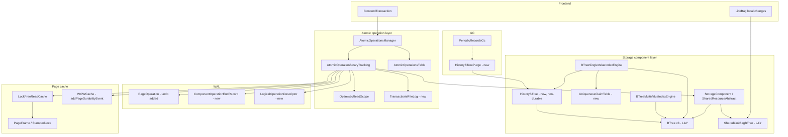

# Rollback Log — In-Place Page Updates with Logical Rollback

## Design Document
[design.md](design.md)

## High-level plan

### Goals

Replace the current **buffer-until-tx-commit** model of
`WALChangesPortion` with **in-place page updates scoped to a single
component operation**, and replace binary rollback (discard buffered
diffs) with **logical rollback via inverse component operations** that
produce CLR-equivalent page-operation records. The result:

- Pages are no longer pinned in the cache for the lifetime of a
  transaction. The cache can evict (steal) dirty pages once their
  component operation has committed. This removes a hard ceiling on
  active transaction size.
- Component-level locks are no longer held for the duration of a
  transaction. The happy path takes only short-term page exclusive
  latches during the commit of a component operation. The fallback
  takes only a short-term component exclusive lock.
- B-Trees migrate to **Lehman-Yau (L&Y) semantics** with multi-component-op
  splits and right-link reader fall-through. Each split commits as a
  small atomic component op, drastically narrowing latch surface and
  enabling concurrent readers to traverse a tree mid-split via the
  right-link path. No page format change required — the necessary
  sibling-pointer fields already exist in `CellBTreeSingleValueBucketV3`
  and `Bucket` (the link-bag bucket).
- **UNIQUE indexes adopt a single-version-in-tree model** with replaced
  versions captured in a **global history B-Tree backed by the
  existing non-durable storage-component infrastructure**
  (`StorageComponent.durable=false` / `WriteCache.addFile(name, id,
  nonDurable=true)`). The history file participates in the page cache
  (so it spills to disk under memory pressure) but skips WAL logging,
  fsync, and `dirtyPages` registration; on crash recovery,
  `WriteCache.deleteNonDurableFilesOnRecovery()` deletes it before
  REDO starts. The new `LogicalOperationDescriptor` (durable) carries
  `prev_value_with_metadata` as the **single load-bearing source** for
  rollback inverses, so they never need to read from history. This
  removes the hot-key bloat an inline multi-version model would have
  produced on the write path AND avoids the WAL-volume cost of treating
  history as durable. The history tree is purged on a periodic cycle
  driven by LWM advance; purge component ops are pure-non-durable and
  emit no WAL records.
- **Non-UNIQUE indexes and the link-bag B-Tree** adopt a multi-version
  inline composite-key model `(K, RID, ts)`. Bloat for these is bounded
  by record-mutation rate × LWM lag (each `(K, RID)` pair has at most
  one insert + one tombstone in its lifecycle), so a separate history
  store is unnecessary and costlier than inline storage.
- The architecture is a structural prerequisite for future per-page
  locking schemes: every read records stamps, every write validates
  them, every fallback is already short-term.
- Recovery moves from "redo only" to "redo + undo on page operations,
  plus logical CLRs for in-flight transactions." The WAL format
  supports both directions on every page operation record. A new
  `LogicalOperationDescriptor` WAL record per logical op makes
  recovery-time logical rollback possible without the per-tx in-memory
  write log.

### Constraints

- **No feature flag, no staged rollout.** The database has no
  production users. The change lands as a single PR on the
  `rollback-log` branch with dependency-ordered tracks. Each track's
  final commit leaves the test suite green. The branch squashes to a
  single commit on merge to `develop`.
- **No on-disk compatibility.** WAL record types and B-Tree on-disk
  layout may change without migration shims. There are no existing
  databases to preserve. **The L&Y migration is designed to preserve
  the current page format** — sibling pointers already exist — so
  format changes are limited to areas where they are unavoidable
  (e.g., adding `ts` to non-UNIQUE composite keys).
- **No B-Tree merges.** Pages may stay underfull until subsequent
  inserts re-fill them. The L&Y merge protocol is the most subtle
  part of the algorithm and is deferred. Bounded space cost on
  delete-heavy workloads, easily added later.
- **Tests green at each committed step.** The workflow requires every
  commit to pass tests, which shapes step decomposition — particularly
  for the cutover track, which uses "scaffolding first, wire last"
  sequencing with one larger wire-up step.
- **Zero backward-compatibility shims** — replaced code is deleted, not
  left behind. No dual paths.
- **Track 0's load-test harness is an implicit dependency for every
  subsequent track.** Each track's per-track load tests consume the
  harness Track 0 builds (JMH for L1 primitive microbenchmarks,
  `ConcurrentTestHelper` extensions for L2 component-level concurrent
  tests, integration-test harness for L3 end-to-end composition tests).
  Per-track `Depends on:` lines do not list Track 0 explicitly to avoid
  visual clutter.
- **Performance regression detection lives outside this PR** (per
  **D37**). The load tests added by Track 0 and the per-track inserts
  are **one-time validation tests** that confirm expected MT
  scalability holds at the moment of cutover via Phase 4's same-node
  A/B comparison on Hetzner CCX33. Long-term regression detection
  migrates to YCSB benchmarks on dedicated infrastructure after
  merge. CI does not hard-fail on the one-time load tests.

### Architecture Notes

#### Component Map

**What changes per component (intent):**

Bullets state high-level intent only. See `design.md` §"Class Design" for behavioral detail and per-decision sections (D6, D17, D18, D26–D39) for change-list specifics.

- **`AtomicOperationBinaryTracking`** — flush boundary moves from tx-end to component-op-end; pinned write-tracking page load captures `(frame, stamp)` in `OptimisticReadScope`; new `rollbackLogically()` drives CLR-style inverses fed by `TransactionWriteLog`.
- **`TransactionWriteLog`** — new tx-local in-memory record of every logical op; reconstructable from WAL `LogicalOperationDescriptor` records during recovery.
- **`AtomicOperationsManager`** — at component-op commit, performs sorted atomic validate-and-upgrade via `LockFreeReadCache.loadForWrite(..., frame, stamp)` per page in canonical `(fileId, pageIndex)` order. Tree-agnostic protocol.
- **`PageOperation`** — gains `undo(DurablePage)` on every subclass, symmetric to `redo`. Crash recovery uses it for portion-UNDO.
- **`ComponentOperationEndRecord`** — new WAL record marking clean component-op boundaries.
- **`LogicalOperationDescriptor`** — new WAL record per logical op (user-visible put/remove/add and record CRUD). Discriminated-union schema by `op_type`; load-bearing under D6 (`prev_value_with_metadata`) and D23 (`prev_position_entry`). Not emitted for purely structural ops (L&Y leaf splits, parent inserts).
- **`BTree` v3** and **`SharedLinkBagBTree`** — converted to L&Y semantics (D17, D20, D12); no page format change. Cleanups land here: `treeSize` removed (D31 linkbag, D34 index), `pagesSize` removed with orphan-page acceptance (D35), `approximateIndexEntriesCount` becomes volatile (D30), inner `acquireExclusiveLock` removed from write hot-path (D36, the load-bearing change for D18 throughput).
- **`BTreeSingleValueIndexEngine`** (UNIQUE) — single-version in-tree; captures pre-image to non-durable history on replacement (in-memory only); emits `LogicalOperationDescriptor` with `prev_value_with_metadata` (S14); read falls through to history when in-tree writer invisible. Depends on `UniquenessClaimTable`. D30 volatile-counter refactor.
- **`BTreeMultiValueIndexEngine`** (non-UNIQUE) — composite key `(K, RID, ts)`; per-version-chain visibility filtering; tombstone entries; bloat bounded by mutation-rate × LWM lag. D30 dual-counter refactor (svTree + nullTree).
- **`HistoryBTree`** — new global non-durable B-Tree per storage; key `(indexId, userKey, replaced_at_ts)`. Always-create-fresh on every open (S13); page mutations skip WAL/`dirtyPages`/fsync/DWL. Recovery never reads history (S12); counter maintenance disabled (D6 clarification, same principle as D31).
- **`UniquenessClaimTable`** — per UNIQUE-index `(userKey) → txId` held tx-long; replaces scan-based uniqueness.
- **`PaginatedCollectionV2`** — emits `LogicalOperationDescriptor` per CRUD; reuses existing `keepPreviousRecordVersion` machinery; inverse is CPM bit-flip + DPB-set + count adjustment (D23, D39, S15). D28 P2/P3 (target-page cache + lazy FSM updates), D29 (volatile counter + `closeCollection` snapshot + StatsStatus).
- **`CollectionPositionMapV2`** — gains `scanLiveSlotCount()` for D29 background rebuild; bucket-page format unchanged.
- **`PaginatedCollectionStateV2`** — `.pcl` page 0 wrapper; D29 limits `APPROXIMATE_RECORDS_COUNT` writes to `closeCollection`; `FILE_SIZE` follows D26 pattern.
- **`CollectionDirtyPageBitSet`** — heap-resident `AtomicLongArray` bitset is steady-state source (D33); `.dpb` non-durable, written only at close. Page format unchanged. GC's `processDirtyPage` is the natural rebuild consumer.
- **`FreeSpaceMap`** — non-durable, lazy updates, target-page cache, round-robin cursor (D28 P1/P2/P3/P5). Internal access pattern unchanged; close-path snapshot at clean shutdown; rebuild on crash open.
- **`IndexHistogramManager`** — `applyHistogramDeltas` is post-commit in-memory CHM only; threshold-triggered `flushSnapshotToPage()` removed; `closeStatsFile` is the only `.ixs` write path; rebuild on crash open (D27 supersedes D24).
- **`LockFreeReadCache`** — new `loadForWrite(..., frame, stamp)` overload (atomic validate-and-upgrade); preserves `dirtyPages` registration. W-TinyLFU eviction unchanged.
- **`PageFrame`** — adds `tryConvertToWriteLock(long stamp)` (one-line delegation).
- **`WOWCache`** — adds `addPageDurabilityEvent` for the S9 dual-gate.
- **`StorageComponent` / `SharedResourceAbstract`** — `ReentrantReadWriteLock` retained (D10). `executeInsideComponentOperation` is the commit boundary; `executeOptimisticStorageRead` is the sole subsystem read entry point (Track R converts remaining sites).
- **`HistoryBTreePurge`** — new periodic task; range-deletes by `replaced_at_ts < LWM`; reuses records-GC scheduling and locking pattern (D15).

#### D1: In-place apply at component-op-end, not tx-end

- **Alternatives considered**: (a) keep buffered apply but unpin at
  component-op-end; (b) in-place apply at each page mutation; (c)
  flush at component-op-end (this proposal).
- **Rationale**: (a) doesn't enable page stealing because dirty pages
  still need pins somewhere. (b) loses atomicity across the multi-page
  chain of a component operation. (c) preserves atomicity for the
  whole chain while shrinking the dirty-but-pinned window from tx
  length to component-op length.
- **Risks/Caveats**: introduces a window where a component op has
  modified pages but the surrounding transaction may still abort.
  Requires logical rollback (D4) to back out committed component ops.
  Also requires `PageOperation.undo()` (D3) for crash recovery of
  mid-apply interruptions.
- **Implemented in**: Track D (with scaffolding in Track A).

#### D2: Enable page stealing

- **Alternatives considered**: retain NO-STEAL (pages pinned until tx
  end); STEAL+NO-FORCE (pages evictable, recovery does REDO + UNDO);
  STEAL+FORCE (pages always flushed at tx end).
- **Rationale**: STEAL+NO-FORCE is the standard ARIES choice and is
  the one that removes the hard ceiling on tx size. Required by D1
  anyway.
- **Risks/Caveats**: recovery complexity increases — must replay REDO
  forward from the last checkpoint and apply logical UNDO for
  in-flight txs. This is exactly what D3/D4/D5 enable.
- **Implemented in**: Track D.

#### D3: PageOperation supports redo and undo as page-level logical inverses

- **Alternatives considered**: (a) before-image/after-image logging
  with separate records per direction; (b) single physiological record
  per mutation with symmetric `redo` / `undo` methods, each a
  page-level logical inverse (this proposal); (c) CLR-only model where
  recovery emits new WAL records to compensate partial component ops.
- **Rationale**: physiological records already encode the high-level
  operation at the page level. The logical inverse is derivable from
  the same parameters and is implemented through the same page-API
  abstractions `redo` uses — not as raw byte manipulation. Subclasses
  whose inverse needs pre-image data extend the wire format. One
  record per mutation, two methods — half the log volume of
  before/after-image logging. Both methods are pure page-level logical
  transforms — they do **not** read or write `page.getLsn()`. LSN
  management lives at the portion boundary in recovery (see **D16**);
  idempotence is enforced by the portion-level applier.
- **Risks/Caveats**: every `PageOperation` subclass must have a
  correct page-level logical inverse. Per-subclass unit tests assert
  `undo(redo(page))` returns the page to **logical equivalence** with
  its pre-`redo` state. Byte-level layout details such as free-space
  position, physical entry offsets, or padding bytes may legitimately
  differ.
- **Implemented in**: Track A (page-level logical `undo` methods on
  every subclass), Track D (portion-level apply/undo wired into
  `AbstractStorage.restoreAtomicUnit`).

#### D4: Normal transaction rollback via logical inverse operations

- **Alternatives considered**: page-level undo for normal rollback
  (mirrors crash recovery but runs at runtime); logical inverses as
  regular component ops (this proposal); mixed.
- **Rationale**: logical inverses naturally produce normal
  `PageOperation` records through the existing component-op pipeline
  — these records serve as CLRs for free. Crash-during-rollback is
  handled by forward REDO of those records. No separate "CLR"
  infrastructure needed; reuses the redo path.
- **Risks/Caveats**: correctness for B-Tree inverse ops depends on
  L&Y descender's right-link fall-through (see **D12**), not on the
  S1 invariant the original plan would have leaned on.
- **Implemented in**: Track D.

#### D5: New ComponentOperationEndRecord WAL record type

- **Alternatives considered**: LSN-chaining to identify component-op
  boundaries (implicit); explicit marker record (this proposal).
- **Rationale**: recovery needs an unambiguous answer to "did this
  component op complete?" — not derivable from per-page LSNs alone
  when pages may be evicted and reloaded at older LSNs. An explicit
  marker record makes the boundary a first-class fact in the log.
- **Risks/Caveats**: small fixed overhead per component op in the WAL.
- **Implemented in**: Track A (record type), Track D (emits and
  consumes it).

#### D6: UNIQUE indexes use single-version in-tree + non-durable global history B-Tree

- **Alternatives considered**: (a) inline multi-version `(K, ts)` with 3-tier GC; (b) per-index undo log (InnoDB-style); (c) per-index history B-Tree (doubles storage); (d) single global durable history B-Tree; (e) single global history B-Tree backed by non-durable storage-component infrastructure, reset on every open, with `LogicalOperationDescriptor.prev_value` carrying rollback state (chosen).
- **Rationale**: (a) bloats hot-key leaves and needs 3 GC tiers; (b) is a brand-new subsystem; (c) doubles storage. (d) is correct but an unnecessary durability promise — no consumer of the history tree spans a crash boundary (snapshot ts allocation is monotonic across crashes; the only crash-spanning consumer is in-flight rollback, which reads from the durable `LogicalOperationDescriptor`, never from history). (e) eliminates ~30-50% of the WAL volume per UNIQUE put-with-replacement / remove, reuses the existing non-durable file mechanism, and lets W-TinyLFU spill cold history pages to disk.
- **Risks/Caveats**: descriptor is the single source of truth — a bug capturing wrong `prev_value` is silently corrupting (mitigated by S14 write-time assertion); pure-non-durable purge ops emit no WAL records (S7 relaxed); always-fresh-on-open discipline (S13: `BTree.create()` not `load()` on every open); history tree disables counter maintenance entirely (no consumer; same principle as D31).
- **Implemented in**: Track H.
- **Full design**: design.md §"History B-Tree Purge (non-durable)" + §"Visibility Under Physical Cleanup"

#### D7: Non-UNIQUE indexes and link-bag stay multi-version inline with composite key

- **Alternatives considered**:
  - (a) Migrate non-UNIQUE to history-store too (Variant 3 in the
    cost analysis).
  - (b) Delete-mark + dereference RID (no `ts` in key, per-entry
    metadata + record-side visibility).
  - (c) Multi-version inline with composite key `(K, RID, ts)` (this
    proposal).
- **Rationale**: non-UNIQUE indexes already have one entry per
  `(K, RID)` pair (composite key includes RID today). Adding `ts`
  to the composite key produces at most 2 entries per `(K, RID)`
  lifecycle (insert + tombstone). Bloat is bounded by record
  mutation rate × LWM lag — typically < 5% in steady state. Option
  (a) grows total bytes by ~22% (per-entry metadata is heavier than
  ts in the key) and doubles tree-touches on SI reads at older
  snapshots. Option (b) makes index-only queries (COUNT, EXISTS)
  pay for a record load per candidate. Option (c) keeps the model
  symmetric with the link-bag (which is already composite-key-
  with-ts) and reuses today's append-only write pattern.
- **Risks/Caveats**: read path walks the version chain at
  `(K, RID, *)` (typically 1-2 entries). Tier-1 split-time GC
  retention rule is extended to cover this case (see **D9**).
- **Implemented in**: Track V.

#### D8: UNIQUE-index claim table

- **Alternatives considered**: first-committer-wins scan at commit
  time; per-write scan at put time (race-prone); tx-long claim table
  (this proposal).
- **Rationale**: with single-version in-tree under in-place writes,
  two concurrent UNIQUE puts on the same K would silently overwrite
  each other (last-writer-wins, with the loser's RID lost to history
  store). A scan-based check at put time has a TOCTOU window under
  short-term locking. A small in-memory claim table (hash + CAS) is
  race-free by construction, cheaper per put, and scoped only to
  UNIQUE indexes (small subset of writes).
- **Risks/Caveats**: memory scales with (UNIQUE-indexed keys touched)
  per tx. ~40 MB for a 1M-row bulk UNIQUE insert — tolerable. Claims
  must be released on tx commit/rollback/abort; leaks caught by
  timeout-eviction hook.
- **Implemented in**: Track C.

#### D9: GC consolidation — Tier-1 split-time only for inline trees + history-store purge

- **Alternatives considered**: 3-tier GC for inline trees (the
  original plan: split-time + write-path opportunistic + background);
  Tier-1 only for inline + dedicated periodic for history (this
  proposal); 2-tier (Tier-1 + write-path) for inline.
- **Rationale**: with UNIQUE moved to history store, the worst-case
  hot-key bloat (the original motivator for Tier-2/Tier-3) is gone.
  Non-UNIQUE and link-bag bloat is bounded by record-mutation rate
  × LWM lag; Tier-1 split-time GC handles it for any leaf that
  receives writes. Cold leaves with stale tombstones are read-cost-
  affected only — they don't grow indefinitely. The history B-Tree
  needs its own purge mechanism (entries below LWM are eligible
  for removal); this is a single periodic task, simpler than the
  3-tier setup.
- **Risks/Caveats**: cold leaves with many stale tombstones have
  slightly elevated read cost (extra in-leaf entries to filter).
  Mitigated in practice by the bounded bloat factor. Can add Tier-2
  write-path cleanup later if profiling shows benefit.
- **Implemented in**: Tier-1 retention rule extension in Track V;
  history-store purge in Track E.

#### D10: OptimisticReadScope records page-frame stamps only

- **Alternatives considered**: page-frame stamps only (this proposal);
  page-frame + component-level stamp; migrate
  `SharedResourceAbstract` from RRWLock to StampedLock as part of
  this plan.
- **Rationale**: every mutation readers care about touches a page the
  reader also read. Page-frame stamps already catch it. A
  component-level stamp adds false positives. Migrating
  `SharedResourceAbstract` to StampedLock is a worthwhile standalone
  refactor but doesn't belong in this plan. Page-frame stamps compose
  with `StampedLock.tryConvertToWriteLock` to give the commit path
  an atomic "validate + acquire write stamp" primitive.
- **Risks/Caveats**: keeps `ReentrantReadWriteLock` on the component
  fallback path. Cost is ~60 extra bytes per component instance.
  Stamp tracking is **uniform** across warm-cache, cold-disk-load,
  and memory storage per **D40** — no read path bypasses the
  per-page StampedLock.
- **Implemented in**: no track for the lock-primitive migration
  (explicit decision NOT to migrate). The fallback path's
  `RRWLock`-based exclusive-lock acquisition is wired by Track D
  via `AtomicOperationsManager.executeInsideComponentOperation`.
  See **D36** for the matching deletion of the per-method
  `acquireExclusiveLock()` calls in B-Tree write hot-path methods
  — those have to come out before the optimistic protocol can
  deliver any concurrent throughput, even though D10 keeps the
  lock primitive itself. See **D40** for the uniform-availability
  guarantee that makes D10's stamp-only model load-bearing on every
  storage shape, not just disk-warm-cache.

#### D11: Single PR, dependency-ordered tracks on branch, no flag

- **Alternatives considered**: staged with runtime feature flag;
  per-storage-component gating; shadow-mode parallel execution; single
  PR with no flag (this proposal).
- **Rationale**: no production users → no rollback hedge needed. Flag
  infrastructure (dual paths, expanded test matrix, flip ceremony,
  deletion track) adds complexity with zero safety benefit. Tracks
  still land in dependency order on the branch and each passes CI;
  squash on merge delivers one commit to `develop`.
- **Risks/Caveats**: the cutover track (Track D) is the largest single
  commit. Mitigated by "scaffolding first, wire last" decomposition.
- **Implemented in**: shapes the plan structure, not a specific track.

#### D12: L&Y right-link descender replaces S1 invariant for logical undo correctness

- **Alternatives considered**: enforce S1 ("every structural
  modification is one component op") as a runtime assertion (the
  original plan); rely on right-link descender to find any in-tree
  entry regardless of split state (this proposal); add a tree-level
  structure-modification latch.
- **Rationale**: under L&Y, splits are decomposed into multiple
  component ops (leaf split + parent insert + cascade). S1 cannot be
  preserved in the multi-component-op model. The right-link
  descender provides a stronger guarantee: any key present in the
  tree is reachable from root via descend + right-link fall-through
  whenever the current page's max-key is below the search key. This
  works regardless of which component ops have committed and which
  are mid-cascade. The correctness of search-based logical undo is
  thus a mechanical property of L&Y, not a load-bearing convention.
- **Risks/Caveats**: right-link traversal must compare search key to
  current-page-max-key (rightmost entry). PG-style explicit
  high-keys are an optimization; current-rightmost-entry suffices
  for correctness because the splitter's max-key drops atomically
  with the right-sibling pointer write (both in the same component
  op).
- **Implemented in**: Track L.

#### D13: Final-state transition gates on both WAL and page durability

- **Alternatives considered**: (a) current approach —
  `persistOperation` fires on WAL durability alone, page durability
  protected separately; (b) page durability only; (c) require both
  WAL and page durability (this proposal).
- **Rationale**: under STEAL, a tx's START segment can be truncated
  while its END is retained, producing "orphan record" recovery
  scenarios. Option (c) eliminates the orphan case by keeping the tx
  in `getSegmentEarliestNotPersistedOperation` until fully safe. The
  symmetric path covers rollback CLRs, closing a gap where the
  current synchronous `rollbackOperation` could allow CLRs to be
  truncated before durability.
- **Risks/Caveats**: page durability under STEAL can lag WAL
  durability significantly. `persistOperation` will fire later than
  today, slightly delaying compaction of the atomic-operations table.
- **Implemented in**: Track D.

#### D14: S2 enforced by convention via single read helper, not by runtime or compile-time guard

- **Alternatives considered**: (a) runtime `-ea` assertion that
  `PageFrame.acquireSharedLock` is only called from inside the
  fallback; (b) move `PageFrame.acquireSharedLock` to package-private;
  (c) convert every subsystem read to route through
  `StorageComponent.executeOptimisticStorageRead` and rely on that as
  the only shared-lock entry point — no guard, no new exception (this
  proposal).
- **Rationale**: `executeOptimisticStorageRead` +
  `OptimisticReadFailedException` is already the complete fallback
  mechanism. Once every subsystem read is routed through it, the only
  remaining `acquireSharedLock` calls live inside the helper itself
  or inside cache-internal API implementations. Code review is
  adequate mitigation for a bounded set of files. Under **D40**,
  `OptimisticReadFailedException` fires only on **real concurrent
  invalidation** (eviction, frame recycle, concurrent writer) — never
  as a side effect of cache-miss or memory-storage asymmetry — so
  fallback frequency reflects genuine contention, not protocol-shape
  artifacts.
- **Risks/Caveats**: drift — a new storage-component author could
  bypass the helper. Mitigated by review and by **S26**, which makes
  "every read uses a per-page StampedLock primitive" a checkable
  invariant.
- **Implemented in**: Track R.

#### D15: History-store purge mirrors records-GC scheduling/locking, diverges on discovery and cursor

- **Alternatives considered**:
  - (a) Mirror records GC fully (durable bit-set per (indexId, K)
    range).
  - (b) Cursor-based paced full traversal of the history B-Tree
    keyed by ts (this proposal).
- **Rationale**: the records-GC pattern supplies the scheduling
  (`fuzzyCheckpointExecutor`), the `stateLock.readLock()` outer
  guard preventing the 3-way deadlock with file deletion, per-
  component-op execution, per-tree exception isolation. These are
  borrowed verbatim. **Diverges from records GC on**: (a) discovery —
  history entries are naturally sorted by `ts` within each
  `(indexId, K)` prefix, so a range scan with `ts < LWM` discovers
  all eligible entries deterministically (no bit-set, no write-path
  bookkeeping); (b) WAL — purge component ops on a non-durable file
  emit zero WAL records (S7-relaxed pure-non-durable ops, see D6),
  so there are no CLR-style rollback concerns. The cursor is a
  `(indexId, lastPurgedKey)` pair; restart loses both the cursor
  and the entire history file (wiped by
  `deleteNonDurableFilesOnRecovery`), which is a no-op since fresh
  history starts empty.
- **Risks/Caveats**: CPU cost on very-large history trees. Per-cycle
  cost is bounded by an explicit budget. Cursor invalidation under
  concurrent splits/merges is handled by the L&Y descender —
  resume is a root-to-leaf search.
- **Implemented in**: Track E.

#### D16: Portion-level idempotence at recovery, not per-PageOp LSN chains

- **Alternatives considered**:
  - (a) Add a per-page-per-op `prevPageOpLsnOnThisPage` field for
    classical ARIES per-op LSN-chain idempotence.
  - (b) Emit inverse PageOp records as new WAL entries during
    recovery (CLR-only).
  - (c) Keep runtime apply as-is (single `page.setLsn(portion.endLsn)`
    per portion) and make recovery's apply/undo portion-level (this
    proposal).
- **Rationale**: YouTrackDB's physiological logging already applies
  a `WALPageChangesPortion` as a single binary diff and updates
  `page.LSN` once per portion. `PageOperation#initialLsn` is captured
  per PageOp but all PageOps in a portion share the same value — it
  cannot distinguish "PageOp N applied" from "PageOp N+1 applied"
  and is not usable as a per-op idempotence guard. Recovery's current
  REDO gate is `page.LSN < thisOp.walLsn`, not `initialLsn`.
- **Risks/Caveats**: recovery must bucket PageOps by
  (component op, page) to reconstruct portion boundaries. The
  infrastructure is already present —
  `ComponentOperationEndRecord` (**D5**) delimits component-op
  boundaries; per-page grouping is by the record's target
  `(fileId, pageIndex)`.
- **Implemented in**: Track A (page-level logical `undo` methods),
  Track D (portion-bucketing + boundary LSN handling in
  `AbstractStorage.restoreAtomicUnit`).

#### D17: L&Y migration preserves page format; sibling pointers already exist

- **Alternatives considered**: introduce explicit high-key field in page header (PG-style); preserve current page format and use current-rightmost-entry as the implicit high-key (chosen).
- **Rationale**: `CellBTreeSingleValueBucketV3` and `Bucket` already carry `LEFT_SIBLING_OFFSET` / `RIGHT_SIBLING_OFFSET` on every page; corresponding WAL ops (`SetLeftSiblingOp`, `SetRightSiblingOp`) are already implemented. Leaf splits maintain sibling pointers today; internal splits skip them under a `splitLeaf` gate. L&Y requires right-link traversal at every level (cascading splits leave half-split chains across levels), so the migration removes the gate. No on-disk format change — only the gating logic in `splitBucket`/`splitRootBucket` changes.
- **Risks/Caveats**: current-rightmost-entry comparison costs one extra compare per page during descent (negligible). Empty leaves are reachable post-deletion (no merges per D20) — S11(b)/(c) handles them: follow right-link if it exists, else return absent.
- **Implemented in**: Track L.
- **Full design**: design.md Part 2 §"L&Y B-Tree: Right-Link Descender + Cascading Splits" (combined section). Long-form per `design-mechanics.md §"L&Y B-Tree: Right-Link Descender"` + §"L&Y Cascading Split: Worked Example".

#### D18: Atomic validate-and-upgrade via tryConvertToWriteLock

- **Alternatives considered**:
  - (a) Validate all recorded stamps in one sweep, then acquire page exclusive latches in sorted order — TOCTOU window.
  - (b) Acquire exclusive latches in sorted order, then call `StampedLock.validate(priorOptimisticStamp)` — does not work (validate returns false after the same thread takes the write lock).
  - (c) Atomic validate-and-upgrade via `StampedLock.tryConvertToWriteLock(stamp)` per page, wrapped by a new `LockFreeReadCache.loadForWrite(..., frame, stamp)` overload (chosen).
  - (d) Pin inside commit-time `loadForWrite` (rejected — forces three cache read primitives instead of two and folds two failure modes into one API).
- **Rationale**: (c) is the JDK's atomic upgrade primitive. The cache-layer wrapper keeps the `writeCache.updateDirtyPagesTable` call (S8) inside the cache package where upgrade callers cannot omit it. Sort scope is per-component-op (typically 4-15 pages), and cross-tree atomicity is a per-op property — across multiple component ops, atomicity comes from logical inverses, not the sort.
- **Risks/Caveats**: `tryConvertToWriteLock` is added to `PageFrame` (Track A). Sort key (`fileId`, `pageIndex`) is stable and globally consistent (`storageId` global, `internalFileId` persisted in `name_id_map_v3.cm`); precedent in `WOWCache.ConcurrentSkipListSet<PageKey>`. Memory-only side-channels (snapshot index, histogram deltas) are NOT in the sort — they flush via D25 / D27 paths. **Cross-reference D36**: the protocol only delivers throughput once tree-level `acquireExclusiveLock()` calls inside `BTree.update`/`remove` and `SharedLinkBagBTree.put`/`remove` are deleted. **Cross-reference D40**: the throughput claim holds universally (warm cache, cold disk load, memory storage) only because D40 makes variant-(1) optimistic reads available on every storage shape; without D40 the protocol is correct but degenerates to component-shared-lock serialization on memory storage and during every cold-cache phase.
- **Implemented in**: Track A (adds `PageFrame.tryConvertToWriteLock`; lands the D40 cache-layer change paired alongside since both are foundational primitives), Track D (adds `LockFreeReadCache.loadForWrite(..., frame, stamp)` and the sorted-upgrade commit loop).
- **Full design**: design.md §"Component-Op Commit Upgrade Protocol" + §"Cross-Tree Atomicity for Record CRUD and Composite Saves"

#### D19: LogicalOperationDescriptor for recovery-time logical rollback AND as the load-bearing carrier of prev_value

- **Alternatives considered**: (a) persist per-tx in-memory write log to a separate durable structure; (b) reverse-derive logical ops from PageOp record patterns at recovery time (brittle); (c) embed a logical-op descriptor in the WAL stream once per user-visible logical operation carrying every field needed for its inverse (chosen).
- **Rationale**: PageOp records carry physical-page changes, not logical intentions. (a) is a parallel persistence mechanism with its own recovery story; (b) silently breaks under PageOp refactors. (c) embeds the descriptor in the existing WAL stream, recovers naturally, and is scoped per logical op (pure structural ops emit no descriptor). Under D6's non-durable history, the descriptor is the **single source of truth** for `prev_value` at rollback time — load-bearing, not an audit trail.
- **Risks/Caveats**: one extra WAL record per logical op (~< 64 typical bytes). A bug capturing wrong `prev_value` is silently corrupting under non-durable history; mitigated by S14 write-time assertion + T1 round-trip property test.
- **Implemented in**: Track A (record type + write-time assertion), Track D (emits and consumes), Track T1 (round-trip property test).

#### D20: Skip B-Tree merges in initial L&Y migration

- **Alternatives considered**: full L&Y page-deletion protocol (PG-style 2-pass with link-disconnection); skip merges entirely (chosen); ad-hoc underfull-leaf rebalance.
- **Rationale**: PG's `nbtree` merge is the most subtle part of L&Y. Skipping it leaves underfull (or empty) leaves until subsequent inserts re-fill them — read correctness is preserved by S11(b)/(c) (follow right-link or return absent). Adding merges later is a pure extension.
- **Risks/Caveats**: delete-heavy workloads accumulate empty-leaf chains; each search in such a chain pays O(chain_length) extra page reads via S11(b). Bounded by tree size. Profiling-flag for follow-up work (lazy empty-page cleanup on insert, or full L&Y page-deletion).
- **Implemented in**: scope decision, not a specific track.

#### D21: Property-based testing alongside classic tests

- **Alternatives considered**: classic tests only; property-based
  tests only; both (this proposal).
- **Rationale**: L&Y B-Trees have many subtle invariants (sibling-
  pointer consistency, sorted order across right-link chain, no
  orphan pages, no key duplication). Random op sequences with
  shrinking find boundary bugs that hand-written tests miss. The
  history-store + MVCC interaction has many possible reader/writer
  interleavings; random tx interleavings with an SI oracle catch
  visibility bugs. Crash recovery has a large crash-point space;
  random crash injection finds gaps. Classic tests document
  scenarios that matter — they remain in the regression suite. The
  combination is strictly more coverage than either alone.
- **Risks/Caveats**: jetCheck adds a test dependency. Property tests
  can be slower than unit tests (more iterations). Budget per
  property class is bounded (~30s per class, ~200-500 random
  sequences). Failures must be reproducible via preserved seeds.
- **Implemented in**: Tracks L (B-Tree invariants), V (non-UNIQUE
  MVCC), H (history-store SI), T1 (rollback round-trip), T2
  (crash recovery).

#### D22: VMLens for sync-primitive correctness, jetCheck for end-to-end behavior

- **Alternatives considered**: jetCheck only; VMLens only; both, with VMLens scoped to small new sync primitives and jetCheck to large state-machine properties (chosen).
- **Rationale**: VMLens exhaustively explores thread schedules — right for small primitives with bounded state spaces (validate-and-upgrade in `loadForWrite`, the `state` pin lifecycle, `UniquenessClaimTable`). jetCheck's random op sequences with shrinking fit the larger spaces (L&Y descender vs. cascading split, MVCC visibility, history-store fall-through, rollback round-trip, crash recovery). Additive, not redundant.
- **Risks/Caveats**: VMLens has internal limits — existing tests cap `MAX_ITERATIONS` at 100 with 2-thread, single-op-per-thread structure (`AtomicOperationsTableMTTest`). New MT tests follow the same convention; larger primitives belong in jetCheck or integration.
- **Implemented in**: Track C (`UniquenessClaimTableMTTest`), Track D (`LoadForWriteMTTest`, `CacheEntryStatePinMTTest`).
- **Full design**: design.md §"Test Strategy: VMLens vs jetCheck"

#### D23: Record CRUD logical rollback via position-pointer descriptors + LWM-gated chunk survival

- **Alternatives considered**:
  - (a) Inline full `prev_content` in `LogicalOperationDescriptor` for
    `RECORD_UPDATE` / `RECORD_DELETE`. Doubles WAL volume per record
    update; for large records (multi-chunk, >8 KB) the descriptor itself
    becomes large.
  - (b) Inline prev_content up to a threshold + WAL-LSN link to prior
    `CollectionPageAppendRecordOp` records for the rest. Brittle if
    WAL was truncated past the linked records; complex recovery.
  - (c) Reconstruct `prev_content` at recovery time by walking prior
    `PageOperation` records on the same RID's chunk pages. Fragile to
    PageOp schema evolution; expensive recovery.
  - (d) Position-pointer descriptor (`prev_position_entry =
    (pageIndex, slotOffset, version, status)`) + chunk survival via
    the existing LWM-gated snapshot-index mechanism (this proposal).
- **Rationale**: `PaginatedCollectionV2`'s record store already
  implements MVCC by leaving prior chunks physically on disk —
  `updateRecord` writes new chunks at fresh slots and redirects the
  CPM pointer (`PaginatedCollectionV2.java:1396-1441`); user-level
  `deleteRecord` only marks CPM as REMOVED without chunk removal
  (`PaginatedCollectionV2.java:1295-1337`); chunks are reclaimed only
  by GC's `processDirtyPage` → `CollectionPage.deleteRecord`, gated
  by `LWM > visibility_key.newRecordVersion`. For any in-flight tx_W,
  `LWM ≤ tx_W.tsMin < tx_W.commit_ts ≤ visibility_key.newRecordVersion`,
  so the prev chunks remain physical and reachable. The descriptor
  carries only the position pointer (~36 B fixed) and the inverse
  component op is a single CPM redirect + DPB-set (2-3 page mutations),
  regardless of record size. Reuses existing infrastructure (snapshot
  index, DPB, GC) rather than introducing new mechanisms. Mirrors D6's
  "descriptor is the load-bearing source of truth" pattern, this time
  on physical-pointer geometry rather than UNIQUE-index value bytes.
- **Risks/Caveats**: `prev_position_entry` is load-bearing — wrong-capture mitigated by S15 write-time assertion. Rolled-back new chunks become stale until GC (bounded same as committed update write-amplification). Snapshot-index visibility timing resolved by D25; recovery-time LWM bound resolved by D32+S23.
- **Implemented in**: Track A (descriptor schema for `RECORD_CREATE`/`UPDATE`/`DELETE` + `RecordRollbackAssertions.checkPrevPositionCoherent` for S15), Track D (record-side inverse component ops in `PaginatedCollectionV2`; recovery-time `AtomicOperationsTable` reconstruction + recovery-window `TsMinHolder` per D32). See **D39**, which promotes alternative `(d)` to binding and forbids `prev_content` on `RECORD_DELETE`/`RECORD_UPDATE`.
- **Full design**: design.md §"Record CRUD: Position-Pointer Logical Rollback"

#### D25: Snapshot-index merge at component-op-end (not tx-commit)

- **Alternatives considered**: (1) keep merge at tx-commit (status quo); (2) move merge to component-op-end (chosen — relocate `flushSnapshotBuffers()` from `commitChanges` to component-op-end + drain local buffers); (3) eliminate per-tx local buffer (loses writer-sees-own-uncommitted-writes pattern in `MergingDescendingIterator`).
- **Rationale**: D23's correctness chain depends on snapshot entries being globally findable for any in-flight tx. The shared snapshot index must reflect the same visibility boundary as the CPM page. Under in-place writes, that boundary is component-op-end, so flush-before-apply at every component-op-end preserves the ordering invariant with no on-disk changes.
- **Risks/Caveats**: fallback-path idempotence (TreeMap.put absorbs re-runs); GC ↔ keepPreviousRecordVersion ordering preserved under stamp concurrency; speculatively-published entries from aborted txs become LWM-evictable; recovery unchanged (shared SI is in-memory, starts empty post-recovery).
- **Implemented in**: Track D (relocate `flushSnapshotBuffers()` from `commitChanges` to the component-op-end commit phase + drain `localSnapshotBuffer` and `localVisibilityBuffer` after flush).
- **Full design**: design.md Part 2 §"Snapshot-Index Merge at Component-Op-End (D25)"

#### D26: Component file extension as one atomic component op with a durable logical-end counter

- **Alternatives considered**: (a) use `WriteCache.filledUpTo` directly; (b) in-memory counter reconstructed on open; (c) sidecar metadata file; (d) counter on a known page of the component's own file (CPM page 0's `MapEntryPoint.fileSize` pattern), updated atomically with `addPage` + per-page init (chosen).
- **Rationale**: Files don't shrink. After a crash where extended pages flushed to disk but `ATOMIC_UNIT_END` did not, physical size can exceed logical size. (a) corrupts the position space; (b) loses durability or pays O(N) on every open; (c) is unnecessary indirection. (d) is what CPM already does — promoted to a plan-wide rule. The counter page is read-tracked in steady state (per S16) and write-tracked only on extension; recovery is automatic via WAL replay.
- **Risks/Caveats**: counter-page contention is bounded by extension rate (CPM: 1 per ~378 allocates) and absorbed by S16's validate-path in steady state. Orphan pages on crash mid-extend are bounded by `1 page × concurrent extenders` and become permanent disk waste. Tree-structured stores do not need this counter — covered by D35; FSM is replaced by D28's non-durable redesign.
- **Implemented in**: Track A (S16 commit-time classification — part of validate-and-upgrade primitive), Track D (CPM extension code uses S16 read-track + write-track-on-bucket-fill pattern). FSM via D28; B-Trees via D35.
- **Full design**: design.md §"Component File Extension Pattern (D26)"

#### D27: Histograms are volatile in steady state — `.ixs` written only at clean shutdown, rebuilt after crash

- **Alternatives considered**: (a) sync per-tx flush of `.ixs` page 0 (D24's proposal — fallback magnet); (b) async post-commit flush with bounded approximation (status quo, has crash-safety bug); (c) always-volatile, rebuilt on every open (painful on large clean restart); (d) durable across clean shutdowns + wiped on crash + background rebuild after crash, with the in-memory CHM as the steady-state source of truth (chosen).
- **Rationale**: Histograms are advisory — correctness is unaffected by stale/missing histograms. (a) makes `.ixs` page 0 a hot-page magnet (worse than CPM, fires on every CRUD). (b) leaves the documented crash-safety bug. (c) pays full rebuild on every restart. (d) keeps CHM as the steady-state source of truth, persists `.ixs` once at shutdown, gates the open path on `checkIfStorageDirty()`. **D24 is superseded by this decision.**
- **Risks/Caveats**: sub-optimal query plans during the post-crash rebuild window (planner falls back to scan-anyway); HLL registers reconstructed by the same scan; `IndexHistogramDurabilityTest` re-targets to "after crash + rebuild, histogram matches" rather than exact survival. Rebuild ↔ concurrent-write merge is order-independent under `cache.compute`.
- **Implemented in**: Track D (remove threshold-triggered `flushSnapshotToPage()` from `applyDelta`; add open-time `.ixs` truncation; upgrade `maybeScheduleHistogramWork` to eager-on-crash). Track F (drop `histogram_aborted_delta_applied_count`; add rebuild-window metrics).
- **Full design**: design.md Part 5 §"Pattern: Volatile counter + crash rebuild" (per-stat body for Histograms). Long-form mechanism: `design-mechanics.md §"Histograms: Volatile in Steady State, Rebuilt After Crash (D27)"`.

#### D28: FSM as approximate non-durable hint with target-page cache and lazy updates

- **Alternatives considered**: (a)/(b)/(c) range-shard / hierarchical-shard / eliminate FSM page 0; (d) S16 + page-internal early-exit guard only; (e) S16 + conditional WAL registration (original D28); (f) PG's four-layer scaling stack — target-page cache (P2), lazy updates (P3), non-durable FSM (P1), per-FSM-page round-robin cursor (P5) — chosen.
- **Rationale**: an audit of `FreeSpaceMap` followed by a study of PG's FSM scalability stack found that PG eliminates the FSM hot path entirely (not just its contention) via these four layers. Non-durable FSM mirrors D27's histogram pattern (durable across clean shutdowns, wiped on crash, background rebuild on open); lazy updates fit the in-place write model; per-collection target-page cache is one `volatile int` field; round-robin cursor is heap-resident in our single-process model (no page-format change, no hint-bit infrastructure). PG bench: 32-client COPY +3.5× from this stack. Options (a)/(b)/(c) add complexity for what PG demonstrated can be sidestepped; (d)/(e) only address the contention slice this proposal eliminates from the hot path.
- **Risks/Caveats**: no VACUUM analog (mitigated by failure-path correction + eager defrag/delete + extension publish; cold-page drift causes only premature extension, never correctness). Crash rebuild window — writers fall through to extension. Target-page cache torn-read tolerated by verify-then-correct. Failure-path correction is load-bearing per S19. `.fsm` durability is close-path-only via `closeFsmFile`.
- **Implemented in**: Track D (non-durable registration, drop in-session `FreeSpaceMapPage*Op` registrations, open-time gate, per-collection `targetPageIndex` cache on `PaginatedCollectionV2`, success-path `updatePageFreeSpace` removed from `doSerializeRecord`, verify-then-correct branch added; **(P5)** heap-resident `pageCursors` map + `findPage(normalizedSize, startSlot)` overload + `lazySet` cursor advance). Track F (rebuild-window metrics: `fsm_rebuild_in_progress_count`, `fsm_target_hint_hit_rate`, `fsm_failure_correction_rate`).
- **Full design**: design.md Part 5 §"Architectural redesign: Free-Space Map (D28)". Long-form mechanism: `design-mechanics.md §"Approximate Non-Durable FSM (D28)"`.

#### D29: Approximate records count is volatile in steady state — `.pcl` page 0 slot written only at clean shutdown, rebuilt after crash via `.cpm` scan

- **Alternatives considered**: (a) accept post-crash drift on every consumer (DDL safety hole); (b) heap-resident counter + close-shutdown snapshot + per-collection `StatsStatus` flag for DDL/planner gating + `.cpm`-scan rebuild + drift-tolerant `volatile += scan_count` bulk-publish (chosen); (c) sync rebuild on crash open (unbounded startup); (d) DDL fall-back to slow exact scan during rebuild (O(N) cost); (e) per-bucket exact coordination via validate-and-upgrade (extra CRUD-path cost).
- **Rationale**: per-CRUD `APPROXIMATE_RECORDS_COUNT` mutation on `.pcl` page 0 is structurally incompatible with in-place writes + optimistic stamps — page 0 buffer is never empty here, so S16's escape doesn't apply. Mirrors D27 (histograms) and D28 (FSM): approximate state with drift-tolerant consumers does not belong in the per-tx WAL stream. A read-site audit of `getApproximateCollectionCount` (8 primary + several secondary) identified two real concerns — DDL safety guards (DROP/TRUNCATE without UNSAFE) and SelectExecutionPlanner empty-class optimization — both closed by the `StatsStatus` flag. `.cpm` scan beats data-page sum because CPM has one fixed-size slot per RID and is unaffected by MVCC version retention.
- **Risks/Caveats**: drift-tolerant publish bounded by `error = C_before − D_before`; `max(0,...)` clamp prevents user-visible negatives. `StatsStatus` is a new public-API surface (`getCollectionStatsStatus`, `SchemaClass.getStatsStatus` aggregator). DDL refusal during REBUILDING is a behavioral change vs. today, mitigated by `UNSAFE` escape hatch. `.cpm` scan cost ~multi-second on warm cache for 100M records. Crash during snapshot write is handled by the standard dirty-flag mechanism. No on-disk format change.
- **Implemented in**: Track A (`StatsStatus` enum + public-API surface, dormant until Track D wires it). Track D (per-CRUD `loadPageForWrite(STATE_ENTRY_INDEX)` removed; `closeCollection` snapshot path; open-time gate + `maybeScheduleApproxCountRebuild`; `CollectionPositionMapV2.scanLiveSlotCount`; `publishRebuildResult` with clamp; DDL guards + planner consult flag). Track F (rebuild-window metrics).
- **Full design**: design.md Part 5 §"Pattern: Volatile counter + crash rebuild" (per-stat body for Records Count). Long-form mechanism: `design-mechanics.md §"Approximate Records Count: Volatile in Steady State, Rebuilt After Crash (D29)"`.

#### D30: Index approximate counters are volatile in steady state — entry-point page 0 written only at clean shutdown, rebuilt after crash via leaf scan

- **Alternatives considered**: (a) status quo — entry-point page is a 100% fallback magnet under in-place writes (S16 doesn't help); (b) heap-resident `AtomicLong` + close-shutdown snapshot + per-index background leaf-scan rebuild with `(K, RID)` visibility filtering, **no `StatsStatus` flag** (chosen); (c) heap-only never persisted (loses cross-clean-shutdown durability); (d) lazy `Σ(bucket.size)` per `getSize()` call (O(leaves) every call); (e) per-bucket exact coordination (no consumer needs exactness).
- **Rationale**: Two surfaces have CRUD-rate counter mutation — `BTreeSingleValueIndexEngine.approximateIndexEntriesCount` (UNIQUE) and `BTreeMultiValueIndexEngine`'s svTree+nullTree pair (non-UNIQUE worst case: both contend simultaneously). `SharedLinkBagBTree`'s slot is dead state — handled by D31. HistoryBTree skips counter maintenance under D6. A consumer audit of `IndexAbstract.getSize()` and `BTreeIndexEngine.getTotalCount` found all consumers are advisory / drift-tolerant or self-correcting (`IndexAbstract.rebuild()` already documents "false-zero post-crash harmless") — no DDL fence, no planner empty-index optimization. So no `StatsStatus` is needed. Leaf scan with `(K, RID)` group visibility (live insert vs. tombstone, skip pre-LWM obsolete inserts) is the rebuild source, reusing the existing `buildInitialHistogram` filtering logic.
- **Risks/Caveats**: drift-tolerant publish bounded same as D29. Crash-time counter is 0 until rebuild publishes — selectivity estimates unusually low (planner picks "use the index" plans, which still work). Entry-point slot layout unchanged. WAL volume drops to one snapshot per index per clean shutdown. `buildInitialHistogram` semantics unchanged.
- **Implemented in**: Track D (`BTree.addToApproximateEntriesCount` body becomes pure heap-field mutation; close-path snapshot via retained `setApproximateEntriesCount`; open-time gate + `maybeScheduleIndexCountRebuild`; new `BTree.scanLiveEntryCount`; `publishRebuildResult` on both engines with `max(0,...)` clamp; no DDL/planner changes; `BTreeIndexCountRebuildTest`). Track F (rebuild-window metrics).
- **Full design**: design.md Part 5 §"Pattern: Volatile counter + crash rebuild" (per-stat body for Index Counters). Long-form mechanism: `design-mechanics.md §"Index Counters: Volatile in Steady State, Rebuilt via Leaf Scan (D30)"`.

#### D31: Drop the dead `treeSize` counter on `SharedLinkBagBTree`

- **Alternatives considered**: (a) apply D30's pattern (heap + close-shutdown + lazy rebuild) — consistent but maintains a counter with no consumer; (b) drop the counter entirely (chosen).
- **Rationale**: A code-wide audit established that the entry-point page 0 `treeSize` slot has **no consumer**: `getTreeSize()` is called only inside `updateSize()` itself; `SharedLinkBagBTree.load()` does not restore size from page 0; all public-facing linkbag size consumers read `AbstractLinkBag.size` (heap, initialized from wire-format `linkBagSize`); durability path is wire-format in the enclosing record. Under in-place writes, `updateSize()` would make page 0 a fallback magnet under bulk-add-to-one-vertex workloads. Same principle as HistoryBTree's counter (D6) — don't maintain values with no consumer. **Why separate from D30**: D30 refactors a live counter; D31 removes dead code — different change shape.
- **Risks/Caveats**: confidence rests on the audit (small surface area; all readers identified). A future feature needing exact tree size would maintain its own counter. Removing `RidbagEntryPointSetTreeSizeOp` is a WAL record type deletion (registry entries dropped in Track L). `EntryPoint` page format unchanged (cosmetic dead slot). `setTreeSize(0)` in `EntryPoint.init()` is harmless (one-shot at creation).
- **Implemented in**: Track L (delete `SharedLinkBagBTree.updateSize()` + four call sites at lines 609/669/1203/1515; delete `RidbagEntryPointSetTreeSizeOp` registry entries; update test-only callers in `BTreeMVEntryPointV2OpTest`).
- **Full design**: design.md Part 5 §"Pattern: Drop the counter" (per-stat body for Linkbag `treeSize`). Long-form mechanism: `design-mechanics.md §"Linkbag treeSize Counter Dropped (D31)"`.

#### D32: Recovery re-registers in-flight transactions, holds back LWM via a recovery-window snapshot floor, and runs logical rollback before `STATUS.OPEN`

- **Alternatives considered**: (a) defer `AtomicOperationsTable` construction until after WAL analysis; pass `tsOffset = min(min_in_flight_unitId, idGen.getLastId() + 1)`; re-register every in-flight tx; install a synthetic per-storage `TsMinHolder` for the recovery window; run all logical rollbacks before `STATUS.OPEN` (chosen — combines 1A + 2B + 3A); (b) "recovery admit" entry path that bypasses tsOffset (touches hot-path invariants for recovery-only); (c) thread `getMinActiveOperationTs()` through `computeGlobalLowWaterMark` for steady-state too (workload-dependent LWM behavior change); (d) per-collection ROLLING_BACK flag consulted by GC (spreads correctness risk).
- **Rationale**: D23's invariant `LWM ≤ tx_W.commitTs` requires that during recovery's logical-rollback phase LWM does not advance past any in-flight tx's `commitTs`. Pre-D32, three gaps broke the chain: `AtomicOperationsTable` is never repopulated for in-flight txs (and `tsOffset` would reject re-registration); `computeGlobalLowWaterMark` falls back to `idGen.getLastId()` (now advanced past every in-flight unitId); GC becomes eligible at `STATUS.OPEN` and can reclaim chunks an in-flight inverse needs. (a) plugs all three with zero steady-state behavior change — re-registration gives `endAtomicOperation` the IN_PROGRESS entry it needs; the recovery-window `TsMinHolder` reuses `tsMins` to hold LWM behind `min(in-flight unitId)` automatically; running rollback before `STATUS.OPEN` denies GC any window to observe in-flight state.
- **Risks/Caveats**: storage-open latency scales with in-flight tx count × per-inverse cost (Track F metrics for outlier detection). Construction order moves from "before `recoverIfNeeded`" to "after WAL analysis"; constructor signature unchanged. `tsMin` vocabulary clarification (cross-cuts D23): writer-side `tsMin == unitId == commitTs` under interpretation (α); strict-less correctness margin lives in the eviction predicate `recordTs < lwm`. Synthetic `TsMinHolder` is removed when the last rollback completes inside `recoverIfNeeded`. Recovery-time inverse `commitTs` from `idGen.nextId()` (preserves visibility-key alignment). Crash mid-rollback: REDO re-applies completed inverses; reconstruction re-runs for the remainder. Ordering relative to D27/D28/D29/D30 rebuilds: D32 runs before `STATUS.OPEN`; rebuilds run in the background after.
- **Implemented in**: Track D (deferred `AtomicOperationsTable` construction; in-flight tx identification + `startOperation(unitId, segment)`; install/remove recovery-window `TsMinHolder`; run `rollbackLogically` to completion; S23 post-condition assert). Track T2 (integration tests). Track F (`recovery_logical_rollback_duration_seconds`, `recovery_in_flight_tx_count`).
- **Full design**: design.md §"Recovery: In-Flight Transaction Reconstruction (D32)"

#### D33: Dirty Page Bitset (DPB) is volatile in steady state — `.dpb` written only at clean shutdown, conservatively rebuilt after crash via "all-dirty" initial state

- **Alternatives considered**: (a) status quo — `.dpb` page is a 100% fallback magnet under in-place writes (worse than today's exclusive lock floor); (b) heap-resident `AtomicLongArray`-backed bitset + close-shutdown snapshot + crash rebuild via "all bits set" initial state, converged by GC's discover-and-clear cycle (chosen); (c) sharded DPB (still durable per CRUD; incomplete relief); (d) drop DPB entirely (regresses GC throughput by orders of magnitude on large collections); (e) per-data-page dirty header bit (page-format change + full-scan GC).
- **Rationale**: DPB is a GC-discovery accelerator, not a correctness mechanism — GC's correctness comes from the LWM gate. If DPB is lost or conservative, GC reads more pages during convergence but every action remains correct. (b) lifts DPB out of the per-CRUD path entirely. **Why "all bits set" over a structured rebuild**: GC IS the rebuild consumer — its normal `processDirtyPage` cycle inspects each dirty page and clears bits when no stale chunks remain. **Why no `StatsStatus`**: GC tolerates the conservative state; no other consumer reads DPB. **Why `nonDurable=true`**: reuses D6/D28 infrastructure.
- **Risks/Caveats**: first post-crash GC cycle walks every page in `filledUpTo` (Track F surfaces this). Heap memory footprint K/8 bytes per K pages (~125 MB for 1B-page collection; <1 MB typical). Concurrent convergence race is benign. Bit-set is heap-only but data-page write is durable — no correctness gap (conservative rebuild covers crash window). No on-disk format change. `DirtyPageBitSetPage{Init,SetBit,ClearBit}Op` (215/216/217) become emit-only-at-close. Recovery does not read `.dpb`. DELETE-side bit-set treated symmetrically with UPDATE.
- **Implemented in**: Track D (`CollectionDirtyPageBitSet` heap-resident refactor; `closeDirtyPageBitSet` snapshot at clean shutdown; open-time "all bits set" path for `[0, filledUpTo)`; non-durable file registration). Track F (`dpb_post_crash_walk_in_progress_count`, `dpb_set_bits_count`).
- **Full design**: design.md Part 5 §"Architectural redesign: Dirty Page Bitset (D33)". Long-form mechanism: `design-mechanics.md §"DPB: Volatile in Steady State, Conservatively Rebuilt After Crash (D33)"`.

#### D34: Drop the dead `treeSize` counter on `BTree` v3 (index B-Tree)

- **Alternatives considered**: (a) retain `treeSize` maintenance — entry-point page 0 becomes a 100% fallback magnet on every index commit, defeating D30; (b) apply D30's pattern to `treeSize` (redundant with the engine-side counter); (c) drop per-CRUD maintenance entirely; replace `BTree.size()` consumers with `firstKey() != null` (structural emptiness) or `getApproximateEntriesCount()` (D30 heap field) (chosen — mirrors D31).
- **Rationale**: A consumer audit found no caller requires an exact durable counter. `doClearTree` termination/progress becomes `firstKey() != null` + per-pass counter; engine `load()`'s `getApproximateEntriesCount() == 0 → fall back to size()` branch is dead under the no-on-disk-compat invariant; `clear()` postcondition message uses `approximateIndexEntriesCount.get()`. Public `IndexEngine.size(...)` reads the engine's heap counter directly, not `BTree.size()`. **Why separate from D31**: D31's linkbag tree had zero production consumers; D34's index tree has consumers, but each has a clean replacement. **Why separate from D30**: D30 refactors a live counter; D34 removes dead-after-replacement code.
- **Risks/Caveats**: audit enumerated every production caller via PSI `ReferencesSearch` (5 sites + internal). Test surgery is mechanical and bounded. `BTree.size()` deletion (no alias) chosen to prevent future drift. `EntryPoint.setTreeSize`/`getTreeSize` accessors + slot offset stay (cosmetic dead bytes). `BTreeSVEntryPointV3SetTreeSizeOp` registry entries dropped. Upgrade-path fallback removal safe under the no-on-disk-compat invariant.
- **Implemented in**: Track L (step L4 alongside D31 — `BTree.updateSize()` + 5 call sites deleted; `BTree.size()` deleted; `BTreeSVEntryPointV3SetTreeSizeOp` registry deletion; engine-side consumer migration to `firstKey()` / `getApproximateEntriesCount()`).
- **Full design**: design.md Part 5 §"Pattern: Drop the counter" (per-stat body for BTree v3 `treeSize`). Long-form mechanism: `design-mechanics.md §"BTree v3 treeSize Counter Dropped (D34)"`.

#### D35: Drop the `pagesSize` counter on B-Trees and accept orphan pages on crash

- **Alternatives considered**: (a) retain `pagesSize` maintenance — page 0 becomes a fallback magnet on the split path (dominant write-path hot-spot once D34 lands); (b) heap-resident `pagesSize` (no read consumer needs accuracy in steady state — only role is recovery-time orphan reclamation); (c) delete entirely, collapse `allocateNewPage` to `addPage`, accept permanent orphan leakage (chosen — mirrors D26).
- **Rationale**: An audit traced every read/write of the `pagesSize` slot. `allocateNewPage`'s three branches reduce to one: (A) free-list recycle is dormant under D20 (no merges → no `addToFreeList`); (B) pre-allocated reuse fires only after a crash where extension flushed but `setPagesSize` rolled back — pure orphan reclamation; (C) extend file is the steady-state branch. `recoverIfNeeded` does no special B-Tree orphan handling — orphans persist until lazy branch-(B) reclamation. `assertFreePages` and `removePagesStoredInFreeList` are test-only and rely on an invariant orphans break. **D26 already establishes the orphan-page tolerance principle** — D35 brings B-Trees into compliance. Quantitative ceiling: 16 cores × 10 trees × ~2 pages = ~2.5 MB per crash; ~250 MB over 100 crashes — negligible.
- **Risks/Caveats**: permanent orphan-page leakage bounded by `≤ 2 pages × concurrent extending splits`. `assertFreePages` invariant lost — replaced by stronger jetCheck property-test coverage in Track L step L5. WAL records dropped (`BTreeSVEntryPointV3SetPagesSizeOp`, `RidbagEntryPointSetPagesSizeOp`). Page format unchanged (cosmetic dead slot). `EntryPoint.init()` keeps writing `pagesSize = 1` at creation (harmless). Linkbag `splitRootBucket` batching becomes moot. **Why separate from D34**: D34's argument is "every consumer has a clean replacement"; D35's is "the recovery path has a small permanent cost we accept." **Why separate from D26**: D26 is the framing; D35 is the implementation that brings B-Trees into compliance.
- **Implemented in**: Track L step L4 (`BTree.allocateNewPage` collapse to `addPage`; linkbag inline equivalents collapse; drop `BTreeSVEntryPointV3SetPagesSizeOp` + `RidbagEntryPointSetPagesSizeOp` registry entries; delete `assertFreePages` / `removePagesStoredInFreeList`; update op-table tests).
- **Full design**: design.md Part 5 §"Pattern: Drop the counter" (per-stat body for B-Tree `pagesSize`). Long-form mechanism: `design-mechanics.md §"B-Tree pagesSize Counter Dropped, Orphan Pages on Crash Tolerated (D35)"`.

#### D36: Remove per-method tree-level lock from B-Tree write hot-path under cutover

- **Alternatives considered**: (a) retain the per-method `acquireExclusiveLock()` inside `BTree.update`/`remove` and `SharedLinkBagBTree.put`/`remove` (concurrent writers serialize for the entire body, defeating D18); (b) migrate `SharedResourceAbstract` to `StampedLock` (rejected in D10); (c) remove inner `acquireExclusiveLock()` from the four write-hot-path bodies; the orchestrator acquires the component exclusive lock externally only on the fallback path (chosen).
- **Rationale**: Today's body-internal acquire is the only writer-vs-writer mutex on the tree (readers use optimistic stamps). D18's validate-and-upgrade protocol replaces it: page-level write stamps on success; orchestrator-acquired fallback lock on failure. But the orchestrator's external acquire-on-fallback only works if the body does NOT also acquire the lock — today's reentrant inner acquire is correctness-neutral but kills happy-path parallelism. D36 removes inner acquires from exactly the four write-hot-path methods; DDL methods (constructors, `create`, `load`, `close`, `delete`) keep their inner locks. **D36 is the load-bearing piece for the scalability claim** — without it, D18's protocol is correct but delivers zero concurrent throughput.
- **Risks/Caveats**: body must be safe under retry (correctness from optimistic stamps + L&Y descender + body-local cross-tx replacement state recomputed per invocation). Concurrent W1/W2 on same leaf: W1's `tryConvertToWriteLock` succeeds; W2's fails → fallback re-run sees W1's committed state. RRWLock reentrancy makes this a pure-removal change. D10 stays in force (no `StampedLock` migration). **Why separate from D18**: D18 specifies the primitive; D36 specifies the matching body-code change. Splitting makes correctness and performance arguments reviewable independently.
- **Implemented in**: Track D (cannot land in Track L — Track L runs before the optimistic protocol is in place; removing the tree lock without a replacement would break writer-vs-writer correctness).
- **Full design**: design.md Part 2 §"Component-Op Commit Upgrade Protocol" (D36 noted in the section's Edge cases / Gotchas, "Tree-level lock removal on the write hot path"). Long-form derivation: `design-mechanics.md §"Component-Op Commit Upgrade Protocol"` subsection "Tree-level lock removal on the write hot-path (D36)".

#### D37: Load test strategy — three-layer taxonomy, one-time tests, same-node A/B comparison

- **Alternatives considered**: (a) no load tests, rely on jetCheck + VMLens + production observability (rejected — exactly the gap the D27/D28/D29/D30/D33 audits filled); (b) hardcoded baseline constants in test source (rejected — cloud-instance noise + drift); (c) three-layer taxonomy + same-node A/B on Hetzner CCX33 + expected-vs-actual scalability gap as bottleneck-detection signal (chosen).
- **Rationale**: Three orthogonal layers complement VMLens / jetCheck without duplication. **L1 JMH microbenchmarks** measure primitive throughput; **L2 `ConcurrentTestHelper` extensions** measure component-level scalability; **L3 integration tests** measure end-to-end composition (`db.save(vertex)` 5-op shape). **One-time tests** match `jmh-ldbc/` / `tests/.../benchmarks/` discipline — long-term regression detection lives in YCSB on dedicated infrastructure. **Same-node A/B** eliminates instance-to-instance variance — hardware noise affects both runs equally and cancels in the delta. **Expected-vs-actual gap** turns architectural reasoning into a falsifiable prediction; >2× divergence → bottleneck-detected, must be investigated before merge.
- **Risks/Caveats**: expected-scalability declarations may be wrong (2× tolerance absorbs reasonable error; larger gaps surface both real bottlenecks and design errors). CCX33 is a specific shape (16 vCPU AMD Epyc, 64 GB) — numbers don't generalize without re-measurement. Same-node A/B doesn't cover hours-long effects (YCSB territory). 2× tolerance is a heuristic, tunable during Phase 4. No load tests for unchanged primitives.
- **Implemented in**: Track 0 (harness + expected-scalability declarations); per-track load-test bullets in Tracks A, L, C, V, H, D, T2; Phase 4 (same-node A/B on Hetzner CCX33); Phase 5 (final artifacts incorporate gap-analysis report).
- **Full design**: design.md §"Three Load Variants" + §"Expected MT Scalability"

#### D38: Drop legacy on-disk version variants and collapse single-version dispatch

- **Alternatives considered**: (a) status quo — keep dormant V1/V2 packages and version-selector logic; (b) dead-package deletion only; (c) dead-package deletion + version-selector consolidation (chosen — collapse `BTreeSingleValueIndexEngine` to V4-only, simplify `DefaultIndexFactory` and `StorageCollectionFactory`, keep persisted version fields as canonical-only); (d) maximum simplification including dropping persisted version fields (rejected — touches storage-config binary format for marginal payoff).
- **Rationale**: The plan's "No on-disk compatibility" invariant grants permission; D38 collects the receipts alongside Track L's existing `sbtree/` work. Audits established small surface area: `singlevalue/v1/` and `local/v1/` are pure dead code; `local/v2/` (~18 classes, IDs 264–278 / 121–126) has no production write-site outside the package; `BTreeSingleValueIndexEngine`'s `version == 3 || == 4` accept is a one-line collapse; `IndexEngineData.version` and `StoragePaginatedCollectionConfiguration.binaryVersion` consumers are concentrated in two factory paths each. `CollectionBasedStorageConfiguration` already uses `BTree<String>` v3 internally — no separate migration needed.
- **Risks/Caveats**: pre-PR `database.ocf` with `version == 3` for single-value indexes is rejected at open (acceptable under no-production-users invariant). Pre-PR WAL records with `local/v2/` PO IDs become unreplayable (acceptable, consistent with `CellBTreeMultiValueV2*` deletion). Persisted version fields stay in `database.ocf` as canonical-only — on-disk config format unchanged. Track L's scope grows from ~7-8 to ~10-11 steps.
- **Implemented in**: Track L (four appended steps: V1 package deletions; `local/v2/` package + WAL record registry deletion; `BTreeSingleValueIndexEngine` collapse to V4-only with `DefaultIndexFactory` update; `StorageCollectionFactory` simplification with `IndexEngineData`/`StoragePaginatedCollectionConfiguration` consumer updates).
- **Full design**: design.md Part 5 §"Pattern: Drop the counter" (per-stat body for Legacy version variants). Long-form mechanism: `design-mechanics.md §"Legacy On-Disk Version Variants Dropped (D38)"`.

#### D39: RECORD_DELETE / RECORD_UPDATE inverse uses CPM-flip resurrection, never content-replay

- **Alternatives considered**: (a) content-replay — descriptor carries variable-size `prev_content`, inverse re-executes a CREATE-shape op (O(record_size) fresh bytes per inverse, ~125 PageOp records for a 1 MB record); (b) CPM-flip resurrection — descriptor carries `prev_position_entry` (~36 B fixed), inverse is a CPM bit-flip (`REMOVED`→`WRITTEN` or pointer rewrite) + `approximateRecordsCount` adjustment, reusing chunks at `prev_position_entry` (chosen — promotes D23's preferred alternative (d) to binding).
- **Rationale**: Disk-space — content-replay writes O(N × record_size) fresh chunks per rolled-back tx (~1 GB for 1M deletes of 1 KB records); CPM-flip is zero new-byte. WAL volume — content-replay emits ~`ceil(record_size/8095)` PageOps per inverse; CPM-flip emits 2-3 PageOps regardless of record size. Reuses existing LWM-gated chunk-survival infrastructure (snapshot-index visibility key + reverse index). Visibility is trivially correct — tx_W is IN_PROGRESS through the entire delete-to-inverse window, so no committed snapshot observes the gap. Symmetric for RECORD_UPDATE (DPB bit set on now-stale new-content chunks, GC reclaims at normal pace). **Why separate from D23**: D23 selects (d) as one of four alternatives; D39 elevates it to binding so a future implementer cannot drift to alternative (a) for "robustness."
- **Risks/Caveats**: chunk-survival depends on LWM gating — **D39 is correctness-dependent on D32** (recovery-window `TsMinHolder` holds LWM behind in-flight `commitTs`). S15 write-time assertion (`prev_position_entry == cpm.get(rid)`) is the safety net for capture-point coherence. GC ↔ inverse race: pre/post-inverse skip paths plus existing `stateLock.readLock()` serialize. Multi-chunk records: continuation chain shares start-chunk's fate under LWM gating. Crash-during-rollback idempotence: CPM bit-flip is self-consistent + standard `initialLsn` gating. No `prev_content` payload — future "admin resurrect" surface for committed deletes needs a different mechanism (out of scope).
- **Implemented in**: Track A (descriptor schema fixed at `(rid, prev_position_entry)` only; `prev_content` forbidden as a payload field). Track D (inverse implementations are required to be CPM bit-flip + `approximateRecordsCount` adjustment, never `findNewPageToWrite` — verified at track-level code review).
- **Cross-references**: D23 (mechanism), D32 (recovery-window LWM bound), D6 (parallel pattern on UNIQUE-index side), S15 (capture-point assertion), S5 (post-rollback invariant).
- **Full design**: design.md §"Record CRUD: Position-Pointer Logical Rollback" (D39 promotes alternative (d) to binding)

#### D40: Unified StampedLock-backed reads on memory storage and cold disk loads

- **Alternatives considered**: (a) status quo — `DirectMemoryOnlyDiskCache.getPageFrameOptimistic` returns null and `LockFreeReadCache.getPageFrameOptimistic` is cache-hit-only, so memory storage and cold disk reads route through the component shared-lock fallback (D18/D36 throughput claims silently scoped to disk-warm-cache only); (b) document as a non-goal — keep status quo, accept the throughput asymmetry; (c) fix memory storage only (return the frame) and leave cold disk reads on the fallback; (d) uniform fix — enable `getPageFrameOptimistic` on memory storage AND have it disk-load on miss, drop the pin, and return the frame so variant-(1) optimistic reads work warm/cold/memory uniformly (chosen).
- **Rationale**: the aim of the cutover is to remove component-level read serialization on the happy path; (a)/(b) leave a foundational asymmetry that defeats D18/D36 on memory-storage tests and on every cold-cache phase of disk-storage workloads, contradicting S25's expected-scalability declarations. (c) is half-done. (d) reuses primitives already present — every `PageFrame` already carries a `StampedLock`; the protective frame-pool pattern guarantees memory validity across the drop-pin-then-stamp window; eviction's exclusive-lock acquisition (`PageFrame.acquireExclusiveLock`) already invalidates outstanding stamps and re-publishes coordinates under the same lock, so a cold-loaded frame that gets evicted-and-recycled before the caller's `tryOptimisticRead` is caught by the existing stamp + coordinate check. Memory storage has no eviction, so stamp invalidation there is purely writer-driven — strictly simpler than the disk case. Implementation is ~50 LOC of cache-layer changes plus tests; no new fallback shape introduced.
- **Risks/Caveats**: cold-load pays one pin/unpin cycle per cache miss — identical to the I/O cost of today's fallback path, no regression. Memory-backed tests (e.g., `IndexHistogramTest`) previously bypassed the optimistic protocol and now exercise it; full-suite run before merge mitigates latent-issue surfacing. Variant (3) — pinned + unconditional `writeLock` — is preserved verbatim as the correctness backstop for genuine concurrent stamp invalidation; it fires far less often after this change. New invariant **S26** ("every page read uses a per-page StampedLock primitive — no read takes a component-level lock as a substitute") makes the property checkable.
- **Implemented in**: Track A (cache-layer change paired with `PageFrame.tryConvertToWriteLock` since both are foundational primitives consumed by Track D's commit-time validate-and-upgrade loop).
- **Cross-references**: D10 (stamp tracking is uniform after D40), D14 (`OptimisticReadFailedException` fires only on real invalidation post-D40), D18 (throughput claim becomes universally true), D36 (paired write-hot-path lock removal), S25 (expected-scalability declarations now hold across all storage shapes), S26 (new — codifies the uniform-StampedLock invariant).
- **Full design**: design.md §"Three Load Variants" (variant (1) rewritten to describe uniform warm/cold/memory behavior; the cold-load drop-pin sequence and memory-storage stamp semantics each get a short subsection).

### Invariants

- **S1 (relaxed)**: Every **logical** modification of a storage
  component (user-visible put/remove/add) emits one
  `LogicalOperationDescriptor` and at least one component op carrying
  its physical effect. Structural splits and parent-insertions under
  L&Y are NOT counted as logical modifications — they emit
  `ComponentOperationEndRecord`s but no `LogicalOperationDescriptor`,
  and need not be inverted by logical rollback. The L&Y right-link
  descender (D12) provides the correctness guarantee that S1's
  original "single component op per structural mod" was protecting.
- **S2**: Every read of a storage component records its page-frame
  stamps via `OptimisticReadScope`.
- **S3**: Every write component op commits its writes via an **atomic validate-and-upgrade** pass over its `OptimisticReadScope` in canonical `(fileId, pageIndex)` ascending order. Write-tracking pages with non-empty mutation buffer use `loadForWrite(..., frame, stamp)` → `tryConvertToWriteLock`; read-only pages and write-tracking pages with empty buffer use `frame.validate(stamp)` (per S16). Failure → release acquired stamps/pins, discard buffered portions, fallback to short-term component exclusive lock + retry body + re-commit under unconditional `writeLock`. See design.md §"Component-Op Commit Upgrade Protocol" for the full protocol.
- **S4**: For each UNIQUE index, at most one in-flight tx holds a
  claim on any given `userKey`.
- **S5**: On tx rollback, every in-tree entry the tx added is
  physically removed (or restored to its pre-tx value), every
  history-store entry the tx added is best-effort cleaned up at
  runtime (in-memory mutation only — non-durable, no WAL), and every
  UNIQUE claim the tx held is released, all before the tx's state
  transitions to ROLLED_BACK. **At recovery time**: in-tree restoration
  uses `LogicalOperationDescriptor.prev_value` (the history file is
  already wiped by `WriteCache.deleteNonDurableFilesOnRecovery` before
  REDO begins, so there are no history-store entries to clean up); the
  in-tree-restoration component op alone satisfies S5 for the recovery
  path.
- **S6**: For every `PageOperation` subclass, `undo` is the
  page-level logical inverse of `redo`: applying `redo` then `undo`
  returns the page to **logical equivalence** with its pre-`redo`
  state (entry set, slot order, logical counters, relevant header
  fields). Internal byte-layout details may differ. Both methods are
  pure page-level logical transforms — neither reads nor writes
  `page.getLsn()`.
- **S7**: Component-op-end WAL record is emitted for every successful
  component op **that touches at least one durable file**, and only
  after all `PageOperation` records of that op are logged. Pure
  non-durable component ops (e.g., history-tree purge cycles, history-
  tree internal structural maintenance) emit no WAL records at all —
  the existing `AtomicOperationBinaryTracking.commitChanges`
  short-circuit ("Pure non-durable operation — no WAL records emitted"
  at line 795-798) handles this.
- **S8** (WAL-crash-safety under STEAL): Three existing `WOWCache`
  invariants must remain unviolated by the cutover:
  (a) WAL-before-data;
  (b) truncation horizon ≤ minimum-dirty-page LSN;
  (c) recovery start point `writeAheadLog.begin()` ≤ any on-disk
  page's LSN.
- **S9** (final-state transition must wait for BOTH WAL and page
  durability). Every tx state transition from a protected state to a
  final state must wait for both `flushedLSN ≥ tx.atomicUnitEndLsn`
  AND `minDirtyLSN > tx.maxPageLsn`. Fires via a dual-gate callback.
- **S10** (portion-level recovery idempotence). A recovery
  portion-UNDO holds the target page's exclusive latch from the
  first per-op `undo` invocation through the
  `page.setLsn(portion.initialLsn)` write that closes the portion.
- **S11** (L&Y descender correctness): On any page X during descent: (a) non-empty X with `searchKey > X.maxKey()` and a right-link → follow the right-link; (b) empty X with a right-link → follow it (covers post-deletion empties under D20 and the cascading-split window); (c) empty X with no right-link → return absent (X is the rightmost page at its level). The right-link is updated atomically with the splitter's max-key drop in the same component op. See design.md §"L&Y B-Tree: Right-Link Descender" for derivation.
- **S12** (LogicalOperationDescriptor completeness): Recovery's
  analysis pass collects all `LogicalOperationDescriptor` records
  for an in-flight tx; the resulting list is the tx's logical write
  log. Logical rollback walks this list in reverse, issuing inverse
  component ops. Each descriptor's `prev_value_with_metadata` is
  sufficient on its own to derive the inverse — the inverse never
  reads from the (non-durable) history tree.
- **S13** (history tree always-fresh on storage open): the history
  `BTree` is constructed via `BTree.create()` — not `BTree.load()` —
  on every storage open, regardless of whether the previous shutdown
  was clean or crashed. Any leftover content in the history file is
  truncated and a fresh root is written. Justification: pre-shutdown
  history entries are unreachable to post-open readers (S13's
  consequence: LWM after open is `≥ idGen.getLastId()` ≥ pre-shutdown
  max committed ts; any post-open snapshot is therefore ≥ all
  pre-shutdown commit_ts; pre-shutdown history entries cover ts
  ranges no live reader can reach).
- **S14** (write-time prev_value coherence for UNIQUE put/remove):
  before emitting a `LogicalOperationDescriptor` for `INDEX_PUT_UNIQUE`
  or `INDEX_REMOVE_UNIQUE`, the engine `assert`s that the descriptor's
  `prev_value_with_metadata` matches the in-tree value just read in
  the same component op. This is the single safety net for the
  "descriptor is the load-bearing source of truth" property under D6.
- **S15** (write-time prev_position_entry coherence for record CRUD):
  before emitting a `LogicalOperationDescriptor` for `RECORD_UPDATE`
  or `RECORD_DELETE`, the engine `assert`s that the descriptor's
  `prev_position_entry` matches the CPM entry just read in the same
  component op. This is the single safety net for the "descriptor is
  the load-bearing source of truth for record-side rollback" property
  under D23 — recovery-time inverses for record CRUD never read the
  snapshot index, only the descriptor's position pointer.
- **S16** (commit-time scope-entry classification): At component-op commit, each `OptimisticReadScope` entry is classified by its mutation-buffer state, not by which load API put it there. Variant-(2) with non-empty `WALPageChangesPortion` → `loadForWrite(..., frame, stamp)` → `tryConvertToWriteLock` (S3 upgrade path). Variant-(2) with empty buffer + variant-(1) → `frame.validate(stamp)` (read-only path; no `writeLock`, no `dirtyPages` registration). Refines S3: a page loaded via `loadPageForWrite` but not mutated takes the cheap validate path. Closes the "100% fallback on every concurrent allocate" trap on shared metadata pages (D26). See design.md §"Commit-Time Scope-Entry Classification (S16)" for derivation.
- **S17** (FSM non-durable and approximate, per **D28**): `.fsm` registered via `addFile(..., nonDurable=true)`; in-session page mutations emit no WAL / `dirtyPages` / `maxPageLsn`. `closeFsmFile` writes a full snapshot at clean shutdown (sole durability point); `deleteNonDurableFilesOnRecovery` wipes `.fsm` before REDO; `maybeScheduleFsmRebuild` rebuilds in background. Recovery never reads FSM; rebuild-window queries fall through to last-page probe + extension (bounded under-utilization, never incorrectness). See design.md §"Approximate Non-Durable FSM (D28)".
- **S18** (per-collection target-page hint, per **D28** P2): `PaginatedCollectionV2.volatile int targetPageIndex` (init -1) updated on every successful chunk-write commit. Chunk-write tries this index first, falls through to FSM on miss (target == -1, or rejected by verify-then-correct). Torn reads tolerated — any value is a valid int; verify-then-correct catches out-of-range or insufficient-space candidates. See design.md §"Approximate Non-Durable FSM (D28)" §"Layer 1".
- **S19** (lazy FSM update + failure-path correction, per **D28** P3): chunk-write success path does NOT call `updatePageFreeSpace` (FSM may drift toward over-reporting). Failure path (candidate has less actual free space than claimed) MUST call `updatePageFreeSpace(pageIndex, actualFreeSpace)` and retry. Defrag/delete and post-extension paths still call `updatePageFreeSpace` eagerly. Failure-path converges over-report drift; defrag + extension keeps under-report bounded. See design.md §"Approximate Non-Durable FSM (D28)" §"Layer 2".
- **S20** (per-FSM-page round-robin cursor, per **D28** P5): `FreeSpaceMap` carries a heap-resident `ConcurrentHashMap<Integer, AtomicInteger> pageCursors` keyed by second-level page; `findFreePage` passes the cursor's value as `startSlot` to `FreeSpaceMapPage.findPage(size, startSlot)` (descent biases ≥ `startSlot`, wraps to `0..startSlot-1`). Cursor advances to `(K+1) % CELLS_PER_PAGE` via `lazySet`; torn reads tolerated; map cleared on storage open (no persistence). Heap-resident vs PG's page-resident `fp_next_slot` because YouTrackDB is single-process. See design.md §"Approximate Non-Durable FSM (D28)" §"Layer 4".
- **S21** (per-collection approximate-records-count discipline, per **D29**): `volatile long approximateRecordsCount` is the steady-state source; `.pcl` page 0 slot is mutated only at `closeCollection` (clean shutdown). Crash open sets `StatsStatus = REBUILDING`, initializes counter to 0, schedules `.cpm`-scan rebuild via `maybeScheduleApproxCountRebuild`; bulk-publish via `volatile += scan_count` with `max(0, ...)` clamp transitions to `VALID`. Concurrent CRUDs accumulate normally; drift bounded by `C_before − D_before`. While `REBUILDING`: DDL guards refuse without `UNSAFE`; planner skips empty-class optimization; all other consumers tolerate drift. See design.md §"Approximate Records Count (D29)" for derivation.
- **S22** (per-index volatile counter discipline, per **D30**): `AtomicLong approximateIndexEntriesCount` (and `approximateNullCount` for multi-value) is the steady-state source; entry-point page 0 slot mutated only at `BTree.close` (multi-value emits two snapshots). Crash open initializes counters to 0, schedules per-index leaf-scan rebuild via `maybeScheduleIndexCountRebuild`; rebuild applies per-`(K, RID)` group visibility filtering for non-UNIQUE (UNIQUE devolves to `Σ(bucket.size)`); bulk-publish with `max(0, ...)` clamp. Drift formula same as S21. **No `StatsStatus`** for indexes (all consumers advisory or self-correcting; YAGNI). See design.md §"Index Counters (D30)".
- **S23** (post-recovery `inProgressTxs` invariant, per **D32**): After `recoverIfNeeded` returns, `AtomicOperationsTable` contains zero IN_PROGRESS entries — every recovered in-flight tx has been logically rolled back to ROLLED_BACK before `STATUS.OPEN`. During the recovery window: every in-flight tx_W has IN_PROGRESS entry keyed by `tx_W.unitId`; a synthetic per-storage `TsMinHolder` (`tsMin = min(in-flight unitId)`) is in `tsMins`. After all rollbacks complete: holder removed, `STATUS.OPEN` set. Logical-rollback failure during recovery fails-stop the open. Testable via `recovery_in_flight_tx_count` and `recovery_logical_rollback_duration_seconds` (Track F). See design.md §"Recovery: In-Flight Transaction Reconstruction (D32)".
- **S24** (per-collection DPB discipline, per **D33**): heap-resident `AtomicLongArray`-backed bitset is the steady-state source; `keepPreviousRecordVersion` sets bits in heap; GC's `processDirtyPage` clears bits for inspected-clean pages. `.dpb` page is mutated only at `closeDirtyPageBitSet` (clean shutdown). Crash open: `deleteNonDurableFilesOnRecovery` wipes `.dpb` before REDO; `CollectionDirtyPageBitSet.open` initializes heap bitset to "all bits set" for `[0, filledUpTo)`; GC's natural cycle converges. Concurrent convergence race benign (heap-atomic bit-set; if write arrives between inspection and clear, next cycle re-inspects). GC is the sole DPB consumer; **no `DpbStatus`** (YAGNI). See design.md §"DPB (D33)".
- **S25** (load-test discipline + ongoing perf regression detection, per **D37**): Each architectural parallelism claim must be backed by an expected-scalability declaration in `design.md` §"Expected MT Scalability" and a corresponding load test (L1/L2/L3 per D37). Phase 4 runs all load tests same-node A/B on Hetzner CCX33; scenarios with `|actual − expected|` > 2× are flagged bottleneck-detected and must be investigated before merge. Long-term regression detection lives in YCSB on dedicated infrastructure; CI does not hard-fail on the one-time load tests (Phase 4's report is human-reviewed).
- **S26** (uniform per-page StampedLock for reads, per **D40**): every page read by a component-op body — variant (1) optimistic, variant (2) pinned-stamped, or variant (3) pinned-writeLock fallback — uses a per-page `StampedLock` primitive on the page's `PageFrame`. No read takes a component-level lock as a substitute for per-page latching. `getPageFrameOptimistic` is uniformly available across warm cache hits, cold disk loads (load-then-drop-pin), and memory storage (no eviction; stamp invalidation is purely writer-driven). Variant (3) component exclusive lock is preserved as the correctness backstop for genuine concurrent invalidation; it is no longer the substitute for per-page latching on memory storage or cold loads. See design.md §"Three Load Variants" for the per-variant contract.

### Integration Points

Each entry names the entry point and the hand-off; per-step walk-throughs live in `design.md` §"Workflow" and the per-decision sections.

- **Recovery (`AbstractStorage.recoverIfNeeded` → `restoreAtomicUnit`)** — `deleteNonDurableFilesOnRecovery` (history tree, `.fsm`, `.dpb`) → REDO → `ComponentOperationEndRecord`-driven portion-UNDO → D32 in-flight tx reconstruction + recovery-window `TsMinHolder` → logical rollback → S23 post-condition assert → `STATUS.OPEN` + history `BTree.create()`. See design.md §"Crash recovery" + §"Recovery: In-Flight Transaction Reconstruction (D32)".
- **Cache eviction (`LockFreeReadCache` / `WriteCache`)** — pinned predicate shifts from "any tx holds a reference" to "a component op is currently being applied"; dirty pages become evictable post-component-op-commit.
- **Transaction commit (`FrontendTransaction.commit` → `AbstractStorage.commit*`)** — `commit()` becomes a lightweight finalize (`ATOMIC_UNIT_END` + claim-table release); each component op committed independently at component-op-end.
- **Transaction rollback** — `rollbackLogically()` walks `TransactionWriteLog` in reverse, issues inverse component ops; each inverse is a normal component op producing CLR PageOps.
- **`BTreeSingleValueIndexEngine.put` / `get`** (UNIQUE) — write captures pre-image to non-durable history (in-memory) and emits `LogicalOperationDescriptor` with `prev_value_with_metadata`; read falls through to history when in-tree writer invisible. Rollback inverses use descriptor, never history.
- **`BTreeMultiValueIndexEngine`** (non-UNIQUE) — composite key gains `ts`; read filters `(K, RID, *)` by snapshot visibility.
- **`PaginatedCollectionV2.createRecord` / `updateRecord` / `deleteRecord`** — emit `LogicalOperationDescriptor` (`RECORD_*`) carrying `prev_position_entry` (D23); inverse is CPM bit-flip + DPB-set + count adjustment. S15 guards capture-point coherence.
- **`AtomicOperationsManager.endAtomicOperation` + `IndexHistogramManager`** — `applyHistogramDeltas` drains per-tx delta to the in-memory CHM via `cache.compute`; no mid-session `.ixs` writes (D27); rollback discards delta.
- **`AbstractStorage.recoverIfNeeded` open-time gates** — `IndexHistogramManager` (D27, `.ixs`), `FreeSpaceMap` (D28, `.fsm`), `PaginatedCollectionV2` approximate count (D29, `.pcl`), `BTree` index counter (D30), `CollectionDirtyPageBitSet` (D33, `.dpb`): on crashed prior shutdown, wipe-or-truncate the relevant file before REDO and schedule per-resource background rebuild; clean open reads persisted snapshot directly. See design.md per-decision sections.
- **DDL safety guards (`SQLDropClassStatement.executeDDL` / `SQLTruncateClassStatement.executeDDL`)** — consult `clazz.getStatsStatus(session)`; refuse without `UNSAFE` while any underlying collection is `REBUILDING` (D29).
- **`SelectExecutionPlanner.handleClassAsTargetWithIndex[Recursive]`** — skip the empty-class per-subclass optimization while `StatsStatus == REBUILDING` (D29).
- **`PaginatedCollectionV2.updateRecord` / `keepPreviousRecordVersion`** — DPB-bit-set is heap-only `AtomicLongArray` mutation in steady state (D33); `.dpb` page touched only at `closeDirtyPageBitSet` and open-time gate.
- **Subsystem read APIs (`Index*`, `PaginatedCollection*`, `DiskStorage`)** — migrated from direct `acquireSharedLock` to `StorageComponent.executeOptimisticStorageRead`.
- **`PeriodicRecordsGc`** — scheduling and `stateLock.readLock()` outer guard reused by `HistoryBTreePurge` (D15).

### Non-Goals

- **B-Tree merges (page deletion)** under L&Y. Underfull pages stay
  underfull until next-cycle re-insert. Adding merges later is a
  pure extension.
- **UNIQUE-index count-delta precision.** `IndexCountDelta` can drift
  ±1 under concurrent write-skew, same as today.
- **Migrating `SharedResourceAbstract` to `StampedLock`.** Worthwhile
  standalone refactor; out of scope here.
- **Tx-long key-level locking as a general mechanism.** Only UNIQUE
  indexes get a claim table; non-UNIQUE writes stay lock-free.
- **On-disk backward compatibility.** No migration shims for
  pre-change databases. WAL record types and B-Tree on-disk layout
  may change without preservation.
- **Per-storage-component rollout, runtime feature flag.** No prod
  users, no hedge needed.
- **Record-level pessimistic locking.** Out of scope; SI + OCC for
  records unchanged.
- **Multi-process/distributed coordination of the UNIQUE claim
  table.** Single-process in-memory only.
- **Randomized crash-injection fuzz harness beyond jetCheck.**
  jetCheck-driven crash-point property tests (Track T2) are in
  scope. Long-running, full-property randomized fuzzing with its
  own CI pipeline is deferred.
- **High-key explicit field in page header.** Implicit
  current-rightmost-entry suffices for L&Y descent (D17).
- **Tier-2 (write-path opportunistic) and Tier-3 (background
  compactor) GC for inline trees.** Replaced by Tier-1 split-time
  GC + history-store purge (D9).

## Checklist

Track summaries are intentionally short. Per-track edit lists, file/line citations, and step ordering live in per-track step files at `plan/track-<id>.md` (loaded on demand by `/execute-tracks`).

- [ ] Track 0: Load-test harness + expected MT scalability declarations
  > Builds the L1/L2/L3 load-test harness (JMH primitive + `ConcurrentTestHelper` + integration-test scaffolding) and **declares expected scalability factors per scenario** as falsifiable architectural predictions (D37). Phase 4's same-node A/B comparison (Hetzner CCX33) flags any divergence > 2× as bottleneck-detected. No baselines committed in this track — only the harness and predictions.
  > **Scope:** ~3 steps. Smoke-runs against legacy code locally to verify plumbing.

- [ ] Track A: WAL scaffolding — undo, ComponentOperationEndRecord, LogicalOperationDescriptor, tryConvertToWriteLock, uniform optimistic reads, StatsStatus
  > Adds the WAL + StampedLock building blocks consumed by every downstream track: `undo(DurablePage)` on every `PageOperation` subclass; `ComponentOperationEndRecord` + `LogicalOperationDescriptor` (descriptor's `prev_value_with_metadata` load-bearing under D6/S14); `PageFrame.tryConvertToWriteLock` paired with the **D40** uniform-`getPageFrameOptimistic` cache-layer change (cold disk load + memory storage; S26); `StatsStatus` enum + public-API adapters for D29 signaling. All additive — no runtime consumer yet.
  > **Scope:** ~7 steps including L1 JMH for `tryConvertToWriteLock` (D37/S25) and the D40 cache-layer step paired with it.

- [ ] Track L: L&Y migration of B-Tree v3 + SharedLinkBagBTree
  > Converts both B-Trees to L&Y semantics (right-link descender, leaf-split + parent-insert as separate component ops, cascading splits sequential) — no page-format change (sibling pointers exist), no merges (D20). Also lands D31 (linkbag `treeSize` deletion), D34 (index `treeSize` deletion), D35 (`pagesSize` deletion + orphan tolerance), D38 (legacy V1/V2 package + WAL-id-264-278 deletion + `BTreeSingleValueIndexEngine` collapse to V4-only). Deletes orphaned `CellBTreeMultiValue*`.
  > **Scope:** ~10-11 steps. Includes L2 concurrent-put load tests (D37/S25).

- [ ] Track C: UNIQUE-index claim table
  > Adds `UniquenessClaimTable` — concurrent per-UNIQUE-index map of `(userKey) → txId` held tx-long. Replaces scan-based uniqueness in `validatedPut`. Required even under buffered commit because the new in-place UNIQUE write model would otherwise allow cross-tx write-skew.
  > **Scope:** ~4 steps including `UniquenessClaimTableMTTest` (VMLens, D22) and L1 JMH for hot/cold/bimodal contention (D37/S25).

- [ ] Track V: Non-UNIQUE multi-version composite key with ts
  > Extends `BTreeMultiValueIndexEngine` composite key from `(K, RID)` to `(K, RID, ts)`; read walks version chain at `(K, RID, *)` picking highest-ts visible (insert or tombstone); Tier-1 split-time GC reclaims pre-LWM obsolete entries. Bloat bounded by mutation-rate × LWM lag.
  > **Scope:** ~5 steps including jetCheck SI property tests + L2 concurrent-appender load test.
  > **Depends on:** Track L

- [ ] Track H: Non-durable global history B-Tree for UNIQUE indexes
  > Single `HistoryBTree` per storage, key `(indexId, userKey, replaced_at_ts)`. Non-durable (`addFile(..., nonDurable=true)` — no WAL, no fsync, no `dirtyPages`); always recreated fresh on open (S13); UNIQUE put-with-replacement captures pre-image to history; read falls through to history when in-tree writer invisible. Recovery-time rollback inverses read `prev_value` from `LogicalOperationDescriptor`, never from history. `BTree` constructor variant accepts `durable` + `maintainCounter` flags (D6 clarification: history skips counter maintenance).
  > **Scope:** ~6 steps including L2 hot-key UNIQUE replacement load test.
  > **Depends on:** Track A, Track L

- [ ] Track R: StampedLock-based optimistic reads on all page access paths
  > Converts remaining direct shared-mode page-read sites (`IndexAbstract`, `IndexMultiValues`, `IndexOneValue`, `IndexManagerEmbedded`, minor `PaginatedCollectionV2` / `DiskStorage`) to `executeOptimisticStorageRead`. Pure refactor; commit semantics unchanged.
  > **Scope:** ~5 steps including concurrent-reader integration tests.

- [ ] Track D: Cutover — in-place writes, page stealing, logical rollback
  > The one interlocked track. Moves `WALPageChangesPortion` apply boundary from tx-end to component-op-end; emits `ComponentOperationEndRecord` + `LogicalOperationDescriptor`; enables page stealing; adds stamp-aware `loadForWrite(..., frame, stamp)` overload + sorted validate-and-upgrade; wires component exclusive lock fallback; implements `rollbackLogically()` driving CLR-style inverses; rewrites final-state transition to wait for WAL+page durability (S9); updates recovery (deleteNonDurable→REDO→portion-UNDO→D32 reconstruction→logical rollback). **Also lands**: D29 (volatile records count + closeCollection snapshot + StatsStatus + DDL/planner consumers), D30 (volatile index counters + close snapshot, no `StatsStatus`), D32 (recovery reconstruction + recovery-window `TsMinHolder` + S23 post-condition), D33 (DPB heap-resident + close snapshot + GC-driven convergence), D36 (inner `acquireExclusiveLock` removal — load-bearing for D18 throughput).
  > **Scope:** ~10-11 steps using "scaffolding first, wire last." Folds VMLens MT tests (`LoadForWriteMTTest`, `CacheEntryStatePinMTTest`, D22) and a load-test cluster (L1 DPB+FSM, L2 CPM concurrent allocate, L3 `db.save(vertex)` 5-op composition; D37/S25).
  > **Depends on:** Track A, Track L, Track C, Track V, Track H, Track R

- [ ] Track T1: Transaction rollback integration tests
  > End-to-end rollback coverage across tx size, op mix, concurrency; per-op-type matrix for UNIQUE (history-store path) and non-UNIQUE (inline tombstone); intra-tx put-remove-put; S5 invariant; UNIQUE claim release. Plus jetCheck round-trip property tests.
  > **Scope:** ~4 steps.
  > **Depends on:** Track D

- [ ] Track T2: Crash-recovery and durability integration tests
  > JVM-kill-and-restart harness + crash-point matrix (mid-component-op, post-end-marker pre-WAL-durability, post-WAL-durability pre-page-durability, mid-logical-rollback, mid-recovery-driven rollback, cross-tree partial flush, L&Y cascading-split mid-cascade). Validates S6/S7/S8/S9/S10/S11/S12 + D32's S23 post-condition. Plus jetCheck crash-recovery property test.
  > **Scope:** ~6 steps including L3 `RebuildVsCrudLoadTest` (D37/S25).
  > **Depends on:** Track D

- [ ] Track E: History-store purge (non-durable)
  > New periodic task that range-deletes history-tree entries with `replaced_at_ts < LWM`. Mirrors `PeriodicRecordsGc` scheduling + `stateLock.readLock()` outer guard; diverges on discovery (range scan by ts), budgeting (per-cycle leaf cap), and WAL (pure non-durable, S7-relaxed). Crash safety trivial — cursor in-memory, history file wiped before REDO.
  > **Scope:** ~2 steps.
  > **Depends on:** Track H, Track D

- [ ] Track F: Observability and metrics
  > Per-tree obsolete-version counts, history-store fall-through rate, purge rate, fallback-path frequency, page-steal rate, rollback-logical-ops/tx, claim-table size + contention; rebuild-window metrics for D27/D28/D29/D30; D32 recovery-window metrics (`recovery_logical_rollback_duration_seconds`, `recovery_in_flight_tx_count`); D33 DPB metrics (`dpb_post_crash_walk_in_progress_count`, `dpb_set_bits_count`). Integrates with existing metric export path. Lowest-priority track — lands last.
  > **Scope:** ~2 steps.
  > **Depends on:** Track L, Track V, Track H, Track D, Track E

## Final Validation and Artifacts

- [ ] Phase 4: Same-node A/B perf validation on Hetzner CCX33
  > Provisions one Hetzner CCX33 node (reusing the
  > `run-jmh-benchmarks-hetzner` skill). Checks out `develop` HEAD,
  > builds, runs all load-test scenarios from Track 0's harness +
  > the per-track load tests added by Tracks A, L, C, V, H, D, T2,
  > captures `legacy-results.json`. Then checks out the rollback-log
  > branch HEAD, builds on the **same node** (eliminating
  > cloud-instance noise), runs all scenarios, captures
  > `branch-results.json`. Generates a comparison report with
  > per-scenario throughput delta, scalability factor (actual ÷
  > expected from design.md's "Expected MT Scalability" table),
  > fallback rate (for validate-and-upgrade scenarios), latency
  > p50/p95/p99, and a **gap analysis** flagging any scenario where
  > the gap between actual and expected scalability exceeds 2× as
  > **bottleneck-detected** — these must be investigated before
  > merge per S25. The report is attached to the PR for human
  > review. This phase gates merge: a clean PASS allows Phase 5;
  > a bottleneck-detected finding requires investigation and
  > possibly replanning before proceeding.

- [ ] Phase 5: Final artifacts (`design-final.md`, `adr.md`)
  > Incorporates Phase 4's perf-validation report as evidence for
  > the architectural decisions (D18, D36, D28's P2/P5, D33, etc.)
  > and surfaces any bottleneck-detection findings as outcomes in
  > the ADR. The Phase 4 comparison report is referenced (and
  > optionally extracted into) `design-final.md` as the canonical
  > record of expected-vs-actual MT scalability at the moment of
  > cutover, so future YCSB regression detection has a clean
  > baseline to anchor against.
