# Track D: Cutover — in-place writes, page stealing, logical rollback

## Purpose / Big Picture
The one interlocked cutover track — flips the commit boundary, enables page stealing, wires logical rollback, and lands D27-D33/D36 in one coordinated step.

<!-- Reserved for Move 2 — ADDED/MODIFIED/REMOVED triad. Empty until Move 2 lands. -->

The one interlocked track. Moves `WALPageChangesPortion` apply boundary from tx-end to component-op-end; emits `ComponentOperationEndRecord` + `LogicalOperationDescriptor`; enables page stealing; adds stamp-aware `loadForWrite(..., frame, stamp)` overload + sorted validate-and-upgrade; wires component exclusive lock fallback; implements `rollbackLogically()` driving CLR-style inverses; rewrites final-state transition to wait for WAL+page durability (S9); updates recovery (deleteNonDurable→REDO→portion-UNDO→D32 reconstruction→logical rollback). **Also lands**: D29 (volatile records count + closeCollection snapshot + StatsStatus + DDL/planner consumers), D30 (volatile index counters + close snapshot, no `StatsStatus`), D32 (recovery reconstruction + recovery-window `TsMinHolder` + S23 post-condition), D33 (DPB heap-resident + close snapshot + GC-driven convergence), D36 (inner `acquireExclusiveLock` removal — load-bearing for D18 throughput).
**Scope:** ~10-11 steps using "scaffolding first, wire last." Folds VMLens MT tests (`LoadForWriteMTTest`, `CacheEntryStatePinMTTest`, D22) and a load-test cluster (L1 DPB+FSM, L2 CPM concurrent allocate, L3 `db.save(vertex)` 5-op composition; D37/S25).
**Depends on:** Track A, Track L, Track C, Track V, Track H, Track R

## Progress
- [ ] Review + decomposition
- [ ] Step implementation
- [ ] Track-level code review
- [ ] Track completion

## Surprises & Discoveries
<!-- Continuous-log. Promoted by the orchestrator from per-step "What was discovered" when the finding affects future steps or other tracks. Empty at Phase 1. -->

## Decision Log
<!-- Continuous-log. Execution-time decisions: inline-replan choices, scope-downs, dependency reveals, gate-override reasons. -->

<!-- Reserved for Move 1 — per-track inlined Decision Records. -->

## Outcomes & Retrospective
<!-- Continuous-log. Review iteration outcomes and the track-completion summary at Phase C. -->

## Context and Orientation

- **Flush boundary move**: in `AtomicOperationBinaryTracking`, the
  logic currently in `commitChanges()` that calls
  `DurablePage.restoreChanges(portion)` moves to the end of every
  component operation. Every component op produces a
  `WALPageChangesPortion` → WAL logging → apply-to-buffer cycle of
  its own.
- **New cache overload — stamp-aware `loadForWrite`**: add
  `LockFreeReadCache.loadForWrite(fileId, pageIndex, writeCache,
  verifyChecksum, PageFrame frame, long stamp)`. Internals:
  (i) look up `CacheEntry`; if absent, return `null`;
  (ii) if `entry.getCachePointer().getPageFrame() != frame`, return
  `null`;
  (iii) call `frame.tryConvertToWriteLock(stamp)` —
  `0` → return `null`; non-zero → store the write stamp on
  `CacheEntryImpl.exclusiveLockStamp`, call
  `writeCache.updateDirtyPagesTable(...)` (**S8**), return the
  entry. **Does NOT touch `CacheEntryImpl.state`** — caller must
  already hold the pin. Add a `-ea` assertion on entry that
  `entry.getState() > 0`.
- **Write-tracking loader updated**: extend
  `AtomicOperationBinaryTracking.loadPageForWrite` to additionally
  capture `stamp = frame.tryOptimisticRead()` on the returned page's
  `PageFrame` and record `(frame, stamp)` in the current
  `OptimisticReadScope`. The pin still comes from the underlying
  `readCache.loadForRead`.
- **Sorted validate-and-upgrade commit (S16-aware)**: at
  component-op commit, iterate the tx's `OptimisticReadScope`
  entries in canonical `(fileId, pageIndex)` ascending order. For
  each entry, **classify by mutation-buffer state at commit time
  per S16**, not by which load API populated it:
  - Variant-(2) entry whose `WALPageChangesPortion` is non-empty:
    call `cache.loadForWrite(..., frame, stamp)` (full upgrade).
    If `null`, release any write stamps + pins accumulated,
    discard buffered portions, fall back.
  - Variant-(2) entry whose `WALPageChangesPortion` is empty
    (S16's "loaded for write but not actually mutated" case):
    call `frame.validate(stamp)`. No `writeLock` acquisition, no
    `dirtyPages` registration. Failure → fall back as above.
  - Variant-(1) read-only entry: call `frame.validate(stamp)`.
    Failure → fall back as above.
  After all upgrades/validations succeed, three sequential,
  non-interleaved sub-phases: **(1) apply** all buffered
  `WALPageChangesPortion`s to their pinned page buffers; **(2)
  batched WAL emit** — log every `PageOperation` record
  (recording `changeLSN` per page), then
  `ComponentOperationEndRecord`, then (if user-visible logical op)
  `LogicalOperationDescriptor` plus a `TransactionWriteLog` append;
  **(3) release** write stamps per page and pins per page
  (`state--`).
  - **Cross-tree component ops are normal.** The modified-pages
    set spans whatever pages the op touched (index B-Tree leaf,
    history tree leaf, etc.). Sorted-page latching is
    tree-agnostic.
  - **Why S16 classification matters here.** Components with
    shared metadata pages — `CollectionPositionMapV2`'s
    `MapEntryPoint` page 0 is the canonical instance — load that
    page via `loadPageForWrite` because rare paths (bucket-fill)
    mutate it. Without S16, every concurrent allocator's commit
    would call `tryConvertToWriteLock` on `MapEntryPoint` and
    all-but-one fall back. With S16, only allocates that actually
    bump `fileSize` upgrade; the rest validate cheaply. See D26
    for the broader pattern.
- **Fallback path**:
  `AtomicOperationsManager.executeInsideComponentOperation` catches
  the fallback signal, acquires the component's
  `SharedResourceAbstract` exclusive lock, resets
  `OptimisticReadScope`, re-runs the lambda, re-commits using the
  existing unconditional-`writeLock` variant of `loadForWrite`.
  Releases before returning. The component exclusive lock is **not**
  held tx-long.
- **Per-method tree-level lock removal on the write hot-path
  (D36)**: delete the inner `acquireExclusiveLock()` /
  `releaseExclusiveLock()` calls from the lambda bodies of:
  - `BTree.update` (`BTree.java:655` acquire, `BTree.java:832`
    release — the private helper backing both `put` and
    `validatedPut`).
  - `BTree.remove` (`BTree.java:990` acquire, `BTree.java:1035`
    release).
  - `SharedLinkBagBTree.put` (`SharedLinkBagBTree.java:528`
    acquire, `SharedLinkBagBTree.java:619` release).
  - `SharedLinkBagBTree.remove`
    (`SharedLinkBagBTree.java:1454` acquire,
    `SharedLinkBagBTree.java:1526` release).
  The body lambdas no longer touch the tree-level lock. The
  orchestrator's fallback path (above) is the sole acquirer of
  the component exclusive lock under the new model — and only
  when validate-and-upgrade fails. **Keep** the inner lock on
  the DDL methods: `BTree` constructors (lines 134, 149),
  `BTree.create` (line 180), `BTree.close` (line 839),
  `BTree.delete` (line 853), `BTree.load` (line 869);
  `SharedLinkBagBTree.create` (line 55),
  `SharedLinkBagBTree.load` (line 75),
  `SharedLinkBagBTree.delete` (line 92). DDL is rare,
  tx-scoped, and storage-level serialization handles it.
  **Why this is correctness-neutral but
  performance-load-bearing**: the
  `SharedResourceAbstract.acquireExclusiveLock()` is a
  `ReentrantReadWriteLock`, so today's redundant inner acquire
  is a re-entrant no-op when the orchestrator (under the new
  fallback discipline) already holds the lock. Removing it
  doesn't change fallback-path semantics; it just lets the
  happy path skip the tree-level acquire entirely, which is
  what unlocks the parallelism benefit of the
  validate-and-upgrade protocol. See **D36** for the audit
  evidence and the writer-vs-writer correctness argument
  (page-frame stamps + L&Y descender right-link fall-through
  provide all the serialization the tree lock provided
  before).
- **Page stealing via pin-lifecycle shortening**: move the
  `releasePageFromWrite` call site from tx-end (inside today's
  `commitChanges` teardown) to per-page at the end of each component
  op's upgrade-apply-log sequence. **`WTinyLFUPolicy` is untouched.**
- **TransactionWriteLog tracking**: each successful component op
  that emits a `LogicalOperationDescriptor` also records the
  logical op into `AtomicOperation.transactionWriteLog`. The
  in-memory log mirrors what the WAL descriptors record — used for
  runtime rollback.
- **Logical rollback**:
  `AtomicOperation.rollbackLogically()` iterates
  `transactionWriteLog` in reverse. For each logical op, issue an
  inverse component op:
  - `INDEX_PUT_UNIQUE`: walk Track H's inverse pattern (lookup
    history → restore in-tree → remove history entry).
  - `INDEX_REMOVE_UNIQUE`: same shape.
  - `INDEX_PUT_NONUNIQUE`: append a tombstone entry at the
    same (K, RID, T_W) in the non-UNIQUE tree (or actually:
    remove the (K, RID, T_W) entry — since it's our tx's own
    entry. Logical inverse for non-UNIQUE PUT is to remove the
    tx's own entry).
  - `INDEX_REMOVE_NONUNIQUE`: remove the tx's tombstone entry at
    (K, RID, T_W).
  - `LINKBAG_ADD`: remove the tx's edge entry.
  - `LINKBAG_REMOVE`: remove the tx's tombstone entry.
  - `RECORD_CREATE`: inverse component op on
    `PaginatedCollectionV2`: mark CPM entry for `rid` as REMOVED
    with `deletionVersion = inverseOp.commitTs`, set the DPB bit on
    the new chunks' page (so GC reclaims them), decrement
    `approximateRecordsCount`. ~3 page mutations.
  - `RECORD_UPDATE`: inverse component op: read
    `descriptor.prev_position_entry`, redirect CPM[rid] to that
    position, set the DPB bit on the (now-stale) new chunks' page.
    The chunks at the prev position are guaranteed physical via the
    LWM gate (D23). ~2-3 page mutations regardless of record size.
  - `RECORD_DELETE`: inverse component op: read
    `descriptor.prev_position_entry`, flip CPM[rid] from REMOVED →
    WRITTEN with that position, increment `approximateRecordsCount`.
    Chunks were never moved by user-level delete. ~2 page mutations.
  Each inverse is a normal component op producing its own
  `PageOperation` records (CLRs) and
  `ComponentOperationEndRecord`. **Recovery-time inverses for
  `RECORD_*` use `descriptor.prev_position_entry` directly — they
  never read the snapshot index** (analogous to how UNIQUE-index
  recovery inverses never read the wiped history tree).
- **Component-op-end emission**: after `PageOperation` records are
  logged, emit `ComponentOperationEndRecord` (S7). For user-visible
  logical ops, also emit `LogicalOperationDescriptor` (S12).
- **Dual-gate final-state transition** (S9): replace the current
  single-gate callback in
  `AtomicOperationsManager.endAtomicOperation` with a two-gate
  pattern (WAL-durability gate + page-durability gate sharing a
  counter).
- **Histograms volatile in steady state, rebuilt after crash**
  (D27, supersedes D24): post-commit `applyHistogramDeltas`
  retains the existing in-memory CHM update via `cache.compute`
  (current behavior at `IndexHistogramManager` line 2208). **Remove
  the threshold-triggered `flushSnapshotToPage()` call inside
  `applyDelta`** (currently triggered when `dirtyMutations >=
  persistBatchSize`) — `.ixs` pages are no longer written
  mid-session. Concurrent commits do not contend for any `.ixs`
  `writeLock`. No `PageOperation` records, no
  `ComponentOperationEndRecord`, no contribution to
  `tx.maxPageLsn` from histograms during a session. Open-time gate
  in `AbstractStorage.recoverIfNeeded`: after `checkIfStorageDirty`
  reports a crashed prior shutdown, truncate `.ixs` files **before**
  `IndexHistogramManager.openStatsFile` runs; on clean open,
  `openStatsFile` reads the persisted snapshot directly. After
  crash-truncation, `openStatsFile` finds an empty file and
  schedules per-index background rebuild via the upgraded
  `maybeScheduleHistogramWork` helper (changed from "lazy on first
  query when threshold exceeded" to "eager on storage open after
  crash"). `closeStatsFile` keeps its existing close-path full-CHM
  write to `.ixs` (one atomic op at clean shutdown). The three
  `HistogramStatsPage*Op` WAL records remain on the close path
  only — drastically lower frequency than today's threshold flush.
- **Snapshot-index merge relocation** (D25): move the existing
  `flushSnapshotBuffers()` and `flushEdgeSnapshotBuffers()` calls
  from `AtomicOperationBinaryTracking.commitChanges` (today at
  line 800-807, runs at tx-commit) to the component-op-end commit
  phase, between the validate-and-upgrade pass and the page-apply
  pass — **always before page apply** to preserve the ordering
  invariant that snapshot entries are visible globally before the
  new CPM pointer becomes visible. After flushing, `clear()` the
  `localSnapshotBuffer` (TreeMap) and `localVisibilityBuffer`
  (HashMap) so subsequent component ops in the same tx start with
  empty per-tx buffers. On rollback the existing `if (!rollback)`
  guard already skips the flush; AtomicOperation teardown
  discards the per-tx buffers — same path as today, just earlier
  per-tx. No change to the reader-side `snapshotSubMapDescending`
  merge-iterator logic.
- **Approximate records count volatile in steady state, rebuilt
  after crash** (D29): rewrite the per-CRUD counter path so
  `.pcl` page 0 is no longer mutated on every create/delete.
  Concrete edits:
  - `PaginatedCollectionV2.incrementApproximateRecordsCount`
    (line 1339-1348) and `decrementApproximateRecordsCount`
    (line 1350-1359): remove the
    `loadPageForWrite(STATE_ENTRY_INDEX)` block and the
    `state.setApproximateRecordsCount(...)` call. Body becomes a
    single atomic update of the `volatile long
    approximateRecordsCount` field (use a CAS loop or
    `incrementAndGet`/`decrementAndGet`-equivalent semantics —
    contentions are bounded by per-collection write rate, so a
    plain CAS loop is sufficient).
  - Add `volatile StatsStatus statsStatus` field on
    `PaginatedCollectionV2` (initialized to `VALID` for fresh
    collections; set to `REBUILDING` on crash open before any
    consumer can read it).
  - **Close-path snapshot**: extend `PaginatedCollectionV2.close`
    (clean shutdown) with a one-shot atomic component op that
    loads page 0 for write, calls
    `state.setApproximateRecordsCount(approximateRecordsCount)`,
    emits the existing
    `PaginatedCollectionStateV2SetApproxRecordsCountOp` PageOp,
    commits. This is the only mid-session `.pcl` page 0 slot
    write; concurrent CRUDs are blocked at clean-close anyway.
    Mirrors `IndexHistogramManager.closeStatsFile` under D27.
  - **Open-time gate** in `AbstractStorage.recoverIfNeeded`:
    after `checkIfStorageDirty()` reports a crashed prior
    shutdown, for each collection: set `statsStatus = REBUILDING`,
    set `approximateRecordsCount = 0` (ignore the page 0 slot's
    stale value), call the new
    `maybeScheduleApproxCountRebuild(collection)` helper. On
    clean open, `PaginatedCollectionV2.open` reads the page 0
    slot into the volatile counter and sets
    `statsStatus = VALID` (current behavior, just gated by the
    dirty-flag check).
  - **`maybeScheduleApproxCountRebuild` helper**: schedules a
    background task on the existing `fuzzyCheckpointExecutor` (or
    a similar background executor used by D27/D28's rebuilds —
    pick whichever the histogram + FSM rebuilds end up using for
    consistency). The task runs `c.cpm.scanLiveSlotCount()` to
    accumulate `scan_count` and then calls
    `c.publishRebuildResult(scan_count)`.
  - **`CollectionPositionMapV2.scanLiveSlotCount(): long`**: new
    method. Iterates all bucket pages of the CPM in order; for
    each bucket, opens a per-bucket optimistic-read scope via
    `executeOptimisticStorageRead`, sums slot entries with
    status == `WRITTEN` into a per-bucket count. Returns the
    sum across all buckets. Per-bucket-consistent (retries on
    stamp invalidation); cross-bucket interleaving is the
    drift source absorbed by the publish formula.
  - **`PaginatedCollectionV2.publishRebuildResult(long
    scanCount)`**: atomic update —
    `approximateRecordsCount = max(0L, approximateRecordsCount +
    scanCount)`; transitions `statsStatus` from `REBUILDING` to
    `VALID`. Use a CAS loop or a small synchronized block; this
    fires once per rebuild, contention is non-existent.
  - **`SchemaClass.getStatsStatus(session)`** (introduced in
    Track A as a placeholder returning constant `VALID`): rewire
    to delegate per-collection to
    `session.getCollectionStatsStatus(collectionId)`; return
    `REBUILDING` if any underlying collection reports
    `REBUILDING`, `VALID` only when all do.
  - **DDL safety guard updates**:
    `SQLDropClassStatement.executeDDL` (line 45): before the
    `clazz.approximateCount(session) > 0` check, evaluate
    `clazz.getStatsStatus(session)`; if `REBUILDING` and
    `!unsafe`, throw `CommandExecutionException(session,
    "'DROP CLASS' command cannot drop class '" + className + "'
    while statistics are being rebuilt. Wait for rebuild to
    complete or apply the 'UNSAFE' keyword to force it (at your
    own risk).")`. `SQLTruncateClassStatement.executeDDL`
    (line 39 + line 56): same shape with TRUNCATE wording, also
    guards the polymorphic-subclass loop at line 56-69. Existing
    `unsafe` keyword keeps its escape-hatch role.
  - **SelectExecutionPlanner** (line 2543, 2626): update the
    empty-class condition. Replace
    `clazz.approximateCount(session, false) != 0` with
    `clazz.getStatsStatus(session) != StatsStatus.VALID ||
    clazz.approximateCount(session, false) != 0` so that while
    `REBUILDING`, the optimization is skipped (planner falls
    through to its standard plan path). Add unit tests with a
    mocked `REBUILDING` status that assert the per-subclass
    plan is **not** chosen.
  - **`IndexAbstract.rebuild()` line 988**: unchanged — existing
    comment already documents "false-zero possible after crash
    recovery but harmless: index rebuild is idempotent and can
    be retried"; that documented behavior still applies.
  - **Tests**:
    `PaginatedCollectionApproxCountRebuildTest`
    (kill-and-restart with N records, assert post-rebuild count
    within drift tolerance + clamp to ≥ 0); a delete-heavy crash
    scenario asserting `max(0, ...)` clamp fires; a DDL-during-
    rebuild scenario asserting DROP/TRUNCATE without `UNSAFE`
    throws and with `UNSAFE` succeeds; a planner-during-rebuild
    scenario asserting the empty-class optimization is skipped.
- **Index entry count volatile in steady state, rebuilt after
  crash** (D30, mirrors D29 for index counters): rewrite the
  per-CRUD index-counter persistence path so neither
  `BTreeSingleValueIndexEngine`'s entry-point page nor either of
  `BTreeMultiValueIndexEngine`'s two entry-point pages (svTree +
  nullTree) is mutated on every put/remove. Concrete edits:
  - `BTree.addToApproximateEntriesCount(AtomicOperation, long)`
    (`BTree.java:970-982`): remove the
    `loadPageForWrite(atomicOperation, fileId, ENTRY_POINT_INDEX,
    true)` block and the `entryPoint.setApproximateEntriesCount(...)`
    call. Body becomes a pure heap-field update on
    `approximateIndexEntriesCount` (the existing `AtomicLong`
    field). The wrapping `executeInsideComponentOperation` can
    stay or be dropped depending on caller expectations — the
    simpler shape is to inline the heap-field update at the
    two callers (`BTreeSingleValueIndexEngine.persistCountDelta`
    line 603, `BTreeMultiValueIndexEngine.persistCountDelta`
    line 619-627) and delete the `BTree.addToApproximateEntriesCount`
    wrapper outright. **Retain** `BTree.setApproximateEntriesCount`
    (line 955-961) as the close-path writer.
  - **Close-path snapshot**: extend `BTree.close` (clean
    shutdown) with a one-shot atomic component op that loads
    entry-point page 0 for write and calls
    `entryPoint.setApproximateEntriesCount(approximateIndexEntriesCount.get())`,
    emitting the existing
    `BTreeSVEntryPointV3SetApproxEntriesCountOp` PageOp once.
    For `BTreeMultiValueIndexEngine`, the engine's `close()`
    drives **two** snapshots (one per underlying tree:
    `svTree.close()` writes `approximateIndexEntriesCount`,
    `nullTree.close()` writes `approximateNullCount`). Mirrors
    `IndexHistogramManager.closeStatsFile` under D27 and
    `PaginatedCollectionV2.closeCollection` under D29.
  - **Open-time gate** in `AbstractStorage.recoverIfNeeded`:
    after `checkIfStorageDirty()` reports a crashed prior
    shutdown, for each B-Tree index engine: initialize
    `approximateIndexEntriesCount` (and `approximateNullCount`
    for multi-value) to 0, ignore the persisted slot value,
    and call `maybeScheduleIndexCountRebuild(engine)`. On
    clean open, `BTree.load` reads the slot value into the
    heap counter as today (existing behavior).
  - **`maybeScheduleIndexCountRebuild` helper**: schedules a
    background task on the same executor used by D27/D28/D29
    rebuilds (likely `fuzzyCheckpointExecutor` or its
    successor; pick whichever the histogram + FSM + records-
    count rebuilds use for consistency). The task runs
    `engine.scanLiveEntryCount()` to accumulate `scan_count`
    (and, for multi-value, `null_scan_count`), then calls
    `engine.publishRebuildResult(scan_count [, null_scan_count])`.
  - **`BTree.scanLiveEntryCount(): long`**: walks all leaves of
    the B-Tree in key order via the existing leaf-traversal
    primitive. For each leaf, opens a per-leaf optimistic-read
    scope via `executeOptimisticStorageRead`. For UNIQUE
    (single-version-in-tree per D6), counts every entry
    (`Σ(bucket.size)`). For non-UNIQUE under D7's composite
    key `(K, RID, ts)`, walks `(K, RID)` groups — count 1 per
    group whose most recent visible entry is a live insert,
    count 0 if the most recent is a tombstone, skip pre-LWM
    obsolete inserts. The same per-`(K, RID)` group
    visibility-filtering routine that
    `BTreeMultiValueIndexEngine.buildInitialHistogram` already
    uses for its exact-total recalibration — refactor that
    routine into a reusable static helper if not already, and
    call it from both `buildInitialHistogram` and
    `scanLiveEntryCount`. Per-leaf-consistent (retries on
    stamp invalidation); cross-leaf interleaving is the drift
    source absorbed by the publish formula.
  - **`BTreeSingleValueIndexEngine.publishRebuildResult(long
    scanCount)`**: atomic update —
    `approximateIndexEntriesCount.addAndGet(scanCount)`, then
    clamp via a CAS loop to `max(0, current)`. Single
    publication per rebuild; contention is non-existent.
  - **`BTreeMultiValueIndexEngine.publishRebuildResult(long
    scanCount, long nullScanCount)`**: atomic update of both
    fields with the same `max(0, ...)` clamp.
  - **No DDL or planner changes** for D30 — no `StatsStatus`
    for indexes (audit confirmed all consumers are advisory or
    self-correcting). The existing
    `IndexAbstract.rebuild()` comment at line 985-988 ("false-
    zero possible after crash recovery but harmless") covers
    the rebuild-window semantics for that consumer unchanged.
  - **Tests**:
    `BTreeIndexCountRebuildTest` (kill-and-restart with N
    entries on a UNIQUE index, assert post-rebuild count
    within drift tolerance + clamp to ≥ 0); a tombstone-heavy
    non-UNIQUE crash scenario asserting visibility-filtered
    counting (rebuild count == count of `(K, RID)` groups
    whose most recent visible entry is a live insert); a
    mixed-null crash scenario for multi-value asserting both
    counters are rebuilt independently; a planner-during-
    rebuild scenario asserting query results are correct
    (B-Tree lookups always return correct entries) even while
    `getSize()` reads 0.
- **DPB heap-resident refactor + close-shutdown durability +
  conservative crash rebuild** (D33): rewrite the per-update
  DPB-bit-set path so `.dpb` pages are no longer mutated on
  every UPDATE / DELETE. Concrete edits:
  - **Non-durable file registration**: register `.dpb` via
    `WriteCache.addFile(name, id, /* nonDurable */ true)`,
    same call shape used by Track H for the history B-Tree
    and by D28's FSM. Once non-durable, DPB page mutations
    during a session emit no WAL records, no `dirtyPages`
    entries, and no `tx.maxPageLsn` contributions.
  - **`CollectionDirtyPageBitSet` heap-resident bitset**: add a
    heap-resident `AtomicLongArray`-backed bitset field as the
    steady-state source of truth (sized at construction to the
    collection's `filledUpTo` page count, grown on demand via
    `ensureCapacity` when a higher data-page index is set).
    `set(int pageIndex, AtomicOperation atomicOperation)` becomes
    a pure `bitset.set(pageIndex)` (atomic word-level OR);
    remove the `loadPageForWrite(atomicOperation, fileId,
    bitSetPageIndex, true)` block at
    `CollectionDirtyPageBitSet.java:123` along with the
    `DirtyPageBitSetPageSetBitOp` registration. Same shape for
    `clear(int pageIndex, ...)` — pure heap mutation, no
    `loadPageForWrite`, no `DirtyPageBitSetPageClearBitOp`.
    `nextSetBit(int searchFrom, AtomicOperation atomicOperation)`
    becomes a pure heap read against the bitset (delegates to
    `bitset.nextSetBit(searchFrom)`).
  - **Close-path snapshot**: extend
    `CollectionDirtyPageBitSet.close` (clean shutdown) with a
    one-shot atomic component op that walks the heap bitset and
    writes its contents to `.dpb` via the existing per-page
    `DirtyPageBitSetPage.init` + `setBit` machinery (one PageOp
    per non-zero word, sequenced into one component op).
    Mirrors `IndexHistogramManager.closeStatsFile` under D27,
    `PaginatedCollectionV2.closeCollection` under D29, and
    `BTree.close` under D30. The three
    `DirtyPageBitSetPage{Init,SetBit,ClearBit}Op` records (WAL
    IDs 215/216/217) remain in the codebase but are emitted
    only by close-path flushes — drastically lower frequency
    than per-CRUD.
  - **Open-time gate** in `AbstractStorage.recoverIfNeeded`:
    after `checkIfStorageDirty()` reports a crashed prior
    shutdown, `WriteCache.deleteNonDurableFilesOnRecovery`
    wipes `.dpb` files alongside `.fsm` (D28) and the history
    tree file (D6) before REDO. After REDO, each
    `CollectionDirtyPageBitSet.open` initializes its heap
    bitset to "all bits set" for `[0, filledUpTo)` (the data
    file's current page count, read after REDO). On clean
    open, `.dpb` is read into the heap bitset normally —
    bitwise-OR each persisted DPB page's bits into the heap
    bitset starting at the page's base index.
  - **No background rebuild task** — unlike D27/D29/D30, DPB's
    consumer (`PeriodicRecordsGc.processDirtyPage`) IS the
    convergence path. GC's normal cycle reads each dirty page,
    inspects for stale chunks, and clears the DPB bit when no
    stale chunks remain. The "all bits set" initial state simply
    causes the first post-crash GC cycle to walk every page;
    subsequent cycles converge to normal cost. No
    `maybeScheduleDpbRebuild` helper, no per-collection
    background scan task — GC's existing scheduling handles it.
  - **No DDL or planner changes** for D33 — no `StatsStatus`
    for DPB (DPB is a pure GC-discovery accelerator, no
    consumer needs gating; same audit shape as D30 for
    indexes).
  - **Tests**:
    `CollectionDirtyPageBitSetCrashRebuildTest` (kill-and-
    restart with N updates, assert `.dpb` is wiped and the
    heap bitset starts at "all bits set" for the existing
    page range; assert GC's first cycle walks every dirty page
    and clears bits for clean ones; assert convergence to the
    true dirty-page set after one full GC cycle); a high-update
    concurrent crash scenario asserting no WAL records of types
    215/216/217 are emitted during the workload (only at
    close); a clean-shutdown round-trip asserting `.dpb` write
    at close + read at open produces equivalent state.
- **Add `WriteCache.addPageDurabilityEvent`**: new public method on
  the `WriteCache` interface, implemented in `WOWCache`. Maintains
  a `ConcurrentNavigableMap<LogSequenceNumber, Runnable>`. Fires
  events as `minDirtyLSN` advances.
- **Add `tx.maxPageLsn` tracking** in
  `AtomicOperationBinaryTracking`: a single `LogSequenceNumber`
  field updated on every `PageOperation` emission. Non-durable
  pages emit no `PageOperation` records, so they automatically
  do not contribute to `tx.maxPageLsn` — which is correct, since
  gate B is about WAL truncation safety and non-durable pages
  cannot pin WAL segments (they don't register in `dirtyPages`).
- **Recovery updates** (per **D32**'s reconstruction mechanism in
  addition to the pre-existing rollback-log recovery sequence):
  in `AbstractStorage.recoverIfNeeded` / `restoreAtomicUnit`, the
  recovery sequence becomes:
  - **Step 0 (NEW)**: `WriteCache.deleteNonDurableFilesOnRecovery(
    readCache)` runs **before WAL replay**. This deletes the
    history file (and any other non-durable files). The returned
    set of internal IDs is supplied to WAL replay so any defensive
    references to those IDs are skipped (the rollback-log design
    does not emit such references in steady state, but the
    mechanism preserves crash-safety for legacy-state edge cases).
  - **REDO** (per-op, unchanged): for each PageOp record in forward
    scan order, if `page.LSN < thisOp.walLsn`, invoke `redo(page)`
    and set `page.LSN = thisOp.walLsn`.
  - **Analysis pass**: collect `LogicalOperationDescriptor` records
    per-tx into a reconstructed `TransactionWriteLog`. The
    descriptor's `prev_value` is the load-bearing field for
    UNIQUE-index inverses (no history read at recovery, since the
    file is gone). **Also produces the set of in-flight `unitId`s**
    — txs with `ATOMIC_UNIT_START` and no matching
    `ATOMIC_UNIT_END` — for D32's table-construction step below.
  - **UNDO** (portion-level, new, durable pages only): for each
    partial component op (no `ComponentOperationEndRecord`),
    iterate touched pages. For each, acquire exclusive latch; if
    `page.LSN ≥ portion.endLsn`, invoke each PageOp's `undo(page)`
    in reverse order; after the last `undo`, set
    `page.LSN = portion.initialLsn`. Non-durable pages produce no
    PageOps in WAL, so portion UNDO never sees them.
  - **D32 — Defer `AtomicOperationsTable` construction.**
    `AbstractStorage.open` no longer constructs the table at
    `AbstractStorage.java:757-761` before `recoverIfNeeded`.
    Construction moves *inside* `recoverIfNeeded` (or into a
    helper invoked at the same site), after WAL analysis returns
    the in-flight `unitId` set. The constructor is called with
    `tsOffset = min(min_in_flight_unitId, idGen.getLastId() + 1)`.
    The constructor signature is unchanged; only the call site
    and the `tsOffset` argument vary. On a clean prior shutdown
    (`!isDirty`), the table is still constructed at the same
    point with `tsOffset = idGen.getLastId() + 1` (no in-flight
    `unitId`s exist).
  - **D32 — Re-register in-flight txs.** For each `unitId` in the
    in-flight set, recovery calls
    `atomicOperationsTable.startOperation(unitId, segment)`
    where `segment` is the WAL segment identifier of that tx's
    `ATOMIC_UNIT_START` record. Entries transition to IN_PROGRESS
    — the same state any runtime tx is in between
    `startToApplyOperations` and `endAtomicOperation`.
  - **D32 — Install recovery-window `TsMinHolder`.** A synthetic
    per-storage `TsMinHolder` (not bound to any thread) with
    `tsMin = min(in-flight unitId)` is added to the storage's
    `tsMins` set. From this moment, `computeGlobalLowWaterMark`
    returns `min(in-flight unitId)` automatically, holding LWM
    behind every in-flight tx_W's `commitTs`. No
    `computeGlobalLowWaterMark` change is needed; the existing
    formula is sufficient.
  - **Logical rollback at recovery**: transactions with
    `ATOMIC_UNIT_START` but no `ATOMIC_UNIT_END` after full REDO +
    partial-op UNDO enter `rollbackLogically` driven by the
    reconstructed `TransactionWriteLog`. Each inverse uses
    `descriptor.prev_value` directly to restore the durable in-tree
    — **never reads or writes the (wiped) history tree**. Each
    inverse runs as its own atomic op via `endAtomicOperation`;
    the IN_PROGRESS entry from the re-registration step satisfies
    the IN_PROGRESS→COMMITTED CAS in
    `AtomicOperationsTable.commitOperation`. CLRs (in-tree only)
    are redo-replayed if recovery itself crashes mid-rollback.
  - **D32 — Remove recovery-window holder; assert S23.** Once the
    last in-flight tx has transitioned to ROLLED_BACK, the
    synthetic `TsMinHolder` is removed from `tsMins`. A
    post-condition assertion checks that `AtomicOperationsTable`
    contains zero IN_PROGRESS entries (S23). If any remain, the
    storage open fails with a diagnostic exception (fail-stop —
    no partial state leaks).
  - **Storage-open completion**: after `recoverIfNeeded` returns,
    the history `BTree` is constructed via `create()` on a fresh
    empty file (S13), the remaining post-recovery work runs
    (`flushDirtyHistograms`, `flushAllData`, etc.), and
    `STATUS.OPEN` is set at `AbstractStorage.java:852`. GC becomes
    eligible and observes no in-flight state. New txs can begin.
- **D32 idempotence under recovery-time recrash.** If
  `recoverIfNeeded` itself crashes mid-rollback, the next recovery
  re-runs the same sequence: REDO replays the durable CLRs from the
  crashed recovery; WAL analysis still classifies the original
  tx_W as in-flight (no closing `ATOMIC_UNIT_END(rollback=true)`
  was written for the tx_W envelope); D32's reconstruction
  re-registers tx_W and re-installs the recovery-window holder;
  the reverse walk through `TransactionWriteLog` is naturally
  idempotent (each inverse writes the same `prev_value` /
  `prev_position_entry`, idempotent under repeated application).
  No explicit replay-detection logic is needed.
- **CPM extension follows the D26 pattern**:
  `CollectionPositionMapV2.allocate` continues to load
  `MapEntryPoint` page 0 via `loadPageForWrite` (so the rare
  bucket-fill path can mutate it), but **does not call
  `setFileSize` on the steady-state branch**. The S16 commit-time
  classification then takes the validate path on the no-mutation
  branches: only the bucket-fill allocates upgrade page 0. The
  companion `addPage` + `CollectionPositionMapBucket.init` +
  `setFileSize(fileSize + 1)` triple stays inside one
  `executeInsideComponentOperation`, satisfying D26's
  "extension is one atomic component op" requirement. No batch
  extension (deferred). No new WAL record types — existing
  `MapEntryPointSetFileSizeOp` and `CollectionPositionMapBucketInitOp`
  are reused. Same shape applies symmetrically to the readers
  `get` / `getWithStatus` / `remove` / `ceilingPositionsImpl` /
  `floorPositionsImpl` / `getFirstPosition` / `getLastPosition`
  / `getLastPage`: switch their page-0 access from
  `loadPageForWrite` to `loadPageForRead` (variant-(2) pin-stamped
  read; commit's S16 classification routes them to validate
  regardless, but using the read API keeps intent explicit).
- **FSM redesign per D28 (P1+P2+P3+P5)**, four coordinated
  changes modeled on D27 (histograms) and PG's insert-path
  scaling stack (`smgr_targblock` + lazy update +
  non-WAL-logged FSM + `fp_next_slot`):

  - **(P1) Non-durable `.fsm`** (S17). Register the FSM file via
    `WriteCache.addFile(name, id, /* nonDurable */ true)` —
    same call shape Track H uses for the history B-Tree. Once
    non-durable, FSM page mutations during a session emit no
    WAL records, no `dirtyPages` entries, and no
    `tx.maxPageLsn` contributions. **Drop** the
    `cec.registerPageOperation(new FreeSpaceMapPageUpdateOp(...))`
    call inside `FreeSpaceMapPage.updatePageMaxFreeSpace` and
    the `cec.registerPageOperation(new FreeSpaceMapPageInitOp(...))`
    equivalent; both `FreeSpaceMapPageUpdateOp` and
    `FreeSpaceMapPageInitOp` remain in the codebase but are
    emitted only by the close-path snapshot flush (one shot per
    clean shutdown), not in steady state. Wire `closeFsmFile`
    to write the in-memory FSM snapshot via the existing flush
    mechanism — same shape as `closeStatsFile` for histograms.
    Wire `openFsmFile` to read the persisted snapshot on clean
    open (post-`checkIfStorageDirty()` returning "clean").
    Crash-open: `WriteCache.deleteNonDurableFilesOnRecovery`
    wipes `.fsm` alongside the history file before REDO; after
    `recoverIfNeeded` completes, `AbstractStorage` calls a new
    `maybeScheduleFsmRebuild` helper per collection (mirrors
    D27's `maybeScheduleHistogramWork` upgrade). The helper
    enqueues a per-collection background scan task that walks
    the data file's pages, computes free space per page, and
    publishes the result to the in-memory FSM via the existing
    `updatePageFreeSpace` path. Rebuild scheduling parallelism is
    bounded by a shared thread budget (same shape as histogram
    rebuild's; configurable, default per Track F).

  - **(P2) Per-collection target-page hint** (S18). Add a
    `volatile int targetPageIndex` field on
    `PaginatedCollectionV2` (initial value `-1` = "no hint").
    `findNewPageToWrite` reads `targetPageIndex` first, falling
    through to FSM only on miss (`-1`) or on
    verify-then-correct rejection. After every successful
    chunk-write commit, the writer updates
    `targetPageIndex = writtenPageIndex` (no atomicity needed
    beyond `volatile int` semantics — torn reads are tolerated;
    the verify-then-correct branch catches stale targets).
    Cache is in-memory only; reset to `-1` on storage open.

  - **(P3) Lazy FSM updates + verify-then-correct** (S19). In
    `PaginatedCollectionV2.doSerializeRecord`, **delete** the
    `freeSpaceMap.updatePageFreeSpace(atomicOperation,
    nextPageIndex, maxRecordSize)` call after each chunk write
    (currently `PaginatedCollectionV2.java:709`). Add a
    verify-then-correct branch: after locking the candidate
    page (whether from `targetPageIndex` or from `findFreePage`),
    read `getMaxRecordSize()`; if less than `entrySize`, push
    the actual value to FSM via
    `freeSpaceMap.updatePageFreeSpace(atomicOperation,
    candidatePageIndex, actualMaxRecordSize)`, clear
    `targetPageIndex` if it pointed at this candidate, and
    retry `findFreePage`. **Keep** the existing
    `updatePageFreeSpace` calls on the defrag/delete paths
    (`PaginatedCollectionV2.java:1900-1912`, after
    `doDefragmentation`). **Add** a post-extension publication
    loop after `addPage` events: walk the new page range,
    publish each page's initial free space via
    `updatePageFreeSpace`. (Mirrors PG's
    `FreeSpaceMapVacuumRange` after `RelationAddBlocks`.)

  - **(P5) Per-FSM-page round-robin cursor** (S20). Add a
    heap-resident
    `ConcurrentHashMap<Integer, AtomicInteger> pageCursors` to
    `FreeSpaceMap` (private field, initialized in the
    constructor, cleared on `openFsmFile`). Add a new overload
    `FreeSpaceMapPage.findPage(int normalizedSize, int
    startSlot)` that biases the segment-tree descent toward the
    lowest leaf at index `>= startSlot` with sufficient
    capacity, wrapping to slots `0..startSlot-1` if no such
    leaf exists in the upper half. Implementation: at each
    internal node, prefer the child whose leaf range contains
    `startSlot` and whose max ≥ target; if that child's max <
    target, fall back to the other child; if neither matches in
    the "≥ startSlot" half, restart the descent at slot 0 with
    the upper bound clamped to `startSlot - 1`. The original
    no-arg `findPage(normalizedSize)` becomes
    `findPage(normalizedSize, 0)`. In
    `FreeSpaceMap.findFreePage`, after the page-0 lookup
    identifies the second-level page, fetch the cursor via
    `pageCursors.computeIfAbsent(secondLevelPageIndex,
    k -> new AtomicInteger(0))`, read its value as `startSlot`,
    pass to `findPage(normalizedSize, startSlot)`, and on a
    non-negative return advance the cursor via
    `cursor.lazySet((foundSlot + 1) %
    FreeSpaceMapPage.CELLS_PER_PAGE)`. Out-of-range cursor
    values (theoretically impossible under `volatile int`
    atomicity, but guarded against anyway) are clamped to
    `[0, CELLS_PER_PAGE)` inside `findPage` itself. **Do NOT**
    persist `pageCursors` — it is in-memory only, lost on
    storage open by design (the cursor re-establishes itself
    within the first few finds for each second-level page).
    **Do NOT** mutate FSM page contents in any way as part of
    P5 — `WALPageChangesPortion`, S16 classification, page
    format, and the close-path snapshot are entirely unaffected.

  **Tests**: extend `FreeSpaceMapTest` (or equivalent) with
  (i) a unit test asserting `.fsm` page mutations emit no
  `PageOperation` records during a session and produce a
  single snapshot record on `closeFsmFile`; (ii) a unit test
  for `targetPageIndex` cache hit / miss / verify-then-correct
  branches; (iii) a kill-and-restart test asserting `.fsm` is
  wiped and rebuild populates equivalent state to a clean
  shutdown of the same workload (within the rebuild's
  bucket-granularity tolerance); (iv) a concurrent rebuild +
  write test asserting both paths can publish to FSM
  simultaneously without serializing on a global lock; (v) a
  `findPage(normalizedSize, startSlot)` unit test covering:
  start-slot match (immediate hit), start-slot rightward scan
  (hit at slot > startSlot), wrap-around (no hit ≥ startSlot,
  hit at slot < startSlot), no-hit-anywhere (-1 returned),
  out-of-range startSlot clamping. No new MT test specifically
  for FSM — `LoadForWriteMTTest` already covers the underlying
  primitives; the FSM-specific concurrency is at the page-frame
  StampedLock level which
  that test exhausts.
- **Delete dead code**: the current `commitChanges` bulk-apply loop,
  the `lockedComponents` tx-long tracking, current
  `UpdatePageRecord` handling if it becomes unreachable.
- **VMLens MT tests** (per D22, file naming `*MTTest.java`):
  - `LoadForWriteMTTest` — exhaustive 2-thread interleavings of the
    atomic validate-and-upgrade in
    `LockFreeReadCache.loadForWrite(..., frame, stamp)`. Thread A
    holds an optimistic stamp on a fabricated `PageFrame` and calls
    `loadForWrite`; thread B does a concurrent
    write-lock-acquire / optimistic-read / upgrade on the same
    frame. Every interleaving must satisfy: (i) on `tryConvertToWriteLock`
    success, A holds the write stamp, the entry's
    `exclusiveLockStamp` is set, and the underlying `WriteCache`
    observed an `updateDirtyPagesTable` call (S8); (ii) on failure,
    A holds nothing and the frame is in a sane state (no stale
    stamp on `CacheEntryImpl`, no spurious `dirtyPages` entry);
    (iii) the new overload never increments `CacheEntryImpl.state`.
    2-thread, single-op-per-thread, `MAX_ITERATIONS = 100`.
  - `CacheEntryStatePinMTTest` — exhaustive 2-thread interleavings
    of the steal-eligibility invariant under the shortened pin
    lifecycle. Thread A pins a `CacheEntry` (`state++`), runs a
    small mock component-op body, then unpins (`state--`); thread
    B is an eviction probe that asks "is this page steal-eligible
    right now?" The probe must observe `eligible == false`
    whenever A holds the pin and `eligible == true` whenever A is
    not in the pinned window. The test is the smallest possible
    check that the pin window is a strict prefix-suffix bracket
    around the component-op apply, with no
    "released-then-still-pinned" or "released-too-early" gaps. 2-
    thread, single-op-per-thread, `MAX_ITERATIONS = 100`.
- **Smoke-level integration tests**: enough coverage to validate
  the wire-up — single-op commit + rollback round-trip, small
  concurrent-rollback scenario, kill-restart happy path.
  Comprehensive matrices live in T1, T2.
- **Load tests cluster** (per D37/S25; consumes Track 0's harness;
  expected scalability declared in design.md §"Expected MT
  Scalability"). Track D introduces several new hot paths and
  takes responsibility for load-testing each:
  - **L1 JMH microbenchmark for `CollectionDirtyPageBitSet` heap
    bitset (D33)** under
    `tests/.../benchmarks/rollbacklog/dpb/`. Two scenarios:
    - **`DpbHotSlot`** — N writers all set bits within the same
      64-bit `AtomicLongArray` slot (the hot-tail-allocation
      worst case). CAS contention on one word; expected
      scalability: ~1× (forced serialization), but throughput
      should be O(100×) faster than legacy's per-bit
      `loadPageForWrite` baseline (Track 0).
    - **`DpbDisjointSlots`** — N writers each set bits in
      distinct (random) slots. No contention; expected
      scalability: ~14-16× on 16 cores.
  - **L1 JMH microbenchmark for the FSM stack (D28)** under
    `tests/.../benchmarks/rollbacklog/fsm/`. Three scenarios:
    - **`FsmFindFreePage.WithCursor`** — N concurrent finders
      on a multi-page FSM with the P5 round-robin cursor
      (`pageCursors`) enabled. Expected: finders fan out across
      leaves; data-page contention should be small; expected
      scalability: ~10-14× on 16 cores.
    - **`FsmFindFreePage.NoCursor`** — same setup with the
      cursor disabled (single-toggle `Param`). Validates P5's
      value: without cursor, all finders converge on the
      leftmost-with-space leaf and serialize on the resulting
      data-page commit; expected scalability: ~1-2×. The
      difference between this and `WithCursor` is the headline
      indicator that P5 is working.
    - **`FsmTargetPageHitRate`** — N writers do steady-state
      chunk writes; measures the fraction of writes that hit
      `targetPageIndex` cache without consulting FSM. Tracks the
      `fsm_target_hint_hit_rate` metric (Track F) under a
      repeatable workload; expected hit rate: > 95% under
      insert-heavy workloads (the P2 design's headline claim).
  - **L2 component-level concurrent test for CPM concurrent
    allocate (S16 escape verification)** under
    `tests/.../benchmarks/rollbacklog/cpm/` (or
    `core/src/test/.../loadtest/cpm/`). Two scenarios:
    - **`CpmConcurrentAllocate.SteadyState`** — N writers
      concurrently call `CollectionPositionMapV2.allocate`
      outside any bucket-fill window. Page 0 (`MapEntryPoint`)
      is loaded for write but never mutated; S16 escape kicks
      in and the commit takes the validate path. Expected
      scalability: ~14-16× on 16 cores. **Load-bearing — this
      scenario verifies S16 actually delivers the escape and
      prevents the 100% fallback trap.**
    - **`CpmConcurrentAllocate.BucketFillBoundary`** — N writers
      repeatedly hit the bucket-fill rate (every `MAX_ENTRIES` ≈
      378 allocates). Each bucket-fill upgrade invalidates other
      writers' page-0 stamps and forces fallback. Expected
      scalability: ~10-13× on 16 cores (fallback rate bounded by
      1/MAX_ENTRIES × concurrent allocators ≈ low single-digit
      percent; minor throughput hit).
  - **L3 end-to-end composition load test for `db.save(vertex)`**
    under `tests/.../loadtest/composite/` or equivalent. Single
    scenario:
    - **`CompositeSave.AllSubsystems`** — N concurrent writers,
      each saving vertices with one UNIQUE prop + one non-UNIQUE
      prop + one outgoing edge (the design's worked example
      producing 5 sequential component ops per save). Expected
      scalability: bounded by the slowest individual op's
      scalability; with disjoint user-keys (no UNIQUE hot-key
      contention) and disjoint vertex IDs (no linkbag hot-vertex
      contention), expected ~8-12× on 16 cores. **Validates the
      cross-tree atomicity story holds at scale** — the
      per-component-op sort + validate-and-upgrade composes
      across N sequential ops without inter-op contention
      beyond what the slowest op contributes.
  Adds `LoadTestExpectations` entries for all eight scenarios with
  architectural-argument citations referencing D2 (page stealing),
  D18, D26 (S16), D28 (FSM stack), D33 (DPB heap), D36.

```mermaid
flowchart TD
    subgraph Commit["Component op commit (happy path)"]
        B0[Body runs] --> B1[Reads: pin-free loadPageOptimistic, records frame/stamp]
        B1 --> B2[Write-tracking: loadPageForWrite pins state++, records frame/stamp]
        B2 --> B3{For each scope entry sorted by fileId,pageIndex}
        B3 --> B3a{S16: variant-2 with non-empty mutation buffer?}
        B3a -->|yes| B4[cache.loadForWrite frame stamp -> tryConvertToWriteLock]
        B3a -->|no| B4v[frame.validate stamp]
        B4 -->|non-zero| B5[dirtyPages registered, write lock held]
        B4 -->|zero| Fallback
        B4v -->|true| B5v[no writeLock, no dirtyPages]
        B4v -->|false| Fallback
        B5 --> B3
        B5v --> B3
        B3 -->|all entries handled| B7[Apply WALPageChangesPortion]
        B7 --> B8[Log PageOperation records]
        B8 --> B9[Log ComponentOperationEndRecord]
        B9 --> B9a[Log LogicalOperationDescriptor if logical op]
        B9a --> B10[Release write stamps; releasePageFromWrite per page]
    end

    subgraph Rollback["Logical rollback at tx abort"]
        R0[rollbackLogically] --> R1[Walk transactionWriteLog reverse]
        R1 --> R2[For each entry, run inverse as new component op]
        R2 --> R3[Inverse commits via happy or fallback path]
        R3 --> R4[CLR PageOps logged; updates tx.maxPageLsn]
        R4 --> R5{More?}
        R5 -->|yes| R2
        R5 -->|no| R6[Log ATOMIC_UNIT_END rollback=true]
        R6 --> R7[Register dual-gate]
        R7 --> R8[Return; state still COMMITTED]
        R8 --> R9[Later: gates fire -> ROLLED_BACK]
    end

    subgraph Recovery["Recovery"]
        Rec1[REDO forward, gated by page.LSN < thisOp.walLsn] --> Rec2[Analysis: collect LogicalOperationDescriptors per tx]
        Rec2 --> Rec3{Per atomic unit}
        Rec3 -->|has ATOMIC_UNIT_END| Rec4[Done]
        Rec3 -->|no ATOMIC_UNIT_END| Rec5[Portion UNDO of partial component ops]
        Rec5 --> Rec6[rollbackLogically with reconstructed write log]
        Rec6 --> Rec7[Log ATOMIC_UNIT_END rollback=true]
    end
```

## Plan of Work

- **Scaffolding-first decomposition**:
  - **D1**: add `AtomicOperation.rollbackLogically()` and
    `TransactionWriteLog`. Unused by runtime; covered by unit
    tests against a fabricated log.
  - **D2**: add the new
    `LockFreeReadCache.loadForWrite(fileId, pageIndex, writeCache,
    verifyChecksum, PageFrame frame, long stamp)` overload with
    `-ea` state-pin assertion and frame-identity check. Unit
    tests cover all four branches; `LoadForWriteMTTest` (VMLens,
    per D22) covers exhaustive 2-thread interleavings against
    concurrent writers/readers on the same frame.
  - **D3**: add the sorted-upgrade helper in
    `AtomicOperationBinaryTracking`. Extend `loadPageForWrite` to
    capture optimistic stamp and record it into
    `OptimisticReadScope`. Unit-tested via fabricated write set.
  - **D4**: move the `releasePageFromWrite` call from tx-end
    teardown to per-page inside the (still-dormant) sorted-upgrade
    helper. `commitChanges` continues to unpin tx-long because the
    helper isn't called yet. Add `CacheEntryStatePinMTTest`
    (VMLens, per D22) verifying the new pin-window invariant
    (steal-eligible iff `state == 0` and no in-flight component op
    holds the page) under exhaustive 2-thread interleavings.
  - **D5 (the wire-up)**: flip the flush boundary from
    `commitChanges` to the end of `executeInsideComponentOperation`,
    routed through the sorted-upgrade helper. Pages unpinned at
    component-op-end. Rollback dispatch switches from
    discard-portions to `rollbackLogically()`. Recovery switches
    to consume `ComponentOperationEndRecord` +
    `LogicalOperationDescriptor` + `undo()`. Dual-gate final-state
    transition replaces single-gate. Dead code deletion. The
    largest single commit.
  - **D6**: smoke-level wire-up validation tests.
  - **D7 (FSM redesign per D28 P1+P2+P3+P5)**: register `.fsm`
    as non-durable; drop in-session `FreeSpaceMapPage*Op`
    registrations; add `closeFsmFile`/`openFsmFile` snapshot path
    mirroring `closeStatsFile`/`openStatsFile`; wire crash
    truncation in `recoverIfNeeded` (`.fsm` joins `.ixs` and the
    history file in `deleteNonDurableFilesOnRecovery`); add the
    `maybeScheduleFsmRebuild` helper plus the per-collection
    scan task. In `PaginatedCollectionV2`: add `volatile int
    targetPageIndex`; rework `findNewPageToWrite` for
    cache-first / FSM-second / verify-then-correct; delete the
    success-path `updatePageFreeSpace` call; add the
    post-extension publication loop. In `FreeSpaceMap`: add
    `ConcurrentHashMap<Integer, AtomicInteger> pageCursors`;
    wire cursor read + `lazySet` advance into `findFreePage`;
    clear `pageCursors` on `openFsmFile`. In
    `FreeSpaceMapPage`: add the
    `findPage(normalizedSize, startSlot)` overload with
    wrap-around. Lands as a separate commit after the core
    in-place wire-up of D5, since D7 depends on the non-durable
    file infrastructure and the lazy-update model both being
    live.
  - **D8 (index-counter refactor per D30)**: drop the per-CRUD
    `loadPageForWrite(ENTRY_POINT_INDEX)` from
    `BTree.addToApproximateEntriesCount` (collapse to a heap-
    field update, inline at the two engine call sites or
    delete the wrapper); add `BTree.close` snapshot path for
    entry-point page 0; wire crash truncation in
    `recoverIfNeeded` (entry-point counter join `.ixs` and
    `.fsm` and `.pcl` page 0 in the per-component crash-rebuild
    scheduling, but **no file truncation** — the entry-point
    page is durable, only its counter slot is treated as
    stale on crash open); add `maybeScheduleIndexCountRebuild`
    helper plus per-engine scan task; add `BTree.scanLiveEntryCount`
    reusing `buildInitialHistogram`'s exact-recalibration
    visibility-filtering logic via a refactored shared helper;
    add `publishRebuildResult` on both engine variants. No DDL
    or planner changes (no `StatsStatus` for indexes). Lands as
    a separate commit after D7 since the rebuild scheduling
    infrastructure (the executor, the helper shape) is shared
    with D27/D28/D29.
  - **D9 (if needed)**: cleanup — remove dead code that became
    unreachable.
- Stamp validation integrates with the existing `OptimisticReadScope`
  discipline.
- Sorted latch ordering: canonical order is
  `(fileId, pageIndex)` ascending across all touched pages,
  regardless of which tree.
- The component exclusive lock used on fallback is the existing
  `SharedResourceAbstract.acquireExclusiveLock()`. Its lifetime
  changes from tx-long to component-op-long.
- Logical rollback iteration order: reverse of the tx's
  `transactionWriteLog`. Each inverse executed synchronously.
- **No S1 runtime assertion** — L&Y right-link descender (D12)
  replaces the S1 invariant for B-Tree logical undo correctness.
  Structural splits and parent inserts no longer count as "logical
  modifications" — they emit `ComponentOperationEndRecord` but not
  `LogicalOperationDescriptor`.

## Concrete Steps
<!-- Phase A placeholder — decomposition writes a thin numbered roster here: one entry per step with description, `risk:` tag, and a `[ ]` status checkbox. Per-step episodes do NOT live here; they live in `## Episodes` below. The roster is immutable after Phase A except for the status checkbox flip and the optional `commit:` annotation Phase B appends. -->

## Episodes
<!-- Continuous-log. Phase B sub-step 7 appends one block per completed step, identified by step number + commit SHA. Empty at Phase 1; Phase A does not populate. -->

## Validation and Acceptance
<Track-level behavioral acceptance criteria.>

<!-- Phase A placeholder for per-step EARS/Gherkin lines. -->

<!-- Reserved for Move 3 — EARS or Gherkin acceptance lines used verbatim as test method names. Empty until Move 3 lands. -->

## Idempotence and Recovery
<!-- Phase A placeholder — names per-step idempotence and recovery paths once steps are decomposed. -->

## Artifacts and Notes
<!-- Continuous-log (rare). Cross-step artifact references that don't belong to one specific step. Per-step episode content lives in `## Episodes` above. Often empty. -->

## Interfaces and Dependencies

**In scope:** `AtomicOperationBinaryTracking.java`,
`AtomicOperationsManager.java`, `AbstractStorage.java` (commit +
rollback + recovery paths, including FSM open-time gate +
`maybeScheduleFsmRebuild`), `LockFreeReadCache.java` (adds the
new stamp-aware `loadForWrite` overload only),
`WriteCache` implementation (adds `addPageDurabilityEvent`),
`CacheEntryImpl.java` (unchanged in shape), `StorageComponent.java`,
`PaginatedCollectionV2.java` (descriptor emission with S15
assertion at `createRecord` / `updateRecord` / `deleteRecord`,
the three record-side inverse component ops invoked from
`rollbackLogically`, **plus the D28 P2/P3 changes — `volatile
int targetPageIndex` cache, cache-first lookup in
`findNewPageToWrite`, deletion of the success-path
`updatePageFreeSpace`, verify-then-correct branch, and
post-extension publication loop**),
`FreeSpaceMap.java` / `FreeSpaceMapPage.java` (drop in-session
`cec.registerPageOperation` for both `FreeSpaceMapPageUpdateOp`
and `FreeSpaceMapPageInitOp`; add `closeFsmFile` /
`openFsmFile` snapshot path; add `rebuildFromDataFile`; add
`ConcurrentHashMap<Integer, AtomicInteger> pageCursors` plus
the `findPage(normalizedSize, startSlot)` overload for P5),
**plus the D30 changes — `BTree.java` (drop per-CRUD
`loadPageForWrite` from `addToApproximateEntriesCount`; add
`BTree.close` snapshot path; add `BTree.scanLiveEntryCount`
reusing the `buildInitialHistogram` visibility-filtering
helper; refactor that helper to be reusable),
`BTreeSingleValueIndexEngine.java` /
`BTreeMultiValueIndexEngine.java` (drop `setApproximateEntriesCount`
from `persistCountDelta`; add `publishRebuildResult` per
engine; engine `close()` drives one snapshot for single-value,
two for multi-value)**, **plus the D36 changes — delete the
inner `acquireExclusiveLock()` / `releaseExclusiveLock()`
pairs in the lambda bodies of `BTree.update`
(`BTree.java:655, 832`), `BTree.remove`
(`BTree.java:990, 1035`), `SharedLinkBagBTree.put`
(`SharedLinkBagBTree.java:528, 619`), and
`SharedLinkBagBTree.remove`
(`SharedLinkBagBTree.java:1454, 1526`); leave DDL methods'
inner locks in place**.

**Out of scope:** the L&Y B-Tree refactor (Track L), claim table
(Track C), non-UNIQUE composite key (Track V), history B-Tree
(Track H), background purge (Track E), metrics (Track F), the
`PageOperation.undo` implementations (Track A) and
`PageFrame.tryConvertToWriteLock` primitive (Track A); this track
only wires them in. **`WTinyLFUPolicy` explicitly out of scope**.

Do NOT introduce a feature flag. Do NOT preserve the buffered-commit path. Do NOT introduce a "VACUUM-style" periodic FSM refresh in the
initial cutover. Failure-path correction (S19) plus eager
defrag/extension updates suffice; a periodic refresh is a
profile-driven follow-up if drift becomes observable. Do NOT range-shard FSM pages, eliminate page 0, or change the
on-disk FSM page format. The 2-level / 6117-cell-per-page
structure is unchanged. The stamp-validation-fallback path must never be held tx-long. All new WAL record emissions must be idempotent under crash
replay. The in-place apply path must continue to register every modified
page in `WOWCache.dirtyPages` with the correct LSN (S8) — except
for non-durable files (`.fsm`, `.ixs`, history file) which
explicitly skip `dirtyPages`, fsync, and WAL. The stamp-aware `loadForWrite` overload must not pin (`state++`). Final-state transitions must wait for both WAL and page durability
(S9). FSM is excluded from the page-durability gate (no PageOps
emitted for `.fsm` during a session).

**Inter-track dependencies:**
- **Track A** provides `PageOperation.undo()`,
  `ComponentOperationEndRecord`, `LogicalOperationDescriptor`,
  `PageFrame.tryConvertToWriteLock` — hard dependency.
- **Track L** provides L&Y B-Trees with smaller component ops —
  hard dependency.
- **Track V** provides multi-version composite-key non-UNIQUE
  semantics — hard dependency for non-UNIQUE rollback inverses.
- **Track H** provides history B-Tree — hard dependency for UNIQUE
  rollback inverses.
- **Track C** provides UNIQUE-index claim table — required for
  correct in-place UNIQUE writes.
- **Track R** provides the read-side half of the short-term-latches
  guarantee — hard dependency.
- **Tracks T1 and T2** depend on this.
- **Track E** (history-store purge) depends on this for the in-place
  write path.
- **Track F** depends on this for accurate steal-rate / fallback-rate
  metrics.
