# Track H: Non-durable global history B-Tree for UNIQUE indexes

## Purpose / Big Picture
Adds a non-durable history B-Tree that captures pre-images for UNIQUE put-with-replacement and serves SI reads.

<!-- Reserved for Move 2 — ADDED/MODIFIED/REMOVED triad. Empty until Move 2 lands. -->

Single `HistoryBTree` per storage, key `(indexId, userKey, replaced_at_ts)`. Non-durable (`addFile(..., nonDurable=true)` — no WAL, no fsync, no `dirtyPages`); always recreated fresh on open (S13); UNIQUE put-with-replacement captures pre-image to history; read falls through to history when in-tree writer invisible. Recovery-time rollback inverses read `prev_value` from `LogicalOperationDescriptor`, never from history. `BTree` constructor variant accepts `durable` + `maintainCounter` flags (D6 clarification: history skips counter maintenance).
**Scope:** ~6 steps including L2 hot-key UNIQUE replacement load test.
**Depends on:** Track A, Track L

## Progress
- [ ] Review + decomposition
- [ ] Step implementation
- [ ] Track-level code review
- [ ] Track completion

## Surprises & Discoveries
<!-- Continuous-log. Promoted by the orchestrator from per-step "What was discovered" when the finding affects future steps or other tracks. Empty at Phase 1. -->

## Decision Log
<!-- Continuous-log. Execution-time decisions: inline-replan choices, scope-downs, dependency reveals, gate-override reasons. -->

<!-- Reserved for Move 1 — per-track inlined Decision Records. -->

## Outcomes & Retrospective
<!-- Continuous-log. Review iteration outcomes and the track-completion summary at Phase C. -->

## Context and Orientation

- New `HistoryBTree` class — a wrapper around a single `BTree` v3
  instance per storage, keyed `(indexId, userKey, replaced_at_ts)`.
  Value: `(prev_RID, prev_writer_tx_id, prev_start_ts)`. Built on
  the L&Y `BTree<HistoryKey>` from Track L, **constructed with
  `durable=false`**.
- Add a constructor variant on `BTree<K>` accepting a `boolean
  durable` flag and forwarding it to `super(storage, name, ext,
  lockName, durable)`. All existing call sites pass
  `durable=true` (default). **Also add a `boolean
  maintainCounter` flag** (D6 clarification): the history-tree
  variant passes `maintainCounter=false`. When false:
  `BTree.addToApproximateEntriesCount` is a no-op (skip the heap
  field update entirely — for the history tree it would be dead
  work since no consumer reads it), and `BTree.close` skips the
  close-time snapshot of the entry-point page 0
  `APPROXIMATE_ENTRIES_COUNT_OFFSET` slot. Index-engine call
  sites pass `maintainCounter=true` (default), so D30's
  counter discipline applies as written. Rationale: history-tree
  counter has no consumer (read path scans range; purge walks
  cursor; no monitoring metric; recovery wipes file before
  REDO; S13 wipes any persisted slot on every open) — same
  "no consumer = drop maintenance" principle as **D31** for the
  linkbag side.
- Storage instantiation in `DiskStorage.open()`: **always** call
  `HistoryBTree.create(atomicOp)` — never `load()`. The
  construction step calls `truncateFile` (or recreates the file
  from scratch) so any leftover content from previous open/close
  cycles is discarded (S13). Justified by the LWM analysis: pre-
  shutdown history entries are unreachable to post-open readers
  regardless of clean vs. crash exit.
- **Write path integration in `BTreeSingleValueIndexEngine.put` /
  `validatedPut`**:
  1. After UNIQUE claim acquisition (Track C), look up existing
     in-tree entry at `K`.
  2. If existing entry `(prev_RID, prev_writer_tx, prev_start_ts)`:
     insert into history at
     `(indexId, K, T_W) → (prev_RID, prev_writer_tx, prev_start_ts)`.
     The history insert is on a non-durable file: cache buffer is
     mutated, no WAL records emitted, no `dirtyPages` registration.
  3. Update in-tree: `K → (RID_W, tx_W, T_W)`. The in-tree update
     is on a durable file: emits PageOps to WAL.
  4. **Before emitting the `LogicalOperationDescriptor`, S14
     assertion**: `assert MatchAssertions.checkPrevValueCoherent(
     descriptor.prev_value, inTreeValueJustRead)` — fails loud if
     the descriptor's captured prev_value diverges from what we
     just read. This is the single safety net for D6 since the
     descriptor is the load-bearing source of truth.
  5. Emit `LogicalOperationDescriptor` with prev_value populated.
  - **All three tree mutations (history insert + in-tree update)
    in the same component op**, so the atomicity and visibility
    flip are coupled. Cross-tree atomicity is enforced by the
    validate-and-upgrade protocol (page-granular, durability-
    agnostic).
  - For multi-step intra-tx writes to the same K: only the FIRST
    write captures history (the prev_value is the COMMITTED
    prev-tx version). Subsequent writes within tx_W just modify
    in-tree; the history entry at `(indexId, K, T_W)` is correct
    for any reader at `T_R < T_W` regardless of how many times
    tx_W mutates the in-tree.
  - Tx-local write log records each write with its prev_value
    (in-tree value at the time of the write). For first-write,
    prev_value is the committed pre-tx state. For subsequent
    writes, prev_value is tx_W's previous in-tree value (which is
    the prev write's "new value").
- **Read path integration in `BTreeSingleValueIndexEngine.get`**:
  1. Look up in-tree K. If present, check visibility of writer at
     reader's snapshot. If visible, return entry value.
  2. If absent or invisible: descending range scan in history
     starting at `(indexId, K, +∞)` and walking down until finding
     entry with `ts > snapshot`; that entry's value is what was
     visible at snapshot. If no such entry exists in history, K is
     absent at snapshot.
  3. The history entry's value carries `(prev_RID,
     prev_writer_tx_id, prev_start_ts)`. Validate visibility of
     `prev_writer_tx_id` at snapshot. If visible, return prev_RID.
     If not visible, walk further back in the history chain (the
     next history entry below this one).
  - The history tree may have spilled to disk (cache evicted some
    of its pages); reads are served from cache as normal. **Post-
    recovery the history tree is empty**, so any read that would
    have fallen through to history returns absent — but no
    post-recovery reader needs pre-crash history per the LWM
    analysis (S13 consequence).
- **Logical rollback inverses for UNIQUE put/remove (use
  descriptor's prev_value, not history)**:
  - Inverse for `put(K, new_RID)` (replacement case):
    1. Restore in-tree K = `descriptor.prev_value` — single in-tree
       component op producing CLR PageOps. **No history read.**
    2. *(Optional, runtime only)* Remove in-memory history entry
       at `(indexId, K, T_W)` for tidy reclamation. Skip at
       recovery — the history file is wiped.
  - Inverse for `put(K, new_RID)` (no replacement, K was absent):
    1. Remove in-tree K. No history involvement.
  - Inverse for `remove(K)`:
    1. Restore in-tree K = `descriptor.prev_value`. Same shape as
       the replacement-put inverse.
- **jetCheck SI property tests** (`HistoryStoreSIPropertyTest`):
  - Generator: random sequences of tx-bracketed UNIQUE-index
    ops, with random commit/abort decisions, random reader
    snapshots interleaved.
  - Oracle: a `Map<(indexId, K), List<Version>>` where each
    Version is `(value, commit_ts, writer_tx, abort_or_commit)`.
    For each (K, T_R) read, the oracle returns the highest-
    commit_ts version whose writer is visible at T_R.
  - Assertion: every (K, T_R) read agrees between in-tree+history
    and oracle.
  - **Plus a kill-and-restart test** that:
    (a) writes UNIQUE puts, captures snapshot of in-tree state;
    (b) `kill -9`s the JVM mid-operation;
    (c) restarts and runs recovery;
    (d) asserts the history file does not exist on disk
        immediately before WAL replay (verify Step 0 fired);
    (e) asserts post-recovery in-tree state matches the expected
        post-rollback state derived from descriptor prev_value;
    (f) asserts new readers see correct values without history
        fall-through (since LWM ≥ pre-crash max ts).
- **L2 hot-key UNIQUE replacement load test** (per D37/S25; consumes
  Track 0's harness; expected scalability declared in design.md
  §"Expected MT Scalability"). The known worst-case shape under D6
  — every concurrent UNIQUE put-with-replacement on a small hot-key
  set forces a history-tree append on the right edge of the history
  B-Tree (history keys are `(indexId, K, replaced_at_ts)` and ts is
  monotonic). Lives under
  `tests/.../benchmarks/rollbacklog/historybtree/`. Three scenarios:
  - **`UniqueReplacement.HotKey`** — N writers each
    replace the same UNIQUE key (a small set of hot keys cycled
    across writers). Every replacement appends a new history entry
    at the right edge of the history-tree partition for that
    `indexId`; in-tree gets a single-entry update on the same hot
    leaf. Expected scalability: bounded by history-tree right-edge
    leaf-extension rate; expected ~2-4× on 16 cores. **Compares
    against Track 0's legacy UNIQUE put baseline** to confirm the
    in-tree side hasn't regressed; the history-tree contention is
    additive cost, not a replacement of in-tree throughput.
  - **`UniqueReplacement.ColdKeys`** — N writers replace distinct
    UNIQUE keys (no hot key). History entries spread across many
    leaves; in-tree updates spread too. Expected scalability:
    ~12-14× on 16 cores (close to the bare in-tree disjoint-write
    scalability minus a small overhead for history-tree
    coordination).
  - **`UniqueReplacement.HistoryTreeReadFallthrough`** — N readers
    at older snapshots concurrently fall through to the history
    tree while one writer continuously replaces. Validates the
    history-tree read path scales (descending range scans should
    not contend with appends on the right edge unless the reader
    is reading the right-edge region). Expected: read throughput
    should scale near-linearly with reader count up to the cache
    capacity for the touched history pages.
  Adds `LoadTestExpectations` entries for all three with
  architectural-argument citations referencing D6 / D8 (claim
  table exclusion of write-skew on hot key) / D18.

```mermaid
flowchart TD
    subgraph WritePath["UNIQUE put(K, RID_W) write path"]
        W1[Acquire UNIQUE claim on K via Track C] --> W2[Lookup in-tree K]
        W2 --> W3{Existing entry?}
        W3 -->|yes RID_prev| W4[Capture to non-durable history: indexId, K, T_W -> RID_prev - no WAL]
        W4 --> W4a[S14 assertion: descriptor.prev_value matches in-tree just read]
        W4a --> W5[Update durable in-tree K -> RID_W with tx_W metadata - WAL PageOps]
        W3 -->|no| W6[Update durable in-tree K -> RID_W with tx_W metadata]
        W5 --> W7[Component op end; ComponentOperationEndRecord + LogicalOperationDescriptor logged]
        W6 --> W7
    end

    subgraph ReadPath["UNIQUE get(K) at snapshot T_R"]
        R1[Lookup in-tree K] --> R2{In-tree entry visible at T_R?}
        R2 -->|yes| R3[Return in-tree value]
        R2 -->|no or absent| R4[Descending scan in-memory or spilled history at indexId, K, +inf]
        R4 --> R5{Found entry with ts gt T_R?}
        R5 -->|no| R6[Return absent]
        R5 -->|yes| R7{Prev_writer visible at T_R?}
        R7 -->|yes| R8[Return prev_RID]
        R7 -->|no| R9[Continue scanning history chain back]
        R9 --> R5
    end

    subgraph RollbackInverse["Inverse for INDEX_PUT_UNIQUE (replacement)"]
        I1[Read descriptor.prev_value from TransactionWriteLog] --> I2[Single component op: in-tree K = prev_value]
        I2 --> I3[CLR PageOps logged on durable in-tree only]
        I3 --> I4[Optional runtime: remove in-memory history entry K, T_W]
    end
```

## Plan of Work

- The history B-Tree is itself a `BTree` v3 instance — gets L&Y
  semantics from Track L, gets `undo`/`tryConvertToWriteLock` from
  Track A. **Recovery for the history tree is trivial**: the file
  is deleted before REDO; no PageOps for it exist in WAL anyway.
  The history-tree variant of `BTree` skips counter maintenance
  (`maintainCounter=false`) — `addToApproximateEntriesCount` is
  a no-op, `BTree.close` skips the counter snapshot. No
  rebuild path needed since no consumer reads the count
  (S13 wipes the file on every open anyway).
- **Write path is one component op spanning two trees** (durable
  in-tree + non-durable history). The validate-and-upgrade protocol
  handles cross-tree atomicity naturally — the modified-pages set
  is constructed from pages of both trees, sorted by
  `(fileId, pageIndex)`, validated/upgraded atomically. The WAL
  path emits records for the durable side only, automatically
  (existing `commitChanges` short-circuit at line 744-747).
- **`HistoryKey` serialization**: 3-component composite (indexId
  int, key bytes, ts long). Standard B-Tree composite key
  serialization. The `indexId` prefix means lookups stay local to
  one index's region of the history B-Tree.
- **Read-path "walk further back"** for in-progress-at-snapshot
  prev_writers: rare in practice (would require T_R to fall
  between two stacked replaces, both with in-progress writers).
  Implemented as a loop with a max iteration cap to prevent
  pathological cases.
- **Recommended step order**:
  - H1: Add `BTree` constructor variant accepting `durable` and
    `maintainCounter` flags (per D6 clarification — history-tree
    skips counter maintenance entirely; see D31's principle for
    the rationale); wire `HistoryBTree` storage instantiation
    as `durable=false, maintainCounter=false` + always-`create`-
    on-open in `DiskStorage.open`. Existing index-engine call
    sites pass both flags `true` (the defaults), unchanged in
    behavior except for D30's counter refactor (lands in
    Track D, not here).
  - H2: Write-path integration in
    `BTreeSingleValueIndexEngine.put` / `validatedPut` including
    S14 prev_value coherence assertion.
  - H3: Read-path SI fall-through in
    `BTreeSingleValueIndexEngine.get`.
  - H4: Descriptor-driven logical-rollback inverses for UNIQUE put
    / remove (single in-tree mutation; no history read at
    recovery; optional in-memory history removal at runtime).
  - H5: jetCheck SI property tests + kill-and-restart wipe-and-
    recover test.

## Concrete Steps
<!-- Phase A placeholder — decomposition writes a thin numbered roster here: one entry per step with description, `risk:` tag, and a `[ ]` status checkbox. Per-step episodes do NOT live here; they live in `## Episodes` below. The roster is immutable after Phase A except for the status checkbox flip and the optional `commit:` annotation Phase B appends. -->

## Episodes
<!-- Continuous-log. Phase B sub-step 7 appends one block per completed step, identified by step number + commit SHA. Empty at Phase 1; Phase A does not populate. -->

## Validation and Acceptance
<Track-level behavioral acceptance criteria.>

<!-- Phase A placeholder for per-step EARS/Gherkin lines. -->

<!-- Reserved for Move 3 — EARS or Gherkin acceptance lines used verbatim as test method names. Empty until Move 3 lands. -->

## Idempotence and Recovery
<!-- Phase A placeholder — names per-step idempotence and recovery paths once steps are decomposed. -->

## Artifacts and Notes
<!-- Continuous-log (rare). Cross-step artifact references that don't belong to one specific step. Per-step episode content lives in `## Episodes` above. Often empty. -->

## Interfaces and Dependencies

**In scope:** new `HistoryBTree.java`, `HistoryKey.java`, one
constructor-variant on `BTree<K>` (durable flag), modifications
to `BTreeSingleValueIndexEngine.java`, `DiskStorage.open` /
`DiskStorage.close` for history-tree always-create-on-open
lifecycle.

**Out of scope:** non-UNIQUE indexes (Track V handles those
separately), link-bag (uses inline multi-version, no history),
record-level history (records have their own MVCC via
`AtomicOperationsTable`).

Must not regress existing UNIQUE-index test correctness — buffered-
commit model still active during this track; history-tree writes
are buffered alongside in-tree writes and applied at tx-end (the
non-durable file mechanism is durability-agnostic for the
buffered path; commit applies portion to cache without WAL).
History entries are immutable once written — never updated, only
purged (Track E) or wiped on next open. History tree is per-storage, not per-index. Single global B-Tree. **The history `BTree` must be created via `create()` not
`load()` on every storage open**, even after a clean shutdown.
The on-disk file content is never trusted across an open/close
boundary.

**Inter-track dependencies:**
- **Track A** provides `PageOperation.undo`, the new WAL records
  (descriptor with load-bearing prev_value), and the
  `MatchAssertions.checkPrevValueCoherent` helper for S14 — hard
  dependency.
- **Track L** provides L&Y B-Tree class for the history tree —
  hard dependency. The constructor-variant addition lives here.
- **Track C** (UNIQUE claim table) integrates with the same
  `BTreeSingleValueIndexEngine` — must coordinate the put-flow
  ordering (claim acquisition → history write → in-tree write).
- **Track D** consumes the integration: cutover changes the
  commit boundary but the cross-tree atomicity story holds; D's
  recovery wiring includes Step 0 (`deleteNonDurableFilesOnRecovery`).
- **Track E** (history-store purge) operates on this tree, also
  non-durable, also pure-non-durable component ops.
