# Track L: L&Y migration of B-Tree v3 + SharedLinkBagBTree

## Purpose / Big Picture
Migrates both B-Trees to Lehman-Yao semantics with right-link descender and per-stage cascading-split component ops.

<!-- Reserved for Move 2 — ADDED/MODIFIED/REMOVED triad. Empty until Move 2 lands. -->

Converts both B-Trees to L&Y semantics (right-link descender, leaf-split + parent-insert as separate component ops, cascading splits sequential) — no page-format change (sibling pointers exist), no merges (D20). Also lands D31 (linkbag `treeSize` deletion), D34 (index `treeSize` deletion), D35 (`pagesSize` deletion + orphan tolerance), D38 (legacy V1/V2 package + WAL-id-264-278 deletion + `BTreeSingleValueIndexEngine` collapse to V4-only). Deletes orphaned `CellBTreeMultiValue*`.
**Scope:** ~10-11 steps. Includes L2 concurrent-put load tests (D37/S25).

## Progress
- [ ] Review + decomposition
- [ ] Step implementation
- [ ] Track-level code review
- [ ] Track completion

## Surprises & Discoveries
<!-- Continuous-log. Promoted by the orchestrator from per-step "What was discovered" when the finding affects future steps or other tracks. Empty at Phase 1. -->

## Decision Log
<!-- Continuous-log. Execution-time decisions: inline-replan choices, scope-downs, dependency reveals, gate-override reasons. -->

<!-- Reserved for Move 1 — per-track inlined Decision Records. -->

## Outcomes & Retrospective
<!-- Continuous-log. Review iteration outcomes and the track-completion summary at Phase C. -->

## Context and Orientation

- **Descender right-link traversal** in:
  - `BTree.findBucket` and `BTree.findBucketSerialized` and
    `BTree.findBucketForUpdate` and `BTree.findBucketForRemove` in
    `core/.../storage/index/sbtree/singlevalue/v3/BTree.java`.
  - The equivalent descent code in `SharedLinkBagBTree`.
  - Logic per page during descent: after the binary search returns
    index `i`, **if `i > size - 1` and the page has a non-null
    right-sibling, follow the right-sibling pointer instead of
    returning.** Operationally: `if (currentPage.isEmpty() OR
    searchKey > currentPage.maxKey()) ∧ currentPage.rightSibling
    != -1 → load right-sibling, repeat descent` (rebinding
    `currentPage` to the sibling). The `i > size - 1` form
    subsumes both the non-empty `searchKey > maxKey()` case and
    the empty-page case (`size == 0` makes `0 > -1` always true),
    so a single boolean check covers S11(a) and S11(b)
    uniformly. When `i > size - 1` AND right-sibling is `-1`:
    for a leaf, return absent (S11(c)); for an internal page,
    descend into the rightmost child if non-empty (this case is
    unreachable for internal pages in our design, since internal
    pages don't become empty without merges).
  - Cap iterations to prevent infinite loops on corrupted state
    (use the existing `MAX_PATH_LENGTH` discipline). A long chain
    of empty leaves is *not* a loop — it terminates when the
    rightmost reachable page is non-empty (search resolves) or
    has no right-sibling (return absent per S11(c)).
- **Split decoupling + internal-split sibling-pointer maintenance**:
  rewrite `BTree.splitBucket` and `BTree.splitRootBucket` (and the
  `SharedLinkBagBTree` equivalents) to:
  1. **Return after** updating sibling pointers and entry
     distribution, **without** loading or modifying the parent.
     Return a `PendingParentInsertion` token carrying
     `(separatorKey, leftPageIndex, rightPageIndex)` so the caller
     can issue the parent insertion as a separate component op.
  2. **Remove the `if (splitLeaf)` gate** around sibling-pointer
     maintenance — present today at `BTree.java:2049-2065`,
     `BTree.java:2200-2216`, `SharedLinkBagBTree.java:941`, and
     `SharedLinkBagBTree.java:1078-1091`. After this change,
     internal-node splits emit
     `SetLeftSiblingOp`/`SetRightSiblingOp` symmetric to leaf
     splits, so descenders can follow right-links at every level
     during cascading splits. (No new WAL ops; no on-disk format
     change — see "Plan of Work" below.)
- **Cascading-split orchestration** in `BTree.put`,
  `BTree.update`, `SharedLinkBagBTree.put`. The caller now drives:
  1. Issue component op for leaf split (via
     `executeInsideComponentOperation`). Receive
     `PendingParentInsertion` token.
  2. Issue component op for parent insertion. If the parent is
     full, the parent insertion ALSO returns a
     `PendingParentInsertion` token for the parent's own split.
  3. Repeat until no pending insertion remains.
  - Each step is one self-contained component op with its own
    `ComponentOperationEndRecord`. No descriptor (purely structural).
- **Delete `CellBTreeMultiValue*` package**: remove
  `core/src/main/java/com/jetbrains/youtrackdb/internal/core/storage/index/sbtree/multivalue/`
  in its entirety, plus all `CellBTreeMultiValueV2*` WAL records
  (numeric type IDs, registry entries in `WALRecordTypes` and
  `PageOperationRegistry`, and corresponding `*Op.java` classes).
  Confirmed orphaned: `BTreeMultiValueIndexEngine` actually uses
  single-value `BTree<CompositeKey>` (composite key including RID).
- **Delete dead linkbag `treeSize` counter (D31)**:
  - Remove `SharedLinkBagBTree.updateSize(long, AtomicOperation)`
    (`SharedLinkBagBTree.java:1137-1143`).
  - Remove all four call sites:
    `SharedLinkBagBTree.java:609` (inside `put()` after insertion),
    `SharedLinkBagBTree.java:669` (inside `removeEntryByKey()`
    after removal), `SharedLinkBagBTree.java:1203` (tombstone GC
    path within an operation), `SharedLinkBagBTree.java:1515`
    (cross-transaction tombstone insertion / split insert path).
  - Remove `RidbagEntryPointSetTreeSizeOp.java` (the WAL record
    type for the now-dead slot write) and its registration in
    `WALRecordTypes` and `PageOperationRegistry` (same shape as
    the `CellBTreeMultiValue*` deletion above).
  - **Leave** `EntryPoint.setTreeSize(long)` /
    `EntryPoint.getTreeSize()` accessors and the
    `TREE_SIZE_OFFSET` slot in place — page format unchanged
    (cosmetic dead bytes; removing them would require touching
    `EntryPoint.init()` which serves the still-live `pagesSize`
    slot too). Optional cosmetic follow-up: drop the slot in a
    later cleanup commit.
  - **Leave** `EntryPoint.init()` as-is (writes `treeSize = 0`
    once at tree creation; harmless one-shot, not a hot path).
  - Update test-only callers in
    `core/src/test/.../BTreeMVEntryPointV2OpTest.java` and any
    similar (e.g. linkbag-tree variants of `EntryPoint` tests):
    remove or adjust assertions on `treeSize` for linkbag-tree
    variants, retain assertions for the index-engine
    `EntryPoint` variants (those still maintain the slot under
    D30 — the close-time write).
  - **No new WAL records.** Same shape as the
    `CellBTreeMultiValue*` deletion above.
  - The deletion is safe under the current code because the slot
    is dead state — runtime size source is `AbstractLinkBag.size`
    (heap field on the `LinkBag` wrapper), durability path is
    wire-format size in `EntitySerializerDelta.writeLinkBag` /
    `readLinkBag`, and `SharedLinkBagBTree.load()` does not read
    the slot. See **D31** for the full audit and rationale.
- **Delete dead `BTree` v3 `treeSize` counter (D34)**:
  - Remove `BTree.updateSize(long, AtomicOperation)`
    (`BTree.java:1682-1690`).
  - Remove all five call sites in `BTree.java`:
    line 762 (bulk-remove path), line 800 and line 827 (`put` /
    `validatedPut` size accounting for non-null and null buckets
    respectively), line 1016 (key-removal path inside `remove`),
    and line 1465 (null-bucket removal path inside
    `removeNullBucket`).
  - Remove `BTree.size(AtomicOperation)`
    (`BTree.java:889-913`) — production callers all migrate to
    `firstKey()`-based or heap-counter alternatives below.
  - Remove `BTreeSVEntryPointV3SetTreeSizeOp.java` (the WAL record
    type for the now-dead slot write) and its registration in
    `WALRecordTypes` and `PageOperationRegistry` (same shape as
    the `RidbagEntryPointSetTreeSizeOp` deletion under D31 and the
    `CellBTreeMultiValue*` deletion above).
  - **Migrate engine-side consumers** of `sbTree.size()` /
    `svTree.size()` / `nullTree.size()`:
    - `BTreeSingleValueIndexEngine.doClearTree` (lines 133, 155):
      replace `sizeBeforePass = sbTree.size(...)` loop guard with
      `sbTree.firstKey(atomicOperation) != null`. Replace the
      per-pass progress check ("if `removedInPass <= 0` throw")
      with a per-pass counter incremented inside the
      iterate-and-remove `forEach` lambda whenever
      `sbTree.remove(...) != null`. The "removed 0 entries" hard
      check fires when this counter is zero after the pass
      completes, with the same error-message shape (engine name +
      id + pass number + before/after `firstKey()` indicator).
    - `BTreeSingleValueIndexEngine.load` (line 185): delete the
      `if (count == 0) { count = sbTree.size(atomicOperation); }`
      fallback branch. Under the plan's no-on-disk-compat
      invariant, no source database lacks the
      `APPROXIMATE_ENTRIES_COUNT` slot, so the fallback is dead
      code. The `assert count >= 0` check stays.
    - `BTreeMultiValueIndexEngine.load` (lines 221, 226): delete
      the symmetric fallback branches for both `svCount` and
      `nullCount`.
    - `BTreeSingleValueIndexEngine.clear` (line 230): replace the
      ` + " treeSize=" + sbTree.size(atomicOperation)` segment in
      the `firstKey() == null` postcondition assert with the
      already-present
      ` + " approximateCount=" + approximateIndexEntriesCount.get()`
      label (or simply drop `treeSize=` entirely — the
      `firstKey()` failure is itself the diagnostic).
    - `BTreeMultiValueIndexEngine.clear` (lines 274, 277): same
      deletion / replacement for both the svTree and nullTree
      postcondition messages.
  - **Leave** `EntryPoint.setTreeSize(long)` /
    `EntryPoint.getTreeSize()` accessors and the
    `TREE_SIZE_OFFSET` slot in place — page format unchanged
    (cosmetic dead bytes; removing them would require touching
    `EntryPoint.init()` which serves the still-live `pagesSize`
    slot too). Optional cosmetic follow-up: drop the slot in a
    later cleanup commit.
  - **Leave** `EntryPoint.init()` as-is (writes `treeSize = 0`
    once at tree creation; harmless one-shot, not a hot path).
  - Update test-only callers in
    `core/src/test/.../sbtree/singlevalue/v3/` that today call
    `tree.size(atomicOperation)`:
    `BTreeOptimisticReadTest`, `BTreeTombstoneGCStressTest`,
    `BTreeTombstoneGCTest`, `BTreeGetBenchmark`, `BTreeTestIT`.
    Migrate to `tree.getApproximateEntriesCount(atomicOperation)`
    (exact in test contexts under D30 — no crashes / rebuilds)
    or to a tree-walking helper if a stress test genuinely needs
    a structural count. Op-table tests (`CellBTreeSingleValueEntryPointV3Test`,
    `BTreeSVEntryPointV3AndNullBucketOpTest`) keep their slot
    coverage — the page-format accessor is retained.
  - **No new WAL records.** Same shape as D31's deletion above.
  - The deletion is safe because every production consumer of
    `BTree.size()` has a clean replacement, the public
    `IndexEngine.size(...)` API does not delegate to it
    (`BTreeSingleValueIndexEngine.java:481` reads
    `approximateIndexEntriesCount.get()` directly), and the
    plan's no-on-disk-compat invariant covers the
    `load()` upgrade-path fallback. See **D34** for the full
    audit and rationale.
- **Delete `pagesSize` counter on both trees + accept orphan
  pages on crash (D35)**:
  - **`BTree.java`**: collapse `allocateNewPage` (lines 2134-2170)
    to `return addPage(atomicOperation, fileId);`. Drops the
    `loadPageForWrite(ENTRY_POINT_INDEX)` block, the
    `freeListHead` read, branch (A) (free-list recycle — dormant
    after Track L's no-merge decision), branch (B)
    (pre-allocated reuse — only fired on recovery-time orphan
    reclamation), and both `setPagesSize` calls (lines 2159, 2164).
  - **`SharedLinkBagBTree.java`**:
    - `splitNonRootBucket` (lines 916-932): replace the
      `loadPageForWrite(ENTRY_POINT_INDEX) { ... pageSize logic
      ... }` block with
      `final var rightBucketEntry = addPage(atomicOperation, fileId);`.
    - `splitRootBucket` (lines 1042-1071): replace the
      corresponding block with two consecutive `addPage` calls
      assigning to `leftBucketEntry` and `rightBucketEntry` (the
      existing batched `setPagesSize(pageSize)` at line 1070
      disappears along with the slot reads).
  - Drop the `assert pageSize == filledUpTo - 1` and `assert
    pageSize == filledUpTo` checks at the relocated code sites
    (no longer meaningful once the slot is gone).
  - **WAL record deletions**:
    `BTreeSVEntryPointV3SetPagesSizeOp.java`,
    `RidbagEntryPointSetPagesSizeOp.java`, plus their
    registrations in `WALRecordTypes` and `PageOperationRegistry`.
    Same shape as the D31/D34 `*SetTreeSizeOp` deletions and
    Track L's existing `CellBTreeMultiValue*` deletions.
  - **`BTree.assertFreePages` and
    `BTree.removePagesStoredInFreeList`** (lines 1373-1399 and
    1348-1371) deleted entirely. Test callers updated:
    `BTreeTestIT.java:533, 591` and
    `BTreeReadMethodsTest.java:315, 336` — replace the
    `assertFreePages` calls with no-ops or with simple
    reachability checks (the test assertions on key-level
    get/range correctness already cover the relevant tree-state
    invariants; the L&Y jetCheck property tests in step L5 cover
    the structural ones).
  - **Op-table tests** for the dropped WAL records are updated
    to drop their `SetPagesSizeOp` coverage (the slot accessor
    itself stays under test since the page format is unchanged):
    `CellBTreeSingleValueEntryPointV3Test`,
    `BTreeSVEntryPointV3AndNullBucketOpTest`,
    `RidbagEntryPointOpsTest`.
  - **Leave** `EntryPoint.setPagesSize(int)` /
    `EntryPoint.getPagesSize()` accessors and the
    `PAGES_SIZE_OFFSET` slot in place — page format unchanged
    (cosmetic dead bytes, like the `treeSize` slot under D31/D34).
    Optional cosmetic follow-up: drop the slot in a later cleanup
    commit.
  - **Leave** `EntryPoint.init()` as-is (writes `pagesSize = 1`
    once at tree creation; harmless one-shot, not a hot path).
  - **No new WAL records.** Same shape as D31/D34's deletions.
  - **Orphan-page tolerance.** The cost of this deletion is
    permanent leakage of orphan pages from crashed mid-split
    component ops. Bounded by `≤ 2 pages × concurrent extending
    splits at crash time`. Same order of magnitude D26 already
    accepts for CPM `MapEntryPoint.fileSize` mid-extend. See
    **D35** for the full quantitative analysis.
- **Delete legacy on-disk version variants (D38)**:
  - **V1 package deletions** (`singlevalue/v1/` and `local/v1/`):
    - `core/.../storage/index/sbtree/singlevalue/v1/CellBTreeBucketSingleValueV1.java`
    - `core/.../storage/index/sbtree/singlevalue/v1/CellBTreeSingleValueEntryPointV1.java`
    - `core/.../storage/index/sbtree/local/v1/SBTreeBucketV1.java`
    - `core/.../storage/index/sbtree/local/v1/SBTreeNullBucketV1.java`
    - `core/.../storage/index/sbtree/local/v1/SBTreeValue.java`
    - Delete the empty package directories afterwards.
    - **No registry deletions needed** — these classes have no
      active WAL or `PageOperationRegistry` registration; they are
      pure dead Java code.
    - **No production references** to audit. Only test fixtures (if
      any) under `**/test/**` get removed alongside.
  - **`local/v2/` package + WAL record registry deletion**:
    - Delete the entire
      `core/.../storage/index/sbtree/local/v2/` package
      (~18 classes including `SBTreeBucketV2.java`,
      `SBTreeNullBucketV2.java`, `SBTreeValue.java` if duplicated,
      and the 16 `*Op.java` classes).
    - Drop the corresponding registry entries from
      `core/.../storage/impl/local/paginated/wal/PageOperationRegistry.java`
      (PO IDs 264–278, lines 376-427) — same shape as the
      `RidbagEntryPointSetPagesSizeOp` /
      `BTreeSVEntryPointV3SetPagesSizeOp` deletions under D35.
    - Drop the corresponding entries from
      `core/.../storage/impl/local/paginated/wal/WALRecordTypes.java`
      (legacy IDs 121–126, lines 328-350).
    - **No production write-side call sites to audit** — the
      Explore agent confirmed all instantiations are inside the
      `/v2/` package itself (`*Op.apply()` deserialization paths
      and page init methods); reachable in production only through
      legacy WAL replay, which the no-on-disk-compat invariant
      already breaks.
    - **Op-table tests** for the deleted records (e.g.
      `SBTreeBucketV2*OpTest`, `SBTreeNullBucketV2*OpTest` if
      present in `core/src/test/`) get deleted alongside their
      production counterparts.
  - **`BTreeSingleValueIndexEngine` collapse to V4-only**:
    - In `core/.../index/engine/v1/BTreeSingleValueIndexEngine.java`
      (constructor at lines 57-72), replace
      `if (version == 3 || version == 4) { ... }` with `if (version == 4) { ... }`,
      throwing `IllegalArgumentException("Unsupported version of index : " + version)`
      on anything else (mirroring the existing
      `BTreeMultiValueIndexEngine` reject shape at lines 73-75).
    - In `core/.../index/DefaultIndexFactory.java`
      (`createIndexEngine`, lines 114-154), update the
      `version < 0` default branch (line 128) and the `version == 3`
      dispatch arms to consolidate to V4-only. The `getLastVersion`
      helper retains its current behavior (returns `BTreeIndexEngine.VERSION = 4`).
    - **No `IndexEngineData` schema change.** The `version` field
      (`core/.../config/IndexEngineData.java:23, 137`) stays in the
      persisted blob; new writes carry `4`. Reads still parse the
      int from `database.ocf` unchanged
      (`core/.../storage/config/CollectionBasedStorageConfiguration.java:505,
      1485, 1564, 1642`).
  - **`StorageCollectionFactory` simplification**:
    - In
      `core/.../storage/collection/v2/StorageCollectionFactory.java`
      (`createCollection`, lines ~40-74), simplify the
      `binaryVersion` reject ladder (today: 0/1/2 throw
      `IllegalStateException`; only 3 returns a valid collection).
      Replace with a single
      `if (binaryVersion != 3) { throw new IllegalStateException("Unsupported binary version of paginated collection : " + binaryVersion); }`
      guard, then return the V3 (`PaginatedCollectionV2`) instance
      unconditionally.
    - **No `StoragePaginatedCollectionConfiguration` schema change.**
      The `binaryVersion` field
      (`core/.../config/StoragePaginatedCollectionConfiguration.java:41,
      89-91`) stays in the persisted blob; new writes carry `3`.
      Reads still parse the int from `database.ocf` unchanged.
    - The single call site of
      `PaginatedCollection.getLatestBinaryVersion()`
      (`core/.../storage/config/CollectionBasedStorageConfiguration.java:154`)
      is unchanged; it returns 3 today and continues to.
  - **Persisted on-disk format unchanged.** `database.ocf` carries
    the same `version` / `binaryVersion` ints as before. Future
    reads of pre-PR `database.ocf` blobs that say `version == 3`
    for a single-value index hit the engine constructor's reject
    and the storage refuses to open with a single explicit error
    message — acceptable per the plan's no-production-users
    invariant.
  - **No new WAL records.** Same shape as Track L's
    `CellBTreeMultiValue*` and D31/D34/D35 deletions.
  - See **D38** for the full alternatives, audit citations, and
    risk analysis.
- **jetCheck property tests** (`LehmanYauBTreePropertyTest` and
  `SharedLinkBagBTreeLehmanYauPropertyTest` in `core/src/test/`):
  - Generator: random sequences of (put K=v, remove K, get K, range
    scan) operations, **with a deliberate skew toward producing
    empty leaves** — e.g., periodically remove every key currently
    in the smallest leaf, or remove every key in a random keyspace
    range, so the empty-page descender path (S11(b)/(c)) is
    exercised. The cascading-split-while-deleting interleaving is
    produced by issuing a delete that empties leaf X **between** X's
    leaf-split component op and X's parent-insert component op
    (deterministically schedulable in the test harness via the
    component-op boundary observable from `ComponentOperationEndRecord`).
  - Oracle: a `TreeMap`-backed reference index.
  - Assertions per step:
    - All keys in oracle return same value via B-Tree.
    - All "absent" keys return "not found" in B-Tree.
    - Sibling pointers consistent at **every level** (leaf and
      internal): for every page `P` with `P.rightSibling != -1`,
      `P.rightSibling.leftSibling == P` and `P.rightSibling` is at
      the same level as `P`. Catches gate-skip regressions where
      internal splits leave one-way pointers or `-1`s.
    - Right-link traversal from leftmost leaf visits every key
      exactly once, in sorted order.
    - Right-link traversal from the leftmost internal page at any
      level `n > 0` visits every internal page at level `n`
      exactly once, in left-to-right order. (New invariant
      reachable only after L2's internal-split sibling
      maintenance.)
    - No two leaves contain the same key.
    - Top-down descent and right-link-fall-through descent agree
      on every key — including descents through cascading
      internal-level splits, which exercise the right-link
      fall-through at internal pages, not just leaves.
    - **Empty-leaf correctness** (S11(b)/(c)): after randomly
      emptying any leaf X (deleting all its entries), `get(K)` for
      every K originally placed in X returns "absent" if no
      concurrent insert re-added it; `get(K)` for every K in
      any other live leaf still returns the correct value. The
      descender follows X's right-link when X is empty and
      right-link is set, and returns absent when X is empty and
      has no right-link.
    - **Empty leaf during cascading split**: after emptying X in
      the window between X's leaf-split component op and X's
      parent-insert component op, `get(K)` for every K placed into
      X's right_sibling by the split is found correctly via the
      empty-X → right-link fall-through path. Top-down descent
      (would route through the still-pre-split parent to X) and
      L&Y descent (which then follows X's right-link) agree on
      every K.
    - **Empty-chain walk**: a contiguous chain of N adjacent empty
      leaves L_1 → L_2 → ... → L_N, all reachable via the
      leftmost's right-link, never produces a wrong answer for
      any key in any of their keyspaces. (Bounds the chain-walk
      cost test, not its correctness — correctness comes from the
      per-page rules.)
  - Budget: ~200-500 random sequences per property test, 30s
    wall-clock per class.
- **L2 concurrent-put load tests** for `BTree` v3 and
  `SharedLinkBagBTree` (per D37/S25; consumes Track 0's harness;
  expected scalability declared in design.md §"Expected MT
  Scalability"). Subdirectories under
  `tests/.../benchmarks/rollbacklog/` (or
  `core/src/test/.../loadtest/` per Track 0's chosen layout):
  `btreel y/` and `linkbagly/`. Scenarios:
  - **`BTreeConcurrentPut.SameLeaf`** — N writers all insert into
    the same leaf. Page-level latch on the leaf serializes commit;
    expected scalability: 1× (no parallelism on a contended page,
    but no regression vs. legacy's tree-lock baseline).
  - **`BTreeConcurrentPut.DisjointLeaves`** — N writers each insert
    into a different leaf under different parents. No page-set
    overlap; expected scalability: ~14-16× on 16 cores (D36 +
    D18 deliver near-linear). **Load-bearing** — this scenario
    verifies D36's claim.
  - **`BTreeConcurrentPut.CascadingSplitDisjointSubtrees`** —
    N writers each trigger a cascading split in a disjoint subtree.
    Internal-level page latches at one or two levels add minor
    contention; expected scalability: ~8-12× (some shared internal
    pages but no root contention until splits propagate to the
    root, which is rare).
  - **`LinkbagConcurrentAdd.OneCollection`** — N writers all
    `add()` to the same linkbag (the D31 audit shape — bulk-add
    to one vertex). Expected scalability: bounded by right-edge
    leaf-extension rate; expected ~3-5× on 16 cores. **Compares
    against Track 0's legacy baseline** to confirm D31 (drop dead
    `treeSize`) + D35 (drop `pagesSize`) + L&Y removed the
    entry-point page 0 fallback magnet.
  - **`LinkbagConcurrentAdd.ManyCollections`** — N writers each
    add to a different linkbag in a different collection. No
    shared file pages until inter-collection FSM contention;
    expected scalability: ~12-14× on 16 cores.
  Adds `LoadTestExpectations` entries for all five scenarios with
  architectural-argument citations referencing D12 / D17 / D18 /
  D36.

```mermaid
flowchart TD
    subgraph BeforeL["Before L: single component op"]
        BL1[Insert into leaf P4 - full] --> BL2[splitBucket: split P4 -> P4 + P9]
        BL2 --> BL3[Insert separator into P1]
        BL3 --> BL4{P1 full?}
        BL4 -->|yes| BL5[Cascade: split P1, etc.]
        BL4 -->|no| BL6[End]
        BL5 --> BL6
        BL6 --> BL7[Single ComponentOperationEndRecord for whole chain]
    end

    subgraph AfterL["After L: multiple component ops"]
        AL1[Insert into leaf P4 - full] --> AL2[Op 1: splitBucket P4 -> P4 + P9, sibling pointers updated]
        AL2 --> AL3[Op 1 ComponentOperationEndRecord]
        AL3 --> AL4[Op 2: insert separator into P1]
        AL4 --> AL5{P1 full?}
        AL5 -->|yes| AL6[Op 2 ends with PendingParentInsertion]
        AL6 --> AL7[Op 3: split P1 -> P1 + P10]
        AL7 --> AL8[Cascading: more component ops]
        AL5 -->|no| AL9[Op 2 done]
        AL8 --> AL9
    end

    subgraph Reader["Concurrent reader during in-flight L&Y split"]
        R1[Descend root] --> R2[Land on page P]
        R2 --> R3{searchKey gt P.maxKey?}
        R3 -->|yes| R4[Follow P.rightSibling]
        R4 --> R2
        R3 -->|no| R5[Find or not found at P]
    end
```

## Plan of Work

- **No page format change.** `CellBTreeSingleValueBucketV3` and the
  link-bag `Bucket` already have `LEFT_SIBLING_OFFSET` and
  `RIGHT_SIBLING_OFFSET` (8 bytes each) on **every page** (leaf
  and internal alike), and `SetLeftSiblingOp` / `SetRightSiblingOp`
  WAL ops already exist. The existing `splitBucket` maintains
  sibling pointers correctly **on leaf splits** (verified at
  `BTree.java:2049-2065` and `SharedLinkBagBTree.java:941`), but
  gates the same logic on `splitLeaf` and silently skips it on
  internal-node splits — so today's internal pages retain `-1`
  sibling values for their entire lifetime. L2 (below) removes the
  gate, so internal splits emit the same sibling-pointer
  operations as leaf splits. The fields and WAL ops are not new;
  only the gating logic changes (D17).
- **No new WAL ops.** All structural changes use existing
  `BTreeSVBucketV3*` / `RidbagBucket*` op set.
- **The implicit high-key is the page's current rightmost entry.**
  This is correct because the splitter's max-key drops atomically
  with the right-sibling pointer write — both are in the same
  component op (the leaf split). A reader that sees the splitter
  mid-descent observes a consistent state: either pre-split (max-key
  was higher, no right-link to follow) or post-split (max-key is
  lower, right-link populated). PG-style explicit high-keys are
  not needed (D17).
- **No merges.** The L&Y page-deletion protocol (link-disconnection
  + 2-pass cleanup) is the most subtle part of the algorithm.
  Underfull pages stay underfull until subsequent inserts re-fill
  them. Adding merges later is a pure extension and doesn't disturb
  the rest of the architecture (D20).
- **Recommended step order**:
  - L1: descender right-link traversal in both trees (read-side,
    additive — works under existing single-component-op splits).
  - L2: split decoupling + internal-split sibling-pointer
    maintenance in `BTree.splitBucket`, `BTree.splitRootBucket`,
    and the `SharedLinkBagBTree` equivalents — leaf-split path
    already correct, internal-split path gains symmetric
    sibling-pointer updates by removing the `if (splitLeaf)` gate
    (no new WAL ops, no on-disk format change).
  - L3: cascading-split orchestration in callers.
  - L4: delete `CellBTreeMultiValue*` package + WAL records,
    **plus D31's `SharedLinkBagBTree.updateSize()` +
    `RidbagEntryPointSetTreeSizeOp` deletion**, **plus D34's
    `BTree.updateSize()` + `BTree.size()` +
    `BTreeSVEntryPointV3SetTreeSizeOp` deletion + engine-side
    consumer migration in `BTreeSingleValueIndexEngine` /
    `BTreeMultiValueIndexEngine`**, **plus D35's `pagesSize`
    deletion on both trees + `BTreeSVEntryPointV3SetPagesSizeOp`
    / `RidbagEntryPointSetPagesSizeOp` deletion + `assertFreePages`
    / `removePagesStoredInFreeList` deletion + 4 test-call-site
    updates** (similar-shape cleanup; lands together).
  - **L5 (D38, V1 packages)**: delete `singlevalue/v1/` and
    `local/v1/` packages (5 classes total). No registry updates
    needed — these classes have no active WAL registration.
    Delete adjacent test fixtures if any.
  - **L6 (D38, `local/v2/` package + WAL records)**: delete the
    `local/v2/` package (~18 classes), drop registry entries for
    PO IDs 264–278 in `PageOperationRegistry` and legacy IDs
    121–126 in `WALRecordTypes`. Same shape as L4's WAL-record
    deletions.
  - **L7 (D38, single-value engine collapse)**: collapse
    `BTreeSingleValueIndexEngine` constructor to V4-only; update
    `DefaultIndexFactory.createIndexEngine`'s version-dispatch
    arms to match. `IndexEngineData.version` schema unchanged.
  - **L8 (D38, `StorageCollectionFactory` simplification)**:
    replace the V0–V2 reject ladder in
    `StorageCollectionFactory.createCollection` with a single
    `binaryVersion != 3` guard. `StoragePaginatedCollectionConfiguration.binaryVersion`
    schema unchanged.
  - **L9 (renumbered from old L5)**: jetCheck property tests for
    L&Y invariants in both trees.
- Each step ends with green tests. Existing classic test suite for
  B-Trees must continue to pass throughout.
- **D38 steps L5-L8 may be combined into 1-2 commits** depending
  on test-suite shape, mirroring L4's "similar-shape cleanup; lands
  together" pattern. Phase A is responsible for the final commit
  decomposition; the four logical chunks above are the planning
  handles, not commit-boundary requirements.

## Concrete Steps
<!-- Phase A placeholder — decomposition writes a thin numbered roster here: one entry per step with description, `risk:` tag, and a `[ ]` status checkbox. Per-step episodes do NOT live here; they live in `## Episodes` below. The roster is immutable after Phase A except for the status checkbox flip and the optional `commit:` annotation Phase B appends. -->

## Episodes
<!-- Continuous-log. Phase B sub-step 7 appends one block per completed step, identified by step number + commit SHA. Empty at Phase 1; Phase A does not populate. -->

## Validation and Acceptance
<Track-level behavioral acceptance criteria.>

<!-- Phase A placeholder for per-step EARS/Gherkin lines. -->

<!-- Reserved for Move 3 — EARS or Gherkin acceptance lines used verbatim as test method names. Empty until Move 3 lands. -->

## Idempotence and Recovery
<!-- Phase A placeholder — names per-step idempotence and recovery paths once steps are decomposed. -->

## Artifacts and Notes
<!-- Continuous-log (rare). Cross-step artifact references that don't belong to one specific step. Per-step episode content lives in `## Episodes` above. Often empty. -->

## Interfaces and Dependencies

**In scope:** `core/.../storage/index/sbtree/singlevalue/v3/BTree.java`
(including D34's `updateSize()` + five call sites + `size()`
deletion **and D35's `allocateNewPage` collapse +
`assertFreePages` / `removePagesStoredInFreeList` deletion**),
`core/.../storage/ridbag/ridbagbtree/SharedLinkBagBTree.java`
(including D31's deletion of `updateSize()` + four call sites
**and D35's `splitNonRootBucket` / `splitRootBucket` allocation
block collapse**),
their `Bucket` / page classes (read-only references — page format
unchanged), the `core/.../storage/index/sbtree/multivalue/`
package (delete entirely), `WALRecordTypes` and
`PageOperationRegistry` registry entries for the deleted ops
(including D31's `RidbagEntryPointSetTreeSizeOp`, D34's
`BTreeSVEntryPointV3SetTreeSizeOp`, **and D35's
`BTreeSVEntryPointV3SetPagesSizeOp` /
`RidbagEntryPointSetPagesSizeOp`**), **plus D34's engine-side
consumer migration in
`core/.../index/engine/v1/BTreeSingleValueIndexEngine.java`
(`doClearTree`, `load`, `clear`) and
`core/.../index/engine/v1/BTreeMultiValueIndexEngine.java`
(`load`, `clear`)**, **plus D35's 4 test-call-site updates in
`BTreeTestIT.java` (lines 533, 591) and `BTreeReadMethodsTest.java`
(lines 315, 336)**, **plus D38's legacy-cleanup additions**:
`core/.../storage/index/sbtree/singlevalue/v1/` (entire package
— 2 classes), `core/.../storage/index/sbtree/local/v1/` (entire
package — 3 classes), `core/.../storage/index/sbtree/local/v2/`
(entire package — ~18 classes including 16 `*Op.java` records),
the corresponding registry entries in `PageOperationRegistry`
(PO IDs 264–278) and `WALRecordTypes` (legacy IDs 121–126),
`core/.../index/engine/v1/BTreeSingleValueIndexEngine.java`
(constructor V4-only collapse at lines 57-72),
`core/.../index/DefaultIndexFactory.java`
(version-dispatch arms in `createIndexEngine`, lines 114-154),
`core/.../storage/collection/v2/StorageCollectionFactory.java`
(`createCollection` reject ladder simplification, lines ~40-74).

**Out of scope:**
- Page format changes — sibling pointers and high-key already
  present. (D31, D34, and D35 leave the dead `treeSize` and
  `pagesSize` slots on both `EntryPoint` variants in place —
  cosmetic cleanup is a follow-up.)
- B-Tree merges (D20).
- Multi-version composite key changes for non-UNIQUE — that's
  Track V's job.
- History store integration — that's Track H's job.
- Index-engine counter discipline for the **live**
  `approximateIndexEntriesCount` counter (D30) — that's Track
  D's job. Track L's `BTree` v3 changes are L&Y plus dead-counter
  deletion (D34) plus dead-`pagesSize` deletion (D35); the
  live-counter refactor lives in the cutover. D34's and D35's
  edits are mechanical and do not depend on Track D's
  scaffolding (D34 migrates from `sbTree.size()` to
  `firstKey() != null` / `getApproximateEntriesCount()`, both
  already present today; D35 collapses an existing
  `loadPageForWrite` block to a single `addPage` call).
- **Dropping the persisted `version` / `binaryVersion` fields
  from `database.ocf`'s on-disk layout (D38 (d), deferred).**
  D38 keeps the fields in place; new writes always carry the
  canonical value (`4` / `3`). Removing them would force a
  storage-config binary-format bump for marginal byte savings.
  Deferred as a single-commit follow-up if revisited.
- **Migrating `CollectionBasedStorageConfiguration` itself.**
  The configuration class already uses `BTree<String>` v3 (line
  34, 133, 160-162) and `PaginatedCollectionV2` via
  `StorageCollectionFactory.createCollection(getLatestBinaryVersion())`
  (lines 152-159). Track L's L&Y conversion + D31/D34/D35 counter
  cleanups + D18/D36 concurrency improvements automatically
  apply to the configuration's internal B-Tree (same class).
  No additional configuration-class migration is required.

Existing test suite must remain green at every commit. Must not regress single-value index correctness — UNIQUE indexes
and their `BTreeSingleValueIndexEngine` callers continue to work
with the L&Y B-Tree as-is.

**Inter-track dependencies:**
- **Track A** is independent — L doesn't need new WAL records (uses
  existing `BTreeSVBucketV3*` set).
- **Track V** depends on L for the right-link descender — non-UNIQUE
  read-path correctness under concurrent splits requires it.
- **Track H** uses the L&Y B-Tree for the new history B-Tree.
- **Track D** depends on L — smaller component ops feed cleaner
  into the validate-and-upgrade protocol.
