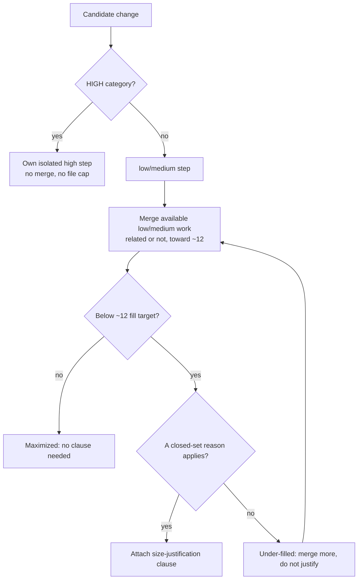

<!-- workflow-sha: d185cbaf8b26cd7c1424e3b93a25a5a365b8b909 -->
# Low/Medium Step Merging and Under-Fill Justification — Design

## Overview

The Phase A decomposer follows two sizing rules in `track-review.md`
§Step Decomposition: coherence is the only mandatory split rule ("if a step
does unrelated things, split it"), and ordinary `low`/`medium` steps are
filled toward ~12 edited files. The fill rule is a directive with no
accountability. Nothing catches a decomposer that over-splits a track into
many small steps, even though each extra step costs a cold-read re-pay.

This design adds the accountability half and removes the coherence obstacle
that blocks it. For `low`/`medium` steps coherence drops from mandatory to
preferred: the decomposer may merge several changes, related or not, into one
step to reach the ~12 target. A `low`/`medium` step that still lands below the
target must carry an inline justification on its roster line naming why it is
not maximized, drawn from a closed reason set. "Unrelated to the rest of the
track" is not on that set, because unrelated low/medium work is merged rather
than left small.

Two properties keep this safe. `high` steps are never merged: each HIGH change
stays its own isolated step, so step-level dimensional review (which fires only
on `risk: high`) still sees one whole change at a time. And the project
squash-merges every PR into one commit, so the per-step revert/bisect
granularity coherence used to protect never reaches `develop` anyway. A merged
step's risk tag is the standard criteria re-applied to its combined content,
which equals the max of the constituents' tags.

The rest of this document covers the decomposition decision model, risk
rounding on merge, the under-fill justification clause, and why high steps stay
isolated.

## Core Concepts

This design leans on four ideas, each named once here and used without
re-definition below.

**Fill target (`~12` edited files).** The soft ceiling a `low`/`medium` step is
filled toward. Unchanged in value; this design makes "landing below it" an event
that demands justification. → §"Decomposition decision model".

**Coherence boundary.** The point past which adding more work to a step would
mix unrelated concerns. Was a hard wall for every step; now a hard wall only for
`high` steps and a soft preference for `low`/`medium`. → §"Decomposition
decision model".

**High-isolation.** Each HIGH-category change occupies its own `high` step with
no file cap. Preserved verbatim; it is the property that lets coherence relax
safely. → §"Why high steps stay isolated".

**Size-justification clause.** An inline annotation on a `## Concrete Steps`
roster line, present only when a `low`/`medium` step lands below the fill target,
naming a closed-set reason it is not maximized. → §"The under-fill justification
clause".

## Decomposition decision model

**TL;DR.** For each candidate change the decomposer asks: is this a HIGH change?
If so, isolate it (no merging, no file cap). Otherwise it is `low`/`medium`: fill
toward ~12 by merging available low/medium work, related or not; if the step
still lands below ~12, attach a size-justification clause naming why.



The bottom-edge loop is the point of the change. If a low/medium step is below
the target and no closed-set reason explains it, the answer is to merge more, not
to write a justification. The clause exists for steps genuinely stuck below the
ceiling, never as a way to bless arbitrary smallness.

### Edge cases / Gotchas
- A track whose remaining work is entirely `high` leaves the last low/medium step
  under-filled with nothing mergeable. That is the first closed-set reason.
- When the only remaining low/medium unit is a single coherent change large enough
  that merging it would trip the ~14 overblown line, the step stops below the fill
  target rather than overflow. That is also the first closed-set reason (no
  mergeable work *fits*); the "merge more" loop does not apply.
- The footprint is the Phase A planned estimate, not the Phase B actual
  edited-file count. The fill directive already works against the estimate; this
  rule does too.
- Heavy-iteration work (debugging-prone, test-churny) is the one case where
  staying small is preferred over merging, since iteration count, not file count,
  is the measured context driver.

### References
- D-records: D1, D2, D5
- Invariants: S1, S3

## Risk rounding on merge

**TL;DR.** A merged step's risk tag is the standard `risk-tagging.md` criteria
applied to its combined content. In practice that is the max of the
constituents: `low+low → low`, `low+medium → medium`, `medium+medium → medium`.
No `high` ever enters a merge, so a merged step is never `high`.

Re-applying the criteria, rather than a bespoke "merged → medium" rule, keeps
`risk-tagging.md` almost unchanged. The existing ">~5 files of logic in one
module" MEDIUM trigger does the only non-obvious work: it raises a `low+low`
merge to `medium` when the combined logic footprint crosses five files, with no
merge-specific clause. The direction is always safe: a merged step is reviewed at
least as heavily as its largest constituent, never less.

### Edge cases / Gotchas
- Two trivial `low` doc/refactor changes merge to `low` and skip focal-point
  review. That is intended; they were never review-worthy alone.
- A stale tag carried forward from a constituent is the failure mode; the rule
  says re-evaluate the merged content, not inherit.

### References
- D-records: D3, D4
- Invariants: S1, S2

## The under-fill justification clause

**TL;DR.** A `low`/`medium` roster line for a step below the ~12 fill target gains
a trailing `— size: ~N files; <reason>` clause. The reason comes from a closed
set; "unrelated concerns" is not in it.

The clause is inline on the `## Concrete Steps` line, present only when triggered,
mirroring the existing `risk: <level> (override: <reason>)` parenthetical. The
closed reason set has two entries:

- **No mergeable low/medium work fits.** The rest of the track is `high` or it is
  the end of the track (nothing left to merge), or the only remaining low/medium
  unit is a single coherent change large enough that merging it would trip the
  ~14 overblown line.
- **Heavy-iteration carve-out.** Debugging-prone or test-churny work, where
  iteration count rather than file count drives context, kept small on purpose.

Two reasons are deliberately *not* on the set. "Unrelated to the rest of the
track" is absent: under the relaxed coherence rule unrelated low/medium work is
merged, so "unrelated" can never explain an under-fill, and a decomposer who
writes it has named the signal that the step should have absorbed more. "An
inter-step dependency forces sequencing" is absent too: interdependent low/medium
steps are merged into one, with the dependency becoming intra-step ordering, so a
dependency never forces a step to stay small.

Roster line, triggered form:

```markdown
3. Rename the histogram header field — risk: low (default) — size: ~3 files; remaining steps are all high-isolated, no low/medium work left to merge  [ ]
```

### Edge cases / Gotchas
- An un-triggered step (at or near ~12) carries no clause; the line stays the thin
  `description — risk: …  [ ]` form.
- The clause is written at Phase A decomposition and is immutable afterward, like
  the rest of the roster line (only the status checkbox and `commit:` annotation
  change later).

### References
- D-records: D1, D5, D6
- Invariants: S3

## Why high steps stay isolated

**TL;DR.** Step-level dimensional review fires only on `risk: high` steps.
Isolating every HIGH change is what lets coherence relax for low/medium without
weakening any review.

`code-review-protocol.md`, `review-agent-selection.md`, and `track-code-review.md`
all route step-level review to `risk: high` steps only; `low`/`medium` steps rely
on tests plus the Phase C track-level review of the cumulative diff. Because
merging is confined to low/medium, it can never fold a HIGH change into a larger
step and hide it from the review that would otherwise scrutinize it. The
cumulative-diff review at Phase C sees the same total diff regardless of how steps
are grouped, and a merged step tagged `medium` becomes a Phase C focal point: more
attention, not less.

### Edge cases / Gotchas
- If a low/medium merge candidate turns out to contain a HIGH category on closer
  reading, it is split back out into its own high step; the HIGH trigger wins over
  the merge allowance.

### References
- D-records: D2, D3
- Invariants: S1
