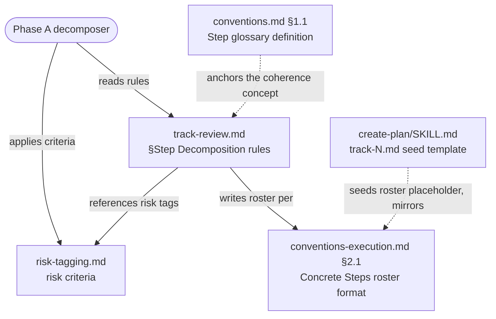

<!-- workflow-sha: d185cbaf8b26cd7c1424e3b93a25a5a365b8b909 -->
# Low/Medium Step Merging and Under-Fill Justification

## Design Document
[design.md](design.md)

## High-level plan

### Goals

Give the step-decomposition sizing rules an accountability half. Today
`track-review.md` §Step Decomposition tells the Phase A decomposer to
*fill ordinary steps toward ~12 edited files*, a directive with no forcing
function. A decomposer can over-split a track into many small steps and
pay (k-1) extra cold-read re-pays per track with nothing flagging it.

This plan does two things:

1. **Relax mandatory coherence for `low`/`medium` steps.** The decomposer
   may merge several low/medium changes, related or not, into one step to
   reach the ~12 fill target. `high` steps stay isolated, one change per
   step.
2. **Require an under-fill justification.** A `low`/`medium` step whose
   planned footprint still lands below the ~12 fill target must carry an
   inline clause on its `## Concrete Steps` roster line naming a concrete
   reason it is not maximized. "Unrelated to the rest of the track" is not
   a valid reason: unrelated low/medium work is merged, not left small.

The payoff is fewer, fuller steps per track, the cold-read saving the fill
directive already names as its own rationale.

### Constraints

- This plan is workflow-modifying: it edits .claude/workflow/** or .claude/skills/**.
- Reuse the existing `~12` fill number as the justification trigger.
  Introduce no new per-step threshold: `conventions.md §1.2` already keeps
  `~5`, `~12`, and `~20-25` distinct and warns against conflating them, and
  `~14` (the overblown-split line) is fixed in `track-review.md` §Step
  Decomposition.
- Preserve `high`-step isolation and the step-level-review routing that
  depends on it. Step-level dimensional review fires only on `risk: high`;
  isolating high is the property that makes coherence relaxation safe.
- Do not change the fill-toward-~12 rationale, the `~5` MEDIUM trigger
  value, or the `~20-25` track-level ceiling.
- All prose follows the House Style (`.claude/output-styles/house-style.md`).

### Architecture Notes

#### Component Map

- **`conventions.md §1.1` (glossary "Step").** Defines a step as "one
  coherent, logically continuous change." The coherence clause is softened:
  mandatory for `high`, a preference for `low`/`medium`.
- **`track-review.md` §Step Decomposition.** The decomposer-facing rules.
  Carries the bulk of the change: the Coherence bullet (scoped to high),
  the Fill-toward-~12 bullet (extended with the merge allowance and the
  under-fill justification), and the roster-line format example.
- **`risk-tagging.md`.** Gains a short rule for tagging a merged step:
  re-apply the standard criteria to the combined content (= max of the
  constituents). No new bespoke trigger.
- **`conventions-execution.md §2.1`.** Canonical `## Concrete Steps` roster
  format and its lifecycle row. Gains the optional inline `size:` clause,
  present only when an under-filled low/medium step triggers it.
- **`.claude/skills/create-plan/SKILL.md`.** The `track-N.md` seed template,
  copied into every new track file at Phase 1. Its `## Concrete Steps`
  placeholder comment already enumerates the optional `commit:` annotation, so
  it gains a mention of the optional `size:` clause to stay consistent with the
  canonical roster format in `conventions-execution.md §2.1`.

#### D1: Reuse `~12` as the justification trigger, not a new threshold
- **Alternatives considered**: a separate `< 10 files` trigger (the opening
  proposal); tie the trigger to the existing `~12` fill target (chosen).
- **Rationale**: the workflow already maintains several distinct per-step /
  per-track numbers and warns against conflating them — `conventions.md §1.2`
  keeps `~5`, `~12`, and `~20-25` distinct, and `~14` is the overblown-split
  line in `track-review.md`. Reusing `~12` keeps "fill toward the ceiling"
  and "justify if you land below it" as two halves of one number; a fifth
  number adds confusion for no gain.
- **Risks/Caveats**: a step at 11 files is technically "below ~12." The `~`
  approximate convention absorbs it; the rule reads "below the fill target,"
  not a hard cutoff.
- **Implemented in**: Track 1

#### D2: Relax mandatory coherence for `low`/`medium`; allow merging
- **Alternatives considered**: keep coherence mandatory and treat a
  coherence-bounded small step as already maximized (yields more, smaller
  steps); relax coherence for low/medium so unrelated changes may merge
  toward ~12 (chosen).
- **Rationale**: 1 PR = 1 squashed commit, so per-step commits never reach
  `develop`. The revert/bisect granularity coherence protects is the whole
  PR regardless. Implementer capability is not the constraint. Fewer, fuller
  steps remove (k-1) cold-read re-pays per track, the fill directive's own
  stated rationale.
- **Risks/Caveats**: muddier per-step episodes; lost intra-track parallelism
  for merged steps; multi-concern `medium` commits that exist only inside
  the branch. All bounded; none survives merge.
- **Implemented in**: Track 1

#### D3: `high` steps are never merged; each stays isolated
- **Alternatives considered**: allow merging high changes too (rejected).
- **Rationale**: step-level dimensional review fires only on `risk: high`
  (`code-review-protocol.md`, `review-agent-selection.md`,
  `track-code-review.md`). Isolating every high change keeps that review
  seeing one whole change at a time. This is the load-bearing safety
  property that makes D2 safe: merging low/medium hides nothing a reviewer
  would otherwise see.
- **Risks/Caveats**: none beyond the existing high-isolation rule, which
  this preserves verbatim.
- **Implemented in**: Track 1

#### D4: Merged-step risk tag = standard criteria re-applied to combined content
- **Alternatives considered**: always tag a merged step `medium` (rejected:
  over-reviews trivial low+low merges); a bespoke "merged → medium" trigger
  (rejected: redundant); re-apply the existing criteria to the merged
  content (chosen).
- **Rationale**: re-applying the criteria yields the max of the
  constituents' tags in the common case (`low+low → low`,
  `low+medium → medium`), and the existing ">~5 files of logic in one
  module" MEDIUM trigger raises a `low+low` logic merge to medium with no
  new rule. Minimal change to `risk-tagging.md`.
- **Risks/Caveats**: a decomposer must re-evaluate, not carry a stale tag
  forward. The rule states this explicitly.
- **Implemented in**: Track 1

#### D5: Inline, triggered-only justification clause with a closed reason set
- **Alternatives considered**: a separate per-step note in `## Plan of Work`
  (rejected: separates the justification from the step it explains); an
  always-present clause (rejected: bloats the thin roster); an inline clause
  present only when triggered (chosen).
- **Rationale**: matches the thin-roster contract (D9) and the existing
  `risk: <level> (override: <reason>)` parenthetical precedent. Valid reasons
  are a closed set of two: no mergeable low/medium work fits (rest of the track
  is `high`, end of track, or the only remaining unit would overflow the ~14
  line); heavy-iteration carve-out. "Unrelated" and "inter-step dependency" are
  excluded by construction, since unrelated and interdependent low/medium work
  is merged, not left small.
- **Risks/Caveats**: the reason set is a judgement the decomposer asserts; a
  false claim is visible on the roster line but not machine-checked (D6).
- **Implemented in**: Track 1

#### D6: Directive-only; no Phase C verification gate
- **Alternatives considered**: add a `track-code-review.md` check that flags
  a sub-threshold step missing its clause (rejected for this plan).
- **Rationale**: keeps the blast radius to five files (no `track-code-review.md`
  edit). The decomposer self-applies the rule at Phase A, where the roster is
  written.
- **Risks/Caveats**: no automated verification; a decomposer could omit the
  clause. Accepted; revisit if under-filling persists in practice. Two
  reader-side roster-format descriptions outside the edit set
  (`step-implementation.md`, `track-code-review.md`) keep enumerating only
  the `commit:` annotation. Both serve roster→episode joining, which the
  optional `size:` clause does not affect, so they stay as-is by design; the
  canonical optional-annotation set lives in `conventions-execution.md §2.1`.
  The five-file blast radius therefore holds for behavioral routing and the
  canonical format.
- **Implemented in**: Track 1

#### Invariants
- **S1**: every HIGH-category change occupies its own `high` step; no merged
  step contains a HIGH category. Verified by the Phase 2 consistency review
  reading the decomposition rules as one story.
- **S2**: a merged `low`/`medium` step's risk tag equals the standard
  criteria applied to its combined content, never below the max of its
  constituents' tags.
- **S3**: the glossary "Step" definition, the Coherence rule, the Fill/merge
  rule, the roster format, and the create-plan seed-template placeholder tell
  one non-contradicting story across the five edited files.

#### Non-Goals
- No change to `high`-step isolation or step-level-review routing.
- No new Phase C (track-code-review) verification gate.
- No change to the `~5` MEDIUM trigger value or the `~20-25` track-level
  ceiling.
- No change to how the actual edited-file count is measured at Phase B; the
  rule operates on the Phase A planned footprint, as the fill directive
  already does.

## Checklist
- [ ] Track 1: Relax low/medium coherence and add the under-fill justification
  > Edits five files so the Phase A decomposer may merge low/medium
  > steps (related or not) toward the ~12 fill target, keeps high steps
  > isolated, tags a merged step by re-applying the risk criteria, and
  > requires an inline size-justification clause on any low/medium roster
  > line still below the fill target. Detailed description in plan/track-1.md.
  > **Scope:** ~5 files covering the Step glossary definition, the §Step
  > Decomposition rules, the merged-step risk-tag rule, the Concrete Steps
  > roster format, and the create-plan seed-template placeholder.

## Plan Review
- [x] Plan review (consistency + structural) — passed at iteration 1

**Auto-fixed (mechanical)**: none. The consistency review returned zero
findings: every reference to the five edited workflow files verified MATCHES
against the live tree, the high-isolation routing invariant (S1) confirmed
ENFORCED, no gaps. The structural review surfaced two optional
`suggestion`-severity items, both within budget and marked "no action
required" — S1 (the `create-plan/SKILL.md` component-intent bullet sits at the
~5-line cap, not over) and S2 (the one-sentence what/how summary repeats across
the plan intro and the track file's Purpose/Context). Both declined: S1's
trailing clause carries real rationale, and S2's second Purpose paragraph is
the create-plan seed text reserved for the Move-2 triad replacement.

**Escalated (design decisions)**: none.

## Final Artifacts
- [ ] Phase 4: Final artifacts (`design-final.md`, `adr.md`)
