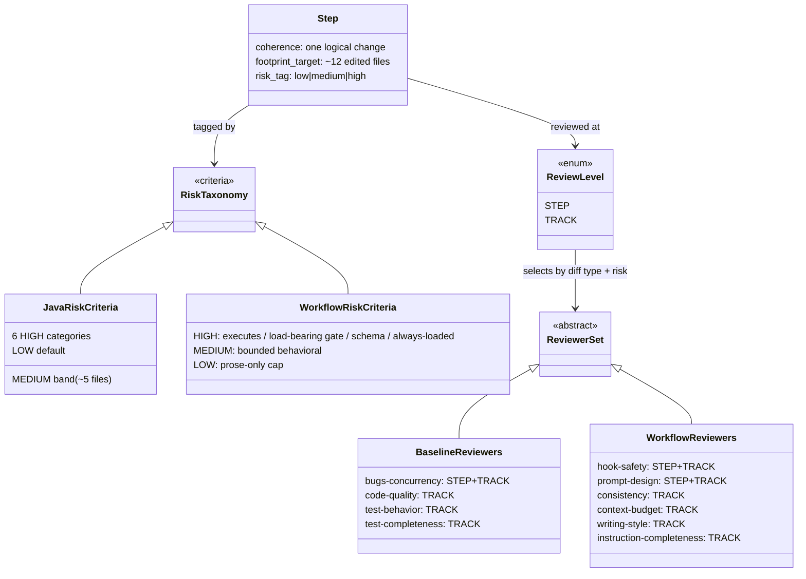
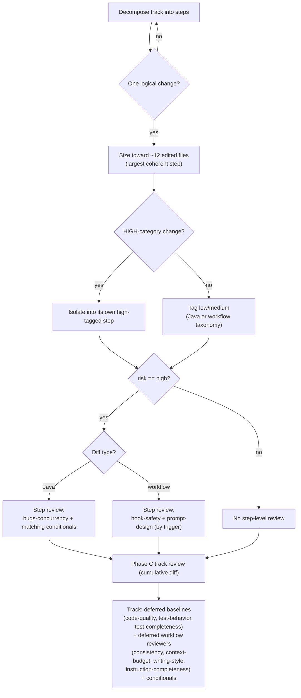

<!-- workflow-sha: 786f441e224ba6c8c4240dde5d9368866fb9b405 -->
# Step Sizing and Reviewer Routing — Design

## Overview

The workflow today sizes every step by a `~3 edited file` cap (`track-review.md`) plus a risk tag, then spawns a fresh implementer per step that re-pays a ~23K-token cold read. The cap never bound: 33% of realized steps already exceed it cleanly, including 19- and 22-file refactors. It buys no measured quality either. Across 236 implementer transcripts, peak context tracks iteration count (Pearson r 0.81), not edited files (r 0.37), and no implementer touching ≤13 edited files ever reached the 400K warning band.

This design replaces the risk-driven file cap with three sizing rules: coherence (one logical change per step), high-risk isolation (each HIGH change in its own `high`-tagged step), and a fill-toward-~12-edited-files directive for ordinary steps. It also splits review-agent dispatch into step-level versus track-level for the first time. Of the four baseline (Java) reviewers, only `review-bugs-concurrency` runs at a high step; the other three defer to the cumulative Phase C track review. The six workflow-machinery reviewers gain the same split: `review-workflow-hook-safety` and `review-workflow-prompt-design` run at a high step, the other four defer.

The split needs a precondition the workflow lacks: criteria for risk-tagging a workflow-machinery edit. `risk-tagging.md` classifies only Java/storage changes, so a `.claude/**` edit has no HIGH category and the workflow-reviewer triage would have no trigger. This design adds a workflow-machinery risk taxonomy keyed to blast radius across sessions and whether the artifact executes or drives control flow.

Two existing guardrails carry the safety the file cap nominally provided: the session-end context gate (the orchestrator backstop, which fires less often with fewer, larger steps) and the mid-implementation `RISK_UPGRADE_REQUESTED` valve (re-enables step-level review when a grouped step turns out more invasive than tagged).

The rest of this document is structured as: Core Concepts → Class Design → Workflow → the three rule changes (sizing, the two file-count numbers, the workflow risk taxonomy) → reviewer routing → the `review-bugs-concurrency` three-path rule → the consistency and self-application constraints.

## Core Concepts

This design introduces eight load-bearing ideas. Each is named here with its delta from today's behavior and a pointer to the section that elaborates it.

**Footprint cap.** The per-step edited-file ceiling, raised from ~3 to ~12 soft / ~14+ flagged overblown, applied to all tiers. Replaces the unmeasured ~3 cap that never bound. → §"Step sizing: coherence, isolation, and fill-toward-cap".

**Fill-toward-cap directive.** Decompose an ordinary (`low`/`medium`) step to be the largest coherent change within ~12 edited files, not the smallest. Replaces the default slicing habit; each avoided spawn removes one ~23K-token cold-read re-pay. → §"Step sizing: coherence, isolation, and fill-toward-cap".

**High-risk isolation.** Every HIGH-category change goes in its own `high`-tagged step, sized by the change, with no file cap. Replaces "cap high steps small," which the old rule never said but the ~3 cap implied. → §"Step sizing: coherence, isolation, and fill-toward-cap".

**Footprint cap vs risk classification.** Two distinct file-count numbers: ~12 (footprint split, edited files, all tiers) and ~5 (the MEDIUM risk-classification threshold). After the cap rises they read in the correct order — medium at 5, split at 12. Replaces a prior inversion where the ~3 cap split a step before it could be classified medium-by-file-count. → §"The two file-count numbers".

**Step-vs-track reviewer routing.** The first distinction between which reviewers fire at a high step versus the cumulative Phase C track review. A reviewer runs at the step only if its findings are localized to that step's diff and get buried if deferred; it defers to track if its findings read identically on the cumulative diff. Replaces "the same selection runs at both levels." → §"Step-vs-track reviewer routing".

**Workflow-machinery risk taxonomy.** HIGH/MEDIUM/LOW criteria for `.claude/**` edits, keyed to blast radius across sessions and whether the artifact executes or drives control flow. Replaces the absence of any workflow risk criteria; it is the precondition that gives the workflow-reviewer triage its trigger. → §"Workflow-machinery risk taxonomy".

**Prose-only cap.** A workflow step editing only prose (no hook/script/settings, no gate/dispatch/schema change) is at most `low`, the workflow analog of the existing tests-only cap. Keeps ordinary workflow `.md` rewording out of the step-level review path. → §"Workflow-machinery risk taxonomy".

**review-bugs-concurrency exclusion from workflow.** The Java bug/logic reviewer never reviews workflow-machinery files — already true behaviorally (scope-filtering on mixed diffs plus the workflow-only baseline skip), made an explicit triage rule so the two review paths read as deliberately disjoint. → §"review-bugs-concurrency across the three review paths".

## Class Design

**TL;DR.** This is a rules change, so the "classes" are the workflow concepts the rules govern. A step carries a coherence constraint, a footprint target, and a risk tag. The tag is computed by one of two taxonomies — Java or workflow-machinery. The tag plus the diff type select a reviewer set at each of two review levels.

The two `RiskTaxonomy` subclasses are the load-bearing addition — `WorkflowRiskCriteria` did not exist before this change. A `Step` reaches `ReviewLevel.STEP` only when it is tagged `high`; `low`/`medium` steps go straight to the track review. The `ReviewerSet` partition is the routing change: `BaselineReviewers` apply to Java diffs and `WorkflowReviewers` to workflow-machinery diffs, and each set names which members fire at `STEP` versus only at `TRACK`. A reviewer marked `STEP+TRACK` runs at a high step and again on the cumulative track diff; a `TRACK`-only reviewer runs once, at Phase C. `review-bugs-concurrency` is the sole baseline that is `STEP+TRACK`; the workflow set's two `STEP+TRACK` members are the localized-defect reviewers.

### Edge cases / Gotchas

- The diagram shows the *intended* membership. On a workflow-only diff the existing baseline-skip override removes the entire baseline group, so `BaselineReviewers` never reach the step at all — see §"Constraints: mirror, staging, and self-application".

### References

- D1: raise the per-step footprint cap to ~12 with a fill-toward-cap directive
- D4: baseline triage, `review-bugs-concurrency` at the step, the other three at track
- D5: workflow-reviewer triage, `hook-safety` and `prompt-design` at the step
- D6: add the workflow-machinery risk taxonomy
- Invariants: none new
- Mechanics: none (the design fits in this file)

## Workflow

**TL;DR.** Decomposition sizes a step toward ~12 files under the coherence and isolation rules, tags it, and fires a step-level review only when the tag is `high`; that review's membership depends on diff type. All tiers reach the cumulative Phase C track review, which runs the deferred reviewers.

The two diff-type branches (H) are where this design departs from today's single shared selection. A Java high step draws `review-bugs-concurrency` plus any conditional reviewers whose triggers match its files; a workflow high step draws `review-workflow-hook-safety` and `review-workflow-prompt-design` when their file-pattern triggers match. The `low`/`medium` path (K) skips step review entirely and is covered only at Phase C, unchanged from today. Phase C (M) always runs against the cumulative track diff, so the deferred reviewers lose no coverage by not firing per step.

### Edge cases / Gotchas

- A workflow high step editing only `.claude/workflow/*.md` matches neither step-level workflow trigger (`prompt-design` wants SKILL/agents/prompts; `hook-safety` wants scripts/settings), so it draws zero step-level reviewers and is fully deferred to Phase C. This is intended: those files' defects are the cumulative class.
- `RISK_UPGRADE_REQUESTED` mid-implementation re-enters this flow at G with `risk == high`, restoring the step-level review a grouped step would otherwise have skipped.

### References

- D4: baseline triage, `review-bugs-concurrency` at the step, the other three at track
- D5: workflow-reviewer triage, `hook-safety` and `prompt-design` at the step
- D7: `review-bugs-concurrency` mandatory in three paths, excluded from workflow
- Invariants: none new
- Mechanics: none

## Step sizing: coherence, isolation, and fill-toward-cap

**TL;DR.** Replace the `~3 edited file` cap with three rules: split a step that does unrelated things (coherence, all tiers); isolate each HIGH change into its own `high`-tagged step sized by the change; fill ordinary steps toward ~12 edited files and flag ~14+ as overblown. The fill rule is a directive, not a permission — collapsing k small steps into one removes (k-1) cold-read re-pays.

The cap lives at `track-review.md` § Step Decomposition (the line "If a step touches more than ~3 files or does unrelated things, split it"). It is rewritten as the three rules. The trivial-merge floor ("If a step feels trivial, merge it into a neighbor") stays. The change also rewords the `conventions.md` §1.1 Glossary "Step" definition: "atomic" today reads as "smallest indivisible," which fights the fill directive at the most authoritative definition site (the glossary is annotated `roles=any phases=any`). It is reworded so "atomic" means one *coherent, logically continuous* change committed together, explicitly not a minimal file count, with a pointer to the footprint guidance.

The evidence is three measured facts. First, the cap never bound: 33% of realized steps already exceed ~3 edited files cleanly, and the ~3 number entered verbatim in the first workflow commit and was never calibrated. Second, the small cap buys no quality: over-cap steps show a *lower* recorded-defect rate (5.9%) than within-cap steps (15.8%); bugs cluster in small, logic-dense steps, not large mechanical ones. Third, footprint is not the context risk; iteration is. Peak implementer context correlates with turn count at Pearson r 0.81 versus 0.37 for edited files, and the measured ceiling for ≤13 edited files sat at 245K against the 400K warning band, far enough below to license a directive rather than a cautious permission.

### Edge cases / Gotchas

- One carve-out to the fill directive: defer to splitting when the work is likely to need heavy per-step iteration (debugging-prone or test-churny), since iteration count, not footprint, is the measured context driver.
- Coarser bisect granularity and larger review diffs are real costs the design accepts; they are not a gate weakening, because Phase C reviews the cumulative diff regardless of slicing.
- An ordinary step is still bounded by the 85% line / 70% branch coverage gate on its larger diff — the fill rule does not relax coverage.

### References

- D1: raise the per-step footprint cap to ~12 with a fill-toward-cap directive
- D2: reword the glossary "Step" so "atomic" means coherent, not minimal files
- Invariants: none new
- Mechanics: none

## The two file-count numbers

**TL;DR.** After the footprint cap rises to ~12, the medium-classification threshold (~5) and the split cap (~12) coexist and must read as complementary, not rival: crossing ~5 raises a logic step to `medium` (more Phase C focal-point attention), while ~12 is where any step splits. `risk-tagging.md`'s MEDIUM trigger keeps ~5; only a clarifying clause is added.

The MEDIUM trigger "Logic changes touching more than ~5 files within one module" stays at ~5. A clause is added tying it to the ~12 split cap so the two numbers read in the correct order: crossing ~5 files raises the step to `medium` (still no step-level dimensional review, just more focal-point attention at Phase C), while ~12 is where the step splits. The old ~3 cap sat *below* the ~5 trigger, an inversion: a step would split before it could ever be classified medium-by-file-count. At ~12 the ordering is restored.

Bumping ~5 toward ~12 is rejected. It would drop 6–11-file logic changes to `low` and lose the medium focal-point signal Phase C relies on. The number stays ~5; only the wording is clarified to name the distinct role each threshold plays.

### Edge cases / Gotchas

- The two numbers measure the same thing (edited files) for two different decisions (classification vs splitting), which is why they must be stated together at the MEDIUM trigger site or a future reader reads them as competing caps.

### References

- D3: keep ~5 as the medium threshold, distinct from the ~12 split cap
- Invariants: none new
- Mechanics: none

## Workflow-machinery risk taxonomy

**TL;DR.** `risk-tagging.md` has no criteria for workflow-machinery edits — every category is Java/storage-shaped. Add HIGH/MEDIUM/LOW workflow triggers keyed to blast radius across sessions and whether the artifact executes or drives control flow, plus a prose-only LOW cap. This is the precondition that gives the workflow-reviewer triage a defined trigger.

The organizing axis mirrors the Java categories' "blast radius × reversibility × hard-to-catch," recast for machinery: does the artifact execute or drive control flow, and how many sessions does a defect reach before a human notices?

- **HIGH** — a hook/script/`settings*.json` that runs automatically (broken → wedges every session); a load-bearing gate or protocol (auto-resume State machine, drift/divergence gate, review-iteration protocol, §1.7 staging, §1.6 stamp scheme); the shared schema every file keys off (§1.8 role/phase enums, TOC format, glossary closed terms); the always-loaded context surface (root `CLAUDE.md`).
- **MEDIUM** — behavioral but bounded: one phase prompt's or skill's decision/dispatch logic; a single review-agent spec; adding/removing/renaming a section other files cross-reference; multi-file prose that changes agent-observable behavior.
- **LOW** — prose/clarity with no behavioral change: house-style reword, typo, TOC reindex, glossary gloss, non-load-bearing example, single-file prose touching no gate/dispatch/schema.

The taxonomy is added as a `### Workflow machinery` subsection under `## HIGH-risk triggers`, with workflow lines under MEDIUM and LOW, plus the prose-only cap as an analog of the existing tests-only cap. `risk-tagging.md` is not in the `§Maintenance` mirror set, so the addition carries no sync-stamp constraint. The `track-review.md` § Risk tagging summary, which enumerates the categories, gains a workflow mention so it does not drift — the change `review-workflow-consistency` is built to catch.

### Edge cases / Gotchas

- Root `CLAUDE.md` is a HIGH trigger because always-loaded content has every-session blast radius; MEDIUM was weighed and rejected during design review.
- The prose-only cap is the lever that keeps ordinary workflow `.md` rewording from drawing a step-level review, matching the decision to defer `instruction-completeness` to the track level.
- The existing "when in doubt, high" decomposer override applies unchanged; no workflow-specific override is added.

### References

- D6: add the workflow-machinery risk taxonomy
- Invariants: none new
- Mechanics: none

## Step-vs-track reviewer routing

**TL;DR.** For the first time, which agents fire at a high step differs from which review the cumulative track diff. An agent runs at a high step only if its findings are localized to that step's diff and buried if deferred; it defers to the cumulative Phase C track pass if its findings read identically on the cumulative diff. Of four baselines, only `review-bugs-concurrency` stays at the step; of six workflow reviewers, only `hook-safety` and `prompt-design` stay at the step.

Today `review-agent-selection.md` runs the same selection at both levels. This change adds the distinction. For the baseline (Java) reviewers: `review-bugs-concurrency` (general bug / logic-error / resource-leak / null-safety) catches defects best before they are buried in a cumulative diff, so it stays at the step; `review-code-quality`, `review-test-behavior`, and `review-test-completeness` read the same on the cumulative diff (style and whole-suite test quality), so they defer to Phase C.

For the workflow reviewers, the same test partitions the six:

| Reviewer | Localized to one step's diff? | Level |
|---|---|---|
| `review-workflow-hook-safety` | yes — script correctness, `/tmp` collisions, JSON validity | STEP |
| `review-workflow-prompt-design` | yes — this prompt's decision rules, frontmatter, `$ARGUMENTS` | STEP |
| `review-workflow-consistency` | no — cross-file; one step lands one side of a pair | TRACK |
| `review-workflow-context-budget` | no — whole-system always-loaded surface | TRACK |
| `review-workflow-writing-style` | no — diff-agnostic, identical per file | TRACK |
| `review-workflow-instruction-completeness` | mixed — procedural-logic but gates span steps | TRACK |

`instruction-completeness` is the one judgment call: it has the localized flavor of a logic reviewer but its "every gate has a resume path" checks span files, so a step lands false positives that a later step resolves. It defers to track. Its trigger is also the only one matching bare `.claude/workflow/*.md`, so deferring it means a high step editing only those files draws no step-level reviewer — consistent with the prose-only cap.

The split's timing cannot live in the `§Maintenance`-mirrored sections (`§Workflow-review agents`, `§Per-agent file-pattern triggers`, `§Workflow-machinery override`), which mirror `SKILL.md` verbatim and `SKILL.md` has no step/track notion. It goes in a new, non-mirrored note in `review-agent-selection.md` plus the dispatch points in `step-implementation.md` (step) and `track-code-review.md` (track).

### Edge cases / Gotchas

- "Unconditionally" for `review-bugs-concurrency` at the step is subordinate to the existing workflow-only/docs-only baseline-skip override: on those diffs the whole baseline group, `review-bugs-concurrency` included, is still skipped.
- The split changes only *which mandatory baselines* run at the step. Conditional reviewers keep firing by their existing characteristic triggers, unchanged; no agent is forced on and no trigger is widened.

### References

- D4: baseline triage, `review-bugs-concurrency` at the step, the other three at track
- D5: workflow-reviewer triage, `hook-safety` and `prompt-design` at the step
- Invariants: none new
- Mechanics: none

## review-bugs-concurrency across the three review paths

**TL;DR.** `review-bugs-concurrency` becomes mandatory everywhere it can run: the standalone `/code-review` skill, the Phase C track pass, and every high Java step. It is explicitly excluded from workflow-machinery changes. Promoting it in `SKILL.md` closes an existing cross-path discrepancy where it is baseline in the workflow path but conditional in the standalone skill.

Today `SKILL.md` Step 5b lists `review-bugs-concurrency` as conditional (fires on `concurrency`, `storage-engine`, and similar categories), while `review-agent-selection.md` treats it as a baseline. The change promotes it in `SKILL.md` to "Always launched (unless `docs-only` or `build-config` is the only category)," matching the two test-review baselines' exclusion shape and its baseline status in the workflow path. The Step 5d tests-only special mention becomes redundant but stays harmless.

The exclusion from workflow changes is already the behavior: workflow-only diffs skip the baseline group, and mixed diffs scope-filter `review-bugs-concurrency` to Java files via `IN_SCOPE_FILES`. The change states it as a triage rule so the Java and workflow review paths read as deliberately disjoint — `review-bugs-concurrency` owns Java code defects, the workflow reviewers own workflow machinery, and neither bleeds into the other.

The `SKILL.md` code-review baseline/conditional tables are not in the `§Maintenance` mirror set (that stamp covers only the workflow-review sections), so the promotion needs no sync-stamp bump. The step-vs-track timing lives only in the workflow files; `SKILL.md` carries no step/track notion.

### Edge cases / Gotchas

- The promotion is a cross-file agreement (`SKILL.md` baseline status ↔ `review-agent-selection.md`), exactly what the Phase C `§1.7(h)` consistency review should confirm.

### References

- D7: `review-bugs-concurrency` mandatory in three paths, excluded from workflow
- Invariants: none new
- Mechanics: none

## Constraints: mirror, staging, and self-application

**TL;DR.** Three rules govern implementation: keep the step-vs-track timing out of the `§Maintenance`-mirrored sections; route every edit through §1.7 staging, since all targets are workflow machinery; and accept that this branch's workflow-only diffs cannot fully exercise the baseline routing it introduces.

Every edit target is workflow machinery, so the plan declares itself workflow-modifying with the canonical §1.7(b) marker, each `.claude/...` edit stages under `docs/adr/<dir>/_workflow/staged-workflow/`, the live tree stays at develop's state, and the staged-vs-live delta gets the Phase C §1.7(h) review. Phase C reviewers scope to the live-vs-staged delta (the D5 delta-scoping convention), not the whole-file staged copy, which is what keeps the cumulative review diff within budget despite each touched file appearing as a whole-file add.

Self-application has a limit worth stating plainly. The issue's "dogfood it" framing claims any high step on this branch runs `review-bugs-concurrency` at the step. It cannot: this branch's diffs are workflow-only, so the baseline-skip override removes the whole baseline group at the step, `review-bugs-concurrency` included, and the workflow-review group runs instead. What this branch *does* exercise is the step sizing rules, the workflow risk taxonomy, the workflow-reviewer triage, and the §1.7(h) staged-vs-live review. The baseline-routing companion change reviews its own diff at Phase C, not at a step.

### Edge cases / Gotchas

- `risk-tagging.md` is touched by both planned tracks (sizing & risk taxonomy; review routing) in disjoint sections; under §1.7 staging the staged copy accumulates both tracks' edits, and each track's Phase C review delta-scopes to its own sections.
- The workflow-reviewer triage (review routing) depends on the workflow risk taxonomy (sizing & risk taxonomy track) for its trigger, so the routing track follows the taxonomy track.

### References

- D1: raise the per-step footprint cap to ~12 with a fill-toward-cap directive
- D4: baseline triage, `review-bugs-concurrency` at the step, the other three at track
- D5: workflow-reviewer triage, `hook-safety` and `prompt-design` at the step
- D6: add the workflow-machinery risk taxonomy
- D7: `review-bugs-concurrency` mandatory in three paths, excluded from workflow
- Invariants: none new
- Mechanics: none
