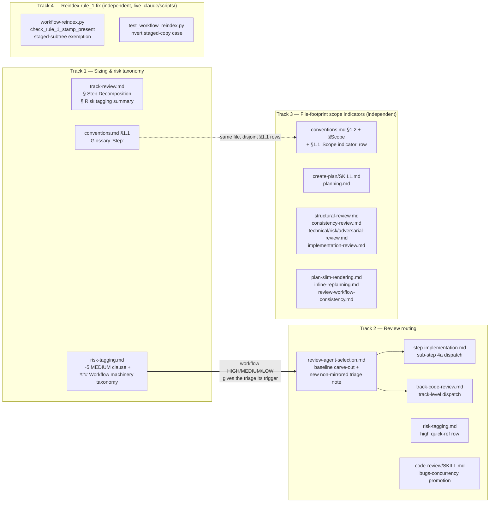

<!-- workflow-sha: 786f441e224ba6c8c4240dde5d9368866fb9b405 -->
# Step Sizing and Reviewer Routing

## Design Document
[design.md](design.md)

## High-level plan

### Goals

Replace the per-step `~3 edited file` cap with sizing rules that measure what actually drives implementer context, and route review effort to where defects surface.

- Drop the unmeasured `~3`-file cap (it never bound — 33% of realized steps already exceed it cleanly, and it buys no quality) and size steps by three rules instead: one coherent change per step (all tiers), each HIGH change isolated in its own `high`-tagged step, and a fill-toward-~12-edited-files directive for ordinary steps. Each collapsed spawn removes one ~23K-token cold-read re-pay.
- Split review-agent dispatch into step-level vs track-level for the first time. Only reviewers whose findings are localized to one step's diff (and buried if deferred) fire at a high step; the rest defer to the cumulative Phase C track review, losing no coverage.
- Add a workflow-machinery risk taxonomy (absent today — `risk-tagging.md` classifies only Java/storage edits), keyed to cross-session blast radius and whether the artifact executes or drives control flow. This is the precondition that gives the workflow-reviewer triage a defined trigger.
- Promote `review-bugs-concurrency` to a mandatory baseline across all three review paths and state its exclusion from workflow-machinery edits, so the Java and workflow review paths read as deliberately disjoint.

### Constraints

This plan is workflow-modifying: it edits .claude/workflow/** or .claude/skills/**.

- **Staging.** Every edit target is workflow machinery, so each `.claude/...` edit stages under `docs/adr/step-size-recap/_workflow/staged-workflow/` per `conventions.md §1.7`; the live tree stays at develop's state for the branch lifetime, and the staged-vs-live delta gets the Phase C `§1.7(h)` review. Phase C reviewers delta-scope to the live-vs-staged diff (the D5 delta-scoping convention), not the whole-file staged copy.
- **Mirror-set wiring.** The step-vs-track timing must not live in the `§Maintenance`-mirrored sections of `review-agent-selection.md` (`§Workflow-review agents`, `§Workflow-machinery file set`, `§Per-agent file-pattern triggers`, `§Workflow-machinery override`), which mirror `code-review/SKILL.md` verbatim and `SKILL.md` carries no step/track notion. It goes in a new, non-mirrored note. See design.md §"Constraints: mirror, staging, and self-application".
- **Cross-track file (`risk-tagging.md`).** `risk-tagging.md` is touched by Track 1 and Track 2 in disjoint sections (Track 1: HIGH/MEDIUM/LOW criteria + the `~5`-file MEDIUM clause; Track 2: the `high` quick-ref row). The staged copy accumulates both tracks' edits; each track's Phase C review delta-scopes to its own sections.
- **Cross-track file (`conventions.md`).** `conventions.md` is touched by Track 1 (§1.1 Glossary "Step" row) and Track 3 (§1.2, §Scope indicators, and the §1.1 "Scope indicator" row) in disjoint sections. The staged copy accumulates both tracks' edits; each track's Phase C review delta-scopes to its own sections.
- **Self-application limit.** This branch's diffs are workflow-only, so the baseline-skip override removes the whole baseline group at every step, `review-bugs-concurrency` included. The branch exercises the step sizing rules, the workflow risk taxonomy, the workflow-reviewer triage, the scope-indicator file-footprint rewrite, and the `§1.7(h)` staged-vs-live review; it does not exercise `review-bugs-concurrency`-at-a-Java-step. The baseline-routing change reviews its own diff at Phase C, not at a step.

### Architecture Notes

#### Component Map

The change spans workflow-machinery files across four tracks. `conventions.md` and `risk-tagging.md` each appear in two tracks (disjoint sections). The load-bearing edge: the new workflow risk taxonomy (Track 1) is the trigger the workflow-reviewer triage (Track 2) keys off, which is why Track 2 depends on Track 1. Track 3 (the scope-indicator file-footprint rewrite, D8) is independent — it shares `conventions.md` with Track 1 across disjoint §1.1 rows and depends on neither track. Track 4 (the `workflow-reindex.py` rule_1 fix, D9) is also independent and shares no file with the others: it edits live `.claude/scripts/` files, outside §1.7 staging.

- **`track-review.md`** (Track 1) — rewrite the `~3`-file cap line in § Step Decomposition as the three sizing rules (coherence, high-risk isolation, fill-toward-~12); keep the trivial-merge floor. Add a workflow mention to the § Risk tagging summary so its category enumeration doesn't drift. (D1)
- **`conventions.md §1.1`** (Track 1) — reword the "Step" glossary row so "atomic" reads as one coherent, logically continuous change committed together, explicitly not a minimal file count, with a pointer to the footprint guidance. (D2)
- **`risk-tagging.md` taxonomy** (Track 1) — add a clause tying the `~5`-file MEDIUM trigger to the `~12` split cap; add a `### Workflow machinery` subsection under `## HIGH-risk triggers` with MEDIUM/LOW lines and a prose-only cap (the workflow analog of the tests-only cap). (D3, D6)
- **`review-agent-selection.md`** (Track 2) — baseline step-vs-track carve-out at the `## Baseline agents` intro; a NEW non-mirrored note carrying the workflow-reviewer triage and the bugs-concurrency-excluded-from-workflow rule. Stays out of the `§Maintenance`-mirrored sections. (D4, D5, D7)
- **`step-implementation.md`** (Track 2) — sub-step 4a dispatch: route the step-level baseline (Java) and the step-level workflow reviewers on `high` steps. (D4, D5)
- **`track-code-review.md`** (Track 2) — track-level dispatch for the deferred baselines and the deferred workflow reviewers at Phase C. (D4, D5)
- **`risk-tagging.md` quick-ref** (Track 2) — the `high` quick-ref row's step-level cell reflects the step-vs-track split. (D5)
- **`code-review/SKILL.md`** (Track 2) — promote `review-bugs-concurrency` to "Always launched (unless `docs-only` or `build-config` is the ONLY category)". (D7)
- **`conventions.md §Scope indicators`** (Track 3) — rewrite §Scope indicators (required), the §1.1 Glossary "Scope indicator" row, and the §1.2 Checklist examples from `~N steps covering X, Y, Z` to `~N files covering X, Y, Z`. Shares the file with Track 1 across disjoint §1.1 rows. (D8)
- **`create-plan/SKILL.md`, `planning.md`** (Track 3) — the writers: update the scope-indicator format the planner emits. (D8)
- **`structural-review.md`, `consistency-review.md`** (Track 3) — the checkers: rekey the sizing check from "claims ~2 steps but describes 8 changes" to footprint-vs-track-size, staying plan-file-only. (D8)
- **`technical-review.md`, `risk-review.md`, `adversarial-review.md`, `implementation-review.md`** (Track 3) — the Phase A review-prompt glossaries and the remaining scope-indicator mentions, updated to the file-footprint format. (D8)
- **`plan-slim-rendering.md`, `inline-replanning.md`, `review-workflow-consistency.md`** (Track 3) — the renderers and the glossary-term reference, updated to the new format. (D8)
- **`workflow-reindex.py`, `test_workflow_reindex.py`** (Track 4) — exempt the staged-workflow subtree from rule_1 via the existing `_STAGED_SUBTREE_PREFIX_RE`, sync the stale rule_1 docstring, and invert the regression test. A live `.claude/scripts/` edit outside §1.7 staging; independent of Tracks 1-3. (D9)

#### D1: Raise the per-step footprint cap to ~12 with a fill-toward-cap directive
- **Alternatives considered**: keep the `~3` cap; per-tier file caps; a staged `~8` intermediate cap.
- **Rationale**: the `~3` cap never bound (33% of steps exceed it cleanly) and buys no quality (over-cap steps show a *lower* recorded-defect rate). Peak implementer context tracks iteration count (Pearson r 0.81), not edited files (r 0.37); the measured ceiling for ≤13 edited files sat at 245K against the 400K warning band. Fill-toward-~12 is a directive (collapse k small steps, remove k-1 cold-read re-pays), not a permission; `~14+` is flagged overblown.
- **Risks/Caveats**: coarser bisect granularity and larger review diffs (accepted — Phase C reviews the cumulative diff regardless of slicing). Carve-out: defer to splitting when work is iteration-heavy (debugging-prone or test-churny). Coverage gate is unchanged.
- **Implemented in**: Track 1
- **Full design**: design.md §"Step sizing: coherence, isolation, and fill-toward-cap"

#### D2: Reword the glossary "Step" so "atomic" means coherent, not minimal files
- **Alternatives considered**: leave the glossary "Step" row as-is and rely only on the `track-review.md` rule rewrite.
- **Rationale**: "atomic" today reads as "smallest indivisible," which fights the fill directive at the most authoritative definition site (the glossary is annotated `roles=any phases=any`). Reword so "atomic" means one coherent, logically continuous change committed together, explicitly not a minimal file count, with a pointer to the footprint guidance.
- **Risks/Caveats**: glossary is a closed-term, every-phase surface; the reword must stay terse and not contradict the `track-review.md` rules.
- **Implemented in**: Track 1
- **Full design**: design.md §"Step sizing: coherence, isolation, and fill-toward-cap"

#### D3: Keep ~5 as the MEDIUM threshold, distinct from the ~12 split cap
- **Alternatives considered**: bump the MEDIUM `~5`-file trigger toward `~12` to align the two numbers.
- **Rationale**: the two numbers measure the same thing (edited files) for two different decisions — `~5` raises a logic step to `medium` (more Phase C focal-point attention), `~12` is where any step splits. The old `~3` cap sat *below* `~5`, an inversion that split a step before it could be classified medium-by-file-count; at `~12` the ordering is restored. Bumping `~5` would drop 6–11-file logic changes to `low` and lose the focal-point signal.
- **Risks/Caveats**: the two numbers must be stated together at the MEDIUM trigger site, or a future reader reads them as rival caps. Only a clarifying clause is added; the `~5` value is unchanged.
- **Implemented in**: Track 1
- **Full design**: design.md §"The two file-count numbers"

#### D4: Baseline triage — bugs-concurrency at the step, the other three at track
- **Alternatives considered**: keep running the same baseline selection at both the step and the track (today's behavior).
- **Rationale**: a reviewer runs at a high step only if its findings are localized to that step's diff and buried if deferred. `review-bugs-concurrency` (bug / logic-error / resource-leak / null-safety) catches defects best before they bury in a cumulative diff, so it stays at the step; `review-code-quality`, `review-test-behavior`, and `review-test-completeness` read identically on the cumulative diff and defer to Phase C.
- **Risks/Caveats**: subordinate to the workflow-only/docs-only baseline-skip override — on those diffs the whole baseline group is still skipped. Only *which mandatory baselines* run at the step changes; conditional reviewers keep firing by their existing triggers.
- **Implemented in**: Track 2
- **Full design**: design.md §"Step-vs-track reviewer routing"

#### D5: Workflow-reviewer triage — hook-safety + prompt-design at the step
- **Alternatives considered**: run all six workflow reviewers at every level; defer `review-workflow-instruction-completeness` to the step rather than the track.
- **Rationale**: the same localized-vs-cumulative test partitions the six. `hook-safety` (script correctness, `/tmp` collisions, JSON validity) and `prompt-design` (this prompt's decision rules, frontmatter, `$ARGUMENTS`) are localized → STEP. `consistency` (cross-file), `context-budget` (whole-system surface), and `writing-style` (diff-agnostic) → TRACK. `instruction-completeness` is the judgment call: gate/resume-path checks span files, so a step lands false positives a later step resolves → TRACK. The timing lives in a new non-mirrored note (the mirror set has no step/track notion).
- **Risks/Caveats**: a high step editing only `.claude/workflow/*.md` matches neither step-level workflow trigger, so it draws zero step-level reviewers and fully defers — intended, consistent with the prose-only cap.
- **Implemented in**: Track 2 (depends on Track 1's workflow risk taxonomy for its trigger)
- **Full design**: design.md §"Step-vs-track reviewer routing"

#### D6: Add the workflow-machinery risk taxonomy
- **Alternatives considered**: leave `risk-tagging.md` Java/storage-only and route workflow steps through the existing categories; classify root `CLAUDE.md` as MEDIUM.
- **Rationale**: no workflow HIGH category exists today, so the workflow-reviewer triage would have no trigger. Add HIGH/MEDIUM/LOW keyed to whether the artifact executes or drives control flow and how many sessions a defect reaches before a human notices, plus a prose-only LOW cap. Root `CLAUDE.md` is HIGH (always-loaded → every-session blast radius); MEDIUM was weighed and rejected.
- **Risks/Caveats**: added as a `### Workflow machinery` subsection under `## HIGH-risk triggers`; `risk-tagging.md` is not in the `§Maintenance` mirror set, so no sync-stamp constraint. The `track-review.md` § Risk tagging summary gains a workflow mention so it does not drift.
- **Implemented in**: Track 1
- **Full design**: design.md §"Workflow-machinery risk taxonomy"

#### D7: bugs-concurrency mandatory in three paths, excluded from workflow
- **Alternatives considered**: leave `review-bugs-concurrency` conditional in `code-review/SKILL.md` (today's cross-path discrepancy — baseline in the workflow path, conditional in the standalone skill).
- **Rationale**: promote it in `SKILL.md` to "Always launched (unless `docs-only` or `build-config` is the ONLY category)," matching the two test-review baselines' exclusion shape and its baseline status in `review-agent-selection.md`. The workflow exclusion is already the behavior (workflow-only diffs skip the baseline group; mixed diffs scope-filter to Java files); stating it as a triage rule makes the Java and workflow paths deliberately disjoint.
- **Risks/Caveats**: the `SKILL.md` baseline/conditional tables are not in the `§Maintenance` mirror set, so the promotion needs no sync-stamp bump. The Step 5d tests-only special mention becomes redundant but stays harmless.
- **Implemented in**: Track 2
- **Full design**: design.md §"review-bugs-concurrency across the three review paths"

#### D8: Scope indicators measure planned file footprint, not step count
- **Alternatives considered**: keep `~N steps`; a coarse size band (small/medium/large); remove the scope indicator entirely; a line count.
- **Rationale**: a step count pre-judges Phase A decomposition (steps do not exist until execution), anchoring the reader on a number the workflow itself calls non-binding. A planned file footprint is a plan-time-knowable scope fact — the in-scope file set already lives in each track file's §Interfaces and Dependencies — compared against a track-level ceiling of `~20-25` in-scope files, distinct from the per-step `~12`/`~5` (revised during Track 3 execution; see DL6 in `plan/track-3.md`). The plan-file-only sizing check in structural and consistency review rekeys from claimed-versus-described to size-versus-norm. A line count was rejected as fabricated precision (no implementation exists at plan time); full removal was rejected (it loses the plan-file-only sizing check and the human effort gauge for no gain over dropping just the misleading unit).
- **Risks/Caveats**: blast radius spans the convention spec, the writers, the checkers, and the renderers (~12 files). This branch's own `implementation-plan.md` keeps `~N steps` for its lifetime — the live convention is unchanged until Phase 4 promotion and the plan file is removed at the cleanup commit, so its scope lines never reach develop. The file footprint is a track-level soft heuristic, not a per-step cap; it does not reintroduce the `~3`-file step cap this plan removes.
- **Implemented in**: Track 3 (independent — no dependency on Track 1 or Track 2)
- **Full design**: design.md §"Scope indicators measure file footprint, not steps"

#### D9: Exempt the staged-workflow mirror from reindex rule_1
- **Alternatives considered**: prepend a `workflow-sha` stamp to each staged copy (rejected: §1.7(e) mandates a byte-verbatim copy of the unstamped live file, and Phase 4 promotes staged copies with a plain `cp -r`, so a stamp would corrupt the live file on promotion); keep the PR in draft indefinitely (rejected: merging requires a non-draft PR); relocate the staged mirror outside `docs/adr/` so rule_1's path gate skips it (rejected: §1.7(a) fixes the staging location).
- **Rationale**: `workflow-reindex.py check_rule_1_stamp_present` demands a line-1 `workflow-sha` stamp on every `docs/adr/`-rooted in-scope path, but the script's `IN_SCOPE_GLOBS` are entirely the staged-workflow mirror, which §1.7(e) requires to be a verbatim copy of the unstamped live file (§1.6(f) excludes staged copies from the stamped set). Rule_1 therefore false-positives on every staged copy, and CI `workflow-toc-check.yml --check` fails on a non-draft PR. Exempt the staged subtree from rule_1 by reusing the existing `_STAGED_SUBTREE_PREFIX_RE` at `workflow-reindex.py:166`. The edit is a live `.claude/scripts/` change, outside §1.7 staging scope, so the I6 staged-set invariant is unaffected and the fix unblocks this branch's own gate.
- **Risks/Caveats**: once the staged mirror is exempt, rule_1 may have no remaining in-scope target in this script, since its globs are entirely the mirror; the docstring at `workflow-reindex.py:1547-1560` describing rule_1 as a presence check for staged copies becomes stale and must be synced. Whether to keep rule_1 as a harmless guard or document its enforcement as the drift gate's job is a Track 4 Phase A decision. The existing test `test_rule_1_missing_stamp_on_staged_path_fails` asserts the pre-fix behavior, so it must invert to expect a pass.
- **Implemented in**: Track 4 (independent — no dependency on Tracks 1-3)
- **Full design**: design.md §"Constraints: mirror, staging, and self-application"

#### Non-Goals
- Changing the MEDIUM `~5`-file threshold *value* — only its wording is clarified (D3).
- Adding step-level review for `low`/`medium` steps — only `high` steps reach step-level review, unchanged.
- Widening any conditional reviewer's trigger or forcing any agent on — the split changes only which mandatory baselines run at the step.
- A workflow-specific "when in doubt, high" decomposer override — the existing override applies unchanged.
- Editing the verified non-targets: `conventions.md` mcp-steroid refactor `~3`-files rule, `conventions-execution.md` edit-atomicity "atomic", and the `step-implementation.md` high-only step-review gate / session-end context gate (cited as load-bearing guardrails, not edited).
- Migrating this branch's own `implementation-plan.md` scope lines from `~N steps` to `~N files` mid-branch (D8) — the live convention is unchanged until Phase 4 promotion and the plan file is removed at the cleanup commit, so its scope lines never reach develop. The durable change is to future plans; a cosmetic Phase 4 promotion migration remains optional.

## Checklist
- [x] Track 1: Sizing & risk taxonomy
  > Replace the `~3`-file cap with the three sizing rules and add the workflow-machinery risk taxonomy that Track 2's triage depends on. Edits `track-review.md` (§ Step Decomposition rewrite + § Risk tagging summary sync), `conventions.md §1.1` (the "Step" glossary reword), and `risk-tagging.md` (the `~5` MEDIUM clarifying clause + the new `### Workflow machinery` HIGH/MEDIUM/LOW subsection with prose-only cap).
  >
  > **Track episode:**
  > Replaced the `~3`-edited-file step cap with three sizing rules (coherence as the only mandatory split, high-risk isolation with no file cap, fill-toward-`~12`) in `track-review.md` § Step Decomposition; reworded the `conventions.md §1.1` "Step" glossary so "atomic" means coherent-not-minimal; and added the workflow-machinery risk taxonomy to `risk-tagging.md` (`### Workflow machinery` HIGH, workflow MEDIUM/LOW, the `## Prose-only workflow steps` cap, the `~5`/`~12` clause), with the § Risk tagging summary synced to seven HIGH categories. The taxonomy is the trigger Track 2's reviewer triage keys off, so it landed first.
  >
  > Phase C reviewed a workflow-only diff (baseline group skipped; four workflow-review agents, delta-scoped to the staged-vs-live edit per §1.7(h)). One fix iteration (commit `39fbacc84d`) tightened two tier boundaries in the new taxonomy: the prose-only hinge now scopes "TOC" to TOC-format so a single-section rename stays MEDIUM, and the `~14+` overblown flag is scoped to `low`/`medium` steps so it no longer collides with high-risk isolation's no-file-cap.
  >
  > Branch-wide blocker surfaced (out of this track's scope): as the first branch to exercise §1.7 staging end-to-end, it revealed that `workflow-reindex.py` rule_1 demands a line-1 `workflow-sha` stamp on staged `.claude/workflow/**` copies, contradicting §1.6(f) (staged copies are not in the stamped set), §1.7(e) (verbatim copy of the unstamped live file), and the Phase 4 `cp -r` promotion (no stamp strip — a stamp would corrupt the live file). CI `workflow-toc-check.yml` runs `--check` on non-draft PRs, so this branch and Tracks 2/3 fail the TOC-check gate once the PR is marked ready. The staged copies are correct as-is; the fix is to exempt staged copies from rule_1 in `workflow-reindex.py` (a live edit, outside staging scope), filed as a dev-workflow YouTrack issue. The PR stays in draft until resolved.
  >
  > **Track file:** `plan/track-1.md` (4 steps, 0 failed)

- [x] Track 2: Review routing
  > Split review-agent dispatch into step-level vs track-level and promote `review-bugs-concurrency` to a mandatory baseline. Edits `review-agent-selection.md` (baseline carve-out + a new non-mirrored triage note), `step-implementation.md` (sub-step 4a dispatch), `track-code-review.md` (track-level dispatch), the `risk-tagging.md` `high` quick-ref row, and `code-review/SKILL.md` (bugs-concurrency promotion).
  >
  > **Track episode:**
  > Split review-agent dispatch into step-level and track-level for the first time. At a high step the baseline narrows to `review-bugs-concurrency` (subordinate to the workflow/docs-only baseline-skip override); `review-code-quality`, `review-test-behavior`, and `review-test-completeness` defer to the Phase C track pass, which reads them identically off the cumulative diff. Step-level workflow reviewers (`hook-safety`, `prompt-design`) fire by their file-pattern globs; the other four defer to the track. The track-level set is unchanged: all four baselines plus the full workflow-reviewer selection still run at Phase C (DL2). A new non-mirrored `§Step-level vs track-level routing` note in `review-agent-selection.md` is the single source of truth that `step-implementation.md` sub-step 4a and `track-code-review.md` §Agent selection consume; `review-bugs-concurrency` was promoted to a mandatory baseline in `code-review/SKILL.md`. A Phase-A-added consistency sweep (DL1) corrected stale "4 baseline" step-level counts in three overview files.
  >
  > Phase C reviewed a workflow-only diff (baseline group skipped; five workflow-review agents, delta-scoped to the staged-vs-live edit per §1.7(h); prompt-design joined where Track 1's fan-out did not, because two `SKILL.md` files changed). One fix iteration (commit `a753a6d26e`), all gate-checks PASS. The load-bearing fix closed a real completeness gap: the new step-level workflow-reviewer dispatch did not state that it inherits the §Workflow-machinery override staged-path normalization and Case-3 `IN_SCOPE_FILES` scoping the track-level dispatch relies on, so on a future workflow-modifying plan a high step's staged paths would have matched no live-path glob and the step-level workflow reviewers would have silently failed to launch. The dispatch now points at the override mechanics explicitly. No findings deferred; no plan corrections.
  >
  > **Track file:** `plan/track-2.md` (5 steps, 0 failed)

- [x] Track 3: File-footprint scope indicators
  > Rewrite the plan-checklist scope indicator from `~N steps` to `~N files` (D8), so the sizing signal is a plan-time-knowable file footprint rather than a count of steps that only exist after Phase A decomposition. Touches the convention spec, the writers (`create-plan`, `planning.md`), the checkers (`structural-review.md`, `consistency-review.md`), and the renderers.
  >
  > **Track episode:**
  > Rewrote the scope indicator to a file footprint (D8): the plan-checklist `**Scope:**` line now reads `~N files covering X, Y, Z`, and structural/consistency review's sizing checks key off that footprint. Five low-risk prose steps across the spec (`conventions.md` §Scope indicators + §1.2 examples), the writers (`create-plan/SKILL.md`, `planning.md`), the checkers (the two review-prompt sizing checks, three Phase A glossaries, and a `track-code-review.md` straggler), and the renderer (`plan-slim-rendering.md`), all staged under §1.7 and each landing first-spawn. The structural-review sizing check became plan-file-only by removing its old cross-file track-file read (DL1); three enumerated targets carried no format literal and were left verify-only (DL3).
  >
  > Key discovery, DL6 (user-approved mid-execution): the per-step `~12`/`~5` thresholds had leaked into the track-*footprint* checks, and an unenumerated `structural-review.md:166` TRACK SIZING check still keyed off a step count D8 makes unreadable. Resolved with a distinct track-level `~20-25`-file ceiling across all three checks; D8's secondary "same axis" detail was amended through the edit-design mutation discipline (Mutation 4). The core D8 decision (footprint, not steps), the per-step `~12`/`~5`, and the `~5-7 steps` track-sizing rule (Track 1's domain) all stand untouched.
  >
  > Phase C reviewed a workflow-only diff (baseline skipped; five workflow-review agents, delta-scoped to the staged-vs-live edit per §1.7(h)). One fix iteration (commit `637eb406c6`) applied three house-style and determinism findings to the staged scope-indicator prose: em-dash discipline in `conventions.md` purpose #1 and the two `structural-review.md` sizing-check bullets, plus a worked example added to the footprint-plausibility check so a reviewer has a reproducible cardinality-vs-count anchor. Gate-check PASS, no blockers.
  >
  > Two design-narrative findings deferred to Phase 4 (DL7): `design.md`'s "sizing check survives" before/after framing and its blast-radius list lag DL1 and DL3, and the `design-final.md` author reconciles them from the as-built state. The `workflow-reindex.py rule_1` exit-1 on staged copies is the known YTDB-1068 blocker that Track 4 fixes. Independent track; shares only the already-staged `conventions.md` (Track 1) and `track-code-review.md` (Track 2), edited in place. I6 holds.
  >
  > **Track file:** `plan/track-3.md` (5 steps, 0 failed)

- [ ] Track 4: Reindex rule_1 staged-mirror exemption (YTDB-1068)
  > Fix the `workflow-reindex.py` rule_1 false-positive that fails the CI TOC-check gate on every workflow-modifying branch that stages a workflow copy. Rule_1 demands a line-1 `workflow-sha` stamp on `docs/adr/`-rooted in-scope paths, but the script's in-scope globs are entirely the staged-workflow mirror, which §1.7(e) requires to be a verbatim copy of the unstamped live file. Exempt the staged subtree, sync the now-stale rule_1 docstring, and invert the regression test that asserts the pre-fix behavior.
  > **Scope:** ~3 steps covering the rule_1 staged-mirror exemption, the regression test, and the docstring and cross-ref sync.
  > **Depends on:** none (independent)

## Plan Review
- [x] Plan review (consistency + structural) — passed (re-validation after the Track 4 inline replan); consistency iter-1 + gate PASS, structural iter-1 + gate PASS

**Auto-fixed (mechanical)**: CR1 — sharpened the `IN_SCOPE_GLOBS` citation in `plan/track-4.md` (lines 9, 39, 43): the tuple spans `workflow-reindex.py:118`–`:156` and mixes nine live-path globs with the staged-mirror globs; rule_1's `docs/adr/` early-return (`:1562`) is what restricts the stamp check to the staged mirror, so the wrong `:142`–`:155` range and the "entirely the mirror" overstatement are corrected. S1 — trimmed the Track 4 plan-checklist intro from 4 sentences to 3, dropping a duplicated I6/`.claude/scripts`-outside-staging caveat that already lives in `track-4.md` and D9.

**Escalated (design decisions)**: none.

## Final Artifacts
- [ ] Phase 4: Final artifacts (`design-final.md`, `adr.md`)
